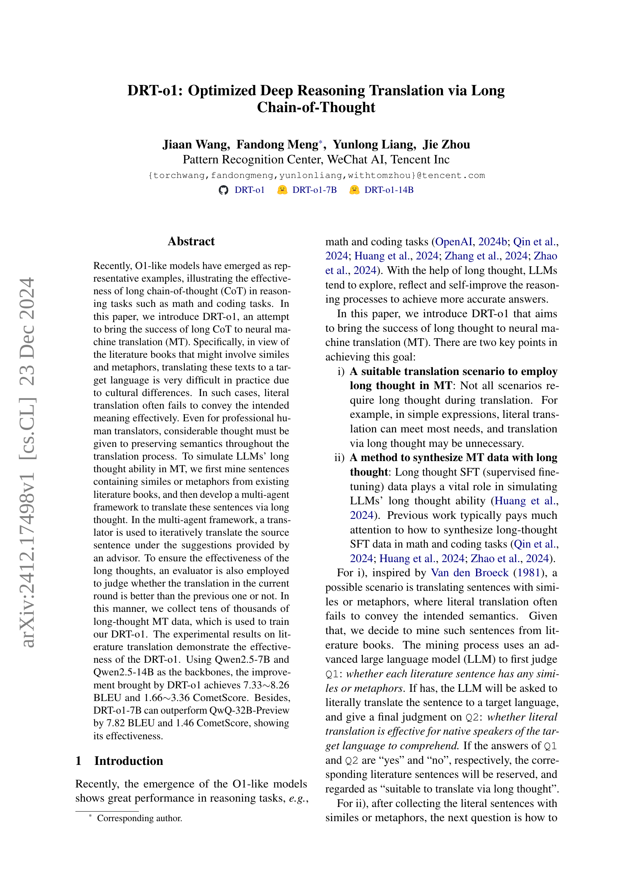
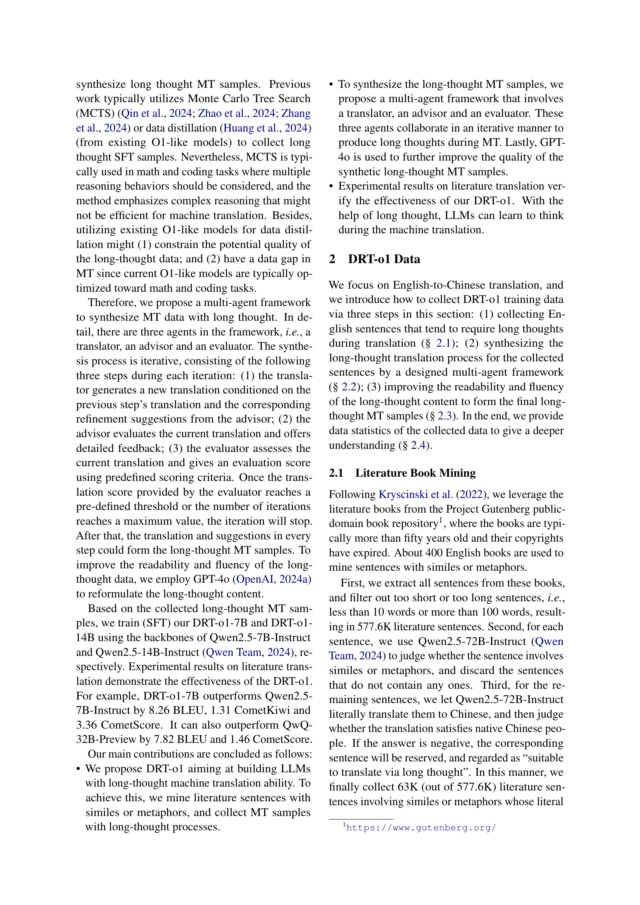
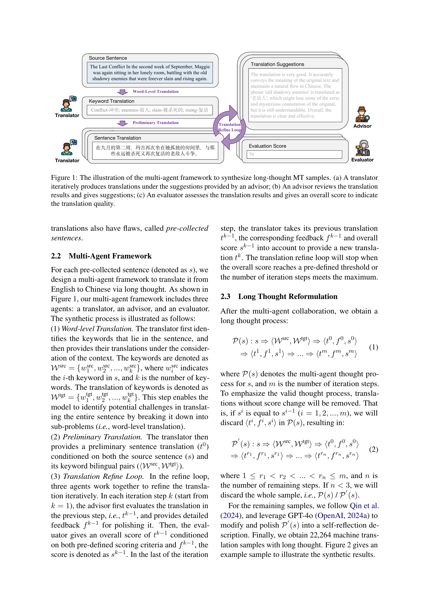
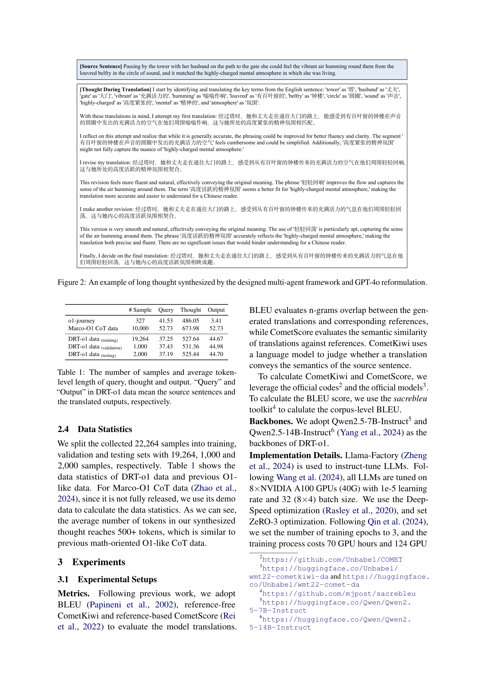
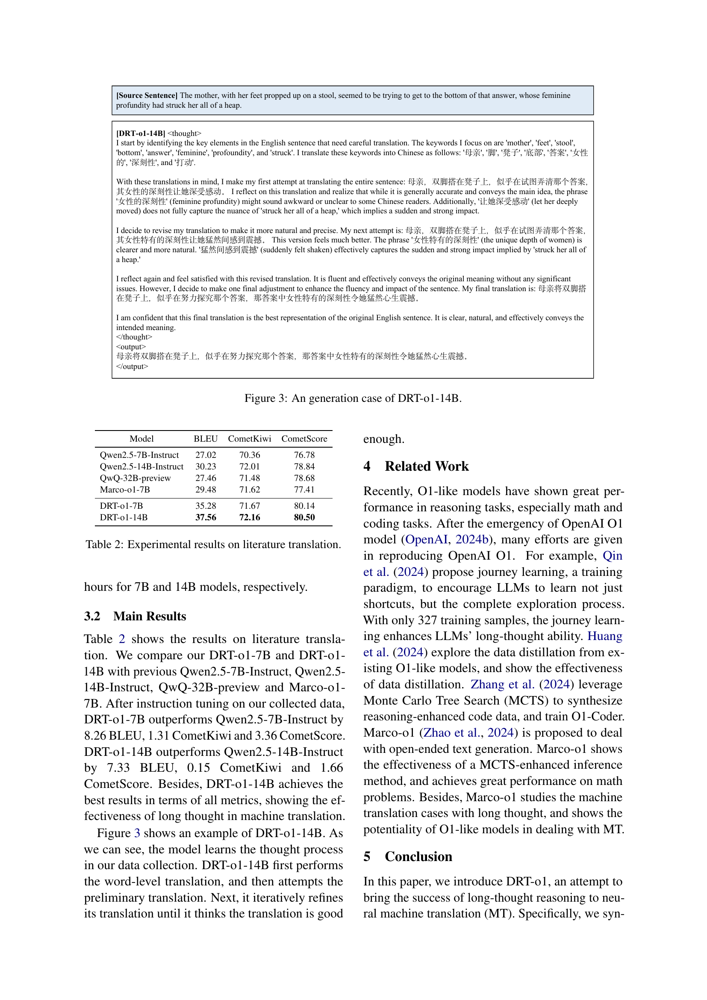
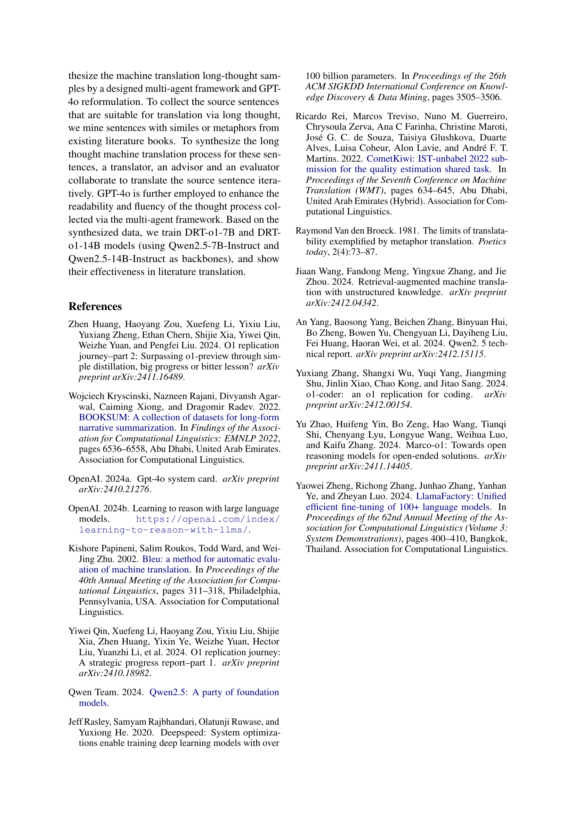

 


 2412.17498 
 Jiaan Wang et el. 
 
 🤗 2024-12-24 
 



↗ arXiv


↗ Hugging Face


↗ Papers with Code


### TL;DR



기계 번역(MT)에서 어려운 점은 직역만으로는 의미를 정확히 전달할 수 없는 경우가 있다는 것입니다. 예를 들어 문학 작품에 자주 등장하는 비유나 은유는 직역하면 오히려 뜻이 왜곡될 수 있습니다. 이런 문제를 해결하기 위해 최근 큰 주목을 받는 것이 바로 '장문의 사고 과정(Long Chain-of-Thought)'입니다. 이는 인간처럼 복잡한 추론 과정을 거쳐 번역하는 방법입니다.

본 논문에서는 이러한 장문의 사고 과정을 기계 번역에 적용한 DRT-01 모델을 제안합니다. DRT-01은 번역가, 조언자, 평가자 세 에이전트가 상호 작용하는 다중 에이전트 프레임워크를 사용하여 문학 작품에서 추출한 문장들을 번역합니다. 이를 통해 엄청난 양의 장문 사고 과정 학습 데이터를 얻을 수 있었고, 이를 바탕으로 DRT-01 모델을 훈련했습니다. 그 결과 기존 모델보다 훨씬 높은 번역 정확도를 달성했습니다.



#### Key Takeaways


 장문의 사고 과정(long chain-of-thought)을 활용하여 기계 번역의 품질 향상 



 문학 작품 번역과 같은 어려운 번역 과제에 효과적인 다중 에이전트 프레임워크 제시 



 DRT-01 모델을 통해 BLEU 및 CometScore 지표에서 우수한 성능 달성 


#### Why does it matter?
이 논문은 **장문의 사고 과정(long chain-of-thought)**을 기계 번역에 적용하여 **번역 품질을 향상**시킨 연구입니다. **문학 작품 번역**과 같이 직역으로는 의미 전달이 어려운 경우에 효과적이며, **다중 에이전트 프레임워크**를 통해 장문의 사고 과정을 학습 데이터로 생성하는 방법을 제시합니다. 기계 번역 분야, 특히 **문맥 이해가 중요한 어려운 번역 과제**에 대한 새로운 해결책을 제시하고 향후 연구의 새로운 방향을 제시할 수 있습니다.  **대규모 언어 모델(LLM)**을 활용한 다양한 응용 연구에 영향을 줄 수 있습니다.

------
#### Visual Insights


|---|---|---|---|---|
| # Sample | Query | Thought | Output |  Dataset |
| 327 | 41.53 | 486.05 | 3.41 | o1-journey |
| 10,000 | 52.73 | 673.98 | 52.73 | Marco-O1 CoT data |
| 19,264 | 37.25 | 527.64 | 44.67 | DRT-o1 data (training) |
| 1,000 | 37.43 | 531.36 | 44.98 | DRT-o1 data (validation) |
| 2,000 | 37.19 | 525.44 | 44.70 | DRT-o1 data (testing) |

> 🔼 표 1은 DRT-01 데이터셋의 통계를 보여줍니다.  샘플 수와 질문(Query), 추론 과정(Thought), 답변(Output)의 평균 토큰 길이를 보여줍니다. 질문은 소스 문장을, 답변은 번역된 결과를 의미합니다.  DRT-01 데이터셋은 다양한 길이의 문장과 추론 과정을 포함하고 있으며, 이는 기존의  Marco-01 CoT 데이터셋과 비교됩니다.
> 

> 
read the caption

> Table 1: The number of samples and average token-level length of query, thought and output. “Query” and “Output” in DRT-o1 data mean the source sentences and the translated outputs, respectively.
> 

### Full paper



