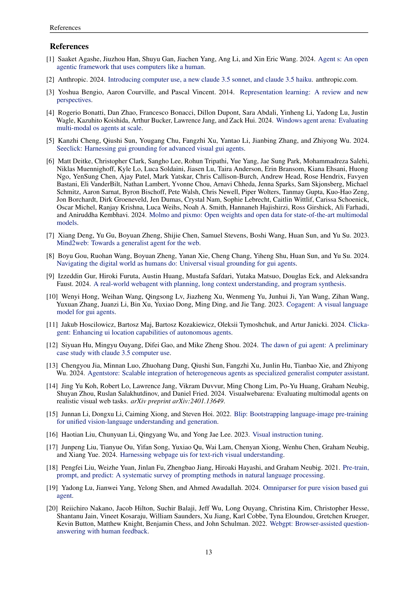
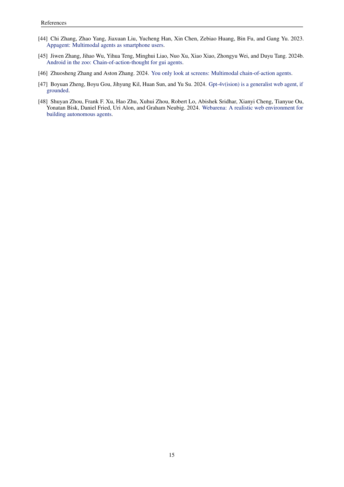
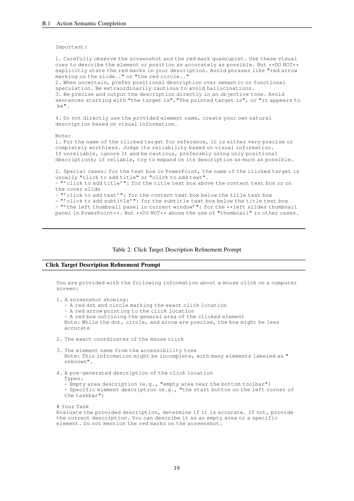

 


 2412.17589 
 Yanheng He et el. 
 
 🤗 2024-12-24 
 



↗ arXiv


↗ Hugging Face


↗ Papers with Code


### TL;DR



현존하는 인공지능 에이전트들은 단순 작업 수행에는 능숙하지만, 인간이 일상적으로 수행하는 복잡한 업무에는 아직 미흡한 수준입니다. 이는 **인간의 복잡한 인지 과정을 효과적으로 포착하고 학습하는 데 어려움**이 있기 때문입니다. 이러한 문제를 해결하기 위해, 본 논문에서는 **PC Agent 라는 새로운 AI 시스템**을 제시합니다.

PC Agent는 **인간-컴퓨터 상호작용 데이터를 효율적으로 수집하는 PC Tracker**, **원시 데이터를 인지 트래젝토리로 변환하는 Cognition Completion 파이프라인**, 그리고 **의사결정을 위한 Planning Agent 와 실행을 위한 Grounding Agent 로 구성된 Multi-agent 시스템**으로 이루어져 있습니다. 실험 결과, PC Agent는 소량의 데이터만으로도 복잡한 디지털 작업을 효과적으로 수행할 수 있음을 보여주었으며,  이는 **인간의 인지 데이터 수집이 고성능 디지털 에이전트 개발에 매우 중요**함을 시사합니다. 본 논문은 **전체 프레임워크를 오픈소스로 공개**하여,  관련 분야의 연구를 더욱 활성화할 것으로 기대됩니다.



#### Key Takeaways


 인간의 인지 과정을 효율적으로 수집하고 AI 에 전이하는 새로운 프레임워크를 제시 



 소량의 고품질 인지 데이터만으로도 복잡한 디지털 작업 수행 가능성을 입증 



 오픈소스 프레임워크 공개를 통해 연구자들의 진입장벽을 낮추고 관련 분야의 발전 촉진 


#### Why does it matter?
본 논문은 **인간의 인지 과정을 AI 에 전이하여 복잡한 디지털 작업을 수행하는 능력있는 디지털 에이전트를 개발**하는 데 중요한 진전을 보여줍니다.  이는 **현재의 AI 에이전트가 단순 작업만 처리하는 한계를 극복**하고, **다양한 응용 분야에서 인간의 생산성을 향상**시킬 수 있는 잠재력을 제시합니다. 특히 **오픈소스 프레임워크 공개**를 통해 연구자들이 더욱 쉽게 연구를 진행하고 발전시킬 수 있도록 지원함으로써, 관련 분야의 발전에 큰 영향을 미칠 것으로 예상됩니다.

------
#### Visual Insights

> 🔼 그림 1은 세 가지 주요 구성 요소로 이루어진 연구 프레임워크를 개괄적으로 보여줍니다. 첫째, PC Tracker는 사용자의 행동과 상태 관찰을 기록하여 사람-컴퓨터 상호 작용 경로를 수집하는 경량 인프라입니다. 둘째, 2단계 인지 완성 과정은 데이터 개선 및 인간 인지 완성(행동 의미와 사고 과정 포함)을 통해 원시 상호 작용 데이터를 풍부한 인지 경로로 변환합니다. 셋째, 다중 에이전트 시스템은 의사 결정을 위한 계획 에이전트와 강력한 시각적 근거를 위한 근거 에이전트로 구성됩니다. 이 그림은 시스템의 전체 아키텍처와 데이터 흐름을 보여주는 개념적 다이어그램입니다.
> 

> 
read the caption

> Figure 1: Overview of our framework, consisting of three key components: (1) PC Tracker, a lightweight infrastructure that collects human-computer interaction trajectories by recording user actions and state observations; (2) a two-stage cognition completion that converts raw interaction data into cognitive trajectories through data refinement and human cognition completion, including action semantics and thought processes; and (3) a multi-agent system comprising a planning agent for action decision-making and a grounding agent for click position grounding.
> 


| Action | Description |
|---|---| 
| *click (x, y)* | clicks at coordinates. |
| *right click (x, y)* | right-click at coordinates. |
| *double click (x, y)* | double-click at coordinates. |
| *press (x, y)* | press mouse down at coordinates. |
| *drag to (x, y)* | drags the mouse to coordinates. |
| *scroll (0, 10)* | scrolls the screen with offset dy = 10. |
| *press key: enter* | presses the Enter key. |
| *hotkey (ctrl, c)* | performs the Ctrl+C hotkey (copy). |
| *type text: hello* | type text “hello”. |
| *wait* | pauses for some time. |
| *finish* | the task is finished. |
| *fail* | the task is failed. |

> 🔼 이 표는 논문의 5.2절인 '인지 완성' 섹션에 있는 '행동 의미 완성' 단계의 첫 번째 단계에서 사용되는 프롬프트를 보여줍니다.  이 프롬프트는 AI 모델이 클릭 대상의 자연어 설명을 생성하는 데 사용됩니다.  표에는 클릭 대상을 설명하기 위한 프롬프트의 세부 정보와 출력 형식이 포함되어 있으며, AI 모델이 클릭 대상을 정확하게 식별하고 설명할 수 있도록 돕는 데 중요한 역할을 합니다.  스크린샷과 클릭 대상의 이름 등 다양한 정보가 입력으로 사용됩니다.
> 

> 
read the caption

> Table 1: Click Target Description Generation Prompt
> 

### In-depth insights

#### Cognition Transfer
본 논문에서 제시하는 '인지 전이(Cognition Transfer)' 개념은 **인간의 인지 과정을 AI 에게 효과적으로 전달하는 핵심 전략**입니다. 단순히 작업(task) 수행을 넘어 복잡한 업무(work) 처리를 가능케 하려면, **컴퓨터 사용 중 인간의 인지 과정을 효율적으로 포착하고 학습**해야 합니다. 이는 단순히 행동 데이터만으로는 불가능하며, 인간의 의사결정 과정, 사고 과정, 그리고 상황 인식 능력을 모두 고려해야 함을 시사합니다.  따라서, PC Tracker 와 같은 경량화된 인프라를 통해 **고품질의 인간-컴퓨터 상호작용 데이터**를 수집하고, **두 단계의 인지 완성 파이프라인**을 통해 상호작용 데이터를 풍부한 인지 경로로 변환하는 것이 중요합니다. 이는 행동 의미와 사고 과정을 완성하여 **AI 가 인간의 인지 과정을 이해하고 모방할 수 있게** 해줍니다.  **데이터 효율성**을 높이고, 진정으로 능력 있는 디지털 에이전트 개발을 위한 장벽을 낮추는 데 기여합니다.  이는 단순한 작업 자동화를 넘어, **AI가 복잡한 디지털 업무를 인간처럼 수행**할 수 있도록 하는 혁신적인 접근 방식입니다.

#### PC Tracker System
PC Tracker 시스템은 연구 논문에서 **인간-컴퓨터 상호작용(HCI) 데이터를 효율적으로 수집**하기 위해 고안된 경량화된 인프라입니다.  **사용자의 키보드 입력과 마우스 동작, 그리고 화면 스크린샷을 실시간으로 기록**하여 인간의 인지 과정과 컴퓨터 작업 사이의 복잡한 상호 작용을 포착합니다. 단순히 행동 데이터만 수집하는 것이 아니라, **상황 정보와 인지적 맥락을 포함**하여 데이터의 질을 높이는 것이 특징입니다. 이를 통해 단순한 작업 수행을 넘어 복잡한 지식 작업의 수행 과정까지 분석하고 학습할 수 있는 풍부한 데이터를 제공합니다.  PC Tracker의 주요 강점은 **경량성과 사용 편의성**으로, 배경에서 실행되기 때문에 사용자의 컴퓨터 사용에 방해가 되지 않고 자연스러운 데이터 수집이 가능합니다. 또한, **확장성과 데이터 투명성**을 갖춰 대규모 데이터 수집 및 관리에 용이하며, 개인 정보 보호를 위해 로컬 저장 및 데이터 시각화 기능을 제공합니다. **다양한 작업 모드**를 제공하여, 특정 작업에 집중된 데이터 수집 뿐만 아니라, 일반적인 컴퓨터 사용 패턴을 분석할 수 있는 데이터까지 확보 가능합니다. 따라서 PC Tracker 시스템은 **AI 에이전트의 발전에 중요한 기반**을 제공할 것으로 기대됩니다.

#### Completion Pipeline
본 논문에서 제시된 'Completion Pipeline'은 단순히 데이터 처리 과정을 넘어 **인간의 인지 과정을 모방하여 디지털 작업의 복잡성을 해결하는 핵심 요소**임을 시사합니다.  이는 단순히 컴퓨터와의 상호작용 데이터를 수집하는 것을 넘어, **행동 이면의 의도와 사고 과정을 추론**하여 인간처럼 **상황 인식과 의사결정을 하는 AI 에이전트를 구축**하기 위한 중요한 전략입니다.  **두 단계로 구성된 파이프라인**은 첫째, 불완전하거나 모호한 상호작용 데이터를 정제하고 표준화하여 데이터 품질을 높이고, 둘째, **LLM(대규모 언어 모델)을 활용하여 행동의 의미론적 완성과 사고 과정을 추론**함으로써 풍부한 인지 경로를 생성합니다. 이를 통해 **데이터 효율성을 극대화**하고, 제한된 양의 고품질 인지 데이터로도 복잡한 디지털 작업 수행이 가능해짐을 보여줍니다. 따라서, Completion Pipeline은 **AI 에이전트의 지능 향상에 결정적인 역할**을 하며, **인간-컴퓨터 상호작용 데이터를 효과적으로 활용하는 새로운 패러다임**을 제시한다는 점에서 매우 중요한 의미를 가집니다.

#### PC Agent: Multi-Agent
PC Agent의 핵심은 **멀티 에이전트 시스템**을 통해 복잡한 디지털 작업을 수행하는 데 있다는 점입니다. 이는 계획 에이전트와 접지 에이전트의 협업으로 이루어집니다. 계획 에이전트는 인간의 인지 과정을 학습하여 **작업 계획**을 세우고, 접지 에이전트는 **GUI와의 상호작용**을 담당합니다. 이러한 분업을 통해 PC Agent는 단순한 작업 수행을 넘어, 복잡하고 다단계적인 작업을 효율적으로 처리할 수 있습니다.  특히 접지 에이전트의 **자체 검증 메커니즘**은 시스템의 안정성과 정확성을 높이며, 인간 수준의 정밀도를 달성할 수 있도록 합니다. **오픈소스 모델**을 기반으로 구축되어 접근성이 높고, 연구 커뮤니티의 발전에 기여할 수 있다는 점도 주목할 만합니다.  하지만, **오류 복구 메커니즘**의 부재는 향후 개선 과제로 남아 있습니다.  향상된 오류 복구 기능을 통해 더욱 강력하고 신뢰할 수 있는 디지털 에이전트로 발전 가능성을 보여줍니다.

#### Future Work
본 논문에서 제시된 PC Agent는 인간의 인지 과정을 효율적으로 모방하여 복잡한 디지털 작업을 수행하는 잠재력을 보여주었지만, **더욱 강력하고 견고한 디지털 에이전트**로 발전시키기 위한 추가 연구가 필요합니다. **장기적인 계획 수립 및 오류 복구 메커니즘** 개선은 에이전트의 안정성과 복잡한 작업 수행 능력을 향상시키는 데 중요합니다. 특히, **마우스 드래그 및 스크롤과 같은 복잡한 마우스 조작에 대한 이해도를 높이고, 추상적인 드래그 동작에 대한 공간적 이해 능력을 향상**시켜야 합니다. 또한, **PC Tracker의 비작업 지향 모드를 통해 수집된 대량의 데이터를 활용하여 사전 훈련을 진행**하고, 사용자의 의도를 추론하는 방법을 개선하여 에이전트의 지능을 향상시킬 수 있습니다. **사용자 친화적인 작업 명세 방식을 연구**하고, 부분적인 설명만으로도 완벽한 요구사항을 추론하거나, 상호작용적인 방식을 통해 작업을 명확하게 하는 방법을 모색해야 합니다.  **실제 업무 환경에 더욱 가까운 종합적인 평가 프레임워크 개발**을 통해, 인간의 선호도, 심미성, 완성도 등 다양한 측면을 고려한 에이전트 성능 평가가 가능해져야 합니다.

### More visual insights

More on figures

> 🔼 PC Tracker는 대규모의 사람-컴퓨터 상호작용 데이터를 효율적으로 수집하기 위한 경량화된 인프라의 핵심 기능을 보여주는 그림입니다.  가볍고 사용하기 쉬운 인터페이스, 확장성, 투명성 및 통합된 액션 공간 등 주요 특징들을 강조합니다.  사용자의 컴퓨터 사용 패턴을 포착하고, AI 에이전트 학습에 필요한 풍부한 데이터를 제공합니다.
> 

> 
read the caption

> Figure 2: Key features of PC Tracker
> 

> 🔼 이 그림은 PC Tracker가 수집한 예시 트래젝토리를 보여줍니다. PC Tracker는 사용자의 컴퓨터 작업 과정을 기록하는 도구이며, 이 그림은 사용자가 새로운 슬라이드를 만들고 제목을 추가하는 간단한 작업을 수행하는 동안의 일련의 이벤트를 보여줍니다. 각 스크린샷은 작업의 특정 시점을 나타내며, 빨간색 표시는 클릭 관련 작업의 위치를 나타냅니다. 이를 통해 사용자의 상호 작용을 시각적으로 보여주고, PC Tracker가 어떻게 사용자의 컴퓨터 작업 과정을 상세하게 기록하는지를 보여줍니다.  스크린샷에는 타임스탬프(event 1, event 2 등)가 표시되어 시간 순서대로 작업이 진행되었음을 알 수 있습니다.
> 

> 
read the caption

> Figure 3: An example trajectory collected by PC Tracker. Red marks on the screenshots indicate the positions of click-related actions.
> 

> 🔼 그림 4는 PC Tracker의 액션 공간 𝒜 를 보여줍니다.  이는 사용자의 컴퓨터 상호 작용을 기록하기 위해 PC Tracker가 사용하는 기본 동작들의 집합입니다.  여기에는 마우스 클릭(좌클릭, 우클릭, 더블클릭), 마우스 드래그, 스크롤, 키 입력, 단축키 사용, 텍스트 입력, 대기, 작업 완료, 작업 실패 등이 포함됩니다. 각 액션은 고유한 의미와 컴퓨터 시스템에 대한 영향을 가지고 있으며, 이 정보는 에이전트 학습 및 행동 이해에 중요한 역할을 합니다.  이러한 액션들의 정의와 구체적인 표현은 PC Tracker가 인간-컴퓨터 상호 작용 데이터를 효율적으로 수집하고 분석하는 데 기반이 됩니다.
> 

> 
read the caption

> Figure 4: Action space 𝒜𝒜\mathcal{A}caligraphic_A of PC Tracker.
> 

> 🔼 그림 5는 PC Tracker가 수집한 원시 키 입력 이벤트를 어떻게 통합하여 'type text: Hello'라는 하나의 통합된 작업으로 변환하는지 보여줍니다.  원시 이벤트는 대문자 변경, 문자 입력, 오타 수정 등 여러 작은 동작들로 구성되어 있지만, PC Tracker는 이러한 작은 동작들을 맥락에 따라 하나의 의미있는 입력 작업으로 묶어서 처리합니다. 이를 통해 인간의 자연스러운 키 입력 행위를 효율적으로 표현하고, 후속적인 인지 처리 과정에서 더욱 효과적인 학습을 가능하게 합니다.
> 

> 
read the caption

> Figure 5: Example of type encapsulation.
> 

> 🔼 그림 6은 PC Tracker가 사용자의 클릭 이벤트에 대한 추가적인 정보를 수집하는 방법을 보여줍니다.  사용자가 Chrome 아이콘을 클릭했을 때 (1161, 1065) 좌표를 `get_element_info_at_position(x, y)` 함수에 전달하면, 해당 함수는 클릭된 요소에 대한 정보 (요소 이름, 경계 상자 좌표 등)를 반환합니다. 이 정보는 후속적인 작업 의미 분석 및 사고 과정 완성 단계에서 사용됩니다.  즉, 단순한 좌표 정보뿐 아니라 클릭된 요소에 대한 풍부한 의미 정보를 얻어 AI 에이전트가 사용자의 의도를 더 정확하게 파악할 수 있도록 돕습니다.  이를 통해 AI 시스템은 단순한 행동 모방을 넘어 사용자의 인지 과정을 더 잘 이해하고 복잡한 작업을 수행할 수 있게 됩니다.
> 

> 
read the caption

> Figure 6: An example of the output from get⁢_⁢element⁢_⁢info⁢_⁢at⁢_⁢position⁡(x,y)get_element_info_at_position𝑥𝑦\operatorname{get\_element\_info\_at\_position}(x,y)start_OPFUNCTION roman_get _ roman_element _ roman_info _ roman_at _ roman_position end_OPFUNCTION ( italic_x , italic_y ) when the user clicks Chrome icon at (1161,1065)11611065(1161,1065)( 1161 , 1065 ).
> 

> 🔼 그림 7은 인간의 상호 작용 과정을 간략하게 보여줍니다. 먼저, 사용자는 주변 환경을 관찰하고 (Observe), 그 관찰 내용을 바탕으로 생각하고 계획을 세웁니다 (Think). 마지막으로, 생각한 내용에 따라 행동을 취합니다 (Act). 이러한 관찰-사고-행동의 순환 과정을 통해 인간은 복잡한 작업을 효율적으로 수행할 수 있습니다. 이 그림은 본 논문의 인간 인지 전이(Cognition Transfer) 개념을 시각적으로 설명하는 데 중요한 역할을 합니다.  인간의 인지 과정을 이해하고 이를 AI 에게 전이시키는 것이 디지털 작업을 수행하는 AI 에게 중요하기 때문에, 이 그림은 논문의 핵심 주장을 잘 보여줍니다.
> 

> 
read the caption

> Figure 7: Natural flow of human interaction: Observe, Think, Act.
> 

> 🔼 이 그림은 PC Tracker의 두 가지 데이터 수집 모드, 즉 작업 지향 모드와 비작업 지향 모드에 대한 개요를 보여줍니다. 작업 지향 모드는 사용자에게 특정 작업을 할당하고 그 과정에서의 상호 작용을 기록하며, 주어진 작업 모드와 자유 작업 모드로 나뉩니다. 비작업 지향 모드는 사용자가 자유롭게 컴퓨터를 사용하는 동안 상호 작용을 기록합니다. 이 그림은 각 모드의 특징과 데이터 수집 방식에 대한 요약 정보를 제공합니다.
> 

> 
read the caption

> Figure 8: An overview of the dual-mode collection design
> 

> 🔼 그림 9는 클릭 동작에 대한 인지 완성 프로세스를 시각적으로 보여줍니다. 왼쪽은 PC Tracker가 기록한 원시 클릭 이벤트를 보여주고, 가운데는 의미론적 완성을 통해 좌표 (717, 387)을 'TripAdvisor 페이지 상단 중앙의 검색 상자'라는 의미있는 설명으로 변환하는 과정을 보여줍니다. 오른쪽은 사고 완성을 통해 이 동작의 사용자 의도, 즉 에펠탑 근처의 높은 평점을 받은 레스토랑을 찾기 위해 검색 범위를 넓히려는 의도를 재구성하는 과정을 보여줍니다.
> 

> 
read the caption

> Figure 9: Visualization of our cognition completion process for a click action. (Left) Raw click event recorded by PC Tracker. (Center) Action semantic completion converts coordinates (717, 387) into a semantic description “the search box at the top center of the TripAdvisor page”. (Right) Thought completion reconstructs the human intention behind this action - finding high-rated restaurants near the Eiffel Tower by broadening the search scope.
> 

> 🔼 그림 10은 PC Agent의 다중 에이전트 워크플로우를 보여줍니다. 계획 에이전트가 처음에 존재하지 않는 요소인 '이미지' 버튼을 클릭하려고 시도하면 접지 에이전트가 이를 보고합니다. 계획 에이전트는 이 피드백을 받으면 계획을 재구성하고, 접지 에이전트는 새로운 클릭 대상의 좌표를 생성합니다. 이 워크플로우는 에이전트 간의 오류 수정 메커니즘을 보여줍니다.  계획 에이전트는 작업을 분석하고 다음 동작을 결정하는 역할을 하고, 접지 에이전트는 클릭 좌표를 생성하고 클릭 동작을 수행하는 역할을 합니다. 접지 에이전트가 계획 에이전트의 요청대로 클릭을 수행하지 못하면(예를 들어, 해당 요소가 없을 경우), 계획 에이전트는 새로운 계획을 세우고 접지 에이전트에게 다시 요청합니다. 이러한 과정을 통해 에이전트 간의 상호 작용을 통해 오류를 수정하고 안정적인 작업 수행을 가능하게 합니다.
> 

> 
read the caption

> Figure 10: Illustration of multi-agent workflow. The planning agent initially attempts to click a nonexistent element The ‘Images’ button, which is reported by the grounding agent. Upon receiving this feedback, the planning agent reformulates its plan, and the grounding agent generates coordinates of the new click target. The workflow illustrates the error correction mechanism between agents.
> 

> 🔼 그림 11은 본 논문에서 제안하는 PC Agent의 계획 에이전트를 훈련시키는 데 사용되는 데이터의 예시를 보여줍니다.  이 그림은 질의와 응답의 구조를 보여주는 것으로,  질의에는 시스템 프롬프트, 작업 설명, 이전 단계의 동작 및 생각 과정 등이 포함되고,  응답에는 생각 과정과 다음 수행할 동작이 포함됩니다. 이러한 데이터 구조는 모델이 인간의 인지 과정을 학습하고 복잡한 컴퓨터 작업을 수행하는 데 도움이 됩니다.  시스템 프롬프트는 에이전트가 수행해야 하는 작업의 전반적인 맥락을 제공하며, 작업 설명은 에이전트가 완료해야 하는 특정 작업을 명확하게 정의합니다.  이전 단계의 동작 및 생각 과정은 에이전트가 이전에 수행한 작업과 그 이유에 대한 정보를 제공하여 에이전트가 현재 상황에 대한 전체적인 이해를 갖도록 도와줍니다.  마지막으로 응답은 에이전트가 다음에 수행할 동작과 그 이유에 대한 정보를 제공합니다. 이러한 데이터 구조는 모델이 인간의 사고 과정을 학습하여 복잡한 컴퓨터 작업을 효율적으로 수행하도록 돕습니다.
> 

> 
read the caption

> Figure 11: Training data example showing query and response structure.
> 

> 🔼 그림 12는 접지 에이전트의 자체 검증 메커니즘을 보여줍니다. 접지 에이전트는 클릭 대상의 설명과 스크린샷을 입력받아 좌표를 생성하고, 시스템 API를 사용하여 요소 정보를 가져옵니다.  좌표가 스크린샷의 대상과 일치하는지 확인하고, 불일치 시 자체 검증을 통해 오류를 수정하고 다시 시도합니다. 이 과정은 시각적 접지의 정확성을 높이고, 에이전트가 스크린의 요소를 정확하게 클릭할 수 있도록 보장합니다.  스크린샷에 표시된 빨간색 표시는 클릭 위치를 나타냅니다.
> 

> 
read the caption

> Figure 12: Illustration of the grounding agent’s self-validation mechanism.
> 

More on tables


| Click Target Description Generation Prompt |
|---|---|---|---|---|
| Screenshot with a red mark quadruplet: Frame: rectangular border around the target (may be inaccurate) Circle: circle at the center of the target Point: dot marking the exact click position Arrow: pointing to the target | The name of the clicked target for reference. It's just for reference. If this name is "Unknown" or appears to be incorrect, just ignore it.  | Description Rules: Priority Order: Highest: Circle, Point and Arrow Second: Reference name (if reliable) Lowest: Frame | Description Strategy: A. For Clear GUI Elements: Include position info ("top", "left", "center", etc.) if possible Use visual information to describe the element Refer to the provided element name if reliable Examples: ✓ "the button in the top-right corner of the window" ✓ "the current tab at the top of the browser" ✕ "the red circle" (red marks doesn't belong to the original screenshot or element) | B. For Empty Areas or Uncertain Elements: Focus on positional relationships Use visual information to locate the position Examples: ✓ "empty area on the right side of the window" ✓ "area near the bottom toolbar" | Prohibited: No speculation about element functions No uncertain terms like "seems", "appears", "probably" No description of elements outside the frame | Output Format: For GUI elements: "{position description} + {element description}" For empty areas: "empty area + {position descriptions}" | Examples: ✓ "the close button in the top-right corner of the window" ✓ "the ‘Chrome’ icon on the desktop" ✓ "the left thumbnail panel in current window" ✓ "the ‘Images’ tab below the search bar" ✓ “click to add title†✓ "the button in the top-right corner of the browser" (when the reference name is not reliable and you are unsure about the element) ✕ "what appears to be a settings button" (avoid speculation) |
> 🔼 이 표는 클릭 대상에 대한 설명을 개선하기 위한 프롬프트를 보여줍니다.  프롬프트는 클릭 위치를 정확하게 나타내는 스크린샷, 클릭 위치의 좌표, 접근성 트리에서 가져온 요소 이름, 그리고 클릭 위치에 대한 미리 생성된 설명을 포함합니다.  이러한 정보를 바탕으로, 모델은 미리 생성된 설명의 정확성을 평가하고, 필요한 경우 더 정확한 설명을 제공해야 합니다.  잘못된 설명을 수정하거나, 빈 영역을 명확히 하거나, 특정 요소에 대한 설명을 제공할 수 있습니다.
> 

> 
read the caption

> Table 2: Click Target Description Refinement Prompt
> 


| Important: |
|---|---| 
| 1. Carefully observe the screenshot and the red mark quadruplet. Use these visual cues to describe the element or position as accurately as possible. But **DO NOT** explicitly state the red marks in your description. Avoid phrases like "red arrow marking on the slide.." or "the red circle..".  | 2. When uncertain, prefer positional description over semantic or functional speculation. Be extraordinarily cautious to avoid hallucinations. |
| 3. Be precise and output the description directly in an objective tone. Avoid sentences starting with "the target is", "The pointed target is", or "it appears to be". | 4. Do not directly use the provided element name, create your own natural description based on visual information. |
| Note: |
|---|---| 
| 1. For the name of the clicked target for reference, it is either very precise or completely worthless. Judge its reliability based on visual information. If unreliable, ignore it and be cautious, preferably using only positional descriptions; if reliable, try to expand on its description as much as possible. | 2. Special cases: for the text box in PowerPoint, the name of the clicked target is usually "click to add title" or "click to add text".
- ‘click to add title’: for the title text box above the content text box or on the cover slide
- ‘click to add text’: for the content text box below the title text box
- ‘click to add subtitle’: for the subtitle text box below the title text box
- ‘the left thumbnail panel in current window’: for the **left slides thumbnail panel in PowerPoint**. But **DO NOT** abuse the use of "thumbnail" in other cases. |
> 🔼 본 표는 논문의 5.2절, 인지 완성(Cognition Completion) 단계에서 사용되는 프롬프트를 보여줍니다.  더 자세히 설명하자면, 이 단계는 원시적인 상호작용 데이터를 풍부한 인지 경로로 변환하는 과정의 일부입니다.  이 표에 제시된 프롬프트는 인간의 사고 과정을 재구성하여 AI 시스템이 복잡한 컴퓨터 작업을 수행하는 데 필요한 인지적 맥락을 제공합니다. 프롬프트는 작업에 대한 설명, 이전 단계, 이후 단계, 현재 행동, 그리고 해당 행동을 취하기 직전의 스크린샷을 포함하여 모델이 인간의 의사결정 과정을 이해하고 재구성할 수 있도록 다차원적인 정보를 제공합니다.
> 

> 
read the caption

> Table 3: Thought Process Completion Prompt
> 


| Click Target Description Refinement Prompt |
|---|---|---|---|---|
| 1. A screenshot showing:   - A red dot and circle marking the exact click location   - A red arrow pointing to the click location   - A red box outlining the general area of the clicked element   Note: While the dot, circle, and arrow are precise, the box might be less accurate | 2. The exact coordinates of the mouse click | 3. The element name from the accessibility tree   Note: This information might be incomplete, with many elements labeled as "unknown". | 4. A pre-generated description of the click location   Types:   - Empty area description (e.g., "empty area near the bottom toolbar")   - Specific element description (e.g., "the start button on the left corner of the taskbar") | # Your Task   Evaluate the provided description, determine if it is accurate. If not, provide the correct description. You can describe it as an empty area or a specific element. Do not mention the red marks on the screenshot |
> 🔼 표 4는 논문의 그림 14에 해당하는 PowerPoint 프레젠테이션 제작 작업에 대한 자세한 설명을 담고 있습니다. 그림 14는 PC Agent가 생성한 PowerPoint 슬라이드의 예시를 보여주는 이미지입니다. 표 4에서는 각 슬라이드의 제목, 부제목, 내용, 그리고 추가적인 이미지 삽입 및 웹 검색 등의 작업 지침을 상세히 기술하여, PC Agent의 작업 수행 과정을 이해하는 데 도움을 줍니다.  표의 내용은 PC Agent가 실제로 수행한 작업 단계를 보여주는 상세한 지시 사항으로 구성되어 있습니다. 이를 통해 PC Agent가 복잡한 다단계 작업을 얼마나 정확하게 수행할 수 있는지를 보다 명확하게 파악할 수 있습니다.
> 

> 
read the caption

> Table 4: The task description for Figure 14
> 

### Full paper



