 


 2412.17606 
 Risa Shinoda et el. 
 
 🤗 2024-12-30 
 



↗ arXiv


↗ Hugging Face


↗ Papers with Code


### TL;DR



현재 대규모 Figure QA 데이터셋 구축에는 많은 노력과 비용이 필요하며, **LLM 기반 합성 방법**은 오류 발생 및 유사한 이미지 생성과 같은 문제점이 존재합니다.  본 연구는 이러한 문제를 해결하기 위해 **단계적 합성 방식**을 제안합니다.  먼저, **LLM을 이용하여 다양한 차트의 시각화 데이터를 생성하고, 이를 기반으로 오류 없는 Python 코드를 통해 이미지를 생성하며, 마지막으로 다시 LLM을 통해 질문과 답변 쌍을 생성합니다.**

본 논문은 **SBS Figures**라는 새로운 대규모 합성 Figure QA 데이터셋을 제시합니다. 이 데이터셋은 **100만 개의 이미지와 정밀한 주석 및 QA 쌍**을 포함하며, 기존 방법에 비해 **다양성과 효율성이 뛰어납니다.** 또한, **실제 차트 데이터를 사용한 실험 결과**를 통해 SBS Figures를 사용한 사전 학습이 **실제 세계 데이터에 대한 모델 성능을 크게 향상**시키는 것을 확인했습니다.  본 연구는 **데이터셋, 코드, 프롬프트 및 모델을 모두 공개**하여 후속 연구를 위한 접근성을 높였습니다.



#### Key Takeaways


 단계적 합성 파이프라인을 통해 오류 없이 다양한 차트 이미지와 정밀한 QA 쌍을 효율적으로 생성 



 대규모 합성 데이터셋(SBS Figures)을 활용한 사전 학습으로 실제 차트 데이터가 제한적인 상황에서도 높은 성능 달성 



 데이터셋, 코드, 프롬프트, 모델을 공개하여 Figure QA 분야 연구의 효율성 증대 및 접근성 향상 


#### Why does it matter?
본 논문은 **합성 데이터를 사용한 효율적인 사전 학습 방법**을 제시하여, **실제 데이터가 부족한 상황에서도 높은 성능의 이미지 질의응답 모델을 훈련**할 수 있게 합니다.  이는 **비전-언어 모델 연구에 큰 영향**을 미칠 뿐만 아니라, **다양한 분야의 이미지 데이터 활용을 위한 새로운 가능성**을 열어줍니다.  특히, **효율적인 데이터 생성 파이프라인**과 **대규모 합성 데이터셋**의 공개를 통해 **추후 연구에 대한 접근성 향상**에도 기여합니다.

------
#### Visual Insights

> 🔼 그림 1은 SBS Figures 데이터셋 생성 과정과 그 특징을 보여줍니다. SBS Figures는 단계별 합성 이미지 기반의 그림 질의응답(Figure QA) 사전학습 데이터셋으로, 실제 차트 데이터에 대한 강력한 사전 학습 효과를 제공합니다. 그림은 데이터 생성 단계(데이터, 그림, 질의응답), 각 단계의 특징(다양한 주제, 오류 없는 코드, 수동 주석 없음), 그리고 최종 결과물인 대규모 Figure QA 데이터셋을 시각적으로 보여줍니다.  단계별 합성 과정을 통해 다양한 주제와 외형의 그림을 효율적으로 생성하고, 오류를 최소화하며, 수동 주석 작업 없이도 정밀한 질의응답 쌍을 생성할 수 있음을 강조합니다.
> 

> 
read the caption

> Figure 1: SBS Figures (Stage-by-Stage Synthetic Figures). We create SBS Figures, a dataset for pre-training figure QA. Our stage-by-stage synthetic dataset creation enables a strong pre-training effect for real-world chart data.
> 


| Dataset | human | aug. | avg |
|---|---|---|---| 
| Scratch | 31.28 | 77.76 | 54.42 |
| FigureQA [Kahou et al. (2018)](https://arxiv.org/html/2412.17606v1#bib.bib8) | 13.44 | 9.36 | 11.40 |
| DVQA [Kafle et al. (2018)](https://arxiv.org/html/2412.17606v1#bib.bib7) | 26.88 | 72.16 | 49.52 |
| PlotQA [Methani et al. (2020)](https://arxiv.org/html/2412.17606v1#bib.bib18) | 30.56 | 74.00 | 52.28 |
| SBS Figures (Ours) | **39.44** | **82.24** | **60.84** |

> 🔼 이 표는 SBS Figures 데이터셋을 Donut 모델을 사용하여 다른 합성 데이터셋들과 비교하여 사전 학습 효과를 보여줍니다.  SBS Figures를 포함한 모든 데이터셋은 Donut 모델로 학습되었으며,  각 데이터셋의 사전 학습 결과(human, augmented, average)를 비교하여 SBS Figures의 효과를 보여줍니다.  다른 합성 데이터셋들과 비교하여 SBS Figures가 얼마나 효과적인 사전 학습 효과를 제공하는지 수치적으로 확인할 수 있습니다.
> 

> 
read the caption

> Table 1:  Comparison of the pre-training effect of SBS Figures with other synthetic datasets. All datasets were trained using the Donut model.
> 

### In-depth insights

#### Synth QA Dataset
본 논문에서 제시된 합성 QA 데이터셋은 **대규모 피규어 QA 데이터 구축의 어려움을 해결하기 위해** 제안되었습니다. 기존의 수작업 기반 데이터셋 구축 방식은 많은 시간과 노력이 필요하며, 데이터의 다양성과 질도 보장하기 어렵다는 한계가 있습니다. 이에 따라 본 논문에서는 **단계별 합성(Stage-by-Stage) 방식**을 통해 피규어 이미지와 QA 쌍을 자동으로 생성하는 파이프라인을 제시합니다. 이는 **LLM(Large Language Model)을 활용하여 데이터 생성, 피규어 렌더링, QA 생성 등의 과정을 자동화**함으로써 효율성을 높이고, 다양한 주제와 시각적 스타일의 피규어 데이터를 생성하는 것을 목표로 합니다.  **오류 없는 코드 생성 및 정확한 QA 쌍 생성**을 위해 파이프라인의 각 단계를 세분화하여 관리하며, 생성된 데이터는 실제 세계 데이터셋과의 비교 평가를 통해 그 효과를 검증합니다.  **본 합성 데이터셋은 기존의 한계를 극복하고, 피규어 QA 모델의 효율적인 학습을 가능하게 하는 중요한 기여**를 할 것으로 기대됩니다.

#### Stagewise Synthesis
본 논문에서 제시된 **단계적 합성(Stagewise Synthesis)** 방법은, 기존의 단일 단계 합성 방식의 한계를 극복하기 위해 고안되었습니다.  **단계별로 데이터 생성, 그림 렌더링, 질의응답 생성을 분리**하여 각 단계의 오류를 최소화하고, **다양한 주제와 시각적 스타일의 그림과 정확한 어노테이션을 효율적으로 생성**하는 데 중점을 둡니다.  **LLM을 활용한 데이터 생성과 사전 정의된 파이썬 코드를 이용한 그림 렌더링**은 코드 오류를 줄이고 확장성을 높이며, 생성된 데이터를 활용하여 **정확한 질의응답 쌍을 생성**합니다. 이러한 **단계적 접근 방식**은 **데이터 다양성을 확보**, **오류를 최소화**, **생성 효율성을 극대화**하는 데 기여합니다.  결과적으로, **실제 데이터에 대한 사전 훈련 효과를 크게 향상**시키는 대규모의 합성 데이터셋을 구축할 수 있게 합니다.

#### Pre-train Effects
본 논문에서 제시된 SBS Figures 데이터셋의 사전 학습 효과는 **다양한 종류의 차트와 시각적 스타일을 포함하는 방대한 양의 합성 데이터**를 통해 입증됩니다.  **실제 차트 데이터에 대한 강력한 사전 학습 효과**를 보이며, 제한된 실제 데이터만으로도 효율적인 학습을 가능하게 합니다.  특히, **다양한 질문 유형과 복잡한 추론 능력을 요구하는 질문들에 대해서도 높은 성능**을 보이는 것은 주목할 만합니다.  이는 **합성 데이터 생성 파이프라인의 효율성과 질적 우수성**을 보여주는 중요한 결과이며,  **추후 비슷한 연구의 발전에 큰 기여**를 할 것으로 예상됩니다.  단순히 이미지와 텍스트 쌍만 생성하는 것이 아니라 **데이터의 정확성과 일관성을 확보**하여 질 높은 QA 쌍을 생성하는 점이 중요한 차별점입니다.  **데이터셋 구성 요소들의 영향**에 대한 분석을 통해,  시각적 다양성, QA 품질, 학습 과제 등이 사전 학습 효과에 미치는 영향을 체계적으로 분석한 점도 높이 평가할 수 있습니다.

#### Ablation Studies
본 논문의 **절제 연구(Ablation Studies)**는 합성 데이터셋의 다양한 요소들이 모델 사전 학습에 미치는 영향을 체계적으로 분석합니다.  **외관(Appearance)**, **과제(Task)**, **QA 질(Quality)**, **프롬프트(Prompt)**, **이미지 수(Number of Images)** 다섯 가지 측면에서 실험을 진행하여 각 요소의 중요성을 정량적으로 평가합니다.  **결과적으로, 데이터셋의 다양성과 질이 모델 성능에 큰 영향을 미침을 확인**하고,  **특히 질 높은 QA 쌍의 생성과 다양한 시각적 요소를 갖춘 이미지의 사용이 중요함**을 제시합니다.  이는 사전 학습 과정에서 **합성 데이터셋의 설계 및 구성 전략이 모델 성능 향상에 직결됨**을 보여주는 중요한 결과입니다.  **본 연구는 단순한 성능 비교를 넘어, 합성 데이터셋 구성 요소의 영향을 분석함으로써 향후 더욱 효과적인 합성 데이터셋 생성에 대한 중요한 지침을 제공**합니다.

#### Future Works
본 논문에서 제시된 SBS Figures 데이터셋과 생성 파이프라인은 **합성 데이터를 이용한 효율적인 Figure QA 사전 학습**에 대한 중요한 발걸음을 내딛었습니다. 하지만,  향후 연구 방향으로는 몇 가지 흥미로운 가능성이 존재합니다.  **다양한 유형의 차트 및 그래프 지원 확장**, **더욱 정교한 QA 쌍 생성을 위한 LLM 모델 개선**, **실제 세계 데이터셋과의 비교 분석 및 성능 향상** 연구가 필요합니다. 특히, **합성 데이터의 한계점을 보완하기 위한 실제 세계 데이터와의 결합 전략** 마련은 중요한 과제입니다. 또한, **다양한 언어 및 문화권에 대한 확장성 연구**를 통해 SBS Figures의 활용성을 더욱 높일 수 있습니다. 마지막으로, **생성된 Figure QA 데이터의 질적 향상을 위한 엄격한 평가 지표 개발 및 새로운 평가 방법론 연구**는 향후 연구의 중요한 방향이 될 것입니다.

### More visual insights

More on figures

> 🔼 그림 2는 SBS Figures 데이터셋 생성 파이프라인을 보여줍니다.  SBS Figures는 완전한 합성 방식으로 만들어졌습니다. 먼저, 숫자, 텍스트, 색상 정보를 모두 포함하는 JSON 형식의 시각화 데이터를 생성합니다. 다음으로, 미리 정의된 오류 없는 파이썬 스크립트를 사용하여 이 데이터로부터 그림 이미지를 생성합니다. 마지막으로, OCR 없이 시각화 데이터에서 정확하고 밀도 높은 질문과 답변 쌍을 생성합니다.
> 

> 
read the caption

> Figure 2: Generation pipeline of SBS Figures. SBS Figures was created using a fully synthetic method. First, we generate the visualization data, represented in JSON format, containing complete numbers, text, and colors. Next, we produce figure images from this data using pre-defined, error-free Python scripts. Finally, we generate dense and accurate QA pairs from visualization data without the need for OCR.
> 

> 🔼 그림 3은 SBS Figures 데이터셋 생성 파이프라인에서 사용된 프롬프트 템플릿을 보여줍니다. JSON 데이터와 질의응답(QA) 생성 모두에 대해 일관된 형식을 보장하기 위해 퓨샷 프롬프팅 기법을 채택했습니다. 효율성을 높이기 위해 파이프라인에는 컨텍스트와 프롬프트를 반복적으로 조정하는 코드가 포함되어 있습니다.  즉, 그림 생성 과정에서 LLM이 생성하는 데이터와 코드의 형식을 일관되게 유지하고, 생성되는 이미지와 QA 쌍의 다양성을 확보하기 위해 여러 예시를 보여주는 퓨샷 학습 방식을 사용했다는 것을 의미합니다.  반복적인 컨텍스트와 프롬프트 조정은 LLM이 생성하는 결과물의 품질을 높이고, 더 효율적으로 대규모 데이터셋을 생성하는 데 기여합니다.
> 

> 
read the caption

> Figure 3: Prompt templates used in the generation pipeline of SBS Figures. We adopt few-shot prompting to ensure consistent formatting for both JSON data and QA generation. To improve efficiency, our pipeline includes code that repeatedly adjusts the context and prompts during the generation process.
> 

> 🔼 그림 4는 SBS Figures 데이터셋의 질문-응답(QA) 쌍의 예시를 보여줍니다. 다양한 시각적 요소(폰트, 색상, 마커 등)의 조합으로 2,000가지 이상의 시각적 변형을 가진 여러 그래프가 포함되어 있습니다.  각 그래프에 대해서는, 복잡한 추론 능력이 필요한 정확하고 풍부한 QA 쌍이 생성됩니다.  이 그림은 SBS Figures 데이터셋이 다양한 시각적 스타일과 복잡한 추론 문제를 다루는 QA 쌍을 생성하는 능력을 보여줍니다.
> 

> 
read the caption

> Figure 4: Example of SBS Figures QA pairs. The figures show diverse visual variations, with each data content containing around 2,000 combinations of visual components. Additionally, our pipeline generates dense and precise QA pairs, requiring complex reasoning skills to address the questions.
> 

> 🔼 그림 5는 SBS Figures 데이터셋의 주제 분포를 보여줍니다. 각 차트 유형에서 무작위로 10개의 질문을 선택하고, 해당 질문에 대한 그림의 주제를 수동으로 분석하여 분류했습니다. 이를 통해 SBS Figures 데이터셋이 다양한 주제 영역을 포괄적으로 다루고 있음을 시각적으로 확인할 수 있습니다.  각 부채꼴의 크기는 해당 주제의 질문 개수에 비례합니다.
> 

> 
read the caption

> Figure 5: Theme distribution of SBS Figures. We randomly select 10 questions from each figure type and manually analyze the topic of the figure.
> 

> 🔼 그림 6은 본 논문에서 제안하는 SBS Figures 데이터셋으로 사전 훈련된 Donut 모델이 복잡한 추론 질문에 답하는 능력을 보여줍니다.  Donut 모델은 이미지와 텍스트를 함께 이해하는 다중 모달 모델로,  SBS Figures 데이터셋을 사용하여 사전 훈련함으로써 그림에 대한 이해도를 높였습니다. 그림은 모델의 추론 과정을 보여주는데, 올바른 답변은 녹색으로, 잘못된 답변은 빨간색으로 강조 표시되어 있습니다.  이를 통해 모델의 추론 능력과 데이터셋의 효과를 시각적으로 확인할 수 있습니다.
> 

> 
read the caption

> Figure 6: Qualitative Comparison. Our pre-trained Donut model on SBS Figures demonstrates its ability to answer complex reasoning questions. Incorrect answers are highlighted in red, while correct answers are highlighted in green.
> 

> 🔼 이 그림은 SBS Figures 데이터셋에 포함된 질문과 답변(QA) 쌍의 유형 분포를 보여줍니다. 100개의 QA 쌍을 무작위로 선택하여 수동으로 분석한 결과입니다. 각 QA 쌍의 유형은 질문의 내용과 답변 방식에 따라 분류되었으며, 그림은 각 유형의 QA 쌍이 전체 데이터셋에서 차지하는 비율을 시각적으로 나타냅니다. 이를 통해 SBS Figures 데이터셋의 다양성과 질문 유형의 분포를 파악할 수 있습니다.  특히, 데이터 시각화의 다양한 측면을 아우르는 다양한 질문 유형들이 포함되어 있음을 보여줍니다.
> 

> 
read the caption

> Figure 7: QA distribution of SBS Figures. We randomly selected 100 QAs and manually analyzed their QA types.
> 

> 🔼 그림 8은 SBS Figures 데이터셋의 다양한 차트 유형과 그에 해당하는 질문과 답변의 예시들을 보여줍니다.  각 차트는 다양한 시각적 스타일을 가지고 있으며, 질문들은 단순한 정보 추출을 넘어 차트 데이터에 대한 복합적인 추론 능력을 요구하는 수준입니다. 이 그림은 SBS Figures 데이터셋의 질문 유형의 다양성과 질문들의 난이도를 보여주는 대표적인 예시들을 제시합니다.  각 차트 유형별로 여러 예시들이 포함되어 있으며, 이는 모델의 일반화 능력 평가에 유용하게 활용될 수 있습니다.
> 

> 
read the caption

> Figure 8: Examples of SBS Figures figure images and QA pairs.
> 

More on tables


| Model | human | aug. | avg |
|---|---|---|---| 
| VisionTaPas (Masry et al., 2022) | 29.60 | 61.44 | 45.52 |
| T5 (Raffel et al., 2020) | 25.12 | 56.96 | 41.04 |
| VL-T5 (Cho et al., 2021) | 26.24 | 56.88 | 41.56 |
| Donut (Kim et al., 2022) | 31.28 | 77.76 | 54.42 |
| Donut+SBS Figures (Ours) | **39.20** | **81.20** | **60.84** |
| Pix2Struct (Lee et al., 2023) | 35.92 | 85.92 | 60.92 |
| Pix2Struct+SBS Figures (Ours) | **41.84** | **87.20** | **64.52** |
> 🔼 표 2는 SBS Figures 데이터셋으로 사전 훈련된 모델과 다른 모델들의 성능을 비교한 표입니다.  단순히 캡션만으로는 내용을 충분히 이해하기 어렵기 때문에, 표에 제시된 모델들(VisionTaPas, T5, VL-T5, Donut, Pix2Struct)의 성능을 human, augmented, average 세 가지 지표로 비교하여 SBS Figures 사전 훈련의 효과를 보여줍니다.  각 모델의 성능은 ChartQA 데이터셋에서 평가되었으며,  SBS Figures로 사전 훈련된 Donut 및 Pix2Struct 모델의 성능 향상이 두드러집니다.  이를 통해 SBS Figures 데이터셋이 실제 세계의 차트 데이터를 이용한 효율적인 학습을 가능하게 함을 보여줍니다.
> 

> 
read the caption

> Table 2:  Comparison of the model pre-trained on our SBS Figures to other models.
> 


| Table 3: (F1) Appearance. | Randomize |  | ✓ | 
|---|---|---| 
| human | 33.44 | **35.92** | 
| aug. | 80.16 | **80.48** | 

| Table 4: (F2) Pre-training task. |  | JSON | QA | 
|---|---|---| 
| human | 31.44 | **35.92** | 
| aug. | 79.12 | **80.48** | 

| Table 5: (F3) QA quality. |  | Template | Gemma | GPT-3.5 | GPT-4o | 
|---|---|---|---|---| 
| human | 30.00 | 31.52 | **35.92** | 34.56 | 
| aug. | 77.92 | 79.04 | 80.48 | **81.84** |
> 🔼 표 8은 SBS Figures 사전 학습의 효과를 PlotQA 및 FigureQA 작업에 대해 평가한 결과를 보여줍니다.  모든 사전 학습 및 미세 조정은 Donut 모델을 사용하여 수행되었습니다.  표에는 사전 학습 없이 수행된 결과(Scratch)와 SBS Figures를 사전 학습한 후 수행된 결과가 비교되어 있습니다.  PlotQA 및 FigureQA 데이터셋의 두 가지 버전(V1, V2)에 대한 결과가 제시되어 SBS Figures 사전 학습이 두 데이터셋 모두에서 성능 향상에 기여했음을 보여줍니다.
> 

> 
read the caption

> Table 8:  Evaluation of the pre-training effect of SBS Figures on the PlotQA and FigureQA tasks. All pre-training and fine-tuning were conducted using the Donut model.
> 


| Randomize |  | ✓ |
|---|---|---|
| human | 33.44 | **35.92** |
| aug. | 80.16 | **80.48** |
> 🔼 표 9는 UniChart 추론 모델에 대한 SBS Figures의 사전 학습 효과를 단계별로 평가한 결과를 보여줍니다. ChartQA 데이터셋(human 및 aug.)을 사용하여 평가했습니다.  즉, SBS Figures 데이터셋으로 사전 학습시킨 모델과 그렇지 않은 모델의 성능을 ChartQA 데이터셋의 Human 및 Augmented 두 가지 분할에 대해 비교 분석하여 사전 학습 효과를 측정한 표입니다. 단계별 학습을 통해 SBS Figures 사전 학습의 효과를 더욱 명확히 보여주고자 하였습니다.
> 

> 
read the caption

> Table 9:  Evaluation of the pretraining effect of our SBS Figures for the UniChart reasoning training based on steps. We evaluate on ChartQA dataset (human∣∣\mid∣aug.).
> 


|       | JSON | QA |
| :---: | :---: | :---: |
| human | 31.44 | **35.92** |
| aug.  | 79.12 | **80.48** |
> 🔼 표 10은 SBS Figures 데이터셋을 Donut 모델로 사전 훈련시켰을 때 다른 합성 데이터셋들과 비교한 결과를 보여줍니다.  각 데이터셋의 이미지 수와 질문-답변 쌍의 수를 비교하여 SBS Figures의 사전 훈련 효과를 정량적으로 평가합니다.  Donut 모델을 사용하여 모든 데이터셋을 동일한 조건에서 훈련시켰기 때문에, 표는 SBS Figures의 사전 훈련 효과가 다른 합성 데이터셋에 비해 얼마나 효과적인지를 명확하게 보여줍니다.  즉,  이미지의 수와 질문/답변 쌍의 수의 차이를 통해 SBS Figures가 얼마나 풍부하고 효율적인 데이터셋인지를 보여주는 표입니다.
> 

> 
read the caption

> Table 10:  Comparison of the pre-training effect of SBS Figures with other synthetic datasets. All datasets were trained using the Donut model.
> 

### Full paper


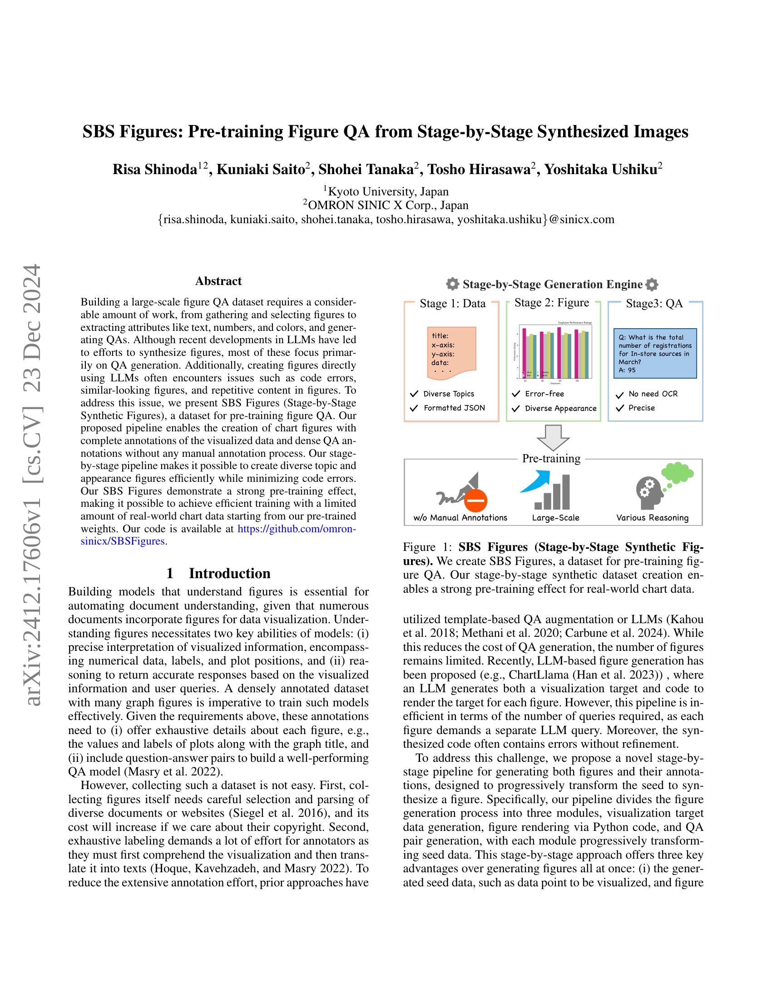
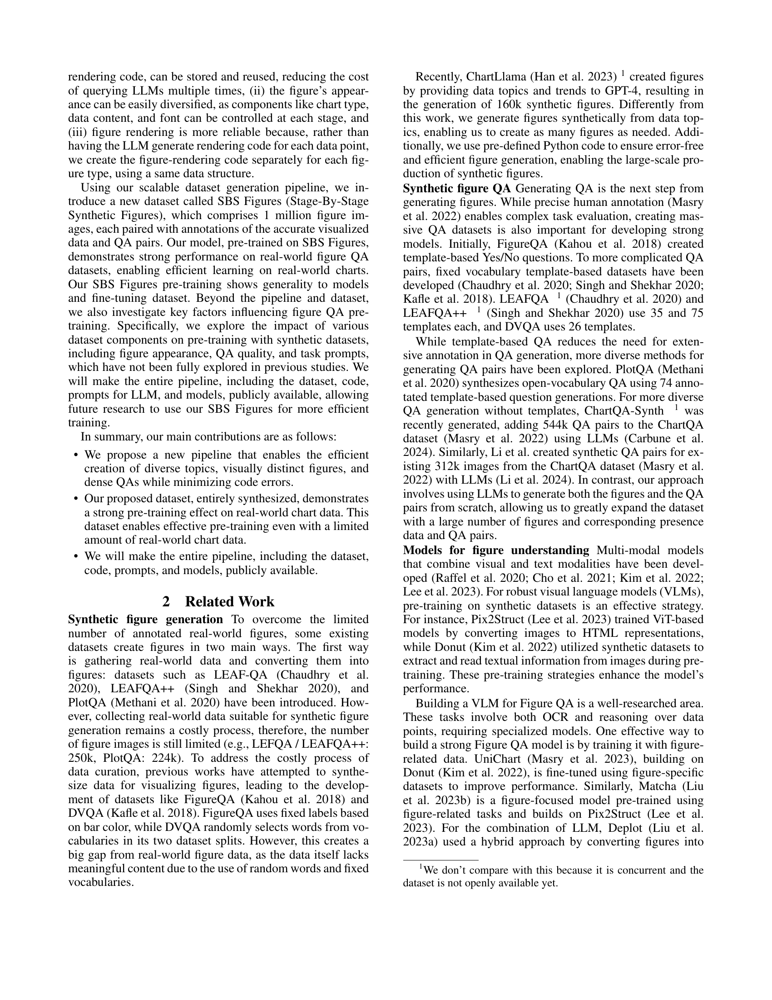
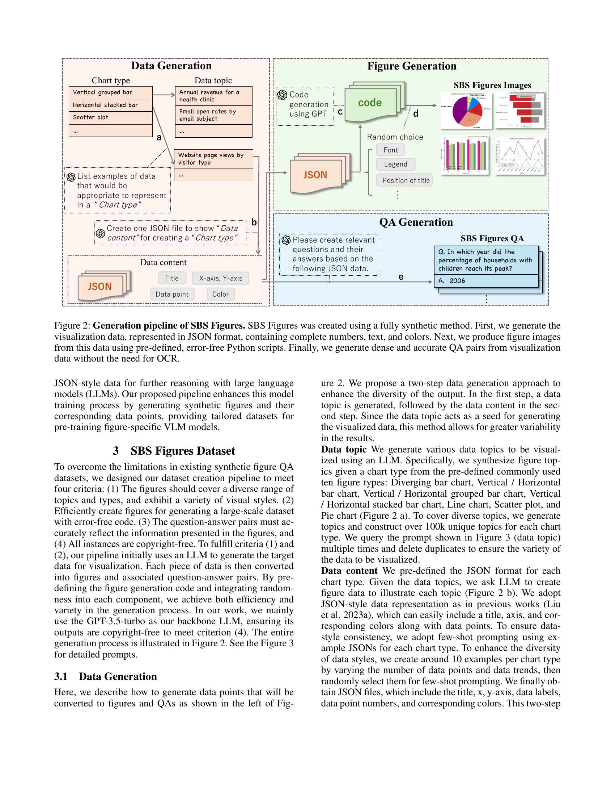
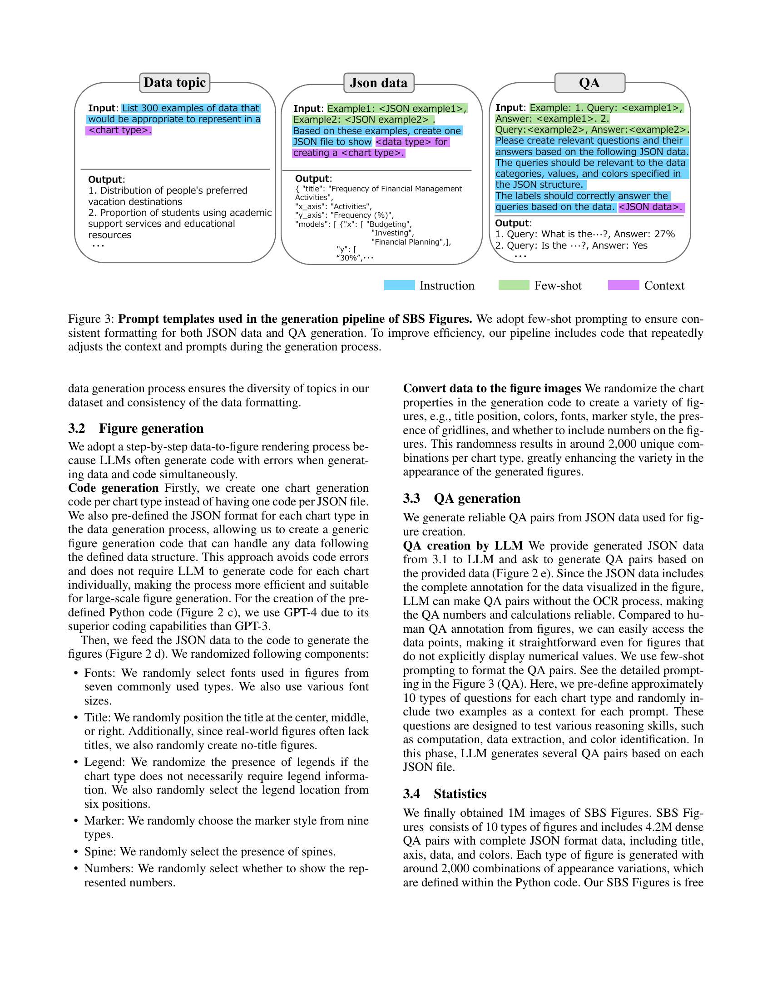
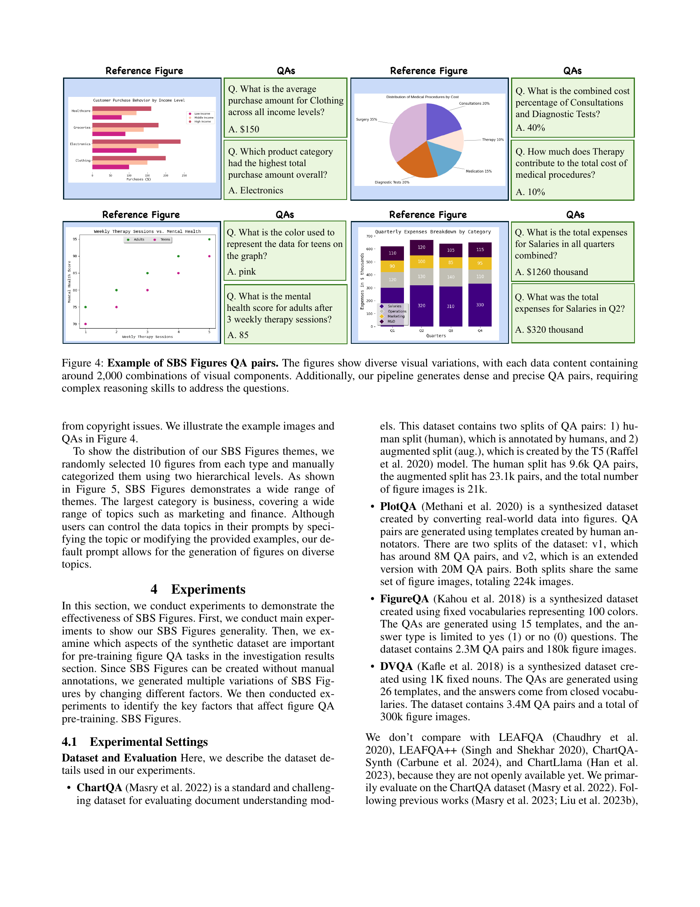
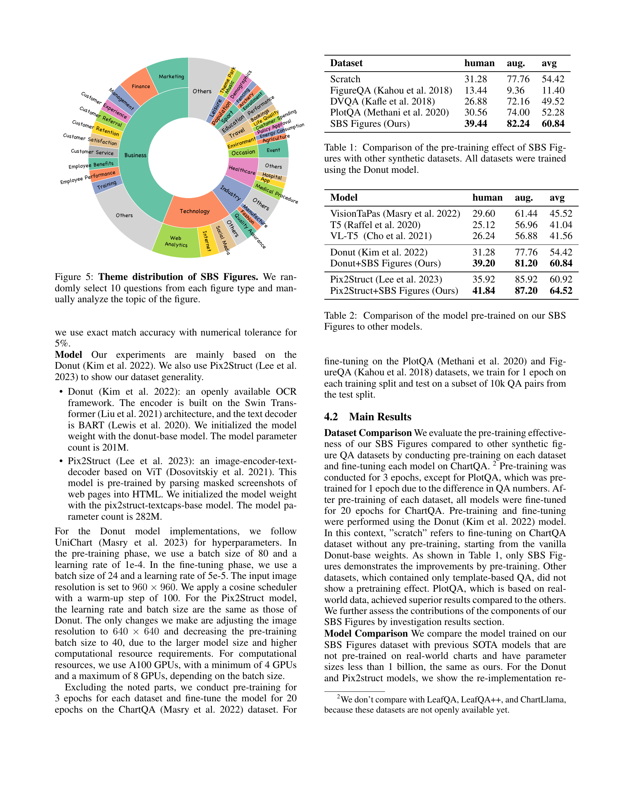
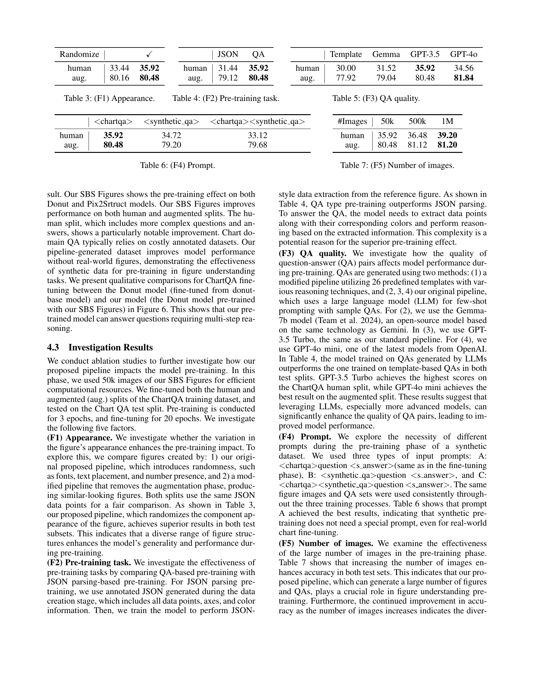
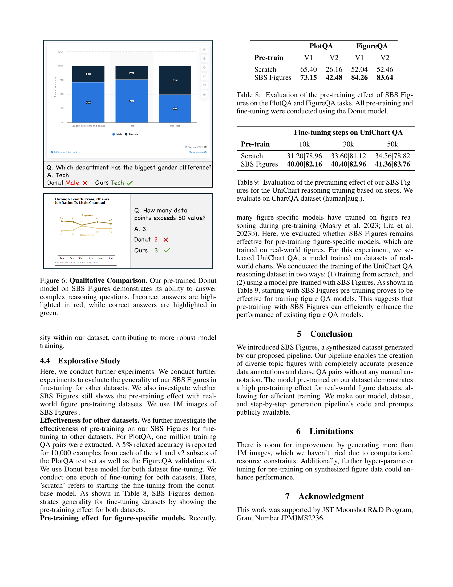
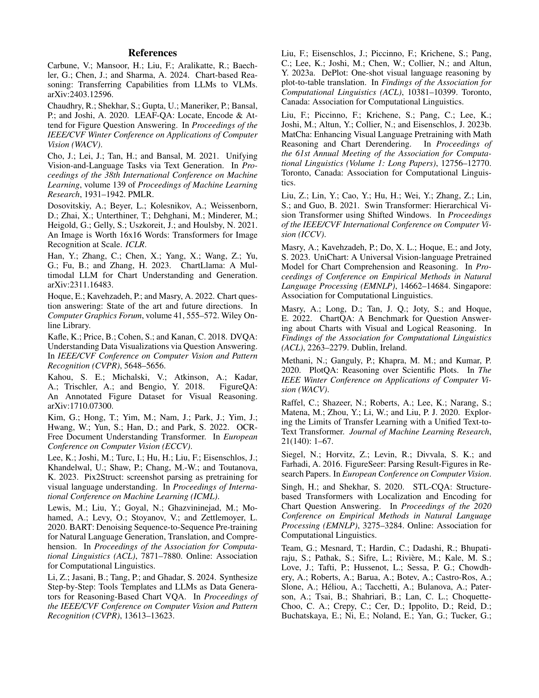
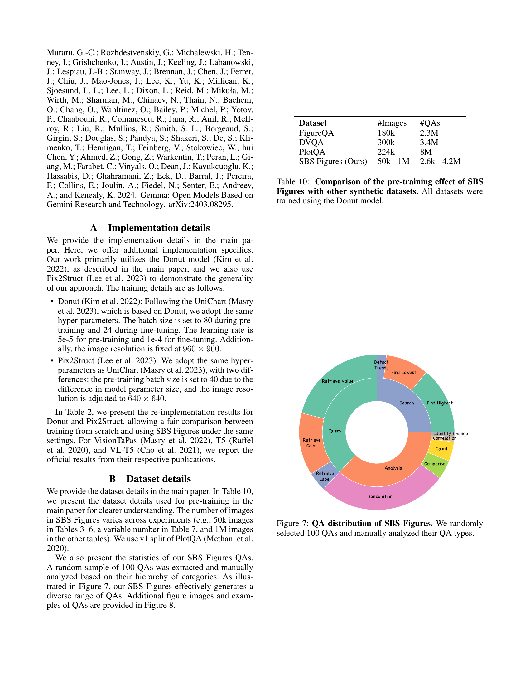
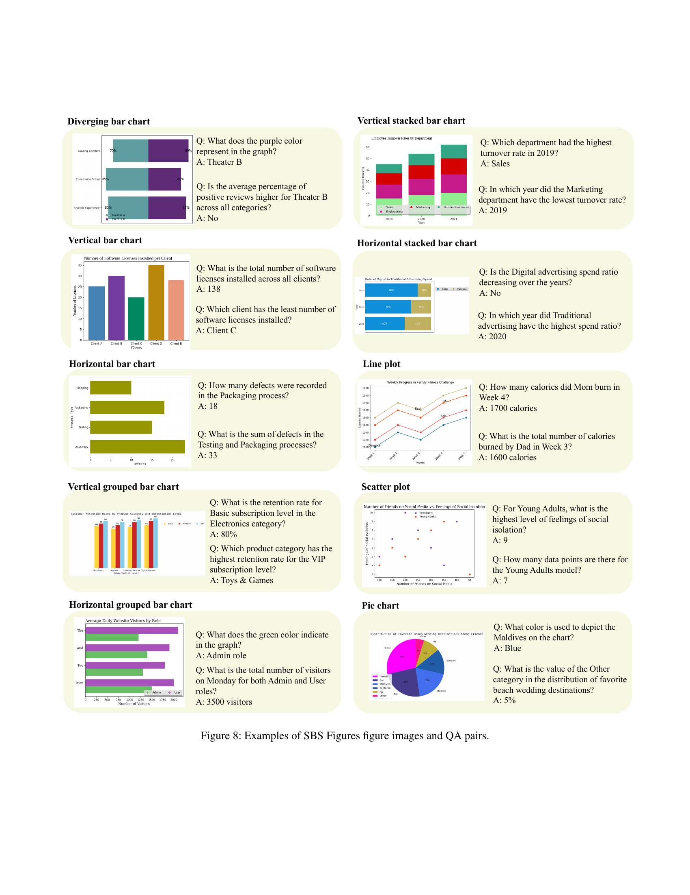
