 


 2412.17739 
 Ermo Hua et el. 
 
 🤗 2024-12-25 
 



↗ arXiv


↗ Hugging Face


↗ Papers with Code


### TL;DR



많은 최근 연구들은 회전 위치 임베딩(RoPE)을 개선하여 언어 모델(LM)의 문맥 길이를 늘리는 데 집중하고 있습니다. 하지만, 기존 RoPE 기반 어텐션 메커니즘은 선형 계층과 활성화 함수로 인해 스펙트럼 손상이 발생하고, 이로 인해 긴 문맥 길이에 대한 일반화 성능이 저하되는 문제가 있습니다. 이는 특히 긴 시퀀스에 대한 어텐션의 주기성을 해치기 때문입니다.

본 연구는 이러한 문제를 해결하기 위해, 이산 신호 처리 이론을 활용하여 RoPE의 작동 원리를 주파수 영역에서 분석하고, **FoPE(Fourier Position Embedding)** 라는 새로운 위치 임베딩 기법을 제시합니다. FoPE는 어텐션의 주파수 영역 특성을 강화하여 주기적 확장을 개선하고, 스펙트럼 손상으로 인한 부정적인 영향을 완화합니다.  **실험 결과는 다양한 모델 크기와 컨텍스트 창에서 FoPE가 ROPE와 ALiBi보다 더 안정적인 성능을 보임을 보여줍니다.**



#### Key Takeaways


 FoPE는 RoPE의 주기적 확장을 강화하여 긴 문맥 길이에 대한 일반화 성능을 향상시킵니다. 



 주파수 영역 분석을 통해 RoPE의 한계와 스펙트럼 손상 문제를 규명하고, 이를 해결하는 FoPE의 작동 원리를 제시합니다. 



 다양한 모델 크기와 데이터셋에서 FoPE의 우수성을 실험적으로 검증하고, 이는 장문 처리를 위한 언어 모델 연구에 기여합니다. 


#### Why does it matter?
본 논문은 **긴 문맥 길이에 대한 언어 모델의 일반화 능력을 향상시키는 새로운 위치 임베딩 기법인 FoPE**를 제시합니다.  이는 기존 RoPE의 한계를 극복하고 다양한 모델 크기에서 안정적인 성능을 보여줌으로써, **장문 처리를 위한 언어 모델 연구에 중요한 발전**을 가져올 수 있습니다. 또한, 이 연구는 **주파수 영역 분석을 통해 RoPE의 작동 원리를 밝히고,  스펙트럼 손상 문제에 대한 해결책을 제시**하여, 관련 분야의 이론적 이해를 높이는 데 기여합니다.  **향후 연구 방향으로는 FoPE를 다른 모델 아키텍처나 과제에 적용하는 연구, 스펙트럼 손상 문제에 대한 추가적인 분석** 등이 있습니다.

------
#### Visual Insights

> 🔼 이 그림은 Passkey Retrieval 작업에서 다양한 모델 크기(60M, 180M, 1.2B)와 시퀀스 길이에 따른 정확도를 보여줍니다. Passkey Retrieval 작업은 긴 텍스트 내에서 짧은 Passkey(5자리 숫자)를 찾는 작업입니다.  그래프는 시퀀스 길이가 증가함에 따라 모델의 정확도가 어떻게 변하는지 보여주며,  FoPE(Fourier Position Embedding) 기반 모델이 다른 방법(ROPE, ALiBi)에 비해 더 긴 시퀀스에서도 높은 정확도를 유지함을 시각적으로 나타냅니다.  높은 정확도는 더 높은 값으로 표시됩니다.
> 

> 
read the caption

> (a) Accuracy on Passkey Retrieval (higher is better)
> 

### In-depth insights

#### RoPE's Periodic Limits
RoPE(Rotary Position Embedding)는 언어 모델의 긴 문맥 이해를 위한 효과적인 방법으로 주목받았지만, **주기성(periodicity)에 기반한 한계**를 지닙니다.  **긴 시퀀스 길이에 대한 일반화 성능 저하**는 주기적 패턴의 제한으로 인해 발생하는데, 이는 모델이 학습 데이터의 주기적 특성에 과적합될 가능성과 밀접하게 관련 있습니다.  따라서, **학습 데이터의 시퀀스 길이를 벗어나는 긴 문맥에 대한 일반화 능력이 부족**해집니다.  이러한 한계를 극복하기 위한 연구는 주기성을 완화하거나 주기적 패턴 이외의 정보를 추가적으로 활용하는 방향으로 진행될 것으로 예상됩니다.  **다양한 시퀀스 길이에 대한 로버스트한 성능**을 확보하는 것은 앞으로 RoPE 기반 언어 모델 연구의 중요한 과제입니다.

#### FoPE's Frequency Focus
FoPE의 주파수 집중은 **긴 문맥 길이 일반화를 위한 주파수 영역 특성 개선**에 초점을 맞춘 핵심 전략입니다.  기존 RoPE의 주기적 어텐션 메커니즘을 **이산 신호 처리 이론**을 통해 분석하여, 선형층과 활성화 함수가 주파수 영역에 손상을 일으킨다는 점을 밝혔습니다.  이러한 손상은 주파수 성분들의 혼합(스펙트럼 누출)과 부정확한 주파수 정보 표현(스펙트럼 왜곡)을 야기하며, 긴 문맥에 대한 일반화 성능을 저하시킵니다. FoPE는 각 차원을 단일 주파수 함수가 아닌 **다중 주파수 푸리에 급수**로 모델링하여 이러한 문제를 해결합니다.  **저주파수 영역의 부정확한 훈련된 성분 제거**를 통해 주기적 확장을 더욱 강화하고, 모델의 견고성을 높입니다.  결과적으로, FoPE는 다양한 모델 크기와 작업에서 안정적인 성능을 유지하며, 긴 문맥 길이에서도 효과적인 어텐션 메커니즘을 제공합니다.

#### Spectrum Damage Effects
본 논문에서 다룬 스펙트럼 손상 효과는 **Rotary Position Embedding (RoPE)** 기반 어텐션 메커니즘의 성능 저하를 야기하는 주요 원인으로 제시됩니다.  RoPE는 주파수 영역에서의 주기적 확장을 통해 긴 문맥을 처리하지만, 선형층이나 활성화 함수 등 어텐션 메커니즘 외부 요소들이 **스펙트럼 누출 및 왜곡**을 일으켜 주파수 성분 간 혼합을 발생시키고, **주기적 확장을 저해**하는 것으로 분석됩니다.  또한, 어텐션 내부에서도 훈련이 충분히 되지 않은 저주파수 성분이 **스펙트럼 손상**을 유발하며, 이는 긴 문맥 처리에 있어 불안정성을 초래합니다.  따라서, 스펙트럼 손상 효과에 대한 이해는 **긴 문맥에 대한 일반화 성능을 개선**하기 위한 핵심적인 요소이며,  본 논문에서 제안하는 FoPE와 같은 해결책의 중요성을 강조합니다.

#### Extending Context Length
연구는 **문맥 길이 확장**이라는 중요한 문제에 대해 심도 있게 다룹니다. 기존 언어 모델의 한계를 극복하기 위해 **주요 기술적 혁신**을 제시하며, 이를 통해 더 긴 문맥을 효과적으로 처리하는 방법을 제시합니다. 특히, **주파수 영역 분석**을 기반으로 주기적 확장을 강화하는 새로운 방법을 제안하여, 기존 방식의 한계를 극복하고 성능을 향상시킵니다.  **실험 결과**는 제안된 방법의 우수성을 보여주며, 다양한 모델 규모와 데이터셋에 적용 가능성을 시사합니다.  하지만, **한계점**으로는 제안된 방법의 복잡성 및 계산 비용 증가 가능성, 그리고 특정 데이터셋에 대한 과적합 가능성 등이 언급됩니다. 따라서, 향후 연구에서는 이러한 한계점들을 보완하고, 더욱 **범용적이고 효율적인 문맥 길이 확장** 기술을 개발하는 것이 중요할 것으로 예상됩니다.  **추가 연구**로는 다양한 모델 구조와 응용 분야에 대한 적용 가능성 검토, 그리고 계산 효율성 향상을 위한 최적화 기법 연구 등이 필요합니다.

#### Generalization Analyses
본 논문의 "일반화 분석" 부분에서는 제안된 방법의 **일반화 성능**을 다각적으로 평가하는 실험 결과가 제시될 것입니다.  **다양한 길이의 시퀀스**에 대한 성능 비교를 통해 긴 문장 처리 능력을 평가하고, **다른 모델 크기**에서의 성능 변화를 분석하여 확장성을 검증할 것입니다. 또한, **다른 데이터셋**을 사용한 실험을 통해 일반화 능력을 확인하고, **다양한 하이퍼파라미터** 설정에 따른 성능 변화를 분석하여 최적 설정을 찾는 과정을 제시할 것입니다.  특히, 기존 방법들과의 비교를 통해 **제안된 방법의 우수성**을 객관적으로 보여주는 데 중점을 둘 것입니다.  이를 통해, 제안된 방법의 **범용성과 실용성**을 입증하고, **장문 처리 모델의 일반화 문제** 해결에 기여하는 바를 명확히 제시할 것으로 예상됩니다.

### More visual insights

More on figures

> 🔼 그림 (b)는 C4 데이터셋을 사용하여 측정된 perplexity를 보여줍니다. perplexity는 언어 모델이 문장을 얼마나 잘 예측하는지를 나타내는 지표로, 값이 낮을수록 모델의 성능이 좋음을 의미합니다. 이 그래프는 서로 다른 길이의 시퀀스에 대해 세 가지 다른 모델(FoPE, ROPE, ALiBi)의 perplexity를 비교하여, 각 모델의 길이 일반화 성능을 보여줍니다.  다양한 모델 크기(60M, 180M, 1.2B)에 따른 perplexity 변화를 시퀀스 길이에 따라 비교 분석하여, FoPE가 다양한 길이의 시퀀스에 대해 더욱 안정적인 perplexity를 유지함을 보여줍니다.
> 

> 
read the caption

> (b) Perplexity on C4 (lower is better)
> 

> 🔼 그림 1은 최대 시퀀스 길이 512로 학습된 모델의 정확도와 퍼플렉서티를 시퀀스 길이에 따라 보여줍니다.  세 가지 크기의 모델 (60M, 180M, 1.2B 매개변수)에 대해, FoPE, ROPE, ALiBi 세 가지 위치 임베딩 방법의 성능을 비교합니다. 패스키 검색 작업(정확도)과 C4 데이터셋(퍼플렉서티)에서의 결과를 보여주며, FoPE가 다양한 시퀀스 길이에 대해 더 안정적인 성능을 보이는 것을 보여줍니다.
> 

> 
read the caption

> Figure 1: Training with max_seq_length=512.
> 

> 🔼 그림 2는 RoPE의 주기적 확장이 저하되는 이유와 FoPE가 이러한 문제를 해결하여 길이 일반화를 개선하는 방법을 보여줍니다. (a)는 신호가 선형 및 비선형 변환을 통과할 때 스펙트럼 누수 및 왜곡이 발생하여 여러 주파수가 단일 차원으로 혼합되는 것을 보여줍니다. RoPE는 각 차원을 단일 주파수 구성 요소로 취급하는 반면, FoPE는 각 차원을 서로 다른 주파수 구성 요소의 푸리에 급수로 모델링하여 정보를 보다 효과적으로 분리하고 스펙트럼 손상을 완화합니다. (b)는 FoPE가 주기적 확장에 해로운 훈련이 부족한 주파수 구성 요소를 제거하는 방법을 보여줍니다. 영 주파수 구성 요소만 유지함으로써 FoPE는 주기적 확장을 보호하고 더욱 강력한 길이 일반화를 제공합니다.
> 

> 
read the caption

> Figure 2: The reasons why RoPE’s periodic extension deteriorates and how FoPE addresses these issues to improve length generalization. (a) As signals pass through linear and nonlinear transformations, this causes spectral leakage and distortion, mixing multiple frequencies into a single dimension. Under RoPE, each dimension is treated as a single-frequency component. By contrast, FoPE models each dimension as a Fourier series of different frequency components, thereby separating information more effectively and mitigating spectral damage. (b) FoPE eliminates inadequately trained frequency components, which are harmful for periodic extension. By preserving only the zero-frequency component, FoPE safeguards periodic extension and delivers more robust length generalization.
> 

> 🔼 이 그림은 Passkey Retrieval 작업에서의 정확도를 보여줍니다. Passkey Retrieval이란 긴 문맥에서 짧은 암호(5자리 숫자)를 찾는 작업입니다.  x축은 시퀀스 길이(문맥의 길이)를 나타내고, y축은 정확도를 나타냅니다. 정확도가 높을수록 모델이 긴 문맥에서도 암호를 정확하게 찾는다는 것을 의미합니다.  다양한 크기의 모델(60M, 180M, 1.2B)에 대한 결과를 비교하여, 제시된 방법(FoPE)이 다른 방법들(ROPE, ALiBi)에 비해 긴 문맥에서도 더 높은 정확도를 유지함을 보여줍니다.
> 

> 
read the caption

> (a) Accuracy on Passkey Retrieval (higher is better)
> 

> 🔼 그림 (b)는 C4 데이터셋에 대한 perplexity를 보여줍니다. perplexity는 언어 모델이 문장 내 단어들을 얼마나 잘 예측하는지를 나타내는 지표이며, 값이 낮을수록 모델의 성능이 좋음을 의미합니다. 이 그래프는 서로 다른 모델 크기(60M, 180M, 1.2B)와 서로 다른 위치 임베딩 기법(FoPE, ROPE, ALiBi)을 사용했을 때의 perplexity를 시퀀스 길이에 따라 비교 분석한 결과를 보여줍니다.  다양한 시퀀스 길이에 따른 perplexity 변화를 통해 각 위치 임베딩 기법의 성능과 일반화 능력을 평가할 수 있습니다. 특히 긴 시퀀스에 대한 성능 저하 정도를 확인하여 모델의 확장성을 판단하는 데 도움이 됩니다.
> 

> 
read the caption

> (b) Perplexity on C4 (lower is better)
> 

> 🔼 그림 3은 FoPE의 길이 외삽 성능을 보여줍니다. 최대 시퀀스 길이 512로 학습된 모델을 YARN과 FoPE를 사용하여 최대 시퀀스 길이 1024의 코퍼스에 대해 외삽합니다.  이를 통해 FoPE가 기존 모델의 최대 시퀀스 길이를 초과하는 긴 시퀀스에 대해서도 성능을 유지하는지 확인합니다.  그림은 Passkey Retrieval 정확도와 C4 코퍼스의 perplexity를 보여주는 여러 그래프로 구성되어, FoPE의 성능을 ROPE, ALiBi와 비교 분석합니다.
> 

> 
read the caption

> Figure 3: Effectiveness of FoPE in length extrapolation. Starting point models trained with a maximum sequence length of 512 are extrapolated using YARN and FoPE on a corpus with a maximum sequence length of 1024.
> 

> 🔼 그림 4는 Gutenberg Books 데이터셋으로 최대 시퀀스 길이 512를 사용하여 사전 훈련된 모델을 C4 검증 세트에서 평가한 결과를 보여줍니다. FoPE는 서로 다른 데이터 분포에서도 일반화 능력을 보여줍니다.  즉, 다른 데이터셋으로 훈련했음에도 불구하고 C4 데이터셋에서도 좋은 성능을 유지함을 의미합니다. 이는 모델의 일반화 성능이 데이터셋에 크게 의존하지 않음을 시사합니다.
> 

> 
read the caption

> Figure 4: Training with max_seq_length=512 on Gutenberg Books and evaluating on a validation set of C4, FoPE also demonstrates its ability to generalize across different data distributions.
> 

> 🔼 그림 5(a)는 FoPE의 두 가지 하위 모듈, 즉 푸리에 급수(FS)와 영점 절단(CF)의 영향을 분석한 결과를 보여줍니다.  푸리에 급수는 각 차원을 단일 주파수 함수로 처리하는 기존 ROPE와 달리 다중 주파수 함수로 모델링하여 주파수 영역 특성을 개선합니다.  영점 절단은 학습이 부족한 저주파수 성분을 제거하여 주기적 확장을 방해하는 스펙트럼 손상을 완화합니다.  실험 결과는 두 기법 모두 길이 일반화에 기여하지만, 두 기법을 결합했을 때 더욱 효과적임을 보여줍니다. 특히, 푸리에 급수는 길이 일반화에 더 큰 영향을 미치며, 영점 절단은 현재 데이터셋과 시퀀스 길이에 대한 적합성을 높입니다.  이는 스펙트럼 손상이 길이 일반화에 상당한 영향을 미치고, 영점 주파수 성분이 가장 중요한 정보를 담고 있음을 시사합니다.
> 

> 
read the caption

> (a) Ablation for different sub-methods
> 

> 🔼 이 그림은 FoPE 모델의 하이퍼파라미터 σ(시그마) 값을 변화시켰을 때의 성능 변화를 보여줍니다. σ는 FoPE에서 Undertrained Frequency Components를 제거하는 정도를 결정하는 파라미터입니다. 그림은 서로 다른 σ 값에 따른 perplexity 비율과 Passkey Retrieval 정확도의 변화를 보여주는 그래프로, σ 값의 변화에 따른 모델 성능의 민감도를 분석하는 데 사용됩니다.  x축은 시그마 값을 나타내며, y축은 perplexity 비율 또는 Passkey Retrieval 정확도를 나타냅니다. 다양한 시퀀스 길이에 대한 결과를 보여줌으로써, σ 값이 모델의 성능에 미치는 영향을 다각적으로 분석합니다.
> 

> 
read the caption

> (b) Ablation for different σ𝜎\sigmaitalic_σ
> 

> 🔼 이 그림은 FoPE 모델의 하이퍼파라미터 D(주파수의 수)가 성능에 미치는 영향을 보여줍니다. D값을 변화시키면서 perplexity 비율(PPL 비율)과 Passkey 검색 정확도를 측정하여, D값의 변화에 따른 성능 변화를 보여줍니다.  그림을 통해 적절한 D값을 설정하는 것이 모델의 성능 향상에 중요하다는 것을 알 수 있습니다.
> 

> 
read the caption

> (c) Ablation for different D𝐷Ditalic_D
> 

### Full paper


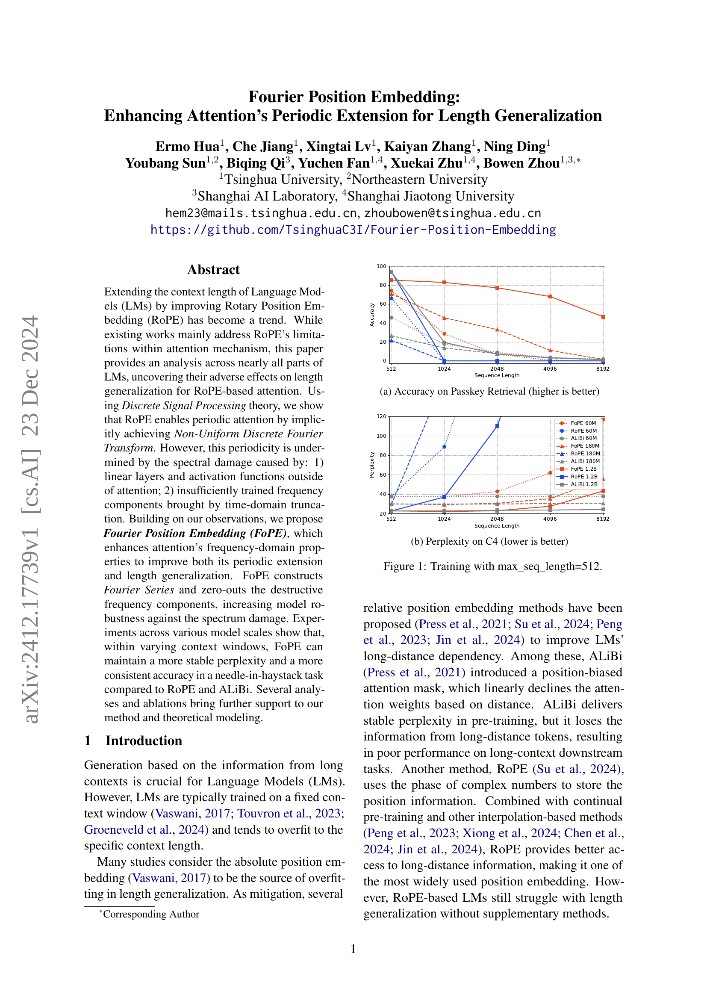
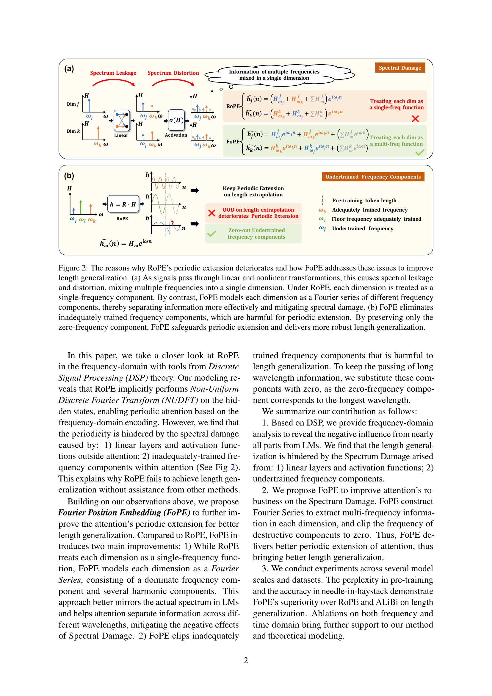
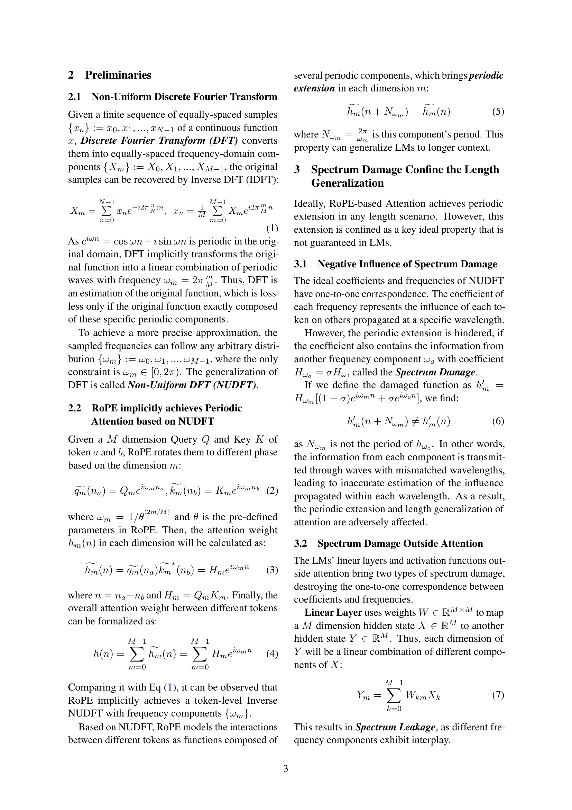
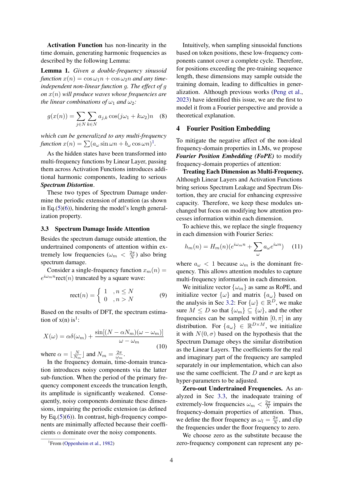
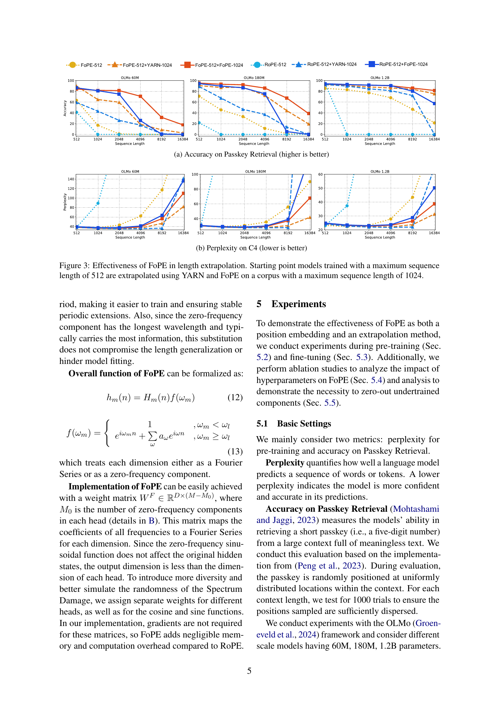
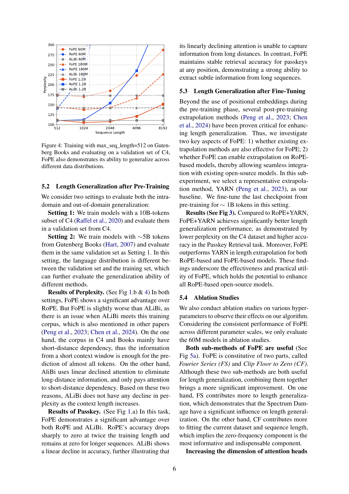
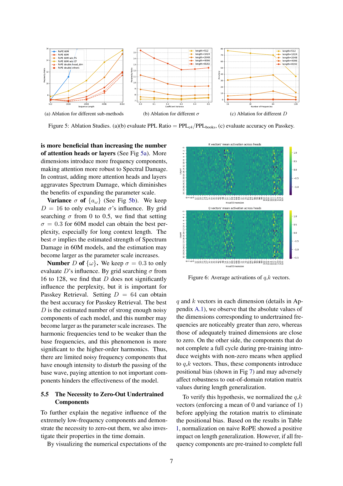
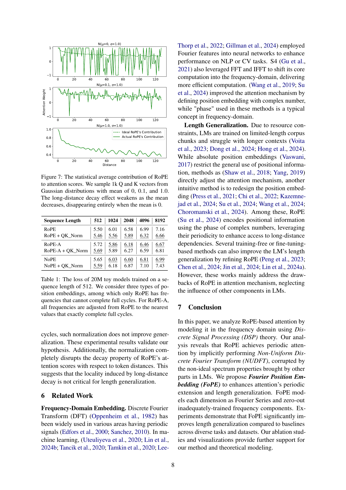
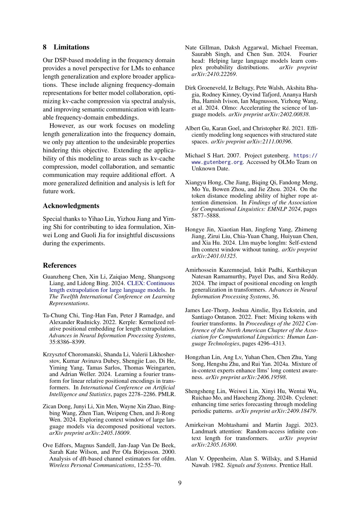
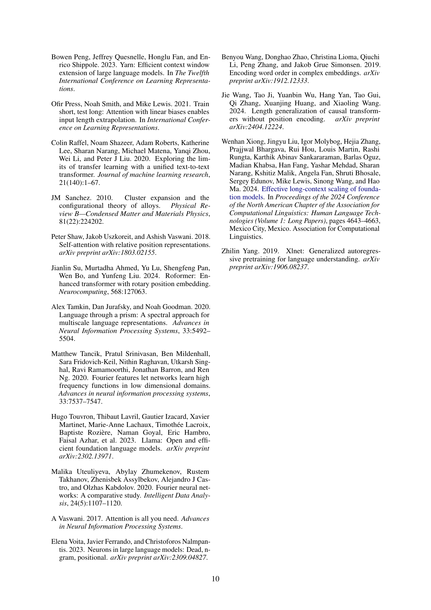
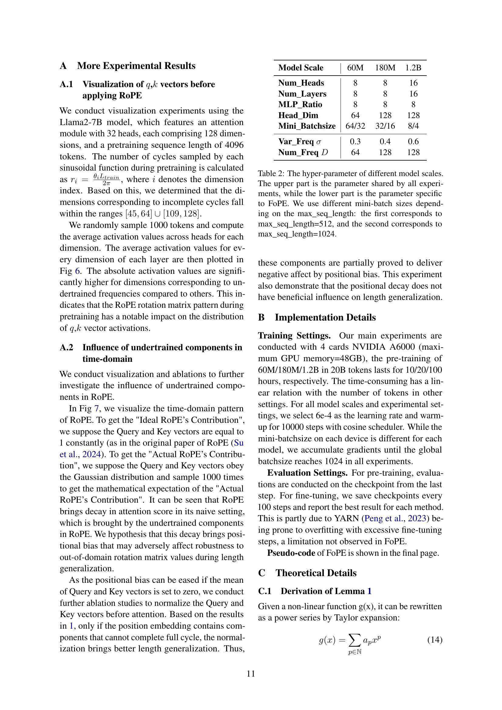
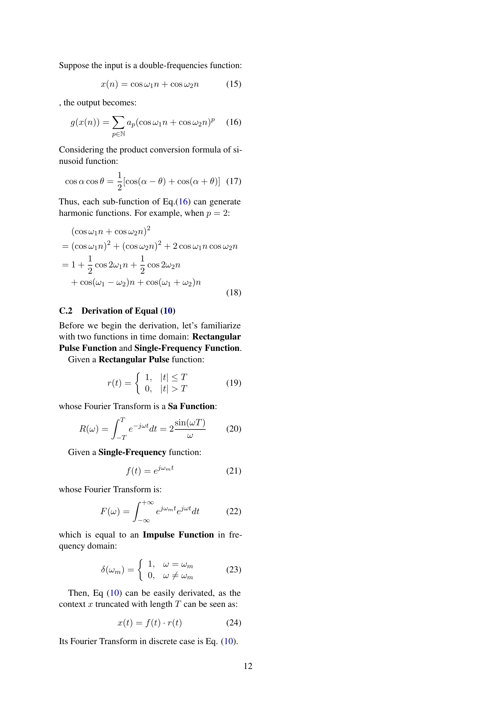
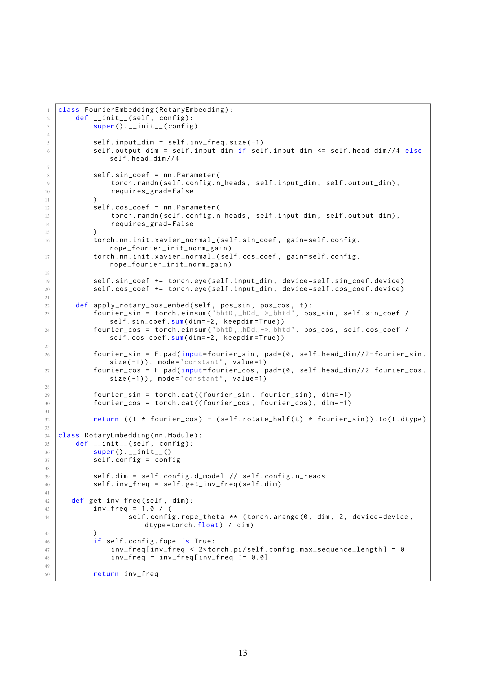
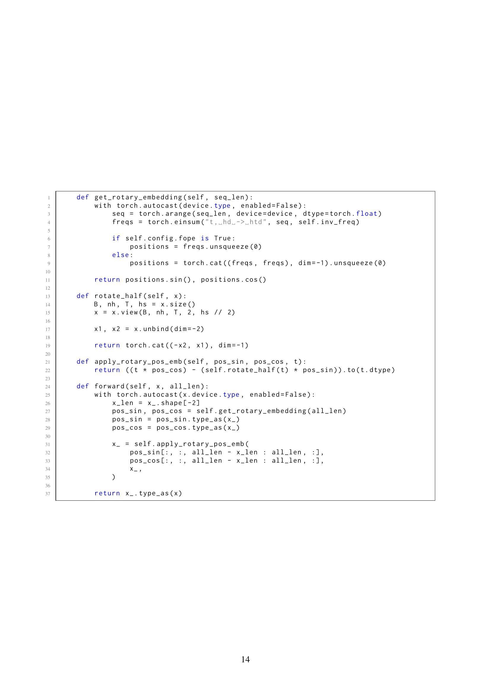
