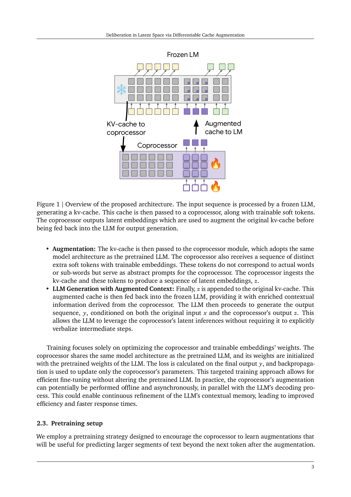
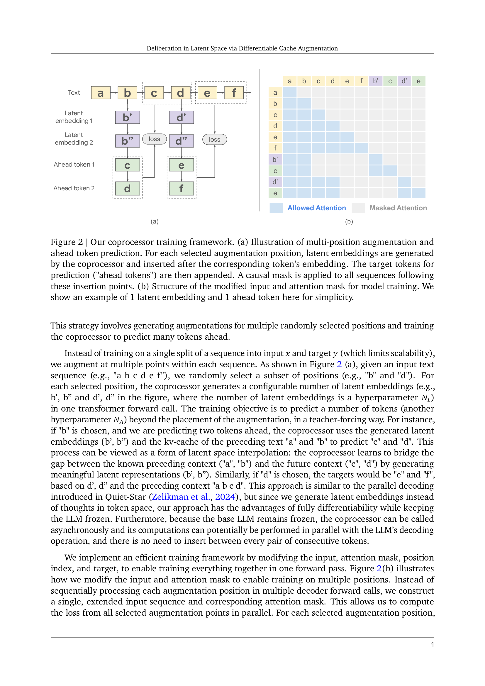

 


 2412.17747 
 Luyang Liu et el. 
 
 🤗 2024-12-24 
 



↗ arXiv


↗ Hugging Face


↗ Papers with Code


### TL;DR



기존의 대규모 언어 모델(LLM)은 복잡한 문제 해결을 위해 중간 추론 단계를 생성하고 참조하지만, 이는 지연 시간이 길고 최적화가 어려운 단점이 있습니다.  본 논문은 **동결된 LLM에 오프라인 코프로세서를 추가**하여 이 문제를 해결합니다.  코프로세서는 모델의 키-값 캐시에서 작동하며, 후속 디코딩의 충실도를 높이도록 설계된 잠재 임베딩을 캐시에 추가합니다.

본 논문에서 제안하는 방법은 **종단 간 미분 가능한 방식**으로 코프로세서를 훈련하여, 추가적인 연산을 키-값 캐시에 효율적으로 저장하는 방법을 학습합니다.  디코더는 변경되지 않으므로, 코프로세서는 오프라인 및 비동기적으로 작동할 수 있으며, 코프로세서가 없거나 특정 캐시에 추가 연산이 필요하지 않은 경우에도 LLM은 정상적으로 작동합니다.  실험 결과, 캐시가 증강되면 디코더는 여러 토큰에 대해 낮은 퍼플렉서티를 달성하고, 특별한 작업별 훈련 없이도 다양한 추론 집약적 작업에서 성능을 향상시키는 것을 보여줍니다.



#### Key Takeaways


 차별 가능한 캐시 증강 기법을 통해 대규모 언어 모델의 추론 성능 향상 



 비동기적 처리 및 최적화를 통해 효율성 및 확장성 개선 



 다양한 추론 집약적 과제에서 일관된 성능 향상 및 메모리 효율 증대 


#### Why does it matter?
본 논문은 **잠재 공간에서의 추론을 향상시키는 새로운 방법**을 제시하여, 연구자들이 더욱 효율적이고 효과적인 방식으로 대규모 언어 모델을 개선하는 데 도움을 줄 수 있습니다. 또한 **비동기적 처리 및 최적화 기법**을 통해 기존 방법의 한계를 극복하고, 향후 연구를 위한 새로운 가능성을 제시합니다. 특히, **메모리 효율적인 훈련 기법**을 통해 제한된 자원 환경에서도 성능을 향상시키는 데 기여할 수 있습니다. 이는 최근 급증하는 대규모 언어 모델 연구에서 중요한 의미를 지닙니다.

------
#### Visual Insights

> 🔼 그림 1은 제안된 아키텍처의 개요를 보여줍니다. 입력 시퀀스는 동결된 LLM(Large Language Model)에 의해 처리되어 kv-cache를 생성합니다. 이 cache는 학습 가능한 소프트 토큰과 함께 coprocessor로 전달됩니다. coprocessor는 원래 kv-cache를 증강하기 위해 사용되는 잠재적 임베딩을 출력한 다음, 출력 생성을 위해 동결된 LLM으로 다시 전달됩니다.  즉, 동결된 LLM이 입력을 처리하여 kv-cache를 생성하고, 이 cache가 추가적인 계산을 위해 coprocessor로 전달됩니다. coprocessor는 추가적인 정보를 담은 잠재적 임베딩을 생성하여 kv-cache를 보강하고, 이 보강된 cache는 최종 출력을 생성하기 위해 다시 LLM으로 전달되는 구조입니다.  coprocessor는 offline 및 비동기적으로 작동할 수 있으므로, 추가적인 계산이 필요하지 않은 경우에는 LLM이 정상적으로 기능할 수 있습니다.
> 

> 
read the caption

> Figure 1: Overview of the proposed architecture. The input sequence is processed by a frozen LLM, generating a kv-cache. This cache is then passed to a coprocessor, along with trainable soft tokens. The coprocessor outputs latent embeddings which are used to augment the original kv-cache before being fed back into the LLM for output generation.
> 


| Position | 8 Latents | 16 Latents | 32 Latents | 64 Latents |
|---|---|---|---|---|
| 1 | -1.53% | -2.48% | -3.28% | -3.94% |
| 2 | -1.67% | -2.41% | -3.15% | -3.70% |
| 4 | -1.39% | -1.98% | -2.66% | -3.17% |
| 8 | -1.22% | -1.56% | -2.11% | -2.61% |
| 16 | -0.85% | -1.08% | -1.50% | -1.88% |
| 32 | -0.55% | -0.64% | -0.88% | -1.20% |

> 🔼 표 1은 기본 모델과 비교하여 증강된 Gemma-2 2B 모델의 상대적 perplexity 감소율(%)을 보여줍니다.  여러 개의 잠재 벡터 수와 잠재 벡터 추가 후 예측 위치에 따른 perplexity 감소율을 보여줍니다.  '위치'는 잠재 벡터 추가 지점을 기준으로 한 토큰 위치를 나타냅니다(예: 위치 1은 바로 다음 토큰).  즉, 이 표는 잠재 벡터를 추가한 후, 몇 번째 토큰을 예측하는지에 따라 perplexity가 얼마나 감소하는지를 잠재 벡터의 개수별로 보여줍니다.  추가된 잠재 벡터 개수가 많을수록 perplexity 감소 효과가 크다는 것을 확인할 수 있습니다.
> 

> 
read the caption

> Table 1: Relative perplexity reduction (in %) achieved by augmented Gemma-2 2B models compared to the baseline, for various numbers of latents and prediction positions following latent augmentation. 'Position' indicates the token position relative to the augmentation point (e.g., Position 1 is the immediately following token).
> 

### In-depth insights

#### Latent Deliberation
본 논문에서 제안하는 '잠재적 숙고(Latent Deliberation)'는 **대규모 언어 모델(LLM)의 잠재 공간 내에서 중간 추론 단계를 생성하고 참조함으로써 더욱 심층적인 사고를 가능하게 하는 기법**입니다. 기존의 방법들이 이산 토큰 시퀀스를 생성하는 것과 달리, **본 연구는 LLM의 키-밸류(kv) 캐시에서 작동하는 오프라인 코프로세서를 활용**하여 잠재적 표현을 추가하고 후속 디코딩의 충실도를 향상시킵니다. 이는 **디코더를 고정시킨 채 코프로세서만을 학습시키는 차별점**을 가지며, **종단 간 미분 가능한 방식으로 추가적인 연산을 kv-캐시에 증류**하는 것을 학습합니다.  **비동기적 작동이 가능하여 지연 시간을 줄이고, 코프로세서가 없어도 LLM은 정상적으로 작동**합니다. 실험 결과, 캐시가 증강될 때 디코더의 퍼플렉서티가 감소하고 여러 추론 집약적 작업에서 성능이 향상되는 것을 보여줍니다.  **강화 학습 없이도 효율적인 최적화가 가능**하며,  다양한 추론 작업에서 일관되게 성능을 향상시키는 것을 확인했습니다. 이는 **LLM의 기능을 확장하는 잠재적인 가능성**을 보여줍니다.

#### Cache Augmentation
본 논문에서 제시된 '캐시 증강(Cache Augmentation)' 기법은 **기존의 언어 모델(LLM)의 성능을 향상시키는 새로운 접근법**입니다. 기존의 LLM은 입력에 대한 응답을 생성하기 위해 연속적인 토큰을 생성하는데, 이는 지연 시간이 길어지고 최적화가 어려워지는 단점이 있습니다. 반면, **캐시 증강 기법은 LLM의 키-값(kv) 캐시를 오프라인으로 처리하는 보조 프로세서(coprocessor)를 활용**합니다. 이 보조 프로세서는 LLM의 kv 캐시에 잠재적 임베딩(latent embedding)을 추가하여 후속 디코딩의 정확도를 높입니다. **이는 LLM 자체를 수정하지 않고도 성능 향상을 가능하게 하는 장점**을 가지고 있습니다.  **보조 프로세서는 사전 학습 데이터를 사용하여 학습**되며, 디코더는 고정된 상태를 유지합니다.  **이를 통해 비동기적이고 오프라인으로 작동**할 수 있으며, 보조 프로세서가 사용 불가능하더라도 LLM은 정상적으로 작동합니다. 실험 결과, 캐시 증강 기법은 다양한 추론 집약적 작업에서 일관되게 성능을 향상시키는 것으로 나타났습니다. 특히 주목할 만한 점은, **특정 작업에 대한 학습 없이도 긍정적인 결과**를 얻었다는 것입니다.

#### Differentiable Training
**차별 가능한 훈련**은 본 논문에서 제시된 방법의 핵심적인 부분입니다.  **프로세서(coprocessor)를 end-to-end 학습**시키는 접근 방식을 통해, 기존의 강화 학습 기반 방법과는 달리 효율적인 최적화가 가능합니다.  **기존 LLM을 고정시킨 채** 프로세서만을 학습시키므로, 프로세서의 작동이 비동기적이고 오프라인으로 이루어질 수 있습니다. 이는 **추론 시간을 단축**시키고 **모델의 확장성을 높이는 데 크게 기여**할 수 있습니다. 또한,  **과제 특화 훈련 없이도 성능 향상**을 보이는 실험 결과는 이 방법의 범용성을 보여주는 중요한 증거입니다.  결론적으로, **차별 가능한 훈련**을 통해  LLM의 성능을 향상시키는 효율적이고 확장성 있는 새로운 방법을 제시하고 있습니다.

#### Benchmark Results
본 논문에서 제시된 **벤치마크 결과는 제안된 방법의 우수성을 보여주는 핵심적인 부분**입니다. 다양한 언어 추론 과제에 대한 성능 비교를 통해 **기존 방법 대비 향상된 정확도**를 명확히 제시하며, 특히 **추론 집약적인 과제에서의 성능 개선**이 두드러집니다. **매개변수 효율성** 측면에서도 긍정적인 결과를 보여주어, 제한된 자원 환경에서도 효과적으로 적용될 수 있음을 시사합니다. **다양한 매개변수 설정**에 따른 결과 분석을 통해 최적의 성능을 위한 조건을 도출하고, 이를 통해 **방법의 범용성**을 강조합니다.  **추가적인 실험 결과**들을 통해 제안된 방법의 한계점과 개선 방향을 제시하여, 향후 연구 방향을 제시하는 데 도움이 될 것입니다.  **결론적으로, 벤치마크 결과는 제안된 방법의 실용성과 우수성을 뒷받침하는 중요한 근거**가 됩니다.

#### Future Directions
본 논문의 "미래 방향"에 대한 심도있는 고찰은 **차세대 언어 모델의 추론 능력 향상**이라는 핵심 목표에 초점을 맞춥니다.  **대규모 모델의 비용 효율적인 훈련 및 추론**을 위한 새로운 아키텍처와 방법론의 개발이 중요하며, **비동기적이고 병렬적인 처리 방식**을 통해 계산 비용을 줄이는 전략이 필요합니다.  **다양한 하위 작업에 대한 적응력 향상**을 위해 사전 훈련 데이터셋 이외에 특정 작업에 대한 데이터를 활용하는 연구가 요구됩니다.  **더욱 복잡하고 추상적인 추론 작업**에 대한 모델의 성능을 평가하고 개선하는 벤치마크 개발 또한 중요한 과제입니다.  **잠재 공간에서의 추론 과정에 대한 이론적 이해를 높이는 연구**는 모델의 성능 향상과  **설명 가능성** 제고에 기여할 것입니다. 마지막으로, 본 논문의 방법론을 **다양한 모델 아키텍처 및 하드웨어 플랫폼에 적용**하여 그 효율성과 일반화 성능을 검증하는 실험적 연구가 필요합니다.

### More visual insights

More on figures

> 🔼 그림 2는 제안된 모델 구조의 훈련 과정을 보여줍니다. (a)는 다중 위치 증강 및 앞쪽 토큰 예측 과정을 보여줍니다. 선택된 증강 위치마다 코프로세서가 잠재 임베딩을 생성하고 해당 토큰 임베딩 뒤에 삽입합니다. 그런 다음 예측을 위한 대상 토큰( '앞쪽 토큰')이 추가됩니다. 이러한 삽입 지점 뒤에 오는 모든 시퀀스에 인과적 마스크가 적용됩니다. (b)는 수정된 입력과 주의 마스크의 구조를 보여줍니다. 간략하게 하기 위해 1개의 잠재 임베딩과 1개의 앞쪽 토큰 예시만 표시했습니다.
> 

> 
read the caption

> Figure 2: Our coprocessor training framework. (a) Illustration of multi-position augmentation and ahead token prediction. For each selected augmentation position, latent embeddings are generated by the coprocessor and inserted after the corresponding token’s embedding. The target tokens for prediction ('ahead tokens') are then appended. A causal mask is applied to all sequences following these insertion points. (b) Structure of the modified input and attention mask for model training. We show an example of 1 latent embedding and 1 ahead token here for simplicity.
> 

> 🔼 그림 3은 다양한 수의 잠재 변수(8, 16, 32, 64)를 사용하여 훈련된 증강 모델과 기준 동결된 Gemma-2 2B 모델의 검증 perplexity를 보여줍니다. 잠재 변수 추가 후 첫 번째 토큰과 32번째 토큰을 예측할 때의 perplexity를 비교합니다. perplexity가 낮을수록 성능이 좋음을 나타냅니다. 이 그림은 잠재 변수 추가가 모델의 예측 성능을 향상시키는지, 그리고 잠재 변수의 수가 성능에 어떤 영향을 미치는지 보여주는 실험 결과를 시각적으로 제시합니다.
> 

> 
read the caption

> Figure 3: Validation perplexity of the baseline frozen Gemma-2 2B model and augmented models with varying numbers of latents (8, 16, 32, 64), when predicting the 1st and 32nd tokens following latent augmentation. Lower perplexity indicates better performance.
> 

> 🔼 그림 4는 사전 훈련된 Gemma-2 2B 모델의 가중치를 사용하여 코프로세서를 미세 조정하면 처음부터 학습하는 것보다 GSM8K 정확도가 크게 향상됨을 보여줍니다. 실선은 평균을 나타내고 음영 영역은 마지막 5개의 체크포인트에서 추정된 95% 신뢰 구간을 나타냅니다. 이 그림은 코프로세서의 사전 훈련된 가중치를 활용하는 것이 성능 향상에 중요한 역할을 한다는 것을 시각적으로 보여줍니다.
> 

> 
read the caption

> Figure 4: Finetuning the coprocessor from Gemma-2 2B pretrained weights significantly improves GSM8K accuracy compared to training from scratch. Lines represent the mean and shaded areas represent the 95% confidence interval, both estimated from the last 5 checkpoints.
> 

> 🔼 그림 5는 제안된 방법의 성능이 훈련 데이터의 양에 따라 어떻게 변하는지 보여줍니다. 32개의 잠재 임베딩을 사용하여 코프로세서를 훈련시킨 결과, 훈련 단계가 증가함에 따라 GSM8K 정확도는 향상되고 검증 퍼플렉서티는 감소하는 경향을 보입니다. 이는 코프로세서가 더 많은 데이터를 접할수록 더 유용한 잠재 임베딩을 생성하고 고정된 LLM과 더 잘 통합되어 다음 토큰 예측 성능을 향상시킨다는 것을 시사합니다. 그림에는 기준 성능(고정된 Gemma-2 2B 모델)도 함께 표시되어 있습니다.
> 

> 
read the caption

> Figure 5: Scaling of GSM8K accuracy and validation perplexity with increasing training steps for the coprocessor (using 32 latent embeddings). The baseline performance of the frozen Gemma-2 2B model is shown for reference.
> 

> 🔼 그림 6은 LoRA 미세 조정 후 GSM8K 테스트 세트에 대한 정확도를 보여줍니다. 기준 모델과 비교하여, 제안된 증강 모델은 상당한 성능 향상을 보입니다. 이는 증강 모델이 하위 작업에 더 잘 적응하고 기준 모델보다 훨씬 나은 성능을 발휘함을 시사합니다.
> 

> 
read the caption

> Figure 6: Accuracy on GSM8K’s test set after LoRA finetuning. Our augmented model shows a significant improvement compared to the baseline.
> 

More on tables


| Benchmark | Metric | Baseline | 4 Latents | 8 Latents | 16 Latents | 32 Latents | 64 Latents |
|---|---|---|---|---|---|---|---| 
| MMLU | 5-shot | 52.00 | 52.45 (+0.45) | 52.24 (+0.24) | 52.34 (+0.34) | 54.61 (+2.61) | **56.70 (+4.70)** |
| GSM8K | 8-shot | 21.38 | 22.67 (+1.29) | 23.12 (+1.74) | 24.72 (+3.34) | 26.76 (+5.38) | **31.43 (+10.05)** |
| DROP | 3-shot, F1 | 53.69 | 54.64 (+0.95) | 54.91 (+1.23) | 56.23 (+2.55) | 57.37 (+3.68) | **57.77 (+4.08)** |
| ARC-e | 0-shot | 80.56 | 81.52 (+0.97) | 81.57 (+1.01) | 83.12 (+2.57) | 83.04 (+2.48) | **83.67 (+3.11)** |
| ARC-c | 0-shot | 50.26 | 51.28 (+1.02) | 52.39 (+2.13) | 53.24 (+2.99) | **54.44 (+4.18)** | **54.44 (+4.18)** |
| MATH | 4-shot | 16.50 | 16.38 (-0.12) | 16.78 (+0.28) | 17.00 (+0.50) | 17.18 (+0.68) | **18.56 (+2.06)** |
| Winogrande | 0-shot | 64.01 | 65.35 (+1.34) | 65.35 (+1.34) | 66.30 (+2.29) | 66.30 (+2.29) | **66.61 (+2.60)** |
| PIQA | 0-shot | 78.18 | 78.62 (+0.44) | 78.67 (+0.49) | 78.94 (+0.76) | 78.94 (+0.76) | **79.00 (+0.82)** |
| SIQA | 0-shot | 51.79 | 51.59 (-0.20) | 51.64 (-0.15) | 51.74 (-0.05) | **52.30 (+0.51)** | 52.00 (+0.20) |
| HellaSwag | 0-shot | 73.77 | 74.41 (+0.64) | 74.41 (+0.64) | 74.82 (+1.05) | 75.04 (+1.27) | **75.31 (+1.54)** |
| Boolq | 0-shot | 75.41 | 75.29 (-0.12) | 77.22 (+1.80) | **78.17 (+2.75)** | 77.03 (+1.62) | 76.91 (+1.50) |
| MBPP | 3-shot | 30.40 | 29.00 (-1.40) | 31.60 (+1.20) | 31.20 (+0.80) | 31.40 (+1.00) | **31.80 (+1.40)** |
| AGIEval | 3-5-shot | 31.71 | 32.18 (+0.47) | 30.04 (-1.67) | 31.32 (-0.38) | 32.78 (+1.07) | **33.85 (+2.14)** |
| TriviaQA | 5-shot | 60.29 | 60.30 (+0.01) | 60.83 (+0.54) | 61.43 (+1.14) | 62.05 (+1.76) | **62.23 (+1.94)** |
| NQ | 5-shot | 17.14 | 17.35 (+0.21) | 17.89 (+0.75) | 18.16 (+1.02) | 18.91 (+1.77) | **19.20 (+2.06)** |
| HumanEval | pass@1 | 19.51 | 18.29 (-1.22) | 19.51 (+0.00) | 20.73 (+1.22) | 20.73 (+1.22) | **22.56 (+3.05)** |
| BBH | 3-shot | 42.22 | 42.36 (+0.14) | 42.37 (+0.15) | 42.53 (+0.31) | 42.48 (+0.26) | **42.64 (+0.41)** |
> 🔼 표 2는 다양한 벤치마크에서 기준 모델과 증강 모델의 성능을 보여줍니다. 기준 모델은 동결된 Gemma-2 2B 사전 훈련 모델이며, 증강 모델은 학습된 코프로세서를 사용하여 4, 8, 16, 32, 64개의 잠재 임베딩으로 증강된 모델입니다. 결과는 'Metric' 열에 표시된 대로 제로샷/소수샷 설정에 대해 보고됩니다. 'Metric' 열에 명시되지 않은 경우 결과는 정확도(%)입니다. 기준선에 대한 개선 사항은 괄호 안에 표시됩니다. 이 설정에서는 프롬프트의 끝에서 코프로세서가 한 번 호출됩니다.
> 

> 
read the caption

> Table 2: Performance of baseline and augmented models across various benchmarks. Results are shown for the baseline (frozen Gemma-2 2B pretrained model) and the model augmented with a learned coprocessor using 4, 8, 16, 32, and 64 latent embeddings, respectively. Results are reported for zero/few-shot settings as indicated in the “Metric” column. Results are accuracy (in %) if not specified in the Metric column. Improvements over the baseline are shown in parentheses. In this setting, the coprocessor is called once, at the end of the prompt.
> 


| Method | Validation set perplexity (↓) | GSM8K 8-shot accuracy (↑) |
|---|---|---|
| Baseline Gemma-2 2B | 10.96 | 21.38 |
| Pause Token | 11.63 | 22.37 |
| Latent embeddings (Ours) | **10.60** | **26.76** |
> 🔼 표 3은 세 가지 다른 방법을 비교하여 제시합니다. 기준 Gemma-2 2B 모델, Pause Token 기법(Goyal et al., 2023) (32개 임베딩 사용), 그리고 본 논문에서 제안하는 기법(32개 임베딩 사용)입니다. 퍼플렉서티 값이 낮을수록 다음 토큰 예측 성능이 좋다는 것을 나타내고, GSM8K 정확도가 높을수록 GSM8K 성능이 좋다는 것을 나타냅니다.
> 

> 
read the caption

> Table 3: Comparison between the baseline Gemma-2 2B model, the Pause Token method (Goyal et al., 2023) (using 32 embeddings), and our approach (also using 32 embeddings). Lower perplexity indicates better next token prediction. Higher accuracy indicates better performance on GSM8K.
> 


| Baseline | 0-shot CoT | 16 Latents | 32 Latents |
|---|---|---|---| 
| 21.38 | 23.20 | 24.72 | **26.76** |
> 🔼 표 4는 세 가지 다른 방법을 사용하여 GSM8K 데이터셋에서 8-shot 설정으로 얻은 정확도를 비교한 것입니다. 첫 번째는 기준 Gemma-2 2B 모델이며, 두 번째는 제로샷 체인 오브 스로트(CoT) 프롬프팅 기법이며, 세 번째는 본 논문에서 제안한 방법으로 16개와 32개의 잠재적 임베딩을 사용한 결과입니다. 이 표는 제로샷 CoT 프롬프팅과 본 논문에서 제안한 방법이 기준 모델에 비해 성능 향상을 보여주는지를 보여줍니다. 또한, 잠재적 임베딩 수를 늘리면 정확도가 향상되는 것을 알 수 있습니다.
> 

> 
read the caption

> Table 4: Accuracy on GSM8K 8-shot for the baseline Gemma-2 2B model, zero-shot Chain-of-Thought (CoT) prompting, and our approach with 16 and 32 latent embeddings.
> 


| Method | GSM8K Accuracy |
|---|---| 
| Baseline | 21.38 |
| LoRA (Rank 64) | 23.35 |
| LoRA (Rank 128) | 24.03 |
| From Scratch Training | 25.78 |
| Full Finetuning | **26.76** |
> 🔼 표 5는 모든 방법에서 32개의 잠재 임베딩을 사용하여 코프로세서에 대한 다양한 미세 조정 방법의 GSM8K 정확도 비교를 보여줍니다. LoRA는 전체 미세 조정에 비해 메모리 효율적인 대안을 제공하며 상당한 성능 향상을 달성합니다. 이 표는 기본 모델, LoRA(Rank 64, Rank 128)를 사용한 미세 조정, 처음부터 학습, 그리고 전체 미세 조정을 포함한 네 가지의 다른 코프로세서 미세 조정 방법에 대한 GSM8K 정확도를 비교합니다.
> 

> 
read the caption

> Table 5: GSM8K accuracy comparison of different finetuning methods for the coprocessor, all using 32 latent embeddings. LoRA offers a memory-efficient alternative to full finetuning, achieving reasonable performance gains.
> 


| Baseline | 4 Ahead | 8 Ahead | 16 Ahead | 32 Ahead |
|---|---|---|---|---|
| 21.38 | 24.03 (+2.65) | 24.11 (+2.73) | **24.72** (+3.34) | 23.73 (+2.35) |
> 🔼 표 6은 코프로세서 훈련 중 앞쪽 토큰의 개수를 다르게 했을 때 GSM8K 정확도를 보여줍니다. 16개의 앞쪽 토큰을 사용했을 때 정확도가 가장 높았으며 (24.72%, 기준선 21.38%보다 3.34% 상승), 모든 실험에서 16개의 잠재적 임베딩을 사용했습니다. 이 표는 다양한 수의 앞쪽 토큰(4, 8, 16, 32개)에 대한 결과를 보여주며, 앞쪽 토큰 수에 따른 성능 변화를 분석하여 최적의 앞쪽 토큰 개수를 찾는 데 도움이 됩니다. 이는 모델이 미래 토큰을 얼마나 잘 예측하는지 파악하는 데 중요한 지표가 됩니다.
> 

> 
read the caption

> Table 6: GSM8K accuracy for varying numbers of ahead tokens during coprocessor training. 16 ahead tokens achieves the highest accuracy (24.72%, +3.34% over the baseline of 21.38%). 16 latent embeddings are used for all these experiments.
> 


| Benchmark | Metric | Baseline | 4 Latents | 8 Latents | 16 Latents | 32 Latents | 64 Latents |
|---|---|---|---|---|---|---|---| 
| MMLU | 5-shot | 52.00 | 52.03 (+0.03) | 52.21 (+0.21) | 52.75 (+0.75) | 53.55 (+1.55) | 56.63 (+4.63) |
| GSM8K | 8-shot | 21.38 | 22.52 (+1.14) | 22.59 (+1.21) | 24.41 (+3.03) | 25.78 (+4.40) | 29.80 (+8.42) |
| ARC-e | 0-shot | 80.56 | 81.69 (+1.13) | 81.86 (+1.30) | 82.79 (+2.23) | 83.12 (+2.56) | 83.21 (+2.65) |
| ARC-c | 0-shot | 50.26 | 51.71 (+1.45) | 52.22 (+1.96) | 52.47 (+2.21) | 54.27 (+4.01) | 53.24 (+2.98) |
| MATH | 4-shot | 16.50 | 16.22 (-0.28) | 16.46 (-0.04) | 16.92 (+0.42) | 17.18 (+0.68) | 18.34 (+1.84) |
| Winogrande | 0-shot | 64.01 | 65.19 (+1.18) | 65.98 (+1.97) | 66.54 (+2.53) | 66.69 (+2.68) | 67.25 (+3.24) |
| PIQA | 0-shot | 78.18 | 78.13 (-0.05) | 79.00 (+0.82) | 79.16 (+0.98) | 79.27 (+1.09) | 79.22 (+1.04) |
| SIQA | 0-shot | 51.79 | 51.94 (+0.15) | 51.64 (-0.15) | 51.84 (+0.05) | 51.94 (+0.15) | 51.89 (+0.10) |
| HellaSwag | 0-shot | 73.77 | 74.37 (+0.60) | 74.68 (+0.91) | 74.82 (+1.05) | 74.89 (+1.12) | 75.18 (+1.41) |
| Boolq | 0-shot | 75.41 | 75.66 (+0.25) | 76.94 (+1.53) | 76.97 (+1.56) | 77.80 (+2.39) | 77.46 (+2.05) |
| MBPP | 3-shot | 30.40 | 30.40 (0.00) | 30.60 (+0.20) | 30.80 (+0.40) | 32.00 (+1.60) | 32.60 (+2.20) |
| AGIEval | 3-5-shot | 31.71 | 32.52 (+0.81) | 32.22 (+0.51) | 31.92 (+0.21) | 32.78 (+1.07) | 32.35 (+0.64) |
| TriviaQA | 5-shot | 60.29 | 60.53 (+0.24) | 60.95 (+0.66) | 61.45 (+1.16) | 61.93 (+1.64) | 62.62 (+2.33) |
| NQ | 5-shot | 17.14 | 17.26 (+0.12) | 17.89 (+0.75) | 18.47 (+1.33) | 18.68 (+1.54) | 19.00 (+1.86) |
| HumanEval | pass@1 | 19.51 | 18.29 (-1.22) | 18.90 (-0.61) | 20.73 (+1.22) | 19.51 (0.00) | 19.51 (0.00) |
| BBH | 3-shot | 42.22 | 42.16 (-0.06) | 42.24 (+0.02) | 42.42 (+0.20) | 43.19 (+0.97) | 42.93 (+0.71) |
> 🔼 표 7은 사전 훈련된 모델의 가중치를 사용하지 않고 처음부터 코프로세서를 훈련했을 때 다양한 벤치마크에서 기준 모델과 증강 모델의 성능을 보여줍니다.  기준 모델은 동결된 Gemma-2 2B 모델입니다. 각 벤치마크마다 여러 개의 코프로세서 잠재 임베딩 수(4, 8, 16, 32, 64)에 따른 결과가 제시되어 있습니다.  괄호 안의 수치는 기준 모델 대비 성능 향상을 백분율로 나타냅니다.  자세한 내용은 표 2를 참조하십시오.
> 

> 
read the caption

> Table 7: Performance of baseline and augmented models across various benchmarks with coprocessor training from scratch. Check Table 2 for more detailed description.
> 

### Full paper



