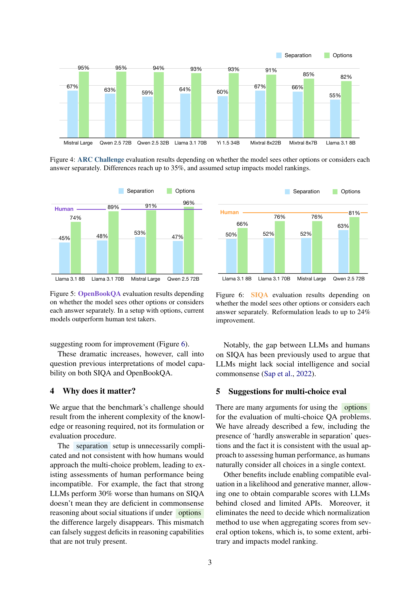

 


 2412.17758 
 Łukasz Borchmann et el. 
 
 🤗 2024-12-25 
 



↗ arXiv


↗ Hugging Face


↗ Papers with Code


### TL;DR



많은 자연어 처리 모델 평가는 다중 선택 문제에서 각 옵션을 개별적으로 평가하는데, 이는 모델의 추론 능력을 정확하게 반영하지 못할 수 있습니다. 이 논문은 이러한 기존 방식의 문제점을 지적하고, 모든 옵션을 함께 고려하여 비교하는 새로운 평가 방법을 제안합니다. 이 방법은 여러 벤치마크(ARC, OpenBookQA, SIQA 등)에서 모델의 성능 격차를 크게 줄이고, 일부 벤치마크에서는 인간 수준 이상의 성능을 달성하게 했습니다. 이는 평가 방식이 모델의 어려움 인식에 영향을 미치며,  정확한 평가를 위해서는 다중 선택 문제 평가 시 모든 옵션을 함께 제시해야 한다는 것을 시사합니다.

본 연구는 새로운 평가 방법을 제안하여 기존 연구의 한계를 극복하고, 모델의 실제 능력을 더 정확하게 평가할 수 있는 방향을 제시합니다. **ARC, OpenBookQA, SIQA 와 같은 벤치마크에서의 실험 결과**를 통해 새로운 평가 방식의 효과를 입증하였고, 이를 통해 **모델 성능 향상과 벤치마크 평가의 신뢰도 향상**에 기여합니다. 이 연구는 **향후 연구에서 더욱 공정하고 정확한 모델 평가**를 위한 중요한 지침을 제공하며, **다양한 자연어 처리 과제**에서의 모델 성능 개선 및 새로운 연구 방향 제시에 기여할 것으로 기대됩니다.



#### Key Takeaways


 기존의 다중 선택 문제 평가 방식은 모델의 실제 추론 능력을 과소평가할 수 있다. 



 모든 옵션을 함께 고려하는 새로운 평가 방식이 모델의 성능을 더 정확하게 평가한다. 



 본 연구는 다양한 자연어 처리 벤치마크의 평가 방식 개선에 중요한 시사점을 제공한다. 


#### Why does it matter?
본 논문은 **다양한 자연어 처리 벤치마크의 평가 방식에 대한 근본적인 문제점**을 제기하여, 연구자들이 모델의 실제 능력을 더 정확하게 평가할 수 있도록 돕습니다. 기존의 평가 방식이 모델의 추론 능력을 과소평가할 수 있다는 점을 보여줌으로써, **향후 연구 방향에 대한 새로운 시각**을 제공하고 있습니다. 특히, 다수 선택 문제에서 옵션들을 개별적으로 평가하는 대신, **모든 옵션을 함께 고려하는 평가 방식**을 제안함으로써, 모델의 성능을 더욱 정확하게 측정할 수 있는 새로운 기준을 제시하고 있습니다.

------
#### Visual Insights

> 🔼 그림 1은 ARC Challenge 와 ARC Easy의 정확도 차이를 보여줍니다. 각 답변을 개별적으로 고려하는 경우와 모든 옵션을 함께 보는 경우를 비교하여, 후자의 경우 정확도 차이가 최대 6배까지 감소함을 보여줍니다. 이는 평가 방식이 모델의 실제 추론 능력을 얼마나 잘 반영하는지에 대한 중요한 시사점을 제공합니다.
> 

> 
read the caption

> Figure 1: Difference between ARC Challenge and ARC Easy accuracies when considering each answer separately compared to seeing all options. The gap is vastly reduced, up to six times in this comparison.
> 


| Model | Reported | Measured (s/o) | Assessment |
|---|---|---|---| 
| Llama 65B [Touvron et al. (2023a)](https://arxiv.org/html/2412.17758v1#bib.bib26) | 56.0 | 55.6 / 70.2 |  separation |
| Llama 2 70B [Touvron et al. (2023b)](https://arxiv.org/html/2412.17758v1#bib.bib27) | 57.4 | 57.4 / 79.6 |  separation |
| Llama 3 70B [Grattafiori et al. (2024)](https://arxiv.org/html/2412.17758v1#bib.bib14) | 92.9 | 64.2 / 91.3 | options |
| Mistral 7B [Jiang et al. (2023)](https://arxiv.org/html/2412.17758v1#bib.bib16) | 55.5 | 54.1 / 74.6 |  separation |
| Mixtral 8x7B [Jiang et al. (2024)](https://arxiv.org/html/2412.17758v1#bib.bib17) | 59.7 | 59.9 / 83.3 |  separation |
| Mixtral 8x22B [Mistral AI (2024)](https://arxiv.org/html/2412.17758v1#bib.bib20) | 91.3† | 70.7 / 91.8 | options |
| DeepSeek 67B [DeepSeek AI et al. (2024a)](https://arxiv.org/html/2412.17758v1#bib.bib7) | 59.0 | 60.1 / 84.6 | options |
| DeepSeek V2 [DeepSeek AI et al. (2024b)](https://arxiv.org/html/2412.17758v1#bib.bib8) | 92.4† | 70.3 / 92.2 | options |
| Qwen 14B [Bai et al. (2023)](https://arxiv.org/html/2412.17758v1#bib.bib2) | 84.4 | 47.3 / 86.6 | options |
| Yi 6B [01. AI et al. (2024)](https://arxiv.org/html/2412.17758v1#bib.bib1) | 50.3† | 55.7 / 80.5 |  separation |
| Gemma 7B [Gemma Team et al. (2024b)](https://arxiv.org/html/2412.17758v1#bib.bib12) | 53.2 | 53.2 / 79.0 |  separation |
| Gemma 2 27B [Gemma Team et al. (2024a)](https://arxiv.org/html/2412.17758v1#bib.bib11) | 71.4 | 65.8 / 90.0 |  separation |

> 🔼 표 1은 여러 저자들이 사용한 설정에 대한 저자들의 평가와 함께 측정된 및 보고된 ARC Challenge 점수를 보여줍니다. 0샷과 대조적으로 사용된 25샷 프롬프트는 저자들이 그러한 설정을 사용한 경우 †로 표시됩니다. 이 표는 다양한 언어 모델(LLM)이 ARC Challenge 데이터셋에서 얼마나 잘 수행되었는지 보여주는 정량적 데이터를 제공합니다. 각 모델의 보고된 점수와 측정된 점수가 표시되며, 저자들이 어떤 평가 설정(분리 또는 옵션)을 사용했는지에 대한 평가가 포함되어 있습니다. 이는 다양한 LLM의 성능을 비교하고 평가 설정의 영향을 이해하는 데 도움이 됩니다.
> 

> 
read the caption

> Table 1: Measured and reported ARC Challenge scores with our assessment of the setup used by authors. The 25-shot prompting used in contrast to the 0-shot is denoted by ††\dagger† (in the case authors use such a setup in their report).
> 

### In-depth insights

#### Eval Setup Bias
본 논문은 평가 설정 편향(Eval Setup Bias)에 대해 심도 있게 논의합니다. **다양한 다중 선택형 질문 응답 벤치마크에서 모델이 답변 선택지를 개별적으로 평가하는 기존 방식이, 모든 선택지를 동시에 고려하는 방식보다 훨씬 낮은 성능을 보이는 현상**을 보여줍니다. 이는 모델의 추론 능력 부족으로 오인될 수 있으나, 실제로는 평가 방식 자체의 문제일 수 있습니다. 따라서 **단일 선택지 평가 방식은 모델의 실제 능력을 제대로 반영하지 못한다는 점**을 강조하며, 더욱 정확한 평가를 위해서는 모든 선택지를 함께 고려하는 방식이 필요함을 제시합니다. 이러한 평가 설정의 변화는 ARC, OpenBookQA, SIQA 등 다양한 벤치마크에서 모델의 성능을 극적으로 향상시키는 효과를 가져옵니다.  **평가 방식의 차이가 모델 성능 평가에 얼마나 큰 영향을 미치는지**를 보여주는 중요한 발견입니다.  결론적으로, 본 논문은 **벤치마크 설계 시 평가 설정 편향을 주의 깊게 고려해야 함**을 강조하고, 더욱 공정하고 정확한 모델 평가를 위한 새로운 지침을 제시합니다.

#### Benchmark Reform
본 논문은 기존 벤치마크 평가 방식의 문제점을 지적하고, **더 공정하고 정확한 모델 평가를 위한 개선 방안**을 제시합니다. 특히, 다지선다형 문제에서 각 선택지를 개별적으로 평가하는 기존 방식의 한계를 비판하며, **모든 선택지를 함께 고려하는 새로운 평가 방식**을 제안합니다. 이를 통해, 모델의 실제 추론 능력을 더 정확하게 반영하고, **기존 평가 방식으로 인해 과소평가되었던 모델들의 성능을 재평가**할 수 있다는 점을 강조합니다.  **평가 방식의 변화가 모델의 성능 순위에 큰 영향**을 미치며, 이는 벤치마크의 신뢰성에 대한 의문을 제기합니다.  따라서, 벤치마크 설계 및 평가 과정에서 **인간의 추론 과정을 더욱 고려**하고, **모델의 실제 능력을 더 잘 반영**할 수 있도록 평가 방식을 개선해야 한다는 주장을 펼칩니다.  **다양한 벤치마크에 대한 실험 결과**를 제시하여, 제안된 평가 방식의 효과를 입증합니다.

#### LLM Reasoning
LLM 추론 능력에 대한 심층적인 논의는 **평가 방식의 중요성**을 강조합니다. 기존의 다중 선택 문제 평가 방식은 선택지를 개별적으로 평가하여 모델의 실제 추론 능력을 제대로 반영하지 못한다는 점을 지적합니다.  **선택지들을 함께 제시하는 방식**으로 평가하면 모델의 성능이 크게 향상될 수 있으며, 이는 기존 평가 방식이 모델의 추론 능력을 과소평가했음을 시사합니다.  본 연구는 다양한 벤치마크에서 이러한 문제점을 보여주고, **더 공정한 평가 방식**을 통해 모델의 성능 격차를 줄이고 심지어 인간 수준을 뛰어넘는 결과를 얻을 수 있음을 보여줍니다.  **평가 방식 개선을 위한 구체적인 제안** 또한 제시되어 있으며,  LLM 추론 능력의 정확한 측정과 향상된 모델 개발을 위한 중요한 시사점을 제공합니다.

#### Beyond ARC
논문의 "Beyond ARC" 부분은 **ARC 챌린지의 한계를 넘어서는 새로운 방향**을 모색하는 데 초점을 맞출 것으로 예상됩니다.  이는 단순히 ARC 챌린지의 문제점을 지적하는 것을 넘어, **더욱 포괄적이고 현실적인 문제 해결 능력**을 평가하는 새로운 벤치마크나 평가 방식을 제안할 가능성이 높습니다.  **다양한 유형의 추론 능력** (예: 상식 추론, 논리적 추론, 공간적 추론 등)을 종합적으로 평가하는 새로운 접근법이 제시될 수 있으며,  **기존 벤치마크의 편향성이나 한계를 보완**하는 방식으로 개발될 수 있습니다. 또한,  **실제 세계 문제 해결과의 연관성**을 강조하여, 인공지능 모델의 실용성을 더욱 높이는 방향으로 논의가 진행될 것으로 예상됩니다.  **인간의 추론 능력과의 비교**를 통해 모델의 성능을 더욱 정확하게 평가하는 방법 또한 제시될 수 있습니다.  결론적으로, "Beyond ARC"는 단순한 평가 도구 개선을 넘어 **인공지능 연구의 새로운 패러다임**을 제시하는 중요한 부분이 될 가능성이 큽니다.

#### Future of Eval
**평가(Eval)의 미래는 다양한 측면에서 변화를 맞이할 것입니다.**  대규모 언어 모델(LLM)의 발전과 함께, 기존의 단순 정확도 중심 평가에서 벗어나 **인간의 추론 능력, 상식, 창의성 등 다차원적인 측면을 고려하는 평가 방식**으로 전환될 것입니다.  이는 단순히 답의 정확성뿐 아니라, **모델의 사고 과정, 답변의 논리적 타당성,  맥락 이해 능력** 등을 평가하는 새로운 지표와 방법론의 개발을 필요로 합니다. 또한, **공정성과 투명성**을 확보하기 위해, 데이터 편향성과 알고리즘의 공정성을 면밀히 검토하고,  다양한 배경과 문화를 가진 사용자들을 위한 포괄적인 평가 체계를 구축해야 합니다.  **모델의 사회적 영향력**을 고려하여 윤리적 문제점을 해결하고,  사회적으로 유익한 방향으로 모델을 개발하고 평가하는 기준도 마련되어야 할 것입니다.  **LLM의 발전 속도에 맞추어 평가 기준 또한 지속적으로 개선**되어야 하며, 이를 위해서는 학계, 산업계, 정부 기관 등 다양한 분야의 전문가들의 협력과 긴밀한 소통이 필수적입니다.  결국, 평가의 미래는 **모델의 기술적 성능 뿐만 아니라, 사회적 책임과 윤리적 고려를 모두 포함하는 포괄적인 시각**을 필요로 할 것입니다.

### More visual insights

More on figures

> 🔼 그림 2는 모델이 다른 선택지를 알지 못한 채(프롬프트에는 질문만 포함됨) 개별적으로 특정 선택지를 고려하는 방식을 보여줍니다. 선택지의 길이가 다를 수 있으므로 정규화하는 것이 좋습니다 (Gao, 2021). 이 그림은 모델이 제시된 각 답변을 독립적으로 평가하고, 다른 답변과의 상호작용이나 비교 없이 각 답변의 확률을 계산하는 방식을 시각적으로 보여줍니다. 이러한 접근 방식은 모델의 추론 능력을 정확하게 평가하지 못할 수 있다는 점을 강조합니다.
> 

> 
read the caption

> Figure 2: Model considers particular choices in   Ayseparation  without knowing the alternative (prompt includes only the question). Because options may vary in length, it is a good practice to normalize them Gao (2021).
> 

> 🔼 그림 3은 다중 선택 문제의 답변 후보들을 모두 보여주는 프롬프트를 모델이 참조하는 방식을 보여줍니다. 모든 옵션이 하나의 문자(토큰)로 이루어져 있기 때문에 점수 정규화가 필요 없습니다.  이는 모델이 답변 선택에 있어 문맥을 고려하여 비교 및 판단하는 과정을 시뮬레이션 함으로써, 단일 옵션만 제시하는 방식보다 자연스러운 추론 과정을 반영한다는 점을 강조합니다.
> 

> 
read the caption

> Figure 3: Model sees the context of all possible   Ayoptions  in the prompt. Because all of the options are single letters (likely single tokens), scores require no normalization.
> 

> 🔼 그림 4는 ARC Challenge 벤치마크에서 모델이 다른 선택지를 함께 보는 경우와 각 답변을 개별적으로 고려하는 경우의 평가 결과를 비교한 것입니다. 모델이 다른 선택지를 볼 수 있는 경우(options)와 그렇지 않은 경우(separation)의 정확도 차이는 최대 35%에 달하며, 평가 설정에 따라 모델 순위가 크게 달라질 수 있음을 보여줍니다.  이는 모델의 실제 추론 능력이 아닌 평가 방식 자체에 의해 난이도가 과장될 수 있음을 시사합니다.
> 

> 
read the caption

> Figure 4: ARC Challenge evaluation results depending on whether the model sees other options or considers each answer separately. Differences reach up to 35%, and assumed setup impacts model rankings.
> 

> 🔼 그림 5는 OpenBookQA 평가 결과를 보여줍니다. 모델이 다른 옵션들을 함께 보는 경우와 각 답변을 개별적으로 고려하는 경우의 결과를 비교합니다. 옵션을 함께 제시하는 설정에서 현재 모델들은 사람보다 더 나은 성능을 보입니다. 이는 평가 방식에 따라 모델의 성능이 크게 달라질 수 있음을 보여주는 예시입니다.
> 

> 
read the caption

> Figure 5: OpenBookQA evaluation results depending on whether the model sees other options or considers each answer separately. In a setup with options, current models outperform human test takers.
> 

> 🔼 그림 6은 SIQA 벤치마크에서 모델이 다른 선택지를 함께 보는 경우와 각 답변을 개별적으로 고려하는 경우의 평가 결과를 보여줍니다.  'Separation' 방식(각 답변을 개별적으로 평가)과 'Options' 방식(모든 선택지를 함께 제시)의 두 가지 평가 방법을 비교하여,  'Options' 방식이 최대 24%의 성능 향상을 가져온다는 것을 보여줍니다. 이는 평가 방식의 변화가 모델의 실제 추론 능력에 대한 인식에 큰 영향을 미칠 수 있음을 시사합니다.
> 

> 
read the caption

> Figure 6: SIQA evaluation results depending on whether the model sees other options or considers each answer separately. Reformulation leads to up to 24% improvement.
> 

More on tables


| Model | Reported | Measured   s / o | Assessment |
|---|---|---|---| 
| Llama 65B [Touvron et al. (2023a)](https://arxiv.org/html/2412.17758v1#bib.bib26) | 52.3 | 50.3 / 60.1 | separation |
| Llama 2 70B [Touvron et al. (2023b)](https://arxiv.org/html/2412.17758v1#bib.bib27) | 50.7 | 50.8 / 66.9 | separation |
| Llama 3 70B [Grattafiori et al. (2024)](https://arxiv.org/html/2412.17758v1#bib.bib14) | 52.2 | 51.2 / 72.9 | separation |
| Mistral 7B [Jiang et al. (2023)](https://arxiv.org/html/2412.17758v1#bib.bib16) | —⋄ | 50.9 / 62.4 | — |
| Mixtral 8x7B [Jiang et al. (2024)](https://arxiv.org/html/2412.17758v1#bib.bib17) | —⋄ | 49.4 / 65.1 | — |
| Mixtral 8x22B [Mistral AI (2024)](https://arxiv.org/html/2412.17758v1#bib.bib20) | — | 51.1 / 67.3 | — |
| DeepSeek 67B [DeepSeek AI et al. (2024a)](https://arxiv.org/html/2412.17758v1#bib.bib7) | — | 51.6 / 61.6 | — |
| DeepSeek V2 [DeepSeek AI et al. (2024b)](https://arxiv.org/html/2412.17758v1#bib.bib8) | — | 52.2 / 70.0 | — |
| Qwen 14B [Bai et al. (2023)](https://arxiv.org/html/2412.17758v1#bib.bib2) | 77.9 | 56.2 / 78.6 | options |
| Yi 6B [01. AI et al. (2024)](https://arxiv.org/html/2412.17758v1#bib.bib1) | — | 52.5 / 71.0 | — |
| Gemma 7B [Gemma Team et al. (2024b)](https://arxiv.org/html/2412.17758v1#bib.bib12) | 51.8 | 51.8 / 60.0 | separation |
| Gemma 2 27B [Gemma Team et al. (2024a)](https://arxiv.org/html/2412.17758v1#bib.bib11) | 53.7 | 58.3 / 70.0 | separation |
> 🔼 표 2는 여러 저자들이 사용한 SIQA 평가 설정에 대한 저자들의 평가와 함께 측정된 및 보고된 SIQA 점수를 보여줍니다. 일부 저자들은 점수를 직접 보고하지 않고 다른 상식 추론 문제와 평균을 내므로(⋄로 표시) 평가가 성공할 가능성이 낮습니다. 이 표는 다양한 언어 모델이 제시한 답변을 개별적으로 평가했는지, 아니면 모든 선택지를 함께 고려했는지 여부에 따라 SIQA 점수가 어떻게 달라지는지 보여줍니다.
> 

> 
read the caption

> Table 2: Measured and reported SIQA scores with our assessment of the setup used by authors. Some authors do not directly report scores but average them with other commonsense reasoning problems (denoted by ⋄), making our assessment unlikely to succeed.
> 


| Model | Reported | Measured  s / o / sb / ob | Assessment |
|---|---|---|---| 
| Llama 65B [Touvron et al. (2023a)](https://arxiv.org/html/2412.17758/bib.bib26) | 60.2 | 47.0 / 59.0 / 60.2 / 56.2 | Ayseparationb |
| Llama 2 70B [Touvron et al. (2023b)](https://arxiv.org/html/2412.17758/bib.bib27) | 60.2 | 48.8 / 73.0 / 60.0 / 65.8 | Ayseparationb |
| Llama 3 70B [Grattafiori et al. (2024)](https://arxiv.org/html/2412.17758/bib.bib14) | 47.6 | 48.6 / 88.4 / 59.4 / 88.5 | Ayseparation |
| Mistral 7B [Jiang et al. (2023)](https://arxiv.org/html/2412.17758/bib.bib16) | —⋄ | 44.2 / 71.6 / 55.0 / 57.8 | — |
| Mixtral 8x7B [Jiang et al. (2024)](https://arxiv.org/html/2412.17758/bib.bib17) | —⋄ | 47.0 / 80.2 / 55.2 / 78.0 | — |
| Mixtral 8x22B [Mistral AI (2024)](https://arxiv.org/html/2412.17758/bib.bib20) | — | 49.6 / 81.6 / 61.2 / 78.4 | — |
| DeepSeek 67B [DeepSeek AI et al. (2024a)](https://arxiv.org/html/2412.17758/bib.bib7) | 60.2 | 47.6 / 76.6 / 62.0 / 76.2 | Ayseparationb |
| DeepSeek V2 [DeepSeek AI et al. (2024b)](https://arxiv.org/html/2412.17758/bib.bib8) | — | 38.6 / 82.8 / 62.4 / 84.2 | — |
| Qwen 14B [Bai et al. (2023)](https://arxiv.org/html/2412.17758/bib.bib2) | — | 43.8 / 87.0 / 54.6 / 79.8 | — |
| Yi 6B [01. AI et al. (2024)](https://arxiv.org/html/2412.17758/bib.bib1) | —⋄ | 40.4 / 68.2 / 53.6 / 67.6 | — |
| Gemma 7B [Gemma Team et al. (2024b)](https://arxiv.org/html/2412.17758/bib.bib12) | — | 44.8 / 65.2 / 58.2 / 65.8 | — |
| Gemma 2 27B [Gemma Team et al. (2024a)](https://arxiv.org/html/2412.17758/bib.bib11) | — | 47.6 / 83.0 / 59.8 / 81.4 | — |
> 🔼 표 3은 여러 저자들이 사용한 설정에 대한 저자들의 평가와 함께 측정된 및 보고된 OpenBookQA 점수를 보여줍니다. 일부 저자는 점수를 직접 보고하지 않고 다른 상식 추론 문제와 평균을 냅니다 (⋄로 표시). 이 표는 다양한 언어 모델의 OpenBookQA 성능을 보여주며, 각 모델이 질문에 대한 답변을 선택할 때 모든 옵션을 함께 고려했는지(options), 아니면 각 옵션을 개별적으로 고려했는지(separation) 여부에 따라 성능 차이를 분석합니다.  'separation' 설정은 각 옵션을 개별적으로 평가하여 모델의 능력을 과소평가할 수 있으며, 'options' 설정은 맥락을 고려하여 보다 정확한 평가를 제공합니다.
> 

> 
read the caption

> Table 3: Measured and reported OpenBookQA scores with our assessment of the setup used by authors. Some authors do not directly report scores but average them with other commonsense reasoning problems (denoted by ⋄).
> 


| Model |
|---|---| 
| `huggyllama/llama-65b` |
| `meta-llama/Llama-2-70b-hf` |
| `meta-llama/Meta-Llama-3-70B` |
| `mistralai/Mistral-7B-v0.1` |
| `mistralai/Mixtral-8x7B-v0.1` |
| `mistralai/Mixtral-8x22B-v0.1` |
| `deepseek-ai/deepseek-llm-67b-base` |
| `deepseek-ai/DeepSeek-V2` |
| `Qwen/Qwen-14B` |
| `01-ai/Yi-6B` |
| `google/gemma-7b` |
| `google/gemma-2-27b` |
> 🔼 표 4는 본 논문의 실험에 사용된 모델들의 정확한 버전 정보를 보여줍니다.  모델 이름과 함께, 실험에 사용된 특정 버전을 명시하여 재현성을 높이고, 독자들이 동일한 설정으로 실험을 반복할 수 있도록 합니다. 이는 실험 결과의 신뢰도와 비교 가능성을 높이는 데 중요한 역할을 합니다.
> 

> 
read the caption

> Table 4: Exact variants of models used for evaluation.
> 

### Full paper



