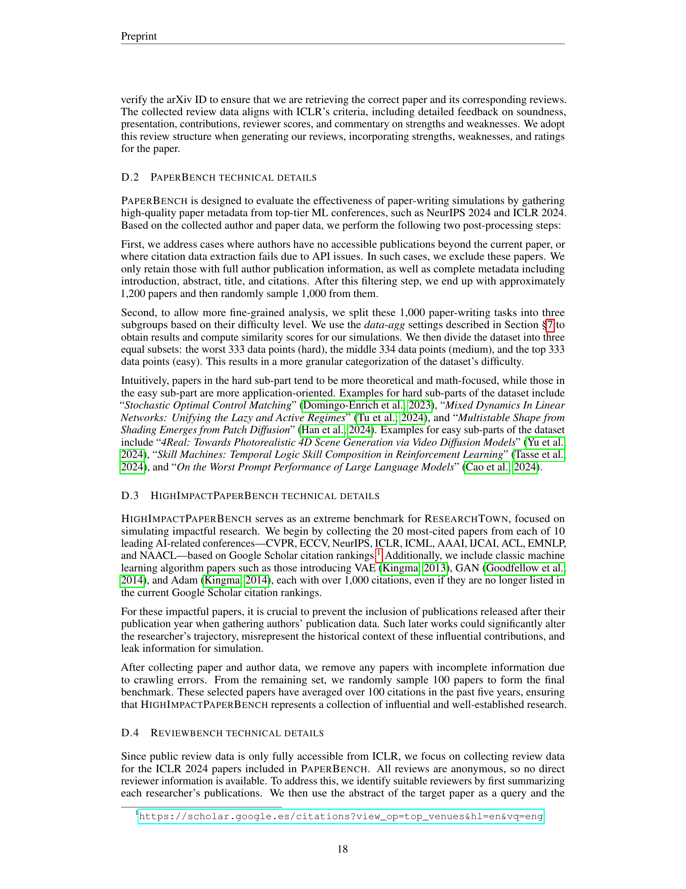

 


 2412.17767 
 Haofei Yu et el. 
 
 🤗 2024-12-24 
 



↗ arXiv


↗ Hugging Face


↗ Papers with Code


### TL;DR



본 연구는 대규모 언어 모ë¸(LLM)ì„ í™œìš©í•˜ì—¬ ì¸ê°„ 연구 ê³µë™ì²´ë¥¼ 시뮬레ì´ì…˜í•˜ëŠ” 새로운 프레ì„워í¬ì¸ RESEARCHTOWNì„ ì œì•ˆí•©ë‹ˆë‹¤. ê¸°ì¡´ì˜ ë‹¤ì—ì´ì „트 시뮬레ì´ì…˜ 연구는 연구 ê³µë™ì²´ì˜ ë³µì¡ì„±ì„ ì¶©ë¶„íˆ ë°˜ì˜í•˜ì§€ 못했지만, RESEARCHTOWNì€ ì—°êµ¬ì와 ë…¼ë¬¸ì„ ì—ì´ì „트-ë°ì´í„° ê·¸ë˜í”„ë¡œ 모ë¸ë§í•˜ê³ , 다양한 연구 활ë™(논문 ì½ê¸°, 쓰기, 검토 등)ì„ ê·¸ë˜í”„ ìƒì—ì„œì˜ ë©”ì‹œì§€ 전달 과정으로 표현합니다.

RESEARCHTOWNì€ ë‹¤ìˆ˜ì˜ ì—°êµ¬ì와 다양한 ë…¼ë¬¸ì„ í¬í•¨í•œ ìƒí™©ì—ì„œë„ ì•ˆì •ì ì¸ 시뮬레ì´ì…˜ì„ 수행하며, 학제 ê°„ 연구 ì•„ì´ë””어를 ìƒì„±í•  수 ìˆìŠµë‹ˆë‹¤. ì—°êµ¬íŒ€ì€ ì‹œë®¬ë ˆì´ì…˜ì˜ í’ˆì§ˆì„ í‰ê°€í•˜ê¸° 위해 RESEARCHBENCHë¼ëŠ” 새로운 벤치마í¬ë¥¼ 개발했습니다. 실험 ê²°ê³¼, RESEARCHTOWNì€ í˜„ì‹¤ì ì¸ 연구 활ë™ì„ 시뮬레ì´ì…˜í•˜ê³ , 다양한 연구 ì•„ì´ë””어를 ìƒì„±í•˜ì—¬, 향후 연구 ë°©í–¥ì„ ì œì‹œí•  ê°€ëŠ¥ì„±ì„ ë³´ì—¬ì¤ë‹ˆë‹¤.



#### Key Takeaways


 LLM ê¸°ë°˜ì˜ ë‹¤ì—ì´ì „트 프레ì„ì›Œí¬ RESEARCHTOWNì„ ì´ìš©í•œ ì¸ê°„ 연구 ê³µë™ì²´ 시뮬레ì´ì…˜ 



 논문 ì‘성, 검토 등 다양한 연구 활ë™ì˜ 현실ì ì¸ 시뮬레ì´ì…˜ ë° í•™ì œ ê°„ 연구 ì•„ì´ë””ì–´ ìƒì„± 



 RESEARCHBENCH 벤치마í¬ë¥¼ 활용한 ê°ê´€ì ì¸ 성능 í‰ê°€ 


#### Why does it matter?
본 ë…¼ë¬¸ì€ **연구 ê³µë™ì²´ë¥¼ 시뮬레ì´ì…˜í•˜ëŠ” 다ì—ì´ì „트 프레ì„워í¬ì¸ RESEARCHTOWN**ì„ ì œì‹œí•˜ì—¬, **LLMì„ í™œìš©í•œ ì¸ê°„ 연구 활ë™ì˜ 현실ì ì¸ 시뮬레ì´ì…˜**ì„ ê°€ëŠ¥í•˜ê²Œ 합니다. ì´ëŠ” ê³¼í•™ì  ë°œê²¬ì˜ ê³¼ì •ì„ ì´í•´í•˜ê³  새로운 연구 ë°©í–¥ì„ ì œì‹œí•˜ëŠ” ë° ê¸°ì—¬í•˜ë©°, **연구 ìë™í™”를 위한 새로운 알고리즘과 시스템 개발**ë¡œ ì´ì–´ì§ˆ 수 ìˆìŠµë‹ˆë‹¤. 특íˆ, 다양한 ë¶„ì•¼ì˜ ì—°êµ¬ì를 연결하여 **학제 ê°„ 연구 ì•„ì´ë””어를 ìƒì„±**하는 ëŠ¥ë ¥ì€ ê¸°ì¡´ ì—°êµ¬ì˜ í•œê³„ë¥¼ 넘어설 ì ì¬ë ¥ì„ 가지고 ìˆìŠµë‹ˆë‹¤.

------
#### Visual Insights

> 🔼 그림 1ì€ ì¸ê°„ 연구 ê³µë™ì²´ë¥¼ ì—ì´ì „트-ë°ì´í„° ê·¸ë˜í”„(즉, 커뮤니티 ê·¸ë˜í”„)ë¡œ 추ìƒí™”하고 단순화한 ëª¨ìŠµì„ ë³´ì—¬ì¤ë‹ˆë‹¤. ì—ì´ì „트-ë°ì´í„° ê·¸ë˜í”„는 연구ì를 ì—ì´ì „트 노드로, 블로그, 코드베ì´ìŠ¤, ë…¼ë¬¸ì„ ë°ì´í„° 노드로 표현합니다. ì¼ë°˜ì„±ì„ ìƒì§€ ì•Šê³ , 연구ì와 논문 ë…¸ë“œë§Œì„ ì‚¬ìš©í•˜ëŠ” ë‹¨ìˆœí™”ëœ ë²„ì „ìœ¼ë¡œ 추ìƒí™”하여, 논문 ì½ê¸°, 논문 쓰기, 논문 리뷰 쓰기 등 중요한 연구 ì‘ì—…ì— ì´ˆì ì„ ë§ì¶¥ë‹ˆë‹¤. ê° ë°ì´í„° 노드는 ì€ë‹‰ ìƒíƒœ h_u를 가지며, ê° ì—ì´ì „트 노드는 ì—ì´ì „트 함수 f_v(·)와 ì€ë‹‰ ìƒíƒœ h_vê°€ ìŒìœ¼ë¡œ ì—°ê²°ë©ë‹ˆë‹¤.
> 

> 
read the caption

> Figure 1: Abstracting and simplifying human research community as an agent-data graph, i.e. community graph. An agent-data graph has researchers as agent nodes and blogs, codebases, and papers as data nodes. Without loss of generality, we abstract it into a simplified version with only researcher and paper nodes and focus on critical research tasks including paper reading, paper writing, and review writing. Each data node has a hidden state husubscriptâ„ğ‘¢h_{u}italic_h start_POSTSUBSCRIPT italic_u end_POSTSUBSCRIPT and each agent node is paired with an agent function fvâ¢(â‹…)subscriptğ‘“ğ‘£â‹…f_{v}(\cdot)italic_f start_POSTSUBSCRIPT italic_v end_POSTSUBSCRIPT ( â‹… ) and a hidden state hvsubscriptâ„ğ‘£h_{v}italic_h start_POSTSUBSCRIPT italic_v end_POSTSUBSCRIPT.
> 


| Experimental Setting | text-embedding-large-3 ↑ |  |  |  | voyage-3 ↑ |  |  |  |
|---|---|---|---|---|---|---|---|---|
|  | Hard | Medium | Easy | Overall | Hard | Medium | Easy | Overall |
|---|---|---|---|---|---|---|---|---|
| Self-agg | 43.08 | 43.60 | 44.26 | 43.65 | 52.78 | 52.60 | 53.17 | 52.85 |
| Agent-agg | 52.32 | 54.77 | 56.75 | 54.61 | 57.05 | 58.77 | 60.39 | 58.74 |
| Data-agg | 55.83 | 67.39 | **76.93** | 66.72 | 60.57 | 69.69 | **78.14** | 69.47 |
| Global-agg | **59.59** | **67.50** | 74.74 | **67.28** | **63.34** | **69.78** | 76.19 | **69.77** |

> 🔼 본 표는 RESEARCHTOWNì„ ì‚¬ìš©í•œ 논문 ì‘성 시뮬레ì´ì…˜ì— 대한 ì„베딩 기반 ìœ ì‚¬ë„ ì ìˆ˜ë¥¼ ë³´ì—¬ì¤ë‹ˆë‹¤. ìœ ì‚¬ë„ ì ìˆ˜ëŠ” ì‹ (10)ì„ ê¸°ë°˜ìœ¼ë¡œ 계산ë˜ì—ˆìœ¼ë©°, 논문 ì‘성 ê³¼ì œì˜ ì„¸ 가지 하위 집합(어려움, 중간, 쉬움)ê³¼ ì „ì²´ ì„±ëŠ¥ì„ ë‚˜íƒ€ëƒ…ë‹ˆë‹¤. ì세한 ì ìˆ˜ëŠ” ë¶€ë¡ Â§Gì— ì œì‹œë˜ì–´ ìˆìŠµë‹ˆë‹¤.
> 

> 
read the caption

> Table 1: Embedding-based similarity scores for paper writing simulation. Similarity scores for paper writing are calculated based on Equation 10. “Hardâ€, “Mediumâ€, and “Easy†correspond to three subsets of the paper writing tasks, while “Overall†refers to the performance across all parts. Detailed scores are shown in Appendix §G.
> 

### In-depth insights

#### Adaptive LLMs
ì ì‘형 LLMs는 **ì •ì  ëª¨ë¸ì˜ 한계를 극복**하고 **변화하는 í™˜ê²½ì— ìœ ì—°í•˜ê²Œ ë°˜ì‘**í•  수 ìˆë„ë¡ ì„¤ê³„ë˜ì—ˆìŠµë‹ˆë‹¤.  **ë°ì´í„° 분í¬ì˜ 변화**나 **사용ì 피드백**ì— ë”°ë¼ ëª¨ë¸ì˜ 매개변수나 ë™ì‘ ë°©ì‹ì„ 조정하여 ì„±ëŠ¥ì„ ìœ ì§€í•˜ê±°ë‚˜ í–¥ìƒì‹œí‚¤ëŠ” ê²ƒì´ í•µì‹¬ì…니다. ì´ëŸ¬í•œ ì ì‘ì„±ì€ **지ì†ì ì¸ 학습(Continual Learning)**, **메타 학습(Meta-Learning)**, **ê°•í™” 학습(Reinforcement Learning)** 등 다양한 ê¸°ë²•ì„ í†µí•´ êµ¬í˜„ë  ìˆ˜ ìˆìœ¼ë©°, ê° ê¸°ë²•ì€ ê³ ìœ í•œ ì¥ë‹¨ì ì„ 가지고 ìˆìŠµë‹ˆë‹¤.  **ë°ì´í„° 효율성**, **ì¼ë°˜í™” 성능**, **실시간 ì ì‘ ì†ë„** ë“±ì´ ì£¼ìš” í‰ê°€ 지표가 ë˜ë©°, 특정 ì‘ìš© ë¶„ì•¼ì— ì í•©í•œ ì ì‘ ì „ëµì„ ì„ íƒí•˜ëŠ” ê²ƒì´ ì¤‘ìš”í•©ë‹ˆë‹¤.  **모ë¸ì˜ 안정성**ê³¼ **í•´ì„ ê°€ëŠ¥ì„±**ì„ í™•ë³´í•˜ëŠ” ê²ƒë„ ì ì‘형 LLMs 개발 과정ì—ì„œ 중요하게 고려해야 í•  요소ì…니다.  **ìœ¤ë¦¬ì  ì¸¡ë©´** ë˜í•œ 간과해서는 안 ë˜ëŠ” 부분으로, ì ì‘ 과정ì—ì„œ ë°œìƒí•  수 ìˆëŠ” í¸í–¥ì´ë‚˜ 예측 ë¶ˆê°€ëŠ¥ì„±ì— ëŒ€í•œ 충분한 검토와 대비가 필요합니다.  **미ë˜ì˜ ì ì‘형 LLMs**는 ë”ìš± **ì •êµí•œ ì ì‘ 메커니즘**ê³¼ **다양한 ì ì‘ ì „ëµ**ì„ ê°–ì¶”ê²Œ ë  ê²ƒì´ë©°, **ì¸ê°„-AI 협업**ì˜ ìƒˆë¡œìš´ 패러다ì„ì„ ì—´ 것으로 예ìƒë©ë‹ˆë‹¤.

#### Multi-agent Graph
다중 ì—ì´ì „트 ê·¸ë˜í”„는 **분산 시스템**ê³¼ **ë³µì¡í•œ ìƒí˜¸ì‘ìš©**ì„ ëª¨ë¸ë§í•˜ëŠ” 강력한 ë„구ì…니다.  ê° ì—ì´ì „트는 ê·¸ë˜í”„ì˜ ë…¸ë“œë¡œ 표현ë˜ê³ , ì—ì´ì „트 ê°„ì˜ ê´€ê³„ëŠ” ì—지를 통해 나타납니다. ì´ëŸ¬í•œ 표현 ë°©ì‹ì€ ì‹œìŠ¤í…œì˜ ë™ì‘ì„ ì´í•´í•˜ê³  예측하는 ë° ìœ ìš©í•˜ë©°, íŠ¹íˆ **대규모 시스템**ì´ë‚˜ **비선형 ë™ì‘**ì„ ë³´ì´ëŠ” ì‹œìŠ¤í…œì— ì í•©í•©ë‹ˆë‹¤.  **ë°ì´í„°ì™€ ì—ì´ì „트** ê°„ì˜ ìƒí˜¸ì‘ìš©ì„ ëª…í™•íˆ ëª¨ë¸ë§í•˜ëŠ” ê²ƒì´ ì¤‘ìš”í•©ë‹ˆë‹¤.  ë°ì´í„°ëŠ” ì—ì´ì „íŠ¸ì˜ ì˜ì‚¬ê²°ì •ì— ì˜í–¥ì„ 미치고, ì—ì´ì „íŠ¸ì˜ í–‰ë™ì€ ë°ì´í„°ë¥¼ 변화시킵니다.  **다양한 ìœ í˜•ì˜ ì—ì´ì „트**와 **ìƒí˜¸ì‘ìš©**ì„ íš¨ê³¼ì ìœ¼ë¡œ 모ë¸ë§í•˜ëŠ” ê²ƒì€ ë‹¤ì¤‘ ì—ì´ì „트 ê·¸ë˜í”„ì˜ ì„¤ê³„ ë° êµ¬í˜„ì—ì„œ 중요한 과제ì…니다.  **ì—ì´ì „íŠ¸ì˜ ì율성**ê³¼ **ì˜ì‚¬ê²°ì • 메커니즘**ì„ ì •ì˜í•˜ëŠ” ê²ƒì€ ì‹œìŠ¤í…œì˜ ì „ë°˜ì ì¸ ë™ì‘ì— ì˜í–¥ì„ 미칩니다.  **ê·¸ë˜í”„ì˜ êµ¬ì¡°** ë˜í•œ ì‹œìŠ¤í…œì˜ ì„±ëŠ¥ê³¼ ì•ˆì •ì„±ì— ì˜í–¥ì„ 미치므로, ê·¸ë˜í”„ì˜ êµ¬ì¡°ë¥¼ 효율ì ìœ¼ë¡œ 설계하는 ê²ƒì´ ì¤‘ìš”í•©ë‹ˆë‹¤.  마지막으로, 다중 ì—ì´ì „트 ê·¸ë˜í”„는 **시뮬레ì´ì…˜**ì´ë‚˜ **분ì„**ì— ì‚¬ìš©ë  ìˆ˜ ìˆìŠµë‹ˆë‹¤.  시뮬레ì´ì…˜ì„ 통해 ì‹œìŠ¤í…œì˜ ë™ì‘ì„ ì˜ˆì¸¡í•˜ê³ , 분ì„ì„ í†µí•´ ì‹œìŠ¤í…œì˜ ì„±ëŠ¥ì„ ê°œì„ í•  수 ìˆìŠµë‹ˆë‹¤.

#### TextGNN Inference
TextGNN ì¶”ë¡ ì€ **í…스트 기반 메시지 전달 과정**ì„ í†µí•´ ì—ì´ì „트-ë°ì´í„° ê·¸ë˜í”„ ìƒì—ì„œ 다양한 연구 활ë™ì„ 모ë¸ë§í•˜ëŠ” 핵심 과정ì…니다.  **LLMì˜ ì»¨í…스트 학습 ë° ì¶”ë¡  능력**ì„ í™œìš©í•˜ì—¬, 연구ì와 ë…¼ë¬¸ì„ ë…¸ë“œë¡œ, 협업 관계를 ì—지로 표현하는 ê·¸ë˜í”„ ìƒì—ì„œ 메시지 ì „ë‹¬ì„ í†µí•´ 논문 ì½ê¸°, ì‘성, 심사 ë“±ì˜ í™œë™ì„ 시뮬레ì´ì…˜í•©ë‹ˆë‹¤.  **TextGNN 계층**ì€ ì—ì´ì „íŠ¸ì˜ ê¸°ëŠ¥ê³¼ ë°ì´í„°ì˜ ì†ì„±ì„ 활용하여 메시지를 ìƒì„±í•˜ê³  집계하는 ê³¼ì •ì„ ë°˜ë³µí•˜ë©°, ê·¸ë˜í”„ ìƒì—ì„œ 정보를 효율ì ìœ¼ë¡œ 전파합니다.  **다양한 연구 활ë™ì˜ í†µí•©ì  ëª¨ë¸ë§**ì€ TextGNN ì¶”ë¡ ì˜ ì£¼ìš” ì¥ì ì´ë©°, 연구 커뮤니티 시뮬레ì´ì…˜ì˜ í˜„ì‹¤ì„±ì„ ë†’ì´ëŠ” ë° ê¸°ì—¬í•©ë‹ˆë‹¤.  하지만, **LLMì˜ í•œê³„**ë¡œ ì¸í•´ ë°œìƒí•  수 ìˆëŠ” **í¸í–¥ì„±, 오류**, 그리고 **계산 비용** ë“±ì˜ ë¬¸ì œì ì„ 고려해야 하며, ì´ëŸ¬í•œ 문제 í•´ê²°ì„ ìœ„í•œ 추가ì ì¸ 연구가 필요합니다.  **실제 연구 활ë™ì˜ ë³µì¡ì„±**ì„ ì™„ë²½íˆ ë°˜ì˜í•˜ê¸°ì—는 한계가 ìˆìœ¼ë¯€ë¡œ, **추가ì ì¸ 개선 ë° í™•ì¥**ì„ í†µí•´ 시뮬레ì´ì…˜ì˜ 정확성과 íš¨ìœ¨ì„±ì„ ë†’ì—¬ì•¼ 합니다.

#### Benchmarking
본 논문ì—ì„œ 'Benchmarking' ì„¹ì…˜ì€ ì œì•ˆëœ ë°©ë²•ë¡ ì˜ ì„±ëŠ¥ì„ í‰ê°€í•˜ê¸° 위한 핵심 요소ì…니다.  **다양한 기준과 지표를 활용하여 ê°ê´€ì ì´ê³  정량ì ì¸ ë¹„êµ ë¶„ì„ì„ ìˆ˜í–‰**하는 ê²ƒì´ ì¤‘ìš”í•˜ë©°, ì´ë¥¼ 통해 ì œì•ˆëœ ë°©ë²•ë¡ ì˜ ê°•ì ê³¼ 약ì ì„ ëª…í™•íˆ íŒŒì•…í•˜ê³ , 기존 ì—°êµ¬ì™€ì˜ ì°¨ë³„ì„±ì„ ì œì‹œí•  수 ìˆìŠµë‹ˆë‹¤.  **ì ì ˆí•œ ë¹„êµ ëŒ€ìƒ ì„ ì •**ì€ ë²¤ì¹˜ë§ˆí‚¹ì˜ ì‹ ë¢°ì„±ì„ ë†’ì´ëŠ”ë° í•„ìˆ˜ì ì´ë©°, **실험 설계 ë° ê²°ê³¼ í•´ì„ì˜ ì—„ë°€ì„±** ë˜í•œ 중요한 í‰ê°€ 요소ì…니다.  **다양한 ë°ì´í„°ì…‹ê³¼ 환경ì—ì„œì˜ ì‹¤í—˜**ì€ ì¼ë°˜í™” ê°€ëŠ¥ì„±ì„ ë†’ì´ëŠ”ë° ê¸°ì—¬í•˜ë©°, **ê²°ê³¼ì˜ í†µê³„ì  ìœ ì˜ì„± ê²€ì¦**ì€ ë²¤ì¹˜ë§ˆí‚¹ì˜ ì‹ ë¢°ë„를 ë”ìš± í–¥ìƒì‹œí‚¬ 수 ìˆìŠµë‹ˆë‹¤.  나아가, 벤치마킹 결과를 바탕으로 **향후 연구 ë°©í–¥ì— ëŒ€í•œ 제언**ì„ ì œì‹œí•˜ëŠ” ê²ƒì€ ë…¼ë¬¸ì˜ ì™„ì„±ë„를 높ì´ëŠ” ë° ì¤‘ìš”í•œ 부분ì…니다.  **í•œê³„ì  ë° ê°œì„  ë°©í–¥ 제시**는 ì—°êµ¬ì˜ íˆ¬ëª…ì„±ì„ í™•ë³´í•˜ê³ , 지ì†ì ì¸ ë°œì „ì„ ìœ„í•œ 토대를 마련하는 ë° ê¸°ì—¬í•  것ì…니다.  ê²°ë¡ ì ìœ¼ë¡œ, 벤치마킹 ì„¹ì…˜ì€ ì—°êµ¬ì˜ ì‹ ë¢°ì„±ê³¼ ì˜í–¥ë ¥ì„ 높ì´ëŠ”ë° ë§¤ìš° 중요한 ì—­í• ì„ í•˜ë¯€ë¡œ, **철저하고 꼼꼼한 계íšê³¼ 분ì„**ì„ í†µí•´ 신뢰할 수 ìˆëŠ” 결과를 ë„출하는 ê²ƒì´ ì¤‘ìš”í•©ë‹ˆë‹¤.

#### Ethical Concerns
연구 ë…¼ë¬¸ì˜ "ìœ¤ë¦¬ì  ê³ ë ¤ 사항" ë¶€ë¶„ì— ëŒ€í•œ 심층ì ì¸ 분ì„ì„ í†µí•´ ì–»ì„ ìˆ˜ ìˆëŠ” í†µì°°ë ¥ì€ ë‹¤ìŒê³¼ 같습니다. **AI ì‹œìŠ¤í…œì˜ í¸í–¥ì„±ê³¼ ì±…ì„ê° ìˆëŠ” 개발 ë° ì‚¬ìš©ì— ëŒ€í•œ ìš°ë ¤**는 필수ì ìœ¼ë¡œ 다루어져야 합니다. 특íˆ, 연구ì—ì„œ ì‚¬ìš©ëœ ë°ì´í„°ì˜ 출처와 í’ˆì§ˆì— ëŒ€í•œ íˆ¬ëª…ì„±ì„ í™•ë³´í•˜ê³ , ì•Œê³ ë¦¬ì¦˜ì˜ í¸í–¥ì„±ì„ 최소화하기 위한 ë…¸ë ¥ì„ ê°•ì¡°í•´ì•¼ 합니다. ë˜í•œ, **ê°œì¸ ì •ë³´ 보호 ë° ë°ì´í„° 프ë¼ì´ë²„ì‹œ**ì— ëŒ€í•œ 엄격한 규정 준수와, **ì €ì‘권 ë° ì§€ì ì¬ì‚°ê¶Œ** 침해 ë°©ì§€ì— ëŒ€í•œ 명확한 ê°€ì´ë“œë¼ì¸ì„ 제시해야 합니다.  **연구 ê²°ê³¼ì˜ ì˜¤ìš© 가능성**ì— ëŒ€í•œ ìš°ë ¤ë„ ì¤‘ìš”í•©ë‹ˆë‹¤.  **연구 결과가 ì‚¬íšŒì— ë¯¸ì¹˜ëŠ” ì˜í–¥**ì— ëŒ€í•œ 심ë„ìˆëŠ” 분ì„ê³¼ ì˜ˆì¸¡ì„ í†µí•´, ì•…ì˜ì ì¸ 목ì ìœ¼ë¡œ í™œìš©ë  ê°€ëŠ¥ì„±ì„ ìµœì†Œí™”í•˜ëŠ” ë°©ì•ˆì„ ëª¨ìƒ‰í•´ì•¼ 합니다. **ì¸ê³µì§€ëŠ¥ ê¸°ìˆ ì˜ ë°œì „ì— ë”°ë¼ ë°œìƒí•  수 ìˆëŠ” 예측 불가능한 ìœ¤ë¦¬ì  ë¬¸ì œë“¤**ì„ ì‚¬ì „ì— ì˜ˆì¸¡í•˜ê³  대비하기 위한 지ì†ì ì¸ 연구 ë° ë…¼ì˜ê°€ 필요합니다. 특íˆ, ì¸ê³µì§€ëŠ¥ ì‹œìŠ¤í…œì˜ ì±…ì„ ì†Œì¬ì™€ ê´€ë ¨ëœ ë²•ì  ë° ì œë„ì  ë¬¸ì œì— ëŒ€í•œ 심층ì ì¸ 검토와 í•´ê²°ì±… ëª¨ìƒ‰ì´ ì¤‘ìš”í•©ë‹ˆë‹¤.  **연구 ê²°ê³¼ì˜ íˆ¬ëª…ì„±ê³¼ ì¬í˜„ 가능성**ì„ ë³´ì¥í•˜ì—¬, ì—°êµ¬ì˜ ì‹ ë¢°ì„±ì„ ë†’ì´ê³  오용 ê°€ëŠ¥ì„±ì„ ìµœì†Œí™”í•´ì•¼ 합니다.

### More visual insights

More on figures

> 🔼 그림 2는 연구 ê³µë™ì²´ë¥¼ ì—ì´ì „트-ë°ì´í„° ê·¸ë˜í”„ë¡œ 단순화하여 모ë¸ë§í•œ RESEARCHTOWN 시뮬레ì´ì…˜ì„ ë³´ì—¬ì¤ë‹ˆë‹¤.  ê¸°ì¡´ì— ì¡´ì¬í•˜ì§€ 않는 논문 노드를 연구 ê³µë™ì²´ ê·¸ë˜í”„ì— ì¶”ê°€í•˜ëŠ” ê³¼ì •ì„ ì„¸ 단계로 나누어 시뮬레ì´ì…˜í•©ë‹ˆë‹¤. 첫 번째 단계는 연구ì ì—ì´ì „트 노드를 추가하는 논문 ì½ê¸° 단계ì´ê³ , ë‘ ë²ˆì§¸ 단계는 ë°ì´í„° 노드를 추가하는 논문 ì‘성 단계ì…니다. 마지막 단계는 ìƒì„±ëœ 노드를 삭제할지 여부를 결정하는 검토 단계ì…니다. ì´ëŸ¬í•œ 다단계 ê³¼ì •ì„ í†µí•´ 연구 ê³µë™ì²´ ë‚´ì—ì„œì˜ ë‹¤ì–‘í•œ 활ë™ì„ 시뮬레ì´ì…˜í•˜ê³ , ìƒì„±ëœ ë…¼ë¬¸ì˜ ì§ˆì„ í‰ê°€í•˜ëŠ” ë° ë„ì›€ì´ ë©ë‹ˆë‹¤.
> 

> 
read the caption

> Figure 2: ResearchTown simulation as TextGNN inference on the community graph. We consider the process of adding a non-existent paper node into the community graph including three stages: paper reading to insert agent nodes, paper writing to insert data nodes, and review writing for deciding whether to drop generated nodes or not.
> 

> 🔼 ì´ ê·¸ë¦¼ì€ 100í¸ì˜ ê³ ì˜í–¥ë ¥ ë…¼ë¬¸ì— ëŒ€í•œ 논문 ì‘성 시뮬레ì´ì…˜ì˜ ìœ ì‚¬ë„ ì ìˆ˜ 분í¬ë¥¼ ë³´ì—¬ì¤ë‹ˆë‹¤. ì—°êµ¬íŒ€ì€ RESEARCHTOWNì´ë¼ëŠ” 다ì—ì´ì „트 프레ì„워í¬ë¥¼ 사용하여 ì¸ê°„ì˜ ì—°êµ¬ ê³µë™ì²´ë¥¼ 시뮬레ì´ì…˜í•˜ê³ , ê·¸ 결과를 RESEARCHBENCHë¼ëŠ” 벤치마í¬ë¥¼ ì´ìš©í•˜ì—¬ í‰ê°€í–ˆìŠµë‹ˆë‹¤. ì´ ê·¸ë¦¼ì€ ì‹œë®¬ë ˆì´ì…˜ 결과가 실제 논문과 얼마나 유사한지를 보여주는 ìœ ì‚¬ë„ ì ìˆ˜ì˜ 분í¬ë¥¼ íˆìŠ¤í† ê·¸ë¨ 형태로 나타냅니다.  ê³ ì˜í–¥ë ¥ 논문ì´ê¸° 때문ì—, ë‚®ì€ ì ìˆ˜ë³´ë‹¤ ë†’ì€ ì ìˆ˜ì˜ 분í¬ê°€ ë” ë§ì„ 것으로 예ìƒë˜ë©°,  RESEARCHTOWNì˜ ì‹œë®¬ë ˆì´ì…˜ ì„±ëŠ¥ì„ ì§ê´€ì ìœ¼ë¡œ 파악하는 ë° ë„ì›€ì´ ë©ë‹ˆë‹¤.
> 

> 
read the caption

> Figure 3: Similarity score distribution for paper writing simulation of 100 high-impact papers.
> 

> 🔼 본 ê·¸ë¦¼ì€ ë…¼ë¬¸ì˜ ì—°êµ¬ ë‚´ìš© 중 í•˜ë‚˜ì¸ RESEARCHTOWNì˜ paper ì‘성 시뮬레ì´ì…˜ì—ì„œ ì¸ìš© ë…¼ë¬¸ì˜ ìˆ˜ê°€ 시뮬레ì´ì…˜ ê²°ê³¼ì— ë¯¸ì¹˜ëŠ” ì˜í–¥ì„ 보여주는 실험 결과를 ë³´ì—¬ì¤ë‹ˆë‹¤.  특íˆ, ì¸ìš© ë…¼ë¬¸ì˜ ìˆ˜ê°€ ì¦ê°€í•¨ì— ë”°ë¼ ì‹œë®¬ë ˆì´ì…˜ì˜ 정확ë„ê°€ 어떻게 변화하는지, 그리고 ì–´ë–¤ ìœ í˜•ì˜ ë…¼ë¬¸ì´ ì‹œë®¬ë ˆì´ì…˜ ê²°ê³¼ì— ê°€ì¥ í° ì˜í–¥ì„ ë¯¸ì¹˜ëŠ”ì§€ì— ëŒ€í•œ ë¶„ì„ ê²°ê³¼ë¥¼ 제시합니다.  ê·¸ë¦¼ì„ í†µí•´ RESEARCHTOWNì´ ì‹¤ì œ 연구 ê³¼ì •ì„ ì–¼ë§ˆë‚˜ 정확하게 모방하는지, 그리고 시뮬레ì´ì…˜ì˜ ê²¬ê³ ì„±ì„ í‰ê°€í•˜ëŠ” ë° ìœ ìš©í•œ 정보를 제공합니다.
> 

> 
read the caption

> Figure 4: Ablation study on the number of cited papers involved in paper writing simulation.
> 

> 🔼 본 ê·¸ë¦¼ì€ ë…¼ë¬¸ì˜ ì—°êµ¬ ê²°ê³¼ 중 하나로, ì—°êµ¬íŒ€ì´ ê°œë°œí•œ RESEARCHTOWN 시뮬레ì´í„°ë¥¼ ì´ìš©í•˜ì—¬ 논문 ì‘성 시뮬레ì´ì…˜ì„ ì§„í–‰í–ˆì„ ë•Œ, 참여 연구ì ìˆ˜ì— ë”°ë¥¸ 시뮬레ì´ì…˜ ê²°ê³¼ì˜ ë³€í™”ë¥¼ ë³´ì—¬ì¤ë‹ˆë‹¤.  구체ì ìœ¼ë¡œ, 다양한 ìˆ˜ì˜ ì—°êµ¬ìê°€ ì°¸ì—¬í–ˆì„ ë•Œ, ìƒì„±ëœ ë…¼ë¬¸ì˜ í’ˆì§ˆ(ìœ ì‚¬ë„ ì ìˆ˜)ì´ ì–´ë–»ê²Œ 달ë¼ì§€ëŠ”지 실험하여 ê·¸ 결과를 ì‹œê°ì ìœ¼ë¡œ 제시합니다.  ì´ëŠ” RESEARCHTOWN 시뮬레ì´í„°ì˜ 강건성과 확ì¥ì„±ì„ í‰ê°€í•˜ê¸° 위한 ì‹¤í—˜ì˜ ì¼ë¶€ì…니다.
> 

> 
read the caption

> Figure 5: Ablation study on the number of researchers involved in paper writing simulation.
> 

> 🔼 그림 6ì€ ì—°êµ¬ 심사 과정 시뮬레ì´ì…˜ì—ì„œ 심사ì ìˆ˜ì˜ ë³€í™”ê°€ 심사 ê²°ê³¼ì— ë¯¸ì¹˜ëŠ” ì˜í–¥ì„ 보여주는 실험 결과를 나타냅니다.  심사ì 수를 늘려가며, 심사 ê²°ê³¼ì˜ ì¼ê´€ì„±ê³¼ ì •í™•ì„±ì´ ì–´ë–»ê²Œ 달ë¼ì§€ëŠ”지, íŠ¹íˆ ì‹¬ì‚¬ì˜ ê°•ì ê³¼ ì•½ì  í‰ê°€ ì ìˆ˜ì— ì–´ë–¤ ì˜í–¥ì„ 주는지 ë³´ì—¬ì¤ë‹ˆë‹¤.  다양한 심사ì ìˆ˜ì— ë”°ë¥¸ ëª¨ë¸ ì„±ëŠ¥ 변화를 통해, RESEARCHTOWN 시뮬레ì´ì…˜ì˜ 견고성과 확ì¥ì„±ì„ í‰ê°€í•©ë‹ˆë‹¤.
> 

> 
read the caption

> Figure 6: Ablation study on the number of reviewers involved in review writing simulation.
> 

> 🔼 그림 7ì€ ResearchTownì—ì„œ ìƒì„±ëœ 학제 ê°„ 연구 ë…¼ë¬¸ì˜ ì˜ˆì‹œì…니다. ê° ì˜ˆì‹œì— ëŒ€í•´ '문제는 무엇ì…니까?' 와 'ë‚´ ì ‘ê·¼ ë°©ì‹ê³¼ ê²°ê³¼ì˜ ì£¼ìš” 구성 요소는 무엇ì…니까?' ë¼ëŠ” ë‘ ê°€ì§€ ì§ˆë¬¸ì— ëŒ€í•œ ResearchTownì˜ ë‹µë³€ì„ í¬í•¨í–ˆìŠµë‹ˆë‹¤. ì´ ë‘ ì§ˆë¬¸ì€ 6ì ˆì—ì„œ ì–¸ê¸‰ëœ 5가지 질문 중 ê°€ì¥ ì¤‘ìš”í•œ 질문ì…니다. ë¶€ë¡ Â§Hì—는 ìœ„ì˜ ë‘ ê°€ì§€ 예시와 ë” ë§ì€ 학제 ê°„ 연구 ì˜ˆì‹œì˜ ì „ì²´ ë‚´ìš©ì´ ë‚˜ì™€ ìˆìŠµë‹ˆë‹¤.
> 

> 
read the caption

> Figure 7: Examples of generated interdisciplinary research papers from ResearchTown. For each example, we include ResearchTown’s responses to two questions: “What is the problem?†and “What are the key components of my approach and results?†as these are the most critical among the five questions mentioned in Section §6. Appendix §H provides the full contents of the above two and more examples for interdisciplinary research.
> 

More on tables


| Experimental Setting | text-embedding-large-3 ↑ |  | voyage-3 ↑ |  | Δs ↓ |
|---|---|---|---|---|---|---|
|  | Strength | Weakness | Strength | Weakness |  |
|---|---|---|---|---|---|---|
| Self-agg | 51.23 | 47.16 | 65.18 | 61.24 | 1.27 |
| Agent-agg | **51.66** | 46.75 | **66.03** | 61.29 | **1.19** |
| Data-agg | 51.45 | **47.62** | 65.57 | **61.74** | 1.26 |
| Global-agg | 51.51 | 47.17 | 66.01 | 61.39 | 1.55 |
> 🔼 í‘œ 2는 ì—°êµ¬íŒ€ì´ ê°œë°œí•œ RESEARCHTOWN 시뮬레ì´í„°ë¥¼ 사용하여 ìƒì„±í•œ 리뷰와 실제 리뷰 ê°„ 유사ë„를 측정한 결과를 ë³´ì—¬ì¤ë‹ˆë‹¤.  ë¦¬ë·°ì˜ ê°•ì ê³¼ 약ì ì— 대한 ìœ ì‚¬ë„ ì ìˆ˜ê°€ Equation 11ì„ ê¸°ë°˜ìœ¼ë¡œ 계산ë˜ì—ˆìœ¼ë©°, Δs는 실제 리뷰 ì ìˆ˜ì™€ ìƒì„±ëœ 리뷰 ì ìˆ˜ì˜ í‰ê·  ì°¨ì´ë¥¼ 나타냅니다.  다양한 실험 설정(Self-agg, Agent-agg, Data-agg, Global-agg) 하ì—ì„œ  text-embedding-large-3와 voyage-3 ë‘ ê°€ì§€ ì„베딩 모ë¸ì„ 사용하여 유사ë„를 í‰ê°€í•˜ì˜€ìŠµë‹ˆë‹¤.  ê° ì„¤ì •ì—ì„œ ê°•ì ê³¼ 약ì ì— 대한 ìœ ì‚¬ë„ ì ìˆ˜ì™€ ì ìˆ˜ ì°¨ì´(Δs)ê°€ 제시ë˜ì–´, RESEARCHTOWNì˜ ë¦¬ë·° ìƒì„± ì„±ëŠ¥ì„ ë‹¤ê°ì ìœ¼ë¡œ 분ì„하고 비êµí•  수 ìˆë„ë¡ í•©ë‹ˆë‹¤.
> 

> 
read the caption

> Table 2: Embedding-based similarity score for review writing simulation. Similarity scores for both strengths and weaknesses of the reviews are calculated based on Equation 11. Δâ¢ğ¬Î”ğ¬\Delta\mathbf{s}roman_Δ bold_s refers to the average difference of review scores between ground-truth ones and generated ones.
> 


| Name | Contribution |
|---|---| 
| **Haofei Yu** | Overall project leader |
| **Zhaochen Hong** | Co-lead, code writing, benchmark collection, review writing experiment |
| **Zirui Cheng** | Co-lead, paper writing, code writing, system design |
| **Kunlun Zhu** | Co-lead, benchmark collection, code writing, paper writing experiment |
| **Keyang Xuan** | Participant, code writing, benchmark collection, case study |
| **Jinwei Yao** | Participant, code writing, evaluation experiment in early versions |
| **Tao Feng** | Co-lead in early versions, paper writing, code writing in early versions |
| **Jiaxuan You** | Overall project advisor |
> 🔼 í‘œ 3ì€ PaperBench ë°ì´í„°ì…‹ì˜ 세 가지 ë‚œì´ë„(Hard, Medium, Easy)ì— ë”°ë¥¸ í…스트 ìœ ì‚¬ë„ ì ìˆ˜ë¥¼ ë³´ì—¬ì¤ë‹ˆë‹¤. 세 가지 ì„베딩 모ë¸(text-embedding-3-large, voyage-3, nv-embed-v2)ì„ ì‚¬ìš©í•˜ì—¬ ê° ì§ˆë¬¸(Q1-Q5)ì— ëŒ€í•œ ìœ ì‚¬ë„ ì ìˆ˜ë¥¼ 계산하고, í‰ê·  ì ìˆ˜(Avg)ë„ í•¨ê»˜ 제시합니다.
> 

> 
read the caption

> Table 3: Detailed embedding-based similarity scores for PaperBench (Hard/Medium/Easy). We include three metrics (text-embedding-3-large, voyage-3, nv-embed-v2). Q1–Q5 are per-question similarity scores; “Avg†is their average.
> 


| Exp setting | text-embedding-3-large |  |  |  |  |  | voyage-3 |  |  |  |  |  | nv-embed-v2 |  |  |  |  |  | 
|---|---|---|---|---|---|---|---|---|---|---|---|---|---|---|---|---|---|---|
|  | Q1 | Q2 | Q3 | Q4 | Q5 | **Avg** | Q1 | Q2 | Q3 | Q4 | Q5 | **Avg** | Q1 | Q2 | Q3 | Q4 | Q5 | **Avg** |
| **PaperBench-hard** |  |  |  |  |  |  |  |  |  |  |  |  |  |  |  |  |  |  |
| Self-agg | 31.69 | 48.89 | 48.64 | 43.51 | 42.69 | 43.08 | 65.11 | 53.89 | 49.67 | 48.09 | 47.15 | 52.78 | 38.03 | 46.67 | 41.81 | 44.05 | 40.75 | 42.26 |
| Agent-agg | 46.72 | 57.45 | 55.80 | 50.74 | 50.92 | 52.32 | 68.51 | 57.20 | 54.41 | 52.51 | 52.64 | 57.05 | 47.10 | 52.51 | 47.50 | 49.69 | 48.41 | 49.04 |
| Data-agg | 49.99 | 62.52 | 59.01 | 54.42 | 53.23 | 55.83 | 71.91 | 62.14 | 56.22 | 56.31 | 56.29 | 60.57 | 50.83 | 58.46 | 52.38 | 53.41 | 52.07 | 53.43 |
| Global-agg | 55.35 | 64.83 | 61.37 | 58.55 | 57.84 | 59.59 | 73.94 | 63.50 | 59.90 | 59.59 | 59.75 | 63.34 | 55.62 | 60.61 | 54.75 | 57.15 | 56.21 | 56.87 |
| **PaperBench-medium** |  |  |  |  |  |  |  |  |  |  |  |  |  |  |  |  |  |  |
| Self-agg | 32.77 | 49.60 | 48.86 | 43.78 | 43.00 | 43.60 | 64.96 | 54.09 | 49.08 | 47.96 | 46.88 | 52.60 | 38.66 | 47.37 | 42.04 | 43.92 | 41.17 | 42.63 |
| Agent-agg | 49.59 | 60.05 | 58.81 | 52.63 | 52.75 | 54.77 | 69.88 | 59.08 | 56.89 | 54.24 | 53.78 | 58.77 | 49.75 | 54.49 | 50.24 | 51.55 | 49.99 | 51.20 |
| Data-agg | 64.33 | 74.84 | 70.57 | 64.42 | 62.78 | 67.39 | 79.63 | 72.05 | 66.93 | 65.18 | 64.64 | 69.69 | 64.53 | 69.27 | 64.28 | 63.04 | 61.75 | 64.57 |
| Global-agg | 65.24 | 73.88 | 69.53 | 64.92 | 63.92 | 67.50 | 79.35 | 71.33 | 67.65 | 65.44 | 65.14 | 69.78 | 65.08 | 68.93 | 62.98 | 63.38 | 62.64 | 64.60 |
| **PaperBench-easy** |  |  |  |  |  |  |  |  |  |  |  |  |  |  |  |  |  |  |
| Self-agg | 33.78 | 50.05 | 48.95 | 44.65 | 43.90 | 44.26 | 65.59 | 54.49 | 49.14 | 48.70 | 47.93 | 53.17 | 39.82 | 47.81 | 42.40 | 44.72 | 42.48 | 43.44 |
| Agent-agg | 52.35 | 61.33 | 60.24 | 54.54 | 55.27 | 56.75 | 71.72 | 60.43 | 58.24 | 55.71 | 55.87 | 60.39 | 52.43 | 56.40 | 51.98 | 53.51 | 53.24 | 53.51 |
| Data-agg | 76.29 | 83.53 | 80.07 | 73.48 | 71.30 | 76.93 | 86.20 | 80.96 | 77.38 | 73.79 | 72.35 | 78.14 | 76.13 | 78.90 | 75.04 | 72.05 | 71.37 | 74.70 |
| Global-agg | 74.75 | 80.25 | 76.57 | 71.54 | 70.60 | 74.74 | 84.82 | 77.91 | 75.37 | 71.78 | 71.09 | 76.19 | 74.59 | 75.77 | 71.23 | 70.15 | 70.28 | 72.41 |
> 🔼 í‘œ 4는 RESEARCHTOWN 시뮬레ì´ì…˜ì—ì„œ TextGNNì˜ Paper Reading 단계ì—ì„œ 사용ë˜ëŠ” ì—ì´ì „트 함수 fu(·)ì— ëŒ€í•œ 메시지 프롬프트 í…œí”Œë¦¿ì„ ë³´ì—¬ì¤ë‹ˆë‹¤.  ì´ í…œí”Œë¦¿ì€ ì—°êµ¬ìì˜ í”„ë¡œí•„ 정보와 관련 ë…¼ë¬¸ì˜ ì´ˆë¡ì„ ì…력받아 연구ìì˜ ê´€ì ì—ì„œ ì‘ì„±ëœ 100~300 단어 ë¶„ëŸ‰ì˜ 1ì¸ì¹­ 서술형 ì¸ë¬¼ 정보를 ìƒì„±í•˜ëŠ” ë° ì‚¬ìš©ë©ë‹ˆë‹¤.  ì´ëŠ” 연구 시뮬레ì´ì…˜ì˜ 초기 단계로서, í›„ì† ì—°êµ¬ 활ë™ì„ 위한 기초 정보를 제공하는 ì—­í• ì„ í•©ë‹ˆë‹¤.
> 

> 
read the caption

> Table 4: Paper reading message prompt template for fuâ¢(â‹…)subscriptğ‘“ğ‘¢â‹…f_{u}(\cdot)italic_f start_POSTSUBSCRIPT italic_u end_POSTSUBSCRIPT ( â‹… ).
> 


| Role | Content |
|---|---| 
| **System** | You are an autonomous intelligent agent tasked with writing the first-person persona of a research based on his publications.   You will be provided with the following information:   Publications - A list of paper abstracts written by the researcher that you will be writing of.   You should provide the following information:   Persona - A comprehensive first-person persona.   You should focus more on recent publications, which reflect the researcher’s recent persona. You should be concise and clear. The persona should be ranging from 100 to 300 words. |
| **User** | Here is the publication history of one researcher:   Publication1:   Learning node embeddings that capture a node’s position within the broader graph structure is crucial for many prediction tasks on graphs. However, existing Graph Neural Network (GNN) architectures have limited power in capturing the position/location of a given node concerning all other nodes of the graph. Here we propose Position-aware Graph Neural Networks (P-GNNs), a new class of GNNs for computing position-aware node embeddings. P-GNN first samples sets of anchor nodes computes the distance of a given target node to each anchor set, and then learns a non-linear distance-weighted aggregation scheme over the anchor sets. This way P-GNNs can capture the positions/locations of nodes concerning the anchor nodes. P-GNNs have several advantages: they are inductive, scalable, and can incorporate node feature information. We apply P-GNNs to multiple prediction tasks including link prediction and community detection. We show that P-GNNs consistently outperform state-of-the-art GNNs, with up to 66% improvement in terms of the ROC AUC score.   …   …   Publication8:   AutoML has demonstrated remarkable success in finding an effective neural architecture for a given machine learning task defined by a specific dataset and an evaluation metric. However, most present AutoML techniques consider each task independently from scratch, which requires exploring many architectures, leading to high computational costs. Here we propose AutoTransfer, an AutoML solution that improves search efficiency by transferring the prior architectural design knowledge to the novel task of interest. Our key innovation includes a task-model bank that captures the model performance over a diverse set of GNN architectures and tasks and a computationally efficient task embedding that can accurately measure the similarity among different tasks. Based on the task-model bank and the task embeddings, we estimate the design priors of desirable models of the novel task, by aggregating a similarity-weighted sum of the top-K design distributions on tasks that are similar to the task of interest. The computed design priors can be used with any AutoML search algorithm. We evaluate AutoTransfer on six datasets in the graph machine learning domain. Experiments demonstrate that (i) our proposed task embedding can be computed efficiently and that tasks with similar embeddings have similar best-performing architectures; (ii) AutoTransfer significantly improves search efficiency with the transferred design priors, reducing the number of explored architectures by an order of magnitude. Finally, we release GNN-Bank-101, a large-scale dataset of detailed GNN training information of 120,000 task-model combinations to facilitate and inspire future research.   Please begin writing the first-person persona that covers the previous research experience. |
| **Assistant** | I am a researcher focused on advancing graph neural networks (GNNs) and machine learning. My key contributions include Position-aware GNNs (P-GNNs) for capturing node positions, Identity-aware GNNs (ID-GNNs) with greater expressive power, and the ROLAND framework for dynamic graph learning. I also study the relationship between neural network structures and their performance using relational graphs and have explored a vast GNN design space to enhance predictive capabilities across diverse tasks. |
| **User** | Here is the publication history of one researcher:   Publication 1: {abstract for paper 1}   …   Publication n: {abstract for paper n}   Please begin writing the first-person persona. |
> 🔼 본 ë…¼ë¬¸ì˜ í‘œ 5는 연구ìê°€ 연구 ë…¼ë¬¸ì„ ì‘성하는 ê³¼ì •ì„ ì‹œë®¬ë ˆì´ì…˜í•˜ê¸° 위한 TextGNN 프레ì„워í¬ì˜ ì¼ë¶€ë¶„으로,  `fa(·)` í•¨ìˆ˜ì— ì…ë ¥ë˜ëŠ” 메시지 프롬프트 í…œí”Œë¦¿ì„ ë³´ì—¬ì¤ë‹ˆë‹¤.  ì´ í…œí”Œë¦¿ì€ ì—°êµ¬ ì£¼ì œì— ëŒ€í•œ ë°°ê²½ 정보와 핵심 ì§ˆë¬¸ë“¤ì„ ë‹´ê³  ìˆìœ¼ë©°, ì´ë¥¼ 통해 AI 모ë¸ì´ ë…¼ë¬¸ì˜ í•µì‹¬ ë‚´ìš©ì„ ìƒì„±í•  수 ìˆë„ë¡ ìœ ë„합니다. 표는 연구 ê³¼ì œì˜ ë¬¸ì œ ì •ì˜, 중요성, 어려움, 기존 ì—°êµ¬ì˜ í•œê³„, 제안하는 방법론 ë° ê¸°ëŒ€ë˜ëŠ” ê²°ê³¼ ë“±ì„ êµ¬ì²´ì ìœ¼ë¡œ 제시하는 프롬프트 예시를 제공합니다.
> 

> 
read the caption

> Table 5: Paper writing message prompt template for faâ¢(â‹…)subscriptğ‘“ğ‘â‹…f_{a}(\cdot)italic_f start_POSTSUBSCRIPT italic_a end_POSTSUBSCRIPT ( â‹… ).
> 


| Role | Content |
|---|---| 
| **User** | Who are you? |
| **Assistant** | {profile} |
| **User** | Here is the content collected from related papers: Paper 1: {abstract for cited paper 1} Paper 2: {abstract for cited paper 2} … Paper n: {abstract for cited paper n} You need to write a research proposal for a paper in the field of Machine Learning based on these related papers. The research proposal should rely more on the cited papers rather than your own research experience. Your research experience should be utilized to select the most useful and valuable papers from the related papers for proposal writing. Here is a high-level summarized insight of the Machine Learning research field. Here are the five core questions: [Question 1] - What is the problem? Formulate the specific research question you aim to address. Only output one question and do not include any more information. [Question 2] - Why is it interesting and important? Explain the broader implications of solving this problem for the research community. Discuss how the paper will affect future research. Discuss how addressing this question could advance knowledge or lead to practical applications. [Question 3] - Why is it hard? Discuss the challenges and complexities involved in solving this problem. Explain why naive or straightforward approaches may fail. Identify any technical, theoretical, or practical obstacles that need to be overcome. MAKE IT CLEAR. [Question 4] - Why hasn’t it been solved before? Identify gaps or limitations in previous research or existing solutions. Discuss any barriers that have prevented this problem from being solved until now. Explain how your approach differs from or improves upon prior work. MAKE IT CLEAR. [Question 5] - What are the key components of my approach and results? Outline your proposed methodology in detail, including the method, dataset, and metric that you plan to use. But you must include these in one paragraph and not use subtitles. Describe the expected outcomes. MAKE IT CLEAR. Please brainstorm the following proposal with the given format.|}
> 🔼 ì´ í‘œëŠ” RESEARCHTOWN 시뮬레ì´ì…˜ì—ì„œ 논문 ì‘성 ê³¼ì •ì˜ ì§‘ê³„ ë‹¨ê³„ì— ì‚¬ìš©ë˜ëŠ” 프롬프트 í…œí”Œë¦¿ì„ ë³´ì—¬ì¤ë‹ˆë‹¤.  여러 ì—°êµ¬ì› ì—ì´ì „트가 ì‘성한 논문 ì´ˆì•ˆë“¤ì„ ì¢…í•©í•˜ì—¬ 최종 ë…¼ë¬¸ì„ ìƒì„±í•˜ëŠ” ê³¼ì •ì„ ì„¤ëª…í•©ë‹ˆë‹¤.  ê° ì´ˆì•ˆì˜ í•µì‹¬ ë‚´ìš©ê³¼ ì¼ê´€ì„± ìˆëŠ” ë¶€ë¶„ì„ íŒŒì•…í•˜ê³  ì´ë¥¼ 바탕으로 í•˜ë‚˜ì˜ í†µí•©ëœ ë…¼ë¬¸ì„ ìƒì„±í•˜ëŠ” ë°©ë²•ì„ ì œì‹œí•©ë‹ˆë‹¤.  프롬프트는 ê° ì´ˆì•ˆì˜ ì£¼ìš” ë‚´ìš©ì„ ìš”ì•½í•˜ê³ , ìƒì¶©ë˜ëŠ” ë¶€ë¶„ì„ ì¡°ì •í•˜ë©°, 최종 논문 ì´ˆì•ˆì„ ëª…í™•í•˜ê³  간결하게 ì‘성하ë„ë¡ ì•ˆë‚´í•©ë‹ˆë‹¤.
> 

> 
read the caption

> Table 6: Paper writing aggregation prompt template for fgâ¢(â‹…)subscriptğ‘“ğ‘”â‹…f_{g}(\cdot)italic_f start_POSTSUBSCRIPT italic_g end_POSTSUBSCRIPT ( â‹… ).
> 


| Role | Content |
|---|---| 
| **User** | Who are you? |
| **Assistant** | {profile} |
| **User** | Here is a high-level summarized insight of a research field: Machine Learning. Here are the five core questions to consider: [Question 1] - What is the problem? [Question 2] - Why is it interesting and important? [Question 3] - Why is it hard? [Question 4] - Why hasn’t it been solved before? [Question 5] - What are the key components of my approach and results? Multiple papers have been generated for the above questions: Paper 1: {agent written paper 1} Paper 2: {agent written paper 2} … Paper n: {agent written paper n} Your task is to summarize and select the key insights that are suitable from these proposals. 1. Identify shared themes and common points among the proposals. 2. Highlight and select any valuable perspectives or contrasting elements and combine them into one proposal. 3. Provide a concise proposal for each question based on the proposal candidates. Output the result in the provided five-question format. Ensure the generated paper is clear, concise, and avoids repeating full proposals verbatim. |
> 🔼 ì´ í‘œëŠ” ë…¼ë¬¸ì˜ 4ì¥ 'RESEARCHTOWN: COMMUNITY GRAPHì— TextGNN ì ìš©' ì„¹ì…˜ì— í¬í•¨ë˜ì–´ ìˆìœ¼ë©°, ì—°êµ¬íŒ€ì´ ê°œë°œí•œ RESEARCHTOWN 시뮬레ì´ì…˜ 프레ì„ì›Œí¬ ë‚´ì—ì„œ TextGNN 모ë¸ì„ ì´ìš©í•œ 연구 리뷰 ì‘성 과정ì—ì„œ 사용ë˜ëŠ” 메시지 ìƒì„± 함수 (fu(·)) ì˜ í”„ë¡¬í”„íŠ¸ í…œí”Œë¦¿ì„ ë³´ì—¬ì¤ë‹ˆë‹¤.  보다 구체ì ìœ¼ë¡œ, 연구 ë¦¬ë·°ì˜ ê°•ì ì„ í‰ê°€í•˜ëŠ” ë¶€ë¶„ì— ì‚¬ìš©ë˜ëŠ” fu(·) í•¨ìˆ˜ì— ì „ë‹¬ë˜ëŠ” í”„ë¡¬í”„íŠ¸ì˜ êµ¬ì¡°ì™€ ë‚´ìš©ì„ ìƒì„¸íˆ 설명합니다. ì´ë¥¼ 통해,  연구 ë¦¬ë·°ì˜ ê¸ì •ì ì¸ ì¸¡ë©´ì„ íš¨ê³¼ì ìœ¼ë¡œ 분ì„하고 ìƒì„±í•˜ëŠ” ë° ì‚¬ìš©ë˜ëŠ” TextGNN 모ë¸ì˜ ì‘ë™ ë°©ì‹ì„ ì´í•´í•˜ëŠ” ë° ë„ì›€ì„ ì¤ë‹ˆë‹¤.
> 

> 
read the caption

> Table 7: Review writing (strength) message prompt template for fuâ¢(â‹…)subscriptğ‘“ğ‘¢â‹…f_{u}(\cdot)italic_f start_POSTSUBSCRIPT italic_u end_POSTSUBSCRIPT ( â‹… ).
> 


| Role | Content |
|---|---| 
| **System** | You are an autonomous intelligent agent tasked to review a submission to an academic conference.   You should write the strength of this paper.   You will be provided with the following information:   Submission - Full content of the submitted paper.   You should provide the following information:   Strength - Advantages and strengths of the submission that can improve its chances to be accepted. |
| **User** | Here is your profile:   {profile}   Here is the submission:   {full content for paper}   Here are the abstracts of the cited papers:   Paper 1: {abstract for cited paper 1}   Paper 2: {abstract for cited paper 2}   …   Paper n: {abstract for cited paper n}   Please evaluate the submission based on the following criteria:   Clarity: Is the writing clear, structured, and terms defined?   Baselines: Are baseline comparisons relevant, sufficient, and not excessive?   Novelty: Is the approach innovative or distinct from prior work?   Results: Are improvements significant, well-supported, and statistically robust?   Limitations: Are weaknesses acknowledged and future work discussed?   Related Work: Are key references cited and connections made?   Technical: Are methods detailed enough for replication?   Please combine both the ideas and the experiments in the submission when evaluating it.   When commenting on the experiments, refer to the exact numbers from the experiments.   Please begin writing the strength of the submission.   It should be 200 words long.   Please write in bullet points.   Do not limit yourself to the aforementioned criteria, like clarity, baselines, novelty, results, limitations, related work, and technical.   You should also use your previous experience in your profile when analyzing the submission. |
> 🔼 ì´ í‘œëŠ” ë…¼ë¬¸ì˜ 4ì¥ 'RESEARCHTOWN: Community Graphì— TextGNN ì ìš©' ì„¹ì…˜ì— ìˆëŠ” í‘œ 8ì…니다.  `fu(â‹…)`는 ì—ì´ì „트 함수(Agent Function)를 나타내며, ì´ í•¨ìˆ˜ëŠ” 연구ìì˜ ì—­í• ì„ ìˆ˜í–‰í•˜ëŠ” LLM(Large Language Model) ì—ì´ì „íŠ¸ì˜ í”„ë¡œì„¸ìŠ¤ë¥¼ ì •ì˜í•©ë‹ˆë‹¤.  구체ì ìœ¼ë¡œ, ì´ í‘œëŠ” 연구 리뷰 과정ì—ì„œ ì œì¶œëœ ë…¼ë¬¸ì˜ ì•½ì (weakness)ì„ í‰ê°€í•˜ê¸° 위해 LLM ì—ì´ì „트가 사용하는 메시지 프롬프트 í…œí”Œë¦¿ì„ ë³´ì—¬ì¤ë‹ˆë‹¤.  프롬프트 템플릿ì—는 연구ìì˜ í”„ë¡œí•„, ì œì¶œëœ ë…¼ë¬¸ 전문, ì¸ìš© 논문 ì´ˆë¡ ë“±ì´ í¬í•¨ë˜ì–´ ìˆìœ¼ë©°, LLM ì—ì´ì „트는 ì´ëŸ¬í•œ 정보를 바탕으로 ë…¼ë¬¸ì˜ ì•½ì ì„ 분ì„하고 í‰ê°€í•˜ì—¬ ìš”ì•½ëœ í˜•íƒœë¡œ 제시합니다.  즉, 연구 ë¦¬ë·°ì˜ '약ì ' ë¶€ë¶„ì— ëŒ€í•œ LLM ì—ì´ì „íŠ¸ì˜ ì§ˆì˜ ë‚´ìš©ì„ êµ¬ì²´ì ìœ¼ë¡œ ì •ì˜í•œ 템플릿ì…니다.
> 

> 
read the caption

> Table 8: Review writing (weakness) message prompt template for fuâ¢(â‹…)subscriptğ‘“ğ‘¢â‹…f_{u}(\cdot)italic_f start_POSTSUBSCRIPT italic_u end_POSTSUBSCRIPT ( â‹… ).
> 


| Role | Content |
|---|---| 
| **System** | You are an autonomous intelligent agent tasked to review a submission to an academic conference.   You should write the weaknesses of this paper.   You will be provided with the following information:   Submission - Full content of the submitted paper.   You should provide the following information:   Weakness - Disadvantages and drawbacks of the submission that must be improved before it can be accepted.   You should notice that the abstract might not cover every detail, so you shouldn’t be overly strict. |
| **User** | Here is your profile:   {profile}   Here is the submission:   {full content for paper}   Here are the abstracts of the cited papers:   Paper 1: {abstract for cited paper 1}   Paper 2: {abstract for cited paper 2}   …   Paper n: {abstract for cited paper n}   Please evaluate the submission based on the following criteria:   Clarity: Is the writing clear, structured, and terms defined?   Baselines: Are baseline comparisons relevant, sufficient, and not excessive?   Novelty: Is the approach innovative or distinct from prior work?   Results: Are improvements significant, well-supported, and statistically robust?   Limitations: Are weaknesses acknowledged and future work discussed?   Related Work: Are key references cited and connections made?   Technical: Are methods detailed enough for replication?   Please combine both the ideas and the experiments in the submission when evaluating it.   When commenting on the experiments, refer to the exact numbers from the experiments.   Please begin writing the strength of the submission.   It should be 200 words long.   Please write in bullet points.   Do not limit yourself to the aforementioned criteria, like clarity, baselines, novelty, results, limitations, related work, and technical.   You should also use your previous experience in your profile when analyzing the submission. |
> 🔼 ì´ í‘œëŠ” ë…¼ë¬¸ì˜ í‰ê°€ 섹션ì—ì„œ 사용ë˜ëŠ” `fu(·)` í•¨ìˆ˜ì— ëŒ€í•œ 메시지 프롬프트 í…œí”Œë¦¿ì„ ë³´ì—¬ì¤ë‹ˆë‹¤.  `fu(·)` 함수는 í‰ê°€ìì˜ ì—­í• ì„ í•˜ëŠ” LLM ì—게 전달ë˜ëŠ” 지침으로, ì œì¶œëœ ë…¼ë¬¸ì— ëŒ€í•œ ì ìˆ˜ë¥¼ 매기는 ë° ì‚¬ìš©ë©ë‹ˆë‹¤.  표는 í‰ê°€ìì˜ í”„ë¡œí•„, ë…¼ë¬¸ì˜ ìš”ì•½, ì¥ì , ë‹¨ì  ë“±ì„ í¬í•¨í•˜ëŠ” 다양한 정보를 제공하여 í‰ê°€ì 모ë¸ì´ ì ìˆ˜ë¥¼ ì‚°ì •í•  수 ìˆë„ë¡ ë•ìŠµë‹ˆë‹¤. ì ìˆ˜ëŠ” 1ì ì—ì„œ 10ì ê¹Œì§€ 매겨지며, ê° ì ìˆ˜ì—는 해당 ì ìˆ˜ê°€ 주어지는 기준과 ì„¤ëª…ì´ í¬í•¨ë˜ì–´ ìˆìŠµë‹ˆë‹¤. 즉, ì´ í‘œëŠ” LLM 기반 í‰ê°€ ì‹œìŠ¤í…œì˜ êµ¬ì²´ì ì¸ ë™ì‘ ë°©ì‹ì„ 보여주는 세부ì ì¸ ì§€ì¹¨ì„ ì œê³µí•˜ëŠ” ì—­í• ì„ í•©ë‹ˆë‹¤.
> 

> 
read the caption

> Table 9: Review writing (score) message prompt template for fuâ¢(â‹…)subscriptğ‘“ğ‘¢â‹…f_{u}(\cdot)italic_f start_POSTSUBSCRIPT italic_u end_POSTSUBSCRIPT ( â‹… ).
> 


| Role | Content |
|---|---| 
| **System** | You are an autonomous intelligent agent tasked to score the following submission.   You should act as a professional and fair member of that conference to score.   The score should be between 1 and 10, where 1 is the lowest and 10 is the highest.   You will be provided with the following information:   Paper - Full content of a submission to an academic conference.   Strengths - Strengths of the submission.   Weakness - Weakness of the submission.   You should provide the following information:   Score - A score between 1 to 10 to evaluate the overall quality of the submission to an academic journal. It should be one of 1, 2, …, 10. 1 is the lowest score while 10 is the highest score.   You should just provide one number as the score and nothing else.   Please evaluate the submission based on the summarized strengths and weaknesses provided. The score should be more related to weakness. If there is a critical weakness in the submission, you should give a lower score. If the submission has a minor weakness, you can give a higher score. If the submission has no weakness, you should give a high score. But the strengths should also be considered in the evaluation. |
| **User** | Here is your profile:   {profile}   Here is the strength of the paper:   {strength}   Here is the weakness of the paper:   {weakness}   Please refer to the rubrics below to evaluate the submission:   10/10: The submission is in the top 2% of all papers. It changed my thinking on its topic, being one of the most thorough, convincing, and well-written papers I have ever read. I will fight for this paper to be accepted.   8/10: The submission is among the top 10% of all the papers. It provides sufficient justification for all its arguments and claims. Some extra experimentation is needed, but they are not essential. The proposed method is very original and can generalize to various fields. This submission deepens the understanding of some phenomena, or lowers the bar for future research on an existing problem.   6/10: The submission gives sufficient support for its major arguments or claims. However, some minor points are not well justified and need extra support or details. The proposed method is moderately original, and it is generalizable to various fields. The submission itself is not particularly innovative, so it would not be a significant loss if it were not accepted.   5/10: Some of the major arguments or claims are not sufficiently justified. There exist major weaknesses in technical or methodological aspects. The proposed method is somewhat original, and it is generalizable to various fields. I am more on the side of rejection, but I can be convinced otherwise.   3/10: The submission makes only marginal contributions to the field.   1/10: The submission is not sufficiently thorough for publication or is not relevant to the conference.   Your score is: [score] |
> 🔼 í‘œ 10ì€ ì—°êµ¬íŒ€ì´ ì œì•ˆí•œ RESEARCHTOWN 시뮬레ì´ì…˜ 프레ì„ì›Œí¬ ë‚´ì—ì„œ 여러 í‰ê°€ìì˜ ê°•ì  í‰ê°€ë¥¼ 종합하여 최종 ê°•ì  í‰ê°€ë¥¼ ìƒì„±í•˜ëŠ” ê³¼ì •ì„ ë³´ì—¬ì£¼ëŠ” 프롬프트를 ë³´ì—¬ì¤ë‹ˆë‹¤.  ì´ í”„ë¡¬í”„íŠ¸ëŠ” í‰ê°€ìë“¤ì´ ì œì¶œí•œ ë¦¬ë·°ì˜ ê°•ì  ë¶€ë¶„ì„ ìš”ì•½í•˜ê³ , ì´ë¥¼ 바탕으로 ë…¼ë¬¸ì˜ ì „ë°˜ì ì¸ ê°•ì ì„ í‰ê°€í•˜ëŠ” ë° ì‚¬ìš©ë©ë‹ˆë‹¤.  ì´ë¥¼ 통해, ì—°êµ¬íŒ€ì€ ë‹¤ì–‘í•œ í‰ê°€ìì˜ ì˜ê²¬ì„ 종합ì ìœ¼ë¡œ ë°˜ì˜í•˜ì—¬ ë”ìš± 정확하고 ê°ê´€ì ì¸ í‰ê°€ë¥¼ 수행할 수 ìˆë„ë¡ í•˜ì˜€ìŠµë‹ˆë‹¤.
> 

> 
read the caption

> Table 10: Review writing (strength) aggregation prompt template for fgâ¢(â‹…)subscriptğ‘“ğ‘”â‹…f_{g}(\cdot)italic_f start_POSTSUBSCRIPT italic_g end_POSTSUBSCRIPT ( â‹… ).
> 


| Role | Content |
|---|---| 
| **System** | You are an autonomous intelligent agent tasked to write the strength of the submission for the following submission you have made to an academic conference. Your summary of strength should summarize the reviews to help the reviewers make a decision.  You will be provided with the following information:  Submission - Full content of the paper submitted to this conference.  Reviews - It typically contains the score, strength, and weakness of the submission, each by a different reviewer.  You should provide the following information:  Strength - The strength of the submission based on the reviews. |
| **User** | Here is the paper:  {full content of paper}  Here are the reviews:  Review 1: {review 1}  Review 2: {review 2}  …  Review n: {review n}  Please summarize the important points from the ‘strength’ section of the reviews.  Please write in bullet points. It should be 200 words long.|
> 🔼 ì´ í‘œëŠ” ë…¼ë¬¸ì˜ 5ì¥ 'RESEARCHTOWN: COMMUNITY GRAPHì— TEXTGNN ì ìš©' ì„¹ì…˜ì— ì†í•˜ë©°, 연구ìë“¤ì´ ì‘성한 ë¦¬ë·°ì˜ ì•½ì ì„ 종합하여 요약하는 ë° ì‚¬ìš©ë˜ëŠ”  `fg(·)` í•¨ìˆ˜ì˜ ì…ë ¥ 프롬프트를 ë³´ì—¬ì¤ë‹ˆë‹¤.  함수는 ì œì¶œëœ ë…¼ë¬¸ì˜ ì „ì²´ ë‚´ìš©ê³¼ ê° ë¦¬ë·°ì–´ê°€ ì‘성한 리뷰(ì ìˆ˜, ê°•ì , ì•½ì  í¬í•¨)를 ì…력받아 ë¦¬ë·°ì˜ ì•½ì ì„ 요약한 í…스트를 ìƒì„±í•©ë‹ˆë‹¤.  200단어 ì´ë‚´ì˜ 글머리 기호 형ì‹ìœ¼ë¡œ ì‘성하ë„ë¡ ì§€ì‹œë˜ì–´ ìˆìœ¼ë©°, 명확성, 기준선, 참신성, ê²°ê³¼, 한계, 관련 연구, ê¸°ìˆ ì  ì„¸ë¶€ 사항 ë“±ì˜ ê¸°ì¤€ì„ ê³ ë ¤í•˜ì—¬ í‰ê°€í•˜ë„ë¡ ë˜ì–´ìˆìŠµë‹ˆë‹¤.  ë¦¬ë·°ì–´ì˜ í”„ë¡œí•„ê³¼ ì´ì „ ê²½í—˜ë„ ë¶„ì„ì— í™œìš©í•˜ë„ë¡ ë˜ì–´ìˆìŠµë‹ˆë‹¤.
> 

> 
read the caption

> Table 11: Review writing (weakness) aggregation prompt template for fgâ¢(â‹…)subscriptğ‘“ğ‘”â‹…f_{g}(\cdot)italic_f start_POSTSUBSCRIPT italic_g end_POSTSUBSCRIPT ( â‹… ).
> 


| Role | Content |
|---|---| 
| **System** | You are an autonomous intelligent agent tasked to write the weakness of the submission for the following submission you have made to an academic conference. Your summary of weakness should summarize the reviews to help the reviewers make a decision.   You will be provided with the following information:   Submission - Full content of the paper submitted to this conference.   Reviews - It typically contains the score, weakness, and weakness of the submission, each by a different reviewer.   You should provide the following information:   Weakness - The weakness of the submission based on the reviews. |
| **User** | Here is the paper:   {full content of paper}   Here are the reviews:   Review 1: {review 1}   Review 2: {review 2}   …   Review n: {review n}   Please summarize the important points from the ‘weakness’ section of the reviews.   Please write in bullet points. It should be 200 words long.|
> 🔼 ì´ í‘œëŠ” 실제 연구 논문ì—ì„œ ì‚¬ìš©ëœ ë°ì´í„°(논문 ì´ˆë¡)를 가지고,  연구 제안서를 ì‘성하는 ë° í•„ìš”í•œ 다섯 가지 질문(문제 ì •ì˜, 중요성, 어려움, 기존 ì—°êµ¬ì˜ í•œê³„, 제안하는 방법 ë° ê²°ê³¼)ì— ëŒ€í•œ ë‹µë³€ì„ ìƒì„±í•˜ê¸° 위한 프롬프트(지시문) 형ì‹ì„ ë³´ì—¬ì¤ë‹ˆë‹¤.  즉,  연구ìë“¤ì´ ì‹¤ì œ ë°ì´í„°ë¥¼ 바탕으로 연구 제안서를 ì‘성할 ë•Œ ì–´ë–¤ ë°©ì‹ìœ¼ë¡œ 프롬프트를 활용할 수 ìˆëŠ”지 예시를 제공하는 í‘œì…니다.  ê° ì§ˆë¬¸ì— ëŒ€í•œ ë‹µë³€ì„ ëª…í™•í•˜ê³  구체ì ìœ¼ë¡œ ì‘성하ë„ë¡ ì•ˆë‚´í•˜ëŠ” 형ì‹ìœ¼ë¡œ 구성ë˜ì–´ ìˆìŠµë‹ˆë‹¤.
> 

> 
read the caption

> Table 12: Format transformative prompt for real-world papers.
> 


| Role | Content |
|---|---| 
| User | Here is a high-level summarized insight of a research field of machine learning.   Here are the five core questions:   [Question 1] - What is the problem?   Formulate the specific research question you aim to address.   Only output one question and do not include any more information.   [Question 2] - Why is it interesting and important?   Explain the broader implications of solving this problem for the research community.   Discuss how such paper will affect the future research.   Discuss how addressing this question could advance knowledge or lead to practical applications.   [Question 3] - Why is it hard?   Discuss the challenges and complexities involved in solving this problem.   Explain why naive or straightforward approaches may fail.   Identify any technical, theoretical, or practical obstacles that need to be overcome.   MAKE IT CLEAR.   [Question 4] - Why hasn’t it been solved before?   Identify gaps or limitations in previous research or existing solutions.   Discuss any barriers that have prevented this problem from being solved until now.   Explain how your approach differs from or improves upon prior work.   MAKE IT CLEAR.   [Question 5] - What are the key components of my approach and results?   Outline your proposed methodology in detail, including the method, dataset, metric that you plan to use. Describe the expected outcomes.   MAKE IT CLEAR.   The introduction of paper:   {introduction section of paper}   Please provide the five core questions contents based on the above content.|
> 🔼 ì´ í‘œëŠ” 실제 연구 ë…¼ë¬¸ì˜ ë¦¬ë·°(ê°•ì  ë° ì•½ì )ì— ëŒ€í•œ í˜•ì‹ ë³€í™˜ 프롬프트를 ë³´ì—¬ì¤ë‹ˆë‹¤.  프롬프트는 ë¦¬ë·°ì˜ ê°•ì  ë˜ëŠ” 약ì ì„ 요약하고, ê°ê°ì— 대해 간결하고 명확한 ìš”ì•½ì„ ìƒì„±í•˜ëŠ” ì§€ì¹¨ì„ ì œê³µí•©ë‹ˆë‹¤.  프롬프트는 리뷰 ì‘성ìê°€ 리뷰 ë‚´ìš©ì„ ì •ë¦¬í•˜ê³  표현하는 ë° ë„ì›€ì´ ë˜ë„ë¡ ì„¤ê³„ë˜ì—ˆìŠµë‹ˆë‹¤.
> 

> 
read the caption

> Table 13: Format transformative prompt for real-world reviews.
> 


| Role | Content |
|---|---| 
| **System** | You are a helpful agent. |
| **User** | {strength/weakness}   Please rewrite the following strength in bullet points.   Do not include anything else.   Start from ’-’ for each bullet point. |
> 🔼 본 ë…¼ë¬¸ì˜ Table 14는 PaperBench-easy ë°ì´í„°ì…‹ì„ 사용하여 연구 논문 ì‘성 시뮬레ì´ì…˜ì˜ 결과를 ë³´ì—¬ì¤ë‹ˆë‹¤.  PaperBench-easy는 ë‚œì´ë„ê°€ 쉬운 논문 ì‘성 ê³¼ì œë“¤ì„ ëª¨ì•„ë†“ì€ ë°ì´í„°ì…‹ì…니다. 표는 연구 문제, í¥ë¯¸ë¡œìš´ ì , 어려운 ì , 기존 ì—°êµ¬ì˜ í•œê³„ì , 그리고 ì œì•ˆëœ ë°©ë²•ê³¼ 결과를 다섯 가지 질문으로 나누어 실제 ë…¼ë¬¸ì˜ ì´ˆë¡ê³¼ RESEARCHTOWNì´ ìƒì„±í•œ 논문 ì´ˆë¡ì„ 비êµí•˜ì—¬ ë³´ì—¬ì¤ë‹ˆë‹¤. ì´ë¥¼ 통해 RESEARCHTOWNì´ ì–¼ë§ˆë‚˜ 현실ì ì¸ 연구 ë…¼ë¬¸ì„ ìƒì„±í•˜ëŠ”지 확ì¸í•  수 ìˆìŠµë‹ˆë‹¤.
> 

> 
read the caption

> Table 14: Case study on paper writing results of PaperBench-easy.
> 


| PaperBench-easy **Task** |  |  |
|---|---|---|
| The Marginal Value of Momentum for Small Learning Rate SGD |  |  |
| PaperBench-easy **Output** |  |  |
| **Question** | **Reference Paper** | **Generated Paper** |
| What is the problem? | How can we theoretically establish the benefits of momentum in stochastic gradient descent methods for deep learning, particularly in the presence of stochastic gradient noise? | How can we effectively leverage momentum-based optimization methods in stochastic gradient descent (SGD) to enhance the generalization performance of deep learning models, particularly when trained on large-scale datasets with noisy labels and large batch sizes? |
| Why is it interesting and important? | Understanding the role of momentum in stochastic optimization is crucial for the research community as it can lead to more stable and efficient training of deep learning models. If we can theoretically prove the advantages of momentum in the presence of noise, it could reshape optimization strategies, leading to faster convergence rates and improved performance in various applications. This advancement could also inspire new methodologies that leverage momentum more effectively, potentially influencing future research directions in optimization techniques. | This research is significant as it addresses the growing trend of using large batch sizes in deep learning, which can lead to poorer generalization performance. By improving our understanding of momentum-based methods, we can enhance model robustness and efficiency in real-world applications across various domains, including healthcare, finance, and autonomous systems. Insights gained could inform future optimization strategies, balancing training efficiency with generalization capabilities. |
| Why is it hard? | The challenge lies in the inherent stochasticity introduced by mini-batch sampling, which can obscure the true gradient and complicate the analysis of momentum’s effects. Naive approaches may fail because they do not account for the noise’s impact on convergence rates, leading to misleading conclusions. Additionally, the theoretical frameworks established for noiseless scenarios do not directly translate to the stochastic case, creating a significant gap in understanding. Overcoming these complexities requires rigorous mathematical analysis and potentially new theoretical tools. | The complexity arises from the intricate dynamics between momentum parameters, learning rates, and the stochastic nature of gradient updates, especially in the presence of noisy labels and large batch sizes. Naive implementations may lead to suboptimal convergence and generalization due to the interaction of these factors. Additionally, the theoretical understanding of momentum’s effects in non-convex optimization landscapes is still limited, complicating the design of effective algorithms. |
| Why hasn’t it been solved before? | Previous research has primarily focused on the noiseless case or has not rigorously analyzed the stochastic setting, leading to gaps in understanding momentum’s role in noisy environments. Existing studies often conclude that momentum does not provide a significant speedup compared to vanilla SGD, but they lack a comprehensive theoretical framework that addresses the stochastic nature of deep learning. Our approach aims to fill this gap by providing a more nuanced analysis that considers the effects of stochastic gradient noise on momentum’s performance. | Previous research has often focused on either the empirical performance of momentum methods or their theoretical foundations in isolation, neglecting the combined effects of noise and batch size on optimization dynamics. Many studies have not adequately explored how momentum can be optimally tuned in noisy environments or how it interacts with varying batch sizes. This gap has hindered a comprehensive understanding of momentum’s role in SGD. |
| What are the key components of my approach and result? | Our proposed methodology involves a rigorous theoretical analysis of momentum in stochastic gradient descent, utilizing a combination of mathematical modeling and empirical validation. We will analyze various datasets to evaluate the performance of standard SGDM against modified versions that account for stochastic noise. The key metrics for evaluation will include convergence rates and stability of training loss. We expect to demonstrate that momentum can indeed stabilize the optimization process and lead to faster convergence in the presence of noise, thereby providing a solid theoretical foundation for its use in deep learning. | I propose to develop a novel momentum-based optimization algorithm that dynamically adjusts momentum parameters based on the noise level in the training data and the batch size. This will involve conducting experiments on benchmark datasets such as CIFAR-10 and ImageNet, evaluating performance against standard SGD and existing momentum methods using metrics like accuracy and generalization error. The expected outcome is a robust optimization algorithm that demonstrates improved generalization performance and provides practical guidelines for effectively applying momentum in SGD, particularly in challenging training scenarios characterized by noise and large-scale data. |
> 🔼 ì´ í‘œëŠ” ë…¼ë¬¸ì˜ PAPERBENCH-medium ë¶€ë¶„ì— ëŒ€í•œ 사례 연구 결과를 ë³´ì—¬ì¤ë‹ˆë‹¤.  PAPERBENCH-mediumì€ ì¤‘ê°„ ë‚œì´ë„ì˜ ë…¼ë¬¸ ì‘성 과제를 다룬 ë°ì´í„°ì…‹ì…니다.  í‘œì—는 참고 논문(Reference Paper)ì˜ ì§ˆë¬¸(What is the problem? 등)ê³¼ RESEARCHTOWNì´ ìƒì„±í•œ 논문(Generated Paper)ì˜ í•´ë‹¹ ì§ˆë¬¸ì— ëŒ€í•œ ë‹µë³€ì´ ë‚˜ë€íˆ 제시ë˜ì–´ ìˆìŠµë‹ˆë‹¤.  ê° ì§ˆë¬¸ì— ëŒ€í•œ 참고 ë…¼ë¬¸ì˜ ë‹µë³€ê³¼ ìƒì„±ëœ ë…¼ë¬¸ì˜ ë‹µë³€ì„ ë¹„êµí•˜ì—¬ RESEARCHTOWNì˜ ì„±ëŠ¥ì„ í‰ê°€í•  수 ìˆìŠµë‹ˆë‹¤.  특íˆ, 문제 ì •ì˜, 중요성, 어려움, 기존 ì—°êµ¬ì˜ í•œê³„, 제안 방법 ë° ê²°ê³¼ 등 연구 ì „ë°˜ì— ê±¸ì¹œ ì¸¡ë©´ì„ ë¹„êµ ë¶„ì„하여 RESEARCHTOWNì´ ì‹¤ì œ 연구 과정과 얼마나 유사하게 ë…¼ë¬¸ì„ ìƒì„±í•˜ëŠ”지 확ì¸í•  수 ìˆìŠµë‹ˆë‹¤.
> 

> 
read the caption

> Table 15: Case study on paper writing results of PaperBench-medium.
> 


| PaperBench-medium **Task** | L4GM: Large 4D Gaussian Reconstruction Model |  | 
|---|---|---|
| PaperBench-medium **Output** |  |  | 
| **Question** | **Reference Paper** | **Generated Paper** | 
| What is the problem? | How can we efficiently generate high-quality animated 3D assets from monocular videos or text inputs? | How can we effectively generate high-fidelity 4D dynamic scenes from monocular video inputs while ensuring spatial-temporal consistency and realistic motion representation? | 
| Why is it interesting and important? | Solving this problem has significant implications for the research community as it addresses the growing demand for automated tools in 3D content creation, which is currently a labor-intensive process. By enabling the generation of animated 3D assets from easily accessible data sources, this research could democratize access to 3D modeling, fostering innovation in fields such as gaming, virtual reality, and film. Furthermore, it could lead to advancements in related areas like computer vision and generative modeling, paving the way for future research that explores more complex 4D content editing and real-time applications. | This problem is critical for advancing computer vision and graphics, particularly in applications such as virtual reality, gaming, and film production. By enabling the generation of dynamic 3D scenes from single-view inputs, we can democratize access to high-quality content creation tools, allowing artists and developers to produce immersive experiences without extensive resources. This research could lead to breakthroughs in automated content generation, enhancing user experiences and paving the way for innovations in interactive media and AI-driven storytelling. | 
| Why is it hard? | The challenges in solving this problem stem from the need for high-quality 4D reconstruction from limited input data, such as monocular videos. Naive approaches may fail due to the inherent complexity of accurately capturing temporal dynamics and spatial details from a single viewpoint. Additionally, existing methods often rely on extensive multiview data, which is costly and time-consuming to collect. The fragility of score distillation techniques and the computational intensity of current models further complicate the task, necessitating innovative solutions to achieve both speed and quality in 4D reconstruction. | Generating 4D dynamic scenes from monocular videos is challenging due to the inherent ambiguity of single-view data, which limits the ability to accurately infer depth and motion dynamics. The lack of comprehensive datasets and the complexities of ensuring temporal coherence and spatial consistency add further difficulty. Existing methods often struggle with maintaining high visual fidelity while capturing the intricate relationships between appearance and motion, leading to artifacts and inconsistencies in the generated output. | 
| Why hasn’t it been solved before? | Previous research has been limited by the reliance on multiview data, which restricts applicability due to the high costs associated with data collection. Additionally, existing methods, such as video score distillation, are often slow and sensitive to input variations, leading to inconsistent results. The lack of a large-scale dataset specifically designed for training models on 4D reconstruction has also been a barrier. Our approach differs by leveraging a new dataset of 12 million multiview videos and introducing a feed-forward model that incorporates temporal self-attention, allowing for faster and more reliable 4D reconstruction. | Previous research has primarily focused on static scene reconstruction or required multi-view inputs, which are not always available in practical scenarios. Techniques like Neural Radiance Fields (NeRF) have shown promise but often rely on extensive optimization and multi-view data, limiting their applicability. Additionally, many existing methods do not effectively disentangle motion from appearance, leading to challenges in generating realistic animations. The lack of a unified framework that integrates both 3D and 2D diffusion models has hindered progress in this area. | 
| What are the key components of my approach and result? | Our proposed methodology, L4GM, utilizes a large-scale dataset of 12 million multiview videos to train a 4D Large Reconstruction Model that reconstructs sequences of 3D Gaussians from monocular video inputs. The model employs temporal self-attention layers to ensure consistency across frames and includes an interpolation model to enhance output frame rates. | We propose a novel two-stage framework that first utilizes a 3D-aware image diffusion model to generate a high-quality static 3D asset from monocular video input. The second stage will involve optimizing a deformable neural radiance field to learn motion dynamics, ensuring temporal coherence and spatial consistency. Our methodology will be evaluated using diverse datasets of monocular videos, employing metrics such as visual fidelity, temporal consistency, and user preference assessments. The expected outcomes include the generation of realistic 4D scenes that maintain high-quality visual appearance and coherence across frames, significantly advancing the state-of-the-art in dynamic scene generation. | 
> 🔼 ì´ í‘œëŠ” ë…¼ë¬¸ì˜ PAPERBENCH-hard 섹션ì—ì„œ 연구ìë“¤ì´ ìƒì„±í•œ ë…¼ë¬¸ì˜ ê²°ê³¼ë¥¼ ë³´ì—¬ì¤ë‹ˆë‹¤.  PAPERBENCH-hard는 어려운 과제로 êµ¬ì„±ëœ ë²¤ì¹˜ë§ˆí¬ ë°ì´í„°ì…‹ì´ë©°, ì´ í‘œì—는 연구ìë“¤ì´ ì œì‹œí•œ 문제, ê·¸ 중요성, 어려움, 기존 ì—°êµ¬ì˜ í•œê³„, 그리고 ì œì•ˆëœ ë°©ë²• ë° ê²°ê³¼ì— ëŒ€í•œ ì„¤ëª…ì´ í¬í•¨ë˜ì–´ ìˆìŠµë‹ˆë‹¤.  ê° ì—´ì€ ì°¸ì¡° 논문, ìƒì„±ëœ 논문, 그리고 질문(문제 ì •ì˜, 중요성, 어려움, 기존 ì—°êµ¬ì˜ í•œê³„, ì œì•ˆëœ ë°©ë²•)ì— ëŒ€í•œ 답변으로 구성ë©ë‹ˆë‹¤.  ì´ë¥¼ 통해 연구ìë“¤ì´ ì œì‹œí•œ ë¬¸ì œì— ëŒ€í•œ 다양한 ê´€ì ê³¼ í•´ê²° ë°©ì•ˆì„ ë¹„êµ ë¶„ì„í•  수 ìˆìŠµë‹ˆë‹¤.
> 

> 
read the caption

> Table 16: Case study on paper writing results of PaperBench-hard.
> 


| PaperBench-hard **Task** | Provably Robust Conformal Prediction with Improved Efficiency |  |
|---|---|---|
| PaperBench-hard **Output** |  |  |
| **Question** | **Reference Paper** | **Generated Paper** |
| What is the problem? | How can we enhance the robustness of conformal prediction methods against adversarial examples while maintaining computational efficiency? | How can we develop a robust and efficient framework for conformal prediction that maintains valid coverage guarantees in the presence of adversarial perturbations and label noise in machine learning classification tasks? |
| Why is it interesting and important? | Solving this problem is crucial for the research community as it addresses the growing concern of adversarial attacks on machine learning models, particularly in safety-critical applications. By improving the robustness of conformal prediction, we can ensure more reliable uncertainty quantification, which is essential for decision-making processes in fields such as healthcare, finance, and autonomous systems. This research could pave the way for future studies that explore more resilient predictive models and lead to practical applications where trustworthiness and safety are paramount. | This problem is critical for enhancing the reliability of machine learning models, especially in high-stakes applications such as medical diagnosis and autonomous systems, where incorrect predictions can have severe consequences. By improving conformal prediction methods to effectively handle adversarial conditions and label noise, we can provide more trustworthy uncertainty quantification. This advancement is essential for the practical deployment of AI systems, fostering greater confidence in their predictions and enabling their use in diverse domains like finance, healthcare, and security. |
| Why is it hard? | The challenges in solving this problem stem from the inherent complexity of adversarial attacks, which can manipulate model predictions in subtle ways. Naive approaches may fail because they do not account for the diverse nature of adversarial perturbations, leading to inadequate coverage guarantees. Additionally, the computational overhead associated with randomized smoothing techniques complicates the implementation of robust conformal prediction, as it requires extensive sampling and can significantly increase training time. Overcoming these technical and practical obstacles is essential to develop an effective solution. | The challenge arises from the complexities associated with label noise and adversarial perturbations, which can distort data distributions and violate the assumptions of traditional conformal prediction methods. Existing approaches often fail to account for the adversarial nature of noise or the distribution shifts that occur during inference. Additionally, ensuring valid coverage guarantees while maintaining model performance requires sophisticated techniques that balance robustness and accuracy, complicating the design of effective algorithms. |
| Why hasn’t it been solved before? | Previous research has primarily focused on either conformal prediction or adversarial robustness, often treating them as separate domains. Limitations in existing solutions include a lack of comprehensive methods that integrate robust conformal prediction with adversarial noise handling. Barriers such as insufficient understanding of the interaction between conformal prediction and adversarial examples have hindered progress. Our approach differs by providing a robust conformal training method that does not introduce additional computational costs at test time, thus addressing both robustness and efficiency. | Previous research has largely focused on either conformal prediction under ideal conditions or on adversarial robustness without integrating these two aspects. Many existing methods lack a unified framework that effectively combines conformal prediction with robust techniques against label noise and adversarial attacks. The absence of formal guarantees for coverage in the presence of such perturbations has hindered practical applicability, leaving a gap that our approach aims to fill. |
| What are the key components of my approach and result? | Our proposed methodology involves developing a robust conformal prediction (RSCP) framework that utilizes randomized smoothing to enhance adversarial robustness. We will employ datasets such as CIFAR10 for evaluation and measure performance using metrics like coverage probability and computational efficiency. The expected outcomes include demonstrating that our RSCP method maintains robust coverage guarantees against adversarial perturbations while minimizing computational overhead during both training and testing phases, thus enabling the use of larger base models without increased costs. | We propose a novel framework that integrates probabilistically robust conformal prediction with adversarial training techniques. Our methodology will involve developing an adaptive conformal prediction algorithm that utilizes a quantile-of-quantile approach to establish thresholds for both clean and perturbed data. We will evaluate our approach on benchmark datasets such as CIFAR-10, CIFAR-100, and ImageNet, using metrics like coverage probability and prediction set size to assess performance. The expected outcomes include improved coverage guarantees under adversarial conditions, reduced prediction set sizes, and enhanced computational efficiency, ultimately leading to a more reliable framework for uncertainty quantification in machine learning. |
> 🔼 HighImpactPaperBench는 기존 연구ì—ì„œ ì¸ìš© 빈ë„ê°€ ë†’ì€ 100ê°œì˜ ë…¼ë¬¸ì„ ëŒ€ìƒìœ¼ë¡œ 연구 시뮬레ì´ì…˜ì„ 수행한 결과를 보여주는 í‘œì…니다.  ê° ë…¼ë¬¸ì— ëŒ€í•´ 연구 문제, ì—°êµ¬ì˜ ì¤‘ìš”ì„±, 어려움, 기존 ì—°êµ¬ì˜ í•œê³„, 연구 방법 ë° ê²°ê³¼ 등 다섯 가지 핵심 ì§ˆë¬¸ì— ëŒ€í•œ 참조 ë…¼ë¬¸ì˜ ë‹µë³€ê³¼ RESEARCHTOWNì´ ìƒì„±í•œ ë‹µë³€ì„ ë¹„êµí•˜ì—¬, RESEARCHTOWNì˜ ì„±ëŠ¥ì„ í‰ê°€í•©ë‹ˆë‹¤.  특íˆ, íšê¸°ì ì¸ ë°©ë²•ë¡ ì„ ì†Œê°œí•˜ëŠ” 논문ì´ë‚˜ 새로운 주제를 다루는 논문ì—서는 ìœ ì‚¬ë„ ì ìˆ˜ê°€ 낮게 나오는 반면, 분ì„ì´ë‚˜ ë„구 ê°œë°œì— ì´ˆì ì„ ë§ì¶˜ 논문ì—서는 ìœ ì‚¬ë„ ì ìˆ˜ê°€ 높게 나타납니다.
> 

> 
read the caption

> Table 17: Case study on paper writing results of HighImpactPaperBench.
> 


| HighImpactPaperBench Task | GLIDE: Towards Photorealistic Image Generation and Editing with Text-Guided Diffusion Models |  |
|---|---|---|
| HighImpactPaperBench Output |  |  |
| **Question** | **Reference Paper** | **Generated Paper** |
| What is the problem? | How can we develop a model that generates photorealistic images from natural language prompts while maintaining fidelity to the specified content? | How can we effectively generate high-resolution, semantically coherent, and diverse images from textual descriptions while ensuring fairness and reducing computational costs in text-to-image synthesis models? |
| Why is it interesting and important? | Solving this problem has significant implications for the research community as it bridges the gap between natural language processing and computer vision, enabling more intuitive and accessible content creation. This advancement could lead to practical applications in various fields, such as digital art, advertising, and education, where users can generate tailored visual content effortlessly. Furthermore, it could inspire future research into more sophisticated generative models that integrate multimodal data, enhancing our understanding of how language and visual perception interact. | This problem is significant as it bridges the gap between natural language processing and computer vision, enhancing applications in creative industries such as content creation, advertising, and virtual reality. Improving the quality and diversity of generated images can lead to more accurate visual storytelling and better user experiences. Additionally, addressing fairness in AI-generated content is crucial for ethical deployment, ensuring that diverse demographic groups are accurately represented and not perpetuated by biases. |
| Why is it hard? | The challenges in solving this problem include the complexity of accurately interpreting natural language prompts and translating them into detailed visual representations. Naive approaches may fail due to the inherent ambiguity in language and the difficulty of capturing intricate details like lighting, shadows, and textures in generated images. Additionally, achieving a balance between photorealism and adherence to the prompt requires overcoming technical obstacles related to model training, data representation, and the integration of different generative techniques. | The challenges arise from the complexity of aligning nuanced textual descriptions with visual representations, which often leads to issues of semantic drift and loss of detail. Existing models may struggle with maintaining high fidelity and diversity in generated images, particularly when trained on biased datasets that lack representation. Furthermore, the computational demands of current methods can hinder accessibility and scalability, making it difficult to experiment with more efficient training paradigms. |
| Why hasn’t it been solved before? | Previous research has primarily focused on either generating images from text or achieving photorealism, but not both simultaneously. Limitations in existing models often stem from their inability to effectively combine the strengths of text-conditional and unconditional image generation techniques. Barriers such as insufficient training data, lack of robust evaluation metrics, and the complexity of integrating multiple generative approaches have hindered progress. Our approach aims to address these gaps by leveraging diffusion models, classifier guidance, and CLIP to enhance both the quality and relevance of generated images. | Previous research has often focused on improving either the quality of generated images or the alignment between text and images, but few have successfully integrated these aspects into a unified framework. Many existing models rely on complex architectures that require extensive labeled datasets and computational resources, limiting their practical application. Additionally, insufficient emphasis on fairness and representation in training datasets has hindered progress in creating inclusive generative models. |
| What are the key components of my approach and result? | Our proposed methodology involves using diffusion models augmented with classifier-free guidance and CLIP for image generation. We will train our model on a diverse dataset of images and corresponding text prompts, employing metrics such as Inception Score and Fr0̆0e9chet Inception Distance to evaluate the quality of generated images. The expected outcomes include the generation of high-fidelity images that accurately reflect the content of the prompts, along with improved performance in detecting and filtering out undesired content, such as images containing people, thereby enhancing the model’s applicability in real-world scenarios. | We propose a novel framework that combines a Denoising Diffusion Probabilistic Model (DDPM) with contrastive learning techniques to enhance text-to-image synthesis. This approach will utilize a balanced dataset that includes diverse demographic representations, focusing on effective text-image feature alignment. We will evaluate our model using metrics such as Inception Score (IS) and Fr0̆0e9chet Inception Distance (FID) to assess both image quality and fairness. The expected outcomes include high-quality, diverse images that accurately reflect the input text while demonstrating equitable performance across various demographic categories, ultimately setting a new standard for fairness and efficiency in generative models. |
> 🔼 í‘œ 18ì€ ë…¼ë¬¸ì˜ REVIEWBENCH ì„¹ì…˜ì— ìˆëŠ”, 연구ìë“¤ì´ ì‘성한 ë¦¬ë·°ì— ëŒ€í•œ 사례 연구 결과를 ë³´ì—¬ì¤ë‹ˆë‹¤.  ê° ë¦¬ë·°ì— ëŒ€í•´ 'ê°•ì (Strength)'ê³¼ '약ì (Weakness)'ì„ í‰ê°€í•œ 참여ìë“¤ì˜ ì˜ê²¬ê³¼ ì ìˆ˜ë¥¼ ë¹„êµ ë¶„ì„하여, RESEARCHTOWN 시뮬레ì´ì…˜ì˜ 정확성과 한계를 ë³´ì—¬ì¤ë‹ˆë‹¤.  ë¦¬ë·°ì˜ í’ˆì§ˆì„ í‰ê°€í•˜ëŠ” 기준(명확성, 기준선, 참신성, ê²°ê³¼, 한계ì , 관련 연구, ê¸°ìˆ ì  ì¸¡ë©´)ì„ ê¸°ë°˜ìœ¼ë¡œ, 실제 리뷰와 RESEARCHTOWN 시뮬레ì´ì…˜ ê²°ê³¼ ê°„ì˜ ì°¨ì´ë¥¼ 분ì„하여 ì‹œìŠ¤í…œì˜ ê°•ì ê³¼ 약ì ì„ 구체ì ìœ¼ë¡œ 제시합니다.  ì´ë¥¼ 통해 RESEARCHTOWN 시뮬레ì´ì…˜ì˜ 신뢰성과 향후 개선 ë°©í–¥ì— ëŒ€í•œ í†µì°°ë ¥ì„ ì œê³µí•©ë‹ˆë‹¤.
> 

> 
read the caption

> Table 18: Case study on review writing results of ReviewBench.
> 


| Attribute | Reference Review | Generated Review |
|---|---|---|
| **Strength** | - Understanding how to better design datasets is an important and timely problem, with many open challenges remaining. - This paper presents a significant step forward in that direction, making it of interest to many in the community. - The research is likely to have a substantial impact on practitioners looking to build better multimodal models. - The overall idea is straightforward and easy to understand. - The paper presents good empirical results demonstrating increased accuracy when the proposed method is used to filter data. - The filtering method was applied to the LAION dataset, leading to the development of a newly curated dataset. - Trained models on the curated dataset were tested across a decent number of downstream tasks. - The paper’s findings align with other works emphasizing the importance of data quality, such as [1]. - The motivation of this paper is reasonable. - Some experimental results are impressive. - Emphasizes the importance of data cleaning in deep learning, specifically addressing noise in image datasets. - Identifies a significant issue in LAION’s dataset, revealing that nearly 40% of images have text overlapping their captions. - Employs a creative method to mask and restore text regions by using the average color of surrounding pixels, enhancing data quality. - Introduces a similarity score calculation between images and captions as a novel filtering technique. - Demonstrates robustness through extensive evaluation on multiple baselines, ranging from 2 million to 128 million images. | - Innovative Approach: The submission presents the T-MARS method, a novel data filtering technique that enhances visual representation learning by addressing text dominance in image-caption pairs, filling a critical gap in multimodal training. - Significant Results: T-MARS demonstrates substantial accuracy improvements, outperforming competitive baselines by up to 6.5% on the DataComp benchmark, showcasing its effectiveness in real-world applications. - Comprehensive Evaluation: The authors conduct extensive evaluations across multiple datasets, including LAION and DataComp, providing a thorough analysis of filtering metrics and validating the effectiveness of T-MARS. - Acknowledgment of Limitations: The authors thoughtfully discuss potential biases introduced by data filtering and suggest future work to refine their approach, indicating a mature understanding of the research landscape. - Strong Related Work Context: The paper effectively situates its contributions within existing literature, referencing key studies and demonstrating how T-MARS builds upon and diverges from prior methodologies. - Technical Rigor: The methodology is well-detailed, allowing for replication, which is crucial for advancing research in multimodal language models. - Clear Structure and Clarity: The paper is generally well-structured, with a logical flow that aids comprehension, although some sections could benefit from improved clarity. | 
| **Weakness** | - The paper lacks large-scale experiments. - Running large-scale CLIP pre-training experiments can be prohibitively expensive for many institutions. - The authors present clear scaling trends that indicate their approach has great promise for larger scales. - The motivation for the work is weak and lacks a theoretical analysis of why text-only images degrade visual learning compared to mislabeled data. - Chapter 3 performs a manual analysis of 500 sample images from the LAION dataset to categorize them based on the correlation between image features and captions but lacks metrics to quantify the representativeness of this sample within the entire dataset. - Additional details provided in the appendix are appreciated; however, the work would benefit from more experiments, details, and analytics. - A larger random sample with statistical estimates of error bars on proportions is recommended. - Chapter 6 is difficult to follow; a rewrite to better present the experiments would be beneficial. - The methodology relies on CLIP score for filtering, which can be noisy and introduce additional biases, and the current version of the paper does not address this concern. - The writing of this paper is somewhat obscure, making it difficult to follow. - Is it possible to directly remove all the text in the images? This may help reduce distractions. - It would be better to conduct experiments on more datasets, in addition to LAION. - The proposed method has only been evaluated using accuracy as a metric, which may not provide a comprehensive understanding and could introduce bias for other important metrics. - The overlap of text with the image caption may hinder the learning of visual features. A dedicated subsection discussing various solutions to this issue could provide valuable insights for researchers, rather than relying solely on the masking technique. | - Clarity Issues: The writing lacks clarity in several sections, especially in the methodology, making it difficult for readers to understand the filtering algorithms (C-SSFT, C-RHO, T-MARS) and their operational mechanics. - Baseline Relevance: The relevance of some baseline comparisons is questionable, with insufficient justification for selecting specific baselines like C-SSFT and C-RHO, which may mislead readers regarding the significance of T-MARS’s performance. - Novelty Concerns: The novelty of the T-MARS method is not convincingly articulated, as it does not sufficiently differentiate itself from existing methods like SemDeDup and DataComp, raising questions about its overall contribution to the field. - Statistical Robustness: The reported accuracy gains (3.3% and 6.5%) lack comprehensive statistical validation, and the small pilot study sample size of 500 raises concerns about the generalizability of the findings. - Superficial Limitations Discussion: The discussion of limitations is superficial, failing to explore the implications of potential biases introduced by data filtering on model performance. - Insufficient Technical Details: The methods section lacks sufficient detail for replication, particularly regarding hyper-parameter settings and specific configurations used in experiments, hindering reproducibility. |
> 🔼 본 ë…¼ë¬¸ì˜ í‘œ 19는 ResearchTownì„ ì‚¬ìš©í•˜ì—¬ LLMê³¼ ì²œë¬¸í•™ì„ ê²°í•©í•œ 학제 ê°„ 연구 ë…¼ë¬¸ì„ ì‘성하는 사례 연구를 ë³´ì—¬ì¤ë‹ˆë‹¤. ì´ ì‚¬ë¡€ 연구는 천문학ì—ì„œ 사용ë˜ëŠ” 모ë¸ë§ ê¸°ë²•ì„ ë…ì°½ì ìœ¼ë¡œ ì ìš©í•˜ì—¬ ì‹œê°„ì— ë”°ë¥¸ 언어 스타ì¼ì˜ 변화를 íƒêµ¬í•˜ëŠ” ì•„ì´ë””어를 제시합니다.  즉, ì²œë¬¸í•™ì  ëª¨ë¸ë§ ê¸°ë²•ì„ ì–¸ì–´í•™ì  ë¶„ì„ì— ì ìš©í•˜ì—¬ 언어 스타ì¼ì˜ 변화를 분ì„하고, ê·¸ 과정ì—ì„œ 나타나는 ë™ì—­í•™ì  íŒ¨í„´ì„ ê·œëª…í•˜ê³ ì 하는 연구ì…니다.  ì´ë¥¼ 통해 ì–¸ì–´ì˜ ì§„í™” ë° ë°œì „ì— ëŒ€í•œ 새로운 ì´í•´ë¥¼ 제시하고, 컴퓨테ì´ì…”ë„ ì–¸ì–´í•™, 사회언어학, ì¸ê³µì§€ëŠ¥ 등 다양한 ë¶„ì•¼ì— ëŒ€í•œ 실질ì ì¸ ì ìš© ê°€ëŠ¥ì„±ì„ ëª¨ìƒ‰í•©ë‹ˆë‹¤.
> 

> 
read the caption

> Table 19: Case study on using ResearchTown to write interdisciplinary research papers combining LLM and Astronomy. The idea creatively applies modeling techniques from astrophysics to explore how language styles evolve over time.
> 


| ResearchTown Input |
|---|---| 
| **Researcher** | 4 
× NLP researchers + 2 
× astronomy researchers |
| **Paper** | MagicPIG: LSH Sampling for Efficient LLM Generation |
|  | Do LLMs exhibit human-like response biases? A Case study in survey design |
|  | A Survey of Large Language Models |
|  | WebArena: A Realistic Web Environment for Building Autonomous Agents |
|  | Gaia Data Release 3: Summary of the content and survey properties |
|  | Validation of SDSS-derived kinematic models for the Milky Way’s disk and halo stars |
|  | The Simons Observatory: Science goals and forecasts |
| ResearchTown Output |
|---|---| 
| **Question** | **Answer** |
| What is the problem? | The specific research question addressed in this proposal is: How can kinematic modeling techniques from astrophysics be applied to analyze and understand the evolution of writing styles in large-scale linguistic datasets? |
| Why is it interesting and important? | This research bridges the gap between astrophysics and linguistics, providing a novel interdisciplinary approach to studying language evolution. By applying kinematic modeling, we can uncover dynamic shifts in writing styles that may reflect broader cultural and environmental influences. The implications for the research community are profound; this study could lead to new methodologies in linguistic analysis and enhance our understanding of language development across different families. Furthermore, the insights gained could inform practical applications in fields such as computational linguistics, sociolinguistics, and artificial intelligence, advancing the understanding of how language adapts and evolves in response to societal changes. |
| Why is it hard? | Solving this problem presents several challenges. Firstly, the complexity of language is inherently multifaceted, with numerous variables influencing writing styles, including cultural context, authorial intent, and historical events. Traditional linguistic analysis may not adequately capture these dynamic shifts, as they often rely on static models. Moreover, applying astrophysical kinematic models requires a deep understanding of both fields, necessitating interdisciplinary expertise. Naive approaches that merely replicate astrophysical models without adapting for linguistic nuances are likely to fail, as they may overlook critical contextual elements. Additionally, the sheer volume of linguistic data presents technical obstacles in terms of data processing and analysis, requiring robust machine learning algorithms to identify and classify transient phenomena accurately. |
| Why hasn’t it been solved before? | Previous research has largely focused on static analyses of linguistic datasets, often missing the dynamic aspects of language evolution. Existing solutions have been limited by the lack of interdisciplinary approaches that integrate methodologies from other fields, such as astrophysics. Additionally, there has been a scarcity of comprehensive datasets that span significant temporal and cultural shifts in language use. Barriers such as insufficient computational resources and the complexity of developing suitable machine learning models have also hindered progress. This proposal distinguishes itself by employing advanced kinematic modeling techniques, which have not been previously applied to linguistic datasets, thus offering a fresh perspective and a more nuanced understanding of language evolution. |
| What are the key components of my approach and result? | The proposed methodology involves developing a framework that integrates kinematic modeling techniques with machine learning algorithms to analyze linguistic datasets. We will utilize large-scale corpora from diverse language families, focusing on historical texts to capture changes in syntax, vocabulary, and stylistic elements over time. Specifically, we will adapt kinematic models by defining linguistic â€velocity†metrics that quantify shifts in writing style, analogous to how velocities are analyzed in astrophysics. Key metrics will include the frequency and distribution of linguistic features over time, allowing for the identification of transient phenomena in language use. Expected outcomes include the classification of dynamic shifts in writing styles and the elucidation of relationships between linguistic evolution and cultural or environmental influences. This research aims to produce a robust, interdisciplinary framework that enhances our understanding of language dynamics, paving the way for future studies in both linguistics and adjacent fields. Furthermore, we will address ethical considerations by ensuring respectful treatment of historical texts and acknowledging the limitations of drawing parallels between astrophysical phenomena and linguistic evolution. |
> 🔼 í‘œ 20ì€ ì—°êµ¬ 논문ì—ì„œ ResearchTownì„ ì‚¬ìš©í•˜ì—¬ LLMê³¼ ë²”ì£„í•™ì„ ê²°í•©í•œ 학제 ê°„ 연구 ë…¼ë¬¸ì„ ì‘성하는 사례 연구를 ë³´ì—¬ì¤ë‹ˆë‹¤. ì´ ì•„ì´ë””어는 실시간 ìŒì„± 번역과 ì§ˆì  ì„œìˆ  분ì„ì„ í†µí•©í•˜ëŠ” 다중 모달 LLMì„ ì°½ì˜ì ìœ¼ë¡œ 활용하여 ìˆ˜ê° ìƒí™œì˜ ì˜í–¥ì„ 받는 지역 ì‚¬íšŒì˜ ì˜ì‚¬ì†Œí†µì„ 개선하는 ê²ƒì„ ëª©í‘œë¡œ 합니다.
> 

> 
read the caption

> Table 20: Case study on using ResearchTown to write interdisciplinary research papers combining LLM and Criminology. The idea creatively utilizes a multimodal LLM to integrate qualitative narrative analysis with real-time speech translation, aiming to enhance communication for communities impacted by mass incarceration.
> 


| ResearchTown Input | 
|---|---| 
| **Researchers** | 2 
× NLP researcher + 3 
× Criminology researcher | 
| **Paper** | MagicPIG: LSH Sampling for Efficient LLM Generation | 
|  | Do LLMs exhibit human-like response biases? A Case study in survey design | 
|  | A Survey of Large Language Models | 
|  | WebArena: A Realistic Web Environment for Building Autonomous Agents | 
|  | Collateral Consequences of Punishment: A Critical Review and Path Forward | 
|  | Criminal organizations exhibit hysteresis, resilience, and robustness by balancing security and efficiency | 
| ResearchTown Output |  | 
|---|---| 
| **Question** | **Answer** | 
| What is the problem? | The specific research question I aim to address is: How can a multimodal large language model that integrates qualitative narrative analysis with real-time speech translation effectively address the communication needs of communities affected by mass incarceration? | 
| Why is it interesting and important? | Solving this problem holds significant implications for both the research community and society at large. The integration of qualitative narrative analysis with real-time speech translation can enhance our understanding of the complex social dynamics and personal experiences of individuals affected by mass incarceration. By capturing and translating ḧaunting narrativesẗhat reflect the legacies of state violence, this research can contribute to the broader discourse on restorative justice and community resilience. Furthermore, the outcomes of this study could inform emergency response strategies, ensuring that vulnerable populations receive appropriate support during crises. This advancement in knowledge not only has the potential to improve communication practices but also to influence policy and practical applications in social justice and community support initiatives. | 
| Why is it hard? | The challenges in addressing this problem are multifaceted. First, the integration of qualitative narrative analysis with real-time speech translation requires sophisticated algorithms that can accurately interpret and convey nuanced meanings, particularly in emotionally charged narratives. Naive approaches may fail to capture the socio-cultural context essential for effective communication, leading to misinterpretations and potentially harmful consequences. Additionally, there are technical hurdles in processing multimodal data2̆014combining text, audio, and contextual cues2̆014while ensuring the model remains sensitive to the lived experiences of marginalized communities. The theoretical complexities of understanding and representing narratives of trauma and resilience further complicate the development of a robust model. | 
| Why hasn’t it been solved before? | Previous research has often focused on either qualitative narrative analysis or speech translation in isolation, overlooking the critical intersection of these fields. Existing solutions have been limited by their inability to adapt translations based on socio-cultural contexts, which is vital for accurately conveying personal stories from affected communities. Barriers such as a lack of interdisciplinary collaboration and insufficient datasets that reflect the experiences of those impacted by mass incarceration have also hindered progress. My approach differs by explicitly incorporating narrative analysis into the translation process and prioritizing socio-cultural contextualization, thus addressing the gaps in prior work and providing a more holistic solution. | 
| What are the key components of my approach and result? | My proposed methodology involves developing a multimodal large language model that utilizes advanced natural language processing (NLP) techniques for narrative analysis and real-time speech translation. I will employ a mixed-methods approach, combining qualitative data from interviews with impacted individuals and quantitative data from existing linguistic resources. The model will be trained on a diverse dataset that captures a wide range of narratives related to mass incarceration, ensuring representation of various socio-cultural contexts. Metrics for evaluation will include translation accuracy, contextual appropriateness, and user satisfaction among community members, as well as measures of community resilience and restorative justice outcomes through longitudinal studies. The expected outcomes include a functional model that enhances communication in emergency scenarios, informs restorative justice practices, and ultimately contributes to community resilience by empowering voices that have historically been marginalized. | 
> 🔼 í‘œ 21ì€ ResearchTownì„ ì‚¬ìš©í•˜ì—¬ LLMê³¼ ìƒë¬¼í•™ì„ ê²°í•©í•œ 학제 ê°„ 연구 ë…¼ë¬¸ì„ ì‘성하는 사례 연구를 ë³´ì—¬ì¤ë‹ˆë‹¤. ì´ ì•„ì´ë””어는 ìƒì†ëœ íŠ¹ì§•ì˜ íŒ¨í„´ì„ ìƒì„±ëœ 검색 방법과 통합하여 언어 모ë¸ì˜ 성ì¥ê³¼ 성능 í–¥ìƒ ë°©ë²•ì„ ì—°êµ¬í•©ë‹ˆë‹¤.  표는  '문제는 무엇ì¸ê°€?', '왜 í¥ë¯¸ë¡­ê³  중요한가?', '왜 어려운가?', '왜 ì´ì „ì—는 í•´ê²°ë˜ì§€ 않았는가?', 'ì ‘ê·¼ ë°©ì‹ì˜ 주요 구성 요소는 무엇ì¸ê°€?' 와 ê°™ì€ ì§ˆë¬¸ë“¤ì— ëŒ€í•œ 기존 연구 논문과 ResearchTownì´ ìƒì„±í•œ ë…¼ë¬¸ì˜ ë‹µë³€ì„ ë¹„êµí•˜ì—¬  ResearchTownì˜ í•™ì œ ê°„ 연구 ìƒì„± ëŠ¥ë ¥ì„ ë³´ì—¬ì¤ë‹ˆë‹¤. ê° ì§ˆë¬¸ì— ëŒ€í•œ ë‹µë³€ì„ ë¹„êµí•¨ìœ¼ë¡œì¨ ResearchTownì´ ì œê¸°í•˜ëŠ” 학제 ê°„ ì•„ì´ë””ì–´ì˜ ì‹¤í˜„ 가능성과 한계를 ë³´ì—¬ì¤ë‹ˆë‹¤.
> 

> 
read the caption

> Table 21: Case study on using ResearchTown to write interdisciplinary research papers combining LLM and Biology. The idea integrates patterns of inherited traits with generated retrieval methods to study and improve how language models grow and perform over time.
> 


| ResearchTown Input |
|---|---| 
| **Researchers** | 4 × NLP researcher + 2 × Biology researcher |
| **Paper** | MagicPIG: LSH Sampling for Efficient LLM Generation |
|  | Do LLMs exhibit human-like response biases? A Case study in survey design |
|  | A Survey of Large Language Models |
|  | WebArena: A Realistic Web Environment for Building Autonomous Agents |
|  | Estimating Waiting Distances Between Genealogy Changes under a Multi-Species Extension of the Sequentially Markov Coalescent |
|  | The interplay between microbial communities and soil properties efficiency |
|  | Ancient orogenic and monsoon-driven assembly of the world’s richest temperate alpine flora |
| ResearchTown Output |
|---|---| 
| **Question** | **Answer** |
| What is the problem? | The specific research question we aim to address is: How can a novel framework that integrates genealogical variation principles with generative retrieval techniques be developed to analyze and enhance the evolution of language model performance? |
| Why is it interesting and important? | Solving this problem is significant because it could provide the research community with a deeper understanding of the interplay between training dataset composition and language model capabilities. By elucidating the structural and thematic relationships among documents, this framework can lead to advancements in both the performance and fairness of language models. Furthermore, the insights gained could inform future research in natural language processing (NLP) by providing methodologies to mitigate biases inherent in language models, thus enhancing their applicability in real-world scenarios. This research has the potential to influence how language models are trained and evaluated, ultimately improving their effectiveness in diverse applications, including automated translation, content generation, and conversational agents. |
| Why is it hard? | The challenges in solving this problem stem from the complexities involved in modeling the genealogical relationships among training datasets and their temporal evolution. Naive approaches may overlook the intricate interactions between data composition and model performance, leading to a superficial understanding of the underlying mechanisms. Technical obstacles include the need for advanced statistical methods to capture coalescent-like relationships, as well as the computational demands of analyzing large and diverse datasets. Theoretically, the lack of established frameworks that unify genealogical principles with generative retrieval techniques poses a significant barrier. Additionally, practical challenges in collecting, organizing, and analyzing the vast amounts of data required for comprehensive insights further complicate the endeavor. |
| Why hasn’t it been solved before? | Previous research has largely focused on either the performance of language models or the biases present in training datasets, but rarely have these aspects been integrated in a cohesive framework. Limitations in existing studies often include a narrow focus on individual datasets or specific model architectures without considering the broader genealogical context. Barriers such as the absence of interdisciplinary approaches that combine computational linguistics, evolutionary theory, and data science have prevented this problem from being effectively addressed until now. Our approach differs by explicitly modeling the relationships between datasets and their impact on language model evolution, thereby bridging these critical gaps and offering a more holistic understanding of language model performance. |
| What are the key components of my approach and result? | Our proposed methodology involves developing a framework that applies genealogical variation principles through a coalescent-like model to analyze the training datasets of language models. We will utilize a diverse dataset encompassing various domains and document types to capture shifts in token frequency and thematic representation. The methodology will incorporate generative retrieval techniques to enhance the analysis of data relationships. The primary metrics for evaluation will include model performance indicators such as perplexity, accuracy, and bias detection scores. Expected outcomes include a comprehensive understanding of how data composition influences language model capabilities, along with practical guidelines for optimizing training datasets to improve model performance and mitigate biases in real-world applications. Additionally, we will address potential data collection challenges by leveraging existing datasets and collaborating with institutions to ensure a representative sample. We will also outline a clear timeline and roadmap for the research process in the revised proposal, ensuring feasibility and accountability in our approach. |
> 🔼 í‘œ 22는 ResearchTownì„ ì‚¬ìš©í•˜ì—¬ 시스템과 ìƒë¬¼í•™ 분야를 ê²°í•©í•œ 학제 ê°„ 연구 ë…¼ë¬¸ì„ ì‘성하는 사례 연구를 ë³´ì—¬ì¤ë‹ˆë‹¤. ì´ ì•„ì´ë””어는 기후 ë³€í™”ì— ê°•í•œ ì‘물 육종 프로그ë¨ì„ 최ì í™”하고 스마트 ë†ì—… 환경ì—ì„œ 사물 ì¸í„°ë„·(IoT) ì¥ì¹˜ ê°„ì˜ ë¶„ì‚° 통신 í”„ë¡œí† ì½œì„ í–¥ìƒì‹œí‚¤ëŠ” 유전 ë³€ì´ ëª¨ë¸ê³¼ IoT í”„ë¡œí† ì½œì„ ê²°í•©í•œ 하ì´ë¸Œë¦¬ë“œ ì‹œìŠ¤í…œì„ êµ¬ì¶•í•˜ë ¤ëŠ” ì‹œë„ì´ì§€ë§Œ, ê³¼ë„í•œ 전문 ìš©ì–´ë¡œ ì¸í•´ 중요한 ë‚´ìš©ì´ ê°€ë ¤ì§ˆ ìœ„í—˜ì´ ìˆìŠµë‹ˆë‹¤.
> 

> 
read the caption

> Table 22: Case study on using ResearchTown to write interdisciplinary research papers combining System and Biology. The idea attempts to build a hybrid system combining genetic variation models and IoT protocols for resilient crop breeding, but it risks being overshadowed by excessive terminologies.
> 


| ResearchTown Input |
|---|---| 
| **Researchers** | 3 × System researcher + 2 × Biology researcher |
| **Paper** | Zeno++: Robust Fully Asynchronous SGD |
|  | Comprehensive Exploration of Synthetic Data Generation: A Survey |
|  | AdaScale SGD: A User-Friendly Algorithm for Distributed Training |
|  | Efficient Training of Large Language Models on Distributed Infrastructures: A Survey |
|  | Estimating Waiting Distances Between Genealogy Changes under a Multi-Species Extension of the Sequentially Markov Coalescent |
|  | The interplay between microbial communities and soil properties efficiency |
|  | Ancient orogenic and monsoon-driven assembly of the world’s richest temperate alpine flora |
| ResearchTown Output |
|---|---| 
| **Question** | **Answer** |
| What is the problem? | The specific research question I aim to address is: How can a hybrid framework that integrates genealogical variation models optimize multi-objective breeding programs for climate-resilient crops while enhancing distributed communication protocols among IoT devices in smart agricultural environments? |
| Why is it interesting and important? | Solving this problem holds significant implications for the research community, particularly in agricultural science, genetics, and IoT technology. The development of a framework that optimizes breeding programs for climate-resilient crops directly addresses the pressing global challenge of food security and agricultural sustainability in the face of climate change. This research can influence future studies by providing a comprehensive model that combines genetic insights with technological advancements, promoting interdisciplinary approaches. Furthermore, integrating genealogical variation models with IoT communication protocols can lead to practical applications such as more efficient resource management in agriculture, improved crop yields, and enhanced adaptability to environmental changes, thus contributing to the broader goals of sustainable development. |
| Why is it hard? | The complexity of this problem arises from several intertwined challenges. First, integrating genealogical variation models into breeding programs requires a nuanced understanding of genetic relationships and their influence on crop resilience. Traditional breeding methods often lack the adaptability needed to respond to rapid environmental changes, and naive approaches may overlook critical genetic diversity, which is essential for resilience. Additionally, optimizing IoT communication protocols in agricultural settings involves overcoming technical obstacles such as ensuring network reliability, achieving fault tolerance, and maintaining load balancing2̆014all of which are complicated by the dynamic nature of agricultural environments. The hybrid framework must effectively address these challenges, ensuring that both genetic strategies and IoT protocols work synergistically without compromising either aspect. |
| Why hasn’t it been solved before? | Previous research has largely focused on either genetic optimization for crop resilience or improving communication protocols in IoT systems, with few studies attempting to integrate these two domains. Existing solutions often operate in silos, failing to leverage potential synergies between genetic models and IoT frameworks. Barriers to integration include a lack of interdisciplinary collaboration and insufficient data on the interaction between genetic diversity and real-time IoT communications. My approach differs from prior work by explicitly combining genealogical insights with soft-hard functions (SHFs) to create a unified framework that addresses both breeding optimization and communication efficiency, thus filling a critical gap in current research. |
| What are the key components of my approach and result? | I propose a methodology that involves developing a hybrid framework incorporating genealogical variation models and soft-hard functions (SHFs). This framework will utilize comprehensive datasets, including genetic information from diverse crop species (sourced from databases like the USDA and global gene banks) and real-time data from IoT devices deployed in agricultural settings (such as environmental sensors and drones). The performance metric for the breeding programs will focus on genetic diversity, adaptability, and crop yield, while the IoT communication efficiency will be assessed based on fault tolerance and data exchange rates. The expected outcomes include a robust model that optimizes breeding strategies for climate resilience and enhances the effectiveness of distributed IoT communications, ultimately contributing to sustainable agricultural practices and improved resilience to climate change. Additionally, I will discuss potential limitations and challenges in implementing the hybrid framework in real-world settings, such as technical constraints and scalability of the solutions, ensuring a comprehensive understanding of the proposed approach. |
> 🔼 í‘œ 23ì€ ìˆ˜í•™ê³¼ 범죄학ì´ë¼ëŠ” 서로 ê°œë…ì ìœ¼ë¡œ ë™ë–¨ì–´ì§„ ë‘ ë¶„ì•¼ë¥¼ 결합하여 ResearchTownì„ ì‚¬ìš©í•˜ì—¬ 학제 ê°„ 연구 ë…¼ë¬¸ì„ ì‘성하는 사례 연구ì…니다. ë‘ ë¶„ì•¼ê°€ 서로 ê°œë…ì ìœ¼ë¡œ ë™ë–¨ì–´ì ¸ ìˆê¸° ë•Œë¬¸ì— ìƒì„±ëœ ì•„ì´ë””어는 주로 ìˆ˜í•™ì  ë°©ë²•ë¡ ì— ì´ˆì ì„ ë§ì¶”ê³  ìˆìœ¼ë©°, ë²”ì£„í•™ì  í†µì°°ë ¥ì€ ê±°ì˜ í¬í•¨ë˜ì–´ ìˆì§€ 않습니다.
> 

> 
read the caption

> Table 23: Case study on using ResearchTown to write interdisciplinary research papers combining Math and Criminology. Due to the two fields being too far apart conceptually, the generated idea primarily focuses on mathematical methods, with minimal incorporation of criminology insights.
> 


| ResearchTown Input |  | 
|---|---| 
| **Researchers** | 4 × Math researcher + 3 × Criminology researcher | 
| **Paper** | Singular Hodge theory for combinatorial geometries | 
|  | Adam: A Method for Stochastic Optimization | 
|  | On the monotonicity of the Fisher information for the Boltzmann equation | 
|  | Varieties of general type with many vanishing plurigenera, and optimal sine and sawtooth inequalities | 
|  | Collateral Consequences of Punishment: A Critical Review and Path Forward | 
|  | Criminal organizations exhibit hysteresis, resilience, and robustness by balancing security and efficiency | 
| ResearchTown Output |  | 
|---|---| 
| **Question** | **Answer** | 
| What is the problem? | How can we develop an adaptive stochastic optimization framework that effectively solves stochastic partial differential equations (SPDEs) by integrating concepts from the Adam algorithm, while accommodating time-varying boundary conditions and optimizing numerical methods in real-time? | 
| Why is it interesting and important? | Solving SPDEs is crucial in various fields such as physics, finance, and engineering, where systems are influenced by randomness and uncertainty. An effective framework that adapts to time-varying boundary conditions can significantly enhance the accuracy and efficiency of numerical solutions, leading to deeper insights into the behavior of dynamic systems. This research has the potential to advance the understanding of critical phenomena, such as phase transitions and turbulence, which are vital for modeling real-world scenarios. Moreover, the integration of adaptive stochastic optimization methods and neural architecture search can pave the way for future research by providing a versatile toolset that can be applied to a wide range of complex problems, ultimately leading to practical applications in predictive modeling and risk assessment. | 
| Why is it hard? | The challenge in addressing SPDEs lies in their inherent complexity and the stochastic nature of the equations, which makes traditional numerical methods often insufficient. Naive approaches may fail due to their inability to adapt to changing conditions or to handle high-dimensional spaces effectively. Additionally, the presence of singularities and complex boundary conditions complicates the mathematical landscape, requiring sophisticated techniques for accurate approximation. The integration of deep learning and adaptive optimization introduces further challenges, such as the need for extensive computational resources and robust training methodologies, which must be carefully designed to ensure convergence and reliability. Specifically, overfitting poses a significant concern, as the model’s performance may degrade when exposed to unseen data or extreme conditions. | 
| Why hasn’t it been solved before? | Previous research on SPDEs has primarily focused on either deterministic methods or has not adequately incorporated adaptive techniques that account for real-time data. Many existing solutions lack the flexibility needed to address the dynamic nature of boundary conditions, leading to limitations in their applicability. Additionally, the integration of deep learning with traditional numerical methods is still an emerging area, with few studies exploring the optimization of neural architectures specifically for SPDEs. My approach distinguishes itself by leveraging the Adam optimization algorithm alongside neural architecture search to create a framework that automatically identifies optimal strategies. This integration is crucial as it allows for the real-time adjustment of numerical methods, thus filling the gaps left by prior work and overcoming barriers related to adaptability and efficiency. | 
| What are the key components of my approach and result? | My proposed methodology involves developing an adaptive stochastic optimization framework that employs the Adam algorithm’s moment estimation to optimize numerical methods for SPDEs in real-time. The framework will utilize a comprehensive dataset of simulated SPDE solutions, incorporating various boundary conditions and singularity scenarios. Key metrics for evaluation will include convergence rates, computational efficiency, and accuracy of the simulations. Expected outcomes include enhanced numerical strategies that automatically adapt to dynamic conditions, improved understanding of critical phenomena in SPDEs, and a significant reduction in computational time compared to traditional methods, ultimately leading to more effective simulations in high-dimensional contexts. Additionally, I plan to provide a clear outline of the theoretical foundations supporting my methodologies and address potential limitations such as data availability and noise, ensuring a comprehensive understanding of the framework’s applicability to real-world problems. | 
> 🔼 í‘œ 24는 연구 논문ì—ì„œ ResearchTownì„ ì‚¬ìš©í•˜ì—¬ LLM, 수학 ë° ë²”ì£„í•™ 분야를 ê²°í•©í•œ 학제 ê°„ 연구 ë…¼ë¬¸ì„ ì‘성하는 사례 연구를 ë³´ì—¬ì¤ë‹ˆë‹¤. ì´ ì—°êµ¬ëŠ” ì¼ë ¨ì˜ ìˆ˜í•™ì  ê°œë…ì„ í†µí•©í•˜ì—¬ ì•„ë™ ë³µì§€ ê°œì…ì—ì„œ 사회 ë„¤íŠ¸ì›Œí¬ ì—­í•™ì„ ëª¨ë¸ë§í•˜ëŠ” ì•„ì´ë””ì–´ì— ì¤‘ì ì„ 둡니다. 그러나 ì´ ë°©ë²•ì˜ ì‹¤í˜„ ê°€ëŠ¥ì„±ì€ ë³µì¡í•œ ìˆ˜í•™ì  í”„ë ˆì„워í¬ì— 대한 ê³¼ë„í•œ ì˜ì¡´ì„±ìœ¼ë¡œ ì¸í•´ ì˜ë¬¸ì˜ 여지가 ìˆìŠµë‹ˆë‹¤.
> 

> 
read the caption

> Table 24: Case study on using ResearchTown to write interdisciplinary research papers combining LLM, Math and Criminology. The idea focuses on modeling social network dynamics in child welfare interventions by integrating a series of mathematical concepts. The practicability of the method remain questioned due to its heavy reliance on complex mathematical frameworks.
> 


| ResearchTown Input |
|---|---| 
| **Researchers** | 4 × NLP researcher + 3 × Criminology researcher + 4 × Math researcher |
| **Paper** | MagicPIG: LSH Sampling for Efficient LLM Generation |
|  | Do LLMs exhibit human-like response biases? A Case study in survey design |
|  | A Survey of Large Language Models |
|  | WebArena: A Realistic Web Environment for Building Autonomous Agents |
|  | Singular Hodge theory for combinatorial geometries |
|  | On the monotonicity of the Fisher information for the Boltzmann equation |
|  | Varieties of general type with many vanishing plurigenera, and optimal sine and sawtooth inequalities |
|  | Collateral Consequences of Punishment: A Critical Review and Path Forward |
|  | Criminal organizations exhibit hysteresis, resilience, and robustness by balancing security and efficiency |
| ResearchTown Output |
|---|---| 
| **Question** | **Answer** |
| What is the problem? | The specific research question I aim to address is: How can Fisher information be effectively utilized within the framework of stochastic partial differential equations (SPDEs) to model the dynamics of social networks in child welfare interventions, with a focus on ensuring transparency and accountability in AI-generated recommendations? |
| Why is it interesting and important? | Solving this problem is crucial as it has significant implications for the research community, particularly in the fields of social dynamics, child welfare, and artificial intelligence ethics. By developing a theoretical framework that integrates Fisher information and SPDEs, we can enhance our understanding of how social networks influence child welfare interventions and the subsequent outcomes for families. This research could lead to improved predictive models that not only inform interventions but also ensure ethical considerations are embedded in decision-making processes. Advancing knowledge in this area can facilitate the development of decision support tools that promote transparency and accountability, ultimately safeguarding the quality of care provided to vulnerable populations. |
| Why is it hard? | The challenges in addressing this problem stem from the inherent complexities of modeling social networks using SPDEs, particularly in the context of child welfare interventions. Traditional approaches may oversimplify the dynamics at play, failing to capture the nuanced relationships and interactions within these networks. Additionally, integrating Fisher information requires sophisticated mathematical formulations that can accurately reflect the stability and regularity of solutions in complex systems. Technical obstacles include the need for robust statistical methods to analyze the interplay between network structures and ethical considerations, as well as the difficulty in ensuring that AI-generated recommendations are interpretable and traceable by stakeholders. Furthermore, operationalizing Fisher information within SPDEs necessitates clear methodologies for parameter estimation and model validation, which are non-trivial tasks. |
| Why hasn’t it been solved before? | Previous research has typically focused on either the mathematical modeling of social networks or the ethical implications of AI in child welfare, but rarely have these domains been integrated. Existing solutions often lack a comprehensive framework that combines statistical mechanics with SPDEs, leading to limited understanding of the dynamics involved. Barriers to progress include a fragmented approach to research, where interdisciplinary collaboration has been minimal. My approach differs by explicitly linking Fisher information to SPDEs while emphasizing the ethical dimensions of AI in sensitive domains, thereby filling a critical gap in the literature. Additionally, the lack of systematic integration of stakeholder perspectives in existing models has hindered the development of practical decision support tools. |
| What are the key components of my approach and result? | My proposed methodology involves developing a theoretical framework that employs Fisher information to derive SPDEs modeling the dynamics of social networks in child welfare contexts. This will include specific steps to operationalize Fisher information, such as defining appropriate metrics to quantify uncertainty and variability in the network dynamics. The analysis will utilize real-world datasets from child welfare agencies to validate the model, with metrics focusing on stability, regularity, and predictive accuracy of AI-generated recommendations. I will also address potential limitations in data collection by outlining strategies for ethical data access and stakeholder collaboration. Expected outcomes include a robust model that characterizes the dynamics of social networks, insights into ethical implications of AI use, and a decision support tool that enhances transparency and accountability in interventions. This framework aims to provide stakeholders with the ability to trace decision provenance while ensuring high-quality care for families, thereby addressing concerns raised in the reviews. |
> 🔼 í‘œ 25는 연구ìë“¤ì´ ì‹œìŠ¤í…œ, ìƒë¬¼í•™, 범죄학 분야를 결합하여 ResearchTownì„ ì‚¬ìš©í•˜ì—¬ ì‘성한 학제 ê°„ 연구 ë…¼ë¬¸ì— ëŒ€í•œ 사례 연구ì…니다. ì´ ì—°êµ¬ëŠ” ì‚¬íšŒì  í˜¼ë€ê³¼ 대규모 íˆ¬ì˜¥ì´ ì•ˆì „, ì •ì˜, ì‚¬íšŒì  ì‘ì§‘ë ¥ì— ëŒ€í•œ ì¸ì‹ì— 미치는 ì˜í–¥ì„ íƒêµ¬í•˜ë©´ì„œ, ì†Œì™¸ëœ ì§€ì—­ 사회ì—ì„œì˜ '유령 네트워í¬' 현ìƒì„ 조사합니다. ë˜í•œ ì´ ì—°êµ¬ëŠ” ì´ëŸ¬í•œ ì—­ë™ì„± ì†ì—ì„œ 경찰 ê¸°ìˆ ì˜ ì—­í• ì„ í†µí•©í•©ë‹ˆë‹¤.
> 

> 
read the caption

> Table 25: Case study on using ResearchTown to write interdisciplinary research papers combining System, Biology and Criminology. The idea investigates â€ghost networks†in marginalized communities, exploring how systemic disruptions and mass incarceration affect perceptions of safety, justice, and social cohesion while incorporating the role of policing technologies in this dynamic.
> 


| ResearchTown Input |
|---|---| 
| **Researchers** | 3 

× System researcher + 2 

× Criminology researcher + 2 

× Biology researcher |
| **Paper** | Zeno++: Robust Fully Asynchronous SGD |
|  | Comprehensive Exploration of Synthetic Data Generation: A Survey |
|  | AdaScale SGD: A User-Friendly Algorithm for Distributed Training |
|  | Efficient Training of Large Language Models on Distributed Infrastructures: A Survey |
|  | Estimating Waiting Distances Between Genealogy Changes under a Multi-Species Extension of the Sequentially Markov Coalescent |
|  | The interplay between microbial communities and soil properties efficiency |
|  | Ancient orogenic and monsoon-driven assembly of the world’s richest temperate alpine flora |
|  | Collateral Consequences of Punishment: A Critical Review and Path Forward |
|  | Criminal organizations exhibit hysteresis, resilience, and robustness by balancing security and efficiency |
| ResearchTown Output |
|---|---| 
| **Question** | **Answer** |
| What is the problem? | How do â€ghost networks†within marginalized communities, resulting from systemic disruptions and mass incarceration, influence perceptions of safety, justice, and social cohesion, and what role do policing technologies play in this dynamic? |
| Why is it interesting and important? | This research is significant as it seeks to illuminate the often-overlooked social dynamics that arise in marginalized communities due to mass incarceration. By exploring the concept of g̈host networks,ẗhis study will provide insights into how invisible social ties and resources can affect community resilience and perceptions of justice. The findings will have broader implications for the research community by advancing knowledge on the interplay between social networks and policing technologies, and their collective impact on community well-being. Moreover, this research could lead to practical applications in criminal justice reform, guiding the development of AI frameworks that prioritize ethical considerations and promote equitable outcomes, thereby influencing future policy decisions and community rehabilitation efforts. |
| Why is it hard? | Addressing this problem is challenging due to the complexities of social dynamics in marginalized communities, where the effects of mass incarceration and systemic violence create intricate, often hidden networks. Naive approaches may fail to capture the nuanced interactions within these communities, as traditional quantitative methods may overlook the qualitative dimensions of social ties and community resilience. Additionally, there are technical obstacles in accurately mapping these â€ghost networksâ€, as well as theoretical challenges in integrating social impact metrics with AI applications. The deployment of policing technologies further complicates the landscape, as these tools can exacerbate existing inequalities, making it difficult to disentangle their effects from those of community dynamics. |
| Why hasn’t it been solved before? | Previous research has often focused on the direct consequences of mass incarceration, neglecting the subtler implications of social networks and the role of policing technologies. Limitations in existing studies include a lack of mixed-methods approaches that combine quantitative data with qualitative insights, resulting in an incomplete understanding of community dynamics. Barriers such as insufficient community engagement and a lack of interdisciplinary collaboration have also hindered progress. My approach differs by integrating participatory mapping and qualitative interviews to capture the richness of community experiences, thus providing a more comprehensive analysis of the interplay between social networks, resilience, and policing technologies. Additionally, I will operationalize â€ghost networks†by defining specific indicators such as social ties, resource accessibility, and community engagement, allowing for a more precise identification and measurement. |
| What are the key components of my approach and result? | My proposed methodology will utilize a mixed-methods approach that combines participatory mapping to visualize the â€ghost networks†and qualitative interviews to gather in-depth insights from community members. The dataset will consist of both spatial data from community mapping exercises and qualitative data from interviews with residents and local stakeholders. Metrics will include social cohesion indices, perceptions of safety and justice, and indicators of community resilience, analyzed through natural language processing techniques to assess public sentiment. I will implement a stratified sampling strategy for qualitative interviews to ensure representation across different demographics and experiences. The expected outcomes include a nuanced understanding of how these hidden networks affect community dynamics and the development of a multi-objective optimization framework that integrates ethical considerations and social impact metrics into AI applications, ultimately guiding responsible algorithm design in criminal justice contexts. Furthermore, I will establish clear criteria for measuring success in terms of practical applications, including policy recommendations and community engagement strategies, while addressing ethical considerations throughout the research process to enhance feasibility and acceptance within marginalized communities. |
> 🔼 í‘œ 26ì€ ì—°êµ¬ 논문ì—ì„œ ì œì‹œëœ ResearchTownì„ ì‚¬ìš©í•˜ì—¬ LLM, ìƒë¬¼í•™, 범죄학 분야를 ê²°í•©í•œ 학제 ê°„ 연구 ë…¼ë¬¸ì„ ì‘성하는 사례 연구를 ë³´ì—¬ì¤ë‹ˆë‹¤. ì´ ì—°êµ¬ëŠ” ì†Œì™¸ëœ ì‚¬íšŒ ì§‘ë‹¨ì— ëŒ€í•œ 온ë¼ì¸ ìœ í•´ì„±ì˜ ì‚¬íšŒì  ì˜í–¥ì„ 해결하면서 실시간으로 온ë¼ì¸ ìœ í•´ì„±ì„ ê°ì§€í•˜ëŠ” 온ë¼ì¸ 플ë«í¼ì„ 개발하는 새로운 학제 ê°„ ì ‘ê·¼ ë°©ì‹ì„ 제시합니다. ì´ëŠ” 실시간으로 온ë¼ì¸ ìœ í•´ì„±ì„ ê°ì§€í•˜ëŠ” ë™ì‹œì— ì†Œì™¸ëœ ì‚¬íšŒ ì§‘ë‹¨ì— ë¯¸ì¹˜ëŠ” ì‚¬íšŒì  ì˜í–¥ì„ 다루는 새로운 학제 ê°„ ì ‘ê·¼ ë°©ì‹ì„ 제시합니다.
> 

> 
read the caption

> Table 26: Case study on using ResearchTown to write interdisciplinary research papers combining LLM, Biology and Criminology. The idea offers a novel interdisciplinary approach that developing an online platform that detects online toxicity in real-time while addressing its societal impacts on marginalized communities.
> 


| ResearchTown Input | 
|---|---| 
| **Researchers** | 4 
× NLP researcher + 2 
× Criminology researcher + 2 
× Biology researcher | 
| **Paper** | MagicPIG: LSH Sampling for Efficient LLM Generation | 
|  | Do LLMs exhibit human-like response biases? A Case study in survey design | 
|  | A Survey of Large Language Models | 
|  | WebArena: A Realistic Web Environment for Building Autonomous Agents | 
|  | Estimating Waiting Distances Between Genealogy Changes under a Multi-Species Extension of the Sequentially Markov Coalescent | 
|  | The interplay between microbial communities and soil properties efficiency | 
|  | Ancient orogenic and monsoon-driven assembly of the world’s richest temperate alpine flora | 
|  | Collateral Consequences of Punishment: A Critical Review and Path Forward | 
|  | Criminal organizations exhibit hysteresis, resilience, and robustness by balancing security and efficiency | 
| ResearchTown Output |  | 
|---|---| 
| **Question** | **Answer** | 
| What is the problem? | The specific research question I aim to address is: How can an interdisciplinary online platform effectively mitigate the collateral consequences of online toxicity, specifically focusing on its impacts on the mental health and community well-being of marginalized populations affected by systemic violence and discrimination? | 
| Why is it interesting and important? | This research is crucial because online toxicity, particularly hate speech and harassment, adversely affects marginalized communities, compounding existing societal inequalities. By developing a platform that not only detects and mitigates hate speech in real-time but also integrates user-reported impacts, we can significantly advance the understanding of how digital discourse influences mental health and community dynamics. This study will provide valuable insights for researchers and practitioners, promoting future investigations into the psychological effects of online interactions and informing interventions that foster inclusivity. The anticipated outcomes include a comprehensive dataset that captures the multifaceted impacts of online toxicity, which could lead to innovative machine learning models and strategies for creating safer online environments. | 
| Why is it hard? | Solving this problem involves several complexities. First, accurately detecting and categorizing online toxicity is challenging due to the nuanced nature of language, context, and cultural differences. Naive approaches that rely solely on keyword filtering may fail to capture the subtleties of hate speech, leading to false negatives or positives. Additionally, understanding the psychological and societal impacts requires robust qualitative data from affected individuals, which is difficult to obtain and analyze systematically. There are also technical hurdles in integrating diverse datasets, ensuring user privacy, and developing machine learning models that can effectively contextualize and respond to the unique experiences of marginalized groups. | 
| Why hasn’t it been solved before? | Previous research has primarily focused on either automated hate speech detection or the psychological impacts of online toxicity, often in isolation. There is a notable gap in interdisciplinary approaches that combine these perspectives while specifically addressing marginalized communities. Existing solutions have been limited by a lack of comprehensive datasets that reflect both the historical narratives of systemic violence and contemporary online interactions. Barriers such as insufficient collaboration between tech developers and social scientists, as well as the challenges of gathering user-reported data, have prevented a holistic approach to this issue. My approach differs by integrating qualitative insights with quantitative data, which will provide a richer understanding of the problem and inform more effective interventions. | 
| What are the key components of my approach and result? | My proposed methodology involves developing an online platform that employs natural language processing (NLP) algorithms to detect hate speech in real-time while incorporating user-reported data on mental health impacts and community well-being. The dataset will be built through surveys and feedback mechanisms targeting marginalized communities, ensuring diverse representation. Key metrics will include the frequency and severity of reported incidents, psychological distress levels, and community cohesion indicators. To address the concerns around user privacy, the platform will implement robust encryption and anonymization techniques during data collection and storage, ensuring sensitive data is protected. Additionally, we will establish clear protocols for data usage and inform users about how their data will contribute to research while maintaining confidentiality. The anticipated outcomes include a validated dataset that captures the interplay between online toxicity and its collateral consequences, contributing to the development of machine learning models that can provide contextual analysis and tailored intervention strategies. This platform aims to serve as a resource for researchers, mental health professionals, and community advocates in their efforts to create a safer and more inclusive online environment. | 
> 🔼 í‘œ 27ì€ ì²œë¬¸í•™, ìƒë¬¼í•™, 범죄학 세 분야를 ê²°í•©í•œ 연구 ë…¼ë¬¸ì„ ResearchTownì„ ì‚¬ìš©í•˜ì—¬ ì‘성한 사례 연구를 ë³´ì—¬ì¤ë‹ˆë‹¤. 세 분야 ê°„ ê°œë…ì  ì°¨ì´ê°€ í¬ê¸° ë•Œë¬¸ì— ìƒì„±ëœ ì•„ì´ë””어는 전문 용어를 ê³¼ë„하게 사용하는 ê²½í–¥ì´ ìˆìŠµë‹ˆë‹¤. 즉, ê° ë¶„ì•¼ì˜ ì „ë¬¸ 용어를 나열하는 ê²ƒì— ê·¸ì¹˜ê³ , 실질ì ì¸ 통합ì´ë‚˜ 새로운 ì•„ì´ë””ì–´ 제시ì—는 실패했습니다.
> 

> 
read the caption

> Table 27: Case study on using ResearchTown to write interdisciplinary research papers combining Astronomy, Biology and Criminology. Due to the significant conceptual gap between three fields, the generated idea heavily leans on terminology accumulation.
> 


| ResearchTown Input |
|---|---| 
| **Researchers** | 2 × Astronomy researcher + 3 × Criminology researcher + 2 × Biology researcher |
| **Paper** | Gaia Data Release 3: Summary of the content and survey properties |
|  | Validation of SDSS-derived kinematic models for the Milky Way’s disk and halo stars |
|  | The Simons Observatory: Science goals and forecasts |
|  | Estimating Waiting Distances Between Genealogy Changes under a Multi-Species Extension of the Sequentially Markov Coalescent |
|  | The interplay between microbial communities and soil properties efficiency |
|  | Ancient orogenic and monsoon-driven assembly of the world’s richest temperate alpine flora |
|  | Collateral Consequences of Punishment: A Critical Review and Path Forward |
|  | Criminal organizations exhibit hysteresis, resilience, and robustness by balancing security and efficiency |
| ResearchTown Output |
|---|---| 
| **Question** | **Answer** |
| What is the problem? | The specific research question I aim to address is: How can machine learning techniques be integrated with genomic approaches to enhance astrometric calibration of celestial measurements by identifying genetic markers associated with adaptive traits in response to environmental stressors within the Viburnum clade?†|
| Why is it interesting and important? | Solving this problem holds significant implications for both the research community and practical applications in ecology and astronomy. By developing a framework that correlates genetic adaptations in plant species with celestial mapping precision, we can advance our understanding of how environmental factors influence biological and astronomical systems. This research could lead to improved methodologies for astrometric calibration, which is crucial for accurate celestial measurements that inform various fields, including astrophysics and navigation. Furthermore, this study encourages future interdisciplinary collaborations between genomic research and astronomical sciences, contributing to a more nuanced understanding of ecological and evolutionary dynamics. |
| Why is it hard? | Addressing this problem is complex due to several interrelated challenges. First, integrating machine learning with genomic data requires sophisticated algorithms capable of handling high-dimensional datasets while minimizing overfitting, especially given the unique characteristics of genomic data such as sparsity and noise. Second, the environmental stressors affecting hybridization dynamics in the Viburnum clade are multifaceted, making it difficult to isolate specific genetic markers linked to adaptive traits. Naive approaches may fail because they often overlook the intricate relationships between genetic, ecological, and astronomical factors. Additionally, ensuring that the genomic data accurately reflects the phenotypic adaptations observed in response to celestial measurements demands robust validation methods that can bridge both domains, which is a significant technical challenge. |
| Why hasn’t it been solved before? | Previous research has largely focused on either genomic studies of plant species or the calibration of celestial measurements, with limited interdisciplinary efforts to merge these areas. A significant gap exists in understanding how ecological pressures influence genetic adaptations and how these adaptations can be quantitatively linked to systematic errors in astrometric measurements. Barriers such as a lack of integrated datasets and the absence of frameworks that facilitate cross-disciplinary analysis have hindered progress. My approach differs from prior work by explicitly connecting genetic markers and environmental stressors to astrometric calibration, utilizing machine learning to uncover patterns that have previously gone unexamined. The absence of a clear framework for quantitative integration of these domains has also contributed to the lack of progress in this area. |
| What are the key components of my approach and result? | My proposed methodology involves a multi-step framework that includes: (1) collecting genomic data from various Viburnum species, focusing on environmental stressors that influence hybridization dynamics, with a stratified sampling strategy to ensure representation across different habitats; (2) employing advanced machine learning algorithms such as Random Forests and Gradient Boosting Machines, tailored to handle the high dimensionality and sparsity of genomic data; (3) correlating identified genetic markers with systematic errors in astrometric measurements using celestial mapping datasets, while addressing potential challenges related to data quality and availability; and (4) validating the findings through robust statistical methods, including cross-validation and permutation tests, to ensure that the identified genetic markers are indeed linked to adaptive traits. The expected outcomes include the identification of key genetic markers that can predict adaptive responses, improved calibration techniques for celestial measurements, and a comprehensive model that enhances our understanding of the interplay between ecological factors and astronomical phenomena. This research aims to contribute significantly to both ecological and astronomical fields, providing a novel perspective on the integration of biological and celestial systems. |
> 🔼 í‘œ 28ì€ ResearchTownì„ ì‚¬ìš©í•˜ì—¬ LLM, 천문학, ìƒë¬¼í•™, 범죄학 ë¶„ì•¼ì˜ ì—°êµ¬ì와 ë…¼ë¬¸ì„ ê²°í•©í•˜ì—¬ 학제 ê°„ 연구 ë…¼ë¬¸ì„ ì‘성하는 사례 연구를 ë³´ì—¬ì¤ë‹ˆë‹¤.  너무 다양한 ë¶„ì•¼ì˜ ì—°êµ¬ì와 ë…¼ë¬¸ì„ ê²°í•©í–ˆê¸° ë•Œë¬¸ì— ìƒì„±ëœ ì•„ì´ë””어는 명확한 ì´ˆì ì´ë‚˜ 실용ì ì¸ ë°©í–¥ ì—†ì´ ìš©ì–´ë“¤ì˜ ë’¤ì„ì„ì´ ë©ë‹ˆë‹¤.  즉, 서로 ê´€ë ¨ì„±ì´ ì ì€ 다양한 ë¶„ì•¼ì˜ ì§€ì‹ë“¤ì´ ë’¤ì„여서 ì¼ê´€ì„±ì´ 없고 비현실ì ì¸ ì•„ì´ë””ì–´ê°€ ìƒì„±ëœ ê²ƒì„ ë³´ì—¬ì£¼ëŠ” 예시ì…니다.
> 

> 
read the caption

> Table 28: Case study on using ResearchTown to write interdisciplinary research papers combining LLM, Astronomy, Biology and Criminology. Due to combining researchers and papers from too many diverse domains, the generated idea becoming an incoherent mix of terms without a clear focus or practical direction.
> 

### Full paper



