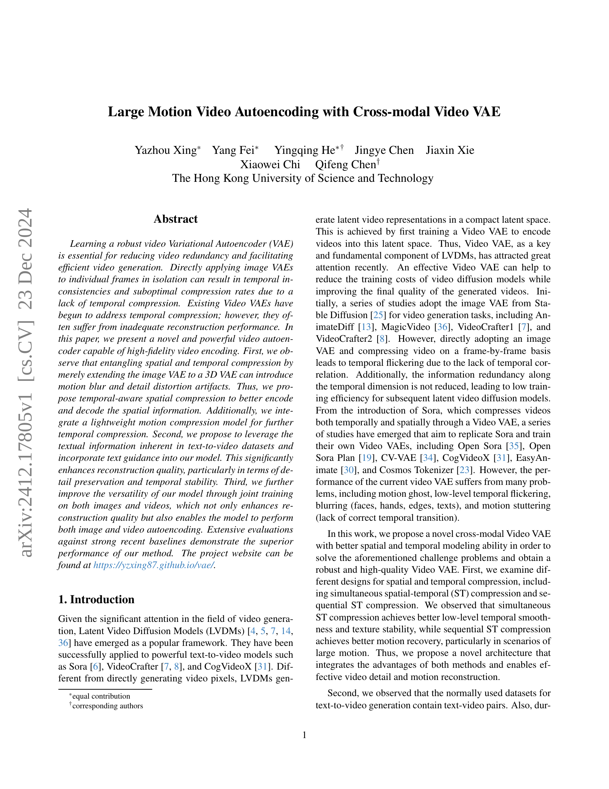
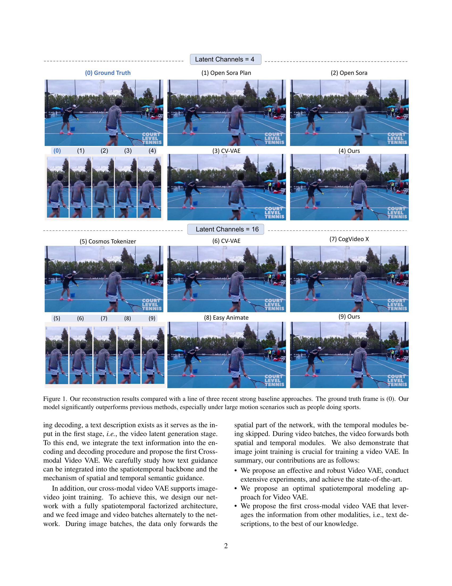
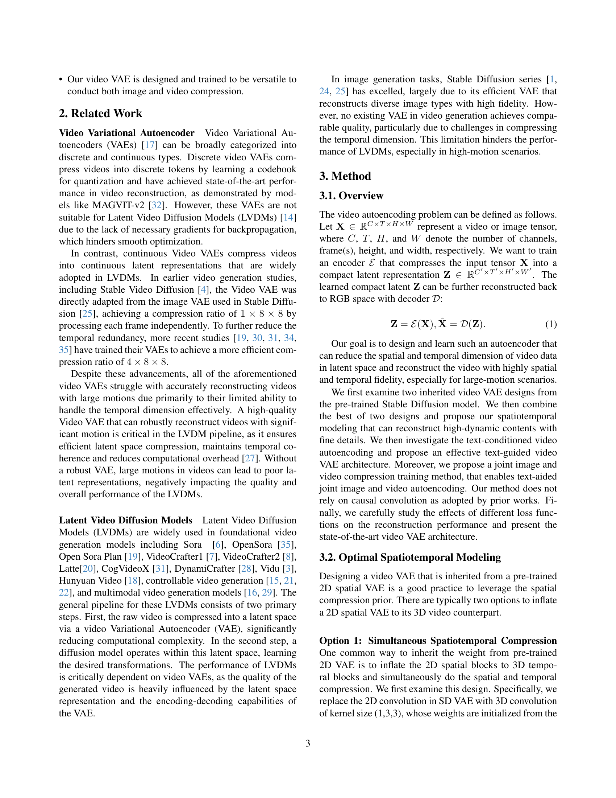
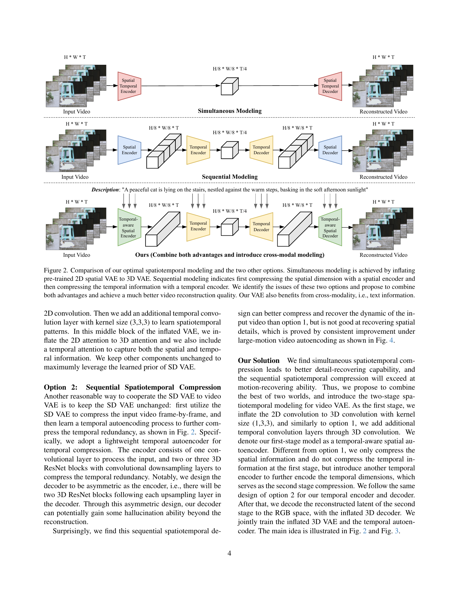
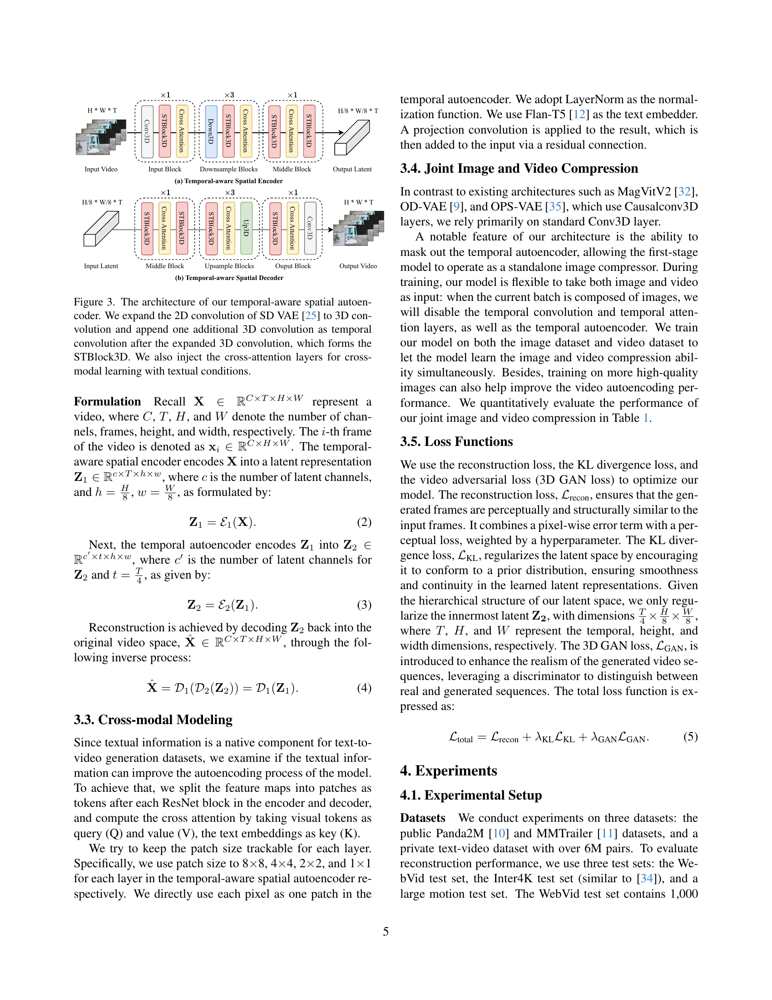
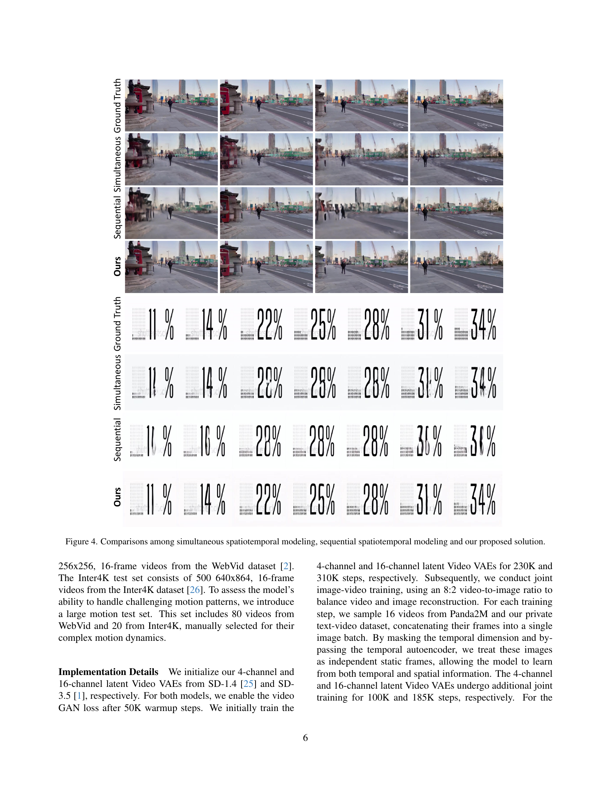
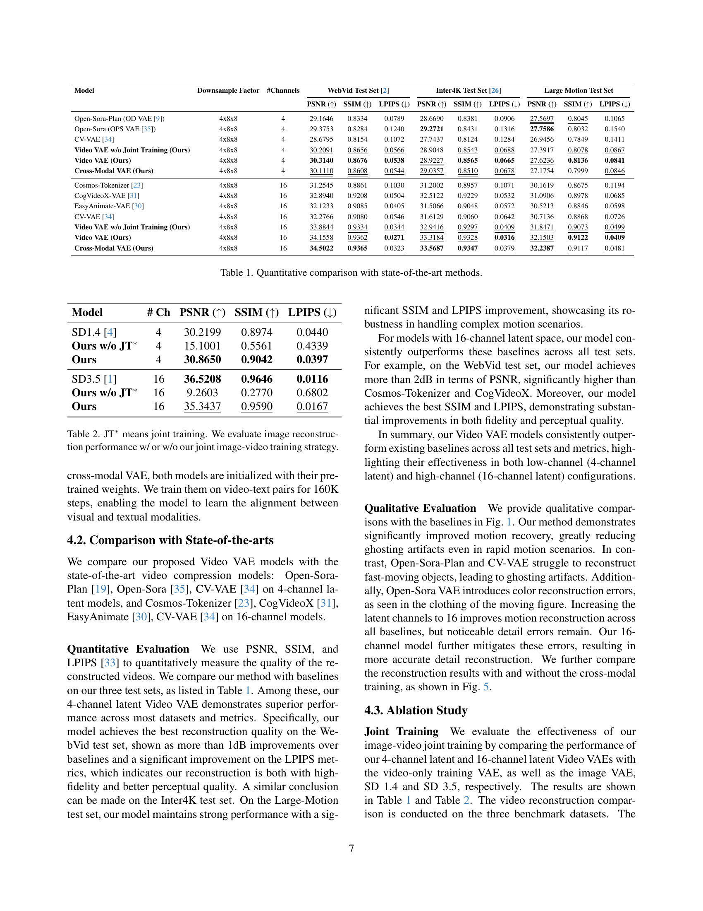
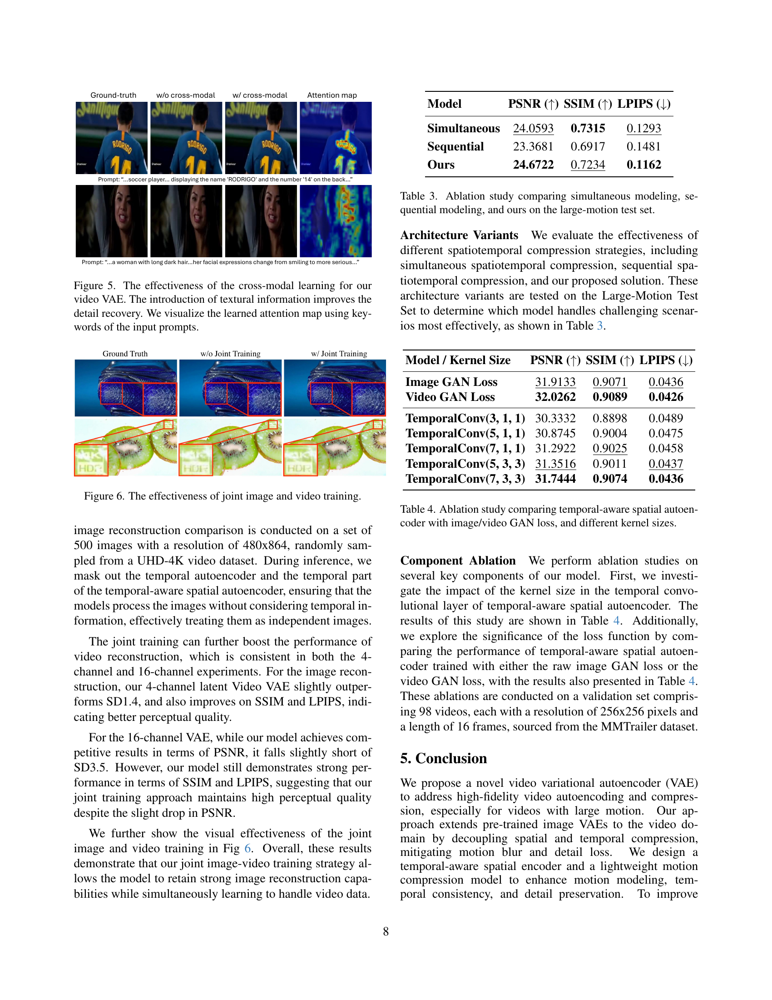
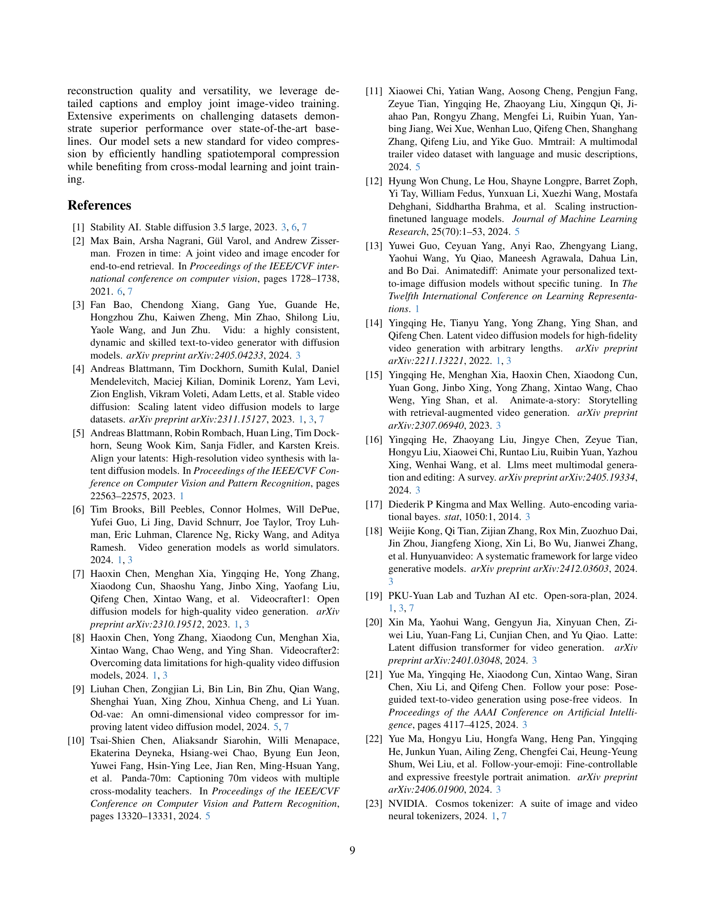
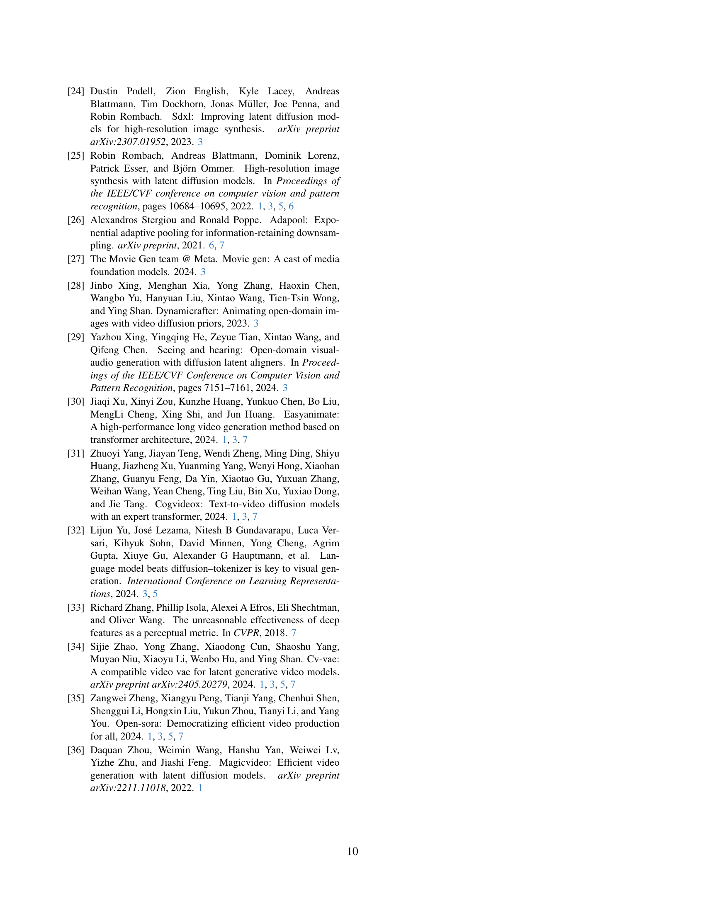

 


 2412.17805 
 Yazhou Xing et el. 
 
 🤗 2024-12-24 
 



↗ arXiv


↗ Hugging Face


↗ Papers with Code


### TL;DR



기존의 영상 VAE는 **시간적 일관성 부족 및 압축률 저하** 문제를 가지고 있었습니다. 특히, **대규모 동작 영상**에서는 이러한 문제가 더욱 심각하게 나타났습니다. 또한, 기존 연구들은 영상의 **공간적 및 시간적 정보를 효과적으로 압축하고 복원**하는 데 어려움을 겪었습니다. 이는 영상의 **세부 정보 손실 및 모션 왜곡**으로 이어졌습니다.

본 연구는 이러한 문제를 해결하기 위해 **공간 및 시간적 압축 전략을 개선한 새로운 크로스 모달 비디오 VAE**를 제안합니다. **시간 인식 공간 압축 및 경량화된 모션 압축 모델**을 통합하여 공간 및 시간적 정보를 효율적으로 압축하고 복원합니다. 더불어 **텍스트 정보를 활용**하고 **이미지와 영상 데이터를 결합하여 학습**함으로써 영상 재구성 품질을 크게 향상시켰습니다. 실험 결과, 제안된 모델은 기존 방법들에 비해 **우수한 재구성 성능**을 보이며, 특히 **대규모 동작 영상에서 그 효과가 더욱 두드러졌습니다**.



#### Key Takeaways


 크로스 모달 비디오 VAE를 통해 대규모 동작 영상의 고품질 재구성 및 압축 달성 



 텍스트 정보 활용 및 이미지-영상 결합 학습으로 모델 성능 향상 및 다재다능성 확보 



 기존 비디오 VAE의 한계 극복 및 고품질 영상 생성 기술 발전에 크게 기여 


#### Why does it matter?
본 논문은 **대규모 동작 영상을 효율적으로 압축 및 재구성하는 새로운 크로스 모달 비디오 VAE(Variational Autoencoder)**를 제시하여, 기존 영상 VAE의 한계를 극복하고 고품질 영상 생성 및 압축 기술 발전에 크게 기여합니다. **텍스트 정보를 활용한 크로스 모달 학습**과 **이미지-영상 결합 학습** 전략을 통해 영상 재구성 품질을 향상시키고 모델의 다재다능성을 높였으며, 특히 **대규모 동작 영상에서 우수한 성능**을 보입니다. 이는 향후 **고품질 영상 생성 모델 및 영상 압축 기술 연구**에 중요한 영향을 미칠 것으로 예상됩니다.  특히, 최근 주목받는 Latent Video Diffusion Model (LVDM) 분야의 발전에 기여할 것으로 기대됩니다.

------
#### Visual Insights

> 🔼 본 그림은 논문에서 제시된 새로운 비디오 자동 인코더 모델의 성능을 최근 발표된 세 가지 강력한 기준 모델과 비교하여 보여줍니다. 그림은 다양한 모델들이 스포츠 경기 영상과 같이 큰 움직임이 있는 장면을 재구성한 결과를 보여줍니다.  (0)으로 표시된 영상이 실제 영상이며, 그 아래에 각 모델이 재구성한 영상이 표시됩니다. 논문의 새로운 모델은 특히 큰 움직임이 있는 장면에서 기존 모델들보다 훨씬 더 나은 성능을 보임을 알 수 있습니다.
> 

> 
read the caption

> Figure 1:  Our reconstruction results compared with a line of three recent strong baseline approaches. The ground truth frame is (0). Our model significantly outperforms previous methods, especially under large motion scenarios such as people doing sports.
> 


| Model | Downsample Factor | #Channels | WebVid Test Set PSNR (↑) | WebVid Test Set SSIM (↑) | WebVid Test Set LPIPS (↓) | Inter4K Test Set PSNR (↑) | Inter4K Test Set SSIM (↑) | Inter4K Test Set LPIPS (↓) | Large Motion Test Set PSNR (↑) | Large Motion Test Set SSIM (↑) | Large Motion Test Set LPIPS (↓) |
|---|---|---|---|---|---|---|---|---|---|---|---| 
| Open-Sora-Plan (OD VAE [9]) | 4x8x8 | 4 | 29.1646 | 0.8334 | 0.0789 | 28.6690 | 0.8381 | 0.0906 | 27.5697 | 0.8045 | 0.1065 |
| Open-Sora (OPS VAE [35]) | 4x8x8 | 4 | 29.3753 | 0.8284 | 0.1240 | 29.2721 | 0.8431 | 0.1316 | 27.7586 | 0.8032 | 0.1540 |
| CV-VAE [34] | 4x8x8 | 4 | 28.6795 | 0.8154 | 0.1072 | 27.7437 | 0.8124 | 0.1284 | 26.9456 | 0.7849 | 0.1411 |
| Video VAE w/o Joint Training (Ours) | 4x8x8 | 4 | 30.2091 | 0.8656 | 0.0566 | 28.9048 | 0.8543 | 0.0688 | 27.3917 | 0.8078 | 0.0867 |
| Video VAE (Ours) | 4x8x8 | 4 | 30.3140 | 0.8676 | 0.0538 | 28.9227 | 0.8565 | 0.0665 | 27.6236 | 0.8136 | 0.0841 |
| Cross-Modal VAE (Ours) | 4x8x8 | 4 | 30.1110 | 0.8608 | 0.0544 | 29.0357 | 0.8510 | 0.0678 | 27.1754 | 0.7999 | 0.0846 |
| Cosmos-Tokenizer [23] | 4x8x8 | 16 | 31.2545 | 0.8861 | 0.1030 | 31.2002 | 0.8957 | 0.1071 | 30.1619 | 0.8675 | 0.1194 |
| CogVideoX-VAE [31] | 4x8x8 | 16 | 32.8940 | 0.9208 | 0.0504 | 32.5122 | 0.9229 | 0.0532 | 31.0906 | 0.8978 | 0.0685 |
| EasyAnimate-VAE [30] | 4x8x8 | 16 | 32.1233 | 0.9085 | 0.0405 | 31.5066 | 0.9048 | 0.0572 | 30.5213 | 0.8846 | 0.0598 |
| CV-VAE [34] | 4x8x8 | 16 | 32.2766 | 0.9080 | 0.0546 | 31.6129 | 0.9060 | 0.0642 | 30.7136 | 0.8868 | 0.0726 |
| Video VAE w/o Joint Training (Ours) | 4x8x8 | 16 | 33.8844 | 0.9334 | 0.0344 | 32.9416 | 0.9297 | 0.0409 | 31.8471 | 0.9073 | 0.0499 |
| Video VAE (Ours) | 4x8x8 | 16 | 34.1558 | 0.9362 | 0.0271 | 33.3184 | 0.9328 | 0.0316 | 32.1503 | 0.9122 | 0.0409 |
| Cross-Modal VAE (Ours) | 4x8x8 | 16 | 34.5022 | 0.9365 | 0.0323 | 33.5687 | 0.9347 | 0.0379 | 32.2387 | 0.9117 | 0.0481 |

> 🔼 이 표는 논문에서 제시된 비디오 VAE(Variational Autoencoder) 방법의 성능을 기존 최첨단 방법들과 정량적으로 비교한 결과를 보여줍니다.  WebVid, Inter4K, 그리고 Large Motion의 세 가지 테스트 세트에 대한 PSNR, SSIM, LPIPS 지표 값을 4채널 및 16채널 잠재 공간을 사용하는 모델에 대해 각각 제시합니다.  다양한 비교 대상 모델들과의 성능 차이를 통해 제안된 방법의 우수성을 보여줍니다.
> 

> 
read the caption

> Table 1: Quantitative comparison with state-of-the-art methods.
> 

### In-depth insights

#### Cross-Modal VAE
본 논문에서 제시된 핵심 아이디어는 **크로스-모달(Cross-Modal) VAE**를 통해 비디오의 공간적 및 시간적 정보를 효율적으로 압축하고 재구성하는 것입니다.  단순히 이미지 VAE를 확장하는 3D VAE 방식의 한계를 극복하고자 **공간-시간적 압축 방식의 최적화**를 시도하며, 텍스트 정보를 활용하여 재구성 품질을 향상시키는 전략을 취합니다.  **텍스트-비디오 데이터셋의 고유한 특성**을 활용하여, 텍스트 정보를 공간-시간적 모델에 통합하는 것이 핵심입니다.  이는 단순히 프레임 단위 압축을 넘어, 텍스트 의미를 반영한 보다 의미있는 비디오 표현을 가능하게 합니다.  또한, **이미지와 비디오 데이터를 결합 학습**하여 모델의 다양성을 높이고, 이미지 및 비디오 자동 인코딩 기능을 모두 지원합니다.  **결과적으로, 고품질의 비디오 재구성과 효율적인 압축**을 달성하며, 기존의 비디오 VAE 모델들이 가지고 있던 한계점들을 극복합니다.

#### Spatiotemporal Encoding
본 논문에서 제안하는 비디오 VAE의 핵심은 **공간 및 시간적 정보를 효과적으로 결합하여 인코딩하는 새로운 방식**에 있습니다. 단순히 이미지 VAE를 3D VAE로 확장하는 기존 방법과 달리, **시간적 인식 공간 압축(temporal-aware spatial compression)**을 통해 공간 정보를 효율적으로 인코딩하고, 별도의 경량화된 동작 압축 모델을 추가하여 시간적 정보를 더욱 효과적으로 압축합니다. 이러한 접근 방식은 기존 방법들의 단점인 모션 블러 및 디테일 손실 문제를 해결하고, 고품질의 비디오 재구성을 가능하게 합니다. 특히, **순차적 공간-시간적 압축**과 **동시 공간-시간적 압축**의 장점을 결합하여 동작 복구 및 세부 정보 유지를 모두 만족시키는 새로운 구조를 제시하는데, 이는 다양한 동작 상황에서 뛰어난 성능을 보여줍니다.

#### Joint Image-Video
본 논문에서 제안하는 **이미지-비디오 결합 학습**은 단순히 비디오 데이터만으로 학습하는 기존 방식의 한계를 극복하기 위한 핵심 전략입니다.  **고품질 이미지 데이터를 활용하여 비디오 모델의 공간적 특징 학습을 향상**시키고, 이를 통해 **비디오 재구성의 정확도 및 세부 묘사의 질 향상**을 도모합니다.  이는 특히 **움직임이 큰 비디오 영상에서 효과적**으로, 이미지 학습을 통해 얻은 공간적 지식이 시계열적 움직임 정보를 보완하여 더욱 자연스럽고 정확한 재구성을 가능하게 합니다.  **이미지와 비디오 데이터를 번갈아 학습시키는 전략**은 모델의 **범용성을 높이고, 이미지 및 비디오 자동 인코딩 성능 모두 향상**시키는 데 크게 기여합니다.  결과적으로, 이러한 **결합 학습 전략**은 제시된 비디오 자동 인코더 모델의 **전반적인 성능 향상 및 견고성 확보**에 중요한 역할을 수행합니다.

#### High-Fidelity Video
본 논문은 고품질 비디오 생성을 위한 핵심 요소로서 **고충실도 비디오 자동 인코딩**에 초점을 맞추고 있습니다. 기존의 프레임 단위 접근 방식의 한계를 극복하고자, **공간 및 시간적 압축을 효율적으로 통합**하는 새로운 비디오 VAE(Variational Autoencoder) 아키텍처를 제안합니다. 특히, 단순히 이미지 VAE를 확장하는 대신, **시간적 인식 공간 압축**과 **경량화된 동작 압축 모델**을 결합하여 모션 블러 및 세부 정보 손실을 최소화합니다.  **텍스트-비디오 데이터셋의 텍스트 정보 활용**은 재구성 품질 향상에 크게 기여하며, **이미지 및 비디오에 대한 결합 학습**은 모델의 다양성과 성능을 향상시킵니다. 이를 통해, **대규모 동작에도 뛰어난 재구성 성능**을 보이며, 기존 방법보다 우수한 성능을 입증합니다.  **크로스-모달 학습**은 모델의 일반화 능력을 강화시켜 다양한 비디오 데이터에 적용 가능성을 높입니다.

#### Future Directions
본 논문에서 제시된 크로스-모달 비디오 VAE는 고품질 비디오 재구성에 있어 상당한 진전을 이루었지만, **미래 연구 방향**은 여전히 많습니다.  **더욱 효율적인 인코딩 및 디코딩 기법**을 통해 계산 비용을 낮추고 처리 속도를 높이는 연구가 필요합니다.  **다양한 비디오 해상도 및 프레임률에 대한 적응력 향상**도 중요한 과제입니다.  또한, **더욱 정교한 시간적 및 공간적 특징 표현**을 위해 새로운 아키텍처나 학습 방법을 모색해야 합니다.  특히, **복잡한 움직임이나 갑작스러운 변화가 있는 비디오에 대한 처리 성능 개선**은 향후 연구의 중요한 초점이 될 것입니다.  마지막으로, **다른 모달리티(예: 오디오, 센서 데이터)와의 통합**을 통해 더욱 풍부하고 사실적인 비디오 생성 및 재구성을 가능하게 하는 연구가 필요합니다.  이러한 연구를 통해 본 논문의 모델이 더욱 강력하고 실용적인 도구가 될 것으로 기대합니다.

### More visual insights

More on figures

> 🔼 그림 2는 제안된 최적의 시공간 모델링과 다른 두 가지 방법(동시 모델링 및 순차 모델링)을 비교한 것입니다. 동시 모델링은 사전 훈련된 2D 공간 VAE를 3D VAE로 확장하여 수행됩니다. 순차 모델링은 먼저 공간 인코더를 사용하여 공간 차원을 압축한 다음, 시간 인코더를 사용하여 시간 정보를 압축하는 것을 나타냅니다. 이 그림에서는 두 가지 방법의 문제점을 파악하고, 두 방법의 장점을 결합하여 비디오 재구성 품질을 크게 향상시키는 새로운 방법을 제안합니다. 또한, 제안된 VAE는 텍스트 정보와 같은 교차 모드 정보를 활용하여 성능을 더욱 향상시킵니다.
> 

> 
read the caption

> Figure 2: Comparison of our optimal spatiotemporal modeling and the two other options. Simultaneous modeling is achieved by inflating pre-trained 2D spatial VAE to 3D VAE. Sequential modeling indicates first compressing the spatial dimension with a spatial encoder and then compressing the temporal information with a temporal encoder. We identify the issues of these two options and propose to combine both advantages and achieve a much better video reconstruction quality. Our VAE also benefits from cross-modality, i.e., text information.
> 

> 🔼 그림 3은 제안된 시간 인식 공간 자동 인코더의 구조를 보여줍니다. 기존의 2D 합성곱(SD VAE [25] 참조)을 3D 합성곱으로 확장하고, 확장된 3D 합성곱 이후에 추가적인 3D 합성곱을 시간적 합성곱으로 추가하여 STBlock3D를 구성합니다. 또한, 텍스트 조건부 학습을 위해 크로스 어텐션 레이어를 추가했습니다. 이는 공간적 특징과 시간적 특징을 동시에 고려하고, 텍스트 정보를 활용하여 더욱 정확한 비디오 인코딩을 수행하기 위함입니다.  자동 인코더는 입력 비디오를 먼저 시간 인식 공간 인코더를 통해 처리하여, 공간 및 시간 정보를 효과적으로 압축된 특징으로 변환합니다. 이후, 시간적 자동 인코더가 시간적 중복성을 제거하여 최종 잠재 벡터를 생성합니다.  해당 잠재 벡터는 시간 인식 공간 디코더를 거쳐 원본 비디오를 재구성합니다. 이러한 과정에서 크로스 어텐션은 텍스트 정보를 활용하여 공간 및 시간적 특징을 보완하고, 재구성의 정확도를 높입니다.
> 

> 
read the caption

> Figure 3: The architecture of our temporal-aware spatial autoencoder. We expand the 2D convolution of SD VAE [25] to 3D convolution and append one additional 3D convolution as temporal convolution after the expanded 3D convolution, which forms the STBlock3D. We also inject the cross-attention layers for cross-modal learning with textual conditions.
> 

> 🔼 그림 4는 동시 공간-시간 모델링, 순차적 공간-시간 모델링 및 제안된 방법의 비교 결과를 보여줍니다. 세 가지 방법 모두 동일한 비디오 데이터셋에 적용되었으며, 재구성된 비디오의 화질과 모션 정확도를 시각적으로 비교하여 각 방법의 장단점을 보여줍니다. 특히, 큰 움직임이 있는 영상에서 제안된 방법이 다른 두 방법보다 우수한 성능을 보이는 것을 확인할 수 있습니다.
> 

> 
read the caption

> Figure 4: Comparisons among simultaneous spatiotemporal modeling, sequential spatiotemporal modeling and our proposed solution.
> 

> 🔼 그림 5는 제안된 모델에서 크로스-모달 학습의 효과를 보여줍니다. 텍스트 정보를 추가함으로써 세부적인 부분의 복원 능력이 향상되는 것을 확인할 수 있습니다. 그림에서는 입력 프롬프트의 키워드를 사용하여 학습된 어텐션 맵을 시각화하여 어떤 부분에 어텐션을 더 기울였는지 보여줍니다.  왼쪽 열은 기준(Ground Truth) 영상을, 가운데 열은 텍스트 정보 없이 생성된 영상을, 오른쪽 열은 텍스트 정보를 활용하여 생성된 영상을 보여줍니다.  어텐션 맵은 모델이 입력 텍스트에 따라 영상의 어떤 부분에 집중했는지 보여주는 시각적 표현입니다.
> 

> 
read the caption

> Figure 5: The effectiveness of the cross-modal learning for our video VAE. The introduction of textural information improves the detail recovery. We visualize the learned attention map using keywords of the input prompts.
> 

> 🔼 그림 6은 논문의 3.4절 'Joint Image and Video Compression'에서 설명하는 이미지와 비디오의 결합 학습의 효과를 보여줍니다.  이미지만을 사용하여 학습한 모델과 이미지와 비디오를 결합하여 학습한 모델의 결과를 비교하여, 결합 학습을 통해 이미지와 비디오 재구성 품질이 모두 향상됨을 시각적으로 보여줍니다. 특히, 고해상도 이미지 데이터를 함께 학습시킴으로써 비디오의 재구성 품질이 향상되는 것을 보여줍니다.
> 

> 
read the caption

> Figure 6: The effectiveness of joint image and video training.
> 

More on tables


| Model | # Ch | PSNR (↑) | SSIM (↑) | LPIPS (↓) |
|---|---|---|---|---|
| SD1.4 [4] | 4 | 30.2199 | 0.8974 | 0.0440 |
| Ours w/o JT∗ | 4 | 15.1001 | 0.5561 | 0.4339 |
| **Ours** | 4 | **30.8650** | **0.9042** | **0.0397** |
| SD3.5 [1] | 16 | **36.5208** | **0.9646** | **0.0116** |
| Ours w/o JT∗ | 16 | 9.2603 | 0.2770 | 0.6802 |
| **Ours** | 16 | **35.3437** | **0.9590** | **0.0167** |
> 🔼 표 2는 이미지 재구성 성능에 대한 실험 결과를 보여줍니다.  'JT*'는 이미지와 비디오를 함께 학습시킨(Joint Training) 모델을 의미하며,  이 표는 이미지만 학습한 모델과 이미지와 비디오를 함께 학습한 모델의 성능을 비교하여  제안하는 방법의 효과를 보여줍니다.  PSNR, SSIM, LPIPS 세 가지 지표를 사용하여 이미지 재구성 품질을 정량적으로 평가했습니다.  채널 수(4 또는 16)에 따른 성능 변화도 확인할 수 있습니다.
> 

> 
read the caption

> Table 2: JT∗ means joint training. We evaluate image reconstruction performance w/ or w/o our joint image-video training strategy.
> 


| Model | PSNR () | SSIM () | LPIPS () |
|---|---|---|---|
| **Simultaneous** | 24.0593 | **0.7315** | **0.1293** |
| **Sequential** | 23.3681 | 0.6917 | 0.1481 |
| **Ours** | **24.6722** | **0.7234** | **0.1162** |
> 🔼 표 3은 논문의 실험 결과 중 하나로, 대규모 움직임이 있는 비디오 데이터셋(Large Motion Test Set)을 사용하여 세 가지 서로 다른 공간-시간 모델링 방법(동시 모델링, 순차 모델링, 제안된 모델)의 성능을 비교 분석한 결과를 보여줍니다. 각 모델의 PSNR, SSIM, LPIPS 값을 비교하여 제안된 모델의 우수성을 확인합니다. 제안된 모델은 동시 및 순차 모델링의 장점을 결합하여 성능 향상을 이끌어냈음을 보여줍니다.
> 

> 
read the caption

> Table 3: Ablation study comparing simultaneous modeling, sequential modeling, and ours on the large-motion test set.
> 


| Model / Kernel Size | PSNR () | SSIM () | LPIPS () |
|---|---|---|---|
| **Image GAN Loss** | 31.9133 | 0.9071 | 0.0436 |
| **Video GAN Loss** | 32.0262 | 0.9089 | 0.0426 |
| **TemporalConv(3, 1, 1)** | 30.3332 | 0.8898 | 0.0489 |
| **TemporalConv(5, 1, 1)** | 30.8745 | 0.9004 | 0.0475 |
| **TemporalConv(7, 1, 1)** | 31.2922 | 0.9025 | 0.0458 |
| **TemporalConv(5, 3, 3)** | 31.3516 | 0.9011 | 0.0437 |
| **TemporalConv(7, 3, 3)** | 31.7444 | 0.9074 | 0.0436 |
> 🔼 표 4는 시간 인식 공간 자동 인코더에 이미지/비디오 GAN 손실 및 다양한 커널 크기를 적용한 실험 결과를 보여줍니다.  자세히는, 시간 인식 공간 자동 인코더에 이미지 GAN 손실과 비디오 GAN 손실을 각각 적용했을 때의 성능 차이를 보여주는 실험과, 다양한 크기의 커널을 가진 시간적 합성곱 층을 사용했을 때의 결과를 비교 분석하여 최적의 커널 크기를 제시합니다.  이를 통해 시간적 합성곱 층의 커널 크기가 모델 성능에 미치는 영향과 GAN 손실의 유형에 따른 성능 변화를 분석합니다.
> 

> 
read the caption

> Table 4: Ablation study comparing temporal-aware spatial autoencoder with image/video GAN loss, and different kernel sizes.
> 

### Full paper



