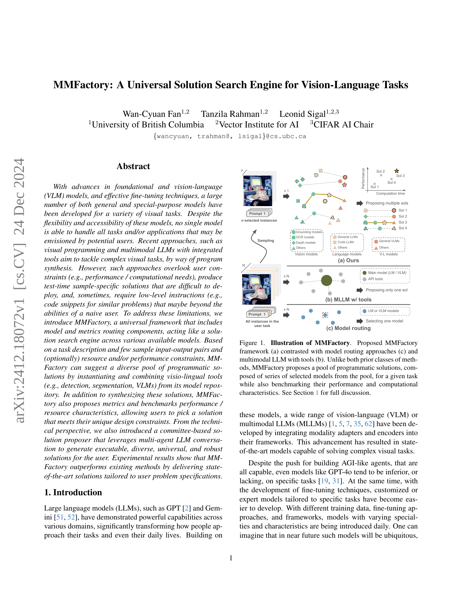

 


 2412.18072 
 Wan-Cyuan Fan et el. 
 
 🤗 2024-12-27 
 



↗ arXiv


↗ Hugging Face


↗ Papers with Code


### TL;DR



최근 비전-언어 모델의 발전에도 불구하고, 모든 작업에 적용 가능한 단일 모델은 존재하지 않습니다. 기존의 접근 방식들은 사용자 제약 조건을 고려하지 않거나, 특정 샘플에만 국한된 솔루션을 제공하는 한계가 있습니다. 또한, 복잡한 시각적 작업을 위해서는 프로그래밍 방식의 솔루션이 필요하지만, 이는 사용자에게 어려운 일입니다.

본 논문에서는 이러한 문제를 해결하기 위해 MMFactory 프레임워크를 제시합니다. MMFactory는 다양한 모델과 지표 라우팅 구성 요소를 포함하여 사용 가능한 모델 간에 솔루션 검색 엔진 역할을 수행합니다. 작업 설명, 입력-출력 샘플, 자원/성능 제약 조건을 바탕으로 비전-언어 도구들을 조합하여 다양한 프로그래밍 방식의 솔루션을 제시하고, 성능 및 자원 특성을 평가하여 사용자가 제약 조건에 맞는 솔루션을 선택할 수 있도록 합니다. 특히 멀티 에이전트 기반의 솔루션 제안자는 실행 가능하고, 다양하며, 견고한 솔루션을 제공합니다.



#### Key Takeaways


 MMFactory는 사용자의 요구사항(성능, 자원 등)을 고려하여 다양한 비전-언어 모델 중에서 최적의 솔루션을 제공하는 범용 프레임워크입니다. 



 멀티 에이전트 기반의 솔루션 제안자를 통해 실행 가능하고, 다양하며, 견고한 솔루션을 생성합니다. 



 실험 결과, MMFactory는 기존 방법보다 우수한 성능을 보이며, 사용자의 문제 사양에 맞춤화된 최첨단 솔루션을 제공합니다. 


#### Why does it matter?
본 논문은 **다양한 비전-언어 모델을 활용하여 사용자의 요구사항에 맞춘 솔루션을 제공**하는 MMFactory 프레임워크를 제시함으로써, **비전-언어 작업에 대한 범용적인 솔루션 검색 엔진**을 구축하는 데 중요한 발걸음을 내딛었습니다.  이는 **사용자 친화적인 인터페이스와 다양한 모델 및 지표 라우팅**을 통해 사용자가 최적의 솔루션을 선택할 수 있도록 지원하고, 여러 모델들을 조합하여 복잡한 작업을 해결할 수 있는 새로운 가능성을 제시합니다. 따라서 **비전-언어 분야 연구자들에게 중요한 참고 자료**가 될 뿐 아니라, **향후 연구 방향을 제시하는 데에도 큰 영향을 미칠** 것으로 예상됩니다.

------
#### Visual Insights

> 🔼 그림 1은 MMFactory의 작동 방식을 보여줍니다. (a)는 MMFactory의 제안된 프레임워크를, (c)는 기존의 모델 라우팅 방식을, (b)는 도구가 통합된 다중 모드 LLM을 각각 나타냅니다.  기존 방식들과 달리 MMFactory는 주어진 작업에 대해 일련의 선택된 모델들로 구성된 프로그래밍 방식의 솔루션들을 여러 개 제시하고, 각 솔루션의 성능과 계산 비용을 벤치마킹합니다. 자세한 내용은 1절을 참조하십시오.
> 

> 
read the caption

> Figure 1: Illustration of MMFactory. Proposed MMFactory framework (a) contrasted with model routing approaches (c) and multimodal LLM with tools (b). Unlike both prior classes of methods, MMFactory proposes a pool of programmatic solutions, composed of series of selected models from the pool, for a given task while also benchmarking their performance and computational characteristics. See Section 1 for full discussion.
> 


Method | Depth | Spatial | Jigsaw | Vis corr. | Sem. Corr. | Art | Count | Fun. Corr. | Local. | Multi-view | Refl. | Fore. | IQ | Sim. 
---|---|---|---|---|---|---|---|---|---|---|---|---|---|---
Open-source multimodal LLMs |  |  |  |  |  |  |  |  |  |  |  |  |  |  
OpenFlamingo-v2 [5] | 54.0 | 43.4 | 47.3 | 25.6 | 30.2 | 52.1 | 21.7 | 36.2 | 52.0 | 41.4 | 43.3 | 15.9 | 23.3 | 55.2 
InstructBLIP-7B [14] | 51.6 | 56.6 | 52.7 | 30.8 | 30.9 | 47.9 | 29.2 | 23.9 | 44.8 | 58.7 | 29.9 | 29.6 | 23.3 | 46.3 
InstructBLIP-13B [14] | 51.6 | 65.7 | 52.7 | 29.7 | 32.4 | 50.4 | 30.8 | 22.3 | 52.0 | 54.1 | 46.3 | 13.6 | 26.0 | 46.3 
CogVLM [55] | 50.8 | 67.1 | 52.7 | 20.9 | 23.6 | 49.6 | 46.3 | 23.9 | 43.2 | 57.1 | 26.9 | 24.2 | 26.7 | 46.3 
LLaVA-v1.5-7B [35] | 52.4 | 61.5 | 11.3 | 25.6 | 23.0 | 47.9 | 43.3 | 21.5 | 48.8 | 49.6 | 36.6 | 28.0 | 24.0 | 46.3 
LLaVA-v1.5-13B [35] | 53.2 | 67.8 | 58.0 | 29.1 | 32.4 | 47.9 | 50.0 | 20.8 | 47.2 | 41.4 | 45.5 | 27.3 | 28.0 | 46.3 
Ours (LLaVA-7B) | 51.6 | 78.8 | 56.7 | 33.1 | 32.4 | 54.7 | 41.2 | 21.5 | 56.6 | 55.6 | 37.0 | 26.5 | 23.3 | 58.5 
Ours (LLaVA-13B) | 58.1 | 69.9 | 64.0 | 34.3 | 34.5 | 58.1 | 47.2 | 23.9 | 51.6 | 51.1 | 45.1 | 26.5 | 28.0 | 45.9 
API-based models |  |  |  |  |  |  |  |  |  |  |  |  |  |  
Qwen-VL-Max [7] | 58.9 | 77.6 | 3.3 | 22.7 | 29.3 | 37.6 | 55.8 | 28.5 | 49.6 | 53.4 | 49.3 | 47.7 | 22.0 | 51.5 
Gemini Pro [20] | 50.0 | 67.1 | 54.0 | 37.2 | 22.1 | 49.5 | 65.0 | 32.3 | 46.4 | 41.4 | 46.3 | 45.5 | 27.3 | 55.9 
Claude 3 OPUS [4] | 57.3 | 57.3 | 32.7 | 31.4 | 20.7 | 60.7 | 49.2 | 22.3 | 46.4 | 57.9 | 27.6 | 62.1 | 21.3 | 70.6 
GPT-4o [42] | 74.2 | 69.2 | 55.3 | 75.0 | 54.0 | 82.9 | 51.7 | 39.2 | 56.0 | 60.2 | 38.8 | 85.6 | 30.0 | 65.4 
GPT-4o (+ SoM + orig.)† | 75.0 | 82.5 | - | - | - | - | - | - | - | - | - | - | - | - 
GPT-4o (+ Visprog)† | 46.8 | 37.8 | - | - | - | - | - | - | - | - | - | - | - | - 
GPT-4o (+ Sketchpad) | 83.9† | 81.1† | 70.7† | 80.8† | 58.3† | 77.19∗ | 66.7∗ | 42.1∗ | 65.4∗ | 45.6∗ | 33.1∗ | 79.0∗ | 22.8∗ | 84.2∗ 
Ours (GPT-4o) | 80.3 | 81.8 | 75.3 | 85.5 | 58.3 | 83.0 | 61.7 | 55.4 | 59.0 | 60.2 | 35.1 | 84.8 | 28.7 | 75.3

> 🔼 표 1은 BLINK 벤치마크[19]에 대한 실험 결과를 보여줍니다.  이 표는 다양한 비전-언어 모델(VLM)들의 성능을 정량적으로 비교 분석한 것입니다.  각 모델의 성능은 여러가지 시각적 이해 능력 평가 지표를 기반으로 측정되었으며,  각 지표별 점수가 표에 제시되어 있습니다.  † 표시는 이전 연구[26]의 결과를, * 표시는 공식 코드베이스를 통해 얻은 결과를 나타냅니다.  가장 좋은 결과는 굵게, 두 번째로 좋은 결과는 밑줄이 그어져 있습니다.  이를 통해 다양한 VLM들의 장단점을 비교하고, MMFactory의 성능을 기존 최고 성능 모델들과 비교하여 평가할 수 있습니다.
> 

> 
read the caption

> Table 1: Quantitative results.  Experimental results on the BLINK benchmark [19]. † denotes results from the previous work [26], and ∗ represents results collected via official codebase. The best result is highlighted in Bold and the second underlined.
> 

### In-depth insights

#### MMFactory Framework
MMFactory 프레임워크는 **다양한 비전-언어 모델과 툴을 통합하여 사용자 정의 작업에 맞는 프로그래밍 솔루션을 생성하는 범용적이고 자동화된 시스템**입니다.  **사용자의 작업 설명, 입력-출력 샘플, 그리고 성능 및 자원 제약 조건을 바탕으로 최적의 솔루션을 찾아 제시**하는 것이 핵심입니다.  **솔루션 라우터와 메트릭 라우터라는 두 가지 주요 구성 요소**를 통해 모델과 메트릭을 효율적으로 선택하고 평가합니다. **멀티 에이전트 대화 시스템을 활용하여 실행 가능하고 다양하며 강력한 솔루션을 생성**하는 것이 특징입니다.  이는 기존의 단일 모델 기반 접근 방식과 달리, 사용자에게 다양한 옵션을 제공하여 유연성을 높이고 특정 작업에 맞춘 최적화를 가능하게 합니다.  **MMFactory는 복잡한 비전-언어 작업을 위한 효율적이고 사용자 친화적인 솔루션 검색 엔진**으로서, 다양한 응용 분야에서 활용될 가능성이 높습니다.

#### Multi-Agent Design
본 논문에서 제안하는 MMFactory의 핵심은 **다중 에이전트 시스템**을 통해 문제 해결 과정을 설계한 점입니다. 이는 단일 모델에 의존하는 기존 방식과 달리, **전문화된 여러 모델(에이전트)**을 결합하여 문제를 해결합니다. 이를 통해 **모델의 강점을 활용**하고 **약점을 보완**하며, 사용자의 다양한 요구사항(성능, 자원 제약 등)을 충족하는 유연하고 강력한 시스템을 구축합니다.  특히, 제안된 다중 에이전트 구조는 **상호 협력과 경쟁**을 통해 보다 **견고하고 다양한 솔루션**을 생성하고 평가하는 역할을 수행합니다. 이러한 **협업적 접근 방식**은 최적의 솔루션을 찾는 데 있어 효율성을 높이고, 단일 모델 기반 시스템의 한계를 극복하는 데 중요한 역할을 합니다.  **솔루션 제안 에이전트**와 **검토 에이전트**의 상호 작용은 반복적인 피드백 루프를 통해 솔루션의 질을 개선하고, 사용자의 요구에 부합하는 최적의 결과물을 도출하는 데 기여합니다.

#### Benchmark Analyses
본 논문의 벤치마크 분석 부분은 제안된 MMFactory의 성능을 기존 최첨단 모델들과 비교 평가하여 **객관적인 성능 우수성**을 보여주는 데 초점을 맞출 것입니다.  **다양한 비전-언어 작업 벤치마크** (예: BLINK, SeedBench) 에서의 실험 결과를 제시하고, 정량적 지표(예: 정확도, 계산 비용)를 사용하여 MMFactory의 **강점과 약점**을 면밀히 분석합니다.  특히, **다양한 모델들의 조합**을 통해 생성된 다양한 해결책들 간의 성능 비교를 통해 MMFactory의 **유연성과 적응력**을 강조할 것입니다.  **에지 디바이스 배포**에 대한 고려사항 및 **실시간 성능**에 대한 분석도 포함하여, 실제 응용 환경에서의 MMFactory의 실용성을 평가할 것입니다.  마지막으로, 벤치마크 분석 결과를 통해 MMFactory의 **장단점을 명확히 제시**하고, 향후 연구 방향에 대한 시사점을 도출할 것입니다.

#### Cost & Efficiency
본 논문에서는 비용 및 효율성 측면에서 **다양한 모델들을 활용한 솔루션 탐색의 장점**을 제시합니다.  특히, **MMFactory는 사용자의 요구사항(성능, 계산자원 등)에 맞춰 최적의 솔루션을 제공**하여 기존 방법론보다 효율적인 솔루션을 제시하며, **실행 시간 및 API 호출 횟수를 최소화**하여 비용을 절감하는 효과를 보입니다.  **다중 에이전트 기반의 솔루션 제안 방식**은 여러 모델과 툴을 조합하여 강건하고 다양한 솔루션을 생성하며, **반복적인 대화를 통해 최적의 결과**를 도출하는 데 기여합니다.  **실험 결과는 MMFactory가 기존 방법들 대비 뛰어난 성능과 효율성**을 보여주는 것을 확인시켜주며, **실제 환경에서의 적용 가능성**을 높입니다.  **비용 효율적인 솔루션 선택을 위한 성능-비용 곡선**을 제공하는 점도 중요한 특징입니다.

#### Future Extensions
본 논문의 "미래 확장"에 대한 고찰은 **MMFactory의 범용성 및 확장성**에 초점을 맞춰야 합니다.  **다양한 모달리티 지원 확대**, **새로운 모델 및 툴 통합**, 그리고 **사용자 경험 개선** 등이 중요한 연구 방향이 될 것입니다.  특히 **비전-언어 작업을 넘어, 다른 도메인 (예: 로보틱스, 음성 처리)**으로 확장하는 연구는 MMFactory의 영향력을 크게 확대할 수 있습니다.  **멀티 에이전트 시스템의 고도화** 또한 중요한데,  에이전트 간의 효율적인 의사소통 및 협업을 개선하여 더욱 복잡하고 다양한 작업을 처리할 수 있도록 하는 연구가 필요합니다.  마지막으로, **실제 응용 사례 개발 및 검증**을 통해 MMFactory의 실용성을 높이는 노력이 중요하며, 이를 위해 다양한 분야의 전문가와의 협력이 필수적입니다.  **설명 가능성(Explainability) 향상**도 중요한 과제입니다. MMFactory가 제시하는 솔루션의 의사결정 과정을 이해하기 쉽게 만드는 연구는 신뢰도 향상 및 사용자의 이해도 증진에 큰 도움이 될 것입니다.

### More visual insights

More on figures

> 🔼 그림 2는 MMFactory의 개요를 보여줍니다. MMFactory는 두 가지 주요 구성 요소인 솔루션 라우터와 메트릭 라우터로 구성됩니다. 솔루션 라우터는 주어진 작업에 대한 잠재적인 솔루션들을 생성하고, 메트릭 라우터는 이러한 솔루션들을 평가하여 성능과 계산 비용을 추정하여 성능 곡선을 생성합니다. 이 곡선을 통해 사용자는 작업 요구 사항에 가장 적합한 모델을 선택할 수 있습니다. 즉, 사용자의 요구사항(예: 성능, 계산 비용)에 맞는 최적의 솔루션을 찾을 수 있도록 다양한 솔루션을 제시하고 비교분석하는 과정을 시각적으로 보여줍니다.
> 

> 
read the caption

> Figure 2: Overview of MMFactory. Our framework includes two primary components: Solution Router and Metric Router. The Solution Router generates a pool of potential solutions for the task, while the Metric Router evaluates these solutions, estimating their performance and computational cost to generate a performance curve. This curve enables users to select the model optimal for their task requirements.
> 

> 🔼 그림 3은 사용자의 입력 사양 𝒫𝑢(mathcal{P}^{u})을 보여줍니다.  이 그림은 사용자가 MMFactory에 입력하는 정보의 구조를 자세히 설명합니다.  사용자는 작업 정의, 즉 해결해야 할 비전-언어 과제에 대한 설명을 제공합니다.  여기에는 작업 요청 프롬프트(Task Request Prompt)와 해당 작업의 몇 가지 예시가 포함됩니다.  예시는 이미지 세트, 작업 요청 프롬프트, 그리고 정답으로 구성됩니다.  또한, 사용자는 선택적으로 모델 크기, 계산 복잡도, 또는 실행 시간과 같은 제약 조건을 추가할 수 있습니다. 이러한 입력 정보들은 MMFactory의 솔루션 라우터(Solution Router)에 전달되어, 사용자의 요구사항을 충족하는 다양한 솔루션 후보를 생성하는 데 사용됩니다.
> 

> 
read the caption

> Figure 3: Illustration of user specification inputs 𝒫usuperscript𝒫𝑢\mathcal{P}^{u}caligraphic_P start_POSTSUPERSCRIPT italic_u end_POSTSUPERSCRIPT.
> 

> 🔼 그림 4는 MMFactory의 솔루션 라우터에서 사용되는 다중 에이전트 대화 과정을 보여줍니다.  솔루션 제안 팀과 위원회 팀이라는 두 개의 팀이 대화를 통해 최종 결과물을 얻는 과정을 시각적으로 나타냅니다. 솔루션 제안 팀은 새로운 솔루션을 제안하고, 위원회 팀은 정확성, 중복성, 요구사항 충족 여부 등을 검토하며 피드백을 제공합니다.  각 팀에는 여러 에이전트가 있으며, 리더 에이전트가 팀원들의 응답을 종합하고 다른 팀과 소통하여 솔루션을 개선해 나가는 과정을 보여줍니다.
> 

> 
read the caption

> Figure 4: Illustration of multi-agent conversation. In the solution router, we have two team of agents performing conversation to get the final outputs.
> 

> 🔼 그림 5는 MMFactory가 다양한 모델들을 활용하여 비전-언어 작업을 수행하는 과정을 보여주는 정성적 예시입니다. MMFactory는 (Sol 0에서처럼) MLLM을 위한 향상된 프롬프트를 자동으로 생성하고, (Sol 4에서처럼) 유사한 논리의 솔루션을 더 강력한 모델을 사용하여 개발하는 기능을 보여줍니다.  Sol 0의 예시는 주어진 이미지와 질문에 대해 적절한 답변을 얻기 위해 MLLM의 이해도를 높이는 향상된 프롬프트를 자동 생성하는 과정을 보여주며, Sol 4는 같은 문제를 해결하는 다른 솔루션을 제시하지만, 더욱 강력한 모델을 사용함으로써 성능을 개선하는 것을 보여줍니다. 이는 MMFactory가 모델들을 효율적으로 조합하고 활용하여 최적의 결과를 얻는 능력을 시각적으로 보여주는 것입니다.
> 

> 
read the caption

> Figure 5: Qualitative examples of MMFactory. MMFactory showcases its abilities to use and combine models by automatically constructing better prompts for MLLMs (in Sol 0) and developing solutions with similar logic but utilizing stronger models (in Sol 4).
> 

> 🔼 그림 6은 반복 횟수에 따른 성능 분석 결과를 보여줍니다. 여러 색깔의 선은 서로 다른 실행 결과를 나타내며, 빨간색 십자 표시는 각 실행에서 가장 높은 성능을 기록한 지점을 가리킵니다. 이 그래프는 다중 에이전트 대화 시스템에서 반복 횟수가 성능에 미치는 영향을 보여주는 실험 결과를 시각적으로 제시합니다. 특히, 최적의 성능을 얻기 위한 반복 횟수의 범위를 파악하는 데 도움이 됩니다.
> 

> 
read the caption

> Figure 6: Ablation. Performance analysis with iteration. Lines in different colors represent different runs. Red cross denotes the highest performance in the run.
> 

> 🔼 그림 7은 MMFactory의 계산 비용을 보여줍니다. 위쪽 그래프는 솔루션 생성 비용을 나타내는 솔루션 생성 비용 플롯입니다. 각 솔루션에 대한 평균 시간과 반복 시간을 보여주는 그래프가 있으며, 생성되는 솔루션 수가 증가함에 따라 시간 비용도 증가함을 알 수 있습니다. 아래쪽 그래프는 샘플당 평균 실행 비용과 라우팅 비용을 보여줍니다. 실행 비용은 입력 프롬프트에서 최종 답변까지의 시간을 나타내고, 라우팅 비용은 도구를 조정하는데 걸리는 시간을 나타냅니다. MMFactory는 미리 계획된 솔루션을 사용하므로 실행 비용이 낮고, 솔루션이 작업의 모든 샘플에 적용되므로 샘플당 라우팅 비용이 거의 0에 가깝습니다.
> 

> 
read the caption

> Figure 7: Computational time. Solution generation cost plot (top). Average execution and routing cost per sample (bottom).
> 

More on tables


| Model | Avg. | Scene | Id | Attri. | Locat. |
|---|---|---|---|---|---| 
| InstructBLIP [14] | 51.5 | 58.9 | 49.7 | 61.7 | 35.1 |
| LLaVA-v1.5-7B [35] | 57.7 | 63.7 | 62.4 | 66.7 | 51.3 |
| MiniGPT-4 [63] | 45.9 | 56.3 | 49.2 | 45.8 | 37.9 |
| OpenFlamingo [5] | 36.1 | 46.7 | 42.3 | 31.7 | 33.4 |
| Qwen-VL-Chat [7] | 50.9 | 56.5 | 47.6 | 54.8 | 46.9 |
| CogVLM [55] | 42.4 | 51.7 | 43.5 | 38.9 | 33.8 |
| InternLM [62] | 69.2 | 77.5 | 73.5 | 74.8 | 65.4 |
| GPT-4o [42] | 75.6 | 77.3 | 79.7 | 79.2 | 71.0 |
| Ours (GPT-4o) | 75.8 | 78.3 | 78.3 | 79.7 | 70.1 |
| Model | Count. | Spatial | Inter. | Reason. | Text |
|---|---|---|---|---|---| 
| InstructBLIP [14] | 58.1 | 34.9 | 47.4 | 55.9 | 61.4 |
| LLaVA-v1.5-7B [35] | 60.2 | 38.5 | 47.4 | 59.8 | 69.0 |
| MiniGPT-4 [63] | 45.3 | 32.6 | 47.4 | 57.1 | 41.8 |
| OpenFlamingo [5] | 27.4 | 29.8 | 29.9 | 47.7 | 35.6 |
| Qwen-VL-Chat [7] | 54.2 | 40.3 | 55.7 | 55.0 | 47.4 |
| CogVLM [55] | 29.4 | 33.6 | 45.4 | 53.5 | 51.5 |
| InternLM [62] | 65.8 | 57.5 | 71.1 | 75.8 | 61.2 |
| GPT-4o [42] | 68.1 | 63.8 | 78.6 | 81.2 | 69.8 |
| Ours (GPT-4o) | 67.7 | 62.8 | 80.6 | 84.5 | 69.9 |
> 🔼 표 2는 Seedbench [31] 데이터셋을 사용한 정량적 실험 결과를 보여줍니다.  Seedbench는 9가지 공간적 이해 관련 시각적 질문응답 과제를 다루는 벤치마크 데이터셋입니다. 표는 다양한 모델들(InstructBLIP, LLaVA-v1.5-7B, MiniGPT-4, OpenFlamingo, Qwen-VL-Chat, CogVLM, InternLM, GPT-40 그리고 본 논문에서 제안하는 GPT-40 기반 모델)의 성능을  '개수 세기', '공간적 관계', '상호작용', '추론', '텍스트'  다섯 가지 하위 과제별로 비교 분석하여 제시합니다. 각 모델의 정확도를 수치로 나타내어 모델 간 성능 차이를 명확하게 보여줍니다.
> 

> 
read the caption

> Table 2: Quantitative results on Seedbench [31].
> 


| Model | Acc | Error rate | Avg. # sols |
|---|---|---|---| 
| Full model | **50.5** | **0.0** | **3.0** |
| (-) _code debugger_ | 40.0 | 1.7 | 2.8 |
| (-) _code checker_ | 33.3 | 20.8 | **3.0** |
| (-) _requirement checker_ | 48.1 | 0.5 | 2.4 |
| (-) _repetition checker_ | 40.5 | 17.8 | 2.0 |
> 🔼 이 표는 논문의 3.3절 '다중 에이전트 솔루션 라우터'에서 다중 에이전트 대화의 중요성을 보여주는 추가 분석 결과를 보여줍니다.  각 에이전트(코드 디버거, 코드 검사기, 요구 사항 검사기, 반복 검사기)를 제거했을 때 정확도, 오류율, 평균 솔루션 수에 미치는 영향을 정량적으로 분석하여 각 에이전트의 역할과 중요성을 입증합니다.  특히 코드 디버거와 코드 검사기의 중요성을 강조합니다. 
> 

> 
read the caption

> Table 3: Ablation. of significance of multi-agent conversation.
> 


| Model | Execution cost (sec) |  | Routing cost (sec) |  |
|---|---|---|---|---|
| Sketchpad [26] | 19.96 | 43.86 | 18.20 | 30.90 |
| Ours | 9.74 | 29.43 | ≈ 0.00 | ≈ 0.00 |
> 🔼 표 4는 10개의 샘플에 대한 API 호출 비용을 분석한 결과를 보여줍니다.  Visual Sketchpad와 MMFactory의 실행 비용과 라우팅 비용을 비교하여, MMFactory가 샘플당 API 호출 횟수를 줄임으로써 비용 효율성을 높였음을 보여줍니다.  각 모델에 대한 Depth, Spatial, Jigsaw, Visual, Semantic 작업의 평균 및 분산 비용이 달러 단위로 제시되어 있습니다.
> 

> 
read the caption

> Table 4: API calling cost analysis per 10 samples (in USD).
> 

### Full paper



