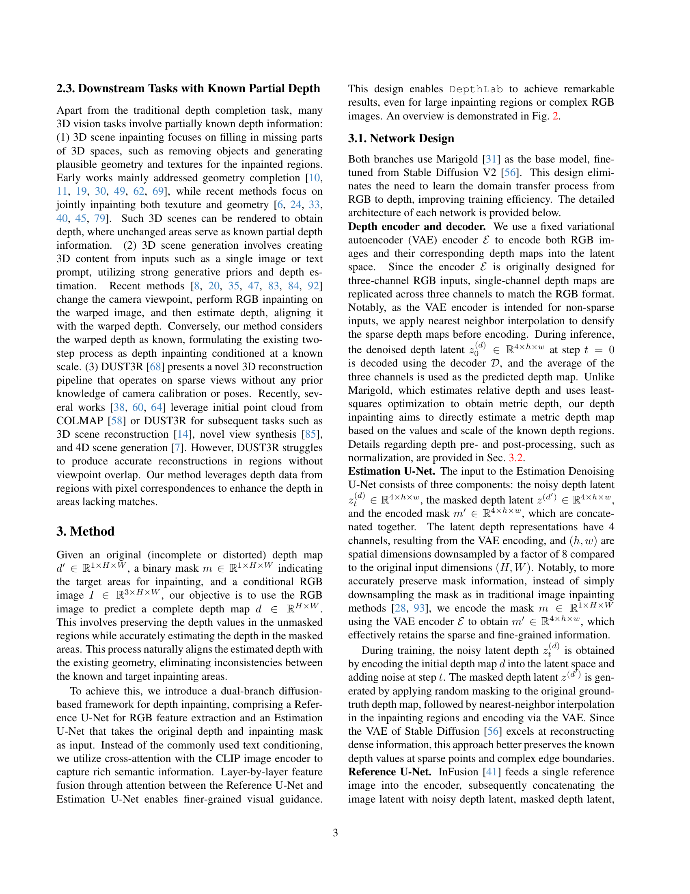

 


 2412.18153 
 Zhiheng Liu et el. 
 
 🤗 2024-12-25 
 



↗ arXiv


↗ Hugging Face


↗ Papers with Code


### TL;DR



많은 컴퓨터 비전 작업에서 불완전한 깊이 데이터는 일반적인 문제입니다. 이는 데이터 수집의 제한이나 관점의 변화로 인해 발생합니다. 기존의 깊이 완성 모델은 전역적으로 희소한 데이터를 밀집 데이터로 변환하는 데 중점을 두었지만, 일반화가 잘 안되고 다양한 작업에 적용하기 어려웠습니다. 또한 단일 이미지를 사용한 방법은 복잡한 장면에서 성능이 저하되고 기하학적 불일치가 발생했습니다. 

본 논문에서는 **이미지 확산 사전을 활용한 기초 깊이 보완 모델인 DepthLab**을 제시합니다. DepthLab은 **연속 영역과 개별 점 모두에 대해 신뢰할 수 있는 보완을 제공**하고, **알려진 깊이 정보와의 규모 일관성을 충실히 유지**합니다.  DepthLab은 3D 시각 보완, 텍스트-장면 생성, DUST3R을 이용한 희소 관점 재구성, 라이다 깊이 완성 등 다양한 작업에서 기존 방법보다 우수한 성능과 시각적 품질을 보여줍니다.  소스 코드는 프로젝트 웹페이지에서 확인할 수 있습니다.



#### Key Takeaways


 DepthLab은 부분적인 깊이 정보만으로도 정확하고 일관성 있는 깊이 정보를 완성하는 뛰어난 성능을 보입니다. 



 제안된 모델은 3D 시각 정보 처리의 다양한 downstream task (3D 시각 보완, 텍스트-장면 생성 등)에 적용 가능하며, 기존 방법보다 우수한 성능을 보입니다. 



 DepthLab은 다양한 downstream task에 대한 일반화 능력이 뛰어나며, 다양한 응용 분야에서 활용 가능성이 높습니다. 


#### Why does it matter?
본 논문은 **부분적인 깊이 정보만을 가지고도 정확한 깊이 정보를 완성할 수 있는 DepthLab 모델**을 제시하여 3D 비전 분야의 다양한 문제를 해결하는 데 기여합니다. **기존의 방법들이 가지는 한계점을 극복**하고, **다양한 downstream task에서 우수한 성능**을 보임으로써, **향후 연구의 새로운 방향을 제시**하고 있습니다.  이를 통해 3D 모델링, 자율 주행, 증강 현실 등 다양한 분야에 혁신적인 발전을 가져올 수 있을 것으로 기대됩니다.

------
#### Visual Insights

> 🔼 그림 1은 DepthLab이 다양한 하위 작업에 적용될 수 있음을 보여줍니다. 3D Gaussian inpainting, LiDAR depth completion, Dust3R을 이용한 sparse-view reconstruction, text-to-scene generation 등 많은 작업에는 부분적인 깊이 정보가 자연스럽게 포함되어 있습니다. DepthLab 모델은 이러한 기존 정보를 활용하여 깊이 추정을 개선하고 하위 작업의 성능을 향상시킵니다.  본 논문에서는 DepthLab을 더 많은 관련 작업에 적용하는 것을 제안합니다.
> 

> 
read the caption

> Figure 1: DepthLab  for diverse downstream tasks. Many tasks naturally contain partial depth information, such as (1) 3D Gaussian inpainting, (2) LiDAR depth completion, (3) sparse-view reconstruction with Dust3R, and (4) text-to-scene generation. Our model leverages this known information to achieve improved depth estimation, enhancing performance in downstream tasks. We hope to motivate more related tasks to adopt DepthLab.
> 


| Method | Real | Synthetic | NYUv2 AbsRel ↓  δ₁ ↑ | NYUv2 δ₁ ↑ | KITTI AbsRel ↓  δ₁ ↑ | KITTI δ₁ ↑ | ETH3D AbsRel ↓  δ₁ ↑ | ETH3D δ₁ ↑ | ScanNet AbsRel ↓  δ₁ ↑ | ScanNet δ₁ ↑ | DIODE AbsRel ↓  δ₁ ↑ | DIODE δ₁ ↑ |
|---|---|---|---|---|---|---|---|---|---|---|---|---|
| DiverseDepth [80] | 320K | – | 12.1 | 86.8 | 18.8 | 70.2 | 23.0 | 69.9 | 11.1 | 87.6 | 37.2 | 63.8 |
| MiDaS [51] | 2M | – | 10.9 | 88.9 | 24.2 | 62.2 | 18.3 | 75.4 | 13.2 | 87.6 | 33.7 | 70.6 |
| LeReS [81] | 300K | 54K | 9.2 | 91.5 | 14.9 | 78.5 | 17.3 | 77.7 | 9.6 | 90.4 | 27.4 | 77.0 |
| Omnidata [13] | 11.9M | 310K | 7.8 | 94.0 | 14.7 | 83.7 | 16.9 | 77.8 | 7.2 | 94.1 | 34.4 | 73.1 |
| HDN [87] | 300K | – | 7.2 | 94.6 | 11.2 | 87.2 | 12.1 | 94.2 | 8.0 | 94.2 | 24.2 | 78.3 |
| DPT [52] | 1.2M | 188K | 9.8 | 90.1 | 10.2 | 89.9 | 7.7 | 94.6 | 8.4 | 93.2 | 18.1 | 75.8 |
| DepthAnthing [76] | 63.5M | – | 4.4 | 97.6 | 7.6 | 94.7 | 12.5 | 88.5 | 4.2 | 98.1 | 27.4 | 76.1 |
| DepthAnthingV2 [77] | 62M | 595K | 4.4 | 98.0 | 7.5 | 94.8 | 13.1 | 86.6 | 4.1 | 98.2 | 27.3 | 76.4 |
| Marigold [31] | – | 74k | 5.6 | 96.4 | 9.8 | 91.7 | 6.6 | 95.9 | 6.3 | 95.4 | 30.9 | 77.2 |
| DepthFM [18] | – | 63K | 6.5 | 95.6 | 8.4 | 93.2 | – | – | – | – | 22.4 | 79.8 |
| GeoWizard [15] | – | 278K | 5.2 | 96.5 | 9.6 | 92.3 | 6.4 | 96.3 | 6.1 | 95.4 | 29.5 | 79.5 |
| Ours | – | 74k | **2.5** | **98.8** | **7.2** | **95.3** | **3.1** | **97.9** | **2.3** | **98.5** | **17.6** | **85.6** |

> 🔼 표 1은 다양한 방법들을 여러 데이터셋에 대해 정량적으로 비교한 결과를 보여줍니다.  AbsRel은 낮을수록, δ1은 높을수록 성능이 좋음을 의미합니다.  가장 좋은 결과는 굵은 글씨체로, 두 번째로 좋은 결과는 밑줄로 표시되어 있습니다. 본 연구에서 제시하는 방법은 기존의 부분적인 깊이 정보를 활용하여 모든 지표에서 최적의 성능을 달성합니다.
> 

> 
read the caption

> Table 1: Quantitative comparison of various methods on different datasets. Better: AbsRel ↓↓\downarrow↓, δ1subscript𝛿1\delta_{1}italic_δ start_POSTSUBSCRIPT 1 end_POSTSUBSCRIPT ↑↑\uparrow↑. The best results are marked in bold, and the second-best underlined. Our method incorporates known depth information, achieving optimal performance across all metrics.
> 

### In-depth insights

#### Depth Inpainting Diff
**깊이 인페인팅 확산(Depth Inpainting Diffusion)**은 깊이 데이터의 누락된 부분을 채우는 기술로, 이미지 생성 모델의 발전과 함께 주목받고 있습니다. 이는 **부분적으로만 알려진 깊이 정보를 바탕으로** 전체 깊이 맵을 생성하는 것을 목표로 합니다. 이러한 기술은 **잡음이 포함된 깊이 데이터에서 시작하여** 반복적인 확산 과정을 통해 점차적으로 깨끗한 깊이 정보를 복원합니다.  이 과정에서 **이미지 정보와 기존 깊이 정보를 함께 활용하여** 더욱 정확하고 자연스러운 깊이 맵을 생성할 수 있습니다. **다양한 하위 작업에 적용 가능하며**, 특히 3D 시각화, 자율 주행, 증강 현실 등의 분야에서 활용 가치가 높습니다. 하지만, **계산 비용이 높고, 생성 과정에서의 불확실성 관리가 중요한 과제**입니다.  향후 **효율적인 알고리즘 개발 및 훈련 데이터 확보**가 중요한 연구 방향이 될 것으로 예상됩니다.

#### Downstream Tasks
본 논문에서 제시된 DepthLab 모델은 부분적인 깊이 정보만으로도 다양한 downstream task에서 뛰어난 성능을 보여줍니다. **3D scene inpainting**, **text-to-scene generation**, **sparse-view reconstruction with DUST3R**, 그리고 **LiDAR depth completion**과 같은 다양한 작업에서 기존 방법들을 능가하는 결과를 보여주는 것은 DepthLab의 강력한 일반화 능력을 보여주는 중요한 지표입니다.  특히, 부분적인 깊이 정보를 활용하여 높은 정확도와 일관성을 유지하면서 깊이를 완성하는 능력은 **다양한 응용 분야에 대한 잠재력**을 시사합니다.  DepthLab의 downstream task 적용 성공은 단순한 기술적 발전을 넘어, **실제 응용 가능성**을 입증함으로써 연구의 중요성을 더욱 높입니다.  향후 연구에서는 DepthLab이 더욱 다양한 downstream task에 적용되고, **성능 개선 및 새로운 응용 분야 발굴**을 통해 더욱 발전할 것으로 예상됩니다.  **모델의 확장성 및 실용성**은 앞으로의 연구 방향을 제시하는 중요한 요소입니다.

#### Dual-Branch Net
제공된 PDF 연구 논문을 분석하여 "Dual-Branch Net"이라는 제목에 대한 심층적인 생각을 한 단락으로 요약했습니다.  **Dual-Branch Net은 입력 데이터를 두 개의 독립적인 경로로 처리하는 네트워크 아키텍처**를 나타냅니다. 이러한 구조는 **데이터의 다양한 특징을 추출하고 통합**하는 데 효과적입니다. 예를 들어, 하나의 브랜치는 이미지의 저수준 특징(예: 엣지, 텍스처)을 처리하고, 다른 브랜치는 고수준 특징(예: 객체, 장면 구성)을 처리할 수 있습니다.  **두 브랜치에서 얻은 정보는 최종 결과를 생성하기 위해 융합**됩니다. 이러한 접근 방식은 **단일 브랜치 네트워크보다 더욱 풍부하고 정확한 정보 표현**을 가능하게 합니다.  **Dual-Branch Net은 특히 불완전하거나 잡음이 많은 데이터를 처리하는 데 유용**하며, 각 브랜치가 특정 유형의 정보에 집중함으로써 노이즈의 영향을 최소화하고 데이터의 누락된 부분을 효과적으로 보완할 수 있습니다.  **이 아키텍처는 다양한 컴퓨터 비전 작업** (예: 이미지 분할, 객체 검출, 심도 추정)에 적용될 수 있으며, **향후 연구에서는 더욱 정교한 브랜치 디자인 및 융합 전략**을 통해 성능을 더욱 향상시킬 수 있을 것으로 예상됩니다.

#### DepthLab Eval
DepthLab Eval은 DepthLab 모델의 성능을 다각적으로 평가하는 핵심 부분입니다. **다양한 벤치마크 데이터셋(NYUv2, KITTI, ETH3D, ScanNet, DIODE)을 사용하여 정량적 성능 비교**를 수행하며, **AbsRel과 81 같은 주요 지표를 통해 정확도와 정밀도를 측정**합니다.  기존 방법들과의 비교 분석을 통해 DepthLab의 우수성을 보여주는 것이 중요합니다.  **정량적 평가 외에도 시각적 비교 분석(qualitative comparison)**을 제시하여, DepthLab이 **기하학적 일관성(geometric consistency)을 유지하며, 특히 경계 영역에서도 정확한 깊이 정보를 생성**하는 능력을 강조할 필요가 있습니다.  **다양한 하위 작업(downstream tasks)에서의 활용성을 보여주는 실험 결과**도 포함되어 DepthLab의 실용성과 일반화 성능을 입증해야 합니다.  결론적으로 DepthLab Eval은 DepthLab 모델의 **강점(robustness, generalization, accuracy)**을 종합적으로 보여주는 설득력 있는 증거를 제시해야 합니다.

#### Future Works
본 논문의 "향후 연구 방향" 부분은 **확산 모델의 계산 비용 감소와 관련된 몇 가지 중요한 아이디어**를 제시합니다.  특히, 일관성 모델이나 흐름 기반 방법을 활용하여 샘플링 속도를 높이는 방안, 그리고 **희소 정보를 효과적으로 인코딩하는 VAE의 개선**을 통한 희소 마스크 및 깊이 정보 처리 개선이 중요하게 언급됩니다.  **깊이 추정 모델에 대한 일반화 능력 향상을 위해 정규화 및 마스크 전략을 고도화**하는 방안 또한 제시되었는데,  이는 다양한 하류 작업에 대한 적용 가능성을 높이는 데 기여할 것입니다.  **깊이 추정 및 깊이 채우기 성능을 향상시키기 위한 다양한 마스크 전략**을 통합하여 모델의 강건성을 높일 수 있다는 점이 강조되며, 이는 앞으로의 연구에서 다양한 응용 분야의 깊이 데이터에 대한 일반화 능력을 향상시킬 것으로 보입니다.  **결론적으로, 미래 연구는 효율적인 샘플링, 희소 데이터 처리 및 일반화 능력 향상에 초점**을 맞춰야 함을 시사하며, 이는 향후 3D 자산 편집 및 처리 분야의 발전에 크게 기여할 것으로 예상됩니다.

### More visual insights

More on figures

> 🔼 그림 2는 DepthLab의 학습 과정을 보여줍니다. 먼저, 정답 심도 맵에 임의의 마스크를 적용하여 마스크된 심도 맵을 생성하고, 이를 보간합니다. 보간된 마스크 심도 맵과 원본 심도 맵 모두 임의의 스케일 정규화를 거친 후 인코더에 입력됩니다. Reference U-Net은 RGB 특징을 추출하고, Estimation U-Net은 잡음이 추가된 심도 맵, 마스크 심도 맵, 그리고 인코딩된 마스크를 입력받습니다. 계층별 특징 융합을 통해 보다 세밀한 시각적 안내를 제공하여 크거나 복잡한 마스크 영역에서도 고품질의 심도 예측을 달성합니다.
> 

> 
read the caption

> Figure 2: The training process of DepthLab. First, we apply random masking to the ground truth depth to create the masked depth, followed by interpolation. Both the interpolated masked depth and the original depth undergo random scale normalization before being fed into the encoder. The Reference U-Net extracts RGB features, while the Estimation U-Net takes the noisy depth, masked depth, and encoded mask as input. Layer-by-layer feature fusion allows for finer-grained visual guidance, achieving high-quality depth predictions even in large or complex masked regions.
> 

> 🔼 그림 3은 다양한 방법들을 여러 데이터셋에 적용하여 정성적으로 비교 분석한 결과를 보여줍니다. 두 번째 열에서 검은색은 알려진 영역(known regions), 흰색은 예측된 영역(predicted areas)을 나타냅니다.  오른쪽 열의 깊이 맵 시각화에서는 대조를 강조하기 위해 알려진 정답 깊이(ground truth depth)를 해당 위치에 다시 붙였습니다. 다른 방법들은 상당한 기하학적 불일치(geometric inconsistency)를 보이는 반면, 제시된 방법은 일관된 깊이 맵을 생성하는 것을 확인할 수 있습니다.
> 

> 
read the caption

> Figure 3: Qualitative comparison of various methods on different datasets. In the second column, black represents the known regions, while white indicates the predicted areas. Notably, to emphasize the contrast, we reattach the known ground truth depth to the corresponding positions in the right-side visualizations of the depth maps. Other methods exhibit significant geometric inconsistency.
> 

> 🔼 그림 4는 Gaussian Inpainting의 시각화를 보여줍니다. 깊이 정보를 3차원 공간에 직접 투영하여 초기 점으로 사용함으로써 자연스러운 3차원 일관성을 유지하고, 이를 통해 질감 편집 및 개체 추가가 가능합니다. 보다 자세한 내용은 확대하여 확인하시기 바랍니다. 그림은 부분적인 깊이 정보만 주어졌을 때, 모델이 주변 정보를 활용하여 3차원 공간에서 자연스럽게 깊이를 완성하는 과정을 보여줍니다.  일관성 있는 깊이 정보를 생성하여 3차원 모델의 질감 수정이나 물체 추가 작업이 가능해짐을 보여주는 예시입니다.
> 

> 
read the caption

> Figure 4: Visualization of gaussian inpainting. By projecting depth directly into three-dimensional space as initial points, natural 3D consistency is maintained, enabling texture editing and object addition. Please zoom in to view more details.
> 

> 🔼 그림 5는 3D 장면 생성에 대한 DepthLab의 성능을 보여줍니다. 왼쪽은 깊이 비교를 나타내는데, '정렬'은 최소 제곱법을 사용한 결과이며 경계에서 명확한 기하학적 불일치가 발생하는 것을 보여줍니다. LucidDreamer는 이러한 불일치를 줄이지만 새로 추정된 깊이의 정확도를 떨어뜨립니다. 반면에 DepthLab 모델은 일관되고 정확한 깊이를 생성합니다. 오른쪽은 DepthLab 모델의 향상된 깊이 추정으로 인해 우수한 3D 장면 생성 결과가 생성됨을 보여줍니다.
> 

> 
read the caption

> Figure 5: Visualization of 3d scene generation. Left: Depth comparison. ”Align” represents the least-square method and shows clear geometric inconsistencies at boundaries. While LucidDreamer reduces these inconsistencies, it compromises the accuracy of the newly estimated depth. In contrast, our model produces consistent and accurate depth. Right: The improved depth estimation from our model leads to superior 3D scene generation results.
> 

More on tables


|           | NLSPN [48] | DSN [12] | Struct-MDC [26] | ACMNet [90] | CFormer [89] | BP-Net [65] | LRRU [70] | Ours* | Ours |
| :-------- | :--------: | :--------: | :--------: | :--------: | :--------: | :--------: | :--------: | :--------: | :--------: |
| **RMSE** | 0.092      | 0.102      | 0.245      | 0.105      | 0.090      | **0.089**     | 0.091      | 0.104      | 0.090     |
> 🔼 표 2는 제안된 DepthLab 모델의 깊이 완성 성능을 정량적으로 비교 분석한 표입니다.  'Ours*'는 미세 조정 없이 모델의 제로샷 성능을 나타내고, 'Ours'는 미세 조정 후 성능을 보여줍니다.  표에는 다양한 깊이 완성 방법들의 성능 지표(RMSE)를 비교하여 DepthLab의 우수성을 보여주는 실험 결과가 제시되어 있습니다.  특히, 제로샷 성능과 미세조정 후 성능을 비교하여 DepthLab의 뛰어난 일반화 능력을 강조합니다.
> 

> 
read the caption

> Table 2: Quantitative comparison of depth completion.”Ours*” represents the zero-shot capability of our model, while ”Ours” represents its performance after fine-tuning.
> 


| Dataset | 2% AbsRel ↓  δ₁ ↑ | 2% δ₁ ↑ | 5% AbsRel ↓  δ₁ ↑ | 5% δ₁ ↑ | 10% AbsRel ↓  δ₁ ↑ | 10% δ₁ ↑ | 30% AbsRel ↓  δ₁ ↑ | 30% δ₁ ↑ | 50% AbsRel ↓  δ₁ ↑ | 50% δ₁ ↑ |
|---|---|---|---|---|---|---|---|---|---|---|
| **NYUv2** | 3.3 | 98.2 | 3.0 | 98.3 | 2.8 | 98.4 | 2.5 | 98.8 | 2.2 | 98.8 |
| **ETH3D** | 3.1 | 97.4 | 2.9 | 98.0 | 2.7 | 98.3 | 2.3 | 98.5 | 2.0 | 98.6 |
> 🔼 표 3은 알려진 깊이 비율 분석 결과를 보여줍니다. 본 연구는 알려진 깊이 비율이 2%, 5%, 10%, 30%, 50% 일 때 모델의 성능을 평가했습니다.  AbsRel과 81을 사용하여 정량적 성능을 측정했습니다. AbsRel은 절대 상대 오차를, 81은 특정 임계값 이내의 정확도를 나타냅니다. 이 표는 다양한 알려진 깊이 비율에서 모델의 강건성을 평가하는 데 도움이 됩니다.
> 

> 
read the caption

> Table 3: Analysis of known depth ratios. We assess our model’s performance at known depths of 2%, 5%, 10%, 30%, and 50% ratio.
> 

### Full paper



