 


 2412.18176 
 Yucong Luo et el. 
 
 🤗 2024-12-27 
 



↗ arXiv


↗ Hugging Face


↗ Papers with Code


### TL;DR



기존의 시퀀셜 추천 시스템은 **사용자의 역동적인 관심사 변화**를 제대로 반영하지 못하고, 특히 **텍스트 이외의 다양한 모달리티 정보**를 활용하는 데 어려움을 겪어 왔습니다. 또한, **대규모 언어 모델(LLM)**을 활용한 시스템들은 **협업 필터링 정보**를 효과적으로 활용하지 못해 최적의 성능을 달성하지 못했습니다.

본 논문에서는 이러한 문제점을 해결하기 위해 **Molar**라는 새로운 프레임워크를 제안합니다. Molar는 **멀티모달 LLM을 이용하여 텍스트, 이미지 등 다양한 모달리티의 정보**를 통합하고, **협업 필터링 정보를 사후적으로 정렬**하여 사용자의 관심사를 보다 정확하게 파악하고, 추천 성능을 향상시킵니다. 실험 결과, Molar는 기존 시스템들에 비해 **추천 정확도와 강건성이 모두 향상**되었음을 보여주었습니다. 특히, **다양한 모달리티 정보와 협업 필터링 정보의 시너지 효과**를 통해 사용자의 관심사를 더욱 포괄적이고 정확하게 반영할 수 있음을 확인했습니다.



#### Key Takeaways


 멀티모달 LLM을 활용하여 텍스트 및 비텍스트 데이터를 통합적으로 처리하는 새로운 방법 제시 



 협업 필터링 정보를 효과적으로 활용하여 추천 개인화 및 성능 향상 



 다양한 데이터셋에서 기존 방법론들을 뛰어넘는 우수한 추천 성능 검증 


#### Why does it matter?
본 논문은 **다양한 모달리티의 데이터를 활용한 시퀀셜 추천 시스템**에 대한 연구이며, 기존의 방법론들의 한계를 극복하고 추천 성능을 향상시키는 새로운 방법을 제시합니다. 최근 **대규모 언어 모델(LLM)**의 발전으로 인해 추천 시스템 분야에서도 LLM을 활용한 연구가 활발히 진행되고 있지만, 기존의 협업 필터링 정보를 충분히 활용하지 못하는 한계가 있습니다. 본 논문은 이러한 문제를 해결하기 위해 **다양한 모달리티의 데이터와 협업 필터링 정보를 통합**하는 새로운 프레임워크를 제안함으로써, 연구자들에게 새로운 시각과 방향을 제시합니다. 특히, **다양한 모달리티 데이터 통합 및 협업 필터링 정보 활용**은 추천 시스템 분야의 핵심적인 이슈이며, 이를 효과적으로 해결한 본 연구는 향후 관련 연구에 큰 영향을 미칠 것으로 예상됩니다. 또한, 본 논문에서 제시한 **멀티모달 아이템 표현 모델 (MIRM)과 동적 사용자 임베딩 생성기 (DUEG)**는 추천 시스템 분야에서 널리 활용될 수 있는 기반 기술로서, 다양한 응용 분야에 적용될 수 있는 확장성을 가지고 있습니다.

------
#### Visual Insights

> 🔼 그림 1은 기존 LLM 기반 추천 방법과 제안하는 Molar 방법을 비교한 것입니다. (a)는 기존 방법들이 ID 및 텍스트 모달리티를 LLM에 조기에 통합하여 다중 모달 콘텐츠 특징을 제대로 활용하지 못하는 한계를 보여줍니다. 반면 (b) Molar는 텍스트 및 비텍스트 모달리티를 먼저 LLM으로 처리하여 풍부한 다중 모달 표현을 생성한 후, 후처리 정렬을 통해 ID 정보를 통합하여 다중 모달 콘텐츠와 협업 신호 간의 균형을 개선합니다.
> 

> 
read the caption

> Figure 1: Comparison of LLM-based recommendation methods and our Molar. (a) Existing methods prematurely integrate ID and text modalities into the LLM, leading to limited utilization of multimodal content features. (b) Our approach first processes text and non-text modalities through the LLM to generate rich multimodal representations and then incorporates ID information via post-alignment, ensuring a better balance between multimodal content and collaborative signals.
> 


| Dataset | Amazon | PixelRec | MovieLens |
|---|---|---|---|
| # User | 993,087 | 50,000 | 6,040 |
| # Item | 301,312 | 82,864 | 3,706 |
| # Interaction | 8,813,442 | 989,476 | 1,000,209 |

> 🔼 표 1은 논문에서 사용된 세 가지 데이터셋(Amazon, PixelRec, MovieLens)의 통계 정보를 보여줍니다. 각 데이터셋에 대해 사용자 수, 아이템 수, 상호작용 수를 나타내어 데이터셋의 규모와 특징을 파악하는 데 도움을 줍니다.  MovieLens 데이터셋의 경우 평점 범위도 포함되어 있습니다. 이 정보는 추후 실험 결과 분석 및 비교에 중요한 기준을 제공합니다.
> 

> 
read the caption

> Table 1: Statistics of Datasets.
> 

### In-depth insights

#### Multimodal LLMs in SR
**멀티모달 LLM은 시퀀셜 추천(SR) 시스템에 혁신적인 발전을 가져왔습니다.** 기존의 텍스트 기반 접근 방식과 달리, 멀티모달 LLM은 이미지, 오디오, 비디오 등 다양한 모달리티의 정보를 통합하여 사용자의 선호도를 더욱 정확하게 파악하고, 보다 개인화된 추천을 제공할 수 있습니다. 이는 **사용자의 맥락과 의도를 더욱 풍부하게 이해**할 수 있게 해주어, 추천 시스템의 정확도와 효율성을 크게 향상시키는 요인입니다. **특히, 멀티모달 LLM은 텍스트 데이터만으로는 포착하기 어려운 세부적인 사용자의 선호도를 파악**하는 데 효과적입니다. 예를 들어, 패션 아이템 추천에서 사용자의 스타일 선호도를 이미지 데이터를 통해 파악하여 보다 정확한 아이템을 추천할 수 있습니다.  하지만, **데이터의 크기와 복잡성, 그리고 연산량의 증가**는 여전히 멀티모달 LLM 기반 SR 시스템의 주요 과제로 남아있습니다.  **효율적인 모델 학습 및 추론 방법에 대한 지속적인 연구**가 필요합니다.

#### Collaborative Filtering
본 논문에서 제시된 협업 필터링(Collaborative Filtering)에 대한 심층적인 분석은 **다양한 모달리티(텍스트, 이미지 등)의 정보를 활용하여 사용자의 선호도를 보다 정확하게 파악**하는 데 초점을 맞추고 있습니다. 기존의 협업 필터링 방식이 아이템 ID에만 의존하는 것과 달리, **본 연구는 다양한 모달리티를 활용한 멀티모달 아이템 표현을 통해 사용자의 세분화된 취향을 학습**합니다. 이는 단순히 과거 구매 이력에만 의존하는 것이 아니라, 아이템의 상세 정보를 통해 맥락과 의미를 파악하여 더욱 정확하고 개인화된 추천을 가능하게 합니다. **후처리 정렬 메커니즘은 콘텐츠 기반과 ID 기반의 두 모델을 통합하여 협업 필터링 신호를 효과적으로 활용**, 개인 맞춤형 추천의 정확성을 높이고 견고한 성능을 보장합니다.  **멀티모달 LLM(Large Language Model) 기반의 접근 방식은 이러한 협업 필터링을 강화**, 단순한 아이템 매칭을 넘어 사용자의 맥락적 이해와 의도까지 고려한 진화된 추천 시스템을 구축하는 데 기여합니다. 이를 통해 사용자의 만족도를 향상시키고 추천 시스템의 효율성을 극대화하는 것을 목표로 합니다.

#### Molar Framework
Molar 프레임워크는 **다양한 모달리티의 콘텐츠와 협업 필터링 정보를 통합하여 시퀀셜 추천 성능을 향상시키는 혁신적인 방법**을 제시합니다.  핵심은 **멀티모달 LLM(MIRM)을 이용하여 텍스트와 비텍스트 데이터로부터 풍부한 아이템 표현을 생성**하고, **동적 사용자 임베딩 생성기(DUEG)를 통해 사용자의 변화하는 관심사를 포착**하는 데 있습니다.  특히, **사후 정렬 대조 학습 메커니즘을 도입**하여 콘텐츠 기반 및 ID 기반 모델의 강점을 결합함으로써 사용자 개인화를 정교화하고 추천 성능의 견고성을 높입니다.  **멀티모달 데이터와 협업 신호의 효과적인 활용**은 Molar 프레임워크의 핵심적인 차별점이며, 실험 결과를 통해 기존 방법론 대비 우수한 성능을 입증합니다.  결론적으로 Molar는 **시퀀셜 추천 시스템의 발전에 크게 기여**할 뿐만 아니라, **멀티모달 LLM의 추천 분야 적용에 새로운 패러다임**을 제시하는 중요한 연구입니다.

#### Experimental Results
본 논문의 "실험 결과" 부분은 제안된 Molar 모델의 성능을 다양한 측면에서 종합적으로 평가한 결과를 제시합니다. **다양한 기존 순차 추천 모델 및 최신 LLM 기반 모델들과의 비교 실험을 통해 Molar 모델의 우수성을 명확히 보여줍니다.**  특히, **다중 모드 데이터(텍스트, 이미지 등)를 효과적으로 활용하여 사용자의 관심사를 포착하고, 협업 필터링 신호를 통해 개인화된 추천을 제공하는 Molar 모델의 강점이 실험 결과에서 두드러지게 나타납니다.** 다양한 데이터셋(Amazon, PixelRec, MovieLens)에 대한 실험 결과를 제시하여 일반화 성능을 검증하고, 상위권 정확도(NDCG@K, Recall@K) 지표를 사용하여 정량적인 성능 비교를 수행합니다. **모델의 구성 요소별 영향 분석(ablation study)을 통해 각 요소의 중요성을 확인하고, 다양한 사용자 임베딩 생성기(DUEG) 및 입력 데이터 모드의 비교 실험을 통해 Molar 모델의 설계 및 구현의 타당성을 뒷받침합니다.**  결과적으로, **Molar 모델이 기존 방법들보다 우수한 성능을 보이며, 다중 모드 데이터와 협업 필터링의 시너지 효과를 성공적으로 구현했음을 보여줍니다.**

#### Future Work
본 논문에서 제시된 Molar 모델은 다양한 모달리티와 협업 필터링을 활용하여 시퀀셜 추천 성능을 향상시켰지만, **실시간 추천 시스템 적용에 있어서는 한계**가 있습니다.  미래 연구 방향으로는 **모델의 효율성을 높이는 방안**을 모색해야 합니다.  **더욱 효율적인 다중 모달리티 처리 기법**을 연구하고,  **모델의 크기를 줄이면서 성능 저하를 최소화**하는 경량화 기술 개발이 필요합니다.  또한, **다양한 종류의 데이터와 환경에 대한 적응력**을 높이기 위해 **범용성 높은 모델 구조**를 설계해야 합니다.  마지막으로 **설명 가능한 추천 시스템**을 구축하기 위해 **추천 과정에 대한 해석 가능성**을 높이는 연구가 필요합니다.  이는 사용자에게 추천 결과에 대한 신뢰도를 높이고, 시스템 개선에 활용할 수 있는 중요한 정보를 제공할 것입니다.

### More visual insights

More on figures

> 🔼 그림 2는 Molar 프레임워크의 작동 방식을 보여줍니다. 먼저, 다양한 모달리티(텍스트, 이미지 등)의 아이템 정보를 처리하는 다중 모달 아이템 표현 모델(MIRM)이 아이템 임베딩을 생성합니다.  사용자의 과거 상호작용 기록을 기반으로 동적인 사용자 임베딩 생성기(DUEG)가 사용자 임베딩을 모델링하여 다음 아이템 예측에 사용합니다. MIRM은 다중 모달 특징 정렬을 위해 미세 조정되고,  최적화 프레임워크는 ID 기반 및 콘텐츠 기반 사용자 임베딩을 대조 학습 메커니즘을 사용하여 통합하여 추천 성능을 향상시킵니다.
> 

> 
read the caption

> Figure 2:  Illustration of the Molar framework. The Multimodal Item Representation Model (MIRM) processes multimodal item information to generate item embeddings, while the Dynamic User Embedding Generator (DUEG) models user embeddings based on interaction histories for next-item prediction. First, MIRM is fine-tuned for multimodal feature alignment. Then, a joint optimization framework integrates ID-based and content-based user embeddings using a contrastive learning mechanism to enhance recommendation performance.
> 

> 🔼 이 그림은 다양한 동적 사용자 임베딩 생성기(DUEG)의 성능을 비교한 것입니다. 모든 경우에 대해 MIRM(다중 모달 항목 표현 모델)으로 Qwen2vl-2b가 사용되었습니다. 그림은 LLM 백본 DUEG가 기존의 DUEG보다 성능이 우수함을 보여줍니다.  이는 LLM 기반의 DUEG가 사용자의 선호도를 더욱 효과적으로 모델링하고 예측할 수 있음을 시사합니다.
> 

> 
read the caption

> Figure 3: Performance comparison of different DUEGs. Qwen2vl-2b is used as MIRM for all. The LLM backbone DUEG outperforms traditional DUEGs.
> 

More on tables


| Methods | Amazon* N@10 | Amazon* N@20 | Amazon* R@10 | Amazon* R@20 | PixelRec* N@10 | PixelRec* N@20 | PixelRec* R@10 | PixelRec* R@20 | Movielens* N@10 | Movielens* N@20 | Movielens* R@10 | Movielens* R@20 |
|---|---|---|---|---|---|---|---|---|---|---|---|---|
| **Traditional** |  |  |  |  |  |  |  |  |  |  |  |  |
| FPMC | 0.1037 | 0.1059 | 0.1152 | 0.1232 | 0.0107 | 0.0129 | 0.0191 | 0.0290 | 0.0907 | 0.1129 | 0.1708 | 0.2756 |
| GRU4Rec | 0.1029 | 0.1054 | 0.1107 | 0.1190 | 0.0109 | 0.0127 | 0.0189 | 0.0284 | 0.0828 | 0.1081 | 0.1657 | 0.2664 |
| SASRec | 0.1080 | 0.1105 | 0.1188 | 0.1281 | 0.0131 | 0.0149 | 0.0207 | 0.0311 | 0.1116 | 0.1395 | 0.2137 | 0.3245 |
| DuoRec | 0.1281 | 0.1342 | 0.1406 | 0.1616 | 0.0147 | 0.0181 | 0.0241 | 0.0362 | 0.1530 | 0.1790 | 0.2704 | 0.3738 |
| **Content-based** |  |  |  |  |  |  |  |  |  |  |  |  |
| SASRecBert | 0.1116 | 0.1130 | 0.1275 | 0.1365 | 0.0131 | 0.0161 | 0.0238 | 0.0357 | 0.1172 | 0.1465 | 0.2244 | 0.3407 |
| SASRecVit | 0.1142 | 0.1187 | 0.1237 | 0.1373 | 0.0126 | 0.0155 | 0.0211 | 0.0317 | 0.1204 | 0.1499 | 0.2295 | 0.3481 |
| SASRecBert+Vit | 0.1164 | 0.1179 | 0.1308 | 0.1437 | 0.0136 | 0.0167 | 0.0210 | 0.0315 | 0.1258 | 0.1567 | 0.2382 | 0.3599 |
| **LLM-based** |  |  |  |  |  |  |  |  |  |  |  |  |
| CoLLM | 0.1298 | 0.1344 | 0.1388 | 0.1602 | 0.0173 | 0.0213 | 0.0296 | 0.0444 | 0.1658 | 0.1880 | 0.2895 | 0.4058 |
| HLLM | 0.1285 | 0.1351 | 0.1457 | 0.1668 | 0.0189 | 0.0232 | 0.0352 | 0.0528 | 0.1652 | 0.1933 | 0.2920 | 0.4037 |
| **Ours** |  |  |  |  |  |  |  |  |  |  |  |  |
| Molar | **0.1407** | **01478** | **0.1580** | **0.1773** | **0.0197** | **0.0242** | **0.0359** | **0.0539** | **0.1768** | **0.2068** | **0.3124** | **0.4320** |
> 🔼 표 2는 제안된 Molar 모델과 여러 기준 모델들의 성능을 비교 분석한 결과를 보여줍니다.  밑줄 친 값은 각 지표(NDCG@10, NDCG@20, Recall@10, Recall@20)에서 가장 높은 성능과 두 번째로 높은 성능을 나타냅니다.  N과 R은 각각 정규화된 할인 누적 이득(Normalized Discounted Cumulative Gain)과 재현율(Recall)을 나타내며, * 표시는 p-값이 0.05보다 훨씬 작다는 것을 의미하여 통계적으로 유의미한 성능 향상을 나타냅니다.  전반적으로 Molar는 모든 데이터셋에서 일관되게 우수한 성능을 달성하여 다중 모드 및 협업 필터링 기능을 활용한 효과를 보여줍니다.
> 

> 
read the caption

> Table 2: Performance comparison of Molar with baseline models. The underlined values indicate the best and second-best results across all models. The abbreviations N and R represent Normalized Discounted Cumulative Gain (NDCG) and Recall, respectively. Statistically significant improvements are marked with * (p𝑝pitalic_p-value <<0.05much-less-thanabsent0.05<<0.05< < 0.05). Overall, Molar consistently achieves superior performance across all datasets, demonstrating its effectiveness in leveraging multimodal and collaborative filtering features.
> 


|                   | N@10   | N@20   | N@50   | R@10   | R@20   | R@50   |
|-------------------|--------|--------|--------|--------|--------|--------|
| Image Only        | 0.0182 | 0.0217 | 0.0292 | 0.0329 | 0.0512 | 0.0858 |
| Text Only         | 0.0181 | 0.0228 | 0.0296 | 0.0335 | 0.0514 | 0.0860 |
| Image + Text      | **0.0197** | **0.0242** | **0.0313** | **0.0359** | **0.0539** | **0.0895** |
> 🔼 표 3은 다양한 모달리티 입력(이미지 전용, 텍스트 전용, 이미지+텍스트)을 사용한 순차적 추천 작업에 대한 성능 비교를 보여줍니다.  결과는 이미지와 텍스트를 결합한 모달리티가 모든 평가 지표에서 가장 우수한 성능을 달성함을 보여주어, 다중 모달리티 통합의 이점을 강조합니다.  이 표는 다양한 입력 유형(이미지 전용, 텍스트 전용, 이미지와 텍스트 결합)을 사용하여 순차적 추천 모델의 성능 차이를 정량적으로 분석하고, 다중 모달 정보 활용의 효과를 보여줍니다.  특히 이미지와 텍스트를 함께 사용했을 때 성능이 가장 좋았다는 점이 주요 결과이며, 이는 다양한 정보원을 활용한 다중 모달리티 접근 방식이 순차적 추천 성능 향상에 효과적임을 시사합니다.
> 

> 
read the caption

> Table 3: Performance comparison with different modality inputs. The table highlights the impact of using Image Only, Text Only, and Image + Text inputs for sequential recommendation tasks. The combined modality (Image + Text) consistently achieves the best performance across all evaluation metrics, demonstrating the advantage of multimodal integration.
> 


| Post-Alignment Model | N@10 | N@20 | R@10 | R@20 |
|---|---|---|---|---|
| FPMC | 0.0194 | 0.0237 | 0.0347 | 0.0527 |
| GRU4Rec | 0.0195 | 0.0240 | 0.0360 | 0.0531 |
| SASRec | 0.0197 | 0.0242 | 0.0359 | 0.0539 |
| DuoRec | **0.0200** | **0.0253** | **0.0371** | **0.0569** |
> 🔼 표 4는 대조 학습을 위한 다양한 후처리 정렬 모델의 성능 비교를 보여줍니다. 결과는 더 강력한 순차적 모델이 더 나은 성능을 산출하며, 후처리 정렬의 이점을 보여줍니다.  이 표는 다양한 기존 순차 추천 모델(FPMC, GRU4Rec, SASRec, DuoRec)을 사용하여 콘텐츠 기반 사용자 임베딩과 ID 기반 사용자 임베딩 간의 정렬에 미치는 영향을 분석합니다.  각 모델은 후처리 정렬 메커니즘과 함께 사용되며, NDCG@10, NDCG@20, Recall@10, Recall@20 지표를 통해 성능이 평가됩니다.  이를 통해 후처리 정렬 기법이 순차 추천 모델의 성능 향상에 미치는 영향과 어떤 모델이 이 기법과 가장 잘 호환되는지 확인할 수 있습니다. 
> 

> 
read the caption

> Table 4: Performance comparison of different post-alignment models for contrastive learning. Results show that stronger sequential models yield better performance, demonstrating the benefits of post-alignment.
> 


|                     | N@10   | N@20   | N@50   | R@10   | R@20   | R@50   |
|----------------------|--------|--------|--------|--------|--------|--------|
| **Full Model**       |        |        |        |        |        |        |
| **Molar**            | **0.0197** | **0.0242** | **0.0313** | **0.0359** | **0.0539** | **0.0895** |
| _Fine-Tuning Data_   |        |        |        |        |        |        |
| _w/o IT_            | 0.0186 | 0.0227 | 0.0298 | 0.0339 | 0.0512 | 0.0841 |
| _w/o SA_            | 0.0189 | 0.0237 | 0.0302 | 0.0349 | 0.0528 | 0.0859 |
| _w/o UB_            | 0.0183 | 0.0220 | 0.0287 | 0.0324 | 0.0495 | 0.0828 |
| _w/o ALL_           | 0.0180 | 0.0219 | 0.0285 | 0.0313 | 0.0479 | 0.0808 |
| _Post-Alignment_    |        |        |        |        |        |        |
| _w/o CL_            | 0.0182 | 0.0225 | 0.0294 | 0.0325 | 0.0496 | 0.0819 |
> 🔼 표 5는 PixelRec 데이터셋에 대한 ablation study 결과를 보여줍니다. Image-Text, Structured Attributes, User Behavior 세 가지 fine-tuning 데이터 구성 요소와 post-alignment 모듈의 영향을 평가했습니다. 결과는 세 가지 fine-tuning 구성 요소를 모두 사용했을 때 최적의 성능을 달성하지만, 하나라도 제거하면 성능이 저하됨을 보여줍니다. 또한 post-alignment 대조 학습 모듈은 높은 추천 정확도를 유지하는 데 중요한 역할을 합니다.
> 

> 
read the caption

> Table 5: Ablation study on the PixelRec dataset. The table evaluates the impact of different fine-tuning data components (Image-Text, Structured Attributes, User Behavior) and the post-alignment module. Results demonstrate that using all fine-tuning components achieves optimal performance, while removing any single component degrades performance. The post-alignment contrastive learning module is shown to be critical for maintaining high recommendation accuracy.
> 


| MLLM Backbone | Training Type | N@10 | N@20 | R@10 | R@20 |
|---|---|---|---|---|---| 
| Qwen2-VL-2B | Full-tuning | 0.0197 | 0.0242 | 0.0359 | 0.0539 |
| InternVL2.5-2B <https://huggingface.co/OpenGVLab/InternVL2_5-2B> | Full-tuning | 0.0191 | 0.0237 | 0.0349 | 0.0521 |
| deepseek-vl-1.3b <https://huggingface.co/deepseek-ai/deepseek-vl-1.3b-chat> | Full-tuning | 0.0183 | 0.0225 | 0.0334 | 0.0499 |
| Qwen2-VL-7B | LoRA | 0.0200 | 0.0251 | 0.0369 | 0.0555 |
| Llama-3.2-11B-Vision <https://huggingface.co/meta-llama/Llama-3.2-11B-Vision-Instruct> | LoRA | 0.0194 | 0.0249 | 0.0357 | 0.0542 |
> 🔼 표 6은 다양한 다중 모드 대규모 언어 모델(MLLM) 백본의 성능을 비교 분석한 결과를 보여줍니다.  실험은 세 가지 다른 MLLM 백본(Qwen2-VL-2B, InternVL2.5-2B, deepseek-vl-1.3b)과 두 가지 학습 방법(전체 미세 조정, LoRA)을 사용하여 수행되었습니다. 각 MLLM 백본에 대해 NDCG@10, NDCG@20, Recall@10, Recall@20 지표를 측정하여 성능을 비교하였습니다. 결과적으로 모델 크기와 백본의 종류 모두가 성능에 영향을 미치는 것을 확인할 수 있습니다.
> 

> 
read the caption

> Table 6: Comparison of Different MLLM Backbone.
> 

### Full paper


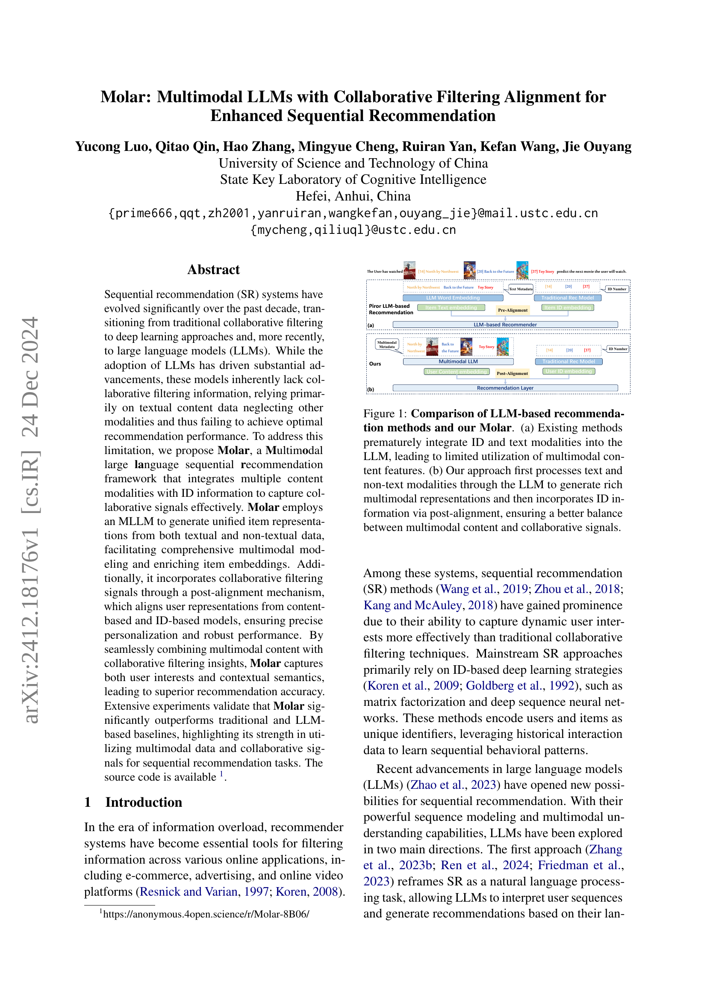
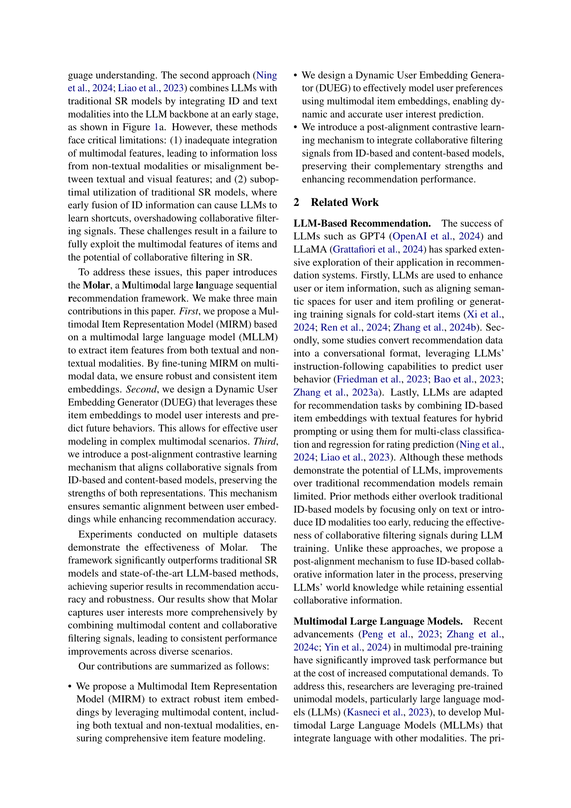
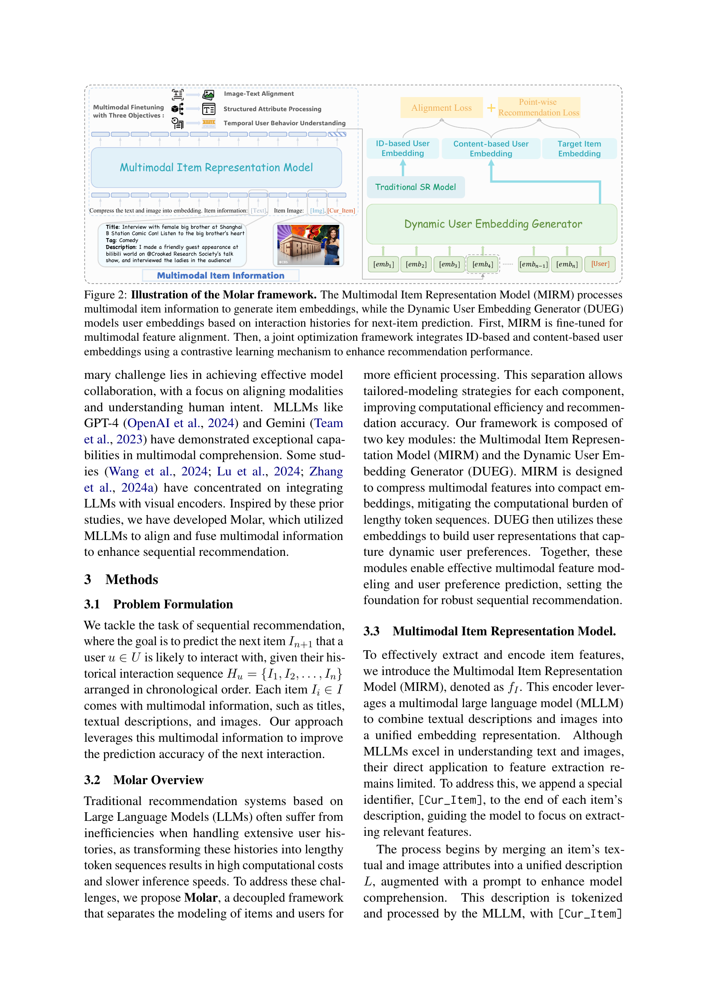
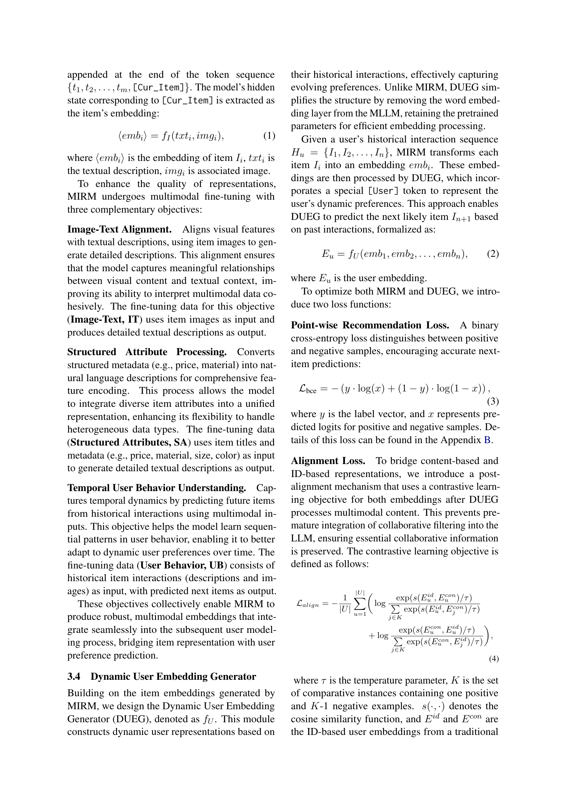
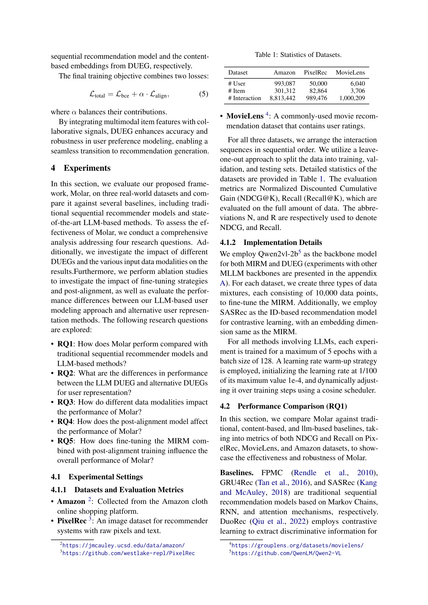
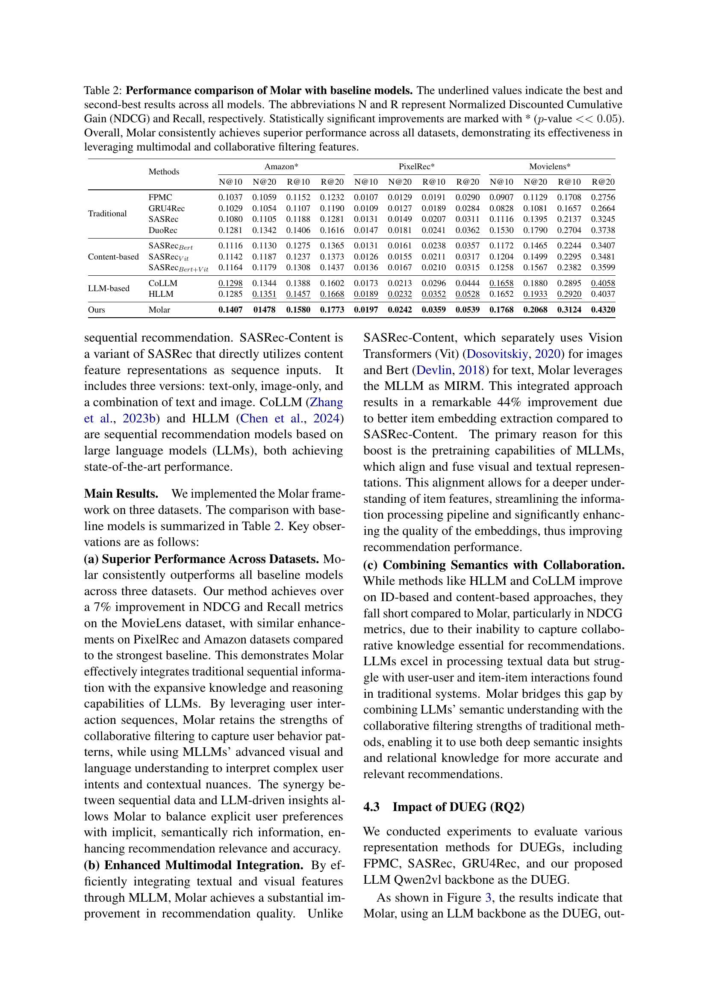
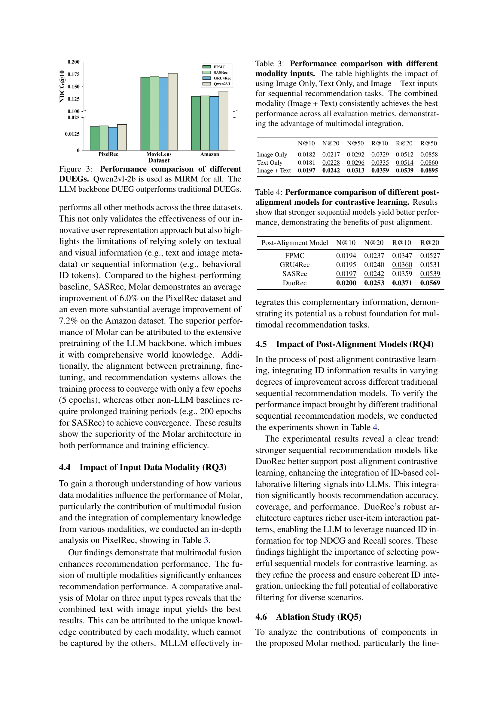
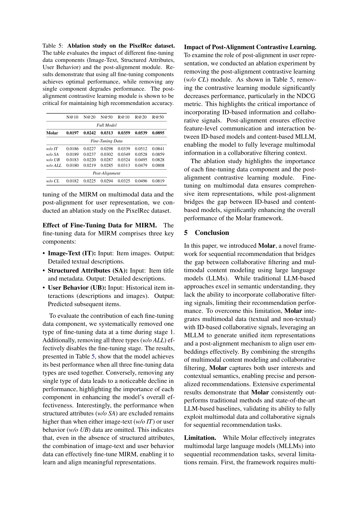
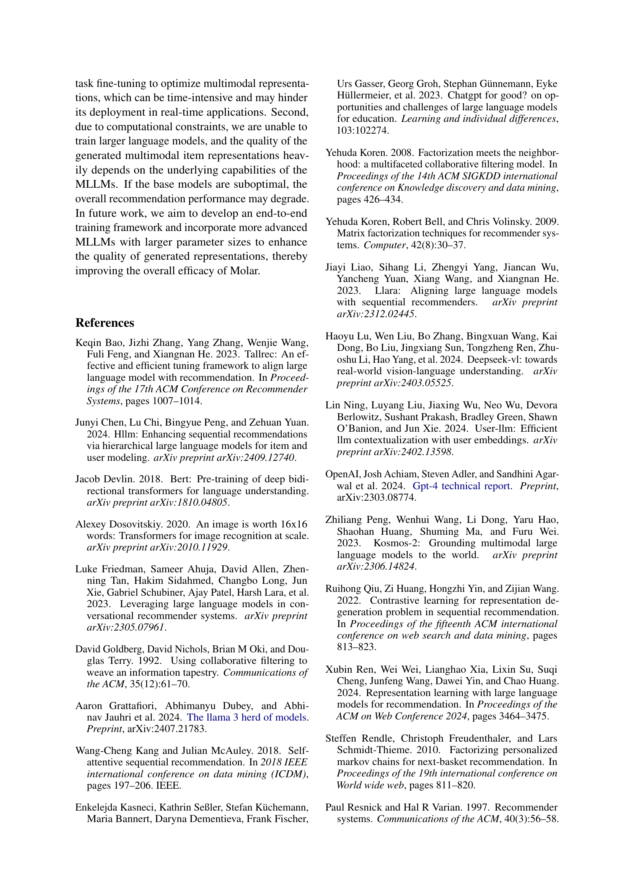
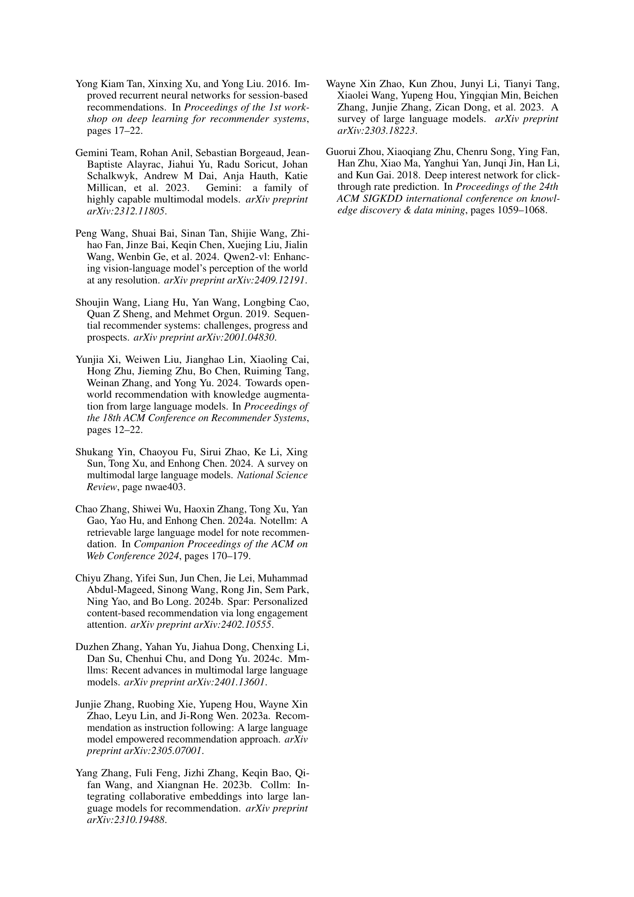
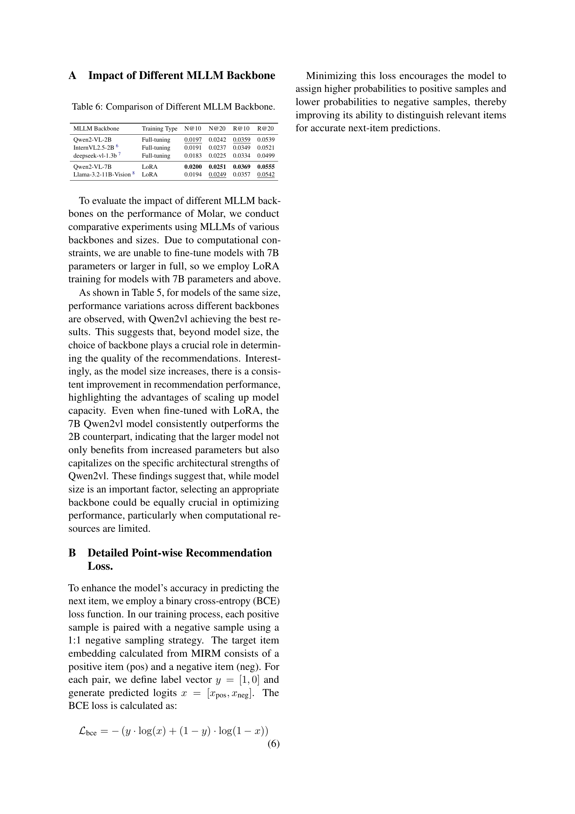
