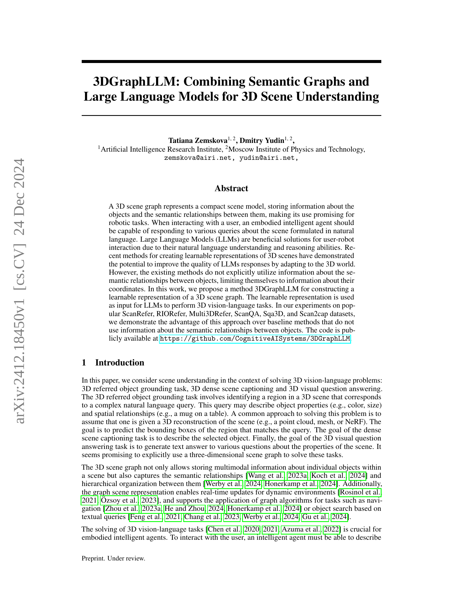

 


 2412.18450 
 Tatiana Zemskova et el. 
 
 🤗 2024-12-25 
 



↗ arXiv


↗ Hugging Face


↗ Papers with Code


### TL;DR



3D 시각 언어 과제는 **자연어 질의를 사용하여 3D 장면에서 객체를 식별하고, 장면을 설명하고, 질문에 답하는 것을 포함하는 복잡한 문제**입니다. 기존 방법들은 객체 간의 의미론적 관계를 명시적으로 활용하지 않고 좌표 정보에만 의존하여 성능 향상에 한계가 있습니다.  

본 논문에서는 **3DGraphLLM이라는 새로운 방법**을 제시합니다. 3DGraphLLM은 **3D 시각 그래프의 학습 가능한 표현**을 생성하고, 이를 **거대 언어 모델(LLM)**에 입력으로 사용합니다.  이를 통해 객체 간의 의미론적 관계를 명시적으로 활용하여 **3D 시각 언어 과제의 성능을 향상**시킵니다. 여러 데이터셋에서의 실험 결과는 제안된 방법의 우수성을 보여주며, 특히 객체 간의 의미론적 관계를 활용하는 것이 성능 향상에 중요함을 강조합니다.



#### Key Takeaways


 3DGraphLLM은 3D 시각 언어 과제를 위한 새로운 학습 가능한 3D 시각 그래프 표현 방법을 제시합니다. 



 의미론적 관계를 활용하여 기존 방법보다 3D 시각 언어 과제에서 더 높은 정확도를 달성합니다. 



 ScanRefer, RIORefer, Multi3DRefer, ScanQA, Sqa3D, Scan2cap 데이터셋에서 기존 방법 대비 성능 향상을 실험적으로 입증합니다. 


#### Why does it matter?
**본 논문은 3D 시각 언어 과제에 대한 새로운 접근 방식을 제시하여 연구자들에게 중요한 의미를 지닙니다.**  **3DGraphLLM은 의미론적 관계를 명시적으로 활용하여 기존 방법보다 성능을 향상시키는 것을 보여줍니다.** 이는 3D 시각 언어 이해 분야의 발전에 기여하고, **추후 연구를 위한 새로운 가능성을 제시합니다.** 특히, **대규모 언어 모델(LLM)을 활용한 3D 시각 정보 처리 분야**에 큰 영향을 미칠 것으로 예상됩니다.

------
#### Visual Insights

> 🔼 그림 1은 제안된 3DGraphLLM 방법이 다양한 3D 비전-언어 작업을 수행하기 위해 3D 의미론적 장면 그래프의 학습 가능한 표현을 LLM에 입력으로 제공하는 과정을 보여줍니다.  3D 장면 그래프는 객체와 객체 간의 의미론적 관계를 저장하는 간결한 장면 모델로, 로봇 작업에 유용합니다. 사용자와 상호 작용할 때, 구현된 지능형 에이전트는 자연어로 표현된 장면에 대한 다양한 질문에 응답할 수 있어야 합니다. LLM은 자연어 이해 및 추론 능력으로 인해 사용자-로봇 상호 작용에 효과적인 해결책입니다.  3DGraphLLM은 3D 장면 그래프의 학습 가능한 표현을 생성하고 이를 LLM에 입력으로 사용하여 3D 비전-언어 작업을 수행하는 방법입니다. 이를 통해 기존의 좌표 정보만 사용하는 방법보다 성능 향상을 기대할 수 있습니다.
> 

> 
read the caption

> Figure 1: Proposed 3DGraphLLM approach leverages 3D semantic scene graph learnable representation supplied as input to an LLM to perform various 3D vision-language tasks.
> 


| System: | A chat between a curious user and an artificial intelligence assistant. | 
|  | The assistant gives helpful, detailed, and polite answers to the user’s questions. The conversation centers around an indoor scene: `&lt;OBJ001&gt;`  $F_{1}^{2d},F_{1}^{v},F_{12}^{e},F_{2}^{v}F_{1}^{v},F_{14}^{e},F_{4}^{v}$…`&lt;OBJN&gt;` $F_{N}^{2d},F_{N}^{v},F_{Nk_{1}}^{e},F_{k_{1}}^{v}F_{N}^{v},F_{Nk_{2}}^{e},F_{k_{2}}^{v}$ | 
| User: | According to the given description, _there are brown wooden cabinets_, | 
|  | _placed on the side of the kitchen_, please provide the ID of the object that closely matches this description. | 
| Assistant: | `&lt;OBJ001&gt;`. | 

> 🔼 표 1은 언어 모델 프롬프트의 예시를 보여줍니다.  여기에는 시스템 프롬프트, 객체 식별자 및 해당 객체의 하위 그래프를 포함한 장면 설명, 사용자 요청 및 언어 모델의 응답이 포함됩니다.  객체 식별자는 <OBJ001>과 같이 표시되며, 각 객체의 2D 및 3D 특징과 객체 간의 의미 관계 특징이 이어집니다.  이는 3DGraphLLM이 시각적 언어 작업을 위해 3D 의미 장면 그래프를 어떻게 처리하는지 보여주는 예시입니다.
> 

> 
read the caption

> Table 1:  Example of prompt for the language model containing scene graph.
> 

### In-depth insights

#### 3D Graph Fusion
3D 그래프 융합이란 3차원 공간 데이터를 효과적으로 표현하고 분석하기 위해 서로 다른 3D 그래프들을 통합하는 기술입니다. **다양한 정보원으로부터 얻어진 3D 그래프들을 융합하면 단일 그래프로는 얻을 수 없는 풍부한 정보를 얻을 수 있습니다.** 예를 들어, 깊이 이미지, 점 구름, 메쉬 등 다양한 3D 데이터로부터 생성된 그래프들을 융합하여 물체의 형태, 공간적 관계, 의미적 정보 등을 보다 정확하고 포괄적으로 파악할 수 있습니다.  **이러한 융합 과정에서는 그래프 간의 일관성을 유지하고 노이즈나 모순되는 정보를 제거하는 것이 중요합니다.**  **효과적인 3D 그래프 융합은 3차원 시각 이해, 로봇 제어, 3D 모델링 등 다양한 분야에서 활용될 수 있는 강력한 도구**가 될 수 있습니다.  **특히, 의미적 정보를 포함하는 세만틱 그래프를 융합하면 3D 데이터의 의미를 보다 정확하게 파악하고 복잡한 시각적 질의응답에 대한 답변의 질을 높일 수 있습니다.**  **딥러닝 기술과의 결합을 통해 자동화된 3D 그래프 융합 시스템을 구축할 수 있으며, 이는 다양한 3D 응용 분야에서 효율성과 정확성을 향상시키는 데 크게 기여할 수 있습니다.**  향후 연구에서는 다양한 유형의 3D 그래프를 융합하는 방법, 융합 과정에서의 노이즈 제거 및 불확실성 처리, 그리고 융합된 그래프의 효과적인 활용 방법 등에 대한 연구가 필요합니다.

#### LLM-Graph Synergy
LLM과 그래프의 시너지 효과는 **3D 시각 언어 모델링**에서 혁신적인 가능성을 제시합니다.  **LLM의 강력한 언어 이해 및 추론 능력**과 **그래프의 효율적인 시각 정보 표현 및 관계 모델링 능력**이 결합되어 3D 장면 이해의 정확성과 효율성을 높입니다.  **3D 장면 그래프**는 객체들 간의 공간적 및 의미적 관계를 포착하여 LLM에 풍부한 맥락 정보를 제공합니다. 이를 통해 LLM은 복잡한 자연어 질의에 대해 더욱 정확하고 세밀한 응답을 생성할 수 있습니다.  **학습 가능한 그래프 표현**을 사용하여 LLM의 토큰 임베딩 공간에 시각 정보를 매핑함으로써, 효율적인 정보 처리와 빠른 추론 속도를 달성할 수 있습니다.  **다양한 3D 시각 언어 작업**에 적용 가능하며, 특히 객체 식별, 장면 캡션 생성, 질의응답 등에서 성능 향상을 기대할 수 있습니다.  그러나 **그래프의 크기와 복잡도**는 추론 시간에 영향을 미칠 수 있는 한계점으로, 효율적인 그래프 표현 및 알고리즘 개발이 중요합니다. 또한, **고품질의 장면 그래프 생성**을 위한 정확한 객체 검출 및 관계 추론 기술이 필수적입니다.

#### Semantic Encoding
본 논문에서 "Semantic Encoding"이라는 제목으로 다루어질 내용은 3D 공간에 존재하는 객체들 간의 의미적 관계를 효과적으로 표현하는 방법에 대한 논의일 것입니다.  이는 단순히 객체의 위치 정보뿐 아니라, **객체의 종류, 크기, 색상, 그리고 서로 간의 공간적 관계(예: 위, 아래, 옆, 안에 등)**을 포함한 풍부한 의미 정보를 효율적으로 인코딩하는 것을 의미합니다.  이러한 의미적 관계 정보를 효과적으로 표현하는 방식은 **Large Language Model(LLM)**의 이해도를 높이고, **더 정확하고 자연스러운 질의응답**을 가능하게 합니다.  **그래프 기반 표현**이나 **벡터 표현**과 같은 다양한 방법론이 고려될 수 있으며, 각 방법론의 장단점 및 LLM과의 연동 방식에 대한 심도있는 분석이 필요할 것입니다. 특히, **효율성**을 고려하여 LLM의 처리 부하를 최소화하면서 의미 정보를 충분히 담아내는 것이 중요한 과제가 될 것입니다.  이는 곧 3D 시각 언어 이해 분야에서의 핵심적인 문제 해결 방안을 제시하는 데 기여할 것입니다.

#### Benchmark Results
본 논문에서 제시된 3DGraphLLM의 성능을 평가하기 위한 벤치마크 결과는 여러 3D 비전-언어 작업에서 **최첨단 성능**을 달성했다는 점을 보여줍니다. 특히, ScanRefer, Multi3DRefer, Scan2Cap과 같은 데이터셋에서 기존 방법들을 상당히 능가하는 결과를 얻었습니다. 이는 **3D 시맨틱 그래프를 LLM에 통합**하는 3DGraphLLM의 독창적인 접근 방식이 **객체 간의 의미적 관계를 효과적으로 활용**함으로써 3D 시각적 언어 이해 능력을 크게 향상시켰다는 것을 시사합니다.  **다양한 벤치마크 작업에서 일관된 성능 향상**을 보였으며, 특히 객체 식별 및 관계 파악과 같은 세부 과제에서의 우수성이 두드러졌습니다.  **다만, 특정 공간 관계에 대한 오류**는 향후 개선 과제로 남아있습니다.  전반적으로, 벤치마크 결과는 3DGraphLLM의 **뛰어난 성능과 잠재력**을 확인시켜 주는 동시에 추가적인 연구를 통해 더욱 발전시킬 수 있는 부분을 제시합니다.

#### Future of 3DGraphLLM
3DGraphLLM의 미래는 **3D 시각 언어 모델링 분야의 혁신적인 발전**에 달려 있습니다.  **더욱 정교한 3D 시맨틱 그래프 생성 및 표현 기술**의 개발을 통해 보다 정확하고 풍부한 시각적 정보를 LLMs에 제공할 수 있을 것입니다.  **다양한 센서 데이터 통합**과 **실시간 처리 기술** 발전은 3DGraphLLM의 실시간 응용 및 확장성을 높일 것입니다.  또한 **대규모 언어 모델의 발전**과의 시너지 효과를 통해 더욱 복잡하고 추상적인 질문에도 답변할 수 있는 능력을 갖추게 될 것입니다.  **데이터 증강 기술** 및 **도메인 적응 기술** 발전을 통해 다양한 환경 및 작업에 대한 3DGraphLLM의 일반화 능력을 향상시킬 수 있습니다.  **설명 가능성 및 신뢰성 향상** 연구 또한 중요하며,  **윤리적 고려사항**을 반영한 개발이 필수적입니다.  궁극적으로 3DGraphLLM은 **로봇 공학, 자율 주행, 가상 현실 등 다양한 분야**에 적용되어 **인간-컴퓨터 상호작용을 혁신**할 가능성을 지니고 있습니다.

### More visual insights

More on figures

> 🔼 그림 2는 제안된 3DGraphLLM 접근 방식의 전체 아키텍처를 보여줍니다. 3DGraphLLM은 3D 객체 점 구름과 객체 간의 의미 관계에 대해 사전 훈련된 인코더를 활용합니다. 추출된 그래프 노드와 에지 특징을 사전 훈련된 LLM의 토큰 임베딩 공간에 매핑하기 위해 훈련 가능한 계층을 도입합니다. 장면 그래프는 LLM에 입력하기 위해 평평하게 처리되며, 각 객체는 k개의 가장 가까운 이웃의 서브그래프로 표현됩니다. 3D 비전-언어 작업에 LLM을 더 잘 적용하기 위해 새로운 객체 토큰을 LLM의 어휘에 추가하고 LoRA를 사용하여 미세 조정합니다.
> 

> 
read the caption

> Figure 2:  The overall architecture of our approach. 3DGraphLLM leverages pre-trained encoders for 3D object point clouds and semantic relationships between objects. We introduce trainable layers to map the extracted graph node and edge features into the token embedding space of a pre-trained LLM. The scene graph is flattened for input into the LLM, with each object represented by a subgraph of its k nearest neighbors. To further adapt the LLM to 3D vision-language tasks, we add new object tokens to the LLM’s vocabulary and fine-tune it using LoRa.
> 

> 🔼 그림 3은 ScanRefer 데이터셋에서 3DGraphLLM의 성능을 보여주는 정성적 예시입니다. 각 질의어에 대해 ScanNet 데이터셋의 RGB 이미지와 RGB 포인트 클라우드 시각화를 함께 제공합니다. 포인트 클라우드에서 녹색 점은 3DGraphLLM이 질의어의 객체에 해당한다고 식별한 점을 나타내고, 녹색 상자는 질의어에 대한 실제 바운딩 박스(GT 박스)를 강조 표시합니다.
> 

> 
read the caption

> Figure 3:  Qualitative examples of 3DGraphLLM performance on the ScanRefer dataset. For each query, we provide an RGB image from the ScanNet dataset showing the selected object, along with a visualization of the RGB point cloud. In the point cloud, green points indicate the points that 3DGraphLLM identified as corresponding to the object from the text query, while the green box highlights the ground truth (GT) box for the query.
> 

> 🔼 그림 4는 ScanNet 훈련 세트 내에서 GT(Ground Truth) 장면 분할 및 Mask3D 장면 분할을 기반으로 두 개의 가장 가까운 이웃(NN)에 대한 Uni3D 객체 특징과 VL-SAT 의미적 가장자리 특징을 비교한 것입니다. 왼쪽 패널은 GT 포인트 클라우드와 Mask3D 포인트 클라우드에 대해 Uni3D 객체 특징이 상대적으로 가깝다는 것을 보여줍니다. 가운데 패널은 VL-SAT 특징을 생성하기 위해 NN을 선택하는 표준 접근 방식을 사용하면 Mask3D 포인트 클라우드 쌍의 특징이 GT 포인트 클라우드의 특징과 크게 다르다는 것을 보여줍니다. 오른쪽 패널은 NN을 선택하기 위해 최소 이웃 거리 필터를 적용하면 Mask3D 인스턴스 분할에서 가져온 객체 쌍의 VL-SAT 특징이 GT 인스턴스 분할에서 가져온 객체 쌍의 특징과 더욱 일치한다는 것을 보여줍니다.
> 

> 
read the caption

> Figure 4:  Comparison of Uni3D object features and VL-SAT semantic edge features for the two nearest neighbors (NNs) based on ground-truth (GT) scene segmentation and Mask3D scene segmentation within the ScanNet training set.  Left: Uni3D object features are relatively close for GT point clouds and Mask3D point clouds. Center: using the standard approach for selecting NNs to generate VL-SAT features, the features for pairs of Mask3D point clouds differ significantly from those of GT point clouds. Right: after applying a minimum neighbor distance filter for selecting NNs, the VL-SAT features for object pairs from Mask3D instance segmentation align more closely with those from GT instance segmentation.
> 

> 🔼 그림 5는 객체 부분 그래프에서 가장 가까운 이웃의 수에 따른 추론 속도와 시각적 근거 정확도의 관계를 보여줍니다. 이 실험에서는 GT 인스턴스 분할과 함께 RioRefer 데이터 세트를 사용합니다. 보다 자세히 설명하자면, 객체의 표현에 사용되는 가장 가까운 이웃의 수를 변화시키면서 추론 시간과 시각적 접지(visual grounding) 성능에 어떤 영향을 미치는지 보여주는 그래프입니다.  x축은 가장 가까운 이웃의 수이고, y축은 추론 시간(msec)과 정확도(Accuracy@0.5)를 나타냅니다. RioRefer 데이터셋과 GT 인스턴스 세분화를 사용한 실험 결과를 보여줍니다.
> 

> 
read the caption

> Figure 5:  Dependence of inference speed and visual grounding accuracy on the number of nearest neighbors in the object subgraph. This experiment utilizes the RioRefer dataset along with GT instance segmentation.
> 

> 🔼 그림 6은 3DGraphLLM이 공간적 관계를 다룰 때 발생하는 일반적인 오류 사례를 보여줍니다. 왼쪽 그림은 ScanQA 데이터셋에서 3DGraphLLM이 관찰자를 기준으로 앞뒤, 좌우 방향을 잘못 식별한 경우를 보여줍니다. 오른쪽 그림은 ScanRefer 데이터셋에서 3DGraphLLM이 좌우를 혼동한 경우를 보여줍니다. 정답 객체는 녹색으로 강조 표시되고 3DGraphLLM의 예측 결과는 빨간색으로 강조 표시됩니다.
> 

> 
read the caption

> Figure 6:  Common failure cases of 3DGraphLLM related to spatial relationships. Left: In the ScanQA dataset, 3DGraphLLM incorrectly identifies the front/back and left.right directions relative to the observer. Right: In the ScanRefer dataset, 3DGraphLLM confuses left and right. The GT object is highlighted in green, and the 3DGraphLLM prediction is highlighted in red.
> 

> 🔼 그림 7은 3DGraphLLM이 방과 물체에 대한 기능적 질문에 답하는 능력을 보여줍니다. 왼쪽은 3DGraphLLM이 방의 기능적 속성과 방 유형에 대한 질문에 답할 수 있음을 보여줍니다. 오른쪽은 3DGraphLLM이 방에 있는 물체의 기능적 속성에 대한 질문에 답할 수 있음을 보여줍니다.  즉, 그림은 훈련 데이터셋에 없는 유형의 질문에 대해서도 3DGraphLLM이 상식적인 지식을 활용할 수 있음을 시각적으로 보여주는 예시입니다.
> 

> 
read the caption

> Figure 7:  Functional queries about the room and objects to the 3DGraphLLM. Left: 3DGraphLLM is capable of answering questions about functional properties of the room and its room type. Right: 3DGraphLLM is capable of answering questions about the functional properties of objects in a room.
> 

More on tables


| Methods | ScanRefer | ScanRefer | ScanRefer | Multi3DRefer | Multi3DRefer | ScanQA | ScanQA | Sqa3D | Scan2Cap | Scan2Cap |
|---|---|---|---|---|---|---|---|---|---|---|
|  | A@0.25↑ | A@0.5↑ | F1@0.25↑ | F1@0.5↑ | C↑ | B-4↑ | EM↑ | C@0.5↑ | B-4@0.5↑ |  |
| ***Expert models*** |  |  |  |  |  |  |  |  |  |  |
| ScanRefer (Chen et al., 2020) | 37.3 | 24.3 |  |  | - | - | - | - | - | - |
| MVT (Huang et al., 2022) | 40.8 | 33.3 | - | - | - | - | - | - | - | - |
| 3DVG-Trans (Zhao et al., 2021) | 45.9 | 34.5 | - | - | - | - | - | - | - | - |
| ViL3DRel (Chen et al., 2022) | 47.9 | 37.7 | - | - | - | - | - | - | - | - |
| M3DRef-CLIP (Zhang et al., 2023) | 51.9 | 44.7 | 42.8 | 38.4 | - | - | - | - | - | - |
| Scan2Cap (Chen et al., 2021) | - | - | - | - | - | - | - | 35.2 | 22.4 |  |
| ScanQA (Azuma et al., 2022) | - | - | - | - | 64.9 | 10.1 | - | - | - | - |
| Sqa3D (Ma et al., 2022) | - | - | - | - | - | - | 47.2 | - | - | - |
| 3D-VisTA (Zhu et al., 2023) | 50.6 | 45.8 | - | - | 72.9 | 13.1 | 48.5 | 66.9 | 34.0 |  |
| BUTD-DETR (Jain et al., 2022) | 52.2 | 39.8 | - | - | - | - | - | - | - | - |
| PQ3D (Zhu et al., 2025) | - | 51.2 | - | - | 50.1 | 87.8 | - | 47.1 | 80.3 | 36.0 |
| ***LLM-based models*** |  |  |  |  |  |  |  |  |  |  |
| ZSVG3D (Yuan et al., 2024) | 36.4 | 32.7 |  |  | - | - | - | - | - | - |
| 3D-LLM(Flamingo) (Hong et al., 2023b) | 21.2 | - | - | - | 59.2 | 7.2 | - | - | - | - |
| 3D-LLM(BLIP2-flant5) (Hong et al., 2023b) | 30.3 | - | - | - | 69.4 | 12.0 | - | - | - | - |
| Chat-3D v2 (Huang et al., 2023) | 35.9 | 30.4 | - | - | 77.1 | 7.3 | - | - | - | - |
| Scene-LLM (Fu et al., 2024) | - | - |  | - | 80.0 | 12.0 | 54.2 | - | - | - |
| LL3DA (Chen et al., 2023) | - | - | - | - | 76.8 | 13.5 | - | 65.2 | 36.8 |  |
| Grounded 3D-LLM (Chen et al., 2024) | 47.9 | 44.1 | 45.2 | 40.6 | 72.7 | 13.4 | - | 70.6 | 35.5 |  |
| Chat-Scene (Huang et al., 2024) | 55.5 | 50.2 | 57.1 | 52.4 | 87.7 | 14.3 | 54.6 | 77.1 | 36.3 |  |
| 3DGraphLLM Vicuna-1.5 (ours) | 57.0 | 51.3 | 60.1 | 55.4 | 87.6 | 12.1 | 53.1 | 81.2 | 36.3 |  |
| 3DGraphLLM LLAMA3-8B (ours) | 60.2 | 54.6 | 63.0 | 58.2 | 83.1 | 12.5 | 55.2 | 82.9 | 37.8 | 
> 🔼 표 2는 3D 시각-언어 과제에 대한 최첨단 기법들과 3DGraphLLM의 성능 비교를 보여줍니다.  '전문가 모델'은 서로 다른 3D 시각-언어 과제를 처리하기 위해 특수화된 헤드를 사용하는 반면, 3DGraphLLM을 포함한 'LLM 기반 모델'은 생성 모델에 대한 다양한 사용자 질문으로 서로 다른 과제를 처리합니다.  이 표는 다양한 3D 시각-언어 과제(ScanRefer, Multi3DRefer, ScanQA, Sqa3D, Scan2Cap)에 대한 정량적 결과를 보여주며, 각 과제에 대한 여러 평가 지표(Acc@0.25, Acc@0.5, F1@0.25, F1@0.5, CIDEr, BLEU-4, EM, CIDEr@0.5, BLEU-4@0.5)가 포함되어 있습니다.  CIDEr은 CIDEr 지표를 나타냅니다.
> 

> 
read the caption

> Table 2:  Performance comparison of 3DGraphLLM with state-of-the-art approaches for 3D vision-language tasks. 'Expert models' use specialized heads to deal with different 3D vision-language tasks. Our approach falls into the category of 'LLM-based models' that consider different tasks as different user queries to a generative model. C denotes the CIDEr metric.
> 


| Methods | Pre-train | of edges | ScanRefer Acc@0.5↑ | ScanRefer F1@0.5↑ | Multi3DRefer C↑ | Multi3DRefer B-4↑ | ScanQA EM↑ | Sqa3D C@0.5↑ | Scan2Cap B-4@0.5↑ |
|---|---|---|---|---|---|---|---|---|---| 
| 3DGraphLLM-0 Vicuna1.5 | ✗ | 0 | 50.2 | 52.4 | 87.7 | 14.3 | 54.6 | 77.1 | 36.3 |
| 3DGraphLLM-2 Vicuna1.5 | ✗ | 2 | 50.1 | 52.7 | 92.2 | 15.5 | 54.7 | 80.4 | 36.9 |
| **3DGraphLLM-2 Vicuna1.5** | ✓ | **2** | **51.3** | **55.4** | 87.6 | 12.1 | 53.1 | **81.2** | **36.3** |
| 3DGraphLLM-0 LLAMA3-8B | ✗ | 0 | 52.0 | 55.1 | 84.0 | 15.8 | 53.8 | 80.0 | 37.5 |
| 3DGraphLLM-2 LLLAMA3-8B | ✗ | 2 | 54.3 | 57.3 | **87.4** | 14.9 | 54.5 | **85.6** | **39.6** |
| **3DGraphLLM-2 LLLAMA3-8B** | ✓ | **2** | **54.6** | **58.2** | 83.1 | 12.5 | **55.2** | 82.9 | 37.8 |
> 🔼 표 3은 3DGraphLLM 모델에서 의미 관계(semantic edges)의 역할과 학습 과정(training pipeline)에 대한 ablation study 결과를 보여줍니다.  구체적으로, 의미 관계를 사용하지 않는 경우(0개의 edge)와 2개의 edge를 사용하는 경우를 비교 분석하여 성능 변화를 측정했습니다.  여러 가지 3D 비전-언어 작업(ScanRefer, Multi3DRefer, ScanQA, Sqa3D, Scan2Cap)에 대한 성능 지표(Acc@0.5, F1@0.5, CIDEr, BLEU-4, EM, C@0.5, B-4@0.5)가 제시되어 있으며, 사전 학습(Pre-train) 여부에 따른 결과도 함께 제시되어 있습니다. CIDEr는 CIDEr metric을 나타냅니다.
> 

> 
read the caption

> Table 3: Ablation study on semantic edges role and training pipeline. C denotes the CIDEr metric.
> 


| Methods | Instance segmentation | Number of edges | Minimal distance, cm | Acc@0.25↑ | Acc@0.5↑ |
|---|---|---|---|---|---| 
| 3DGraphLLM-0 | GT | 0 | - | 48.9 | 48.9 |
| **3DGraphLLM-2** | **GT** | **2** | 0 | **54.4(+5.6%)** | **54.4(+5.6%)** |
| 3DGraphLLM-0 | Mask3D | 0 | - | 46.0 | 34.2 |
| 3DGraphLLM-2 | Mask3D | 2 | 0 | 47.3(+1.3%) | 35.6(+1.4%) |
| 3DGraphLLM-2 | Mask3D | 2 | 1 | 48.0(+2.0%) | 36.2(+2.0%) |
| **3DGraphLLM-2** | **Mask3D (+ NMS)** | **2** | **1** | **48.1(+2.1%)** | **36.5(+2.3%)** |
| 3DGraphLLM-0 | OneFormer3D | 0 | - | 45.4 | 34.5 |
| 3DGraphLLM-2 | OneFormer3D | 2 | 0 | 47.1(+1.7%) | 35.7(+1.2%) |
| **3DGraphLLM-2** | **OneFormer3D (+NMS)** | **2** | **1** | **47.5(+2.1%)** | **36.1(+1.6%)** |
> 🔼 표 4는 인스턴스 분할의 질에 따라 의미 관계 에지의 역할에 대한 추가 연구 결과를 보여줍니다.  즉, 정확한 객체 분할 결과(GT)를 사용했을 때와, Mask3D 및 OneFormer3D 모델을 사용하여 예측된 객체 분할 결과를 사용했을 때의 성능 차이를 비교 분석합니다.  여기서, 의미 관계 에지의 수와 최소 거리 필터의 적용 여부에 따른 성능 변화를 다양한 지표(ScanRefer의 Acc@0.25, Acc@0.5, Multi3DRefer의 F1@0.25, F1@0.5)로 측정하여, 의미 관계 에지와 정확한 객체 분할의 중요성을 보여줍니다.  특히, 최소 거리 필터를 적용함으로써 잡음이 많은 예측 객체 분할 결과에서도 성능 향상을 얻을 수 있음을 보여줍니다.
> 

> 
read the caption

> Table 4: Ablation study on semantic edges role depending on quality of instance segmentation.
> 


| Methods | Edge Number | Spatial relation | Acc@0.5↑ |
|---|---|---|---|
| 3DGraphLLM | 0 | ✓ | 42.6 |
| 3DGraphLLM | 2 | ✓ | 48.9(+6.3%) |
| 3DGraphLLM | 2 | ✗ | **50.1(+7.5%)** |
> 🔼 이 표는 RioRefer 데이터셋(GT 인스턴스 분할)에서 공간 관계 모듈에 대한 추가 연구 결과를 보여줍니다.  구체적으로, GT 인스턴스 분할을 사용하여 3DGraphLLM 모델의 성능에 공간 관계 정보를 추가했을 때의 영향을 분석합니다.  모델에 공간 관계 정보를 추가하지 않은 경우(Edge Number 0)와 2개의 가장 가까운 이웃을 고려한 경우(Edge Number 2)의 정확도(Acc@0.5)를 비교하여 공간 관계 정보의 중요성을 보여줍니다.  또한, 공간 관계 정보를 추가하는 방식에 따라 성능 차이가 발생하는지 확인하기 위해 여러 실험을 진행했습니다.
> 

> 
read the caption

> Table 5: Ablation study on spatial relation module on RioRefer dataset (GT Instance segmentation).
> 

### Full paper



