 


 2412.18547 
 Tingxu Han et el. 
 
 🤗 2024-12-26 
 



↗ arXiv


↗ Hugging Face


↗ Papers with Code


### TL;DR



대규모 언어 모델(LLM)은 다양한 작업에서 뛰어난 성능을 보이지만, 사고 과정(CoT)과 같은 추론 방법은 토큰 사용량이 많아 비용이 많이 들고 속도가 느립니다. 기존 방법들은 추론 성능 향상에 초점을 맞추었지만, 토큰 사용량 증가로 인한 비용 증가 문제는 해결하지 못했습니다. 이러한 문제는 LLM 기반 응용 프로그램의 확장성과 경제성에 제약을 가할 수 있습니다.

본 연구에서는 이러한 문제를 해결하기 위해 **토큰 예산 인식 LLM 추론 프레임워크(TALE)**를 제안합니다. TALE은 문제의 복잡성에 따라 토큰 예산을 동적으로 추정하고, 이를 활용하여 추론 과정을 효율적으로 제어합니다. 실험 결과, TALE은 CoT 추론에서 토큰 비용을 크게 줄이면서 성능 저하를 최소화하는 것으로 나타났습니다. 이는 **LLM 추론의 효율성과 경제성을 동시에 향상**시키는 데 기여할 수 있습니다.



#### Key Takeaways


 TALE은 LLM 추론에서 토큰 비용을 크게 줄이면서 정확도를 거의 유지합니다. 



 토큰 예산을 동적으로 조정하여 다양한 문제에 대한 최적의 추론 길이를 찾습니다. 



 TALE은 여러 LLM과 작업에서 효과적이며, 토큰 효율적인 LLM을 설계 및 최적화하는 새로운 방향을 제시합니다. 


#### Why does it matter?
본 논문은 **LLM 추론의 토큰 비용 문제를 해결하기 위한 실용적인 해결책**을 제시하여, LLM 기반 응용 프로그램의 효율성과 경제성을 향상시키는 데 중요한 의미를 가집니다.  **토큰 예산 인식 추론 프레임워크**는 다양한 LLM 및 작업에 적용 가능하며, 향후 연구에서 **토큰 효율적인 LLM 설계 및 최적화**에 대한 새로운 방향을 제시할 수 있습니다. 또한, **추론 과정의 불필요한 길이 문제를 효과적으로 해결**하여, LLM의 성능 향상과 비용 절감을 동시에 달성할 수 있는 가능성을 보여줍니다.

------
#### Visual Insights

> 🔼 그림 (a)는 질문에 대한 15개의 토큰으로 이루어진 직접적인 응답을 보여줍니다.  이는 Chain-of-Thought(CoT)와 같은 추론 과정 없이 모델이 바로 답을 생성하는 방식입니다.  문제 해결 과정이나 중간 단계가 없이 곧바로 최종 답변만 제시하는 간결한 방법입니다.
> 

> 
read the caption

> (a) Direct answering (15 output tokens).
> 


| Prompt method | Content |
|---|---| 
| Vanilla CoT | Let’s think step by step: | 
| CoT with Token Budget | Let’s think step by step and use less than budget tokens: | 
| Example | Let’s think step by step and use less than 50 tokens:|

> 🔼 이 표는 일반적인 Chain-of-Thought (CoT) 프롬프트와 토큰 예산을 고려한 CoT 프롬프트의 차이점을 보여줍니다.  일반적인 CoT 프롬프트는 단순히 '단계별로 생각해 봅시다'라는 지시어만 포함하는 반면, 토큰 예산을 고려한 CoT 프롬프트는 '단계별로 생각해보고, 토큰 수를 [예산]개 이하로 사용하세요' 와 같이 토큰 사용량에 대한 제한을 추가합니다. 이를 통해 모델이 더욱 효율적인 추론 과정을 거치도록 유도하는 것을 보여주는 예시입니다.
> 

> 
read the caption

> Table 1: Illustrations of the vanilla CoT prompt and the token-budget-aware prompt.
> 

### In-depth insights

#### Token Budget Limits
토큰 예산 제한은 대규모 언어 모델(LLM)의 추론 과정에서 **비용 효율성**을 높이는 데 중요한 역할을 합니다.  **제한된 토큰 수 내에서 모델이 효과적으로 추론할 수 있도록** 하는 것이 핵심입니다.  이는 모델이 불필요한 중간 단계나 반복적인 설명을 생성하지 않도록 유도하여 전체 토큰 소모량을 줄입니다.  하지만 단순히 토큰 수를 제한하는 것만으로는 최적의 성능을 보장할 수 없습니다. **토큰 예산의 크기는 문제의 복잡성, 모델의 성능, 그리고 원하는 정확도에 따라 달라져야 합니다.** 따라서 적절한 토큰 예산을 설정하는 것은 모델의 효율성과 정확성 사이의 균형을 맞추는 핵심 요소입니다.  **적절한 토큰 예산 설정을 위한 전략 및 최적화 기법**은 향후 LLM 기반 응용 프로그램의 실용성을 높이는 데 매우 중요한 연구 분야입니다.  **동적 토큰 예산 할당 및 최적화**를 통해 비용 효율성을 극대화하면서 동시에 정확성을 유지하는 방향으로 연구가 진행될 것으로 예상됩니다.

#### CoT Reasoning Cost
본 논문에서 'CoT 추론 비용'에 대한 심층적인 논의는 **토큰 기반 비용**에 초점을 맞춥니다.  Chain-of-Thought (CoT) 방식은 LLM의 추론 능력을 향상시키지만, **추론 과정의 중간 단계를 상세히 기술**하여 토큰 수가 급증하고, **컴퓨팅 비용 및 시간 증가**로 이어지는 문제점을 지적합니다.  따라서 효율적인 추론을 위해 적절한 토큰 예산을 설정하는 것이 중요하며,  **토큰 예산의 적절한 설정**이 전체적인 비용 효율성에 큰 영향을 미친다는 점을 강조합니다.  본 연구는 **동적 토큰 예산 할당**을 통해 이 문제에 대한 해결책을 제시하며,  문제의 복잡도에 따라 토큰 예산을 조정하여 성능 저하를 최소화하면서 비용을 효과적으로 절감하는 방법을 제시합니다.  **토큰 탄성 현상** 또한 중요한 논의 대상입니다.  이는 토큰 예산이 너무 작으면 오히려 토큰 사용량이 증가하는 현상을 말하며,  **최적의 토큰 예산 검색**을 통해 이 문제를 해결하고자 합니다.

#### Optimal Budget Search
연구에서 제시된 최적 예산 검색 전략은 **토큰 비용과 정확도 사이의 균형**을 맞추는 데 중점을 둡니다. 단순히 최소 토큰 수를 목표로 하는 것이 아니라, **합리적인 토큰 한도 내에서 정확한 답변을 얻는 것**이 중요합니다. 이는 낮은 토큰 수로 인해 모델이 과도하게 간결해지거나, 반대로 너무 많은 토큰으로 인해 불필요한 계산이 발생하는 것을 방지합니다. 따라서 최적 예산 검색은 단순히 최소화가 아닌, **성능과 효율성의 균형점**을 찾는 지능적인 최적화 과정이라고 할 수 있습니다. **이진 검색과 탐욕적 전략**을 결합하여 효율성을 높이고, 토큰 탄성 현상을 고려하여 보다 정교한 최적 예산을 찾는 데 집중합니다.

#### TALE Framework
TALE 프레임워크는 **토큰 예산을 동적으로 할당하여 LLM 추론의 효율성과 정확성 간의 균형을 맞추는** 방법을 제시합니다.  **문제의 복잡성에 따라 토큰 예산을 추정**하고 이를 추론 과정에 활용함으로써, 기존 CoT 방식의 과도한 토큰 소모 문제를 해결합니다.  **토큰 탄성 현상**을 고려하여 최적의 토큰 예산을 찾는 알고리즘을 제시하며,  **정확도 저하를 최소화하면서 토큰 사용량을 크게 줄이는** 실험 결과를 보여줍니다.  **제로샷 추정 및 회귀 추정**과 같은 다양한 토큰 예산 추정 방법을 제시하며, **다양한 LLM에 대한 일반화 성능**도 확인합니다. TALE은 비용 효율적인 LLM 추론을 위한 실용적인 해결책을 제시하며, 특히 자원 제약이 있는 환경에서 큰 의미를 가집니다.

#### Future Work
본 논문에서 제시된 토큰-예산 인식 LLM 추론 프레임워크인 TALE은 **토큰 비용 절감**과 **정확도 유지** 사이의 균형을 맞추는 데 효과적임을 보여주었습니다.  하지만, 향후 연구는 여러 방향으로 확장될 수 있습니다.  **다양한 LLM 아키텍처**에 대한 TALE의 일반화 성능을 더욱 심도 있게 평가하고,  **다양한 유형의 추론 문제**에 대한 적용성을 검증하는 것이 중요합니다.  **더욱 효율적인 토큰 예산 추정 기법**을 개발하여 계산 비용을 줄이고,  **추론 과정의 투명성을 높이기 위한 시각화 도구** 개발 또한 필요합니다.  마지막으로, **실제 응용 환경**에서 TALE의 성능과 효율성을 평가하는 실험이 추가적으로 필요하며,  **대규모 데이터셋**을 이용한 광범위한 실험을 통해 TALE의 성능을 더욱 향상시킬 수 있을 것입니다.  이러한 추가적인 연구는 TALE의 실용성과 범용성을 더욱 높이는 데 기여할 것입니다.

### More visual insights

More on figures

> 🔼 그림 (b)는 Chain-of-Thought (CoT) 추론 과정을 보여줍니다. 질문에 대한 답변을 도출하기 위해 여러 단계의 중간 추론 과정을 거치는 모습을 보여주며, 이러한 과정으로 인해 총 258개의 토큰이 생성됩니다.  이는 단순히 답변만 제시하는 것보다 훨씬 많은 토큰을 사용한다는 것을 의미합니다.
> 

> 
read the caption

> (b) Vanilla CoT (258 output tokens).
> 

> 🔼 이 그림은 제한된 토큰 수(10개 미만)를 사용하여 단계별로 생각하라는 프롬프트를 사용하여 풀이한 문제에 대한 결과를 보여줍니다. 비합리적인 토큰 제한으로 인해 모델이 주어진 제한을 따르지 못하고, 157개의 토큰이 생성되었습니다. 이는 원래의 자유로운 단계별 사고(258토큰)보다 적지만, 최적의 토큰 예산을 활용한 경우(86토큰)보다는 여전히 상당히 많습니다. 이는 제한된 토큰 예산이 문제 해결 과정에 미치는 영향을 보여주는 좋은 예시입니다.
> 

> 
read the caption

> (c) CoT with an unreasonable budget (157 output tokens).
> 

> 🔼 그림 (d)는 합리적인 토큰 예산(86개의 출력 토큰)을 사용한 CoT(Chain-of-Thought)의 예시를 보여줍니다.  이 그림은 제한된 토큰 수 내에서도 LLM이 정확한 답을 도출할 수 있음을 보여주는 핵심적인 예시입니다.  문제 해결 과정에 합리적인 토큰 제한을 두면 CoT 과정에서 발생하는 불필요한 토큰을 줄일 수 있다는 것을 시각적으로 보여줍니다. 그림 1의 다른 예시들과 비교하면, 제한된 토큰 예산을 사용했음에도 불구하고 LLM이 정확한 답을 얻는 과정을 보여줍니다.  이는 효율성과 정확성 간의 균형을 맞추는 데 있어 토큰 예산의 중요성을 강조합니다.
> 

> 
read the caption

> (d) CoT with an reasonable budget (86 output tokens).
> 

> 🔼 본 그림은 서로 다른 문제 해결 방식의 예시를 보여줍니다. 각각의 예시는 간단한 질문에 대한 세 가지 다른 유형의 답변을 보여주며, 직접적인 답변, 자세한 추론 과정을 포함한 Chain-of-Thought (CoT) 방식, 그리고 토큰 제한을 포함한 CoT 방식의 세 가지가 포함되어 있습니다. 각 방식에서 사용된 토큰 수를 비교하여 토큰 사용량을 줄이면서도 정확도를 유지하는 방법을 보여줍니다.  추론 과정이 자세히 강조되어 있어, 각 방식의 차이점을 명확하게 이해할 수 있도록 합니다.
> 

> 
read the caption

> Figure 1: Examples of different problem solving paradigms. The reasoning processes are highlighted.
> 

> 🔼 그림 2(a)는 GPT-4o-mini 모델에 대한 토큰 예산 탐색 과정을 보여줍니다.  x축은 탐색 반복 횟수를 나타내고, y축은 각 탐색 반복에서 시도된 토큰 예산을 나타냅니다.  다양한 색상의 선은 서로 다른 샘플들을 나타냅니다.  이 그래프는 모델이 적절한 토큰 예산 범위 내에서 토큰 비용을 상당히 줄일 수 있음을 보여줍니다.  하지만 토큰 예산이 적절한 범위보다 작으면 토큰 비용이 점차 증가하는 토큰 탄성 현상을 보여줍니다.
> 

> 
read the caption

> (a) GPT-4o-mini budget search.
> 

> 🔼 그림 (b)는 GPT-4o-mini 모델에 대한 토큰 비용을 보여줍니다.  x축은 토큰 예산 검색 반복 횟수를 나타내고, y축은 각 검색된 토큰 예산에 대한 실제 토큰 비용을 나타냅니다.  다양한 색상은 서로 다른 샘플을 나타냅니다.  합리적인 토큰 예산 범위 내에서는 토큰 비용이 상당히 낮지만, 토큰 예산이 합리적인 범위보다 작으면 토큰 비용이 점차 증가함을 보여줍니다.
> 

> 
read the caption

> (b) GPT-4o-mini token cost.
> 

> 🔼 그림 (c)는 Yi-lightning 언어 모델에 대한 최적 토큰 예산 검색 과정을 보여줍니다.  x축은 검색 반복 횟수를 나타내고, y축은 각 반복에서 검색된 토큰 예산을 나타냅니다. 여러 색상의 선은 서로 다른 샘플들을 나타냅니다. 이 그림은 적절한 토큰 예산 범위 내에서 토큰 비용이 상당히 낮다는 것을 보여줍니다.  토큰 예산이 적절한 범위보다 작으면 토큰 비용이 점차 증가하는 것을 확인할 수 있습니다. 이는 논문에서 설명하는 '토큰 탄성(Token Elasticity)' 현상을 시각적으로 보여주는 예시입니다.
> 

> 
read the caption

> (c) Yi-lightning budget search.
> 

> 🔼 이 그림은 Yi-lightning 언어 모델에 대한 토큰 비용을 보여줍니다.  그래프는 다양한 토큰 예산을 사용한 검색 반복 횟수에 따른 실제 토큰 비용을 나타냅니다.  합리적인 토큰 예산 범위 내에서는 토큰 비용이 상당히 낮지만, 예산이 너무 작으면 토큰 비용이 크게 증가하는 토큰 탄성 현상을 보여줍니다.  다양한 색상은 서로 다른 샘플을 나타냅니다.
> 

> 
read the caption

> (d) Yi-lightning token cost.
> 

> 🔼 그림 2는 토큰 탄성 현상을 보여줍니다. x축은 예산 검색 반복 횟수를 나타내고, y축은 검색된 예산(그림 2a 및 2c) 또는 각 검색된 예산에 대한 실제 토큰 비용(그림 2b 및 2d)을 나타냅니다. 서로 다른 색상은 서로 다른 샘플을 나타냅니다. 합리적인 토큰 예산 범위 내에서는 토큰 비용이 상당히 낮습니다. 토큰 예산이 합리적인 범위보다 작으면 토큰 비용이 점차 증가합니다.
> 

> 
read the caption

> Figure 2: Token elasticity phenomenon. The x-axis denotes the budget search iteration. The y-axis denotes the searched budget (Figure 2a and Figure 2c) or the real token costs for each searched budget (Figure 2b and Figure 2d). Different colors denote different samples. The token cost is significantly lower in a reasonable token budget range. When the token budget is smaller than the reasonable range, the token cost gradually increases.
> 

> 🔼 그림 3은 최적의 토큰 예산을 검색했을 때의 효과를 보여줍니다. 최적의 토큰 예산을 사용한 CoT(Chain-of-Thought)는 정확도에 영향을 미치지 않으면서 토큰 비용을 상당히 줄입니다. 이 그림은 다양한 질문에 대해 최적의 토큰 예산을 찾는 과정에서 토큰 비용이 어떻게 변하는지 보여주는 여러 개의 샘플을 포함합니다.  적절한 토큰 예산 범위 내에서는 토큰 비용이 상당히 낮지만, 예산이 너무 작으면 토큰 비용이 크게 증가하는 토큰 탄성 현상을 보여줍니다.  즉, 적절한 토큰 예산을 사용하면 모델의 성능을 유지하면서도 효율성을 높일 수 있음을 시각적으로 보여줍니다.
> 

> 
read the caption

> Figure 3: The effects of optimal searched budget. CoT with our optimal searched budget reduces the token costs significantly without influencing the accuracy.
> 

> 🔼 그림 4는 제안된 방법인 TALE의 워크플로우를 보여줍니다. 질문이 주어지면 TALE은 먼저 예산 추정기를 사용하여 토큰 예산을 추정합니다. 그런 다음 추정된 토큰 예산과 질문을 결합하여 토큰 예산 인식 프롬프트를 만듭니다. 마지막으로, 이 프롬프트가 LLM에 입력되어 최종 답변을 생성합니다.
> 

> 
read the caption

> Figure 4: The workflow of TALE. Given a question, TALE first estimates the token budget using a budget estimator. It then crafts a token-budget-aware prompt by combining the question with the estimated budget. Finally, the prompt is input to the LLM to generate the answer as the final output.
> 

> 🔼 이 그림은 제로샷 추정 방식을 위한 프롬프트를 보여줍니다.  본 논문에서는 언어 모델이 질문에 대한 답변을 생성하는 데 필요한 최소 토큰 수를 추정하도록 프롬프트를 설계했습니다.  이를 통해 효율적인 추론을 위한 최적의 토큰 예산을 동적으로 할당하는 모델의 기능을 보여줍니다. 프롬프트는 질문 분석 및 최소 토큰 수 예측을 위한 명확한 지침을 제공합니다.  특히, 예측된 토큰 수를 [[budget]] 형식으로 출력하도록 지정하여 모델의 출력을 표준화하고, 이후 단계에서의 처리를 용이하게 합니다.
> 

> 
read the caption

> Figure 5: The prompt for zero-shot estimator.
> 

> 🔼 그림 6은 LLMs의 출력을 다중 선택 질문에 맞춰 형식을 지정하는 데 사용된 프롬프트를 보여줍니다.  간단히 말해, 이 프롬프트는 LLM이 다중 선택 질문에 대한 답변을 생성할 때,  [[선택지]] 형식으로 응답하도록 지시합니다. 예를 들어, Choice: [[A]] 와 같이 답변을 제출하도록 명령합니다. 이는 모델의 출력 형식을 표준화하여 정확한 평가를 가능하게 합니다.
> 

> 
read the caption

> Figure 6: The instruction prompt used to format the LLM output on multiple-choice questions.
> 

> 🔼 그림 (a)는 질문에 대한 직접적인 답변만을 제시하는 모델의 출력 결과를 보여줍니다.  이 방법은 10개의 토큰만을 사용하여 간결하지만, 복잡한 추론이 필요한 문제에는 적합하지 않을 수 있습니다.  이는 추론 과정을 생략하고 곧바로 답을 제시하기 때문입니다. 따라서 정확도는 낮을 수 있지만 효율성은 높습니다.
> 

> 
read the caption

> (a) Direct answering (10 output tokens).
> 

More on tables


| Dataset | Directly Answering |  |  | Vanilla CoT |  |  | TALE (Ours) |  |  |
|---|---|---|---|---|---|---|---|---|---| 
|  | ACC ↑ | Output Tokens ↓ | Expense ↓ | ACC ↑ | Output Tokens ↓ | Expense ↓ | ACC ↑ | Output Tokens ↓ | Expense ↓ |
|---|---|---|---|---|---|---|---|---|---| 
| GSM8K | 28.29% | 12.46 | 39.43 | 81.35% | 318.10 | 541.09 | 84.46% | 77.26 | 279.84 |
| GSM8K-Zero | 97.21% | 18.85 | 91.69 | 99.50% | 252.96 | 886.79 | 98.72% | 22.67 | 276.12 |
| MathBench-Arithmetic | 59.67% | 41.10 | 9.78 | 75.00% | 313.51 | 78.58 | 73.67% | 39.60 | 18.62 |
| MathBench-Middle | 33.33% | 5.00 | 3.58 | 84.67% | 553.93 | 68.22 | 79.33% | 238.14 | 42.95 |
| MathBench-High | 51.33% | 5.00 | 4.07 | 84.00% | 653.24 | 82.44 | 80.00% | 254.82 | 47.61 |
| MathBench-College | 44.00% | 5.00 | 3.68 | 78.00% | 675.78 | 81.56 | 70.00% | 259.85 | 45.60 |
| Average | 52.31% | 14.57 | 25.37 | 83.75% | 461.25 | 289.78 | 81.03% | 148.72 | 118.46 |
> 🔼 표 2는 제로샷 추정기 버전의 TALE과 다른 프롬프트 엔지니어링 방법들을 비교한 표입니다. '직접 응답'은 추론 과정 없이 LLM에 프롬프트를 제공하는 방식이고, 'Vanilla CoT'는 예산이 있는 일반적인 CoT 프롬프트 방식입니다. 평가에 사용된 모델은 GPT-4o-mini OpenAI (2024a)입니다. TALE은 평균 정확도(ACC) 80.22%를 달성했으며, 평균 출력 토큰 비용은 138.53개, 평균 비용은 118.46이었습니다. TALE은 Vanilla CoT 방식에 비해 출력 토큰 비용을 67% 줄이고, 비용을 59% 낮추면서 경쟁력 있는 성능을 유지했습니다. ACC는 증가하고, 출력 토큰은 감소하며, 비용(샘플당 10⁻⁵ 달러)도 감소했습니다.
> 

> 
read the caption

> Table 2: Comparison of TALE (Zero-shot Estimator Version) and other prompt engineering methods. “Directly Answering” means prompting LLM without any reasoning process. “Vanilla CoT” means the vanilla CoT prompting with budget. The model used in our evaluation is GPT-4o-mini OpenAI (2024a). Observe that TALE achieves an average accuracy (ACC) of 80.22%, with an average output token cost of 138.53 and an average expense of 118.46. TALE reduces output token costs by 67%, lowers expenses by 59%, and maintains competitive performance compared to the vanilla CoT approach. ACC ↑↑\uparrow↑, Output Tokens ↓↓\downarrow↓, Expense (10−5⁢$superscript105currency-dollar10^{-5}\$10 start_POSTSUPERSCRIPT - 5 end_POSTSUPERSCRIPT $ / sample) ↓↓\downarrow↓.
> 


| LLM | Directly Answering |  |  | Vanilla CoT |  |  | TALE (Ours) |  |  |
|---|---|---|---|---|---|---|---|---|---| 
|  | ACC ↑ | Output Tokens ↓ | Expense ↓ | ACC ↑ | Output Tokens ↓ | Expense ↓ | ACC ↑ | Output Tokens ↓ | Expense ↓ |
| Yi-lightning | 66.67% | 80.01 | 3.09 | 79.33% | 998.10 | 21.55 | 76.67% | 373.52 | 17.25 |
| GPT-4o-mini | 44.00% | 5.00 | 3.68 | 78.00% | 675.78 | 81.56 | 70.00% | 259.85 | 45.60 |
| GPT-4o | 57.33% | 5.00 | 61.34 | 84.00% | 602.29 | 1359.42 | 80.00% | 181.61 | 759.95 |
> 🔼 표 3은 제로샷 추정기 버전의 TALE을 다양한 대규모 언어 모델(LLM)에서 일반화한 결과를 보여줍니다.  Yi-lightning (Wake et al., 2024), GPT-40-mini (OpenAI, 2024a), GPT-40 (OpenAI, 2024b) 세 가지 모델을 사용하여 MathBench-College 데이터셋을 평가했습니다.  표에는 각 모델에 대한 정확도(ACC), 출력 토큰 수, 비용(샘플당 10⁻⁵ 달러)이 나타나 있으며, TALE의 성능이 모델에 관계없이 일관되게 유지되는지 확인할 수 있습니다. 화살표(↑↓)는 각 지표의 변화 방향을 나타냅니다.  즉, ↑는 값이 증가했고, ↓는 값이 감소했음을 의미합니다.
> 

> 
read the caption

> Table 3: The generalization of TALE (Zero-shot Estimator Version) across different LLMs. Yi-lightning Wake et al. (2024), GPT-4o-mini OpenAI (2024a) and GPT-4o OpenAI (2024b) are taken into consideration. We conduct the evaluation on MathBench-College. ACC ↑↑\uparrow↑, Output Tokens ↓↓\downarrow↓, Expense (10−5⁢$superscript105currency-dollar10^{-5}\$10 start_POSTSUPERSCRIPT - 5 end_POSTSUPERSCRIPT $ / sample) ↓↓\downarrow↓.
> 

### Full paper


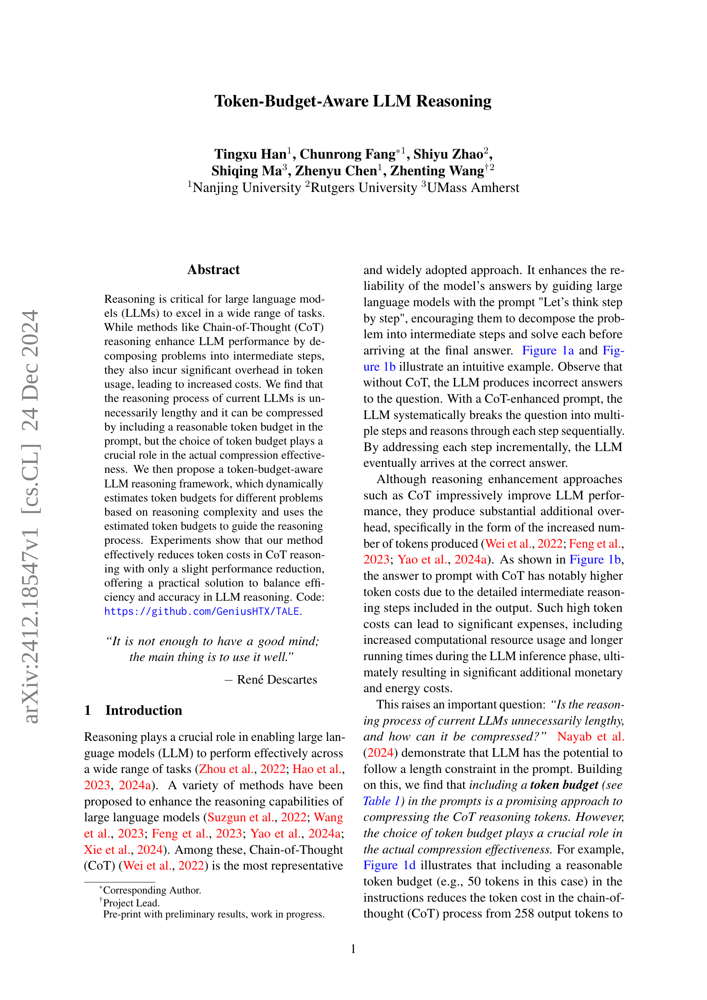
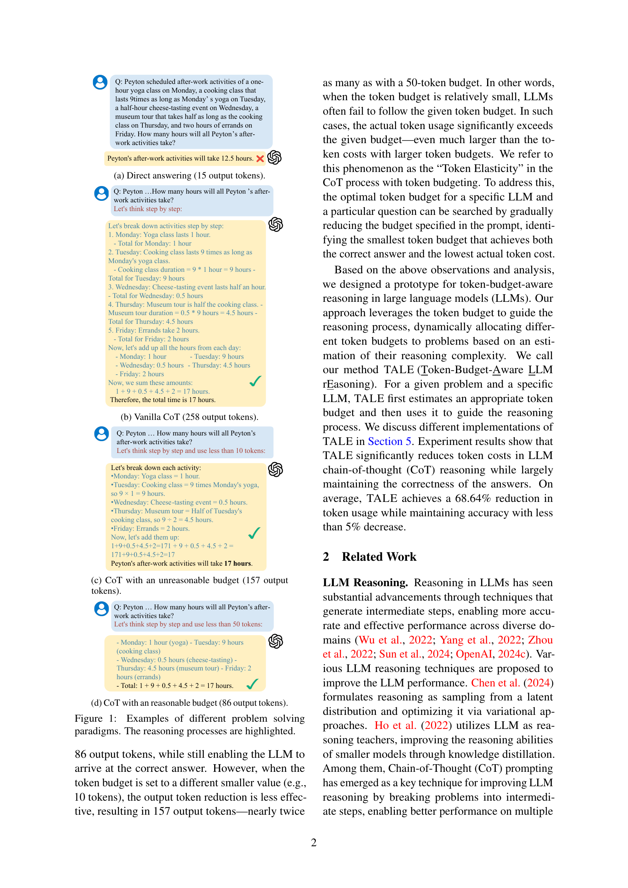
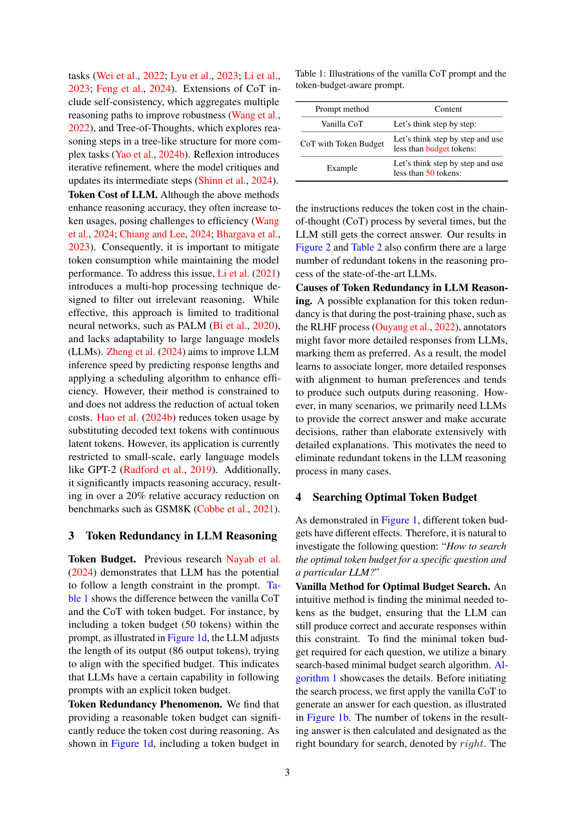
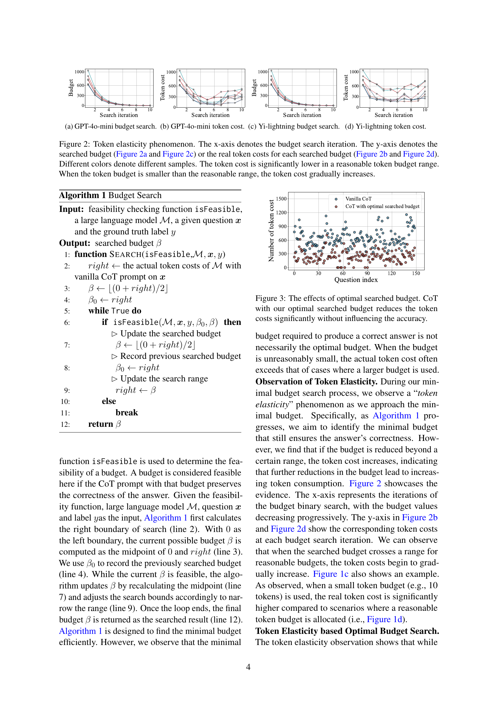
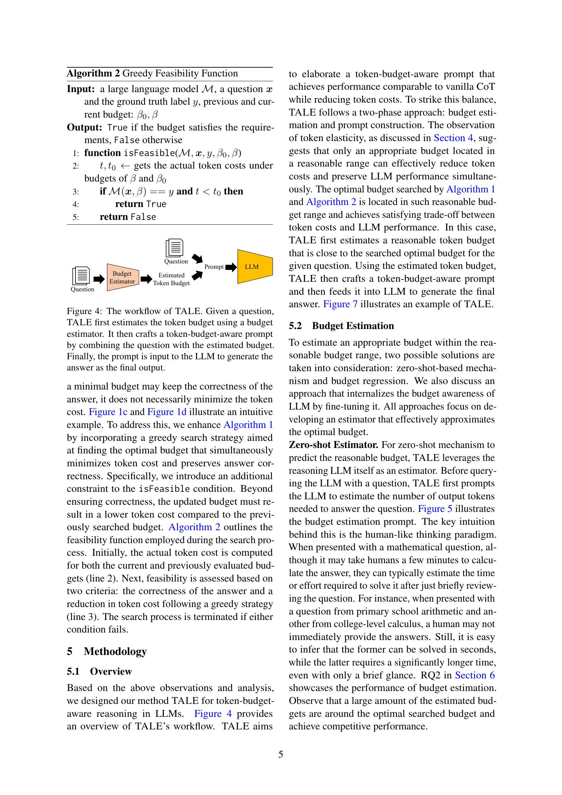
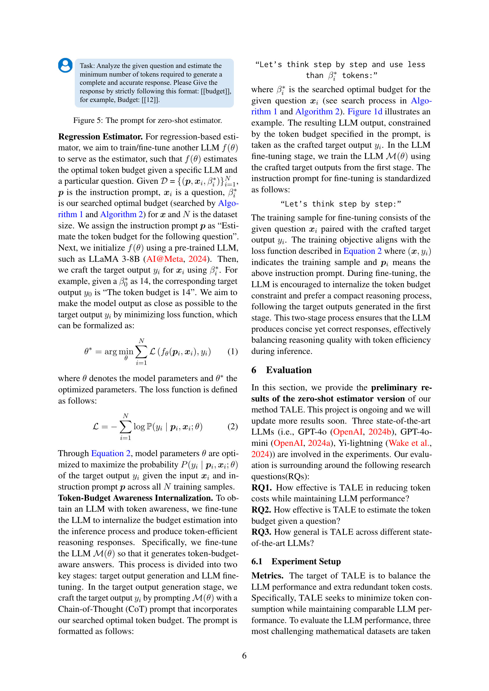
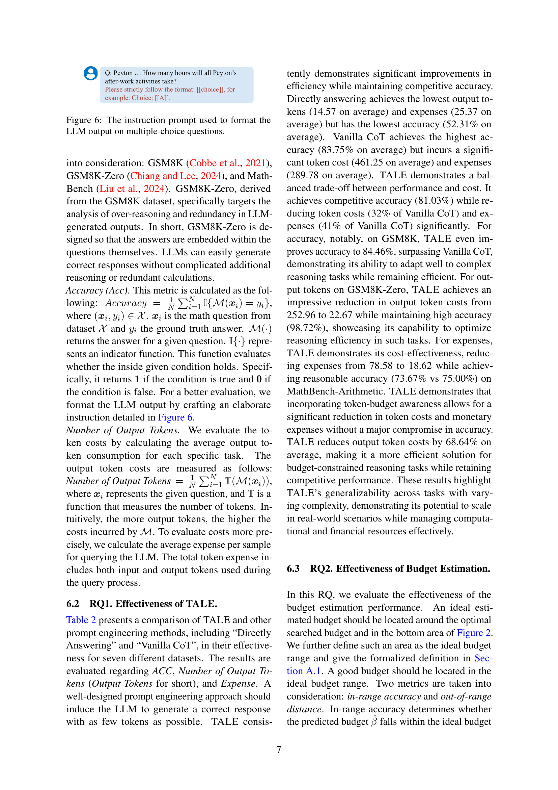
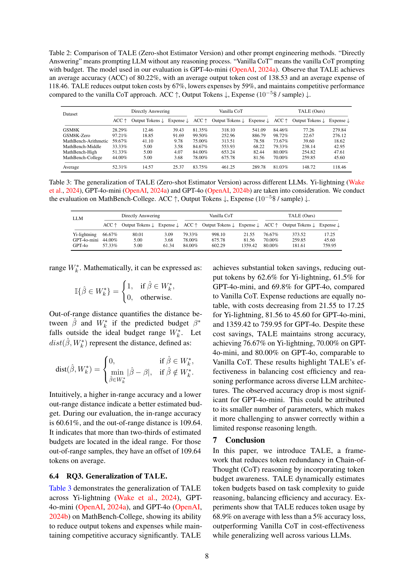
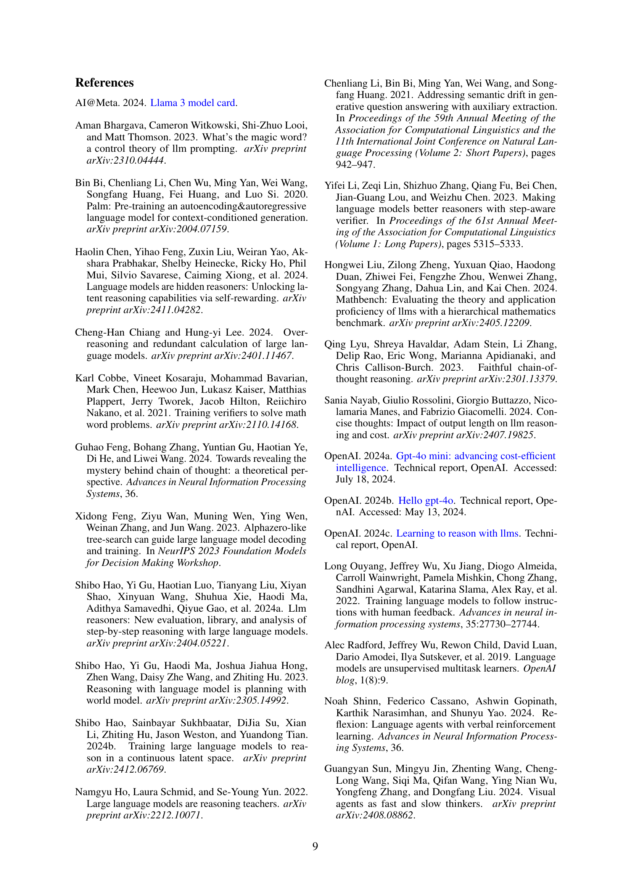
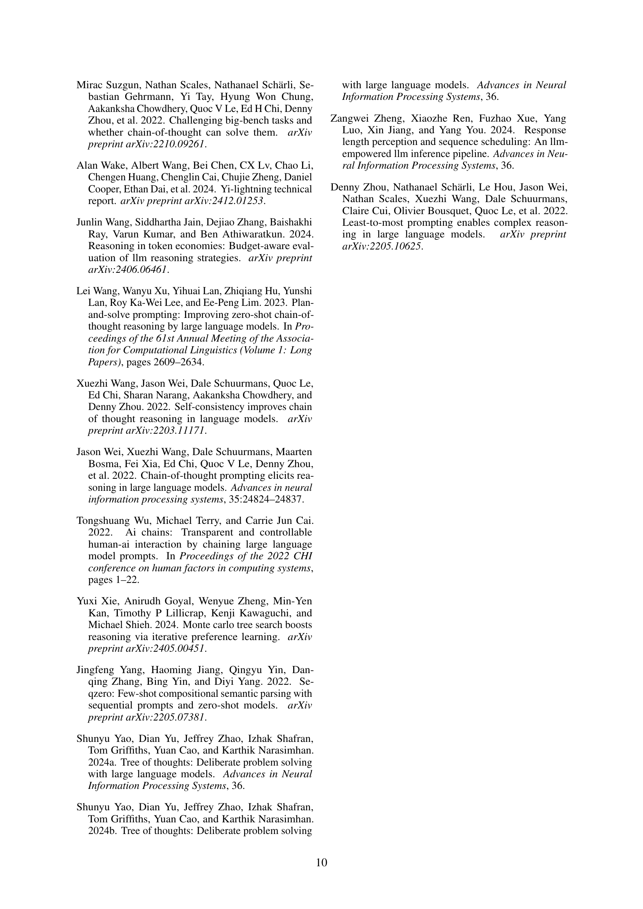
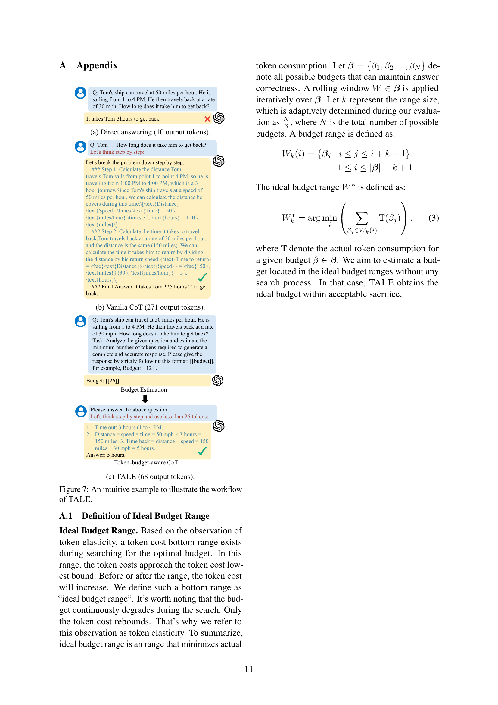
