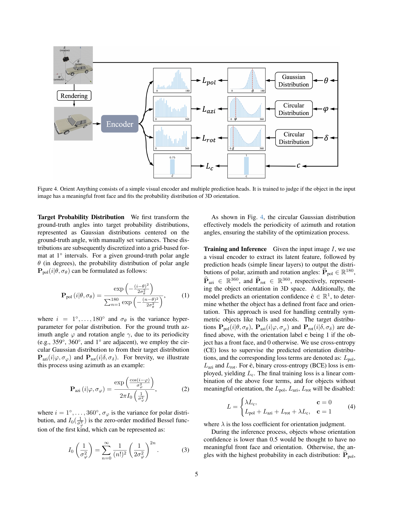

 


 2412.18605 
 Zehan Wang et el. 
 
 🤗 2024-12-30 
 



↗ arXiv


↗ Hugging Face


↗ Papers with Code


### TL;DR



기존의 컴퓨터 비전 모델은 단일 이미지에서 객체의 방향을 정확하게 파악하는 데 어려움을 겪었습니다. 특히, **실제 이미지 데이터의 부족**은 정확한 객체 방향 추정 모델을 개발하는 데 큰 걸림돌이었습니다.  이러한 문제를 해결하기 위해, 기존 연구는 3D 모델을 활용한 합성 데이터를 사용하는 방안을 제시했지만, **합성 데이터와 실제 이미지 간의 차이**로 인해 실제 이미지에서의 성능이 저조한 한계를 보였습니다. 

본 연구는 **단일 이미지에서 객체의 방향을 추정하는 새로운 모델인 'Orient Anything'을 제시**합니다. 이 모델은 **대규모의 3D 모델 렌더링 데이터를 생성**하고, **각도의 확률 분포를 이용**하여 학습의 안정성과 정확도를 높였습니다. 또한, **합성 데이터와 실제 데이터 간의 차이를 최소화하기 위한 다양한 기술**을 적용하여 실제 이미지에서도 우수한 성능을 보였습니다.  **합성 데이터를 실제 이미지와 유사하게 만드는 데이터 증강 기법과 사전 훈련된 모델을 활용**하여 실제 이미지에서도 높은 정확도를 달성했습니다.



#### Key Takeaways


 단일 이미지에서 객체 방향을 정확하게 추정하는 새로운 모델 'Orient Anything' 개발 



 3D 모델 렌더링을 통해 대규모 합성 데이터셋을 구축하고, 이를 통해 실제 이미지에서의 성능 향상 



 합성 데이터와 실제 데이터 간의 차이를 줄이기 위한 다양한 전략 제시 (모델 초기화, 데이터 증강 등) 


#### Why does it matter?
**본 논문은 단일 이미지에서 객체 방향을 정확하게 추정하는 데 있어 어려움을 해결하는 새로운 방법을 제시하여,** 3D 객체 인식 및 공간 관계 이해 분야 연구에 중요한 발전을 가져올 수 있습니다. **합성 데이터를 효과적으로 활용하여 실제 이미지의 객체 방향 추정 성능을 높인 점은 특히 주목할 만하며**, 향후 연구 방향에 대한 시사점을 제공합니다. **합성 데이터와 실제 데이터 간의 차이를 줄이는 다양한 기술**을 제시한 것 또한 중요합니다.

------
#### Visual Insights

> 🔼 그림 2는 객체의 방향 이해가 공간적 추론에 필수적임을 보여줍니다.  GPT-40 및 Gemini-1.5-pro와 같은 고급 VLM조차도 기본적인 방향 문제를 해결하지 못한다는 것을 예시로 보여줍니다.  그림은 독수리의 시각에서 캡틴 아메리카가 왼쪽에 있는지 오른쪽에 있는지 질문하는 시나리오를 보여줍니다. 인간은 쉽게 오른쪽이라고 답할 수 있지만, 고급 VLM은 이러한 기본적인 공간적 관계를 이해하는 데 어려움을 겪습니다.
> 

> 
read the caption

> Figure 1: Understanding object orientation is essential for spatial reasoning. However, even advanced VLMs like GPT-4o and Gem- ini-1.5-pro are not yet able to resolve the basic orientation issue.
> 


| Object | Direction | Spatial Part | Spatial Relation | Overall |
|---|---|---|---|---|
| Random | 12.93 | 22.12 | 17.54 | 16.75 |
| GPT-4o | 49.32 | 15.38 | 27.27 | 32.50 |
| Gemini-1.5-pro | 58.90 | 15.38 | 18.18 | 33.00 |
| Orient Anything+LLM | 67.12 | 46.15 | 40.91 | 51.50 |

> 🔼 Ori-Bench는 논문에서 제안된 객체 방향 이해 능력 평가를 위한 새로운 벤치마크입니다. 이 표는 Ori-Bench에 대한 정량적 결과를 보여줍니다.  세 가지 유형의 작업(객체 방향 인식, 공간 부분 추론, 공간 관계 추론)에 대한 GPT-40, Gemini-1.5-pro, 그리고 제안된 Orient Anything + LLM 모델의 정확도를 비교 분석합니다.  이는 2D VLMs의 객체 방향 이해 능력을 평가하고 Orient Anything 모델의 성능을 보여주는 데 중요한 역할을 합니다.
> 

> 
read the caption

> Table 1: Quantitative results on the proposed Ori-Bench.
> 

### In-depth insights

#### 3D-Based Orientation
3D 기반 객체 방향 추정은 **단일 이미지에서 3D 객체의 방향을 정확하게 예측**하는 데 중점을 둡니다. 이는 2D 이미지만으로는 불가능한 **깊이 정보와 3차원 공간 정보**를 활용하여 더욱 정확한 방향 추정을 가능하게 합니다.  **합성 데이터를 이용한 학습**은 실제 데이터의 부족 문제를 해결하며, **다양한 각도의 렌더링 이미지**를 통해 모델의 일반화 성능을 향상시키는 데 중요한 역할을 합니다.  **3D 모델의 형태 정보**는 방향 추정에 유용한 추가적인 단서를 제공하며, **다양한 객체 유형과 복잡한 배경**에서도 안정적인 성능을 보이는 로버스트한 모델 개발에 필수적입니다.  **합성 데이터와 실제 데이터 간의 차이**를 줄이기 위한 데이터 증강 기법 또한 중요한 고려 사항입니다.

#### Synthetic Data Gen
합성 데이터 생성(Synthetic Data Gen) 부분은 논문에서 **3D 모델 렌더링을 통해 대량의 객체 방향(orientation) 데이터를 생성하는 과정**을 의미합니다.  실제 데이터 수집의 어려움을 극복하기 위해 **가상 환경에서 다양한 각도와 조건으로 이미지를 생성**하여, 부족한 실제 데이터를 보완하는 전략입니다.  **정확한 방향 주석(annotation)을 포함하는 2M개 이상의 이미지**를 확보함으로써, 모델 학습에 필요한 양질의 데이터를 확보하는 데 기여합니다.  이 과정은 단순히 이미지를 생성하는 것뿐 아니라, **객체의 전면을 자동으로 식별하고, 3D 모델의 방향을 정확하게 표현하는 알고리즘**을 포함합니다.  이는 **합성 데이터의 현실성과 정확성을 높이는 중요한 요소**이며, **실제 이미지와의 차이(domain gap)를 줄이기 위한 다양한 데이터 증강 기법**과의 조합을 통해 모델 성능 향상에 기여할 것으로 예상됩니다.  결과적으로 합성 데이터 생성은 본 연구의 핵심적인 부분으로, **모델의 일반화 성능과 정확도를 크게 향상**시키는 데 중요한 역할을 합니다.

#### Prob. Dist. Fitting
논문에서 "확률 분포 적합 (Prob. Dist. Fitting)"이라는 제목의 내용은 **오류를 줄이고 강건성을 높이기 위한 핵심 전략**으로 제시되었습니다. 단순히 각도 값을 직접 회귀하는 대신, 각도를 **확률 분포로 모델링**하여 인접 각도 간의 상관관계를 더 잘 포착하고자 하였습니다. 특히 주요 각도(polar, azimuth, rotation) 각각에 대해 **가우시안 분포 또는 순환 가우시안 분포**를 적용하여, 각도 값의 불확실성과 주기성을 고려한 방식을 제시했습니다. 이를 통해 학습 과정을 간소화하고, 합성 데이터와 실제 데이터 간의 차이를 줄이는데 기여할 것으로 예상됩니다. **3차원 방향의 표현 방식을 혁신적으로 개선**한 부분으로 볼 수 있으며, 이는 모델의 전반적인 성능 향상에 중요한 역할을 수행했을 것으로 판단됩니다.

#### Zero-Shot Transfer
본 논문에서 제시된 제로샷 전이(Zero-Shot Transfer)는 **합성 데이터(rendered images)를 이용해 훈련된 모델이 실제 이미지(real images)에 대해서도 높은 정확도를 보이는 능력**을 의미합니다. 이는 단순히 새로운 데이터로 재훈련 없이도 성능을 유지한다는 것을 넘어, **모델이 학습 데이터의 분포(domain)를 넘어 일반화(generalization)**하는 능력을 보여줍니다.  **합성 데이터 생성 파이프라인의 효율성과 정확성, 그리고 3D 모델 기반의 풍부한 데이터**가 이러한 성능 향상의 주요 원인으로 작용합니다.  하지만, **합성 데이터와 실제 데이터 간의 차이(domain gap)**를 완전히 해소하지 못했기에,  **데이터 증강 기법(data augmentation)**과 **실제 이미지 사전 학습된 인코더 활용** 등의 추가적인 전략이 필요했습니다.  결과적으로, 본 연구는 제로샷 전이를 가능하게 하는 핵심 요소와 한계를 동시에 보여주는 사례이며,  **합성 데이터 활용의 장점과 실제 데이터 적용의 어려움**을 보여주는 중요한 연구입니다.  미래 연구는 이러한 한계점을 극복하고, 제로샷 전이 성능을 더욱 향상시키는 데 집중할 것으로 예상됩니다.

#### Spatial Reasoning
본 논문에서 다루는 공간 추론(Spatial Reasoning)은 이미지 내 물체의 방향 및 상호 공간적 관계를 이해하는 능력을 의미합니다. **단일 이미지에서 물체의 방향을 정확하게 추정하는 것은 어려운 과제**이며, 기존의 컴퓨터 비전 모델들은 이를 제대로 해결하지 못했습니다. 이 논문에서는 **3D 모델 렌더링을 통해 방대한 양의 합성 데이터를 생성**하고, 이를 바탕으로 강건한 물체 방향 추정 모델을 학습시키는 새로운 방법을 제시합니다. **합성 데이터와 실제 이미지 간의 차이를 줄이기 위한 다양한 전략**들도 사용되었습니다.  **방향을 확률 분포로 모델링**하여 학습 과정을 안정화시키고, 모델의 강건성을 높였습니다.  결과적으로, 제안된 모델은 다양한 실제 이미지에서 우수한 성능을 보였으며, 공간 추론 관련 질문에 대한 응답 능력도 크게 향상되었습니다.  **특히 제로샷(Zero-shot) 성능이 뛰어나** 다양한 환경에 적용 가능성이 높습니다.

### More visual insights

More on figures

> 🔼 그림 2는 3D 객체의 방향 데이터 수집 파이프라인을 보여줍니다. 이 파이프라인은 세 가지 단계로 구성됩니다. 1단계는 기본 3D 모델 필터링으로, 기울어진 3D 객체를 제거합니다. 2단계는 방향 주석 추가 단계로, 고급 2D VLM을 사용하여 여러 직교 관점에서 객체의 정면을 식별하고, 시각적 대칭성을 활용하여 후보를 좁힙니다. 3단계는 자유 시점 렌더링으로, 무작위 및 자유로운 시점에서 이미지를 렌더링하고, 카메라의 방위각(φ), 고도각(θ), 회전각(δ)로 객체의 방향을 나타냅니다.
> 

> 
read the caption

> Figure 2: The orientation data collection pipeline is composed of three steps: 1) Canonical 3D Model Filtering: This step removes any 3D objects in tilted poses. 2) Orientation Annotating: An advanced 2D VLM is used to identify the front face from multiple orthogonal perspectives, with view symmetry employed to narrow the potential choices. 3) Free-view Rendering: Rendering images from random and free viewpoints, and the object orientation is represented by the polar θ𝜃\thetaitalic_θ, azimuthal φ𝜑\varphiitalic_φ and rotation angle δ𝛿\deltaitalic_δ of the camera.
> 

> 🔼 그림 4는 Orient Anything 모델의 아키텍처를 보여줍니다. 이 모델은 간단한 시각적 인코더와 여러 예측 헤드로 구성됩니다. 입력 이미지의 객체가 의미있는 정면을 가지고 있는지 판단하고, 3D 방향의 확률 분포에 맞추도록 학습됩니다.  인코더는 이미지의 특징을 추출하고, 각 예측 헤드는  극좌표(polar), 방위각(azimuth), 회전각(rotation) 세 가지 각도의 확률 분포를 예측합니다. 이러한 확률 분포는 가우시안 분포 또는 원형 가우시안 분포를 사용하여 모델링되어 각도의 주기성을 고려합니다.  모델은 또한 객체가 의미있는 정면을 가지고 있는지 여부를 나타내는 신뢰도 점수를 출력합니다. 이는 대칭적인 객체(예: 공)에 대한 처리를 개선하는 데 도움이 됩니다.
> 

> 
read the caption

> Figure 3: Orient Anything consists of a simple visual encoder and multiple prediction heads. It is trained to judge if the object in the input image has a meaningful front face and fits the probability distribution of 3D orientation.
> 

> 🔼 그림 4는 세 가지 초매개변수(σθ, σφ, σδ)에 대한 ablation 연구 결과를 보여줍니다. 각 초매개변수는 각도의 확률 분포를 정의하는 데 사용되며, 이 연구는 각 초매개변수 값을 변경했을 때 모델 성능에 미치는 영향을 조사합니다. x축은 초매개변수 값을 나타내고, y축은 특정 지표(예: 정확도)를 나타냅니다. 이 그림을 통해 연구자들은 모델 성능에 가장 적합한 초매개변수 값을 찾을 수 있습니다.  각 그래프는 특정 각도(polar, azimuth, rotation)에 대한 정확도를 보여주며, 최적의 성능을 달성하는 초매개변수 값의 범위를 시각적으로 보여줍니다.
> 

> 
read the caption

> Figure 4: Ablation study for hyper-parameter σθsubscript𝜎𝜃\sigma_{\theta}italic_σ start_POSTSUBSCRIPT italic_θ end_POSTSUBSCRIPT, σφsubscript𝜎𝜑\sigma_{\varphi}italic_σ start_POSTSUBSCRIPT italic_φ end_POSTSUBSCRIPT and σδsubscript𝜎𝛿\sigma_{\delta}italic_σ start_POSTSUBSCRIPT italic_δ end_POSTSUBSCRIPT.
> 

> 🔼 그림 5는 텍스트 프롬프트를 사용하여 생성된 이미지들을 보여줍니다. 왼쪽 두 이미지는 DALL-E 3 [5]에서, 오른쪽 두 이미지는 FLUX [21]에서 생성되었습니다. 정확한 방향 추정은 생성된 콘텐츠가 주어진 방향 또는 관점 조건을 따르는지 확인하는 데 도움이 됩니다.  이 그림은 DALL-E 3과 FLUX 두 모델이 생성한 이미지들이 주어진 텍스트 프롬프트에 따라 얼마나 정확하게 방향과 원근감을 표현했는지 시각적으로 비교 분석하는 데 사용됩니다. 예를 들어,  프롬프트가 '왼쪽으로 30도 기울어진 차' 라면 생성된 이미지의 차가 실제로 왼쪽으로 30도 기울어져 있는지 확인할 수 있습니다. 이는 이미지 생성 모델의 정확성과 신뢰성을 평가하는 데 중요한 지표가 됩니다.
> 

> 
read the caption

> Figure 5: Generated images with given textual prompt (left two from DALL-E 3 [5], right two from FLUX [21]). Accurate orientation estimation is helpful to confirm whether generated contents follow the given orientation or perspective condition.
> 

> 🔼 그림 6은 논문의 실험 결과 중 COCO 데이터셋에 대한 정성적 결과를 보여줍니다.  COCO 데이터셋의 다양한 이미지들에서 객체의 방향을 추정하는 Orient Anything 모델과 기존 방법인 Cube RCNN의 성능을 시각적으로 비교하여 보여줍니다. 각 이미지마다 실제 객체의 방향(Ground Truth), Cube RCNN의 예측 결과, 그리고 Orient Anything 모델의 예측 결과가 함께 제시되어, 모델의 정확도와 한계를 직관적으로 파악할 수 있도록 합니다. 특히, 다양한 종류의 객체들과 복잡한 배경 환경에서의 성능을 비교하여 모델의 일반화 능력을 평가합니다.
> 

> 
read the caption

> Figure 6: Qualitative results on COCO
> 

> 🔼 그림 7은 SUN RGB-D 데이터셋에 대한 정성적 결과를 보여줍니다.  Cube RCNN과 Orient Anything 모델이 예측한 물체의 방향(빨간색 축)을 실제 정답과 비교하여 보여주는 여러 이미지들이 제시되어 있습니다.  각 이미지는 모델의 예측 성능을 시각적으로 평가할 수 있도록 실제 물체의 방향과 모델이 예측한 방향을 함께 표시합니다. 이를 통해 두 모델의 장단점과 성능 차이를 직관적으로 이해할 수 있습니다.
> 

> 
read the caption

> Figure 7: Qualitative results on SUN RGB-D.
> 

> 🔼 그림 8은 KITTI와 nuScenes 데이터셋에 대한 정성적 결과를 보여줍니다.  Cube R-CNN과 Orient Anything 모델의 객체 방향 예측 결과를 기준 진실(Ground Truth)과 비교하여 시각적으로 제시합니다. 각 이미지는 세 가지 결과(기준 진실, Cube R-CNN, Orient Anything)를 상단부터 차례대로 보여주며, 빨간색, 녹색, 파란색 축은 각각 객체의 방향을 나타냅니다. 이를 통해 두 모델의 성능을 시각적으로 비교하고, Orient Anything 모델의 우수성을 보여줍니다. 특히 다양한 시점과 조명 조건에서도 Orient Anything 모델이 더 정확한 방향 예측을 수행하는 것을 확인할 수 있습니다.
> 

> 
read the caption

> Figure 8: Qualitative results on KITTI and nuScenes.
> 

> 🔼 그림 9는 Objectron 데이터셋에 대한 정성적 결과를 보여줍니다.  Cube RCNN과 Orient Anything 모델의 예측 결과와 실제 정답(Ground Truth)을 비교하여,  각 모델의 객체 방향 예측 성능을 시각적으로 보여줍니다.  다양한 물체들에 대한 예측 결과를 통해 각 모델의 강점과 약점을 파악할 수 있습니다.  특히 Orient Anything 모델이 더욱 정확하게 객체 방향을 예측하는 것을 확인할 수 있습니다.
> 

> 
read the caption

> Figure 9: Qualitative results on Objectron.
> 

More on tables


| Object | Direction |
|---|---|
> 🔼 표 2는 합성 이미지와 실제 이미지에 대한 방향 추정 결과를 보여줍니다.  '합성 이미지'는 논문에서 제시된 3D 모델 렌더링 과정을 통해 생성된 이미지이며,  '실제 이미지'는 실제 세계에서 촬영된 이미지입니다. 표는 각각의 이미지 유형에 대해, 모델의 성능을 평가하는 다양한 지표를 제시합니다.  이 지표들은 객체의 방향 판단 정확도(Judgment), 방위각(Azimuth), 고도각(Polar), 회전각(Rotation) 추정의 정확도와 절대 오차를 포함합니다.  가장 좋은 결과는 굵게 표시되어 있습니다.  이 표는 제시된 모델의 합성 데이터에서의 성능뿐 아니라 실제 데이터에 대한 일반화 능력도 보여줍니다.
> 

> 
read the caption

> Table 2: Orientation estimation on both in-domain rendered images and out-of-domain real images. The best results are bold.
> 


| Spatial | Part |
|---|---|
> 🔼 표 3은 논문에서 제시된 Orient Anything 모델의 영상 기반 객체 방향 추정 성능을 다섯 가지 실제 이미지 벤치마크(SUN RGB-D, KITTI, nuScenes, Objectron, ARKitScenes)에서 평가한 결과를 보여줍니다.  각 벤치마크에 대해, 모델이 예측한 방향(방위각, 고도각, 회전각)과 실제 방향 간의 절대 오차(도 단위)를 계산하여 성능을 평가했습니다. 이 표는 Orient Anything 모델이 사전에 학습되지 않은 실제 이미지 데이터에서도 우수한 제로샷 성능을 보임을 보여주는 중요한 결과를 담고 있습니다.
> 

> 
read the caption

> Table 3: Zero-shot orientation estimation on five unseen real image benchmarks. Reported in absolute error.
> 


| Spatial | Relation |
|---|---|
> 🔼 표 4는 객체 방향 주석에 대한 ablation study 결과를 보여줍니다.  단일 뷰, 정규 뷰, 그리고 대칭성 정보를 활용한 세 가지 방식의 객체 방향 주석 방법에 대한 정확도를 비교 분석하여 어떤 방법이 가장 효과적인지 보여줍니다.  대칭성 정보 활용이 정확도 향상에 크게 기여함을 보여주는 결과입니다.
> 

> 
read the caption

> Table 4: Ablation study for Orientation Annotation.
> 


| Models | Rendered Image |  |  |  |  |  | Real Image |  | 
|---|---|---|---|---|---|---|---|---|---|
|  | Judgment | Azimuth Estimation |  | Polar Estimation |  | Rotation Estimation | Judgment | Recognition | 
|---|---|---|---|---|---|---|---|---|---|
|  | Acc↑ | Abs↓ | Acc@22.5°↑ | Abs↓ | Acc@5°↑ | Abs↓ | Acc↑ | Acc↑ | 
|---|---|---|---|---|---|---|---|---|---|
| Random | 50.00 | - | 12.50 | - | 5.55 | - | 16.67 | 50.00 | 12.50 |
| Cube RCNN | - | 89.00 | 12.44 | 27.99 | 10.37 | 132.74 | 2.50 | - | 20.25 |
| Gemini-1.5-pro | 57.29 | 79.51 | 19.06 | 20.10 | 16.31 | 2.61 | 85.12 | 66.96 | 31.95 |
| GPT-4o | 61.85 | 81.07 | 19.94 | 16.02 | 17.56 | 4.65 | 81.00 | 69.29 | 45.78 |
| Ours (ViT-S) | 73.88 | 45.27 | 63.18 | 5.12 | 71.62 | 0.82 | 97.06 | 78.54 | 63.44 |
| Ours (ViT-B) | 74.88 | 39.03 | 71.94 | 3.81 | 81.37 | **0.26** | **99.56** | **81.25** | 70.19 |
| Ours (ViT-L) | **76.00** | **38.60** | **73.94** | **2.94** | **86.75** | 0.70 | 98.31 | 80.30 | **72.44** |
> 🔼 표 5는 학습 목표, 뷰의 수, 초기화 학습 및 데이터 증강에 대한 ablation study 결과를 보여줍니다.  각 요소가 모델 성능에 미치는 영향을 정량적으로 분석하여 최적의 설정을 찾는 데 도움이 됩니다.  구체적으로, 연속값 회귀, 이산 각도 분류, 확률 분포 적합 세 가지 학습 방식의 성능을 비교하고, 렌더링된 이미지의 개수, 사전 훈련된 모델, 데이터 증강 기법(이미지 자르기, 마스크를 사용한 객체 분리)의 효과를 분석합니다.
> 

> 
read the caption

> Table 5: Ablation study for Learning Objective, Number of Views, Training Initialization and Data Augmentation.
> 


|       | SUN RGB-D       |       |       | KITTI          |       |       | nuScenes        |       |       | Objectron      |       |       | ARKitScenes     |       |       |
| :---- | :--------------- | :---- | :---- | :--------------- | :---- | :---- | :--------------- | :---- | :---- | :--------------- | :---- | :---- | :--------------- | :---- | :---- |
|       | Azimuth          | Polar | Rotation | Azimuth          | Polar | Rotation | Azimuth          | Polar | Rotation | Azimuth          | Polar | Rotation | Azimuth          | Polar | Rotation |
| Cube RCNN | 93.58            | 39.73 | 140.10 | 98.61            | 39.73 | 121.21 | 89.63            | 15.64 | 132.57 | 122.99            | 60.01 | 113.31 | 91.16            | 37.39 | 132.86 |
| Ours (ViT-S) | 58.20            | 11.63 | 3.59  | 65.85            | 5.00  | 1.08  | 72.68            | 5.58  | 2.16  | 39.45            | 23.47 | 18.26 | 69.37            | 14.25 | 2.63  |
| Ours (ViT-B) | 56.34            | 9.15  | 3.75  | 54.02            | 5.86  | 0.21  | 66.56            | 5.72  | 1.28  | 36.49            | 22.13 | 18.34 | 75.45            | 12.48 | 2.60  |
| Ours (ViT-L) | 42.98            | 8.38  | 3.66  | 44.22            | 3.57  | 0.89  | 55.17            | 4.08  | 1.78  | 30.09            | 22.19 | 18.54 | 67.56            | 11.47 | 2.82  |
> 🔼 표 6은 전면부와 방향이 주석 처리된 COCO 데이터셋의 각 객체 범주에 대한 상세한 수평 방향 인식 정확도를 보여줍니다. Orient Anything의 성능과 다른 방법들의 최고 성능 간의 차이도 함께 제시합니다.  표는 각 객체 범주별로 Cube RCNN, Gemini, GPT-40 및 Orient Anything(ViT-L) 모델의 정확도를 비교하여 보여줍니다.  각 모델의 성능 차이를 백분율로 표시하여, Orient Anything 모델의 우수성을 더욱 명확하게 나타냅니다.
> 

> 
read the caption

> Table 6: Detailed horizontal direction recognition accuracy for each object category in COCO that is annotated with front face and orientation. The differences between Orient Anything and the best results achieved by other alternative methods are also provided.
> 

### Full paper



