 


 2412.18609 
 Jinhui Yi et el. 
 
 🤗 2024-12-26 
 



↗ arXiv


↗ Hugging Face


↗ Papers with Code


### TL;DR



최근 비디오-언어 모델들은 **무거운 인코더 (300M-1.4B 매개변수)**에 의존하여 계산 비용이 높고 처리 속도가 느리다는 문제점이 있습니다. 또한 기존 모델들은 **비디오의 시공간적 관계**를 효과적으로 모델링하지 못하는 경우가 많습니다.  이러한 문제를 해결하기 위해, 본 연구는 새로운 모델을 제시합니다.

본 논문에서는 **인코더 없는 새로운 모델인 Video-Panda**를 제시합니다.  Video-Panda는 **Spatio-Temporal Alignment Block (STAB)**을 도입하여 사전 훈련된 인코더 없이 비디오를 직접 처리합니다.  STAB은 **시공간적 정보를 효율적으로 처리**하도록 설계되어, **매개변수 수를 획기적으로 줄이고 (기존 대비 6.5배 이상 감소)**, **처리 속도를 크게 향상**시킵니다.  실험 결과, Video-Panda는 여러 비디오 질의응답 벤치마크에서 **기존의 인코더 기반 모델들과 비교하여 경쟁력 있는 성능**을 보였습니다.  특히 세분화된 평가 지표에서 **우수한 성능**을 보이며, 모델의 효율성과 효과성을 입증하였습니다.



#### Key Takeaways


 매개변수 효율적인 (45M) 인코더 없는 비디오-언어 모델 제시 



 기존 인코더 기반 모델 대비 6.5배 이상의 매개변수 감소 및 3~4배 빠른 처리 속도 달성 



 개방형 비디오 질의응답 및 세분화된 비디오 질의응답 과제에서 경쟁력 있는 성능 입증 


#### Why does it matter?
본 논문은 **매개변수 효율적인 비디오-언어 모델**을 제시하여 기존의 무거운 인코더 기반 모델의 한계를 극복합니다.  이는 **계산 비용을 크게 줄이면서 경쟁력 있는 성능**을 달성하여, 비디오 이해 분야의 연구에 **새로운 가능성**을 제시합니다. 특히 **효율적인 모델 설계** 및 **빠른 처리 속도**는 실제 응용 분야에 큰 영향을 미칠 수 있으며, **추가 연구**를 위한 새로운 방향을 제시합니다.

------
#### Visual Insights

> 🔼 그림 1은 MSVD-QA 데이터셋에서 비주얼 성분의 모델 크기와 성능 간의 관계를 로그 스케일로 나타낸 것입니다. 버블의 크기는 미세 조정 데이터의 양(단위: 1,000)을 나타냅니다. 10만 개의 샘플을 사용한 동일한 학습 데이터셋을 사용한 모델은 진한 녹색으로 표시되고, 다른 데이터셋을 사용한 모델은 파란색으로 표시됩니다.  이 그래프는 모델의 크기가 클수록 성능이 향상되는 경향을 보여주지만, 데이터셋의 차이도 성능에 영향을 미침을 시사합니다. 특히, 같은 데이터셋을 사용했을 때의 성능 차이가 더 뚜렷하게 나타납니다.
> 

> 
read the caption

> Figure 1: Model performance on MSVD-QA versus the model size of the visual component in logarithmic scale. The bubble size indicates the amount of finetuning data (in thousands). Models using the same training dataset as ours (100K samples) are shown in dark green, while those using different datasets are in blue.
> 


|   | Model | Vision Size | Modality | Pretrain | Finetune | MSVD-QA | MSVD-QA | MSRVTT-QA | MSRVTT-QA | TGIF-QA* | TGIF-QA* | Activity Net-QA | Activity Net-QA |
|---|---|---|---|---|---|---|---|---|---|---|---|---|---|---|
| **Different Datasets** | LLaMA Adapter [43] | 404.3M | I | 567K | 52K | 54.9 | 3.1 | 43.8 | 2.7 | - | - | 34.2 | 2.7 |
|  | VideoChat [18] | 1.2B | V | 25M | 18K | 56.3 | 2.8 | 45.0 | 2.5 | 21.3 | 1.9 | 26.5 | 2.2 |
|  | Video-LLaMA [42] | 1.1B | V | 3.1M | 164K | 51.6 | 2.5 | 29.6 | 1.8 | - | - | 12.4 | 1.1 |
|  | ChatUniVi [15] | 307M | V+I | 1.6M | 649K | 65.0 | 3.6 | 54.6 | 3.1 | 38.2 | 3.0 | 45.8 | 3.2 |
|  | LLaMA-VID [21] | 1B | V+I | 790K | 763K | 69.7 | 3.7 | 57.7 | 3.2 | - | - | 47.4 | 3.3 |
|  | Video-LLaVA [22] | 425M | V+I | 1.26M | 765K | 70.7 | 3.9 | 59.2 | 3.5 | 47.0 | 3.3 | 45.3 | 3.3 |
|  | VideoChat2 [20] | 496M | V+I | 37M | 2M | 70.0 | 3.9 | 54.1 | 3.3 | - | - | 49.1 | 3.3 |
| **Same Dataset** | Video-ChatGPT [26] | 307M | V | - | 100K | 64.9 | 3.3 | 49.3 | 2.8 | 40.7 | 3.1 | 35.2 | 2.8 |
|  | Video-LLaVA [22] | 425M | V | 702K | 100K | 64.8 | - | 58.3 | - | 41.7 | - | 40.7 | - |
|  | EVE* | 30M | V | 702K | 100K | 60.5 | 3.3 | 49.7 | 3.0 | 39.2 | 2.9 | 38.1 | 3.0 |
|  | Video-Panda (ours) | 45M | V | 702K | 100K | 64.7 | 3.8 | 54.8 | 3.4 | 42.9 | 3.2 | 40.0 | 3.3 |

> 🔼 표 1은 7B 매개변수를 가진 LLMs를 사용하는 비디오-언어 모델들과 제안된 비디오 판다 모델의 오픈 엔드 비디오 질문 응답 성능을 비교한 표입니다.  Vision Size 열은 비전 인코더와 정렬 모듈의 매개변수 수를 나타내고, Modality 열은 학습 데이터로 비디오와 이미지 중 무엇을 사용했는지 나타냅니다. TGIF-QA*의 경우 GPT-3.5의 버전 변화에 따른 성능 변화를 반영하여 결과를 재평가했습니다. EVE*는 이미지 전용 모델인 EVE를 비디오 데이터에 적용한 확장 모델입니다.  표는 각 모델의 정확도와 점수를 제시하여 비디오 판다 모델의 성능을 다른 모델들과 비교 분석하는 데 사용됩니다.
> 

> 
read the caption

> Table 1: Comparison with other video-language models that use LLMs with 7B parameters on open-ended video question answering. Vision Size refers to #parameters of vision encoder and alignment modules. Modality indicates whether videos and/or images are used as training data. For TGIF-QA*, we re-evaluated the results since the performance depends on the current version of GPT-3.5 which changes over time and highly impacts the evaluation. EVE* is our extension of EVE [11] to video data.
> 

### In-depth insights

#### Encoder-Free Video-LM
**인코더 없는 비디오-언어 모델(Encoder-Free Video-LM)**은 기존의 무거운 비디오 인코더에 의존하지 않고 비디오 데이터를 직접 처리하여 비디오-언어 이해를 위한 효율적이고 매개변수 효율적인 접근 방식을 제시합니다. 이는 **계산 비용을 크게 줄이고 처리 속도를 높이는 데 중요한 역할**을 합니다.  기존 방식은 대용량 사전 훈련된 인코더에 의존하여 계산 비용이 많이 들고 처리 속도가 느렸습니다. 반면 **인코더 없는 모델은 매개변수 수를 대폭 줄이면서 경쟁력 있는 성능**을 달성합니다.  **공간-시간 정렬 블록(STAB)**과 같은 새로운 아키텍처를 통해 비디오의 공간 및 시간적 관계를 효과적으로 모델링하여 성능 저하 없이 효율성을 높일 수 있습니다.  하지만 인코더 없는 모델은 아직 초기 단계이며, **성능 면에서 인코더 기반 모델을 완전히 능가하지는 못할 수 있습니다**.  미래 연구는 인코더 없는 모델의 성능을 더욱 향상시키고 다양한 비디오-언어 작업에 적용하는 데 초점을 맞출 것으로 예상됩니다.  또한,  **데이터 효율성 및 일반화 성능**을 개선하기 위한 연구도 활발하게 진행될 것입니다.

#### STAB Architecture
본 논문에서 제시된 STAB (Spatio-Temporal Alignment Block) 아키텍처는 **비효율적인 기존의 인코더 기반 방식을 탈피하여** 비디오-언어 모델링에 새로운 접근 방식을 제시합니다.  핵심은 **전이 학습된 비디오 인코더 없이도** 비디오 입력을 직접 처리하여 계산 비용을 크게 줄이는 동시에 경쟁력 있는 성능을 달성하는 데 있습니다. STAB은 **국소 공간-시간 인코딩 (LSTE)**을 통해 세밀한 특징을 추출하고, **학습된 어텐션 메커니즘을 통한 효율적인 공간 다운샘플링**을 수행합니다. 또한 **프레임 단위 및 비디오 단위 관계 모델링**을 위한 별도의 메커니즘을 통해 다양한 수준의 시간적 정보를 포착합니다.  **전체 비디오의 공간-시간 관계를 모델링하는 GSTRA와 각 프레임 내의 공간 관계를 모델링하는 FSRA**를 결합하여 효과적인 비디오 이해를 구현합니다.  이러한 설계를 통해 STAB은 매개변수를 대폭 줄이면서도 기존의 인코더 기반 방식과 비교하여 동등하거나 우수한 성능을 달성하며, **처리 속도 또한 3~4배 향상**시키는 것을 보여줍니다.

#### Benchmark Results
본 논문의 벤치마크 결과는 제안된 모델의 성능을 기존 방법들과 비교하여 보여줍니다. **다양한 비디오 질의응답(VideoQA) 벤치마크 데이터셋에서 경쟁력 있는 결과**를 보였으며, 특히 **매개변수 효율성 측면에서 뛰어난 성능**을 입증하였습니다.  **기존의 무거운 인코더 기반 모델들보다 훨씬 적은 매개변수**로 유사하거나 더 나은 성능을 달성하여, **계산 비용을 크게 줄일 수 있음**을 보여줍니다.  하지만, 일부 벤치마크에서는 여전히 최고 성능에는 미치지 못하는 부분이 있으므로, 향후 연구를 통해 개선 여지가 존재합니다.  **정확도와 효율성 사이의 균형**을 잘 맞춘 결과를 제시하며, **새로운 spatio-temporal alignment block의 효과**를 실험적으로 확인했습니다.  **세부적인 지표 분석**을 통해 시간적 이해나 정확성 측면에서 강점을 보이는 등, 제안된 모델의 장단점을 균형 있게 보여주는 결과입니다.

#### Ablation Studies
본 논문의 ablation study는 **모델의 주요 구성 요소들의 기여도를 면밀히 분석**하여 모델 성능에 미치는 영향을 정량적으로 평가하는 데 초점을 맞추고 있습니다.  **공간 및 시간적 요소 처리 모듈 제거 실험**을 통해 각 모듈의 중요성을 확인하고, **다양한 손실 함수 및 teacher 모델 사용 실험**을 통해 최적의 학습 전략을 제시하고 있습니다.  특히, **손실 함수 선택의 중요성**을 강조하며, 특정 손실 함수가 모델 성능 향상에 기여함을 보여주는 결과를 제시합니다.  **다양한 하이퍼파라미터 조합**에 대한 실험 결과는 최적의 모델 구성을 위한 중요한 정보를 제공합니다.  결론적으로, ablation study는 **모델의 설계 및 학습 전략에 대한 심도있는 분석을 제공**,  **개선된 모델 성능 달성에 중요한 역할**을 수행했음을 보여줍니다.

#### Future Work
본 논문의 "미래 연구" 부분에 대한 심층적인 고찰은 **비디오-언어 모델링 분야의 몇 가지 중요한 과제**를 제시합니다.  **효율성 향상**을 위한 탐색은 경량화된 아키텍처, 보다 효과적인 학습 전략, 그리고 전이 학습 기법 등의 연구를 통해 이루어질 수 있을 것입니다.  또한, **다양한 데이터셋**에 대한 적용성을 높이는 연구가 필요하며, 이를 위해 다양한 유형의 영상 데이터를 활용한 학습 및 일반화 성능 향상에 대한 연구가 요구됩니다.  **모델의 해석성 및 신뢰성** 확보를 위한 연구 또한 중요합니다.  특히, 모델의 결정 과정을 이해하고, 편향성 및 오류를 줄이는 방안에 대한 연구가 필요합니다.  **실세계 적용**을 위한 연구 또한 중요한 방향입니다.  **실시간 영상 처리** 및 **대규모 영상 데이터 처리** 기술 개발과 더불어, 다양한 응용 분야(예: 자율 주행, 의료 진단 등)에 대한 적용 가능성을 확인하는 연구가 수행되어야 할 것입니다.

### More visual insights

More on figures

> 🔼 그림 2는 기존 비디오-언어 모델의 구조를 보여줍니다. 왼쪽에서 오른쪽으로, 초기 접근 방식은 이미지와 비디오 입력 모두에 이미지 인코더를 사용합니다. 정렬 모듈은 시각적 모드의 임베딩을 언어 모드와 정렬합니다. Q-Former의 통합은 이러한 정렬을 개선했습니다. 단일 인코더 대신, 이중 인코더 접근 방식은 이미지와 비디오에 대해 별도의 인코더를 사용하며, 여기서 정렬 블록은 투영 계층으로 구성됩니다. 그러나 추가 인코더는 이러한 모델을 매우 무겁게 만들어 정렬 모듈과 인코더가 최소 3억 개, 때로는 10억 개가 넘는 매개변수를 갖게 됩니다. 반면에 본 논문의 인코더 없는 설계(맨 오른쪽)는 새로운 공간-시간 정렬 블록(STAB)을 통해 비디오 입력을 직접 처리합니다. 이는 무거운 사전 훈련된 인코더의 필요성을 없애고 5천만 개 미만의 매개변수만 필요로 합니다.
> 

> 
read the caption

> Figure 2: Existing video-language model architectures: From left to right: Early approaches use image encoders for both image and video inputs. The alignment module aligns the embeddings of the visual modality with the language modality. The integration of Q-Former improved this alignment. Instead of a single encoder, dual encoder approaches have separate encoders for images and videos where the alignment block consists of projection layers. The additional encoders, however, make these models very heavy where the alignment module and encoders have at least 300M and sometimes over 1B parameters. In contrast, our encoder-free design (rightmost) directly processes video inputs through a novel spatio-temporal alignment block (STAB). It eliminates the need for heavyweight pretrained encoders and requires less than 50M parameters.
> 

> 🔼 그림 3은 비디오-판다 모델의 핵심 구성 요소인 시공간 정렬 블록(Spatio-Temporal Alignment Block, STAB)의 상세 아키텍처를 보여줍니다.  먼저 입력 비디오는 패치로 변환됩니다.  국소 시공간 인코딩(Local Spatio-Temporal Encoding, LSTE)은 3D 합성곱을 사용하여 시공간 관계를 모델링하고, 3D 합성곱 동적 위치 인코딩(Dynamic Position Encoding, DPE)을 추가하여 국소 시공간 윈도우에 대한 위치 정보를 인코딩합니다. 그 결과, 위치 인코딩이 포함된 프레임 단위 토큰을 얻게 됩니다. 이 토큰들은 두 가지 방식으로 처리됩니다. 상단의 전역 시공간 관계 집계기(Global Spatio-Temporal Relationship Aggregator, GSTRA)는 비디오 수준의 맥락을 포착하는 반면, 하단의 프레임별 공간 관계 집계기(Frame-wise Spatial Relationship Aggregator, FSRA)는 각 프레임 내의 공간적 맥락을 포착합니다. 계산 비용을 줄이기 위해, 국소 공간 다운샘플링(Local Spatial Downsampling, LSD)을 수행하여 각 토큰의 공간 차원을 줄입니다.  비디오 수준 맥락 토큰과 프레임별 공간 토큰은 학습 가능한 가중치 융합(α)을 통해 선형적으로 결합되어 프레임별 맥락 토큰을 생성합니다.  이러한 맥락 토큰은 해당 프레임의 평평화된 공간 토큰 앞에 추가되고, <row> 분할 토큰이 공간 레이아웃에서 행 경계를 구분하기 위해 삽입됩니다.  전역적 맥락과 보존된 공간 구조의 결합은 계산 효율성을 유지하면서 효과적인 비디오 이해를 가능하게 합니다.
> 

> 
read the caption

> Figure 3: Detailed architecture of our Spatio-Temporal Alignment Block (STAB): The input video is first converted into patches. The Local Spatio-Temporal Encoding (LSTE) uses 3D convolutions to model spatio-temporal relations and adds a 3D convolution dynamic position encoding (DPE) to encode position with respect to the local spatio-temporal window. As a result, we obtain per-frame tokens with positional encoding. The tokens are then processed in two ways. While the Global Spatio-Temporal Relationship Aggregator (GSTRA) at the top captures video-level context, the Frame-wise Spatial Relationship Aggregator (FSRA) at the bottom captures spatial context within each frame. To reduce the cost, we perform a Local Spatial Downsampling (LSD) to reduce the spatial dimension for each token. The video-level context tokens and the frame-wise spatial tokens are then linearly combined through learnable weighted fusion (α𝛼\alphaitalic_α), producing a frame-specific context token. These context tokens are then prepended to their respective frame’s flattened spatial tokens, with <row> split tokens inserted to demarcate row boundaries in the spatial layout. This combination of global context and preserved spatial structure enables effective video understanding while maintaining computational efficiency.
> 

> 🔼 그림 4는 Frame-wise Spatial Relationship Aggregator(FSRA)와 Global Spatio-Temporal Relationship Aggregator(GSTRA)를 제거했을 때 모델 성능에 미치는 영향을 보여주는 정성적 예시들을 보여줍니다.  각각의 예시는 질문, 정답, 그리고 FSRA 또는 GSTRA가 제거된 모델의 예측 결과를 포함합니다.  이를 통해 각 모듈이 영상 이해에 미치는 영향을 시각적으로 보여주고, 특히 공간적 및 시간적 관계를 모델링하는 데 있어 각 모듈의 역할을 강조합니다.  예를 들어, FSRA를 제거하면 세부적인 동작을 제대로 해석하지 못하고, GSTRA를 제거하면 전체 영상의 맥락을 고려하지 못하는 것을 확인할 수 있습니다.
> 

> 
read the caption

> Figure 4: Qualitative examples showing the impact of removing Frame-wise Spatial Relationship Aggregator (FSRA) and Global Spatio-Temporal Relationship Aggregator (GSTRA).
> 

> 🔼 그림 5는 비디오 판다의 질적 절삭 연구 결과를 보여줍니다. 8개의 비디오 예시와 각각의 정답(GT), 그리고 다양한 학습 설정 하에서 모델의 예측 결과를 보여줍니다.  위쪽 행에서는 1단계에서 702K개의 학습 샘플을 사용한 효과와 국소 공간 다운샘플링(LSD)을 국소 공간-시간 인코딩(LSTE) 전에 수행한 영향을 보여줍니다. 두 번째 행에서는 평균 풀링, 반감 해상도, 퍼시버 리샘플러를 사용하여 LSD를 제거한 결과를 보여줍니다. 세 번째 행 오른쪽과 아래쪽 행에서는 Intern-Video와 CLIP을 사용하고 DINOv2를 활용하여 지식 증류를 적용한 다양한 교사 모델의 효과를 보여줍니다. 각 예시에는 원래 모델의 예측(노란색)과 절삭된 버전(보라색)이 포함되어 있어 아키텍처 및 학습 선택이 동적 시각 장면을 해석하고 질문에 정확하게 답하는 비디오 판다의 능력에 어떤 영향을 미치는지 보여줍니다.
> 

> 
read the caption

> Figure 5: Comparative analysis of Video-Panda qualitative ablation studies: The figure presents eight video examples with ground truth (GT) annotations and model predictions under different training configurations. The top row demonstrates: the effect of 702K training samples in stage 1, and the impact of performing Local Spatial Downsampling (LSD) before Local Spatial-Temporal Encoding (LSTE). The second row shows results from removing LSD while using: average pooling, half-resolution and perceiver resampler (third row left). The third row right and bottom row illustrate the effects of different teacher models: using Intern-Video and CLIP, and utilizing DINOv2 for knowledge distillation. Each example includes the original model prediction (yellow) and an ablated version (purple), highlighting how architectural and training choices affect Video-Panda’s ability to interpret dynamic visual scenes and answer questions accurately.
> 

More on tables


|       | Model                                      | Correctness | Detail | Context | Temporal | Consistency | AVG |
| :---- | :------------------------------------------ | :-----------: | :----: | :------: | :-------: | :----------: | :-: |
|       | Encoder-based Vision-Language Models |             |        |         |          |             |     |
| Different Datasets | VideoChat [<a href="https://arxiv.org/html/2412.18609v1#bib.bib18">18</a>] |     2.23      |   2.50    |   2.53    |    1.94    |     2.24     | 2.29 |
|       | LLaMA Adapter [<a href="https://arxiv.org/html/2412.18609v1#bib.bib43">43</a>] |     2.03      |   2.32    |   2.30    |    1.98    |     2.15     | 2.16 |
|       | Video-LLaMA [<a href="https://arxiv.org/html/2412.18609v1#bib.bib42">42</a>] |     1.96      |   2.18    |   2.16    |    1.82    |     1.79     | 1.98 |
|       | ChatUniVi [<a href="https://arxiv.org/html/2412.18609v1#bib.bib15">15</a>] |     2.89      |   2.91    |   3.46    |    2.39    |     2.81     | 2.89 |
|       | LLaMA-VID [<a href="https://arxiv.org/html/2412.18609v1#bib.bib21">21</a>] |     2.96      |   3.00    |   3.53    |    2.46    |     2.51     | 2.89 |
|       | Video-LLaVA [<a href="https://arxiv.org/html/2412.18609v1#bib.bib22">22</a>] |     2.84      |   2.86    |   3.44    |    2.46    |     2.57     | 2.81 |
|       | VideoChat2 [<a href="https://arxiv.org/html/2412.18609v1#bib.bib20">20</a>] |     3.02      |   2.88    |   3.51    |    2.66    |     2.81     | 2.98 |
| Same Datasets | Encoder-based Vision-Language Models |             |        |         |          |             |     |
|       | Video-ChatGPT [<a href="https://arxiv.org/html/2412.18609v1#bib.bib26">26</a>] |     2.40      |   2.52    |   2.62    |    1.98    |     2.37     | 2.38 |
|       | Video-LLaVA* [<a href="https://arxiv.org/html/2412.18609v1#bib.bib22">22</a>] |     2.46      |   2.37    |   2.89    |    2.12    |     2.17     | 2.40 |
|       | Encoder-free Vision-Language Models |             |        |         |          |             |     |
|       | Video-Panda (ours)                         |     2.74      |   2.47    |   3.01    |    2.26    |     2.36     | 2.57 |
> 🔼 표 2는 비디오 언어 모델의 세분화된 비디오 질문 답변 메트릭에 대한 비교 결과를 보여줍니다. 정확성, 상세 정보, 맥락, 시간적 추론 및 일관성 등 다섯 가지 측면에서 1~5점 척도로 평가했습니다. Video-LLaVA*는 공정한 비교를 위해 비디오 전용 데이터셋으로 학습된 모델입니다.  각 지표는 모델이 비디오의 내용을 얼마나 정확하게 이해하고, 자세한 정보를 얼마나 잘 제공하고, 문맥을 얼마나 잘 파악하며, 시간적 흐름을 얼마나 잘 추론하고, 응답의 일관성을 얼마나 잘 유지하는지를 평가합니다.
> 

> 
read the caption

> Table 2: Comparison of video-language models on fine-grained video question answering metrics (scale 1-5) across correctness, detail, context, temporal reasoning, and consistency. Video-LLaVA*: trained with video-only datasets for fair comparison.
> 


| Model | #Param.(M) | Inference time (ms) |
|---|---|---|
| VideoChatGPT [26] | 307 | 171 |
| Video-LLaVA [22] | 425 | 125 |
| Video-Panda | 45 | 41 |
> 🔼 본 표는 논문에서 제시된 비디오 이해 모델의 성능 비교를 위한 표입니다.  'Vision part'는 이미지 또는 비디오를 처리하는 부분을 의미하며, 모델의 파라미터 수와 추론 속도를 비교하여 효율성을 평가합니다.  VideoChatGPT와 Video-LLaVA 모델과 비교하여 Video-Panda 모델의 파라미터 수가 훨씬 적으면서도 추론 속도가 빠름을 보여줍니다. 이를 통해 Video-Panda 모델의 계산 효율성을 강조합니다.
> 

> 
read the caption

> Table 3: Comparison of the number of parameters and inference time of the vision part.
> 


| Model | MSVD-QA | Activity Net-QA |
|---|---|---|
| **Spatial** |
| w/o <row> | 63.2/3.7 | 39.5/3.3 |
| w/o FSRA | 63.4/3.7 | 39.2/3.3 |
| w/o LSD (avg pool) | 58.0/3.6 | 38.1/3.2 |
| **Temporal** |
| w/o LSTE | 63.6/3.7 | 39.4/3.3 |
| w/o GSTRA | 63.0/3.7 | 38.2/3.2 |
| w/o GSTRA & LSTE | 62.2/3.7 | 38.1/3.2 |
| Video-Panda | **64.7/3.8** | **40.0/3.3** |
> 🔼 표 4는 제안된 Spatio-Temporal Alignment Block (STAB)의 공간 및 시간적 모듈 제거에 따른 영향을 분석한 결과를 보여줍니다.  각 모듈(LSTE, GSTRA, FSRA, LSD, <row>)을 제거했을 때 MSVD-QA 및 Activity Net-QA 데이터셋에서의 정확도와 점수 변화를 비교하여 각 모듈의 역할과 중요성을 보여줍니다.  결과적으로 각 모듈이 모델 성능에 미치는 영향을 정량적으로 제시하여 STAB 설계의 타당성을 뒷받침합니다.
> 

> 
read the caption

> Table 4: Ablation study on the impact of removing different spatial and temporal modules used in our design.
> 


| Distillation Loss | MSVD-QA | Activity Net-QA |
|---|---|---|
| w/o Distillation | 63.1/3.7 | 39.8/3.3 |
| Mean Squared Error | 63.5/3.7 | 38.2/3.2 |
| Negative Cosine Similarity | **64.7/3.8** | **40.0/3.3** |
> 🔼 표 5는 증류 손실을 사용하지 않거나 다른 손실 함수(MSE)를 사용했을 때 모델 성능에 미치는 영향을 보여주는 실험 결과입니다.  비교를 위해 증류 손실을 사용한 경우와 MSE 손실을 사용한 경우, 그리고 증류 손실 자체를 사용하지 않은 경우의 MSVD-QA와 Activity Net-QA 데이터셋에 대한 성능 지표(정확도/점수)를 비교 분석하여 각 방법의 효과를 보여줍니다.
> 

> 
read the caption

> Table 5: Ablation study on the impact of not using distillation loss or a different (MSE) loss.
> 


| Hyperparameter | Stage-1 | Stage-2 | Stage-3 |
|---|---|---|---| 
| Batch Size | 2048 | 2048 | 1024 |
| Learning Rate (lr) | 4e-4 | 4e-5 | 2e-5 |
| LR Schedule | cosine decay | cosine decay | cosine decay |
| LR Warmup Ratio | 0.03 | 0.01 | 0.01 |
| Weight Decay | 0 | 0 | 0 |
| Epoch | 1 | 1 | 1 |
| Optimizer | AdamW | AdamW | AdamW |
| DeepSpeed Stage | 2 | 2 | 2 |
| LLM | Frozen | Trainable | Trainable |
| STAB | Trainable | Trainable | Trainable |
> 🔼 표 6은 Video-Panda 모델의 세 가지 훈련 단계(Stage-1, Stage-2, Stage-3)에 대한 하이퍼파라미터 설정을 보여줍니다. 각 단계별로 배치 크기, 학습률, 학습률 스케줄, 가중치 감쇠, 옵티마이저, 그리고 STAB(Spatio-Temporal Alignment Block)에 대한 훈련 설정 등이 자세하게 나열되어 있습니다. 이 표는 Video-Panda 모델의 성능에 영향을 미치는 다양한 하이퍼파라미터를 이해하는 데 도움을 줍니다.
> 

> 
read the caption

> Table 6: Hyperparameter Settings
> 


| #Samples for Initial Alignment | MSVD-QA | Activity Net-QA |
|---|---|---|
| 702K Video-Text Pairs (full) | 63.7/3.8 | 39.7/3.3 |
| 351K Video-Text Pairs (half) | 64.7/3.8 | 40.0/3.3 |
> 🔼 이 표는 논문의 첫 번째 훈련 단계에서 사용되는 데이터 양에 따른 실험 결과를 보여줍니다.  351K 비디오-텍스트 쌍(데이터셋의 절반)과 전체 702K 비디오-텍스트 쌍을 각각 사용하여 훈련시켰을 때의 MSVD-QA와 Activity Net-QA 성능 지표(정확도 및 점수)를 비교 분석하여 최적의 데이터 양을 찾는 실험 결과가 제시되어 있습니다.
> 

> 
read the caption

> Table 7: Ablation study on amount of data for the first training stage.
> 


| Model | MSVD-QA | MSRVTT-QA | TGIF-QA | Activity Net-QA |
|---|---|---|---|---|
| Before LSTE | 64.2/3.8 | 54.6/3.4 | 42.7/3.2 | **42.3/3.3** |
| After LSTE (Ours) | **64.7/3.8** | **54.8/3.4** | **42.9/3.2** | 40.0/3.3 |
> 🔼 표 8은 LSD(Local Spatial Downsampling)의 다운샘플링 위치를 변경했을 때 모델 성능에 미치는 영향을 보여주는 실험 결과를 나타냅니다.  LSTE(Local Spatio-Temporal Encoding) 전과 후 두 가지 위치에서 LSD를 적용한 결과를 비교 분석하여, 각 위치에서의 성능 변화를 정량적으로 제시합니다.  MSVD-QA, MSRVTT-QA, TGIF-QA, Activity Net-QA 네 가지 데이터셋에 대한 정확도 점수와 신뢰도 점수를 제시하여, LSD의 다운샘플링 위치가 모델 성능에 미치는 영향을 종합적으로 평가합니다.
> 

> 
read the caption

> Table 8: Ablation study on downsampling positions of LSD.
> 


| Model | MSVD-QA | Activity Net-QA |
|---|---|---|
| w/o LSD (half-resolution) | 48.2/3.3 | 38.5/3.2 |
| w/o LSD (avg pool) | 58.0/3.6 | 38.1/3.2 |
| w/o LSD (PR) | 43.4/3.2 | 27.8/2.9 |
| Video-Panda (LSD) | **64.7/3.8** | **40.0/3.3** |
> 🔼 표 9는 다양한 다운샘플링 기법의 영향을 평가하기 위한 추가 실험 결과를 보여줍니다.  본 연구에서는 비디오 프레임의 공간적 해상도를 줄이기 위해 학습 기반의 지역적 공간 다운샘플링(LSD) 기법을 제안합니다.  이 표는 LSD를 사용하지 않은 경우, 평균 풀링을 사용한 경우, 그리고 Perceiver Resampler [2]를 사용한 경우의 세 가지 다른 다운샘플링 방법에 대한 비교 결과를 보여줍니다.  각 방법에 따른 MSVD-QA와 Activity Net-QA 데이터셋에서의 정확도와 점수를 비교하여 LSD 기법의 효과를 검증합니다. Perceiver Resampler는 비교 대상 기법 중 하나입니다.
> 

> 
read the caption

> Table 9: Ablation study on downsampling methods. PR stands for Perceiver Resampler [2].
> 


| Model | MSVD-QA | Activity Net-QA |
|---|---|---|
| CLIP | 60.3/3.5 | 38.6/3.2 |
| InternVideo | 62.5/3.6 | 39.6/3.2 |
| DINOv2 | 61.7/3.5 | 38.1/3.2 |
| LanguageBind (Video-Panda) | **64.7/3.8** | **40.0/3.3** |
> 🔼 표 10은 다양한 teacher 인코더를 사용했을 때의 비교 실험 결과를 보여줍니다.  Video-Panda 모델의 성능에 teacher 인코더가 미치는 영향을 확인하기 위해 LanguageBind, InternVideo, CLIP, DINOv2 네 가지 인코더를 사용하여 실험을 진행했습니다.  표에는 각 teacher 인코더를 사용했을 때 MSVD-QA와 Activity Net-QA 데이터셋에서의 정확도를 비교하여 나타내고 있습니다.  이를 통해 Video-Panda 모델에서 가장 적합한 teacher 인코더를 확인하고,  성능 향상에 기여하는 요인을 분석하고자 합니다.
> 

> 
read the caption

> Table 10: Ablation study different teacher encoders.
> 

### Full paper


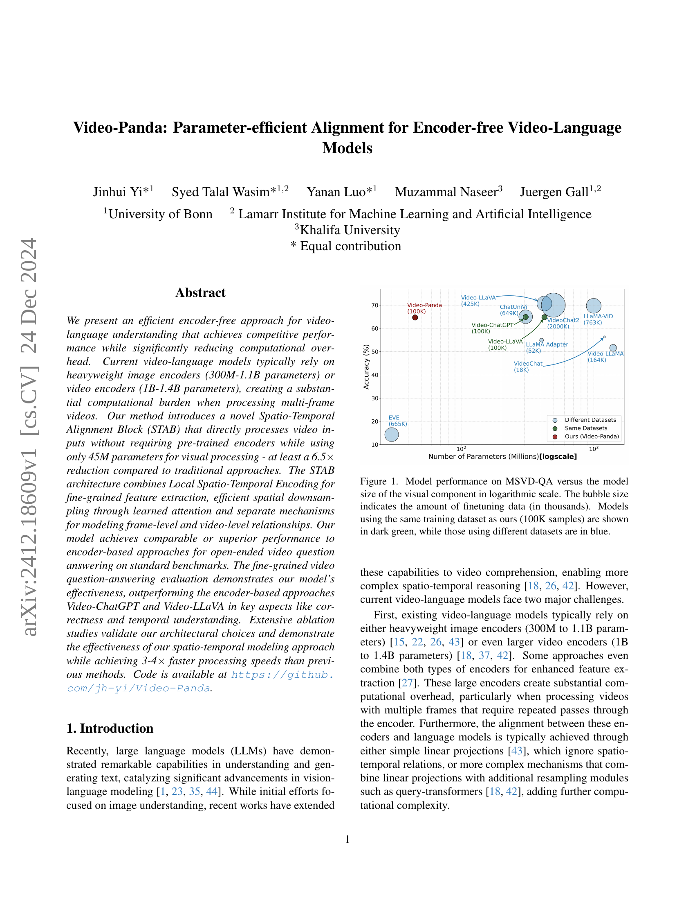
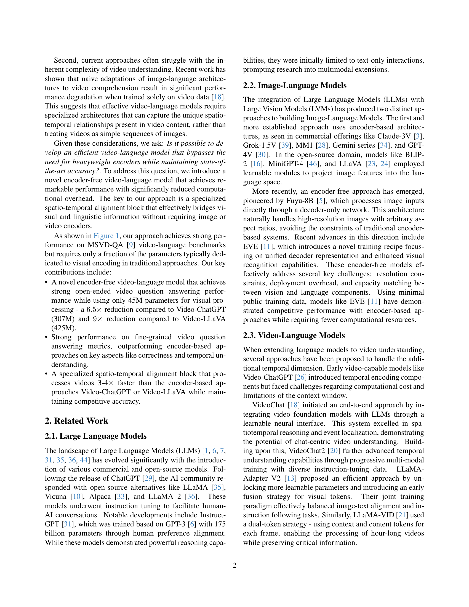
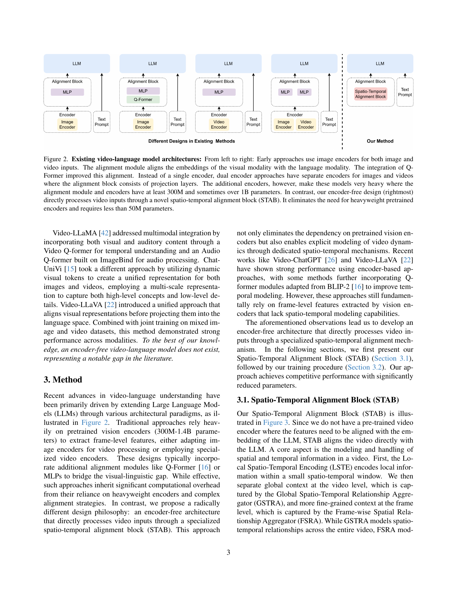
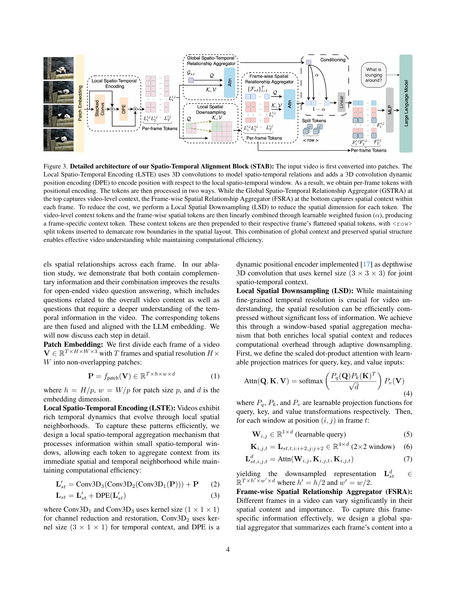
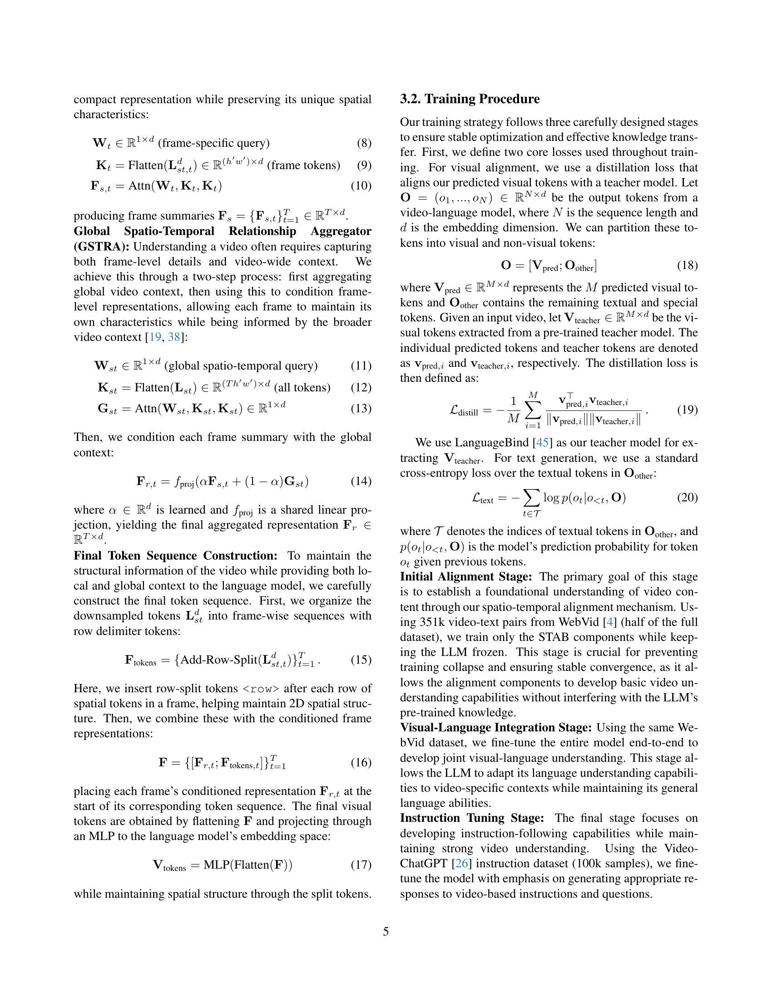
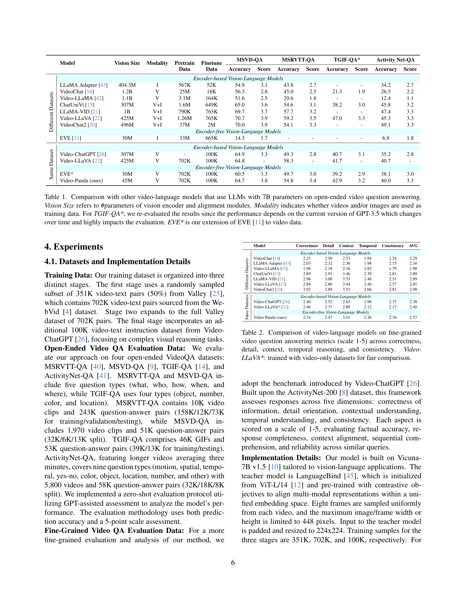

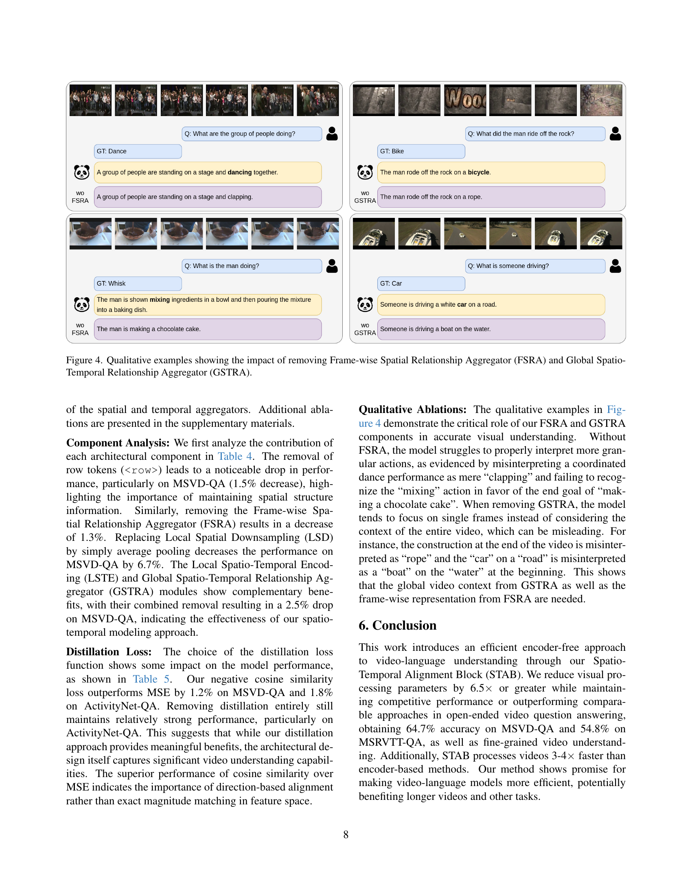
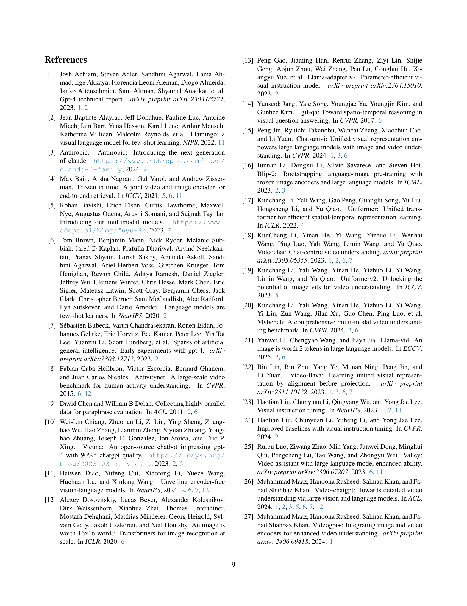
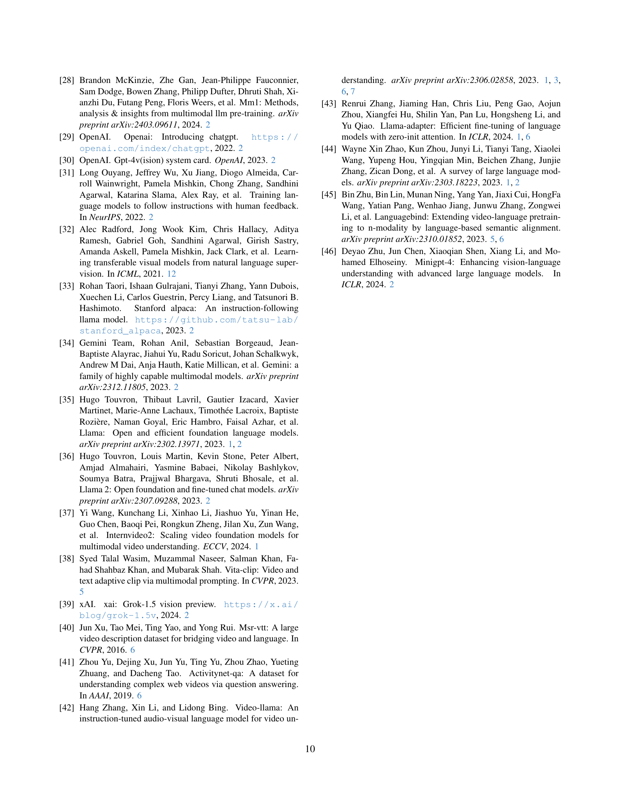
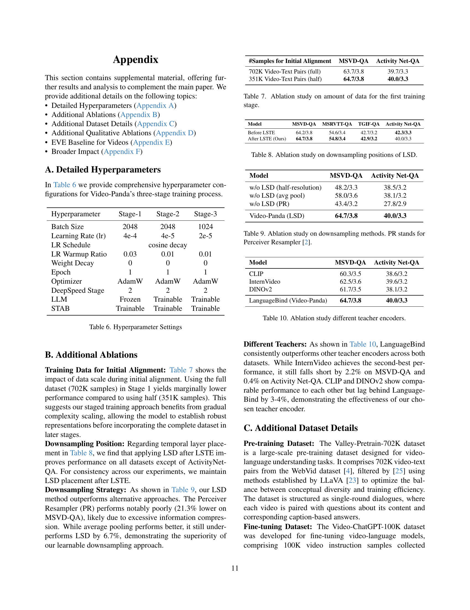
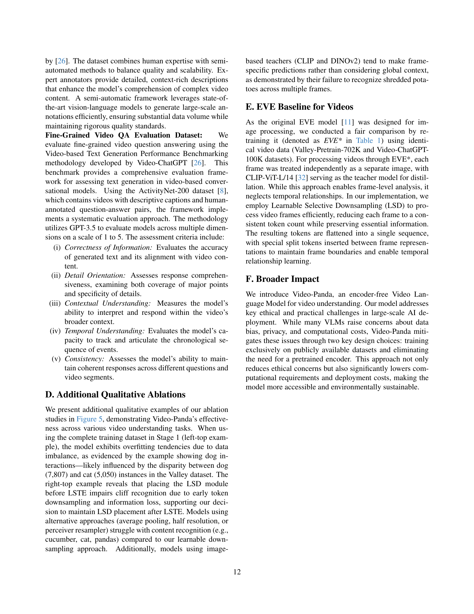
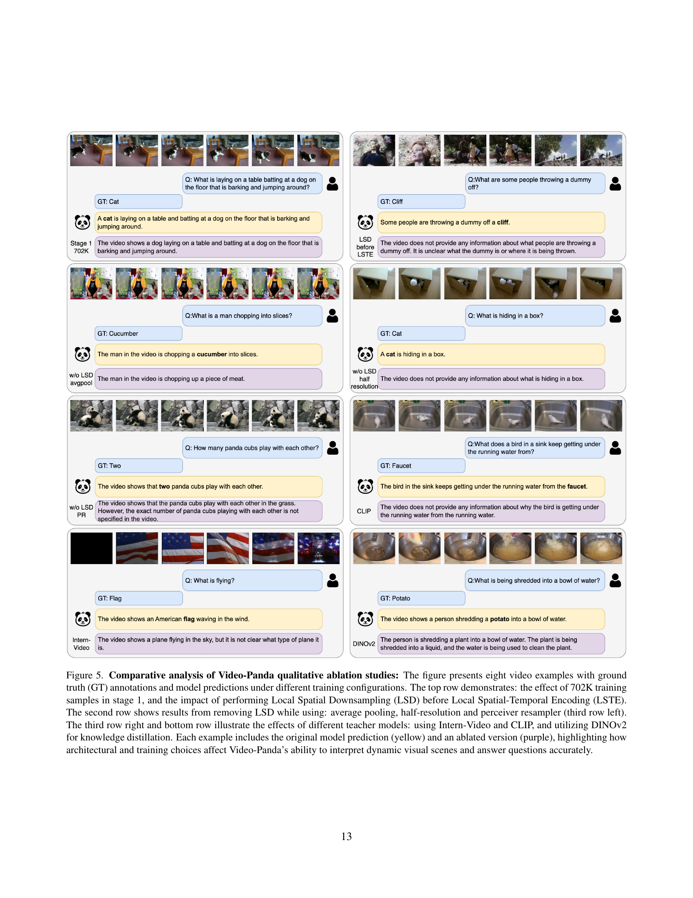
