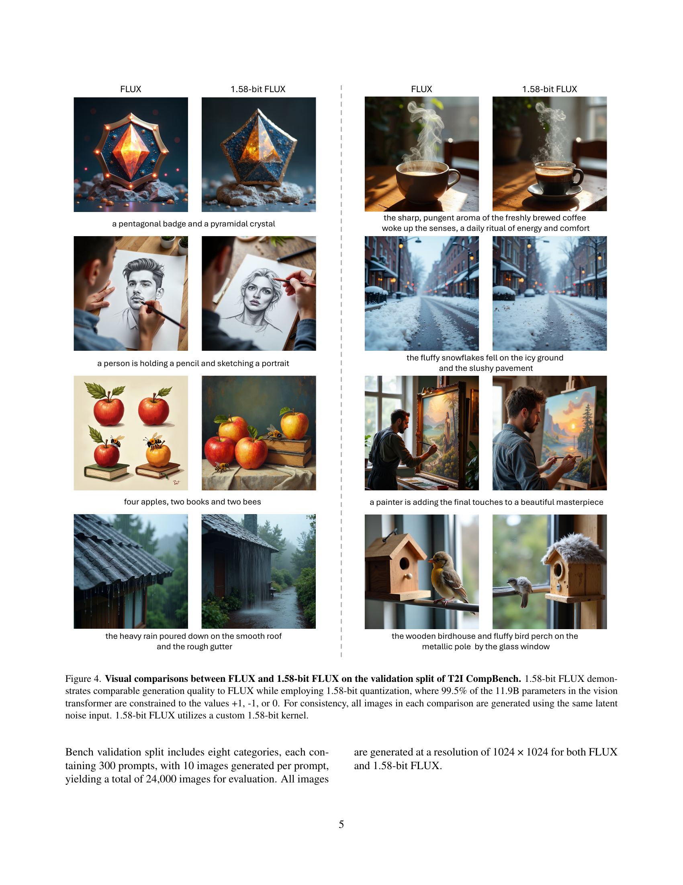

 


 2412.18653 
 Chenglin Yang et el. 
 
 🤗 2024-12-30 
 



↗ arXiv


↗ Hugging Face


↗ Papers with Code


### TL;DR



최근 텍스트-이미지 생성 모델들은 뛰어난 성능을 보이지만, **막대한 파라미터 수와 높은 메모리 사용량**으로 인해 모바일 기기 등 제한된 환경에서의 활용이 어렵다는 문제점이 있습니다.  본 논문에서는 이러한 문제를 해결하기 위해 **1.58-bit FLUX**라는 새로운 모델을 제시합니다. 기존 모델의 복잡성을 줄이면서 성능 저하 없이 고품질 이미지 생성을 가능하게 하여, **자원 제약이 심한 환경에서도 고품질 이미지 생성을 가능**하게 합니다.

본 논문의 핵심은 **모델 파라미터의 99.5%를 1.58-bit로 양자화**하는 기술과 **맞춤형 저비트 연산에 최적화된 커널** 개발입니다.  이는 모델의 크기와 메모리 사용량을 획기적으로 줄이며, 추론 속도도 개선합니다.  **GenEval 및 T2I Compbench 벤치마크**에서 기존 모델과 유사한 성능을 보임으로써, 제안된 방법의 효과를 검증하였습니다. 이는 **모바일 기기 등 제한된 환경에서의 고품질 이미지 생성 모델 구현에 중요한 기여**를 할 것으로 기대됩니다.



#### Key Takeaways


 1.58-bit FLUX는 기존 FLUX 모델의 성능을 유지하면서 모델 크기와 추론 메모리 사용량을 획기적으로 감소시켰습니다. 



 본 연구는 이미지 데이터 없이 자기 지도 학습만으로 1.58-bit 양자화를 달성했습니다. 



 맞춤형 1.58-bit 커널을 통해 추론 속도를 개선하였습니다. 


#### Why does it matter?
본 논문은 **대규모 텍스트-이미지 생성 모델의 효율성을 크게 향상시키는 획기적인 방법**을 제시합니다.  **1.58-bit 양자화 기법과 맞춤형 커널을 통해 모델 크기와 추론 메모리 사용량을 대폭 줄이면서도 성능 저하 없이 고품질 이미지 생성을 유지**합니다. 이는 모바일 기기와 같은 제한된 자원 환경에서도 고품질 이미지 생성 모델을 구현하는 데 중요한 발걸음이 될 것입니다.  또한, 본 연구는 **극저비트 양자화 분야의 새로운 연구 방향**을 제시하며, 향후 관련 연구의 활성화를 기대할 수 있습니다.

------
#### Visual Insights


|     |                                                                                                              |
|-----|---------------------------------------------------------------------------------------------------------------|
|     |                                                          |


> 🔼 표 1은 T2I CompBench라는 벤치마크를 사용하여 여러 가지 이미지 생성 모델들의 성능을 비교 평가한 결과를 보여줍니다.  Stable XL, Pixart-a-ft, FLUX, 커널이 없는 1.58-bit FLUX, 그리고 커널이 적용된 1.58-bit FLUX 모델의 평가 지표가 제시되어 있습니다.  각 모델의 평균 성능 뿐만 아니라 색상, 형태, 질감, 3D 공간, 공간적 관계, 수치, 비공간적 요소, 복잡도 등 다양한 측면에서의 성능 점수를 비교하여 각 모델의 강점과 약점을 분석할 수 있도록 자세한 정보를 제공합니다.  특히, 커널 적용 여부에 따른 1.58-bit FLUX 모델의 성능 차이를 확인할 수 있습니다.
> 

> 
read the caption

> Table 1: Evaluations on T2I CompBench. 1.58-bit FLUX (w/o kernel) indicates no efficient kernel is applied.
> 

### In-depth insights

#### 1.58-bit FLUX Model
1.58-비트 FLUX 모델은 기존 FLUX 모델의 가중치를 **1.58비트로 양자화**하여 모델 크기와 메모리 사용량을 획기적으로 줄이면서 동시에 성능 저하를 최소화한 혁신적인 모델입니다. **이미지 데이터 없이 자기 지도 학습 방식**을 통해 1.58비트 가중치를 효율적으로 학습하였고, **맞춤형 커널**을 개발하여 연산 효율까지 높였습니다.  이는 **모바일 및 자원 제약 환경**에서의 이미지 생성 모델 배포에 큰 도움을 줄 것으로 기대됩니다.  **GenEval 및 T2I Compbench 벤치마크**에서 기존 FLUX 모델과 비슷한 성능을 보이며, **메모리 사용량 및 저장 용량 감소** 측면에서 뛰어난 효율성을 입증했습니다.  하지만, 아직 고해상도 이미지 생성 시 세밀한 부분 표현에는 한계가 있으며, 향후 추가적인 연구를 통해 개선될 여지가 있습니다.

#### Quantization Method
본 논문에서 제시된 양자화 방법은 **1.58비트 가중치를 사용하는 혁신적인 접근 방식**입니다. 기존의 고정 소수점 또는 부동 소수점 방식과 달리 {-1, 0, +1} 값만 허용하여 모델 크기와 메모리 사용량을 획기적으로 줄입니다. 특히, **이미지 데이터에 접근하지 않고 FLUX 모델 자체의 자기 지도 학습을 활용**한다는 점이 핵심입니다. 이는 데이터 의존성을 줄이고, 다양한 모델에 적용 가능성을 높인다는 장점을 가집니다. **1.58비트 연산에 최적화된 커스텀 커널을 개발**하여 추가적인 효율 향상을 도모한 점도 주목할 만합니다. 이러한 방법은 단순히 기존 모델을 양자화하는 것 이상으로, **모델 자체의 구조와 연산 방식에 대한 깊이 있는 이해**를 바탕으로 설계되었다는 것을 시사합니다.  **모델의 저장 공간을 7.7배, 추론 메모리 사용량을 5.1배 줄이면서도 성능 저하 없이 이미지 생성 품질을 유지**하는 성과를 달성하였습니다.

#### Efficiency Improvements
본 논문에서 제시된 1.58-bit FLUX는 모델 크기와 추론 메모리 사용량을 획기적으로 줄이는 효율성 향상을 보여줍니다. **7.7배의 모델 저장 용량 감소와 5.1배의 추론 메모리 사용량 감소**는 컴퓨팅 자원이 제한적인 모바일 기기나 임베디드 시스템에서의 배포에 매우 유리합니다.  **사용자 정의 커널의 최적화**를 통해 추론 지연 시간 또한 개선되었으며, 이는 실시간 응용 프로그램에 중요한 이점입니다.  **GenEval 및 T2I Compbench 벤치마크에서의 성능 저하 없이** 이러한 효율성 향상이 달성되었다는 점은 매우 주목할 만합니다.  이는 낮은 비트 수의 양자화가 이미지 생성 품질에 큰 영향을 미치지 않음을 시사하며, 향후 효율적인 텍스트-이미지 생성 모델 개발에 중요한 방향을 제시합니다.  하지만, 활성화 함수 양자화 및 추가적인 커널 최적화가 미흡하여 속도 향상에는 한계가 있다는 점과 고해상도 이미지에서 세부 묘사가 다소 부족한 점은 앞으로 개선해야 할 과제입니다.

#### Benchmark Results
본 논문의 벤치마크 결과는 **1.58-bit FLUX가 기존 FLUX 모델과 비교하여 성능 저하 없이 효율성을 크게 향상**시켰음을 보여줍니다.  **GenEval 및 T2I Compbench와 같은 주요 벤치마크에서 1.58-bit FLUX는 정량적 지표 측면에서 Full-precision FLUX와 유사한 성능**을 달성했습니다.  이는 **모델 크기 및 메모리 사용량을 획기적으로 줄이면서도 이미지 생성 품질을 유지**했음을 시사합니다. 특히 **제한된 메모리 환경에서도 우수한 성능**을 보였으며, 이는 모바일 기기와 같은 자원 제약적인 환경에서의 배포에 큰 장점으로 작용할 것입니다.  **저자들은 1.58-bit FLUX의 성능 향상이 사용자 정의 커널 최적화를 통해 더욱 증폭**되었음을 강조합니다.  하지만 **활성화 함수의 양자화 최적화는 아직 이루어지지 않았고, 향후 연구를 통해 추가적인 성능 개선이 가능**할 것으로 예상됩니다.

#### Future Work
본 논문은 1.58-bit FLUX 모델을 제시하며, 이미지 생성 품질을 유지하면서 모델 크기와 추론 메모리 사용량을 크게 줄였습니다. 하지만, **속도 개선에는 한계가 있으며, 고해상도 이미지 생성에서 세부 묘사가 다소 부족한 점**이 있습니다.  미래 연구 방향으로는 **활성화 함수 양자화 및 추가적인 커널 최적화를 통한 속도 향상**, 그리고 **고해상도 이미지 생성 성능 향상**에 대한 연구가 제시될 수 있습니다. 또한, **다양한 다른 text-to-image 모델에 대한 1.58-bit 양자화 적용 및 일반화 가능성**을 검증하는 연구도 필요합니다.  **모바일 기기 등 제한된 자원 환경에서의 실제 구현 및 성능 평가**를 통해 실용성을 더욱 높일 수 있을 것입니다. 마지막으로, **에너지 효율성 측면에서의 분석**을 추가하여, 1.58-bit FLUX의 환경적 영향까지 고려한 연구를 진행할 수 있습니다.

### More visual insights

More on tables


|  |
> 🔼 표 2는 GenEval 데이터셋을 사용한 1.58-bit FLUX의 성능 평가 결과를 보여줍니다.  '1.58-bit FLUX (w/o kernel)'은 효율적인 커널이 적용되지 않은 경우를 나타냅니다.  표에는 전체 성능, 개체 계수, 색상, 위치, 색상 지정 등 다양한 측면에서의 평가 지표가 포함되어 있으며,  FLUX 및 다른 모델들과의 성능 비교를 통해 1.58-bit FLUX의 효율성과 정확성을 확인할 수 있습니다.
> 

> 
read the caption

> Table 2: Evaluations on GenEval. 1.58-bit FLUX (w/o kernel) indicates no efficient kernel is applied.
> 


| Model | Avg. | Color | Shape | Texture | 2D Spatial | 3D Spatial | Numeracy | Non-spatial | Complex |
|---|---|---|---|---|---|---|---|---|---| 
| B-VQA | B-VQA | B-VQA | UniDet | UniDet | UniDet | S-CoT | S-CoT |  |  |
| Stable XL [45] | 0.5255 | 0.5879 | 0.4687 | 0.5299 | 0.2133 | 0.3566 | 0.4988 | 0.7673 | 0.7817 |
| Pixart-α-ft [6] | 0.5586 | 0.6690 | 0.4927 | 0.6477 | 0.2064 | 0.3901 | 0.5058 | 0.7747 | 0.7823 |
| FLUX | 0.5876 | 0.7529 | 0.5056 | 0.6299 | 0.2791 | 0.4014 | 0.6131 | 0.7807 | 0.7380 |
| 1.58-bit FLUX (w/o kernel) | 0.5806 | 0.7358 | 0.4900 | 0.6151 | 0.2781 | 0.4037 | 0.6089 | 0.7807 | 0.7327 |
| 1.58-bit FLUX | 0.5812 | 0.7390 | 0.4910 | 0.6162 | 0.2757 | 0.4049 | 0.6137 | 0.7793 | 0.7300 |
> 🔼 본 표는 FLUX와 1.58-bit FLUX의 비전 트랜스포머 구성 요소에 대한 지연 시간 측정 결과를 보여줍니다. 50개의 추론 단계를 거쳐 이미지 하나를 생성하는 데 걸린 시간을 측정하였으며, GPU 유형에 따른 결과를 보여줍니다. OOM은 메모리 부족을 의미합니다.  즉, 특정 GPU에서는 1.58-bit FLUX가 메모리 제한으로 인해 실행되지 못했음을 의미합니다.
> 

> 
read the caption

> Table 3: Latency measurements on the vision transformer component of FLUX and 1.58-bit FLUX. The measurements are obtained by generating one image with 50 inference steps. OOM means out of memory.
> 

### Full paper



