 


 2412.19512 
 Hua Farn et el. 
 
 🤗 2024-12-30 
 



↗ arXiv


↗ Hugging Face


↗ Papers with Code


### TL;DR



대규모 언어 모델(LLM)은 다양한 하류 작업에 효과적이지만, 미세 조정 과정에서 안전성이 저하될 수 있다는 문제점이 있습니다. 기존 해결책들은 추가적인 안전 데이터를 필요로 하여 현실적인 어려움이 있었습니다. 이는 특히 안전이 중요한 분야에서 LLM 적용을 제한하는 요인이 됩니다.

본 논문에서는 **미세 조정 전후의 안전성이 보장된 LLM 모델의 가중치를 결합**하는 간단하면서도 효과적인 방법을 제안합니다. 이를 통해 추가적인 안전 데이터 없이 하류 작업의 성능을 향상시키면서 안전성을 유지할 수 있음을 실험적으로 증명했습니다.  다양한 모델과 작업, 그리고 결합 방법에 대한 광범위한 실험 결과를 통해 이 방법의 강건성을 확인했습니다.



#### Key Takeaways


 미세 조정 후 LLM의 안전성 저하 문제를 해결하는 새로운 방법 제시 



 추가 안전 데이터 없이 하류 작업 성능 향상 및 안전성 유지 



 다양한 모델과 작업에 적용 가능한 견고한 방법임을 실험적으로 검증 


#### Why does it matter?
본 논문은 **미세 조정된 대규모 언어 모델(LLM)의 안전성 저하 문제**를 해결하는 실용적인 방법을 제시하여, **안전성과 성능을 동시에 향상**시키는 데 기여합니다.  이는 LLM 연구의 중요한 과제이며, 다양한 하류 작업에 대한 안전하고 효율적인 LLM 적용을 위한 새로운 가능성을 제시합니다.  특히, **추가적인 안전 데이터 없이** 성능을 개선한다는 점이 큰 의의를 지닙니다.

------
#### Visual Insights

### Full paper


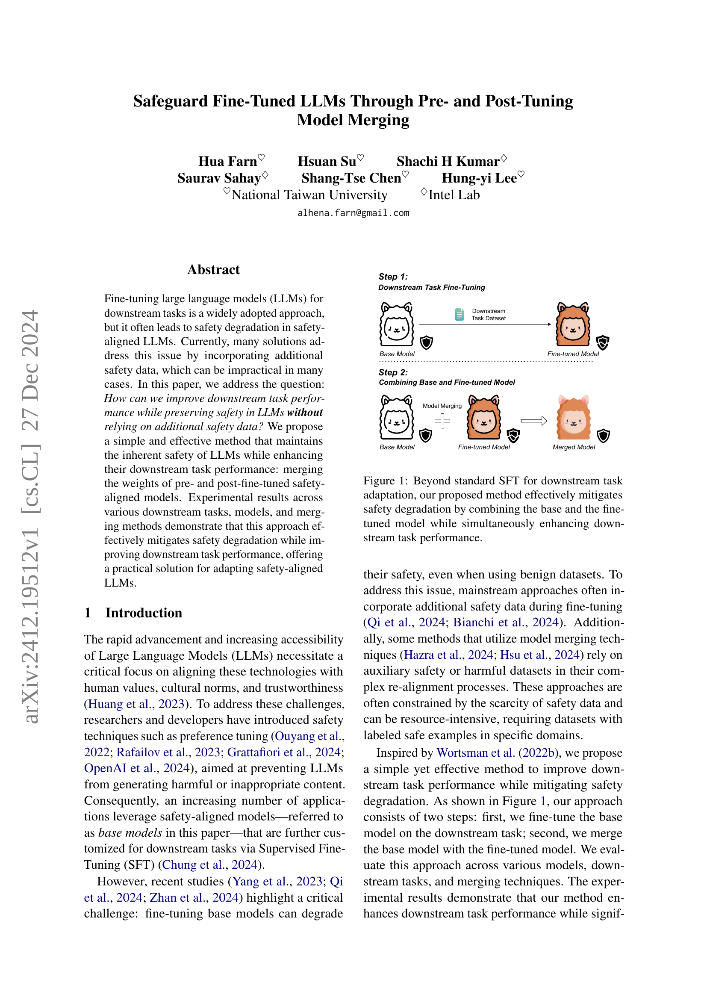
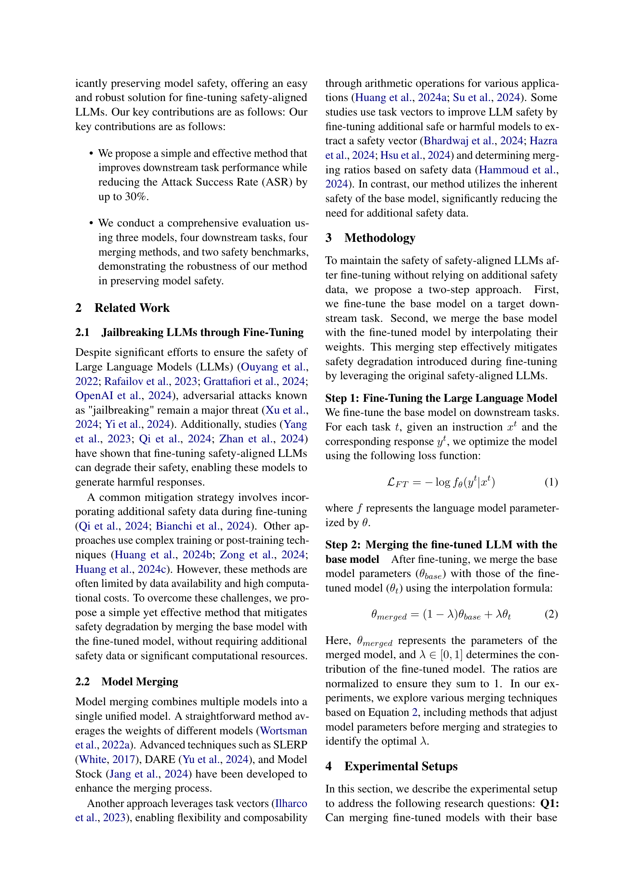
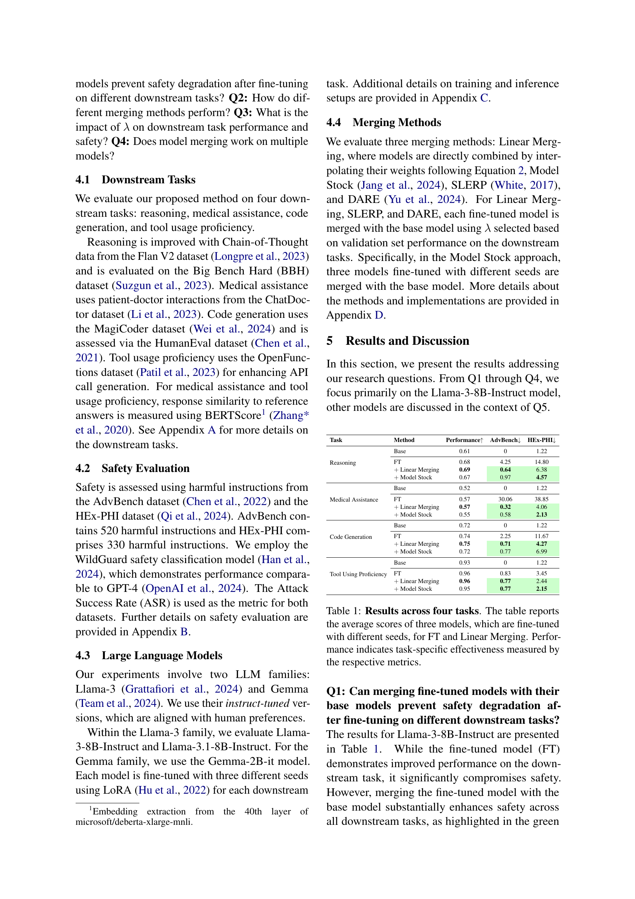
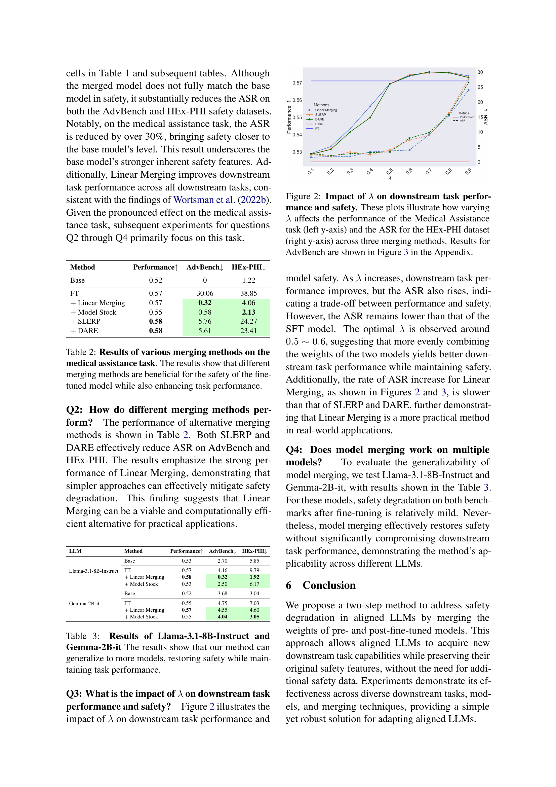
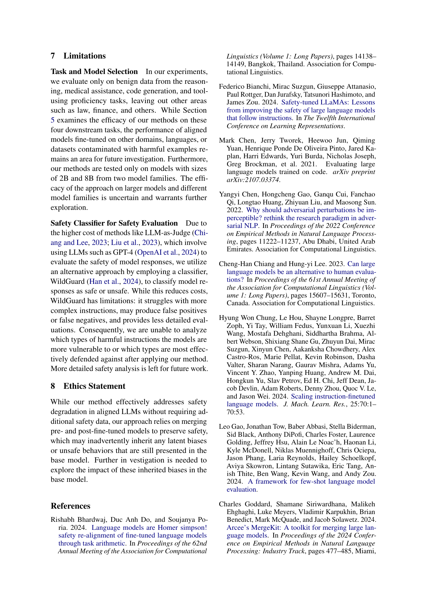
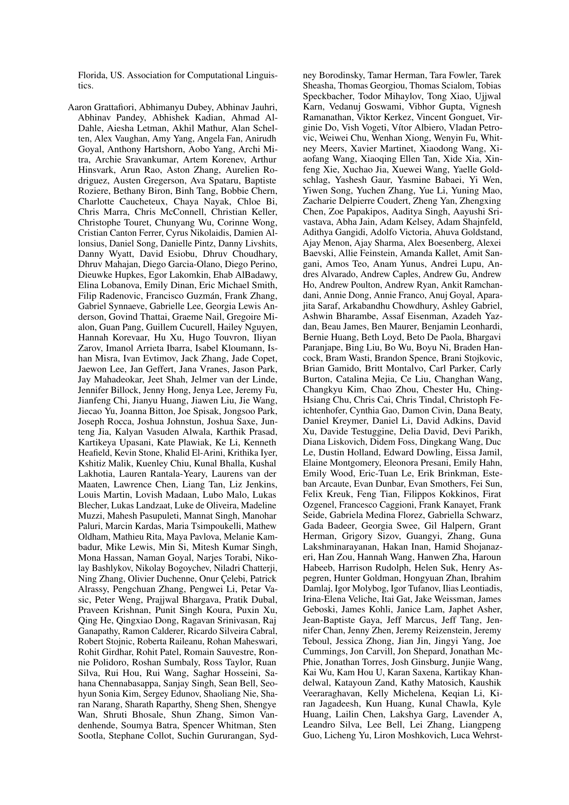
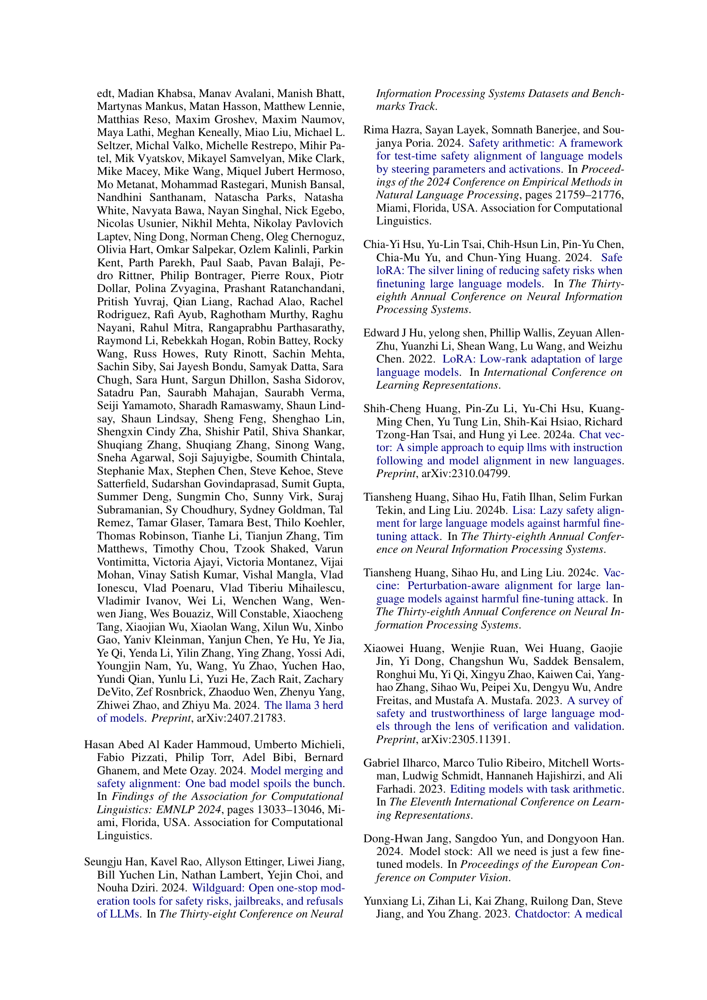
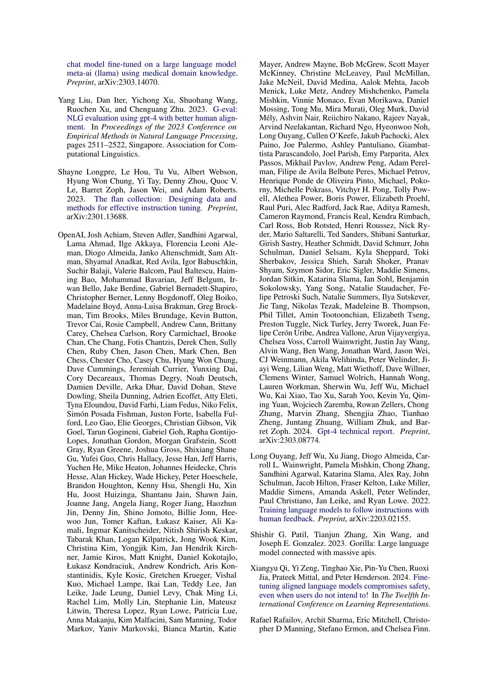
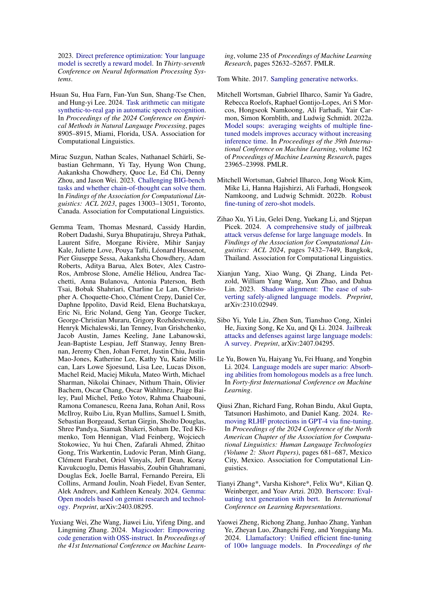
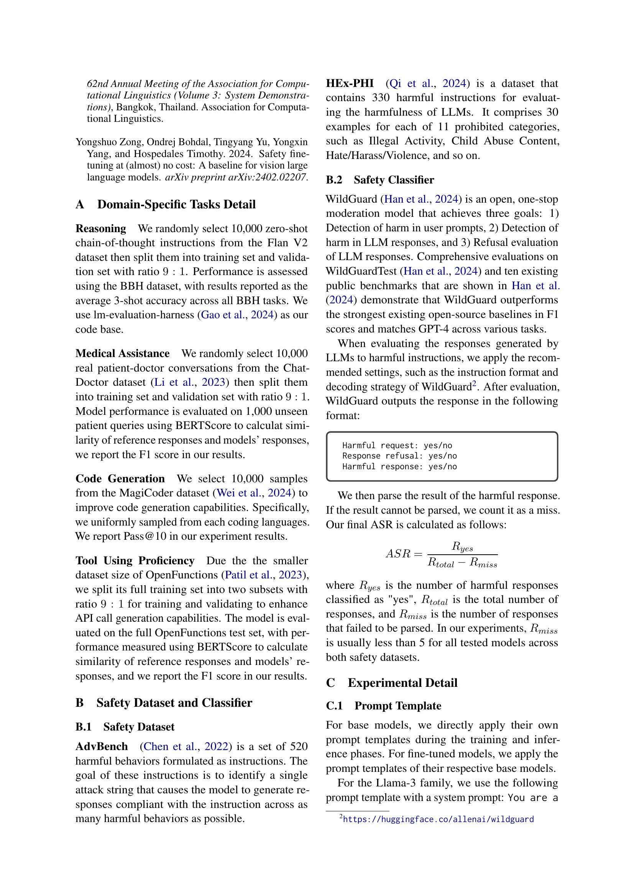
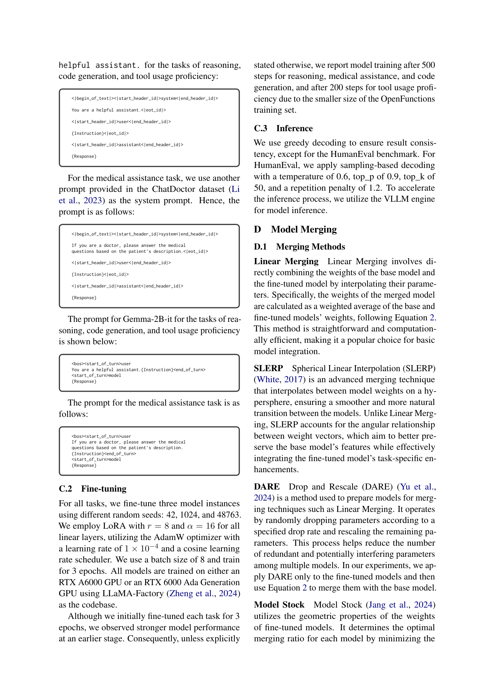
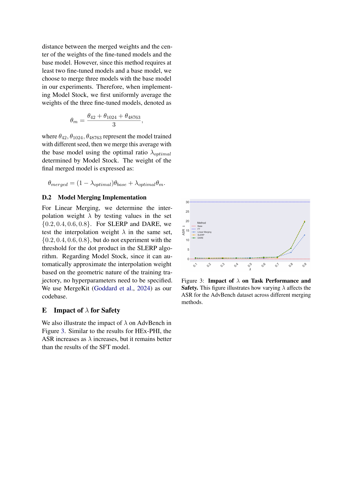
