 


 2412.19638 
 Wang Qun et el. 
 
 🤗 2025-01-02 
 



↗ arXiv


↗ Hugging Face


↗ Papers with Code


### TL;DR



대규모 언어 모델(LLM)은 자연어 처리 분야에서 괄목할 만한 성과를 거두었지만, 복잡한 추론 과제 해결에는 여전히 어려움을 겪고 있습니다. 특히, LLM의 크기가 커질수록 계산 비용과 훈련 시간이 증가하여 효율성 문제가 발생합니다.  이러한 문제를 해결하기 위해,  **연구자들은 추론 능력과 훈련 효율성 사이의 균형을 맞추는 새로운 모델을 개발**하려고 노력하고 있습니다.

본 논문에서는 **추론 과제에 특화된 12억 매개변수의 새로운 대규모 언어 모델인 Xmodel-2를 제시**합니다. Xmodel-2는 **모델 크기에 상관없이 동일한 하이퍼파라미터를 공유하는 아키텍처**를 사용하여, 다양한 크기의 모델에서 실험을 반복하고 최적의 설정을 큰 모델에 적용하는 것을 용이하게 합니다. 또한, **효율적인 훈련 전략과 방대한 데이터셋을 활용**하여, 복잡한 추론 과제와 에이전트 기반 과제에서 최첨단 성능을 달성했습니다.  **GitHub에서 모델 체크포인트와 코드를 공개**하여, 다른 연구자들이 이를 재현하고 더욱 발전시킬 수 있도록 지원합니다.



#### Key Takeaways


 12억 매개변수의 새로운 대규모 언어 모델 Xmodel-2는 다양한 추론 과제에서 최첨단 성능을 달성했습니다. 



 Xmodel-2는 모델 크기에 상관없이 동일한 하이퍼파라미터를 공유하는 혁신적인 아키텍처를 기반으로, 훈련 효율성과 안정성을 크게 향상시켰습니다. 



 Xmodel-2의 모델 체크포인트와 코드는 공개되어 있어, 다른 연구자들이 연구를 재현하고 발전시키는데 도움을 줄 수 있습니다. 


#### Why does it matter?
이 논문은 **추론 능력을 향상시킨 효율적인 대규모 언어 모델 설계 및 훈련 전략**에 대한 통찰력을 제공하여, **추론 성능과 훈련 효율성 간의 균형**을 맞추려는 연구자들에게 중요한 의미를 지닙니다.  **공개된 모델 및 코드**는 다른 연구자들이 이 연구를 바탕으로 더욱 발전된 모델을 개발하고 다양한 응용 분야에 적용할 수 있도록 지원하며, **추론 기술 발전에 기여**할 것으로 기대됩니다. 또한, 본 연구는 **효율적인 모델 설계와 훈련 방법**을 제시하여, 계산 자원이 제한적인 연구자들에게도 도움이 될 수 있습니다.

------
#### Visual Insights

> 🔼 그림 1은 GSM8K, MATH, BBH, MMLU, HumanEval, MBPP 등 여러 복잡한 추론 벤치마크에서 다양한 크기의 언어 모델들의 평균 점수를 보여줍니다. X축은 모델의 크기(단위: 십억 파라미터)이고, Y축은 복잡한 추론 작업에 대한 평균 점수입니다. 이 그래프는 Xmodel-2를 포함한 여러 모델의 성능을 비교하여 Xmodel-2의 우수한 추론 능력을 시각적으로 보여줍니다.
> 

> 
read the caption

> Figure 1: Average Scores on Complex Reasoning Benchmarks (GSM8K, MATH, BBH, MMLU, HumanEval and MBPP).
> 


| Hidden size | Intermediate size | Attention heads | KV heads | Layers | Context Len |
|---|---|---|---|---|---| 
| 1536 | 3840 | 24 | 8 | 48 | 4096 |

> 🔼 표 1은 Xmodel-2 모델의 구체적인 구성 정보를 보여줍니다.  모델의 크기, 중간 크기, 어텐션 헤드 수, KV 헤드 수, 레이어 수, 그리고 컨텍스트 길이와 같은 주요 하이퍼파라미터 값들을 명시적으로 제시하여 Xmodel-2의 아키텍처를 자세히 설명합니다. 이를 통해 독자는 Xmodel-2의 구조를 보다 명확하게 이해하고 다른 모델들과의 비교 분석에 필요한 정보를 얻을 수 있습니다.
> 

> 
read the caption

> Table 1: Model configuration for Xmodel-2.
> 

### In-depth insights

#### Reasoning Model
본 논문에서 다루는 추론 모델은 **대규모 언어 모델(LLM)**을 기반으로 하며, 특히 **추론 능력** 향상에 초점을 맞추고 있습니다.  단순한 텍스트 생성을 넘어 복잡한 추론 과제를 해결하기 위한 설계가 핵심이며, 이를 위해 **모델 구조, 학습 전략, 그리고 데이터 활용** 등 다양한 측면에서 개선이 이루어졌습니다.  **매개변수의 효율적인 사용** 및 **학습 안정성 확보** 또한 중요한 고려사항으로, 이를 통해 비용 효율적인 대규모 모델 개발에 기여할 수 있을 것으로 기대됩니다.  **다양한 벤치마크 테스트**를 통해 성능을 검증하고 있으며, **실제 응용 분야**에 적용 가능성을 확인하는 후속 연구가 필요할 것으로 예상됩니다.  **개방형 접근 방식**은 다른 연구자들의 활용 및 발전에 도움을 줄 수 있는 중요한 요소입니다.

#### WSD Training
WSD(Warmup-Stable-Decay) 학습 전략은 **학습의 안정성과 효율성을 동시에 확보**하기 위해 고안된 방법입니다. 초기 단계(warmup)에서는 학습률을 천천히 증가시켜 모델이 초기 손실 감소에 적응하도록 돕고, 중간 단계(stable)에서는 학습률을 일정하게 유지하여 안정적인 학습을 유도하며, 마지막 단계(decay)에서는 학습률을 점진적으로 감소시켜 학습의 과적합을 방지합니다. 이러한 **단계별 학습률 조절**은 **모델의 성능 향상**과 **훈련 시간 단축**에 큰 영향을 미칩니다. 특히, **대규모 언어 모델** 학습에서 발생할 수 있는 불안정성을 해결하고 최적의 성능을 달성하는데 중요한 역할을 합니다.  **다양한 데이터셋**과 결합하여 사용함으로써, 더욱 효과적인 학습이 가능해집니다.  **데이터 비율 최적화**와 함께 사용될 경우, 모델의 성능은 더욱 향상될 수 있으며, 특히 복잡한 추론 과제에서 뛰어난 성능을 보일 수 있습니다.

#### Data Optimization
본 논문에서 데이터 최적화에 대한 심층적인 논의는 없지만, 추론 성능 향상을 위한 데이터 전처리 및 구성 전략이 중요함을 시사합니다. **데이터의 양과 질 모두 성능에 영향을 미치며**, 특히 **다양한 출처의 방대한 데이터를 사용**하여 모델의 일반화 능력을 높이는 데 집중하는 것으로 보입니다.  **복잡한 추론 과제를 위한 고품질 SFT(Supervised Fine-Tuning) 데이터의 중요성**도 언급되며,  **데이터 비율 최적화를 통해 성능 향상**을 도모하는 실험 결과를 제시합니다.  **데이터 중복 제거 및 전처리 과정** 또한 언급되어, 효율적인 데이터 활용을 위한 노력을 보여줍니다.  추가적으로, 다양한 데이터 유형의 비율 조정을 통해 모델의 추론 능력을 개선하는 시도와 그 결과가 제시되어, **데이터 최적화 전략이 모델 성능 향상에 중요한 역할**을 함을 강조합니다.  하지만, 구체적인 데이터 최적화 기법에 대한 상세한 설명은 부족하며,  추후 연구를 통해 더욱 심도있는 분석이 필요합니다.

#### Agent Capabilities
본 논문에서 "Agent Capabilities" 섹션은 **대규모 언어 모델이 에이전트 역할을 수행하는 능력**, 즉 **실제 환경이나 시뮬레이션 환경에서 작업을 수행하고 상호 작용하는 능력**을 평가한 부분입니다.  이를 위해 HotpotQA, FEVER, AlfWorld, WebShop과 같은 다양한 벤치마킹 데이터셋을 사용하여 모델의 성능을 측정했을 것입니다. 각 데이터셋은 특정한 유형의 에이전트 능력(예: 다중 문서 추론, 사실 확인, 공간 추론, 전자 상거래 환경에서의 의사 결정 등)을 평가하도록 설계되었을 것입니다. 결과적으로, 이 섹션에서는 모델이 **복잡한 추론, 다단계 의사 결정, 실제 세계와의 상호 작용**과 관련된 과제를 얼마나 잘 수행하는지에 대한 통찰력을 제공합니다.  **특히, 제한된 자원을 가진 소규모 모델이 이러한 복잡한 작업을 어떻게 처리하는지**에 대한 분석은 매우 중요한 의미를 지닙니다.  따라서 이 부분은 **모델의 실용성과 적용 가능성**을 평가하는 데 중요한 역할을 할 것입니다.

#### Scaling Law
본 논문에서 제시된 스케일링 법칙은 **모델의 크기가 증가함에 따라 성능이 향상되는 경향**을 보여주는 경험적 관계를 설명합니다.  **특히 컨텍스트 토큰의 수가 증가함에 따라 모델의 예측 정확도가 향상**되는 현상을 보여줍니다. 이는 단순히 모델의 크기가 커짐으로써 발생하는 현상이 아니며, **입력 길이 증가에 따른 정보 처리 능력의 증대**와 연관되어 있음을 시사합니다. 이러한 스케일링 법칙은 **모델의 설계 및 학습 전략 개선**에 중요한 시사점을 제공합니다.  **효율적인 모델 디자인 및 학습 전략을 통해 제한된 리소스 내에서도 성능 향상**을 도모할 수 있음을 보여주는 중요한 결과입니다.  **추가적인 실험 및 분석**을 통해 스케일링 법칙의 일반적인 적용 가능성 및 한계를 파악하는 연구가 필요합니다.  **이 법칙을 바탕으로 더욱 효율적이고 강력한 언어 모델을 개발**하는 데 기여할 것입니다.

### More visual insights

More on figures

> 🔼 그림 2는 Xmodel-2 모델의 학습 과정에서 사용된 데이터의 비율을 보여줍니다. 왼쪽 그래프는 안정적인 학습 단계(Stable Training Stage)에서 사용된 데이터 분포를 나타내며, 오른쪽 그래프는 감쇠 단계(Decay Stage)에서 사용된 데이터 분포를 보여줍니다. 각 그래프는 다양한 데이터 소스(예: CC_Chn, FineWeb-Edu, Dolma, Code Pretrain 등)의 비율을 파이 차트 형태로 나타냅니다. 이를 통해 Xmodel-2 학습에 사용된 데이터의 구성과 각 단계별 데이터 비중을 한눈에 파악할 수 있습니다. 감쇠 단계에서는 SFT(Supervised Fine-Tuning) 데이터가 추가로 포함되어 있으며, 이 데이터의 비율 또한 그래프에 표시되어 있습니다.
> 

> 
read the caption

> Figure 2: Data mixture of different training stages.The left side represents the stable training phase, and the right side represents the decay phase.
> 

> 🔼 그림 3은 Xmodel-2-1.2B 모델의 학습 손실 곡선을 보여줍니다.  가로축은 토큰 수 (10억 단위)이고, 세로축은 손실 값입니다. 그래프는 학습 과정 동안 손실이 감소하는 것을 보여주며, 특히 배치 크기를 2M에서 4M으로 증가시킨 후와 학습률 감소 단계에서 손실이 급격히 감소하는 것을 확인할 수 있습니다. 이는 모델의 학습 안정성과 효율성을 보여주는 지표입니다.
> 

> 
read the caption

> Figure 3: Loss curve for Xmodel-2-1.2B.
> 

> 🔼 그림 4는 사전 훈련된 Xmodel-2-1.2B 모델의 MMLU 데이터셋에 대한 교정 플롯을 보여줍니다. 이 플롯은 모델의 예측 확률과 실제 정확도 사이의 관계를 보여줍니다. x축은 모델이 예측한 확률을 나타내고, y축은 해당 확률에서 실제로 정답이었던 비율을 나타냅니다. 완벽한 보정된 모델은 x=y 직선을 따라 분포하며, 이 플롯을 통해 Xmodel-2-1.2B 모델의 보정 정도를 확인할 수 있습니다.  잘 보정된 모델은 플롯 상의 점들이 x=y 직선에 가깝게 분포하며, 잘못 보정된 모델은 점들이 직선에서 멀리 떨어져 있습니다. 이 그림은 모델의 신뢰도에 대한 평가와, 실제 성능과의 차이를 분석하는 데 유용한 정보를 제공합니다.
> 

> 
read the caption

> Figure 4: Calibration plot for the pre-trained Xmodel-2-1.2B model on the MMLU dataset.
> 

> 🔼 그림 5는 Wikitext-2 데이터셋에서 Xmodel-2-1.2B 모델의 학습 후 스케일링 법칙을 보여줍니다.  x축은 테스트 시간 토큰 색인을 나타내고, y축은 손실(loss)을 나타냅니다.  그래프는 학습 후, 프롬프트 토큰 수가 증가함에 따라 다음 토큰에 대한 모델의 예측 정확도가 향상되고 손실이 감소하는 것을 보여줍니다.  곡선은 손실과 토큰 색인 간의 거듭제곱 관계를 보여주며, 점차 감소하는 수익 체감 현상을 나타냅니다. 이는 컨텍스트 길이가 증가함에 따라 모델의 성능이 향상되는 것을 의미합니다.
> 

> 
read the caption

> Figure 5: Post-training Scaling Law for Xmodel-2-1.2B on the Wikitext-2 dataset.
> 

More on tables


| Model | ARC-c | ARC-e | Boolq | HS. | OB. | PiQA | SciQ | Wino. | Avg |
|---|---|---|---|---|---|---|---|---|---| 
| MobiLlama-1B | 28.24 | 61.53 | 60.92 | 46.74 | 21.80 | 75.14 | 88.20 | 59.27 | 55.23 |
| TinyLLaMA1.1-1.1B | 30.97 | 61.66 | 55.99 | 46.70 | 25.20 | 72.63 | 89.30 | 59.43 | 55.24 |
| OLMo-1B | 28.67 | 63.34 | 61.74 | 46.97 | 25.00 | 75.03 | 87.00 | 59.98 | 55.97 |
| OpenELM-1.1B | 28.84 | 62.37 | 63.58 | 48.36 | 25.40 | 74.76 | 90.60 | 61.72 | 56.95 |
| Llama-3.2-1B | 31.31 | 65.36 | 63.73 | 47.78 | 26.40 | 74.48 | 91.50 | 61.01 | 57.70 |
| MiniCPM-1.2B | 36.86 | 70.29 | 67.92 | 49.91 | 23.60 | 74.43 | 91.80 | 60.77 | 59.45 |
| Fox-1-1.6B | 34.73 | 69.91 | 71.77 | 46.33 | 24.60 | 75.24 | 93.20 | 60.77 | 59.57 |
| InternLM2.5-1.8B | 35.24 | 66.37 | 79.82 | 46.99 | 22.00 | 73.29 | 94.90 | 62.67 | 60.16 |
| Qwen2-1.5B | 33.11 | 66.41 | 72.60 | 48.57 | 27.00 | 75.57 | 94.60 | 65.75 | 60.45 |
| StableLM-2-zephyr-1.6B | 36.52 | 66.79 | 80.00 | 53.26 | 26.80 | 74.86 | 88.00 | 64.09 | 61.29 |
| SmolLM-1.7B | 43.43 | 76.47 | 65.93 | 49.58 | 30.00 | 75.79 | 93.20 | 60.93 | 61.92 |
| Qwen2.5-1.5B | 41.21 | 75.21 | 72.97 | 50.15 | 31.80 | 75.90 | 94.30 | 63.61 | 63.14 |
| DCLM-1B | 41.30 | 74.79 | 71.41 | 53.59 | 32.20 | 76.93 | 94.00 | 66.22 | 63.81 |
| Phi-1.5-1.3B | 44.80 | 76.22 | 74.95 | 47.96 | 38.60 | 76.66 | 93.30 | 72.93 | 65.68 |
| Xmodel-2-1.2B | 39.16 | 71.55 | 74.65 | 47.45 | 29.20 | 74.81 | 93.60 | 63.93 | 61.79 |
> 🔼 표 2는 다양한 상식 추론 과제에서 제로샷(Zero-shot) 설정으로 평가한 Xmodel-2의 성능을 보여줍니다.  다양한 규모의 언어 모델들과 비교하여 Xmodel-2의 성능을 평가하고 있습니다.  각 모델은 ARC-Challenge, ARC-Easy, BoolQ, HellaSwag, OpenBookQA, PiQA, SciQ, TriviaQA, Winogrande 등 여러 벤치마크에서 성능을 측정했습니다.  결과는 각 과제에 대한 정확도(Accuracy)를 백분율(%)로 나타내며, 평균 정확도도 함께 제시되어 모델의 전반적인 상식 추론 능력을 비교할 수 있도록 합니다.
> 

> 
read the caption

> Table 2: Zero-shot performance on Commonsense Reasoning tasks.
> 


| Model | GSM8K 5-shot | MATH 4-shot | BBH 3-shot | MMLU 0-shot | HumanEval pass@1 | MBPP pass@1 | Avg |
|---|---|---|---|---|---|---|---| 
| OpenELM-1.1B | 0.45 | 1.06 | 6.62 | 25.52 | 8.54 | 6.80 | 8.16 |
| OLMo-1B | 2.35 | 1.46 | 25.60 | 24.46 | 5.49 | 0.20 | 9.93 |
| TinyLLaMA1.1-1.1B | 2.50 | 1.48 | 25.57 | 25.35 | 1.83 | 3.40 | 10.02 |
| MobiLlama-1B | 1.97 | 1.54 | 25.76 | 25.26 | 7.93 | 5.40 | 11.31 |
| DCLM-1B | 4.93 | 2.14 | 30.70 | 46.43 | 8.54 | 6.80 | 16.59 |
| Llama-3.2-1B | 6.60 | 1.78 | 31.44 | 36.63 | 14.63 | 22.20 | 18.88 |
| SmolLM-1.7B | 7.51 | 3.18 | 29.21 | 27.73 | 21.34 | 31.80 | 20.13 |
| Fox-1-1.6B | 34.34 | 7.94 | 28.75 | 39.55 | 14.02 | 9.00 | 22.27 |
| StableLM-2-zephyr-1.6B | 41.32 | 10.12 | 32.71 | 41.30 | 25.61 | 19.40 | 28.41 |
| Phi-1.5-1.3B | 32.15 | 3.18 | 28.81 | 41.75 | 36.59 | 35.40 | 29.65 |
| InternLM2.5-1.8B | 27.90 | 16.68 | 41.76 | 46.30 | 27.40 | 29.60 | 31.61 |
| MiniCPM-1.2B | 40.11 | 10.98 | 35.42 | 43.99 | 43.90 | 36.80 | 35.20 |
| Qwen2-1.5B | 57.62 | 22.90 | 33.05 | 55.11 | 20.73 | 30.40 | 36.64 |
| Qwen2.5-1.5B | 62.40 | 28.28 | 43.99 | 59.72 | 5.49 | 40.00 | 39.98 |
| Xmodel-2-1.2B | 55.88 | 25.50 | 48.40 | 48.87 | 29.88 | 29.20 | 39.62 |
> 🔼 표 3은 Xmodel-2를 포함한 여러 언어 모델의 복잡한 추론 능력을 평가한 결과를 보여줍니다. GSM8K, MATH, BBH, MMLU, HumanEval, MBPP 등 다양한 벤치마크에서의 성능을 5-shot, 4-shot, 3-shot, 0-shot 설정으로 평가하여 각 모델의 추론 능력을 비교 분석합니다.  각 벤치마크는 특정 유형의 추론 문제를 다루며, 이를 통해 모델의 강점과 약점을 파악할 수 있습니다.  예를 들어 GSM8K는 일반적인 상식 추론 문제, MATH는 수학 문제 해결 능력, HumanEval은 코드 생성 능력을 평가합니다.
> 

> 
read the caption

> Table 3: Performance on Complex Reasoning tasks.
> 


| Model | HotpotQA EM | FEVER EM | AlfWorld success rate | WebShop success rate | Avg |
|---|---|---|---|---|---| 
| OLMo-1B | 2.67 | 18.58 | 0.00 | 0.00 | 4.32 |
| Phi-1.5 1.3B | 3.54 | 17.56 | 2.24 | 0.80 | 6.04 |
| DCLM-1B | 4.92 | 24.39 | 0.75 | 0.00 | 7.52 |
| MobiLlama-1B | 0.00 | 30.43 | 0.00 | 0.00 | 7.61 |
| TinyLLaMA1.1-1.1B | 2.11 | 28.77 | 0.00 | 0.20 | 7.77 |
| OpenELM-1-1B | 2.70 | 28.37 | 0.00 | 0.40 | 7.87 |
| StableLM-2-zephyr-1.6B | 1.44 | 20.81 | 8.96 | 2.20 | 8.35 |
| SmolLM-1.7B | 2.28 | 31.31 | 0.00 | 0.60 | 8.55 |
| Fox-1-1.6B | 5.37 | 30.88 | 0.00 | 0.60 | 9.21 |
| Llama-3.2-1B | 4.87 | 27.67 | 8.21 | 3.20 | 10.99 |
| Qwen2.5-1.5B | 13.53 | 27.58 | 5.97 | 0.60 | 11.92 |
| MiniCPM-1.2B | 11.00 | 36.57 | 1.60 | 1.00 | 12.52 |
| InternLM2.5-1.8B | 12.84 | 34.02 | 2.99 | 1.00 | 12.71 |
| Xmodel-2-1.2B | 13.70 | 40.00 | 0.78 | 2.20 | 14.21 |
> 🔼 표 4는 다양한 에이전트 기반 작업(HotpotQA, FEVER, AlfWorld, WebShop)에서 Xmodel-2를 포함한 여러 언어 모델의 성능을 보여줍니다. 각 작업에 대한 정확도(EM) 또는 성공률을 측정하여 모델의 복잡한 추론 및 의사 결정 능력을 평가합니다. 이 표는 Xmodel-2의 에이전트 기능이 다른 유사한 크기의 모델에 비해 상당히 우수함을 보여줍니다.
> 

> 
read the caption

> Table 4: Performance on Agent tasks.
> 


| Hyperparameter | Range | Options | Step Size |
|---|---|---|---| 
| `scale_emb` | [2, 20] | - | 1 |
| `dim_model_base` | - | {32, 64, 128, 256, 512, 1024} | - |
| `scale_depth` | [1, 5] | - | 0.1 |
| `learning_rate` | [0.001, 0.1] | - | 0.001 |
> 🔼 이 표는 논문의 Appendix 섹션, '6.1 µP Hyperparameter Search'에서 nano 모델에 대한 하이퍼파라미터 검색 범위를 보여줍니다.  nano 모델은 6백만개의 파라미터를 가진 작은 모델이며,  Bayesian Optimization 기법을 사용하여 하이퍼파라미터를 최적화하는 실험에 사용되었습니다. 표에는 scale_emb, dim_model_base, scale_depth, learning_rate 네 가지 하이퍼파라미터의 탐색 범위, 옵션, 단계 크기가 포함되어 있습니다.  이러한 하이퍼파라미터 범위는 효율적인 하이퍼파라미터 탐색을 위해 신중하게 선택되었으며,  최적의 하이퍼파라미터를 찾는 데 도움이 됩니다.  이 표의 결과는 본 논문에서 제시된 Xmodel-2 모델의 학습 전략을 검증하는 데 중요한 역할을 합니다.
> 

> 
read the caption

> Table 5: Hyperparameter search ranges for nano model.
> 


| Name | Specific Operation |
|---|---| 
| Embedding Output Scaling | Multiply the output of the embedding by $scale_{emb}$ |
| Residual Connection Scaling | Scale the output tensor of a block before adding to each residual connection in each layer by $scale_{depth}/\sqrt{\text{num\_layers}}$ |
| Initialization of Tensors | Set the initialization standard deviation of each two-dimensional tensor parameter to $init_{std}/\sqrt{d_{m}/d_{base}}$, and set other parameters’ initialization to 0.1 |
| Learning Rate Scaling of Tensors | Adjust the learning rate of each two-dimensional tensor parameter to $1/(d_{m}/d_{base})$ times the learning rate of other parts (or the overall learning rate) |
| LM Head Scaling | Adjust the output logits to $1/(d_{m}/d_{base})$ times the original value |
> 🔼 이 표는 텐서 프로그램 기법을 적용할 때 사용되는 연산 목록을 보여줍니다.  각 연산의 이름과 구체적인 동작 방식을 설명하여, 텐서 프로그램 기법의 세부적인 작동 원리를 이해하는 데 도움을 줍니다.  특히 임베딩 출력 크기 조정, 잔차 연결 크기 조정, 텐서 초기화, 텐서 학습률 조정, LM 헤드 크기 조정 등의 연산에 대한 자세한 내용을 담고 있습니다.
> 

> 
read the caption

> Table 6: List of operations used when applying tensor program techniques.
> 

### Full paper


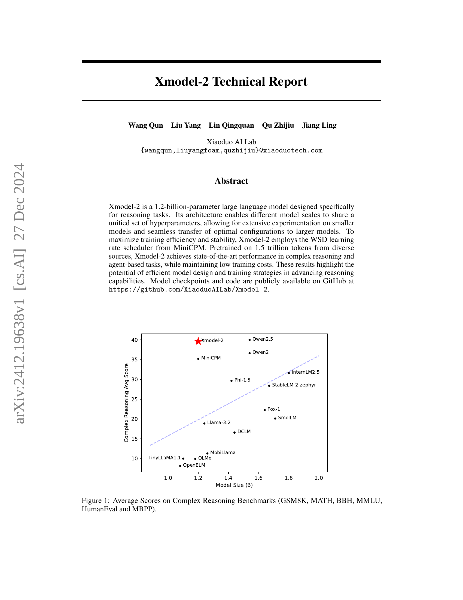
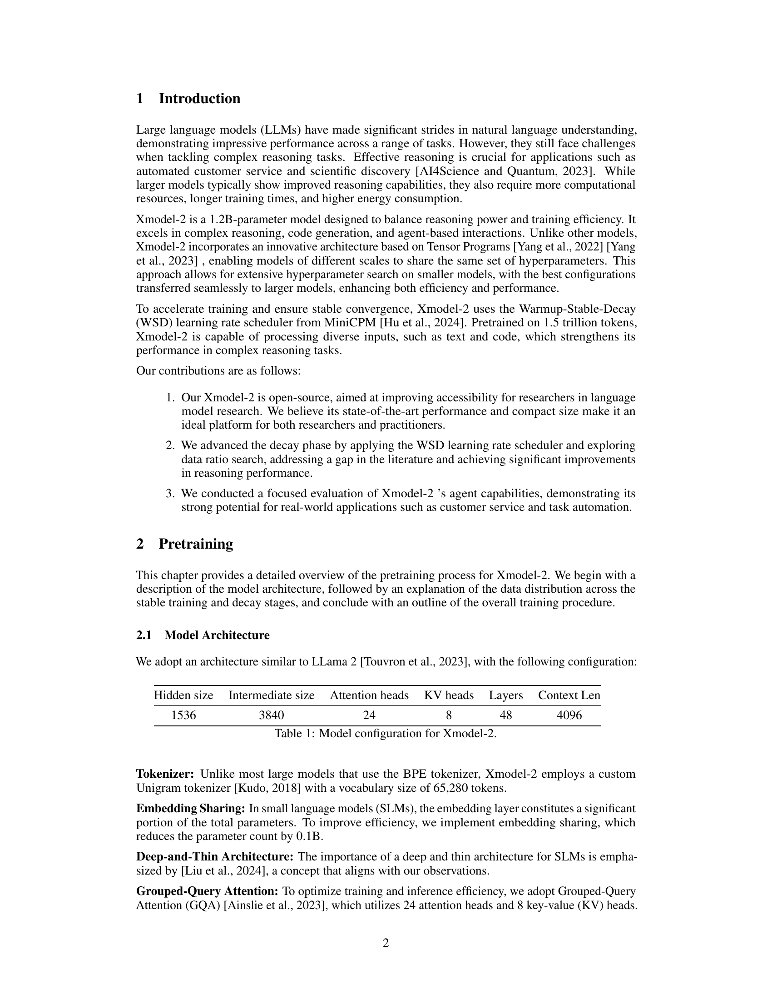
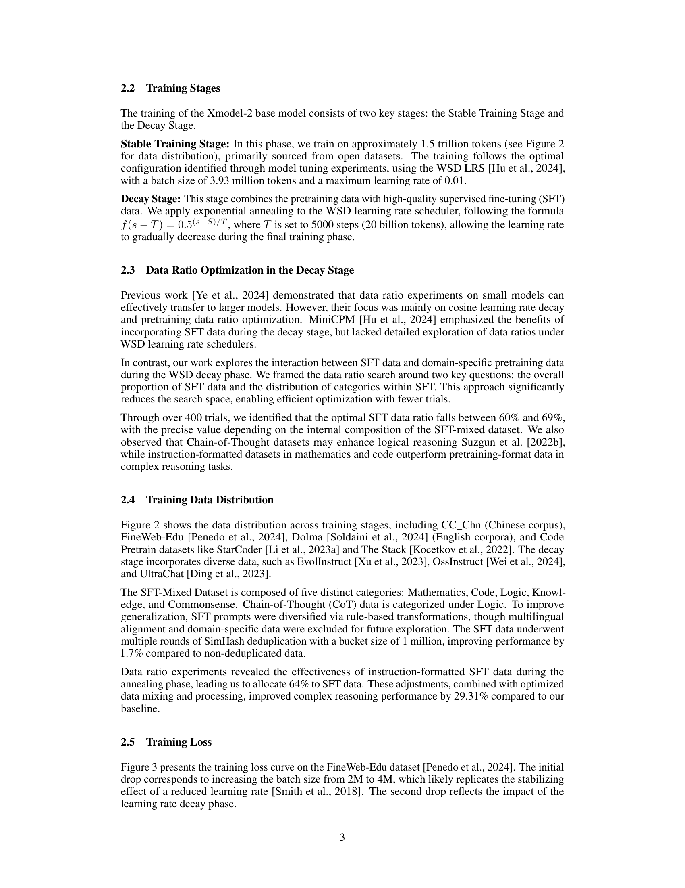
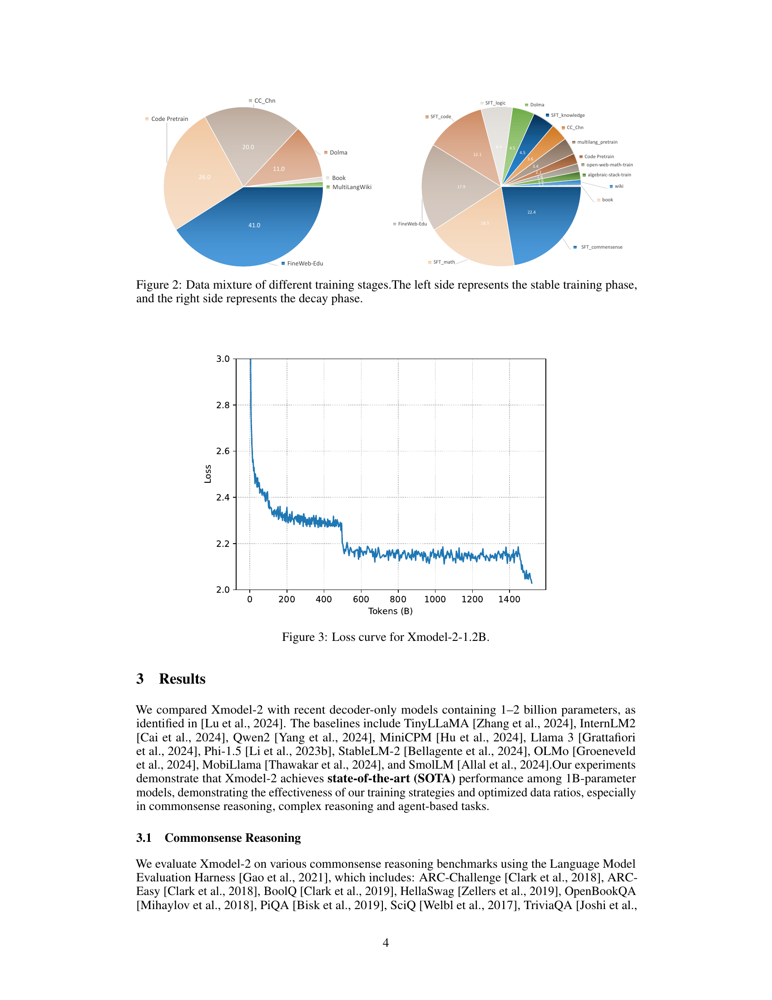
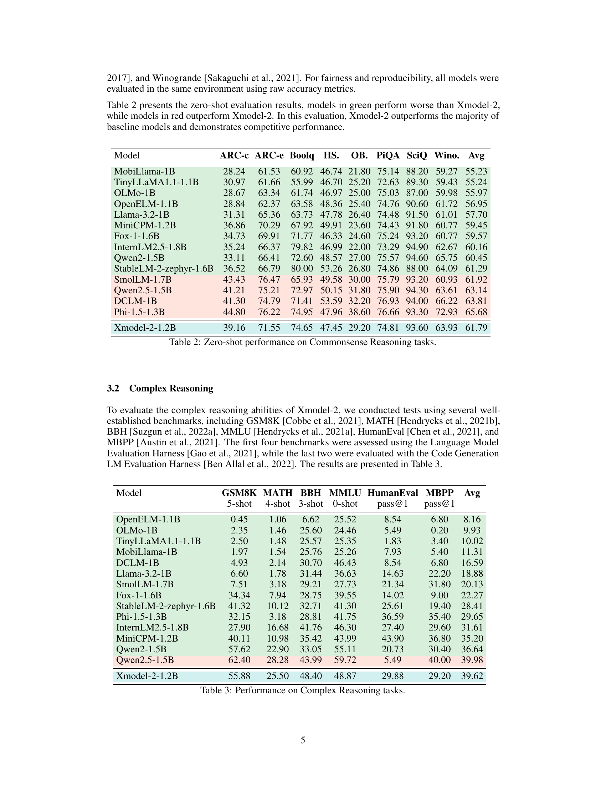
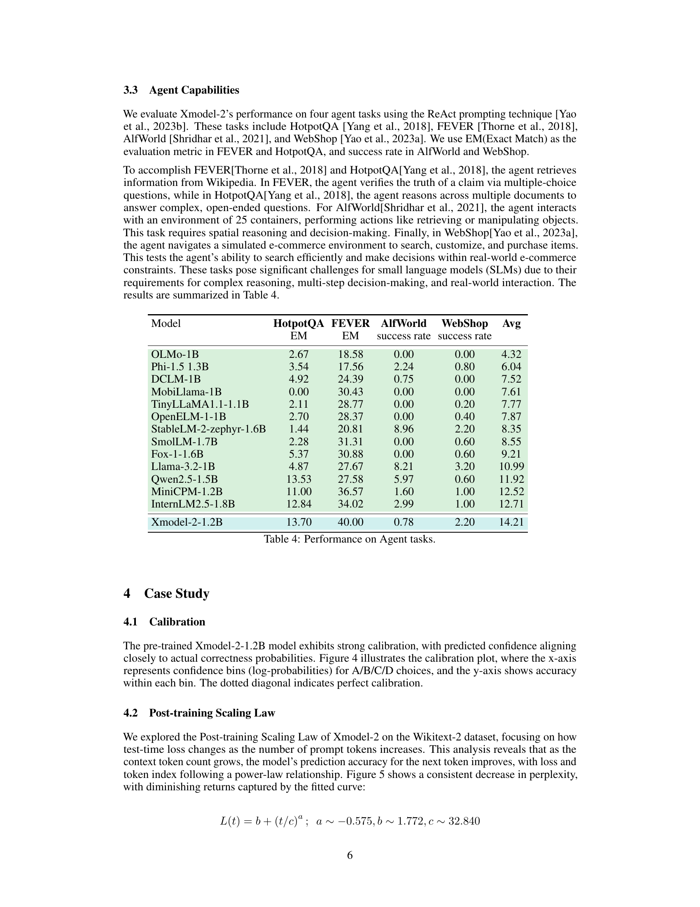
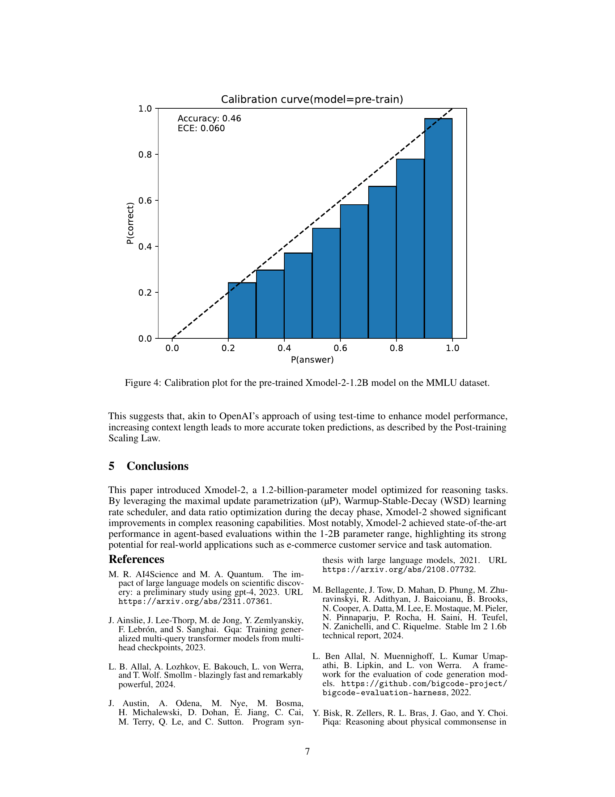
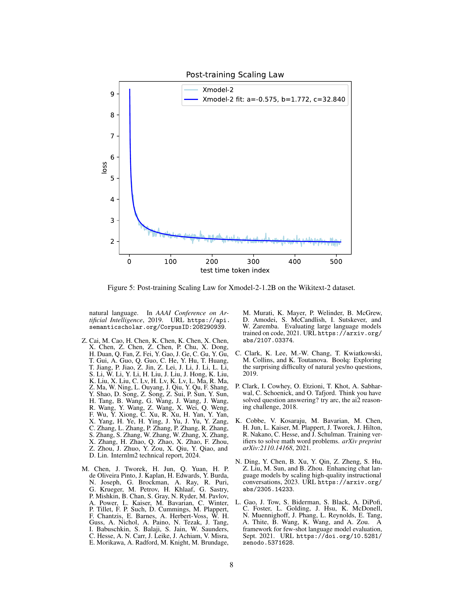
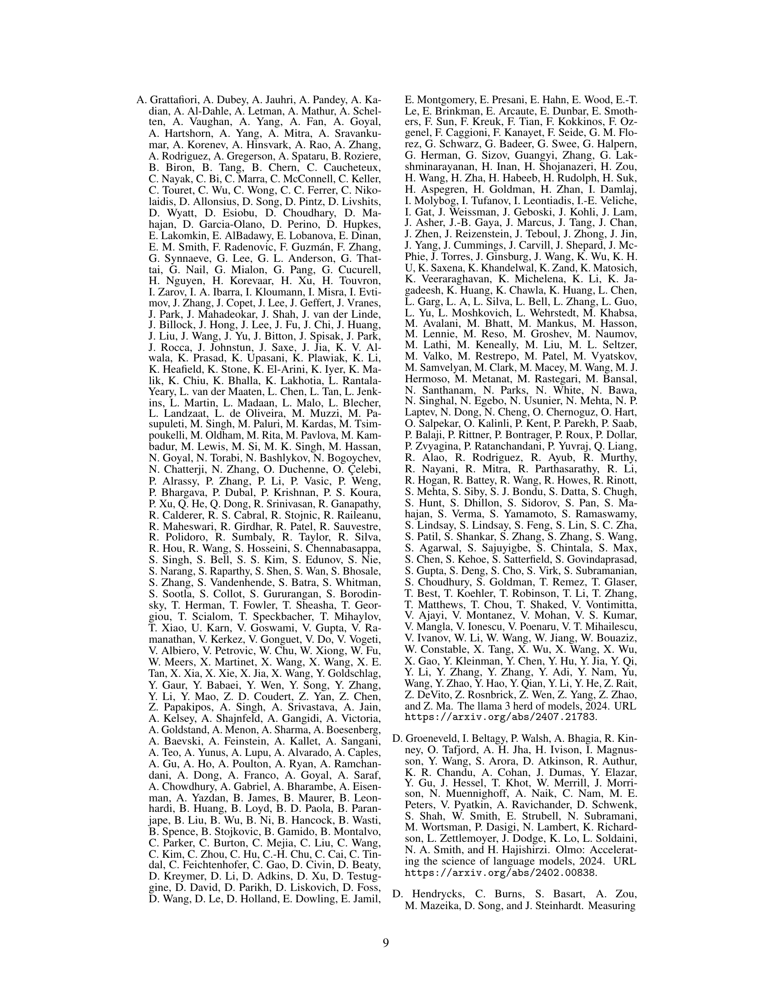
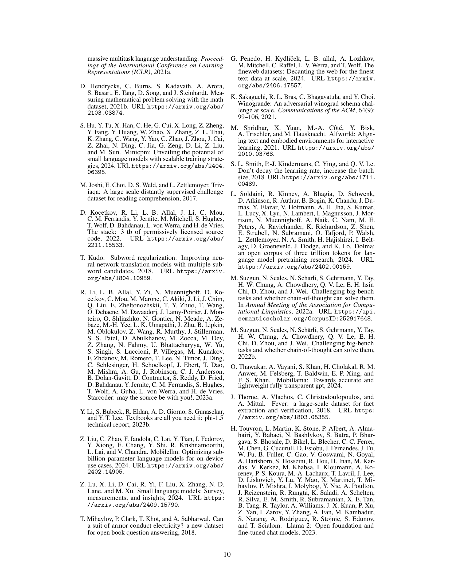
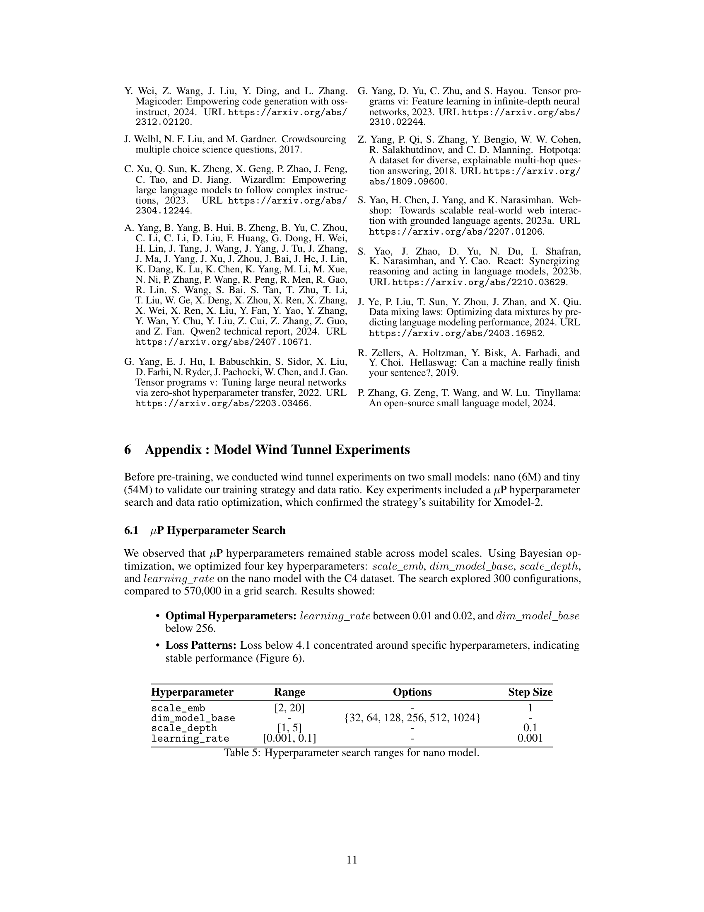
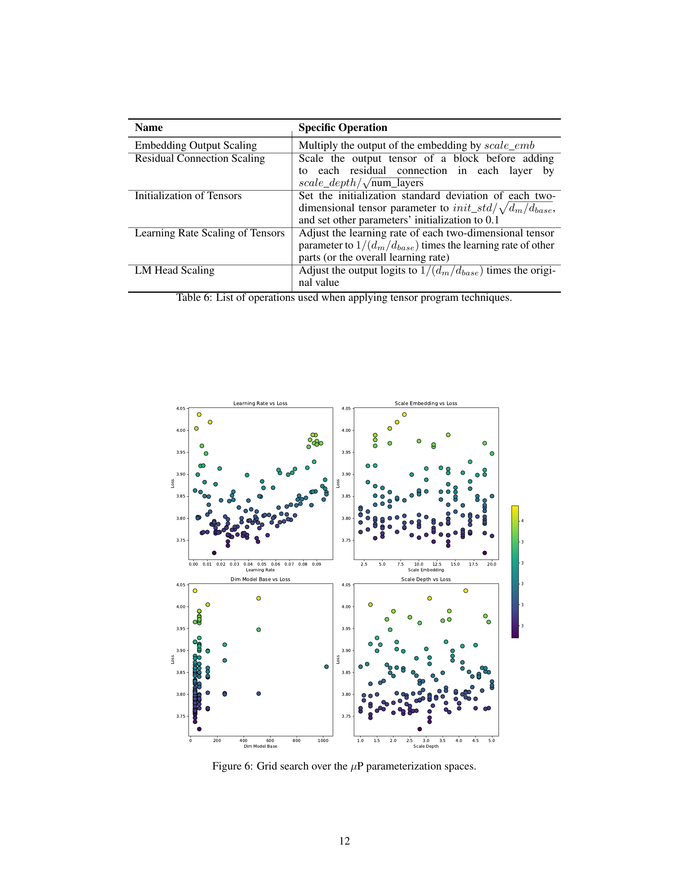
