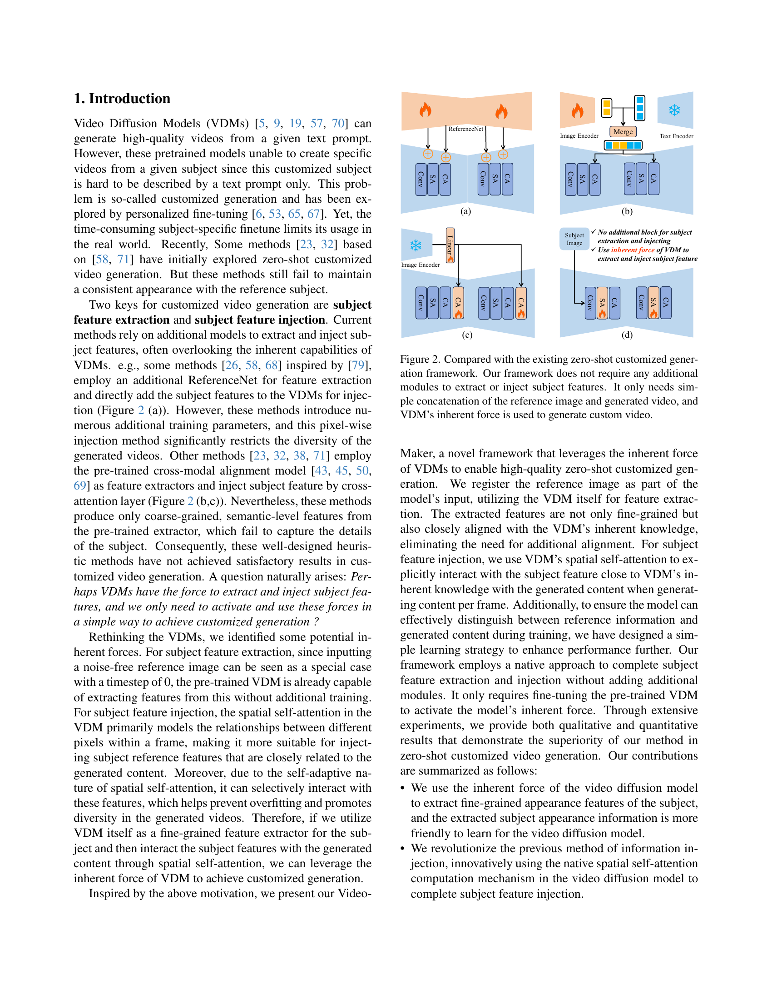

 


 2412.19645 
 Tao Wu et el. 
 
 🤗 2024-12-30 
 



↗ arXiv


↗ Hugging Face


↗ Papers with Code


### TL;DR



기존 제로샷 맞춤형 영상 생성 방법들은 추가 모델을 사용하여 참조 객체 특징을 추출하고 주입하는 방식이었고, 이는 계산 비용이 많이 들고 영상 다양성을 제한하는 문제가 있었습니다. 또한, 기존 방법들은 객체의 일관된 외형을 유지하는 데 어려움이 있었습니다. 

본 논문에서는 **영상 확산 모델(VDM) 자체가 참조 객체 특징을 추출하고 주입하는 능력을 가지고 있다는 것을 밝혀냈습니다.** VideoMaker 프레임워크는 VDM의 고유 기능을 활용하여 참조 이미지를 직접 입력받고, 공간적 자기 주의 메커니즘을 통해 객체 특징과 생성된 영상 콘텐츠 간의 상호 작용을 강화합니다. 이를 통해 추가적인 모델이나 훈련 없이 고품질의 제로샷 맞춤형 영상 생성을 가능하게 하였고, 사람과 사물 영상 생성 실험을 통해 그 효과를 검증하였습니다.



#### Key Takeaways


 제로샷 맞춤형 ì˜ìƒ 생성을 위한 새로운 프레임워크인 VideoMaker 제시 



 ì˜ìƒ 확산 모델의 고유한 기능을 활용, 추가 모델 없이 고품질 ì˜ìƒ 생성 



 사람 ë° 사물 ì˜ìƒ 생성 실험을 통해 프레임워크의 효율성과 성능 검증 


#### Why does it matter?
본 논문은 **영상 확산 모델의 고유한 능력을 활용하여 제로샷 맞춤형 영상 생성을 가능하게 하는 새로운 프레임워크**를 제시합니다. 이는 기존의 휴리스틱 방식을 벗어나, 효율적인 기능을 통해 고품질 영상 생성을 가능하게 하여, **영상 생성 분야의 연구 발전 및 실제 응용에 큰 영향**을 미칠 것으로 예상됩니다. 특히, **제로샷 영상 생성의 성능 향상과 다양한 응용 분야의 확장 가능성**을 제시하며, 앞으로의 연구 방향을 제시합니다.

------
#### Visual Insights

> 🔼 본 그림은 VideoMaker의 시각화 결과를 보여줍니다. VideoMaker는 AnimateDiff [26]를 기반으로 하며, 제로샷(zero-shot) 방식으로 사람과 사물의 영상을 고품질로 생성합니다.  (a)는 사용자 지정 인물 영상 생성의 예시이며, 커피를 마시는 사람, 책을 읽는 사람 등 다양한 상황의 영상이 생성됩니다. (b)는 사용자 지정 사물 영상 생성의 예시로, 노트북을 보는 사람, 기타를 치는 사람, 대나무 숲을 걷는 판다, 들판을 달리는 판다, 길을 걷는 개, 공원에서 달리는 개 등 다양한 장면이 포함되어 있습니다.  각각의 생성된 영상은 참조 이미지(Reference Image)를 기반으로 하여,  VideoMaker가 얼마나 정확하게 사용자 지정 영상을 생성할 수 있는지를 보여줍니다.
> 

> 
read the caption

> Figure 1: Visualization for our VideoMaker. Our method achieves high-fidelity zero-shot customized human and object video generation based on AnimateDiff [26].
> 


| Method | CLIP-T | Face Sim. | CLIP-I | DINO-I | T.Cons. | DD |
|---|---|---|---|---|---|---|
| IP-Adapter | 0.2064 | 0.1994 | 0.7772 | 0.6825 | 0.9980 | 0.1025 |
| IP-Adapter-Plus | 0.2109 | 0.2204 | 0.7784 | 0.6856 | 0.9981 | 0.1000 |
| IP-Adapter-Faceid | 0.2477 | 0.5610 | 0.5852 | 0.4410 | 0.9945 | 0.1200 |
| ID-Animator | 0.2236 | 0.3224 | 0.4719 | 0.3872 | 0.9891 | 0.2825 |
| Photomaker(SDXL) | 0.2627 | 0.3545 | 0.7323 | 0.4579 | 0.9777 | 0.3675 |
| Ours | 0.2586 | 0.8047 | 0.8285 | 0.7119 | 0.9818 | 0.3725 |

> 🔼 표 1은 기존의 사용자 정의 비디오 생성 방법들과 제안된 VideoMaker 방법의 성능을 비교 분석한 표입니다.  사용자 정의 인간 비디오 생성 작업에 대한 정량적 평가 결과를 보여줍니다.  CLIP-T, Face Sim., CLIP-I, DINO-I, T. Cons., DD 등 여러 지표를 사용하여 전반적인 일관성과 주제 충실도를 평가합니다.  각 지표의 최고 및 차고 성능은 각각 굵은 글씨체와 밑줄로 표시되어 VideoMaker의 우수성을 강조합니다.  본 표는 제안된 방법의 효과를 수치적으로 보여주는 핵심 결과를 제시합니다.
> 

> 
read the caption

> Table 1: Comparison with the existing methods for customized human video generation. The best and the second-best results are denoted in bold and underlined, respectively.
> 

### In-depth insights

#### VDM's Inherent Force
본 논문에서 제시된 'VDM의 고유한 힘(VDM's Inherent Force)'이라는 개념은 기존의 영상 생성 모델들이 추가적인 모듈이나 사전 훈련된 모델에 의존하는 것과 달리, **비디오 확산 모델(VDM) 자체가 지니고 있는 고유한 특징 추출 및 주입 능력**에 주목하는 데 있습니다.  이는 단순히 기존의 휴리스틱한 접근 방식을 넘어, VDM의 내재적 역량을 활용하여 제로샷 맞춤형 영상 생성을 가능하게 하는 핵심 아이디어입니다.  **특징 추출 과정에서 참조 이미지를 직접 VDM에 입력하여 미세한 특징을 추출**하고, **특징 주입 과정에서 VDM 내부의 공간적 자기 주의 메커니즘을 활용**하여 생성된 콘텐츠와 주제 특징 간의 상호작용을 강화하는 방식입니다. 이러한 접근 방식은 추가적인 모듈이나 매개변수 없이도 높은 성능을 달성할 수 있다는 점에서 매우 효율적이며, **VDM의 사전 훈련된 지식과의 정합성을 높여 생성 영상의 일관성과 질을 향상**시키는 데 기여합니다.  결론적으로, 'VDM의 고유한 힘'은 VDM의 내재적 잠재력을 최대한 활용하여 제로샷 맞춤형 영상 생성 문제를 효과적으로 해결하는 혁신적인 접근 방식이라 할 수 있습니다.

#### Zero-shot VideoGen
제로샷 비디오 생성(Zero-shot VideoGen)은 사전 훈련된 비디오 생성 모델을 사용하여 별도의 미세 조정 없이 다양한 비디오를 생성하는 혁신적인 기술입니다. **핵심은 모델이 본 적 없는 새로운 개체 또는 상황에 대한 비디오를 생성하는 능력**에 있습니다. 이는 기존의 방식처럼 특정 개체에 대한 데이터셋을 수집하여 모델을 훈련시키는 번거로운 과정을 생략할 수 있게 해줍니다.  하지만 이러한 제로샷 접근 방식은 모델의 일반화 능력에 크게 의존하며, **개체의 외형이나 동작을 정확하게 유지하는 데 어려움**을 겪을 수 있습니다. 따라서 제로샷 비디오 생성의 성능은 모델의 아키텍처, 사전 훈련 데이터의 질과 양, 그리고 제로샷 생성을 위한 기술적 접근 방식에 따라 크게 달라집니다.  **성능 향상을 위해서는 더욱 강력한 비디오 생성 모델과 효과적인 제로샷 학습 방법론의 개발**이 필수적입니다.  이 분야는 컴퓨터 비전과 딥러닝 분야의 발전과 함께 빠르게 진화하고 있으며, 향후 다양한 분야에서의 활용이 기대됩니다.

#### Feature Injection
본 논문에서 제시하는 "특징 주입(Feature Injection)"은 기존의 단순히 추가적인 모듈을 통해 특징을 주입하는 방식과는 달리, **비디오 확산 모델(VDM) 자체의 공간적 자기 주의 메커니즘을 활용**하여 이루어집니다.  이는 기존의 방식이 가진 한계점, 즉 추가적인 학습 파라미터 증가 및 생성 영상 다양성 감소 문제를 해결하기 위한 핵심 전략입니다.  **VDM의 공간적 자기 주의는 프레임 내 픽셀 간 관계를 모델링**하는 데 효과적이며,  이를 통해 참조 이미지의 특징을 생성 콘텐츠와 효과적으로 상호작용시켜 **주체의 외형 일관성을 유지하면서도 다양한 생성 영상을 만들 수 있습니다.**  즉, VDM이 이미 가지고 있는 능력을 활용하여 추가적인 모듈 없이도 효과적인 특징 주입을 실현한다는 점이 핵심입니다.  **단순한 픽셀 단위 주입이 아닌,  상호작용적이고 정교한 특징 융합**을 통해  더욱 자연스럽고 현실적인 영상 생성을 가능하게 합니다. 이러한 접근 방식은 모델의 효율성을 높이고,  다양하고 고품질의 영상 생성을 가능하게 하는 중요한 기여를 합니다.

#### Ablation Study
본 논문의 ablation study는 제안된 VideoMaker 프레임워크의 각 구성 요소의 중요성을 객관적으로 평가하기 위해 **체계적으로 설계**되었습니다.  **개별 모듈의 기여도**를 정량적으로 분석하여 모델 성능에 미치는 영향을 파악하고, **전반적인 성능 향상**에 어떤 요소가 가장 크게 기여했는지 명확히 밝히는 데 초점을 맞추고 있습니다.  특히, 개선된 주의 메커니즘,  지도 정보 인식 손실 함수, 그리고 전처리 과정 등의 효과를 면밀히 분석하여, 각 구성 요소가 최종 성능에 미치는 영향을 분리하여 제시함으로써, **모델의 강건성과 신뢰성을 높이는 데 기여**합니다.  결과적으로, ablation study는 VideoMaker의 설계 원칙과 성능 향상에 대한 심층적인 이해를 제공하여,  향후 연구 방향에 대한 귀중한 통찰력을 제공합니다.  **실험 결과를 통해 제안된 방법의 유효성과 개별 구성 요소의 중요도를 명확히 함으로써**, VideoMaker의 우수성을 더욱 뒷받침합니다.

#### Future Directions
본 논문의 VideoMaker는 영상 확산 모델의 고유한 능력을 활용하여 제로샷 맞춤형 영상 생성을 달성하지만, 여전히 개선의 여지가 많습니다. **미래 연구 방향**으로는 첫째, **더욱 다양하고 정교한 영상 생성**을 위해 더욱 강력한 기반 모델을 활용하는 것을 고려할 수 있습니다. 현재 AnimateDiff 모델에 기반한 VideoMaker는 얼굴이나 사물의 세밀한 부분 표현에 한계를 보입니다.  둘째, **다중 주체의 동시 제어**가 가능하도록 모델을 확장하는 연구가 필요합니다. 현재는 단일 주체만을 처리하는 데 초점을 맞추고 있기 때문에, 보다 복잡하고 현실적인 시나리오를 다루는 데 어려움이 있습니다.  셋째, **훈련 데이터셋의 개선** 또한 중요한 과제입니다.  더욱 다양하고 고품질의 데이터셋을 확보함으로써 모델의 성능과 일반화 능력을 향상시킬 수 있을 것입니다.  마지막으로, **윤리적 문제**에 대한 고려가 필수적입니다.  고품질 영상 생성 기술은 개인 정보 보호 및 악의적인 사용 가능성과 같은 윤리적 문제를 야기할 수 있으므로, 이에 대한 면밀한 검토와 대응 방안 마련이 중요합니다. 이러한 미래 연구 방향들을 통해 VideoMaker는 더욱 발전하여 다양한 분야에서 활용될 수 있을 것입니다.

### More visual insights

More on figures

> 🔼 그림 2는 제로샷 맞춤형 비디오 생성 프레임워크에 대한 기존 방법과 제안하는 방법을 비교하여 보여줍니다. 기존 방법들은 주제 특징을 추출하고 주입하기 위해 추가적인 모듈(ReferenceNet 또는 cross-modal alignment model)을 필요로 합니다. 반면에, 본 논문에서 제안하는 VideoMaker 프레임워크는 참조 이미지와 생성된 비디오를 단순히 연결하는 것만으로 주제 특징을 추출하고 주입할 수 있습니다.  VDM(Video Diffusion Model)의 고유한 힘을 활용하여 추가적인 모듈 없이도 고품질의 맞춤형 비디오를 생성할 수 있음을 보여줍니다.  즉, 기존 방법과 달리 추가적인 학습이나 복잡한 구조 없이도 VDM 자체의 기능만으로 주제 특징을 효과적으로 활용하여 비디오 생성을 수행할 수 있음을 강조합니다.
> 

> 
read the caption

> Figure 2: Compared with the existing zero-shot customized generation framework. Our framework does not require any additional modules to extract or inject subject features. It only needs simple concatenation of the reference image and generated video, and VDM’s inherent force is used to generate custom video.
> 

> 🔼 본 논문의 그림 3은 VideoMaker의 전체 파이프라인을 보여줍니다. 기존의 영상 생성 모델(VDM)에 참조 이미지를 직접 입력하여 미세한 특징을 추출하고, 공간적 자기 주의 메커니즘(spatial self-attention) 계산을 수정하여 특징 주입을 가능하게 합니다. 또한, 참조 특징과 생성된 콘텐츠를 구별하기 위해, 안내 정보 인식 손실(Guidance Information Recognition Loss)을 설계하여 학습 전략을 최적화합니다. 이는 참조 이미지의 특징을 효율적으로 추출하고, 생성 과정에서 참조 특징과 생성 콘텐츠 간의 균형을 유지하여 고품질의 맞춤형 영상 생성을 가능하게 하는 VideoMaker의 핵심적인 구성 요소들을 보여줍니다.
> 

> 
read the caption

> Figure 3: Overall pipeline of VideoMaker. We directly input the reference image into VDM and use VDM’s modules for fine-grained feature extraction. We modified the computation of spatial self-attention to enable feature injection. Additionally, to distinguish between reference features and generated content, we designed the Guidance Information Recognition Loss to optimize the training strategy.
> 

> 🔼 본 그림은 VideoBooth [32] 모델이 생성한 영상과 비교하여, 제안된 VideoMaker 모델이 생성한 영상의 질적 비교를 보여줍니다. VideoBooth 모델이 생성한 영상이 흐릿한 반면, VideoMaker 모델이 생성한 영상은 더욱 세밀하고 디테일한 정보를 담고 있음을 시각적으로 보여줍니다.  특히 사물의 질감과 외형이 더욱 선명하고 명확하게 나타나, 주어진 객체에 대한 정확하고 세부적인 묘사가 가능함을 확인할 수 있습니다.
> 

> 
read the caption

> Figure 4: Qualitative comparison for customized object video generation. Compared with the blurry videos generated by VideoBooth [32], our generated videos have more details.
> 

> 🔼 그림 5는 사용자 지정 인간 비디오 생성에 대한 정성적 비교 결과를 보여줍니다. 본 논문의 방법을 IP-Adapter [71], ID-Animator [23], PhotoMaker [38]과 비교하여 고품질 비디오 생성, 편집 가능성 및 주제 충실도 측면에서 우수함을 보여줍니다. 각 방법은 세 가지 다른 프롬프트(문구)에 대해 생성된 비디오의 일부 프레임들을 보여주고 있습니다.  본 논문의 방법은 주제의 외모를 일관되게 유지하면서 다양한 동작과 배경을 생성하는 능력을 보여줍니다. 다른 방법들은 주제의 외모가 일관되지 않거나 프롬프트에 명시된 동작을 제대로 반영하지 못하는 등의 문제점을 보입니다.
> 

> 
read the caption

> Figure 5: Qualitative comparison for customized human video generation. We compare our method with IP-Adapter [71], ID-Animator [23] and PhotoMaker [38]. We observe that our method achieves high-quality generation, promising editability, and subject fidelity.
> 

> 🔼 본 그림은 논문에서 제시된 사용자 정의 인간 비디오 생성을 테스트하기 위해 사용된 유명인 데이터셋의 개요를 보여줍니다.  여러 유명인의 다양한 자세와 표정을 담은 이미지들이 여러 행에 걸쳐 나열되어 있습니다. 각 이미지는 사용자 정의 비디오 생성을 위한 참조 이미지로 사용되었음을 시사합니다. 이 그림은 논문에서 제안하는 모델이 얼마나 다양한 유명인의 모습을 생성할 수 있는지를 보여주는 예시를 제공합니다.
> 

> 
read the caption

> Figure 1: The overview of the celebrity dataset we use to test customized human video generation.
> 

> 🔼 이 그림은 논문에서 사용된 사용자 정의 객체 비디오 생성에 대한 테스트 데이터셋을 보여줍니다.  각 범주(곰, 자동차, 고양이, 개, 코끼리, 말, 사자, 팬더, 호랑이)에 대해 두 개의 대표적인 비디오가 포함되어 있습니다. 각 비디오는 특정 객체의 다양한 동작이나 환경을 보여주는 프레임의 시퀀스입니다. 이 데이터셋은 모델이 객체의 시각적 특징을 인식하고 일관된 시각적 표현으로 생성하는 능력을 평가하기 위해 사용되었습니다. 각 범주에 다양한 동작과 배경을 가진 여러 비디오가 있음을 시각적으로 확인할 수 있습니다.
> 

> 
read the caption

> Figure 2: The overview of the dataset we use to test customized object video generation.
> 

> 🔼 이 그림은 논문의 5.1절 실험 설정 부분에서 사용된 비 유명인 데이터셋을 보여줍니다.  논문에서는 유명인 데이터셋을 사용한 실험과의 비교를 위해,  인터넷에서 최근에 업로드된 사진들 중 공개 라이선스가 있는 16개의 사진을 선택하여 비 유명인 데이터셋을 구성했습니다.  이 그림은 그 데이터셋의 사진들을 보여주는 것으로,  각 사진은 사용자 정의 비디오 생성 작업의 참조 이미지로 사용되었습니다.  데이터셋 사진들의 다양성은 다양한 설정과 의상, 배경 등을 포함하여 테스트의 범위를 넓히기 위함입니다.
> 

> 
read the caption

> Figure 3: The overview of the non-celebrity dataset we used for testing customized human video generation.
> 

> 🔼 그림 4는 사용자 연구를 통해 얻은 결과를 보여주는 그래프입니다. 사용자들은 사용자 정의 인간 비디오 생성에 대한 다양한 방법들(IP-Adapter, ID-Animator, PhotoMaker 및 VideoMaker)이 생성한 비디오의 품질을 평가했습니다. 그래프는 각 방법에 대한 사용자 선호도 비율을 주제 충실도, 텍스트 일치, 모션 일치 및 전반적인 품질의 네 가지 측면에서 보여줍니다. VideoMaker는 네 가지 모든 측면에서 가장 높은 선호도를 얻었습니다. 이는 VideoMaker가 인간 비디오를 생성하는 데 가장 효과적인 방법임을 보여줍니다.
> 

> 
read the caption

> Figure 4: User Study for Customized Human Video Generation.
> 

> 🔼 그림 5는 사용자 연구를 통해 얻은 사용자 선호도를 보여주는 막대 그래프입니다. 사용자들은 사용자 정의 객체 비디오 생성 작업에서 VideoMaker와 VideoBooth 두 가지 방법을 비교 평가했습니다.  각 방법에 대한 텍스트 정렬, 객체 충실도, 모션 정렬, 전반적 품질 네 가지 측면에서 사용자 선호도를 평가했습니다. 그래프는 VideoMaker가 VideoBooth보다 모든 측면에서 더 높은 선호도를 받았음을 보여줍니다.
> 

> 
read the caption

> Figure 5: User Study for Customized Object Video Generation.
> 

> 🔼 그림 6은 유명인 데이터셋을 사용한 사용자 지정 인간 비디오 생성에 대한 정성적 비교 결과를 보여줍니다.  IP-Adapter, ID-Animator, PhotoMaker 세 가지 기존 방법과 VideoMaker의 결과를 비교하여, 각 방법이 생성한 비디오의 시각적 품질, 특히 얼굴 표정, 의상 및 배경과 같은 세부 사항의 정확도를 보여줍니다.  각 열은 다른 프롬프트(예: 꽃다발을 들고 있는 사람, 슈퍼맨 복장을 한 사람, 카페에서 커피를 마시는 사람)에 대한 결과를 나타내고, 각 행은 다른 방법의 결과를 나타냅니다. 이 그림은 VideoMaker가 기존 방법보다 더 사실적이고 디테일한 비디오를 생성할 수 있음을 시각적으로 보여줍니다.
> 

> 
read the caption

> Figure 6: More Qualitative comparison for customized human video generation on celebrity dataset.
> 

> 🔼 이 그림은 논문의 저자들이 비유명인 데이터셋을 사용하여 사용자 정의 비디오 생성을 정성적으로 비교 분석한 결과를 보여줍니다.  기존 방법들(IP-Adapter, ID-Animator, PhotoMaker)과 저자들이 제안한 VideoMaker 모델의 성능을 다양한 시나리오(옷, 액션, 배경 등)에서 비교하여, VideoMaker가 주제의 일관성과 세부적인 외모 묘사 측면에서 더 나은 결과를 생성함을 보여줍니다.  각 열은 특정 프롬프트에 대한 생성 결과를 보여주고, 각 행은 비교되는 다른 모델들을 보여줍니다.
> 

> 
read the caption

> Figure 7: More Qualitative comparison for customized human video generation on non-celebrity dataset.
> 

> 🔼 그림 8은 논문의 실험 결과 중 하나로, 유명인이 아닌 일반인의 이미지를 사용하여 사용자 지정 비디오 생성 결과를 보여줍니다.  IP-Adapter, ID-Animator, PhotoMaker 세 가지 기존 방법과 제안된 VideoMaker 방법의 비교 결과를 보여주며, 각 방법의 비디오 생성 품질(정확도, 일관성, 자연스러움 등)을 시각적으로 비교 분석합니다.  세 가지 다른 프롬프트(입력)에 대한 각 방법의 생성 결과를 보여주어, 제안된 VideoMaker 방법이 얼마나 더 나은 성능을 보이는지 보여줍니다.  특히, 사람의 얼굴 표정, 옷차림, 배경 등의 세부적인 부분을 얼마나 정확하게 생성하는지 비교함으로써, VideoMaker의 우수성을 강조합니다.
> 

> 
read the caption

> Figure 8: More Qualitative comparison for customized human video generation on non-celebrity dataset.
> 

More on tables


| Method | CLIP-T | CLIP-I | DINO-I | T.Cons. | DD |
|---|---|---|---|---|---| 
| VideoBooth | 0.266 | 0.7637 | 0.6658 | 0.9564 | 0.5091 |
| Ous | 0.284 | 0.8071 | 0.7326 | 0.9848 | 0.5132 |
> 🔼 표 2는 논문의 실험 결과 중 사용자 정의 객체 비디오 생성에 대한 비교 결과를 보여줍니다. 기존의 방법들(VideoBooth)과 제안된 방법(Ours)을 비교하여, CLIP-T, CLIP-I, DINO-I, 시간 일관성(T.Cons.), 동적 정도(DD) 지표를 사용하여 정량적으로 평가합니다.  각 지표는 생성된 비디오의 텍스트 정합도, 객체 충실도, 동작의 일관성 및 역동성을 나타냅니다.  표를 통해 제안된 방법이 기존 방법보다 더 우수한 성능을 보임을 확인할 수 있습니다.
> 

> 
read the caption

> Table 2: Comparison with the existing methods for customized object video generation
> 


| PISA | GIRL | W/O Cross | Update Motion | SHP | CLIP-T | Face Sim. | CLIP-I | DINO-I | T.Cons. | DD |
|---|---|---|---|---|---|---|---|---|---|---|
| ✓ |  |  |  |  | 0.2206 | 0.7928 | 0.7966 | 0.6694 | 0.9671 | 0.2725 |
| ✓ | ✓ |  |  |  | 0.2258 | 0.8184 | 0.8484 | 0.7536 | 0.9855 | 0.2750 |
| ✓ | ✓ | ✓ |  |  | 0.2291 | 0.8454 | 0.8469 | 0.7351 | 0.9747 | 0.2915 |
| ✓ | ✓ | ✓ | ✓ |  | 0.2302 | 0.8563 | 0.8674 | 0.7635 | 0.9823 | 0.3575 |
| ✓ | ✓ | ✓ | ✓ | ✓ | 0.2586 | 0.8047 | 0.8285 | 0.7119 | 0.9818 | 0.3725 |
> 🔼 표 3은 제안된 VideoMaker 모델의 각 구성 요소(Personalized Injection Self-Attention(PISA), Guidance Information Recognition Loss(GIRL), 참조 프레임과 텍스트 프롬프트 간의 상호작용 여부(W/O Cross), 모션 블록 업데이트 여부(Update Motion), 데이터 전처리(SHP))의 정량적 결과를 보여줍니다. 각 구성 요소의 영향을 분석하여 모델 성능 향상에 기여하는 부분을 명확히 제시합니다.
> 

> 
read the caption

> Table 3: Quantitative results of each component. “PISA” is our Personalized Injection Self Attention, GIRL is our Guidance Information Recognition Loss, “W/O Cross” refers to whether our reference frame interacts with the text prompt, “Update Motion” refers to whether to update the motion block, “SHP” is our subject highlight preprocessing for datasets,
> 


| Category | Prompt |
|---|---| 
| Clothing | A person dressed in a crisp white button-up shirt. |
|  | A person in a sleeveless workout top, displaying an active lifestyle. |
|  | A person wearing a sequined top that sparkles under the light, ready for a festive occasion. |
|  | A person wearing a Superman outfit. |
|  | A person wearing a blue hoodie. |
| Action | A person holding a book open, reading a book, sitting on a park bench. |
|  | A person playing an acoustic guitar. |
|  | A person laughing with their head tilted back, eyes sparkling with mirth. |
|  | A person is enjoying a cup of coffee in a cozy café. |
|  | A person watching a laptop, focused on the task at hand. |
| Accessory | A person wearing a headphones, engaged in a hands-free conversation. |
|  | A person with a pair of trendy headphones around their neck, a music lover’s staple. |
|  | A person with a beanie hat and round-framed glasses, portraying a hipster look. |
|  | A person wearing sunglasses. |
|  | A person wearing a Christmas hat. |
| View | A person captured in a close-up, their eyes conveying a depth of emotion. |
|  | A person framed against the sky, creating an open and airy feel. |
|  | A person through a rain-streaked window, adding a layer of introspection. |
|  | A person holding a bottle of red wine. |
|  | A person riding a horse. |
| Background | A person is standing in front of the Eiffel Tower. |
|  | A person with a bustling urban street scene behind them, capturing the energy of the city. |
|  | A person standing before a backdrop of bookshelves, indicating a love for literature. |
|  | A person swimming in the pool |
|  | A person stands in the falling snow scene at the park. |
> 🔼 표 1은 사용자 지정 인간 비디오 생성을 위한 평가 텍스트 프롬프트를 보여줍니다.  각 행은 의류, 액세서리, 동작, 시점, 배경이라는 다섯 가지 범주 중 하나에 속하는 프롬프트를 포함하고 있습니다.  각 범주 내에서 다양한 설명을 제공하여 비디오 생성 모델이 다양한 조건에서 얼마나 잘 작동하는지 평가할 수 있도록 합니다. 이 표의 목적은 인간 비디오 생성 작업에 대한 다양한 시나리오를 제시하여 모델의 일반화 및 세부 묘사 능력을 테스트하는 것입니다.
> 

> 
read the caption

> Table 1: Evaluation text prompts for customized human video generation.
> 


| Method | CLIP-T | Face Sim. | CLIP-I | DINO-I | T.Cons. | DD |
|---|---|---|---|---|---|---|
| IP-Adapter | 0.2347 | 0.1298 | 0.6364 | 0.5178 | 0.9929 | 0.0825 |
| IP-Adapter-Plus | 0.2140 | 0.2017 | 0.6558 | 0.5488 | 0.9920 | 0.0815 |
| IP-Adapter-Faceid | 0.2457 | 0.4651 | 0.6401 | 0.4108 | 0.9930 | 0.0950 |
| ID-Animator | 0.2303 | 0.1294 | 0.4993 | 0.0947 | 0.9999 | 0.2645 |
| Photomaker* | 0.2803 | 0.2294 | 0.6558 | 0.3209 | 0.9768 | 0.3335 |
| Ours | 0.2773 | 0.6974 | 0.6882 | 0.5937 | 0.9797 | 0.3590 |
> 🔼 표 2는 논문에서 제시된 비유명인 데이터셋을 사용하여 사용자 지정 인간 비디오 생성에 대한 기존 방법들과의 비교 결과를 보여줍니다.  표는 CLIP-T, Face Similarity, CLIP-I, DINO-I, Temporal Consistency, DD 등 여섯 가지 지표를 사용하여 모델 성능을 평가합니다. 각 지표는 비디오의 일관성과 주제 충실도를 다양한 측면에서 평가하며, 최고 및 차순위 결과는 굵은 글씨와 밑줄로 표시되어 있습니다.  PhotoMaker [38] 모델은 AnimateDiff [25] SDXL 버전을 기반으로 함을 주목해야 합니다. 이 표는 제안된 VideoMaker 모델의 성능을 기존 방법들과 비교하여 모델의 효과성을 보여주는 데 중점을 둡니다.
> 

> 
read the caption

> Table 2: Comparison with the existing methods for customized human video generation on our non-celebrity dataset. The best and the second-best results are denoted in bold and underlined, respectively. Besides, PhotoMaker [38] is base on AnimateDiff [25] SDXL version.
> 


| Category | Prompt | Category | Prompt |
|---|---|---|---| 
| bear | A bear walking through a snowy landscape. | car | A car cruising down a scenic coastal highway at sunset. |
|  | A bear walking in a sunny meadow. |  | A car silently gliding through a quiet residential area. |
|  | A bear resting in the shade of a large tree. |  | A car smoothly merging onto a highway. |
|  | A bear walking along a beach. |  | A car driving along a desert road. |
|  | A bear fishing in a rushing river. |  | A car speeding through a muddy forest trail. |
|  | A bear running in the forest. |  | A car drifting around a sharp corner on a mountain road. |
|  | A bear walking along a rocky shoreline. |  | A car navigating through a snow-covered road. |
|  | A bear drinking from a clear mountain stream. |  | A car driving through a tunnel with bright lights. |
|  | A bear standing on its hind legs to look around. |  | A car driving through a beach. |
|  | A bear running on the grass. |  | A car driving through a foggy forest road. |
| cat | A cat is perched on a bookshelf, silently observing the room below. | dog | A dog is lying on a fluffy rug, its tail curled neatly around its body. |
|  | A cat is sitting in a cardboard box, perfectly content in its makeshift fortress. |  | A dog is walking on a street. |
|  | A cat is curled up in a human’s lap, purring softly as it enjoys being petted. |  | A dog is swimming. |
|  | A cat is circle around a food bowl in a room, patiently waiting for mealtime. |  | A dog is sitting in a window, watching the raindrops race down the glass. |
|  | A cat is lying on a windowsill, its silhouette framed by the setting sun. |  | A dog is running. |
|  | A cat is running on the grass. |  | A dog, a golden retriever, is seen bounding joyfully towards the camera. |
|  | A cat is walking on a street. There are many buildings on both sides of the street. |  | A dog is seen leaping into a sparkling blue lake, creating a splash. |
|  | A cat is sitting in a window, watching the raindrops race down the glass. |  | A dog is seen in a snowy backyard. |
|  | A cat is playing with a ball of wool on a child bed. |  | A dog is seen napping on a cozy rug. |
|  | A cat is playing in the snow, rolling and rolling, snowflakes flying. |  | A dog is seen playing tug-of-war with a rope toy against a small child. |
| elephant | An elephant walking through the jungle. | horse | A horse walking through a dense forest. |
|  | An elephant crossing a river. |  | A horse running across a grassy meadow. |
|  | An elephant walking on the grass. |  | A horse walking along a sandy beach. |
|  | An elephant walking on a road. |  | A horse running through a shallow stream. |
|  | An elephant walking along a dirt road. |  | A horse walking on a mountain trail. |
|  | An elephant playing in a mud pit. |  | A horse running across a desert landscape. |
|  | An elephant walking through a dense jungle. |  | A horse walking through a quiet village. |
|  | An elephant walking along a sandy beach. |  | A horse running in an open field. |
|  | An elephant running through a meadow of wildflowers. |  | A horse walking along a forest path. |
|  | An elephant running across a desert landscape. |  | A horse running through tall grass. |
| lion | A lion running along a savannah at dawn. | panda | A panda walking through a bamboo forest. |
|  | A lion walking through a dense jungle. |  | A panda running on a grassy meadow. |
|  | A lion running on a snowy plain. |  | A panda running through a field of wildflowers. |
|  | A lion running along a rocky coastline. |  | A panda walking through a snowy landscape. |
|  | A lion walking through a field of sunflowers. |  | A panda walking through a city park. |
|  | A lion running across a grassy hilltop. |  | A panda walking in front of the Eiffel Tower. |
|  | A lion walking through a grassland. |  | A panda wandering through a dense jungle. |
|  | A lion running along a riverbank. |  | A panda running along a sandy beach. |
|  | A lion walking on a savannah during sunrise. |  | A panda exploring a cave. |
|  | A lion running on a plain. |  | A panda is eating bamboo. |
| tiger | A tiger running along a savannah at dawn. | tiger | A tiger running across a grassy hilltop. |
|  | A tiger walking through a dense jungle. |  | A tiger walking through a grassland. |
|  | A tiger running on a snowy plain. |  | A tiger running along a riverbank. |
|  | A tiger running along a rocky coastline. |  | A tiger walking on a savannah during sunrise. |
|  | A tiger walking through a field of sunflowers. |  | A tiger running on a plain. |
> 🔼 표 3은 사용자 정의 객체 비디오 생성을 위한 평가 텍스트 프롬프트를 보여줍니다. 이 표에는 9가지 객체 범주(곰, 자동차, 고양이, 개, 코끼리, 말, 사자, 판다, 호랑이) 각각에 대해 10개의 고유한 텍스트 프롬프트가 포함되어 있습니다. 각 프롬프트는 특정한 행동, 위치, 배경 등으로 객체의 시각적 특성을 설명하며, 이를 통해 사용자 정의 객체 비디오 생성 모델의 성능을 다양한 상황에서 평가할 수 있습니다.
> 

> 
read the caption

> Table 3: Evaluation text prompts for customized object video generation.
> 

### Full paper



