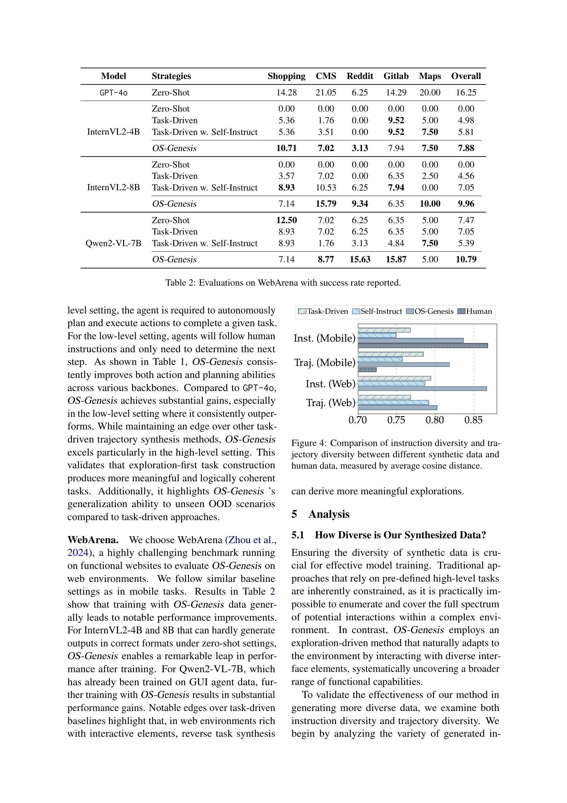

 


 2412.19723 
 Qiushi Sun et el. 
 
 🤗 2025-01-02 
 



↗ arXiv


↗ Hugging Face


↗ Papers with Code


### TL;DR



기존의 GUI 에이전트 학습은 **고품질 궤적 데이터 수집의 어려움**에 직면해왔습니다. 사람의 개입이나 사전 정의된 작업에 의존하는 기존 방법들은 비용이 많이 들고 데이터 품질과 다양성을 보장하기 어려웠습니다.  이러한 문제는 디지털 자동화 기술 발전에 걸림돌이 되어왔습니다.

본 논문에서는 **OS-Genesis** 라는 새로운 GUI 데이터 합성 파이프라인을 제시합니다. OS-Genesis는 **역방향 작업 합성**이라는 혁신적인 방법을 통해, 에이전트가 환경을 탐색하고 상호작용하는 과정에서 **자동적으로 고품질의 궤적 데이터를 생성**합니다.  **사람의 개입이나 사전 정의된 작업 없이도 고품질 데이터를 생성**할 수 있으며, 다양한 온라인 벤치마크에서 기존 방법들을 능가하는 성능 향상을 보였습니다.



#### Key Takeaways


 역방향 작업 합성을 통한 고품질 GUI 에이전트 궤적 데이터 자동 생성 



 기존 작업 중심 방식의 한계 극복 및 데이터 품질 및 다양성 향상 



 실험적 검증을 통한 OS-Genesis의 효율성 및 우수성 확인 


#### Why does it matter?
**본 논문은 GUI 에이전트 학습을 위한 고품질 데이터 생성의 어려움을 해결하는 혁신적인 방법을 제시하여, 자동화된 GUI 제어 분야의 발전에 크게 기여할 것으로 예상됩니다.**  **특히, 기존의 작업 중심 방식에서 벗어나 상호작용 중심 방식을 채택하여 데이터의 품질과 다양성을 향상시켰다는 점이 중요한 의의를 가집니다.** 이는 향후 다양한 GUI 환경에서의 지능형 에이전트 개발에 활용될 수 있는 잠재력이 매우 높습니다. 또한, 제시된 방법론의 효율성과 우수성을 실험적으로 검증하여, 학계 및 산업계에서의 실제 적용 가능성을 높였습니다.

------
#### Visual Insights

> 🔼 그림 1은 GUI 에이전트 트레이젝토리의 이상적인 형식을 보여줍니다.  높은 수준의 명령어(High-Level Instructions)는 에이전트가 달성해야 하는 목표를 설명하고,  상태(States)는 시각적(스크린샷) 및 텍스트(UI 요소, 에러 메시지 등) 정보를 포함하여 에이전트가 작업하는 환경을 나타냅니다.  낮은 수준의 명령어(Low-Level Instructions)는 각 단계에서 에이전트가 수행해야 할 구체적인 작업을 설명하며,  액션(Actions)은 에이전트가 실제로 수행하는 상호작용(클릭, 입력 등)을 나타냅니다.  이러한 요소들은 에이전트가 GUI 작업을 효과적으로 수행하고 학습하는 데 중요한 역할을 합니다.
> 

> 
read the caption

> Figure 1: Ideal GUI trajectory format, including High-Level Instructions, States (visual + textual representation), Low-Level Instructions, and Actions.
> 


| Base Model | Strategies | AndroidWorld | AndroidControl-High |  | AndroidControl-Low |  | 
|---|---|---|---|---|---|---|
| **GPT-4o** | Zero-Shot (M3A) | 23.70 | 53.04 | 69.14 | 69.59 | 80.27 |
| **InternVL2-4B** | Zero-Shot | 0.00 | 16.62 | 39.96 | 33.69 | 60.65 |
|  | Task-Driven | 4.02 | 27.37 | 47.08 | 66.48 | 90.37 |
|  | Task-Driven w. Self Instruct | 7.14 | 24.95 | 44.27 | 66.70 | 90.79 |
| *OS-Genesis* |  | **15.18** | **33.39** | **56.20** | **73.38** | **91.32** |
| **InternVL2-8B** | Zero-Shot | 2.23 | 17.89 | 38.22 | 47.69 | 66.67 |
|  | Task-Driven | 4.46 | 23.79 | 43.94 | 64.43 | 89.83 |
|  | Task-Driven w. Self Instruct | 5.36 | 23.43 | 44.43 | 64.69 | 89.85 |
| *OS-Genesis* |  | **16.96** | **35.77** | **64.57** | **71.37** | **91.27** |
| **Qwen2-VL-7B** | Zero-Shot | 0.89 | 28.92 | 61.39 | 46.37 | 72.78 |
|  | Task-Driven | 6.25 | 38.84 | 58.08 | 71.33 | 88.71 |
|  | Task-Driven w. Self Instruct | 9.82 | 39.36 | 58.28 | 71.51 | 89.73 |
| *OS-Genesis* |  | **17.41** | **44.54** | **66.15** | **74.17** | **90.72** |

> 🔼 표 1은 AndroidControl 및 AndroidWorld에 대한 OS-Genesis의 성능 평가 결과를 보여줍니다. SR 열은 작업 성공률을 나타내며, Type 열은 예측된 동작 유형(예: CLICK, SCROLL)과 실제 동작 유형 간의 정확도를 나타냅니다.  다양한 기준 모델과 전략(Zero-Shot, Task-Driven, Self-Instruction, OS-Genesis)에 따른 성공률 및 유형 정확도를 비교하여 OS-Genesis의 효과를 보여줍니다.  각 모델과 전략에 따른 성능 차이를 분석하여 OS-Genesis의 우수성을 확인할 수 있습니다.
> 

> 
read the caption

> Table 1: Evaluations on AndroidControl and AndroidWorld. SR represents the task success rate. Type measures the exact match score between the predicted action types (e.g., CLICK, SCROLL) and the ground truth.
> 

### In-depth insights

#### GUI Agent Training
본 논문에서 제시된 GUI 에이전트 학습 방법은 크게 두 가지 측면에서 주목할 만합니다. 첫째, **역방향 태스크 합성(Reverse Task Synthesis)**을 통해 기존의 정의된 태스크를 따르는 방식에서 벗어나, 에이전트가 환경을 탐색하고 상호작용하면서 스스로 학습 데이터를 생성하는 방식을 채택했습니다. 이는 기존의 방식보다 데이터 품질과 다양성을 크게 향상시키는 효과를 가져왔습니다.  둘째, **궤적 보상 모델(Trajectory Reward Model)**을 통해 불완전하거나 품질이 낮은 궤적 데이터를 제거하는 대신, 그 가치를 평가하여 학습에 활용함으로써 데이터 효율성을 높였습니다.  **다양한 환경과 벤치마크에서의 실험 결과는 제시된 방법의 우수성을 입증**하며, 특히 기존의 태스크 중심 접근 방식에 비해 성능 향상을 보였습니다.  **데이터 다양성과 품질 향상**, 그리고 **데이터 효율성 증대**라는 세 가지 측면에서 혁신적인 접근 방식을 제시하여 향후 GUI 에이전트 연구에 중요한 발전을 가져올 것으로 예상됩니다.  향후 연구에서는 **더욱 다양한 환경과 복잡한 태스크**에 대한 적용 가능성을 검증하고,  **모델의 일반화 능력 향상**에 대한 연구가 필요할 것으로 보입니다.

#### Reverse Task Synth.
역방향 작업 합성(Reverse Task Synthesis)은 **기존의 작업 중심적 접근 방식을 벗어나 상호작용 중심적 접근 방식을 채택**하여 고품질 GUI 에이전트 궤적 데이터를 생성하는 혁신적인 방법입니다.  **에이전트가 환경을 자유롭게 탐색하고 상호 작용을 수행한 후에 역으로 고품질 작업을 추론**하는 방식을 통해, **기존의 인간 감독이나 사전 정의된 작업에 의존하는 방식의 한계를 극복**합니다.  **데이터 품질과 다양성을 보장**하며, 실제 환경과의 괴리를 줄이는 데 효과적입니다. 이는 **인간의 GUI 학습 방식을 모방**하여 효율성을 높이고, **합성된 작업을 궤적으로 변환하는 과정**을 통해 고품질 데이터를 확보하는 데 기여합니다.  **보상 모델을 도입**하여 궤적의 품질을 더욱 향상시키는 점도 주목할 만합니다.

#### Trajectory Rewards
본 논문에서 제안하는 '궤적 보상(Trajectory Rewards)' 시스템은 **GUI 에이전트의 궤적 생성 과정에서 중요한 역할**을 합니다.  단순히 성공/실패 여부만 평가하는 것이 아니라, **궤적의 질(quality)과 다양성(diversity)**을 종합적으로 고려하여 보상 점수를 부여합니다.  **고차원적인 지시(high-level instruction) 달성을 위한 낮은 수준의 단계적 상호작용(low-level step-wise interaction)의 논리적 일관성**과 **완전성**을 평가하여, 에이전트 학습에 효과적인 데이터를 생성합니다.  이는 기존의 단순한 성공/실패 기반의 보상 시스템보다 **훨씬 정교하고, 에이전트의 계획 능력 및 행동의 정확성 향상에 크게 기여**합니다.  **불완전한 궤적(incomplete trajectory)에서도 유용한 정보를 활용**할 수 있도록 설계되어, 데이터 효율성을 높입니다.  **GPT-40와 같은 강력한 언어 모델을 활용**하여 궤적의 질적 평가를 자동화함으로써, **인간의 개입을 최소화**하면서 고품질의 데이터셋을 효율적으로 생성하는 것이 가능해졌습니다.  결과적으로,  '궤적 보상' 시스템은 **GUI 에이전트 학습 성능 개선에 핵심적인 역할**을 수행하는 혁신적인 요소로 볼 수 있습니다.

#### Data Diversity/Scale
본 논문에서 다루는 데이터 다양성 및 규모는 GUI 에이전트의 성능 향상에 중요한 역할을 합니다. **데이터 다양성** 측면에서는, OS-Genesis가 기존의 작업 중심 방식과 달리 상호작용 중심 방식을 채택하여 다양한 GUI 환경에서의 상호작용을 통해 풍부한 데이터를 생성합니다. **이는 합성 데이터의 품질과 다양성을 크게 향상**시켜, 에이전트의 일반화 능력을 높이는 데 기여합니다.  **데이터 규모** 측면에서는, OS-Genesis는 대규모의 고품질 데이터를 효율적으로 생성하여 에이전트의 학습에 충분한 데이터를 제공합니다. **대규모 데이터 학습을 통해 에이전트의 성능은 향상**되지만, 일정 수준 이상의 데이터 규모에서는 성능 향상이 포화되는 현상이 관찰됩니다. 이는 모델의 용량 한계 또는 탐색 공간의 제약 때문일 수 있습니다. 따라서 **데이터 다양성과 규모의 균형**을 맞추는 것이 중요하며, OS-Genesis는 이러한 균형을 유지하기 위한 효과적인 방법을 제시합니다.

#### Future of OS-Genesis
OS-Genesis는 GUI 에이전트 훈련을 위한 고품질 데이터 합성 파이프라인으로서, **인간의 개입 없이** 고품질의 다양한 데이터를 생성하는 잠재력을 보여줍니다. 미래에는 **더욱 다양한 GUI 환경** (웹, 모바일, 데스크탑 등)에 대한 지원을 확장하고, **더욱 복잡하고 추상적인 작업**을 수행할 수 있도록 모델을 개선하는 방향으로 발전할 수 있습니다.  **대규모 언어 모델(LLM)의 발전**과 함께, OS-Genesis는 **더욱 정교하고 지능적인 GUI 에이전트**를 훈련하는 데 기여할 수 있으며, 이를 통해 **자동화된 디지털 작업**의 효율성을 크게 높일 수 있을 것입니다. 또한, **다른 에이전트와의 상호작용**을 지원하고, **에러 처리 및 복구 기능**을 강화하여 실제 환경에서의 안정성을 높이는 연구도 진행될 수 있을 것입니다.  **신뢰성 및 설명 가능성**을 높이는 연구는 OS-Genesis의 실용성을 더욱 향상시키는 데 중요한 역할을 할 것입니다.

### More visual insights

More on figures

> 🔼 그림 2는 OS-Genesis가 어떻게 사전에 정의된 작업이나 사람의 주석 없이도 명령어 데이터를 생성하는지 보여줍니다. OS-Genesis는 모델이 없는 상호 작용 기반 탐색을 통해 온라인 환경(예: 웹 브라우저)을 탐색합니다. 이 과정을 통해 행동과 해당 전후 상호 작용 스크린샷으로 구성된 방대한 양의 세 쌍의 데이터가 생성됩니다. 역방향 작업 합성은 이러한 세 쌍의 데이터를 활용하여 저수준 명령어를 생성하고, 더 넓은 목표와 연결하여 고수준 명령어를 구성합니다.
> 

> 
read the caption

> Figure 2: An overview of how we generate instruction data without relying on predefined tasks or human annotations. OS-Genesis begins with a model-free, interaction-driven traversal in online environments (e.g., a web browser). This process produces massive triples consisting of actions and their corresponding pre- and post-interaction screenshots. Reverse task synthesis leverages these triples to generate low-level instructions and associates them with broader objectives to construct high-level instructions.
> 

> 🔼 그림 3은 역방향 작업 합성을 통해 생성된 고급 명령어를 탐색하여 완전한 경로를 수집하는 과정을 개괄적으로 보여줍니다.  역방향 작업 합성이란 에이전트가 먼저 환경을 인식하고 단계별 상호 작용을 수행한 다음, 고품질 작업을 역으로 추론하여 경로 수준의 탐색을 가능하게 하는 것을 의미합니다.  이 과정에서 생성된 경로의 질을 보장하기 위해 경로 보상 모델(TRM)이 사용됩니다. 그림에서는 고급 명령어로부터 생성된 저급 명령어와 경로의 마지막 세 가지 상태(연한 파란색으로 표시)가 TRM에 의해 보상 점수를 할당하는 데 사용되는 방식을 보여줍니다.  저급 명령어는 에이전트가 특정 작업을 수행하기 위해 취해야 하는 구체적인 단계를 설명하는 반면, 고급 명령어는 에이전트가 달성하려는 전체적인 목표를 나타냅니다.  TRM은 완료도, 일관성, 효율성을 포함한 다양한 요소를 고려하여 각 경로에 보상 점수를 부여함으로써 고품질 경로 데이터의 생성을 보장합니다.
> 

> 
read the caption

> Figure 3: An overview of collecting complete trajectories through exploring high-level instructions generated by reverse task synthesis. Low-level instructions and the last three states of the trajectory (indicated in  light blue) are used by the Trajectory Reward Model (TRM) to assign reward scores.
> 

> 🔼 본 그림은 다양한 합성 데이터와 인간 데이터 간의 명령어 다양성과 경로 다양성을 비교 분석한 결과를 보여줍니다. 평균 코사인 유사도를 측정하여, OS-Genesis가 기존의 작업 기반 방법보다 더욱 다양하고 의미있는 명령어와 경로를 생성함을 시각적으로 보여줍니다. 특히, 인간 데이터는 명령어 다양성은 높지만 경로 다양성은 낮은 반면, OS-Genesis는 두 가지 모두 높은 다양성을 달성합니다.
> 

> 
read the caption

> Figure 4: Comparison of instruction diversity and trajectory diversity between different synthetic data and human data, measured by average cosine distance.
> 

> 🔼 본 그림은 다양한 보상 모델링 전략의 성능을 비교 분석한 결과를 보여줍니다.  TRM(Trajectory Reward Model)을 사용하지 않은 경우, 라벨러(labeler)만 사용한 경우, 그리고 TRM을 사용한 경우 세 가지 상황에 대한 AndroidControl 및 AndroidWorld 벤치마크 결과를 보여주는 그래프입니다. 각 그래프는 특정 보상 모델링 전략 하에서 에이전트의 성능 지표를 나타냅니다. 이를 통해 TRM이 고난이도 작업(AndroidControl-High 및 AndroidWorld)에서 특히 성능 향상에 크게 기여함을 시각적으로 확인할 수 있습니다.  반면, 저난이도 작업에서는 세 가지 전략 모두 일관된 성능 향상을 보입니다.
> 

> 
read the caption

> Figure 5: Comparison of different reward modeling strategies.
> 

> 🔼 이 그림은 다양한 크기의 데이터셋으로 학습된 GUI 에이전트의 성능을 보여줍니다.  데이터셋의 크기가 증가함에 따라 성능이 향상되는 것을 확인할 수 있으며, 특정 크기를 넘어서면 성능 향상이 더뎌지는 현상(포화)을 보입니다. 이는 VLM의 용량 한계와 탐색 공간의 제약으로 인한 것으로 해석됩니다.  그래프는 Qwen2-VL-7B, InternVL2-4B, InternVL2-8B 세 가지 모델에 대한 결과를 보여주고 있습니다.
> 

> 
read the caption

> Figure 6: Performance of GUI agents trained on datasets of varying scales.
> 

> 🔼 그림 7은 AndroidControl의 고성능 설정에서 인간이 작성한 지침과 OS-Genesis에 의해 생성된 지침을 사용하여 훈련된 에이전트의 훈련 효과를 비교한 것입니다. 고성능 설정은 에이전트가 자율적으로 계획하고 실행하여 작업을 완료해야 하는 고난이도 작업을 의미합니다.  InternVL2-8B 모델을 기반으로 한 결과를 보여주며, 인간이 작성한 지침을 사용한 경우와 OS-Genesis 지침을 사용한 경우의 성능 차이를 보여줍니다. OS-Genesis 지침은 인간의 지침에 비해 훨씬 높은 성능을 보이는데, 이는 OS-Genesis가 다양하고 의미있는 작업을 생성하는 데 효과적임을 시사합니다.
> 

> 
read the caption

> (a) InternVL2-8B
> 

> 🔼 그림 (b)는 Qwen2-VL-7B-Instruct 모델을 사용한 실험 결과를 보여줍니다.  이 모델은 다양한 해상도의 이미지를 처리할 수 있는 동적 해상도 메커니즘을 사용하며, 시각적 토큰 매핑을 통해 사람과 유사한 시각적 처리 방식을 제공합니다.  OS-Genesis 데이터셋으로 학습된 이 모델은 GUI 작업에서 뛰어난 성능을 보여주며, 특히 고차원 작업에서 우수한 성과를 달성합니다. 이는 OS-Genesis가 생성한 고품질의 데이터가 모델의 계획 및 행동 능력 향상에 크게 기여함을 시사합니다. 그림은 특정 지표(예: 성공률, 작업 유형 정확도)에 따른 OS-Genesis와 다른 기준 모델의 성능 비교를 나타냅니다.
> 

> 
read the caption

> (b) Qwen2-VL-7B-Instruct
> 

> 🔼 본 그림은 사람이 직접 작성한 상위 수준의 지시어와 OS-Genesis가 생성한 상위 수준의 지시어를 사용하여 생성된 기계 학습 모델의 훈련 효과를 비교 분석한 결과를 보여줍니다.  구체적으로, 사람이 작성한 지시어와 OS-Genesis가 생성한 지시어를 각각 사용하여 훈련시킨 모델의 성능을 상위 수준(high-level) 작업과 하위 수준(low-level) 작업으로 나누어 비교하고 있습니다. 이를 통해 OS-Genesis가 생성한 지시어를 사용한 모델 훈련의 효과를 정량적으로 제시하고 있습니다.
> 

> 
read the caption

> Figure 7: Comparison of training effectiveness between trajectories constructed from human-written and OS-Genesis high-level instructions.
> 

> 🔼 그림 7은 AndroidControl 환경에서 수행된 실험 결과를 보여줍니다.  (a)는 InternVL2-8B 모델을 사용한 결과를 나타내며, 상단에는 고수준(High-Level) 작업 성공률과 하위 수준(Low-Level) 작업 성공률을, 하단에는 각 작업 유형의 정확도를 보여줍니다.  Task-Driven, Self-Instruction, 그리고 OS-Genesis 세 가지 전략에 대한 비교 결과가 제시되어 OS-Genesis의 우수성을 보여줍니다.  특히, OS-Genesis는 다른 두 가지 방법보다 고수준 작업과 하위 수준 작업 모두에서 현저히 높은 성공률을 달성했습니다. 이는 OS-Genesis가 생성한 데이터의 질과 다양성이 더 뛰어남을 시사합니다.
> 

> 
read the caption

> (a) InternVL2-8B
> 

> 🔼 그림 (b)는 Qwen2-VL-7B-Instruct 모델을 사용하여 생성된 데이터셋의 성능을 보여줍니다.  이 모델은 다양한 해상도의 이미지를 처리할 수 있는 동적 해상도 메커니즘을 사용하며,  더욱 인간다운 시각 처리 방식을 제공합니다.  이를 통해 GUI 작업에서 뛰어난 결과를 얻을 수 있음을 보여줍니다.  구체적으로는 AndroidWorld와 AndroidControl 벤치마크에서의 성공률(SR)과 정확도(Type)를 비교 분석하여, OS-Genesis가 기존의 태스크 기반 방법보다 우수한 성능을 보임을 시각적으로 제시합니다.
> 

> 
read the caption

> (b) Qwen2-VL-7B-Instruct
> 

> 🔼 그림 8은 OS-Genesis 합성 데이터와 사람이 직접 주석을 단 데이터를 사용하여 학습시킨 에이전트의 훈련 효과를 비교한 그래프입니다.  x축은 고수준 작업(High-Level)과 저수준 작업(Low-Level)을 나타내고, y축은 작업 성공률을 나타냅니다.  OS-Genesis 데이터로 훈련한 에이전트는 사람이 주석을 단 데이터로 훈련한 에이전트보다 고수준 및 저수준 작업 모두에서 더 높은 성공률을 보이는 것을 확인할 수 있습니다. 이는 OS-Genesis가 생성한 데이터의 질과 다양성이 사람이 수동으로 주석을 단 데이터에 비해 우수함을 보여줍니다.
> 

> 
read the caption

> Figure 8: Comparison of training effectiveness between OS-Genesis trajectories and human-annotated trajectories.
> 

> 🔼 그림 9는 다양한 합성 데이터셋에서 생성된 지시어 임베딩의 시각화 결과를 보여줍니다.  각 점은 하나의 지시어를 나타내며, x축과 y축은 지시어 임베딩의 두 차원을 나타냅니다.  Task-Driven, Self-Instruct, 그리고 OS-Genesis 세 가지 데이터셋에서 생성된 지시어 임베딩의 분포를 비교하여, OS-Genesis가 기존 방법들에 비해 더욱 다양하고 풍부한 지시어를 생성함을 시각적으로 보여줍니다.  각 데이터셋의 지시어 임베딩 분포의 차이를 통해, OS-Genesis의 데이터 생성 전략의 효과를 직관적으로 이해할 수 있습니다.
> 

> 
read the caption

> Figure 9: Visualization of the instruction embeddings across various synthetic datasets.
> 

> 🔼 그림 10(a)는 안드로이드 모바일 환경에서 작업 기반 기준을 구축하는 데 사용된 초기 화면의 예시 중 하나입니다.  'Contacts' 앱의 초기 화면으로, 사용자의 연락처 목록을 보여주는 화면입니다.  이 그림은 OS-Genesis가  GUI 환경과 상호 작용하여 데이터를 생성하는 과정을 보여주는 일부분입니다.  이러한 초기 화면은 에이전트가 어떤 작업을 수행하기 시작하기 전에 처음 마주하는 인터페이스의 상태를 나타내며, OS-Genesis의 상호 작용 기반 접근 방식을 이해하는 데 중요합니다.
> 

> 
read the caption

> (a) Contacts
> 

> 🔼 그림 (b)는 모바일 기기의 파일 앱 화면을 보여줍니다.  사용자는 파일을 탐색하고, 정렬하고, 관리할 수 있습니다. 화면에는 다운로드, 이미지, 오디오, 비디오, 문서 등 여러 폴더 카테고리가 있으며, 각 카테고리에는 포함된 파일의 개수가 표시되어 있습니다. 또한 '즐겨찾기' 및 '최근 항목' 섹션이 있어 사용자가 자주 사용하는 파일이나 최근에 액세스한 파일에 빠르게 액세스할 수 있도록 합니다. 이는 OS-Genesis가 생성한 고품질 GUI 트레이젝토리 데이터를 보여주는 예시 중 하나입니다.
> 

> 
read the caption

> (b) Files
> 

> 🔼 그림 (c)는 모바일 기기의 초기 화면 중 하나로, Markor라는 메모장 앱의 인터페이스를 보여줍니다.  화면에는 빈 메모장 페이지가 표시되어 있으며, 새로운 메모를 작성할 수 있는 옵션이 제공되는 것을 알 수 있습니다.  OS-Genesis 논문의 3장 'OS-Genesis'에서 역방향 작업 합성 과정에 대한 설명과 함께 제시된 여러 초기 화면 예시 중 하나입니다. 이 그림은 OS-Genesis 시스템이 다양한 모바일 앱 환경에서 어떻게 상호 작용하고 데이터를 수집하는지를 보여주는 예시 중 하나입니다.
> 

> 
read the caption

> (c) Markor
> 

> 🔼 이 그림은 논문의 Task-driven baseline을 구축하는 데 사용된 초기 화면의 예시를 보여줍니다. 각각의 이미지는 모바일 기기에서 사용되는 앱의 초기 화면을 보여주며, Contacts, Files, 그리고 Markor 앱의 초기 화면을 포함하고 있습니다. 이러한 초기 화면들은 Task-driven 접근 방식을 이용하여 GUI 에이전트를 훈련시키는 데 사용되었으며, 에이전트가 특정 작업을 수행하기 전에 마주치는 초기 상태를 나타냅니다.
> 

> 
read the caption

> Figure 10: Examples of initial screens employed in building task-driven baselines for mobile tasks.
> 

> 🔼 그림 (a)는 웹 환경 벤치마크인 WebArena에 사용된 초기 화면 중 하나이며, CMS(Content Management System) 기반 웹사이트의 관리자 대시보드를 보여줍니다. 이는 다양한 웹 환경에서 에이전트의 성능을 평가하기 위해 사용된 다양한 웹사이트 중 하나의 예시 화면입니다. 그림은 웹 에이전트가 작업을 수행하기 위한 초기 상태를 보여주며, 웹 에이전트가 상호 작용해야 하는 다양한 요소들(예: 버튼, 메뉴, 텍스트 필드)을 포함하고 있습니다. 이러한 초기 화면은 OS-Genesis가 역방향 작업 합성을 통해 다양한 웹 환경에서 생성한 다양한 경로 데이터를 훈련 데이터로 사용하는 실험을 위한 기반으로 사용됩니다. 따라서 OS-Genesis가 제시하는 새로운 접근 방식이 다양한 웹 환경에서도 효과적으로 작동한다는 점을 시각적으로 보여줍니다.
> 

> 
read the caption

> (a) CMS
> 

> 🔼 본 논문의 그림 (b) GitLab 은 3장 OS-Genesis 섹션의 일부로,  인터랙션 기반 기능 탐색 과정을 보여줍니다.  특히, 웹 환경(WebArena)에서 GUI 에이전트가 웹사이트의 기능을 탐색하고,  상호 작용을 통해 저수준 명령어를 생성하고, 이를 바탕으로 고수준 명령어를 역으로 추론하는 과정을 시각적으로 나타냅니다.  GitLab 웹사이트의 스크린샷은 에이전트가 웹 인터페이스와 어떻게 상호작용하는지 보여주는 예시이며,  저수준 및 고수준 명령어 생성의 맥락을 제공합니다.
> 

> 
read the caption

> (b) GitLab
> 

More on tables


| Model | Strategies | Shopping | CMS | Reddit | Gitlab | Maps | Overall |
|---|---|---|---|---|---|---|---| 
| GPT-4o | Zero-Shot | 14.28 | 21.05 | 6.25 | 14.29 | 20.00 | 16.25 |
| InternVL2-4B | Zero-Shot | 0.00 | 0.00 | 0.00 | 0.00 | 0.00 | 0.00 |
|  | Task-Driven | 5.36 | 1.76 | 0.00 | 9.52 | 5.00 | 4.98 |
|  | Task-Driven w. Self-Instruct | 5.36 | 3.51 | 0.00 | 9.52 | 7.50 | 5.81 |
| OS-Genesis |  | 7.02 | 3.13 | 7.94 | 7.50 | 7.88 | 10.71 |
| InternVL2-8B | Zero-Shot | 0.00 | 0.00 | 0.00 | 0.00 | 0.00 | 0.00 |
|  | Task-Driven | 3.57 | 7.02 | 0.00 | 6.35 | 2.50 | 4.56 |
|  | Task-Driven w. Self-Instruct | 8.93 | 10.53 | 7.94 | 0.00 | 7.05 | 8.93 |
| OS-Genesis |  | 15.79 | 9.34 | 6.35 | 10.00 | 9.96 | 7.14 |
| Qwen2-VL-7B | Zero-Shot | 12.50 | 7.02 | 6.25 | 6.35 | 5.00 | 7.47 |
|  | Task-Driven | 8.93 | 7.02 | 6.25 | 6.35 | 5.00 | 7.05 |
|  | Task-Driven w. Self-Instruct | 8.93 | 1.76 | 3.13 | 4.84 | 7.50 | 5.39 |
| OS-Genesis |  | 8.77 | 15.63 | 15.87 | 5.00 | 10.79 | 7.14 |
> 🔼 표 2는 OS-Genesis의 성능을 평가하기 위해 사용된 웹 환경 벤치마크인 WebArena에 대한 결과를 보여줍니다.  각 모델(GPT-40, InternVL2-4B, InternVL2-8B, Qwen2-VL-7B)과 전략(Zero-Shot, Task-Driven, Task-Driven w. Self-Instruct, OS-Genesis)별로 다양한 웹사이트(Shopping, CMS, Reddit, GitLab, Maps)에서의 성공률을 측정하여 종합적인 성능을 평가합니다.  성공률은 각 웹사이트별로, 그리고 전체적으로 나타내어 OS-Genesis의 우수성을 보여주는 데 활용됩니다.
> 

> 
read the caption

> Table 2: Evaluations on WebArena with success rate reported.
> 


| Action | Description |
|---|---| 
| `click` | Clicks at the target elements. |
| `long_press` | Presses and holds on the target element. |
| `type` | Types the specified text at the current cursor location. |
| `scroll` | Scrolls in a specified direction on the screen. |
| `navigate_home` | Navigates to the device’s home screen. |
| `navigate_back` | Returns to the previous screen or page. |
| `open_app` | Launches the specified application. |
| `wait` | Agent decides it should wait. |
| `terminate` | Agent decides the task is finished. |
| `keyboard_enter` | Presses the Enter key. |
> 🔼 표 3은 모바일 작업에 사용된 액션 공간을 보여줍니다.  각 행은 특정 작업(예: 클릭, 타이핑, 스크롤 등)을 나타내고, 각 액션의 세부 사항과 설명을 포함합니다. 이 표는 OS-Genesis에서 생성된 데이터에 포함된 액션 유형을 이해하는 데 도움이 됩니다.  이는 모델이 수행할 수 있는 상호 작용의 종류와 범위를 나타내는 데 유용합니다.
> 

> 
read the caption

> Table 3: Action space for mobile tasks.
> 


| Action | Description |
|---|---| 
| `click [id]` | Clicks on an element with a specific id. |
| `type [id] [content]` | Types the content into the field with id. |
| `hover [id]` | Hovers on an element with id. |
| `press [key_comb]` | Presses the key combination using the keyboard. |
| `scroll [down|up]` | Scrolls up and down. |
| `new_tab` | Opens a new tab. |
| `tab_focus [tab_index]` | Switches the current focus to a specific tab. |
| `close_tab` | Closes the current tab. |
| `goto [url]` | Navigates to a specific URL. |
| `go_back` | Navigates to the previous page. |
| `go_forward` | Navigates to the next page. |
> 🔼 이 표는 웹 작업을 위한 OS-Genesis에서 사용된 행동 공간을 보여줍니다.  각 행동은 고유한 ID, 컨텐츠, 키 조합 등의 매개변수와 함께 자세한 설명을 포함하고 있습니다.  웹 환경에서 에이전트가 상호 작용할 수 있는 다양한 행동 유형을 나타냅니다.  표에 나열된 행동은 클릭, 입력, 호버, 스크롤, 탭 관리, URL 탐색 및 탭 닫기 등을 포함합니다.
> 

> 
read the caption

> Table 4: Action space for web tasks.
> 

### Full paper



