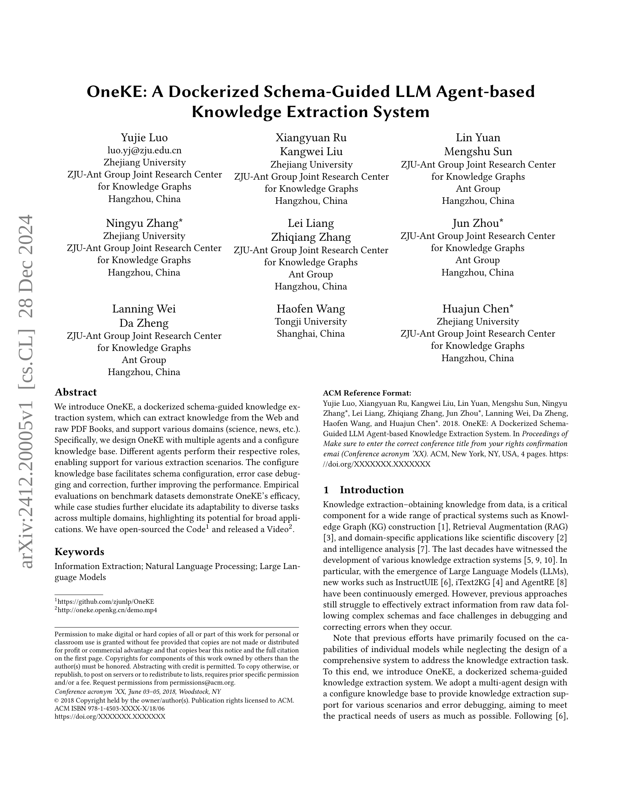
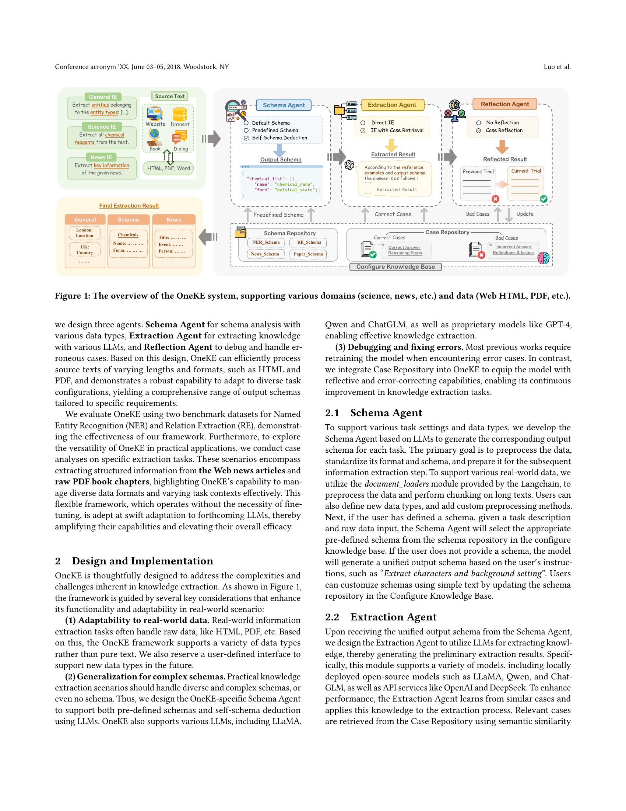
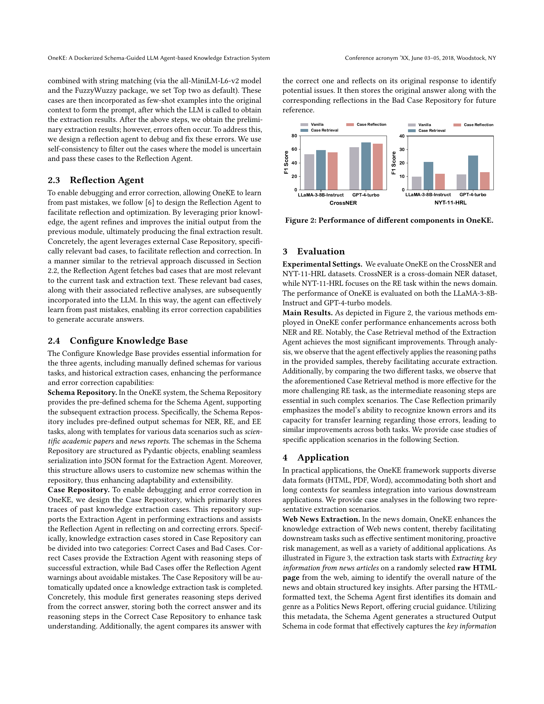
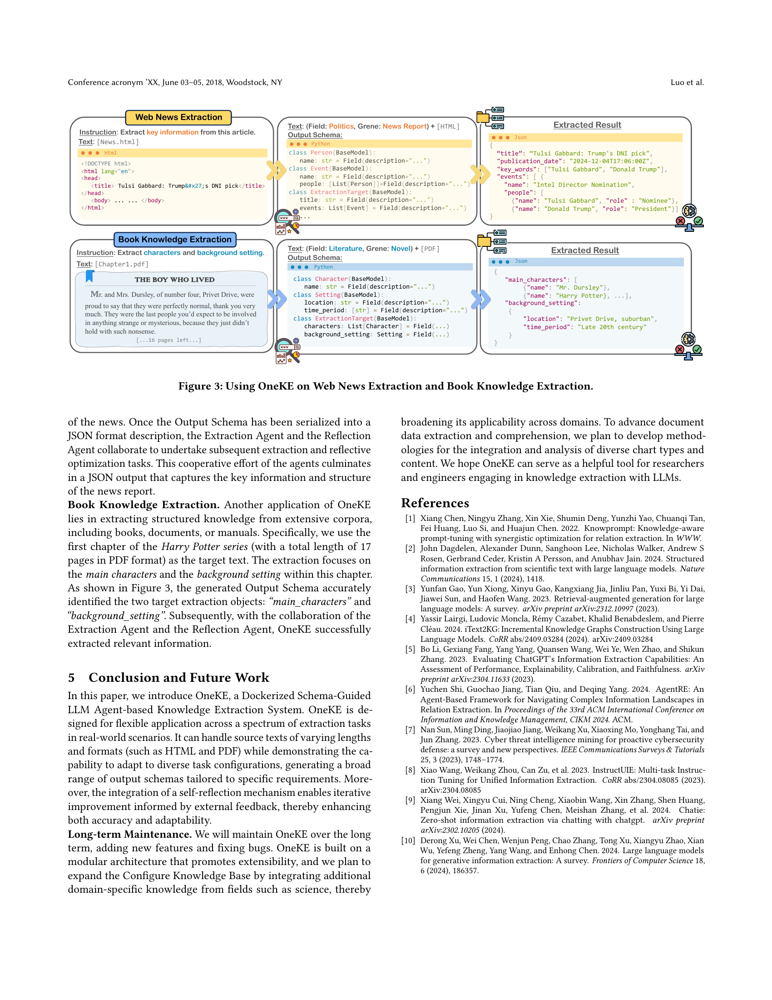

 


 2412.20005 
 Yujie Luo et el. 
 
 🤗 2024-12-31 
 



↗ arXiv


↗ Hugging Face


↗ Papers with Code


### TL;DR



기존의 지식 추출 시스템은 복잡한 스키마를 따르는 원시 데이터에서 정보를 효과적으로 추출하는 데 어려움을 겪고 오류 수정 및 디버깅 과정이 어렵다는 문제점이 있습니다. 또한 개별 모델의 성능 향상에만 초점을 맞춰 전체 시스템의 설계가 미흡한 경우가 많았습니다. 

본 논문에서는 이러한 문제점들을 해결하기 위해 도커 기반의 스키마 기반 LLM 에이전트 기반 지식 추출 시스템인 OneKE를 제시합니다. OneKE는 다중 에이전트 설계, 구성 가능한 지식 베이스, 오류 수정 및 디버깅 기능을 통해 다양한 시나리오와 데이터 형식을 효율적으로 처리하고 오류를 최소화합니다. 실험 결과는 OneKE의 효율성과 적응력을 보여주며, 다양한 도메인과 과제에 대한 적용 가능성을 입증합니다.



#### Key Takeaways


 OneKE는 웹과 PDF에서 다양한 도메인의 지식을 추출할 수 있는 도커 기반 시스템입니다. 



 다중 에이전트 설계와 구성 가능한 지식베이스를 통해 다양한 시나리오와 오류 수정을 지원합니다. 



 OneKE는 다양한 LLM과 데이터 형식을 지원하며, 실험 결과를 통해 효율성과 적응력을 입증했습니다. 


#### Why does it matter?
본 논문은 **다양한 도메인과 데이터 형식을 지원하는 도커 기반의 지식 추출 시스템 OneKE**를 소개합니다.  기존 방식의 한계를 극복하고자 **다중 에이전트 설계와 구성 가능한 지식베이스**를 도입하여 **오류 수정 및 적응력 향상**을 이루었습니다.  **LLM 기반의 유연한 시스템**으로 **다양한 과제와 도메인에 대한 적응력**을 보여주며 **향후 연구를 위한 새로운 가능성**을 제시합니다.  특히 **오류 수정 기능과 다양한 데이터 형식 지원**은 실제 응용에 있어 중요한 발전이며, 관련 연구자들에게 **새로운 지식 추출 방식**을 제시하는 **중요한 의미**를 지닙니다.

------
#### Visual Insights

> 🔼 그림 1은 OneKE 시스템의 개요를 보여줍니다. OneKE는 다양한 도메인(과학, 뉴스 등)과 데이터(웹 HTML, PDF 등)를 지원하는 지식 추출 시스템입니다. 그림에는 세 가지 에이전트(Schema Agent, Extraction Agent, Reflection Agent)와 설정 가능한 지식 베이스가 포함되어 있어 다양한 시나리오와 오류 수정에 대한 지원을 보여줍니다.  Schema Agent는 다양한 데이터 유형에 대한 스키마 분석을 담당하고, Extraction Agent는 다양한 LLM을 사용하여 지식 추출을 수행하며, Reflection Agent는 오류 수정을 담당합니다. 설정 가능한 지식 베이스는 스키마 구성, 오류 디버깅 및 수정을 지원합니다.
> 

> 
read the caption

> Figure 1. The overview of the OneKE system, supporting various domains (science, news, etc.) and data (Web HTML, PDF, etc.).
> 

### Full paper



