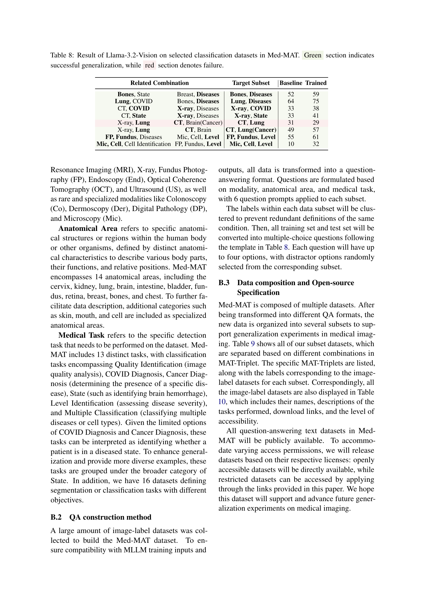

 


 2412.20070 
 Zhenyang Cai et el. 
 
 🤗 2024-12-31 
 



↗ arXiv


↗ Hugging Face


↗ Papers with Code


### TL;DR



의료 분야에서 다중 모달 거대 언어 모델(MLLM)의 활용이 증가하고 있지만, 특정 의료 영역의 데이터 부족으로 인해 일반화 성능이 제한적입니다. 기존 연구는 다중 과제 학습이 단일 과제 학습보다 우수하지만, 과제 간의 내부 관계를 고려하지 않아 데이터셋 선택에 대한 명확한 지침을 제공하지 못했습니다. 본 연구는 이러한 문제를 해결하기 위해 **구성적 일반화(CG)**라는 개념을 도입했습니다. CG는 모델이 학습된 요소를 재결합하여 새로운 조합을 이해하는 능력을 의미합니다.

본 연구에서는 **의료 영상을 Modality, Anatomical area, Task 세 가지 요소로 정의**하고, 이를 기반으로 106개의 의료 데이터셋을 통합한 Med-MAT 데이터셋을 구축했습니다. 실험 결과, MLLM이 CG를 통해 새로운 의료 영상을 이해하고, 다중 과제 학습에서 관찰되는 일반화 현상의 주요 원인 중 하나임을 확인했습니다. 또한, CG는 데이터가 제한적인 데이터셋에서도 효과적이며, 다양한 백본 모델에서 일관된 성능을 제공함을 보였습니다. 이 연구는 **의료 영상 분석 분야의 일반화 문제에 대한 새로운 접근 방식**을 제시하고, **제한된 데이터를 가진 의료 영상 분석에 대한 새로운 가능성**을 열었습니다.



#### Key Takeaways


 의료 영상을 정확하게 정의하는 Modality, Anatomical area, Taskì˜ 세 가지 요소를 기반으로 구성적 일반화(CG) 개념을 제시 



 다양한 의료 영상 데이터셋을 통합한 Med-MAT 데이터셋을 구축하고, 이를 통해 MLLMì˜ 구성적 일반화 능력을 실험적으로 검증 



 구성적 일반화가 다양한 백본 모델에서 일관되게 나타나며, 제한된 데이터를 가진 데이터셋에서도 효과적으로 일반화 성능을 향상시킴 


#### Why does it matter?
본 논문은 **의료 영상에 대한 다중 모드 거대 언어 모델(MLLM)의 일반화 능력을 향상시키는 데 중요한 통찰력**을 제공합니다.  **구성적 일반화(CG)** 개념을 도입하여 MLLM이 새로운 의료 영상을 이해하는 방식을 분석하고, 제한된 데이터를 가진 데이터셋에서도 효과적임을 보여줍니다. 이는 **의료 영상 분석 분야의 발전과 새로운 연구 방향 제시**에 크게 기여하며, 관련 연구자들에게 중요한 의미를 가집니다.

------
#### Visual Insights

> 🔼 그림 1은 모델이 학습한 기본 요소들을 재결합하여 본 적 없는 새로운 이미지들을 이해하는 조합적 일반화(Compositional Generalization)의 개념을 보여줍니다. 훈련 데이터셋에는 흰색 고양이, 검은 개, MRI 뇌 이미지, CT 폐 이미지가 포함되어 있습니다. 테스트 데이터셋에는 검은 고양이, CT 뇌 이미지가 포함되어 있습니다. 모델은 훈련 데이터셋에서 학습한 '흰색/검은색', '고양이/개', 'MRI/CT', '뇌/폐' 와 같은 개별 요소들을 조합하여 테스트 데이터셋에 있는 새로운 이미지들을 이해해야 합니다.  이는 단순히 기존 이미지들을 암기하는 것보다 더 높은 수준의 이해와 일반화 능력을 요구합니다.
> 

> 
read the caption

> Figure 1: Examples of Compositional Generalization: The model is required to understand unseen images by recombining the fundamental elements it has learned.
> 


| Model | 02 | 03 | 07 | 08 | 09 | 11 | 13 | 14 | 15 | 16 | 18 | 19 | 21 | 22 | 23 | 25 | 26 | 28 | 30 | 31 | 32 | 33 | 35 | 36 | 37 |
|---|---|---|---|---|---|---|---|---|---|---|---|---|---|---|---|---|---|---|---|---|---|---|---|---|---|---|
| *Baseline* | 22 | 47 | 40 | 25 | 26 | 27 | 28 | 24 | 22 | 24 | 25 | 23 | 49 | 26 | 25 | 24 | 49 | 30 | 49 | 21 | 49 | 20 | 25 | 23 | 19 |
| *Single-task Training* | 24 | 49 | 50 | 68 | 65 | 76 | 83 | 53 | 61 | 32 | 29 | 26 | 57 | 53 | 28 | 24 | 57 | 64 | 89 | 60 | 97 | 54 | 29 | 51 | 49 |
| *Multi-task Training* | **96** | **89** | **80** | **80** | **79** | **97** | **92** | **88** | **76** | **57** | **88** | **74** | **87** | **86** | **93** | **52** | **98** | **72** | **94** | **61** | **100** | **72** | **75** | **60** | **50** |

> 🔼 표 1은 다양한 모델의 In-Distribution 데이터셋에 대한 정확도를 보여줍니다. 각 구간 내에서 가장 높은 점수는 굵게 표시하고, 두 번째로 높은 점수는 밑줄로 표시합니다.  이 표는 다양한 모델(기준 모델, 단일 작업 학습 모델, 다중 작업 학습 모델)이 In-Distribution 데이터셋에서 얼마나 정확하게 분류 작업을 수행하는지 비교 분석한 결과를 보여줍니다.  In-Distribution 데이터셋이란 모델이 학습 과정에서 접했던 데이터셋을 의미합니다.  따라서 이 표는 다중 작업 학습이 단일 작업 학습보다 In-Distribution 데이터셋에서 더 나은 성능을 보이는지 확인하는 데 도움이 됩니다.
> 

> 
read the caption

> Table 1: Accuracy of different models on In-Distribution Dataset. Within each segment, bold highlights the best scores, and underlines indicate the second-best.
> 

### In-depth insights

#### Med-MAT Dataset
본 논문에서 제시된 Med-MAT 데이터셋은 **의료 영상에 대한 다양한 모달리티, 해부학적 영역, 그리고 과제를 포괄하는 방대한 규모의 데이터셋**입니다.  이를 통해 다양한 조합의 unseen data에 대한 모델의 일반화 능력을 평가하고, **compositional generalization (CG)**의 효과를 분석하는 데 활용됩니다.  **106개의 의료 데이터셋을 통합하여 구성**되었다는 점과, 각 이미지가 **Modality, Anatomical area, Task의 MAT-Triplet으로 정확히 정의**되어 있다는 점은 Med-MAT의 주요 특징입니다.  **MAT-Triplet 기반의 데이터 구성**은 CG 연구에 매우 적합한 환경을 제공하며, 이를 통해 다양한 조합의 unseen 데이터에 대한 모델의 일반화 성능을 효과적으로 분석할 수 있습니다.  **데이터셋의 공개**를 통해 다른 연구자들도 Med-MAT를 활용하여 의료 영상에 대한 MLLM의 일반화 능력에 대한 추가 연구를 진행할 수 있게 될 것입니다.  결론적으로 Med-MAT는 의료 영상 분야에서 **MLLM의 일반화 능력 향상에 크게 기여**할 뿐만 아니라, **CG에 대한 심도있는 연구를 가능하게 하는 중요한 데이터셋**입니다.

#### Compositional Gen
본 논문에서 제시된 "Compositional Gen"(조합적 일반화) 개념은 **의료 영상에 대한 다중 모달 대규모 언어 모델(MLLM)의 일반화 능력을 향상**시키는 핵심 요소로 보입니다.  **의료 영상을 모달리티, 해부학적 영역, 태스크의 세 가지 요소로 분해하여 조합**함으로써, 모델이 이전에 보지 못한 새로운 의료 영상 조합에 대해서도 이해할 수 있도록 합니다. 이는 기존의 단순한 다중 태스크 학습 방식보다 **더욱 효과적이고, 특히 데이터가 제한적인 의료 영상 분야에서 유용**합니다.  **Med-MAT 데이터셋은 이러한 조합적 일반화 연구를 위한 강력한 기반**을 제공하며, 다양한 백본 모델에서도 일관된 성능을 보여줍니다.  **결과적으로, Compositional Gen은 MLLM의 일반화 능력을 향상시키는 핵심 원동력**임을 시사합니다.  하지만,  일부 제한적인 사례에서 조합적 일반화의 효과가 명확하게 드러나지 않은 점은 추가 연구가 필요함을 보여줍니다.

#### Multi-task Training
본 논문에서 다루는 다중 작업 학습(Multi-task Training)은 **의료 영상 분야에서 다양한 작업을 동시에 학습**시키는 기법으로, 각 작업이 서로에게 도움을 주어 **일반화 성능을 향상**시키는 데 초점을 맞추고 있습니다.  **단일 작업 학습보다 우수한 성능**을 보이는 것으로 나타나 있으나,  본 연구에서는 단순히 다양한 작업의 조합이 아닌 작업들 간의 내적 관계, 특히 **구성적 일반화(Compositional Generalization)** 개념을 도입하여  **의료 영상 데이터 선택에 대한 새로운 지침**을 제시하고 있습니다.  이는 다양한 의료 영상 데이터셋을 효율적으로 활용하여 특정 작업의 성능을 개선하고, 제한된 데이터를 가진 영역에서도 **일반화 능력을 높이는 데 기여**할 수 있음을 시사합니다.  **Med-MAT 데이터셋**은 이러한 연구를 뒷받침하는 중요한 실험 기반을 제공하고 있으며, 향후 **의료 영상 인공지능 모델 개발**에 중요한 시사점을 제공할 것으로 기대됩니다.

#### Data Efficiency
본 논문은 의료 영상에 대한 다중 모드 거대 언어 모델(MLLM)의 **일반화 능력**을 향상시키는 데 초점을 맞추고 있습니다. 특히, 제한된 데이터로도 효과적인 학습이 가능하도록 하는 **데이터 효율성** 문제에 대한 심도있는 분석을 제공합니다.  **합성 일반화(CG)** 개념을 도입하여, 모델이 학습된 요소들을 재결합하여 새로운 조합을 이해하는 능력을 강조합니다.  실험 결과는 **CG가 제한된 데이터셋에서도 우수한 성능을 보이며, 다양한 백본 모델에서 일관된 성능을 유지**함을 보여줍니다.  이는 **데이터 효율성을 극대화**하고, 의료 영상 이해를 위한 MLLM의 일반화 능력을 높이는 데 중요한 전략임을 시사합니다.  **Med-MAT 데이터셋**의 활용은 이러한 주장을 뒷받침하는 실증적 증거를 제공합니다.  결론적으로, 본 연구는 의료 영상 분석에서 MLLM의 데이터 효율성을 크게 향상시킬 수 있는 **새로운 접근 방식**을 제시하며, 향후 의료 AI 연구에 중요한 시사점을 제공합니다.

#### Future Research
본 논문은 의료 영상에 대한 다중 작업 학습에서 **구성 일반화(Compositional Generalization, CG)**의 중요성을 강조합니다.  하지만, CG가 항상 명확하게 나타나는 것은 아니며, 다른 일반화 메커니즘도 존재할 수 있다는 점을 시사합니다.  **미래 연구는 다양한 일반화 메커니즘들을 탐구하여 의료 영상에 대한 MLLM의 성능을 향상시키는 방향으로 진행될 필요가 있습니다.**  특히, **제한된 데이터셋에서의 CG 활용 방안 연구는 실제 의료 환경 적용에 중요한 의미**를 지닙니다.  **의료 영상의 다양한 특징들을 더욱 세분화하여 CG의 효과를 심층적으로 분석**하는 연구도 필요합니다.  또한, 본 연구는 주로 의료 분야에 집중되어 있으므로, 다른 **다중 모달리티 작업에 CG를 적용하여 일반화 성능을 분석하는 연구**를 통해 CG의 범용성을 확인할 필요가 있습니다.  **다양한 MLLM 백본 모델에 대한 CG의 적용성 연구**도 추가적으로 진행될 수 있습니다.  마지막으로, **실제 임상 환경 적용 시 발생할 수 있는 위험 요소에 대한 면밀한 검토와 완화 방안 마련**을 위한 연구가 필수적입니다.

### More visual insights

More on figures

> 🔼 그림 2는 Med-MAT 데이터셋을 만드는 과정을 보여줍니다. 106개의 다양한 의료 데이터셋이 모여서 11가지 모달리티, 14개의 해부학적 영역, 13가지 의료 과제를 포함하는 53개의 하위 데이터셋을 생성합니다. 각 하위 데이터셋은 MAT-Triplet (Modality, Anatomical Area, Task)으로 정의되며, 동일한 MAT-Triplet을 공유하는 데이터셋은 통합됩니다. 이 과정을 통해 다양한 의료 영상 데이터의 통합 및 구성을 보여줍니다.  각 데이터셋은 질문-응답 쌍(QA Pairs)으로 변환되어, MLLM(다중 모달 대형 언어 모델) 학습 및 평가에 사용됩니다.
> 

> 
read the caption

> Figure 2: The process of integrating a vast amount of labeled medical image data to create Med-MAT.
> 

> 🔼 이 그림은 Med-MAT 데이터셋의 질문-응답(QA) 형식 변환 과정을 보여줍니다. 다양한 의료 영상 데이터셋을 VQA 형식으로 변환하는 방법을 단계별로 설명합니다. 먼저, 각 데이터셋의 이미지와 캡션을 바탕으로 질문과 네 가지 선택지가 있는 객관식 문제를 만듭니다. 그런 다음, 각 데이터셋의 특성에 맞는 지침을 추가하여 모델이 질문에 정확하게 답할 수 있도록 돕습니다. 마지막으로 ImageWikiQA 데이터셋을 추가하여 모델의 일반화 성능을 향상시키고 평가 편향을 줄입니다.
> 

> 
read the caption

> Figure 3: The QA formatting process of Med-MAT.
> 

> 🔼 그림 4는 다양한 모델에 대해 타겟 데이터셋에서의 정확도 결과를 보여줍니다.  '모든 관련/무관 데이터' 모델은 타겟 데이터와 관련되거나 무관한 모든 데이터셋으로 학습되었습니다. '모드/영역/작업 제외' 모델은 모든 관련 데이터셋으로 학습되었지만, 타겟 데이터와 동일한 요소를 공유하는 데이터셋은 제외하여 의도적으로 CG(합성 일반화)를 방해했습니다. '모든 데이터'는 사용 가능한 모든 학습 세트를 사용합니다. (참고: 일반화를 관찰하기 위해 타겟 데이터는 학습에서 제외되었습니다.)  즉, 이 그림은 다양한 학습 전략(관련 데이터만, 무관 데이터만, 관련 데이터 중 일부 제외)을 사용했을 때의 성능을 비교하여 합성 일반화의 효과를 보여주는 실험 결과입니다.
> 

> 
read the caption

> Figure 4: Accuracy results on the Target dataset for various models. ’All Related/Unrelated’ models are trained on all the related or unrelated datasets of the Target Data. ’w/o Modality/Area/Task’ are trained on All Related datasets but omit those sharing the same element as the Target Data, to intentionally disrupt CG. ’All Data’ uses all available training sets. (Note: The Target Data is excluded from training to observe generalization.)
> 

More on tables


| Model | 01 | 04 | 05 | 06 | 10 | 12 | 17 | 20 | 24 | 27 | 29 | 34 |
|---|---|---|---|---|---|---|---|---|---|---|---|---|
| _Baseline_ | 32 | 25 | 33 | **33** | 48 | 27 | 33 | 13 | 34 | 37 | 31 | 20 |
| _Multi-task Training_ | **39** | **26** | **70** | 31 | **58** | **38** | **61** | **40** | **35** | **41** | **55** | **50** |
> 🔼 표 2는 모델의 Out-of-Distribution(OOD) 데이터셋에 대한 정확도를 보여줍니다.  OOD 데이터셋은 모델이 훈련 중에 접해보지 못한 새로운 유형의 의료 영상 데이터를 의미합니다.  표는 여러 모델(Baseline, Multi-task Training)의 OOD 데이터셋에 대한 정확도를 보여주며, 각 열은 특정 OOD 데이터셋에 대한 정확도를 나타냅니다. 가장 높은 정확도를 가진 값은 굵게 표시되어 모델의 일반화 성능을 비교하는 데 도움이 됩니다. 이 표는 다양한 모델의 OOD 데이터에 대한 일반화 능력을 평가하는 데 사용됩니다.
> 

> 
read the caption

> Table 2: Accuracy of different models on Out-Of-Distribution Dataset. Bold highlights the best scores.
> 


Related Combination | Target Subset | Target Subset | Baseline | Baseline+ | Trained
---|---|---|---|---:|:---: 
Lung, COVID | Brain, **Cancer** | Lung, Cancer | 25 | 25 | 27
Lung, Cancer | Brain, **State** | Lung, State | 47 | 46 | 50
Brain, Cancer | Lung, **State** | Brain, State | 33 | 50 | 57
Bones, Level | Lung, **State** | Bones, State | 49 | 53 | 51
Bones, Level | Brain, **State** | Bones, State | 49 | 53 | 72
Bones, Level | Breast, **Diseases** | Bones, Diseases | 37 | 33 | 39
Bones, Level | Lung, **Diseases** | Bones, Diseases | 37 | 33 | 43
Bones, Level | Chest, **Diseases** | Bones, Diseases | 37 | 31 | 43
Bones, State | Breast, **Diseases** | Bones, Diseases | 37 | 37 | 43
Bones, State | Lung, **Diseases** | Bones, Diseases | 37 | 37 | 43
Lung, COVID | Breast, **Diseases** | Lung, Diseases | 49 | 48 | 51
Lung, COVID | Bones, **Diseases** | Lung, Diseases | 49 | 48 | 52
Lung, COVID | Chest, **Diseases** | Lung, Diseases | 49 | 48 | 51
CT, Cancer | X-ray, **COVID** | CT, COVID | 47 | 46 | 72
CT, COVID | X-ray, **Diseases** | X-ray, COVID | 30 | 21 | 49
CT, State | X-ray, **Diseases** | X-ray, State | 30 | 21 | 46
CT, State | X-ray, **Cancer** | CT, Cancer | 33 | 28 | 28
CT, Brain(State) | X-ray, **Bones** | X-ray, Brain | 49 | 49 | 91
CT, Brain | X-ray, **Lung** | X-ray, Brain | 49 | 50 | 81
CT, Brain(Cancer) | X-ray, **Bones** | X-ray, Brain | 25 | 51 | 74
CT, Brain | X-ray, **Lung** | X-ray, Brain | 49 | 52 | 52
X-ray, Brain | CT, Lung(State) | CT, Brain(State) | 33 | 50 | 60
X-ray, Lung | CT, Brain | CT, Lung(Cancer) | 25 | 25 | 36
X-ray, Lung | CT, Brain(State) | CT, Lung | 47 | 50 | 81
X-ray, Lung | CT, Brain(Cancer) | CT, Lung | 47 | 50 | 71
CT, Lung (State) | X-ray, Bones | X-ray, Lung | 30 | 32 | 28
CT, Lung (State) | X-ray, Brain | X-ray, Lung | 30 | 32 | 35
CT, Lung (Cancer) | X-ray, Bones | X-ray, Lung | 30 | 32 | 41
CT, Lung (Cancer) | X-ray, Brain | X-ray, Lung | 30 | 32 | 42
Der, Skin, Cancer | FP, Fundus, **Diseases** | Der, Skin, Diseases | 25 | 29 | 33
Der, Skin, Cancer | OCT, Retine, **Diseases** | Der, Skin, Diseases | 25 | 29 | 33
Der, Skin, Diseases | DP, Mouth, **Cancer** | Der, Skin, Cancer | 40 | 33 | 63
Der, Skin, Diseases | Mic, Cell, **Cancer** | Der, Skin, Cancer | 40 | 33 | 63
DP, Mouth, State | Der, Skin, **Cancer** | DP, Mouth, Cancer | 48 | 50 | 52
DP, Mouth, State | Mic, Cell, **Cancer** | DP, Mouth, Cancer | 48 | 50 | 55
FP, Fundus, Diseases | Mic, Cell, **Level** | FP, Fundus, Level | 33 | 36 | 42
Mic, Cell, Cell Identification | FP, Fundus, **Level** | Mic, Cell, Level | 23 | 33 | 32
Mic, Cell, Cell identification | Der, Skin, **Cancer** | Mic, Cell, Cancer | 49 | 50 | 50
Mic, Cell, Cell identification | DP, Mouth, **Cancer** | Mic, Cell, Cancer | 49 | 51 | 62
Mic, Cell, Level | Der, Skin, **Cancer** | Mic, Cell, Cancer | 49 | 51 | 52
Mic, Cell, Level | DP, Mouth, **Cancer** | Mic, Cell, Cancer | 49 | 51 | 58
Mic, Cell, Cancer | FP, Fundus, **Level** | Mic, Cell, Level | 23 | 24 | 27
> 🔼 표 3은 다양한 의료 영상 분류 작업에 대한 모델의 일반화 성능을 보여줍니다. '관련 조합' 열은 모델 학습에 사용된 데이터셋 조합을 나타내고, '목표 하위 집합' 열은 모델의 성능을 평가하기 위해 사용된 데이터셋을 나타냅니다. '기준', '기준+', '학습' 열은 각각 모델이 학습 없이, 무작위로 선택된 무관련 데이터로 학습된 경우, 그리고 관련 데이터로 학습된 경우의 정확도를 나타냅니다. 표의 녹색 영역은 성공적인 일반화를, 빨간색 영역은 일반화 실패를 나타냅니다. 네 개의 영역으로 구분된 부분은 고정된 모달리티, 고정된 해부학적 영역, 고정된 작업, 그리고 모달리티-해부학적 영역 쌍 조합의 네 가지 다른 방향 유형을 나타냅니다.
> 

> 
read the caption

> Table 3: Generalization results on classification datasets: 'Related Combination' is the training set, 'Target Subset' is the goal. Baseline, Baseline+, and Trained represent the model’s accuracy without training, trained on randomly sampled unrelated data, and trained on related data, respectively. Green section indicates successful generalization, while red section denotes failure. The 4 segmented areas represent different Direction Types: fixed modality, fixed area, fixed task, and modality-area paired combinations.
> 


| Related Combination | Target Subset | Baseline | Trained |
|---|---|---|---| 
| **CT** - Subset02 | **Brain** - Subset22 | **Cancer** - Subset07 | CT, Brain, Cancer | 28 | 26 |
| **CT** - Subset03 | **Brain** - Subset22 | **Cancer** - Subset21 | CT, Brain, Cancer | 28 | 25 |
| **CT** - Subset02 | **Brain** - Subset22 | **State** - Subset09 | CT, Brain, State | 33 | 64 |
| **CT** - Subset03 | **Brain** - Subset22 | **State** - Subset26 | CT, Brain, State | 33 | 70 |
| **X-ray** - Subset25 | **Lung** - Subset03 | **Diseases** - Subset02 | X-ray, Lung, Diseases | 30 | 45 |
| **X-ray** - Subset26 | **Lung** - Subset03 | **Diseases** - Subset02 | X-ray, Lung, Diseases | 30 | 38 |
| **X-ray** - Subset26 | **Lung** - Subset03 | **Diseases** - Subset08 | X-ray, Lung, Diseases | 30 | 44 |
| **X-ray** - Subset26 | **Breast** - Subset24 | **Diseases** - Subset02 | X-ray, Breast, Diseases | 31 | 32 |
| **X-ray** - Subset28 | **Breast** - Subset24 | **Diseases** - Subset08 | X-ray, Breast, Diseases | 31 | 52 |
> 🔼 표 4는 MAT-Triplet의 세 가지 요소를 제공하는 세 가지 데이터셋에서의 일반화 결과를 보여줍니다. 이 표는 세 가지 다른 데이터셋의 MAT-Triplet 요소를 사용하여 모델의 일반화 성능을 평가하기 위한 실험 결과를 보여줍니다. '관련 조합' 열은 훈련에 사용된 데이터셋을 나타내고, '대상 하위 집합' 열은 모델의 성능을 평가한 데이터셋을 나타냅니다. '기준' 열은 훈련 없이 모델의 정확도를 나타내고, '훈련됨' 열은 관련 데이터로 훈련된 모델의 정확도를 나타냅니다. 녹색 영역은 성공적인 일반화를 나타내고, 빨간색 영역은 실패를 나타냅니다. 이 표는 3가지 요소 모두 다른 데이터셋에서 가져온 경우에도 모델이 일반화할 수 있음을 보여줍니다.
> 

> 
read the caption

> Table 4: Generalization results from 3 datasets providing different elements of MAT-Triplet (RQ 3). 'Related Combination' is the training set, 'Target Subset' is the goal. Baseline, and Trained represent the model’s accuracy without training and trained on Related data, respectively. Green section indicates successful generalization, while red section denotes failure.
> 


| Related Combination | Target Subset | Target Subset | Baseline | Trained |
|---|---|---|---|---|
| Lung, Lung Det | Bones, **Diseases** | Lung, Diseases | 49 | 52 |
| Lung, Lung Det | Breast, **Diseases** | Lung, Diseases | 49 | 54 |
| Bones, Spinal Error Det | Breast, **Diseases** | Bones, Diseases | 20 | 30 |
| Bones, Spinal Error Det | Lung, **Diseases** | Bones, Diseases | 20 | 33 |
| MRI, **Diseases Det** | End, Level | End, Diseases | 24 | 27 |
| X-ray, Lung Det | CT, **COVID** | X-ray, COVID | 23 | 26 |
| Der, Skin, Cancer Det | FP, Fundus, **Diseases** | Der, Skin, Diseases | 24 | 29 |
| Mic, Cell, Cancer Det | CT, Kidney, **Diseases** | Mic, Cell, Diseases | 24 | 26 |
> 🔼 표 5는 NEXT-Chat 모델을 사용하여 검출 및 분류 작업을 결합하여 분류 대상 데이터셋을 일반화하는 실험 결과를 보여줍니다.  '관련 조합' 열은 훈련에 사용된 데이터셋을 나타내고, '대상 하위 데이터셋' 열은 일반화 성능을 평가하기 위한 목표 데이터셋을 나타냅니다.  '기준' 열은 훈련 없이 모델의 정확도를, '훈련됨' 열은 관련 데이터로 훈련된 모델의 정확도를 보여줍니다.  녹색 영역은 성공적인 일반화를, 빨간색 영역은 실패를 나타냅니다. 표는 고정 모달리티, 고정 영역, 모달리티-영역 쌍 조합 등 네 가지 방향 유형으로 구분된 결과를 보여줍니다. 이를 통해 다양한 조합 방식에 따른 모델의 일반화 성능을 분석합니다.
> 

> 
read the caption

> Table 5: Result of NEXT-Chat on CG by using detection and classification tasks to generalize classification Target dataset. Generalization results on classification datasets: 'Related Combination' is the training set, 'Target Subset' is the goal. Baseline and Trained represent the model’s accuracy without training and trained on related data, respectively. Green section indicates successful generalization, while red section denotes failure. The 4 segmented areas represent different Direction Types: fixed modality, fixed area, and modality-area paired combinations.
> 


| Related Combination | Target Subset | Baseline | Trained |
|---|---|---|---| 
| Lung, Lung Det | Bones, **Diseases** | Lung, Diseases | 41 | 47 |
| Lung, Lung Det | Breast, **Diseases** | Lung, Diseases | 41 | 49 |
| Bones, Spinal Error Det | Breast, **Diseases** | Bones, Diseases | 31 | 35 |
| Bones, Spinal Error Det | Lung, **Diseases** | Bones, Diseases | 31 | 37 |
| MRI, **Diseases Det** | End, Level | End, Diseases | 24 | 26 |
| X-ray, Lung Det | CT, **COVID** | X-ray, COVID | 22 | 23 |
| Der, Skin, Cancer Det | FP, Fundus, **Diseases** | Der, Skin, Diseases | 27 | 30 |
| Mic, Cell, Cancer Det | CT, Kidney, **Diseases** | Mic, Cell, Diseases | 20 | 24 |
> 🔼 표 6은 MiniGPT-v2 모델을 사용하여 검출 및 분류 작업을 통해 분류 대상 데이터셋을 일반화하는 과정에서의 조합 일반화(CG) 결과를 보여줍니다.  '관련 조합' 열은 훈련에 사용된 데이터셋을, '대상 하위 데이터셋' 열은 일반화 목표 데이터셋을 나타냅니다.  '기준' 열은 훈련 없이 모델의 정확도를, '훈련됨' 열은 관련 데이터로 훈련된 모델의 정확도를 나타냅니다. 녹색 영역은 성공적인 일반화를, 빨간색 영역은 실패를 나타냅니다. 세 개의 구분된 영역은 세 가지 방향 유형(고정 모드, 고정 영역, 모드-영역 쌍 조합)을 나타냅니다. 이 표는 다양한 데이터 조합이 MiniGPT-v2 모델의 일반화 성능에 미치는 영향을 분석하고, 어떤 조합이 효과적이고 어떤 조합이 효과적이지 않은지 보여줍니다.
> 

> 
read the caption

> Table 6: Result of MiniGPT-v2 on CG by using detection and classification tasks to generalize classification Target dataset. Generalization results on classification datasets: 'Related Combination' is the training set, 'Target Subset' is the goal. Baseline and Trained represent the model’s accuracy without training and trained on related data, respectively. Green section indicates successful generalization, while red section denotes failure. The 3 segmented areas represent different Direction Types: fixed modality, fixed area, and modality-area paired combinations.
> 


| Related Combination | Target Subset | Baseline | Trained |
|---|---|---|---| 
| **Bones**, State, Breast, **Diseases** | **Bones**, Diseases | 61 | 65 |
| **Lung**, COVID, Bones, **Diseases** | **Lung**, Diseases | 80 | 91 |
| CT, **COVID**, X-ray, **Diseases** | **X-ray**, COVID | 35 | 40 |
| CT, **State**, X-ray, **Diseases** | **X-ray**, State | 35 | 43 |
| X-ray, **Lung**, CT, Brain(Cancer) | **CT**, Lung | 32 | 33 |
| X-ray, **Lung**, CT, Brain | **CT**, Lung(Cancer) | 65 | 72 |
| **FP**, Fundus, Diseases, Mic, Cell, **Level** | **FP**, Fundus, Level | 48 | 45 |
| **Mic**, Cell, Cell Identification, FP, Fundus, **Level** | **Mic**, Cell, Level | 34 | 41 |
> 🔼 표 7은 Med-MAT 데이터셋의 일부 분류 데이터셋에서 Qwen2-VL 모델의 성능을 보여줍니다.  각 행은 특정 훈련 데이터 조합(관련 데이터 조합)과 테스트 데이터셋(타겟 서브셋)을 나타내며, 모델이 타겟 데이터셋에 대해 얼마나 잘 일반화하는지 평가합니다. 녹색 영역은 성공적인 일반화를, 빨간색 영역은 일반화 실패를 나타냅니다. 이 표는 다중 작업 학습에서의 조성 일반화(CG)의 효과를 분석하는 데 사용됩니다.  다양한 방식으로 고정된 모달리티, 고정된 해부학적 영역, 고정된 작업, 그리고 모달리티-해부학적 영역 쌍 조합을 통해 CG의 영향을 평가합니다.
> 

> 
read the caption

> Table 7: Result of Qwen2-VL on selected classification datasets in Med-MAT. Green section indicates successful generalization, while red section denotes failure.
> 


| Related Combination | Target Subset | Baseline | Trained |
|---|---|---|---| 
| Bones, State | Breast, **Diseases** | Bones, Diseases | 52 | 59 |
| Lung, COVID | Bones, **Diseases** | Lung, Diseases | 64 | 75 |
| CT, **COVID** | X-ray, Diseases | X-ray, COVID | 33 | 38 |
| CT, **State** | X-ray, Diseases | X-ray, State | 33 | 41 |
| X-ray, **Lung** | CT, Brain(Cancer) | CT, Lung | 31 | 29 |
| X-ray, **Lung** | CT, Brain | CT, Lung(Cancer) | 49 | 57 |
| FP, Fundus, Diseases | Mic, Cell, **Level** | FP, Fundus, Level | 55 | 61 |
| Mic, Cell, Cell Identification | FP, Fundus, **Level** | Mic, Cell, Level | 10 | 32 |
> 🔼 표 8은 Med-MAT 데이터셋의 일부 분류 데이터셋에 대해 Llama-3.2-Vision 모델의 일반화 성능을 보여줍니다.  표는 관련 데이터 조합(훈련 세트)과 대상 데이터셋(테스트 세트)을 보여주고, 각각에 대한 기준 성능(Baseline, 훈련 없이), 관련 데이터로 훈련된 모델의 성능(Trained)을 나타냅니다.  녹색 영역은 성공적인 일반화를, 빨간색 영역은 일반화 실패를 나타냅니다.  이를 통해 특정 데이터 조합이 모델의 일반화 능력에 미치는 영향을 분석하고, Llama-3.2-Vision 모델의 일반화 성능을 평가합니다.
> 

> 
read the caption

> Table 8: Result of Llama-3.2-Vision on selected classification datasets in Med-MAT. Green section indicates successful generalization, while red section denotes failure.
> 


| Subset No. | Modality | Anatomical Area | Task | Datasets No. |
|---|---|---|---|---|
| 01 | Co | Cervix | Cervical Picture Quality Evaluation | 1 |
| 02 | CT | Kidney | Kidney Diseases Classification | 2 |
| 03 | CT | Lung | COVID-19 Classification | 3,4,6 |
| 04 | CT | Lung | Lung Cancer Classification | 5 |
| 05 | CT | Brain | Brain Hemorrhage Classification | 7 |
| 06 | CT | Brain | Brain Cancer Classification | 8 |
| 07 | Der | Skin | Melanoma Type Classification | 10 |
| 08 | Der | Skin | Skin Diseases Classification | 9, 11-15, 71, 72, 74 |
| 09 | DP | Mouth | Teeth Condition Classification | 16 |
| 10 | DP | Mouth | Oral Cancer Classification | 17 |
| 11 | End | Intestine | Intestine Cleanliness Level | 18 |
| 12 | End | Bladder | Cancer Degree Classification | 19 |
| 13 | End | Intestine | Intestine Diseases Classification | 20 |
| 14 | FP | Fundus | Eye Diseases Classification | 21-23, 26-28, 31, 32, 75 |
| 15 | FP | Fundus | Multiple-labels Eye Diseases Classification | 24, 25, 68 |
| 16 | FP | Fundus | Blindness Level | 29 |
| 17 | FP | Fundus | Retinal Images Quality Evaluation | 30 |
| 18 | Mic | Cell | Cell Type Classification | 33, 36-38, 39-41, 44, 65, 70 |
| 19 | Mic | Cell | Prostate Cancer Degree Classification | 34 |
| 20 | Mic | Cell | Multiple-labels Blood Cell Classification | 35 |
| 21 | Mic | Cell | Cancer Classification | 42, 67 |
| 22 | MRI | Brain | Head Diseases Classification | 44, 45 |
| 23 | OCT | Retina | Retina Diseases Classification | 46, 47 |
| 24 | US | Breast | Breast Cancer Classification | 48 |
| 25 | X-ray | Bones | Degree Classification of Knee | 49, 53 |
| 26 | X-ray | Bones | Fractured Classification | 50, 51 |
| 27 | X-ray | Bones | Vertebrae Diseases Classification | 52 |
| 28 | X-ray | Lung | COVID-19 and Pneumonia Classification | 54-57, 60, 62, 81 |
| 29 | X-ray | Breast | Breast Diseases Classification | 58, 78 |
| 30 | X-ray | Lung | Tuberculosis Classification | 59, 79 |
| 31 | X-ray | Chest | Multiple-labels Chest Classification | 61, 73, 76, 77, 80, 85, 87 |
| 32 | X-ray | Brain | Tumor Classification | 63 |
| 33 | Mic | Cell | Multi-labels Diseases | 84 |
| 34 | FP | Fundus | Level Identification | 66 |
| 35 | X-ray | Bones | Level Identification | 69 |
| 36 | X-ray | Bones | Spinal lesion Classification | 86 |
| 37 | X-ray | Breast | Multi-labels Diseases | 82 |
| 38 | Der | Skin | Lesion Det/Seg | 88-91 |
| 39 | End | Intestine | PolyP Det/Seg | 92-93 |
| 40 | End | Intestine | Surgical Procedures Det/Seg | 94 |
| 41 | End | Intestine | Multi-labels Det/Seg | 95 |
| 42 | Mic | Cell | Cancer Cell Det/Seg | 96 |
| 43 | US | Chest | Cancer Det/Seg | 97 |
| 44 | US | Thyroid | Thyroid Nodule Region Det/Seg | 98 |
| 45 | MRI | Intestine | Multi-labels Det/Seg | 103 |
| 46 | MRI | Liver | Liver Det/Seg | 104, 105 |
| 47 | X-ray | Lung | Lung Det/Seg | 99 |
| 48 | X-ray | Lung | Pneumothorax Det/Seg | 106 |
| 49 | X-ray | Bones | Spinal Anomaly Det | 100 |
| 50 | X-ray | Chest | Multi-labels Det | 101, 102 |
| 51 | FP | Fundus | Vessel Seg | 107 |
| 52 | FP | Fundus | Optic Disc and Cup Seg | 108 |
> 🔼 표 9는 Med-MAT 데이터셋의 하위 데이터셋에 대한 세부 정보를 보여줍니다.  각 하위 데이터셋은 의료 영상의 종류(예: 컴퓨터 단층 촬영(CT), 자기 공명 영상(MRI), 초음파(US) 등), 해부학적 영역(예: 폐, 뇌, 피부 등), 그리고 수행된 의료 작업(예: 질병 분류, 병변 검출 등)을 기준으로 분류됩니다.  표의 파란색 부분은 분류 작업에 사용된 하위 데이터셋을, 녹색 부분은 검출 작업에 사용된 하위 데이터셋을 나타냅니다.  약어는 다음과 같습니다: Co(콜포스코피), CT(컴퓨터 단층촬영), DP(디지털 사진), FP(안저 사진), MRI(자기 공명 영상), OCT(광간섭 단층촬영), Der(피부경검경), End(내시경), Mic(현미경 영상), US(초음파).
> 

> 
read the caption

> Table 9: The details of subset. In particular, Co stands for Colposcopy, CT represents Computed Tomography, DP refers to Digital Photography, FP is for Fundus Photography, MRI denotes Magnetic Resonance Imaging, OCT signifies Optical Coherence Tomography, Der refers to Dermoscopy, End stands for Endoscopy, Mic indicates Microscopy Images, and US represents Ultrasound. The blue section represents the classification dataset and the green section represents the detection
> 


| No. | Name | Description | Citation |
|---|---|---|---| 
| 1 | <a href="https://www.kaggle.com/competitions/intel-mobileodt-cervical-cancer-screening/data">Intel &amp; MobileODT Cervical Screening</a> | Cervix Type in Screening | BenO et al. (2017) |
| 2 | <a href="https://www.kaggle.com/datasets/nazmul0087/ct-kidney-dataset-normal-cyst-tumor-and-stone">CT Kindney Dataset</a> | Normal or Cyst or Tumor | Islam et al. (2022a) |
| 3 | <a href="https://www.kaggle.com/datasets/plameneduardo/sarscov2-ctscan-dataset">SARS-COV-2 Ct-Scan</a> | COVID19, Classification Dataset | Soares et al. (2020) |
| 4 | <a href="https://tianchi.aliyun.com/dataset/106604">COVID CT COVID-CT</a> | COVID19, Classification Dataset. | Zhao et al. (2020) |
| 5 | <a href="https://tianchi.aliyun.com/dataset/93929">Chest CT-Scan</a> | Cancer Classification | SunneYi (2021) |
| 6 | <a href="https://tianchi.aliyun.com/dataset/93666">COVID-19-CT SCAN IMAGES</a> | COVID19, Classification | wjXiaochuangw (2019) |
| 7 | <a href="https://www.kaggle.com/datasets/felipekitamura/head-ct-hemorrhage?select=labels.csv">Head CT</a> | Head Hemorrhage | Kitamura (2018) |
| 8 | <a href="https://www.kaggle.com/datasets/trainingdatapro/computed-tomography-ct-of-the-brain">CT of Brain</a> | Head Cancer | Data (2023) |
| 9 | <a href="https://www.cs.rug.nl/%C2%A0imaging/databases/melanoma_naevi/">MED-NODE</a> | Melanoma or Naevus | Giotis et al. (2015) |
| 10 | <a href="https://challenge2020.isic-archive.com/">ISIC 2020</a> | Melanoma, Benign or Malignant | Rotemberg et al. (2021) |
| 11 | <a href="https://data.mendeley.com/datasets/zr7vgbcyr2/1">PED-UFES-20</a> | Skin Multi Classification | Pacheco et al. (2020) |
| 12 | <a href="https://www.kaggle.com/datasets/arafathussain/monkeypox-skin-image-dataset-2022,%20https://www.heywhale.com/mw/dataset/62eb75d6fef0903951b1f199">Web-scraped Skin Image</a> | Skin Desease Multi Classification | Islam et al. (2022b) |
| 13 | <a href="https://www.kaggle.com/datasets/angelachristabel/isbi-2016?select=Training_GroundTruth.csv">ISBI 2016</a> | Skin Lesion Classification | Gutman et al. (2016) |
| 14 | <a href="https://www.kaggle.com/datasets/andrewmvd/isic-2019">ISIC 2019</a> | Skin Desease Multi Classification | Combalia et al. (2019) |
| 15 | <a href="https://www.kaggle.com/datasets/nodoubttome/skin-cancer9-classesisic">Skin Cancer ISIC</a> | Skin Cancer Multi Classification | Katanskiy (2019) |
| 16 | <a href="https://www.kaggle.com/datasets/salmansajid05/oral-diseases/data">Dental Condition Dataset</a> | Teeth condition classification | Sajid (2024) |
| 17 | <a href="https://www.kaggle.com/datasets/zaidpy/oral-cancer-dataset">Oral Cancer Dataset</a> | Oral cancer Classification | RASHID (2024) |
| 18 | <a href="https://datasets.simula.no/nerthus/">The Nerthus Dataset</a> | Cleanliness level | Pogorelov et al. (2017a) |
| 19 | <a href="https://commons.datacite.org/doi.org/10.5281/zenodo.7741475">Endoscopic Bladder Tissue</a> | Canser Degree Classification | Lazo et al. (2023) |
| 20 | <a href="https://www.kaggle.com/datasets/meetnagadia/kvasir-dataset">Kvasir</a> | Multi Disease Classification | Pogorelov et al. (2017b) |
| 21 | <a href="https://figshare.com/s/c2d31f850af14c5b5232">ACRIMA</a> | Glaucoma | Ovreiu et al. (2021) |
| 22 | <a href="https://www.kaggle.com/datasets/nurmukhammed7/augemnted-ocular-diseases">Augemnted ocular diseases AOD</a> | Multi Classification of eye diseases | Бақтыбекұлы (2021) |
| 23 | <a href="https://www.kaggle.com/datasets/linchundan/fundusimage1000">JSIEC</a> | Multi Classification of eye diseases | Cen et al. (2021) |
| 24 | <a href="https://data.mendeley.com/datasets/pc4mb3h8hz/1">Multi-Label Retinal Diseases</a> | Multi Classification of eye diseases | Rodríguez et al. (2022) |
| 25 | <a href="https://github.com/openmedlab/Awesome-Medical-Dataset/blob/main/resources/RFMiD.md">RFMiD 2.0</a> | Multi Classification of eye diseases | Panchal et al. (2023) |
| 26 | <a href="https://www.kaggle.com/datasets/nafin59/ocular-toxoplasmosis-fundus-images-dataset">ToxoFundus(Data Processed Paper)</a> | Ocular toxoplasmosis | Cardozo et al. (2023) |
| 27 | <a href="https://www.kaggle.com/datasets/nafin59/ocular-toxoplasmosis-fundus-images-dataset">ToxoFundus(Data Raw 6class All)</a> | Ocular toxoplasmosis | Cardozo et al. (2023) |
| 28 | <a href="https://www.kaggle.com/datasets/xiaoliang2121/adamdataset">Adam dataset</a> | Age-related Macular Degeneration | Liang (2021) |
| 29 | <a href="https://www.kaggle.com/competitions/aptos2019-blindness-detection">APTOS 2019 Blindness</a> | Blindness Level Identification 0 4 | Karthik et al. (2019) |
| 30 | <a href="https://www.kaggle.com/datasets/subhajournal/drimdb-diabetic-retinopathy-images-database">DRIMBD</a> | Quality Testing of Retinal Images | Prentasic et al. (2013) |
| 31 | <a href="https://www.kaggle.com/datasets/sshikamaru/glaucoma-detection">Glaucoma Detection</a> | Glaucoma Classification | Zhang and Das (2022) |
| 32 | <a href="https://zenodo.org/records/5793241">AIROGS</a> | Glaucoma Classification | de Vente et al. (2023) |
| 33 | <a href="https://github.com/KaikaiZhao/HEp-2_cell_classification">ICPR-HEp-2</a> | Multi Classification | Qi et al. (2016) |
| 34 | <a href="https://data.mendeley.com/datasets/9xxm58dvs3/1">SICAPv2</a> | Cancer Degree Classification | Silva-Rodríguez et al. (2020) |
| 35 | <a href="https://www.kaggle.com/datasets/paultimothymooney/blood-cells">Blood Cell Images</a> | Blood Cell Classificaion (Multi) | Mooney (2017) |
| 36 | <a href="https://www.kaggle.com/datasets/ambarish/breakhis">BreakHis</a> | Cell type and beginormag | Bukun (2019) |
| 37 | <a href="https://bupt-ai-cz.github.io/HSA-NRL/">Chaoyang</a> | Multi Classification of pathologists | Zhu et al.  |
| 38 | <a href="https://data.mendeley.com/datasets/tt3yj2pf38/3">HuSHeM</a> | Sperm Head Morphology Classificaion | Shaker (2018) |
| 39 | <a href="https://www.kaggle.com/datasets/andrewmvd/bone-marrow-cell-classification">Bone Marrow Cell Classification</a> | Bone Marrow Cell Classification | Matek et al. (2021) |
| 40 | <a href="https://zenodo.org/records/1214456">NCT-CRC-HE-100K</a> | Multi Classification | Kather et al. (2018) |
| 41 | <a href="https://www.kaggle.com/datasets/andrewmvd/malignant-lymphoma-classification">Malignant Lymphoma Classification</a> | Multi Classification | Orlov et al. (2010a) |
| 42 | <a href="https://www.kaggle.com/c/histopathologic-cancer-detection/data">Histopathologic Cancer Detection</a> | Cancer Classification | Cukierski (2018) |
| 43 | <a href="https://www.kaggle.com/datasets/xilezhu/lc25000">LC25000</a> | Multi Classification of Lung and Colon | Zhu (2022) |
| 44 | <a href="https://www.kaggle.com/datasets/fernando2rad/brain-tumor-mri-images-17-classes">Brain Tumor 17 Classes</a> | Multi Classification | Feltrin (2022) |
| 45 | <a href="https://www.kaggle.com/datasets/masoudnickparvar/brain-tumor-mri-dataset">Tumor Classification</a> | Pituitary or Glioma or Meningioma or Notumor | Nickparvar (2021a) |
| 46 | <a href="https://www.kaggle.com/datasets/andrewmvd/malignant-lymphoma-classification">Malignant Lymphoma Classification</a> | Multi Classification of eye diseases | Orlov et al. (2010b) |
| 47 | <a href="https://www.kaggle.com/datasets/obulisainaren/retinal-oct-c8">Retinal OCT-C8</a> | Multi Classification of eye diseases | Subramanian et al. (2022) |
| 48 | <a href="https://www.kaggle.com/datasets/sabahesaraki/breast-ultrasound-images-dataset">BUSI</a> | Breast Cancer | Al-Dhabyani et al. (2020) |
| 49 | <a href="https://data.mendeley.com/datasets/t9ndx37v5h/1">Digital Knee X-Ray Images</a> | Degree Classification of Knee | Gornale and Patravali (2020) |
| 50 | <a href="https://www.kaggle.com/datasets/preetviradiya/brian-tumor-dataset">Bone Fracture Multi-Region X-ray Data</a> | Fractured Classification | Nickparvar (2021b) |
| 51 | <a href="https://www.kaggle.com/datasets/devbatrax/fracture-detection-using-x-ray-images">Fracture detection</a> | Fractured Classification | Batra (2024) |
| 52 | <a href="https://www.kaggle.com/datasets/yasserhessein/the-vertebrae-xray-images">The vertebrae X-ray image</a> | Vertebrae | Fraiwan et al. (2022) |
| 53 | <a href="https://www.kaggle.com/datasets/shashwatwork/knee-osteoarthritis-dataset-with-severity">Knee Osteoarthritis Dataset</a> | Knee Osteoarthritis with severity grading | Chen (2018) |
| 54 | <a href="https://lhncbc.nlm.nih.gov/LHC-downloads/downloads.html#tuberculosis-image-data-sets">Shenzhen Chest X-Ray Set</a> | COVID19, Classification Dataset. | Jaeger et al. (2014) |
| 55 | <a href="https://data.mendeley.com/datasets/jctsfj2sfn/1">Chest X-ray PD</a> | COVID and Pneumonia | Asraf and Islam (2021) |
| 56 | <a href="https://www.heywhale.com/mw/dataset/6027caee891f960015c863d7/content">COVID-19 CHEST X-RAY DATABASE</a> | COVID and Pneumonia | Chowdhury et al. (2020) |
| 57 | <a href="https://github.com/ari-dasci/covidgr">COVIDGR</a> | COVID19, Classification | Tabik et al. (2020) |
| 58 | <a href="https://www.kaggle.com/datasets/kmader/mias-mammography">MIAS</a> | Multi Classification of Breast | Mader (2017) |
| 59 | <a href="https://www.kaggle.com/datasets/tawsifurrahman/tuberculosis-tb-chest-xray-dataset">Tuberculosis Chest X-Ray Database</a> | Tuberculosis | Rahman et al. (2020) |
| 60 | <a href="https://www.kaggle.com/datasets/andrewmvd/pediatric-pneumonia-chest-xray">Pediatric Pneumonia Chest X-Ray</a> | Pneumonia Classification | Kermany (2018) |
> 🔼 표 10은 논문에서 사용된 의료 데이터셋에 대한 세부 정보를 제공합니다.  각 데이터셋의 이름, 설명, 인용 정보를 포함하여 총 109개의 의료 데이터셋이 포함되어 있습니다. 데이터셋 설명에는 데이터셋의 유형(예: 분류, 탐지, 세분화), 해당되는 신체 부위, 그리고 질병의 종류 등이 포함됩니다. 이 표는 논문에서 사용된 데이터셋에 대한 전반적인 개요를 제공하여 연구의 재현성과 투명성을 높이는 데 기여합니다.
> 

> 
read the caption

> Table 10: The details of the medical datasets are provided
> 


| No. | Name | Description | Citation |
|---|---|---|---| 
| 61 | <a href="https://www.kaggle.com/datasets/nih-chest-xrays/sample">Random Sample of NIH Chest X-Ray Dataset</a> | Multi Classificaiton of Chest | Wang et al. (2017) |
| 62 | <a href="https://www.kaggle.com/datasets/praveengovi/coronahack-chest-xraydataset">CoronaHack-Chest X-Ray</a> | Pnemonia Classifcition with Virus type | Praveen (2019) |
| 63 | <a href="https://www.kaggle.com/datasets/preetviradiya/brian-tumor-dataset">Brain Tumor Dataset</a> | Tumor Classification | Viradiya (2020) |
| 64 | <a href="https://github.com/mattgroh/fitzpatrick17k">Fitzpatrick 17k (Nine Labels)</a> | Multi Classification | Groh et al. (2021) |
| 65 | <a href="https://figshare.com/s/d6fb591f1beb4f8efa6f">BioMediTech</a> | Multi Classification | Nanni et al. (2016) |
| 66 | <a href="https://zenodo.org/records/4891308">Diabetic retinopathy</a> | Diabetic Retinopathy Level | Benítez et al. (2021) |
| 67 | <a href="https://tianchi.aliyun.com/dataset/90101/notebook">Leukemia</a> | Cancer Classification | Codella et al. (2019) |
| 68 | <a href="https://odir2019.grand-challenge.org/introduction/">ODIR-5K</a> | Multiple Labels Classification | University (2019) |
| 69 | <a href="https://aistudio.baidu.com/datasetdetail/69582/0">Arthrosis</a> | Bone Age Classification | Zha (2021) |
| 70 | <a href="https://bupt-ai-cz.github.io/HSA-NRL/">HSA-NRL</a> | Multi Classification of pathologists | Zhu et al. (2021) |
| 71 | <a href="https://challenge.isic-archive.com/data/#2018">ISIC 2018 (Task 3)</a> | Multi Classification | Codella et al. (2019) |
| 72 | <a href="https://challenge.isic-archive.com/data/#2018">ISIC 2017 (Task 3)</a> | Multi Classification | Codella et al. (2018) |
| 73 | <a href="https://opendatalab.com/OpenDataLab/ChestX-Det">ChestX-Det</a> | Multi Classification | Lian et al. (2021) |
| 74 | <a href="https://www.kaggle.com/datasets/nafin59/monkeypox-skin-lesion-dataset">Monkeypox Skin Lesion Dataset</a> | Only Monkeypox | Ali et al. (2022) |
| 75 | <a href="https://www.kaggle.com/datasets/jr2ngb/cataractdataset">Cataract Dataset</a> | Multi Classification | JR2NGB (2019) |
| 76 | <a href="https://www.kaggle.com/datasets/raddar/chest-xrays-indiana-university?select=indiana_reports.csv">ChestX-rays IndianaUniversity</a> | Multi-label Classification | Raddar (2019) |
| 77 | <a href="https://www.kaggle.com/datasets/willarevalo/chexpert-v10-small">CheXpert v1.0 small</a> | Multi-label Classification | Arevalo (2020) |
| 78 | <a href="https://www.kaggle.com/datasets/awsaf49/cbis-ddsm-breast-cancer-image-dataset">CBIS-DDSM</a> | Multi Classification | Lee et al. (2017) |
| 79 | <a href="https://www.kaggle.com/datasets/nurkaraca/nlm-montgomerycxrset">NLM-TB</a> | Tuberculosis | Karaca (2022) |
| 80 | <a href="https://nihcc.app.box.com/v/ChestXray-NIHCC/folder/36938765345">ChestXray-NIHCC</a> | Multi-label Classification | Summers and Ronald (2020) |
| 81 | <a href="https://www.kaggle.com/datasets/andyczhao/covidx-cxr2">COVIDx CXR-4</a> | COVID19, Classification | Wang et al. (2020) |
| 82 | <a href="https://www.kaggle.com/datasets/ssmann/vindr-mammo-dataset">VinDr-Mammo</a> | Multi-label Classification | Nguyen et al. (2023) |
| 83 | <a href="https://data.mendeley.com/datasets/snkd93bnjr/1">PBC dataset normal DIB</a> | Multi Classification | Acevedo et al. (2020) |
| 84 | <a href="https://www.kaggle.com/competitions/hpa-single-cell-image-classification/data?select=train.csv">Human Protein Atlas</a> | Multi-label Classification (Only green) | Le et al. (2022) |
| 85 | <a href="https://www.rsna.org/rsnai/ai-image-challenge/rsna-pneumonia-detection-challenge-2018">RSNA Pneumonia Detection Challenge 2018</a> | Multi-label Classification | Anouk Stein et al. (2018) |
| 86 | <a href="https://www.physionet.org/content/vindr-spinexr/1.0.0/">VinDr-SpineXR</a> | Multi Classification of Bones Diseases | Pham et al. (2021) |
| 87 | <a href="https://physionet.org/content/vindr-pcxr/1.0.0/">VinDr-PCXR</a> | Multi-label Classification | Pham et al. (2022) |
| 88 | <a href="https://paperswithcode.com/dataset/ph2">PH2</a> | Melanoma Segmentation | Mendonca et al. (2015) |
| 89 | <a href="https://www.kaggle.com/datasets/angelachristabel/isbi-2016?select=Training_GroundTruth.csv">ISBI 2016 (Task3B)</a> | Melanoma Segmentation | Gutman et al. (2016) |
| 90 | <a href="https://challenge.isic-archive.com/data/#2018">ISIC 2016 (Task 1)</a> | Melanoma Segmentation | Gutman et al. (2016) |
| 91 | <a href="https://challenge.isic-archive.com/data/#2018">ISIC 2017</a> | Melanoma Segmentation | Codella et al. (2018) |
| 92 | <a href="https://polyp.grand-challenge.org/CVCClinicDB/">CVC-ClinicDB</a> | Polyp Segmentation | Bernal et al. (2015) |
| 93 | <a href="https://datasets.simula.no/kvasir-seg/, https://github.com/DebeshJha/2020-MediaEval-Medico-polyp-segmentation/tree/master">Kvasir-SEG</a> | Polyp segmentation | Jha et al. (2020) |
| 94 | <a href="https://www.kaggle.com/datasets/salmanmaq/m2caiseg">m2caiseg</a> | Surgical Instrument Segmentation | Maqbool et al. (2020) |
| 95 | <a href="https://edd2020.grand-challenge.org/Data/">EDD 2020</a> | Multiple Diseases Segmentation in Intestine | Ali et al. (2020) |
| 96 | <a href="https://data.mendeley.com/datasets/9xxm58dvs3/1">SICAPv2</a> | Cancer Cells Segmentation | Silva-Rodríguez et al. (2020) |
| 97 | <a href="https://www.kaggle.com/datasets/sabahesaraki/breast-ultrasound-images-dataset">BUSI</a> | Cancer Segmentation | Hesaraki (2022) |
| 98 | <a href="https://github.com/haifangong/TRFE-Net-for-thyroid-nodule-segmentation">TN3K</a> | Thyroid Nodule Segmentation | Gong et al. (2022) |
| 99 | <a href="https://openi.nlm.nih.gov/imgs/collections/NLM-MontgomeryCXRSet.zip">NLM-TB</a> | Lung Segmentation (With left or right) | Gong et al. (2021) |
| 100 | <a href="https://www.physionet.org/content/vindr-spinexr/1.0.0/">VinDr-SpineXR</a> | Spinal X-ray Anaomaly Detection | Pham et al. (2021) |
| 101 | <a href="https://physionet.org/content/vindr-pcxr/1.0.0/">VinDr-PCXR</a> | Multiple Diseases Segmentation in Chest | Pham et al. (2022) |
| 102 | <a href="https://opendatalab.com/OpenDataLab/ChestX-Det">ChestX-Det</a> | Multiple Diseases Segmentation in Chest | Lian et al. (2021) |
| 103 | <a href="https://www.kaggle.com/competitions/uw-madison-gi-tract-image-segmentation/overview">UW-Madison Gl Tract Image Segmentation</a> | Surgical Instrument Segmentation | Lee et al. (2024) |
| 104 | <a href="https://zenodo.org/records/7774566">Duke Liver Dataset MRI v1</a> | Liver Segmentation | Macdonald et al. (2020) |
| 105 | <a href="https://zenodo.org/records/7774566">Duke Liver Dataset MRI v2</a> | Liver Segmentation | Macdonald et al. (2020) |
| 106 | <a href="https://www.kaggle.com/c/siim-acr-pneumothorax-segmentation">SIIM-ACR Pneumothorax Segmentation</a> | Pneumothorax Segmentation | Zawacki et al. (2019) |
| 107 | <a href="https://figshare.com/articles/figure/FIVES_A_Fundus_Image_Dataset_for_AI-based_Vessel_Segmentation/19688169/1?file=34969398">FIVES</a> | Fundus Vascular Segmentation | Jin et al. (2022) |
| 108 | <a href="https://github.com/miag-ull/rim-one-dl?tab=readme-ov-file">RIM-ONE DL</a> | Optic Disc and Cup Segmentation | Batista et al. (2020) |
| 109 | <a href="https://ieee-dataport.org/documents/palm-pathologic-myopia-challenge">PALM19</a> | Optic Disc Segmentation | Fu et al. (2019) |
> 🔼 표 10의 내용을 잇는 표이며, 다양한 의료 데이터셋들의 세부 정보를 보여줍니다. 각 데이터셋의 이름, 설명, 인용 정보를 포함하고 있습니다. 데이터셋은 질병 분류, 검출 및 분할 등 다양한 의료 영상 분석 작업에 사용됩니다.  의학적 모달리티, 해부학적 영역, 의학적 작업 등의 정보를 통해 데이터셋들을 상세히 설명합니다.
> 

> 
read the caption

> Table 11: Continued from Table 10.
> 

### Full paper



