 


 2412.20422 
 Ohad Rahamim et el. 
 
 🤗 2024-12-31 
 



↗ arXiv


↗ Hugging Face


↗ Papers with Code


### TL;DR



기존의 텍스트 기반 4D 생성 방법들은 생성된 4D 콘텐츠의 외형에 대한 제어력이 제한적이라는 문제점이 있습니다.  또한, 기존 3D 객체에 역동성을 추가하는 기존 방법들은 객체의 형태를 심하게 변형시켜 객체의 정체성을 훼손하는 경향이 있습니다.  본 연구는 이러한 문제점들을 해결하기 위해 사용자 제공 3D 객체를 기반으로 한 새로운 4D 생성 방법을 제시합니다.

본 연구에서 제시하는 3to4D는 먼저 사용자 제공 3D 객체의 시각적 속성을 유지하면서 **정적 4D 신경 방사장(NeRF)**을 생성합니다.  그런 다음, **텍스트 기반 영상 생성 모델**을 이용하여 해당 NeRF에 움직임을 추가하는데, **증분적 관점 선택 프로토콜**과 **마스크 SDS 손실**을 도입하여 움직임의 사실성을 높이고 객체의 정체성을 유지합니다.  실험 결과, 3to4D는 기존 방법들보다 우수한 성능을 보이며, 시각적 품질과 역동적인 콘텐츠 사이의 균형을 효과적으로 달성함을 보여줍니다.



#### Key Takeaways


 텍스트 프롬프트를 사용하여 사용자 제공 3D 객체를 애니메이션화하는 새로운 방법 3to4D 제시 



 증분적 관점 선택 프로토콜과 마스크 SDS 손실을 통해 사실적인 움직임과 객체 식별 유지를 개선 



 기존 방법보다 우수한 성능을 보이며, 시각적 품질과 역동적인 콘텐츠 사이의 균형을 효과적으로 달성 


#### Why does it matter?
본 논문은 **사용자 제공 3D 객체를 텍스트 프롬프트를 사용하여 애니메이션화하는 새로운 방법**을 제시하여, **기존 방법의 한계를 극복하고 4D 콘텐츠 생성에 대한 새로운 가능성**을 제시합니다.  이는 가상 세계, 미디어, 게임 등 다양한 분야에 적용될 수 있으며, **향후 연구 방향**을 제시하는 **중요한 이정표**가 됩니다.  특히, **고품질 3D 모델 활용 및 동적 콘텐츠 생성과 시각적 품질 간의 균형**을 이루는 데 기여합니다.

------
#### Visual Insights

> 🔼 그림 1은 본 논문에서 제안하는 3to4D 방법을 보여줍니다. 3to4D는 정적인 3D 객체와 원하는 동작을 설명하는 텍스트 프롬프트를 입력받아 4D 애니메이션을 생성합니다. 이 애니메이션은 어떤 시점에서도 볼 수 있는 비디오와 같습니다. 그림의 오른쪽에는 생성된 4D 애니메이션에서 추출한 네 개의 3D 프레임이 표시되어 있으며, 각 프레임은 RGB 이미지와 해당하는 심도 맵으로 나뉘어져 있습니다.  간략히 말해, 정지된 3D 물체에 텍스트 프롬프트를 기반으로 동적인 움직임을 부여하여 어떤 각도에서도 볼 수 있는 4D 애니메이션을 만드는 과정을 보여줍니다.
> 

> 
read the caption

> Figure 1:  (Click to view Video online) Our method, 3to4D, takes a static 3D object and a textual prompt describing a desired action. It then adds dynamics to the object based on the prompt to create a 4D animation, essentially a video viewable from any perspective. On the right, we display four 3D frames from the generated 4D animation. Each 3D frame is split into an RGB image and a corresponding depth map on its top right.
> 


| Method | LPIPS ↓ | CLIP-I ↑ | Style ↑ | CLIP-T ↑ | Smoothness ↑ | LPIPS-F ↓ | CLIP-F ↑ | Dynamic Deg. ↑ |
|---|---|---|---|---|---|---|---|---|
| 4D-fy* [1] | 44.3 ± 0.2 | 77.6 ± .04 | 21.5 ± .07 | 29.1 ± .04 | 98.9 ± .001 | 2.7 ± .02 | 97.9 ± .01 | 55.4 ± 0.5 |
| Animate124* [28] | 34.8 ± 0.2 | 80.2 ± 0.2 | **22.5** ± .09 | **29.6** ± .05 | 98.9 ± .009 | 2.3 ± .03 | 98.1 ± .01 | **82.7** ± 1.3 |
| STAG3D* [25] | 101.2 ± 0.1 | 69.5 ± 0.3 | 21.7 ± .08 | 10.1 ± 0.1 | 94.6 ± .005 | 4.4 ± .04 | 83.8 ± .02 | 50.1 ± 0.2 |
| 3to4D (Ours) | **15.0** ± 0.1 | **90.2** ± .08 | **20.5** ± .01 | 27.4 ± .05 | **99.2** ± .007 | **2.1** ± .02 | **98.3** ± .01 | 50.0 ± 0.3 |

> 🔼 표 1은 제시된 3D 객체를 애니메이션화하는 세 가지 기준 방법(4D-fy, Animate124, STAG3D)과 제안된 3to4D 방법의 비교 결과를 보여줍니다.  비교는 객체 식별 유지, 비디오 품질, 프롬프트 일치도 세 가지 측면에서 이루어졌습니다.  3to4D는 기존 방법보다 객체 식별을 훨씬 잘 유지하고 비디오 품질을 향상시켰지만, 프롬프트 일치도는 다소 낮았는데, 이는 입력 객체가 해당 단어의 일반적인 의미와 약간 다르기 때문입니다.  * 표시는 기존 논문의 방법과 동일하지 않다는 것을 나타냅니다. 왜냐하면 기존 방법들은 3D 객체를 4D로 변환하도록 설계되지 않았기 때문입니다.  4.1절에서는 사용된 객체와 프롬프트 집합에 대해, 4.2절에서는 사용된 지표에 대해 설명합니다.
> 

> 
read the caption

> Table 1:  Comparison between 3to4D and baseline approaches. The set of objects and prompts is described in Sec. 4.1. Metrics are explained in Sec. 4.2. Our 3to4D excels in preserving object identity and also improves video quality. Agreement with the prompt is lower because the given object slightly differs from the canonical meaning of the text word. * denotes that the methods are not identical to their corresponding papers because the methods are not designed for the 3D-to-4D task.
> 

### In-depth insights

#### 4D Animating 3D
본 논문은 정지된 3D 오브젝트에 움직임을 부여하여 4D 애니메이션을 생성하는 새로운 방법을 제시합니다. **텍스트 프롬프트를 사용하여 3D 오브젝트의 동작을 제어**하며, 기존의 텍스트-투-4D 방법과 달리 **사용자가 제공한 3D 오브젝트의 외형과 형태를 유지**하면서 애니메이션을 생성하는 데 중점을 둡니다.  이는 먼저 3D 메시를 **정적인 4D 신경 방사장(NeRF)**로 변환하여 오브젝트의 시각적 속성을 보존하고, 그 후 텍스트 기반 이미지-투-비디오 확산 모델을 사용하여 애니메이션을 추가하는 방식으로 이루어집니다.  **생성된 애니메이션의 현실감을 높이기 위해 점진적인 뷰포인트 선택 프로토콜과 마스크된 점수 증류 샘플링(SDS) 손실 함수를 도입**하여 움직임의 자연스러움과 일관성을 개선합니다.  결과적으로, 본 논문의 방법은 기존 방법보다 **오브젝트의 정체성을 훨씬 잘 보존**하면서 역동적인 콘텐츠를 생성하는 데 효과적임을 보여줍니다.

#### NeRF & Diffusion
본 논문에서 제시된 'NeRF & Diffusion' 접근 방식은 **정적 3D 객체에 동적인 요소를 추가하여 4D 애니메이션을 생성**하는 혁신적인 방법입니다. 핵심은 **NeRF(Neural Radiance Field)를 이용하여 3D 객체를 4D로 표현**하는 것입니다. 이는 시간에 따른 변화가 없는 정적인 4D NeRF를 생성하는 것을 의미하며, 이를 통해 **원본 객체의 시각적 특징을 보존**하면서 애니메이션을 생성할 수 있습니다. 이후 **이미지-비디오 확산 모델을 활용하여 텍스트 프롬프트를 기반으로 4D NeRF에 동적인 움직임을 부여**합니다. **마스크된 SDS(Score Distillation Sampling) 손실 함수**를 통해 객체의 관련 영역에 최적화를 집중하고, **점진적인 뷰포인트 선택** 전략을 통해 현실적인 움직임을 생성합니다. 이러한 결합은 **객체의 정체성을 유지하면서 자연스럽고 역동적인 4D 콘텐츠 생성**을 가능하게 합니다. 하지만, 모델은 여전히 **관절 혼동이나 객체 일부분 누락**과 같은 확산 모델의 한계를 가지고 있습니다.

#### Viewpoint Sampling
본 논문에서 제시된 핵심 전략 중 하나인 "Viewpoint Sampling"은 **4D 신의 생성 과정에서 시점의 선택 방식을 개선**하여 **동적 움직임의 현실감을 높이는 데 중요한 역할**을 합니다. 기존의 무작위 시점 선택 방식은 시각적 일관성과 움직임의 자연스러움을 저해하는 문제점을 가지고 있습니다. 이에 반해 본 논문에서는 점진적인 시점 선택 방식을 제안합니다. 즉, 처음에는 제한적인 범위 내에서 시점을 선택하고, 반복적인 최적화 과정을 통해 점진적으로 시점 선택 범위를 넓혀가는 방식입니다. 이를 통해 **초기 단계에서 시각적 일관성을 확보**하고, **후기 단계에서는 다양한 각도에서의 움직임을 자연스럽게 생성**함으로써 전체적인 4D 영상의 품질을 크게 향상시킵니다.  **단순히 무작위로 시점을 선택하는 것보다 점진적인 접근 방식을 통해 움직임의 자연스러움과 현실감을 극대화**하는 것이 본 논문의 중요한 통찰입니다. 이는 4D 콘텐츠 생성 분야의 발전에 크게 기여할 수 있는 혁신적인 접근 방식으로 평가될 수 있습니다.

#### Masked SDS Loss
마스크드 SDS 손실 함수는 기존의 SDS 손실 함수의 단점을 극복하기 위해 고안되었습니다. 기존 SDS는 배경 영역까지 고려하여 학습함으로써, **비효율적인 학습**과 **4D 영상의 품질 저하**를 야기할 수 있습니다.  마스크드 SDS는 **어텐션 맵을 활용**, 객체 영역에만 집중하여 학습함으로써 이러한 문제점을 해결합니다.  **어텐션 맵**은 이미지-비디오 확산 모델의 크로스 어텐션 메커니즘에서 추출되며, 객체의 공간적 범위를 나타냅니다.  이를 통해 모델은 **객체의 외형 및 동작에 대한 학습에 집중**, 배경 정보에 대한 노이즈를 최소화하여 **4D 영상의 품질**과 **일관성**을 향상시키는 효과를 보입니다.  **객체의 정체성 유지**와 **동적인 움직임 생성** 사이의 균형을 맞추는 데 중요한 역할을 수행하며,  **실험 결과**를 통해 그 효과가 입증되었습니다. 결론적으로 마스크드 SDS는 4D 영상 생성의 정확성 및 효율성을 크게 개선하는 핵심 기술입니다.

#### Future of 4D
4D 콘텐츠 생성 분야는 아직 초기 단계이지만, **텍스트 기반 제어 및 3D 오브젝트 활용**이라는 두 가지 주요한 발전 방향을 가지고 있습니다.  본 논문에서 제시된 3to4D 모델은 사용자 제공 3D 오브젝트에 대한 텍스트 기반 애니메이션 생성을 통해 이러한 발전 방향을 잘 보여줍니다.  미래에는 **더욱 정교한 움직임과 사실적인 물리 시뮬레이션**이 가능해짐에 따라, 영화, 게임, 가상현실 등 다양한 분야에서 4D 콘텐츠의 활용도가 급격히 증가할 것으로 예상됩니다. **고품질 3D 모델의 풍부한 활용**은 생성 과정을 가속화하고, 생성물의 질적 향상에 크게 기여할 것입니다.  하지만, 여전히 **해결해야 할 과제**도 존재합니다.  예를 들어, 복잡한 움직임이나 사실적인 물리 현상 구현은 여전히 어려움을 가지고 있으며, 이는 향후 연구 개발의 중요한 목표가 될 것입니다. 또한, **모델의 확장성과 효율성**을 높여, 다양한 종류의 3D 오브젝트 및 애니메이션을 더욱 빠르고 정확하게 생성하는 기술 개발이 필요합니다.  이러한 기술적 발전을 통해, 4D 콘텐츠는 **새로운 수준의 몰입감과 상호작용성**을 제공하며, 미디어 및 엔터테인먼트 산업에 혁신을 가져올 것으로 기대됩니다.

### More visual insights

More on figures

> 🔼 그림 2는 제안된 3to4D 방법의 워크플로우를 보여줍니다. 이 방법은 정적 및 동적 요소를 모두 포착하는 신경망 표현을 사용하여 4D 방사율 필드를 최적화하도록 설계되었습니다. 먼저, 각 시간 단계에서 동일한 입력 구조를 갖는 정적 객체(왼쪽의 식물)를 나타내는 4D NeRF를 학습합니다. 그런 다음, 사전 훈련된 이미지-비디오 모델에서 사전 정보를 추출하여 4D NeRF에 동적인 요소를 도입합니다. 각 SDS 단계에서, 시점을 선택하고 동일한 시점에서 입력 객체와 4D NeRF를 모두 렌더링합니다. 이러한 렌더링은 텍스트 프롬프트와 함께 이미지-비디오 모델에 입력되고, SDS 손실이 계산되어 객체의 정체성을 유지하면서 동작 생성을 안내합니다. 어텐션 마스크가 적용된 SDS는 객체의 관련 부분에 대한 학습에 집중하여 정체성 보존을 향상시킵니다.
> 

> 
read the caption

> Figure 2:  Workflow of our 3to4D approach, designed to optimize a 4D radiance field using a neural representation that captures both static and dynamic elements. First, a 4D NeRF is trained to represent the static object (plant, left), having the same input structure at each time step. Then, we introduce dynamics to the 4D NeRF by distilling the prior from a pre-trained image-to-video model. At each SDS step, we select a viewpoint and render both the input object and the 4D NeRF from the same selected viewpoint. These renders, along with the textual prompts, are then fed into the image-to-video model, and the SDS loss is calculated to guide the generation of motion while preserving the object’s identity. The attention-masked SDS, focuses learning on the relevant parts of the object, improving identity preservation.
> 

> 🔼  그림 3은 3to4D 모델이 다양한 3D 객체에 동적인 움직임을 부여하는 과정을 보여줍니다. 왼쪽에는 입력 객체와 원하는 동작을 설명하는 텍스트 프롬프트가 함께 표시됩니다. 오른쪽에는 생성된 객체의 정면에서 본 네 개의 프레임이 표시되며, 각 3D 프레임은 RGB 이미지와 해당하는 심도 맵으로 구성됩니다.  즉, 정적 3D 객체에 텍스트 기반의 동작을 추가하여 4D 애니메이션을 생성하는 3to4D 모델의 기능을 시각적으로 보여주는 그림입니다. 
> 

> 
read the caption

> Figure 3:   (click-to-view-online) 3to4D brings various objects to life. On the left, we display the input object along with a textual prompt describing the desired action. On the right, we present four frames from the generated object, viewed from the front. Each 3D frame is split into an RGB image and its corresponding depth map, shown in the top right corner.
> 

> 🔼 그림 4는 본 논문에서 제안하는 3to4D 방법과 기존의 세 가지 기준 방법(4D-fy, Animate124, STAG3D)을 비교 분석한 결과를 보여줍니다. LPIPS(Learned Perceptual Image Patch Similarity) 점수를 사용하여 생성된 4D 영상의 화질과 입력 3D 오브젝트와의 유사성을 평가했습니다. 모든 테스트 대상 오브젝트에 대해 3to4D 방법이 가장 낮은 LPIPS 점수를 기록하여 입력 오브젝트와의 높은 유사성을 유지하면서 동적인 움직임을 성공적으로 생성했음을 보여줍니다. 이는 3to4D가 기존 방법들에 비해 오브젝트의 정체성을 더 잘 유지하면서 동적인 콘텐츠를 생성할 수 있음을 의미합니다.
> 

> 
read the caption

> Figure 4: Comparison between our method and baselines, across all objects tested. We consistently achieve better LPIPS scores across all objects.
> 

> 🔼 그림 5는 제안된 3to4D 방법과 비교 대상 방법들의 결과를 정성적으로 비교 분석한 것입니다. 왼쪽에는 입력으로 사용된 3D 오브젝트의 렌더링 이미지가 표시되고, 오른쪽에는 3to4D와 다른 비교 대상 방법들을 사용하여 생성된 이미지들이 나란히 배치되어 있습니다. 이 그림은 3to4D가 입력 3D 오브젝트의 고유한 특징을 잘 보존하는 반면, 다른 방법들은 서로 다른 오브젝트를 생성한다는 점을 보여줍니다.  즉, 3to4D는 입력 오브젝트의 외형을 유지하면서 동적인 요소를 추가하는 데 탁월함을 보여주는 반면, 다른 방법들은 입력 오브젝트의 특징을 상실하고 다른 오브젝트를 생성한다는 것을 시각적으로 증명하고 있습니다.
> 

> 
read the caption

> Figure 5: Qualitative comparison with competing methods. A rendered image of the input object is shown on the left, alongside rendered images from our and other methods. While our method preserves the identity of the input object, all other baselines generate different objects.   .
> 

More on tables


|                       | Agreement with input object                    | Agreement with prompt                       | Video quality                                      |
| :-------------------- | :--------------------------------------------- | :------------------------------------------ | :------------------------------------------------- |
|                       | LPIPS ↓                                        | CLIP-I ↑                                      | Style ↑                                           |
|                       |                                                | CLIP-T ↑                                      | Smoothness ↑                                        |
|                       |                                                 |                                             | LPIPS-F ↓                                          |
|                       |                                                 |                                             | CLIP-F ↑                                           |
|                       |                                                 |                                             | Dynamic Deg. ↑                                      |
| 3to4D (Ours)         | **15.0** ± 0.1                                  | **90.2** ± .08                               | 20.5 ± .01 | 27.4 ± .05 | **99.2** ± .007 | **2.1** ± .02 | **98.3** ± .01 | 50.0 ± 2.2 |
| w/o image-to-video   | 40.3 ± 0.2                                   | 76.6 ± 0.1                                  | **21.1** ± .07 | **28.5** ± .04 | 98.5 ± .007 | 2.7 ± .02 | 97.5 ± .01 | **64.7** ± 2.0 |
| w/o viewpoint selector | **15.0** ± 0.2                                  | 89.6 ± 0.1                                  | 18.7 ± 0.1 | 27.7 ± .09 | 99.2 ± .008 | 2.1 ± .04 | 98.3 ± .02 | 43.8 ± 0.6 |
| w/o masked-SDS       | 15.8 ± 0.1                                   | 89.7 ± 0.1                                  | 18.9 ± 0.1 | 27.5 ± .09 | 99.1 ± .007 | 2.1 ± .02 | 98.2 ± .01 | 50.8 ± 0.6 |
> 🔼 표 2는 본 논문의 4.1절에 제시된 개체들과 프롬프트들을 사용하여 제안된 방법의 다양한 구성 요소들의 기여도를 평가하는 ablation study의 결과를 보여줍니다.  각 구성 요소(Image-to-Video 기반 SDS, 관점 선택, attention-masked SDS)를 제거했을 때, 입력 개체와의 일관성, 프롬프트와의 일치도, 비디오 품질 지표(LPIPS, CLIP-I, Style, CLIP-T, Smoothness, LPIPS-F, CLIP-F, Dynamic Deg.)가 어떻게 변화하는지 정량적으로 분석한 결과가 제시되어 있습니다.  이를 통해 각 구성 요소가 전체 성능에 미치는 영향을 파악하고, 제안된 방법의 효율성을 검증합니다.
> 

> 
read the caption

> Table 2: Ablation study. Evaluating the contribution of various components of our method on objects and prompts in Sec. 4.1.
> 


|                       | LPIPS ↓ | CLIP-I ↑ | Style ↑ | CLIP-T ↑ | Smoothness ↑ | LPIPS-F ↓ | CLIP-F ↑ | Dynamic Deg. ↑ |
|-----------------------|---------|----------|---------|----------|-------------|-----------|----------|----------------|
| Uniform                | **14.0** ± 0.6 | 90.1 ± 0.5 | 19.0 ± 0.6 | 27.0 ± 0.3 | 99.2 ± 0.02 | **2.1** ± 0.1 | 98.1 ± 0.6 | 52.1 ± 1.9       |
| Four-views             | **14.0** ± 0.5 | 90.0 ± 0.4 | 19.3 ± 0.5 | 27.0 ± 0.3 | 99.2 ± 0.02 | 2.1 ± 0.1  | 98.2 ± 0.6 | 51.3 ± 1.5       |
| Sweep                  | 14.3 ± 0.6  | 90.0 ± 0.5 | 19.6 ± 0.5 | 27.0 ± 0.3 | 99.2 ± 0.02 | 2.2 ± 0.1  | 98.1 ± 0.6 | 53.6 ± 2.3       |
| Incremental (Ours)     | 15.0 ± 0.7  | 90.0 ± 0.4 | **20.0** ± 0.5 | **27.3** ± 0.2 | 99.2 ± 0.03 | 2.6 ± 0.1  | 98.1 ± 0.6 | **59.4** ± 2.2      |
> 🔼 표 3은 4가지 뷰포인트 샘플링 방법(Incremental, Uniform, Deterministic, Sweep)을 비교 분석한 결과를 보여줍니다.  Sweep 샘플링에서는 연속적인 단계들이 시각적으로 유사하며, 부록 A에 자세히 설명되어 있습니다. 제안된 Incremental 방법은 시각적 유사성과 무작위성을 결합하여 3D 관점의 보존력을 높이고 동적 변화를 유지합니다. 즉,  Incremental 방법은 객체의 3차원적 특징을 최대한 유지하면서 동시에 역동적인 움직임을 표현하는 데 효과적임을 보여줍니다.
> 

> 
read the caption

> Table 3:  Comparison of 4 viewpoint sampling methods: Incremental, uniform, deterministic, and sweep. In sweep sampling, consecutive steps are visually similar to each other, as described in Sec.A. Our proposed incremental approach combines visual similarity with randomness, leading to better preservation of 3D perspectives while maintaining dynamic variability.
> 

### Full paper


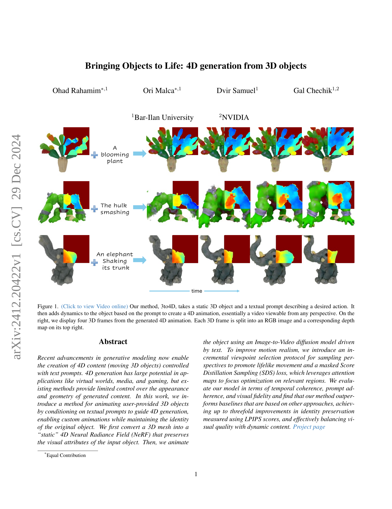
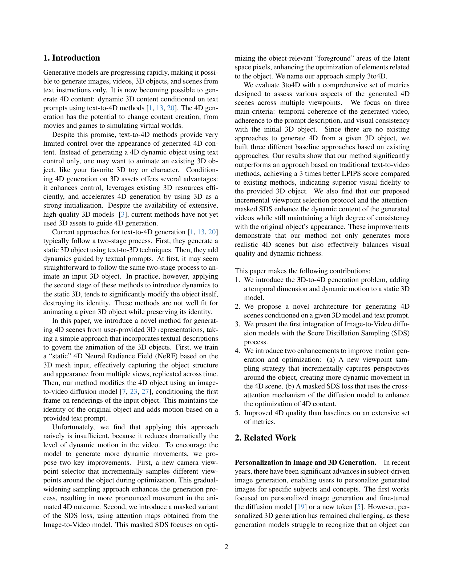
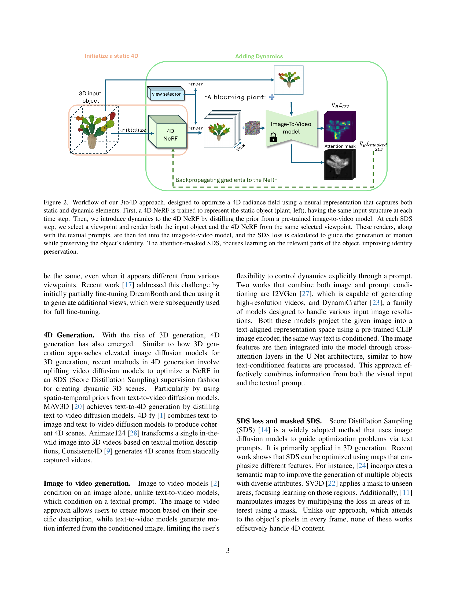
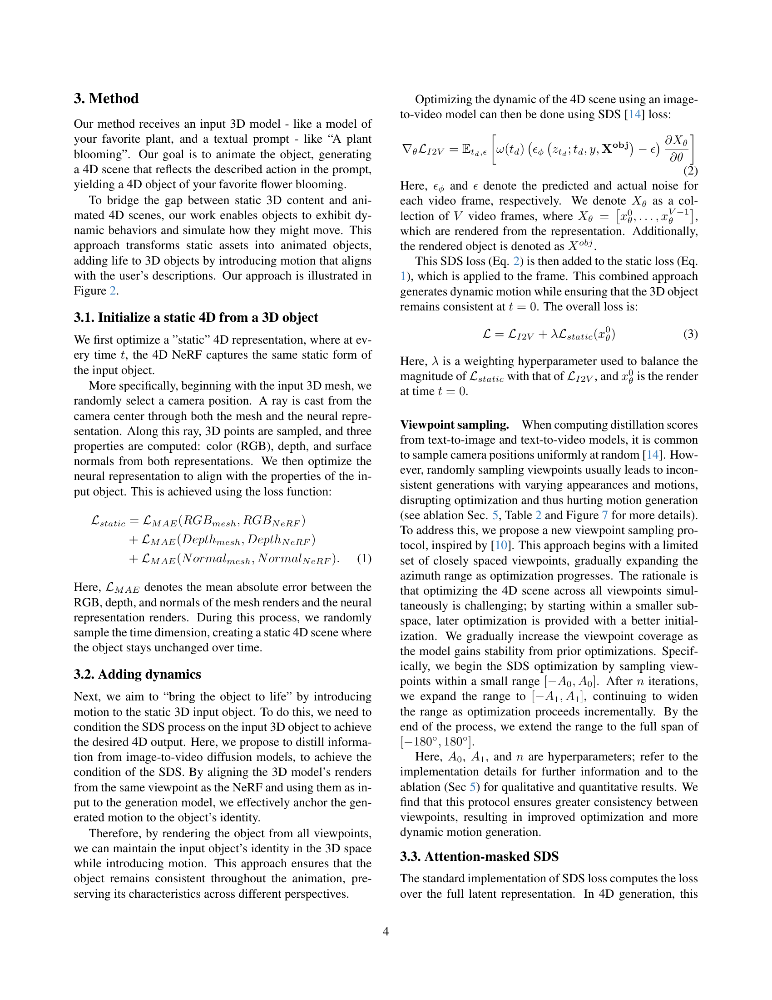
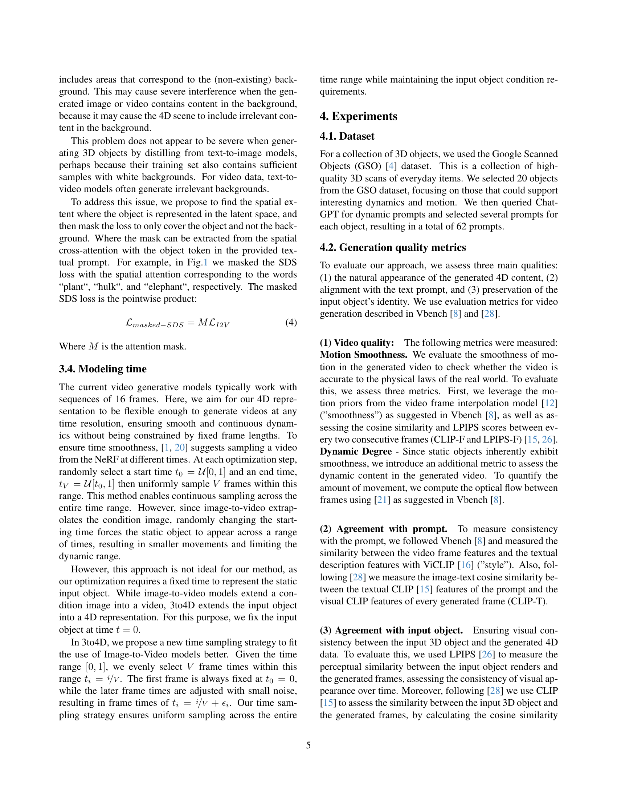
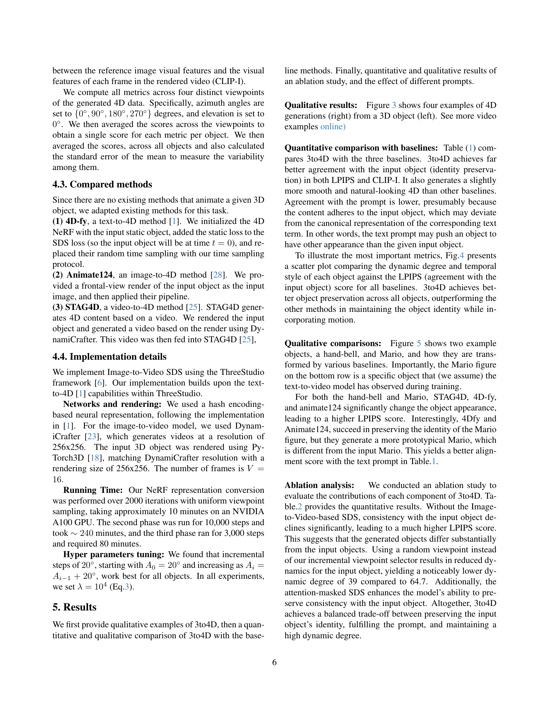
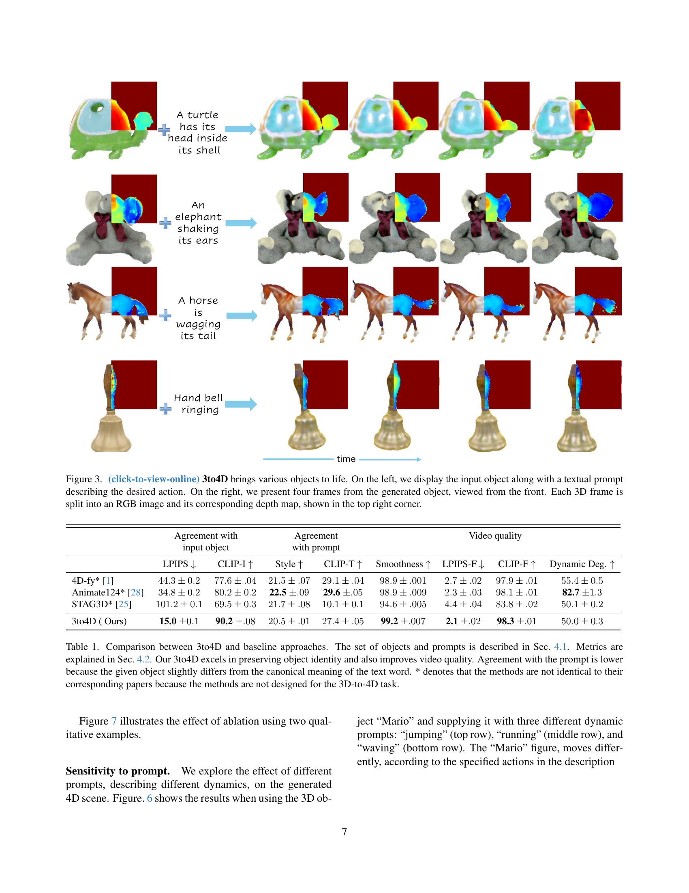
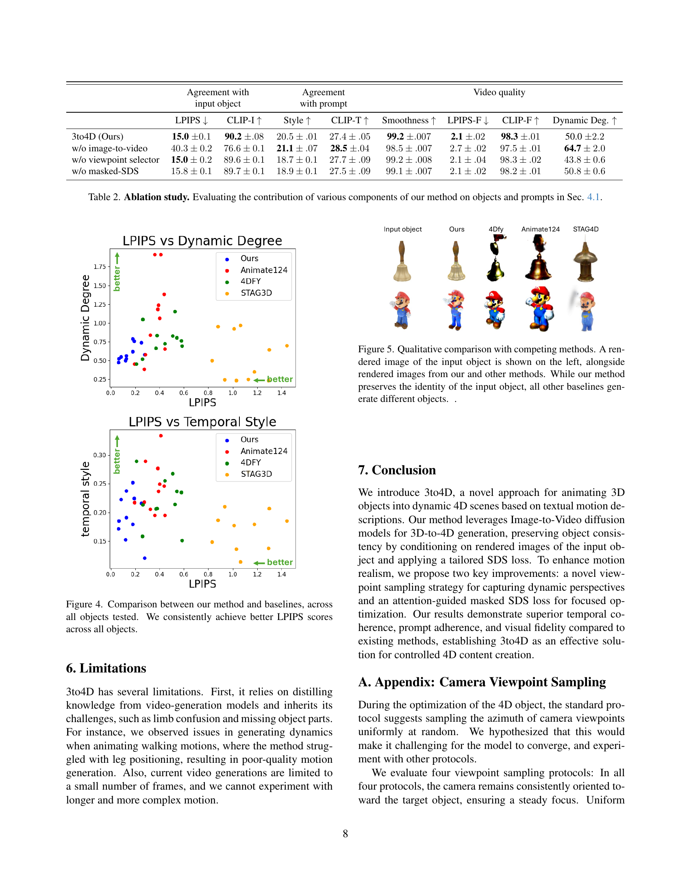
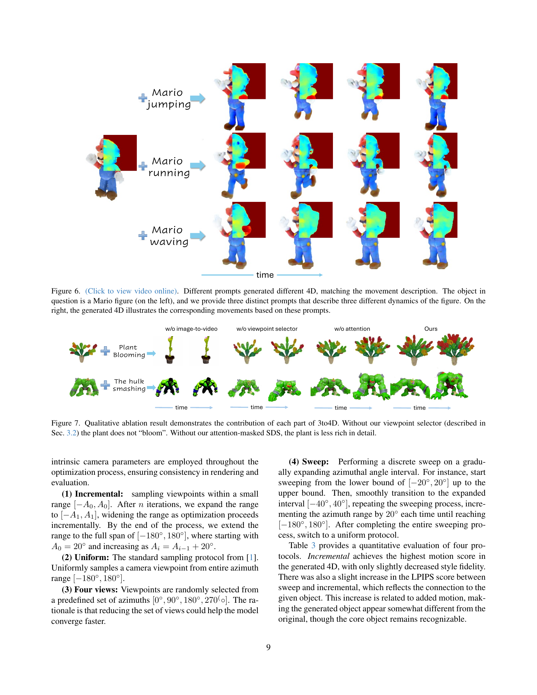
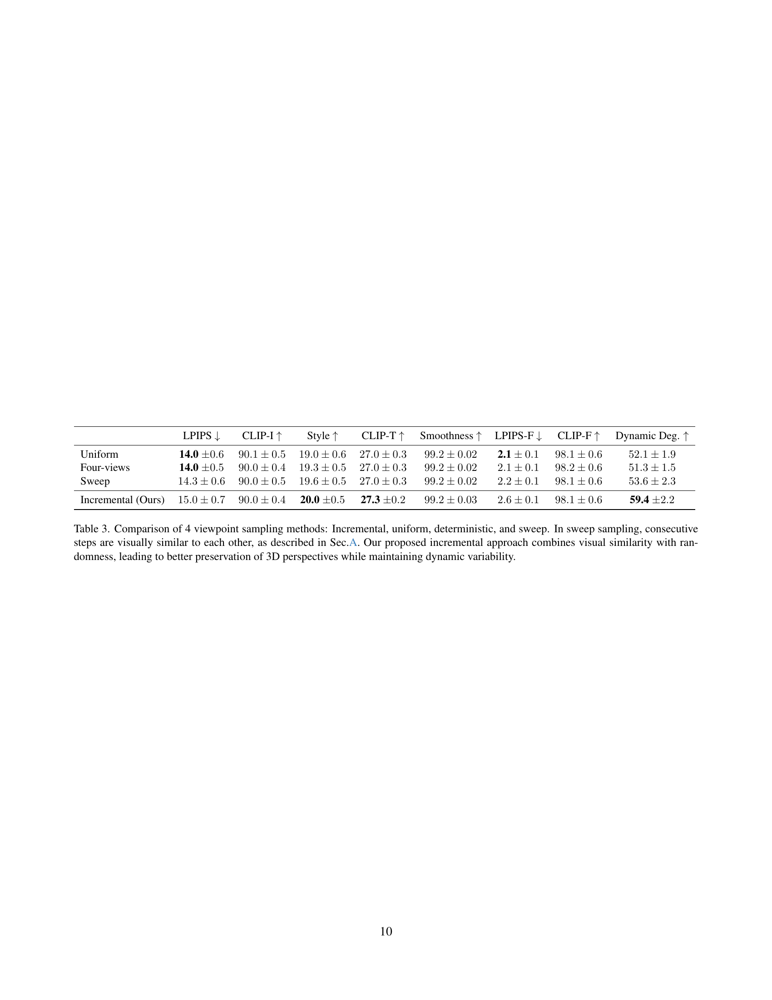
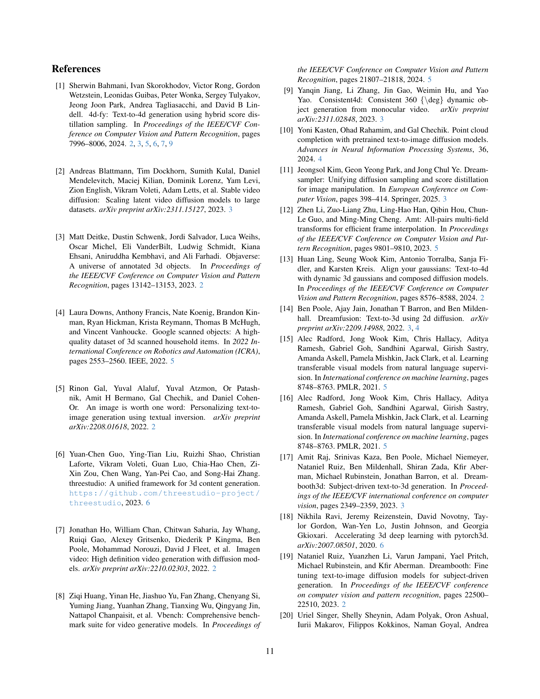
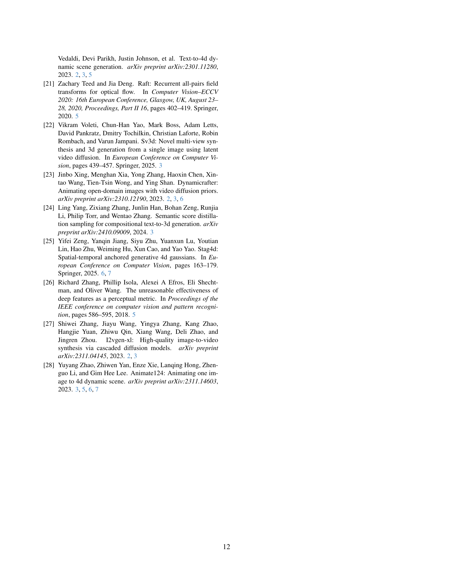
