 


 2412.20631 
 Haoran Wei et el. 
 
 🤗 2024-12-31 
 



↗ arXiv


↗ Hugging Face


↗ Papers with Code


### TL;DR



현대 컴퓨터 비전 모델들은 복잡한 기하학적 도형을 정확하게 인식하는 데 어려움을 겪고 있습니다. 특히, 기존의 대규모 비전 언어 모델(LLM)들은 도형을 정확하게 복제하는 것조차 어려워, 기하학적 문제 해결에 필요한 복잡한 논리와 공간적 관계를 이해하는 데는 더욱 어려움을 겪습니다. 이러한 문제는 기존 모델들이 도형을 한꺼번에 인식하려는 시도에서 발생합니다. 

본 논문에서는 이러한 문제를 해결하기 위해 '느린 지각(Slow Perception)'이라는 새로운 방법을 제시합니다. 느린 지각은 인간의 지각 방식을 모방하여 복잡한 도형을 단계적으로, 점과 선의 기본적인 조합부터 시작하여 점진적으로 복잡한 구조를 재구성하는 방식입니다.  이를 위해 도형을 간단한 단위로 분해하는 '지각 분해'와 선을 따라 단계적으로 추적하는 '지각 흐름'의 두 단계를 제시합니다. 놀랍게도, 느린 지각은 추론 시간과 성능 간에 긍정적 상관관계를 보이는 것을 발견하였습니다.



#### Key Takeaways


 단계적이고 인간적인 지각 방식을 모방한 '느린 지각(Slow Perception)'이 기하학적 도형 파싱의 정확도를 향상시킨다. 



 느린 지각은 추론 시간과 성능 간의 긍정적 상관관계를 보여주는 '느릴수록 좋다'는 규칙을 제시한다. 



 새로운 합성 데이터 생성 방법과 실제 시험 데이터를 통해 모델의 효과를 검증하고, 향후 연구를 위한 공개 데이터셋을 제공한다. 


#### Why does it matter?
이 논문은 **기하학적 도형 파싱의 어려움을 해결하기 위한 새로운 접근 방식인 '느린 지각(Slow Perception)'을 제시**하여, 기존의 빠른 처리 방식의 한계를 극복하고 정확도를 향상시켰다는 점에서 중요합니다.  **인간의 지각 방식을 모방한 단계적 처리 방식**은 다른 컴퓨터 비전 작업에도 적용될 수 있는 잠재력을 가지고 있으며, **새로운 데이터 생성 방법과 실험 결과**를 통해 향후 연구에 중요한 기여를 할 것입니다. 특히, **느린 지각이 추론 시간과의 상관관계를 보이는 현상**은 향후 연구 방향을 제시하는 중요한 발견입니다.

------
#### Visual Insights

> 🔼 이 그림은 논문의 'Slow Perception' 개념을 보여줍니다.  Slow Perception은 기하학적 도형을 인식하는 과정을 두 단계로 나눕니다. 첫째, 'Perception Decomposition' 단계에서는 복잡한 도형을 원이나 선분과 같은 기본적인 시각적 단위로 분해하여 다양한 기하 도형을 통일된 방식으로 표현합니다. 둘째, 'Perception Flow' 단계에서는 서로 다른 길이의 선분에 대해 동일한 모델링 방식(시작점을 기반으로 끝점 예측)을 사용하는 것이 비합리적이라는 점을 인식하고, 'perceptual ruler'를 사용하여 선분을 단계적으로 복사하는 방법을 사용합니다. 이는 사람이 선을 그릴 때 여러 짧은 선으로 나누어 그리는 방식과 유사합니다.  즉, 모델이 이미지를 단계적으로 그리고 신중하게 읽도록 함으로써 복잡한 기하학적 구조를 점진적으로 재구성하는 것을 목표로 합니다.
> 

> 
read the caption

> Figure 1: Slow perception enjoys two stages: 1) Perception decomposition. A geometric shape is decomposed into basic visual units, such as circles and line segments, thereby unifying the fundamental representational form of diverse geometric figures. 2) Perception flow. Using the same modeling approach (predicting the endpoint based on the starting point) for line segments of different lengths is unreasonable. We employ a sectional copying method to express each line segment with a perceptual ruler.
> 


Perceptual ruler|IoU|F1|F1s|F1l|P|Ps|Pl|R|Rs|Rl
---|---|---|---|---|---|---|---|---|---|---
+∞ (baseline)|0.75|51.4|44.3|47.5|50.1|42.8|49.3|53.6|48.8|47.3
|0.9|47.5|41.6|43.7|46.3|40.1|45.2|49.5|45.9|43.6
12-length|0.75|53.3|46.2|49.6|51.6|44.9|50.3|56.0|50.2|50.3
|↑ 1.9|↑ 1.9|↑ 2.1|↑ 1.5|↑ 2.1|↑ 1|↑ 2.4|↑ 1.4|↑ 3
10-length|0.75|54.4|48.4|49.6|52.9|47.1|50.1|56.8|52.5|50.1
|↑ 3|↑ 4.1|↑ 2.1|↑ 2.8|↑ 4.3|↑ 0.8|↑ 3.2|↑ 3.7|↑ 2.8
8-length|0.75|55.4|50.4|49.9|54.0|49.0|51.3|57.7|54.5|49.9
|↑ 4|↑ 6.1|↑ 2.4|↑ 3.9|↑ 6.2|↑ 2|↑ 4.1|↑ 5.7|↑ 2.6
4-length|0.75|57.5|52.4|51.8|55.8|50.8|52.9|60.7|56.9|52.2
|↑ 6.1|↑ 8.1|↑ 4.3|↑ 5.7|↑ 8|↑ 3.6|↑ 7.1|↑ 8.1|↑ 4.9
|0.9|53.5|47.3|49.5|51.9|45.9|50.4|56.0|51.2|49.9
|↑ 6|↑ 5.7|↑ 5.8|↑ 5.6|↑ 5.8|↑ 5.2|↑ 6.5|↑ 5.3|↑ 6.3

> 🔼 표 1은 제안된 느린 지각 방법의 성능을 SP-1 테스트 세트에서 평가한 결과를 보여줍니다.  's'와 'l'은 각각 짧은 선분과 긴 선분을 나타내는 약자이며, 임계값은 8로 설정되어 8보다 작은 선분은 짧은 선분으로, 8보다 큰 선분은 긴 선분으로 간주됩니다.  표에는 0.75 IoU와 0.9 IoU에서 기준 방법에 대한 현재 방법의 개선 사항을 보여주는 빨간색(0.75 IoU)과 파란색(0.9 IoU) 화살표가 포함되어 있습니다.  각 열은 지각 자(perceptual ruler)의 길이, IoU(Intersection over Union), F1 점수, 정밀도, 재현율을 나타내는 여러 지표를 보여줍니다.  다양한 지각 자 길이(4, 8, 10, 12 길이)에 따른 성능 변화를 분석하여 느린 지각 방법의 효과를 보여줍니다.  기준 방법은 선분의 시작점과 끝점을 직접 회귀하는 방법이며, 느린 지각 방법은 선분을 여러 작은 부분으로 나누어 단계적으로 지각하는 방법입니다.
> 

> 
read the caption

> Table 1: Results of different manners on the SP-1 test-set. Here, “s” and “l” are abbreviations for “short” and “long,” representing short segments and long segments, respectively. The threshold is set at 8, with segments less than 8 considered as short and those greater than 8 as long. The red upward arrow ↑↑\uparrow↑ indicates the improvement of the current method over the baseline at 0.75 IoU, while the blue ones ↑↑\uparrow↑ signifies the performance improvement under 0.9 IoU.
> 

### In-depth insights

#### Slow Perception Intro
본 논문의 "Slow Perception Intro"는 기존의 빠른 시각적 처리 방식의 한계를 극복하고자 **인간의 시각적 인지 과정을 모방한 새로운 접근법**을 제시합니다. 기존의 LVLMs(대규모 시각 언어 모델)들은 기하학적 도형을 정확하게 복사하는 것조차 어려워 복잡한 공간적 관계를 이해하는 데 어려움을 겪습니다.  이에 따라, **점진적인 단계적 인지(Slow Perception)**를 통해 모델이 기본적인 점-선 조합부터 시작하여 점차적으로 복잡한 기하학적 구조를 재구성하도록 유도하는 방식을 제안합니다. 이는 **인간의 시각적 인지 과정을 모사**하여 복잡한 도형을 단순한 요소로 분해하고 선을 한 획씩 따라 그리는 방식으로 정확성을 높입니다. **느린 처리 방식이 오히려 정확도 향상**으로 이어진다는 점이 흥미로운 발견입니다.  이는 단순한 최적화 문제를 넘어 인간의 인지 과정을 이해하는 새로운 시각을 제공합니다.  결론적으로, 본 연구는 **인간 중심적 디자인**을 통해 시각적 추론 성능을 향상시키는 새로운 가능성을 제시합니다.

#### SP's Two-Fold Stages
본 논문에서 제시된 느린 지각(SP)의 핵심은 **두 단계로 이루어진 계층적 접근 방식**에 있습니다. 첫째, **지각 분해(perception decomposition)** 단계에서는 복잡한 기하학적 도형을 기본 단위(점, 선)로 분할하여 모델이 복잡성에 압도되지 않고 단순한 구성 요소들을 다룰 수 있도록 합니다. 이는 인간의 시각적 처리 방식을 모방하여 **복잡한 문제를 단순화**하는 전략입니다. 둘째, **지각 흐름(perception flow)** 단계에서는 선을 그리는 과정을 단일 행위가 아닌 여러 개의 작은 단계로 나누어 모델의 정확도를 높입니다. 이는 **'지각 자(perceptual ruler)'** 개념을 도입하여 선을 점진적으로 추적함으로써 시각적 오류를 최소화하고, 인간처럼 점진적으로 도형을 인식하는 방식을 모방합니다. 이러한 두 단계의 조합을 통해 SP는 모델이 기하학적 도형을 **단계적으로, 정확하게 인식**할 수 있도록 합니다.

#### LVLM's Shortcomings
본 논문은 LVLMs(대규모 비전 언어 모델)이 기하학적 도형을 정확하게 복제하거나 복잡한 내재적 논리와 공간적 관계를 이해하는 데 어려움을 겪는다는 점을 **강조**합니다.  **현존하는 LVLMs은 기하 도형을 정확하게 복사하는 것조차 어려워하며**, 복잡한 기하학적 구조를 점진적으로 인식하는 인간의 방식과는 거리가 멀다는 것을 보여줍니다. 이러한 한계는 기존의 객체 탐지 방식과 LVLMs의 얕은 이미지 이해 능력으로 인해 발생하며, **기하학적 도형의 공간적 관계와 종속성을 제대로 처리하지 못하는 점**이 주요 원인으로 지적됩니다.  따라서, 모델이 기하학적 도형을 단계적으로 인식하도록 유도하는 '느린 지각(Slow Perception)' 개념의 중요성을 강조합니다.  이는 인간의 지각 방식을 모방하여 모델의 정확성과 이해도를 높이는 데 중요한 전략임을 시사합니다.  즉, **빠른 처리 속도보다는 정확하고 단계적인 지각이 중요**하다는 것을 의미합니다.

#### SP's Data Engine
SP의 데이터 엔진은 **합성 및 실제 데이터의 조합**을 통해 모델 학습을 위한 강건하고 다양한 데이터셋을 구축하는 데 중점을 둡니다. **20만 개의 합성 데이터**는 다양한 기하학적 도형을 포함하며, 선의 두께, 스타일, 이미지 해상도 등의 매개변수를 임의로 변화시켜 데이터의 이질성을 확보합니다.  **실제 데이터 480개**는 중학교 시험 문제에서 수집한 실제 기하학적 도형으로 구성되어 모델의 일반화 성능을 평가하는 데 사용됩니다.  **데이터의 다양성과 질**은 모델의 정확도 향상에 크게 기여하며, 특히 실제 데이터의 포함은 모델의 실제 세계 적용 가능성을 높입니다.  **데이터 엔진은 단순히 데이터 생성에 그치지 않고, 모델의 성능 평가를 위한 검증 및 테스트 세트를 포함**하여 실험의 신뢰성을 높이고 재현 가능성을 확보하는 데 기여합니다.

#### Future of SP
SP(느린 지각)의 미래는 **계산 복잡도의 가변성**을 중심으로 전개될 것입니다.  모델이 지각하는 대상의 난이도(예: 선의 길이)에 따라 계산 복잡도가 **동적으로 조절**되어야 합니다.  이는 마치 인간의 시각적 처리 과정처럼 복잡한 대상에는 많은 연산을, 단순한 대상에는 적은 연산을 할애하는 것을 의미합니다.  **강화 학습**을 통해 이러한 가변성을 학습시키고, **가변 길이의 지각 자** 개념을 도입하여 더욱 세련된 SP 모델을 구축할 수 있을 것입니다.  **일반화된 과제**에 적용하는 연구도 중요한데, 기하학적 도형 파싱을 넘어 더욱 포괄적인 시각적 이해 과제에 적용 가능성을 모색해야 합니다.  **인간의 지각 방식**을 모방하는 SP는 다양한 분야에 응용될 수 있으므로, 이러한 잠재력을 탐구하는 것은 중요한 연구 방향입니다.

### More visual insights

More on figures

> 🔼 그림 2는 사람이 선을 따라 그릴 때 일반적으로 느린 지각 과정을 거친다는 것을 보여줍니다. 특히 긴 선을 한 번에 스케치하기보다는(장거리 '점프'), 높은 정확도를 위해 여러 개의 짧은 선으로 선을 그리는 경우가 많습니다. 본 논문에서 제안하는 '느린 지각' 알고리즘은 이러한 점을 모방하여 기하학적 도형을 점진적으로 인식하는 사람의 과정을 모방하도록 설계되었습니다.
> 

> 
read the caption

> Figure 2: When humans trace a line, it is typically a slow perception process. Rather than sketching the line, especially a long line, in one stroke (long range “jump”), humans commonly draw a line with “multiple short strokes” for high precision. Our “slow perception” algorithm is designed based on this to mimic the gradual human process of discerning geometric figures.
> 

> 🔼 이 그림은 본 논문에서 제안하는 '느린 지각(Slow Perception)'의 프레임워크를 보여줍니다.  느린 지각은 가장 인기있는 거대 언어-비전 모델(LVLM) 프레임워크에 적용될 수 있으며, 다음 토큰 직렬화 예측 방식을 사용하여 모델이 점들을 순차적으로 예측하고 이전에 예측된 점들의 좌표를 참조하여 닫힌 형태의 도형을 더 쉽게 생성할 수 있도록 합니다.  '지각 자(Perceptual ruler)'라는 개념을 도입하여 단일 단계 예측 거리의 상한선을 설정합니다.  즉, 모델이 한 번에 예측할 수 있는 거리를 제한하여 점들을 더욱 정확하게, 단계적으로 인식하도록 유도하는 것입니다. 이를 통해 복잡한 기하학적 도형을 단순한 점과 선의 조합으로 분해하여 점진적으로 인식하는 인간의 지각 방식을 모방합니다.
> 

> 
read the caption

> Figure 3: The framework of slow perception. Our approach is adaptable to the most popular LVLM frameworks. According to the next-token serialized prediction, predicted subsequent geometric points can reference the coordinates of preceding points to achieve closed shapes more easily. We establish a perceptual ruler as the upper limit for single-step distance prediction.
> 

> 🔼 그림 4는 훈련 데이터로 사용된 합성 기하학적 도형들의 선 길이와 각도 분포를 보여줍니다. 왼쪽 그림은 선 길이 분포를, 오른쪽 그림은 선 각도 분포를 나타냅니다. 이 분포는 다양한 기하학적 도형을 구성하는 선의 길이와 각도가 어떻게 분포되어 있는지 보여주어, 모델이 다양한 형태의 기하학적 도형을 학습하는 데 도움이 됩니다.  다양한 길이와 각도를 가진 선들이 균형 있게 포함되어 있음을 알 수 있습니다. 이는 모델이 다양한 크기와 형태의 기하학적 도형을 효과적으로 인식하고 생성하는 데 중요한 요소입니다.
> 

> 
read the caption

> Figure 4: The line distribution of rendered train data. The left figure shows the line length and the right is angle distributions to comprise the geometric shapes in the train data.
> 

> 🔼 그림 5는 기준 진실값(ground truth)의 예시를 보여줍니다. 지각 자(perceptual ruler)의 길이가 4일 때, 렌더링된 기하학적 도형 샘플과 해당하는 텍스트 레이블을 보여줍니다.  이 그림은 모델이 예측해야 하는 기하학적 도형의 구성 요소(선분, 원 등)와 각 요소의 시작점과 끝점 좌표를 텍스트로 표현하여 모델의 학습 및 평가에 사용됩니다.  각 선분은 '시작점 → 중간점 1 → 중간점 2 → ... → 끝점' 형태로 표현되어, 모델이 선을 단일 스트로크로 그리는 것이 아니라, 여러 작은 단계로 나누어 점진적으로 그리는 '느린 지각' 방식을 사용하도록 유도하는 것을 보여줍니다.
> 

> 
read the caption

> Figure 5: An example of the ground truth. This figure shows an rendered geometry sample and the corresponding text labels under the length of perceptual ruler being 4.
> 

> 🔼 그림 6은 지각 자(perceptual ruler)의 길이가 감소함에 따라 거의 모든 지표에서 꾸준한 성능 향상을 보여줍니다. 지각 자의 길이가 짧을수록 선을 모델링하는 데 더 많은 '획'(strokes)이 필요하며, 그 결과 모델이 더 많은 중간 '시선 지점'(gaze points)을 출력합니다. 이는 추론 중 계산 복잡도가 증가하고, 그에 따라 추론 시간이 길어짐을 의미합니다. 이는 어느 정도 추론 시간 척도 법칙(inference time scaling law)을 보여줍니다.
> 

> 
read the caption

> Figure 6: As the length of the perceptual ruler decreases, we can observe a steady improvement in almost all metrics. The shorter the perceptual ruler, the more “strokes” are needed to model a line, resulting in the model outputting more intermediate “gaze” points. This leads to increased computational complexity during inference, and correspondingly longer inference times, exhibiting to some extent an inference time scaling law.
> 

> 🔼 그림 7은 훈련된 모델이 흔들린 시선점(gaze point)을 사용하여 생성한 결과를 보여줍니다. 각 선분의 '획 순서(stroke order)'는 무지개색에 따라 매핑됩니다. 예를 들어, '흔들림 없음(without jitter)' 결과에는 빨강, 주황, 노랑이 사용되고, '흔들림 있음(with jitter)' 결과에는 초록, 청록, 파랑이 사용됩니다. 이 그림은 시선점의 정확도가 아닌, 모델이 선을 따라 점진적으로 그리는 '지각 흐름(perception flow)' 과정에 초점을 맞춥니다.
> 

> 
read the caption

> Figure 7:  ‘With jitter” represents the result of a trained model using gaze points that have been shaken. The “stroke order” of each line segment is mapped according to the color of the rainbow, e.g., red, orange, and yellow are used in “without jitter” result, and green, cyan, and blue are used in “with jitter” one.
> 

> 🔼 그림 8은 제시된 기하학적 도형을 모델이 '느린 지각' 방식으로 해석하는 과정을 시각적으로 보여줍니다. 첫 번째 열은 입력 이미지, 두 번째 열은 모델이 도형을 그리는 각 단계(획)의 경로를 무지개색으로 표현하며, 세 번째 열은 최종 결과물입니다. 무지개색은 각 획의 순서를 나타냅니다. 이 그림은 복잡한 기하학적 도형을 모델이 점진적으로, 마치 사람처럼 단계적으로 인식하는 과정을 보여주는 데 초점을 맞추고 있습니다.
> 

> 
read the caption

> Figure 8: Slow perception visualization results. The first column represents the input image, and the second column shows the trace route of each “stroke” executed by the model in slow perception, with “stroke order” defined by rainbow colors. The third column is the final result of parsing slow perception.
> 

> 🔼 그림 9는 기하학적 도형에서 점과 선에 레이블을 추가하는 과정을 보여줍니다. 자동 회귀 프레임워크를 사용하면 이 과정이 매우 간단합니다. 비록 이 과정이 느린 지각(slow perception) 개념 자체에는 영향을 미치지 않지만, 수학적 기하학적 VQA와 같은 후속 작업에 기하학적 파싱 결과를 통합하기 위해서는 필수적입니다. 그림은 입력 이미지와 이에 대응하는 출력 레이블, 렌더링된 결과를 보여줍니다. 이를 통해 자동 회귀 모델이 점과 선의 좌표, 레이블 정보를 효율적으로 처리하고 생성할 수 있음을 보여줍니다.  느린 지각은 복잡한 도형을 단순한 요소로 분해하고 단계적으로 인식하는 방법이지만, 이렇게 파싱된 정보는 VQA와 같은 더 복잡한 작업에 활용될 수 있음을 시사합니다.
> 

> 
read the caption

> Figure 9: Adding labels for points and lines in geometric shapes is easy for the auto-regression framework. Although this process does not affect the claim of slow perception, it is necessary to embed the geometry parsing results into downstream tasks, e.g., mathematic geometric VQA.
> 

> 🔼 그림 10은 기하학적 파싱 결과를 GPT-4o에 참조 자료로 추가할 때 입력의 구성을 보여줍니다. 파싱 결과는 GPT-4o에 '스케치'로 제공되며, 점과 선 사이의 관계만을 어느 정도 나타낼 수 있고 참조용일 뿐이라는 점을 강조합니다. 모델이 최종 답변을 입력 이미지를 기반으로 해야 한다는 점을 요구합니다. 즉, 추가된 스케치 정보는 모델의 추론을 돕는 보조적인 역할을 하지만, 최종적인 판단은 입력 이미지에 대한 모델의 이해에 의존한다는 의미입니다.
> 

> 
read the caption

> Figure 10: The organizational of input when adding geometry parsing results as a reference for GPT-4o. We provide the parsing results as a “sketch” to GPT-4o, emphasizing that it can only represent the relationship between points and lines to a certain extent, and is only for reference. We require the model that the final answer still needs to be based on the input image.
> 

> 🔼 그림 11은 서로 다른 모델들의 기하학적 도형 파싱 결과를 시각적으로 보여줍니다. GPT-4 및 Claude-3.5 모델의 경우, '이 기하학적 도형에 대한 TikZ 코드를 작성하십시오. 점에 대한 레이블을 작성하지 않도록 주의하고, 기하학적 도형만 그리십시오.' 라는 프롬프트를 사용하여 결과를 출력했습니다. 이 그림은 서로 다른 모델들이 기하학적 도형을 파싱하는 방식의 차이를 보여주는 여러 기하학적 도형과 각 모델의 출력 결과를 보여줍니다.  특히, Slow perception 모델이 다른 모델들보다 더 정확하게 도형을 생성하는 것을 시각적으로 확인할 수 있습니다. GPT-4와 Claude-3.5는 복잡한 도형에 대한 TikZ 코드 생성에 어려움을 겪는 반면, Slow perception은 더욱 정확하고 완성도 높은 결과를 보여줍니다.
> 

> 
read the caption

> Figure 11: Visualization of geometric parsing results of different models. For GPT-4o and Claude-3.5, we use this prompt to output the results: Write the Tikz code for this geometric figure, be careful not to write labels for points, only draw the geometric shape.
> 

More on tables


| Perceptual ruler | IoU | F1 | F1s | F1l | P | Ps | Pl | R | Rs | Rl |
|---|---|---|---|---|---|---|---|---|---|---|
| +∞ (baseline) | 0.75 | 52.2 | 41.3 | 49.2 | 51.1 | 39.2 | 50.6 | 53.7 | 46.6 | 48.9 |
|  | 0.9 | 48.6 | 36.4 | 47.2 | 47.6 | 34.9 | 48.6 | 50.1 | 40.6 | 46.8 |
| 4-length | 0.75 | 56.7 | 44.3 | 54.3 | 54.9 | 42.0 | 55.5 | 59.5 | 49.6 | 54.4 |
|  |  | ↑ 4.5 | ↑ 3 | ↑ 5.1 | ↑ 3.8 | ↑ 2.8 | ↑ 4.9 | ↑ 5.8 | ↑ 3 | ↑ 5.5 |
|  | 0.9 | 51.9 | 39.0 | 51.6 | 50.3 | 37.2 | 52.8 | 54.2 | 43.1 | 51.6 |
|  |  | ↑ 3.3 | ↑ 2.6 | ↑ 4.4 | ↑ 2.7 | ↑ 2.3 | ↑ 4.2 | ↑ 4.1 | ↑ 2.5 | ↑ 4.8 |
> 🔼 표 2는 SP-1 검증 세트에 대한 다양한 방법의 결과를 보여줍니다. 표의 상승 화살표는 표 1과 동일한 의미를 갖습니다. 느린 인식의 성능 향상이 검증 분할에서도 안정적임을 알 수 있습니다.  즉, 본 논문에서 제안하는 '느린 인식' 기법이 훈련 데이터 뿐 아니라 검증 데이터에서도 일관되게 성능 향상을 가져온다는 것을 보여주는 표입니다.  특히, '지각 자(perceptual ruler)'의 길이를 조절하여 모델의 성능 변화를 비교 분석하였습니다.  각 지표(IoU, F1, 정밀도, 재현율)에 대한 결과가 제시되어 있으며, '느린 인식' 방법이 기준선(baseline) 모델보다 우수한 성능을 보임을 확인할 수 있습니다.
> 

> 
read the caption

> Table 2: Results of different manners on the SP-1 val-set. The up-arrow in the figure has the same meaning as Table 1. It can be seen that the performance improvements of slow perception on the validation split are also stable.
> 


| Model | Size | Ruler | F1 | P | R |
|---|---|---|---|---|---| 
| Qwen2-VL | 2B | +∞ | 44.1 | 43.1 | 46.0 |
|  |  | 4 | 46.0 | 45.2 | 47.9 |
| Vary-toy | 1.8B | +∞ | 45.5 | 44.8 | 47.2 |
|  |  | 4 | 47.8 | 46.7 | 50.0 |
> 🔼 표 3은 제안된 방법의 효율성을 추가로 검증하기 위해 Qwen2-VL [29] 및 Vary-toy [32] 모델을 학습시키는 동안 인코더를 고정하고 SP-1 테스트 세트에서 이러한 모델을 테스트한 결과를 보여줍니다. 'Ruler'는 지각 자의 길이를 의미하며, 따라서 +∞는 느린 지각 없이 기준선을 나타냅니다. 이 표는 서로 다른 LLM 모델에서 제안된 느린 지각 방법의 성능을 비교 분석하여, 느린 지각 방법의 일반화 가능성과 효율성을 보여줍니다.
> 

> 
read the caption

> Table 3: Slow perception on other LVLMs. We freeze the encoders to train Qwen2-VL [29] and Vary-toy [32] and test these models on SP-1 test-set to further verify the efficiency of the proposed method. The “Ruler” means the perceptual ruler length, and thus +∞\infty∞ represents the baseline without slow perception.
> 


| Model | Unfreeze | Ruler | F1 | P | R |
|---|---|---|---|---|---| 
| GOT | ✓ | +∞ | 51.4 | 50.1 | 53.6 |
| GOT | ✓ | 4 | 57.5 | 55.8 | 60.7 |
| GOT | × | +∞ | 43.8 | 41.7 | 47.3 |
| GOT | × | 4 | 46.9 | 44.2 | 50.9 |
> 🔼 본 표는 GOT [34] 인코더를 동결하거나 동결 해제하여 비전 인코더가 기하학적 도형 파싱 작업의 병목 현상인지 여부를 추가로 테스트한 결과를 보여줍니다.  'Unfreeze' 열은 비전 인코더의 가중치를 학습 중에 업데이트했는지 여부를 나타내고, 'Ruler' 열은 느린 지각 방법에서 사용된 지각 자의 길이를 나타냅니다.  'F1', 'P', 'R' 열은 각각 0.75 IoU 임계값에서의 F1 점수, 정밀도, 재현율을 나타냅니다.
> 

> 
read the caption

> Table 4: Vision encoder test. We further test whether the vision encoder is a bottleneck for geometric figure parsing task by freezing or unfreezing the GOT [34] encoder.
> 


| Model | Jitter | Ruler | F1 | P | R |
|---|---|---|---|---|---| 
| GOT | × | 4 | 57.5 | 55.8 | 60.7 |
| GOT | ✓ | 4 | 56.6 | 54.5 | 59.6 |
> 🔼 표 5는 시각적 지각 흐름에서 'gaze point'의 정확도가 얼마나 중요한지를 보여줍니다. 선분을 따라 'gaze point'의 실제 값에 임의의 잡음을 추가하여 실험을 진행했습니다. 그 결과, 성능 저하가 1% 미만(57.5% 대비 56.6%)으로 미미하여 시각적 지각 흐름 자체가 정확도보다 더 중요함을 시사합니다. 즉, gaze point의 정확도가 떨어지더라도 시각적 지각 흐름이 유지되면 성능에 미치는 영향이 크지 않음을 의미합니다.
> 

> 
read the caption

> Table 5: Which is more important, the accuracy of the gaze point or the perception flow? We randomly jitter the ground truth of “gaze points” along the line segment. The performance only decrease by less than 1% (57.5% vs. 56.6%).
> 


| Model | Method | Accuracy |
|---|---|---|
| GPT-4o | original | 53.37 |
| GPT-4o | + slow perception | 60.10 ↑ 6.73 |
> 🔼 표 6은 기하학적 파싱 결과를 참조 데이터로 활용했을 때 GPT-4의 Mathvista Geo 하위 집합에 대한 정확도 향상을 보여줍니다. GPT-4의 경우에도 세밀한 시각적 인식 능력이 부족하다는 것을 보여주는 결과입니다. 인식은 추론의 기초이며, 그 어려움이 항상 간과되어 왔음을 시사합니다.
> 

> 
read the caption

> Table 6: With geometric parsing results as a reference. GPT-4o can lift 6.73% accuracy on the Mathvista geo subset. This result further indicates that even for GPT-4o, its fine-grained visual perception ability is insufficient, perception is the foundation of reasoning, and its difficulty has always been overlooked.
> 

### Full paper


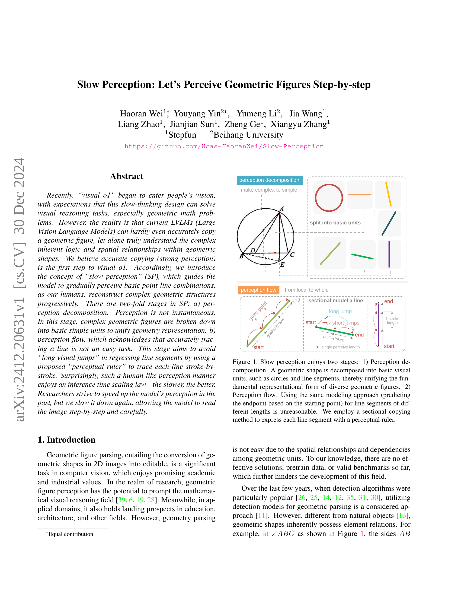
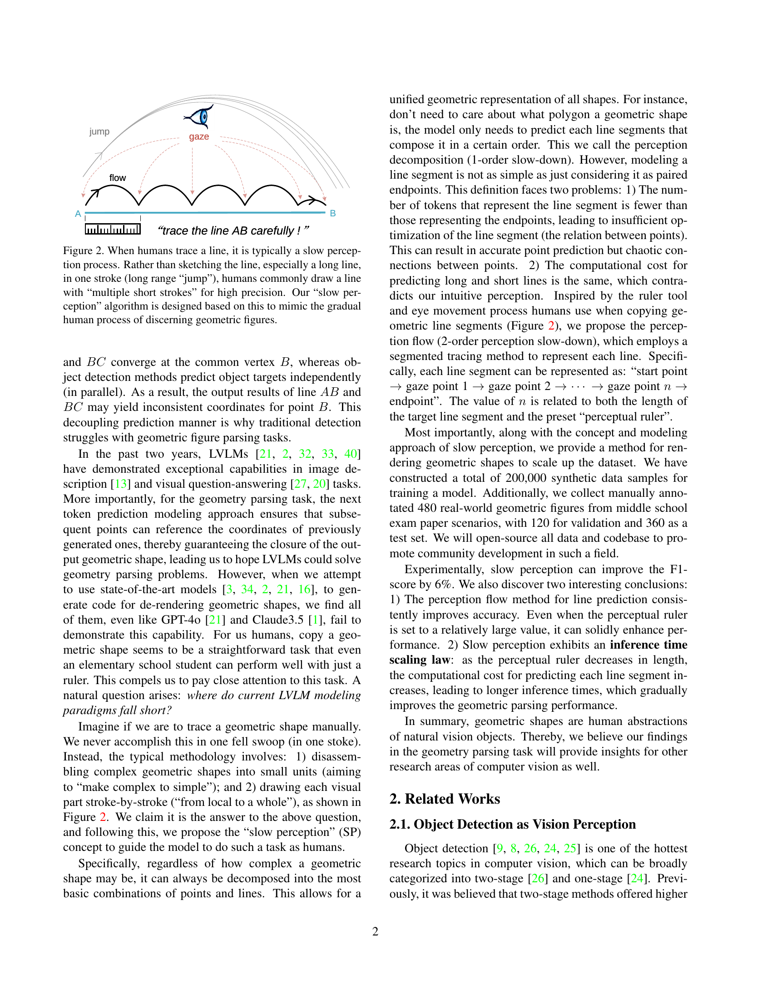
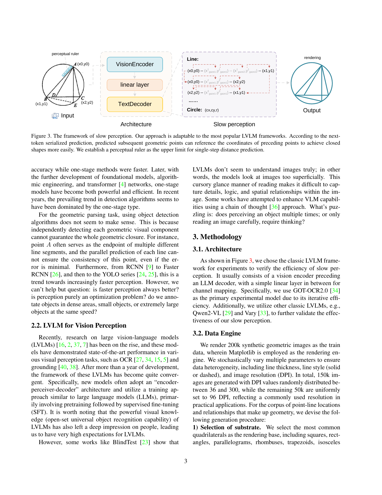
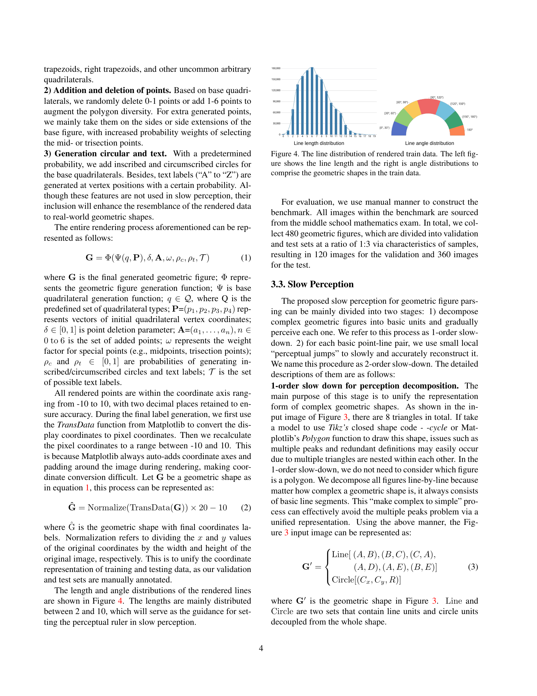
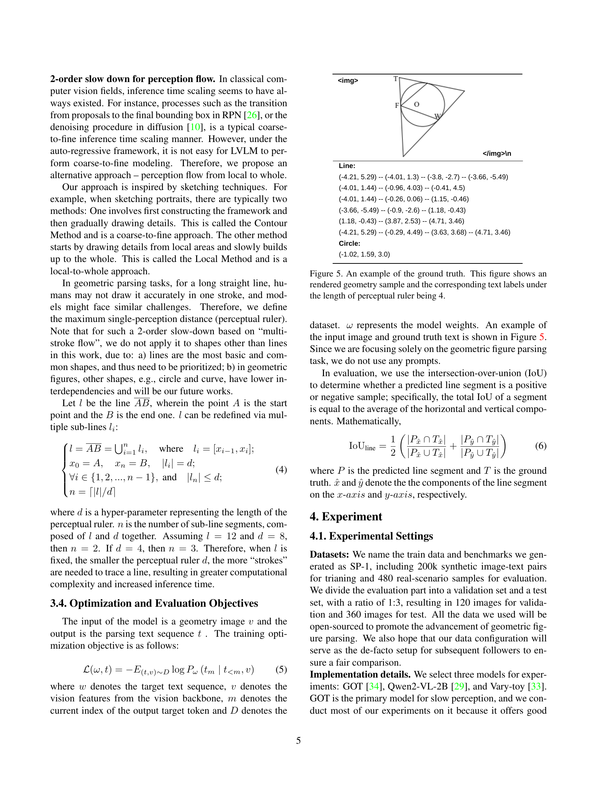
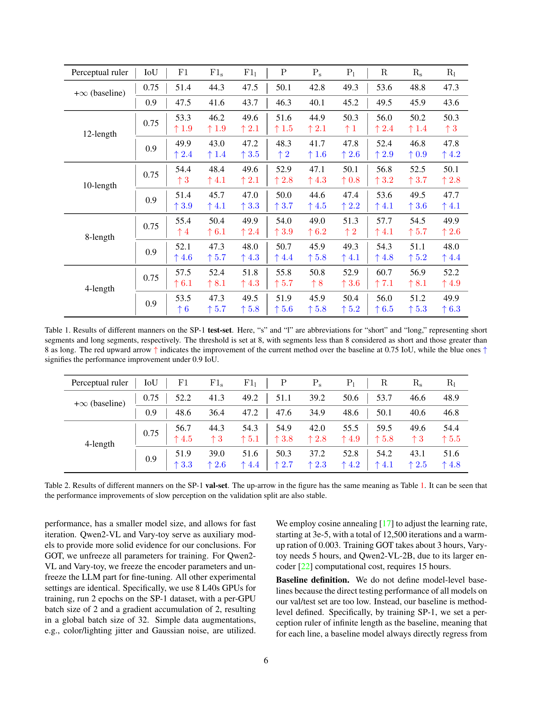
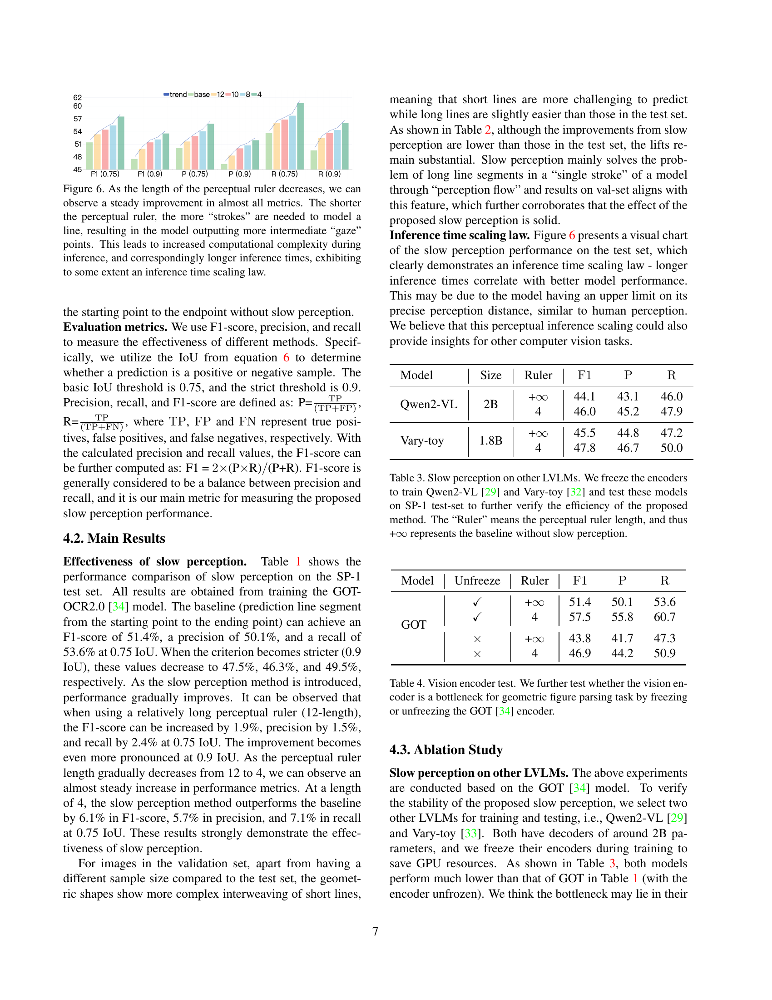
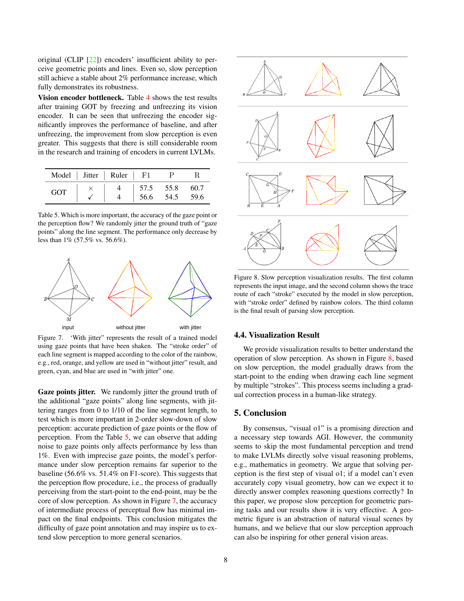
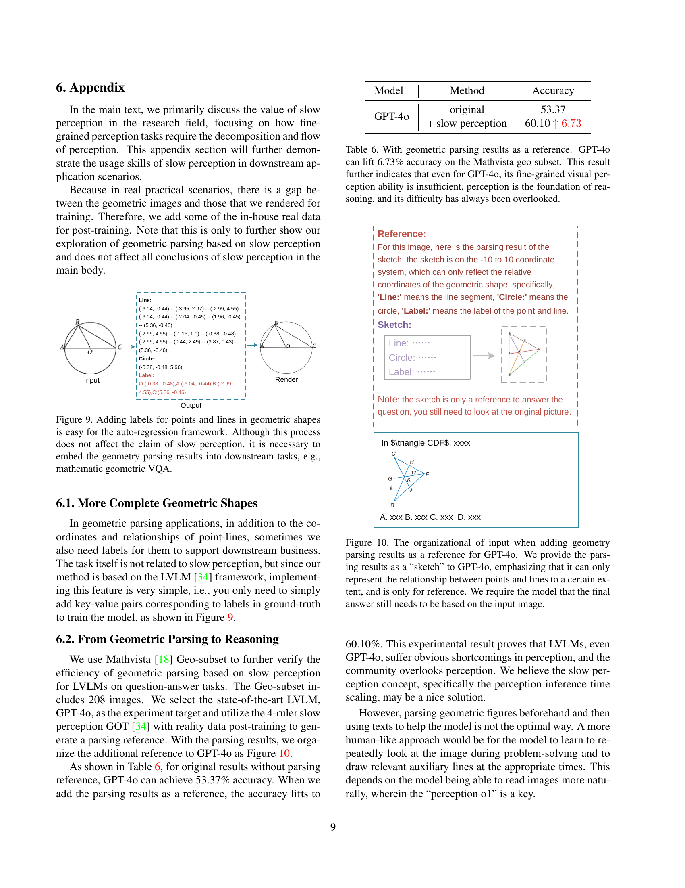
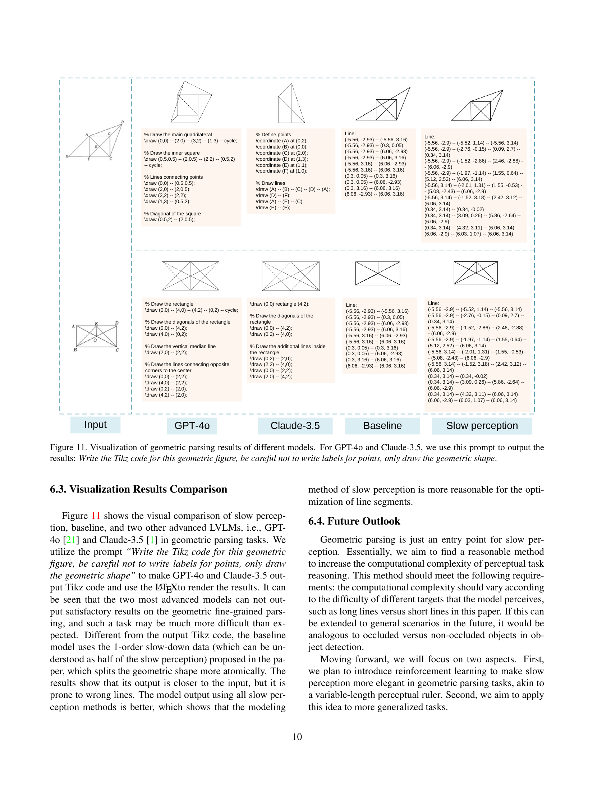
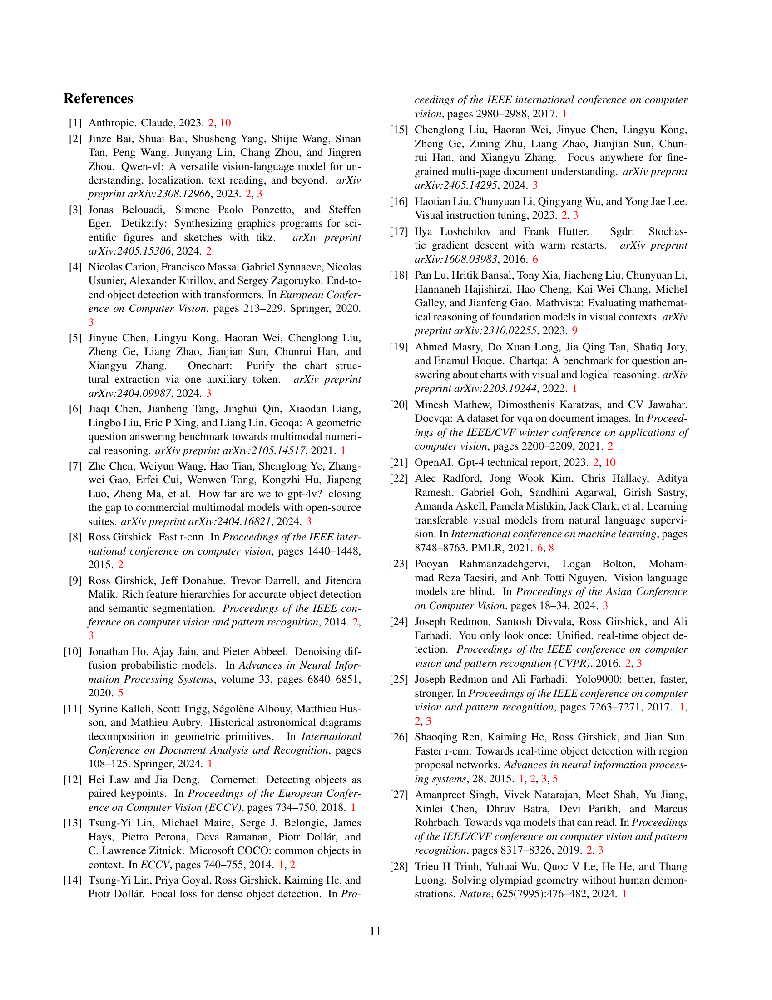
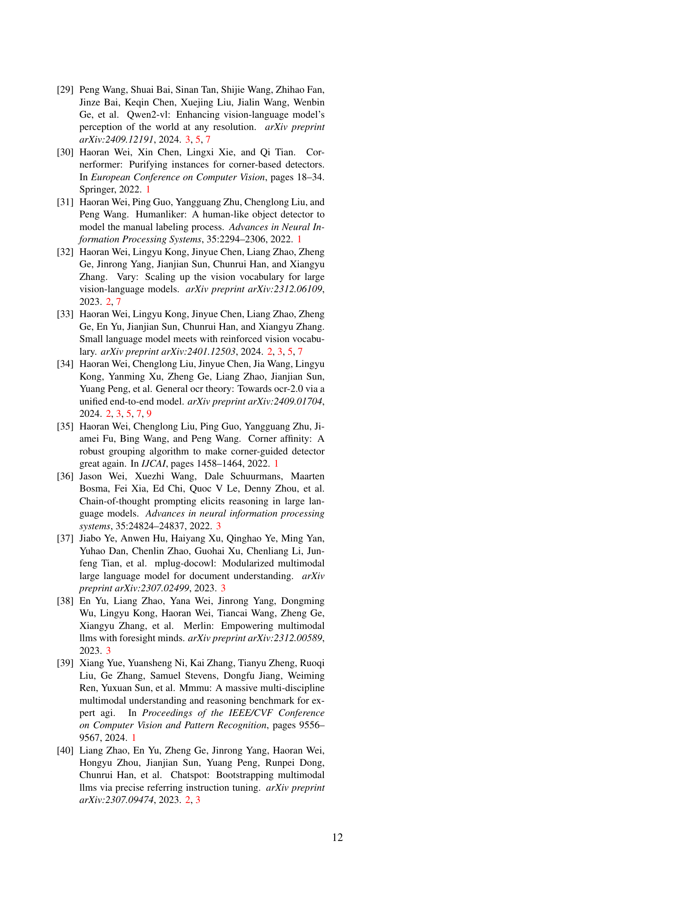
