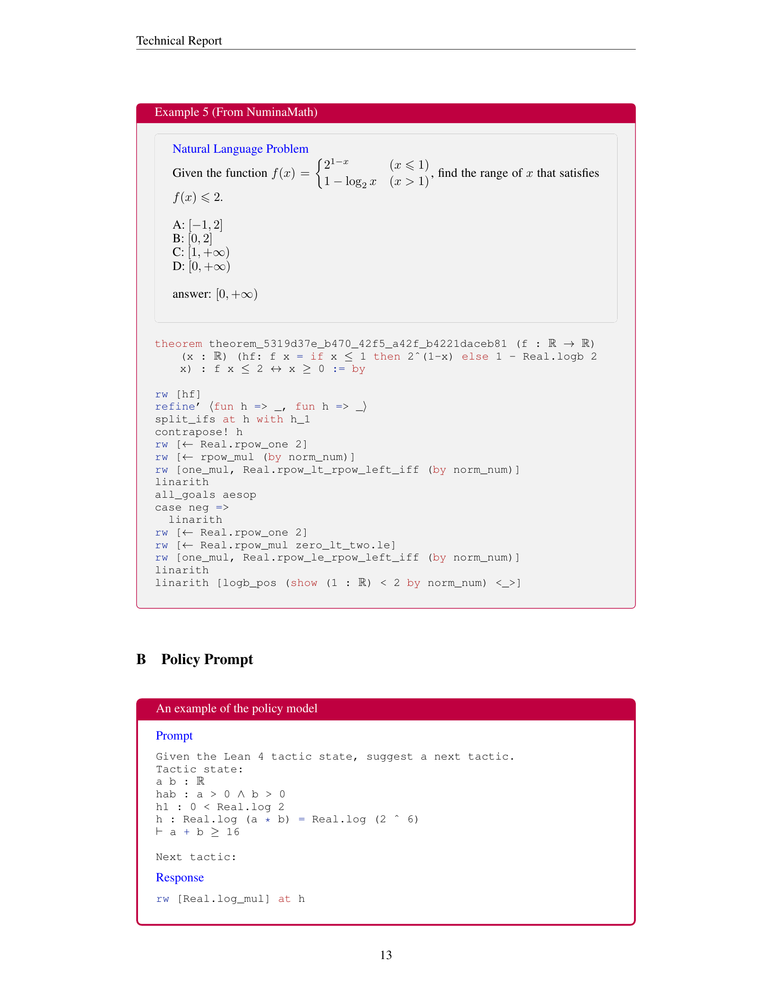

 


 2412.20735 
 Yang Li et el. 
 
 🤗 2025-01-02 
 



↗ arXiv


↗ Hugging Face


↗ Papers with Code


### TL;DR



자동 정리 증명은 인공지능 분야의 중요한 과제이며, 기존의 방법들은 복잡한 수학적 문제에 대한 증명 능력이 부족했습니다. 특히, **데이터 부족**이 큰 걸림돌이었습니다.  이러한 문제를 해결하기 위해, 고성능 언어 모델을 기반으로 한 새로운 접근 방식이 필요했습니다.

본 연구에서는 이러한 문제를 해결하기 위해 **HunyuanProver**라는 새로운 시스템을 제안합니다. HunyuanProver는 **확장 가능한 데이터 합성 프레임워크**와 **지능적인 탐색 알고리즘**을 결합하여, 기존 시스템보다 훨씬 효율적으로 자동 정리 증명을 수행합니다.  **대규모 데이터셋을 공개**하여 다른 연구자들의 연구를 지원하며, 자동 정리 증명 분야의 발전에 크게 기여할 것으로 기대됩니다.



#### Key Takeaways


 대규모 언어 모델 기반의 자동 정리 증명 시스템인 HunyuanProver 제시 



 데이터 부족 문제 해결을 위한 확장 가능한 데이터 합성 프레임워크 개발 



 효과적인 증명 전략 탐색을 위한 안내 트리 탐색 알고리즘 고안 및 기존 시스템 성능 능가 


#### Why does it matter?
본 논문은 **자동 정리 증명 분야의 데이터 부족 문제를 해결하기 위한 확장 가능한 프레임워크**와 **효과적인 증명 전략 탐색 알고리즘**을 제시하여, 기존 시스템의 성능을 능가하는 혁신적인 자동 정리 증명 시스템을 개발한 연구입니다. 이는 수학적 추론과 자동 정리 증명 분야의 발전에 크게 기여하며, **향후 연구 방향**에 대한 새로운 가능성을 제시합니다. 특히, 대규모 언어 모델을 활용한 자동 정리 증명 분야에 대한 새로운 연구 방법을 제시하여, 관련 연구자들에게 중요한 의미를 갖습니다.

------
#### Visual Insights

> 🔼 그림 1은 최적 우선 탐색(BFS)과 몬테카를로 트리 탐색(MCTS) 알고리즘을 비교한 것입니다.  BFS는 한 번의 반복에서 선택(Selection)과 확장(Expansion) 단계만 수행하지만, MCTS는 선택, 확장, 시뮬레이션(Simulation), 역전파(Backpropagation)의 네 단계를 모두 거칩니다. 그림에서 숫자는 각 노드에 할당된 평가 점수(critic-assigned scores)를 나타냅니다.  BFS는 간단하지만 효율적이며, MCTS는 복잡한 문제 해결에 더 적합하지만, 계산 비용이 더 많이 듭니다.  이 그림은 두 알고리즘의 차이점을 시각적으로 보여주어, 각 알고리즘의 장단점과 적용 분야를 이해하는 데 도움을 줍니다.
> 

> 
read the caption

> Figure 1: Comparing best-first search (BFS) with Monte-Carlo tree search (MCTS). BFS only takes Selection and Expansion in one iteration, while MCTS takes all four steps. The numbers represent critic-assigned scores.
> 


| System | Model Size | Sample Budget | MiniF2F-test |
|---|---|---|---| 
| *Whole-Proof Generation Methods* |  |  |  |
| DeepSeek-Prover-V1.5-RL+MCTS | 7B | 16 × 6400 | 60.2% |
| DeepSeek-Prover-V1.5-RL+RMaxTS | 7B | 32 × 6400 | 63.5% |
| *Interactive Step Proving Methods* |  |  |  |
| Lean-STaR+BFS+CG | 7B | 64 × 1 × 50 | 46.3% |
| InternLM2.5-StepProver+BFS | 7B | 256 × 32 × 600 | 59.4% |
| InternLM2.5-StepProver+BFS+CG | 7B | 256 × 32 × 600 | 65.9% |
| HunyuanProver v16+BFS | 7B | 600 × 8 × 400 | 64.8% |
| HunyuanProver v16+BFS+DC | 7B | 600 × 8 × 400 | **68.4**% |

> 🔼 표 1은 MiniF2F 테스트에서 다른 시스템과 비교하여 정확도와 샘플링 비용을 보여줍니다. CG는 비평가가 유도하는 검색을 나타내고, DC는 제안된 거리 비평가를 사용하는 것을 나타냅니다. BFS 방법의 경우 비용은 #Pass × #Beam × #Iteration으로 표현되고, MCTS의 경우 비용은 #Pass × #Iteration으로 정의됩니다. 이 표는 다양한 모델의 성능을 비교 분석하여 제안된 HunyuanProver 모델의 효율성과 정확성을 강조합니다.
> 

> 
read the caption

> Table 1: Main comparison regarding accuracy and sampling cost with other systems on MiniF2F-test. CG indicates critic-guided search, while DC represents taking our proposed distance critic as guidance. For BFS methods, the cost is represented as #Pass × #Beam × #Iteration, while for MCTS, the cost is defined as #Pass × #Iteration.
> 

### In-depth insights

#### Scalable Data Synth
본 논문에서 제시된 "확장 가능한 데이터 합성" 방법은 **자동 정리 증명을 위한 데이터 부족 문제**를 해결하기 위한 핵심 전략입니다.  기존의 수동 데이터 수집 방식의 한계를 극복하고, **적은 비용으로 대량의 고품질 데이터**를 생성하는 데 중점을 둡니다. 이는 자동 정리 증명 모델의 성능 향상에 직접적으로 기여하며, **특히 복잡한 수학적 정리 증명**에 효과적입니다.  **반복적인 데이터 생성 과정**을 통해 모델의 정확도를 지속적으로 개선하는 전략은, 데이터의 양적 확장 뿐 아니라 질적 향상에도 기여할 것으로 예상됩니다.  하지만, **데이터의 품질 관리 및 선택 과정**이 성능에 중요한 영향을 미칠 수 있다는 점을 고려해야 합니다.  **다양한 크리틱 모델**을 활용하여 탐색 과정을 안내하는 방식은 효율적인 탐색을 보장하고, **모델의 일반화 능력 향상**에 기여할 것으로 예상됩니다.

#### Guided Tree Search
본 논문에서 제시된 "Guided Tree Search" 전략은 **자동 정리 증명(Automated Theorem Proving)** 문제에 대한 효율적인 탐색 기법으로, 단순한 완전 탐색(Brute-force search)의 한계를 극복하기 위해 고안되었습니다.  **임의적인 탐색 대신, 정교한 평가 기준(Critic Models)**을 통해 유망한 분기(branch)를 우선적으로 탐색함으로써 효율성을 높입니다.  **Best-First Search (BFS)와 Monte-Carlo Tree Search (MCTS)** 두 가지 알고리즘을 비교 분석하여 상황에 맞는 최적의 탐색 방법을 선택할 수 있도록 합니다. 특히 MCTS는 **다양한 후보 전략(candidate tactics)**을 탐색하여 더욱 다각적인 접근을 가능하게 합니다.  **여러 평가 모델(Policy Confidence, Process Reward Model, Distance Critic)**을 통합하여 탐색 과정을 안내하며, 각 모델은 서로 다른 관점에서 정리 증명의 진행 상황을 평가하여 최적의 탐색 경로를 제시합니다.  **Distance Critic**은 특히 정리 증명 완료까지 남은 단계를 효율적으로 추정하여 탐색의 효율성을 높이는 데 기여합니다.  전반적으로, Guided Tree Search는 **데이터 효율성 및 정확도 향상**에 중요한 역할을 수행하며, 자동 정리 증명 시스템의 성능을 획기적으로 개선하는 핵심 요소임을 알 수 있습니다.

#### Iterative Proving
반복적 증명(Iterative Proving)은 수학 정리 증명 자동화 분야에서 **데이터 부족 문제**를 해결하기 위한 핵심 전략입니다.  기존의 정적 데이터셋만으로는 다양하고 복잡한 수학 문제를 해결하기 어렵기 때문에, **자동으로 데이터를 생성하고 증명 과정을 반복적으로 개선**하는 접근 방식입니다.  이를 통해 모델은 점차적으로 더 복잡한 문제를 해결할 수 있는 능력을 갖추게 되고, **전반적인 증명 정확도와 효율성을 향상**시킬 수 있습니다.  **핵심은 자동화된 증명 과정에서 생성된 새로운 증명 데이터를 활용하여 모델을 지속적으로 학습시키는 것**입니다.  이러한 반복적 학습 과정을 통해 모델은 증명 전략을 개선하고, 더 효과적인 증명 경로를 찾아내는 능력을 향상시킬 수 있습니다.  **데이터의 다양성과 질을 확보**하는 것이 중요하며, 이를 위해 다양한 수준의 수학 문제와 증명 전략을 고려해야 합니다.

#### Critic Model Effects
본 논문에서 제시된 다양한 비평 모델(Critic Model)의 효과를 분석하면, **정책 신뢰도(Policy Confidence)**는 초기 단계에서 안내 역할을 수행하지만, 학습 데이터가 충분해짐에 따라 성능 향상에 제한적임을 알 수 있습니다. 반면, **과정 보상 모델(Process Reward Model)**은 각 상태의 증명 가능성을 평가하여 보다 효과적인 탐색을 유도하며, **거리 비평 모델(Distance Critic)**은 잔여 단계를 추정하여 효율적인 탐색을 가능하게 합니다. 특히, 거리 비평 모델은 계층적이고 세분화된 방식으로 예측하여 데이터 부족 문제를 완화합니다. 이러한 결과는 **비평 모델의 종류와 트리 탐색 알고리즘(Tree Search Algorithm)의 선택이 모델 성능에 큰 영향**을 미침을 보여줍니다.  **비평 모델의 적절한 선택과 트리 탐색 알고리즘의 조합**은 자동 정리 증명 시스템의 효율성과 정확성을 크게 높일 수 있음을 시사합니다. 따라서, **다양한 비평 모델의 특성을 고려한 최적의 조합**을 찾는 것이 향후 연구의 중요한 과제가 될 것입니다.

#### Future Work
논문의 "향후 연구" 부분은 **데이터 품질 개선**과 **효율적인 트리 탐색 알고리즘 탐색**이라는 두 가지 주요 방향을 제시합니다.  **더욱 정교한 데이터 정제 및 선별 과정**을 통해 모델 학습의 효율성을 높이고, **과적합 문제를 완화**할 수 있습니다.  또한, **Q* 와 같은 더욱 효율적인 트리 탐색 알고리즘**을 연구하여 증명 속도와 정확도를 개선할 수 있는 가능성을 제시하고 있습니다. 이는 단순히 알고리즘 개선을 넘어, **대규모 수학적 추론 문제 해결에 필요한 계산 자원을 절감**하는 데 기여할 수 있음을 의미합니다. 따라서 향후 연구는 단순히 성능 향상뿐 아니라, **자원 효율적인 모델 개발**에 대한 중요성을 강조하고 있다고 볼 수 있습니다.

### More visual insights

More on figures

> 🔼 그림 2는 거친 수준에서 미세한 수준으로의 수치 표현을 위한 균형 이진 트리 구조를 보여줍니다. 트리의 레벨이 4일 때, 최대 8까지의 숫자를 표현할 수 있습니다. 예를 들어, 숫자 6의 경로는 root → 2/2 → 3/4 → 6/8 입니다. 이 경로와 연관된 튜플은 (2, 3, 6)입니다. 이 그림은 거리 기준 비평가 모델이 어떻게 계층적이고 점진적인 방식으로 예측을 수행하는지 보여주는 데 사용됩니다. 즉, 트리의 상위 레벨 노드는 하위 레벨 노드보다 예측하기 쉽기 때문에, 모델이 먼저 광범위하고 신뢰할 수 있는 예측을 한 다음 점진적으로 세부적인 예측을 하도록 도와줍니다.
> 

> 
read the caption

> Figure 2: Balanced binary tree structure for coarse-to-fine number representation. When the level of tree is 4, the max number can be represented is 8. The path of number 6666 is r⁢o⁢o⁢t→2/2→3/4→6/8→𝑟𝑜𝑜𝑡22→34→68root\rightarrow 2/2\rightarrow 3/4\rightarrow 6/8italic_r italic_o italic_o italic_t → 2 / 2 → 3 / 4 → 6 / 8. The tuple associated with the path is (2, 3, 6).
> 

> 🔼 그림 3은 반복적인 전술 데이터 생성 과정을 통해 증명자를 개선하는 동안 miniF2F 테스트 정확도와 미세 조정 토큰 수의 추세를 보여줍니다. 여기서 'v'는 '버전'을 나타내며, 버전 번호는 반복 횟수와 거의 같습니다. v12 이후로 쉬운 훈련 데이터를 제거했습니다. 정책 신뢰도를 비평가로 사용하는 BFS가 채택되었습니다. 이 그림은 훈련 데이터의 양이 증가함에 따라 모델 성능이 향상되는 것을 보여주고, 특히 쉬운 데이터를 제거함으로써 성능 향상에 도움이 된다는 점을 시사합니다.  x축은 모델 버전(v2, v5, v7, v8, v10, v12, v14, v16)을 나타내고 y축의 왼쪽은 miniF2F 테스트 정확도, 오른쪽은 미세 조정 토큰 수를 나타냅니다.
> 

> 
read the caption

> Figure 3: The trend regarding miniF2F-test accuracy and the number of finetuning tokens during the iterative tactic data generation process for prover improving, where “v” represents “version”. The version number is approximately equivalent to the number of iterations. After v12, we remove some easy training data. BFS with policy confidence as the critic is adopted.
> 

### Full paper



