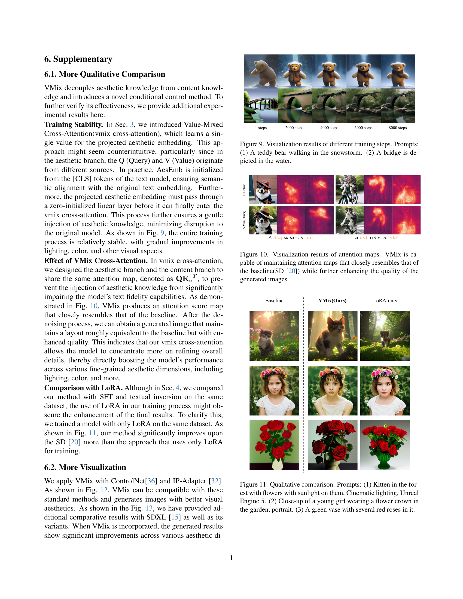

 


 2412.20800 
 Shaojin Wu et el. 
 
 🤗 2025-01-02 
 



↗ arXiv


↗ Hugging Face


↗ Papers with Code


### TL;DR



텍스트-이미지 생성 분야에서 확산 모델은 뛰어난 성능을 보이지만, 실제 이미지의 미적 특징(색상, 조명, 구도 등)을 충분히 반영하지 못하는 한계가 있습니다.  기존 연구는 전반적인 이미지 품질 향상에 초점을 맞춰 세밀한 미적 요소 개선에는 부족했습니다. 

본 논문에서는 이러한 문제를 해결하기 위해 **VMix 어댑터**를 제시합니다. VMix는 텍스트 프롬프트를 내용과 미적 요소로 분리하고, **크로스 어텐션 믹싱 제어**를 통해 미적 조건을 노이즈 제거 과정에 통합합니다.  실험 결과, VMix는 다른 최첨단 기법들을 능가하는 성능을 보였으며, LoRA, ControlNet, IPAdapter 등 다른 커뮤니티 모듈과도 호환됩니다.



#### Key Takeaways


 VMix 어댑터는 플러그 앤 플레이 방식으로 기존 확산 모델의 미적 품질을 향상시킵니다. 



 텍스트 프롬프트를 내용과 미적 요소로 분리하여 세밀한 미적 제어를 가능하게 합니다. 



 다양한 커뮤니티 모듈과의 호환성을 통해 확장성과 활용성을 높였습니다. 


#### Why does it matter?
본 논문은 **미적 세부사항까지 고려한 이미지 생성 품질 향상**이라는 중요한 문제를 해결하는 데 기여합니다.  **플러그 앤 플레이 방식의 VMix 어댑터**를 통해 기존 확산 모델의 성능을 향상시키는 방법을 제시하여, 다양한 분야의 연구자들에게 유용한 도구를 제공합니다. 또한, **세밀한 미적 차원에 대한 분석 및 제어**라는 새로운 연구 방향을 제시하여 후속 연구에 영감을 줄 수 있습니다.

------
#### Visual Insights

> 🔼 본 그림은 SDXL, DPO, 그리고 제안된 VMix 세 가지 방법을 사용하여 생성된 이미지를 비교 분석한 결과를 보여줍니다. SDXL은 기본 모델로, DPO는 기존의 미적 개선 방법을 나타냅니다.  그림에서 볼 수 있듯이, DPO는 SDXL이 생성하지 못하는 속성들을 생성할 수 있지만, 세밀한 수준의 미적 기준에는 부합하지 못합니다. 반면에 VMix는 텍스트 충실도와 시각적 미적 표현 모두에서 더 나은 성능을 보이며, 텍스트와 이미지 간의 정합성을 유지하면서 미적 표현을 향상시킨다는 점을 보여줍니다.  각 모델의 결과 이미지는 머리카락 색깔, 드레스 색상, 꽃 색깔, 피부 디테일, 색상의 일관성, 조명 등 다양한 미적 요소들을 기준으로 비교 분석됩니다.
> 

> 
read the caption

> Figure 1: Comparison of text fidelity and visual aesthetics between SDXL [15], DPO [27], and our VMix. DPO can generate attributes that SDXL fails to produce, but it fails to align with human visual fine-grained preferences. Our method achieves better text fidelity and visual aesthetics simultaneously.
> 


| Method | FID ↓ | CLIP Score ↑ | Aes Score ↑ |
|---|---|---|---|
| SD [20] | 28.08 | 30.24 | 5.35 |
| FreeU [24] | 27.09 | **31.00** | 5.36 |
| DPO [8] | **22.64** | **30.89** | 5.54 |
| Textual Inversion [6] | 24.72 | 28.92 | **5.58** |
| SFT | 24.35 | 30.15 | 5.43 |
| **VMix(Ours)** | **21.49** | 30.50 | **5.79** |

> 🔼 표 1은 MJHQ-30K 벤치마크 데이터셋 [10]을 사용하여 다양한 텍스트-이미지 생성 모델들의 성능을 정량적으로 비교 분석한 결과를 보여줍니다.  FID(Fréchet Inception Distance)는 생성된 이미지의 품질을, CLIP Score는 텍스트와 이미지의 일치도를, Aes Score는 미적 측면의 우수성을 평가하는 지표입니다.  점수가 높을수록 성능이 우수함을 나타냅니다. 표에는 SD, FreeU, DPO, Textual Inversion, SFT 그리고 제안된 VMix 모델의 결과가 제시되어 있으며, 각 모델의 세 가지 지표에 대한 점수를 비교하여 VMix 모델의 성능 우위를 보여줍니다.
> 

> 
read the caption

> Table 1: Quantitative results on MJHQ-30K benchmark [10]. ↑↑\uparrow↑ stands for higher the better, ↓↓\downarrow↓ stands for lower the better.
> 

### In-depth insights

#### Aesthetic Diffusion
**미적 확산 (Aesthetic Diffusion)**은 텍스트-이미지 생성 모델의 미학적 측면을 향상시키는 데 초점을 맞춘 새로운 연구 분야입니다. 기존의 확산 모델은 이미지 생성 능력이 뛰어나지만, 색상, 조명, 구성 등 미묘한 차원에서 실제 미술 작품에 미치지 못하는 경우가 많습니다. 따라서 **미적 확산은 이러한 한계를 극복하고, 생성된 이미지의 미적 완성도를 높이는 데 기여**합니다. 이는 단순히 이미지 해상도 향상이나 사실성 개선을 넘어, **인간의 심미적 기준에 부합하는 세련된 이미지 생성**을 목표로 합니다.  **다양한 미적 요소를 조절하고 제어**하는 기술, 즉 **미적 요소의 분리 및 제어, 크로스 어텐션 믹싱 제어** 와 같은 방법들을 통해 인간의 미적 감각에 더욱 가까운 결과물을 얻고자 노력합니다.  **플러그 앤 플레이 방식의 모듈**을 통해 기존 모델에 손쉽게 적용할 수 있다는 점도 주목할 만합니다. 하지만, **아직 모든 미적 요소들을 완벽히 제어하는 데는 한계가 있으며**, 향후 연구를 통해 더욱 발전될 여지가 있습니다.

#### VMix Control
VMix 제어는 텍스트-이미지 확산 모델의 미적 품질을 향상시키기 위한 핵심 구성 요소입니다. **크로스 어텐션 밸류 믹싱 제어(VMix)**는 텍스트 프롬프트를 내용과 미적 요소로 분리하고, **미적 조건을 노이즈 제거 과정에 통합**하여 실제 세계의 미적 이미지에 더 가깝게 만듭니다.  **제로-초기화 선형 계층**을 사용하여 네트워크를 연결함으로써 모델의 일반성을 유지하면서 미적 개선을 달성합니다.  **미적 임베딩 초기화** 단계는 미적 설명을 효율적으로 처리하고, **가치 믹싱 크로스 어텐션**은 이미지-텍스트 정렬을 유지하면서 미적 표현을 향상시킵니다.  이러한 접근 방식은 사전 훈련된 확산 모델의 미적 표현을 향상시키는 동시에 **다양한 커뮤니티 모듈과의 호환성**을 보장합니다.  **플러그 앤 플레이 방식**으로 기존 모델에 적용할 수 있어, 재훈련 없이도 성능 향상을 가져옵니다.  결과적으로 VMix 제어는 **세밀한 미적 차원에 대한 사용자의 선호도를 충족**하고,  **보다 사실적이고 매력적인 이미지 생성**을 가능하게 합니다.

#### Disentangled Prompts
본 논문에서 제안하는 ‘Disentangled Prompts’는 텍스트 프롬프트를 **내용(content)**과 **미적 요소(aesthetic)**로 분리하여 처리하는 기법입니다. 이는 기존의 단일 프롬프트 방식이 내용과 미적 표현을 혼합하여 처리함으로써 발생하는 모호성과 제약을 극복하기 위한 시도입니다.  **내용**은 이미지의 주제와 개체, 속성 등을 설명하는 부분이고, **미적 요소**는 색감, 조명, 구성 등 시각적 특성을 나타내는 부분입니다.  이를 분리함으로써 모델은 각 요소에 대해 보다 정교하고 독립적인 제어가 가능해지며, **결과적으로 생성 이미지의 미적 완성도를 높이고, 사용자의 의도를 더욱 충실히 반영**할 수 있게 됩니다.  **특히 미적 요소에 대한 별도의 제어는 사용자가 원하는 스타일이나 분위기를 명시적으로 지정**하는 데 도움이 되며,  기존 모델의 한계를 뛰어넘어 더욱 다양하고 세련된 이미지 생성을 가능하게 합니다.  **프롬프트 분리와 함께 제시된 ‘cross-attention mixing control’은 내용과 미적 요소 간의 균형있는 조화를 이루도록 도와주는 중요한 요소**입니다.

#### Cross-Attention Mix
본 논문에서 제안하는 'Cross-Attention Mix'는 기존 텍스트-이미지 확산 모델의 미적 품질을 향상시키기 위한 핵심 기법입니다. **텍스트 프롬프트를 콘텐츠 설명과 미적 설명으로 분리**하여 각각의 정보를 모델에 효과적으로 전달하는 방식입니다. 이는 단순히 전체적인 이미지 품질 향상이 아닌, **색상, 조명, 구성 등 세부적인 미적 요소까지 개선**하는 것을 목표로 합니다.  **가치 혼합 크로스 어텐션(Value-mixed Cross-Attention)**을 통해 미적 조건을 노이즈 제거 과정에 통합함으로써, 기존 모델의 이미지-텍스트 정합성을 유지하면서 미적 표현력을 강화합니다.  **제로 초기화 선형층을 사용**하여 네트워크 연결을 통해 모델의 일반성을 유지하는 동시에 미적 개선 효과를 극대화합니다. 이러한 접근 방식은 사전 훈련된 확산 모델에 적용 가능하며, 다른 커뮤니티 모듈과의 호환성 또한 우수하여 **플러그 앤 플레이 방식**으로 활용 가능하다는 장점이 있습니다.  **세부적인 미적 속성에 대한 인식 부족**이라는 기존 방법론의 한계를 극복하고, 사용자의 미적 기호에 보다 정확하게 부합하는 이미지 생성을 가능하게 합니다.

#### Future of VMix
VMix의 미래는 **플러그 앤 플레이 방식의 미적 개선**이라는 핵심 강점에 기반하여 여러 방향으로 전개될 것입니다.  **다양한 커뮤니티 모델과의 호환성 확장**은 필수적이며,  ControlNet이나 IP Adapter와 같은 추가 모듈과의 통합을 더욱 강화하여 사용자의 창의적인 표현 폭을 넓혀야 합니다. 또한, **미세한 미적 차원에 대한 제어 기능의 고도화**를 통해 사용자가 보다 정교하게 이미지를 조정할 수 있도록 지원해야 합니다.  **다양한 미적 레이블 데이터셋의 확장** 및 **새로운 미적 속성의 추가**는 VMix의 성능 향상과 적용 범위 확대에 중요한 역할을 합니다.  **훈련 과정의 효율화** 또한 중요한 과제이며,  LoRA를 활용한 효율적인 파라미터 학습 및 최적화를 통해 더욱 폭넓은 사용자에게 접근성을 높여야 할 것입니다.  **사용자 연구 및 피드백**을 통한 지속적인 개선과 **실제 응용 분야 확대**를 통해 VMix는  AI 이미지 생성 분야의 핵심 기술로 자리매김할 것입니다.

### More visual insights

More on figures

> 🔼 그림 2는 제안된 VMix 방법의 작동 과정을 보여줍니다. (a) 초기화 단계에서는 미리 정의된 미적 레이블이 CLIP을 통해 [CLS] 토큰으로 변환되어 AesEmb가 생성됩니다. AesEmb는 훈련 시작 시 한 번만 처리됩니다. (b) 훈련 단계에서는 투영 레이어가 입력 미적 설명 (yaes)을 콘텐츠 텍스트 임베딩 (ft)과 동일한 토큰 차원의 임베딩 (fa)로 매핑합니다. 그런 다음 텍스트 임베딩 (ft)은 값 혼합 교차 어텐션을 통해 잡음 제거 네트워크에 통합됩니다. (c) 추론 단계에서는 VMix가 AesEmb에서 모든 긍정적인 미적 임베딩을 추출하여 미적 입력을 형성하고, 콘텐츠 입력과 함께 모델에 입력하여 잡음 제거 프로세스를 수행합니다.
> 

> 
read the caption

> Figure 2: Illustration of of VMix. (a)In the initialization stage, pre-defined aesthetic labels are transformed into [CLS] tokens through CLIP, thereby obtaining AesEmb, which only need to be processed once at the beginning of training. (b)In the training stage, a project layer first maps the input aesthetic description ya⁢e⁢ssubscript𝑦𝑎𝑒𝑠y_{aes}italic_y start_POSTSUBSCRIPT italic_a italic_e italic_s end_POSTSUBSCRIPT into an embedding fasubscript𝑓𝑎f_{a}italic_f start_POSTSUBSCRIPT italic_a end_POSTSUBSCRIPT of the same token dimension as the content text embedding ftsubscript𝑓𝑡f_{t}italic_f start_POSTSUBSCRIPT italic_t end_POSTSUBSCRIPT. The text embedding ftsubscript𝑓𝑡f_{t}italic_f start_POSTSUBSCRIPT italic_t end_POSTSUBSCRIPT is then integrated into the denoising network through value-mixed cross-attention. (c)In the inference stage, VMix extract all positive aesthetic embedding from AesEmb to form the aesthetic input, along with the content input, is fed into the model for the denoising process.
> 

> 🔼 그림 3은 다양한 최첨단 방법들과 비교하여 VMix의 성능을 보여줍니다. 모든 결과는 Stable Diffusion [20]을 기반으로 생성되었습니다. 제시된 예시는 다양한 텍스트 프롬프트에 대한 이미지 생성 결과를 보여주며, VMix 방법이 색상, 조명, 구성 등 미세한 심미적 차원에서 이미지 품질을 크게 향상시킨다는 것을 보여줍니다.  각각의 프롬프트에 대해 VMix를 포함한 다양한 방법들(SD, FreeU, DPO, SFT, SFT & TI)이 적용된 결과 이미지들을 비교하여 VMix의 우수성을 시각적으로 확인할 수 있습니다.
> 

> 
read the caption

> Figure 3: Qualitative comparison with various state-of-the-art methods. All results are based on Stable Diffusion [20]. Our VMix method outperforms others, significantly enhancing the quality of image generation across various fine-grained aesthetic dimensions.
> 

> 🔼 그림 4는 최첨단 기법들과 VMix의 성능을 비교한 정성적 분석 결과를 보여줍니다. 모든 결과는 SDXL [15] 기반으로 생성되었습니다. VMix는 다른 방법들보다 뛰어난 성능을 보이며 이미지 생성 품질을 크게 향상시킵니다.  각 행은 서로 다른 프롬프트(텍스트 입력)에 대한 결과를 보여주며, 각 열은 서로 다른 방법(SDXL, FreeU, DPO, SFT, SFT & TI, 그리고 제안된 VMix)으로 생성된 이미지들을 나타냅니다.  이 그림을 통해 VMix가 다양한 미묘한 미적 요소들(조명, 색상, 구성 등)을 개선하는 데 탁월하다는 것을 직관적으로 보여줍니다.
> 

> 
read the caption

> Figure 4: Qualitative comparison with various state-of-the-art methods. All the results of the methods are based on the SDXL [15]. Our VMix method outperforms others, significantly enhancing the quality of image generation.
> 

> 🔼 그림 5는 VMix를 통합한 개인화된 모델과 수정되지 않은 표준 개인화 모델에서 생성된 이미지를 비교한 정성적 결과를 보여줍니다. 왼쪽에는 VMix가 통합된 개인화 모델로 생성된 이미지가, 오른쪽에는 수정되지 않은 표준 개인화 모델로 생성된 이미지가 나열되어 있습니다.  다양한 스타일과 개인화된 모델의 비교를 통해 VMix가 이미지 품질 개선에 미치는 영향을 시각적으로 보여줍니다. 각 모델은 다양한 프롬프트를 사용하여 생성된 이미지를 보여주며, VMix 통합 여부에 따른 시각적 차이를 명확하게 비교할 수 있습니다.
> 

> 
read the caption

> Figure 5: Qualitative results. We compare images generated by VMix-integrated personalized models with those from standard personalized models. On the left are images produced by the personalized model with VMix integration, while on the right are images from the standard personalized model without modifications.
> 

> 🔼 본 그림은 VMix 사용 여부에 따른 사용자 선호도를 보여주는 사용자 연구 결과를 나타냅니다.  그림은 VMix를 사용한 이미지와 사용하지 않은 이미지 각각에 대한 사용자 선호도를 비교 분석하여 VMix의 효과를 시각적으로 보여줍니다.  구체적으로는, 여러 개의 이미지 쌍에 대해 사용자들이 어떤 이미지를 더 선호하는지에 대한 비율을 막대 그래프와 산점도로 표현하여, VMix 사용 시 사용자 선호도가 얼마나 증가하는지 정량적으로 나타냅니다.
> 

> 
read the caption

> Figure 6: User study. We report the user preference between using VMix and not using VMix.
> 

> 🔼 이 그림은 논문의 3. 방법론 섹션에 속하며, VMix 모델의 초기화 단계를 보여줍니다. 미리 정의된 심미적 레이블이 CLIP 토큰으로 변환되는 과정과, 이러한 토큰이 추론 단계에서 모델에 입력되는 방식을 시각적으로 설명합니다.  심미적 입력은 내용 입력과 함께 모델에 제공되어 이미지 생성 과정에 심미적 조건을 통합하는 방식을 보여줍니다.
> 

> 
read the caption

> (a)
> 

> 🔼 그림 2(b)는 VMix의 학습 단계를 보여줍니다.  미적 속성 설명(Yaes)은 동일한 토큰 차원을 갖는 콘텐츠 텍스트 임베딩(ft)과 동일한 토큰 차원의 임베딩(fa)으로 매핑됩니다.  텍스트 임베딩(ft)은 값 혼합 교차 어텐션을 통해 잡음 제거 네트워크에 통합됩니다.  이 과정은 미적 조건을 잡음 제거 과정에 통합하여 이미지의 미적 품질을 향상시키는 방법을 보여줍니다.  제로로 초기화된 선형 레이어를 통해 네트워크가 연결되어 있습니다. 
> 

> 
read the caption

> (b)
> 

> 🔼 그림 7은 VMix의 λ에 대한 절충 연구 결과를 보여줍니다. (a)는 λ 값의 변화에 따른 시각적 성능 변화를, (b)는 λ 값이 1에서 2까지 변화할 때 VMix의 성능 지표를 평가한 결과를 나타냅니다. λ 값이 증가함에 따라 Aes 점수는 점진적으로 증가하지만 CLIP 점수는 약간 감소하는 경향을 보입니다. 하지만 VMix는 다른 방법들에 비해 여전히 상당한 이점을 유지합니다.
> 

> 
read the caption

> Figure 7: Ablation Study for λ𝜆\lambdaitalic_λ of VMix. (a)Visual performance changes of λ𝜆\lambdaitalic_λ. (b)Performance metrics for VMix, evaluated across a range of λ𝜆\lambdaitalic_λ values from 1 to 2 from right to left.
> 

> 🔼 그림 8은 VMix의 AesEmb에 대한 ablation study 결과를 보여줍니다. 왼쪽은 모든 미적 레이블을 사용한 경우와 사용하지 않은 경우의 효과를 비교하고, 오른쪽은 단일 차원 미적 레이블을 사용한 경우의 효과를 보여줍니다.  왼쪽 패널은 모든 미적 속성을 고려하여 이미지 생성을 했을 때와, 아무런 미적 속성도 고려하지 않았을 때의 결과를 비교하여 VMix 모델이 미적 세부사항을 향상시키는 데 얼마나 효과적인지 보여줍니다. 오른쪽 패널은 특정 미적 속성(예: 색상, 조명, 구도)만을 고려하여 이미지를 생성했을 때의 결과를 보여주어, 각 미적 속성이 이미지 품질에 미치는 영향을 개별적으로 분석합니다.
> 

> 
read the caption

> Figure 8: Ablation Study for AesEmb of VMix. Left: The effects of using all aesthetic labels versus not using them. Right: The effects of using single-dimensional aesthetic labels.
> 

More on tables


| Method | FID ↓ | CLIP Score ↑ | Aes Score ↑ |
|---|---|---|---|
| SD [20] | 25.67 | 32.28 | 5.43 |
| FreeU [24] | 28.69 | 32.15 | 5.43 |
| DPO [8] | **23.37** | <ins>32.41</ins> | 5.44 |
| Textual Inversion [6] | 26.62 | 30.97 | <ins>5.53</ins> |
| SFT | 26.27 | 32.27 | 5.40 |
| **VMix(Ours)** | <ins>23.92</ins> | **32.71** | **5.68** |
> 🔼 표 2는 LAION-HQ10K 벤치마크 데이터셋을 사용하여 측정한 다양한 이미지 생성 모델들의 정량적 성능 비교 결과를 보여줍니다.  FID(Fréchet Inception Distance) 점수는 생성된 이미지의 품질을, CLIP 점수는 텍스트와 이미지의 일관성을, AES 점수는 이미지의 미적 우수성을 각각 나타냅니다.  점수가 높을수록 성능이 우수함을 의미합니다. 이 표는 VMix 모델이 다른 최첨단 모델들에 비해 LAION-HQ10K 데이터셋에서 더 나은 성능을 보여줌을 보여주는 실험 결과를 제시합니다.
> 

> 
read the caption

> Table 2: Quantitative results on LAION-HQ10K benchmark.
> 


| Method | FID ↓ | CLIP Score ↑ | Aes Score ↑ |
|---|---|---|---|
| Baseline(SD) [20] | 28.08 | 30.24 | 5.35 |
| w/o lora | 21.53 | 30.49 | 5.75 |
| w/o vmix | 25.64 | 30.16 | 5.52 |
| **Ours** | **21.49** | **30.50** | **5.79** |
> 🔼 표 3은 Lora와 Value-Mixed Cross-Attention의 ablation study 결과를 보여줍니다.  실험은 MJHQ-30K 벤치마크 [10]를 사용하여 진행되었으며,  각 요소(Lora와 Value-Mixed Cross-Attention)가 성능에 미치는 영향을 개별적으로 분석하고, 두 요소를 함께 사용했을 때의 시너지 효과를 확인합니다.  FID, CLIP Score, Aes Score 세 가지 지표를 사용하여 모델의 성능을 종합적으로 평가합니다.  이를 통해 VMix 모델의 성능 향상에 기여하는 주요 요소를 파악하고, 모델의 효율성과 효과를 검증합니다.
> 

> 
read the caption

> Table 3: Ablation Study of lora and value-mixed cross-attention. Experiments were conducted on MJHQ-30K benchmark [10].
> 

### Full paper



