 


 2412.21015 
 Mahir Labib Dihan et el. 
 
 🤗 2025-01-03 
 



↗ arXiv


↗ Hugging Face


↗ Papers with Code


### TL;DR



최근 대규모 언어 모델(LLM)의 발전에도 불구하고, 자연어 기반 지리 공간 질의에 대한 신뢰할 수 있는 데이터 세트 구축은 여전히 어려움을 겪고 있습니다. 기존의 수동 데이터 수집 방식은 시간이 많이 걸리고 일관성이 부족하여 재현성 있는 연구를 수행하기 어렵습니다. 

본 논문에서는 이러한 문제를 해결하기 위해 MAPQATOR라는 새로운 웹 애플리케이션을 제시합니다.  MAPQATOR는 플러그 앤 플레이 방식의 아키텍처를 통해 다양한 지도 API와 손쉽게 통합될 수 있으며, API 응답 캐싱 기능을 통해 데이터의 일관성과 신뢰성을 확보합니다.  **실험 결과, MAPQATOR는 수동 방식보다 최소 30배 빠른 주석 처리 속도**를 보였으며, **재현 가능하고 추적 가능한 지도 기반 QA 데이터 세트 생성을 위한 효율적이고 효과적인 솔루션**임을 증명했습니다.



#### Key Takeaways


 MAPQATOR는 다양한 지도 API와의 원활한 통합을 지원하는 웹 애플리케이션입니다. 



 MAPQATOR는 기존 수동 방식 대비 최소 30배 이상의 주석 처리 속도 향상을 보였습니다. 



 MAPQATOR는 API 응답 캐싱을 통해 데이터셋의 신뢰성과 일관성을 높였습니다. 


#### Why does it matter?
본 논문은 **지리 공간 질의 데이터 세트에 대한 효율적인 주석 시스템인 MAPQATOR**를 제시하여 **LLM 기반 지리 공간 추론의 현재 상태를 평가하고 향상된 지리 공간 이해를 위한 기능을 발전시키는 데 기여**합니다.  이는 지리 공간 질의 응답 데이터 세트 생성의 어려움을 해결하고, 관련 연구 분야의 발전에 중요한 영향을 미칠 수 있습니다.  또한, **플러그 앤 플레이 아키텍처를 통해 다양한 지도 API와의 원활한 통합을 지원하여 연구의 재현성 및 확장성을 높이는 데 기여**합니다.  본 연구는 **지리 공간 언어 모델링 연구에 새로운 지평을 열어** 관련 분야의 발전에 크게 기여할 것으로 예상됩니다.

------
#### Visual Insights

> 🔼 맵큐에이터(MapQaTor) 시스템의 주요 단계들을 보여주는 개념도입니다. 사용자는 원하는 지도 API(예: 구글맵, 오픈스트릿맵)를 선택하고, 도구를 사용하여 질의를 제출하고, 지도에 데이터를 시각화합니다. 백엔드는 데이터베이스에서 요청된 API 호출을 확인하고, 없으면 API 호출을 하고 데이터베이스를 업데이트합니다. 사용자는 API 호출을 자동으로 기록하는 컨텍스트에 데이터를 추가하고, 관련 API 호출과 함께 QA 쌍을 디자인하여 JSON 형식으로 데이터 세트를 내보냅니다. 이는 지속적인 지표 데이터를 보장하고 데이터의 신뢰성을 높여줍니다.
> 

> 
read the caption

> Figure 1: Overview of the annotation and visualization process of MapQaTor .
> 


| Tool | API Provider | API Endpoint |
|---|---|---|
| Text Search | Google Maps | [Text Search (New) | Places API](https://developers.google.com/maps/documentation/places/web-service/text-search) |
|  |  | [Text Search | Places API](https://developers.google.com/maps/documentation/places/web-service/search-text) |
|  | OpenStreetMap | [Search queries | Nominatim](https://nominatim.org/release-docs/develop/api/Search/) |
|  | Mapbox | [Suggest | Search Box API](https://docs.mapbox.com/api/search/search-box/) |
|  | TomTom | [Point of Interest Search](https://developer.tomtom.com/search-api/documentation/search-service/points-of-interest-search) |
|  | HERE | [Discover | Geocoding and Search](https://www.here.com/docs/bundle/geocoding-and-search-api-developer-guide/page/topics/endpoint-discover-brief.html) |
|  | Azure Maps | [Search - Get Search Fuzzy](https://learn.microsoft.com/en-us/rest/api/maps/search/get-search-fuzzy?view=rest-maps-1.0&tabs=HTTP) |
| Place Details | Google Maps | [Place Details (New) | Places API](https://developers.google.com/maps/documentation/places/web-service/place-details) |
|  | OpenStreetMap | [Place details | Nominatim](https://nominatim.org/release-docs/develop/api/Details/) |
|  | Mapbox | [Retrieve | Search Box API](https://docs.mapbox.com/api/search/search-box/) |
|  | TomTom | [Place by ID](https://developer.tomtom.com/search-api/documentation/place-by-id-service/place-by-id) |
|  | HERE | [Lookup | Geocoding and Search](https://www.here.com/docs/bundle/geocoding-and-search-api-developer-guide/page/topics/endpoint-lookup-brief.html) |
|  | Azure Maps | [Search - Get Search Fuzzy](https://learn.microsoft.com/en-us/rest/api/maps/search/get-search-fuzzy?view=rest-maps-1.0&tabs=HTTP) |
| Nearby Search | Google Maps | [Nearby Search (New) | Places API](https://developers.google.com/maps/documentation/places/web-service/nearby-search) |
|  | TomTom | [Nearby Search](https://developer.tomtom.com/search-api/documentation/search-service/nearby-search) |
| Compute Routes | Google Maps | [Get a route | Routes API](https://developers.google.com/maps/documentation/routes/compute_route_directions) |
|  | OpenStreetMap | [Routing API | GraphHopper](https://docs.graphhopper.com/#tag/Routing-API) |
|  | TomTom | [Calculate Route](https://developer.tomtom.com/routing-api/documentation/tomtom-maps/calculate-route) |
| Search Along Route | Google Maps | [Search along route](https://developers.google.com/maps/documentation/places/web-service/search-along-route) |
|  | TomTom | [Along Search Route](https://developer.tomtom.com/search-api/documentation/search-service/along-route-search) |

> 🔼 MapQaTor 시스템에서 데이터 수집 도구별 현재 지원되는 API 목록을 보여주는 표입니다. 각 도구(텍스트 검색, 장소 세부 정보, 근처 검색, 경로 계산, 경로상 검색)마다 Google Maps, OpenStreetMap, Mapbox, TomTom, HERE, Azure Maps 등 여러 API 제공업체의 엔드포인트가 나열되어 있습니다. 이 표는 MapQaTor가 다양한 매핑 서비스와의 통합을 지원함을 보여줍니다.
> 

> 
read the caption

> Table 1: Current API Support for Data Collection Tools in MapQaTor
> 

### In-depth insights

#### LLM Geo-reasoning
LLM 지리 추론은 **대규모 언어 모델(LLM)**이 지리 공간 데이터를 이해하고 추론하는 능력을 의미합니다.  본 논문에서는 지리 공간 질의응답(QA) 데이터셋을 효율적으로 생성하는 시스템인 MAPQATOR를 소개하며, **자연어 지리 공간 질의에 대한 LLM의 성능 평가 및 개선**에 초점을 맞춥니다.  맵 API와의 매끄러운 통합을 통해 다양한 데이터 소스를 활용하고, **캐싱 메커니즘**을 통해 데이터 일관성을 유지하며 신뢰성 있는 QA 데이터셋 구축을 지원합니다.  **시각화 도구**는 사용자의 지리 공간 정보 이해도를 높이고 주석 작업을 간소화하며, 다양한 평가 지표를 통해 LLM의 지리 추론 능력을 정확하게 측정할 수 있습니다.  **플러그 앤 플레이 아키텍처**는 다양한 맵 API와의 호환성을 보장하며, 확장성을 높여 사용자 맞춤형 데이터셋 구축을 가능하게 합니다.  결론적으로, 본 연구는 LLM의 지리 추론 성능 향상에 기여할 뿐 아니라, **재현 가능하고 추적 가능한 지리 공간 QA 데이터셋 생성을 위한 효율적인 프레임워크**를 제시합니다.

#### MAPQATOR System
MAPQATOR 시스템은 **지도 기반 질의응답 데이터셋 생성을 위한 효율적인 웹 애플리케이션**입니다.  **다양한 지도 API와의 원활한 통합**을 지원하여 사용자는 최소한의 설정으로 다양한 소스의 데이터를 수집하고 시각화할 수 있습니다.  **API 응답 캐싱**을 통해 일관된 기준점을 보장하여 데이터의 신뢰성을 높이며, **데이터 수집, 주석 및 시각화**를 단일 플랫폼에서 중앙 집중식으로 관리합니다.  **플러그 앤 플레이 방식의 아키텍처**는 사용 편의성을 높이고, 다양한 지도 서비스를 손쉽게 통합할 수 있도록 합니다.  **LLM 기반 지리 공간 추론 평가 및 향상**에 기여하며, 수동 방식보다 최소 30배 빠른 주석 처리 속도를 통해 **효율성**을 입증합니다.  **재현 가능하고 추적 가능한 데이터셋 생성**을 지원하는 이 시스템은 지리 공간 자원 개발에 크게 기여할 것으로 예상됩니다.

#### API Integration
본 논문에서는 API 통합에 대한 심층적인 논의가 부족하지만, 시스템이 다양한 지도 API와의 **끊김없는 연동**을 지원하는 방식에 대한 중요한 통찰력을 제공합니다.  **플러그 앤 플레이 방식의 아키텍처**를 통해 사용자는 최소한의 설정으로 다양한 소스의 데이터를 수집하고 시각화할 수 있습니다.  이는 **API 어댑터 계층**을 통해 다양한 API의 요청 및 응답 형식을 표준화함으로써 가능합니다.  **캐싱 메커니즘**은 API 응답을 데이터베이스에 저장하여 일관된 기준 자료를 유지하고, 시간이 지남에 따라 실제 환경 정보가 변화하더라도 데이터의 신뢰성을 높이는 데 기여합니다. 이러한 접근 방식은 **재현 가능하고 추적 가능한 지도 기반 QA 데이터셋**을 생성하는 데 효율성을 높이는 데 중점을 둡니다.  결론적으로, API 통합 전략은 시스템의 유연성과 확장성을 크게 높이고, 연구의 재현성을 보장하는 데 중요한 역할을 합니다.

#### Dataset Creation
본 논문은 지도 기반 질의응답(QA) 데이터셋을 효율적으로 생성하는 시스템인 MAPQATOR에 대해 설명합니다. **데이터셋 생성 과정은 다양한 지도 API와의 원활한 통합을 기반으로 합니다.** 사용자는 플러그 앤 플레이 방식으로 다양한 지도 API를 이용하여 데이터를 수집하고 시각화할 수 있습니다. **API 응답을 캐싱하여 일관된 기준 자료를 보장**하고, 데이터 신뢰도를 높입니다. **웹 기반 플랫폼**을 통해 데이터 수집, 주석 및 시각화를 중앙 집중식으로 관리하여 사용자의 효율성을 높입니다. 또한, **여러 질문 유형** (예/아니오, 단일 선택, 다중 선택, 개방형)을 지원하여 다양한 LLM의 성능 평가에 활용될 수 있습니다.  **데이터셋의 재현성 및 추적성**을 위해 API 호출을 추적하여 기록하고, 질문과 API 호출 간의 명확한 연결을 유지합니다. 이를 통해 연구자들은 생성된 데이터셋의 신뢰성 및 재현성을 향상시킬 수 있습니다.  전반적으로 MAPQATOR는 지도 기반 QA 데이터셋 생성 과정의 효율성을 극대화하고, LLM 성능 평가를 위한 고품질 데이터셋을 제공하는 데 기여하는 시스템입니다.

#### Future Work
본 논문에서 제시된 MAPQATOR 시스템은 지리 공간 질의 데이터셋을 효율적으로 주석 처리하기 위한 훌륭한 기반을 마련했습니다. 하지만, **미래 연구를 위한 잠재력은 여전히 매우 큽니다.**  향후 연구는 **다양한 지도 API와의 통합을 확장**하고, **더욱 다양한 유형의 지리 공간 질의를 지원**하는 데 집중해야 합니다.  **LLM의 성능 평가를 위한 더욱 포괄적인 지표를 개발**하는 것도 중요합니다.  **데이터셋의 품질과 신뢰성을 높이기 위한 더욱 정교한 주석 처리 및 검증 기법**을 개발하는 연구도 필요합니다.  또한, **실제 사용자의 피드백을 수렴하여 시스템의 사용성과 효율성을 개선**하는 노력이 필요합니다.  마지막으로, **MAPQATOR를 기반으로 더욱 복잡하고 다양한 지리 공간 추론 과제에 도전**할 수 있는 확장된 연구가 기대됩니다.

### More visual insights

More on figures

> 🔼 이 그림은 논문의 2.4절 데이터 수집 도구 섹션에 속하며, 사용자가 지도 기반 질문 응답 데이터셋을 생성하기 위해 MAPQATOR 웹 애플리케이션을 사용하는 방법을 보여줍니다.  구체적으로는 사용자가 검색창에 위치를 입력하여 검색하는 과정을 시각적으로 보여줍니다.  검색 결과로 지도 상에 표시된 장소 후보들이 나타나며, 사용자는 이 중 원하는 장소를 선택할 수 있습니다. 이는 MAPQATOR 시스템이 사용자에게 직관적이고 간편한 방식으로 지리적 정보를 검색하고 선택하는 기능을 제공함을 보여주는 예시입니다.
> 

> 
read the caption

> Figure 2: Search for a place
> 

> 🔼 그림 3은 MAPQATOR 플랫폼에서 특정 장소에 대한 세부 정보를 가져오는 방법을 보여줍니다.  사용자는 드롭다운 메뉴에서 기존 장소를 선택하거나 새 장소를 추가할 수 있습니다. 선택된 장소에 대한 상세 정보는 주소, 운영 시간, 접근성 기능, 비즈니스 상태 등과 같은 다양한 정보를 포함합니다.  이러한 정보는 질문과 답변 쌍을 만들 때 중요한 맥락을 제공하며, 정확하고 풍부한 지리 공간 데이터셋을 구축하는 데 도움이 됩니다.  MAPQATOR는 사용자 인터페이스를 통해 직관적이고 간편하게 지리 공간 데이터를 수집 및 주석 처리할 수 있도록 지원합니다.
> 

> 
read the caption

> Figure 3: Fetch full details of a place
> 

> 🔼 그림 4는 MAPQATOR의 근접 검색 기능을 보여줍니다. 사용자는 선택한 위치 주변의 관심 지점(POI)을 검색하고, 유형, 최소 등급, 가격대 등의 필터를 사용하여 결과를 필터링하고 관련성 또는 거리에 따라 정렬할 수 있습니다.  맵에 표시되는 POI의 최대 개수를 설정할 수도 있습니다. 이 기능은 사용자가 특정 위치 주변에서 관련 정보를 쉽게 찾을 수 있도록 지원합니다.
> 

> 
read the caption

> Figure 4: Search Nearby Places
> 

> 🔼 그림 5는 MAPQATOR 플랫폼의 경로 계산 도구를 보여줍니다. 사용자는 출발지와 목적지를 선택하고, 이동 수단(자동차, 대중교통 등)을 지정하여 두 지점 사이의 경로를 확인할 수 있습니다.  경로는 지도 상에 시각적으로 표시되며, 각 경로의 거리와 예상 소요 시간 등의 정보도 함께 제공됩니다. 중간 경유지 추가, 특정 도로 유형 회피 등의 추가적인 옵션도 제공하여 사용자의 요구사항에 맞는 최적의 경로를 찾을 수 있도록 지원합니다. 여러 대안 경로를 제시하여 사용자가 상황에 맞는 최적의 경로를 선택할 수 있도록 합니다.
> 

> 
read the caption

> Figure 5: Find routes between places
> 

> 🔼 그림 6은 MAPQATOR 플랫폼의 '경로 검색' 기능을 보여줍니다. 사용자는 출발지와 목적지를 설정하고 이동 방식(예: 자동차, 대중교통)을 선택할 수 있습니다.  플랫폼은 지정된 경로를 따라 위치한 관심 지점(POI)들을 지도에 표시하며, 사용자는 POI의 종류, 최소 등급, 가격대 등을 필터링하여 원하는 정보를 효율적으로 얻을 수 있습니다. 이 기능은 사용자가 경로 계획을 세우는 동안 주변의 관련 정보를 쉽게 파악하고, 이를 기반으로 질문-응답 쌍을 생성하는 데 도움이 됩니다.
> 

> 
read the caption

> Figure 6: Search places along a route
> 

> 🔼 그림 7은 MAPQATOR 시스템에서 질문을 생성하고, 답변 옵션을 제공하며, 정답을 주석으로 달 수 있는 사용자 인터페이스를 보여줍니다. 사용자는 다양한 유형의 질문(예: 예/아니오, 단일 선택, 다중 선택, 개방형)을 만들고, 각 질문에 대한 정답을 지정하고, 관련 맥락 정보를 선택하여 질문과 답변의 정확성과 추적성을 높일 수 있습니다. 이는 지리 공간 추론 모델의 성능을 평가하기 위한 고품질의 지리 공간 질의응답 데이터 세트를 생성하는 데 중요한 단계입니다.
> 

> 
read the caption

> Figure 7: Create a question, provide options, and annotate the correct answer.
> 

> 🔼  그림 8은 MapQaTor 시스템에서 TomTom API를 텍스트 검색 기능에 통합하는 방법을 보여줍니다.  MapQaTor는 다양한 지도 API와의 원활한 통합을 위해 어댑터 계층을 사용합니다. 이 그림은 TomTom API에 대한 어댑터 구현의 예시로,  `TextSearch` 기본 클래스를 확장하여 TomTom API의 요청 및 응답 형식을 MapQaTor 시스템과 호환되도록 변환하는 `convertRequest`와 `convertResponse` 메서드를 구현하는 방법을 보여줍니다.  API 키를 프론트엔드에 노출하지 않도록 환경 변수를 사용하는 방법도 포함되어 있습니다. 자세한 내용은 본문을 참고하세요.
> 

> 
read the caption

> Figure 8: Implementing the TomTom API Adapter for Text Search in MapQaTor
> 

> 🔼 그림 9는 MAPQATOR 시스템에서 사용되는 폴리라인 디코딩 알고리즘을 보여줍니다.  지도 API는 경로 정보를 효율적으로 전달하기 위해 폴리라인 형태의 인코딩된 데이터를 사용합니다. 이 알고리즘은 이러한 인코딩된 폴리라인 문자열을 위도/경도 좌표 쌍의 목록으로 변환하여 지도에 경로를 시각적으로 표시하는 데 사용됩니다. 알고리즘은 반복적으로 문자열을 처리하여 위도와 경도의 변화 값을 계산하고, 누적하여 실제 위도/경도 좌표를 생성합니다.
> 

> 
read the caption

> Figure 9: Polyline Decoding Algorithm
> 

> 🔼 그림 10은 MAPQATOR 시스템이 지도에 여러 장소를 표시하는 방법을 보여줍니다.  각 장소는 지도 상에 마커로 표시되며, 마커의 위치는 해당 장소의 위도와 경도를 사용하여 결정됩니다. 이 그림은 MAPQATOR의 시각화 도구가 어떻게 지리 공간 데이터를 사용자에게 효과적으로 전달하는지를 보여주는 좋은 예시입니다. 여러 마커들이 지도 상에 나타나 있어, 사용자는 각 마커가 나타내는 장소를 쉽게 파악하고, 장소들 간의 상대적인 위치 관계를 이해할 수 있습니다.
> 

> 
read the caption

> Figure 10: Set of markers indicating different places
> 

> 🔼 그림 11은 MAPQATOR 시스템의 시각화 기능을 보여줍니다. 사용자는 출발지와 도착지를 선택하고, MAPQATOR는 지도에 경로를 시각적으로 표시합니다. 이는 사용자가 지리 공간적 데이터를 더 잘 이해하고 주석을 달 수 있도록 돕습니다. 그림에서는 루브르 박물관에서 에펠탑까지의 경로가 시각적으로 표시되어 있습니다.
> 

> 
read the caption

> Figure 11: Visualizing routes between places
> 

> 🔼 그림 12는 MAPQATOR 시스템의 맥락(Context) 미리보기 기능 중 요약된 맥락(Summarized Context)을 보여줍니다. 사용자가 지도 API를 통해 수집한 정보(예: 에펠탑의 상세 정보, 루브르 박물관 근처 레스토랑, 루브르 박물관에서 에펠탑으로 가는 최적의 운전 경로 등)가 간결하게 요약되어 리스트 형태로 표시됩니다. 각 항목은 지도 API 호출과 그 결과를 나타내는 ID와 함께 요약된 정보를 제공하여 사용자가 질문-답변 쌍을 만들 때 관련 정보를 쉽게 파악할 수 있도록 합니다.
> 

> 
read the caption

> Figure 12: Summarized Context
> 

> 🔼 그림 13은 MAPQATOR 시스템의 맥락(Context) 시각화 도구를 보여줍니다.  사용자가 질문에 답변하기 위해 사용할 수 있는 지도 데이터와 관련 정보를 시각적으로 보여주는 인터페이스입니다.  이 그림은 사용자가 맥락으로 추가한 정보 (예: 특정 장소의 상세 정보, 근처 장소 목록, 경로 정보 등)을 지도와 함께 표시하여,  질문과 답변을 생성하는 데 필요한 정보를 한눈에 파악하도록 돕는 기능을 설명하고 있습니다.
> 

> 
read the caption

> Figure 13: Visual Context
> 

> 🔼 본 그림은 MAPQATOR 시스템의 질문 생성 및 주석 기능을 보여줍니다. 사용자가 질문을 작성할 때, 시스템은 문맥에 있는 장소 이름을 제안합니다. 이를 통해 사용자는 장소 이름을 일관되게 사용하고, 질문의 정확성과 효율성을 높일 수 있습니다.  사용자 인터페이스의 텍스트 입력 상자 옆에 위치한 '@' 기호를 누르면 시스템이 문맥에서 사용 가능한 장소 목록을 표시하여 사용자가 해당 장소를 쉽게 선택할 수 있도록 지원합니다.
> 

> 
read the caption

> Figure 14: Suggesting available places from the context
> 

> 🔼 이 그림은 논문의 질문응답(QA) 데이터셋 생성을 위한 시스템인 MAPQATOR의 응답 형식 중 하나인 '열린 종류(Open Ended)'에 대한 설명입니다.  열린 종류 응답 형식은 모델이 자유롭게 텍스트 형식으로 응답할 수 있도록 하여, 모델의 자연어 이해 능력 및 창의적인 응답 능력을 평가하는 데 사용됩니다. 그림에는 이러한 열린 종류 응답 형식의 예시와 함께, 질문과 답변의 예시가 함께 제시되어 있습니다.  사용자 질문에 대한 모델의 자유로운 텍스트 응답을 평가하기 위한 다양한 질문 유형을 다루는 것을 보여줍니다.
> 

> 
read the caption

> Figure 15: Answer format: Open Ended
> 

> 🔼 그림 16은 설문지 질문의 답변 형식 중 하나인 예/아니오(Yes/No) 형식에 대한 설명입니다.  간단한 긍정 또는 부정 답변만을 요구하는 질문 유형에 적합하며, 모델의 단순 사실 확인 능력을 평가하는 데 사용됩니다.  이 형식은 명확하고 간결한 답변을 필요로 하는 질문에 적합하고, 모호함이나 추론이 필요 없는 질문에 효과적으로 사용할 수 있습니다.  이를 통해 모델의 정확성과 효율성을 측정할 수 있습니다.
> 

> 
read the caption

> Figure 16: Answer format: Yes/No
> 

> 🔼 그림 17은 다양한 응답 형식을 지원하여 다양한 방식으로 모델이 사용자 질의를 처리하고 적절한 응답을 생성하는 방식을 포착하는 포괄적인 지리 공간 질문 답변 데이터 세트를 만드는 데 사용되는 네 가지 응답 형식 중 하나인 '객관식' 형식을 보여줍니다.  사용자는 질문에 대한 답변으로 여러 옵션 중에서 하나 이상을 선택할 수 있습니다.  이 형식은 모델이 여러 정답을 식별하거나 잘못된 옵션을 걸러내는 능력을 평가하는 데 유용합니다.
> 

> 
read the caption

> Figure 17: Answer format: Multiple Choice
> 

> 🔼 그림 18은 설문지 응답 형식 중 하나인 '단일 선택(Single Choice)' 형식을 보여줍니다. 사용자는 제시된 여러 선택지 중에서 오직 하나만 선택해야 합니다.  이 형식은 모델이 여러 후보 답변 중 가장 적절한 단일 답변을 선택하는 능력을 평가하는 데 사용됩니다. 질문에 대한 명확하고 간결한 답변을 요구하는 경우에 적합합니다.  선택지는 사용자 정의가 가능하며, 각 선택지에 대한 추가 정보나 설명을 포함할 수 있습니다.
> 

> 
read the caption

> Figure 18: Answer format: Single Choice
> 

> 🔼 그림 19는 질문에 대한 정답을 제공하기 위해 관련 정보를 선택하는 과정을 보여줍니다. 사용자는 맥락(Context)에서 질문에 답하는 데 필요한 정보를 선택하고, 해당 정보와 질문-답변 쌍을 연결합니다. 이를 통해 생성된 데이터셋의 신뢰성과 추적 가능성을 높입니다.  이는 질문과 관련된 API 호출을 명확히 연결함으로써 연구자가 생성된 데이터셋을 검증하고 재현할 수 있도록 지원합니다.
> 

> 
read the caption

> Figure 19: Choosing relevant informations to provide the correct answer.
> 

> 🔼 MapQaTor의 주요 단계는 세 가지 주요 단계로 구성됩니다. 먼저 사용자는 지도 서비스를 사용하여 위치 관련 컨텍스트를 디자인합니다. 그런 다음 이 컨텍스트를 기반으로 질문과 답변 쌍을 만듭니다. 마지막으로 사용자는 생성된 데이터셋을 검토하고 저장합니다. 이 그림은 MapQaTor의 전체적인 작업 흐름을 보여줍니다.
> 

> 
read the caption

> Figure 20: Major steps of MapQaTor
> 

> 🔼 그림 21은 MapQaTor 시스템에 통합된 데이터 수집 도구들의 개요를 보여줍니다.  텍스트 검색, 장소 상세 정보, 근처 검색, 경로 계산, 경로 상 검색 등 다섯 가지 도구가 표시되어 있으며, 각 도구는 지도 API와의 원활한 통합을 통해 다양한 지리 공간 데이터를 수집하는 기능을 제공합니다. 각 도구의 주요 기능과 사용 방법을 간략하게 설명하여, MapQaTor 시스템을 이용한 지리 공간 질의응답 데이터셋 생성 과정에 대한 이해를 돕습니다.
> 

> 
read the caption

> Figure 21: Overview of data collection tools integrated into MapQaTor, showcasing essential functionalities.
> 

> 🔼 그림 22는 MAPQATOR 시스템의 Text Search 도구 사용 예시를 보여줍니다. 사용자는 검색창에 위치 이름이나 주소를 입력하여 원하는 장소를 검색할 수 있습니다.  검색 결과는 지도에 표시되며, 사용자는 필요한 장소를 선택하여 컨텍스트에 추가할 수 있습니다. 이 도구는 지도 API를 통해 다양한 장소 정보를 검색하는 데 사용됩니다.  이를 통해 연구자들은 다양한 지리적 위치에 대한 질문과 답변 쌍 데이터셋을 효율적으로 생성할 수 있습니다.
> 

> 
read the caption

> Figure 22: Example use of TextSearch tool
> 

> 🔼 그림 23은 MAPQATOR의 근처 검색 도구의 사용 예시를 보여줍니다. 사용자는 특정 위치 주변의 관심 지점(POI)을 검색하고, 검색 결과를 지도에 시각적으로 표시할 수 있습니다.  사용자는 드롭다운 메뉴를 통해 POI 유형, 최소 평점, 가격대를 필터링하고, 관련성 또는 거리 순으로 결과를 정렬할 수 있습니다. 또한, 표시할 최대 결과 수를 지정할 수 있습니다. 이 도구는 지정된 위치 근처의 관련 정보를 수집하는 데 효율적인 방법을 제공합니다.
> 

> 
read the caption

> Figure 23: Example use of NearbySearch tool
> 

> 🔼 이 그림은 에펠탑 근처의 레스토랑들을 보여줍니다. MAPQATOR 시스템이 Google Maps API를 사용하여 에펠탑 주변의 레스토랑들을 검색하고, 이름, 평점, 거리 등의 정보와 함께 지도 상에 표시한 결과를 보여줍니다.  각 레스토랑은 마커로 표시되어 있으며, 사용자는 마커를 클릭하여 더 자세한 정보를 확인할 수 있습니다.  이 기능은 사용자가 지리적 위치 정보를 바탕으로 질문과 답변 쌍(QA pairs)을 생성하는 데 도움을 줍니다.
> 

> 
read the caption

> Figure 24: Nearby restaurants of Eiffel Tower
> 

> 🔼 이 그림은 논문의 2.4절 데이터 수집 도구 섹션에 속하며, ComputeRoutes 도구의 사용 예시를 보여줍니다. 사용자는 출발지와 목적지를 선택하고, 중간 경유지를 추가하거나 특정 도로 기능(예: 유료 도로)을 피할 수 있습니다. 이 도구는 사용자가 지정한 경로에 대한 여러 경로 옵션을 제공하고, 각 경로의 거리, 소요 시간 및 단계별 길찾기 정보를 표시합니다. 이러한 정보는 사용자가 지리 공간적 질문과 답변 쌍을 만들 때 필요한 맥락을 제공합니다.
> 

> 
read the caption

> Figure 25: Example use of ComputeRoutes tool
> 

> 🔼 그림 26은 루브르 박물관에서 에펠탑까지 자동차로 이동할 수 있는 다양한 경로를 보여줍니다. 사용자는 출발지와 도착지를 선택하고, 경로 계획 도구를 통해 여러 경로 옵션을 확인할 수 있습니다. 각 경로에는 예상 소요 시간, 거리, 단계별 길찾기 정보가 포함되어 있습니다. 이 기능은 사용자가 다양한 경로 옵션을 비교하고, 자신의 여정에 가장 적합한 경로를 선택하는 데 도움이 됩니다.
> 

> 
read the caption

> Figure 26: Available routes from Louvre museum to Eiffel tower by car
> 

> 🔼 그림 27은 MAPQATOR 시스템에서 질문을 생성하는 과정을 보여줍니다. 사용자는 컨텍스트(여기서는 루브르 박물관에서 에펠탑까지의 자동차 경로)를 기반으로 질문 유형(예: 단일 선택), 질문 자체, 그리고 정답을 입력합니다. 이 그림은 질문 생성 인터페이스의 세부사항과 사용자가 질문을 만들고 정답을 지정하는 방법을 보여주는 예시를 제공합니다.  질문의 범주(예: 라우팅)도 지정할 수 있습니다.
> 

> 
read the caption

> Figure 27: Example question creation (1)
> 

> 🔼 그림 28은 MAPQATOR 시스템에서 질문에 대한 답변을 생성하는 과정을 보여줍니다. 사용자는 질문에 대한 답변 유형(예: 객관식, 단답형)을 선택하고, 정답을 입력하며, 맥락(Context)에서 정답을 도출하는 데 사용된 관련 정보를 지정합니다. 이는 사용자가 생성한 질문과 답변의 정확성과 추적 가능성을 높이는 데 중요한 단계입니다.
> 

> 
read the caption

> Figure 28: Example answer creation (1)
> 

### Full paper


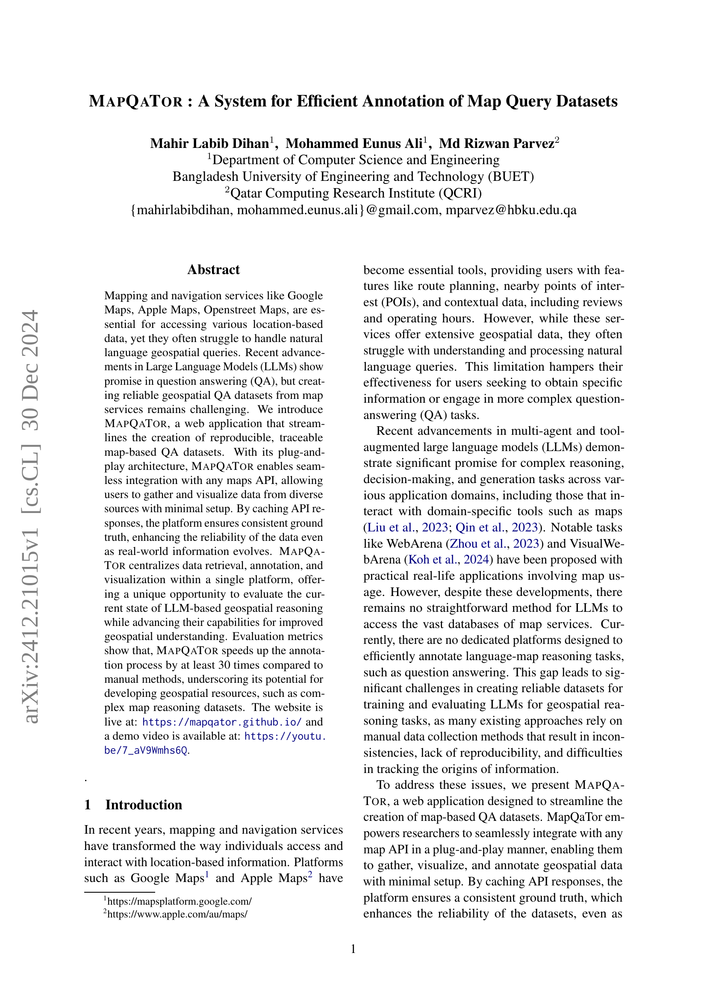
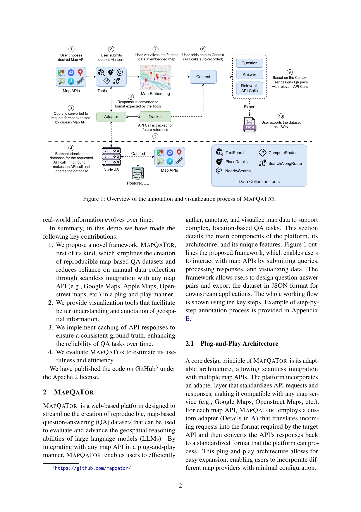
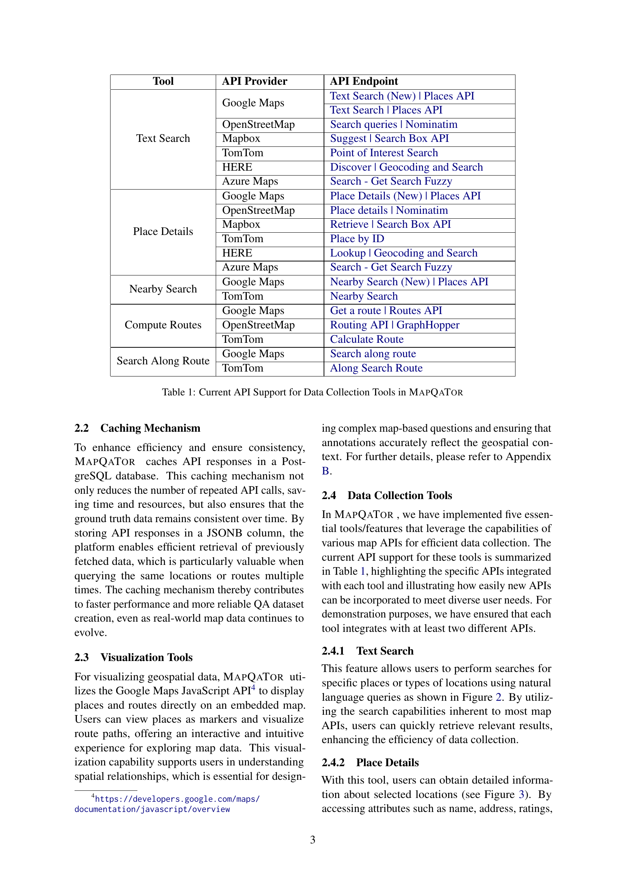
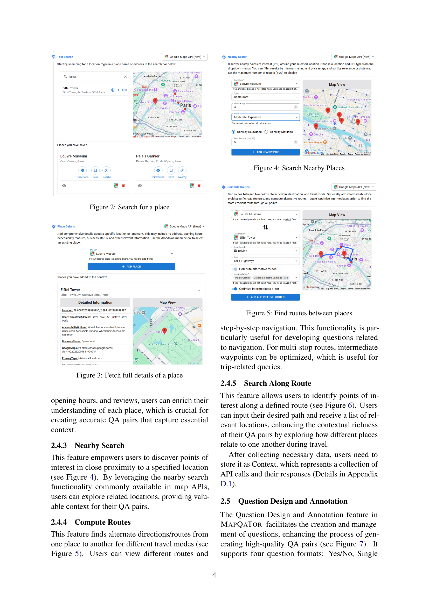
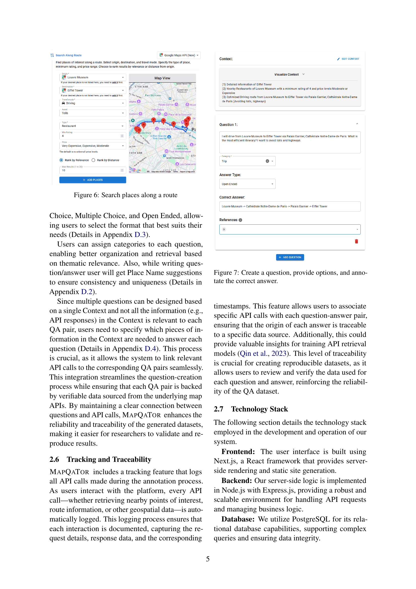
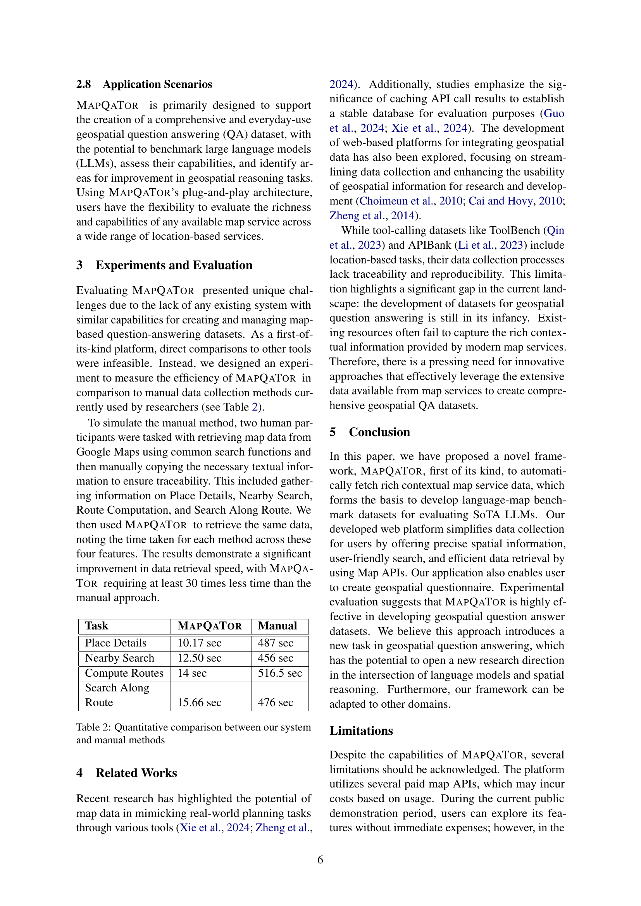
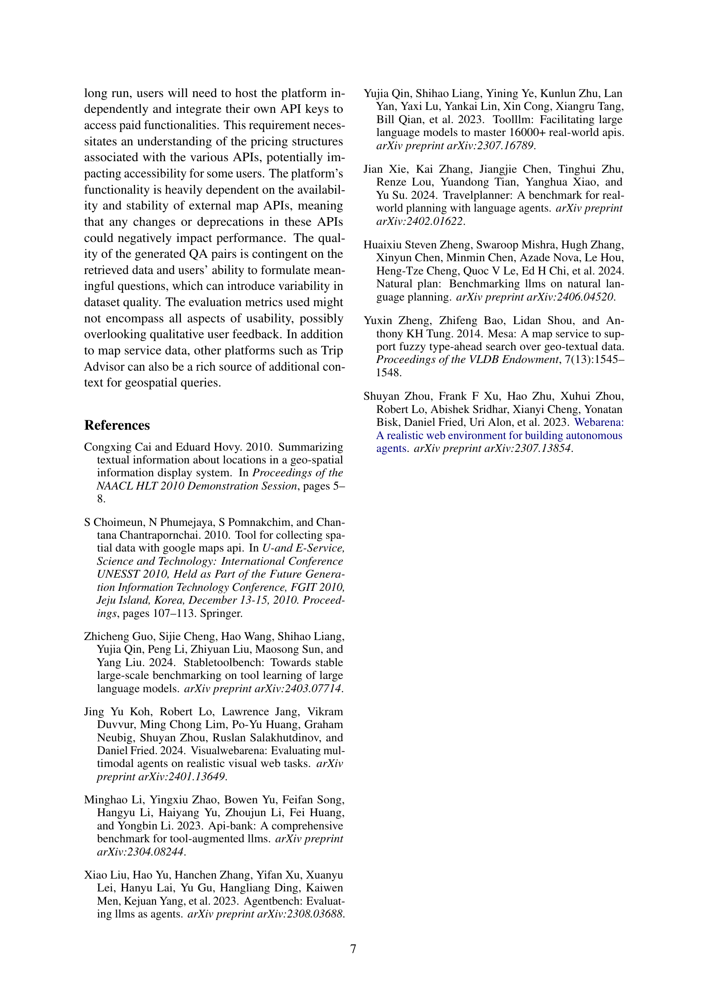
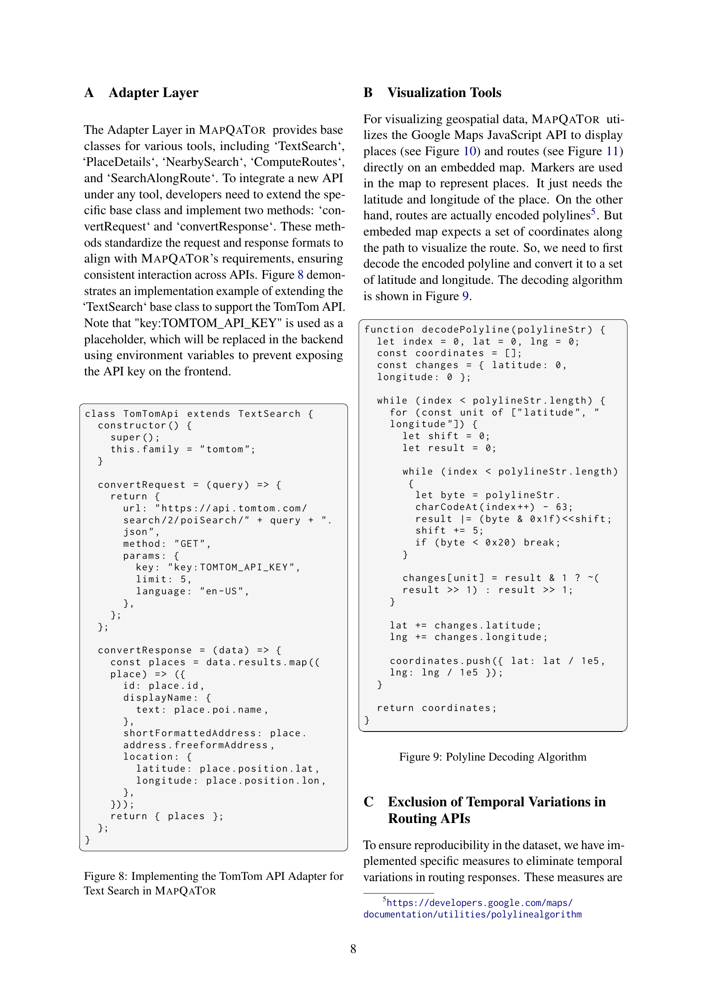
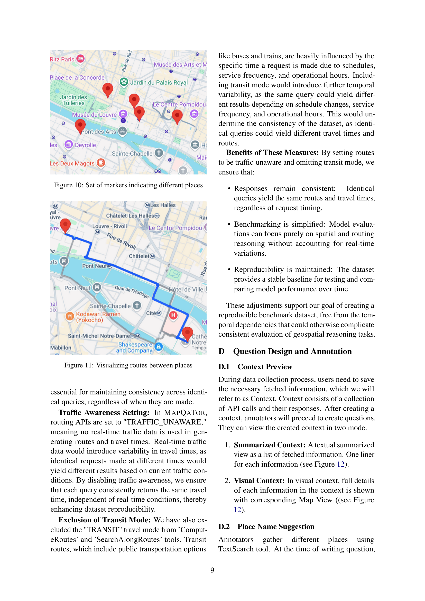
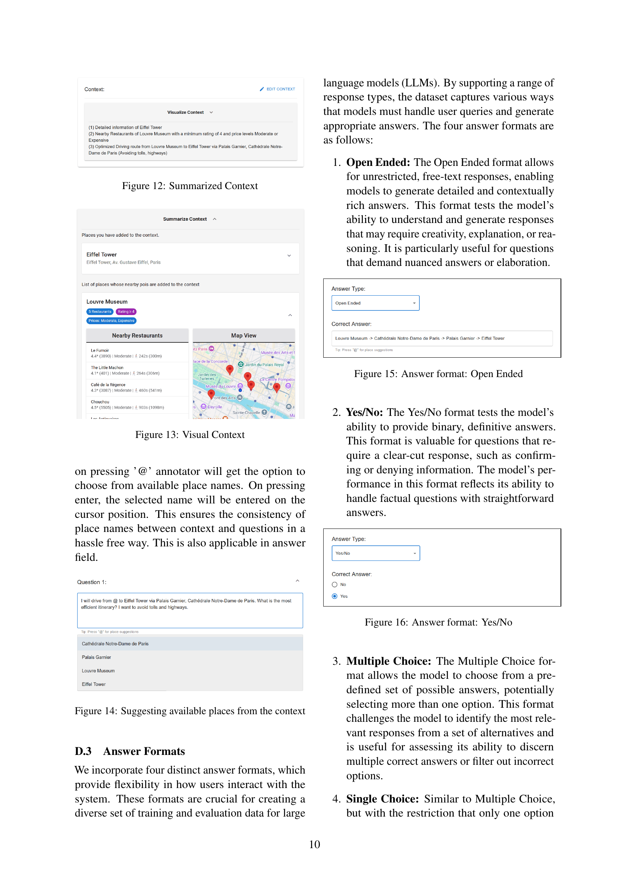
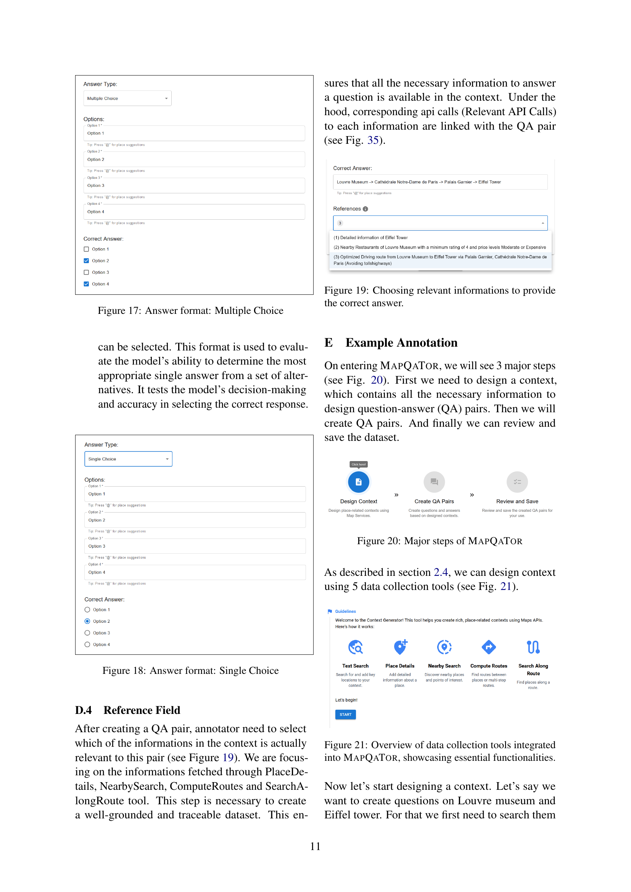
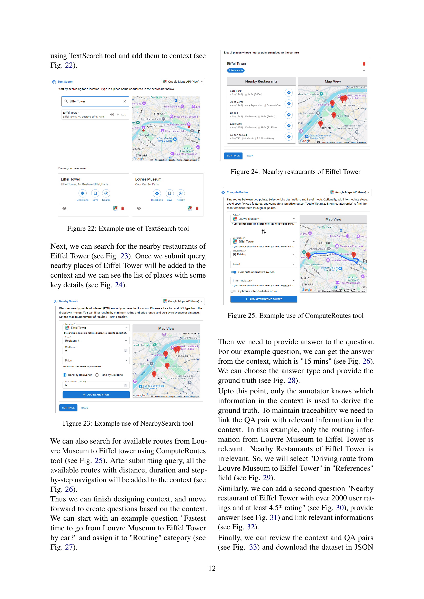
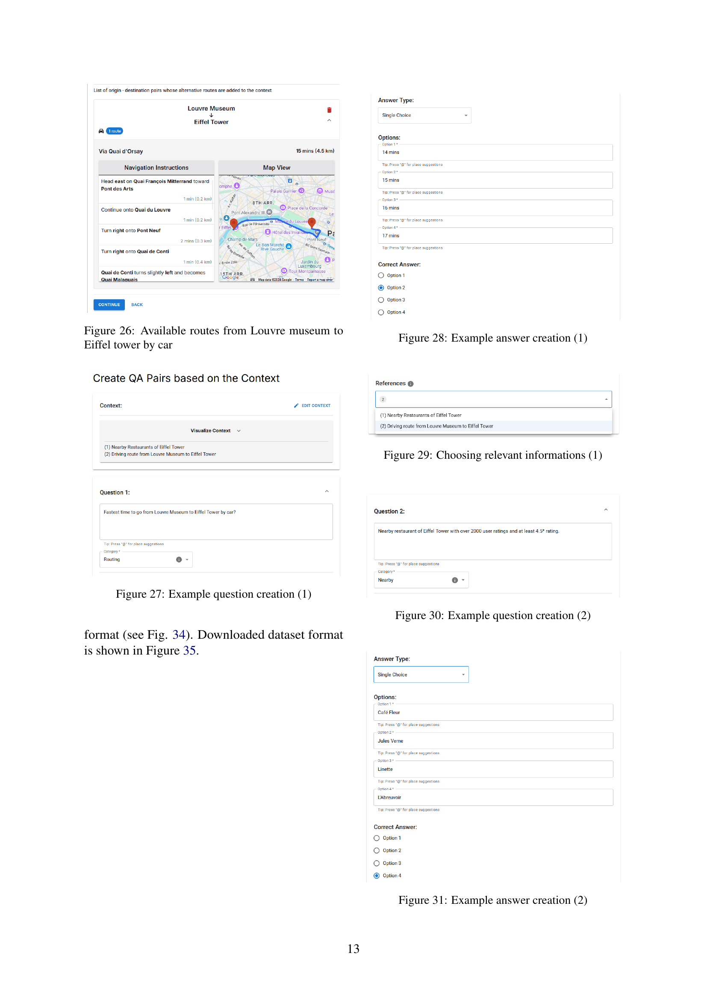
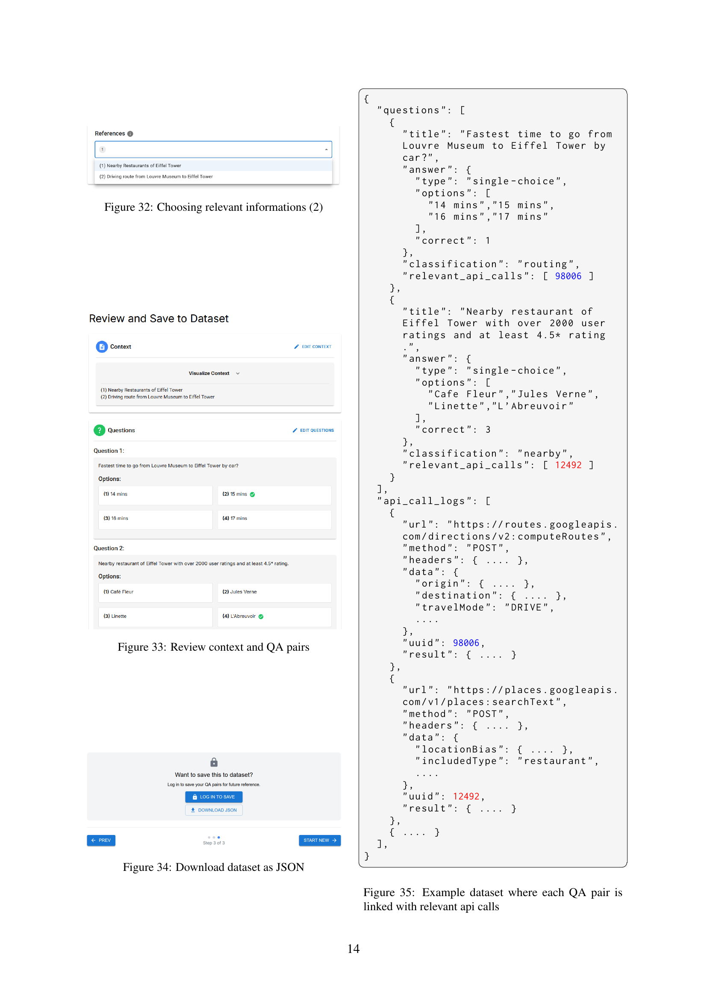
