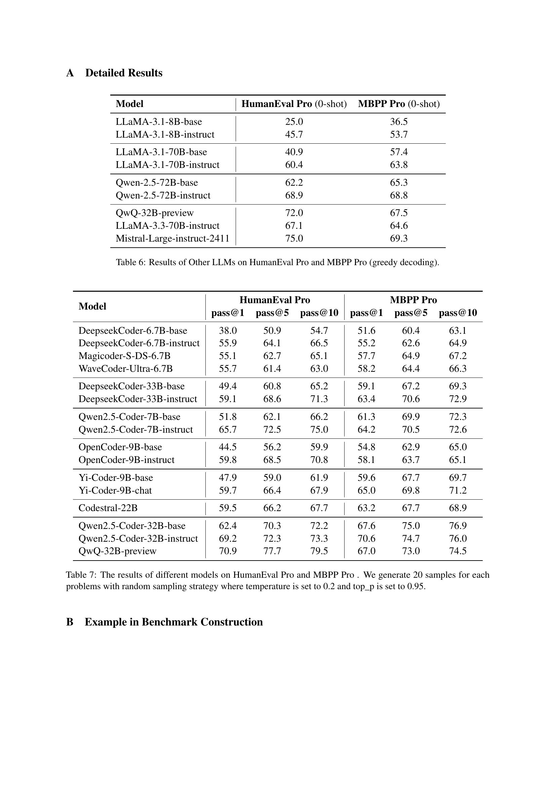

 


 2412.21199 
 Zhaojian Yu et el. 
 
 🤗 2024-12-31 
 



↗ arXiv


↗ Hugging Face


↗ Papers with Code


### TL;DR



기존의 코드 생성 평가 벤치마크는 LLM의 실제 코딩 능력을 완벽히 반영하지 못한다는 문제점이 있습니다. 특히, **복잡한 문제 해결을 위해 여러 함수를 조합하여 사용하는 능력**은 제대로 평가되지 않았습니다.  따라서, LLM이 스스로 생성한 코드를 활용하는 능력을 중점적으로 평가하는 새로운 벤치마크가 필요합니다.

본 연구에서는 **자체 호출 코드 생성**이라는 새로운 평가 방식을 제안하고, HumanEval Pro, MBPP Pro, BigCodeBench-Lite Pro 세 개의 새로운 벤치마크를 개발했습니다.  실험 결과, 최첨단 LLM들도 자체 호출 코드 생성 과제에서 성능이 크게 저하되는 것을 확인했습니다. 이는 LLM의 코드 추론 능력 향상을 위한 새로운 연구 방향을 제시하며, 더욱 **현실적인 코딩 능력 평가**와 **실용적인 코드 생성 모델 개발**에 기여할 것으로 기대됩니다.



#### Key Takeaways


 LLMì˜ 점진적 추론 ë° 문제 해결 능력을 평가하는 새로운 과제인 "자체 호출 코드 생성"을 제안했습니다. 



 기존 코드 생성 벤치마크보다 훨씬 어려운 새로운 세 개의 벤치마크를 개발했습니다. 



 LLM이 자체 생성 코드를 활용하는 ë° 어려움을 겪는다는 것을 밝혔고, 향후 연구 방향을 제시했습니다. 


#### Why does it matter?
본 논문은 **대규모 언어 모델(LLM)**의 코드 추론 능력을 평가하는 새로운 벤치마크를 제시하여, 기존 벤치마크의 한계를 극복하고 **실제 소프트웨어 개발 시나리오**에 더욱 근접한 평가를 제공합니다. 이는 LLM의 코드 생성 능력 향상을 위한 새로운 연구 방향을 제시하고, **실용적인 코드 생성 모델 개발**에 중요한 영향을 미칠 것으로 예상됩니다.  **자체 생성 함수를 호출**하는 코드 생성 과제에 대한 새로운 평가 방법을 제안하며,  **실제 코딩 능력**에 대한 심층적인 이해를 제공합니다.

------
#### Visual Insights

> 🔼  그림 1은 HumanEval Pro와 MBPP Pro에서 자기 호출 코드 생성의 개요를 보여줍니다. 기본 문제와 관련된 더 복잡한 문제가 주어지면 모델은 기본 문제를 해결하고 그 해결책을 사용하여 더 복잡한 문제를 해결해야 합니다. 이는 단순한 코드 생성을 넘어, 모델이 생성한 함수를 활용하여 문제 해결 능력을 평가하는 자기 호출 코드 생성 작업의 핵심 개념을 보여줍니다.  모델은 입력으로 프롬프트(Prompt)를 받고, 기본 문제와 자기 호출 문제를 풀어야 합니다. 기본 문제를 먼저 풀고, 그 해결책을 이용해서 자기 호출 문제를 풀도록 설계되었습니다. 그림에서는 기본 문제의 솔루션을 생성하고, 그 솔루션을 자기 호출 문제에서 활용하는 과정을 시각적으로 보여줍니다.
> 

> 
read the caption

> Figure 1: The overview of self-invoking code generation in HumanEval Pro and MBPP Pro. Given a base problem and a related, more complex problem, they are required to solve the base problem and use its solution to address the complex problems.
> 


| Iteration | HumanEval Pro (%) | MBPP Pro (%) |
|---|---|---|
| Round 1 | 64.0 | 84.7 |
| Round 2 | 98.8 | 99.7 |
| Round 3 | 100.0 | 100.0 |

> 🔼 이 표는 정답 코드와 테스트 케이스 생성 과정에서 사람의 검토를 거친 후 여러 반복 단계에서 생성된 후보 솔루션의 정확도(Pass@1)를 보여줍니다. 각 반복 단계에서의 정확도 향상을 통해, 사람의 검토를 포함한 엄격한 검증 과정을 거쳐 생성된 벤치마크의 높은 품질을 확인할 수 있습니다.
> 

> 
read the caption

> Table 1: Pass@1 (%) of candidate solutions across different iteration rounds for canonical solution and test case generation with human manual review.
> 

### In-depth insights

#### Self-Invoking Code
자기 호출 코드(Self-Invoking Code)는 기존의 단순한 코드 생성 문제를 넘어, **모델이 스스로 생성한 코드를 활용하여 더 복잡한 문제를 해결하는 능력**을 평가하는 새로운 과제입니다. 이는 단순히 코드를 생성하는 능력뿐 아니라, **생성된 코드에 대한 이해와 활용 능력**을 종합적으로 평가한다는 점에서 기존 벤치마크와 차별화됩니다.  연구에서는 HumanEval Pro, MBPP Pro와 같이 자기 호출 코드 생성을 위한 새로운 벤치마크를 제시하고, 다양한 LLM들을 평가하여 **기존 모델들이 자기 호출 코드 생성 과제에서 어려움을 겪는다는 점**을 보여줍니다.  이는 **LLM의 코드 추론 능력 향상**을 위한 새로운 연구 방향을 제시하며,  실제 소프트웨어 개발 환경에 더 가까운 평가 방식을 제공합니다.  또한, instruction-tuning과 같은 기존의 학습 방식이 자기 호출 코드 생성 과제에 대한 성능 향상에는 제한적인 효과를 보인다는 점을 밝히고,  **새로운 학습 방법 및 모델 개선**의 필요성을 강조합니다.  결론적으로, 자기 호출 코드는 LLM의 코드 이해, 활용, 그리고 문제 해결 능력을 종합적으로 평가하는 유용한 도구이며, 향후 LLM 발전에 중요한 역할을 할 것으로 예상됩니다.

#### Benchmark Creation
본 논문에서 제시된 벤치마크 생성 방법은 기존 HumanEval 및 MBPP와 같은 벤치마크의 문제들을 **자체적으로 생성한 함수를 활용하는 자기 호출 방식**으로 확장하는 데 초점을 맞춥니다.  이는 단순한 코드 생성 능력을 넘어, 모델의 **추론 능력 및 문제 해결 능력**을 평가하기 위한 것입니다. **DeepSeek-V2.5와 같은 모델**을 이용하여 기존 문제들을 더욱 복잡한 자기 호출 문제로 변환하는데, 이는 단순히 문제의 복잡성을 높이는 것 뿐만 아니라, 기존 문제와의 **연관성을 유지**하며 점진적인 추론 능력을 요구하도록 설계되었습니다.  **정확성 검증을 위한 반복적 테스트 및 수동 검토** 과정을 통해 높은 품질의 벤치마크를 구축하고, 다양한 모델의 성능을 객관적으로 비교할 수 있는 기반을 마련합니다.  이러한 벤치마크 생성 과정은 기존 벤치마크의 한계를 극복하고, **실제 소프트웨어 개발 환경**에 더욱 가까운 평가를 가능하게 합니다.

#### LLM Evaluation
본 논문은 **대규모 언어 모델(LLM)**의 평가에 대해 심도 있게 논의합니다. 기존의 벤치마크들은 단일 기능 코드 생성에 초점을 맞추어 현실적인 소프트웨어 개발 시나리오를 충분히 반영하지 못한다는 점을 지적합니다. 따라서, **자체 호출 코드 생성(self-invoking code generation)**이라는 새로운 과제를 제시하여 LLM의 점진적 추론 및 문제 해결 능력을 평가하고자 합니다.  이는 기본 문제와 관련된 복잡한 문제를 제시하고, 모델이 기본 문제를 해결한 후 그 해결책을 활용하여 복잡한 문제를 해결하도록 하는 방식입니다.  **HumanEval Pro, MBPP Pro, BigCodeBench-Lite Pro** 와 같은 새로운 벤치마크를 통해 이러한 평가가 이루어집니다.  실험 결과, 대부분의 LLM은 기존 벤치마크에서는 우수한 성능을 보이지만 자체 호출 과제에서는 성능이 저하됨을 보여줍니다.  또한, 지시어 미세 조정 모델은 기본 모델에 비해 자체 호출 코드 생성 과제에서 미미한 개선만 보이는 것으로 나타나, 향후 **자체 호출 코드 생성 과제의 발전 및 LLM의 추론 능력 향상**에 대한 추가 연구의 필요성을 강조합니다.  **실패 원인 분석 및 오류 유형 분류**를 통해 LLM의 한계점을 밝히고,  **Chain-of-Thought 프롬프팅 기법의 효과**에 대해서도 논의합니다.

#### Instruction Tuning
지시 조정(Instruction Tuning)은 대규모 언어 모델(LLM)의 성능을 향상시키는 중요한 방법입니다.  **기본적으로 사전 훈련된 모델에 추가적인 지시 데이터를 제공하여 특정 작업에 대한 성능을 미세 조정하는 방식**입니다.  이를 통해 모델은 다양한 지시어에 더욱 효과적으로 반응하고 보다 정확하고 일관된 출력을 생성할 수 있게 됩니다. 하지만, 본 논문에서 제시된 자기 호출 코드 생성(self-invoking code generation)과 같은 복잡한 작업에서는 **지시 조정의 효과가 제한적**일 수 있음을 보여줍니다. **기존의 벤치마크에서는 지시 조정이 큰 성능 향상을 가져왔지만, 자기 호출 코드 생성과 같이 모델의 추론 능력과 연쇄적인 문제 해결 능력을 요구하는 작업에서는 한계가 드러납니다.**  이는 단순히 지시어에 대한 반응 능력 향상을 넘어, **모델의 근본적인 이해와 추론 능력을 향상시키는 것이 중요**함을 시사합니다. 따라서, 향후 연구에서는 지시 조정 외에도 모델의 내부적인 추론 메커니즘과 문제 해결 과정을 개선하는 방향으로 연구가 진행되어야 할 것입니다.  **더욱 복잡하고 현실적인 문제에 대한 모델의 능력을 평가하기 위한 새로운 벤치마크의 개발 또한 중요**한 과제입니다.

#### Future Work
본 논문은 **자체 호출 코드 생성**이라는 새로운 과제를 제시하여 대규모 언어 모델(LLM)의 점진적 추론 및 문제 해결 능력을 평가하는 HumanEval Pro, MBPP Pro, BigCodeBench-Lite Pro 세 가지 새로운 벤치마크를 제안합니다.  향후 연구 방향으로는 **다양한 프로그래밍 언어 지원 및 보다 다양한 자체 호출 문제의 추가**가 제시될 수 있습니다.  현재 벤치마크는 파이썬에 국한되어 있고, 자체 호출 문제의 다양성이 제한적이기 때문입니다.  또한, **LLM의 자체 호출 코드 생성 능력 향상을 위한 새로운 훈련 방법론**에 대한 연구도 중요하며, **실제 소프트웨어 개발 시나리오를 반영한 보다 현실적인 문제**를 포함하는 벤치마크 개발이 필요합니다.  **다국어 지원**을 통해  LLM의 일반화 능력을 더욱 심도 있게 평가할 수 있습니다. 마지막으로, **실패 사례에 대한 심층 분석**을 통해 LLM의 한계를 파악하고 개선 방향을 모색하는 것이 중요합니다.

### More visual insights

More on figures

> 🔼 그림 2는 HumanEval Pro와 MBPP Pro 벤치마크를 만드는 과정을 보여줍니다. 그림 8에 예시가 나와있습니다. 전체 과정은 다음과 같습니다. 1단계는 DeepSeek-V2.5를 사용하여 기존 문제를 바탕으로 자체 호출 코드 생성 문제를 생성하고, 후보 솔루션 및 테스트 입력값을 생성하는 것입니다. 2단계는 제어된 파이썬 환경에서 생성된 솔루션을 테스트 입력값과 함께 실행하여 실제 결과를 얻는 것입니다. 3단계는 파이썬 실행 확인 및 수동 검토를 포함한 반복적인 방법을 사용하여 모든 테스트 사례가 성공적으로 통과하도록 하여 최종 실행 결과를 사용하여 assert 명령어가 포함된 완전한 테스트 사례를 구성하는 것입니다.
> 

> 
read the caption

> Figure 2: The overview of benchmark construction. An example is shown in Figure 8. We summarize the entire benchmark construction process as follows: (1) Self-invoking problem Generation: We use Deepseek-V2.5 to generate the self-invoking problems, as well as their candidate solutions and test inputs. (2) Solutions Generation: We execute the generated solution with the test inputs in a controlled Python environment to obtain ground truth outputs. (3) Test Cases Generation: We employ an iterative method involving Python execution check and manual review to ensure that all test cases pass successfully. The final execution results are then used to construct complete test cases with assert command.
> 

> 🔼 그림 3은 HumanEval 및 MBPP와 HumanEval Pro 및 MBPP Pro의 성능을 비교한 막대 그래프입니다. HumanEval 및 MBPP는 기존의 코드 생성 벤치마크이고, HumanEval Pro 및 MBPP Pro는 본 논문에서 제안한 자기 호출 코드 생성 작업을 평가하기 위한 새로운 벤치마크입니다. 각 모델의 HumanEval 및 MBPP에 대한 0-shot 및 1-shot Pass@1 점수와 HumanEval Pro 및 MBPP Pro에 대한 0-shot 및 1-shot Pass@1 점수를 비교하여 자기 호출 코드 생성 작업의 어려움을 보여줍니다. 여러 모델들이 기존 벤치마크에서는 높은 성능을 보이지만, 자기 호출 벤치마크에서는 성능이 저하되는 것을 확인할 수 있습니다.
> 

> 
read the caption

> Figure 3: Performance Comparison: HumanEval Pro (and MBPP Pro) vs. HumanEval (and MBPP).
> 

> 🔼 그림 4는 기존 HumanEval 및 MBPP 벤치마크와 새롭게 제안된 HumanEval Pro 및 MBPP Pro 벤치마크에서의 모델 성능을 비교한 산점도입니다. x축은 기존 벤치마크(HumanEval, MBPP)에서의 정확도를, y축은 새로운 벤치마크(HumanEval Pro, MBPP Pro)에서의 정확도를 나타냅니다. 각 점은 특정 언어 모델을 나타내며, 색깔은 기본 모델(base model)과 지시사항 튜닝 모델(instruction-tuned model)을 구분합니다. 이 그림을 통해 기존 벤치마크에서 높은 성능을 보였던 모델들도 자기 호출 코드 생성(self-invoking code generation) 작업에서는 상대적으로 성능이 저하됨을 보여줍니다. 또한, 지시사항 튜닝이 기본 모델의 성능 향상에 미치는 영향이 제한적임을 시각적으로 확인할 수 있습니다.
> 

> 
read the caption

> Figure 4: HumanEval (or MBPP) scores against the results on HumanEval Pro and MBPP Pro (HumanEval+ and MBPP+). We presents the comparison between base model and instruct model.
> 

> 🔼 그림은 HumanEval 및 MBPP와 HumanEval Pro 및 MBPP Pro에서 모델의 성능을 보여주는 혼동 행렬을 나타냅니다. 특히 Qwen2.5-Coder-7B-base 모델에 대한 결과를 보여줍니다.  HumanEval 및 MBPP에서 성공했지만 HumanEval Pro 및 MBPP Pro에서는 실패한 샘플의 수를 보여주는 혼동 행렬을 통해 자체 호출 코드 생성 작업의 어려움을 강조합니다. 이는 모델이 단일 기능 코드 생성에는 능숙하지만, 자체 생성 함수를 활용하여 보다 복잡한 문제를 해결하는 데는 어려움을 겪는다는 것을 시사합니다.
> 

> 
read the caption

> (a) Qwen2.5-Coder-7B-base
> 

> 🔼 그림은 HumanEval Pro와 MBPP Pro에서 Qwen2.5-Coder-32B-base 모델의 성능을 보여주는 혼동 행렬(confusion matrix)입니다.  각 셀은 HumanEval 또는 MBPP에서 성공/실패 여부와 HumanEval Pro 또는 MBPP Pro에서 성공/실패 여부에 따른 샘플 수를 나타냅니다. 이를 통해 기존 벤치마크(HumanEval, MBPP)에서 성공했지만, 자기 호출 코드 생성 작업(HumanEval Pro, MBPP Pro)에서는 실패한 샘플의 수를 파악할 수 있습니다. 이는 모델의 자기 호출 코드 생성 능력에 대한 통찰력을 제공합니다.
> 

> 
read the caption

> (b) Qwen2.5-Coder-32B-base
> 

> 🔼 그림은 HumanEval Pro와 MBPP Pro에서 Qwen2.5-Coder-7B-instruct 모델의 성능을 보여주는 혼동 행렬(confusion matrix)입니다.  행은 HumanEval 또는 MBPP에서의 결과(통과/실패), 열은 HumanEval Pro 또는 MBPP Pro에서의 결과(통과/실패)를 나타냅니다.  각 셀의 숫자는 해당 범주에 속하는 샘플의 수를 나타내며, 비율은 괄호 안에 표시됩니다. 이를 통해 모델이 기존 벤치마크에서는 성공하지만, 자체 호출 코드 생성 작업에서는 실패하는 경우(Failed, Passed)를 확인할 수 있습니다.  또한, 기존 벤치마크와 자체 호출 벤치마크 모두에서 성공하거나 실패하는 경우를 비교 분석하여 모델의 강점과 약점을 파악할 수 있습니다.
> 

> 
read the caption

> (c) Qwen2.5-Coder-7B-instruct
> 

> 🔼 그림 (d)는 HumanEval Pro 및 MBPP Pro 벤치마크에서 Qwen2.5-Coder-32B-instruct 모델의 성능을 보여주는 혼동 행렬(Confusion Matrix)을 나타냅니다.  각 셀은 HumanEval 또는 MBPP와 HumanEval Pro 또는 MBPP Pro에서의 문제 통과/실패 여부를 나타내는 샘플의 개수를 보여줍니다.  이를 통해 모델이 기존 벤치마크에서는 잘 수행하지만, 자체 호출 코드 생성 작업에서는 어려움을 겪는다는 것을 시각적으로 보여줍니다. 특히, HumanEval Pro 또는 MBPP Pro에서는 실패했지만 HumanEval 또는 MBPP에서는 성공한 샘플의 비율이 눈에 띄게 높다는 것을 확인할 수 있습니다.
> 

> 
read the caption

> (d) Qwen2.5-Coder-32B-instruct
> 

> 🔼 그림 5는 다양한 언어 모델의 혼동 행렬을 보여줍니다. HumanEval 또는 MBPP에서 성공했지만 HumanEval Pro 또는 MBPP Pro에서는 실패한 샘플들을 (실패, 성공)으로 표시하여 모델의 성능을 분석합니다. 각 행렬은 특정 모델의 HumanEval Pro 및 MBPP Pro에서의 성능을 보여주며,  각 셀은 HumanEval 또는 MBPP에서의 결과와 HumanEval Pro 또는 MBPP Pro에서의 결과를 비교 분석한 것입니다. 이를 통해 모델이 기존의 코드 생성 문제에서는 잘 해결하지만, 자체 생성 코드를 활용하는 복잡한 자기 호출 코드 생성 문제에서는 어려움을 겪는다는 점을 시각적으로 보여줍니다.
> 

> 
read the caption

> Figure 5: The confusion matrix of different models. We use (Failed, Passed) to indicate samples that fail in HumanEval Pro (or MBPP Pro) but pass in HumanEval (or MBPP).
> 

> 🔼 그림 6은 HumanEval Pro 벤치마크에서 Chain-of-Thought (CoT) 추론을 사용했을 때와 사용하지 않았을 때 GPT-40 모델의 오류 유형 분포를 비교 분석한 결과를 보여줍니다. CoT 추론을 사용하지 않았을 때와 비교하여 CoT 추론을 사용했을 때 특정 오류 유형(예: AssertionError)의 발생 빈도가 감소한 것을 보여주어, CoT 추론이 코드 생성의 정확성을 높이는 데 기여함을 시사합니다.
> 

> 
read the caption

> Figure 6: Error types of GPT-4o with and without CoT reasoning on HumanEval Pro.
> 

> 🔼 그림 7은 HumanEval Pro와 MBPP Pro 벤치마크에서 다양한 대규모 언어 모델(LLM)의 오류 유형 통계를 보여줍니다. 두 벤치마크의 모든 오류 유형을 합산하여 각 모델의 오류 발생 빈도를 비교합니다.  자세한 오류 수는 표 9에 나와 있습니다.  AssertionError, NameError, ValueError, IndexError, TypeError 및 기타 오류와 같은 다양한 오류 유형의 분포를 보여주어, 각 모델의 성능 및 취약점을 분석하는 데 도움이 됩니다.  HumanEval Pro와 MBPP Pro 모두에서 가장 많은 오류 유형은 AssertionError임을 알 수 있습니다.
> 

> 
read the caption

> Figure 7: Statistics of error type across different LLMs on HumanEval Pro and MBPP Pro. We sum up all kinds of errors on the two benchmarks. Exact number is shown in Table 9.
> 

More on tables


| Model | Params | HumanEval (+) | HumanEval Pro (0-shot) | HumanEval Pro (1-shot) | MBPP (+) | MBPP Pro (0-shot) | MBPP Pro (1-shot) |
|---|---|---|---|---|---|---|---| 
| **Proprietary Models** |  |  |  |  |  |  |  |
| o1-mini | - | 97.6 (90.2) | 76.2 | 84.8 | 93.9 (78.3) | 68.3 | 81.2 |
| GPT-4o | - | 90.2 (86.0) | 75.0 | 77.4 | 86.8 (72.5) | 70.9 | 80.2 |
| GPT-4-Turbo | - | 90.2 (86.6) | 72.0 | 76.2 | 85.7 (73.3) | 69.3 | 73.3 |
| Claude-3.5-sonnet | - | 92.1 (86.0) | 72.6 | 79.9 | 91.0 (74.6) | 66.4 | 76.2 |
| **Open-source Models** |  |  |  |  |  |  |  |
| Deepseek-V2.5 | - | 90.2 (83.5) | 73.8 | 76.8 | 87.6 (74.1) | 71.2 | 77.5 |
| DeepseekCoder-V2-instruct | 21/236B | 90.2 (84.8) | 77.4 | 82.3 | 89.4 (76.2) | 71.4 | 76.5 |
| Qwen2.5-Coder-1.5B-base | 1.5B | 43.9 (36.6) | 37.2 | 39.6 | 69.2 (58.6) | 48.4 | 51.3 |
| Qwen2.5-Coder-1.5B-instruct | 1.5B | 70.7 (66.5) | 33.5 | 37.8 | 69.2 (59.4) | 42.1 | 43.7 |
| DeepseekCoder-6.7B-base | 6.7B | 49.4 (39.6) | 35.4 | 36.6 | 70.2 (51.6) | 50.5 | 55.0 |
| DeepseekCoder-6.7B-instruct | 6.7B | 78.6 (71.3) | 55.5 | 61.6 | 74.9 (65.6) | 57.1 | 58.2 |
| Magicoder-S-DS-6.7B | 6.7B | 76.8 (70.7) | 54.3 | 56.7 | 75.7 (64.4) | 58.7 | 64.6 |
| WaveCoder-Ultra-6.7B | 6.7B | 78.6 (69.5) | 54.9 | 59.8 | 74.9 (63.5) | 60.1 | 64.6 |
| Qwen2.5-Coder-7B-base | 7B | 61.6 (53.0) | 54.9 | 56.1 | 76.9 (62.9) | 61.4 | 68.0 |
| Qwen2.5-Coder-7B-instruct | 7B | 88.4 (84.1) | 65.9 | 67.1 | 83.5 (71.7) | 64.8 | 69.8 |
| OpenCoder-8B-base | 8B | 66.5 (63.4) | 39.0 | 42.1 | 79.9 (70.4) | 52.4 | 53.7 |
| OpenCoder-8B-instruct | 8B | 83.5 (78.7) | 59.1 | 54.9 | 79.1 (69.0) | 57.9 | 61.4 |
| Yi-Coder-9B-base | 9B | 53.7 (46.3) | 42.7 | 50.0 | 78.3 (64.6) | 60.3 | 61.4 |
| Yi-Coder-9B-chat | 9B | 85.4 (74.4) | 59.8 | 64.0 | 81.5 (69.3) | 64.8 | 71.7 |
| Codestral-22B-v0.1 | 22B | 81.1 (73.2) | 59.1 | 65.9 | 78.2 (62.2) | 63.8 | 71.2 |
| DeepseekCoder-33B-base | 33B | 56.1 (47.6) | 49.4 | 49.4 | 74.2 (60.7) | 59.0 | 65.1 |
| DeepseekCoder-33B-instruct | 33B | 79.3 (75.0) | 56.7 | 62.8 | 80.4 (70.1) | 64.0 | 68.3 |
| Qwen2.5-Coder-32B-base | 32B | 65.9 (60.4) | 61.6 | 67.1 | 83.0 (68.2) | 67.7 | 73.3 |
| Qwen2.5-Coder-32B-instruct | 32B | 92.7 (87.2) | 70.1 | 80.5 | 90.2 (75.1) | 69.8 | 77.5 |
| LLaMA3-70B-instruct | 70B | 81.7 (72.0) | 60.4 | 64.6 | 82.3 (69.0) | 63.5 | 70.4 |
> 🔼 표 2는 HumanEval Pro와 MBPP Pro 벤치마크에서 다양한 언어 모델의 주요 결과를 보여줍니다.  표에는 각 모델의 HumanEval Pro와 MBPP Pro에서의 Pass@1, Pass@5, Pass@10 점수가 포함되어 있으며,  소스 코드 생성 능력을 평가하는 데 사용된 매개변수 수와 모델 유형(독점 모델, 오픈소스 모델)도 함께 제시합니다. 보다 자세한 결과는 부록 A에서 확인할 수 있습니다. 이 표는 다양한 규모와 종류의 언어 모델들이 제시된 코드 생성 과제에서 어떻게 수행되는지 비교 분석하는 데 도움을 줍니다.
> 

> 
read the caption

> Table 2: Main result of different models on HumanEval Pro and MBPP Pro. More results is shown in Appendix A.
> 


| Error Type | Description | Examples |
|---|---|---|
| AssertionError | Failing to pass the test cases. | Examples in Section G.1 |
| NameError | The code includes undefined variables. | Examples in Section G.2 |
| ValueError | Unaware of the value of variables | Examples in Section G.3 |
| IndexError | Array out of bounds | Examples in Section G.4 |
| TypeError | Incorrect variable type usage. | Examples in Section G.5 |
| Other Errors | KeyError, SyntaxError, ZeroDivisionError, IndentationError, etc. | – |
> 🔼 이 표는 HumanEval Pro와 MBPP Pro 벤치마크에서 모델 평가 결과에 나타난 실행 오류의 종류와 설명을 보여줍니다.  각 오류 유형(AssertionError, NameError, ValueError, IndexError, TypeError, 기타 오류)에 대한 간략한 설명과 함께 예시를 제공하여, 모델 성능 저하의 원인을 분석하는 데 도움을 줍니다.
> 

> 
read the caption

> Table 3: The execution error types and their descriptions in our evaluation results.
> 


| Model | CoT | HE Pro | MBPP Pro |
|---|---|---|---|
| GPT-4o | ✘ | 75.0 | 70.9 |
| GPT-4o | ✔ | 78.0 | 70.9 |
| DeepseekV2.5 | ✘ | 73.8 | 71.2 |
| DeepseekV2.5 | ✔ | 74.4 | 71.4 |
| Qwen2.5-Coder-32B-ins | ✘ | 70.1 | 69.8 |
| Qwen2.5-Coder-32B-ins | ✔ | 72.0 | 70.1 |
| Qwen2.5-Coder-7B-ins | ✘ | 65.9 | 64.8 |
| Qwen2.5-Coder-7B-ins | ✔ | 71.3 | 64.8 |
> 🔼 표 4는 HumanEval Pro와 MBPP Pro 벤치마크에서 평가한 결과에서 발생한 실행 오류의 종류와 설명을 보여줍니다.  각 오류 유형(AssertionError, NameError, ValueError, IndexError, TypeError, 기타 오류)에 대한 간략한 설명과 함께, 각 오류 유형이 나타난 횟수를 보여줍니다. 이 표는 모델의 코드 생성 능력을 평가하는 데 있어서 어떤 유형의 오류가 더 자주 발생하는지 이해하는 데 도움이 됩니다.
> 

> 
read the caption

> Table 4: The execution error types and their descriptions in our evaluation results.
> 


| Model | BCB-Lite | Pro (%) |
|---|---|---|
| GPT-4o | 64.9 | 52.6 |
| GPT4-Turbo | 61.4 | 52.6 |
| Claude-3.5-sonnet | 73.7 | 50.9 |
| DeepseekV2.5 | 80.7 | 50.9 |
| Qwen2.5Coder-1.5B-base | 50.9 | 15.8 |
| Qwen2.5Coder-1.5B-instruct | 50.9 | 10.5 |
| OpenCoder-8B-base | 56.1 | 10.5 |
| OpenCoder-8B-instruct | 75.4 | 22.8 |
| DeepseekCoder-6.7B-base | 59.6 | 35.1 |
| DeepseekCoder-6.7B-instruct | 56.1 | 35.1 |
| WaveCoder-Ultra-6.7B | 61.4 | 26.3 |
| Magicoder-S-DS-6.7B | 50.9 | 33.3 |
| Yi-Coder-9B | 57.9 | 21.1 |
| Yi-Coder-9B-Chat | 66.7 | 31.6 |
| Qwen2.5Coder-7B-base | 59.6 | 38.6 |
| Qwen2.5Coder-7B-instruct | 64.9 | 35.1 |
| DeepseekCoder-33B-base | 71.9 | 38.6 |
| DeepseekCoder-33B-instruct | 80.7 | 43.9 |
| Qwen2.5Coder-32B-base | 68.4 | 49.1 |
| Qwen2.5Coder-32B-instruct | 80.7 | 52.6 |
| Codestral-22B | 78.9 | 54.4 |
| QwQ-32B-preview | 86.0 | 59.6 |
> 🔼 표 5는 BigCodeBench-Lite와 BCB-Lite-Pro에 대한 LLMs의 통과율(%)을 보여줍니다.  BCB-Lite는 BigCodeBench에서 문제 해결 성공률이 50~70%인 문제 57개를 선별하여 구성되었고, 각 문제에 대해 자체 호출 문제와 테스트 케이스를 추가하여 BCB-Lite-Pro를 만들었습니다. 표는 다양한 LLMs의 두 벤치마크에 대한 성능을 비교하여, 기존 벤치마크에 비해 자체 호출 코드 생성 작업의 어려움을 보여줍니다.  G.6절에서는 BCB-Lite-Pro 데이터셋의 예시를 확인할 수 있습니다.
> 

> 
read the caption

> Table 5: Passing rate (%) of LLMs on BigCodeBench (BCB)-Lite and BCB-Lite-Pro. A dataset example of BCB-Lite-Pro is shown in Section G.6.
> 


| Model | HumanEval Pro (0-shot) | MBPP Pro (0-shot) |
|---|---|---|
| LLaMA-3.1-8B-base | 25.0 | 36.5 |
| LLaMA-3.1-8B-instruct | 45.7 | 53.7 |
| LLaMA-3.1-70B-base | 40.9 | 57.4 |
| LLaMA-3.1-70B-instruct | 60.4 | 63.8 |
| Qwen-2.5-72B-base | 62.2 | 65.3 |
| Qwen-2.5-72B-instruct | 68.9 | 68.8 |
| QwQ-32B-preview | 72.0 | 67.5 |
| LLaMA-3.3-70B-instruct | 67.1 | 64.6 |
| Mistral-Large-instruct-2411 | 75.0 | 69.3 |
> 🔼 표 6은 HumanEval Pro와 MBPP Pro 벤치마크에서 다양한 대규모 언어 모델(LLM)의 성능을 보여줍니다.  Greedy decoding 방식을 사용하여 평가되었으며, HumanEval Pro와 MBPP Pro에서 각 모델의 0-shot(제로샷) 성능(pass@1)을 보여줍니다. 이 표는 본 논문의 실험 결과를 보여주는 여러 표 중 하나입니다.  다른 표들과 함께 해당 모델의 코드 생성 능력, 특히 자기 호출 코드 생성 능력을 비교 분석하는 데 사용됩니다.
> 

> 
read the caption

> Table 6: Results of Other LLMs on HumanEval Pro and MBPP Pro (greedy decoding).
> 


| Model | HumanEval Pro pass@1 | HumanEval Pro pass@5 | HumanEval Pro pass@10 | MBPP Pro pass@1 | MBPP Pro pass@5 | MBPP Pro pass@10 |
|---|---|---|---|---|---|---|
| DeepseekCoder-6.7B-base | 38.0 | 50.9 | 54.7 | 51.6 | 60.4 | 63.1 |
| DeepseekCoder-6.7B-instruct | 55.9 | 64.1 | 66.5 | 55.2 | 62.6 | 64.9 |
| Magicoder-S-DS-6.7B | 55.1 | 62.7 | 65.1 | 57.7 | 64.9 | 67.2 |
| WaveCoder-Ultra-6.7B | 55.7 | 61.4 | 63.0 | 58.2 | 64.4 | 66.3 |
| DeepseekCoder-33B-base | 49.4 | 60.8 | 65.2 | 59.1 | 67.2 | 69.3 |
| DeepseekCoder-33B-instruct | 59.1 | 68.6 | 71.3 | 63.4 | 70.6 | 72.9 |
| Qwen2.5-Coder-7B-base | 51.8 | 62.1 | 66.2 | 61.3 | 69.9 | 72.3 |
| Qwen2.5-Coder-7B-instruct | 65.7 | 72.5 | 75.0 | 64.2 | 70.5 | 72.6 |
| OpenCoder-9B-base | 44.5 | 56.2 | 59.9 | 54.8 | 62.9 | 65.0 |
| OpenCoder-9B-instruct | 59.8 | 68.5 | 70.8 | 58.1 | 63.7 | 65.1 |
| Yi-Coder-9B-base | 47.9 | 59.0 | 61.9 | 59.6 | 67.7 | 69.7 |
| Yi-Coder-9B-chat | 59.7 | 66.4 | 67.9 | 65.0 | 69.8 | 71.2 |
| Codestral-22B | 59.5 | 66.2 | 67.7 | 63.2 | 67.7 | 68.9 |
| Qwen2.5-Coder-32B-base | 62.4 | 70.3 | 72.2 | 67.6 | 75.0 | 76.9 |
| Qwen2.5-Coder-32B-instruct | 69.2 | 72.3 | 73.3 | 70.6 | 74.7 | 76.0 |
| QwQ-32B-preview | 70.9 | 77.7 | 79.5 | 67.0 | 73.0 | 74.5 |
> 🔼 표 7은 HumanEval Pro와 MBPP Pro 벤치마크에서 다양한 언어 모델의 성능을 보여줍니다. 각 문제에 대해 온도 0.2, top_p 0.95의 랜덤 샘플링 전략을 사용하여 20개의 샘플을 생성했습니다. 표에는 각 모델의 HumanEval Pro와 MBPP Pro에 대한 pass@1, pass@5, pass@10 점수가 포함되어 있습니다. 이는 모델이 각 문제에 대한 정답을 생성하는 데 성공한 비율을 나타냅니다.
> 

> 
read the caption

> Table 7: The results of different models on HumanEval Pro and MBPP Pro . We generate 20 samples for each problems with random sampling strategy where temperature is set to 0.2 and top_p is set to 0.95.
> 


| Model Name | API Name |
|---|---| 
| O1-mini | `o1-mini-2024-09-12` |
| GPT-4o | `gpt-4o-2024-08-06` |
| GPT-4-Turbo | `gpt-4-turbo-2024-04-09` |
| Claude-3.5-sonnet | `claude-3-5-sonnet-20241022` |
| Deepseek-V2.5 | `deepseek-chat` |
> 🔼 표 8은 논문의 표 2에 나열된 평가 대상 모델들에 대한 API 이름과 HuggingFace 모델 URL을 보여줍니다.  더 자세히 설명하자면, 각 모델의 고유 식별자(API 이름)와 모델 접근을 위한 HuggingFace 저장소 주소(URL)가 매핑되어 있어,  연구의 재현성을 높이는 데 중요한 역할을 합니다.  이 정보를 통해 연구자들은 논문에서 사용된 동일한 모델들을 사용하여 실험을 반복하고 결과를 비교할 수 있습니다.
> 

> 
read the caption

> Table 8: The corresponding API names and HuggingFace model URLs for the evaluated models are listed in Table 2.
> 


| Model Name | HuggingFace URL |
|---|---| 
| DeepseekCoder-V2-instruct | https://huggingface.co/deepseek-ai/DeepSeek-Coder-V2-Instruct |
| Qwen2.5-Coder-1.5B-base | https://huggingface.co/Qwen/Qwen2.5-Coder-1.5B |
| Qwen2.5-Coder-1.5B-instruct | https://huggingface.co/Qwen/Qwen2.5-Coder-1.5B-Instruct |
| DeepseekCoder-6.7B-base | https://huggingface.co/deepseek-ai/deepseek-coder-6.7b-base |
| DeepseekCoder-6.7B-instruct | https://huggingface.co/deepseek-ai/deepseek-coder-6.7b-instruct |
| Magicoder-S-DS-6.7B | https://huggingface.co/ise-uiuc/Magicoder-S-DS-6.7B |
| WaveCoder-Ultra-6.7B | https://huggingface.co/microsoft/wavecoder-ultra-6.7b |
| Qwen2.5-Coder-7B-base | https://huggingface.co/Qwen/Qwen2.5-Coder-7B |
| Qwen2.5-Coder-7B-instruct | https://huggingface.co/Qwen/Qwen2.5-Coder-7B-Instruct |
| OpenCoder-8B-base | https://huggingface.co/infly/OpenCoder-8B-Base |
| OpenCoder-8B-instruct | https://huggingface.co/infly/OpenCoder-8B-Instruct |
| Yi-Coder-9B-base | https://huggingface.co/01-ai/Yi-Coder-9B |
| Yi-Coder-9B-chat | https://huggingface.co/01-ai/Yi-Coder-9B-Chat |
| Codestral-22B-v0.1 | https://huggingface.co/mistralai/Codestral-22B-v0.1 |
| DeepseekCoder-33B-base | https://huggingface.co/deepseek-ai/deepseek-coder-33b-base |
| DeepseekCoder-33B-instruct | https://huggingface.co/deepseek-ai/deepseek-coder-33b-instruct |
| Qwen2.5-Coder-32B-base | https://huggingface.co/Qwen/Qwen2.5-Coder-32B |
| Qwen2.5-Coder-32B-instruct | https://huggingface.co/Qwen/Qwen2.5-Coder-32B-Instruct |
| LLaMA3-70B-instruct | https://huggingface.co/meta-llama/Meta-Llama-3-70B-Instruct |
| QwQ-32B-Preview | https://huggingface.co/Qwen/QwQ-32B-Preview |
| LLaMA3.1-8B-base | https://huggingface.co/meta-llama/Llama-3.1-8B |
| LLaMA3.1-8B-instruct | https://huggingface.co/meta-llama/Llama-3.1-8B-Instruct |
| LLaMA3.1-70B-base | https://huggingface.co/meta-llama/Llama-3.1-70B |
| LLaMA3.1-70B-instruct | https://huggingface.co/meta-llama/Llama-3.1-70B-Instruct |
| Qwen2.5-72B-base | https://huggingface.co/Qwen/Qwen2.5-72B |
| Qwen2.5-72B-instruct | https://huggingface.co/Qwen/Qwen2.5-72B-Instruct |
> 🔼 표 9는 HumanEval Pro와 MBPP Pro 벤치마크에서 다양한 언어 모델의 오류 유형별 통계를 보여줍니다. 각 모델에 대해 HumanEval Pro와 MBPP Pro에서 발생한 오류의 수를 Assertion Error, Name Error, ValueError, IndexError, TypeError, 기타 오류 유형으로 분류하여 보여줍니다. 이 표는 각 모델의 성능을 더 잘 이해하는 데 도움이 되는 자세한 오류 분석을 제공합니다.
> 

> 
read the caption

> Table 9: Error type of Different Models on HumanEval Pro and MBPP Pro.
> 

### Full paper



