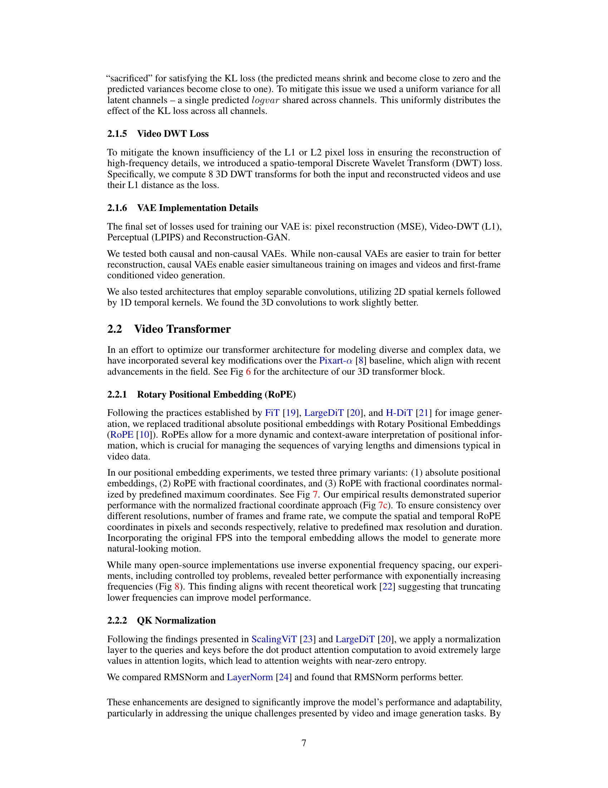

 


 2501.00103 
 Yoav HaCohen et el. 
 
 🤗 2025-01-03 
 



↗ arXiv


↗ Hugging Face


### TL;DR



기존의 텍스트-비디오 생성 모델들은 계산 비용이 많이 들고, 고품질 비디오 생성에 어려움을 겪었습니다. 특히, 고해상도 비디오 생성에는 높은 계산 성능을 요구하는 복잡한 모델들이 필요했으며, 이는 많은 연구자들에게 접근성의 문제를 야기했습니다.  또한, 시간적 일관성을 유지하는 데 어려움이 있었습니다.

본 논문에서는 이러한 문제를 해결하기 위해 새로운 실시간 비디오 생성 모델인 LTX-Video를 제시합니다.  LTX-Video는 비디오 VAE와 잡음 제거 변환기를 효율적으로 통합하여 고품질 비디오를 빠르게 생성합니다.  **1:192의 높은 압축률**과 **혁신적인 손실 함수**를 사용하여 고해상도 비디오를 **실시간보다 빠르게** 생성하며,  **다양한 유형의 비디오 생성**을 지원합니다.  **오픈 소스**로 공개되어 접근성과 확장성을 높였고, 새로운 기준을 제시하며 향후 연구에 큰 영향을 줄 것으로 기대됩니다.



#### Key Takeaways


 변환기 기반 잠재 확산 모델을 사용하여 비디오 VAE와 잡음 제거 변환기를 통합, 효율성과 품질을 향상시켰습니다. 



 1:192의 높은 압축률을 달성하여, Nvidia H100 GPU에서 5초 분량의 768x512 해상도 비디오를 2초 만에 생성하는 초고속 성능을 보였습니다. 



 텍스트-비디오 및 이미지-비디오 생성 모두 지원하며, 오픈 소스로 공개되어 접근성과 확장성을 높였습니다. 


#### Why does it matter?
본 논문은 **실시간 비디오 생성 분야의 새로운 기준**을 제시하여, 연구자들에게 **빠르고 접근하기 쉬운 고품질 비디오 생성 모델**을 제공합니다.  이는 **비디오 생성 기술의 발전**에 크게 기여하며, 다양한 응용 분야에서의 혁신을 촉진할 수 있습니다.  특히, **제한된 하드웨어 환경에서도 고품질 비디오 생성**이 가능하다는 점은 주목할 만하며,  **향후 연구**를 위한 새로운 가능성을 제시합니다. 더 나아가, **오픈 소스로 공개**되어 연구자들의 활발한 참여와 발전을 이끌어낼 것으로 기대됩니다.

------
#### Visual Insights

> 🔼 본 그림은 LTX-Video 모델이 생성한 텍스트-투-비디오 및 이미지-투-비디오 샘플을 보여줍니다. 첫 번째 행은 텍스트 프롬프트만을 사용하여 생성된 5초짜리 비디오의 일부 화면입니다. 나머지 두 행은 왼쪽 프레임을 조건으로 사용하여 생성된 5초짜리 비디오의 일부 화면입니다.  이 그림은 모델의 프롬프트 충실도, 시각적 품질, 그리고 동작의 정확성을 강조합니다. 각 행은 생성된 5초 비디오에서 균일하게 간격을 둔 프레임을 보여줍니다.
> 

> 
read the caption

> Figure 1: Text-to-video (first row) and image-to-video samples (last 2 rows, conditioned on the left frame) generated by LTX-Video, highlighting our model’s high level of prompt adherence, visual quality and motion fidelity. Each row shows evenly-spaced frames from a generated 5-second video.
> 


|---|---|---|---|
|||||


> 🔼 표 1은 본 논문에서 제시된 LTX-Video 모델과 다른 최첨단 텍스트-비디오 생성 모델들(MovieGen, HunyuanVideo, PyramidFlow, CogVideoX)의 사양을 비교 분석한 표입니다. 모델 크기, 트랜스포머의 히든 차원, 피드포워드 네트워크의 차원, VAE의 시공간 압축 비율, 출력 채널 수, VAE의 총 압축 비율, 트랜스포머 입력 패치 크기, 토큰 대 픽셀 비율, 트랜스포머 블록 수, 어텐션 블록 아키텍처, 업샘플링 모델 등 다양한 측면에서 비교하여 각 모델의 특징과 차이점을 명확하게 보여줍니다. 이를 통해 LTX-Video 모델의 효율성과 성능을 객관적으로 평가하고, 다른 모델들과의 우위를 보여주는 데 도움을 줍니다.
> 

> 
read the caption

> Table 1: Comparison of Model Specifications.
> 

### In-depth insights

#### Holistic Latent Diffusion
본 논문에서 제시된 "홀리스틱 잠재 확산(Holistic Latent Diffusion)" 개념은 비디오 생성을 위한 기존 방법들의 단점을 극복하기 위한 혁신적인 접근 방식입니다. 기존의 방법들이 **비디오 VAE와 잡음 제거 트랜스포머를 독립적인 구성 요소로 취급**하는 것과 달리, 홀리스틱 잠재 확산은 **두 구성 요소 간의 상호 작용을 최적화**하여 효율성과 품질을 향상시키는 데 중점을 둡니다.  **VAE의 입력 단계에서 패치화 연산을 수행**하여 고차원 잠재 공간에서 효율적인 공간-시간적 자기 주의(self-attention)를 가능하게 합니다. 이는 고해상도 비디오 생성에 필수적이며, **높은 압축률에도 불구하고 시간적 일관성을 유지**합니다.  **VAE 디코더는 잠재 변수를 픽셀로 변환하고 최종 잡음 제거 단계를 수행**하는 역할을 동시에 담당하여 별도의 업샘플링 모듈 없이 미세한 디테일을 유지하면서도 실행 속도를 높입니다. 이러한 통합적 접근 방식을 통해 **실시간보다 빠른 비디오 생성**을 달성하고, 다양한 활용 사례(텍스트-비디오, 이미지-비디오 변환)를 지원하는 강력한 모델을 구축합니다.

#### High-Compression VAE
본 논문에서 제시된 고압축 VAE는 **1:192의 높은 압축률**을 달성하여 비디오 생성의 효율성을 크게 향상시킨다는 점에서 주목할 만합니다. 이는 기존 방식들과 달리 패치화 연산을 트랜스포머 입력이 아닌 VAE 입력으로 옮김으로써 가능해졌습니다. **32x32x8 픽셀 토큰화**를 통해 높은 압축률을 달성하면서도 트랜스포머가 효율적으로 전체 공간-시간적 자기 주의를 수행할 수 있게 됩니다.  하지만 고압축은 세부적인 디테일 표현의 제한을 초래할 수 있는데, 이를 해결하기 위해 **VAE 디코더는 잠재 공간에서 픽셀 공간으로 변환과 최종 잡음 제거를 동시에 수행**하도록 설계되었습니다.  이를 통해 별도의 업샘플링 모듈 없이도 고해상도 비디오 생성이 가능해져 연산 비용을 절감할 수 있습니다.  **고압축 VAE는 빠르고 확장 가능한 비디오 생성**에 중요한 역할을 수행하는 핵심 구성 요소라 할 수 있습니다.

#### Transformer Enhancements
본 논문에서 제시된 비디오 생성 모델의 핵심적인 부분 중 하나는 트랜스포머의 성능 향상입니다. **회전 위치 임베딩(Rotary Positional Embedding)**을 사용하여 비디오 데이터의 시계열 특성을 효과적으로 처리하고, **QK 정규화(QK Normalization)**을 통해 어텐션 메커니즘의 안정성을 높였습니다. 특히, **비디오 데이터의 공간 및 시간적 일관성을 유지하기 위한 다양한 기법들을 적용**하여 고품질의 비디오 생성을 가능하게 하였습니다. **고차원의 잠재 공간을 효율적으로 활용**함으로써 고해상도 비디오 생성에 필요한 계산 비용을 절감하는 데 성공했습니다.  **여러 가지 해상도와 지속 시간을 가진 데이터로 동시에 훈련**하여 모델의 일반화 성능을 높였으며,  **효율적인 토큰 패킹 및 패딩 전략을 통해 다양한 비디오 길이를 효과적으로 처리**하였습니다. 이러한 개선을 통해 실시간보다 빠른 속도로 고품질 비디오 생성이 가능해졌습니다.  **여러 가지 손실 함수를 조합하여 사용**하는 등, 다양한 기술적 혁신을 통해 고품질 비디오 생성 모델을 구축하는 데 기여했습니다.

#### Multi-Resolution Training
다중 해상도 학습은 **다양한 해상도와 지속 시간의 비디오를 동시에 학습**하여 모델의 일반화 능력을 향상시키는 방법입니다.  **여러 해상도와 지속 시간의 조합에 노출**됨으로써 모델은 보지 못한 설정에도 잘 적응할 수 있습니다.  이를 위해, **모든 입력 샘플이 비슷한 토큰 수를 포함**하도록 원본 비디오의 크기를 조정하고, 필요에 따라 임의의 토큰 삭제를 수행합니다.  **토큰 패킹이나 패딩 전략 없이 다양성을 유지**하면서 효율적인 접근 방식을 제공합니다.  이러한 다중 해상도 학습은 **모델의 유연성과 일반화 능력을 향상**시키고, **다양한 해상도와 지속 시간의 비디오를 생성**하는 데 유용합니다.  **단일 해상도 학습보다 훨씬 효율적**이며,  **모델의 성능과 범용성을 향상**시키는 데 중요한 역할을 합니다.

#### Future Research
본 논문의 LTX-Video 모델은 비디오 생성 분야에서 괄목할 만한 성과를 보였지만, **향후 연구를 통해 개선될 여지**가 있습니다.  **긴 비디오 생성에 대한 지원 확대**는 중요한 과제입니다. 현재 모델은 최대 10초 길이의 비디오 생성에 집중되어 있으므로, 더 긴 비디오를 생성하면서 일관성과 프롬프트 충실도를 유지하는 방법에 대한 연구가 필요합니다.  또한, **도메인 특화적 일반화 능력 향상**을 위한 연구도 필요합니다. 다양한 도메인(예: 멀티뷰 합성이나 세밀한 편집)에 대한 모델 적응력을 높이는 방안을 모색해야 합니다.  **프롬프트에 대한 모델 민감도 개선**도 중요한 연구 주제입니다. 모호하거나 질이 낮은 프롬프트에도 일관된 결과를 생성할 수 있도록 프롬프트 해석 및 처리 방식을 개선해야 합니다.  마지막으로, **모델의 효율성 및 접근성 향상**을 위한 노력이 지속되어야 합니다.  **고성능 하드웨어에 대한 의존성을 줄이고** 일반적인 소비자급 하드웨어에서도 실행 가능하도록 모델 경량화 및 최적화 연구가 필요합니다.

### More visual insights

More on figures

> 🔼 그림 2는 LTX-Video의 홀리스틱(전체론적) 잡음 제거 전략을 보여줍니다.  기존의 잠재 벡터(latent) 간의 확산(diffusion) 단계를 거친 후, 최종적으로 잠재 벡터를 픽셀로 변환하는 단계에서 추가적인 잡음 제거를 수행합니다. 이를 통해 고해상도의 세부적인 디테일을 유지하면서도 연산 비용이 많이 드는 별도의 업샘플링(upsampling) 모듈 없이도 고품질의 비디오를 생성할 수 있습니다.  잠재 벡터 간의 단계는 transformer 기반의 diffusion model에서 이뤄지고, 최종 단계는 VAE decoder가 잠재 벡터를 픽셀 공간으로 변환하면서 동시에 잡음 제거를 수행합니다.
> 

> 
read the caption

> Figure 2: LTX-Video holistic denoising strategy – latent-to-latent diffusion denoising steps + final latent-to-pixels denoising step.
> 

> 🔼 이 그림은 LTX-Video 모델의 VAE(Variational Autoencoder)에서 학습 진행 단계에 따른 잠재 공간(latent space)의 설명된 분산(explained variance)을 보여줍니다.  각 곡선은 학습 과정의 특정 시점(2%, 4%, 8%, 16%, 25%, 50%, 70%, 100%)에서 잠재 채널(latent channels)들이 데이터의 분산을 얼마나 잘 설명하는지를 나타냅니다.  그래프는 학습이 진행될수록 잠재 채널들이 데이터의 분산을 더 효율적으로 설명하고, 즉, 중복성(redundancy)이 감소함을 보여줍니다.  이는 VAE가 고효율 압축을 달성하는 데 중요한 역할을 한다는 것을 시각적으로 보여주는 것입니다.
> 

> 
read the caption

> (a) Latent channels cumulative explained variance at different training steps.
> 

> 🔼 그림 3(b)는 훈련 과정의 4% 시점에서 잠재 공간의 상관관계를 보여줍니다. 이 시점에서 잠재 채널들 간의 높은 상관관계는 잠재 공간에 중복된 정보가 많이 존재함을 시사하며, 이는 효율적인 압축에 방해가 됩니다. 이 그림은 고차원 잠재 공간에서의 정보 중복 문제를 시각적으로 보여주는 데 중요한 역할을 합니다.
> 

> 
read the caption

> (b) Correlation at 4%
> 

> 🔼 그림 3(c)는 VAE 학습이 완료된 후 잠재 공간의 최종 상관 관계를 보여줍니다.  훈련 초기에 비해 잠재 채널 간의 상관 관계가 크게 감소하여, 각 채널이 데이터 분산에 고르게 기여함을 시각적으로 보여줍니다. 이는 VAE가 훈련 과정에서 잠재 공간의 중복성을 효과적으로 줄이고, 정보를 효율적으로 표현하도록 학습되었음을 의미합니다. 따라서 고차원의 잠재 공간을 사용하더라도 정보 손실 없이 고효율의 압축을 달성할 수 있습니다.
> 

> 
read the caption

> (c) Final Correlation
> 

> 🔼 그림 3은 잠재 공간의 중복성을 보여줍니다. (a)는 학습 단계(학습의 2%에서 100%)에서 다양한 잠재 채널의 누적 설명 분산을 보여줍니다. 학습이 진행됨에 따라 중복성이 감소하고 구성 요소가 분산에 보다 고르게 기여합니다. (b, c)는 잠재 채널의 자동 상관 행렬을 보여줍니다. 학습 초기(전체 학습 단계의 4% 시점)에는 대각선 값이 높고, 학습이 완료되면 0에 가까워집니다. 이 그림은 고차원 잠재 공간에서의 정보 중복성을 분석하고, 제안된 모델의 VAE(Variational Autoencoder)가 학습 과정에서 이러한 중복성을 효과적으로 줄이고 잠재 공간을 효율적으로 사용하는 방법을 보여줍니다.
> 

> 
read the caption

> Figure 3: Latent-space redundancy. (a) Cumulative explained-variance of latent channels at different training steps (2% - 100% of training). As training progresses, the redundancy reduces and components contribute more evenly to the variance. (b, c) Latent channels auto-correlation matrices: high off-diagonal values early (at 4% of total training steps) and near-zero at training completion.
> 

> 🔼 그림 4(a)는 LTX-Video 모델의 비디오 VAE(Variational Autoencoder) 아키텍처 중 인코더 부분을 보여줍니다. 이 인코더는 3차원(3D) 인과적 합성곱(Causal Convolution)을 사용하여 비디오 프레임을 처리하며, 32 x 32 x 8 픽셀의 공간-시간적 다운샘플링을 수행합니다. 첫 번째 프레임은 별도의 잠재 벡터로 인코딩되고, 이후 프레임들은 순차적으로 처리됩니다. 여러 개의 잔차 블록(ResBlock)과 조건부 잔차 블록(CondResBlock)이 포함되어 있으며, 픽셀 정규화(PixelNorm), SILU 활성화 함수 등이 사용됩니다. 최종적으로 압축된 잠재 표현(latent representation) Z가 생성됩니다.
> 

> 
read the caption

> (a) Causal Encoder
> 

> 🔼 이 그림은 논문의 2.1 Video VAE 섹션에 속하며, LTX-Video 모델의 비디오 VAE 아키텍처 중 디노이징 디코더(Denoising Decoder) 부분을 보여줍니다.  디코더는 압축된 잠재 공간(latent space)의 정보를 사용하여 고해상도의 비디오 프레임을 생성하는 역할을 합니다.  그림에는 3D 합성곱(Causal Conv3D), 잔차 블록(ResBlock), 업샘플링(Upsample), 조건부 잔차 블록(CondResBlock), 그리고 노이즈 주입(Noise Inject) 등의 주요 구성 요소들이 자세히 표현되어 있습니다.  이 디코더는 단순히 잠재 벡터를 픽셀로 변환하는 것 이상으로, 마지막 디노이징 단계도 수행하여 고품질 비디오 생성에 기여합니다.  즉, 압축된 정보를 고해상도로 복원하고 동시에 노이즈를 제거하는 역할을 수행한다는 것을 시각적으로 보여줍니다.
> 

> 
read the caption

> (b) Denoising Decoder
> 

> 🔼 그림 4는 논문의 2.1절(Video VAE)에서 소개하는 LTX-Video 모델의 Video VAE 아키텍처를 보여줍니다. (a)는 3D Causal Convolution을 사용하는 Causal Encoder를 나타내며, 첫 번째 프레임을 제외하고 32x32x8의 공간-시간 압축을 적용합니다. 첫 번째 프레임은 별도의 잠재 벡터로 인코딩됩니다. (b)는 diffusion timestep 조건과 다층 노이즈 주입을 사용하는 Denoising Decoder를 보여줍니다.  전체적으로, 이 그림은 LTX-Video 모델이 고해상도 비디오를 효율적으로 생성하기 위해 고안된 고도로 압축된 잠재 공간에서 어떻게 동작하는지 보여줍니다. Causal Encoder는 입력 비디오를 효율적으로 압축된 잠재 표현으로 변환하고, Denoising Decoder는 이 잠재 표현을 고해상도 비디오로 복원하면서, diffusion timestep을 통해 노이즈 제거 및 디테일한 영상 정보를 생성합니다.
> 

> 
read the caption

> Figure 4: The LTX-Video Video-VAE architecture: (a) Causal Encoder utilizing 3D Causal Convolutions, applying 32×32×83232832\times 32\times 832 × 32 × 8 compression (except the first frame, which is encoded as a separate latent frame). (b) Denoising Decoder with diffusion-timestep conditioning and multi-layer noise injection.
> 

> 🔼 그림 5(a)는 기존 GAN의 구조를 보여줍니다. 판별자는 실제 이미지 또는 재구성된 이미지 중 하나를 입력받아 진짜 이미지인지 가짜 이미지인지 판별하는 역할을 합니다.  이와 대조적으로 본 논문에서 제안하는 방식은 그림 5(b)에서 보여주듯 실제 이미지와 재구성된 이미지를 함께 입력받아 실제 이미지와 재구성된 이미지 중 어떤 것이 원본인지 판별하는 방식입니다.
> 

> 
read the caption

> (a) Traditional GAN
> 

> 🔼 그림 5(b)는 본 논문의 2.1.2절 'Reconstruction GAN (rGAN)'에서 제시된 새로운 GAN 손실 함수를 보여줍니다. 기존의 GAN과 달리, 재구성된 이미지와 원본 이미지를 모두 판별자에 입력하여 원본과 재구성 이미지를 구분하도록 합니다. 이는 판별자의 작업을 단순화하고 생성기를 효과적으로 안내하는 데 도움이 됩니다. 특히 패치 기반 판별자의 경우, 공간적 맥락이 제한적이기 때문에 재구성 작업에 적합한 판별 능력을 향상시키는 데 효과적입니다.
> 

> 
read the caption

> (b) Reconstruction GAN
> 

> 🔼 그림 5는 논문의 2.1.2절 'Reconstruction GAN (rGAN)'에서 제시된 새로운 GAN 손실 함수를 보여줍니다. (a)는 기존 GAN의 구조를, (b)는 제안된 Reconstruction GAN의 구조를 나타냅니다. 기존 GAN은 판별자가 실제 이미지 또는 재구성된 이미지 중 하나만을 입력받아 진위 여부를 판별하는 반면, Reconstruction GAN은 동일한 샘플의 실제 이미지와 재구성된 이미지를 연결하여 입력받습니다. 따라서 판별자는 어떤 이미지가 원본이고 어떤 이미지가 재구성된 것인지 판별해야 합니다. 이러한 상대적인 비교를 통해 판별자의 작업이 단순화되고, 생성자를 보다 효과적으로 안내할 수 있습니다.
> 

> 
read the caption

> Figure 5: Our novel Reconstruction GAN loss. (a) Traditional GAN – the discriminator sees either a real or a reconstructed image. (b) Reconstruction GAN – the discriminator sees both versions of the same sample (concatenated) and needs to decide which is the original and which is the reconstructed version.
> 

> 🔼 그림 6은 LTX-Video 모델의 3D 트랜스포머 블록 아키텍처를 보여줍니다. 이 아키텍처는 Pixart-α [8]를 기반으로 하며, LayerNorm을 RMSNorm으로 대체하고 QK 정규화 및 RoPE 위치 인코딩을 통합했습니다.  Pixart-α에서 개선된 점은 주로 정규화 기법과 위치 인코딩 방식에 있습니다.  RMSNorm은 LayerNorm보다 안정적이고 성능이 뛰어나며, RoPE는 절대적 위치 인코딩보다 동적이고 문맥에 맞는 위치 정보 표현이 가능합니다. QK 정규화는 어텐션 가중치의 엔트로피를 높여 모델의 안정성과 일반화 성능을 향상시키는 데 기여합니다.  결과적으로 이러한 개선점들은 비디오 생성 작업에서 발생하는 고유한 어려움을 해결하는 데 도움을 줍니다.
> 

> 
read the caption

> Figure 6: The LTX-Video 3D transformer-block architecture. Our architecture builds upon Pixart-α𝛼\alphaitalic_α [8], replacing LayerNorm with RMSNorm and incorporating QK-normalization and RoPE positional embeddings.
> 

> 🔼 그림 (a)는 LTX-Video의 비디오 VAE 아키텍처의 인코더 부분을 보여줍니다. 3D 인과적 합성곱을 사용하여 32x32x8 압축(첫 번째 프레임은 별도의 잠재 공간으로 인코딩됨)을 수행하는 인과적 인코더를 보여줍니다. 다양한 ResBlock, Downsample 및 CausalConv3D 레이어를 통해 입력 비디오를 고차원 잠재 공간으로 매핑합니다. Patchify 레이어는 비디오 패치를 토큰으로 변환하는 역할을 합니다.
> 

> 
read the caption

> (a)
> 

> 🔼 그림 3(b)는 훈련 과정의 4% 시점에서의 잠재 공간 자기 상관 행렬을 보여줍니다. 높은 비대각선 값은 잠재 공간에 중복성이 존재함을 나타내며, 이는 고해상도 영상 생성의 어려움으로 이어질 수 있습니다.  이는 훈련이 진행됨에 따라(그림 3(c) 참조) 자기 상관이 감소하고 채널들이 분산되어 사용됨을 보여주는 그림 3(a)의 결과와 대조적입니다.
> 

> 
read the caption

> (b)
> 

> 🔼 그림 3 (c)는 고해상도 이미지 생성에 있어서 잠재 공간의 상관 관계를 보여줍니다. 훈련 초기에 고차원 잠재 공간에는 상당한 중복이 있지만, 훈련이 진행됨에 따라 VAE가 잠재 변수들을 효율적으로 활용하여 중복성을 줄이고, 고유한 정보를 더 잘 표현하도록 학습하는 것을 보여줍니다.  즉, 훈련 전에는 잠재 채널 간 상관 관계가 높았지만(b), 훈련 후에는 상관 관계가 거의 0에 가까워짐을 보여줍니다(c). 이는 VAE가 훈련 과정에서 잠재 공간의 효율성을 높이고 중복성을 제거하는 과정을 성공적으로 수행했음을 시각적으로 증명하는 부분입니다.
> 

> 
read the caption

> (c)
> 

> 🔼 그림 7은 비디오 변환기의 위치 인코딩 방식 세 가지를 보여줍니다. (a) 절대 위치 인코딩은 각 토큰에 고유한 정수 인덱스를 할당합니다. 이 방식은 간단하지만 시퀀스 길이가 길어지면 성능이 저하될 수 있습니다. (b) 분수 위치 인코딩은 각 토큰에 0과 1 사이의 실수 값을 할당하여 보다 미세한 위치 정보를 제공합니다. 하지만 여전히 절대적인 위치 정보에 의존합니다. (c) 상대적 분수 위치 인코딩은 토큰 간의 상대적 위치를 인코딩하여 시퀀스 길이에 대한 민감도를 줄입니다. 실험 결과 상대적 분수 위치 인코딩이 가장 좋은 성능을 보이는 것으로 나타났습니다.
> 

> 
read the caption

> Figure 7: Positional encoding options: (a) Absolute positional encoding. (b) Fractional positional encoding. (c) Relative fractional positional encoding. Our experiments showed that relative-fractional positional embedding (option c) works best.
> 

> 🔼 그림 8은 RoPE(Rotary Positional Embedding)의 주파수 간격 설정에 대한 두 가지 방법, 즉 지수적 증가(왼쪽)와 지수적 감소(오른쪽)를 보여줍니다.  LTX-Video 모델은 지수적 증가 방식을 사용합니다.  이 그림은 RoPE의 주파수 간격 설정이 모델 성능에 미치는 영향을 시각적으로 보여주는 것으로, 4.3.2절에서 자세히 설명하고 있습니다.  x축은 주파수 인덱스, y축은 주파수 값을 나타냅니다. 두 그래프를 비교하면, 지수적 증가 방식이 지수적 감소 방식보다 더 효과적임을 알 수 있습니다.
> 

> 
read the caption

> Figure 8: Different options for RoPE frequency spacing – exponential (left) and inverse-exponential (right). LTX-Video uses exponential spacing. See also section 4.3.2.
> 

> 🔼 그림 9는 LTX-Video 모델의 이미지 투 비디오 추론 과정을 보여줍니다. 특히 첫 번째 프레임을 조건으로 사용하는 방식에 초점을 맞추고 있습니다.  기존의 텍스트-투-비디오 모델과 달리, 각 토큰에 대해 고유한 확산 시간 단계(diffusion timestep)와 해당 노이즈 레벨을 지정할 수 있습니다.  이를 통해 첫 프레임의 정보를 효과적으로 활용하여 비디오 생성의 품질을 높일 수 있습니다. 예를 들어, 조건 토큰(conditioning tokens)의 경우, 확산 시간 단계는 0으로 설정될 수 있으며, 노이즈가 없는 인코딩된 토큰을 포함할 수 있습니다. 이는 첫 번째 프레임의 정보가 노이즈 없이 직접적으로 모델에 전달됨을 의미합니다.
> 

> 
read the caption

> Figure 9: LTX-Video image-to-video inference pipeline – first-frame conditioning. The diffusion timestep and corresponding noise level is defined per-token. For example, conditioning tokens can have diffusion timesteps of tc=0subscript𝑡𝑐0t_{c}=0italic_t start_POSTSUBSCRIPT italic_c end_POSTSUBSCRIPT = 0 and contain un-noised encoded tokens.
> 

> 🔼 이 그림은 신경망 훈련 중에 사용되는 시간 단계(timestep, t)의 표본 추출 분포를 보여줍니다. 두 개의 이동 매개변수(μ)를 사용하여 시간 단계의 분포를 조정하는 방법을 보여줍니다. 파란색으로 표시된 분포는 꼬리 부분에서 확률이 거의 0에 가까워지는 것을 방지하기 위해 사용됩니다. 즉, 훈련 과정에서 다양한 시간 단계가 고르게 고려될 수 있도록 합니다.  이를 통해 모델이 다양한 노이즈 레벨을 효과적으로 처리하고 더 나은 성능을 달성할 수 있도록 합니다.
> 

> 
read the caption

> Figure 10: Timestep t𝑡titalic_t sampling distribution during training, shown with two shifting parameters μ𝜇\muitalic_μ. We use the distributions shown in blue, which prevent near-zero probability at the tails.
> 

### Full paper



