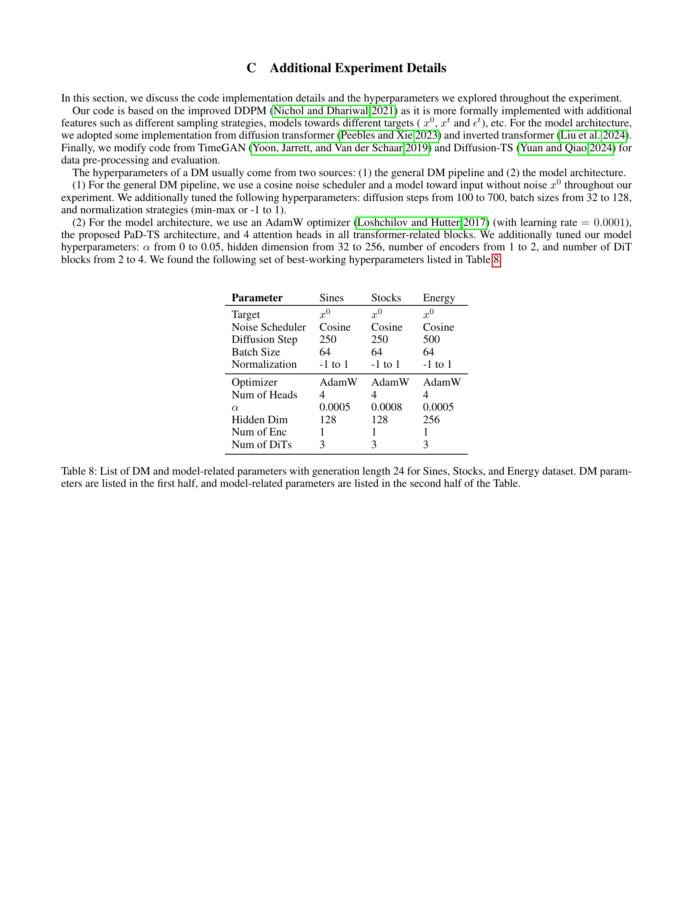
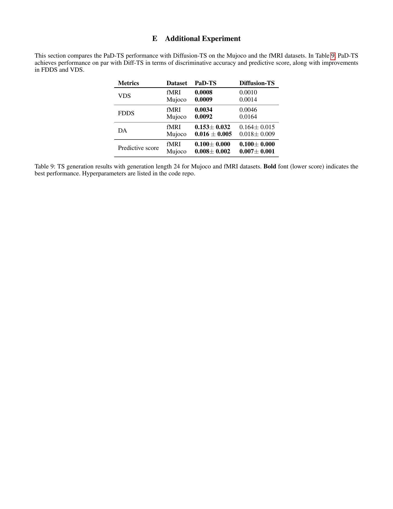

 


 2501.00910 
 Yang Li et el. 
 
 🤗 2025-01-03 
 



↗ arXiv


↗ Hugging Face


↗ Papers with Code


### TL;DR



많은 분야에서 시계열 데이터는 매우 중요하지만, **데이터 부족 문제**로 인해 합성 데이터 생성이 필수적입니다.  기존의 생성 모델들은 개별 데이터의 정확성에는 집중하지만, 전체 데이터셋의 통계적 특징(예: 분포, 상관관계)을 유지하는 데는 어려움이 있었습니다. 이는 **모델의 편향**을 야기하고, 예측 등 **다운스트림 작업의 정확도를 저하**시키는 문제점으로 이어집니다.

본 논문에서는 이러한 문제를 해결하기 위해 **인구 수준의 특징을 보존하는 새로운 시계열 생성 모델인 PaD-TS**를 제시합니다. PaD-TS는 인구 수준 특징 보존을 명시적으로 고려하는 새로운 학습 방법과 데이터 구조를 효과적으로 포착하는 이중 채널 인코더 모델 구조를 사용합니다.  **실험 결과, PaD-TS는 기존 모델들보다 인구 수준 특징 보존 성능이 훨씬 뛰어나다는 것을 보여줍니다.**  이는 시계열 데이터 생성 및 예측 모델의 정확도 향상에 크게 기여할 것으로 기대됩니다.



#### Key Takeaways


 인구 수준의 통계적 특징을 유지하면서 고품질 시계열 데이터를 생성하는 새로운 확산 모델 PaD-TS를 제시했습니다. 



 기존 모델의 한계점인 인구 수준 특징 보존의 미흡 문제를 해결하기 위해 새로운 학습 방법과 이중 채널 인코더 모델 구조를 도입했습니다. 



 다양한 벤치마크 데이터셋 실험 결과, PaD-TS는 기존 최첨단 모델들과 비교하여 인구 수준 특징 보존 성능을 크게 향상시켰습니다.  


#### Why does it matter?
**본 논문은 기존 시계열 생성 모델의 한계를 극복하고, 인구 수준의 특징을 보존하는 새로운 모델을 제시하여 시계열 데이터 생성 분야의 발전에 크게 기여합니다.**  **특히, 의료, 에너지, 금융 등 다양한 분야에서 시계열 데이터의 부족 문제를 해결하고, 더욱 정확하고 신뢰할 수 있는 예측 모델 개발에 활용될 수 있습니다.** 또한, 본 논문에서 제시된 새로운 평가 지표는 향후 시계열 생성 모델의 성능 평가에 중요한 기준이 될 것입니다.  **다양한 응용 분야에서 시계열 데이터의 품질 향상과 예측 정확도 향상에 기여**, 연구자들에게 새로운 연구 방향을 제시하여 관련 분야의 지속적인 발전을 촉진할 것으로 예상됩니다.

------
#### Visual Insights

> 🔼 그림 1은 원본 에너지 데이터셋과 합성 에너지 데이터셋 간의 상관관계(CC) 분포 히스토그램을 보여줍니다. CC 값은 외부 온도와 주방 온도 간에 계산됩니다. PaD-TS(왼쪽 상단)는 이러한 기능적 종속성 분포를 가장 잘 보존합니다. 기존 모델들은 CC 점수가 1 또는 -1에 가까운 데이터 포인트를 생성하는 경향이 있으며, 이는 후속 작업에 편향을 초래할 수 있습니다.  즉, PaD-TS는 원본 데이터의 상관관계 분포를 가장 잘 유지하며, 다른 모델들은 상관관계가 극단적인 값에 치우쳐 실제 데이터와 차이를 보입니다.
> 

> 
read the caption

> Figure 1: Histogram of CC distribution between the original and synthetic Energy datasets. The CC values are calculated between the outside temperature and kitchen temperature. PaD-TS (top left) best preserves such functional dependency distribution. Previous models tend to generate data points with a CC score close to 1 or -1, which leads to biases for downstream tasks.
> 


| Metrics | Dataset | PaD-TS | Diffusion-TS | TimeGAN | TimeVAE |
|---|---|---|---|---|---| 
| VDS | Sines | **0.0005** | 0.0007 | 0.0034 | 0.0177 |
|  | Stocks | **0.0029** | 0.0369 | 0.0257 | 0.0038 |
|  | Energy | **0.0019** | 0.0060 | 0.0427 | 0.0882 |
| FDDS | Sines | **0.0003** | 0.0031 | 0.0167 | 0.0135 |
|  | Stocks | **0.0588** | 0.1841 | 0.1117 | 0.2161 |
|  | Energy | **0.0442** | 0.1837 | 0.2777 | 0.4413 |
| DA | Sines | 0.013 ± 0.004 | **0.005 ± 0.000** | 0.037 ± 0.004 | 0.072 ± 0.061 |
|  | Stocks | **0.055 ± 0.087** | 0.082 ± 0.025 | 0.143 ± 0.073 | 0.133 ± 0.115 |
|  | Energy | **0.078 ± 0.011** | 0.127 ± 0.016 | 0.469 ± 0.017 | 0.498 ± 0.004 |
| Predictive score | Sines | **0.093 ± 0.000** | **0.093 ± 0.000** | 0.095 ± 0.000 | 0.229 ± 0.001 |
|  | Stocks | **0.037 ± 0.000** | **0.037 ± 0.000** | 0.039 ± 0.000 | 0.038 ± 0.000 |
|  | Energy | 0.251 ± 0.011 | **0.250 ± 0.000** | 0.338 ± 0.010 | 0.277 ± 0.001 |

> 🔼 표 1은 Sines, Stocks, Energy 세 가지 데이터셋을 사용하여 생성 길이 24로 시간 시계열을 생성한 결과를 보여줍니다.  각 데이터셋은 물리, 금융, 합성 시간 시계열 데이터로 서로 다른 특징을 가지고 있습니다.  평가 지표는 VDS(Value Distribution Shift), FDDS(Functional Dependency Distribution Shift), DA(Discriminative Accuracy), 그리고 예측 점수를 포함합니다. VDS와 FDDS는 생성된 시계열 데이터의 모집단 수준 특성을 얼마나 잘 유지하는지를 측정하는 반면, DA는 개별 데이터의 진위 여부를 판별하는 성능을 나타냅니다.  예측 점수는 생성된 데이터를 사용하여 시간 시계열 예측 작업의 성능을 평가합니다.  PaD-TS 모델은 대부분의 경우 최첨단 성능을 보이며, 굵은 글씨체로 표시된 낮은 점수가 가장 우수한 성능을 나타냅니다.  사용된 하이퍼파라미터는 부록 C에 자세히 설명되어 있습니다.
> 

> 
read the caption

> Table 1: TS generation results with generation length 24 for Sines, Stocks, and Energy datasets. PaD-TS shows state-of-the-art performance in most cases. Bold font (lower score) indicates the best performance. Hyperparameters in Appendix C.
> 

### In-depth insights

#### Population-Aware Diffusion
본 논문에서 제안하는 "Population-Aware Diffusion" 기법은 기존 확산 모델의 한계를 극복하고자 **전체 데이터셋의 통계적 특성(population-level properties)**을 보존하는 데 초점을 맞춘 접근 방식입니다.  **개별 데이터 포인트의 정확성뿐만 아니라, 데이터 전체의 분포 및 특정 기능적 종속성(functional dependencies)**까지 고려하여 보다 현실적인 시계열 데이터 생성을 목표로 합니다.  이는 단순히 합성 데이터의 개별 샘플 품질을 높이는 것에서 벗어나, **실제 데이터셋의 통계적 특징을 유지**함으로써, 하류 작업(예: 시계열 예측)의 성능 향상 및 모델 편향 감소에도 기여할 수 있음을 의미합니다.  **다양한 시계열 데이터셋에 대한 실험 결과**는 본 기법이 기존 방법보다 **평균 상관관계 분포 이동 점수(CC distribution shift score)를 5.9배 개선**하면서 동시에 개별 데이터 수준의 정확도도 유지함을 보여줍니다.  **새로운 훈련 방법 및 이중 채널 인코더 모델 아키텍처**를 통해  **개선된 성능**을 달성한 것이 핵심입니다.

#### Dual-Channel Encoding
본 논문에서 제안하는 **이중 채널 인코딩(Dual-Channel Encoding)**은 시계열 데이터의 시간적 특징과 다차원적 상관관계를 효과적으로 포착하기 위한 핵심 전략입니다.  기존의 단일 채널 방식과 달리, 시간적 특징을 담당하는 **시간 채널(Temporal Channel)**과 다차원적 상관관계를 담당하는 **다차원 채널(Cross-Dim Channel)**을 분리하여 처리함으로써, 각 채널의 특징을 보다 정확하게 학습하고 표현할 수 있습니다. 이는 **시간적 흐름과 변수 간의 복잡한 상호작용**을 보다 효과적으로 모델링하는 데 기여하며, 특히 다변량 시계열 데이터 생성에서 우수한 성능을 발휘할 수 있게 합니다.  **트랜스포머 인코더**와 **확산 트랜스포머(DiT) 블록**을 각 채널에 적용하여 시계열 구조를 효율적으로 학습하며, **다중 헤드 어텐션 메커니즘**을 통해 변수들 간의 관계를 더욱 정밀하게 파악합니다. 이러한 이중 채널 구조는 시계열 데이터의 복잡한 패턴을 정확하게 반영하고, 생성된 시계열 데이터의 품질을 향상시키는 데 중요한 역할을 합니다.  **모델의 안정성**을 높이고, 생성 과정에서 발생할 수 있는 **분포 이동(distribution shift)** 현상을 완화하는 데 기여하며, 보다 현실적인 시계열 데이터 생성을 가능하게 합니다.  따라서 이중 채널 인코딩은 시계열 데이터 생성 모델의 성능 향상과 응용 분야 확장에 크게 기여할 것으로 기대됩니다.

#### Novel Training Process
본 논문에서 제시된 **새로운 학습 과정**은 기존 확산 모델의 한계를 극복하고 시간 순서 데이터 생성의 성능을 향상시키기 위해 고안되었습니다.  **기존의 확산 모델 학습 방식은 개별 데이터의 정확성에 초점을 맞추는 반면**, 본 논문의 방법은 **전체 데이터셋의 통계적 특성, 즉 집단 수준 특징을 보존**하는 데 중점을 둡니다.  이는 단순히 합성 데이터와 원본 데이터 간의 차이를 최소화하는 것 이상으로, **원본 데이터의 분포 및 상관관계 등의 구조적 특징까지도 유지**하려는 노력을 의미합니다.  **모델이 생성한 합성 데이터가 원본 데이터의 통계적 특성을 충실히 반영**하도록 함으로써, 하류 작업(예: 예측)의 성능 향상과 모델 편향 감소에 기여할 것으로 예상됩니다.  **새로운 학습 과정은  집단 수준의 특징 보존에 대한 새로운 평가 지표를 제시하고**, 이를 통해 모델 성능을 보다 정확하게 측정하고 평가할 수 있습니다.  이러한 **혁신적인 접근법은 시간 순서 데이터 생성 분야에 상당한 영향**을 미칠 것으로 기대됩니다.

#### Ablation Study Results
본 논문의 "Ablation Study Results"는 **모델의 각 구성 요소의 중요성과 초매개변수 α의 영향**을 깊이 있게 분석한 결과를 보여줍니다.  **시간 채널, 차원 채널, PAT 목표 함수, SSS 샘플링 전략 각각의 효과**를 제거한 변형 모델들을 학습시켜 성능 변화를 비교 분석함으로써, 각 구성 요소의 기여도를 정량적으로 평가합니다. 특히, **SSS 전략과 시간 채널이 모델 성능에 가장 큰 영향**을 미치는 것으로 나타나며, PAT 목표 함수와 차원 채널 역시 성능 향상에 기여하지만 그 효과는 상대적으로 적음을 확인할 수 있습니다.  **초매개변수 α의 값 변화에 따른 VDS와 FDDS 점수의 변화**를 통해, α 값의 최적화가 population-level property 보존에 중요함을 시사하며,  **α 값이 지나치게 크면 오히려 모델 성능이 저하**됨을 보여줍니다. 이러한 결과는 PaD-TS 모델의 설계가 타당함을 뒷받침하며, 향후 연구 방향을 제시하는 데 중요한 근거를 제공합니다.

#### Future Research
본 논문은 시간 순서 데이터 생성에 있어 개체 수준의 정확성뿐 아니라 **전체 데이터셋의 모집단 수준 특성 보존**이라는 중요한 측면을 다룹니다.  미래 연구는 **다양한 유형의 시간 순서 데이터** (예: 의료, 금융, 에너지)에 대한 PaD-TS 모델의 일반화 성능을 평가하는 데 초점을 맞춰야 합니다. 또한, **조건부 생성**을 통해 특정 패턴이나 제약 조건을 가진 시간 순서 데이터를 생성하는 기능을 확장하는 연구가 필요합니다.  **모델의 효율성 향상**을 위한 연구도 중요합니다.  현재 모델은 계산 비용이 다소 높을 수 있으므로, 더욱 효율적인 훈련 방법이나 경량화된 아키텍처를 개발하는 연구가 필요합니다.  마지막으로, **다운스트림 작업**에서 PaD-TS가 생성한 합성 데이터의 유용성을 다양한 응용 분야(예: 예측, 분류, 이상 탐지)에 적용하여 실험적으로 검증하는 연구가 필요합니다. 이를 통해 PaD-TS의 실용성과 효과를 더욱 명확하게 입증할 수 있을 것입니다.

### More visual insights

More on figures

> 🔼 그림 2는 본 논문에서 제안하는 시간 시계열 생성 모델인 PaD-TS의 아키텍처를 보여줍니다.  PaD-TS는 시간 채널과 차원 간 채널이라는 두 개의 채널을 사용하는 이중 채널 인코더 모델을 기반으로 합니다. 각 채널은 채널 표현을 인코딩하는 조밀한 계층, 바닐라 변환기 인코더, 몇몇 잔차 연결 DiT 블록, 원래 형태로 되돌리는 조밀한 계층을 통과합니다. 시간 채널은 시간 정보를 포착하고, 차원 간 채널은 차원 간 상호 작용을 포착합니다. 두 채널의 출력은 DiT 블록을 통해 결합되어 최종 출력을 생성합니다.  DiT 블록은 높은 처리량과 조건부 정보 도입 방식이라는 두 가지 장점을 가진 변환기 블록입니다.  PaD-TS는 다양한 유형의 시간 시계열 데이터에 적용될 수 있도록 설계되었습니다.
> 

> 
read the caption

> Figure 2: PaD-TS model architecture
> 

> 🔼 그림 3은 Sines 및 Stocks 데이터셋에 대해 원본 데이터(빨간색 점)와 합성 데이터(파란색 점) 간의 상관 관계 값에 대한 t-SNE 플롯을 보여줍니다. t-SNE는 고차원 데이터를 2차원으로 시각화하는 기법으로, 이 그림을 통해 원본 데이터와 합성 데이터 간의 상관 관계 패턴의 유사성 및 차이를 시각적으로 비교할 수 있습니다.  빨간색 점과 파란색 점이 얼마나 겹쳐져 있는지를 통해 합성 데이터가 원본 데이터의 상관 관계를 얼마나 잘 보존하고 있는지를 판단할 수 있습니다. 점들이 겹쳐져 있을수록 합성 데이터가 원본 데이터의 특징을 잘 반영하고 있다는 것을 의미합니다.
> 

> 
read the caption

> Figure 3: t-SNE plots on the cross-correlation values between original data (red dots) and synthetic data (blue dots) on the Sines and Stocks dataset.
> 

> 🔼 그림 4는 에너지 데이터셋에 대해 원본 데이터(빨간 점)와 합성 데이터(파란 점) 간의 상관관계 값에 대한 t-SNE 플롯을 보여줍니다.  t-SNE는 고차원 데이터를 2차원 또는 3차원으로 시각화하는 기법으로, 이 그림에서는 원본 데이터와 합성 데이터의 상관관계 패턴이 얼마나 유사한지를 시각적으로 보여줍니다.  빨간 점과 파란 점이 서로 얼마나 가깝게 뭉쳐있는지를 통해 합성 데이터가 원본 데이터의 상관관계 구조를 얼마나 잘 유지하고 있는지 판단할 수 있습니다.  점들이 잘 섞여있을수록 합성 데이터의 품질이 높다는 것을 의미합니다.
> 

> 
read the caption

> Figure 4: t-SNE plots on the cross-correlation values between original data (red dots) and synthetic data (blue dots) on the Energy dataset.
> 

> 🔼 그림 5는 Energy 데이터셋에서 하이퍼파라미터 α(알파)에 대한 ablation study 결과를 보여줍니다. 파란색 곡선은 FDDS(Functional Dependency Distribution Shift) 점수를, 빨간색 곡선은 VDS(Value Distribution Shift) 점수를 나타냅니다. α 값이 증가함에 따라 VDS 점수는 감소하고 FDDS 점수는 증가하는 경향을 보입니다. 이는 α 값이 적절하게 조정될 때 population-level property 보존에 긍정적인 영향을 미침을 시사합니다.  그러나 α 값이 너무 크면(0.05) 학습이 불안정해집니다.
> 

> 
read the caption

> Figure 5: Ablation study on α𝛼\alphaitalic_α and Energy dataset. The blue and red curves resp. depict the FDDS and VDS scores.
> 

> 🔼 그림 6은 본 논문의 4장 '방법론' 섹션에 있는 DiT(Diffusion Transformer) 블록의 구조를 보여줍니다. DiT 블록은 기존 트랜스포머 인코더와 유사하지만, 조건부 정보를 점진적으로 도입하는 adaLN-Zero 디자인을 사용하여 조건부 생성에 더욱 효과적입니다. 그림은 피드포워드 네트워크, 레이어 정규화, 멀티헤드 어텐션 등의 구성 요소와 함께 조건부 주입 레이어를 보여줍니다. 각 레이어는 조건부 은닉 특징의 일부를 통합합니다. DiT 블록은 기존의 트랜스포머 인코더 기반 모델과 달리 조건부 정보를 바탕으로 샘플을 생성할 수 있습니다.
> 

> 
read the caption

> Figure 6: DiT block architecture.
> 

> 🔼 이 그림은 에너지 데이터셋에 대해 원본 데이터와 합성 데이터의 각 차원에 대한 평균값을 t-SNE 기법을 사용하여 2차원 평면에 시각화한 것입니다. 빨간색 점은 원본 데이터를, 파란색 점은 합성 데이터를 나타냅니다. t-SNE는 고차원 데이터를 저차원으로 매핑하여 데이터의 분포를 시각적으로 보여주는 차원 축소 기법입니다. 이 그림을 통해 PaD-TS 모델이 원본 데이터의 값 분포를 얼마나 잘 유지하는지, 즉 데이터의 특징을 얼마나 잘 보존하는지를 시각적으로 확인할 수 있습니다.  두 데이터 분포가 서로 얼마나 가까이 위치하는지를 통해 PaD-TS 모델의 성능을 평가할 수 있습니다.
> 

> 
read the caption

> Figure 7: t-SNE plots on the average values for each dimension between original data (red dots) and synthetic data (blue dots) on the Energy dataset.
> 

> 🔼 그림 8은 에너지 데이터셋에서 각 차원의 평균값에 대한 원본 데이터(빨간색 선)와 합성 데이터(파란색 선) 간의 값 분포를 보여주는 플롯입니다. 이 플롯은 PaD-TS 모델이 원본 데이터의 값 분포를 얼마나 잘 보존하는지 시각적으로 보여줍니다. 각 차원에 대한 값의 분포를 비교함으로써, PaD-TS 모델이 원본 데이터의 통계적 특성을 얼마나 잘 유지하는지 평가할 수 있습니다. 빨간색 선과 파란색 선이 거의 일치할수록 PaD-TS 모델이 원본 데이터의 값 분포를 더 잘 보존한다는 것을 의미합니다.
> 

> 
read the caption

> Figure 8: Value distribution plots on the average values for each dimension between original data (red line) and synthetic data (blue line) on the Energy dataset.
> 

More on tables


| Metrics | Length | Pad-TS | Diffusion-TS | TimeGAN | TimeVAE |
|---|---|---|---|---|---| 
| VDS Score | 64 | **0.0009** | 0.0043 | 0.1688 | 0.0658 |
|  | 128 | **0.0005** | 0.0046 | 0.1565 | 0.0544 |
|  | 256 | **0.0008** | 0.0044 | 0.2725 | 0.0416 |
| FDDS score | 64 | **0.0087** | 0.0476 | 0.8540 | 0.2656 |
|  | 128 | **0.0009** | 0.0112 | 0.9767 | 0.1120 |
|  | 256 | **0.0010** | 0.0038 | 3.0019 | 0.0424 |
| DA | 64 | **0.023 ± 0.009** | 0.094 ± 0.009 | 0.437 ± 0.062 | 0.499 ± 0.000 |
|  | 128 | **0.050 ± 0.080** | 0.165 ± 0.067 | 0.399 ± 0.268 | 0.499 ± 0.000 |
|  | 256 | **0.138 ± 0.174** | 0.393 ± 0.009 | 0.499 ± 0.000 | 0.492 ± 0.001 |
| Predictive Score | 64 | **0.248 ± 0.000** | 0.249 ± 0.000 | 0.301 ± 0.007 | 0.290 ± 0.001 |
|  | 128 | **0.247 ± 0.003** | 0.248 ± 0.001 | 0.316 ± 0.008 | 0.290 ± 0.000 |
|  | 256 | **0.244 ± 0.001** | 0.250 ± 0.002 | 0.285 ± 0.006 | 0.266 ± 0.001 |
> 🔼 표 2는 에너지 데이터셋을 사용하여 생성된 긴 시계열 데이터에 대한 결과를 보여줍니다.  표에는 VDS 점수, FDDS 점수, DA 점수 및 예측 점수와 같은 다양한 지표를 사용하여 모델의 성능을 평가합니다. 각 지표의 낮은 값은 더 나은 성능을 나타냅니다. 볼드체로 표시된 숫자는 각 지표에서 가장 좋은 성능을 보이는 모델을 나타냅니다. 시계열 길이가 64, 128, 256인 세 가지 길이에 대한 결과를 보여주어 모델 성능의 시계열 길이에 대한 영향을 평가합니다.
> 

> 
read the caption

> Table 2: Long TS Generation Results on Energy dataset. Bold font (lower score) indicates the best performance.
> 


| Metrics | PaD-TS | Diffusion-TS |
|---|---|---|
| MDD | 0.609 | **0.573** |
| ACD | **0.061** | 0.200 |
| SD | 0.027 | **0.025** |
| KD | **0.032** | 0.049 |
| ED | **0.645** | 0.658 |
| DTW | **1.674** | 1.718 |
> 🔼 표 3은 Sines 데이터셋에서 Diffusion-TS와 PaD-TS의 특징 및 거리 기반 측정 지표를 비교한 결과를 보여줍니다.  각 모델의 다양한 측정 지표(MDD, ACD, SD, KD, ED, DTW) 값을 제시하여 두 모델의 성능 차이를 정량적으로 비교합니다. 낮은 점수가 더 나은 성능을 나타내므로, 굵은 글씨체로 표시된 값은 해당 지표에서 가장 우수한 성능을 보인 모델임을 의미합니다. 이를 통해 각 모델의 데이터 생성 품질을 다각적으로 평가하고, PaD-TS가 특정 지표에서 Diffusion-TS보다 우수한 성능을 보이는지 확인할 수 있습니다.
> 

> 
read the caption

> Table 3: Feature and distance-based measures comparison between Diffusion-TS and PaD-Ts on Sines dataset. Bold font (lower score) indicates the best performance.
> 


| Metrics | PaD-TS | Diffusion-TS |
|---|---|---|
| MDD | **0.379** | 0.440 |
| ACD | 0.111 | **0.028** |
| SD | **0.375** | 0.471 |
| KD | 4.290 | **2.207** |
| ED | 1.135 | **1.093** |
| DTW | 2.937 | **2.829** |
> 🔼 표 4는 주식 데이터셋에서 Diffusion-TS와 PaD-TS의 특징과 거리 기반 측정값을 비교한 것입니다.  각 모델의 Marginal Distribution Difference(MDD), AutoCorrelation Difference(ACD), Skewness Difference(SD), Kurtosis Difference(KD), Euclidean Distance(ED), Dynamic Time Warping(DTW) 값을 보여줍니다. 낮은 점수가 더 좋은 성능을 나타내며, 볼드체로 표시된 값은 각 측정값에서 가장 좋은 성능을 보이는 모델을 나타냅니다. 이 표는 두 모델의 시간 시계열 데이터 생성 성능을 다양한 측면에서 정량적으로 비교하여 PaD-TS의 우수성을 보여줍니다.
> 

> 
read the caption

> Table 4: Feature and distance-based measures comparison between Diffusion-TS and PaD-Ts on Stocks dataset. Bold font (lower score) indicates the best performance.
> 


| Metrics | PaD-TS | Diffusion-TS |
|---|---|---|
| MDD | 0.221 | **0.200** |
| ACD | **0.055** | 0.141 |
| SD | **0.124** | 0.174 |
| KD | **1.037** | 1.387 |
| ED | **1.030** | 1.032 |
| DTW | **6.395** | 6.439 |
> 🔼 표 5는 에너지 데이터셋에 대해 Diffusion-TS와 PaD-TS의 특징 및 거리 기반 측정값을 비교한 표입니다.  각 모델의 Marginal Distribution Difference (MDD), AutoCorrelation Difference (ACD), Skewness Difference (SD), Kurtosis Difference (KD), Euclidean Distance (ED), Dynamic Time Warping (DTW) 값을 보여줍니다. 낮은 점수일수록 성능이 우수함을 나타내며,  PaD-TS가 대부분의 측정값에서 Diffusion-TS보다 더 나은 성능을 보임을 알 수 있습니다.  즉, PaD-TS가 에너지 데이터셋의 특징을 더 잘 보존한다는 것을 의미합니다.
> 

> 
read the caption

> Table 5: Feature and distance-based measures comparison between Diffusion-TS and PaD-Ts on Energy dataset. Bold font (lower score) indicates the best performance.
> 


| Dataset | PaD-TS | Diffusion-TS |
|---|---|---|
| Sines | 77min | 17min |
| Stocks | 75min | 15min |
| Energy | 117min | 60min |
> 🔼 표 6은 PaD-TS와 Diffusion-TS 모델의 학습 시간을 비교한 표입니다.  각 모델이 Sines, Stocks, Energy 세 가지 데이터셋에 대해 학습하는 데 걸린 시간(분)을 보여줍니다.  PaD-TS는 Diffusion-TS보다 학습 시간이 더 오래 걸리는 것을 확인할 수 있습니다. 이는 PaD-TS가 모집단 수준의 특징 보존을 위해 추가적인 계산을 수행하기 때문입니다.
> 

> 
read the caption

> Table 6: Training time comparison between PaD-TS and Diffusion-TS.
> 


| Metrics | Model | Sines | Stocks | Energy |
|---|---|---|---|---|
| FDDS | PaD-TS | **0.0003** | **0.0588** | **0.0442** |
|  | w/o Temporal | 0.0005 | 1.8838 | 0.5254 |
|  | w/o Dimension | 0.0087 | 0.0868 | 0.0533 |
|  | w/o PAT | 0.0007 | 0.2459 | 0.0816 |
|  | w/o SSS | 0.0286 | 0.0965 | 0.3626 |
> 🔼 표 7은 PaD-TS 모델의 구성 요소들의 효과에 대한 추가 분석 결과를 보여줍니다.  각 구성 요소(시간 채널, 차원 채널, PAT 목적 함수, SSS 샘플링)들을 제거한 모델들을 비교 분석하여 각 구성 요소의 성능 기여도를 평가합니다.  굵은 글씨는 각 지표에서 가장 좋은 성능을 나타내는 모델을 강조합니다.  이 표를 통해 시간 채널과 SSS 샘플링이 가장 중요한 요소임을 알 수 있으며,  PAT 목적 함수와 차원 채널 또한 성능 향상에 기여하지만 그 효과는 상대적으로 적습니다.  모든 구성 요소가 결합된 PaD-TS 모델이 가장 좋은 성능을 보여줍니다.
> 

> 
read the caption

> Table 7: Ablation study for the effectiveness of PaD-TS components. Bold font indicates the best performance.
> 


| Parameter | Sines | Stocks | Energy |
|---|---|---|---|
| Target | $x^{0}$ | $x^{0}$ | $x^{0}$ |
| Noise Scheduler | Cosine | Cosine | Cosine |
| Diffusion Step | 250 | 250 | 500 |
| Batch Size | 64 | 64 | 64 |
| Normalization | -1 to 1 | -1 to 1 | -1 to 1 |
| Optimizer | AdamW | AdamW | AdamW |
| Num of Heads | 4 | 4 | 4 |
| $\alpha$ | 0.0005 | 0.0008 | 0.0005 |
| Hidden Dim | 128 | 128 | 256 |
| Num of Enc | 1 | 1 | 1 |
| Num of DiTs | 3 | 3 | 3 |
> 🔼 표 8은 Sine, Stocks 및 Energy 데이터셋에 대해 생성 길이가 24일 때 사용된 확산 모델(DM) 및 모델 관련 매개변수 목록을 보여줍니다. 표의 상반부는 DM 매개변수를, 하반부는 모델 관련 매개변수를 보여줍니다. DM 매개변수에는 노이즈 스케줄러, 확산 단계, 배치 크기, 정규화, 최적화기 등이 포함됩니다. 모델 관련 매개변수에는 헤드 수, 알파, 은닉 차원, 인코더 수, DiT 블록 수 등이 포함됩니다. 이 표는 논문의 실험 설정에 대한 자세한 내용을 제공하여 재현성을 높입니다.
> 

> 
read the caption

> Table 8: List of DM and model-related parameters with generation length 24 for Sines, Stocks, and Energy dataset. DM parameters are listed in the first half, and model-related parameters are listed in the second half of the Table.
> 


| Metrics | Dataset | PaD-TS | Diffusion-TS |
|---|---|---|---| 
| VDS | fMRI | **0.0008** | 0.0010 |
|  | Mujoco | **0.0009** | 0.0014 |
| FDDS | fMRI | **0.0034** | 0.0046 |
|  | Mujoco | **0.0092** | 0.0164 |
| DA | fMRI | **0.153 ± 0.032** | 0.164 ± 0.015 |
|  | Mujoco | **0.016 ± 0.005** | 0.018 ± 0.009 |
| Predictive score | fMRI | **0.100 ± 0.000** | **0.100 ± 0.000** |
|  | Mujoco | **0.008 ± 0.002** | **0.007 ± 0.001** |
> 🔼 표 9는 Mujoco와 fMRI 데이터셋에 대해 생성 길이가 24일 때의 시계열 생성 결과를 보여줍니다.  PaD-TS와 Diffusion-TS 모델의 VDS(Value Distribution Shift), FDDS(Functional Dependency Distribution Shift), DA(Discriminative Accuracy), 예측 점수를 비교 분석한 결과입니다. 낮은 점수일수록 성능이 우수함을 나타내며,  굵은 글꼴은 각 지표에서 가장 좋은 성능을 보인 값을 강조합니다.  모델의 하이퍼파라미터는 코드 저장소에 명시되어 있습니다.
> 

> 
read the caption

> Table 9: TS generation results with generation length 24 for Mujoco and fMRI datasets. Bold font (lower score) indicates the best performance. Hyperparameters are listed in the code repo.
> 

### Full paper



