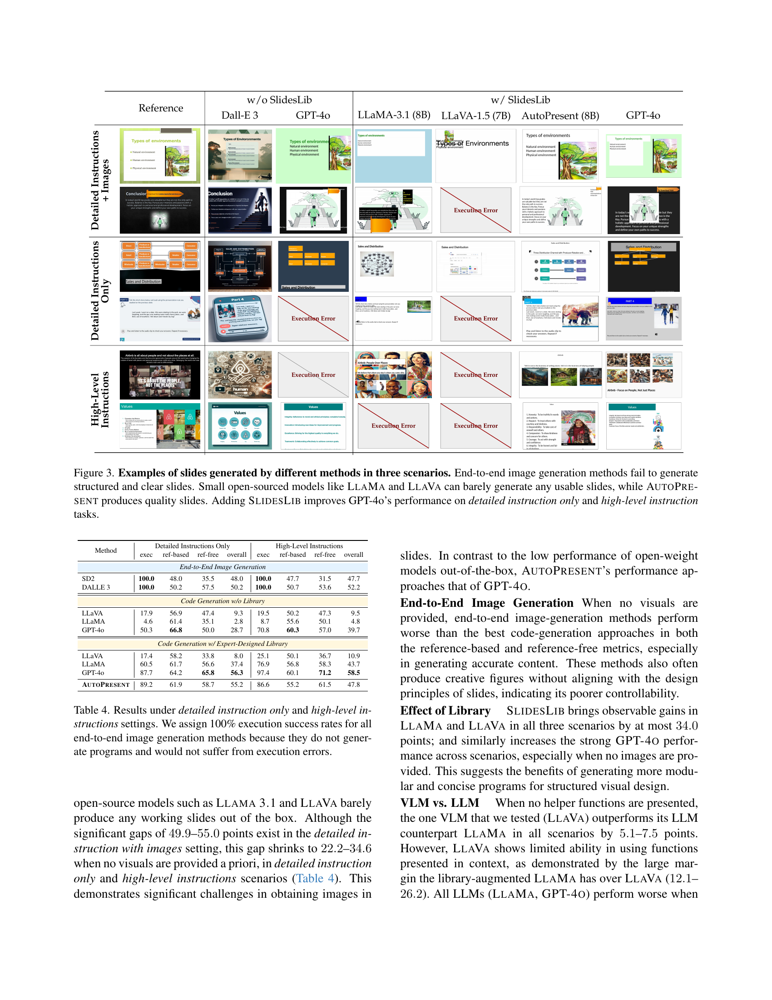

 


 2501.00912 
 Jiaxin Ge et el. 
 
 🤗 2025-01-07 
 



↗ arXiv


↗ Hugging Face


↗ Papers with Code


### TL;DR



프레젠테이션 슬라이드 제작은 많은 시간과 노력을 필요로 하는 어려운 작업입니다. 기존의 자동 슬라이드 생성 모델들은 슬라이드의 구조나 디자인 측면에서 부족한 점이 많았습니다. 본 논문에서는 **자연어 처리 기술을 이용하여 사용자의 요구사항을 파악하고, 이를 바탕으로 프로그래밍 방식으로 슬라이드를 생성하는 새로운 시스템인 AUTOPRESENT**를 제시합니다.

AUTOPRESENT는 **SLIDESBENCH라는 새로운 벤치마크 데이터셋**을 사용하여 학습되었으며, 기존 모델들보다 **훨씬 높은 품질의 슬라이드를 생성**하는 것으로 나타났습니다. 특히 **반복적인 디자인 개선**을 통해 슬라이드의 품질을 더욱 향상시킬 수 있다는 점을 보여주었습니다. 이는 프레젠테이션 디자인 자동화에 대한 새로운 가능성을 제시하며, **향후 프레젠테이션 디자인 도구 개발 및 관련 연구에 중요한 기여**를 할 것으로 기대됩니다.



#### Key Takeaways


 자연어 명령어를 통해 슬라이드를 처음부터 끝까지 자동 생성하는 AUTOPRESENT 모델 제시 



 SLIDESBENCH 벤치마크를 통해 다양한 모델 성능 비교 ë° 프로그래밍 방식의 우수성 입증 



 반복적인 디자인 개선을 통해 슬라이드 품질 향상 가능성 제시 


#### Why does it matter?
본 논문은 **자연어 명령어를 사용하여 프레젠테이션 슬라이드를 생성하는 새로운 방법론**을 제시함으로써, 인간의 디자인 능력을 효과적으로 모방하여 슬라이드 제작 과정을 자동화하는 데 크게 기여합니다.  이는 연구자들이 **프레젠테이션 디자인을 위한 새로운 자동화 도구 및 기법을 개발**하는 데 중요한 의미를 지니며, **프레젠테이션 디자인 분야의 연구 발전**에 크게 기여할 수 있습니다. 또한, **프로그래밍 방식의 슬라이드 생성**이 종단 간 이미지 생성보다 효율적이고 고품질 슬라이드를 생성한다는 것을 보여주어, 관련 연구 분야에 중요한 시사점을 제공합니다.

------
#### Visual Insights

> 🔼 그림 1은 자연어 명령어로 슬라이드를 자동 생성하는 과정을 보여줍니다. 본 논문에서는 AutoPresent라는 도구 기반 코드 생성 방식을 제안합니다. 이 방식은 자연어 명령어를 따라 슬라이드를 처음부터 디자인하며, 예시에서 보듯이 텍스트 콘텐츠, 이미지, 시각적 레이아웃, 색상 등 모든 요소를 정확하게 제어할 수 있습니다.
> 

> 
read the caption

> Figure 1: Automatically generating slides from natural language instructions. We propose AutoPresent, a tool-augmented code generation method that follows natural language instructions to design slides from scratch, as shown in the examples. This allows for precise control over all elements, including textual content, images, visual layouts, coloring, and more.
> 


| Metric | Criteria |
|---|---| 
| Text | The title should be simple and clear to indicate the main point. For main content, avoid too many texts and keep words concise. Use a consistent and readable font size, style, and color. |
| Image | Use high-quality images with a reasonable proportion. |
| Layout | Elements should be aligned, do not overlap, and have sufficient margins to each other. All elements should not exceed the page. |
| Color | Use high-contrast color especially between the text and the background. Avoid using high-glaring colors. |

> 🔼 이 표는 모델이 생성한 슬라이드의 디자인 품질을 평가하기 위한 참조 없는 지표들을 보여줍니다. 각 지표는 텍스트, 이미지, 레이아웃, 색상의 네 가지 측면을 평가하며, 각 측면에 대한 설명과 함께 0에서 5까지의 점수로 평가됩니다.  0점은 품질이 매우 낮음을, 5점은 품질이 매우 높음을 의미합니다. 이 표는 모델이 생성한 슬라이드의 시각적 디자인 요소가 얼마나 잘 설계되었는지 평가하는 데 사용됩니다.
> 

> 
read the caption

> Table 1: Reference-free metrics, all evaluated in 0-5 scale.
> 

### In-depth insights

#### SlideGen: A New Benchmark
SlideGen 벤치마크 제안은 **자동 슬라이드 생성 분야의 발전을 가속화**할 중요한 시도입니다. 기존 벤치마크의 한계를 극복하고 **다양한 측면(텍스트, 이미지, 레이아웃 등)을 포괄적으로 평가**하여 모델 성능을 더욱 정확하게 측정할 수 있습니다.  **실제 슬라이드 디자인 원칙을 반영한 평가 지표**는 생성된 슬라이드의 질적 수준을 평가하는 데 유용하며, **다양한 유형의 입력(세부 지침, 개략적 지침)**에 대한 모델의 적응력을 평가하여 실제 활용 가능성을 높입니다.  하지만, **데이터셋의 크기 및 다양성**, 특정 도메인에 대한 편향 등 개선 여지가 있으며, **인간 전문가의 평가를 통한 주관적 평가 지표** 추가를 고려하여 벤치마크의 신뢰도를 높이는 방안을 모색할 필요가 있습니다.  궁극적으로 SlideGen은 **자동 슬라이드 생성 기술의 객관적이고 포괄적인 평가**를 가능하게 하여, 더욱 효과적이고 실용적인 슬라이드 생성 모델 개발에 기여할 것입니다.

#### Programmatic Slide Design
프로그래매틱 슬라이드 디자인은 **자동화된 슬라이드 생성 과정**을 의미합니다.  자연어 처리 및 컴퓨터 비전 기술을 활용하여, 사용자의 자연어 명령어를 코드로 변환하고, 이 코드를 실행하여 슬라이드를 자동으로 생성하는 방식입니다.  이를 통해 **인간의 디자인 노력을 최소화하고, 효율성을 극대화**할 수 있습니다.  **정교한 디자인 요소 제어**가 가능하며, **다양한 스타일 및 레이아웃**을 손쉽게 구현할 수 있다는 장점이 있습니다. 하지만, **복잡한 디자인의 경우 정확도 및 완성도**가 떨어질 수 있으며, **예상치 못한 오류 발생 가능성**도 존재합니다.  **모델 학습 데이터의 질**이 결과물의 품질에 큰 영향을 미치므로, 고품질 데이터셋 확보가 중요합니다.  **사용자의 의도를 정확히 반영**하고, **시각적으로 매력적이고 효과적인 슬라이드**를 생성하기 위한 추가적인 연구가 필요합니다.  특히, **사용자 인터페이스 디자인 및 상호작용**에 대한 고려가 중요하며, **다양한 도메인 및 스타일**에 대한 적응력 향상이 미래 연구의 과제입니다.

#### AUTOPRESENT Model
본 논문에서 제시된 AUTOPRESENT 모델은 **자연어 명령어를 통해 파워포인트 슬라이드를 생성하는 시스템**입니다. 기존의 단순한 이미지 생성 모델과 달리, **프로그래밍 방식을 통해 슬라이드의 구조와 내용을 정밀하게 제어**할 수 있다는 장점이 있습니다.  이는 **LLAMA 기반의 8B 매개변수 모델을 SLIDESBENCH 데이터셋으로 미세 조정**하여 달성되었으며, **GPT-4와 비슷한 성능**을 보여줍니다.  특히 **SLIDESLIB이라는 도구를 활용하여 코드 생성 과정을 간소화**하고, **반복적인 디자인 개선 과정을 통해 슬라이드 품질을 향상**시키는 기능 또한 포함되어 있습니다.  **오픈소스로 공개**되어 접근성이 높고, **다양한 모델과의 호환성**을 고려한 설계로 확장성도 뛰어나다는 점이 핵심입니다.  **기존의 이미지 생성 모델이나 작은 규모의 언어 모델과 비교하여 슬라이드 생성 품질과 구조적 정확성이 월등히 높으며**, 앞으로 구조화된 시각 자료 생성 연구에 중요한 기여를 할 것으로 예상됩니다.

#### Iterative Refinement
본 논문에서 제시된 '반복적 개선(Iterative Refinement)' 과정은 **자동 슬라이드 생성 모델의 한계를 극복**하기 위한 중요한 전략입니다. 단순히 초기 생성물을 출력하는 대신, 모델이 스스로 생성한 슬라이드를 평가하고 개선하는 **반복적인 루프**를 통해 **슬라이드 품질 향상**을 도모합니다. 이는 인간 디자이너의 디자인 과정을 모방한 것으로, 초기 디자인 초안을 바탕으로 반복적인 수정과 보완을 통해 최종 결과물을 완성하는 방식과 유사합니다.  **GPT-4와 같은 강력한 모델**을 활용하여 슬라이드의 이미지, 텍스트, 레이아웃 등을 세밀하게 다듬고, 사용자의 의도를 더욱 정확하게 반영하도록 합니다.  **자동화된 반복 개선 과정**은 모델의 성능 향상에 기여할 뿐만 아니라, 사용자의 수정 작업을 최소화하여 효율성을 높일 수 있습니다.  그러나 이러한 과정은 **계산 비용 증가** 및 **모델의 복잡성 증대**라는 단점도 가지고 있습니다. 따라서,  향후 연구는 반복적 개선 과정의 효율성을 높이면서, **계산 비용을 최소화**하는 방안을 모색해야 합니다.

#### Future Work
본 논문의 "향후 연구" 부분은 **자동 슬라이드 생성 모델의 성능 향상 및 확장 가능성**에 초점을 맞춰야 할 것입니다.  구체적으로는, **더욱 다양하고 복잡한 슬라이드 디자인**을 생성할 수 있는 모델 아키텍처 개선이 필요하며, **다국어 지원 및 다양한 콘텐츠 유형** (텍스트, 이미지, 비디오 등)의 통합을 위한 연구가 중요합니다. 또한, **사용자 피드백을 활용한 반복적 디자인 개선** 기능을 도입하여 사용자 맞춤형 슬라이드 생성을 가능하게 하는 방향으로 연구를 확장해야 합니다.  **더 큰 규모의 데이터셋** 구축 및 **다양한 평가 지표** 개발을 통해 모델의 일반화 성능 및 실용성을 높이는 것도 중요한 과제입니다.  **프로그래밍 방식의 슬라이드 생성** 방법은 효율적이지만, 사용자 친화적인 인터페이스 개발을 통해 접근성을 높이는 연구도 필요합니다.  궁극적으로는, **자동 슬라이드 생성 기술을 다양한 분야**에 적용하여 효율적이고 효과적인 시각적 정보 전달을 지원하는 연구가 진행되어야 할 것입니다.

### More visual insights

More on figures

> 🔼  그림 2는 SLIDESBENCH 데이터셋의 구성을 보여줍니다.  SLIDESBENCH의 각 예제는 이미지가 포함된 상세한 지침, 이미지가 없는 상세한 지침, 그리고 상위 수준의 지침 세 가지 유형의 지침으로 구성됩니다. 모델은 주어진 지침에 따라 슬라이드를 생성해야 하며, 생성된 슬라이드는 참조 기반 지표와 참조 비기반 지표 모두를 포함하는 평가 지표 모음을 사용하여 평가됩니다. 참조 기반 지표는 생성된 슬라이드와 참조 슬라이드 간의 유사성을 측정하는 반면, 참조 비기반 지표는 생성된 슬라이드 자체의 디자인 품질을 평가합니다. 이러한 다양한 지침 유형과 평가 지표를 통해 모델의 슬라이드 생성 능력을 다각적으로 평가할 수 있습니다.
> 

> 
read the caption

> Figure 2: Illustration of SlidesBench. Each example of SlidesBench consists of three instructions: Detailed Instructions with Images, Detailed Instructions Only, and High-Level Instructions. The model is tasked to generate a slide based on the instruction, and the generated slide is evaluated on the metrics suite, which contains both the reference-free metrics and the reference-based metrics.
> 

> 🔼 이 그림은 논문에서 제시된 세 가지 시나리오(이미지가 포함된 자세한 설명, 이미지가 없는 자세한 설명, 고차원적인 설명)에서 다양한 방법으로 생성된 슬라이드의 예시를 보여줍니다. End-to-end 이미지 생성 방법은 구조적이고 명확한 슬라이드를 생성하지 못하는 반면, LlaMA와 LlaVA와 같은 소규모 오픈소스 모델은 사용 가능한 슬라이드를 거의 생성하지 못합니다. 반면 AutoPresent는 고품질 슬라이드를 생성하며, SlidesLib을 추가하면 GPT-4o의 자세한 설명이 없는 작업과 고차원적인 설명 작업의 성능이 향상됩니다.
> 

> 
read the caption

> Figure 3: Examples of slides generated by different methods in three scenarios. End-to-end image generation methods fail to generate structured and clear slides. Small open-sourced models like LlaMa and LlaVa can barely generate any usable slides, while AutoPresent produces quality slides. Adding SlidesLib improves GPT-4o’s performance on detailed instruction only and high-level instruction tasks.
> 

> 🔼 그림 4는 자세한 설명(이미지 포함) 및 자세한 설명(이미지 없음) 설정에서 사용자의 슬라이드 품질 평가 결과를 보여줍니다. 사용자는 각 슬라이드의 품질을 1~5점으로 평가했으며, 평균 점수가 모델별로 보고됩니다. 결과적으로 GPT-4o와 AutoPresent는 LLaMa에 비해 선호도가 높았지만, 여전히 사람이 직접 디자인한 슬라이드와는 차이가 있음을 보여줍니다.
> 

> 
read the caption

> Figure 4: Perceptual evaluation results on detailed instruction (1) with images and (2) only settings. We ask the users to score the quality of each slide from 1-5 and report the average score of each model. The user reported preference on GPT-4o and AutoPresent compared with LlaMa, while still having a gap with human-designed slides.
> 

> 🔼 그림 5는 GPT-4o를 사용한 자동 개선 결과를 보여줍니다.  초록색으로 표시된 부분은 모델이 이전에 간과했던 지침(예: 도형, 배경색, 텍스트)을 추가적으로 다룬 것을 나타냅니다.  즉,  처음 생성된 슬라이드에 대한 지침을 모델이 스스로 더욱 세련되게 수정 및 보완하는 과정을 보여주는 예시입니다.  자동 개선 전후의 슬라이드 비교를 통해 모델의 개선 능력과  세부적인 지침까지 고려하는 능력을 확인할 수 있습니다.
> 

> 
read the caption

> Figure 5: Auto-refinement results with GPT-4o, where the model further addresses some previously neglected instructions (marked in green), such as shape, background color, and text.
> 

More on tables


| Function | Description |
|---|---| 
| `add_title` | Insert a title in the slide. |
| `add_text` | Insert text at a specific location. |
| `add_bullet_points` | Insert a textbox with bullet points. |
| `add_image` | Insert image at a specific location. |
| `generate_image` | Call an image generator (Dall-E 3) given a query. |
| `search_image` | Search for an image on a search engine (Bing). |
| `search_screenshot` | Display a query on a web browser (Google Chrome) and take a snapshot of the search result. |
> 🔼 SlidesLib에서 제공하는 기본 기능(위쪽)과 이미지 관련 기능(아래쪽)을 보여주는 표입니다.  각 기능의 이름, 함수명, 그리고 간략한 설명이 포함되어 있습니다.  이 표는 사용자가 자연어 명령어를 통해 슬라이드를 생성하는 과정에서 SlidesLib 라이브러리를 사용하여 코드 생성을 단순화하는 방법을 보여줍니다.  add_title()과 같은 기본 기능은 제목 추가와 같은 기본적인 슬라이드 편집 작업을 수행하고, generate_image()와 같은 이미지 관련 기능은 이미지 생성 모델을 호출하거나 검색 엔진을 사용하여 이미지를 검색하는 등 이미지 관련 작업을 수행합니다.
> 

> 
read the caption

> Table 2: Basic (top) and image-specific (bottom) functions provided by SlidesLib.
> 


| Method | Execution% | Reference-Based element | Reference-Based content | Reference-Based color | Reference-Based position | Reference-Free text | Reference-Free image | Reference-Free layout | Reference-Free color | Overall |
|---|---|---|---|---|---|---|---|---|---|---|
| Reference | 100.0 | – | – | – | – | 59.7 | 81.5 | 73.5 | 65.7 | – |
| *End-to-end Image Generation* |  |  |  |  |  |  |  |  |  |  |
| Stable-Diffusion* | 100.0 | 74.5 | 33.4 | 9.0 | 75.0 | 19.6 | 45.1 | 36.9 | 40.5 | 48.0 |
| DALLE 3* | 100.0 | 75.5 | 39.9 | 9.2 | 76.1 | 32.7 | 87.3 | 56.7 | 53.4 | 50.2 |
| *Code Generation w/o SlidesLib* |  |  |  |  |  |  |  |  |  |  |
| LLaVA (7B) | 11.3 | 61.9 | 97.3 | 6.2 | 70.8 | 41.6 | 100.0 | 29.2 | 25.7 | 6.1 |
| LLaMA (8B) | 2.1 | 74.0 | 94.6 | 12.5 | 81.2 | 50.0 | 8.3 | 50.0 | 50.0 | 1.3 |
| GPT-4o | 89.2 | 83.3 | 91.6 | 10.5 | 77.0 | 51.9 | 72.8 | 53.7 | 54.7 | 55.1 |
| **AutoPresent** (ours) | 79.0 | 67.7 | 79.7 | 10.9 | 75.9 | 45.3 | 62.7 | 54.2 | 60.9 | 45.2 |
| *Code Generation w/ SlidesLib* |  |  |  |  |  |  |  |  |  |  |
| LLaVA (7B) | 20.0 | 80.5 | 80.5 | 3.5 | 64.0 | 37.5 | 48.0 | 29.5 | 43.5 | 9.7 |
| LLaMA (8B) | 54.4 | 78.3 | 91.2 | 7.5 | 69.5 | 46.0 | 68.2 | 47.6 | 53.1 | 33.5 |
| GPT-4o | 86.7 | 86.2 | 92.5 | 12.7 | 76.3 | 54.6 | 83.7 | 70.5 | 59.4 | 58.0 |
| **AutoPresent** (ours) | 84.1 | 84.2 | 92.2 | 18.1 | 67.2 | 47.8 | 73.2 | 58.6 | 64.7 | 55.0 |
> 🔼 표 3은 이미지가 포함된 자세한 지침을 사용한 결과를 보여줍니다.  LlaVA(7B)와 LlaMA(8B)와 같이 작은 모델은 슬라이드를 거의 생성하지 못했지만, AutoPresent(8B)는 GPT-40와 비슷한 수준의 슬라이드를 생성했습니다. 하지만 모든 모델이 여전히 사람보다 성능이 떨어집니다. 이 표는 다양한 모델의 슬라이드 생성 능력을 비교 분석하여, AutoPresent 모델의 성능이 큰 모델에 비견할 만함을 보여줍니다. 특히 이미지와 텍스트 요소를 모두 포함하는 복잡한 슬라이드 생성 과제에서 AutoPresent의 우수성이 드러납니다.
> 

> 
read the caption

> Table 3: Results with detailed instructions with images. We found that small models like LlaVa (7B) and LlaMa (8B) can barely generate any slides, while AutoPresent (8B) generates slides on par with GPT-4o. All the models still underperform humans.
> 


| Method | Detailed Instructions Only |  |  |  | High-Level Instructions |  |  |  |
|---|---|---|---|---|---|---|---|---|
|  | exec | ref-based | ref-free | overall | exec | ref-based | ref-free | overall |
|---|---|---|---|---|---|---|---|---|
| *End-to-End Image Generation* |  |  |  |  |  |  |  |  |
| SD2 | **100.0** | 48.0 | 35.5 | 48.0 | **100.0** | 47.7 | 31.5 | 47.7 |
| DALLE 3 | **100.0** | 50.2 | 57.5 | 50.2 | **100.0** | 50.7 | 53.6 | 52.2 |
| *Code Generation w/o Library* |  |  |  |  |  |  |  |  |
| LLaVA | 17.9 | 56.9 | 47.4 | 9.3 | 19.5 | 50.2 | 47.3 | 9.5 |
| LLaMA | 4.6 | 61.4 | 35.1 | 2.8 | 8.7 | 55.6 | 50.1 | 4.8 |
| GPT-4o | 50.3 | **66.8** | 50.0 | 28.7 | 70.8 | **60.3** | 57.0 | 39.7 |
| *Code Generation w/ Expert-Designed Library* |  |  |  |  |  |  |  |  |
| LLaVA | 17.4 | 58.2 | 33.8 | 8.0 | 25.1 | 50.1 | 36.7 | 10.9 |
| LLaMA | 60.5 | 61.7 | 56.6 | 37.4 | 76.9 | 56.8 | 58.3 | 43.7 |
| GPT-4o | 87.7 | 64.2 | **65.8** | **56.3** | 97.4 | 60.1 | **71.2** | **58.5** |
| **AutoPresent** | 89.2 | 61.9 | 58.7 | 55.2 | 86.6 | 55.2 | 61.5 | 47.8 |
> 🔼 표 4는 자세한 설명만 있는 경우와 높은 수준의 지침이 있는 경우의 두 가지 시나리오에서 모델 성능을 보여줍니다.  이 표는 자연어 지침을 사용하여 슬라이드를 생성하는 작업을 평가하기 위해 사용된 지표를 보여줍니다.  지표는 참조 기반 지표와 참조 없는 지표의 두 가지 범주로 나뉩니다. 참조 기반 지표는 생성된 슬라이드와 참조 슬라이드 간의 유사성을 측정하는 반면, 참조 없는 지표는 생성된 슬라이드의 디자인 품질을 평가합니다.  이 표에는 각 모델의 실행 성공률도 포함되어 있습니다.  종단 간 이미지 생성 방법은 프로그램을 생성하지 않으므로 실행 오류가 발생하지 않아 100% 실행 성공률을 할당했습니다.
> 

> 
read the caption

> Table 4: Results under detailed instruction only and high-level instructions settings. We assign 100% execution success rates for all end-to-end image generation methods because they do not generate programs and would not suffer from execution errors.
> 


| Model Pairs | Detailed+Images t-stat | Detailed+Images p-val | Detailed Only t-stat | Detailed Only p-val |
|---|---|---|---|---|
| (GPT-4o, LlaMa) | 13.206 | 0.000 | 8.630 | 0.000 |
| (AutoPresent, LlaMa) | 13.180 | 0.000 | 2.955 | 0.004 |
| (GPT-4o, AutoPresent) | -0.445 | 0.657 | 8.203 | 0.000 |
> 🔼 이 표는 자세한 설명과 이미지가 있는 설정과 자세한 설명만 있는 설정에서 모델 성능을 비교한 쌍체 t-검정 결과를 보여줍니다.  AutoPresent와 GPT-40은 두 설정 모두에서 LLAMA보다 통계적으로 유의미한 차이를 보이며 성능이 우수함을 나타냅니다.  즉, 슬라이드 생성 지시에 이미지가 포함되었는지 여부에 관계없이 AutoPresent와 GPT-40가 LLAMA보다 더 나은 슬라이드를 생성한다는 것을 의미합니다.
> 

> 
read the caption

> Table 5: Paired t-test results comparing model performance across detailed instruction only setting and detailed instruction with images setting. AutoPresent and GPT-4o outperforms LlaMa with a statistically significant difference in both settings.
> 


| Method | Detailed + Images | Detailed Only | High-Level |
|---|---|---|---|
| GPT-4o | 58.0 | 56.3 | 58.5 |
| Refinement | **59.5** | **59.5** | **59.8** |
> 🔼 표 6은 세 가지 시나리오(상세 지침 포함 이미지, 상세 지침만, 고차원 지침)에서 개선을 적용한 후의 전반적인 점수를 보여줍니다.  이 표는 개선이 세 가지 시나리오 모두에서 성능을 향상시키는 것을 보여주며, 특히 상세 지침만 있는 작업에서 그 효과가 두드러짐을 보여줍니다.  즉, 모델이 스스로 생성한 슬라이드를 수정하고 개선하는 반복적인 과정을 거치면 슬라이드의 질이 향상됨을 의미합니다.
> 

> 
read the caption

> Table 6: Overall scores after applying refinement in the three scenarios, demonstrating that refinement boosts performance in all three scenarios, especially the detailed instructions only task.
> 


| Parameter | Value |
|---|---| 
| **LoRA Parameters** |  |
| LoRA rank | 128 |
| LoRA alpha | 32 |
| LoRA dropout | 0 |
| Random state | 3407 |
| RS-LoRA | Disabled |
| LoFT-Q config | None |
| **Trainer Parameters** |  |
| Batch size (per device) | 1 |
| Gradient accumulation steps | 2 |
| Warmup steps | 20 |
| Epochs | 1 |
| Learning rate | 3e-4 |
| Mixed precision | FP16 |
| Weight decay | 0.01 |
| Scheduler | Linear |
| Seed | 3407 |
> 🔼 표 7은 논문에서 제시된 AutoPresent 모델 학습에 대한 세부 정보를 보여줍니다.  LoRA(Low-Rank Adaptation)와 학습기 매개변수에 대한 자세한 설명을 포함합니다.  구체적으로는 LoRA의 rank, alpha, dropout 비율, 난수 생성기 시드, LoRA 사용 여부, LOFT-Q 설정, 배치 크기, 그래디언트 누적 단계, 워밍업 단계, 에포크 수, 학습률, 혼합 정밀도, 가중치 감소율, 스케줄러, 그리고 시드 값 등의 하이퍼파라미터들이 제시되어 있습니다. 이러한 하이퍼파라미터들은 AutoPresent 모델의 성능에 영향을 미치는 중요한 요소들입니다.
> 

> 
read the caption

> Table 7: Training details for AutoPresent. LoRA and Trainer parameters are described in detail.
> 


| Method | Execution% | Reference-Based block | Reference-Based text | Reference-Based color | Reference-Based position | Reference-Free text | Reference-Free image | Reference-Free layout | Reference-Free color | Average |
|---|---|---|---|---|---|---|---|---|---|---|
| Human | 100.0 | - | - | - | - | 59.7 | 81.5 | 73.5 | 65.7 | - |
| *Code Generation w/o Library* |  |  |  |  |  |  |  |  |  |  |
| LLaVA (7B) | 11.3 | 7.0 | 11.0 | 0.7 | 8.0 | 4.7 | 11.3 | 3.3 | 2.9 | 6.1 |
| LLaMA (8B) | 2.1 | 1.5 | 1.9 | 0.3 | 1.7 | 1.0 | 0.2 | 1.0 | 1.0 | 1.3 |
| GPT-4o | 89.2 | 74.3 | 80.7 | 9.4 | 68.7 | 46.3 | 64.9 | 47.9 | 48.8 | 55.1 |
| **AutoPresent** (ours) | 79.0 | 53.5 | 63.0 | 8.6 | 60.0 | 35.8 | 49.5 | 42.8 | 48.1 | 46.3 |
| *Code Generation w/ Expert-Designed Library* |  |  |  |  |  |  |  |  |  |  |
| LLaVA (7B) | 20.0 | 16.1 | 16.1 | 0.7 | 12.8 | 7.5 | 9.6 | 5.9 | 8.7 | 9.7 |
| LLaMA (8B) | 54.4 | 42.6 | 49.6 | 4.1 | 37.8 | 25.0 | 37.1 | 25.9 | 28.9 | 33.5 |
| GPT-4o | 86.7 | 74.7 | 80.2 | 11.0 | 66.1 | 47.3 | 72.5 | 61.1 | 51.4 | 58.0 |
| **AutoPresent** (ours) | 84.1 | 70.8 | 77.5 | 15.2 | 56.5 | 40.2 | 61.6 | 49.3 | 54.4 | 55.0 |
> 🔼 표 8은 이미지가 포함된 자세한 지침 시나리오에서 실행 성공 여부를 가중치로 반영한 슬라이드 생성 결과를 보여줍니다.  이 표는 다양한 모델(Stable Diffusion, DALL-E 3, LLaVA (7B), LLAMA (8B), GPT-40, AUTOPRESENT)들이 이미지가 포함된 자세한 설명을 기반으로 슬라이드를 생성하는 능력을 평가한 결과를 보여줍니다.  각 모델에 대해 실행 성공률(Execution%), 요소 일치율(element), 콘텐츠 유사도(content), 색상 유사도(color), 위치 유사도(position), 텍스트 품질(text), 이미지 품질(image), 레이아웃 품질(layout), 색상 품질(color) 등 다양한 지표를 사용하여 슬라이드 생성 성능을 종합적으로 평가합니다.  이를 통해 각 모델의 강점과 약점을 비교 분석하고, 이미지가 포함된 자세한 지침을 얼마나 잘 따르는지, 생성된 슬라이드의 디자인 품질이 어느 정도인지 파악할 수 있습니다.
> 

> 
read the caption

> Table 8: Slide generation results (weighted by execution success) under the detailed instructions with images scenario.
> 


| Method | Execution% | Reference-Based block | Reference-Based text | Reference-Based color | Reference-Based pos | Reference-Free text | Reference-Free img | Reference-Free layout | Reference-Free color | Avg |
|---|---|---|---|---|---|---|---|---|---|---|
| Human | 100.0 | - | - | - | - | 59.7 | 81.5 | 73.5 | 65.7 | - |
| *Code Generation w/o Library* |  |  |  |  |  |  |  |  |  |  |
| LLaVA (7B) | 11.3 | 61.9 | **97.3** | 6.2 | 70.8 | 41.6 | **100.0** | 29.2 | 25.7 | 6.1 |
| LLaMA (8B) | 2.1 | 74.0 | 94.6 | 12.5 | **81.2** | 50.0 | 8.3 | 50.0 | 50.0 | 1.3 |
| GPT-4o | **89.2** | 83.3 | 91.6 | 10.5 | 77.0 | 51.9 | 72.8 | 53.7 | 54.7 | 55.1 |
| **AutoPresent** | 79.0 | 67.7 | 79.7 | 10.9 | 75.9 | 45.3 | 62.7 | 54.2 | 60.9 | 46.3 |
| *Code Generation w/ Expert-Designed Library* |  |  |  |  |  |  |  |  |  |  |
| LLaVA (7B) | 20.0 | 80.5 | 80.5 | 3.5 | 64.0 | 37.5 | 48.0 | 29.5 | 43.5 | 9.7 |
| LLaMA (8B) | 54.4 | 78.3 | 91.2 | 7.5 | 69.5 | 46.0 | 68.2 | 47.6 | 53.1 | 33.5 |
| GPT-4o | 86.7 | **86.2** | 92.5 | 12.7 | 76.3 | **54.6** | 83.7 | **70.5** | 59.4 | **58.0** |
| **AutoPresent** (ours) | 84.1 | 84.2 | 92.2 | **18.1** | 67.2 | 47.8 | 73.2 | 58.6 | **64.7** | 55.0 |
> 🔼 표 9는 이미지가 포함된 자세한 지시사항 시나리오에서 실행 성공 여부를 고려하지 않고 평가한 슬라이드 생성 결과를 보여줍니다.  다시 말해, 코드 생성 과정에서 오류가 발생하여 슬라이드가 생성되지 않은 경우에도 결과를 포함하여 평가하였습니다.  표에는 다양한 모델(LLaVA, LLAMA, GPT-40, AUTOPRESENT 등)의 성능을 여러 지표(요소 일치율, 콘텐츠 유사도, 색상 유사도, 위치 유사도 등)와 함께 비교 분석하여 제시합니다.
> 

> 
read the caption

> Table 9: Slide generation results (un-weighted by execution success) under the detailed instructions with images scenario.
> 


| Method | Execution% | Reference-Based block | Reference-Based text | Reference-Based color | Reference-Based position | Reference-Free text | Reference-Free image | Reference-Free layout | Reference-Free color | Average |
|---|---|---|---|---|---|---|---|---|---|---|
| **End-to-End Image Generation** |  |  |  |  |  |  |  |  |  |  |
| Stable-Diffusion | 100.0 | 74.5 | 33.4 | 9.0 | 75.0 | 19.6 | 45.1 | 36.9 | 40.5 | 48.0 |
| DALLE 3 | 100.0 | 75.5 | 39.9 | 9.2 | 76.1 | 32.7 | 87.3 | 56.7 | 53.4 | 50.2 |
| **Code Generation w/o Library** |  |  |  |  |  |  |  |  |  |  |
| LLaVA (7B) | 17.9 | 12.2 | 16.3 | 1.4 | 12.4 | 7.9 | 15.3 | 5.7 | 5.0 | 9.5 |
| LLaMA (8B) | 4.6 | 63.0 | 87.0 | 17.4 | 80.4 | 30.4 | 19.6 | 41.3 | 47.8 | 2.8 |
| GPT-4o | 50.3 | 42.2 | 50.0 | 6.0 | 39.8 | 27.1 | 15.3 | 29.0 | 29.2 | 32.2 |
| **Code Generation w/ Expert-Designed Library** |  |  |  |  |  |  |  |  |  |  |
| LLaVA (7B) | 17.4 | 15.6 | 15.5 | 0.9 | 10.5 | 5.7 | 6.2 | 4.1 | 7.5 | 8.3 |
| LLaMA (8B) | 60.5 | 45.1 | 55.5 | 5.2 | 43.6 | 29.5 | 44.3 | 29.6 | 33.4 | 37.4 |
| GPT-4o | 87.7 | 72.3 | 80.8 | 6.0 | 65.9 | 46.6 | 73.0 | 58.5 | 52.9 | 56.3 |
| **AutoPresent (ours)** | 89.2 | 70.2 | 82.7 | 9.3 | 58.5 | 43.0 | 47.7 | 55.3 | 63.2 | 55.2 |
> 🔼 이 표는 자세한 지침만 있는 시나리오에서 코드 생성 방법의 실행 성공률을 가중치로 반영한 결과를 보여줍니다.  각 모델의 실행 성공률과 함께 참조 기반 및 참조 없는 평가 지표(요소 일치, 콘텐츠 유사도, 색상 유사도, 위치 유사도, 텍스트, 이미지, 레이아웃, 색상) 점수를 보여줍니다.  이를 통해 모델이 자연어 지침에 따라 슬라이드를 생성하는 능력과 생성된 슬라이드의 디자인 품질을 평가할 수 있습니다.  특히 이미지가 제공되지 않은 상황에서 모델의 성능을 분석하는 데 중점을 둡니다.
> 

> 
read the caption

> Table 10: Results (weighted by execution success) under detailed instructions only scenario.
> 


| Method | Execution% | Reference-Based block | Reference-Based text | Reference-Based color | Reference-Based position | Reference-Free text | Reference-Free image | Reference-Free layout | Reference-Free color | Overall |
|---|---|---|---|---|---|---|---|---|---|---|
| **End-to-End Image Generation** |  |  |  |  |  |  |  |  |  |  |
| Stable-Diffusion | 100.0 | 74.5 | 33.4 | 9.0 | 75.0 | 19.6 | 45.1 | 36.9 | 40.5 | 48.0 |
| DALLE 3 | 100.0 | 75.5 | 39.9 | 9.2 | 76.1 | 32.7 | 87.3 | 56.7 | 53.4 | 50.2 |
| **Code Generation w/o Library** |  |  |  |  |  |  |  |  |  |  |
| LLaVA (7B) | 17.9 | 68.2 | 91.1 | 7.8 | 69.3 | 44.1 | 85.8 | 31.8 | 27.9 | 9.5 |
| LLaMA (8B) | 4.6 | 2.9 | 4.0 | 0.8 | 3.7 | 1.4 | 0.9 | 1.9 | 2.2 | 2.8 |
| GPT-4o | 50.3 | 83.9 | 92.4 | 11.9 | 79.1 | 53.9 | 30.4 | 57.7 | 58.1 | 32.2 |
| **Code Generation w/ Expert-Designed Library** |  |  |  |  |  |  |  |  |  |  |
| LLaVA (7B) | 17.4 | 89.7 | 89.1 | 5.2 | 60.3 | 32.8 | 35.6 | 23.6 | 43.1 | 8.3 |
| LLaMA (8B) | 60.5 | 74.5 | 91.7 | 8.6 | 72.1 | 48.8 | 73.2 | 29.6 | 48.9 | 37.4 |
| GPT-4o | 87.7 | 82.4 | 92.2 | 6.9 | 75.2 | 53.1 | 83.3 | 66.7 | 60.3 | 56.3 |
| AutoPresent (ours) | 89.2 | 78.7 | 92.7 | 10.4 | 65.6 | 48.2 | 53.5 | 62.0 | 70.9 | 55.2 |
> 🔼 표 11은 자세한 설명만 있는 시나리오에서 실행 성공 여부를 고려하지 않고 평가한 결과를 보여줍니다. 즉, 코드 생성 모델이 생성한 파이썬 프로그램이 성공적으로 실행되지 않더라도, 생성된 슬라이드의 디자인 품질을 평가합니다. 표에는 참조 기반 지표(요소 일치, 콘텐츠 유사성, 색상 유사성, 위치 유사성)와 참조 없이 평가하는 지표(텍스트, 이미지, 레이아웃, 색상)의 평균 점수가 표시되어 있습니다. 이를 통해 모델이 얼마나 자세한 지시사항을 잘 따르고, 생성한 슬라이드의 디자인 품질이 얼마나 좋은지를 종합적으로 평가할 수 있습니다.
> 

> 
read the caption

> Table 11: Results (un-weighted by execution success) under detailed instructions only scenario.
> 


| Method | Execution% | Reference-Based block | Reference-Based text | Reference-Based color | Reference-Based position | Reference-Free text | Reference-Free image | Reference-Free layout | Reference-Free color | Average |
|---|---|---|---|---|---|---|---|---|---|---|
| End-to-End Image Generation |  |  |  |  |  |  |  |  |  |  |
| Stable-Diffusion | 100.0 | 72.0 | 33.2 | 8.3 | 77.2 | 3.3 | 49.3 | 35.6 | 37.8 | 47.7 |
| DALLE 3 | 100.0 | 73.5 | 48.2 | 7.6 | 77.3 | 14.9 | 89.7 | 57.2 | 52.4 | 51.7 |
| CodeGen-based Methods w/o Library |  |  |  |  |  |  |  |  |  |  |
| LLaVA (7B) | 19.5 | 14.9 | 13.2 | 1.7 | 13.6 | 8.0 | 16.8 | 5.9 | 6.2 | 10.0 |
| LLaMA (8B) | 8.7 | 7.6 | 6.3 | 0.7 | 4.7 | 4.6 | 2.4 | 5.0 | 5.4 | 4.8 |
| GPT-4o | 70.8 | 54.6 | 54.2 | 7.5 | 54.4 | 42.4 | 19.2 | 51.9 | 48.0 | 39.0 |
| CodeGen-based Methods w/ Library |  |  |  |  |  |  |  |  |  |  |
| LLaVA (7B) | 25.1 | 20.4 | 17.8 | 1.6 | 15.4 | 9.2 | 9.7 | 6.9 | 11.0 | 11.5 |
| LLaMA (8B) | 76.9 | 55.4 | 58.3 | 5.6 | 55.7 | 39.5 | 56.5 | 40.3 | 43.0 | 43.7 |
| GPT-4o | 97.4 | 77.0 | 75.8 | 7.7 | 73.7 | 59.7 | 73.8 | 78.7 | 65.4 | 58.5 |
| AutoPresent (ours) | 86.6 | 63.5 | 66.4 | 10.2 | 51.1 | 41.4 | 34.2 | 64.0 | 73.3 | 47.8 |
> 🔼 이 표는 논문의 5.2절 실험 결과 및 분석 섹션에 포함되어 있으며, 고차원(High-Level) 지시어 시나리오 하에서 코드 생성 결과를 보여줍니다.  '가중치가 부여된 실행 성공률'을 기준으로 측정한 결과이며,  참조 기반(Reference-Based) 및 참조 없음(Reference-Free) 메트릭을 포함하여 요소 매칭(element), 텍스트, 색상, 위치, 이미지, 레이아웃, 전반적인 평균 점수를 나타냅니다.  각 메트릭은 0에서 100까지의 척도로 측정됩니다.  표에는  기준(Reference) 모델, 엔드 투 엔드 이미지 생성(End-to-End Image Generation) 모델,  SLIDESLIB 라이브러리 사용 여부에 따른 코드 생성 모델 (LLaVA, LLAMA, GPT-40, AUTOPRESENT)의 결과가 포함되어 있습니다.  이를 통해 각 모델의 성능을 비교하고 고차원 지시어에 대한 모델의 반응을 평가할 수 있습니다.
> 

> 
read the caption

> Table 12: Results (weighted by execution success) under high-level instructions scenario.
> 


| Method | Execution% | Reference-Based block | Reference-Based text | Reference-Based color | Reference-Based position | Reference-Free text | Reference-Free image | Reference-Free layout | Reference-Free color | Average |
|---|---|---|---|---|---|---|---|---|---|---|
| **End-to-End Image Generation** |
| Stable-Diffusion | 100.0 | 72.0 | 33.2 | 8.3 | 77.2 | 3.3 | 49.3 | 35.6 | 47.7 |
| DALLE 3 | 100.0 | 73.5 | 48.2 | 7.6 | 77.3 | 14.9 | 89.7 | 57.2 | 51.7 |
| **CodeGen-based Methods w/o Library** |
| LLaVA (7B) | 19.5 | 76.4 | 67.7 | 8.7 | 69.7 | 41.0 | 86.2 | 30.3 | 40.0 |
| LLaMA (8B) | 8.7 | 87.4 | 72.4 | 8.0 | 54.0 | 52.9 | 27.6 | 57.5 | 4.8 |
| GPT-4o | 70.8 | 77.1 | 76.8 | 10.6 | 76.8 | 59.9 | 27.1 | 73.3 | 39.0 |
| **CodeGen-based Methods w/ Library** |
| LLaVA (7B) | 25.1 | 81.3 | 70.9 | 6.4 | 61.4 | 36.7 | 38.6 | 27.5 | 43.8 | 11.5 |
| LLaMA (8B) | 76.9 | 72.0 | 75.7 | 7.3 | 72.4 | 51.3 | 73.4 | 52.4 | 55.9 | 43.7 |
| GPT-4o | 97.4 | 79.0 | 77.8 | 7.9 | 75.6 | 61.3 | 75.8 | 80.7 | 67.1 | 58.5 |
| **AutoPresent (ours)** | 86.6 | 73.3 | 76.7 | 11.8 | 59.0 | 47.8 | 39.5 | 73.9 | 84.6 | 47.8 |
> 🔼 표 13은 고차원 지시어 시나리오에서 실행 성공 여부를 고려하지 않고 계산한 결과를 보여줍니다.  이 표는 모델이 자유로운 디자인을 가지고 슬라이드를 생성해야 하는 고차원 지시어(예: 'Airbnb 비즈니스 사례에 대한 제목 슬라이드를 만듭니다.')에 대한 성능을 평가합니다.  각 모델의 실행 성공률, 참조 기반 지표(요소 일치, 콘텐츠 유사성, 색상 유사성, 위치 유사성), 참조 없는 지표(텍스트, 이미지, 레이아웃, 색상), 그리고 종합적인 점수를 보여줍니다. 이를 통해 모델이 자유 형식의 지시어를 얼마나 잘 해석하고 시각적으로 매력적이고 정보가 잘 전달되는 슬라이드를 생성하는지 평가할 수 있습니다.
> 

> 
read the caption

> Table 13: Results (un-weighted by execution success) under high-level instructions scenario.
> 

### Full paper



