 


 2501.01149 
 Yuxiang Chai et el. 
 
 🤗 2025-01-03 
 



↗ arXiv


↗ Hugging Face


### TL;DR



기존 모바일 GUI 에이전트 연구는 **정적 프레임 평가**에 초점을 맞춰 실제 사용 환경을 제대로 반영하지 못했습니다. 이는 **제한적인 액션 공간과 부족한 맥락 정보**로 인해 에이전트의 실제 성능을 정확히 평가하기 어렵다는 문제를 야기했습니다.  

본 논문에서는 이러한 문제를 해결하기 위해 **Android Agent Arena (A3)**라는 새로운 평가 플랫폼을 제시합니다. A3는 **21개의 널리 사용되는 앱과 201개의 다양한 작업**을 포함하여 실제 사용 환경을 더욱 정확하게 반영하며, **LLM 기반의 자동화된 평가 시스템**을 통해 효율성을 높였습니다. 또한 **더욱 유연한 액션 공간**을 제공하여 다양한 에이전트의 성능을 객관적으로 비교 평가할 수 있도록 합니다. A3는 모바일 GUI 에이전트 연구의 발전에 크게 기여할 것으로 기대됩니다.



#### Key Takeaways


 A3는 실제 모바일 앱과 다양한 작업을 사용하여 실제 환경에 가까운 동적 평가를 제공합니다. 



 LLM 기반의 자동화된 평가 프로세스를 통해 연구 효율성을 높였습니다. 



 기존의 정적 평가 방식의 한계를 극복하고, 더욱 포괄적이고 상호 작용적인 평가 플랫폼을 제공합니다. 


#### Why does it matter?
본 논문은 **모바일 GUI 에이전트 평가를 위한 새로운 플랫폼인 Android Agent Arena (A3)**를 제시하여 기존의 정적 평가 방식의 한계를 극복하고 실제 환경에 가까운 동적 평가를 가능하게 합니다. 이는 모바일 에이전트 연구의 발전에 중요한 기여를 할 뿐만 아니라, **새로운 평가 방법론 및 자동화된 평가 프로세스**를 제시함으로써 연구 효율성을 높이고 다양한 에이전트의 성능을 객관적으로 비교 분석할 수 있게 합니다. 또한 **실제 사용되는 앱과 다양한 유형의 작업**을 포함하여 더욱 현실적인 평가 환경을 제공합니다. 이러한 점들은 향후 모바일 에이전트 연구 방향에 큰 영향을 미칠 것으로 예상됩니다.

------
#### Visual Insights

> 🔼 그림 1은 Android Agent Arena (A3)의 개요를 보여줍니다. A3는 널리 사용되는 21개의 앱에서 200개 이상의 과제를 포함하고 있습니다. 과제는 목표에 따라 동작, 단일 프레임 질의, 다중 프레임 질의 세 가지 범주로 분류됩니다. 또한, 사람의 조작 단계를 기준으로 세 가지 난이도 수준으로 나뉩니다. A3는 다양한 사용 사례를 위해 두 가지 평가 방식을 통합하고 있습니다.
> 

> 
read the caption

> Figure 1: Overview of Android Agent Arena. A3 contains over 200 tasks from 21 widely used apps. Tasks are categorized into operation, single-frame query and multi-frame query based on the task goal. Tasks are also split into three difficulty levels based on the human operation steps. A3 also integrates two evaluation methods for different use cases.
> 


| Name | Eval Mode | # Tasks | # General Apps | Operation | Inf. Query |
|---|---|---|---|---|---| 
| AitW | static | - | - | ✓ | ✗ |
| AndroidControl | static | - | - | ✓ | ✗ |
| AMEX | static | - | - | ✓ | ✗ |
| AndroidArena | dynamic | 221 | 4 | ✓ | ✗ |
| Mobile-Env | dynamic | 74 | 5 | ✓ | ✗ |
| AndroidWorld | dynamic | 116 | 15 | ✓ | ✗ |
| B-Moca | dynamic | 131 | 4 | ✓ | ✗ |
| AndroidLab | dynamic | 138 | 5 | ✓ | ✓ |
| A3 (Our) | dynamic | 201 | 21 | ✓ | ✓ |

> 🔼 표 1은 GUI 관련 데이터셋과 벤치마크를 비교 분석한 표입니다.  총 7개의 데이터셋 또는 벤치마크 (AITW, ANDROIDCONTROL, AMEX, AndroidArena, Mobile-Env, AndroidWorld, B-Moca, AndroidLab, A3)가  평가 방식(정적 또는 동적), 작업 수, 일반 앱 수, 조작 및 정보 쿼리 지원 여부를 기준으로 비교 분석되어 있습니다. AndroidWorld 데이터셋의 경우, 15개의 일반 앱이 F-Droid에서 가져왔다는 점을 명시하고 있습니다. 이 표는 다양한 GUI 에이전트 평가 플랫폼의 특징을 한눈에 비교하여 A3 플랫폼의 차별점을 강조하는 역할을 합니다.
> 

> 
read the caption

> Table 1: GUI related datasets and benchmarks. 15 general apps of AndroidWorld are from F-Droid.
> 

### In-depth insights

#### Mobile GUI Agents
모바일 GUI 에이전트는 **모바일 기기의 그래픽 사용자 인터페이스(GUI)와 상호 작용하여 작업을 자동으로 수행하는 AI 에이전트**입니다.  이는 단순히 명령을 수행하는 것을 넘어, **사용자의 의도를 이해하고, 복잡한 여러 단계의 작업을 스스로 계획하고 실행**할 수 있습니다. 기존의 모바일 앱 API 기반 어시스턴트와 달리,  **다양한 앱에서 폭넓은 지식과 능력을 활용**하여 더욱 유연하고 복잡한 작업 수행이 가능하다는 점이 주요 특징입니다. 하지만, **동적이고 상호작용적인 환경**을 효과적으로 평가하는 데 어려움이 있으며, 이를 극복하기 위한 **새로운 평가 플랫폼과 벤치마크**의 개발이 중요한 연구 과제입니다. 특히 **실제 사용 환경과 유사한 다양한 과제**를 포함하는 평가 시스템 개발과  **대규모 언어 모델(LLM)**과 같은 최신 기술을 활용한 **자동화된 평가 방법** 연구가 활발히 진행 중입니다.  **데이터셋의 다양성과 품질**, 그리고 **에이전트의 일반화 능력** 향상을 위한 연구도 지속적으로 필요합니다.

#### A3 Benchmark
A3 벤치마크는 모바일 GUI 에이전트의 성능을 평가하기 위한 **종합적인 평가 플랫폼**으로, 기존 연구의 한계를 극복하고 **실제 환경에 가까운 평가**를 제공합니다. 21개의 널리 사용되는 앱과 201개의 다양한 과제를 포함하여 **다양한 시나리오**를 지원하며, **자동화된 평가 프로세스**를 통해 효율성을 높였습니다. 특히, **대규모 언어 모델(LLM)**을 활용하여 작업 평가를 자동화함으로써 인력 및 코딩 전문성에 대한 의존도를 줄였습니다.  하지만, 앱 버전에 따른 평가 결과의 차이, 하위 목표 달성 여부 판단의 어려움, 그리고 실제 사용 환경과의 격차 등은 여전히 개선이 필요한 부분입니다.  **다양한 앱과 실제적인 과제**를 포함한 점은 높이 평가할 만하지만, **LLM 기반 자동 평가 시스템의 정확도 및 신뢰성 확보**, 그리고 **동적이고 상호작용적인 평가 환경** 구현의 완성도를 더욱 높여야 실제 모바일 GUI 에이전트의 성능을 정확하게 반영할 수 있을 것입니다.

#### LLM Evaluation
본 논문에서 LLM 평가는 크게 두 가지 방식으로 이루어집니다. 첫째는 **과제별 평가 함수**를 사용하는 방식으로, 각 과제의 특성에 맞는 평가 지표를 설정하여 수행합니다. 이는 정확성을 높일 수 있지만, **과제 수가 많아질수록 수작업으로 함수를 생성해야 하는 어려움**이 있습니다. 둘째는 **대규모 언어 모델(LLM)을 활용한 자동 평가 시스템**입니다. 이는 GPT-4와 같은 LLM의 코드 생성 능력을 활용하여 평가 함수를 자동으로 생성하고 평가를 수행합니다. 이를 통해 효율성을 높일 수 있지만, **LLM의 오류 가능성**을 고려해야 합니다. **두 방식을 병행**하여 장점을 활용하고 단점을 보완하는 전략을 취하고 있습니다. 특히, 다중 프레임 질의 과제와 같은 복잡한 과제의 경우, LLM 기반 자동 평가 시스템의 정확도가 다소 낮을 수 있으므로, 사람의 검증 과정이 필요할 수 있다는 점을 제시하고 있습니다.

#### Real-world Gaps
논문에서 '실제 환경과의 차이(Real-world Gaps)'에 대한 심층적인 분석은 **현존하는 모바일 GUI 에이전트 평가 방식의 한계점**을 명확히 드러냅니다.  기존의 정적인 프레임 평가 방식은 **동적인 상호 작용과 예측 불가능한 상황**을 제대로 반영하지 못하며, **다단계 작업 수행 능력이나 목표 지향적 과제 해결 능력**을 평가하기 어렵다는 점을 지적합니다. **실제 사용 환경의 복잡성과 다양성**을 고려하지 않은 제한적인 앱 선택이나 단순화된 작업 설정 또한 문제점으로 제기됩니다. 따라서 **실제 사용자의 복잡한 요구사항과 다양한 상황에 대응하는 능력**을 측정하는 포괄적이고 상호 작용적인 평가 플랫폼의 필요성을 강조합니다. 이러한 한계를 극복하기 위한 해결책으로, **동적인 평가 환경 구축** 및 **실제 앱과 다양한 작업 활용**, **인간 개입 최소화를 위한 자동화된 평가 시스템 도입** 등의 방향이 제시됩니다.

#### Future Work
미래 연구 방향으로는 **다양한 모바일 환경과 앱 유형에 대한 확장성 확보**가 중요합니다.  현재 Google 앱이나 F-Droid 앱에 국한된 평가 플랫폼을 넘어, 실제 사용자들이 자주 사용하는 다양한 앱들과 복잡한 사용 시나리오를 포함하는 **더욱 포괄적인 평가 기준** 마련이 필요합니다.  또한, **에이전트의 자가 수정 능력 강화**를 위한 연구도 중요한데, 이는 에이전트가 예상치 못한 상황이나 오류 발생 시 스스로 복구하고 학습할 수 있도록 하는 것을 의미합니다.  **에이전트의 의사결정 과정에 대한 투명성 확보** 및 설명 가능한 AI(XAI) 기술과의 접목도 중요한 연구 과제입니다.  마지막으로 **대규모 언어 모델(LLM) 기반 평가 시스템의 정확성 및 효율성 개선**을 위해 지속적인 연구가 필요합니다.  현재 LLM을 이용한 자동 평가는 오류 발생 가능성이 존재하므로, 이를 최소화하고 신뢰도를 높이기 위한 방법을 모색해야 합니다.

### More visual insights

More on figures

> 🔼 그림 2는 Android Agent Arena (A3)의 개요를 보여줍니다. A3는 장치를 제어하고 장치의 상태를 가져오는 컨트롤러, 장치 기능과 에이전트 메시지를 변환하는 변환기, 최종 평가를 담당하는 평가자의 세 가지 구성 요소로 구성됩니다.  컨트롤러는 장치와 상호 작용하고 스크린샷과 같은 장치의 현재 상태를 가져옵니다. 변환기는 장치의 기능과 에이전트 메시지를 변환하여 에이전트가 이해할 수 있도록 하고, 에이전트의 행동을 장치가 이해할 수 있는 명령으로 변환합니다. 평가자는 에이전트가 작업을 성공적으로 완료했는지 여부를 결정합니다.
> 

> 
read the caption

> Figure 2: Overview of Android Agent Arena. A3 contains controller, evaluator, and translator. The controller is responsible for controlling and getting the state of the device. The translator is responsible for translating the device function and the agent messages. The evaluator is responsible for the final evaluation.
> 

> 🔼 그림 3은 A3 평가 플랫폼에 포함된 작업들의 분포를 보여줍니다. 위쪽 그래프는 작업 유형(operation, single-frame query, multi-frame query)별 분포를, 아래쪽 그래프는 작업 난이도(easy, medium, hard)별 분포를 나타냅니다.  각 그래프는 파이 차트 형태로, 각 부분의 비율을 시각적으로 보여줍니다. 이를 통해 A3에서 다양한 유형과 난이도의 작업이 균형있게 포함되어 있음을 확인할 수 있습니다.
> 

> 
read the caption

> Figure 3: Distribution of tasks in A3. The above subfigure is the distribution by categories and the bottom subfigure is the distribution by difficulty levels.
> 

> 🔼 그림 4는 Coursera 앱에서 '선형 대수'를 검색하는 작업을 보여줍니다. 에이전트는 1단계와 2단계를 올바르게 수행하지만, 검색창을 클릭하거나 선택하기 전에 입력을 시작합니다. 따라서 에이전트는 계속해서 입력을 반복하며 작업이 진행되지 않는 상태에 갇히게 됩니다. 이는 에이전트가 UI 요소와의 상호 작용을 제대로 처리하지 못하고, 입력 동작과 UI 요소 선택 동작 사이의 순서를 올바르게 이해하지 못함을 보여줍니다.
> 

> 
read the caption

> Figure 4: Step 1 and Step 2 are correct, however, the agent starts typing before the search bar is clicked or selected, so the process sticks at this situation and the agent keeps typing and waiting.
> 

> 🔼 그림 5는 에이전트가 쇼핑 카트로 잘못 이동하는 예시입니다. 1, 2단계는 정확하지만, 에이전트가 잘못된 클릭 좌표를 예측하여 실수로 쇼핑 카트로 이동합니다. 에이전트는 돌아갈 기능이 없는 것으로 보이며, 쇼핑 카트에 갇히게 됩니다. 이는 에이전트가 작업 흐름을 이해하고 예상치 못한 상황에 대처하는 능력에 한계가 있음을 보여줍니다.
> 

> 
read the caption

> Figure 5: Step 1 and Step 2 are correct, however, the agent predicts a wrong click coordinate and accidentally go to the shopping cart. It should go back but seems it lacks the capability to do that and gets stuck in the shopping cart.
> 

More on tables


| LLM | Correct Func. | Wrong Line |
|---|---|---|
| GPT-4o | 24% | 27% |
> 🔼 본 표는 GPT-4가 평가 함수를 직접 생성하는 능력을 보여줍니다. 'Correct Func.'는 생성된 모든 파일 중 정확한 파일의 비율을 나타내고, 'Wrong Line'은 생성된 모든 코드 중 잘못된 줄의 비율을 나타냅니다. 코딩 전문가의 평가를 통해 수집된 데이터입니다.
> 

> 
read the caption

> Table 2: The capability of GPT-4o to directly generate evaluation function. “Correct Func.” represents the percentage of correct files over all generated files. “Wrong Line” represents the percentage of incorrect lines over all code generated. The evaluation is collected from coding experts.
> 


| LLM | Eval Correct |
|---|---| 
| GPT-4o | 84% |
| Gemini 1.5 Pro | 80% |
> 🔼 본 표는 50개의 과제에 대해, 대규모 언어 모델(LLM)을 이용한 자동 평가의 정확성을 사람이 직접 검증한 결과를 보여줍니다. 'Eval Correct' 열은 사람이 판단한 LLM 평가 결과의 정확도를 나타냅니다. 즉, LLM이 자동으로 평가한 결과가 실제 정답과 얼마나 일치하는지를 사람이 확인하여 정확성을 수치화한 것입니다. 이 표는 LLM 기반 자동 평가 시스템의 신뢰성을 평가하는 데 중요한 역할을 합니다.
> 

> 
read the caption

> Table 3: The correctness of LLM evaluation by human validation from 50 tasks. “Eval Correct” represents the correctness of LLM evaluation results determined by human.
> 


| Test Subset | Test Level | Succ. Rate |
|---|---|---|
| IDD | High | 69.6 |
| IDD | Low | 92.1 |
| Category | High | 51.8 |
| Unseen | Low | 84.4 |
| App | High | 56.8 |
| Unseen | Low | 83.0 |
| Task | High | 73.7 |
| Unseen | Low | 88.5 |
> 🔼 표 4는 ANDROIDCONTROL 테스트 세트에 대한 정적 프레임 평가 결과를 보여줍니다.  ANDROIDCONTROL 데이터셋의 정적 프레임 평가 결과를 보여주는 표입니다. 테스트 세트는 IDD, 카테고리 미확인, 앱 미확인, 작업 미확인의 네 가지 하위 집합으로 나뉩니다. 각 하위 집합은 상위 수준 평가와 하위 수준 평가의 두 가지 수준으로 더 세분화됩니다. 상위 수준 평가는 YouTube의 프로필 탭 열기와 같은 전반적인 작업 목표만 제공하는 반면, 하위 수준 평가는 현재 화면에 대한 단계별 지침을 추가로 제공합니다. 하위 수준 작업은 더 자세한 지침을 제공하므로 상위 수준 작업보다 쉽습니다.
> 

> 
read the caption

> Table 4: Static frame evaluation results on AndroidControl test set.
> 


| Agent | Test Level | Succ. Rate |
|---|---|---|
| InternVL2 | Easy | 23.4% |
|  | Medium | 5.6% |
|  | Hard | 2.0% |
| GPT-4o | Easy | 9.9% |
|  | Medium | 1.4% |
|  | Hard | 0.0% |
| AppAgent | Easy | 30.8% |
|  | Medium | 7.0% |
|  | Hard | 2.0% |
> 🔼 표 5는 A3 플랫폼에서 어려움 수준별로 동적 평가 결과를 보여줍니다.  InternVL2, GPT-40, AppAgent 세 가지 에이전트의 세 가지 난이도(쉬움, 중간, 어려움)에 대한 성공률을 보여주는 상세한 결과를 포함합니다.  각 난이도에서 각 에이전트의 성능을 비교하여, 실제 환경에서 다양한 복잡성 수준의 작업을 수행하는 데 있어 에이전트의 성능 차이를 보여줍니다.
> 

> 
read the caption

> Table 5: Dynamic evaluation results on A3 by difficulty level.
> 


| Agent | Test Category | Succ. Rate |
|---|---|---|
| InternVL2 | Operation | 17.1% |
|  | Single-frame Query | 0.0% |
|  | Multi-frame Query | 0.0% |
| GPT-4o | Operation | 5.7% |
|  | Single-frame Query | 2.0% |
|  | Multi-frame Query | 0.0% |
| AppAgent | Operation | 20.0% |
|  | Single-frame Query | 6.0% |
|  | Multi-frame Query | 0.0% |
> 🔼 표 6은 A3 평가 플랫폼에서 작업 범주별(운영, 단일 프레임 쿼리, 다중 프레임 쿼리) 동적 평가 결과를 보여줍니다.  InternVL2, GPT-40, AppAgent 세 가지 에이전트의 성공률을 각 작업 유형별로 비교하여 실제 환경에서의 성능 차이를 분석합니다. 성공률은 각 에이전트가 해당 범주에 속한 작업들을 얼마나 성공적으로 완료했는지를 나타내는 지표입니다.
> 

> 
read the caption

> Table 6: Dynamic evaluation results on A3 by task category.
> 

### Full paper


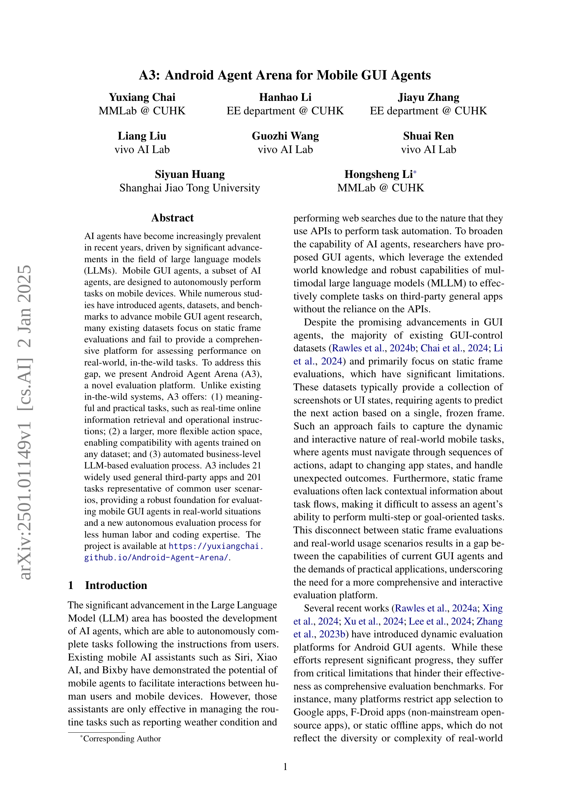
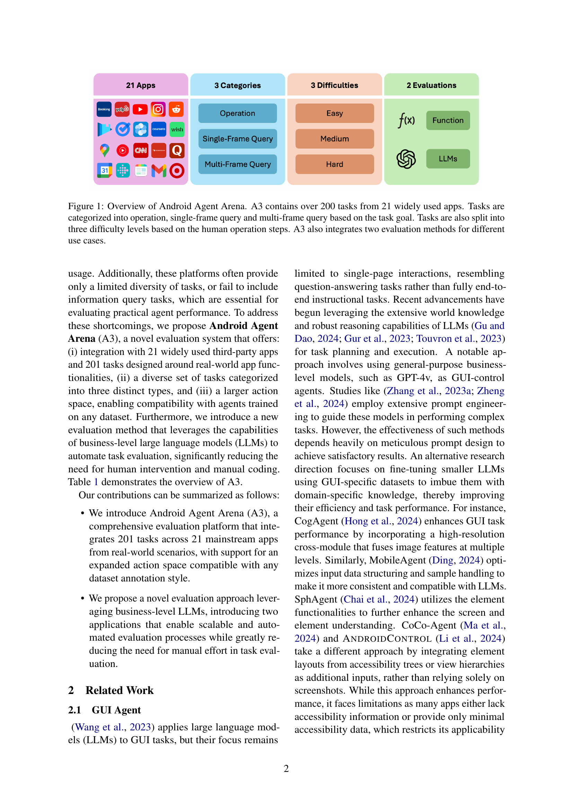
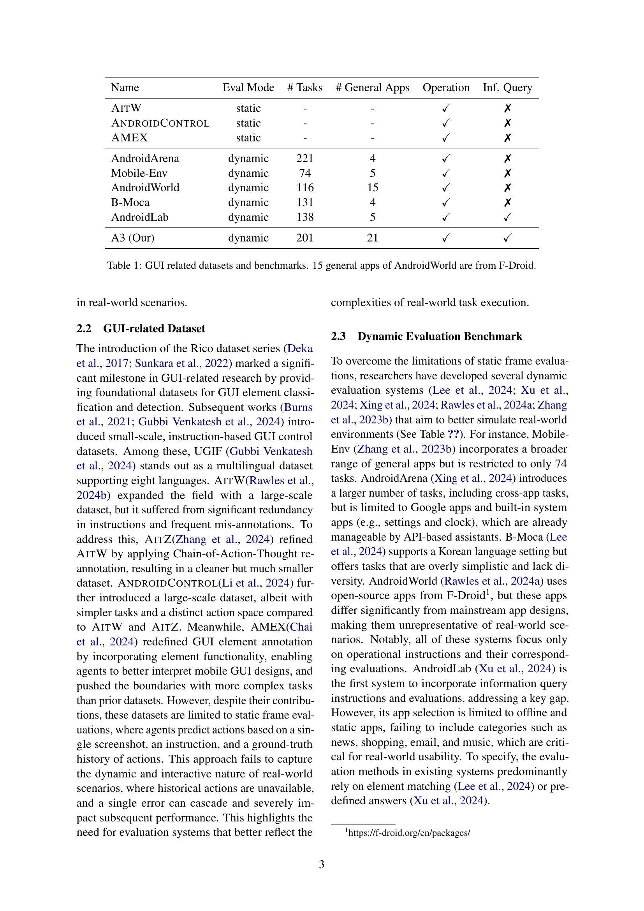
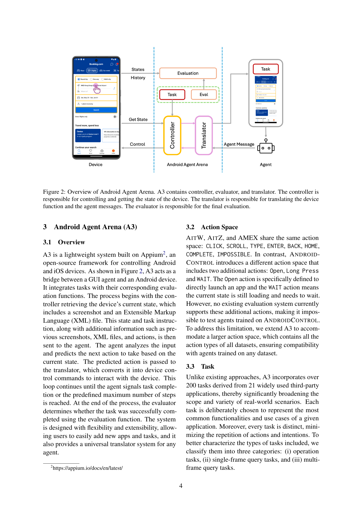
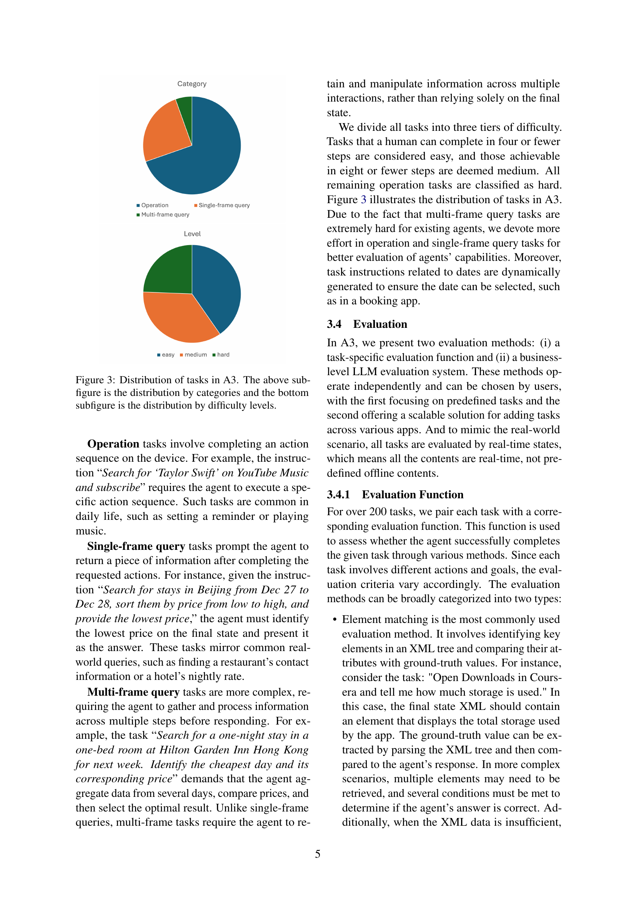
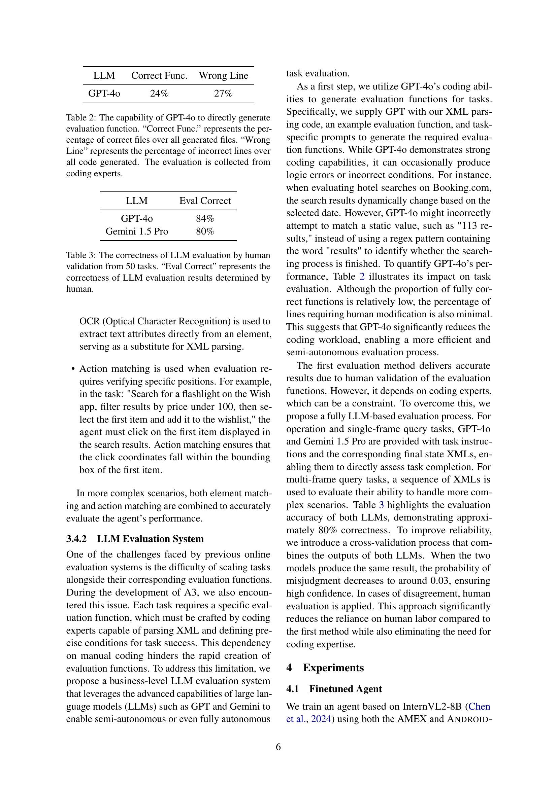
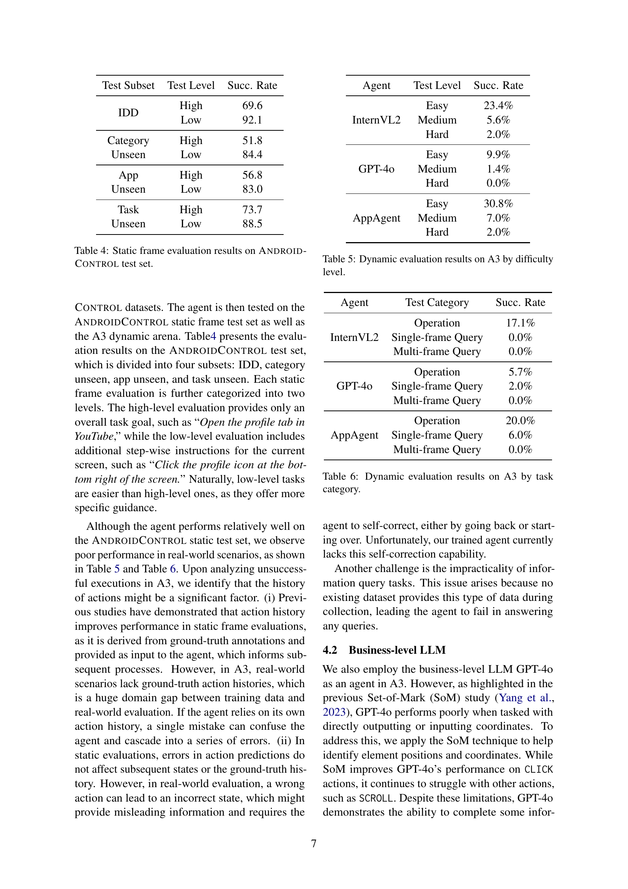
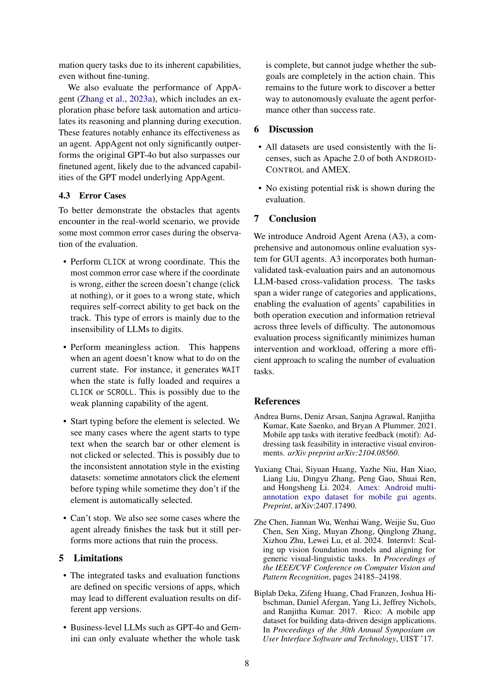
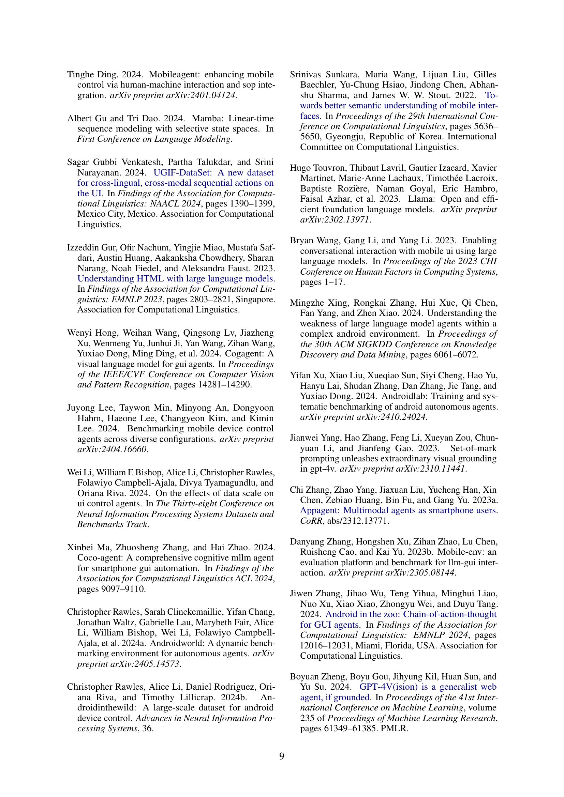
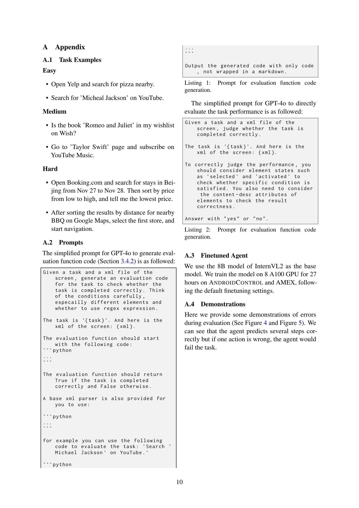
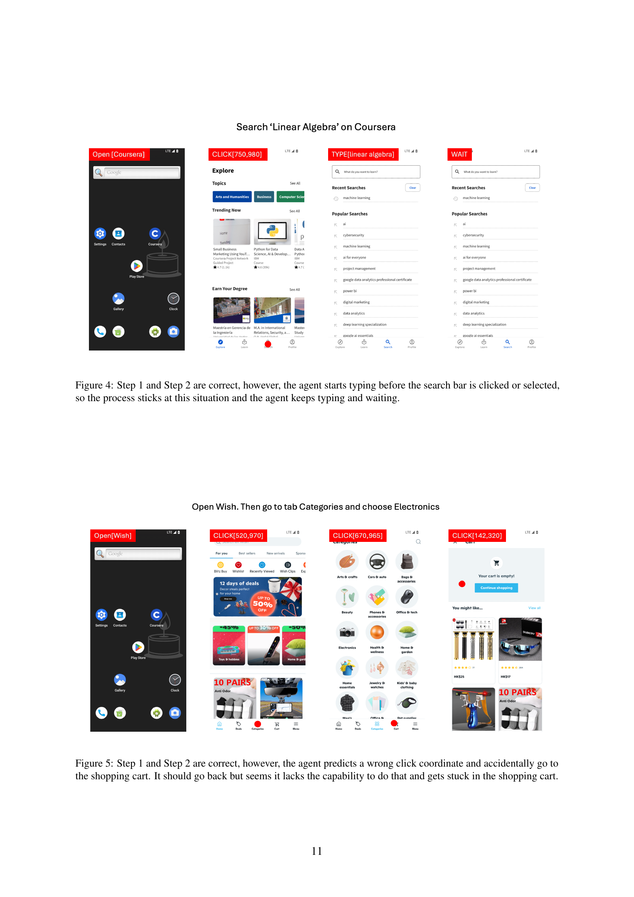
