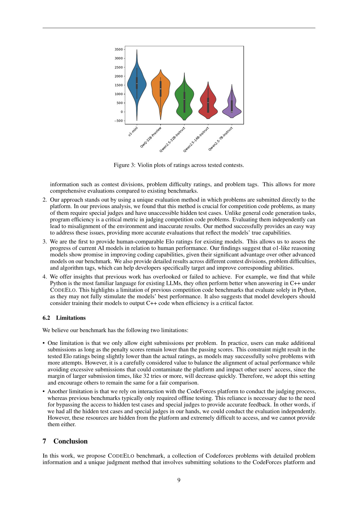

 


 2501.01257 
 Shanghaoran Quan et el. 
 
 🤗 2025-01-03 
 



↗ arXiv


↗ Hugging Face


### TL;DR



대규모 언어 모델(LLM)의 코드 추론 능력이 향상됨에 따라, 이를 효과적으로 평가하는 벤치마크의 필요성이 커지고 있습니다.  기존 벤치마크는 개인 테스트 케이스 부족, 특수 판정 시스템 지원 부족, 실행 환경 불일치 등의 문제점을 가지고 있습니다. 

본 논문에서는 이러한 문제점들을 해결하기 위해, CodeForces 플랫폼을 기반으로 한 새로운 벤치마크 CODEELO를 제시합니다. CODEELO는 문제 수집 및 분류, 고유한 판정 방식, 인간과 비교 가능한 Elo 등급 시스템 등을 통해 LLM의 코드 생성 능력을 정확하고 종합적으로 평가합니다.  30개 이상의 오픈소스 및 독점 LLM을 평가한 결과, 일부 모델만이 우수한 성능을 보였으며, 특히 C++ 언어와 특정 알고리즘에서 성능 차이가 큰 것으로 나타났습니다.



#### Key Takeaways


 CODEELO는 기존 벤치마크의 한계를 극복한, **표준화된 경쟁 수준의 코드 생성 벤치마크**입니다. 



 CODEELO는 **인간 참가자와 비교 가능한 신뢰할 수 있는 Elo 등급 시스템**을 도입하여 LLM의 코드 생성 능력을 정확하게 평가합니다. 



 실험 결과는 **일부 최첨단 LLM만이 경쟁력 있는 코드 생성 능력**을 보이며, 특히 C++ 언어와 특정 알고리즘에서 성능 차이가 크다는 것을 보여줍니다. 


#### Why does it matter?
본 논문은 **경쟁 수준의 코드 생성 벤치마크인 CODEELO**를 제시하여, **LLM의 코드 추론 능력을 종합적으로 평가**하는 데 중요한 기여를 합니다.  이는 기존 벤치마크의 한계를 극복하고, **인간과 비교 가능한 Elo 등급 시스템**을 통해 LLM의 성능을 정확하게 평가할 수 있게 합니다.  향후 연구 방향 제시와 다양한 모델의 비교 분석 결과는 LLM 분야 연구자들에게 **실질적인 도움**을 줄 것입니다.  특히, **C++ 언어의 중요성**을 강조하고 **다양한 알고리즘에 따른 성능 차이**를 분석하여, 모델 개발 방향에 대한 시사점을 제공합니다.

------
#### Visual Insights

> 🔼 그림 1은 여러 대규모 언어 모델(LLM)의 코드 생성 능력을 평가한 엘로 등급 순위표입니다. 각 모델의 엘로 등급은 CodeForces 플랫폼에서의 성능을 기반으로 계산되었으며, 인간 참가자와 비교하여 모델의 상대적 실력을 나타냅니다. 01-mini와 QwQ-32B-Preview 모델이 가장 높은 등급을 기록했습니다.
> 

> 
read the caption

> Figure 1: The ELO rating leaderboard.
> 


| Problem | Difficulty | Updates | Zero False | Positive? | Special | Judge? | Aligned | Execution | Environment? | Standardized | Elo Rating? |
|---|---|---|---|---|---|---|---|---|---|---|---|
| APPS | ★★ | No updates | ✗ | ✗ | ✗ | ✗ | ✗ | ✗ |  | ✗ |  |
| CodeContests | ★★★ | No updates | ✗ | ✗ | ✗ | ✗ | ✗ | ✗ |  | ✗ |  |
| TACO | ★★ | No updates | ✗ | ✗ | ✗ | ✗ | ✗ | ✗ |  | ✗ |  |
| xCodeEval | ★ | No updates | ✗ | ✗ | ✗ | ✗ | ✗ | ✗ |  | ✗ |  |
| USACO | ★★ | Offline | ✓ | ✗ | ✗ | ✗ | ✗ | ✗ |  | ✗ |  |
| LiveCodeBench | ★ | Online | ✗ | ✗ | ✗ | ✗ | ✗ | ✗ |  | ✗ |  |
| CodeForces | ★★★ | Online | ✓ | ✓ | ✓ | ✓ | ✓ | ✓ |  | ✓ |  |

> 🔼 표 1은 CODEELO 벤치마크와 다른 경쟁 코드 벤치마크 간의 비교를 보여줍니다.  각 벤치마크의 문제 난이도 업데이트 여부, 오류 없는 판정 여부, 특별 심사관 지원 여부, 실행 환경 정렬 여부, 표준화된 Elo 등급 제공 여부를 비교하여 CODEELO의 강점을 부각합니다.  기존 벤치마크의 한계점(테스트 케이스 부족, 특별 심사관 부재, 실행 환경 불일치 등)을 지적하고, CODEELO가 이러한 문제점들을 어떻게 해결하는지 보여줍니다.
> 

> 
read the caption

> Table 1: Comparison between CodeForces and other competition code benchmarks.
> 

### In-depth insights

#### CodeELO: A New Benchmark
CodeELO는 기존의 코드 생성 벤치마크의 한계를 극복하고 **경쟁 수준의 코드 생성 능력**을 평가하기 위해 고안된 새로운 벤치마크입니다. 기존 벤치마크들이 공개 테스트 케이스 부족, 특별 심사 지원 부족, 실행 환경 불일치 등의 문제를 가지고 있던 것과 달리, CodeELO는 **CodeForces 플랫폼을 기반**으로 하여 이러한 문제들을 해결했습니다. **실제 대회 환경과 동일한 평가 시스템**을 구현하여 모델의 성능을 정확하게 측정하고, **인간 참가자와 비교 가능한 Elo 등급 시스템**을 도입하여 모델의 상대적 실력을 효과적으로 평가할 수 있습니다. 또한, 다양한 난이도와 알고리즘 유형의 문제들을 포함하여 모델의 코드 생성 능력을 종합적으로 평가하고,  C++와 Python 등 다양한 프로그래밍 언어를 지원하여 모델의 언어 선택 능력도 평가합니다.  **CodeELO는 LLMs의 코드 생성 능력을 보다 정확하고 포괄적으로 평가**할 수 있는 혁신적인 벤치마크로, 향후 LLMs의 발전에 중요한 역할을 할 것으로 기대됩니다.

#### Elo Rating System
본 논문에서 제시된 Elo 평점 시스템은 **CodeForces 플랫폼의 시스템을 기반으로 하되, 개선된 점이 존재**합니다.  **각 경쟁에서의 성과를 독립적으로 평가하여 단순 합산 방식이 아닌, 각 경쟁의 결과를 바탕으로 모델의 기대 평점을 계산**하는 방식입니다.  이는 온라인 평점 시스템의 변동성을 줄이고, **모델 간의 상대적 실력 비교를 더욱 정확하게** 할 수 있도록 합니다.  **인간 참가자의 평점과 비교 가능한 표준화된 Elo 평점을 제공**하여 모델의 성능을 객관적으로 평가하고, 다른 벤치마크와의 비교를 용이하게 합니다.  **다만, CodeForces 플랫폼에 의존하는 구조적 한계**와 제한된 제출 횟수로 인한 실제 성능 저평가 가능성은 여전히 존재합니다.  **더 많은 경쟁 데이터를 활용한다면 평점 시스템의 정확도와 신뢰성을 더욱 향상**시킬 수 있을 것입니다.

#### LLM Code Performance
본 논문은 LLM의 코드 생성 능력을 평가하기 위한 새로운 벤치마크인 CODEELO를 제시합니다. CODEELO는 CodeForces 플랫폼의 문제들을 사용하며, 특히 **실제 경쟁 프로그래밍 환경을 반영**하여 기존 벤치마크의 한계를 극복하고자 합니다.  **정확한 평가를 위해 CodeForces 플랫폼에 직접 제출하는 독창적인 방법**을 사용하며, **특수 판정(special judge)을 지원**하고 실행 환경 불일치 문제를 해결합니다. 또한, 인간 참가자와 비교 가능한 Elo 등급 시스템을 도입하여 LLM의 성능을 객관적으로 평가합니다. 실험 결과, 일부 LLM은 인간 참가자 상위권과 비슷한 성능을 보였으나, 대다수는 어려움을 겪었습니다. 특히, **알고리즘 유형에 따른 성능 차이**가 크게 나타났으며, Python보다 C++를 사용했을 때 성능이 더욱 향상되는 경향을 보였습니다. 이는 LLM의 코드 생성 능력 향상을 위한 중요한 시사점을 제공합니다.  CODEELO는 향후 LLM의 코드 생성 능력 향상을 위한 방향을 제시하는 중요한 기준이 될 것입니다.

#### Algorithm Analysis
논문의 알고리즘 분석 부분은 **다양한 알고리즘 태그를 가진 문제들에 대한 모델의 성능을 비교 분석**하는 데 초점을 맞추고 있습니다. 특히, 모델이 수행한 알고리즘 유형별 정확도를 세밀히 분석하여 강점과 약점을 파악하고자 합니다. 이를 통해 **특정 알고리즘에 대한 모델의 취약성을 개선**하고, **향후 연구 방향을 제시**하는 데 중요한 역할을 할 것으로 기대됩니다.  분석 결과는 다양한 알고리즘 분류에 따른 통계 수치를 제시하고, 그래프 및 표를 활용하여 시각적으로 정보를 제공합니다.  **특히, 동적 계획법(DP) 및 트리(Tree) 기반 알고리즘에서의 낮은 정확도는 모델 개선의 중요한 과제**임을 시사합니다.  **C++와 Python 간 성능 비교 분석**은 프로그래밍 언어 선택이 모델 성능에 미치는 영향을 평가하고, **최적의 언어 선택 전략**을 제시하는 데 도움이 될 것입니다.  전반적으로, 이 분석은 모델 성능 향상을 위한 구체적인 방향을 제시하여 연구의 실용성을 높일 것으로 판단됩니다.

#### Future Work
본 논문의 "향후 연구 방향"에 대한 제 생각은 다음과 같습니다. **CODEELO 벤치마크의 확장성 및 개선**은 중요한 과제입니다. 더욱 다양한 프로그래밍 언어와 문제 유형을 포함하고, **시간 제약 조건**을 더욱 정교하게 반영하여 실제 대회 환경을 더욱 충실히 반영해야 합니다.  또한, **모델의 추론 과정 분석**을 강화하여 모델이 어떤 알고리즘을 선택하고 어떤 부분에서 어려움을 겪는지에 대한 심층적인 이해가 필요합니다. **인간 참가자와의 비교 분석**도 더욱 세밀하게 수행하여 모델의 성능을 보다 정확하게 평가해야 합니다. 특히, 다양한 난이도의 문제에 대한 모델의 성능 차이와 그 원인을 분석하는 것이 중요합니다.  나아가, **새로운 평가 지표 개발**을 통해 모델의 코드 생성 능력을 더욱 포괄적으로 평가할 수 있는 방안을 모색해야 합니다.  마지막으로, **CODEELO를 활용한 모델 개선 연구**를 통해 실제 코드 생성 능력 향상에 기여할 수 있는 방안을 제시하는 것이 중요합니다.  이러한 연구를 통해 CODEELO 벤치마크는 더욱 발전하고, LLM의 코드 생성 기술 발전에 크게 기여할 것입니다.

### More visual insights

More on figures

> 🔼 그림 2는 다양한 크기의 모델들에 대해 C++과 Python이라는 두 가지 프로그래밍 언어를 사용했을 때의 Elo 등급을 비교한 막대 그래프입니다. 각 모델은 C++과 Python으로 작성된 코드를 제출하여 평가되었으며, 그 결과는 Elo 등급으로 표현되어 있습니다. 이 그래프를 통해 각 모델이 어떤 언어를 사용했을 때 더 높은 성능을 발휘하는지, 그리고 각 언어에 따른 성능 차이가 얼마나 큰지 직관적으로 파악할 수 있습니다. 특히, 대부분의 모델들이 Python보다 C++을 사용했을 때 더 높은 Elo 등급을 기록한 것을 확인할 수 있습니다.
> 

> 
read the caption

> Figure 2: The Elo ratings using C++ and Python as programming languages.
> 

> 🔼 그림 3은 여러 번의 대회에 걸쳐 측정된 모델들의 등급 분포를 보여주는 바이올린 플롯입니다. 각 바이올린 플롯은 특정 모델의 등급 분포를 나타내며, 중앙값, 사분위수 범위, 그리고 데이터의 전체 범위를 보여줍니다. 이를 통해 다양한 모델의 등급 안정성과 변동성을 비교 분석할 수 있습니다.  모델의 성능이 대회에 따라 얼마나 변하는지, 그리고 각 모델의 등급 분포의 형태는 어떠한지를 시각적으로 보여줍니다.
> 

> 
read the caption

> Figure 3: Violin plots of ratings across tested contests.
> 

> 🔼 그림 4는 CodeForces 문제의 예시를 보여줍니다. 각 문제는 1) 제목, 2) 시간 제한, 3) 메모리 제한, 4) 문제 설명, 5) 입력 형식, 6) 출력 형식, 7) 테스트 케이스 예시, 그리고 8) 선택적 참고 사항 등의 정보를 포함하고 있습니다. 해당 문제는 https://codeforces.com/contest/2034/problem/E 에서 확인할 수 있습니다.
> 

> 
read the caption

> Figure 4: An example of a problem in CodeForces. Each problem contains: 1) title, 2) time limit, 3) memory limit, 4) problem description, 5) input format, 6) output format, 7) test case examples, and 8) note (optional). This problem can be found at https://codeforces.com/contest/2034/problem/E.
> 

> 🔼 그림 5는 여러 개의 정답이 가능한 문제의 예시입니다. 입력값이 'abc'일 때, 'abb', 'acc', 'aac' 등 'abc'에서 파생된 문자열(자기 자신 제외)은 모두 정답으로 간주될 수 있습니다. 따라서 기존 방식처럼 미리 정해진 정답과 비교하여 평가하는 것은 불가능합니다. CodeForces는 제출된 코드를 직접 플랫폼에서 평가하여 이러한 문제 유형을 처음으로 지원합니다. 문제의 전체 내용은 https://codeforces.com/contest/2047/problem/B 에서 확인할 수 있습니다.
> 

> 
read the caption

> Figure 5: An example of a problem (examples and note parts are omitted) that needs a special judge since there can be multiple valid outputs for the same input (input and outputs refer to test cases but not problem and solutions). e.g., given the input 'abc', acceptable outputs could include 'abb', 'acc', 'aac', and any other string derived from 'abc' except itself. So we cannot simply compare the output with a predetermined correct solution for evaluation in this problem. CodeForces addresses this by evaluating the code submissions directly on their official platform, marking its first support for this kind of problem. The complete problem can be found at https://codeforces.com/contest/2047/problem/B.
> 

More on tables


| Problem | Diffculty |
|---|---|
> 🔼 표 2는 CODEELO 벤치마크에 사용된 Codeforces 경연 대회의 기본 통계를 보여줍니다.  각 등급(Div. 1, 1+2, 2, 3, 4)별 문제 수, 평균 문제 수, 평균 레이팅, 레이팅 요구 사항을 나타냅니다. 이 표는 다양한 난이도의 Codeforces 문제를 벤치마크에 어떻게 포함시켰는지 보여주는 역할을 합니다.
> 

> 
read the caption

> Table 2: Basic statics of different contest divisions.
> 


| Zero False | Positive? |
|---|---|
> 🔼 이 표는 CodeForces 플랫폼에서 다양한 대규모 언어 모델(LLM)의 성능을 Elo 등급으로 비교 분석한 결과를 보여줍니다.  전체 Elo 등급과 함께 각 모델의 등급이 인간 참가자들 중 몇 퍼센트에 해당하는지 괄호 안에 표시되어 있습니다. 또한, 같은 크기의 모델들 중 가장 높은 점수를 받은 모델의 점수는 밑줄이 그어져 있습니다.  Div 1+2, Div 2, Div 3, Div 4 와 같은 CodeForces의 등급 분류에 따른 세부 성능도 함께 제시되어 있습니다.  모델의 크기(매개변수 수)별로 결과를 구분하여 비교 분석하는데 유용합니다.
> 

> 
read the caption

> Table 3: Main results of different LLMs on CodeForces. The number in parentheses after the overall Elo rating shows the percentile rank among human participants. The underlined numbers represent the best scores within the same model size range.
> 


| Special | Judge? |
|---|---|
> 🔼 표 4는 최소 30개 이상의 문제가 테스트된 주요 알고리즘 유형에 대한 정확도(pass@1)를 보여줍니다.  각 약어는 다음을 의미합니다: Gr.(탐욕적), Ma.(수학적), Im.(구현), BF.(무차별 대입), DP.(동적 계획법), DS.(자료 구조), CA.(생성적 알고리즘), BS.(이분 탐색), So.(정렬), Gr.(그래프), DFS.(깊이 우선 탐색 및 유사 알고리즘), NT.(수론), Tr.(트리), Co.(조합론), TP.(투 포인터), Bi.(비트 마스크). 이 표는 다양한 모델들이 각 알고리즘 유형에 대해 어떤 성능을 보이는지 비교 분석하는 데 사용됩니다.
> 

> 
read the caption

> Table 4: Pass rate (pass@1111) on major problem categories that have at least 30 problems tested. The abbreviations 'Gr.', 'Ma.', 'Im.', 'BF.', 'DP', 'DS.', 'CA.', 'BS.', 'So.', 'Gr.', 'DFS', 'NT.', 'Tr.', 'Co.', 'TP.', and 'Bi.' stand for greedy, math, implementation, brute force, dp, data structures, constructive algorithms, binary search, sortings, graphs, dfs and similar, number theory, trees, combinatorics, two pointers, and bitmasks, respectively.
> 


| Aligned | Execution | Environment? |
|---|---|---|

> 🔼 이 표는 논문에서 사용된 30개의 오픈소스 및 3개의 독점 LLM에 대한 정보를 제공합니다. 각 모델의 이름, 인용 논문, HuggingFace 엔드포인트가 포함되어 있습니다. 이 정보는 모델의 출처와 접근 방법을 명확히 하여 재현성을 높이는 데 도움이 됩니다.
> 

> 
read the caption

> Table 5: Model cards.
> 


| Standardized | Elo Rating? |
|---|---|
> 🔼 이 표는 2024년 11월에 CodeForces 플랫폼에서 공개적으로 이용 가능한 사용자 등급 데이터를 기반으로 계산된 모든 참가자의 등급에 대한 백분위 수를 보여줍니다.  각 백분위 수는 해당 등급 이하에 속하는 참가자의 비율을 나타냅니다.  예를 들어, 26번째 백분위 수의 등급은 전체 참가자 중 26%가 해당 등급 또는 그 이하의 등급을 가지고 있음을 의미합니다. 이 표는 CodeForces 플랫폼에서 인간 참가자들의 등급 분포를 보여주어, 이 논문에서 제시하는 모델의 Elo 등급을 인간 참가자의 등급과 비교하는 데 사용됩니다.
> 

> 
read the caption

> Table 6: Percentiles of ratings among all human participants, calculated based on publicly available user ratings from the CodeForces platform, collected in November, 2024.
> 

### Full paper



