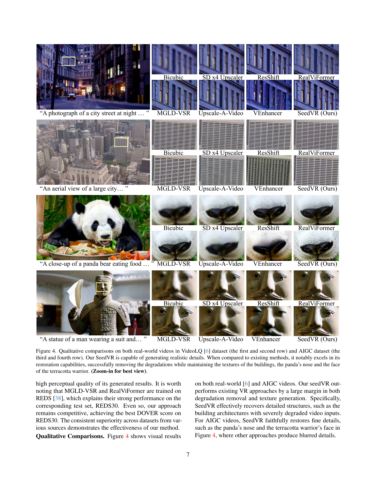

 


 2501.01320 
 Jianyi Wang et el. 
 
 🤗 2025-01-03 
 



↗ arXiv


↗ Hugging Face


### TL;DR



비디오 복원은 **저화질 비디오에서 고화질 비디오를 복원**하는 어려운 문제입니다. 기존의 방법들은 **계산 비용이 많이 들고 고해상도 비디오 처리에 어려움**을 겪었습니다. 또한, **실제 환경에서 발생하는 다양한 저하**를 고려하지 못하는 경우가 많았습니다.  

SeedVR은 이러한 문제점을 해결하기 위해 **대규모 확산 트랜스포머 모델**을 제시합니다. **변형 가능한 윈도우 어텐션 메커니즘**을 사용하여 임의의 해상도와 길이의 비디오를 효율적으로 처리하고, **다양한 저하 유형**에 대한 강력한 복원 성능을 보여줍니다. 또한, **다단계 학습 전략**을 통해 대규모 데이터셋에서 효과적인 학습을 가능하게 합니다. SeedVR은 **다양한 벤치마크**에서 **최첨단 성능**을 달성하였으며, **실제 환경의 비디오 복원**에 유용하게 활용될 수 있음을 보여줍니다.



#### Key Takeaways


 SeedVR은 임의의 길이와 해상도를 가진 비디오에 대해 효과적으로 일반적인 비디오 복원을 수행합니다. 



 SeedVR은 기존의 비디오 복원 방법보다 훨씬 빠르고 효율적입니다. 



 SeedVR은 다양한 벤치마크에서 최첨단 성능을 달성합니다. 


#### Why does it matter?
본 논문은 **대규모 확장 가능한 확산 트랜스포머 모델**을 사용하여 **일반적인 비디오 복원** 문제를 해결하는 데 중요한 의미를 지닙니다. **임의의 해상도와 길이를 가진 비디오**에 효과적으로 적용될 수 있는 새로운 방법을 제시하며, 기존 방법의 한계를 극복하고 향상된 성능을 보여줍니다. 따라서 비디오 복원 분야 연구자들에게 새로운 연구 방향을 제시하고, 향후 연구의 발전에 기여할 것으로 기대됩니다. 특히, **대규모 모델 트레이닝 전략**과 **효율적인 아키텍처 설계**에 대한 통찰력을 제공하여 관련 분야 연구에 큰 영향을 미칠 것입니다.

------
#### Visual Insights

> 🔼 그림 1은 SeedVR의 속도와 성능을 비교 분석한 결과를 보여줍니다. SeedVR은 2.48B개의 파라미터를 가지고 있음에도 불구하고, 기존의 확산 기반 비디오 복원 방법들보다 2배 이상 빠른 속도를 보입니다.  세부적인 부분까지 선명하게 복원하며 시각적인 현실감을 높이는 SeedVR의 우수한 복원 능력을 확인할 수 있습니다. 또한, SeedVR은 Stable Diffusion Upscaler와 비슷한 효율성을 보이는데, 이는 SeedVR이 Stable Diffusion Upscaler보다 5배나 많은 파라미터를 가지고 있음에도 불구하고 가능한 것입니다. 그림을 확대하여 자세히 살펴보세요.
> 

> 
read the caption

> Figure 1: Speed and performance comparisons. SeedVR demonstrates impressive restoration capabilities, offering fine details and enhanced visual realism. Despite its 2.48B parameters, SeedVR is over 2×2\times2 × faster than existing diffusion-based video restoration approaches [80, 64, 20]. With delicate designs, SeedVR is as efficient as the Stable Diffusion Upscaler [2], even with five times the parameter count. (Zoom-in for best view)
> 


## Table 1: Quantitative comparison with state-of-the-art video upscalers on different datasets.

| Datasets | Metrics | Real-ESRGAN [56] | SD ×4 Upscaler [2] | ResShift [74] | RealViFormer [77] | MGLD-VSR [64] | Upscale-A-Video [80] | VEhancer [20] | Ours |
|---|---|---|---|---|---|---|---|---|---|
| SPMCS | PSNR ↑ | 22.55 | 22.75 | 23.14 | **24.19** | 23.41 | 22.30 | 18.20 | 22.37 |
|  | SSIM ↑ | **0.637** | 0.535 | 0.598 | **0.663** | 0.633 | 0.567 | 0.507 | 0.607 |
|  | LPIPS ↓ | 0.406 | 0.554 | 0.547 | 0.378 | **0.369** | 0.489 | 0.455 | **0.341** |
|  | DISTS ↓ | 0.189 | 0.247 | 0.261 | 0.186 | **0.166** | 0.245 | 0.194 | **0.141** |
|  | NIQE ↓ | 3.355 | 5.883 | 6.246 | 3.431 | **3.315** | 5.280 | 4.328 | **3.207** |
|  | MUSIQ ↑ | 62.78 | 42.09 | 55.11 | 62.09 | **65.25** | 58.56 | 54.94 | **64.28** |
|  | CLIP-IQA ↑ | 0.451 | 0.402 | **0.598** | 0.424 | 0.495 | 0.366 | 0.334 | **0.587** |
|  | DOVER ↑ | **8.566** | 4.413 | 5.342 | 7.664 | 8.471 | 4.985 | 7.807 | **10.508** |
| UDM10 | PSNR ↑ | 24.78 | 26.01 | 25.56 | **26.70** | **26.11** | 25.28 | 21.48 | 25.76 |
|  | SSIM ↑ | 0.763 | 0.698 | 0.743 | **0.796** | **0.772** | 0.755 | 0.691 | 0.771 |
|  | LPIPS ↓ | **0.270** | 0.424 | 0.417 | 0.285 | 0.273 | 0.314 | 0.349 | **0.231** |
|  | DISTS ↓ | 0.156 | 0.234 | 0.211 | 0.166 | **0.144** | 0.187 | 0.175 | **0.116** |
|  | NIQE ↓ | 4.365 | 6.014 | 5.941 | 3.922 | **3.814** | 5.314 | 4.883 | **3.514** |
|  | MUSIQ ↑ | 54.18 | 30.33 | 51.34 | 55.60 | **58.01** | 43.92 | 46.37 | **59.14** |
|  | CLIP-IQA ↑ | 0.398 | 0.277 | **0.537** | 0.397 | 0.443 | 0.291 | 0.304 | **0.524** |
|  | DOVER ↑ | 7.958 | 3.169 | 5.111 | 7.259 | 7.717 | 7.108 | **8.087** | **10.537** |
| REDS30 | PSNR ↑ | 21.67 | **22.94** | 22.72 | **23.34** | 22.74 | 22.57 | 19.83 | 20.44 |
|  | SSIM ↑ | 0.573 | 0.563 | 0.572 | **0.615** | **0.578** | 0.578 | 0.545 | 0.534 |
|  | LPIPS ↓ | 0.389 | 0.551 | 0.509 | **0.328** | **0.271** | 0.497 | 0.508 | 0.346 |
|  | DISTS ↓ | 0.179 | 0.268 | 0.234 | 0.154 | **0.097** | 0.271 | 0.229 | **0.138** |
|  | NIQE ↓ | 2.879 | 6.718 | 6.258 | 3.032 | **2.550** | 5.374 | 4.615 | **2.729** |
|  | MUSIQ ↑ | 57.97 | 25.57 | 47.50 | **58.60** | **62.28** | 32.41 | 37.95 | 57.55 |
|  | CLIP-IQA ↑ | 0.403 | 0.202 | **0.554** | 0.392 | 0.444 | 0.228 | 0.245 | **0.451** |
|  | DOVER ↑ | 5.552 | 2.737 | 3.712 | 5.229 | 6.544 | 3.704 | 5.549 | **6.673** |
| YouHQ40 | PSNR ↑ | 22.31 | 22.51 | **22.67** | **23.26** | 22.62 | 22.08 | 18.68 | 21.15 |
|  | SSIM ↑ | **0.605** | 0.528 | 0.579 | **0.606** | 0.576 | 0.548 | 0.510 | 0.554 |
|  | LPIPS ↓ | **0.342** | 0.518 | 0.432 | 0.362 | 0.356 | 0.435 | 0.449 | **0.298** |
|  | DISTS ↓ | 0.169 | 0.242 | 0.215 | 0.193 | **0.166** | 0.236 | 0.175 | **0.118** |
|  | NIQE ↓ | 3.721 | 5.954 | 5.458 | **3.172** | 3.255 | 5.291 | 4.161 | **2.913** |
|  | MUSIQ ↑ | 56.45 | 36.74 | 54.96 | 61.88 | **63.95** | 49.37 | 54.18 | **67.45** |
|  | CLIP-IQA ↑ | 0.371 | 0.328 | **0.590** | 0.438 | 0.509 | 0.328 | 0.352 | **0.635** |
|  | DOVER ↑ | 10.92 | 5.761 | 7.618 | 9.483 | 10.503 | 7.832 | **11.444** | **12.788** |
| VideoLQ | NIQE ↓ | 4.014 | 4.584 | 4.829 | 4.007 | **3.888** | 5.545 | 4.264 | **3.874** |
|  | MUSIQ ↑ | **60.45** | 43.64 | **59.69** | 57.50 | 59.50 | 41.08 | 52.59 | 54.41 |
|  | CLIP-IQA ↑ | **0.361** | 0.296 | **0.487** | 0.312 | 0.350 | 0.253 | 0.289 | 0.355 |
|  | DOVER ↑ | **12.275** | 10.547 | 12.082 | 10.245 | 11.008 | 10.297 | 12.178 | **13.424** |
| AIGC38 | NIQE ↓ | 4.942 | 4.399 | 4.853 | 4.444 | **4.162** | 5.743 | 4.759 | **3.955** |
|  | MUSIQ ↑ | 58.39 | 56.72 | **64.38** | 58.73 | 62.03 | 51.32 | 53.36 | **65.91** |
|  | CLIP-IQA ↑ | 0.442 | 0.554 | **0.660** | 0.473 | 0.528 | 0.378 | 0.395 | **0.638** |
|  | DOVER ↑ | **12.275** | 10.547 | 12.082 | 10.245 | 11.008 | 10.297 | 12.178 | **13.424** |

> 🔼 표 1은 다양한 데이터셋(합성 데이터셋: SPMCS, UDM10, REDS30, YouHQ40, 실제 데이터셋: VideoLQ, AIGC 데이터셋: AIGC38)을 사용한 비디오 초해상도(VSR) 벤치마크에 대한 정량적 비교 결과를 보여줍니다.  각 방법의 성능은 PSNR, SSIM, LPIPS, DISTS, NIQE, MUSIQ, CLIP-IQA, DOVER 지표를 사용하여 측정되었으며, 최고 성능과 두 번째로 높은 성능은 각각 빨간색과 주황색으로 표시되어 있습니다. 이 표는 SeedVR 모델의 성능을 기존의 다른 VSR 방법들과 비교하여 SeedVR의 우수성을 보여주는 데 목적이 있습니다.
> 

> 
read the caption

> Table 1:  Quantitative comparisons on VSR benchmarks from diverse sources, i.e., synthetic (SPMCS, UDM10, REDS30, YouHQ40), real (VideoLQ), and AIGC (AIGC38) data. The best and second performances are marked in red and orange, respectively.
> 

### In-depth insights

#### SeedVR: Infinity Seeding
SeedVR이라는 제목에서 "Infinity Seeding" 개념은 **무한한 가능성을 가진 시드(씨앗)를 심는다**는 의미로 해석될 수 있습니다. 이는 기존의 제한적인 비디오 복원 기술을 넘어, 해상도나 길이에 제약 없이 다양한 비디오를 복원할 수 있는 가능성을 열어준다는 점을 강조합니다.  **SeedVR은 대규모 데이터셋과 다양한 해상도의 영상 및 이미지를 학습**하여, 알려지지 않은 왜곡까지도 효과적으로 복원하는 능력을 갖추도록 설계되었습니다.  **핵심은 ‘shifted window attention’ 메커니즘**으로, 기존의 어텐션 방식보다 효율적인 연산으로 장시간의 고해상도 비디오 복원에 적합하도록 개선되었다는 점입니다. **대용량 모델임에도 불구하고 속도가 빠르고, 실제 및 AI 생성 영상 모두에 우수한 성능**을 보이는 점 또한 중요한 특징입니다.  결론적으로, SeedVR의 "Infinity Seeding"은 단순한 이름 이상의 의미를 지니며, **혁신적인 기술적 접근을 통해 비디오 복원 분야에 무한한 가능성을 제시**한다는 비전을 담고 있습니다.

#### Shifted Window Attention
본 논문에서 제안하는 **시프티드 윈도우 어텐션 (Shifted Window Attention)**은 기존의 윈도우 어텐션의 한계를 극복하기 위한 핵심 기술입니다. 기존 윈도우 어텐션은 고정된 크기의 윈도우를 사용하여 장기적인 종속성을 포착하는 데 어려움이 있었지만, 시프티드 윈도우 어텐션은 **가변적인 크기의 윈도우**를 사용하여 이 문제를 해결합니다. 특히, 영상의 경계 부분에서도 효과적으로 작동하도록 설계되어 **임의의 길이와 해상도를 가진 영상 복원**에 적합합니다.  **계산 비용 절감**과 **성능 향상**이라는 두 마리 토끼를 모두 잡는 효과적인 전략이며,  **대규모 데이터셋**을 사용한 훈련을 통해 성능을 더욱 향상시킬 수 있습니다.  이는 **고해상도 영상 복원**에서 속도와 성능 면에서 우수한 결과를 보여주는 SeedVR 모델의 핵심 동작 원리입니다.

#### Causal Video VAE
논문에서 제시된 "Causal Video VAE"는 기존의 영상 복원 모델들이 갖는 비효율적인 처리 과정을 개선하기 위한 핵심 구성 요소입니다. **기존의 접근 방식들은 비디오를 처리할 때 공간적, 시간적 차원에서 오버랩되는 패치들을 사용**했는데, 이는 계산 비용이 많이 들고 처리 속도가 느려지는 단점이 있었습니다.  **Causal Video VAE는 이러한 문제를 해결하기 위해 인코더-디코더 구조를 기반으로 하되, 시간적 인과 관계를 고려하여(causal) 비디오 데이터를 효율적으로 압축**합니다.  즉,  **과거의 정보만을 사용하여 미래의 정보를 예측하는 방식**으로,  시간적 중복성을 최소화하고 계산 효율성을 높입니다.  **특히, 다양한 해상도의 영상에 효과적으로 대처할 수 있도록 설계**되어 있으며, 다양한 크기의 영상 데이터에 대한 일반화 성능을 높입니다.  결과적으로, Causal Video VAE는 고해상도의 장시간 영상 복원에 필요한 계산 비용을 크게 줄이고 처리 속도를 높이는 데 기여하여, 실시간 또는 실제 응용 환경에서의 영상 복원 성능을 향상시킵니다.

#### Large-Scale Training
본 논문의 "대규모 학습" 부분은 **방대한 양의 이미지와 비디오 데이터를 사용하여 강력한 비디오 복원 모델을 학습하는 전략**을 제시합니다.  단순히 대규모 데이터셋을 사용하는 것을 넘어, **고해상도 이미지와 다양한 길이의 비디오 클립을 혼합하여 학습**함으로써 모델의 일반화 능력을 향상시킵니다.  특히, **저해상도(LQ) 영상에 노이즈를 추가하는 기법**과 **다양한 텍스트 인코더에 임의로 빈 프롬프트를 입력하는 기법**은 모델의 과적합을 방지하고 생성 능력을 향상시키는 데 기여합니다.  또한, **잠재 변수와 텍스트 임베딩을 미리 계산**하여 학습 속도를 4배 향상시켰으며, **해상도와 비디오 길이를 점진적으로 증가시키는 방식**의 단계적 학습 전략을 통해 대규모 데이터셋 학습의 어려움을 효과적으로 극복합니다.  결론적으로, 이러한 **다각적인 접근 방식**은 대규모 학습의 효율성과 성능을 모두 개선하여, 실제 환경에서도 우수한 성능을 보이는 강력한 비디오 복원 모델을 구축하는 데 중요한 역할을 합니다.

#### Ablation Study
본 논문의 ablation study는 **SeedVR 모델의 핵심 구성 요소들의 효과를 체계적으로 분석**하기 위해 수행되었습니다.  특히, 제안된 **인과적 비디오 VAE(Variational Autoencoder)와 시프티드 윈도우 기반의 MM-DiT(Multi-Modality Diffusion Transformer) 블록의 성능**을 다양한 설정 하에서 평가하여, 각 요소가 전체 모델 성능에 미치는 영향을 정량적으로 밝히고 있습니다.  **윈도우 크기의 변화에 따른 성능 변화**를 분석하여, 적절한 윈도우 크기 선택의 중요성을 강조하고 있으며, 이는 모델의 계산 효율성과 성능 간의 균형을 맞추는 데 중요한 역할을 합니다.  **다양한 크기의 비디오 데이터셋을 사용한 실험**을 통해, 제안된 방법의 일반화 성능과 확장성을 검증하고 있습니다. 이러한 ablation study 결과는 SeedVR 모델의 설계 및 성능 향상에 대한 귀중한 통찰력을 제공하며, **향후 연구 방향**에 대한 시사점을 제시합니다.  **특히,  VAE의 효율성과 윈도우 어텐션의 적절한 크기 선정**은  SeedVR의 성능을 좌우하는 중요한 요인임을 보여줍니다.

### More visual insights

More on figures

> 🔼 SeedVR 모델의 Swin-MMDiT 구조와 세부 내용을 보여주는 그림입니다. 기존의 어텐션 방식과 달리, 쉬프티드 윈도우 메커니즘을 도입하여 해상도 제약 없이 변환 블록을 처리합니다. 또한, 중앙에는 큰 윈도우를, 경계 근처에는 가변 크기의 윈도우를 사용하여 임의의 길이와 크기의 입력에 대해 장거리 의존성을 포착할 수 있습니다.
> 

> 
read the caption

> Figure 2:  Model architecture and the details of Swin-MMDIT of SeedVR. Our approach introduces a shifted window mechanism into the transformer block, bypassing the resolution constrain of vanilla attention. We further adopt large attention windows around the center and variable-sized windows near the boundary, enabling long-range dependency capturing given inputs of any length and size.
> 

> 🔼 이 그림은 3.2절(Causal Video VAE)에서 제시된 인과적 비디오 VAE의 아키텍처를 보여줍니다. 기존 이미지 오토인코더를 단순히 확장하는 대신, 공간-시간적 압축 기능을 갖춘 새롭게 설계된 인과적 비디오 VAE가 강력한 재구성 성능을 달성하기 위해 사용됩니다. 이 아키텍처는 장기간 비디오를 효율적으로 처리할 수 있도록 설계되었습니다.  여러 ResBlock3D, Spat. Down/Up, Spat.-Temp. Down/Up 블록과 Causal Conv3D 레이어를 통해 인코더와 디코더 모두에서 계층적인 특징 추출과 복원이 이루어집니다.  GroupNorm과 Spat. Attn. (공간적 어텐션) 레이어는 추가적인 정규화 및 특징 표현 향상을 위한 장치로 사용됩니다.  이 그림을 통해 SeedVR 모델의 효율성과 성능을 높이는 데 기여하는 인과적 VAE의 설계 원리가 잘 나타나 있습니다.
> 

> 
read the caption

> Figure 3:  The model architecture of casual video autoencoder. In contrast to naively inflating an existing image autoenoder, we redesign a casual video VAE with spatial-temporal compression capability to achieve a strong reconstruction capability.
> 

More on tables


| Methods | Params (M) | Temporal Compression | Spatial Compression | Latent Channel | PSNR ↑ | SSIM ↑ | LPIPS ↓ | rFVD ↓ |
|---|---|---|---|---|---|---|---|---|
| SD 2.1 [45] | 83.7 | - | 8 | 4 | 29.50 | 0.9050 | 0.0998 | 8.14 |
| VEnhancer [20] | 97.7 | - | 8 | 4 | 30.81 | 0.9356 | 0.0751 | 11.10 |
| Cosmos [44] | 90.2 | 4 | 8 | 16 | 32.34 | 0.9484 | 0.0847 | 13.02 |
| OpenSora [79] | 393.3 | 4 | 8 | 4 | 27.70 | 0.8893 | 0.1661 | 47.04 |
| OpenSoraPlan v1.3 [28] | 147.3 | 4 | 8 | 16 | 30.41 | 0.9280 | 0.0976 | 27.70 |
| CogVideoX [66] | 215.6 | 4 | 8 | 16 | 34.30 | 0.9650 | 0.0623 | 6.06 |
| Ours | 250.6 | 4 | 8 | 16 | 33.83 | 0.9643 | 0.0517 | 1.85 |
> 🔼 표 2는 기존 잠재 확산 모델 [45, 20, 44, 79, 28, 66]에서 일반적으로 사용되는 VAE 모델에 대한 정량적 비교 결과를 보여줍니다.  각 모델의 매개변수 수, 시간적 및 공간적 압축 비율, 잠재 채널 수, 그리고 PSNR, SSIM, LPIPS, rFVD와 같은 다양한 평가 지표에 따른 성능을 비교 분석하여 제시합니다.  표에서 가장 좋은 성능은 빨간색으로, 두 번째로 좋은 성능은 주황색으로 표시되어 있습니다. 이 표는 제안된 SeedVR 모델의 VAE 부분의 성능을 기존 방법들과 비교하여 그 우수성을 보여주는 데 목적이 있습니다.
> 

> 
read the caption

> Table 2: Quantitative comparisons on VAE models commonly used in existing latent diffusion models [45, 20, 44, 79, 28, 66]. The best and second performances are marked in red and orange, respectively.
> 


| Temp. Win. | Spat. Win. Size | Spat. Win. Size | Spat. Win. Size | Spat. Win. Size | Length |
|---|---|---|---|---|---| 
|  8 × 8 | 16 × 16 | 32 × 32 | 64 × 64 | 455.49 | t = 1 |
|  |  |  |  | 138.29 |  |
|  |  |  |  | 58.37 |  |
|  |  |  |  | 23.68 |  |
|  8 × 8 | 16 × 16 | 32 × 32 | 64 × 64 | 345.78 | t = 5 |
|  |  |  |  | 110.01 |  |
|  |  |  |  | 46.49 |  |
|  |  |  |  | 20.29 |  |
> 🔼 이 표는 서로 다른 크기의 윈도우를 사용하여 SeedVR 모델을 훈련하는 데 걸리는 시간(초/반복)을 보여줍니다.  다양한 크기의 시간 및 공간 윈도우에 대한 훈련 효율성을 비교하여, 효율적인 훈련을 위한 최적의 윈도우 크기를 결정하는 데 도움이 됩니다.  특히, 작은 윈도우 크기가 훈련 시간을 크게 늘리는 것을 보여줍니다.
> 

> 
read the caption

> Table 3: Training efficiency (sec/iter) with different window sizes.
> 

### Full paper



