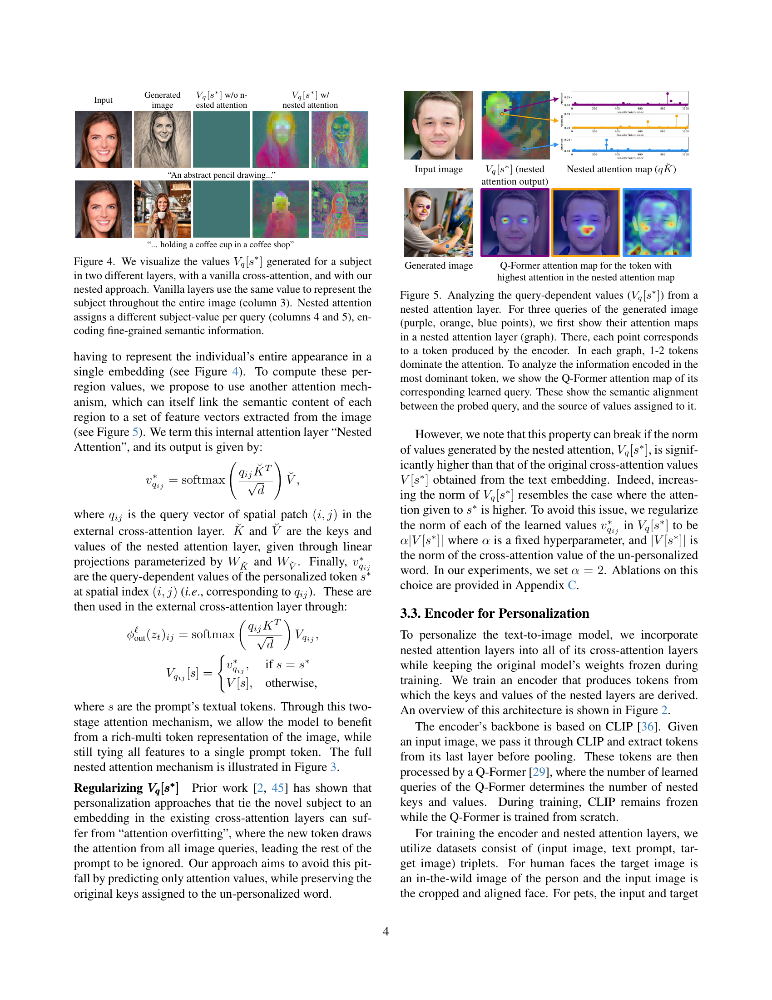

 


 2501.01407 
 Or Patashnik et el. 
 
 🤗 2025-01-03 
 



↗ arXiv


↗ Hugging Face


### TL;DR



본 논문은 **텍스트-이미지 모델의 개인화** 문제를 해결하기 위한 새로운 방법인 Nested Attention을 제시합니다. 기존의 개인화 방법들은 개인 식별 유지와 텍스트 프롬프트 정렬 사이에서 균형을 맞추는 데 어려움을 겪었는데, 이는 **단일 텍스트 토큰으로만 주제를 표현**하거나, **더 풍부한 표현을 사용하면 모델의 기존 학습 내용이 방해**받기 때문입니다.

Nested Attention은 **중첩된 어텐션 레이어**를 사용하여 각 영역에 대해 **문맥에 맞는 주제 특징을 선택**하고 이를 기존 크로스-어텐션 레이어에 통합하는 방식입니다. 이를 통해 **개인 식별력을 높이면서도 텍스트 프롬프트와의 정렬을 유지**할 수 있으며, **여러 도메인의 주제를 단일 이미지에 결합**하는 것도 가능하게 되었습니다. 실험 결과, 제안된 방법은 기존 방법들보다 성능이 우수함을 보였습니다.



#### Key Takeaways


 중첩 주의 메커니즘을 통해 텍스트-이미지 모델의 개인화 성능을 향상시켰습니다. 



 단일 텍스트 토큰에 이미지의 풍부하고 표현력 있는 표현을 연결하여 프롬프트 정렬과 개인 식별 보존 간의 균형을 개선했습니다. 



 다양한 도메인에서의 개인화된 이미지 생성 및 여러 개인화된 개념을 단일 이미지에 결합하는 것이 가능함을 보였습니다. 


#### Why does it matter?
본 논문은 **텍스트-이미지 모델의 개인화에 대한 새로운 접근 방식**을 제시하여 연구자들이 **다양한 분야에서 개인화된 이미지 생성 모델을 개발**하는 데 도움이 될 수 있습니다. 또한 **기존 방법의 한계를 극복**하고 **새로운 연구 방향**을 제시하여 관련 연구 분야의 발전에 기여할 수 있습니다. 특히, 다양한 도메인에서의 개인화된 이미지 생성이 가능하다는 점은 **실제 응용 분야**에서의 활용 가능성을 높여줍니다.

------
#### Visual Insights

> 🔼 그림 1은 제안된 중첩 어텐션 메커니즘을 보여줍니다. 이 메커니즘은 개별 대상의 국부적이고 표현력 있는 표현을 단일 텍스트 토큰에 연결합니다. 이를 통해 모델의 기존 사전 정보를 유지하면서 신원 보존을 향상시키고, 하나의 이미지에 여러 개인화된 개념을 결합할 수 있습니다.  각각의 작은 이미지는 다양한 스타일과 배경에서 동일한 대상의 이미지를 생성한 결과를 보여줍니다. 이는 본 논문에서 제시하는 중첩 어텐션이 개인화된 이미지 생성에서 신원 보존과 프롬프트 정합 사이의 균형을 효과적으로 맞추는 데 기여함을 시각적으로 보여줍니다.
> 

> 
read the caption

> Figure 1:  Our nested attention mechanism attaches a localized, expressive representation of a subject to a single text token. This approach improves identity preservation while maintaining the model’s prior, and can combine multiple personalized concepts in a single image.
> 


| Input | Generated |  $V_{q}[s^{*}]$ w/o n- | $V_{q}[s^{*}]$ w/ |  | 
|---|---|---|---|---| 
| image | ested attention | nested attention |  |  | 
| [https://arxiv.org/html/2501.01407/woman_input.png](https://arxiv.org/html/2501.01407/woman_input.png) | [https://arxiv.org/html/2501.01407/woman_pencil.png](https://arxiv.org/html/2501.01407/woman_pencil.png) | [https://arxiv.org/html/2501.01407/v_q_ca.jpg](https://arxiv.org/html/2501.01407/v_q_ca.jpg) | [https://arxiv.org/html/2501.01407/woman_nested_hidden_states_up_blocks.0.attentions.0.transformer_blocks.5.attn2.processor.jpg](https://arxiv.org/html/2501.01407/woman_nested_hidden_states_up_blocks.0.attentions.0.transformer_blocks.5.attn2.processor.jpg) | [https://arxiv.org/html/2501.01407/woman_nested_hidden_states_up_blocks.1.attentions.2.transformer_blocks.1.attn2.processor.jpg](https://arxiv.org/html/2501.01407/woman_nested_hidden_states_up_blocks.1.attentions.2.transformer_blocks.1.attn2.processor.jpg) | 
|  |  |  |  |  | 
| "An abstract pencil drawing…" |  |  |  |  | 
| [https://arxiv.org/html/2501.01407/woman_input.png](https://arxiv.org/html/2501.01407/woman_input.png) | [https://arxiv.org/html/2501.01407/woman_coffee.jpg](https://arxiv.org/html/2501.01407/woman_coffee.jpg) | [https://arxiv.org/html/2501.01407/v_q_ca.jpg](https://arxiv.org/html/2501.01407/v_q_ca.jpg) | [https://arxiv.org/html/2501.01407/woman_coffe_nested_hidden_states_up_blocks.0.attentions.0.transformer_blocks.7.attn2.processor.jpg](https://arxiv.org/html/2501.01407/woman_coffe_nested_hidden_states_up_blocks.0.attentions.0.transformer_blocks.7.attn2.processor.jpg) | [https://arxiv.org/html/2501.01407/woman_coffee_nested_hidden_states_up_blocks.1.attentions.2.transformer_blocks.1.attn2.processor.jpg](https://arxiv.org/html/2501.01407/woman_coffee_nested_hidden_states_up_blocks.1.attentions.2.transformer_blocks.1.attn2.processor.jpg) | 
| "… holding a coffee cup in a coffee shop" |  |  |  |  | 

> 🔼 이 표는 사용자 연구 결과를 보여줍니다. 사용자 선호도 측면에서 제안된 방법이 다른 방법들에 비해 얼마나 우수한지를 승률로 나타냅니다.  구체적으로는 사용자들이 제안된 방법과 다른 방법 중 어떤 결과를 더 선호했는지에 대한 비율을 보여줍니다.  프롬프트 충실도, ID 유사도, 전반적인 선호도 세 가지 측면에서 비교 분석하여 제안된 방법의 강점을 보여줍니다.
> 

> 
read the caption

> Table 1: User study results. We show winrate of our method in user preference against each method.
> 

### In-depth insights

#### Nested Attention
본 논문에서 제안하는 '중첩 주의(Nested Attention)' 메커니즘은 **텍스트-이미지 생성 모델의 기존 크로스 어텐션 계층에 풍부하고 표현력 있는 이미지 표현을 효율적으로 주입**하는 방법입니다. 단일 텍스트 토큰에 이미지의 다양한 특징들을 모두 담는 기존 방식의 한계를 극복하기 위해, **외부 크로스 어텐션 계층과 내부 중첩 어텐션 계층을 결합**하여 이미지 영역별로 관련된 주요 특징들을 선택적으로 활용합니다.  **쿼리 의존적인 주제 값(query-dependent subject values)**을 생성하여 이미지의 각 영역에 대해 가장 적절한 주제 정보를 제공함으로써, **개인 맞춤형 이미지 생성에서 신원 보존과 프롬프트 일치성 간의 균형을 최적화**합니다.  **다양한 도메인에서 학습 가능**하며, **단일 이미지 내에서 여러 개의 개인화된 개념을 결합**할 수 있다는 장점이 있습니다.  본 메커니즘은 단순히 이미지 특징을 추가하는 것이 아니라, **모델의 기존 학습 내용을 유지**하면서 표현력을 높이고 제어 가능성을 향상시키는 핵심적인 역할을 합니다.

#### Encoder Personalization
본 논문에서 제시된 인코더 개인화 기법은 **기존 텍스트-이미지 확산 모델에 새로운 개념을 도입하는 방식**으로, **기존 모델의 사전 학습된 지식을 최대한 활용**하면서도 **개인화된 이미지 생성 능력을 향상**시키는 데 중점을 둡니다.  **중첩 주의 메커니즘**을 통해 입력 이미지의 풍부한 표현을 활용하고 기존 크로스 어텐션 레이어에 주입함으로써 모델의 성능 저하 없이 개인화를 달성하는 것이 핵심입니다.  **단일 텍스트 토큰에 여러 벡터 표현을 연결**하여, 이미지의 다양한 영역에 적합한 특징을 선택적으로 적용하는 것이 가능해집니다.  이는 **프롬프트 정합성과 주체 식별 유지 간의 균형을 개선**하고, **여러 개의 개인화된 주체를 단일 이미지에 결합**하는 것을 가능하게 만듭니다.  특히, 얼굴 인식에 특화된 기존 방법들과 달리 다양한 도메인에 적용 가능하다는 점이 강점입니다.

#### Query-dep Values
본 논문에서 제시된 'Query-dep Values'는 **이미지 생성 과정에서 특정 개체(subject)의 다양한 시각적 특징을 효과적으로 반영하기 위한 핵심 메커니즘**입니다. 기존의 단일 토큰 기반 방식의 한계를 극복하고자, 쿼리(질문)에 따라 개체의 다양한 세부 정보를 선택적으로 활용합니다. 이는 **중첩된 어텐션(Nested Attention) 메커니즘**을 통해 구현되며, 이미지의 각 영역에 대해 개체의 관련 특징을 선택적으로 활용하여 **높은 식별력(identity preservation)과 입력 텍스트 프롬프트(prompt alignment) 간의 균형을 유지**합니다.  **다중 개체의 이미지 생성**에도 활용될 수 있으며, 각 개체에 대한 별도의 중첩 어텐션을 통해 개체 간의 시각적 조화를 이룹니다.  **본 논문의 핵심 아이디어**로, 기존 방식과 비교하여 훨씬 풍부하고 표현력 있는 이미지 생성이 가능함을 보여줍니다. 단일 토큰으로 개체를 표현하는 방식의 한계를 넘어, **세부적인 시각적 특징을 효과적으로 활용**하여 이미지 생성의 질을 향상시킵니다. 

#### Identity-Editability
본 논문에서 다루는 'Identity-Editability' 개념은 **개인화된 이미지 생성 모델에서 얼마나 효과적으로 대상 개체의 특징을 유지하면서도 사용자의 입력에 따라 이미지를 수정할 수 있는지를 나타냅니다.**  **단순히 특징을 유지하는 것 뿐만 아니라 사용자의 의도를 반영하여 다양한 스타일이나 배경을 적용하는 등의 편집이 가능해야 함을 의미합니다.**  이러한 Identity-Editability는 높은 수준의 **개체 식별 정확도** 와 **프롬프트 정합도** 사이의 균형을 맞추는 어려운 과제를 해결하는 데 중요한 역할을 합니다. 모델이 개체를 정확하게 식별하지 못하면, 사용자의 입력에 맞는 수정이 제대로 이루어질 수 없으며, 반대로 프롬프트에만 집중하여 개체의 고유한 특징이 사라지는 결과가 발생할 수 있습니다. 따라서, **균형 잡힌 Identity-Editability를 달성하기 위해서는 섬세한 주의와 설계가 필요하며, 본 연구에서 제시된 Nested Attention과 같은 기법이 그 해결책으로 제시되고 있습니다.**  이는 단순한 이미지 합성을 넘어, **사용자 중심의 상호작용적이고 유연한 이미지 편집 시스템** 구축에 필수적인 요소임을 시사합니다.  **특히, 다양한 도메인의 개체를 결합하여 하나의 이미지를 생성하는 등의 고급 기능을 구현하는 데 있어서 Identity-Editability의 중요성은 더욱 커집니다.**

#### Multi-subject Gen
본 논문의 "Multi-subject Gen" 부분은 **여러 개의 개인화된 주체를 단일 이미지에 통합하는 모델의 능력**에 초점을 맞춥니다.  이는 기존의 단일 주체 개인화 모델의 한계를 뛰어넘는 중요한 발전입니다.  **중첩된 어텐션 메커니즘**을 통해 각 주체에 대한 독립적인 표현을 생성하고, 이를 기존의 크로스-어텐션 레이어에 효과적으로 주입합니다.  **주체 간의 어텐션 맵 겹침 및 자기-어텐션 누출 문제**에 대한 해결책도 제시하며, 이는 다중 주체 이미지 생성의 실질적인 어려움을 극복하는 데 중요한 요소입니다.  **다양한 도메인의 주체들을 결합하는 유연성**을 보여주는 실험 결과는 **모델의 일반화 능력**을 시사하며, **실제 응용 분야에서의 활용 가능성**을 높입니다.  **본 연구는 이미지 생성 모델의 개인화를 한 단계 더 발전시키는 핵심적인 기술**로 평가될 수 있습니다.

### More visual insights

More on figures

> 🔼 그림 2는 제안하는 방법의 개요를 보여줍니다. 입력 이미지는 인코더를 통과하여 이미지를 나타내는 여러 토큰을 생성합니다. 이 토큰들은 투영되어 중첩 어텐션 레이어의 키와 값을 형성합니다. 각 중첩 어텐션 레이어의 결과는 새로운 쿼리별 값(Vq∗)이 되며, 이 값들은 주제를 나타내는 토큰(s∗)의 크로스 어텐션 값을 대체합니다. 모델의 크로스 어텐션 레이어 각각에 중첩 어텐션 레이어 하나씩을 추가합니다.  즉, 입력 이미지가 인코더를 거쳐 여러 토큰으로 변환되고, 이 토큰들이 중첩 어텐션 레이어에 입력되어 각 쿼리에 대한 새로운 값들을 생성합니다. 이 새 값들은 대상 개체를 나타내는 토큰의 기존 크로스 어텐션 값을 대체하고, 모델의 각 크로스 어텐션 레이어에 중첩 레이어가 추가됩니다. 이를 통해 모델은 주제의 고유한 특징을 반영하면서도 프롬프트와의 정합성을 유지할 수 있습니다.
> 

> 
read the caption

> Figure 2: Method overview. The input image is passed through an encoder that produces multiple tokens to represent it. These tokens are projected to form the keys and values of the nested attention layers. The result of each nested attention layer is a new set of per-query values, Vq∗superscriptsubscript𝑉𝑞V_{q}^{*}italic_V start_POSTSUBSCRIPT italic_q end_POSTSUBSCRIPT start_POSTSUPERSCRIPT ∗ end_POSTSUPERSCRIPT, which then replace the cross-attention values of the token s∗superscript𝑠s^{*}italic_s start_POSTSUPERSCRIPT ∗ end_POSTSUPERSCRIPT representing the subject. One nested attention layer is added to each of the cross-attention layers of the model.
> 

> 🔼 그림 3은 제안하는 중첩 어텐션 메커니즘을 보여줍니다. 이 메커니즘은 기존의 크로스 어텐션 계층에 추가적인 어텐션 계층을 도입하여 이미지의 각 영역에 대해 쿼리 종속적인 값(query-dependent value)을 생성합니다.  기존 방식에서는 특정 토큰(예: '사람')에 대해 동일한 값이 이미지 전체에 적용되었지만, 중첩 어텐션은 외부 어텐션 계층(외부 크로스 어텐션 계층)의 쿼리와 내부 어텐션 계층(중첩 어텐션 계층)의 키와 값을 사용하여 각 영역에 적합한 값을 생성합니다. 이를 통해 모델은 입력 텍스트 프롬프트와의 정합성을 유지하면서도 주어진 대상에 대한 풍부하고 표현력 있는 표현을 활용할 수 있습니다. 즉, 특정 토큰(s*)의 값을 인코더가 생성한 중첩 키와 값 사이의 어텐션 연산 결과로 대체하여 쿼리 종속적인 값을 생성합니다.
> 

> 
read the caption

> Figure 3: The nested attention mechanism. We replace the value of the token s∗superscript𝑠s^{*}italic_s start_POSTSUPERSCRIPT ∗ end_POSTSUPERSCRIPT with the result of an attention operation between the query and the nested keys and values produced by the encoder, resulting in a query-dependent value.
> 

### Full paper



