 


 2501.01423 
 Jingfeng Yao et el. 
 
 🤗 2025-01-03 
 



↗ arXiv


↗ Hugging Face


### TL;DR



잠재적 확산 모델은 고품질 이미지 생성에 탁월하지만, 두 단계 설계(토큰화 및 확산)에서 최적화 딜레마가 존재합니다. 토큰 특징 차원을 높이면 재구성 품질이 향상되지만, 생성 성능이 저하되고 훈련 비용이 증가합니다. 기존 연구는 이 문제를 해결하지 못하고 있습니다.

본 연구는 **VA-VAE(Vision foundation model Aligned Variational AutoEncoder)**를 제시하여 이 문제를 해결합니다.  **VA-VAE는 사전 훈련된 비전 기반 모델을 활용하여 잠재 공간을 정렬**함으로써, 고차원 잠재 공간 학습의 어려움을 완화합니다. LightningDiT는 VA-VAE와 향상된 훈련 전략을 통합한 시스템으로, ImageNet 256x256 이미지 생성에서 최첨단 성능을 달성했습니다.  **고차원 잠재 공간에서의 DiT 수렴 속도를 21배 이상 향상**시켰으며, 효율적인 훈련을 통해 **뛰어난 생성 성능**을 보였습니다.



#### Key Takeaways


 고차원 잠재 공간에서의 최적화 딜레마를 효과적으로 해결하는 새로운 방법 제시 



 기존 DiT 모델보다 21배 이상 빠른 수렴 속도를 달성하는 LightningDiT 시스템 구축 



 ImageNet 256x256 이미지 생성에서 최첨단 FID 점수(1.35) 달성 


#### Why does it matter?
본 논문은 **잠재적 확산 모델(latent diffusion model)의 최적화 딜레마**를 해결하는 새로운 방법을 제시하여, 고해상도 이미지 생성 분야의 발전에 크게 기여할 수 있습니다. **고차원 잠재 공간(high-dimensional latent space) 학습의 어려움**을 효과적으로 해결함으로써, 기존 모델의 한계를 극복하고 **더 빠르고 효율적인 훈련**을 가능하게 합니다. 또한, 제시된 방법은 **다양한 비전 기반 모델(vision foundation model)**과의 호환성을 가지며, 향후 연구의 새로운 방향을 제시할 수 있습니다.

------
#### Visual Insights

> 🔼 본 그림은 잠재 확산 모델에서 최적화 딜레마를 보여줍니다. 시각적 토크나이저의 차원을 늘리면 상세한 재구성이 향상되지만 생성 품질은 크게 저하됩니다.  토크나이저 사양에서 'f'는 다운샘플링 비율을, 'd'는 차원을 나타냅니다. 모든 결과는 고정된 컴퓨팅 자원으로 Diffusion Model을 학습하는 동안 ImageNet 256x256 데이터셋에서 평가되었습니다.  즉, 토크나이저의 차원을 높이면 재구축 성능은 좋아지지만, 이미지 생성 성능은 떨어지는 것을 보여주는 그래프입니다.  이러한 현상은 모델의 계산 비용과 학습 시간 증가로 이어지기 때문에 최적의 모델을 찾기 어렵다는 점을 시사합니다.
> 

> 
read the caption

> Figure 1: Optimization dilemma within latent diffusion models. In latent diffusion models, increasing the dimension of the visual tokenizer enhances detail reconstruction but significantly reduces generation quality. (In tokenizer specification, “f” and “d” represent the downsampling rate and dimension, respectively. All results are evaluated on ImageNet 256×\times×256 dataset with a fixed compute budget during diffusion model training.)
> 


| Training Trick | Training Sample | Epoch | FID-50k ↓ | 
|---|---|---|---| 
| DiT-XL/2 [29] | 400k × 256 | 80 | 19.50 | 
| **Training Strategies** |  |  |  | 
| + Rectified Flow [23] | 400k × 256 | 80 | 17.20 | 
| + *batchsize* × 4 & *lr* × 2 | 100k × 1024 | 80 | 16.59 | 
| + AdamW β2=0.95 [1] | 100k × 1024 | 80 | 16.61 | 
| + Logit Normal Sampling [7] | 100k × 1024 | 80 | 13.99 | 
| + Velocity Direction Loss [41] | 100k × 1024 | 80 | 12.52 | 
| **Architecture Improvements** |  |  |  | 
| + SwiGLU FFN [34] | 100k × 1024 | 80 | 10.10 | 
| + RMS Norm [44] | 100k × 1024 | 80 | 9.25 | 
| + Rotary Pos Embed [35] | 100k × 1024 | 80 | 7.13 | 
| + patch size=1 & VA-VAE (Sec. 3) | 100k × 1024 | 80 | 4.29 |

> 🔼 표 1은 본 논문에서 제안하는 LightningDiT 모델의 성능을 보여줍니다. 기존 DiT [29] 모델과 비교하여, SD-VAE [33]를 사용한 LightningDiT는 ImageNet 이미지 생성 작업에서 FID-50k 7.13이라는 최첨단 성능을 달성했습니다. 특히, 기존 DiT 모델 대비 94% 적은 훈련 샘플을 사용하면서도 이러한 성능을 달성하여 훈련 효율성을 크게 향상시켰음을 보여줍니다. 또한, 본 논문에서는 고급 설계 기법들을 활용하여 기존 DiT 모델도 뛰어난 성능을 달성할 수 있음을 추가적으로 제시합니다.
> 

> 
read the caption

> Table 1: Performance of LightningDiT. With SD-VAE [33], LightningDiT achieves FID-50k=7.13 on ImageNet class-conditional generation, using 94% fewer training samples compared to the original DiT [29]. We show that the original DiT can also achieve exceptional performance by leveraging advanced design techniques.
> 

### In-depth insights

#### Latent Space Alignment
본 논문에서 제시된 잠재 공간 정렬(Latent Space Alignment) 개념은 **고차원 잠재 공간 학습의 어려움을 해결하기 위한 핵심 전략**입니다. 기존의 잠재 확산 모델들은 고차원 잠재 공간을 사용할 때 재구성 성능은 향상되지만 생성 성능은 저하되는 최적화 딜레마를 겪습니다. 이는 잠재 공간이 제대로 정렬되지 않아 정보 손실이 발생하고 최적화 과정이 어렵기 때문입니다. 따라서 **미리 학습된 비전 기반 모델(Vision Foundation Model)을 활용하여 잠재 공간을 정렬**함으로써 이러한 문제를 해결하고자 합니다. 이는 **고차원 잠재 공간을 효과적으로 제어하고 정보 손실을 최소화**하여 재구성과 생성 성능을 동시에 향상시키는 효과적인 방법입니다.  **비전 기반 모델의 특징을 활용**하여 잠재 공간을 제약하고,  **새로운 손실 함수(VF Loss)**를 통해 잠재 공간과 비전 기반 모델의 특징 간의 유사성을 최대화합니다.  **고차원 잠재 공간에서의 빠른 수렴 및 향상된 생성 성능**은 이러한 잠재 공간 정렬 전략의 효과를 잘 보여줍니다.  결론적으로, 잠재 공간 정렬은 고차원 잠재 공간 학습의 어려움을 극복하고 잠재 확산 모델의 성능을 향상시키는 핵심적인 기술입니다.

#### VF Loss Mechanics
VF Loss는 고차원 잠재 공간에서의 최적화 딜레마를 해결하기 위해 제안된 손실 함수로, **비전 기반 모델(Vision Foundation Model)**과의 정렬을 통해 잠재 공간의 분포를 개선하는 데 중점을 둡니다.  **주요 구성 요소는 Marginal Cosine Similarity Loss와 Marginal Distance Matrix Similarity Loss** 두 가지로, 각각 특징 벡터 간의 코사인 유사도와 거리 행렬 유사도를 비교하여 잠재 공간과 기반 모델 간의 일관성을 높입니다. **Margin 추가를 통해 과도한 제약을 방지하고, 적응적 가중치(Adaptive Weighting)를 사용하여 학습 안정성을 높이는 전략** 또한 핵심입니다.  **결과적으로, VF Loss는 고차원 토크나이저의 생성 성능을 향상시키고 학습 속도를 가속화**하며, 최적화 과정에서 발생할 수 있는 정보 손실 및 수렴 실패 문제를 완화하는 역할을 합니다.  **핵심 아이디어는 고차원 잠재 공간의 학습 난이도를 완화하기 위해 사전 학습된 비전 모델의 지식을 활용**하는 것이며, 이를 통해 생성 성능과 재구성 성능 간의 균형을 효과적으로 제어할 수 있습니다.

#### DiT Optimization
본 논문에서 제시된 DiT 최적화 전략은 **고차원잠재공간 학습의 어려움**을 해결하는 데 초점을 맞추고 있습니다. 기존의 방법들이 고차원 토큰을 사용하면 재구성 성능은 향상되지만 생성 성능이 저하되는 문제를 보였던 반면, **VA-VAE (Vision foundation model Aligned Variational AutoEncoder)**는 사전 훈련된 비전 기반 모델을 활용하여 잠재 공간을 정렬함으로써 이러한 문제를 완화합니다.  **VF Loss (Vision Foundation model alignment Loss)**는 고차원 잠재 공간에서 DiT의 빠른 수렴을 가능하게 하며, 개선된 DiT 기반 모델인 LightningDiT와 통합되어 ImageNet 256x256 데이터셋에서 최첨단 성능을 달성합니다. **적응적 가중치 기법**을 사용하여 VF Loss와 재구성 손실 간의 균형을 유지하고, 다양한 최적화 전략 및 아키텍처 개선을 통해 훈련 효율성을 높였습니다.  결론적으로, 이 연구는 고차원 잠재 공간에서 DiT를 효과적으로 훈련시키는 새로운 방법론을 제시하며, 향상된 생성 성능과 훈련 속도를 동시에 달성하는 중요한 발견입니다.

#### High-Dim Tokenizers
고차원 토큰화기(High-Dim Tokenizers)는 이미지의 세부 정보를 더욱 정확하게 포착하여 재구성 품질을 향상시키는 데 효과적입니다. 하지만, **토큰 차원의 증가는 모델의 크기와 훈련 시간을 증가시켜 막대한 계산 비용**을 초래합니다. 또한, **토큰 차원이 증가할수록 생성 성능이 저하**되는 최적화 딜레마가 발생합니다. 이는 고차원 잠재 공간을 효과적으로 학습하는 데 어려움이 있기 때문입니다. 본 논문은 **사전 훈련된 비전 기반 모델을 활용하여 잠재 공간을 정렬함으로써 이러한 문제를 해결**하는 VA-VAE(Vision Foundation model Aligned Variational AutoEncoder)를 제안합니다.  **VA-VAE는 고차원 토큰화기의 재구성 및 생성 성능을 동시에 향상**시키는 데 기여하며, 효율적인 훈련을 가능하게 합니다.  LightningDiT와 통합된 시스템은 ImageNet 256x256 이미지 생성에서 최첨단 성능을 달성하며, 기존 모델 대비 21배 이상 빠른 수렴 속도를 보입니다.

#### Future Work
본 논문은 고차원잠재 공간에서의 최적화 딜레마를 해결하기 위한 효과적인 방법을 제시하지만, **추가적인 연구가 필요한 부분**이 있습니다.  미래 연구 방향으로는 **다양한 비전 기반 모델을 활용**하여 잠재 공간 정렬의 성능을 더욱 향상시키는 것을 고려할 수 있습니다. 또한, **고해상도 이미지 생성에 대한 확장성**을 높이는 연구가 필요하며,  **더욱 다양한 데이터셋**에서의 성능 평가를 통해 일반화 가능성을 확인해야 합니다.  더불어, 현재 제시된 VF Loss의 **매개변수 최적화 전략**을 개선하여 학습 효율을 높이고, **다른 종류의 확산 모델**에도 적용 가능성을 검토할 수 있습니다.  마지막으로, **잠재 공간의 시각화 및 분석 기술**을 발전시켜 잠재 공간의 구조와 특징을 보다 깊이 있게 이해하고, 이를 바탕으로  더욱 효과적인 최적화 전략을 개발하는 것이 중요합니다. 이러한 미래 연구들을 통해, 잠재 확산 모델의 성능을 더욱 향상시키고 다양한 응용 분야에 적용할 수 있을 것으로 기대됩니다.

### More visual insights

More on figures

> 🔼 이 그림은 잠재 확산 모델의 재구성-생성 경계면을 보여줍니다. 고차원 잠재 공간에서 VA-VAE(Vision Foundation model Aligned Variational AutoEncoder)는 특징 분포를 개선합니다.  비전 기반 모델과의 정렬을 통해 재구성과 생성 간의 경계면을 확장하여, 고차원 잠재 공간에서도 양쪽 성능을 동시에 향상시킬 수 있음을 시각적으로 보여줍니다.  즉, 기존 모델들은 재구성 성능을 높이면 생성 성능이 떨어지는 trade-off를 보였으나, VA-VAE는 이러한 제약을 극복하고 양쪽 성능을 모두 향상시킬 수 있음을 의미합니다.
> 

> 
read the caption

> Figure 2: Reconstruction-generation frontier of latent diffusion models. VA-VAE improves the feature distribution of high-dimensional latent. Through alignment with vision foundation models, we expand the frontier between reconstruction and generation in latent diffusion models.
> 

> 🔼 그림 3은 제안된 비전 기반 모델 정렬 VAE(VA-VAE)의 개념도를 보여줍니다. 고차원 시각 토큰화기를 학습시킬 때, 미리 학습된 비전 기반 모델(예: DINOv2, MAE)을 활용하여 잠재 공간을 제어함으로써 재구성과 생성 성능 간의 최적화 딜레마를 완화하고 생성 성능을 향상시키는 방법을 나타냅니다.  고차원 시각 토큰화기는 높은 해상도 이미지를 효과적으로 압축하고 재구성할 수 있지만,  학습 과정에서 정보 손실이 발생하여 생성 성능이 저하되는 문제점이 있습니다.  VA-VAE는 사전 학습된 비전 기반 모델의 지식을 활용하여, 고차원 잠재 공간을 효과적으로 학습하고 생성 성능을 향상시켜 이러한 문제를 해결합니다.  이 그림은 VA-VAE의 아키텍처와 비전 기반 모델을 활용한 학습 과정을 시각적으로 보여주며, 각 구성 요소의 역할과 상호 작용을 명확히 설명합니다.
> 

> 
read the caption

> Figure 3: The proposed Vision foundation model Aligned VAE (VA-VAE). Vision foundation models are used to guide the training of high-dimensional visual tokenizers, effectively mitigating the optimization dilemma and improve generation performance.
> 

> 🔼 그림 4(a)는 서로 다른 토크나이저(f16d32, f16d64)를 사용하여 LightningDiT-B 모델을 ImageNet 256 해상도에서 160 에폭 동안 학습시킨 결과를 보여줍니다. VF 손실(Vision Foundation model alignment Loss)을 적용했을 때, 적용하지 않았을 때에 비해 FID(Fréchet Inception Distance) 값이 훨씬 빠르게 감소하는 것을 확인할 수 있습니다. 이는 VF 손실이 수렴 속도를 최대 2.7배까지 향상시킨다는 것을 의미합니다.  f16d32 토크나이저의 경우 VF loss (DINOv2)를 사용했을 때 FID가 약 2.54배 빠르게 감소했고, f16d64 토크나이저의 경우 약 2.76배 빠르게 감소했습니다.
> 

> 
read the caption

> (a)
> 

> 🔼 그림 (b)는 다양한 토크나이저(f16d32, f16d64)를 사용하여 LightningDiT-B 모델을 160 에폭 동안 ImageNet 256 해상도에서 학습시킨 결과를 보여줍니다. VF 손실(VF Loss)을 적용했을 때, VF Loss를 적용하지 않았을 때보다 훨씬 빠르게 수렴하는 것을 보여줍니다. f16d64 토크나이저의 경우 VF Loss 적용 시 최대 2.7배의 속도 향상을 보였습니다. 이는 고차원 토크나이저를 사용하는 경우 VF Loss가 수렴 속도를 크게 개선한다는 것을 의미합니다.
> 

> 
read the caption

> (b)
> 

> 🔼 그림 (c)는 다양한 토크나이저 크기(차원)에서 VF Loss(Vision Foundation model alignment Loss)의 확장성을 보여줍니다.  x축은 DiT(Diffusion Transformer) 모델의 크기(십억 매개변수)를 로그 스케일로 나타내고, y축은 FID(Fréchet Inception Distance) 점수를 나타냅니다.  여러 토크나이저 크기(f16d16, f16d32, f16d64)에 대해, VF Loss를 사용한 경우와 사용하지 않은 경우의 FID 점수를 비교하여, VF Loss가 고차원 토크나이저에서도 더 작은 모델 크기로 높은 성능을 달성할 수 있음을 시각적으로 보여줍니다.  즉, VF Loss를 통해 고차원 토크나이저의 확장성 문제를 효과적으로 해결함으로써,  더 적은 매개변수로도 우수한 이미지 생성 성능을 얻을 수 있음을 보여줍니다.  특히, 모델 크기가 커짐에 따라 VF Loss의 효과가 더욱 두드러지는 것을 확인할 수 있습니다.
> 

> 
read the caption

> (c)
> 

> 🔼 그림 4는 VF Loss(Vision Foundation model alignment Loss)가 Latent Diffusion Model의 학습 속도를 향상시키고 모델의 확장성을 개선하는 효과를 보여줍니다. (a)와 (b)는 서로 다른 토크나이저를 사용하여 ImageNet 256 해상도에서 LightningDiT-B 모델을 160 에폭 동안 학습시킨 결과를 보여줍니다. VF Loss를 적용한 경우, 최대 2.7배까지 학습 속도가 향상되는 것을 확인할 수 있습니다. (c)는 고차원 토크나이저를 사용하는 생성 모델에서 VF Loss가 필요한 파라미터의 수를 줄여 확장성을 개선하는 효과를 보여줍니다.
> 

> 
read the caption

> Figure 4: (a)&(b) VF Loss Improves Convergence. We train LightningDiT-B for 160 epochs on ImageNet at 256 resolution using different tokenizers. The VF loss significantly accelerates convergence, with a maximum speedup of up to 2.7 times. (c) VF Loss Improves Scalability. VF loss reduces the need for large parameters in generative models of high-dimensional tokenizer, enabling better scalability.
> 

> 🔼 이 그림은 논문에서 제안된 VA-VAE와 LightningDiT-XL 모델을 사용하여 ImageNet 256x256 해상도의 이미지를 생성한 결과를 보여줍니다.  다양한 종류의 이미지들이 생성되었으며, 모델의 이미지 생성 능력을 시각적으로 보여주는 역할을 합니다.  각 이미지는 모델이 얼마나 다양하고 사실적인 이미지를 생성할 수 있는지 보여주는 예시입니다.
> 

> 
read the caption

> Figure 5: Visualization Results. We visualize our latent diffusion system with proposed VA-VAE together with LightningDiT-XL trained on ImageNet 256×256256256256\times 256256 × 256 resolution.
> 

More on tables


| Tokenizer | Spec. | Reconstruction Performance |  |  |  | Generation Performance (FID-10K)↓ |  |  | 
|---|---|---|---|---|---|---|---|---| 
| **Tokenizer** | **Spec.** | **rFID↓** | **PSNR↑** | **LPIPS↓** | **SSIM↑** | **LightningDiT-B** | **LightningDiT-L** | **LightningDiT-XL** | 
| LDM [33] |  | 0.49 | 26.10 | 0.132 | 0.72 | 16.24 | 9.49 | 8.28 | 
| LDM+VF loss (MAE) [15] |  | 0.51 | 26.01 | 0.137 | 0.71 | 16.86 (+0.62) | 10.93 (+1.44) | 9.19 (+0.91) | 
| LDM+VF loss (DINOv2) [28] |  | 0.55 | 25.29 | 0.147 | 0.69 | 15.79 (-0.45) | 10.02 (+0.53) | 8.71 (+0.43) | 
| LDM [33] |  | 0.26 | 28.59 | 0.089 | 0.80 | 22.62 | 12.86 | 10.92 | 
| LDM+VF loss (MAE) [15] |  | 0.28 | 28.33 | 0.091 | 0.80 | 19.89 (-2.73) | 11.51 (-1.35) | 9.92 (-1.00) | 
| LDM+VF loss (DINOv2) [28] |  | 0.28 | 27.96 | 0.096 | 0.79 | 15.82 (-6.80) | 9.82 (-3.04) | 8.22 (-2.70) | 
| LDM [33] |  | 0.17 | 31.03 | 0.055 | 0.88 | 36.83 | 20.73 | 17.24 | 
| LDM+VF loss (MAE) [15] |  | 0.15 | 31.03 | 0.054 | 0.87 | 23.58 (-13.25) | 14.40 (-6.33) | 11.69 (-5.55) | 
| LDM+VF loss (DINOv2) [28] |  | 0.14 | 30.71 | 0.055 | 0.87 | 24.00 (-12.83) | 14.95 (-5.78) | 11.98 (-5.26) | 
> 🔼 표 2는 VF 손실이 생성 성능을 향상시키는 방법을 보여줍니다.  f16d16 토크나이저 사양은 널리 사용됩니다 [33, 21]. 차원이 증가함에 따라 재구성 성능은 향상되지만 생성 품질은 저하되는 것을 알 수 있습니다. 이는 잠재 확산 프레임워크 내의 최적화 딜레마를 강조합니다.  VF 손실은 재구성 성능에 거의 영향을 미치지 않으면서 고차원 토크나이저의 생성 성능을 크게 향상시킵니다.
> 

> 
read the caption

> Table 2: VF loss Improves Generation Performance. The f16d16 tokenizer specification is widely used [33, 21]. As dimensionality increases, we observe that (1) higher dimensions improve reconstruction but reduce generation quality, highlighting an optimization dilemma within the latent diffusion framework; (2) VF Loss significantly enhances generative performance in high-dimensional tokenizers with minimal impact on reconstruction.
> 


| Method | Tokenizer | rFID | gFID | #params | sFID | IS | Pre. | Rec. | gFID | sFID | IS | Pre. | Rec. |
|---|---|---|---|---|---|---|---|---|---|---|---|---|---|---|
| **AutoRegressive (AR)** |  |  |  |  |  |  |  |  |  |  |  |  |  |
| MaskGIT [2] | MaskGiT | 2.28 | 555 | 227M | 6.18 | - | 182.1 | 0.80 | 0.51 | - | - | - | - |
| LlamaGen [36] | VQGAN† | 0.59 | 300 | 3.1B | 9.38 | 8.24 | 112.9 | 0.69 | 0.67 | 2.18 | 5.97 | 263.3 | 0.81 | 0.58 |
| VAR [38] | - | - | 350 | 2.0B | - | - | - | - | - | 1.80 | - | 365.4 | 0.83 | 0.57 |
| MagViT-v2 [42] | - | - | 1080 | 307M | 3.65 | - | 200.5 | - | - | 1.78 | - | 319.4 | - | - |
| MAR [21] | LDM† | 0.53 | 800 | 945M | 2.35 | - | 227.8 | 0.79 | 0.62 | 1.55 | - | 303.7 | 0.81 | 0.62 |
| **Latent Diffusion Models** |  |  |  |  |  |  |  |  |  |  |  |  |  |
| MaskDiT [45] | SD-VAE [33] | 0.61 | 1600 | 675M | 5.69 | 10.34 | 177.9 | 0.74 | 0.60 | 2.28 | 5.67 | 276.6 | 0.80 | 0.61 |
| DiT [29] | SD-VAE [33] | 0.61 | 1400 | 675M | 9.62 | 6.85 | 121.5 | 0.67 | 0.67 | 2.27 | 4.60 | 278.2 | 0.83 | 0.57 |
| SiT [26] | SD-VAE [33] | 0.61 | 1400 | 675M | 8.61 | 6.32 | 131.7 | 0.68 | 0.67 | 2.06 | 4.50 | 270.3 | 0.82 | 0.59 |
| FasterDiT [41] | SD-VAE [33] | 0.61 | 400 | 675M | 7.91 | 5.45 | 131.3 | 0.67 | 0.69 | 2.03 | 4.63 | 264.0 | 0.81 | 0.60 |
| MDT [11] | SD-VAE [33] | 0.61 | 1300 | 675M | 6.23 | 5.23 | 143.0 | 0.71 | 0.65 | 1.79 | 4.57 | 283.0 | 0.81 | 0.61 |
| MDTv2 [12] | SD-VAE [33] | 0.61 | 1080 | 675M | - | - | - | - | - | 1.58 | 4.52 | 314.7 | 0.79 | 0.65 |
| REPA [43] |  |  | 800 | 675M | 5.90 | - | - | - | - | 1.42 | 4.70 | 305.7 | 0.80 | 0.65 |
| LightningDiT | VA-VAE | 0.28 | 64 | 675M | 5.14 | 4.22 | 130.2 | 0.76 | 0.62 | 2.11 | 4.16 | 252.3 | 0.81 | 0.58 |
|  | VA-VAE | 0.28 | 800 | 675M | 2.17 | 4.36 | 205.6 | 0.77 | 0.65 | 1.35 | 4.15 | 295.3 | 0.79 | 0.65 |
> 🔼 표 3은 ImageNet 256x256 데이터셋에서 다양한 방법들을 사용하여 측정된 시스템 성능을 비교한 표입니다.  본 논문에서 제안하는 잠재 확산 모델(LightningDiT + VA-VAE)은 rFID 0.28, FID 1.35라는 최첨단 성능을 달성했습니다. 특히, 기존의 DiT [29] 와 SiT [26] 모델과 비교했을 때, 단 64번의 학습 에폭만으로도 FID 지표에서 더 나은 성능을 보였으며, 이는 기존 모델보다 21.8배 빠른 수렴 속도를 의미합니다.  표에는 재구성 성능(rFID, PSNR, LPIPS, SSIM)과 생성 성능(gFID, IS, Pre, Rec)을 포함하여 다양한 지표가 제시되어 있습니다. CFG(Classifier-Free Guidance)를 사용한 경우와 사용하지 않은 경우의 성능 차이도 비교 분석되어 있습니다.  각 모델의 매개변수 수(params), 학습에 사용된 에폭 수(Epoches)와 매개변수 수(params)도 함께 제시하여 모델의 복잡도 및 학습 효율성을 비교 분석할 수 있도록 돕고 있습니다.
> 

> 
read the caption

> Table 3: System-Level Performance on ImageNet 256×\times×256. Our latent diffusion system achieves state-of-the-art performance with rFID=0.28 and FID=1.35. Besides, our LightningDiT together with VA-VAE surpasses DiT [29] and SiT [26] in FID within only 64 training epochs, demonstrating a 21.8 ×\times× faster convergence.
> 


| Model Type | rFID ↓ | PSNR ↑ | LPIPS ↓ | SSIM ↑ | gFID ↓ |
|---|---|---|---|---|---| 
| naive | 0.26 | 28.59 | 0.089 | 0.80 | 22.62 |
| DINOv2 [28] | 0.28 | 27.96 | 0.096 | 0.79 | 15.82 |
| MAE [15] | 0.28 | 28.33 | 0.091 | 0.80 | 19.89 |
| SAM [18] | 0.26 | 28.31 | 0.091 | 0.80 | 19.80 |
| CLIP [32] | 0.33 | 28.39 | 0.091 | 0.80 | 18.93 |
> 🔼 이 표는 다양한 Vision Foundation Model(VFM)을 사용하여 VF Loss(Vision Foundation model alignment Loss)의 생성 성능에 미치는 영향을 평가한 결과를 보여줍니다.  실험은  f16d32 토크나이저를 50 에폭 동안 학습시키고, 각각의 VFM을 사용하여 LightningDiT-B를 160 에폭 동안 학습시켜 수행되었습니다.  표에서 확인할 수 있듯이, DINOv2가 가장 높은 생성 성능(가장 낮은 gFID)을 달성했습니다.  이는 DINOv2가 다른 VFM에 비해 더 나은 latent space 정렬을 제공함을 시사합니다.
> 

> 
read the caption

> Table 4: Ablation on Foundation Models. We evaluate the impact of different VF losses on generative performance. Our results show that DINOv2 achieves the highest generative performance.
> 


| Loss Type | rFID↓ | PSNR↑ | LPIPS↓ | SSIM↑ | gFID↓ |
|---|---|---|---|---|---| 
| NaN | 0.26 | 28.59 | 0.089 | 0.80 | 22.62 |
| full | 0.28 | 27.96 | 0.096 | 0.79 | 15.82 |
| -mcos loss | 0.27 | 28.52 | 0.090 | 0.80 | 21.87 |
| -mdistmat loss | 0.27 | 28.24 | 0.090 | 0.80 | 17.74 |
| -margin | 0.27 | 28.07 | 0.093 | 0.79 | 17.77 |
> 🔼 이 표는 LightningDiT-B 모델을 사용하여 VF 손실 공식의 여러 구성에 대한 생성 성능 지표를 비교 분석한 결과를 보여줍니다.  구체적으로, 마진 코사인 유사도 손실(mcos), 마진 거리 행렬 유사도 손실(mdistmat), 마진 값을 제거한 경우의 재구성 및 생성 성능(rFID, PSNR, LPIPS, SSIM, gFID) 변화를 보여주어 각 구성 요소의 효과를 분석합니다.  LightningDiT-B 모델은 본 논문에서 제시된 향상된 DiT 기본 모델입니다.
> 

> 
read the caption

> Table 5: Ablation Study of VF Loss Formulations: Comparison of different configurations on generative performance metrics using LightningDiT-B.
> 


| Tokenizer | VF Loss | density ↓ | gini coefficient ↓ | normalized entropy ↑ | gFID (DiT-B) ↓ |
|---|---|---|---|---|---| 
| _f16d32_ | NaN | 0.263 | 0.145 | 0.995 | 22.62 |
|  | MAE | 0.193 | 0.101 | 0.997 | 19.89 |
|  | **DINOv2** | **0.178** | **0.096** | **0.998** | **15.82** |
| _f16d64_ | NaN | 0.296 | 0.166 | 0.994 | 36.83 |
|  | MAE | 0.256 | 0.143 | 0.995 | **23.58** |
|  | **DINOv2** | **0.251** | **0.141** | **0.996** | 24.00 |
> 🔼 표 6은 특징 분포의 균일성을 평가하고, 그 결과를 바탕으로 특징 분포의 균일성과 생성 성능 간의 상관관계를 분석한 내용을 보여줍니다.  단순히 캡션에 제시된 내용보다 자세히 설명하면,  다양한 토크나이저(f16d32, f16d64)와 VF Loss 적용 여부에 따른 잠재 공간의 분포 균일성을 t-SNE 기법을 통해 시각화하고, KDE(Kernel Density Estimation)을 이용하여 균일성 지표(표준편차, 지니 계수)를 계산했습니다.  이를 통해 생성 성능 지표인 gFID와의 관계를 분석하여, 잠재 공간의 분포가 균일할수록 생성 성능이 향상될 가능성이 있음을 제시합니다.
> 

> 
read the caption

> Table 6: Relationship between uniformity and generative performance: We evaluate the uniformity of feature distribution. Results indicate a possible positive correlation between the uniformity of feature distribution and generative performance.
> 

### Full paper


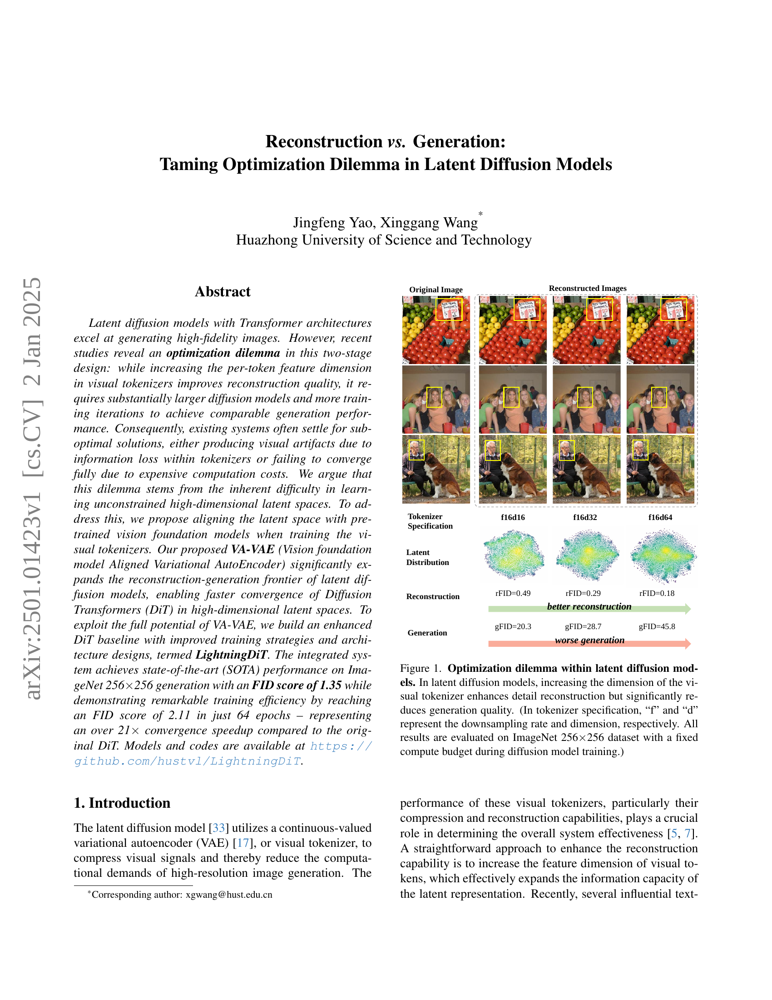
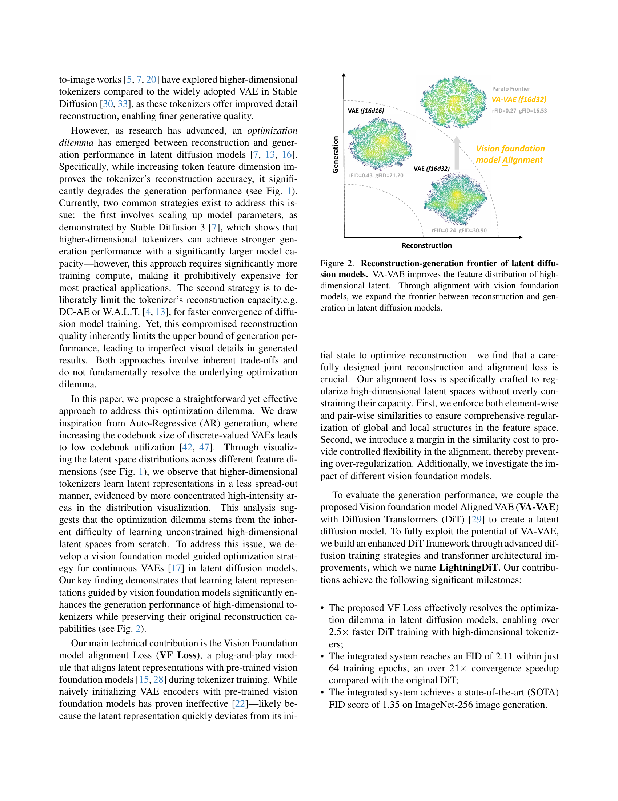
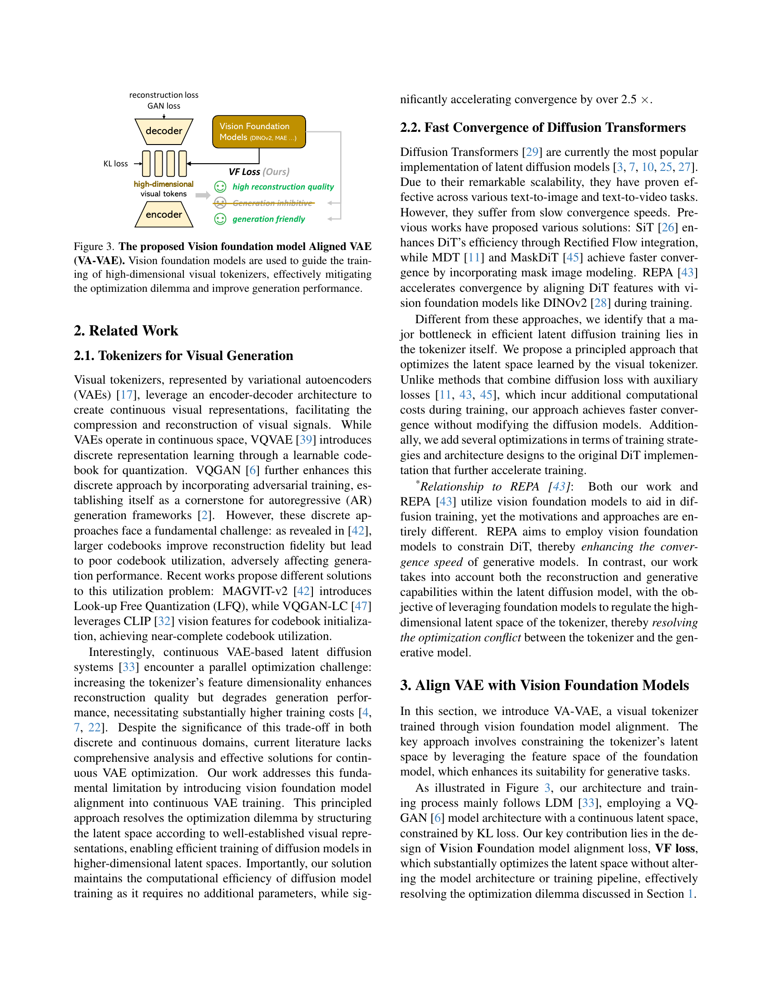
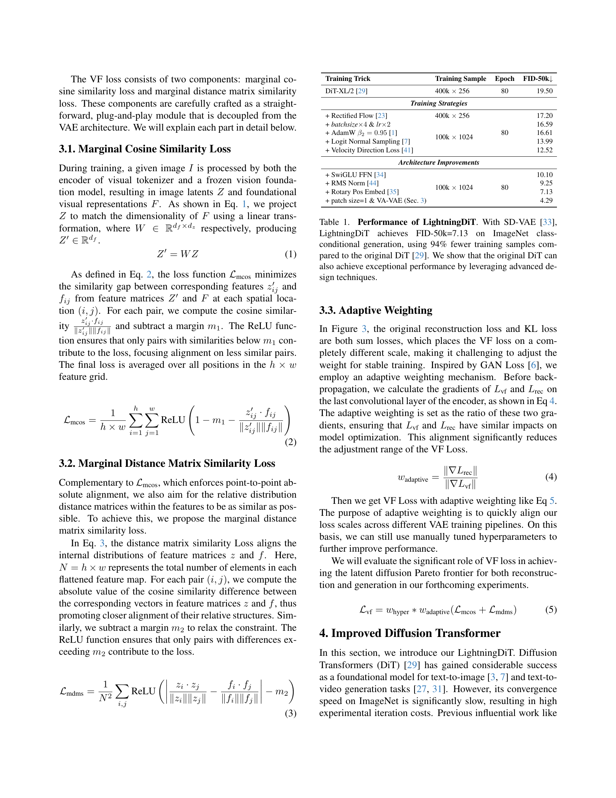
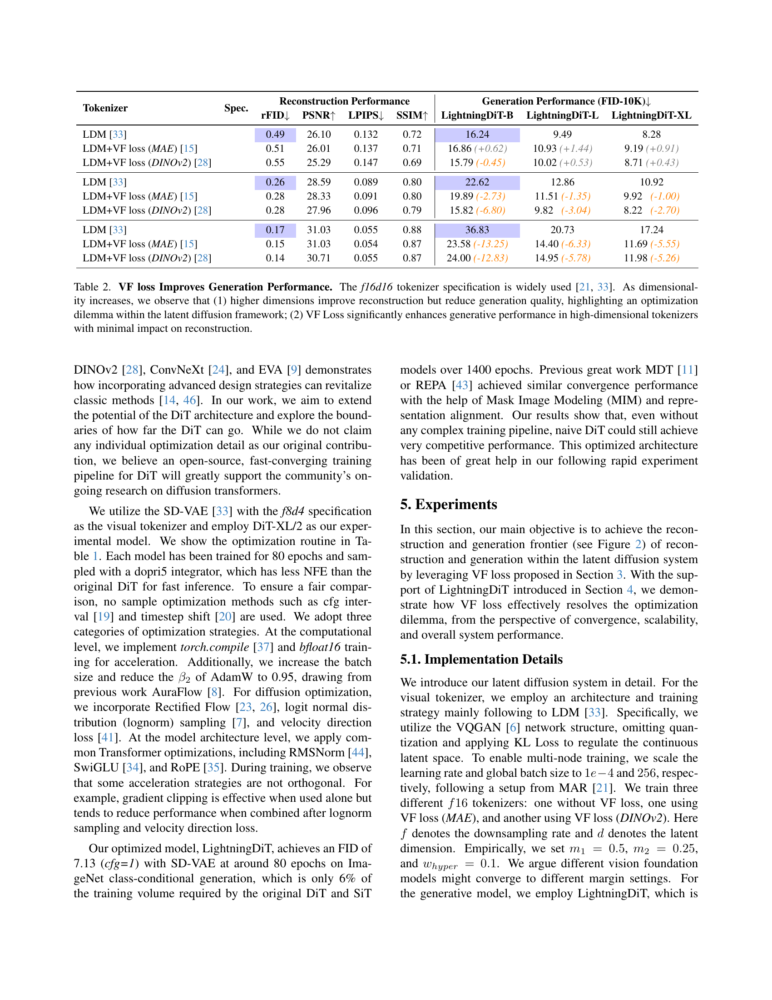
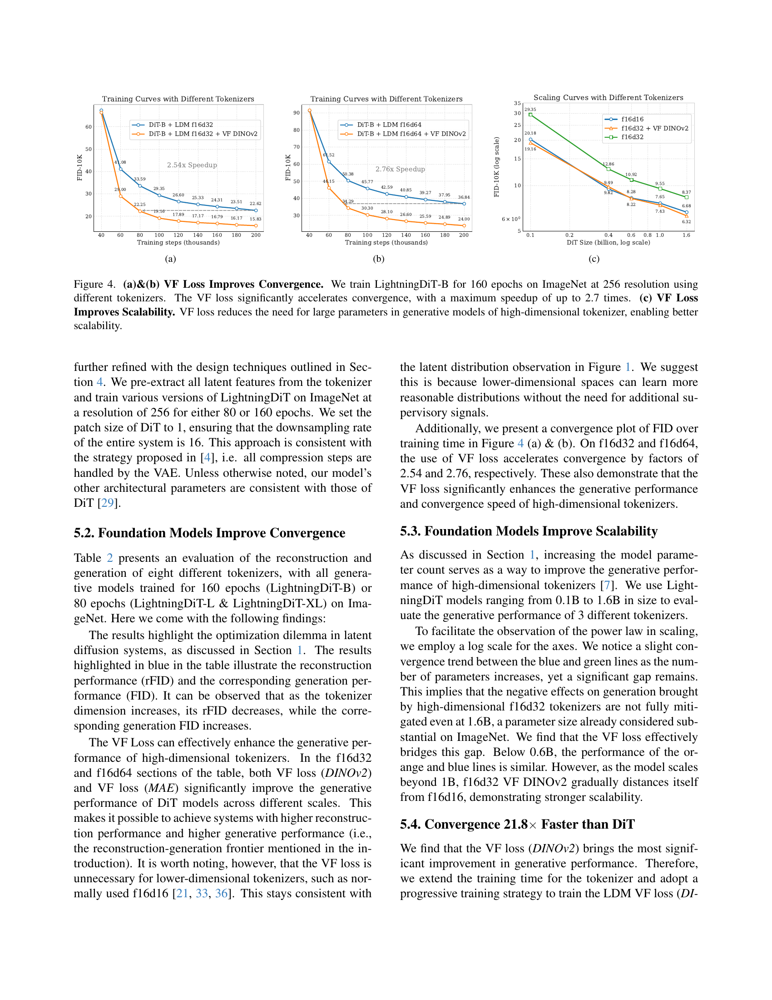
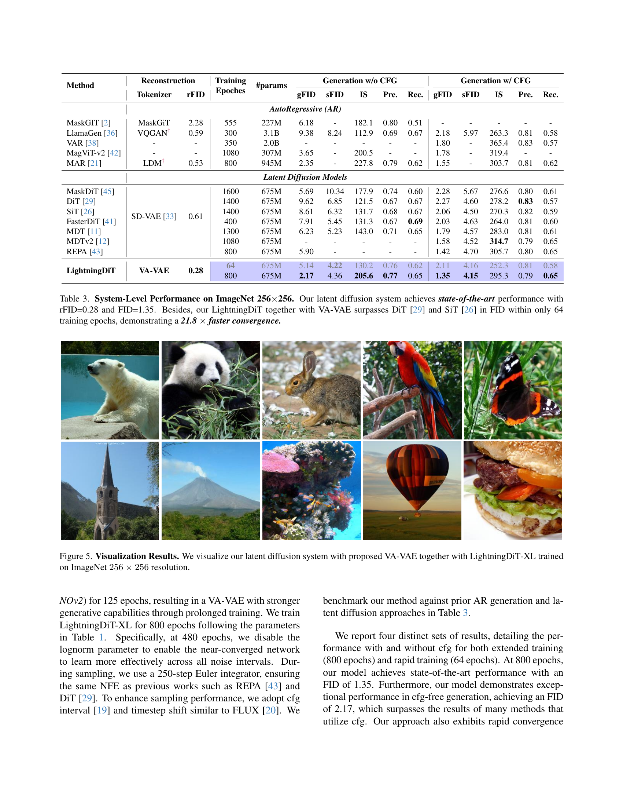
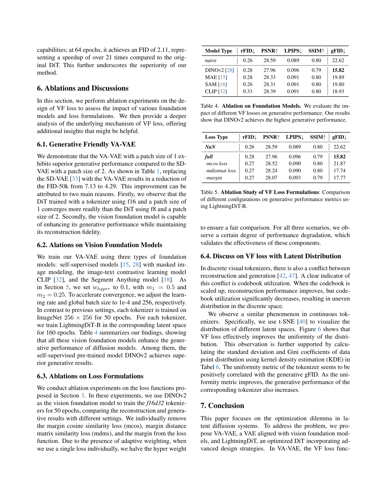
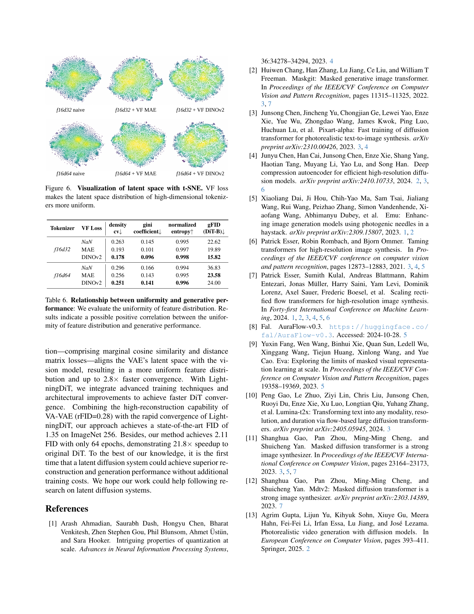
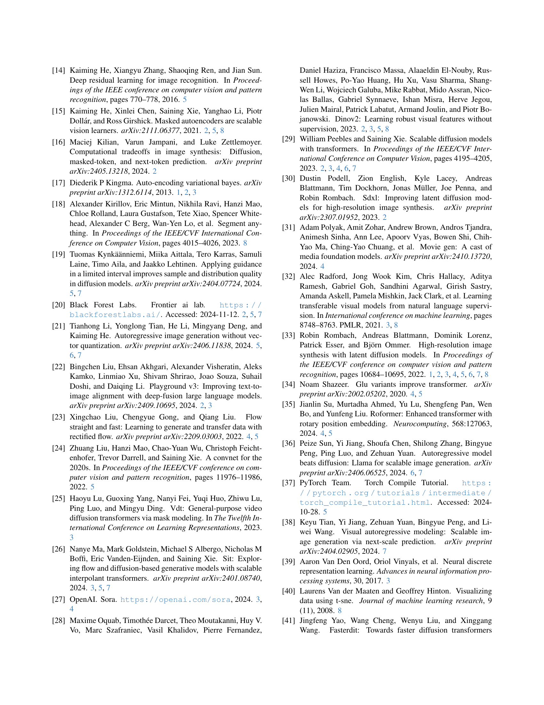
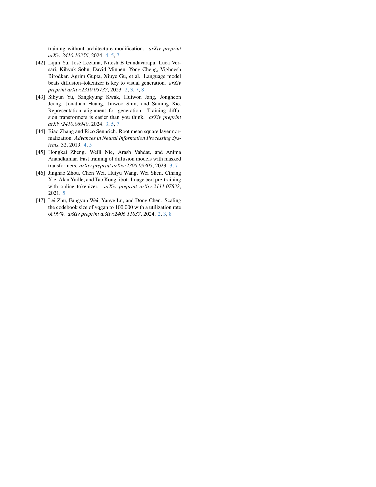
