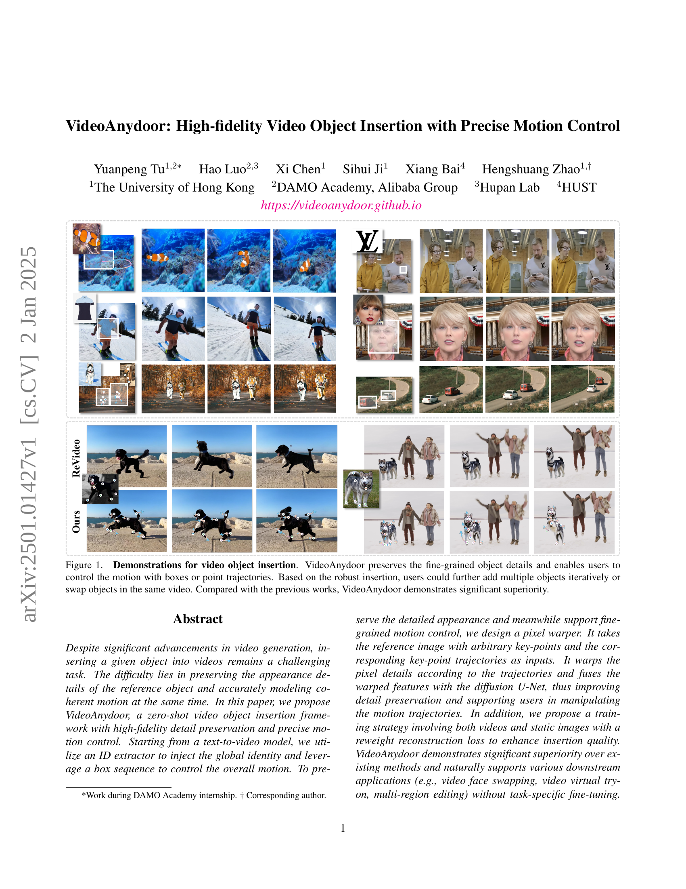
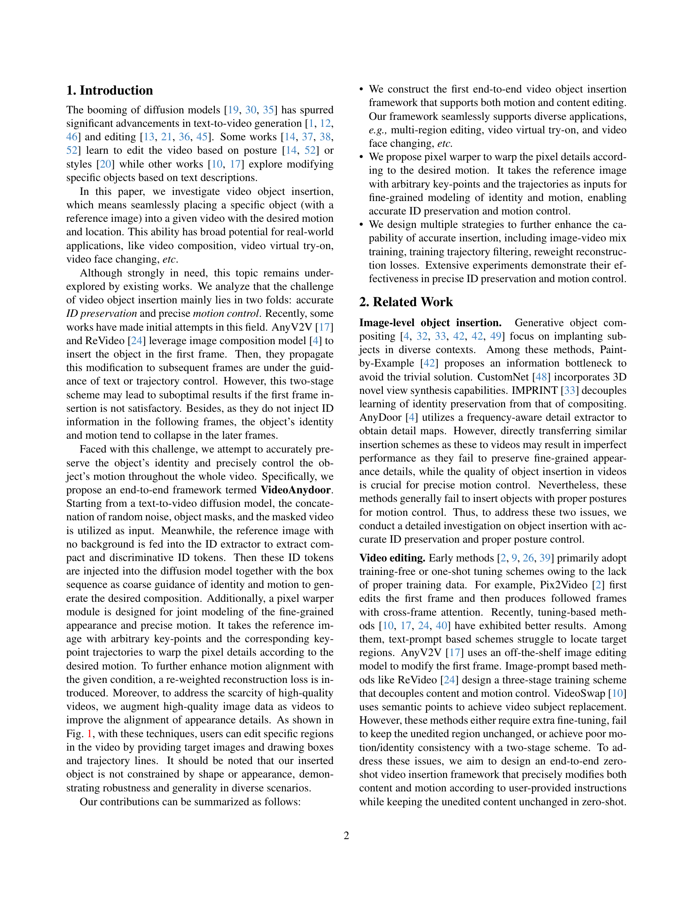
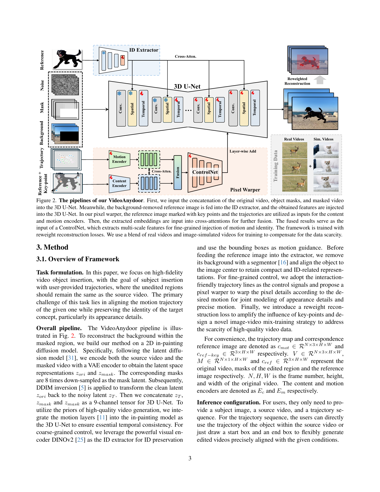
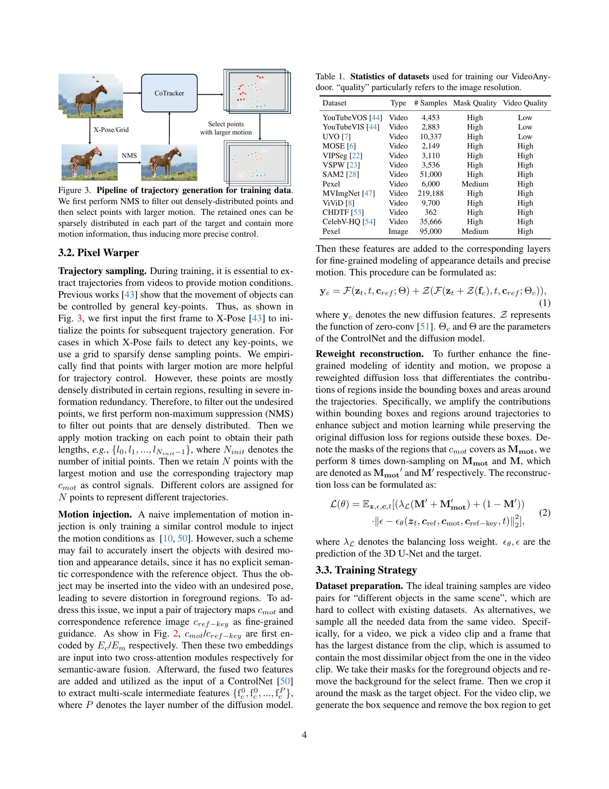
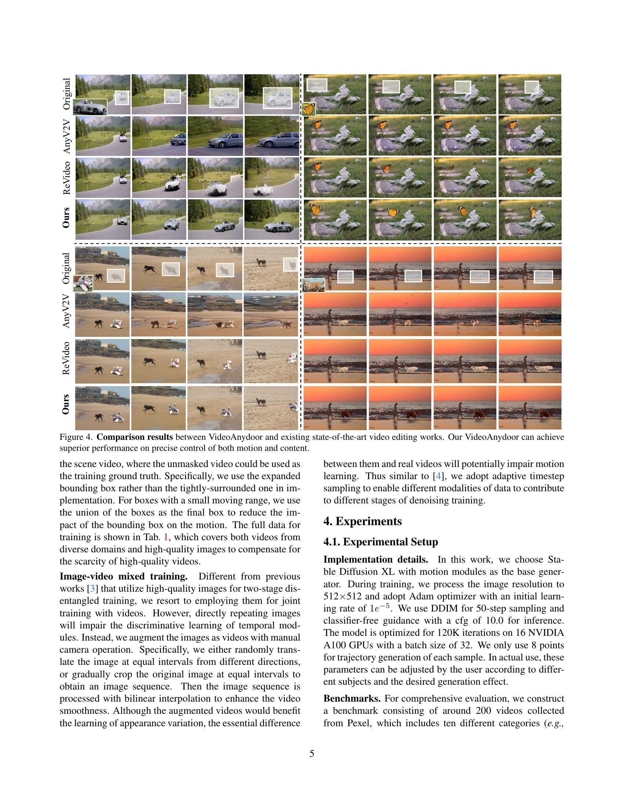
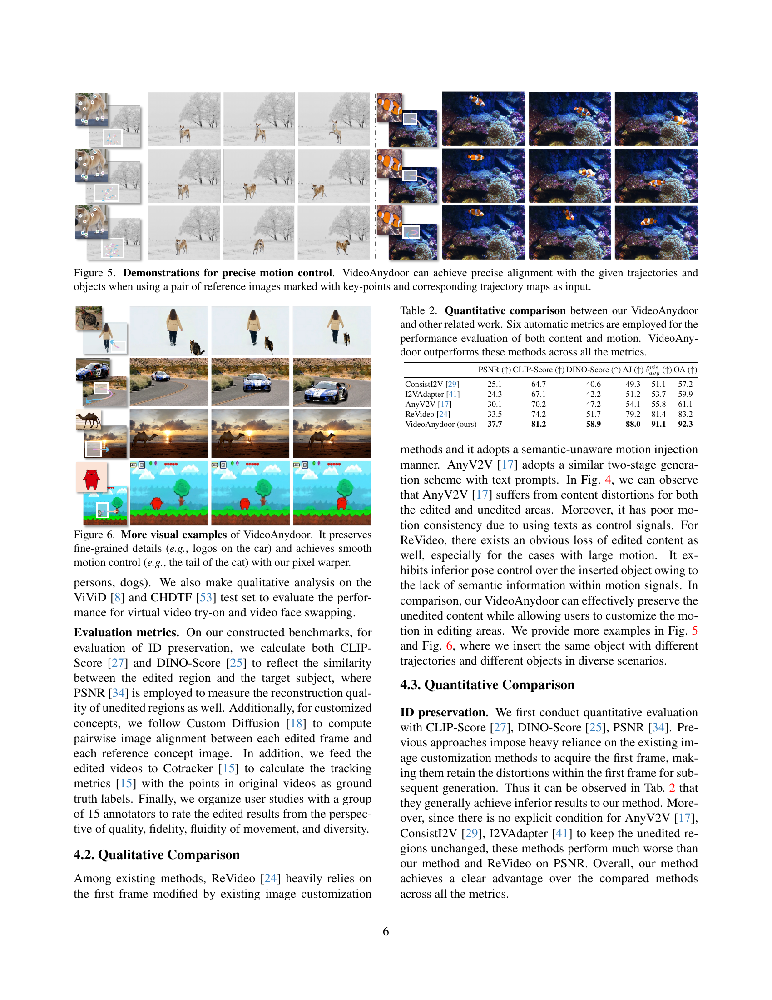
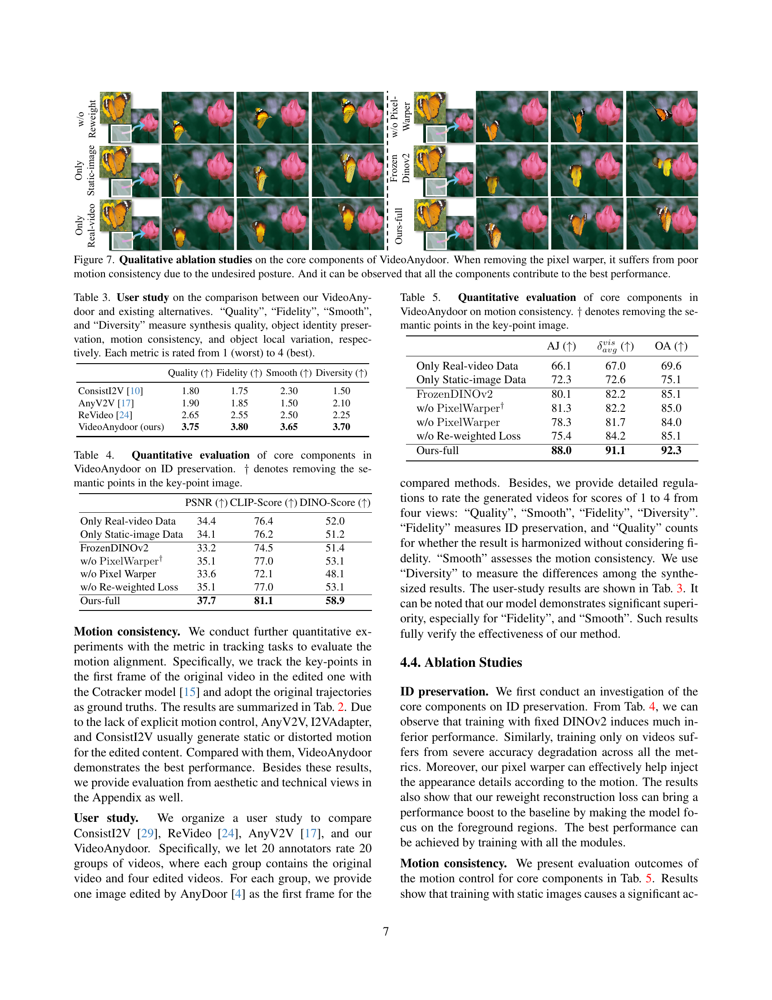
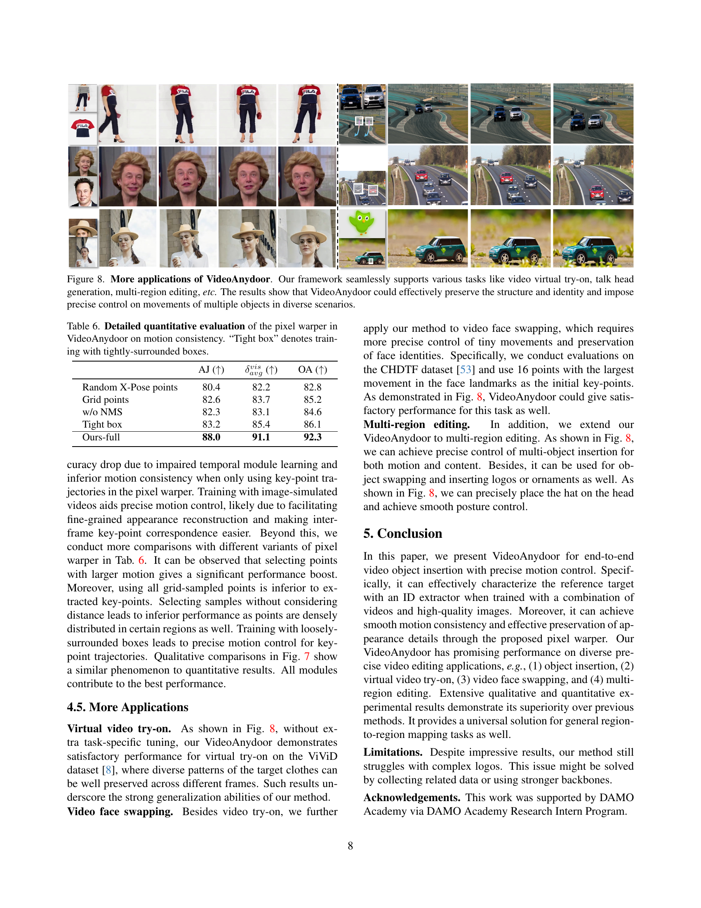
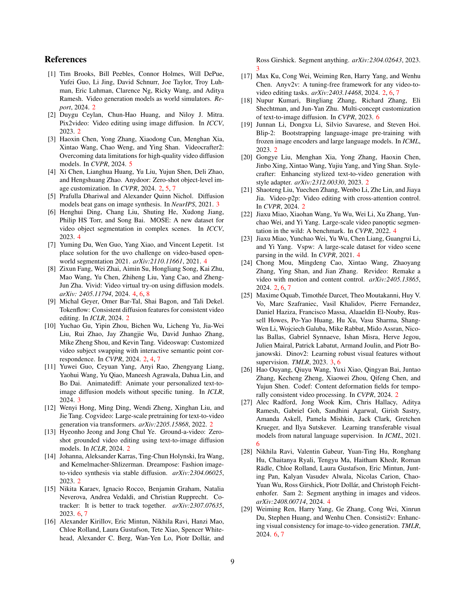
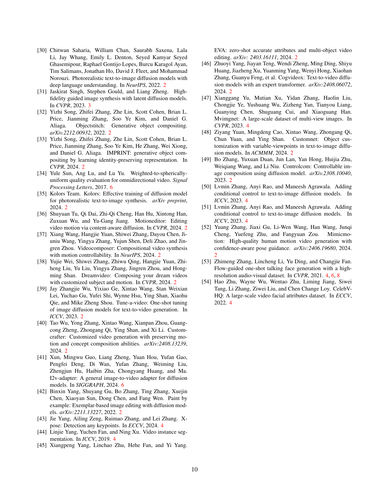

 


 2501.01427 
 Yuanpeng Tu et el. 
 
 🤗 2025-01-03 
 



↗ arXiv


↗ Hugging Face


### TL;DR



기존의 영상 생성 기술은 주어진 객체를 영상에 삽입하는 데 어려움을 겪었습니다. 특히 **객체의 세부적인 모양을 유지**하면서 **자연스러운 움직임**을 구현하는 것이 어려웠습니다. 이는 기존의 2단계 방식(첫 프레임 삽입 후, 움직임 전파)으로 인해 객체의 정체성과 움직임이 후반부로 갈수록 흐릿해지는 문제 때문입니다. 또한, 기존 방식은 **ID 정보를 후속 프레임에 주입하지 않아 객체 식별 및 모션 일관성**이 부족했습니다.

본 논문에서는 이러한 문제를 해결하기 위해 **VideoAnydoor라는 종단 간 영상 객체 삽입 프레임워크**를 제시합니다. 이는 텍스트-투-비디오 모델을 기반으로, **ID 추출기를 사용하여 객체의 고유한 정보를 주입**하고, **박스 시퀀스로 전체적인 움직임을 제어**합니다. 픽셀 워퍼(Pixel Warper)를 통해 **세부적인 모양과 정밀한 움직임을 동시에 모델링**하고, **재가중화 재구성 손실**을 통해 삽입 품질을 높입니다. VideoAnydoor는 기존 방법보다 우수한 성능을 보이며, 영상 얼굴 바꾸기, 가상 피팅 등 다양한 응용 분야에 적용 가능합니다.



#### Key Takeaways


 고품질 영상 객체 삽입을 위한 새로운 종단 간 프레임워크 제시 



 정확한 객체 식별과 정밀한 모션 제어 동시 달성 



 영상 얼굴 바꾸기, 가상 피팅 등 다양한 응용 분야에 적용 가능 


#### Why does it matter?
이 논문은 **영상 객체 삽입 분야의 난제를 해결**하기 위해 **종단 간 학습 프레임워크**를 제시하여, 기존 방법의 한계를 극복하고 **고품질의 영상 편집**을 가능하게 합니다. **정확한 객체 식별 및 정밀한 움직임 제어**를 동시에 달성하여, 영상 편집의 새로운 가능성을 열어줍니다. 특히 **다양한 응용 분야 (가상 피팅, 얼굴 바꾸기 등)**에 적용 가능하여,  향후 연구 방향에 대한 새로운 지평을 제시하며, **영상 편집 기술 발전**에 크게 기여할 것으로 예상됩니다.

------
#### Visual Insights

> 🔼 본 그림은 VideoAnydoor의 비디오 객체 삽입 기능을 보여줍니다. 기존 방법들과 달리 VideoAnydoor는 객체의 세세한 부분까지 보존하면서, 사용자가 박스나 점 궤적을 이용하여 객체의 움직임을 정밀하게 제어할 수 있도록 합니다. 또한, VideoAnydoor는 여러 객체를 반복적으로 추가하거나 동일한 비디오 내에서 객체를 바꿔치기 할 수 있을 만큼 강력한 삽입 기능을 제공합니다.  기존 연구들과 비교했을 때 VideoAnydoor가 훨씬 우수한 성능을 보임을 알 수 있습니다.
> 

> 
read the caption

> Figure 1:  Demonstrations for video object insertion. VideoAnydoor preserves the fine-grained object details and enables users to control the motion with boxes or point trajectories. Based on the robust insertion, users could further add multiple objects iteratively or swap objects in the same video. Compared with the previous works, VideoAnydoor demonstrates significant superiority.
> 


| Dataset | Type | # Samples | Mask Quality | Video Quality |
|---|---|---|---|---|
| YouTubeVOS [44] | Video | 4,453 | High | Low |
| YouTubeVIS [44] | Video | 2,883 | High | Low |
| UVO [7] | Video | 10,337 | High | Low |
| MOSE [6] | Video | 2,149 | High | High |
| VIPSeg [22] | Video | 3,110 | High | High |
| VSPW [23] | Video | 3,536 | High | High |
| SAM2 [28] | Video | 51,000 | High | High |
| Pexel | Video | 6,000 | Medium | High |
| MVImgNet [47] | Video | 219,188 | High | High |
| ViViD [8] | Video | 9,700 | High | High |
| CHDTF [53] | Video | 362 | High | High |
| CelebV-HQ [54] | Video | 35,666 | High | High |
| Pexel | Image | 95,000 | Medium | High |

> 🔼 표 1은 VideoAnydoor 모델 학습에 사용된 데이터셋들의 통계를 보여줍니다.  'quality' 열은 이미지 해상도를 나타냅니다.  각 데이터셋의 종류(비디오 또는 이미지), 데이터 수, 마스크 품질, 비디오 품질(해당하는 경우) 정보를 제공하여 VideoAnydoor 모델 학습에 사용된 데이터의 특징을 자세히 설명합니다. 데이터셋의 다양성과 품질이 모델 성능에 미치는 영향을 이해하는 데 도움이 됩니다.
> 

> 
read the caption

> Table 1: Statistics of datasets used for training our VideoAnydoor. “quality” particularly refers to the image resolution.
> 

### In-depth insights

#### High-Fidelity Insertion
고해상도 삽입(High-Fidelity Insertion)은 비디오 편집 분야에서 매우 중요한 개념입니다. 이는 단순히 객체를 비디오에 삽입하는 것을 넘어, **원본 비디오와의 자연스러운 조화**, **객체의 세밀한 디테일 보존**, 그리고 **정확한 움직임 재현**을 목표로 합니다.  기존의 방법들은 종종 객체의 윤곽선이 부자연스럽거나, 디테일이 손실되거나, 움직임이 어색한 결과를 초래했습니다.  하지만 고해상도 삽입 기술은 **고품질 이미지와 비디오 데이터를 활용**하여 이러한 문제점들을 해결하려고 시도합니다.  **딥러닝 기반의 모델**을 통해 객체의 식별 정보를 정확히 추출하고, **픽셀 단위의 정밀한 변환**을 수행하여 객체의 모양과 질감을 보존합니다. 또한, **움직임 벡터나 궤적 정보**를 활용하여 객체의 움직임을 자연스럽게 재현합니다.  **다양한 손실 함수**를 통해 삽입된 영역과 배경 영역의 시각적 일관성을 확보하고, **훈련 데이터의 다양성**을 확보하여 일반화 성능을 높이는 연구들이 진행되고 있습니다.  결론적으로, 고해상도 삽입은 **실제감 넘치는 비디오 편집**을 가능하게 하는 핵심 기술이며, 앞으로도 지속적인 발전이 기대되는 분야입니다.

#### Precise Motion Control
본 논문에서 '정밀 모션 제어'는 비디오 객체 삽입의 핵심 과제로 제시됩니다. 기존 방법들은 첫 프레임에 객체를 삽입하고 이후 프레임으로 전파하는 방식으로, **모션 일관성 및 정확성이 부족**했습니다. 이에 반해, 본 연구는 **픽셀 워퍼(Pixel Warper)**라는 모듈을 통해 참조 이미지의 키포인트와 궤적을 활용하여 픽셀 단위의 정밀한 모션 제어를 구현합니다.  **키포인트 궤적 추출 및 샘플링**, **모션 주입을 위한 크로스 어텐션 기반 융합**, 그리고 **가중치 재구성 손실(Reweighted Reconstruction Loss)**을 통해 객체의 외형과 모션의 정합성을 높입니다.  **다양한 실험 결과**는 제안된 방법이 기존 기법들보다 우수한 성능을 보임을 입증합니다. 특히, **동작의 부드러움과 정확성**이 뛰어나며, 다양한 다운스트림 애플리케이션에 적용 가능함을 보여줍니다.  이는 단순한 객체 삽입을 넘어, 사용자의 의도에 따라 **자연스럽고 정확한 모션을 구현**하는 핵심 기술로서의 가치를 지닙니다.

#### Pixel Warper's Role
본 논문에서 제시된 픽셀 워퍼(Pixel Warper)의 역할은 **고해상도 비디오 객체 삽입의 정확한 움직임 제어**에 있습니다.  단순히 객체를 비디오에 삽입하는 것을 넘어, **원본 영상의 세밀한 디테일을 유지하면서** 사용자가 지정한 궤적에 따라 객체의 움직임을 정교하게 제어하는 데 핵심적인 역할을 수행합니다.  이는 참조 이미지의 임의의 키포인트와 해당 궤적을 입력받아 픽셀 단위로 변환을 수행하고, 확산 U-Net과의 융합을 통해 디테일 보존과 동작 조작을 향상시키는 방식으로 구현됩니다.  **단순한 움직임 복제를 넘어, 객체의 외형과 움직임을 세밀하게 통합**함으로써 자연스럽고 현실적인 결과물을 생성하는 데 기여합니다.  **특히, 기존의 단순한 두 단계 방식과 달리, 픽셀 워퍼는 객체의 ID 정보를 후속 프레임까지 정확하게 유지**하여 장면 전체에 걸친 일관성을 유지하는데 중요한 역할을 합니다.

#### Training Strategies
본 논문에서 제시된 비디오 객체 삽입 모델의 훈련 전략은 **고품질 데이터 부족 문제**를 해결하기 위해 **실제 비디오와 이미지 데이터를 혼합하여 사용**하는 것을 핵심으로 합니다.  **단순히 이미지를 반복적으로 사용하는 대신, 카메라 조작을 모방하여 이미지를 비디오 시퀀스로 증강**시켜 시간적 일관성을 유지하면서 모델 학습에 도움을 줍니다. 또한, **중요 영역(객체와 궤적 주변)의 기여도를 높이는 가중치 재구성 손실 함수**를 도입하여 객체 식별 및 정확한 모션 제어 성능을 향상시킵니다.  이러한 전략들은 **데이터 효율성을 높이고, 고품질 비디오 객체 삽입 결과**를 얻는 데 기여합니다.  **모션 궤적 생성을 위한 효율적인 샘플링 기법**과 **다양한 하이퍼파라미터 최적화**를 통해 최상의 성능을 달성하는 데 집중합니다.

#### Future Directions
본 논문에서 제시된 VideoAnydoor는 고품질 비디오 객체 삽입 분야에 중요한 발전을 가져왔지만, 여전히 개선의 여지가 있습니다. **미래 연구 방향**으로는 첫째, **더욱 다양하고 복잡한 동작 제어**를 위한 알고리즘 개선이 필요합니다. 현재 모델은 상대적으로 단순한 궤적을 잘 처리하지만, **복잡하고 변화무쌍한 움직임**은 정확하게 재현하는 데 어려움을 보입니다.  둘째, **데이터셋의 확장**이 중요합니다. 현재 사용된 데이터셋은 다양성이 부족하여 모델의 일반화 능력에 제한이 있을 수 있습니다. 다양한 환경, 객체, 동작을 포함하는 대규모 데이터셋을 구축하여 모델의 성능을 향상시켜야 합니다. 셋째, **실시간 처리 성능 향상**을 위한 효율적인 알고리즘 개발이 필요합니다. 현재 모델은 실시간 처리에는 적합하지 않아 실제 응용 분야에 적용하기 어려움이 있습니다. 마지막으로, **다른 비디오 편집 작업**과의 통합에 대한 연구가 필요합니다. 예를 들어, 객체 삽입과 동시에 색상 보정, 해상도 향상, 스타일 전환 등을 수행하는 종합적인 비디오 편집 시스템 개발이 가능합니다.

### More visual insights

More on figures

> 🔼 그림 2는 VideoAnydoor의 구조를 보여줍니다. 원본 비디오, 객체 마스크, 마스크된 비디오의 결합이 3D U-Net에 입력됩니다. 동시에 배경이 제거된 참조 이미지는 ID 추출기에 입력되고, 얻어진 특징들은 3D U-Net에 주입됩니다. 픽셀 워퍼에서는 키포인트와 궤적이 표시된 참조 이미지가 내용과 동작 인코더의 입력으로 사용됩니다. 추출된 임베딩은 교차 어텐션을 통해 추가적인 융합을 거칩니다. 융합된 결과는 ControlNet의 입력으로 사용되며, 이는 동작과 ID의 미세 조정 주입을 위한 다중 스케일 특징을 추출합니다. 이 프레임워크는 가중치 재구성 손실을 통해 학습되며, 데이터 부족을 보완하기 위해 실제 비디오와 이미지로 생성된 비디오를 혼합하여 사용합니다.
> 

> 
read the caption

> Figure 2:  The pipelines of our VideoAnydoor. First, we input the concatenation of the original video, object masks, and masked video into the 3D U-Net. Meanwhile, the background-removed reference image is fed into the ID extractor, and the obtained features are injected into the 3D U-Net. In our pixel warper, the reference image marked with key points and the trajectories are utilized as inputs for the content and motion encoders. Then, the extracted embeddings are input into cross-attentions for further fusion. The fused results serve as the input of a ControlNet, which extracts multi-scale features for fine-grained injection of motion and identity. The framework is trained with reweight reconstruction losses. We use a blend of real videos and image-simulated videos for training to compensate for the data scarcity.
> 

> 🔼 이 그림은 비디오 객체 삽입을 위한 훈련 데이터의 궤적 생성 과정을 보여줍니다. 먼저, 밀집된 점들을 제거하기 위해 NMS(Non-Maximum Suppression)를 수행합니다. 그런 다음, 더 큰 움직임을 가진 점들을 선택합니다.  선택된 점들은 목표 대상의 각 부분에 드물게 분포되어 더 많은 움직임 정보를 포함하게 되므로, 보다 정확한 제어를 가능하게 합니다.  쉽게 말해, 효율적인 훈련 데이터 생성을 위해 불필요한 점들을 제거하고 움직임이 큰 중요한 점들만 추출하는 과정을 시각적으로 보여주는 그림입니다.
> 

> 
read the caption

> Figure 3: Pipeline of trajectory generation for training data. We first perform NMS to filter out densely-distributed points and then select points with larger motion. The retained ones can be sparsely distributed in each part of the target and contain more motion information, thus inducing more precise control.
> 

> 🔼 그림 4는 VideoAnydoor와 기존 최첨단 비디오 편집 방법들을 비교한 결과를 보여줍니다. VideoAnydoor는 동작과 콘텐츠의 정밀한 제어 측면에서 우수한 성능을 달성합니다.  VideoAnydoor는 기존 방법들보다 더욱 정확하고 자연스러운 객체 삽입 및 동작 제어가 가능함을 보여주는 여러 비디오 편집 사례들을 보여줍니다.  각각의 비디오 편집 결과는 원본 비디오와 비교되어 VideoAnydoor의 우수성을 명확하게 보여줍니다. 특히,  세밀한 부분까지 유지하면서 원하는 대로 객체의 움직임을 제어할 수 있는 능력이 강조됩니다.
> 

> 
read the caption

> Figure 4: Comparison results between VideoAnydoor and existing state-of-the-art video editing works. Our VideoAnydoor can achieve superior performance on precise control of both motion and content.
> 

> 🔼 이 그림은 VideoAnydoor 모델의 정밀한 모션 제어 기능을 보여줍니다. 사용자가 키포인트가 표시된 참조 이미지 한 쌍과 해당하는 궤적 지도를 입력으로 사용할 때, VideoAnydoor는 주어진 궤적과 객체에 정확하게 정렬될 수 있음을 보여주는 여러 예시가 포함되어 있습니다.  단순히 객체를 삽입하는 것을 넘어, 사용자가 원하는 정확한 움직임을 구현할 수 있음을 시각적으로 보여줍니다.
> 

> 
read the caption

> Figure 5: Demonstrations for precise motion control. VideoAnydoor can achieve precise alignment with the given trajectories and objects when using a pair of reference images marked with key-points and corresponding trajectory maps as input.
> 

> 🔼 그림 6은 VideoAnydoor의 추가적인 시각적 예시들을 보여줍니다.  이 그림은 VideoAnydoor가 자동차의 로고와 같이 세밀한 부분까지도 보존하면서 고양이의 꼬리처럼 부드러운 움직임을 제어하는 능력을 보여줍니다.  픽셀 워퍼(Pixel Warper) 덕분에 고해상도의 디테일을 유지하면서 동시에 정밀한 모션 제어가 가능함을 확인할 수 있습니다. 이는 단순히 객체를 삽입하는 것을 넘어,  실제 비디오처럼 자연스럽고 사실적인 결과물을 생성한다는 것을 의미합니다.
> 

> 
read the caption

> Figure 6: More visual examples of VideoAnydoor. It preserves fine-grained details (e.g., logos on the car) and achieves smooth motion control (e.g., the tail of the cat) with our pixel warper.
> 

> 🔼 그림 7은 VideoAnydoor의 핵심 구성 요소들에 대한 정성적 ablation study 결과를 보여줍니다. Pixel Warper를 제거하면 원치 않는 자세로 인해 모션 일관성이 저하되는 것을 확인할 수 있습니다. 또한 모든 구성 요소가 최상의 성능에 기여한다는 것을 알 수 있습니다. 이 그림은 VideoAnydoor의 성능에 각 구성요소(3D U-Net, ID 추출기, Pixel Warper, 재가중화된 재구성 손실)들이 얼마나 중요한 역할을 하는지 보여줍니다.  Pixel Warper는 특히 객체의 디테일한 모양과 정확한 움직임을 유지하는 데 필수적임을 알 수 있습니다.  각 구성요소를 제거했을 때 성능이 저하되는 것을 통해, VideoAnydoor의 성능은 여러 구성요소가 상호작용하여 만들어낸 결과임을 시각적으로 보여줍니다.
> 

> 
read the caption

> Figure 7: Qualitative ablation studies on the core components of VideoAnydoor. When removing the pixel warper, it suffers from poor motion consistency due to the undesired posture. And it can be observed that all the components contribute to the best performance.
> 

More on tables


| Method | PSNR () | CLIP-Score () | DINO-Score () | AJ () |  () | OA () |
|---|---|---|---|---|---|---|
| ConsistI2V [29] | 25.1 | 64.7 | 40.6 | 49.3 | 51.1 | 57.2 |
| I2VAdapter [41] | 24.3 | 67.1 | 42.2 | 51.2 | 53.7 | 59.9 |
| AnyV2V [17] | 30.1 | 70.2 | 47.2 | 54.1 | 55.8 | 61.1 |
| ReVideo [24] | 33.5 | 74.2 | 51.7 | 79.2 | 81.4 | 83.2 |
| VideoAnydoor (ours) | **37.7** | **81.2** | **58.9** | **88.0** | **91.1** | **92.3** |
> 🔼 표 2는 본 논문에서 제안하는 VideoAnydoor와 기존의 다른 연구 결과들을 정량적으로 비교 분석한 표입니다.  영상 콘텐츠와 움직임 모두에 대한 성능 평가를 위해 6가지 자동화된 지표를 사용했습니다.  결과적으로 VideoAnydoor가 모든 지표에서 다른 방법들을 능가하는 우수한 성능을 보임을 보여줍니다.
> 

> 
read the caption

> Table 2: Quantitative comparison between our VideoAnydoor and other related work. Six automatic metrics are employed for the performance evaluation of both content and motion. VideoAnydoor outperforms these methods across all the metrics.
> 


| Method | Quality (↑) | Fidelity (↑) | Smooth (↑) | Diversity (↑) |
|---|---|---|---|---|
| ConsistI2V [10] | 1.80 | 1.75 | 2.30 | 1.50 |
| AnyV2V [17] | 1.90 | 1.85 | 1.50 | 2.10 |
| ReVideo [24] | 2.65 | 2.55 | 2.50 | 2.25 |
| VideoAnydoor (ours) | **3.75** | **3.80** | **3.65** | **3.70** |
> 🔼 표 3은 제안된 VideoAnydoor 모델과 기존 방법들의 비교를 위한 사용자 연구 결과를 보여줍니다.  '품질', '충실도', '부드러움', '다양성' 이라는 네 가지 지표를 사용하여 합성 품질, 객체 정체성 보존, 동작 일관성, 객체의 국지적 변화를 각각 평가했습니다. 각 지표는 1(최악)에서 4(최고)까지의 등급으로 평가되었습니다. 이 표는 VideoAnydoor의 성능을 정량적으로 비교 분석하는 데 도움이 되는 정보를 제공합니다.
> 

> 
read the caption

> Table 3: User study on the comparison between our VideoAnydoor and existing alternatives. “Quality”, “Fidelity”, “Smooth”, and “Diversity” measure synthesis quality, object identity preservation, motion consistency, and object local variation, respectively. Each metric is rated from 1 (worst) to 4 (best).
> 


| Method                     | PSNR (↑) | CLIP-Score (↑) | DINO-Score (↑) |
|------------------------------|----------|-----------------|-----------------|
| Only Real-video Data         | 34.4     | 76.4            | 52.0             |
| Only Static-image Data       | 34.1     | 76.2            | 51.2             |
| FrozenDINOv2                | 33.2     | 74.5            | 51.4             |
| w/o PixelWarper† | 35.1     | 77.0            | 53.1             |
| w/o Pixel Warper           | 33.6     | 72.1            | 48.1             |
| w/o Re-weighted Loss        | 35.1     | 77.0            | 53.1             |
| Ours-full                   | **37.7** | **81.1**       | **58.9**        |
> 🔼 표 4는 VideoAnydoor의 핵심 구성 요소들이 얼마나 정확하게 객체의 ID를 보존하는지 정량적으로 평가한 결과를 보여줍니다.  표에는 실제 비디오 데이터만 사용한 경우, 정지 이미지 데이터만 사용한 경우, DINOv2를 고정시킨 경우, 픽셀 워퍼를 제거한 경우, 가중치 재구성 손실을 제거한 경우, 그리고 VideoAnydoor의 전체 시스템을 사용한 경우 등 다양한 설정에 따른 PSNR, CLIP 점수, DINO 점수를 비교 분석하여 각 구성 요소의 기여도를 보여줍니다. † 기호는 키포인트 이미지에서 의미론적 점들을 제거한 경우를 나타냅니다.
> 

> 
read the caption

> Table 4: Quantitative evaluation of core components in VideoAnydoor on ID preservation. ††\dagger† denotes removing the semantic points in the key-point image.
> 


| Method | AJ () |  () | OA () |
|---|---|---|---|
| Only Real-video Data | 66.1 | 67.0 | 69.6 |
| Only Static-image Data | 72.3 | 72.6 | 75.1 |
|  | 80.1 | 82.2 | 85.1 |
| w/o † | 81.3 | 82.2 | 85.0 |
| w/o  | 78.3 | 81.7 | 84.0 |
| w/o Re-weighted Loss | 75.4 | 84.2 | 85.1 |
| Ours-full | **88.0** | **91.1** | **92.3** |
> 🔼 표 5는 VideoAnydoor의 핵심 구성 요소들이 동작 일관성에 미치는 영향을 정량적으로 평가한 결과를 보여줍니다.  특히,  키포인트 이미지에서 의미론적 점들을 제거했을 때의 결과도 함께 제시합니다.  표에는 다양한 실험 설정(실제 비디오 데이터만 사용, 정적 이미지 데이터만 사용,  Pixel Warper 사용 여부, 재가중 손실 함수 사용 여부 등)에 따른 동작 일관성 지표(AJ, Svis, OA)의 수치가 포함되어 있습니다. 이를 통해 각 구성 요소가 VideoAnydoor의 성능에 얼마나 기여하는지,  특히 의미론적 점의 중요성을 정량적으로 확인할 수 있습니다.
> 

> 
read the caption

> Table 5: Quantitative evaluation of core components in VideoAnydoor on motion consistency. ††\dagger† denotes removing the semantic points in the key-point image.
> 


| Method | AJ () | <math display="inline">{"

δ}_{avg}^{vis}</math> () | OA () |
|---|---|---|---|
| Random X-Pose points | 80.4 | 82.2 | 82.8 |
| Grid points | 82.6 | 83.7 | 85.2 |
| w/o NMS | 82.3 | 83.1 | 84.6 |
| Tight box | 83.2 | 85.4 | 86.1 |
| Ours-full | **88.0** | **91.1** | **92.3** |
> 🔼 표 6은 VideoAnydoor의 픽셀 워퍼에 대한 동작 일관성에 대한 자세한 정량적 평가를 보여줍니다. 이 표는 다양한 설정(임의의 X-Pose 점, 그리드 점, NMS 없음, 꽉 끼는 상자, 전체 모델) 하에서 평균 정확도(OA), 평균 교차 연관(AJ), 평균 스킵 거리(dvis)와 같은 지표들을 사용하여 픽셀 워퍼의 성능을 다각적으로 평가합니다. 특히, '꽉 끼는 상자'는 훈련 과정에서 객체를 매우 좁게 감싸는 상자를 사용했음을 의미하며, 이를 통해 동작 일관성에 미치는 영향을 분석합니다. 각 설정별 성능 지표의 수치는 VideoAnydoor의 픽셀 워퍼 성능을 정량적으로 비교하고 분석하는 데 활용됩니다.
> 

> 
read the caption

> Table 6: Detailed quantitative evaluation of the pixel warper in VideoAnydoor on motion consistency. “Tight box” denotes training with tightly-surrounded boxes.
> 

### Full paper



