 


 2501.01957 
 Chaoyou Fu et el. 
 
 🤗 2025-01-06 
 



↗ arXiv


↗ Hugging Face


↗ Papers with Code


### TL;DR



최근 다중 모달 대규모 언어 모델(MLLM)은 주로 시각 및 텍스트 모달리티 통합에 초점을 맞추고 음성의 역할은 상대적으로 간과해 왔습니다. 그러나 음성은 다중 모달 대화 시스템에서 중요한 역할을 하며, 시각 및 음성 작업 모두에서 고성능을 구현하는 것은 모달 간의 근본적인 차이점으로 인해 여전히 큰 과제입니다.

본 논문에서는 시각 및 음성 정보를 점진적으로 학습하는 다단계 훈련 방법론을 제시합니다. 제안된 방법론은 강력한 시각-언어 능력을 유지하면서 효율적인 음성-음성 대화 기능을 가능하게 하며, 별도의 ASR 및 TTS 모듈 없이 다중 모달 종단 간 응답 속도를 크게 향상시킵니다. 이미지, 비디오, 음성 작업에 대한 벤치마크에서 제안된 방법의 성능을 비교 분석하여, 제안된 모델이 실시간 시각-음성 상호작용을 가능하게 하는 강력한 시각 및 음성 기능을 갖추고 있음을 보여줍니다.



#### Key Takeaways


 VITA-1.5는 시각과 음성 정보를 효율적으로 통합하여 실시간 다중 모달 상호작용을 가능하게 합니다. 



 별도의 ASR 및 TTS 모듈 없이 효율적인 음성-음성 대화 기능을 제공합니다. 



 이미지, 비디오, 음성 작업에서 최첨단 성능을 달성했습니다. 


#### Why does it matter?
이 논문은 **실시간 시각 및 음성 상호작용**을 위한 혁신적인 다중 모달 LLM인 VITA-1.5를 제시하여, 기존의 **제한적인 시각-언어 모델**의 한계를 뛰어넘는 연구입니다.  **음성 처리 모듈을 통합**하여 보다 자연스럽고 효율적인 상호작용을 가능하게 함으로써, **인간-컴퓨터 상호작용 분야**에 큰 영향을 미칠 것으로 예상됩니다. 또한, 본 연구는 **개방형 소스로 공개**되어 향후 연구에 널리 활용될 수 있으며,  다양한 **다중 모달 작업**에 대한 새로운 연구 방향을 제시할 것입니다.

------
#### Visual Insights

> 🔼 그림 1은 VITA-1.5 모델이 엔드-투-엔드 프레임워크를 통해 실시간에 가까운 비전 및 음성 상호작용을 가능하게 함을 보여줍니다. 카메라를 켜고 자유로운 음성 대화를 할 수 있습니다.  이미지는 사용자가 현대적인 라운지나 회의실에 있는 것처럼 보이는 장면을 보여주고 있으며, 스마트폰 화면에는 VITA-1.5 데모가 실행되는 모습이 나타나 있습니다.  YouTube 링크를 통해 데모 영상을 확인할 수 있습니다. 이 그림은 VITA-1.5의 실시간 상호 작용 기능을 강조하며, 논문의 핵심 기능을 시각적으로 보여줍니다.
> 

> 
read the caption

> Figure 1: VITA-1.5 enables near real-time vision and speech interaction via an end-to-end framework. It allows you to turn on the camera and have a fluent speech conversation. Please see our demo video at this YouTube link.
> 


| Data Scenario | QA Type | Dataset Name | Questions (K) | Language |
|---|---|---|---|---|
| General Image | Description | ShareGPT4V | 99.50 | Eng |
|  |  | ALLaVA-Caption | 697.40 | Eng |
|  |  | ShareGTP4o-Image | 55.50 | Eng |
|  |  | Synthetic Data | 593.70 | CN |
|  | QA | LLaVA-150K | 218.36 | CN |
|  |  | LLaVA-Mixture-sample | 1872.10 | Eng |
|  |  | LVIS-Instruct | 939.36 | Eng |
|  |  | ScienceQA | 12.72 | Eng |
|  |  | ChatQA | 7.39 | Eng |
|  |  | LLaVA-OV General | 1754.65 | Eng |
|  |  | LLaVA-OV Math Reasoning | 1140.92 | Eng |
|  |  | Synthetic Data | 212.68 | CN |
| OCR & Diagram | Description | Anyword-3M | 1709.30 | CN |
|  |  | ICDAR2019-LSVT | 366.30 | CN |
|  |  | UReader | 100.00 | Eng |
|  |  | SynDOG-EN | 100.00 | Eng |
|  |  | SynDOG-CN | 101.90 | CN |
|  | QA | ICDAR2019-LSVT-QA | 630.08 | CN |
|  |  | LLaVA-OV Doc Chart Screen | 4431.50 | Eng |
|  |  | LLaVA-OV General OCR | 404.20 | Eng |
| General Video | Description | ShareGemini | 205.70 | CN |
|  |  | Synthetic Data | 569.40 | CN & Eng |
|  | QA | Synthetic Data | 4336.30 | CN & Eng |
| Pure Text | QA | Synthetic Data | 1574.20 | CN & Eng |
| Total |  |  | 22133.16 | CN & Eng |

> 🔼 표 1은 다중 모드 지시 조정을 위한 훈련 데이터를 보여줍니다. 이 표에는 이미지 캡션 데이터, 이미지 질의응답 데이터, OCR 및 다이어그램 데이터, 비디오 데이터, 순수 텍스트 데이터 등 다양한 유형의 데이터가 포함되어 있습니다. 합성 데이터의 이미지는 Wukong [19], LAION [46], CC12M [5]과 같은 오픈소스 데이터셋에서 가져왔습니다. 각 데이터 유형에 대한 자세한 설명과 사용된 데이터셋, 질문 수, 언어 등의 정보가 포함되어 있습니다.
> 

> 
read the caption

> Table 1: Training data of multimodal instruction tuning. The images of the synthetic data come from open-source datasets like Wukong [19], LAION [46], and CC12M [5].
> 

### In-depth insights

#### Multimodal LLM
본 논문은 **멀티모달 LLM**의 발전에 중점을 두고 있으며, 특히 **시각 및 음성 정보 통합**에 대한 어려움과 그 해결책을 제시합니다. 기존의 멀티모달 LLM은 주로 시각 및 텍스트 정보에 초점을 맞추었지만, **음성의 중요성**을 간과하는 경향이 있었습니다.  본 연구는 시각과 음성 정보 모두를 효과적으로 처리하는 **다단계 훈련 방법론**을 제시하여, **실시간 시각-음성 상호 작용**을 가능하게 합니다.  이는 별도의 ASR 및 TTS 모듈 없이 효율적인 음성-음성 대화 기능을 가능하게 하여, **모델의 응답 속도를 크게 향상**시킨다는 점에서 중요한 의의를 지닙니다.  **비교 실험**을 통해 제시된 방법이 이미지, 비디오, 음성 작업에서 우수한 성능을 보임을 확인하였으며, **실시간 상호 작용에 근접한 성능**을 달성했습니다.  **오픈소스 모델**로서의 접근성 또한 강조되고 있습니다.

#### Three-Stage Training
본 논문에서 제안하는 3단계 학습 전략은 **시각, 언어, 그리고 음성 정보를 점진적으로 통합**하여 모델의 다중 모드 이해 능력을 향상시키는 데 중점을 둡니다. 1단계에서는 시각-언어 학습에 집중하여 모델의 기본적인 시각적 이해 능력을 확립합니다. 2단계에서는 음성 정보를 추가하여 시각-언어 능력을 유지하면서 음성 이해 능력을 향상시킵니다. 마지막 3단계에서는 **종단 간 음성 출력 모듈을 훈련**하여 자연스러운 다중 모드 대화를 가능하게 합니다. 이러한 **점진적인 접근 방식**은 모드 간의 충돌을 완화하고 각 모드의 강점을 유지하는 데 효과적입니다.  **각 단계의 목표는 명확하며, 데이터 활용 전략 또한 단계별로 세분화**되어 있어 효율적인 학습을 가능하게 합니다.  결과적으로, 이러한 3단계 학습 전략은 **실시간 시각-음성 상호작용**을 가능하게 하는 강력하고 효율적인 다중 모드 모델을 구축하는 데 중요한 역할을 합니다.

#### Speech Generation
본 논문에서는 음성 생성에 대한 심층적인 논의가 부족하지만, **VITA-1.5 모델이 외부 TTS(Text-to-Speech) 모듈 없이도 종단 간(end-to-end) 방식으로 음성을 생성**한다는 점이 중요합니다.  이는 기존의 ASR(Automatic Speech Recognition)과 TTS 모듈을 사용하는 방식에 비해 **실시간 상호작용에 유리**하며, **지연 시간을 줄이고 응답의 일관성을 높이는 데 기여**할 것으로 예상됩니다.  **TiCodec이라는 코덱 모델을 활용하여 연속적인 음성 신호를 불연속적인 토큰으로 인코딩하고 디코딩**하는 과정이 핵심이며,  **NAR(Non-Autoregressive) 및 AR(Autoregressive) 두 개의 음성 디코더를 사용하여 음성 품질을 향상**시킨 점 또한 주목할 만합니다.  **다만, 실제 음성 생성 품질 및 속도에 대한 구체적인 평가 결과는 제시되지 않아** 추가적인 분석이 필요하며,  **향후 연구에서는 다양한 음성 데이터셋을 활용하여 음성 생성 품질 개선 및 실시간 성능 향상에 대한 추가적인 연구**가 진행되어야 할 것입니다.

#### Benchmarking
본 논문에서는 제시된 모델의 성능을 평가하기 위해 다양한 벤치마킹을 수행하였습니다. **이미지 이해**, **비디오 이해**, 그리고 **음성 인식** 세 가지 주요 영역에서 벤치마크를 진행하여 **최첨단 오픈소스 및 상용 모델**과의 비교 분석을 통해 성능을 검증하였습니다.  특히, **다양한 벤치마크 데이터셋**을 사용하여 모델의 강점과 약점을 면밀히 분석하였으며, **다중 모달리티 상호작용** 측면에서의 성능을 집중적으로 평가하였습니다. **실시간 상호작용** 성능을 중시하였기에, 처리 속도 또한 중요한 평가 지표였습니다.  결과적으로 제시된 모델은 특히 음성 처리 부분에서 기존 모델을 능가하는 성능을 보였고, 비디오 처리에서도 경쟁력 있는 성능을 보임으로써, **실시간 다중 모달리티 상호작용** 시스템 구축에 대한 가능성을 입증하였습니다.  하지만, 여전히 일부 벤치마크에서 상용 모델에 비해 성능 차이를 보이는 만큼, **향후 연구**를 통해 성능 개선을 위한 방향을 제시해야 할 것입니다.

#### Future of VITA
VITA-1.5의 미래는 **실시간 다중 모달 상호 작용의 핵심 기술**로서의 가능성에 달려 있습니다.  **비전, 언어, 그리고 음성의 통합된 이해**를 향상시키는 연구는 더욱 매끄럽고 자연스러운 인간-컴퓨터 상호작용을 가능하게 할 것입니다.  **개방형 소스 모델로서의 VITA의 접근성**은 더 많은 연구자들의 참여를 유도하여 기술 발전에 기여할 수 있습니다.  향후 연구는 **더욱 다양하고 복잡한 다중 모달 데이터**에 대한 적응력을 높이고, **모델의 효율성과 추론 속도**를 개선하는 데 집중해야 합니다.  **사용자 경험을 향상**시킬 수 있는 새로운 응용 프로그램을 개발하고, **윤리적 고려 사항**을 충분히 반영하여 기술의 안전하고 책임있는 사용을 보장하는 것이 중요합니다.  궁극적으로 VITA는 **실시간 다중 모달 소통의 표준**이 될 가능성을 가지고 있으며, 이를 위해서는 지속적인 기술 발전과 사회적 책임 의식이 필요합니다.

### More visual insights

More on figures

> 🔼 그림 2는 VITA-1.5의 전체 아키텍처를 보여줍니다. 입력 부분은 비전 및 오디오 인코더와 LLM에 연결된 어댑터로 구성됩니다. 출력 부분은 초기 VITA-1.0 버전[16]과 달리 외부 TTS 모델을 직접 사용하지 않고 엔드투엔드 방식의 음성 생성 모듈을 가지고 있습니다.  VITA-1.5는 비전과 오디오 정보를 통합하여 이해하고, 자연스러운 음성으로 응답하는 다중 모달 LLM입니다.  비전 인코더는 이미지 또는 비디오를 처리하고, 어댑터는 LLM이 이해할 수 있도록 특징을 변환합니다. 오디오 인코더는 음성을 처리하고, 마찬가지로 어댑터를 통해 LLM에 전달됩니다.  LLM은 비전 및 오디오 정보를 통합하여 텍스트와 음성을 생성합니다.  음성 생성은 엔드투엔드 방식으로 이루어지므로, 별도의 TTS 시스템이 필요하지 않아 실시간 상호 작용에 유리합니다.
> 

> 
read the caption

> Figure 2: Overall Architecture of VITA-1.5. The input side consists of vision and audio encoders, along with their adapters connected to a LLM. The output side has an end-to-end speech generation module, rather than directly using an external TTS model as the initial VITA-1.0 version [16].
> 

> 🔼 VITA-1.5의 학습 파이프라인을 보여주는 그림입니다. 그림에는 세 가지 단계로 나뉘어져 있는데, 각 단계는 시각 및 음성 정보를 LLM에 점진적으로 통합하는 과정을 보여줍니다. 1단계는 시각-언어 학습에 중점을 두고, 시각 정렬(1.1단계, 표 1의 캡션 데이터 20% 사용), 시각 이해(1.2단계, 캡션 데이터 100% 사용), 시각 QA에 대한 지시 조정(1.3단계, 캡션 데이터 20%와 QA 데이터 100% 사용)을 포함합니다. 2단계는 음성 입력 조정을 도입하여 음성 정렬(2.1단계, 11,000시간의 음성-전사 쌍 사용)과 음성 QA에 대한 지시 조정(2.2단계, 캡션 데이터 4%와 QA 데이터 20% 샘플링)을 수행합니다. 마지막으로 3단계는 코덱 모델 학습(3.1단계, 3,000시간의 텍스트-음성 데이터 사용)과 음성 디코더 학습(3.2단계)을 포함한 음성 출력 조정에 중점을 둡니다. 그림에 표시된 백분율은 표 1에 지정된 데이터 샘플링 비율과 일치합니다.
> 

> 
read the caption

> Figure 3: Training Pipeline of VITA-1.5. The training process is divided into three stages to incrementally incorporate vision and audio into the LLM while relieving modality conflicts. Stage I focuses on Vision-Language Training, including vision alignment (Stage 1.1, using 20% caption data from Table 1), vision understanding (Stage 1.2, using 100% caption data), and instruction tuning for visual QA (Stage 1.3, using 20% caption data and 100% QA data). Stage 2 introduces Audio Input Tuning, with audio alignment (Stage 2.1, utilizing 11,000 hours of speech-transcription pairs) and instruction tuning for speech QA (Stage 2.2, sampling 4% caption data and 20% QA data). Finally, Stage 3 focuses on Audio Output Tuning, including the training of the codec model (Stage 3.1, using 3,000 hours of text-speech data) and speech decoder training (Stage 3.2). The percentages shown in the image correspond to the data sampling ratios specified in Table 1.
> 

More on tables


| Questions (K) |
|---|---|
> 🔼 표 2는 이미지 이해 벤치마크에 대한 평가 결과를 보여줍니다. VITA-1.5의 성능은 최고 수준의 오픈소스 모델 및 고급 클로즈드소스 모델과 유사합니다.  MMB는 MMBench, MMS는 MMStar, Hal은 HallusionBench, MathV는 MathVista, OCR은 OCRBench를 의미합니다.  2단계(오디오 입력 조정)와 3단계(오디오 출력 조정) 학습 후에도 VITA-1.5는 1단계(비전-언어 학습)의 원래 시각-언어 기능을 거의 그대로 유지합니다. 표에는 다양한 이미지 이해 벤치마크(MMBench, MMStar, MM-MU, MathVista, HallucinationBench, AI-2D, OCRBench 등)에서의 VITA-1.5와 다른 주요 모델들의 성능을 비교하여 제시합니다. 각 벤치마크 점수를 통해 VITA-1.5의 이미지 이해 능력을 정량적으로 평가하고 다른 모델들과의 성능 차이를 명확하게 보여줍니다. 특히 오디오 관련 단계 학습 후에도 이미지 이해 능력이 유지되는 점을 강조합니다.
> 

> 
read the caption

> Table 2: Evaluation on Image Understanding Benchmarks. VITA-1.5 shows performance comparable to the leading open-source models and advanced closed-source counterparts. MMB refers to MMBench, MMS to MMStar, Hal to HallusionBench, MathV to MathVista, and OCR to OCRBench. Note that after the training of Stages 2 (Audio Input Tuning) and 3 (Audio Output Tuning), VITA-1.5 retains almost its original visual-language capabilities in Stage 1 (Vision-Language Training).
> 


| Method | LLM | MMB | MMB | MMS | MMMU | MathV | Hal | AI2D | OCR | MMVet | MME | Avg |
|---|---|---|---|---|---|---|---|---|---|---|---|---|
| VILA-1.5 | Vicuna-v1.5-13B | 68.5 | 44.2 | 41.1 | 42.5 | 39.3 | 69.9 | 460.0 | 45.0 | 1718.2 | 52.1 |
| LLaVA-Next | Yi-34b | 77.8 | 51.6 | 48.8 | 40.4 | 34.8 | 78.9 | 574.0 | 50.7 | 2006.5 | 58.3 |
| CogVLM2 | Llama3-8B-Instruct | 70.7 | 50.5 | 42.6 | 38.6 | 41.3 | 73.4 | 757.0 | 57.8 | 1869.5 | 58.8 |
| InternLM-Xcomposer2 | InternLM2-7B | 77.6 | 56.2 | 41.4 | 59.5 | 41.0 | 81.2 | 532.0 | 46.7 | 2220.4 | 61.2 |
| Cambrian | Nous-Hermes-2-Yi-34B | 77.8 | 54.2 | 50.4 | 50.3 | 41.6 | 79.5 | 591.0 | 53.2 | 2049.9 | 61.4 |
| InternVL-Chat-1.5 | InternLM2-20B | 79.7 | 57.1 | 46.8 | 54.7 | 47.4 | 80.6 | 720.0 | 55.4 | 2189.6 | 65.1 |
| Ovis1.5 | Gemma2-9B-It | 77.3 | 58.1 | 49.7 | 65.6 | 48.2 | 84.5 | 752.0 | 53.8 | 2125.2 | 66.9 |
| InternVL2 | InternLM2.5-7b | 79.4 | 61.5 | 51.2 | 58.3 | 45.0 | 83.6 | 794.0 | 54.3 | 2215.1 | 67.3 |
| MiniCPM-V 2.6 | Qwen2-7B | 78.0 | 57.5 | 49.8 | 60.6 | 48.1 | 82.1 | 852.0 | 60.0 | 2268.7 | 68.5 |
| Proprietary |  |  |  |  |  |  |  |  |  |  |  |
| GPT-4V | - | 65.5 | 50.4 | 59.3 | 48.2 | 39.3 | 71.4 | 678.0 | 49.0 | 1790.3 | 58.5 |
| GPT-4o mini | - | 76.0 | 54.8 | 60.0 | 52.4 | 46.1 | 77.8 | 785.0 | 66.9 | 2003.4 | 66.3 |
| Gemini 1.5 Pro | - | 73.9 | 59.1 | 60.6 | 57.7 | 45.6 | 79.1 | 754.0 | 64.0 | 2110.6 | 67.2 |
| GPT-4o | - | 82.8 | 61.6 | 62.8 | 56.5 | 51.7 | 77.4 | 663.0 | 66.5 | 2328.7 | 69.3 |
| Claude3.5 Sonnet | - | 78.5 | 62.2 | 65.9 | 61.6 | 49.9 | 80.2 | 788.0 | 66.0 | 1920.0 | 69.3 |
| Ours |  |  |  |  |  |  |  |  |  |  |  |
| VITA-1.0 | Mixtral-8x7B | 71.8 | 46.4 | 47.3 | 44.9 | 39.7 | 73.1 | 678.0 | 41.6 | 2097.0 | 57.8 |
| VITA-1.5 (Stage 1) | Qwen2-7B | 77.1 | 59.1 | 53.1 | 66.2 | 44.1 | 80.3 | 752.0 | 51.1 | 2311.0 | 67.1 |
| VITA-1.5-Audio (Stage 3) | Qwen2-7B | 76.7 | 59.9 | 52.1 | 66.2 | 44.9 | 79.3 | 732.0 | 49.6 | 2352.0 | 66.8 |
> 🔼 표 3은 비디오 이해 벤치마크에 대한 VITA-1.5의 평가 결과를 보여줍니다.  VITA-1.5는 GPT-40이나 Gemini-1.5-Pro와 같은 최첨단 모델에는 미치지 못하지만, 여러 오픈소스 모델들과 비슷한 성능을 보입니다.  특히 2단계(오디오 입력 미세 조정)와 3단계(오디오 출력 미세 조정) 훈련 후에도 VITA-1.5는 1단계(비디오-언어 훈련)의 원래 비디오-언어 기능을 거의 유지합니다. 이 표는 다양한 비디오 이해 벤치마크에서 VITA-1.5의 성능을 정량적으로 비교 분석하여 모델의 강점과 약점을 보여줍니다.
> 

> 
read the caption

> Table 3: Evaluation on Video Understanding Benchmarks. Although VITA-1.5 still lags behind models like GPT-4o and Gemini-1.5-Pro, it performs comparably to many open-source models. Note that after the training of Stages 2 (Audio Input Tuning) and 3 (Audio Output Tuning), VITA-1.5 retains almost its original visual-language capabilities in Stage 1 (Vision-Language Training).
> 


| Method | LLM | Video-MME w/o sub | Video-MME w/ sub | MVBench | TempCompass |
|---|---|---|---|---|---| 
| Video-LLaVA | Vicuna-v1.5-13B | 39.9 | 41.6 |  | 49.8 |
| SliME | Llama3-8B-Instruct | 45.3 | 47.2 | - | - |
| LongVA | Qwen2-7B | 52.6 | 54.3 | - | 57.0 |
| VILA-1.5 | Llama3-8B-Instruct | - | - | - | 58.8 |
| InternLM-XComposer-2.5 | InternLM2-7B | - | - | - | 62.1 |
| LLaVA-OneVision | Qwen2-7B | 58.2 | 61.5 | 56.7 | 64.2 |
| InternVL-2 | InternLM2.5-7b | - | - | - | 66.0 |
| MiniCPM-V-2.6 | Qwen2-7B | 60.9 | 63.7 | - | 66.3 |
|  |  |  |  |  |  |
| GPT-4o-mini | - | 64.8 | 68.9 | - |  |
| Gemini-1.5-Pro | - | 75.0 | 81.3 | - | 67.1 |
| GPT-4o | - | 71.9 | 77.2 | - | 73.8 |
|  |  |  |  |  |  |
| VITA-1.0 | Mixtral-8x7B | 55.8 | 59.2 | - | 62.3 |
| VITA-1.5 (Stage 1) | Qwen2-7B | 56.8 | 59.5 | 56.8 | 65.5 |
| VITA-1.5 (Stage 3) | Qwen2-7B | 56.1 | 58.7 | 55.4 | 66.7 |
> 🔼 표 4는 음성 인식(ASR) 벤치마크에 대한 평가 결과를 보여줍니다. VITA-1.5는 중국어와 영어 음성 인식 작업 모두에서 강력한 성능을 입증했습니다. 특히 기존의 전문적인 음성 모델보다 성능이 뛰어나 두 언어 모두에서 더 나은 결과를 얻었습니다. 표에는 다양한 데이터셋(aishell-1, test net, test meeting, dev clean, dev other, test clean, test other)에 대한 문자 오류율(CER)과 단어 오류율(WER)이 포함되어 있습니다.
> 

> 
read the caption

> Table 4: Evaluation on ASR Benchmarks. VITA-1.5 has demonstrated strong performance in both Mandarin and English ASR tasks. It outperforms specialized speech models, achieving better results in both languages.
> 

### Full paper


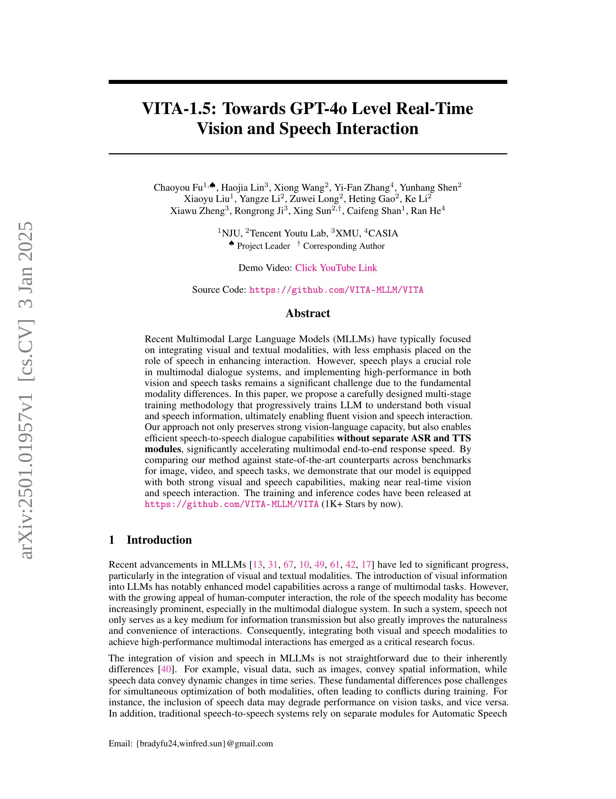
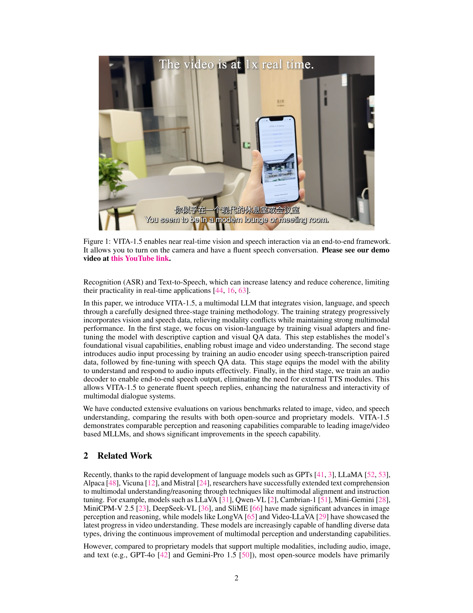
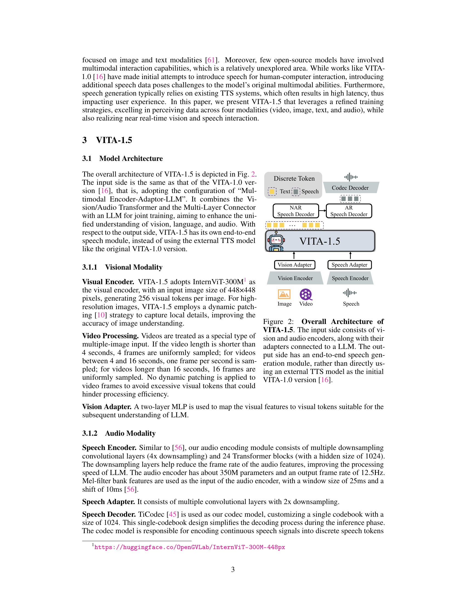
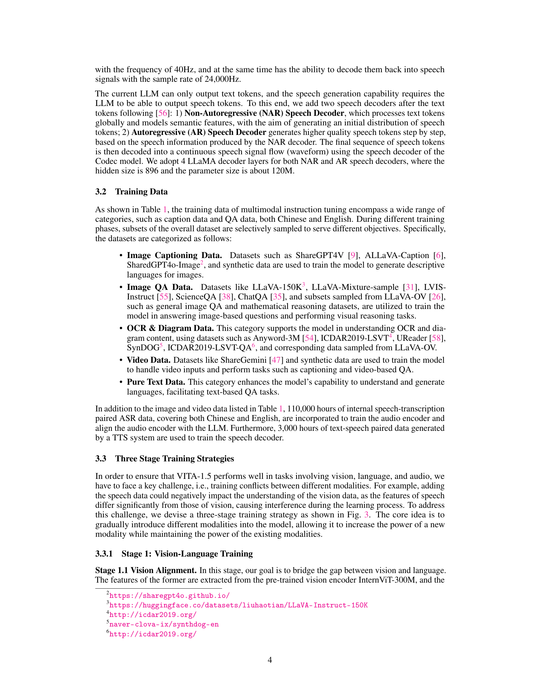
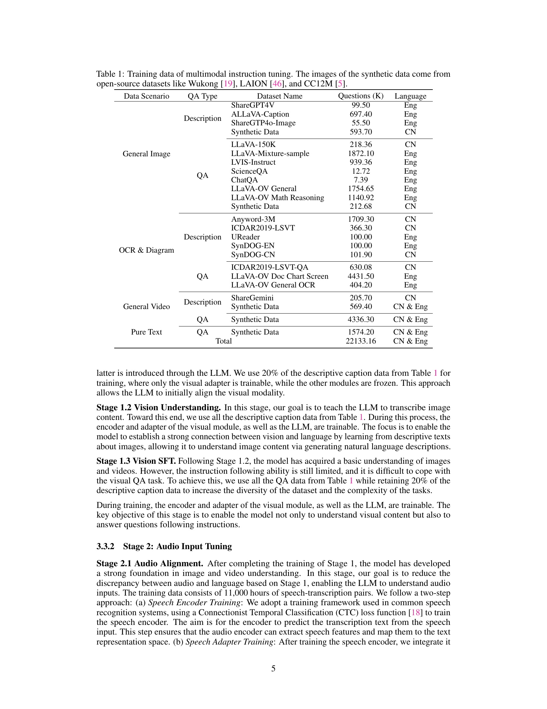
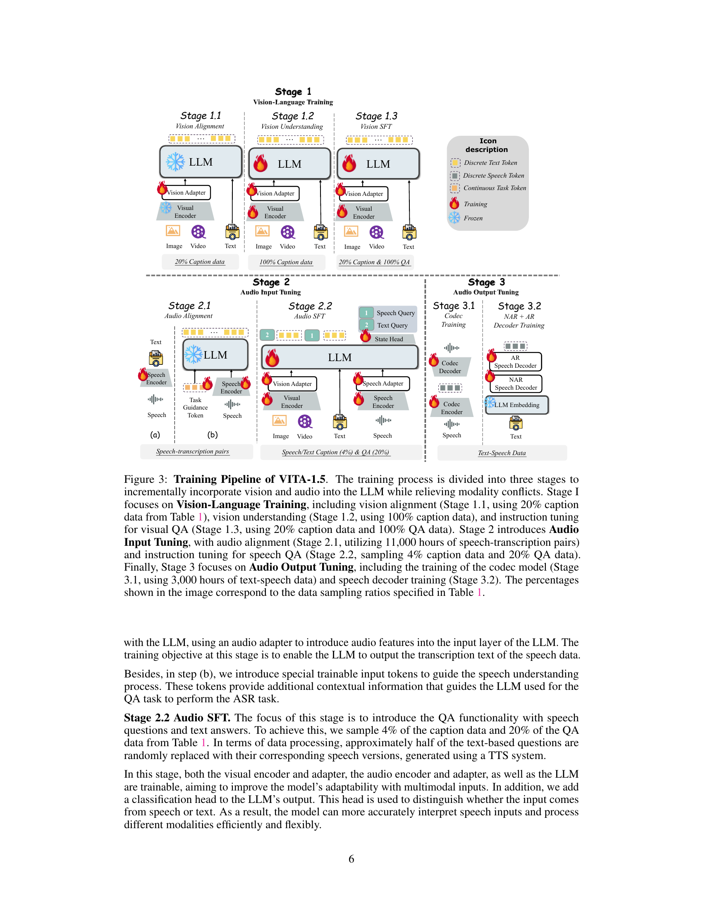
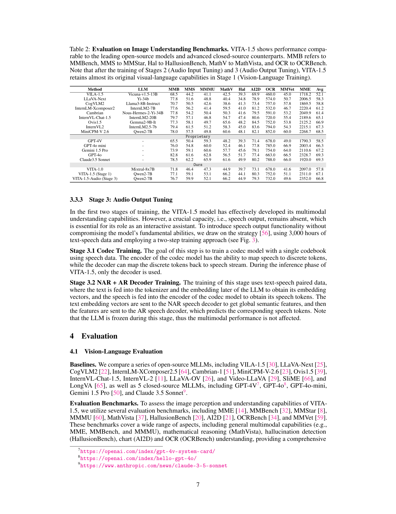
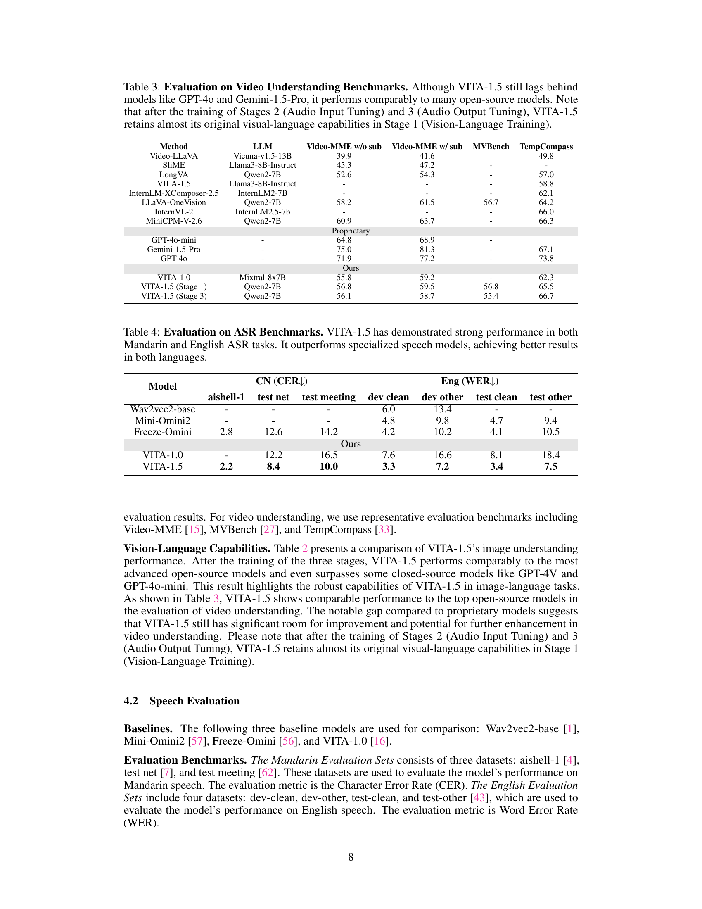
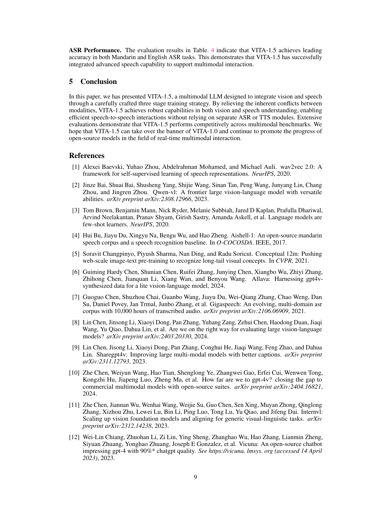
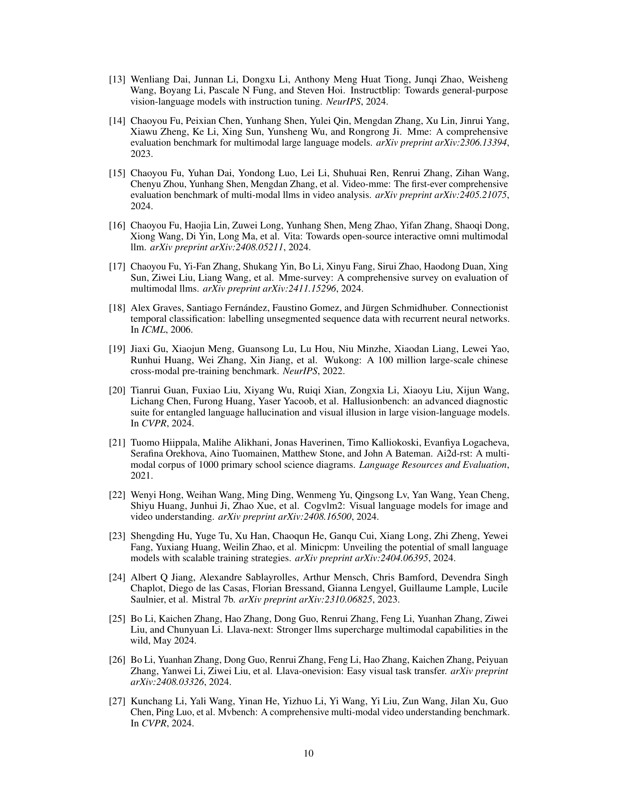
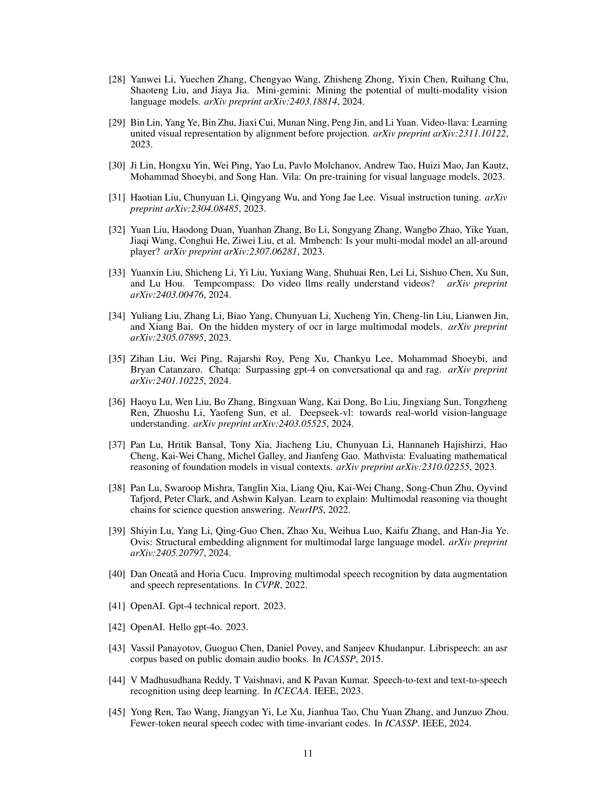
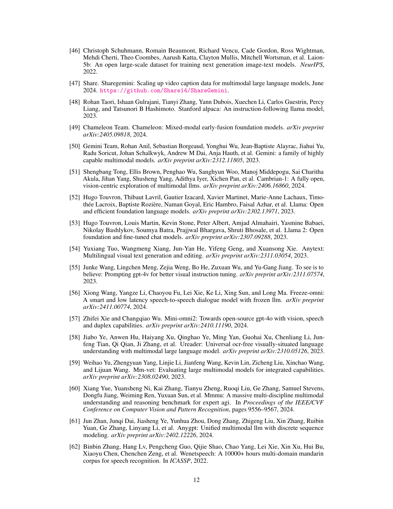
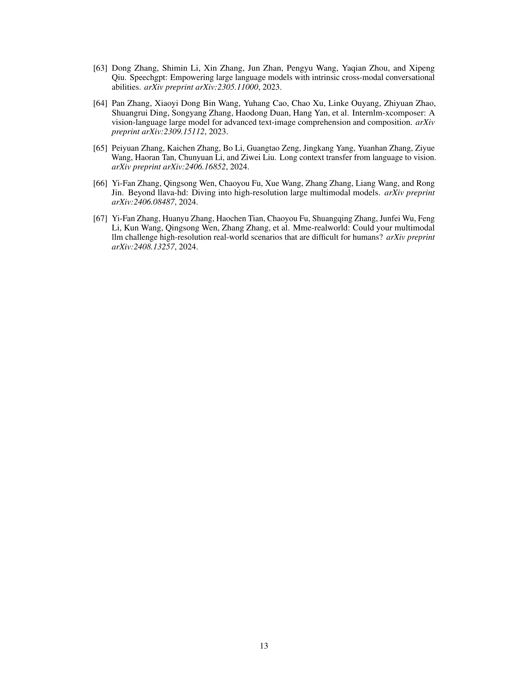
