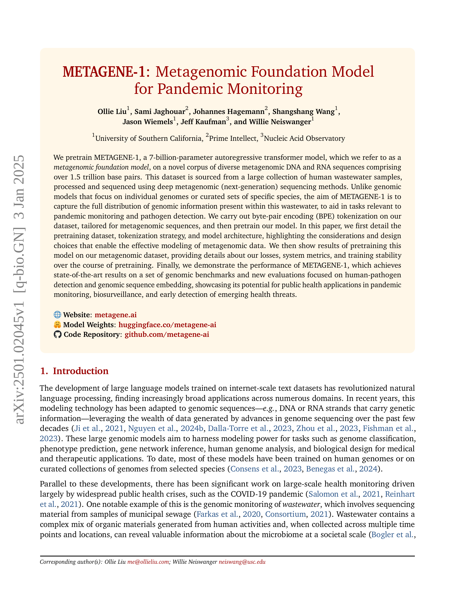

 


 2501.02045 
 Ollie Liu et el. 
 
 🤗 2025-01-07 
 



↗ arXiv


↗ Hugging Face


↗ Papers with Code


### TL;DR



전염병의 조기 탐지 및 감시는 공중 보건에 매우 중요하지만, 기존 방법은 제한적입니다. **대규모 유전체 데이터셋을 구축하고 분석하는 데 어려움이 있으며**, 특정 병원균에 대한 정보만 포함되어 전체 미생물 군집의 다양성을 반영하지 못하는 경우가 많습니다.

본 연구에서는 **폐수 샘플에서 얻은 방대한 메타유전체 데이터를 사용하여 70억 개의 매개변수를 가진 대규모 언어 모델(METAGENE-1)을 개발했습니다.** 이 모델은 다양한 유전체 정보를 포착하여 병원균 탐지 및 유전체 서열 임베딩 작업에서 최첨단 성능을 달성했습니다.  **본 연구는 폐수 기반 감시 시스템의 정확성과 효율성을 향상시키는 데 기여**하며, 전염병 감시 및 신종 질병 조기 탐지 분야의 새로운 가능성을 열었습니다.



#### Key Takeaways


 폐수 메타유전체 데이터를 사용한 70억 매개변수의 대규모 언어 모델 (METAGENE-1)이 개발됨 



 병원균 탐지 및 유전체 서열 임베딩 과제에서 최첨단 성능 달성 



 전염병 감시 및 신종 질병 조기 탐지 분야에 대한 새로운 가능성 제시 


#### Why does it matter?
**본 논문은 전염병 감시에 활용될 수 있는 혁신적인 메타유전체 기반 언어 모델을 제시합니다.**  **폐수에서 추출한 메타유전체 데이터를 사용하여 훈련된 이 모델은 병원균 탐지 및 유전체 서열 임베딩 작업에서 최첨단 성능을 달성했습니다.** 이는 전염병 감시 및 신종 질병 조기 탐지 분야 연구에 큰 영향을 미칠 수 있습니다. **또한, 본 연구는 메타유전체 데이터 분석에 대한 새로운 접근법을 제시하여 향후 연구의 새로운 방향을 제시합니다.**

------
#### Visual Insights

> 🔼 그림 1은 METAGENE-1 모델의 개요와 응용 분야를 보여줍니다. 하수 샘플을 수집하여 심층 메타유전체 시퀀싱을 수행하여 1.5조 개가 넘는 염기쌍의 DNA 및 RNA 시퀀스를 생성합니다. 이 시퀀스들은 바이트 쌍 인코딩(BPE) 토큰화를 거쳐 사전 훈련 데이터 세트를 만듭니다. 이 데이터를 사용하여 다양한 메타유전체 분석 및 모니터링 응용 프로그램을 가능하게 하는 70억 개 매개변수의 변환기 모델인 METAGENE-1을 훈련합니다.
> 

> 
read the caption

> Figure 1:  Overview of METAGENE-1 and applications. Wastewater samples are collected and undergo deep metagenomic sequencing to generate DNA and RNA sequences totaling over 1.5 trillion base pairs. These sequences are tokenized using byte-pair encoding (BPE) to create the pretraining dataset. The data is used to train METAGENE-1, a 7B-parameter transformer model that enables a wide range of metagenomic analysis and monitoring applications.
> 


| Model Details | METAGENE-1 | 
|---|---| 
| Architecture | Llama-2-7B | 
| Embedding Size | 4096 | 
| Intermediate Size | 11008 | 
| Number of Attention Heads | 32 | 
| Number of Hidden Layers | 32 | 
| Vocabulary Size | 1024 | 
| Sequence Length | 512 | 
| Normalization | RMSNorm | 
| Regularization | z-loss | 
| Position Embedding | Rotary | 
| Bias | None | 
| Warmup Steps | 2000 | 
| Batch Size | 30720 | 
| Weight Decay | 0.1 | 
| Learning Rate Schedule | Cosine Decay | 
| Initial Learning Rate | 6×10⁻⁴ | 
| β₁, β₂ | 0.9, 0.95 | 

> 🔼 본 표는 논문의 3.3절 'METAGENE-1 아키텍처'에서 METAGENE-1 모델의 구조적 세부 정보를 보여줍니다.  모델의 아키텍처 유형(변압기), 임베딩 크기, 중간 크기, 어텐션 헤드 수, 은닉층 수, 어휘 크기, 시퀀스 길이, 정규화 방법, 위치 임베딩 방식, 바이어스 사용 여부, 워밍업 단계, 배치 크기, 가중치 감쇠, 학습률 스케줄링, 초기 학습률, β1 및 β2 값 등 주요 하이퍼파라미터를 포함하고 있습니다.  Llama-2-7B 모델의 해당 값들과 비교하여 METAGENE-1 모델의 특징을 명확히 보여줍니다.
> 

> 
read the caption

> Table 1: METAGENE-1 architecture details.
> 

### In-depth insights

#### Metagenome Modeling
**메타게놈 모델링**은 환경 샘플 내의 다양한 미생물 군집의 유전체 정보를 분석하고 해석하는 데 중점을 둡니다. 이는 단일 미생물 유전체 분석과 달리, **복잡한 미생물 생태계의 상호 작용**을 이해하는 데 필수적입니다.  **차세대 시퀀싱 기술**의 발전으로 방대한 양의 메타게놈 데이터를 생성할 수 있게 되었고, 이를 효과적으로 분석하고 해석하기 위한 새로운 계산 방법과 모델이 필요해졌습니다.  **기계 학습 기반의 접근 방식**은 메타게놈 데이터의 복잡성을 다루고, 미생물 군집의 구성, 기능, 진화 과정을 예측하는 데 유용합니다.  특히 **대규모 언어 모델(LLM)**을 활용한 메타게놈 모델링은 다양한 생물학적 문제를 해결하는 데 잠재력을 보여주고 있습니다. 그러나 **데이터의 불균형, 종 분류의 어려움, 모델 해석의 복잡성** 등 여전히 해결해야 할 과제가 많습니다. 앞으로 메타게놈 모델링 연구는 **다양한 생태계의 통합적 이해**를 위한 새로운 통찰력을 제공하고, **질병 예측 및 치료** 등 다양한 분야에 적용될 것으로 기대됩니다.

#### Wastewater Sequencing
본 논문에서 'Wastewater Sequencing'은 **하수 처리장에서 채취한 샘플의 메타게놈 시퀀싱**을 의미합니다. 이는 **인간 활동과 밀접하게 관련된 미생물 군집**의 풍부한 정보를 제공하는 중요한 데이터 소스입니다. 하수는 다양한 종류의 미생물과 유기물을 포함하고 있기 때문에, 하수 시퀀싱을 통해 **새로운 병원체의 출현 또는 기존 병원체의 확산을 조기에 감지하고 모니터링**할 수 있습니다. 이러한 감시는 팬데믹 예방 및 공중 보건에 매우 중요한 역할을 합니다. 또한, **다양한 미생물의 종류와 비율을 분석**하여 환경 변화나 생태계의 변화를 추적할 수 있습니다. 하수 시퀀싱 데이터의 규모가 크고 다양한 종류의 미생물 정보를 포함하기 때문에,  **대규모 언어 모델을 학습**시키는 데 효과적인 데이터 소스로 활용될 수 있습니다. 이를 통해, **질병 예측, 신약 개발, 새로운 치료법 개발** 등의 다양한 분야에 활용될 수 있는 잠재력을 가지고 있습니다.

#### BPE Tokenization
본 논문에서 Byte-Pair Encoding (BPE) 토크나이제이션은 **메타게놈 시퀀스에 맞춤화**되어 있으며, 이는 **기존의 고정 길이 k-mer 토크나이저보다 유연성**을 제공합니다. **가변 길이 토큰**을 사용하여 다양한 수준의 유전체 정보를 포착하고 모델이 다양한 시퀀스 패턴과 구조에 적응할 수 있도록 합니다. 특히, **알려지지 않은 또는 변이가 있는 서열을 토큰화하는 능력**은 다양하고 불확실한 메타게놈 서열을 모델링하는 데 매우 유용합니다. BPE 토크나이제이션을 통해 모델은 어휘 내에서 의미론적 정보를 포착하여 유전체 데이터를 보다 정교하게 표현할 수 있습니다.  **20억 개의 염기쌍으로 구성된 사전 학습 데이터셋의 하위 집합에 대해 BPE 토크나이저를 훈련**시켰으며, 토큰 크기 분포를 분석하고 훈련 효율성을 고려하여 **어휘 크기를 1024개의 고유 토큰으로 설정**했습니다. 이는 유전체 복잡성을 충분히 포착하고 계산 효율성을 유지하는 균형을 이룹니다.  결과적으로, 이러한 전략은 메타게놈 데이터의 효과적인 모델링을 가능하게 합니다.

#### Model Architecture
본 논문에서 제시된 **거대 언어 모델(LLM)**의 아키텍처는 **자기회귀적(autoregressive)** 변환기 모델을 기반으로 합니다.  이는 **디코더 전용(decoder-only)** 구조를 가지며, 이는 기존의 인코더-디코더 구조를 사용하는 모델들과 차별화되는 점입니다.  **디코더 전용 아키텍처**는 특히 긴 시퀀스를 다루는 데 효율적이지 않을 수 있지만, **짧은 메타게놈 시퀀스**를 주로 다루는 이 연구에서는 적합한 선택으로 보입니다.  **매개변수의 수(70억)**는 상당히 크지만, 최근 연구 동향을 반영하며, **메타게놈 데이터**의 복잡성을 고려했을 때 충분한 용량으로 여겨집니다.  **토큰화 전략**으로 바이트 쌍 인코딩(BPE)을 사용하여 **새로운 시퀀스**를 효과적으로 처리하고, **의미론적 정보**를 포착하는 데 도움을 줄 수 있습니다.  **모델의 컨텍스트 길이(512 토큰)**는 상대적으로 짧지만, 효율성을 위해 여러 짧은 시퀀스를 패킹하는 기법을 통해 처리 가능합니다.  **다양한 하이퍼파라미터** 설정은 성능과 안정성 사이의 균형을 맞추기 위해 세심하게 조정되었습니다.

#### Future Directions
논문의 "미래 방향" 부분은 **메타유전체 기반 모델의 이해도를 높이는 데 중점**을 두어야 합니다.  **대규모 언어 모델(LLM)의 해석 가능성 향상**을 위한 연구가 필요하며, 메타유전체 데이터의 특성을 고려한 **새로운 토큰화 전략**이나 **모델 아키텍처** 연구가 중요합니다. 또한, **다양한 종류의 유전체 데이터를 통합**하여 모델의 일반화 능력을 향상시키고, **오류 수정 및 보완**을 위한 연구가 필요합니다. 특히, **인간에게 해로운 용도로 악용될 가능성**에 대한 고려와 더불어 **안전성 평가 및 윤리적 지침** 마련 또한 중요합니다.  **다양한 질병 예측 및 진단**에 활용 가능성을 확인하고 **공중 보건 분야**로의 적용 방안을 구체화해야 합니다.  **실제 임상 데이터를 활용한 검증**을 통해 모델의 실효성을 높이는 것도 중요한 미래 방향입니다. 마지막으로, **지속적인 모델 업데이트 및 개선**을 위한 체계를 구축하고, **연구 결과 공유 및 협력**을 위한 오픈 사이언스 접근법을 강화해야 할 것입니다.

### More visual insights

More on figures

> 🔼 그림 2는 메타게놈 데이터 수집 및 모델 사전 훈련을 위한 시퀀싱 파이프라인의 개요를 보여줍니다. 먼저 (왼쪽) 하수를 수집하고, 이는 수만 종의 다양한 구성 유기체(중앙)로부터 유래한 게놈 조각을 포함합니다. 이러한 샘플은 고처리량 메타게놈 시퀀싱을 거쳐 수백만 개의 쌍으로 된 판독값(오른쪽)을 생성하며, 각 판독값은 수백 개의 염기쌍으로 구성됩니다. 최종 데이터셋은 모델 사전 훈련에 사용된 1.5조 개 이상의 염기쌍의 메타게놈 시퀀스로 구성됩니다.
> 

> 
read the caption

> Figure 2: Overview of the metagenomic data collection and sequencing pipeline for model pretraining. The process begins with the collection of wastewater (left), which contains genomic fragments from a diverse collection (e.g., tens of thousands) of constituent organisms (center). These samples are processed via high-throughput metagenomic sequencing to produce millions of paired-end reads (right), each consisting of hundreds of base pairs. The complete dataset comprises over 1.5 trillion base pairs of metagenomic sequences used for model pretraining.
> 

> 🔼 그림 3은 METAGENE-1 사전 훈련 데이터셋의 메타게놈 구성을 보여줍니다. Kraken 2 소프트웨어를 사용하여 시퀀스 분류를 수행하고 Krona를 사용하여 시각화했습니다. 그림은 박테리아, 진핵생물, 바이러스 및 분류되지 않은 또는 알 수 없는 기원의 읽기 비율을 보여주는 원형 차트를 사용합니다. 그림 7에서는 더 자세한 내용을 확인할 수 있습니다.
> 

> 
read the caption

> Figure 3: Metagenomic composition of the METAGENE-1 pretraining dataset, estimated via Kraken 2 (Wood et al., 2019) sequence classification, and visualized via Krona (Ondov et al., 2011). See Figure 7 for a more-detailed view.
> 

> 🔼 그림 4는 메타게놈 데이터셋을 사용하여 사전 훈련하는 동안 z-loss 값의 변화를 보여줍니다. z-loss는 모델 훈련의 안정성을 평가하는 지표로, 훈련 과정에서 손실 값의 급격한 변동이나 발산을 감지하는 데 도움이 됩니다. 이 그래프를 통해 모델의 훈련 안정성을 시각적으로 확인하고, 훈련 과정 중 발생할 수 있는 문제점들을 조기에 파악하여 해결할 수 있습니다. 즉, 그래프에서 z-loss 값이 안정적으로 유지되는 것은 모델 훈련이 안정적으로 진행되고 있음을 의미하며, 반대로 z-loss 값이 급격하게 변동하거나 발산하는 경우 모델 훈련에 문제가 발생했음을 의미합니다.
> 

> 
read the caption

> Figure 4: We show z𝑧zitalic_z-loss during pretraining, which aids and gives an indicator of stability.
> 

> 🔼 그림 5는 METAGENE-1의 사전 훈련 중 손실 곡선을 보여줍니다. 왼쪽에는 1.5조 베이스 쌍의 사전 훈련 데이터셋에 대한 한 에포크의 훈련 손실을, 오른쪽에는 분리된 메타게놈 샘플에 대한 검증 손실을 보여줍니다. 훈련 곡선에서 훈련 과정에서 약간의 체계적인 진동이 발생하는데, 이는 효율성을 위해 구현된 의사 랜덤 데이터 셔플링 때문입니다. 그러나 이러한 진동은 검증 손실 곡선에는 나타나지 않습니다.
> 

> 
read the caption

> Figure 5: METAGENE-1 loss curves during pretraining. We show training loss (left), and validation loss on a held out metagenomic sample (right).
> 

> 🔼 그림 6은 METAGENE-1 모델이 생성한 길이 정규화된 교차 엔트로피 손실의 분포를 다양한 데이터셋에 걸쳐 보여줍니다.  각 데이터셋(메타유전체, 랜덤, 인간, 마우스)에 대한 손실 분포를 히스토그램으로 나타내어, 각 데이터 유형의 분포 차이를 시각적으로 비교하고 있습니다. 이를 통해 각 데이터셋에 대한 모델의 성능과 예측의 신뢰도를 간접적으로 비교할 수 있습니다.  데이터셋의 특성에 따라 손실 분포가 어떻게 달라지는지 보여주는 것이 그림의 주요 목적입니다.
> 

> 
read the caption

> Figure 6: Distribution of the length-normalized cross entropy loss across all datasets, given by METAGENE-1.
> 

More on tables


| ** ** | **DNABERT-2** | **DNABERT-S** | **NT-2.5b-Multi** | **NT-2.5b-1000g** | **METAGENE-1** |
|---|---|---|---|---|---| 
| **Pathogen-Detect (avg.)** | 87.92 | 87.02 | 82.43 | 79.02 | **92.96** |
| **Pathogen-Detect-1** | 86.73 | 85.43 | 83.80 | 77.52 | **92.14** |
| **Pathogen-Detect-2** | 86.90 | 85.23 | 83.53 | 80.38 | **90.91** |
| **Pathogen-Detect-3** | 88.30 | 89.01 | 82.48 | 79.83 | **93.70** |
| **Pathogen-Detect-4** | 89.77 | 88.41 | 79.91 | 78.37 | **95.10** |
> 🔼 표 2는 본 논문의 5.2절에서 자세히 설명하는 병원균 탐지 벤치마크 결과를 보여줍니다. 모든 평가에 사용된 지표는 MCC(Matthews Correlation Coefficient)이며, 표의 머리글 행에는 매크로 평균 성능 지표가 요약되어 있습니다.  본 표는 네 가지 서로 다른 샘플링 데이터 세트(PATHOGEN-DETECT-1~4)에 대해 네 가지 다른 모델 (DNABERT-2, DNABERT-S, NT-2.5b-Multi, NT-2.5b-1000g)과 METAGENE-1의 성능을 비교하여 보여줍니다. 각 데이터 세트는 인간 병원균과 비병원균으로 구성되며, 모델은 이진 분류 작업을 수행합니다. 결과는 각 모델의 MCC 점수를 보여주며, METAGENE-1이 다른 모델들에 비해 상당히 높은 성능을 보임을 알 수 있습니다.
> 

> 
read the caption

> Table 2: Results on the Pathogen Detection benchmark. The metric used for all evaluations is MCC. The header row reports macro-averaged performance metrics. See Section 5.2 for details.
> 


| Model | Human-Virus (avg.) | Human-Virus-1 | Human-Virus-2 | Human-Virus-3 | Human-Virus-4 | HMPD (avg.) | HMPD-single | HMPD-disease | HMPD-sex | HMPD-source | HVR (avg.) | HVR-p2p | HVR-s2s-align | HVR-s2s-small | HVR-s2s-tiny | HMPR (avg.) | HMPR-p2p | HMPR-s2s-align | HMPR-s2s-small | HMPR-s2s-tiny | Global Average |
|---|---|---|---|---|---|---|---|---|---|---|---|---|---|---|---|---|---|---|---|---|---|---|
| **DNABERT-2** | 0.564 | 0.594 | 0.507 | 0.606 | 0.550 | 0.397 | 0.292 | 0.480 | 0.366 | 0.451 | 0.479 | 0.548 | 0.243 | 0.373 | 0.753 | 0.347 | 0.566 | 0.127 | 0.419 | 0.274 | 0.475 |
| **DNABERT-S** | 0.570 | 0.605 | 0.510 | 0.612 | 0.551 | 0.403 | 0.293 | 0.486 | 0.367 | 0.465 | 0.479 | 0.550 | 0.241 | 0.372 | 0.753 | 0.351 | 0.580 | 0.129 | 0.421 | 0.274 | 0.479 |
| **NT-2.5b-Multi** | 0.675 | 0.671 | 0.652 | 0.758 | 0.620 | 0.449 | 0.285 | 0.498 | 0.487 | 0.523 | 0.546 | 0.559 | 0.266 | 0.357 | 1.000 | 0.348 | 0.471 | 0.144 | 0.443 | 0.332 | 0.525 |
| **NT-2.5b-1000g** | 0.710 | 0.721 | 0.624 | 0.740 | 0.755 | 0.451 | 0.292 | 0.489 | 0.476 | 0.545 | 0.524 | 0.650 | 0.293 | 0.371 | 0.782 | 0.403 | 0.543 | 0.219 | 0.459 | 0.391 | 0.545 |
| **METAGENE-1** | **0.775** | **0.828** | **0.742** | **0.835** | **0.697** | **0.465** | **0.297** | **0.542** | **0.495** | **0.526** | **0.550** | **0.466** | **0.267** | **0.467** | **1.000** | **0.476** | **0.479** | **0.140** | **0.432** | **0.855** | **0.590** |
> 🔼 표 3은 본 논문의 5.3절에서 자세히 설명하는 유전체 임베딩(Gene-MTEB) 벤치마크에 대한 결과를 보여줍니다.  각 모델의 성능을 다양한 유전체 관련 작업(예: 인간 바이러스 식별, 질병 예측, 성별/출처 예측)에서 평가하여, METAGENE-1 모델의 유전체 정보 표현 능력을 다른 기존 모델들과 비교 분석합니다.  정확도와 V-측정값(클러스터링 작업)을 사용하여 모델의 성능을 측정했습니다.
> 

> 
read the caption

> Table 3: Results on the Genomic Embedding (Gene-MTEB) benchmark. See Section 5.3 for details.
> 


|       | CNN | HyenaDNA | DNABERT | NT-2.5B-Multi | DNABERT-2 | METAGENE-1 |
| :---- | :-: | :-: | :-: | :-: | :-: | :-: |
| **TF-Mouse (avg.)** | 45.3 | 51.0 | 57.7 | 67.0 | 68.0 | **71.4** |
| **0** | 31.1 | 35.6 | 42.3 | **63.3** | 56.8 | 61.5 |
| **1** | 59.7 | 80.5 | 79.1 | 83.8 | **84.8** | 83.7 |
| **2** | 63.2 | 65.3 | 69.9 | 71.5 | 79.3 | **83.0** |
| **3** | 45.5 | 54.2 | 55.4 | 69.4 | 66.5 | **82.2** |
| **4** | 27.2 | 19.2 | 42.0 | 47.1 | **52.7** | 46.6 |
| **TF-Human (avg.)** | 50.7 | 56.0 | 64.4 | 62.6 | **70.1** | 68.3 |
| **0** | 54.0 | 62.3 | 68.0 | 66.6 | **72.0** | 68.9 |
| **1** | 63.2 | 67.9 | 70.9 | 66.6 | **76.1** | 70.8 |
| **2** | 45.2 | 46.9 | 60.5 | 58.7 | **66.5** | 65.9 |
| **3** | 29.8 | 41.8 | 53.0 | 51.7 | **58.5** | 58.1 |
| **4** | 61.5 | 61.2 | 69.8 | 69.3 | 77.4 | **77.9** |
| **EMP (avg.)** | 37.6 | 44.9 | 49.5 | 58.1 | 56.0 | **66.0** |
| **H3** | 61.5 | 67.2 | 74.2 | 78.8 | 78.3 | **80.2** |
| **H3K14ac** | 29.7 | 32.0 | 42.1 | 56.2 | 52.6 | **64.9** |
| **H3K36me3** | 38.6 | 48.3 | 48.5 | 62.0 | 56.9 | **66.7** |
| **H3K4me1** | 26.1 | 35.8 | 43.0 | 55.3 | 50.5 | **55.3** |
| **H3K4me2** | 25.8 | 25.8 | 31.3 | 36.5 | 31.1 | **51.2** |
| **H3K4me3** | 20.5 | 23.1 | 28.9 | 40.3 | 36.3 | **58.5** |
| **H3K79me3** | 46.3 | 54.1 | 60.1 | 64.7 | 67.4 | **73.0** |
| **H3K9ac** | 40.0 | 50.8 | 50.5 | 56.0 | 55.6 | **65.5** |
| **H4** | 62.3 | 73.7 | 78.3 | 81.7 | 80.7 | **82.7** |
| **H4ac** | 25.5 | 38.4 | 38.6 | 49.1 | 50.4 | **61.7** |
| **PD (avg.)** | 77.1 | 35.0 | 84.6 | **88.1** | 84.2 | 82.3 |
| **All** | 75.8 | 47.4 | 90.4 | **91.0** | 86.8 | 86.0 |
| **No-TATA** | 85.1 | 52.2 | 93.6 | 94.0 | **94.3** | 93.7 |
| **TATA** | 70.3 | 5.3 | 69.8 | **79.4** | 71.6 | 67.4 |
| **CPD (avg.)** | 62.5 | 48.4 | **73.0** | 71.6 | 70.5 | 69.9 |
| **All** | 58.1 | 37.0 | **70.9** | 70.3 | 69.4 | 66.4 |
| **No-TATA** | 60.1 | 35.4 | 69.8 | **71.6** | 68.0 | 68.3 |
| **TATA** | 69.3 | 72.9 | **78.2** | 73.0 | 74.2 | 75.1 |
| **SSD** | 76.8 | 72.7 | 84.1 | **89.3** | 85.0 | 87.8 |
| **COVID** | 22.2 | 23.3 | 62.2 | **73.0** | 71.9 | 72.5 |
| **Global Win %** | 0.0 | 0.0 | 7.1 | 21.4 | 25.0 | **46.4** |
> 🔼 표 4는 Genome Understanding Evaluation (GUE) 벤치마크에 대한 결과를 보여줍니다. METAGENE-1 이외의 결과는 Zhou et al.(2023)의 연구에서 가져왔습니다. 모든 평가에 사용된 지표는 MCC이지만, COVID 작업에는 F1 점수를 사용했습니다. 머리글 행은 매크로 평균 성능 지표를 보고하며, 마지막 행은 Global Win %를 보여줍니다. Global Win %는 관련 지표에서 특정 방법이 최고 점수를 달성한 작업의 비율입니다.
> 

> 
read the caption

> Table 4: Results on the Genome Understanding Evaluation (GUE) benchmark. Non-METAGENE-1 results are adapted from Zhou et al. (2023). The metric used for all evaluations is MCC, except for the COVID task, which uses F1 score. The header rows report macro-averaged performance metrics. The final row shows Global Win %, i.e., the percentage of tasks in which a given method achieves top score under the associated metric.
> 


| Group | F1 | Loss (Std. Err) | Tokenized Seq Len (Std. Dev) |
|---|---|---|---| 
| **Metagenomics** | - | 1.24 (1.31) | 24.91 (3.35) |
| **Random** | 0.91 | 5.83 (0.29) | 27.16 (1.32) |
| **Human** | 0.94 | 5.22 (0.22) | 27.29 (1.33) |
| **Mouse** | 0.91 | 5.38 (0.54) | 27.2 (1.34) |
> 🔼 표 5는 메타게놈 시퀀스와 다른 데이터 소스 간의 이상 탐지 성능을 보여줍니다. 메타게놈, 무작위, 인간, 마우스 데이터 세트의 길이 정규화된 교차 엔트로피 손실과 토큰화된 시퀀스 길이를 비교하여 OOD(Out-of-Distribution) 탐지 성능을 평가합니다. F1 점수와 손실 값을 통해 메타게놈 시퀀스와 다른 데이터 소스 간의 차이를 정량적으로 보여줍니다.
> 

> 
read the caption

> Table 5: OOD detection performance between metagenomics sequences and other data sources.
> 


| Model | Setting |
|---|---| 
| DNABERT-⋆ | Full Model |
| NT-⋆ | LoRA |
| METAGENE-1 | LoRA |
| LoRA Modules | query, key, value, dense |
| LoRA Rank | 8 |
| LoRA α | 16 |
| LoRA Dropout | 0.1 |
| Optimizer | AdamW |
| Optimizer Momentum | β1, β2 = 0.9, 0.999 |
| Learning Rate | 1e-4Λ |
| LR Scheduler | Linear Warmup + Constant LR |
| Warmup Steps | 50 |
| Weight Decay | 0.01 |
| Denominator ϵ | 1e-8 |
| Precision | BF16-mixed |
| Batch Size | 32 |
| Epochs | 10 |
| Hardware | NVIDIA A100 80GB |
> 🔼 표 6은 병원균 탐지 미세 조정 실험을 위한 초매개변수 설정을 보여줍니다. DNABERT-S의 경우 학습 과정에서 명확한 진동 현상이 관찰되어 학습률을 절반으로 줄였습니다 (5e-5). 표에는 모델 아키텍처(전체 모델 또는 LoRA), LoRA 모듈(쿼리, 키, 값, 조밀), LoRA 계층(8), LoRA 알파(16), LoRA 드롭아웃(0.1), 최적화기(AdamW), 최적화기 모멘텀(β1, β2 = 0.9, 0.999), 학습률(1e-4), 학습률 스케줄러(선형 워밍업 + 상수 LR), 워밍업 단계(50), 가중치 감쇠(0.01), 분모 입실론(1e-8), 정밀도(BF16 혼합), 배치 크기(32), 에폭(10), 하드웨어(NVIDIA A100 80GB) 등의 정보가 포함되어 있습니다.
> 

> 
read the caption

> Table 6: Hyperparameter settings for the Pathogen Detection fine-tuning experiments. ΛΛ\Lambdaroman_Λ: for DNABERT-S, we halve the learning to 5e-5 as we observe clear oscillation behavior in the training loss.
> 


| LoRA Modules | query, key, value, denseΛ | 
|---|---| 
| LoRA Rank | 8 | 
| LoRA α | 16 | 
| LoRA Dropout | 0.1 | 
| Optimizer | AdamW | 
| Optimizer Momentum (β1, β2) | 0.9, 0.999 | 
| Learning Rate | {1e-4 
⋯ 1e-3}Ω | 
| LR Scheduler | Linear Warmup + Constant LR | 
| Warmup Steps | 50 | 
| Weight Decay | 0.01 | 
| Denominator ϵ | 1e-8 | 
| Precision | BF16-mixed | 
| Batch Size | 32 | 
| Epochs | 10 | 
| Hardware | NVIDIA A100 80GB |
> 🔼 표 7은 GUE 미세 조정 실험에 사용된 하이퍼파라미터 설정을 보여줍니다.  LoRA는 query-value 또는 query-key-value-dense 모듈에 적용됩니다. 학습률은 1e-4, 2e-4, ..., 1e-3의 균등 간격 그리드에서 조정됩니다. 모든 하이퍼파라미터는 검증 세트의 성능에 따라 선택됩니다.  즉,  다양한 하이퍼파라미터들을 시도해보고 검증 세트에서 가장 좋은 성능을 내는 설정을 최종적으로 선택했다는 의미입니다.  표에는 LoRA 모듈의 종류, 차수, 알파값, 드롭아웃 비율, 최적화 알고리즘, 모멘텀, 학습률, 학습률 스케줄러, 웜업 단계, 가중치 감소, 분모 에프실론, 정밀도, 배치 크기, 에폭, 하드웨어 등이 포함되어 있습니다.
> 

> 
read the caption

> Table 7: Hyperparameter settings for the GUE fine-tuning experiments. ΛΛ\Lambdaroman_Λ: LoRA is applied to query-value or query-key-value-dense modules. ΩΩ\Omegaroman_Ω: learning rates are tuned over a equally-spaced grid of 1e-4, 2e-4, ⋯⋯\cdots⋯, 1e-3. All hyperparameters are selected according to performances on validation sets.
> 

### Full paper



