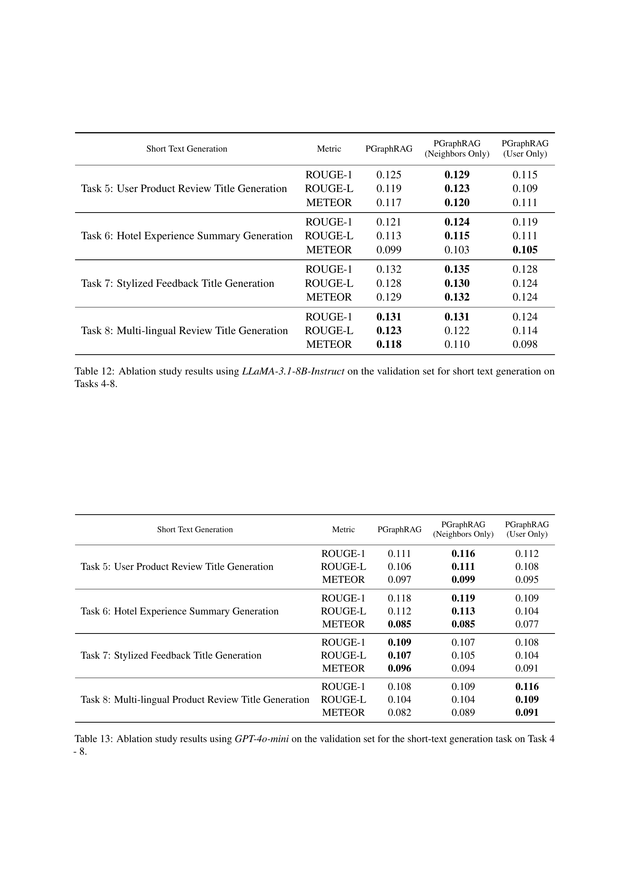

 


 2501.02157 
 Steven Au et el. 
 
 🤗 2025-01-07 
 



↗ arXiv


↗ Hugging Face


↗ Papers with Code


### TL;DR



기존의 개인화된 대규모 언어 모델(LLM) 연구는 주로 사용자의 과거 기록에 의존하는데, 이는 데이터가 부족한 **콜드 스타트 상황**에서는 효과적이지 못합니다.  본 논문에서는 이러한 문제를 해결하기 위해 사용자 중심의 지식 그래프를 활용하는 새로운 프레임워크인 PGraphRAG를 제안합니다.

PGraphRAG는 **구조화된 사용자 지식**을 검색 과정에 직접 통합하고, 사용자에게 관련된 맥락 정보를 활용하여 프롬프트를 개선합니다.  실험 결과, PGraphRAG는 다양한 작업에서 기존의 최첨단 개인화 방법을 능가하는 성능을 보였으며, 특히 데이터가 부족한 상황에서 그 효과가 더욱 컸습니다. 또한, **새로운 개인화된 텍스트 생성 벤치마크**를 제시하여  향후 연구에 기여할 것으로 예상됩니다.



#### Key Takeaways


 희소 사용자 데이터 문제를 가진 개인화된 LLM 연구에 대한 새로운 접근법을 제시합니다. 



 개인화된 그래프 기반 텍스트 생성 벤치마크를 통해 실제 환경에서의 개인화 성능을 평가합니다. 



 PGraphRAG는 기존 방법보다 우수한 성능을 보이며, 그래프 기반 검색의 장점을 입증합니다. 


#### Why does it matter?
본 논문은 **희소한 사용자 데이터**를 가진 **차세대 개인화 LLM 연구**에 중요한 의미를 지닙니다.  **그래프 기반 검색**을 통해 기존의 사용자 기록에 의존하는 방식의 한계를 극복하고, **새로운 벤치마크**와 함께 **뛰어난 성능**을 보여줌으로써, 향후 연구 방향을 제시하고 있습니다. 특히, 콜드 스타트 문제 해결에 기여하며 **다양한 분야**에 적용될 수 있는 잠재력을 가지고 있습니다.

------
#### Visual Insights

> 🔼 그림 1은 제안된 개인 맞춤형 그래프 기반 검색 증강 생성 프레임워크인 PGraphRAG의 개요를 보여줍니다.  먼저 사용자의 이력 및 상호 작용을 기반으로 사용자 중심 그래프를 구성합니다. 그런 다음, 생성된 구조화된 데이터를 검색에 사용합니다. 검색된 정보는 사용자 i에 맞춘 텍스트를 생성하는 과정에서 언어 모델에 맥락을 제공합니다.  즉, 사용자의 과거 행동과 선호도를 담은 그래프를 만들고, 이를 활용하여 사용자에게 적합한 정보를 검색하고, 그 정보를 LLM에 입력하여 개인화된 텍스트를 생성하는 과정을 보여줍니다.  이를 통해 기존의 사용자 이력만 활용하는 방식보다 더욱 정교하고 효과적인 개인화된 응답을 생성할 수 있습니다.
> 

> 
read the caption

> Figure 1: Overview of the proposed personalized graph-based retrieval-augmented generation framework, PGraphRAG. We first construct user-centric graphs from user history and interactions. Then, the resulting structured data is utilized for retrieval. The retrieved information is provided to the language models for context in generating text tailored to user i𝑖iitalic_i.
> 


| Dataset | Train Size | Validation Size | Test Size |
|---|---|---|---|
| User-Product Review | 20,000 | 2,500 | 2,500 |
| Multilingual Product Review | 20,000 | 2,500 | 2,500 |
| Stylized Feedback | 20,000 | 2,500 | 2,500 |
| Hotel Experiences | 9,000 | 2,500 | 2,500 |

> 🔼 표 1은 제안된 개인화된 그래프 기반 벤치마크에 대한 데이터 통계를 보여줍니다.  평균 입력 길이와 평균 출력 길이는 GPT-4o-mini 모델과 BM25 기법을 사용하여 테스트 세트에서 측정되었으며, 단위는 단어 수입니다.  또한 각 과제에 대한 평균 프로필 크기(사용자 리뷰 크기 기준)를 보여줍니다.  즉, 각 과제의 데이터셋에 대해 평균 입력 문장 길이, 평균 출력 문장 길이, 그리고 사용자별 평균 리뷰 개수를 나타냅니다.
> 

> 
read the caption

> Table 1: Data Statistics for PGraph Benchmark. The table reports the average input length and average output length in words (done for the test set on GPT-4o-mini on BM25 back on all methods). The average profile size for each task is by user review size.
> 

### In-depth insights

#### Graph-Based Personalization
본 논문에서 제시된 그래프 기반 개인화 방식은 사용자 중심 지식 그래프를 활용하여 기존의 사용자 이력에만 의존하는 방식의 한계를 극복합니다. **사용자의 속성, 문서, 상호작용 등 구조화된 정보를 그래프로 표현**하여 사용자의 선호도와 관계를 보다 풍부하게 이해하고, **희소 데이터 문제 해결에 도움**을 줍니다.  특히 콜드 스타트 시나리오에서 사용자 이력이 부족할 때에도 개인화된 결과 생성에 유용하며, **추론 과정에 그래프 정보를 직접 통합**하여 문맥 이해도와 출력 품질을 향상시킵니다.  그래프 기반 접근법은 복잡한 사용자 정보를 구조적으로 표현하여 정보 검색 및 통합 효율을 높이며, **전통적인 개인화 모델보다 우수한 성능**을 보입니다.  하지만 그래프 생성 및 관리의 복잡성, 그래프의 크기가 성능에 미치는 영향 등 추가적인 연구가 필요할 것으로 보입니다.

#### PGraphRAG Framework
PGraphRAG 프레임워크는 사용자 중심 지식 그래프를 활용하여 **개인 맞춤형 텍스트 생성**을 향상시키는 혁신적인 접근 방식입니다. 기존의 사용자 히스토리에만 의존하는 방식과 달리, **구조화된 사용자 지식을 직접 통합**하여 사용자의 맥락, 선호도, 관계에 대한 풍부한 이해를 제공합니다. 특히 **데이터가 부족한 콜드 스타트 시나리오**에서도 개인화된 응답을 생성하는 데 탁월한 성능을 보여줍니다. 이 프레임워크는 질의 함수, 그래프 기반 검색 모델, 프롬프트 구성 함수의 세 가지 주요 구성 요소로 이루어져 있으며, 사용자 프로필에서 관련 정보를 검색하고 이를 모델의 예측에 활용하는 방식으로 작동합니다.  **그래프 기반 검색**을 통해 사용자의 복잡한 정보를 구조적이고 상호 연결된 방식으로 표현하고, 이를 통해 맥락에 맞는 정보 검색 및 통합을 더욱 효과적으로 수행할 수 있습니다.

#### Benchmark Datasets
본 논문에서 제시된 벤치마크 데이터셋은 **개인 맞춤형 텍스트 생성 과제**를 평가하기 위해 다양한 실제 환경의 데이터를 포함합니다. 이는 기존 벤치마크의 한계를 극복하기 위해 **사용자 히스토리가 부족하거나 없는 상황**을 고려하여 만들어졌다는 점에서 중요한 의미를 지닙니다.  **다양한 텍스트 길이(장문 및 단문)**와 **다양한 과제 유형(텍스트 생성, 분류)**을 포함하여 모델의 일반화 성능을 측정할 수 있도록 설계되었습니다. 또한, **사용자 중심의 지식 그래프**를 활용하여 사용자 정보를 구조화된 형태로 제공하여, 개인 맞춤형 모델의 성능 평가에 도움을 줍니다.  **데이터셋의 다양성과 현실성**은 새로운 개인 맞춤형 모델 개발 및 평가에 유용한 기준을 제시하며, **콜드 스타트 문제**에 대한 효과적인 해결책을 모색하는 연구에 중요한 기여를 할 것으로 예상됩니다.

#### Ablation Study Results
본 논문의 "Ablation Study Results" 부분은 **PGraphRAG 모델의 성능에 영향을 미치는 요소들을 체계적으로 분석**한 결과를 제시합니다.  특히, 사용자 중심 지식 그래프의 구조적 정보 활용, 검색된 정보의 개수, 그리고 검색 기법 자체의 영향을 면밀히 조사하여, 각 요소가 모델 성능에 미치는 영향의 크기를 정량적으로 보여줍니다. 이를 통해 **PGraphRAG 모델의 강점과 한계를 명확히 파악**하고, 향후 개선 방향을 제시하는 데 중요한 근거를 제공합니다.  **다양한 변수 조합에 대한 실험 결과를 제시**함으로써, 모델 설계 및 개선을 위한 실질적인 통찰력을 제공하고, 특히 사용자 데이터가 부족한 상황에서의 모델 성능 향상에 기여할 수 있는 방안을 모색하는 데 중요한 역할을 수행합니다.  결과적으로, 이 부분은 **본 논문의 신뢰도와 실용성을 높이는 데 크게 기여**하며, 개선된 개인 맞춤형 텍스트 생성 모델 개발에 대한 밑거름을 제공합니다.

#### Future Research
본 논문에서 제시된 PGraphRAG 프레임워크는 사용자 중심 지식 그래프를 활용하여 개인화된 텍스트 생성을 향상시키는 접근 방식을 제시합니다. **향후 연구는 더욱 다양한 유형의 사용자 지식 그래프를 통합하는 방향으로 진행될 수 있습니다.** 예를 들어, 사회적 네트워크, 지식베이스, 개인의 취향 데이터 등을 통합하여 사용자의 맥락을 더욱 풍부하게 이해하고 생성 결과의 정확성과 개인화 수준을 높일 수 있습니다. 또한, **다양한 유형의 텍스트 생성 작업에 대한 PGraphRAG의 일반화 성능을 평가하는 연구가 필요합니다.**  다양한 도메인과 작업에 대한 벤치마크를 구축하고, PGraphRAG의 확장성과 적응력을 평가하여 실제 응용 분야에 대한 적용 가능성을 확인해야 합니다.  **특히 냉시작 시나리오에서의 성능 개선은 중요한 연구 과제입니다.**  제한된 사용자 정보를 효과적으로 활용하고, 사용자의 선호도를 빠르게 학습하는 기술을 개발하여 냉시작 문제를 해결해야 합니다.  마지막으로, **PGraphRAG의 효율성을 높이기 위한 연구가 필요합니다.** 대규모 지식 그래프를 효율적으로 처리하고,  실시간 응답을 제공하기 위한 최적화 기법을 개발해야 합니다. 이러한 향후 연구를 통해 PGraphRAG의 실용성을 강화하고 다양한 응용 분야에서의 활용 가능성을 더욱 높일 수 있을 것입니다.

### More visual insights

More on figures

> 🔼 그림 2는 아마존 사용자-제품 데이터셋의 사용자 프로필 분포를 보여줍니다. 대부분의 사용자가 소수의 리뷰만 가지고 있는 작은 프로필 크기를 가지고 있음을 강조합니다. 빨간색 수직선은 LaMP, LongLaMP 와 같은 다른 벤치마크에서의 최소 프로필 크기를 나타냅니다.  즉, 기존의 개인화된 LLM 벤치마크들은 충분한 프로필 크기를 가진 사용자 데이터만을 사용했기 때문에, 사용자 데이터가 부족한 상황(cold-start)에서는 개인화된 결과를 생성하는 데 어려움이 있음을 시사합니다.
> 

> 
read the caption

> Figure 2: The user profile distribution for Amazon user-product dataset which highlights how most users have a small profile size with few reviews. The red vertical line marks the minimum profile size in other benchmarks (e.g., LaMP, LongLaMP).
> 

> 🔼 그림 3은 본 논문에서 제안된 PGraphRAG 프레임워크의 성능을 평가하기 위해 사용된 두 가지 언어 모델, GPT-4o-mini 와 GPT-01의 성능을 다양한 데이터셋과 평가 지표(ROUGE-1, ROUGE-L, METEOR)를 통해 비교 분석한 결과를 보여줍니다.  각 데이터셋은 서로 다른 특징을 가진 장문 텍스트 생성 작업에 해당하며,  두 모델의 성능 차이를 각 데이터셋과 평가 지표별로 자세하게 비교하여, 어떤 모델이 어떤 상황에서 더 우수한 성능을 보이는지 보여줍니다. 이를 통해  GPT-4o-mini와 GPT-01의 장단점을 장문 텍스트 생성 작업에 대해 명확하게 파악할 수 있습니다.
> 

> 
read the caption

> Figure 3: Comparison of GPT-4o-mini and GPT-o1 performance across all datasets and metrics for the long-text generation task.
> 

> 🔼 그림 4는 PGraphRAG을 사용하여 짧은 텍스트 생성 작업에 대한 길이 제약 조건(3, 5, 10 단어)의 영향을 검증한 결과를 보여줍니다. 검증 세트에서 평가된 ROUGE-1, ROUGE-L, METEOR 세 가지 지표를 사용하여 짧은 텍스트 생성 작업에 대한 다양한 길이 제약 조건의 효과를 보여줍니다.  각 지표는 길이 제약 조건의 변화에 따른 성능 변화를 보여주는 막대 그래프로 표현됩니다.
> 

> 
read the caption

> Figure 4: Impact of length constraints of 3, 5, and 10 on short-text generation tasks using PGraphRAG, evaluated on the validation set.
> 

> 🔼 그림 5는 PGraphRAG에서 각 작업 유형에 사용된 다양한 프롬프트 구성의 예시를 보여줍니다.  프롬프트는 사용자의 리뷰와 같은 컨텍스트 정보를 포함합니다.  긴 텍스트 생성 작업(Task 1-4)의 경우, 사용자와 다른 사용자의 리뷰가 프롬프트에 포함되고 사용자의 리뷰 제목을 바탕으로 새로운 리뷰를 생성하도록 합니다. 짧은 텍스트 생성 작업(Task 5-8)의 경우, 사용자와 다른 사용자의 리뷰를 바탕으로 리뷰 제목을 생성하도록 합니다.  순위 분류 작업(Task 9-12)의 경우, 사용자와 다른 사용자의 리뷰를 바탕으로 리뷰 제목과 내용에 기반하여 1~5의 정수 등급을 생성하도록 합니다.  각 작업에 대해 실제 데이터로 대체된 텔레타이프 텍스트가 표시됩니다.
> 

> 
read the caption

> Figure 5: Examples of different prompt configurations used in each task type for PGraphRAG. Teletype text is replaced with realistic data for each task.
> 

More on tables


| Long Text Generation | Metric | PGraphRAG | PGraphRAG
(Neighbors Only) | PGraphRAG
(User Only) |
|---|---|---|---|---|
| Task 1: User-Product Review Generation | ROUGE-1 | 0.173 | **0.177** | 0.168 |
|  | ROUGE-L | 0.124 | **0.127** | 0.125 |
|  | METEOR | 0.150 | **0.154** | 0.134 |
| Task 2: Hotel Experience Generation | ROUGE-1 | 0.263 | **0.272** | 0.197 |
|  | ROUGE-L | 0.156 | **0.162** | 0.128 |
|  | METEOR | 0.191 | **0.195** | 0.121 |
| Task 3: Stylized Feedback Generation | ROUGE-1 | **0.226** | 0.222 | 0.181 |
|  | ROUGE-L | **0.171** | 0.165 | 0.134 |
|  | METEOR | **0.192** | 0.186 | 0.147 |
| Task 4: Multi-lingual Review Generation | ROUGE-1 | **0.174** | 0.172 | **0.174** |
|  | ROUGE-L | 0.139 | 0.137 | **0.141** |
|  | METEOR | **0.133** | 0.126 | 0.125 |
> 🔼 이 표는 논문에서 사용된 개인화된 작업에 사용된 데이터셋의 그래프 통계를 보여줍니다.  특히 사용자 수, 아이템 수, 간선(리뷰) 수, 그리고 각 데이터셋(사용자-제품 그래프, 다국어 제품 그래프, 스타일리쉬 피드백 그래프, 호텔 경험 그래프)의 평균 차수를 제공합니다.  이 정보는 각 데이터셋의 크기와 연결성을 이해하는 데 도움이 됩니다.
> 

> 
read the caption

> Table 2: Graph statistics for the datasets used in the personalized tasks. The table provides the number of users, items, edges (reviews), and the average degree for each dataset: User-Product Graph, Multilingual Product Graph, Stylized Feedback Graph, and Hotel Experiences Graph.
> 


| Long Text Generation | Metric | PGraphRAG | PGraphRAG
(Neighbors Only) | PGraphRAG
(User Only) |
|---|---|---|---|---|
| Task 1: User-Product Review Generation | ROUGE-1 | **0.186** | 0.185 | 0.169 |
|  | ROUGE-L | **0.126** | 0.125 | 0.114 |
|  | METEOR | **0.187** | 0.185 | 0.170 |
| Task 2: Hotel Experience Generation | ROUGE-1 | 0.265 | **0.268** | 0.217 |
|  | ROUGE-L | 0.152 | **0.153** | 0.132 |
|  | METEOR | 0.206 | **0.209** | 0.161 |
| Task 3: Stylized Feedback Generation | ROUGE-1 | **0.205** | 0.204 | 0.178 |
|  | ROUGE-L | **0.139** | 0.138 | 0.121 |
|  | METEOR | **0.203** | 0.198 | 0.178 |
| Task 4: Multilingual Product Review Generation | ROUGE-1 | **0.191** | 0.190 | 0.164 |
|  | ROUGE-L | **0.142** | 0.140 | 0.123 |
|  | METEOR | **0.173** | 0.169 | 0.155 |
> 🔼 이 표는 논문의 데이터셋 분할에 대한 정보를 보여줍니다.  User-Product Review, Multilingual Product Review, Stylized Feedback, Hotel Experiences 네 가지 데이터셋에 대해 학습, 검증, 테스트 세트의 크기를 보여줍니다. 각 데이터셋은 사용자 리뷰의 크기 분포를 유지하기 위해 계층화된 샘플링을 사용하여 분할되었습니다.  이를 통해 각 세트에서 사용자의 리뷰 크기 분포가 원본 데이터셋의 분포와 일치하도록 합니다.
> 

> 
read the caption

> Table 3: Dataset split sizes for training, validation, and testing across four datasets: User-Product Review, Multilingual Product Review, Stylized Feedback, and Hotel Experiences.
> 


| Long Text Generation | Metric | k=1 | k=2 | k=4 |
|---|---|---|---|---|
| Task 1: User-Product Review Generation | ROUGE-1 | 0.160 | 0.169 | **0.173** |
|  | ROUGE-L | 0.121 | **0.125** | 0.124 |
|  | METEOR | 0.125 | 0.138 | **0.150** |
| Task 2: Hotel Experiences Generation | ROUGE-1 | 0.230 | 0.251 | **0.263** |
|  | ROUGE-L | 0.141 | 0.151 | **0.156** |
|  | METEOR | 0.152 | 0.174 | **0.191** |
| Task 3: Stylized Feedback Generation | ROUGE-1 | 0.200 | 0.214 | **0.226** |
|  | ROUGE-L | 0.158 | 0.165 | **0.171** |
|  | METEOR | 0.154 | 0.171 | **0.192** |
| Task 4: Multilingual Product Review Generation | ROUGE-1 | 0.163 | 0.169 | **0.174** |
|  | ROUGE-L | 0.134 | 0.137 | **0.139** |
|  | METEOR | 0.113 | 0.122 | **0.133** |
> 🔼 표 4는 LLaMA-3.1-8B 모델을 사용하여 긴 텍스트 생성 작업에 대한 제로샷 테스트 결과를 보여줍니다.  표에는 사용자 제품 리뷰 생성, 호텔 경험 생성, 스타일리쉬한 피드백 생성, 다국어 제품 리뷰 생성 등 네 가지 작업에 대한 ROUGE-1, ROUGE-L, METEOR 평가 지표 점수가 포함되어 있습니다.  검색기와 k(검색 결과 개수)는 검증 세트를 사용하여 조정되었습니다. 이 표는 모델의 성능을 평가하는 데 사용된 다양한 지표와 함께 각 작업에 대한 모델의 성능을 보여줍니다.
> 

> 
read the caption

> Table 4: Zero-shot test set results for long text generation using LLaMA-3.1-8B. The choice of retriever and k𝑘kitalic_k were tuned using the validation set.
> 


| Long Text Generation | Metric | k=1 | k=2 | k=4 |
|---|---|---|---|---|
| Task 1: User-Product Review Generation | ROUGE-1 | 0.176 | 0.184 | **0.186** |
|  | ROUGE-L | 0.121 | 0.125 | **0.126** |
|  | METEOR | 0.168 | 0.180 | **0.187** |
| Task 2: Hotel Experiences Generation | ROUGE-1 | 0.250 | 0.260 | **0.265** |
|  | ROUGE-L | 0.146 | 0.150 | **0.152** |
|  | METEOR | 0.188 | 0.198 | **0.206** |
| Task 3: Stylized Feedback Generation | ROUGE-1 | 0.196 | 0.200 | **0.205** |
|  | ROUGE-L | 0.136 | 0.136 | **0.139** |
|  | METEOR | 0.186 | 0.192 | **0.203** |
| Task 4: Multilingual Product Review Generation | ROUGE-1 | 0.163 | 0.169 | **0.174** |
|  | ROUGE-L | 0.134 | 0.137 | **0.139** |
|  | METEOR | 0.113 | 0.122 | **0.133** |
> 🔼 표 5는 GPT-4o-mini 모델을 사용하여 긴 텍스트 생성 작업에 대해 수행된 제로샷 테스트 결과를 보여줍니다.  각 작업에 대해, 사용된 검색 모델(BM25 또는 Contriever)과 검색된 컨텍스트의 개수(k)는 검증 세트를 사용하여 미세 조정되었습니다.  즉,  최적의 성능을 내는 검색 모델과 컨텍스트의 개수를 검증 세트에서 먼저 찾고, 그렇게 찾은 최적의 설정을 사용하여 테스트 세트에서 성능을 평가했다는 의미입니다. 표에는 ROUGE-1, ROUGE-L, METEOR 세 가지 지표를 사용하여 각 작업에 대한 성능이 제시되어 있습니다.
> 

> 
read the caption

> Table 5: Zero-shot test set results for long text generation using GPT-4o-mini. The choice of retriever and k𝑘kitalic_k were tuned using the validation set.
> 


| Short Text Generation | Metric | k=1 | k=2 | k=4 |
|---|---|---|---|---|
| Task 5: User Product Review Title Generation | ROUGE-1 | **0.128** | 0.123 | 0.125 |
|  | ROUGE-L | **0.121** | 0.118 | 0.119 |
|  | METEOR | **0.123** | 0.118 | 0.117 |
| Task 6: Hotel Experience Summary Generation | ROUGE-1 | **0.122** | 0.121 | 0.121 |
|  | ROUGE-L | 0.112 | **0.114** | 0.113 |
|  | METEOR | **0.104** | 0.102 | 0.099 |
| Task 7: Stylized Feedback Title Generation | ROUGE-1 | 0.129 | **0.132** | **0.132** |
|  | ROUGE-L | 0.124 | 0.126 | **0.128** |
|  | METEOR | 0.129 | **0.130** | 0.129 |
| Task 8: Multi-lingual Product Review Title Generation | ROUGE-1 | 0.129 | 0.126 | **0.131** |
|  | ROUGE-L | 0.120 | 0.119 | **0.123** |
|  | METEOR | 0.117 | 0.116 | **0.118** |
> 🔼 표 6은 LLaMA-3.1-8B 모델을 사용하여 단문 생성 작업에 대해 제로샷 설정에서 수행한 테스트 결과를 보여줍니다.  이 표에는 사용자 제품 리뷰 제목 생성, 호텔 경험 요약 생성, 스타일리쉬한 피드백 제목 생성, 다국어 제품 리뷰 제목 생성 등 네 가지 단문 생성 작업에 대한 ROUGE-1, ROUGE-L, METEOR 지표가 포함되어 있습니다.  검색기와 k (검색된 컨텍스트 항목 수)는 검증 세트를 사용하여 조정되었습니다.  즉, 모델이 훈련 데이터를 보지 않고 테스트 데이터에 대한 성능을 평가한 결과입니다.
> 

> 
read the caption

> Table 6: Zero-shot test set results for short text generation using LLaMA-3.1-8B. The choice of retriever and k𝑘kitalic_k were tuned using the validation set.
> 


| Short Text Generation | Metric | k=1 | k=2 | k=4 |
|---|---|---|---|---|
| Task 5: User Product Review Title Generation | ROUGE-1 | 0.111 | 0.110 | **0.111** |
|  | ROUGE-L | **0.106** | 0.105 | **0.106** |
|  | METEOR | 0.093 | 0.094 | **0.097** |
| Task 6: Hotel Experience Summary Generation | ROUGE-1 | 0.114 | 0.114 | **0.118** |
|  | ROUGE-L | 0.109 | 0.109 | **0.112** |
|  | METEOR | 0.082 | 0.082 | **0.085** |
| Task 7: Stylized Feedback Title Generation | ROUGE-1 | 0.100 | 0.103 | **0.109** |
|  | ROUGE-L | 0.098 | 0.101 | **0.107** |
|  | METEOR | 0.087 | 0.090 | **0.096** |
| Task 8: Multi-lingual Product Review Title Generation | ROUGE-1 | 0.104 | 0.104 | **0.108** |
|  | ROUGE-L | 0.098 | 0.098 | **0.104** |
|  | METEOR | 0.077 | 0.078 | **0.082** |
> 🔼 표 7은 GPT-40-mini 모델을 사용하여 단문 생성 작업에 대한 제로샷 테스트 결과를 보여줍니다.  이 표는 사용자 제품 리뷰 제목 생성, 호텔 경험 요약 생성, 스타일리쉬한 피드백 제목 생성, 다국어 제품 리뷰 제목 생성 등 네 가지 단문 생성 작업에 대한 성능을 보여줍니다.  각 작업마다 ROUGE-1, ROUGE-L, METEOR 세 가지 지표를 사용하여 모델의 성능을 평가하였으며, 검증 집합을 사용하여 검색기와 k 값을 조정했습니다.  이 표를 통해 제로샷 설정에서 GPT-40-mini 모델의 단문 생성 성능을 다양한 작업에 걸쳐 비교 분석할 수 있습니다.
> 

> 
read the caption

> Table 7: Zero-shot test set results for short text generation using GPT-4o-mini. The choice of retriever and k𝑘kitalic_k were tuned using the validation set.
> 


| Long Text Generation | Metric | Contriever | BM25 |
|---|---|---|---| 
| Task 1: User-Product Review Generation | ROUGE-1 | 0.172 | **0.173** |
|  | ROUGE-L | 0.122 | **0.124** |
|  | METEOR | **0.153** | 0.150 |
| Task 2: Hotel Experiences Generation | ROUGE-1 | 0.262 | **0.263** |
|  | ROUGE-L | 0.155 | **0.156** |
|  | METEOR | 0.190 | **0.191** |
| Task 3: Stylized Feedback Generation | ROUGE-1 | 0.195 | **0.226** |
|  | ROUGE-L | 0.138 | **0.171** |
|  | METEOR | 0.180 | **0.192** |
| Task 4: Multilingual Product Review Generation | ROUGE-1 | 0.172 | **0.174** |
|  | ROUGE-L | 0.134 | **0.139** |
|  | METEOR | **0.135** | 0.133 |
> 🔼 표 8은 LLaMA-3.1-8B-Instruct 모델을 사용하여 BM25 기반으로 9번부터 12번까지의 순서형 분류 작업에 대한 제로샷 테스트 결과를 보여줍니다. MAE(평균 절대 오차)와 RMSE(제곱근 평균 제곱 오차) 지표를 사용하여 모델 성능을 평가했습니다. 각 작업에 대한 MAE와 RMSE 값은 모델의 예측 정확도를 나타냅니다. 낮은 MAE와 RMSE 값은 더 높은 예측 정확도를 의미합니다.
> 

> 
read the caption

> Table 8: Zero-shot test set results on ordinal classification on Tasks 9-12 on BM25 using MAE and RMSE metrics for LLaMA-3.1-8B-Instruct .
> 


| Long Text Generation | Metric | Contriever | BM25 |
|---|---|---|---| 
| Task 1: User-Product Review Generation | ROUGE-1 | 0.182 | **0.186** |
|  | ROUGE-L | 0.122 | **0.126** |
|  | METEOR | 0.184 | **0.187** |
| Task 2: Hotel Experiences Generation | ROUGE-1 | 0.264 | **0.265** |
|  | ROUGE-L | **0.152** | **0.152** |
|  | METEOR | **0.207** | 0.206 |
| Task 3: Stylized Feedback Generation | ROUGE-1 | 0.194 | **0.205** |
|  | ROUGE-L | 0.128 | **0.139** |
|  | METEOR | 0.201 | **0.203** |
| Task 4: Multilingual Product Review Generation | ROUGE-1 | 0.190 | **0.191** |
|  | ROUGE-L | 0.141 | **0.142** |
|  | METEOR | **0.174** | 0.173 |
> 🔼 표 9는 GPT-40-mini 모델을 사용하여 BM25 평가 지표를 기반으로 수행된 제로샷 방식의 순서형 분류 작업 결과를 보여줍니다.  표에는 사용자 제품 리뷰 평점(Task 9), 호텔 경험 평점(Task 10), 스타일리쉬한 피드백 평점(Task 11), 다국어 제품 평점(Task 12) 등 4가지 과제에 대한 평균 절대 오차(MAE)와 제곱근 평균 제곱 오차(RMSE)가 포함되어 있습니다. 이 결과들은 모델의 순서형 분류 성능을 평가하는 데 사용됩니다.  각 과제에 대한 MAE와 RMSE 값을 비교 분석하여 모델의 성능을 종합적으로 평가할 수 있습니다.
> 

> 
read the caption

> Table 9: Zero-shot test set results on ordinal classification on Tasks 9-12 on BM25 using MAE and RMSE metrics for GPT-4o-mini .
> 


| Short Text Generation | Metric | Contriever | BM25 |
|---|---|---|---| 
| Task 5: User Product Review Title Generation | ROUGE-1 | 0.122 | **0.125** |
|  | ROUGE-L | 0.116 | **0.119** |
|  | METEOR | 0.115 | **0.117** |
| Task 6: Hotel Experience Summary Generation | ROUGE-1 | 0.117 | **0.121** |
|  | ROUGE-L | 0.110 | **0.113** |
|  | METEOR | 0.095 | **0.099** |
| Task 7: Stylized Feedback Title Generation | ROUGE-1 | 0.125 | **0.132** |
|  | ROUGE-L | 0.121 | **0.128** |
|  | METEOR | 0.122 | **0.129** |
| Task 8: Multi-lingual Product Review Title Generation | ROUGE-1 | 0.126 | **0.131** |
|  | ROUGE-L | 0.118 | **0.123** |
|  | METEOR | 0.112 | **0.118** |
> 🔼 표 10은 본 논문의 5장 실험에서 LLaMA-3.1-8B-Instruct 모델을 사용하여 긴 텍스트 생성 작업(1~4번 과제)에 대해 검증 세트에서 수행된 ablation study 결과를 보여줍니다.   ablation study는 PGraphRAG의 다양한 변형(전체 PGraphRAG, 이웃만 사용하는 PGraphRAG, 사용자만 사용하는 PGraphRAG)의 성능을 비교 분석하여, 이웃 사용자의 정보를 포함하는 것이 모델 성능 향상에 얼마나 기여하는지 확인하기 위해 수행되었습니다.  각 변형별로 ROUGE-1, ROUGE-L, METEOR 지표 값을 제시하여  어떤 방식이 가장 효과적인지 비교합니다.
> 

> 
read the caption

> Table 10: Ablation study results using LLaMA-3.1-8B-Instruct on the validation set for the long text generation Tasks 1 - 4.
> 


| Short Text Generation | Metric | Contriever | BM25 |
|---|---|---|---|
| Task 5: User Product Review Title Generation | ROUGE-1 | **0.113** | 0.111 |
|  | ROUGE-L | **0.108** | 0.106 |
|  | METEOR | **0.097** | **0.097** |
| Task 6: Hotel Experience Summary Generation | ROUGE-1 | 0.113 | **0.118** |
|  | ROUGE-L | 0.107 | **0.112** |
|  | METEOR | 0.080 | **0.085** |
| Task 7: Stylized Feedback Title Generation | ROUGE-1 | 0.108 | **0.109** |
|  | ROUGE-L | 0.106 | **0.107** |
|  | METEOR | 0.094 | **0.096** |
| Task 8: Multi-lingual Product Review Title Generation | ROUGE-1 | **0.108** | **0.108** |
|  | ROUGE-L | 0.103 | **0.104** |
|  | METEOR | **0.082** | **0.082** |
> 🔼 표 11은 본 논문의 5장 실험 결과에서 GPT-4o-mini 모델을 사용하여 긴 텍스트 생성 작업(과제 1-4)에 대한 ablation study 결과를 보여줍니다.  각 과제에 대해 PGraphRAG, 이웃 노드 정보만 사용한 PGraphRAG(Neighbors Only), 사용자 정보만 사용한 PGraphRAG(User Only) 세 가지 방법의 ROUGE-1, ROUGE-L, METEOR 성능 지표 값을 비교 분석하여, 그래프 기반 검색의 효과와 이웃 노드 정보 활용의 중요성을 보여줍니다.  Validation set 결과를 제시합니다.
> 

> 
read the caption

> Table 11: Ablation study results using GPT-4o-mini on the validation set for long text generation tasks across Tasks 1-4.
> 

### Full paper



