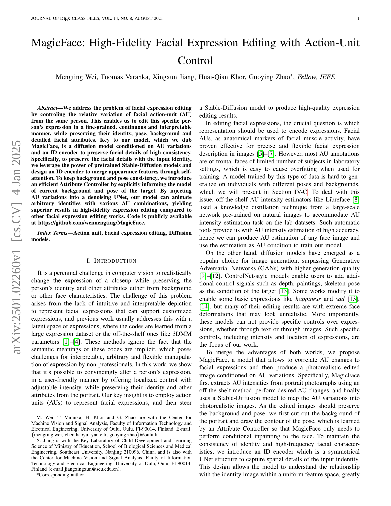
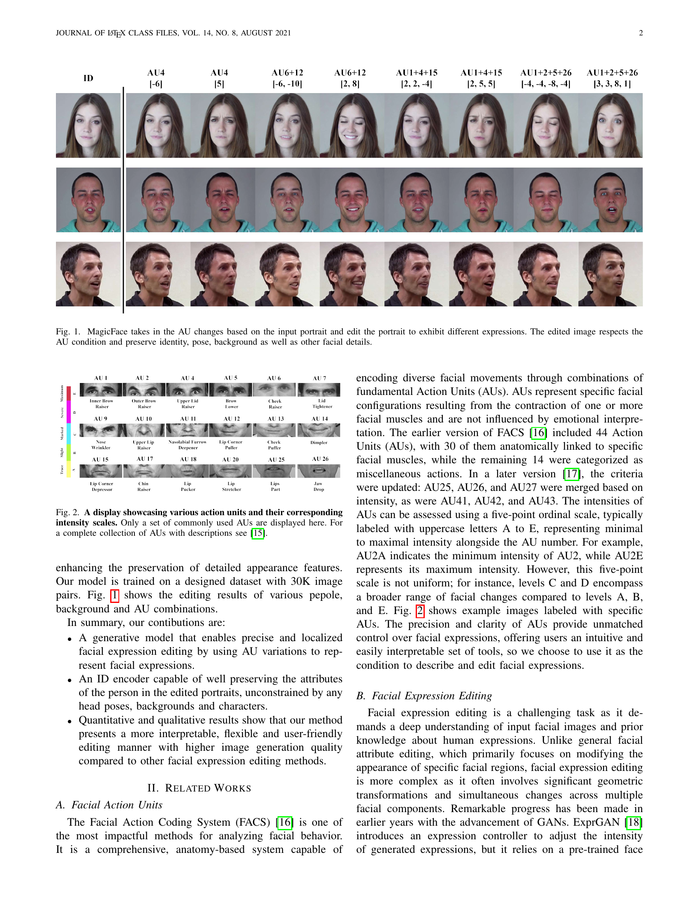
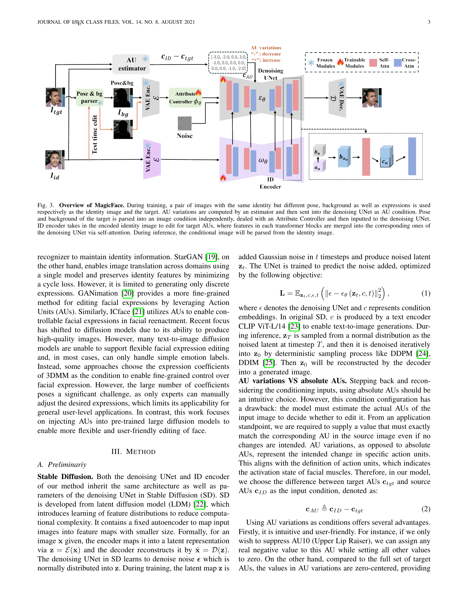
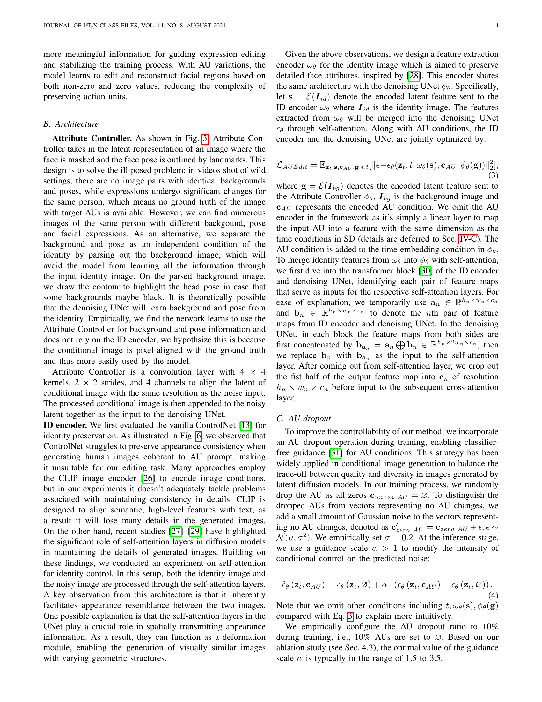
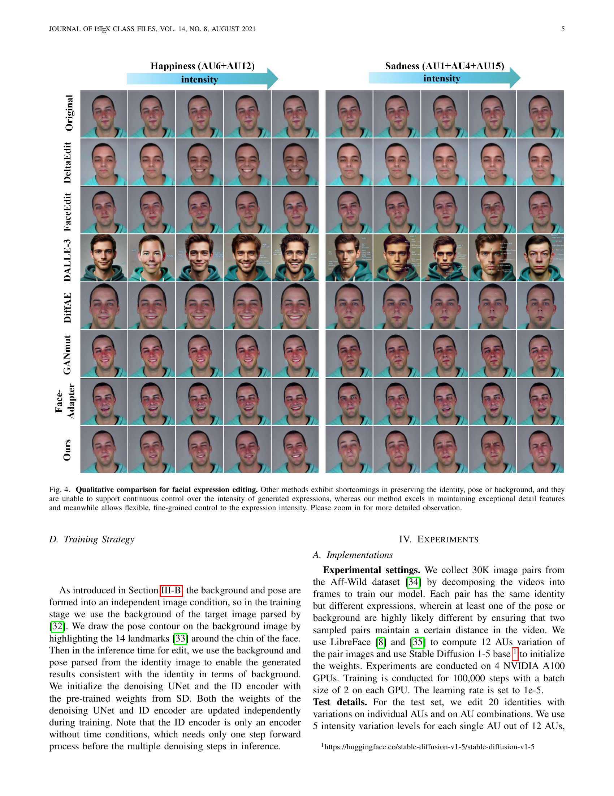
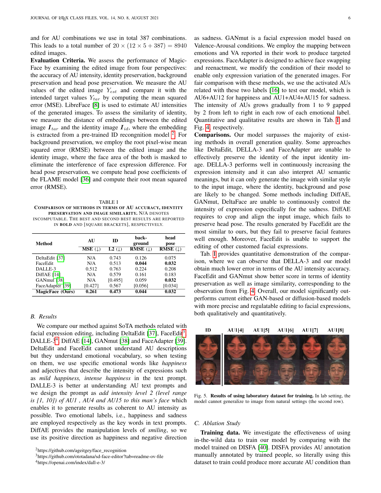
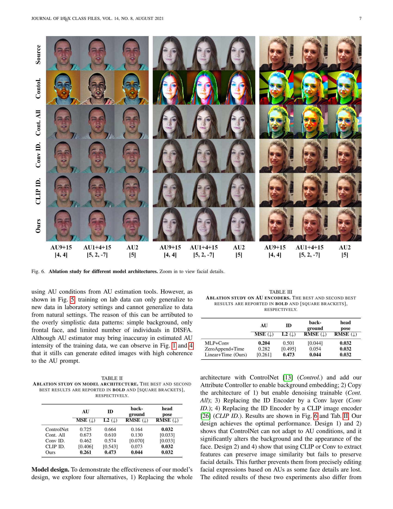
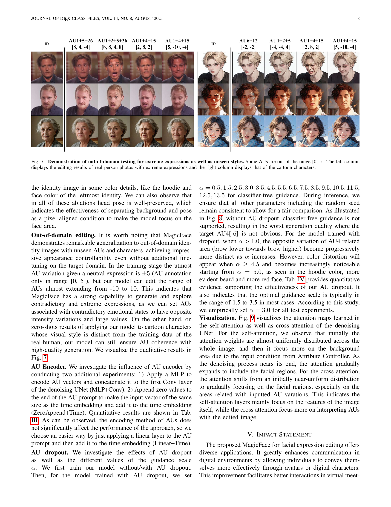
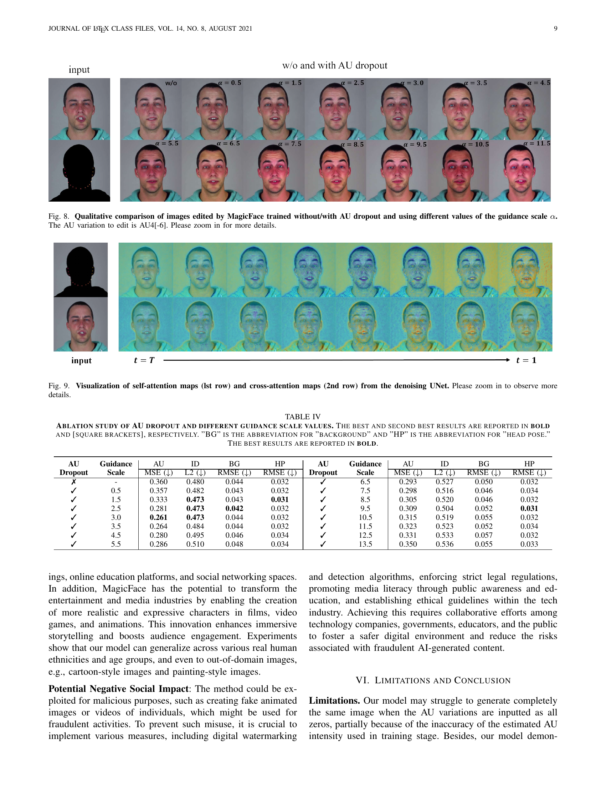
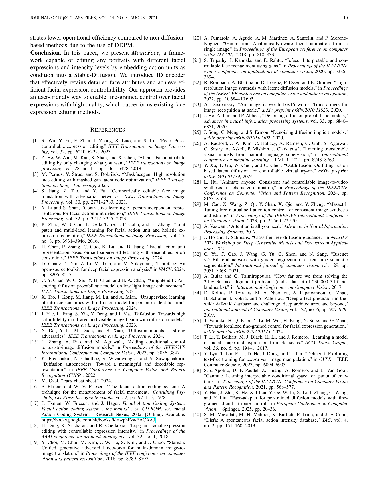

 


 2501.02260 
 Mengting Wei et el. 
 
 🤗 2025-01-08 
 



↗ arXiv


↗ Hugging Face


↗ Papers with Code


### TL;DR



기존의 얼굴 표정 편집 연구는 **표정 변화를 직관적으로 표현하고 제어하는 데 어려움**을 겪어왔습니다. 대부분의 기존 방법은 **잠재 공간(latent space)을 사용**하거나 **3DMM 매개변수**에 의존하는데, 이는 **비전문가에게는 사용하기 어렵고 해석이 어려운 문제**를 가지고 있습니다. 또한, 기존 모델들은 **배경이나 자세의 일관성을 유지하는 데 어려움**을 겪거나 **표정 편집의 자유도가 낮고 표현이 과장**되는 등의 한계를 보였습니다.

본 연구에서는 **Action Unit(AU) 변화를 이용하여 얼굴 표정을 제어하는 새로운 모델인 MagicFace를 제시**합니다.  MagicFace는 **Stable Diffusion 모델을 기반**으로 하며, **AU 변화를 노이즈 제거 네트워크(denoising UNet)에 주입**하여 원하는 표정을 생성합니다.  **ID 인코더를 사용하여 신원 정보를 보존**하고, **Attribute Controller를 통해 배경과 자세의 일관성을 유지**합니다. 또한, AU dropout 기법을 도입하여 **모델의 제어 성능을 향상시키고 과도한 표정 변형을 방지**합니다. 실험 결과, MagicFace는 **기존 방법보다 더욱 고품질의 얼굴 표정 편집 결과**를 생성하는 것으로 나타났습니다.



#### Key Takeaways


 AU(Action Unit) 변화를 이용해 얼굴 표정을 정밀하고 국소적으로 편집하는 새로운 방법 제시 



 ID 인코더와 Attribute Controller를 사용하여 신원, 자세, 배경 등을 보존하면서 고품질의 얼굴 표정 편집 결과 생성 



 AU dropout 기법을 활용하여 모델의 제어 성능 향상 및 다양성 확보 


#### Why does it matter?
이 논문은 **얼굴 표정 편집 분야에 고품질 결과를 생성하는 새로운 방법을 제시**하여, 연구자들이 **더욱 정교하고 해석 가능한 얼굴 표정 편집 모델을 개발하는 데 도움**을 줄 수 있습니다.  **AU(Action Unit) 기반의 제어 방식은 사용자 친화적이며 직관적**이기 때문에 다양한 응용 분야에서 활용될 수 있는 잠재력을 가지고 있으며, **기존 방법의 한계를 극복**하여 새로운 연구 방향을 제시하고 있습니다. 특히, **Stable Diffusion 모델을 활용한 고품질 이미지 생성은 시각적 인식 분야 연구에도 크게 기여**할 수 있을 것으로 예상됩니다.

------
#### Visual Insights

> 🔼 이 그림은 MagicFace 모델이 입력 초상화를 기반으로 AU(Action Unit) 변화를 받아들여 다른 표정을 짓도록 초상화를 편집하는 과정을 보여줍니다.  편집된 이미지는 AU 조건을 충족하면서 동시에 얼굴의 아이덴티티(ID), 자세(pose), 배경(background) 그리고 기타 세부 얼굴 특징들을 보존합니다.  다양한 AU 조합에 따른 표정 변화를 시각적으로 보여주는 여러 개의 이미지가 함께 제시되어 모델의 성능을 명확하게 설명합니다.
> 

> 
read the caption

> Figure 1: MagicFace takes in the AU changes based on the input portrait and edit the portrait to exhibit different expressions. The edited image respects the AU condition and preserve identity, pose, background as well as other facial details.
> 


| Method | AU | ID | background | head pose | 
|---|---|---|---|---| 
| DeltaEdit [37] | N/A | 0.743 | 0.126 | 0.075 | 
| FaceEdit | N/A | 0.513 | 0.044 | 0.032 | 
| DALLE-3 | 0.512 | 0.763 | 0.224 | 0.208 | 
| DiffAE [14] | N/A | 0.579 | 0.161 | 0.183 | 
| GANmut [38] | N/A | 0.495 | 0.059 | 0.032 | 
| FaceAdapter [39] | 0.427 | 0.567 | 0.056 | 0.034 | 
| **MagicFace (Ours)** | **0.261** | **0.473** | **0.044** | **0.032** | 

> 🔼 표 I은 AU 정확도, 정체성 보존 및 이미지 유사성 측면에서 다양한 방법들을 비교 분석한 결과를 보여줍니다.  'N/A'는 계산할 수 없는 값을 의미합니다.  각 지표(AU 정확도는 MSE, 정체성 보존은 L2 거리, 이미지 유사성은 RMSE)에 대해 최고 성능과 두 번째로 좋은 성능을 각각 **굵은 글씨**와 [대괄호]로 표시했습니다.  본 표는 제시된 다양한 방법들의 얼굴 표정 편집 성능을 정량적으로 비교하여 MagicFace 모델의 우수성을 보여주는 데 목적이 있습니다.
> 

> 
read the caption

> TABLE I: Comparison of methods in terms of AU accuracy, identity preservation and image similarity. N/A denotes incomputable. The best and second best results are reported in bold and [square brackets], respectively.
> 

### In-depth insights

#### AU-Based Editing
AU 기반 편집은 **얼굴 표정의 미묘한 변화를 정확하게 제어**할 수 있는 강력한 방법입니다.  **Action Unit(AU)**는 얼굴 근육의 움직임을 나타내는 표준화된 코드로, 이를 이용하면 **자연스럽고 사실적인 표정 편집**이 가능합니다. 기존의 방법들은 감정이나 단순한 표현(행복, 슬픔 등)을 이용했지만, AU 기반 편집은 **세밀한 근육 움직임까지 조절**하여 보다 정교한 편집이 가능하다는 장점이 있습니다.  **개별 AU의 강도를 조절**하여 다양한 표정을 만들어낼 수 있으며, 이는 **사용자의 의도를 명확하게 반영**하는 편집을 가능하게 합니다. **인물의 신원, 자세, 배경 등 다른 속성들을 유지**하면서 표정만 바꾸는 것 또한 AU 기반 편집의 중요한 특징입니다. 다만, **모든 AU의 정확한 측정과 해석**은 어려울 수 있으며, **AU 간의 상호 작용 및 복잡한 표정의 재현**에 대한 추가적인 연구가 필요합니다.

#### Diffusion Model
본 논문에서 확산 모델(Diffusion Model)은 **고품질 이미지 생성**에 탁월한 성능을 보이는 기법으로 제시됩니다. 특히, **안면 표정 편집**이라는 특정 과제에 초점을 맞춰, 행동 단위(AU) 변화를 조건으로 고해상도 이미지를 생성하는 데 활용됩니다.  기존의 GAN 기반 방법론과 비교하여, 확산 모델은 **더욱 사실적인 이미지**를 생성하고, **미세한 표정 변화**까지도 자연스럽게 표현할 수 있다는 장점이 있습니다.  **AU 변화를 직접적으로 조건으로 활용**함으로써, 사용자는 표정 편집 과정을 보다 직관적이고 세밀하게 제어할 수 있습니다.  이러한 강점은 사용자 친화적인 인터페이스를 통해 더욱 부각될 수 있으며, **다양한 응용 분야**에서 활용될 가능성을 제시합니다.

#### ID-Preserving Edits
본 논문에서 제시된 ID-Preserving Edits는 얼굴 표정 편집 과정에서 **개인의 신원 정보를 보존하는 데 초점**을 맞춥니다. 기존의 얼굴 표정 편집 기술들은 표정 변화에만 집중하여 개인 식별 정보가 손상되는 경우가 많았습니다. 하지만, ID-Preserving Edits는 **안면 특징을 유지하면서 표정만 변화시키는 기술**을 제시하여, **개인 식별 정보의 유지와 정확한 표정 편집을 동시에 달성**하는 것을 목표로 합니다. 이는 개인 식별 정보 보호의 중요성이 커지고 있는 현 시대에 매우 중요한 기술적 발전으로 평가될 수 있습니다.  특히 **고해상도 이미지에서의 높은 정확도**를 유지하면서, **배경이나 자세 등 다른 요소들을 유지**하며 표정만 변화시키는 기술은 향후 다양한 응용 분야에서 활용될 가능성이 높습니다.  **Action Unit(AU) 기반의 미세 조정**을 통해 자연스럽고 정확한 표정 편집이 가능하다는 점 또한 주목할 만합니다.  **Stable Diffusion과 같은 확산 모델 기반 기술**을 활용하여, 고품질 이미지 생성을 가능하게 합니다. 이는 단순한 표정 변화뿐 아니라, **더욱 자연스럽고 정교한 수준의 얼굴 표정 조작**을 가능하게 하는 핵심적인 요소입니다.  **ID-Preserving Edits는 기술적인 측면 뿐 아니라, 윤리적인 측면에서도 중요한 의미**를 지닙니다.  개인 정보 보호를 고려한 표정 편집 기술의 개발은, 향후 AI 기술의 발전과 윤리적 사용에 있어 중요한 기준이 될 것입니다.

#### Attribute Control
본 논문에서 ‘Attribute Control’은 배경과 자세를 제어하는 메커니즘으로 이해됩니다. **Attribute Controller**는 입력 이미지에서 얼굴 영역을 제외한 배경과 자세 정보를 추출하여, **Stable Diffusion 모델**에 조건 정보로 제공합니다. 이를 통해 **얼굴 표정 편집 시 배경과 자세의 일관성을 유지**하는 데 중요한 역할을 합니다.  기존 방법들은 배경과 자세의 변화에 대한 고려가 부족하여, 표정 편집 결과의 자연스러움이 떨어지는 한계를 보였습니다.  **본 논문의 Attribute Control은 이러한 문제를 해결**하여, 고품질의 얼굴 표정 편집 결과를 생성하는 데 기여합니다. 특히, 다양한 배경과 자세를 가진 이미지에 대해서도 일관된 결과를 생성할 수 있다는 점이 중요한 강점입니다.  이는 **모델의 일반화 능력을 향상**시키고 실제 응용 분야에서의 활용 가능성을 높입니다.  결론적으로,  Attribute Control은 **고품질의 얼굴 표정 편집을 위한 필수적인 요소**로, 본 논문의 주요 기여 중 하나입니다.

#### Generalizability
본 논문에서 다루는 얼굴 표정 편집 모델의 일반화 성능은 **다양한 인종, 성별, 연령대의 사람들**과 **다양한 배경 및 자세**를 가진 이미지에 대한 테스트를 통해 평가되어야 합니다.  **제한된 데이터셋**으로 학습된 모델은 특정 조건에 과적합될 수 있으므로, **일반화 성능을 높이기 위한 전략** (예: 데이터 증강, 도메인 적응 기법, 일반화 성능 향상을 위한 네트워크 구조 설계)이 필요합니다.  또한, **다양한 강도의 표정 변화**에 대한 모델의 반응 및 **극단적인 표정**에 대한 처리 능력 또한 일반화 성능의 중요한 지표가 됩니다.  **실제 환경에서 촬영된 이미지**에 대한 성능 평가는 모델의 실용성과 견고성을 판단하는 데 중요한 요소입니다.  **카툰 이미지와 같은 다른 도메인**에 대한 모델의 일반화 능력도 평가해야 할 필요가 있습니다.  **실험 결과**를 통해, 제시된 모델이 얼마나 **광범위한 조건**에서도 높은 정확도와 안정성을 유지하는지 보여주는 것이 중요합니다.

### More visual insights

More on figures

> 🔼 그림 2는 다양한 얼굴 움직임 단위(AU)와 해당 강도를 보여줍니다. 자주 사용되는 AU의 일부만 표시되어 있으며, AU에 대한 자세한 설명은 [15]를 참조하십시오. 이 그림은 얼굴 표정을 구성하는 기본적인 근육 움직임을 나타내는 AU를 시각적으로 보여주는 것을 목표로 합니다. 각 AU는 강도 수준(예: A에서 E까지)을 가지며, 이는 표정의 강도를 나타냅니다. 그림은 각 AU에 해당하는 얼굴 영역과 강도 수준 간의 관계를 보여주는 다양한 얼굴 표정을 보여줍니다.
> 

> 
read the caption

> Figure 2: A display showcasing various action units and their corresponding intensity scales. Only a set of commonly used AUs are displayed here. For a complete collection of AUs with descriptions see [15].
> 

> 🔼  그림 3은 MagicFace의 개요를 보여줍니다. 훈련 중에는 동일한 신원이지만 자세, 배경, 표현이 다른 두 이미지 쌍이 각각 신원 이미지와 대상 이미지로 사용됩니다. AU 변화량은 추정기로 계산된 다음 AU 조건으로 노이즈 제거 UNet으로 전송됩니다. 대상의 자세와 배경은 독립적인 이미지 조건으로 구문 분석되어 속성 제어기를 통해 처리된 후 노이즈 제거 UNet으로 입력됩니다. ID 인코더는 대상 AU를 편집할 인코딩된 신원 이미지를 받아들이며, 여기서 각 변압기 블록의 특징이 자기 주의를 통해 노이즈 제거 UNet의 해당 특징과 병합됩니다. 추론 중에는 조건부 이미지가 신원 이미지에서 구문 분석됩니다.
> 

> 
read the caption

> Figure 3: Overview of MagicFace. During training, a pair of images with the same identity but different pose, background as well as expressions is used respectively as the identity image and the target. AU variations are computed by an estimator and then sent into the denoising UNet as AU condition. Pose and background of the target is parsed into an image condition independently, dealed with an Attribute Controller and then inputted to the denoising UNet. ID encoder takes in the encoded identity image to edit for target AUs, where features in each transformer blocks are merged into the corresponding ones of the denoising UNet via self-attention. During inference, the conditional image will be parsed from the identity image.
> 

> 🔼 그림 4는 다양한 얼굴 표정 편집 방법들의 질적 비교를 보여줍니다. 기존 방법들은 얼굴의 신원, 자세 또는 배경을 유지하는 데 어려움을 겪고, 생성된 표현의 강도를 지속적으로 제어할 수 없다는 단점을 보입니다. 반면에 본 논문에서 제안하는 방법은 세부적인 특징을 탁월하게 유지하면서 표현 강도에 대한 유연하고 세밀한 제어를 허용합니다. 더 자세한 내용을 확인하려면 그림을 확대하여 관찰하십시오.
> 

> 
read the caption

> Figure 4: Qualitative comparison for facial expression editing. Other methods exhibit shortcomings in preserving the identity, pose or background, and they are unable to support continuous control over the intensity of generated expressions, whereas our method excels in maintaining exceptional detail features and meanwhile allows flexible, fine-grained control to the expression intensity. Please zoom in for more detailed observation.
> 

> 🔼 그림 5는 실험실 환경에서 수집된 데이터셋으로 학습된 모델이 실제 자연스러운 환경에서 촬영된 이미지에 일반화되지 못함을 보여줍니다. 1행은 실험실 환경에서 촬영된 이미지이고, 2행은 일반적인 환경에서 촬영된 이미지입니다.  실험실 이미지로 학습된 모델은 실험실 이미지에는 잘 작동하지만, 다양한 배경, 조명, 자세 등을 포함한 실제 세계 이미지에는 제대로 작동하지 못하는 것을 보여줍니다. 이는 모델의 일반화 능력이 제한적임을 시사합니다.
> 

> 
read the caption

> Figure 5: Results of using laboratory dataset for training. In lab setting, the model cannot generalize to image from natural settings (the second row).
> 

> 🔼 그림 6은 제안된 모델의 아키텍처에 대한 ablation study 결과를 보여줍니다.  다양한 모델 구조(ControlNet, ControlNet+Attribute Controller, Conv ID, CLIP ID)를 사용하여 얼굴 표정 편집 성능을 비교 분석하고 있습니다.  각 모델 아키텍처 별로 생성된 이미지들을 통해 ID 보존, 배경 유지, 포즈 유지, AU 정확도 등의 측면에서 차이를 시각적으로 확인할 수 있습니다. 자세한 차이점을 확인하려면 이미지를 확대하여 보는 것을 권장합니다.
> 

> 
read the caption

> Figure 6: Ablation study for different model architectures. Zoom in to view facial details.
> 

> 🔼 그림 7은 모델의 범용성을 보여주는 추가 실험 결과입니다. 훈련 데이터셋에는 없는 과장된 표정과 만화 캐릭터 이미지를 사용하여 실험하였습니다. 일부 AU 값은 0에서 5 사이의 기존 범위를 벗어나기도 합니다. 왼쪽 열은 실제 인물 사진에 과장된 표정을 적용한 결과를, 오른쪽 열은 만화 캐릭터 이미지에 표정을 적용한 결과를 보여줍니다. 이를 통해 MagicFace 모델이 다양한 스타일의 이미지에도 적용 가능함을 확인할 수 있습니다.
> 

> 
read the caption

> Figure 7: Demonstration of out-of-domain testing for extreme expressions as well as unseen styles. Some AUs are out of the range [0, 5]. The left column displays the editing results of real person photos with extreme expressions and the right column displays that of the cartoon characters.
> 

> 🔼 그림 8은 AU dropout 적용 여부와 안내 스케일 α의 값을 다르게 하여 학습된 MagicFace가 편집한 이미지의 질적 비교를 보여줍니다. 편집할 AU 변화는 AU4[-6]입니다. 세부 사항을 확인하려면 확대하여 보세요. 그림은 AU dropout을 사용하지 않고 학습된 모델과 AU dropout을 사용하여 학습된 모델의 결과를 보여줍니다. AU dropout을 사용하여 학습된 모델의 경우, 안내 스케일 α의 값이 증가함에 따라 AU4의 반대 변화(눈썹이 위로 올라감)가 점점 더 두드러집니다. 하지만 α≥4.5인 경우, 색상 왜곡이 나타나고 α≥5.0인 경우에는 더욱 두드러지게 나타납니다. 이는 AU dropout의 효과와 안내 스케일 α의 최적 값(1.5~3.5)을 보여주는 실험 결과입니다.
> 

> 
read the caption

> Figure 8: Qualitative comparison of images edited by MagicFace trained without/with AU dropout and using different values of the guidance scale α𝛼\alphaitalic_α. The AU variation to edit is AU4[-6]. Please zoom in for more details.
> 

> 🔼 그림 9는 잡음 제거 U-Net의 자기 주의 매핑(첫 번째 행)과 교차 주의 매핑(두 번째 행)을 시각화한 것입니다. 자세한 내용을 확인하려면 확대하여 보세요. 이 그림은 잡음 제거 U-Net 내부의 주의 메커니즘이 어떻게 작동하는지 보여줍니다.  특히, 자기 주의 매핑은 모델이 입력 이미지의 특징을 어떻게 포착하고 처리하는지 보여주며, 교차 주의 매핑은 모델이 AU 변화(Action Unit variations)와 같은 조건 정보를 어떻게 활용하여 이미지 생성을 제어하는지를 보여줍니다.  시간이 지남에 따라 주의가 배경에서 얼굴로, 특히 AU 변화와 관련된 영역으로 이동하는 것을 볼 수 있습니다.
> 

> 
read the caption

> Figure 9: Visualization of self-attention maps (lst row) and cross-attention maps (2nd row) from the denoising UNet. Please zoom in to observe more details.
> 

More on tables


| AU | ID | background | head pose | 
|---|---|---|---| 
| MSE (<math alttext="\downarrow" class="ltx_Math" display="inline" id="S4.T2.1.1.1.m1.1"><semantics id="S4.T2.1.1.1.m1.1a"><mo id="S4.T2.1.1.1.m1.1.1" stretchy="false" xref="S4.T2.1.1.1.m1.1.1.cmml">↓</mo><annotation-xml encoding="MathML-Content" id="S4.T2.1.1.1.m1.1b"><ci id="S4.T2.1.1.1.m1.1.1.cmml" xref="S4.T2.1.1.1.m1.1.1">↓</ci></annotation-xml><annotation encoding="application/x-tex" id="S4.T2.1.1.1.m1.1c">\downarrow</annotation><annotation encoding="application/x-llamapun" id="S4.T2.1.1.1.m1.1d">↓</annotation></semantics></math>) | L2 (<math alttext="\downarrow" class="ltx_Math" display="inline" id="S4.T2.2.2.2.m1.1"><semantics id="S4.T2.2.2.2.m1.1a"><mo id="S4.T2.2.2.2.m1.1.1" stretchy="false" xref="S4.T2.2.2.2.m1.1.1.cmml">↓</mo><annotation-xml encoding="MathML-Content" id="S4.T2.2.2.2.m1.1b"><ci id="S4.T2.2.2.2.m1.1.1.cmml" xref="S4.T2.2.2.2.m1.1.1">↓</ci></annotation-xml><annotation encoding="application/x-tex" id="S4.T2.2.2.2.m1.1c">\downarrow</annotation><annotation encoding="application/x-llamapun" id="S4.T2.2.2.2.m1.1d">↓</annotation></semantics></math>) | RMSE (<math alttext="\downarrow" class="ltx_Math" display="inline" id="S4.T2.3.3.3.m1.1"><semantics id="S4.T2.3.3.3.m1.1a"><mo id="S4.T2.3.3.3.m1.1.1" stretchy="false" xref="S4.T2.3.3.3.m1.1.1.cmml">↓</mo><annotation-xml encoding="MathML-Content" id="S4.T2.3.3.3.m1.1b"><ci id="S4.T2.3.3.3.m1.1.1.cmml" xref="S4.T2.3.3.3.m1.1.1">↓</ci></annotation-xml><annotation encoding="application/x-tex" id="S4.T2.3.3.3.m1.1c">\downarrow</annotation><annotation encoding="application/x-llamapun" id="S4.T2.3.3.3.m1.1d">↓</annotation></semantics></math>) | RMSE (<math alttext="\downarrow" class="ltx_Math" display="inline" id="S4.T2.4.4.4.m1.1"><semantics id="S4.T2.4.4.4.m1.1a"><mo id="S4.T2.4.4.4.m1.1.1" stretchy="false" xref="S4.T2.4.4.4.m1.1.1.cmml">↓</mo><annotation-xml encoding="MathML-Content" id="S4.T2.4.4.4.m1.1b"><ci id="S4.T2.4.4.4.m1.1.1.cmml" xref="S4.T2.4.4.4.m1.1.1">↓</ci></annotation-xml><annotation encoding="application/x-tex" id="S4.T2.4.4.4.m1.1c">\downarrow</annotation><annotation encoding="application/x-llamapun" id="S4.T2.4.4.4.m1.1d">↓</annotation></semantics></math>) | 
|---|---|---|---| 
| ControlNet | 0.725 | 0.664 | 0.164 | **0.032** | 
| Cont. All | 0.673 | 0.610 | 0.130 | [0.033] | 
| Conv ID. | 0.462 | 0.574 | [0.070] | [0.033] | 
| CLIP ID. | [0.406] | [0.543] | 0.073 | **0.032** | 
| Ours | **0.261** | **0.473** | **0.044** | **0.032** |
> 🔼 표 II는 모델 아키텍처에 대한 ablation study 결과를 보여줍니다.  ControlNet, ControlNet+Attribute Controller, Conv ID Encoder, CLIP ID Encoder 네 가지 모델 아키텍처를 비교하여 AU 정확도, ID 보존, 배경 보존, 자세 보존 측면에서 성능을 평가합니다. 가장 좋은 결과는 굵게 표시하고, 두 번째로 좋은 결과는 대괄호로 표시했습니다.  이 표를 통해 제안된 MagicFace 모델의 설계 선택이 성능에 미치는 영향을 분석하고 최적의 아키텍처를 확인하는 데 도움이 됩니다.
> 

> 
read the caption

> TABLE II: Ablation study on model architecture. The best and second best results are reported in bold and [square brackets], respectively.
> 


| | **AU** | **ID** | **background** | **headpose** |
|---|---|---|---|---|
| **MSE** (↓) | **L2** (↓) | **RMSE** (↓) | **RMSE** (↓) |  |
| MLP+Conv | **0.204** | 0.501 | [0.044] | **0.032** |
| ZeroAppend+Time | 0.282 | [0.495] | 0.054 | **0.032** |
| Linear+Time (Ours) | [0.261] | **0.473** | **0.044** | **0.032** |
> 🔼 표 III은 AU 인코더에 대한 ablation study 결과를 보여줍니다.  세 가지 AU 인코더 방법(MLP+Conv, ZeroAppend+Time, Linear+Time)을 비교하여 AU 정확도(MSE), ID 보존(L2), 배경 보존(RMSE), 자세 보존(RMSE) 측면에서 성능을 평가했습니다.  가장 좋은 결과는 굵은 글씨체로, 두 번째로 좋은 결과는 대괄호로 표시되어 있습니다.  이 표는 다양한 AU 인코더 아키텍처의 효과를 비교 분석하여 최적의 아키텍처를 선택하는 데 도움을 줍니다.
> 

> 
read the caption

> TABLE III: Ablation study on AU encoders. The best and second best results are reported in bold and [square brackets], respectively.
> 


| AU | Guidance | AU | ID | BG | HP | AU | Guidance | AU | ID | BG | HP |
|---|---|---|---|---|---|---|---|---|---|---|---| 
| **Dropout** | **Scale** | MSE (↓) | L2 (↓) | RMSE (↓) | RMSE (↓) | **Dropout** | **Scale** | MSE (↓) | L2 (↓) | RMSE (↓) | RMSE (↓) |
| ✗ | - | 0.360 | 0.480 | 0.044 | 0.032 | ✓ | 6.5 | 0.293 | 0.527 | 0.050 | 0.032 |
| ✓ | 0.5 | 0.357 | 0.482 | 0.043 | 0.032 | ✓ | 7.5 | 0.298 | 0.516 | 0.046 | 0.034 |
| ✓ | 1.5 | 0.333 | **0.473** | 0.043 | **0.031** | ✓ | 8.5 | 0.305 | 0.520 | 0.046 | 0.032 |
| ✓ | 2.5 | 0.281 | **0.473** | **0.042** | 0.032 | ✓ | 9.5 | 0.309 | 0.504 | 0.052 | **0.031** |
| ✓ | 3.0 | **0.261** | **0.473** | 0.044 | 0.032 | ✓ | 10.5 | 0.315 | 0.519 | 0.055 | 0.032 |
| ✓ | 3.5 | 0.264 | 0.484 | 0.044 | 0.032 | ✓ | 11.5 | 0.323 | 0.523 | 0.052 | 0.034 |
| ✓ | 4.5 | 0.280 | 0.495 | 0.046 | 0.034 | ✓ | 12.5 | 0.331 | 0.533 | 0.057 | 0.032 |
| ✓ | 5.5 | 0.286 | 0.510 | 0.048 | 0.034 | ✓ | 13.5 | 0.350 | 0.536 | 0.055 | 0.033 |
> 🔼 표 IV는 AU dropout과 다양한 guidance scale 값에 대한 ablation study 결과를 보여줍니다.  AU dropout을 적용하지 않은 경우와 다양한 guidance scale 값(0.5부터 13.5까지)을 사용했을 때 AU 정확도(MSE), identity 보존(L2), 배경 보존(BG RMSE), 자세 보존(HP RMSE) 지표를 측정했습니다.  가장 좋은 결과와 두 번째로 좋은 결과는 각각 굵은 글씨체와 대괄호로 표시되어 있습니다. 'BG'는 배경을, 'HP'는 머리 자세를 나타냅니다.  표는 AU dropout의 효과와 guidance scale의 최적 값을 확인하기 위한 실험 결과를 제시합니다.
> 

> 
read the caption

> TABLE IV: Ablation study of AU dropout and different guidance scale values. The best and second best results are reported in bold and [square brackets], respectively. ”BG” is the abbreviation for ”background” and ”HP” is the abbreviation for ”head pose.” The best results are reported in bold.
> 

### Full paper



