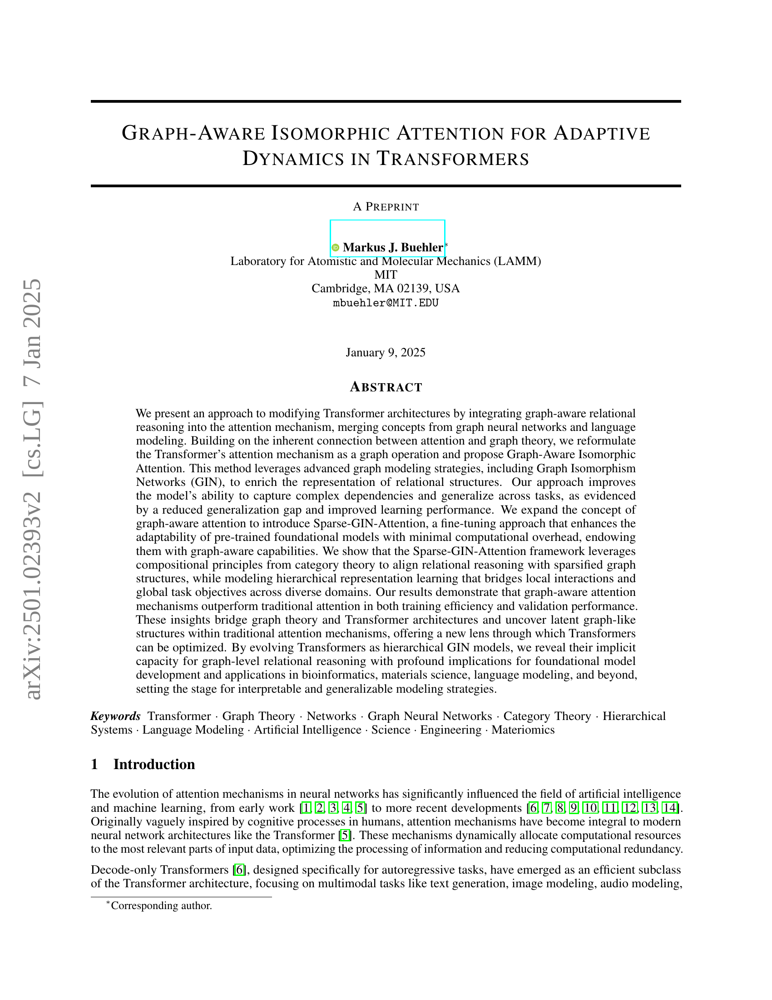

 


 2501.02393 
 Markus J. Buehler et el. 
 
 🤗 2025-01-08 
 



↗ arXiv


↗ Hugging Face


↗ Papers with Code


### TL;DR



기존의 트랜스포머 모델은 복잡한 관계를 효과적으로 포착하고 다양한 작업에 일반화하는 데 어려움이 있습니다. 특히, **기존의 어텐션 메커니즘은 순차적 데이터에 초점**을 맞춰 관계 추론에 한계가 있으며, **과학 및 기술 분야의 복잡한 관계 데이터**를 다루는 데 적합하지 않습니다. 이러한 문제를 해결하기 위해 본 논문에서는 **그래프 이론과 범주 이론을 트랜스포머 아키텍처에 통합**하는 새로운 접근 방식을 제시합니다.

본 논문에서는 **그래프 인식 이성질체 어텐션(Graph-Aware Isomorphic Attention)**이라는 새로운 방법을 제안합니다. 이 방법은 그래프 이성질체 네트워크(GIN)를 사용하여 관계 구조를 풍부하게 표현하고, **트랜스포머의 어텐션 메커니즘을 그래프 연산으로 재구성**합니다. 또한, **희소 GIN 어텐션**을 통해 사전 훈련된 모델을 최소한의 계산 비용으로 미세 조정하는 방법을 제시합니다. 실험 결과, 제안된 방법은 기존 방법보다 학습 성능과 일반화 성능이 향상됨을 보여줍니다. 이는 생물 정보학, 재료 과학, 자연어 처리 등 다양한 분야에 적용될 수 있는 잠재력을 가지고 있습니다.



#### Key Takeaways


 트랜스포머의 어텐션 메커니즘을 그래프 연산으로 재구성 



 그래프 이성질체 네트워크(GIN) 기반 어텐션 메커니즘 제시 및 성능 개선 



 희소 GIN 어텐션을 활용한 사전 훈련된 모델의 효율적인 미세 조정 전략 제시 


#### Why does it matter?
본 논문은 **트랜스포머 아키텍처의 일반화 및 해석력을 향상시키는 새로운 방법**을 제시하여, 다양한 과학 및 기술 분야의 연구자들에게 중요한 의미를 지닙니다. **그래프 이론 및 범주 이론을 활용한 새로운 관점**을 제시하고, **실험 결과를 통해 기존 방법보다 우수한 성능**을 보임으로써, 향후 연구의 새로운 방향을 제시하고 있습니다. 특히, **생물 정보학, 재료 과학, 자연어 처리 등 다양한 분야**에 적용 가능성을 보여줌으로써, 향후 연구 및 응용 분야의 폭넓은 확장을 기대할 수 있습니다.

------
#### Visual Insights

> 🔼 그림 1은 제시된 논문에서 제안하는 GNN 기반 자기 주의 메커니즘을 통합한 디코더 전용 트랜스포머 아키텍처를 보여줍니다. (A) 패널은 기존의 트랜스포머 아키텍처를 보여주고, GNN이 어떻게 자기 주의 메커니즘에 통합되는지 보여줍니다. Q와 K 값을 사용하여 각 헤드에 대한 인접 행렬을 구성하고, 이를 사용하여 인과 그래프를 정의합니다. 기존의 트랜스포머 모델에서는 V와의 곱셈이 단일 선형 계층을 통한 합계 집계에 해당하지만, GNN-Attention에서는 GIN과 PNA 변형을 포함한 더 복잡한 그래프 연산을 수행합니다. (B) 패널은 사전 훈련된 모델의 미세 조정에 적합한 또 다른 변형을 보여줍니다. 이 변형에서는 사전 훈련된 모델에 의해 예측된 인접 행렬을 유지하지만, 이를 사용하여 희소 인접 행렬을 구성합니다. 이를 기반으로 희소 GIN이 정의되고, 원래의 자기 주의 메커니즘의 신호가 추가되며, GIN 신호는 훈련 가능한 스케일 매개변수에 의해 조정됩니다. 이 변형에서는 희소 GIN 블록을 추가하는 것을 제외하고는 사전 훈련된 트랜스포머 아키텍처가 그대로 유지됩니다.
> 

> 
read the caption

> Figure 1: Decoder-only transformer architecture (panel A), adapted here by using a GNN-based self-attention mechanism with a graph neural network (Figure 3 shows how GNN-Attention is constructed for the specific case of GIN-Attention). Thereby Q𝑄Qitalic_Q and K𝐾Kitalic_K values are used to construct a per-head adjacency matrix, which is then used to define a causal graph. Whereas in standard transformer models the multiplication with V𝑉Vitalic_V corresponds to a summation aggregation via a single linear layer, in GNN-Attenion we conduct more complex graph operations, including the designation of a GIN and PNA variant. As another variant (panel B) suitable for fine-tuning a pre-trained model akin to a LoRA model, we introduce another option where we retain the adjacency matrix predicted by the pretrained model but instead use it to construct a sparse adjacency matrix. A Sparse GIN is defined based on this and the signal from the original attention mechanism and the GIN output is added, whereas the GIN signal is scaled by a trainable scale parameter. In this variant, the pre-trained Transformer architecture is kept intact except for the addition of the Sparse GIN block.
> 


| Hyperparameter | Value |
|---|---| 
| Learning Rate | 1e-4 |
| Per Device Train Batch Size | 8 |
| Per Device Eval Batch Size | 4 |
| Gradient Accumulation Steps | 4 |
| Number of Training Epochs | 9 |
| Weight Decay | 0.01 |
| Learning Rate Scheduler Type | Constant |
| Warmup Steps | 250 |
| Packing | False |
| Max Gradient Norm | 1 |

> 🔼 이 표는 논문의 실험 설정에 사용된 하이퍼파라미터들을 보여줍니다.  'Reference' 모델(기본 트랜스포머 모델), GIN-Attention 모델, PNA-Attention 모델, 그리고 각 모델의 여러 변형들을 훈련시키는 데 사용된 학습률, 배치 크기, 가중치 감쇠, 최대 그래디언트 놈 등의 하이퍼파라미터 값을 보여줍니다.  Hugging Face의 TRL 패키지를 사용하여 모델이 훈련되었으며, 훈련 및 테스트 손실은 100 스텝마다 계산되었습니다.  표의 목적은 다양한 모델 변형에 걸쳐 일관된 실험 설정을 제공하는 것입니다.
> 

> 
read the caption

> Table 1: Hyperparameters for model training (reference, GIN-Attention, PNA-Attention, and all variants), implemented in SFTTrainer that is part of the Hugging Face Transformer Reinforcement Learning (TRL) package (https://huggingface.co/docs/trl/en/index). Train and test loss is computed every 100 steps.
> 

### In-depth insights

#### Graph-Aware Attention
본 논문에서 제안하는 그래프 인식 어텐션은 **기존 트랜스포머의 어텐션 메커니즘을 그래프 연산으로 재구성**하여, 그래프 신경망(GNN)의 개념을 통합한 새로운 접근 방식입니다.  **어텐션 가중치를 그래프의 인접 행렬로 해석**하고, 그래프 이성질체 네트워크(GIN)와 같은 고급 그래프 모델링 전략을 활용하여 관계 구조를 풍부하게 표현합니다. 이를 통해 복잡한 의존성을 포착하고 다양한 작업에서 일반화 성능을 향상시키는 것을 목표로 합니다.  특히, **희소 GIN 어텐션**은 사전 훈련된 기본 모델의 적응성을 향상시키는 파인튜닝 기법으로, 계산 오버헤드를 최소화하면서 그래프 인식 기능을 부여합니다. 범주 이론의 구성 원리를 활용하여 관계 추론과 희소 그래프 구조를 정렬하고, 지역적 상호 작용과 전역적 작업 목표 간의 다리 역할을 합니다.  **결과적으로, 그래프 인식 어텐션 메커니즘은 훈련 효율성과 검증 성능 모두에서 기존 어텐션보다 우수한 성능**을 보여주는 것으로 나타났습니다.  이러한 연구는 그래프 이론과 트랜스포머 아키텍처를 연결하고, 트랜스포머를 최적화하는 새로운 관점을 제공합니다.

#### GIN-Attention Model
본 논문에서 제안된 GIN-Attention 모델은 **기존 트랜스포머의 어텐션 메커니즘을 그래프 연산으로 재구성**하여 그래프 이성질체 네트워크(GIN)의 강점을 활용한 새로운 접근법입니다.  **어텐션 메커니즘을 그래프로 해석**하여 노드 간 관계를 더욱 풍부하게 표현하고, **GIN을 활용한 비선형적 특징 추출**을 통해 복잡한 종속성을 포착하고 다양한 작업에 대한 일반화 성능을 향상시키는 데 중점을 둡니다.  **스파스 GIN-어텐션**은 사전 훈련된 모델의 적응성을 향상시키는 파인튜닝 기법으로, 계산 비용을 최소화하면서 그래프 인식 기능을 부여합니다.  **범주 이론의 구성 원리를 활용**하여 관계 추론과 희소 그래프 구조를 정렬하고 계층적 표현 학습을 통해 지역적 상호 작용과 전역적 작업 목표 간의 연결을 강화합니다.  결과적으로, **기존 어텐션 메커니즘보다 훈련 효율성과 검증 성능이 우수**함을 보여줍니다.  **생물정보학, 재료 과학, 자연어 처리 등 다양한 분야에 적용 가능성**을 제시하며, **트랜스포머의 해석 가능성을 높이고 일반화 성능을 개선**하는 데 기여합니다.

#### Sparse GIN Tuning
**희소 GIN 미세 조정**은 기존의 사전 훈련된 변환기 모델을 특정 작업에 적응시키기 위한 효율적인 전략입니다. 이 방법은 기존의 어텐션 메커니즘에서 예측된 인접 행렬을 사용하여 희소 그래프 신경망(Sparse GIN)을 변환기 아키텍처에 통합합니다. 이를 통해 모델은 데이터 내의 관계 구조를 효과적으로 포착하고 일반화 성능을 향상시킬 수 있습니다. **핵심은 사전 훈련된 모델의 기존 가중치를 유지하면서 희소 GIN 계층만 미세 조정하는 것입니다.** 이는 계산 비용을 최소화하면서 모델의 성능을 개선할 수 있다는 것을 의미합니다. 또한, 이 기법은 과적합을 줄이는 데에도 효과적입니다. **희소 GIN 미세 조정은 다양한 과학 및 기술 분야에서 관계형 데이터를 다루는 작업에 널리 적용될 수 있습니다.**  예를 들어, 생물 정보학, 재료 과학, 언어 모델링 등에서 유용하게 활용될 수 있습니다.  **핵심적인 매개변수인  `λ` (스케일링 매개변수)는 희소 GIN의 기여도를 조정하는 역할을 하여, 모델의 적응성을 높이는 데 중요한 역할을 합니다.**  전반적으로, **희소 GIN 미세 조정은 효율성과 성능 면에서 우수한 성능을 보이며, 사전 훈련된 모델을 특정 작업에 효과적으로 적응시키는 매력적인 방법**입니다.

#### Category Theory View
본 논문에서 제시된 범주 이론적 관점은 **트랜스포머 모델의 일반화 능력과 추상적 관계 표현 능력**을 이해하는 데 중요한 시각을 제공합니다. **트랜스포머 모델을 범주 이론적 관점에서 함수자(functor)로 해석**함으로써, 입력 표현과 출력 표현 사이의 구조적 일관성을 유지하면서 다양한 영역에 걸쳐 일반화하는 능력을 설명할 수 있습니다. 이러한 해석은 트랜스포머의 계층적 구조와 모듈성을 더 잘 이해하는 데 도움이 되며, **다양한 과업과 도메인에 적응**하는 능력을 설명하는 데 유용합니다. 특히, **어텐션 메커니즘을 범주 내의 사상(morphism)으로 간주**하고, 이를 통해 **관계 구조를 명시적으로 통합**함으로써 모델의 표현 능력을 향상시킬 수 있습니다.  이러한 범주 이론적 관점은 트랜스포머의 일반화 능력을 향상시키는 데 중요한 통찰력을 제공하며, 향후 연구에서 트랜스포머 아키텍처의 혁신적인 발전을 위한 새로운 방향을 제시할 것으로 기대됩니다.  **특히 과학적 응용 분야에서 범주 이론의 중요성**은 다양한 과학 도메인에서 발견되는 추상적 구조와 관계를 이해하고 일반화하는 데 도움이 됩니다.

#### Future Research
미래 연구 방향으로는 **다양한 모달리티와 도메인을 아우르는 멀티모달 및 크로스 도메인 응용**에 대한 연구가 중요합니다.  생물정보학, 재료과학, 유전체학, 시스템 생물학 등 관계형 및 순차적 데이터가 풍부한 분야에서 Transformer의 일반화 성능을 향상시키는 데 초점을 맞춰야 합니다. 또한, **설명 가능한 AI(XAI) 모델 개발**을 통해 의료, 환경 등 투명성이 중요한 분야에서의 적용성을 높여야 합니다. **효율적인 파인튜닝 기법**에 대한 연구도 필수적입니다.  **LoRA나 희소 GNN 파인튜닝**과 같은 매개변수 효율적인 방법을 사용하여 대규모 사전 학습 모델을 특정 작업에 적응시키는 기술을 발전시켜야 합니다.  **고급 그래프 추론**을 통한 복잡한 관계형 데이터 처리 능력 향상, 즉 **더 깊은 메시지 전달 신경망이나 계층적 그래프 구조**를 통합하는 연구가 필요하며, **범주 이론과 정보 병목 이론**과 같은 이론적 기반을 활용하여 Transformer의 일반화 성능을 향상시키는 방안을 탐구해야 합니다.  나아가, **자연어 처리와 사회 시스템의 상호 작용 연구**를 통해 사회적, 생태적 시스템의 관계 구조를 이해하고 예측하는 새로운 모델을 개발하는 것도 중요한 미래 연구 과제입니다.

### More visual insights

More on figures

> 🔼 그림 2는 인접 행렬의 시각화와 해당 인과 그래프의 해석을 보여줍니다. A 패널은 사전 훈련된 모델에서 추출한 특정 계층 및 헤드에 대한 인접 행렬의 시각적 표현을 보여줍니다. B 패널의 왼쪽은 상호 작용 강도가 색상으로 구분된 대규모 인접 행렬을 보여주며, 특정 관심 지점을 강조 표시하는 주석이 있습니다. B 패널의 오른쪽은 인접 행렬을 기반으로 노드 간의 방향성 관계를 보여주는 해당 인과 그래프를 보여줍니다. 이러한 시각화는 인접 행렬에 인코딩된 구조적 및 인과적 관계에 대한 통찰력을 제공합니다.
> 

> 
read the caption

> Figure 2: Visualization of adjacency matrices and interpretation of corresponding causal graphs. Panel A: Visual representation of an adjacency matrix for one specific layer and one head, extracted from a pretrained model. Panel B, left shows a large-scale adjacency matrix, where interaction strengths are color-coded, with annotations highlighting specific points of interest. Panel B, right displays the corresponding causal graph, illustrating directional relationships between nodes based on the adjacency matrix. These visualizations provide insights into the structural and causal relationships encoded in the adjacency matrices.
> 

> 🔼 그림 3은 제안된 GIN-Attention 메커니즘의 구성을 보여줍니다.  Transformer의 각 계층에서 self-attention을 통해 생성된 attention matrix를 보여줍니다.  이 그림은 Transformer의 각 층에서 self-attention을 통해 얻어진 숨겨진 상태(hidden states)의 입력 임베딩(input embeddings)을 사용하여 어떻게 attention matrix가 구성되는지 보여주는 흐름도입니다.  attention matrix가 계산된 후, 추가적인 처리(sharpening, thresholding 등)를 거쳐 GNN (Graph Neural Network) 기반의 aggregation 과정을 거치게 됩니다.  GIN-MLP(Multi-Layer Perceptron)를 적용하기 전에 추가적인 처리(aggregation) 과정을 거칩니다. 논문에서 설명하는 대체적인 PNA(Principal Neighborhood Aggregation) 처리 방식도 개념적으로 유사하지만, query, key, value projection 이후 최대 4가지의 서로 다른 aggregation 방식을 사용하고, 이를 연결하여 MLP를 통해 다시 hidden dimension으로 projection 한다는 차이가 있습니다. 
> 

> 
read the caption

> Figure 3: Construction of the GIN-Attention mechanism. The flowchart shows how input embeddings in the hidden states in each layer in the transformer via self-attention are used to construct the attention matrix. The output is processed further before aggregation and GIN-MLP application. The alternative PNA processing discussed in the paper is done in a conceptually similar way, except that we use query, key and value projections followed by developing up to four distinct aggregrations that are concatenated and then projected back into the hidden dimension via a MLP.
> 

> 🔼 그림 4는 기본 변압기 모델( '기준' 모델로 식별됨)과 GIN 모델의 훈련 및 검증 성능을 보여줍니다. (A)는 훈련 에포크에 따른 기본 변압기 모델과 GIN 모델의 훈련 손실을 비교한 그래프입니다. (B)는 훈련 에포크에 따른 기본 변압기 모델과 GIN 모델의 검증 퍼플렉서티를 비교한 그래프입니다. (C)는 모든 에포크에서 측정된 최소 검증 손실을 보여주는 막대 그래프입니다. 기본 변압기 모델의 최소 검증 손실은 5번째 에포크에서, GIN 모델의 최소 검증 손실은 8번째 에포크에서 발견됩니다.
> 

> 
read the caption

> Figure 4: Training and validation performance of the regular transformer model (identified as “Reference” model)) and the GIN model. A, Training loss comparing the regular transformer and GIN model, over training epochs. B, Validation perplexity comparing the regular transformer and GIN model, over training epochs. C, Minimum validation loss measured across all epochs. The minimum validation loss is found in epoch 5 for the regular transformer model, and in epoch 8 for the GIN model.
> 

> 🔼 그림 5는 GIN 모델 학습 종료 시점에서 모든 레이어 i에 대한 선명도 매개변수 αi의 분포를 보여줍니다. 선명도 매개변수 αi는 softmax 함수를 적용하기 전에 로짓을 조정하여 어텐션 메커니즘의 초점을 제어합니다. αi=1.0 값은 추가적인 선명화 또는 스무딩 없이 표준 softmax 동작을 나타냅니다. αi의 변화는 학습 중에 서로 다른 레이어가 초점을 어떻게 조정하는지 보여줍니다. αi>1.0인 레이어는 보다 날카로운 어텐션 분포를 나타내어 특정 토큰에 더 집중하는 반면, αi<1.0인 레이어는 보다 부드러운 어텐션 분포를 생성하여 모든 토큰을 보다 고르게 고려합니다. 이러한 동작은 다양한 레이어에 대한 어텐션 메커니즘을 최적화하여 전반적인 성능을 향상시키는 GIN 모델의 적응적 특성을 반영합니다. 모든 모델은 약 25M개의 동일한 매개변수 수를 가지도록 구성됩니다.
> 

> 
read the caption

> Figure 5:  The distribution of the sharpening parameter αisubscript𝛼𝑖\alpha_{i}italic_α start_POSTSUBSCRIPT italic_i end_POSTSUBSCRIPT across all layers i𝑖iitalic_i in the GIN model at the end of training. The sharpening parameter αisubscript𝛼𝑖\alpha_{i}italic_α start_POSTSUBSCRIPT italic_i end_POSTSUBSCRIPT controls the focus of the attention mechanism by scaling the logits before applying the softmax function. A value of αi=1.0subscript𝛼𝑖1.0\alpha_{i}=1.0italic_α start_POSTSUBSCRIPT italic_i end_POSTSUBSCRIPT = 1.0 corresponds to the standard softmax behavior, where no additional sharpening or smoothing is applied. The variation of αisubscript𝛼𝑖\alpha_{i}italic_α start_POSTSUBSCRIPT italic_i end_POSTSUBSCRIPT indicates how different layers adjust their focus during training. Layers with αi>1.0subscript𝛼𝑖1.0\alpha_{i}>1.0italic_α start_POSTSUBSCRIPT italic_i end_POSTSUBSCRIPT > 1.0 exhibit sharper attention distributions, focusing more strongly on specific tokens, while layers with αi<1.0subscript𝛼𝑖1.0\alpha_{i}<1.0italic_α start_POSTSUBSCRIPT italic_i end_POSTSUBSCRIPT < 1.0 produce smoother attention distributions, allowing a more even consideration of all tokens. This behavior reflects the adaptive nature of the GIN model in optimizing attention mechanisms for different layers to improve overall performance. All models are constructed to have approximately the same number of parameters, 25M.
> 

> 🔼 그림 6은 다양한 실험 결과에서 측정된 최소 훈련 손실과 최소 검증 당황도를 보여줍니다. '기준'으로 식별된 경우는 일반적인 트랜스포머 아키텍처입니다. 고려된 경우에는 PNA 어텐션, GIN 어텐션 및 각 시나리오 내의 변형이 포함됩니다. 가장 낮은 검증 당황도를 가진 최고 성능 모델은 소프트맥스와 MLP 승수 γ가 0.5인 GIN 어텐션이며, 훈련 가능한 선명화 매개변수가 있습니다. 한 경우를 제외하고 모든 GIN 모델 아키텍처는 기준 표준 어텐션보다 성능이 우수합니다. 어떤 PNA 아키텍처도 기준 사례를 개선하지 못하여 이 아키텍처 개념은 실현 가능하지 않음을 시사합니다.
> 

> 
read the caption

> Figure 6: Minimum training loss and minimum validation perplexity measured, across a variety of cases. The case identified as “Reference” is a regular transformer architecture. Cases considered include PNA attention, GIN attention, and variations within each scenario. The best performing model with lowest validation perplexity is GIN attention with softmax and a MLP multiplier γ𝛾\gammaitalic_γ of 0.5, with trainable sharpening parameter. Except for one case, all GIN model architectures perform better than the reference standard attention. None of the PNA architectures improves upon the reference case, suggesting that this architectural concept is not viable.
> 

> 🔼 그림 7은 9번의 학습 에포크 후 측정된 다양한 모델의 일반화 성능과 훈련 효율성을 보여줍니다. Panel A는 여러 모델의 일반화 차이를 보여줍니다. 기준 모델(Reference)은 과적합으로 인해 가장 큰 일반화 차이를 보입니다. Softmax와 다양한 MLP 승수를 사용하는 GIN(그래프 동형 네트워크) 모델은 일반화 차이가 감소했습니다. 특히 승수 γ가 0.5이고 o_proj가 없는 GIN 모델은 가장 낮은 일반화 차이를 보였습니다. SharpSoftplus 활성화 함수와 고정 임계값을 사용하는 PNA 모델 또한 기준 모델보다 일반화 성능이 향상되었습니다. 이는 모델 구조 선택이 일반화 성능에 미치는 영향을 보여줍니다. Panel B는 가장 낮은 훈련 손실과 검증 손실의 비율을 보여줍니다. 승수 γ가 0.5이고 o_proj가 없는 GIN 모델에서 가장 낮은 비율을 보였습니다.
> 

> 
read the caption

> Figure 7: Further training dynamics analysis. Panel A: Generalization gap for selected cases that perform well overall, measured after 9 training epochs. The reference model shows the highest generalization gap, indicating overfitting. Models using GIN (Graph Isomorphism Network) with Softmax and varying MLP multipliers demonstrate reduced generalization gaps, with the GIN configuration using a multiplier γ𝛾\gammaitalic_γ of 0.5 and sharpening achieving without o_proj one of the lowest gaps. The PNA configuration with SharpSoftplus activation and a fixed threshold also exhibits improved generalization compared to the reference. This comparison highlights the effect of architectural choices on model generalization. Panel B: Ratio of lowest training loss to lowest validation loss achieved. The lowest ratio is also found for the GIN model using a multiplier γ𝛾\gammaitalic_γ of 0.5 and sharpening achieving without o_proj.
> 

> 🔼 그림 8은 GIN MLP 승수 비율(γ)의 함수로서 최소 검증 당황도를 보여줍니다. 이 그래프는 다양한 구성(MLP_mult=0.5, sharpening, MLP_mult=0.5, MLP_mult=1, MLP_mult=4)에 대해 GIN MLP 승수 γ와 검증 당황도 간의 관계를 보여줍니다. 데이터 점은 역 제곱 법칙 추세선으로 적합되어 GIN MLP 승수 비율이 증가함에 따라 검증 당황도가 증가함을 나타냅니다. 낮은 MLP 비율(예: MLP_mult=0.5)을 가진 구성은 더 나은 검증 당황도를 보여주어 승수 비율과 일반화 간의 상충 관계를 시사합니다.
> 

> 
read the caption

> Figure 8: Minimum validation perplexity as a function of the GIN MLP multiplier ratio γ𝛾\gammaitalic_γ. The plot demonstrates the relationship between the GIN MLP multiplied γ𝛾\gammaitalic_γ and validation perplexity for various configurations: MLP_mult=0.5, sharpening, MLP_mult=0.5, MLP_mult=1, and MLP_mult=4. The data points are fitted with a power law trend line, indicating an increase in validation perplexity as the GIN MLP multiplier ratio grows. Configurations with lower MLP ratios (e.g., MLP_mult=0.5) exhibit better validation perplexity, suggesting a trade-off between multiplier ratio and generalization.
> 

> 🔼 그림 9는 LoRA 미세 조정과 희소 GIN 미세 조정의 성능을 비교한 것입니다. 희소 GIN 미세 조정에서는 사전 훈련된 모델에서 계산된 어텐션 행렬을 인접 행렬로 해석합니다. 여기서 모든 헤드에 걸쳐 어텐션 행렬을 합산하고 1.0으로 클램핑한 후, 이를 GIN 모델의 입력으로 사용합니다. 0.2보다 큰 인접 행렬 값만 고려하여, 희소성과 계산 효율성을 높였습니다. LoRA와 희소 GIN은 동일한 수의 훈련 가능한 매개변수를 가지고 있습니다. 패널 A는 LoRA와 희소 GIN에 대한 에포크당 훈련 손실을 보여줍니다. 희소 GIN은 LoRA보다 더 빠른 수렴과 낮은 최종 훈련 손실을 보여주어, 향상된 최적화 효율성을 나타냅니다. 패널 B는 LoRA와 희소 GIN에 대한 에포크당 검증 퍼플렉서티를 보여줍니다. 희소 GIN은 모든 에포크에서 더 낮은 퍼플렉서티를 달성하여, 보이지 않는 데이터에 대한 더 나은 일반화를 시사합니다.
> 

> 
read the caption

> Figure 9: Performance of LoRA fine-tuning (panel A) and sparse GIN fine-tuning. In sparse GIN fine-tuning, we interpret the attention matrix computed by the pre-trained model as an adjacency matrix. Here, we sum attention matrices across all heads and clamp at 1.0, and then use it as an input to a GIN model. Only adjancy matrix values above a threshold of 0.2 are considered, introducing a sparseness and computational efficiency. Both LoRA and sparse GIN feature the same number of trainable parameters. Panel A: Training loss over epochs for LoRA and sparse GIN. Sparse GIN demonstrates faster convergence and lower final training loss compared to LoRA, indicating improved optimization efficiency. Panel B: Validation perplexity over epochs for LoRA and sparse GIN. Sparse GIN achieves lower perplexity across all epochs, suggesting better generalization to unseen data.
> 

> 🔼 그림 10은 모델의 모든 k 계층에 걸쳐 모든 에포크에 걸쳐 그려진 학습 가능한 스케일 매개변수 λ를 보여줍니다. 학습 가능한 스케일 매개변수는 원래 신호에 추가된 희소 GIN의 상대적 중요성을 나타냅니다. 이 플롯은 스케일 매개변수가 계층 색인과 에포크 비율 모두에 따라 어떻게 변화하는지 보여줍니다. 학습 초기에는 상위 계층이 더 강한 스케일 값을 나타내어 희소 GIN 조정에 더 많이 의존함을 나타냅니다. 학습이 진행됨에 따라 스케일 값이 안정화되어 계층 전체에서 희소 GIN 기여의 상대적 중요성이 수렴됨을 시사합니다. 색상 그라디언트는 스케일 매개변수의 크기를 반영하며, 따뜻한 색상(빨간색)은 더 높은 값을, 차가운 색상(파란색)은 더 낮은 값을 나타냅니다. 이 시각화는 학습 과정에서 학습 가능한 스케일 매개변수의 적응적 동작에 대한 통찰력을 제공합니다.
> 

> 
read the caption

> Figure 10: Trainable scale parameter λ𝜆\lambdaitalic_λ over all k𝑘kitalic_k layers in the model, plotted over all epochs. The trainable scale parameter delineates the relative importance of the sparse GIN as it is added to the original signal. The plot illustrates how the scale parameter evolves over both the layer index and the epoch fraction. Early in training, higher layers exhibit stronger scaling values, indicating a higher reliance on sparse GIN adjustments. As training progresses, the scaling values stabilize, suggesting convergence in the relative importance of the sparse GIN contributions across layers. The color gradient reflects the magnitude of the scale parameter, with warmer colors (red) indicating higher values and cooler colors (blue) indicating lower values. This visualization provides insights into the adaptive behavior of the trainable scale parameter over the course of training.
> 

> 🔼 그림 11은 훈련 중 및 모델 계층 k에 따른 훈련 가능한 스케일 매개변수 λ의 전역 동역학을 보여줍니다. 패널 A는 훈련 단계에 따른 평균 훈련 가능한 스케일 매개변수를 시각화합니다. 이 플롯은 훈련 초기 단계에서 평균 스케일 매개변수가 빠르게 감소하는 것을 보여주며, 이는 스파스 GIN 기여도의 초기 적응을 나타냅니다. 초기 감소 후 스케일은 안정화되고 점진적으로 약간 증가하여 모델이 훈련이 진행됨에 따라 스파스 GIN 통합을 미세 조정함을 시사합니다. 패널 B는 마지막 에포크의 각 계층에 대한 훈련 가능한 스케일 매개변수를 표시합니다. 스케일 매개변수는 하위 계층에서 상위 계층으로 증가하는 추세를 보이며, 모델의 상위 계층에서 스파스 GIN에 대한 점진적으로 강한 의존성을 반영합니다. 이러한 계층별 스케일링은 스파스 GIN의 구조적 조정으로부터 상위 계층이 더 많은 이점을 얻는다는 것을 시사합니다.
> 

> 
read the caption

> Figure 11: Global dynamics of the trainable scale parameter λ𝜆\lambdaitalic_λ during training and across model layers k𝑘kitalic_k. Panel A visualizes the average trainable scale parameter over training steps. The plot illustrates a rapid decline in the average scale parameter during the initial stages of training, indicating early adaptation of the sparse GIN contributions. After the initial drop, the scale stabilizes and gradually increases slightly, suggesting the model fine-tunes the integration of sparse GIN as training progresses. Panel B displays the trainable scale parameter for each layer at the last epoch. The scale parameter exhibits an increasing trend from lower to higher layers, reflecting the progressively stronger reliance on sparse GIN in deeper layers of the model. This layer-wise scaling suggests that deeper layers benefit more from the structural adjustments provided by sparse GIN.
> 

> 🔼 그림 12는 다양한 모델 구성에 따른 검증 퍼플렉서티 비교 결과를 보여줍니다. (A) 막대 그래프는 GIN, 고정된 λ를 사용한 GIN, 고정된 λ와 더 작은 GNN을 사용한 GIN, 그리고 LoRA에 대한 검증 퍼플렉서티 값을 보여줍니다. 측정된 값과 오차 막대는 마지막 학습 에포크에서 측정된 퍼플렉서티의 표준 편차를 나타냅니다. GIN이 가장 낮은 퍼플렉서티를 달성한 반면, LoRA는 가장 높은 퍼플렉서티를 보였습니다. (B) 학습 가능한 크기 매개변수 λ를 보여줍니다. 이전 결과와 마찬가지로, 이 매개변수는 최종적으로 초기 레이어에서는 가장 작고 깊은 레이어에서는 가장 큰 값을 갖는 것으로 나타났습니다.
> 

> 
read the caption

> Figure 12: Validation perplexity comparison between different model configurations. Panel A: The bar plot illustrates the validation perplexity values for GIN, GIN with fixed λ𝜆\lambdaitalic_λ, GIN with fixed λ𝜆\lambdaitalic_λ and a smaller GNN, and LoRA. Measured values and error bars represent the standard deviation of the measured perplexity in the last training epoch. GIN achieves the lowest perplexity, while LoRA exhibits the highest perplexity. Panel B shows the trainable scale parameter λ𝜆\lambdaitalic_λ. Similar to the earlier results, the parameter is found to ultimately be smallest in earlier layers, and largest in deep layers.
> 

> 🔼  그림 13은 Transformer 구조에서 GIN-Attention의 반복적인 과정을 개념적으로 보여줍니다. 두 개의 레이어와 두 개의 헤드를 가진 모델을 예시로 사용하여 재료의 미세구조에 적용했습니다. 미세구조 데이터(예: 단백질 또는 폴리머)로 시작하여 초기 그래프 표현을 구성합니다. 각 레이어에서 여러 어텐션 헤드는 학습된 어텐션 점수를 기반으로 인접 행렬을 업데이트하여 동적으로 그래프 구조를 구축하고 개선합니다. 모든 헤드의 출력은 결합되어 업데이트된 그래프 표현을 생성하고, 이는 레이어를 거치면서 반복적으로 개선됩니다. 최종 학습된 표현은 구조적 및 관계적 통찰력을 통합하여 재료 특성을 예측하고, 구조-특성 관계를 밝히며, 새로운 재료를 설계할 수 있게 합니다. 이 프레임워크는 GIN-Attention이 동시에 그래프 구성과 특징 학습을 가능하게 함을 강조합니다.
> 

> 
read the caption

> Figure 13: Dynamic Graph Representation Learning with GIN-Attention in Transformers This schematic illustrates the iterative process of GIN-Attention in a Transformer architecture, applied to material microstructures, here conceptually shown for a model with two layers and two heads. Starting with raw microstructural data (e.g., proteins or polymers), an initial graph representation is constructed. At each layer, multiple attention heads dynamically build and refine graph structures by updating adjacency matrices based on learned attention scores. The outputs of all heads are merged to produce updated graph representations, which are iteratively refined across layers. The final learned representation integrates structural and relational insights, enabling the model to predict material properties, uncover structure-property relationships, and design novel materials. This framework highlights the simultaneous graph construction and feature learning facilitated by GIN-Attention.
> 

### Full paper



