 


 2501.02576 
 Ziyang Song et el. 
 
 🤗 2025-01-07 
 



↗ arXiv


↗ Hugging Face


↗ Papers with Code


### TL;DR



기존의 모노큘러 깊이 추정 방법들은 **느린 추론 속도** 또는 **일반화 성능 저하** 문제를 가지고 있었습니다. 특히, 확산 모델 기반 방법들은 반복적인 잡음 제거 과정으로 인해 추론 속도가 느리다는 단점이 있었습니다. 

본 논문에서는 이러한 문제를 해결하기 위해 **DepthMaster** 라는 새로운 단일 단계 확산 모델을 제안합니다. DepthMaster는 **Feature Alignment 모듈**을 통해 생성 모델의 특징을 차별적 깊이 추정 작업에 맞게 조정하고, **Fourier Enhancement 모듈**을 통해 세부적인 묘사를 개선합니다. 또한, **두 단계 훈련 전략**을 사용하여 모델의 성능을 최적화합니다.  DepthMaster는 기존 방법들에 비해 **더 빠른 속도**와 **더 높은 정확도**를 달성하였으며, 다양한 데이터셋에서 우수한 성능을 보였습니다.



#### Key Takeaways


 단일 단계 확산 모델을 사용하여 모노큘러 깊이 추정의 추론 속도를 크게 향상시켰습니다. 



 Feature Alignment 모듈과 Fourier Enhancement 모듈을 통해 깊이 추정의 정확도와 세부 묘사를 개선했습니다. 



 두 단계 훈련 전략을 통해 생성적 특징을 차별적 과제에 효과적으로 적용하는 방법을 제시했습니다. 


#### Why does it matter?
본 논문은 **단일 단계 확산 모델을 사용하여 모노큘러 깊이 추정의 정확도와 속도를 동시에 향상시키는 방법**을 제시함으로써, 자율 주행, 가상 현실 등 다양한 분야에 널리 활용될 수 있는 잠재력을 가지고 있습니다. 특히, **생성적 특징을 차별적 과제에 적용하는 새로운 접근법**을 제시하고, **기존 방법의 한계점을 극복하는 구체적인 모듈과 훈련 전략**을 제시하여, 향후 연구 방향을 제시하고 있습니다.

------
#### Visual Insights

> 🔼 그림 1은 세 가지 다른 방법(단순 디퓨전-디노이징, 제안된 Feature Alignment 모듈 적용, 제안된 Fourier Enhancement 모듈 적용)으로 깊이 예측을 수행한 결과를 보여줍니다.  디퓨전-디노이징 방식은 네트워크의 특징 표현 능력의 한계로 인해 질감 세부 사항을 과도하게 학습하고 실제 구조를 놓치는 경향이 있으며(3열의 노란색 박스), 이는 제안된 Feature Alignment 모듈을 통해 완화되지만, 반복적인 과정을 제거함으로써 결과가 흐릿해지는 문제점이 있습니다(4열의 빨간색 박스). 마지막으로, Fourier Enhancement 모듈을 추가로 적용한 최종 모델은 뛰어난 일반화 성능과 세부적인 디테일을 보여줍니다.
> 

> 
read the caption

> Figure 1: Visualization of different paradigms. “Denoise” refers to predicting depth in a diffusion-denoising way. Limited by the feature representation capability of the denoising network, predictions tend to overfit texture details and miss the real structure, as highlighted with yellow boxes in Column 3. “Stage1” alleviates this issue with the Feature Alignment module, but suffers from blurry outputs due to removing the iterative process, as highlighted with red boxes in Column 4. “Stage2” presents the final model fine-tuned with the Fourier Enhancement module, which exhibits excellent generalization and fine-grained details.
> 


| Method | Training Data | KITTI |  | NYUv2 |  | ETH3D |  | ScanNet |  | DIODE |  | Avg. Rank |
|---|---|---|---|---|---|---|---|---|---|---|---|---|
| Data-driven methods |  |  |  |  |  |  |  |  |  |  |  |  |
| DiverseDepth [14] | 320K | 19.0 | 70.4 | 11.7 | 87.5 | 22.8 | 69.4 | 10.9 | 88.2 | 37.6 | 63.1 | 7.0 |
| MiDaS [13] | 2M | 18.3 | 71.1 | 9.5 | 91.5 | 19.0 | 88.4 | 9.9 | 90.7 | 26.6 | 71.3 | 5.4 |
| LeReS [70] | 354K | 14.9 | 78.4 | 9.0 | 91.6 | 17.1 | 77.7 | 9.1 | 91.7 | 27.1 | 76.6 | 4.6 |
| Omnidata [12] | 12.2M | 14.9 | 83.5 | 7.4 | 94.5 | 16.6 | 77.8 | 7.5 | 93.6 | 33.9 | 74.2 | 3.8 |
| HDN [71] | 300K | 11.5 | 86.7 | 6.9 | 94.8 | 12.1 | 83.3 | 8.0 | 93.9 | 24.6 | 78.0 | 2.4 |
| DPT [10] | 1.4M | 11.1 | 88.1 | 9.1 | 91.9 | 11.5 | 92.9 | 8.4 | 93.2 | 26.9 | 73.0 | 3.4 |
| Depth Anything V2 [9] | 63.5M | 8.0 | 94.6 | 4.3 | 98.0 | 6.2 | 98.0 | 4.3 | 98.1 | 26.0 | 75.9 | 1.3 |
| Model-driven methods |  |  |  |  |  |  |  |  |  |  |  |  |
| Marigold [16] | 74K | 9.9 | 91.6 | 5.5 | 96.4 | 6.5 | 96.0 | 6.4 | 95.1 | 30.8 | 77.3 | 4.3 |
| GeoWizard [17] | 280K | 9.7 | 92.1 | 5.2 | 96.6 | 6.4 | 96.1 | 6.1 | 95.3 | 29.7 | 79.2 | 2.9 |
| DepthFM [18] | 74K | 9.1 | 90.2 | 6.0 | 95.5 | 6.5 | 95.4 | 6.6 | 94.9 | 22.4 | 78.5 | 4.5 |
| GenPercept [19] | 74K | 9.9 | 90.4 | 5.6 | 96.0 | 6.2 | 95.8 | 6.2* | 96.1* | 35.7 | 75.6 | 4.4 |
| Lotus [20] | 59K | 9.3 | 92.8 | 5.3 | 96.7 | 6.8 | 95.3 | 6.0 | 96.3 | 22.8 | 73.8 | 3.5 |
| DepthMaster (Ours) | 74K | 8.2 | 93.7 | 5.0 | 97.2 | 5.3 | 97.4 | 5.5 | 96.7 | 21.5 | 77.6 | 1.2 |

> 🔼 표 I은 제로샷 어파인 불변 단안 깊이 추정 방법에 대한 최첨단 방법들과의 정량적 비교 결과를 보여줍니다. 표의 상단은 데이터 기반 방법들을, 하단은 확산 모델 기반 방법들을 제시합니다. 모든 지표는 백분율 단위로 표시되며, 가장 좋은 결과는 굵게, 두 번째로 좋은 결과는 밑줄로 표시되어 있습니다. '*'는 Lotus가 재현한 결과를 나타냅니다.
> 

> 
read the caption

> TABLE I: Quantitative comparison with state-of-the-art zero-shot affine-invariant monocular depth estimation methods. The upper part lists data-driven methods and the lower part presents those based on diffusion models. All metrics are in percentage terms with “bold” best and “underline” second best. “*” stands for the results reproduced by Lotus.
> 

### In-depth insights

#### Diff. Model Adaption
본 논문에서 제시된 '확산 모델 적응(Diff. Model Adaption)' 전략은 **단일 단계 결정론적 패러다임**을 채택하여 기존의 반복적인 확산 모델의 느린 추론 속도 문제를 해결합니다.  **특징 정렬(Feature Alignment) 모듈**을 통해 고품질의 의미론적 특징을 통합하여 텍스처 디테일에 대한 과적합을 완화하고, **푸리에 향상(Fourier Enhancement) 모듈**을 사용하여 저주파 구조와 고주파 디테일을 적응적으로 조정하여 단일 단계에서도 세밀한 정보를 유지합니다. 이러한 두 모듈을 활용하는 **두 단계 학습 전략**은 먼저 전체적인 구조 학습에 집중한 후, 디테일을 개선하는 방식으로 모델의 성능을 최적화합니다.  **결론적으로, 이러한 적응 전략은 생성적 특징을 차별적 심도 추정 작업에 효과적으로 적용하여 일반화 성능과 디테일 보존 능력을 향상시키는 핵심 요소입니다.**

#### Feature Alignment
본 논문에서 제안하는 "Feature Alignment" 모듈은 **생성적 특징(generative features)을 판별적 과제(discriminative task)에 적용하는 데서 발생하는 과적합 문제를 완화**하는 데 중점을 둡니다.  기존의 확산 모델(diffusion model)은 이미지 재구성(image reconstruction)에 초점을 맞춰 훈련되기 때문에, 텍스처 디테일(texture details)에 과도하게 치중하는 경향이 있습니다. 이는 깊이 추정(depth estimation)과 같은 판별적 과제에는 적합하지 않을 수 있습니다.  본 모듈은 **고품질의 의미론적 특징(high-quality semantic features)**을 외부 인코더(external encoder)로부터 가져와, 확산 모델의 잠재 상태(latent states)와 정렬(align)함으로써 이러한 문제를 해결합니다.  **외부 인코더의 의미론적 정보를 통합**하여, 모델이 텍스처 디테일에 과도하게 의존하는 것을 방지하고, 보다 의미 있는 시맨틱 정보(semantic information)를 활용하여 깊이 추정 성능을 향상시키는 것이 핵심입니다.  **KL divergence를 최소화하는 방식**으로 특징 분포(feature distributions) 간의 차이를 줄여,  모델의 일반화 능력(generalization ability)을 높입니다.

#### Fourier Enhance
**Fourier Enhancement** 모듈은 단일 단계 예측의 한계를 극복하기 위해 고안되었습니다. 기존 확산 모델은 반복적인 디노이징 과정을 통해 고해상도의 세밀한 디테일을 생성하지만, 이 논문의 DepthMaster 모델은 단일 단계 접근 방식을 채택하여 속도를 향상시켰습니다. 이로 인해 고주파수 디테일 정보가 부족해지는 문제가 발생하는데, 이를 해결하기 위해 **주파수 영역에서 동작하는 Fourier Enhancement 모듈**이 제안됩니다.  **저주파수 구조 정보와 고주파수 디테일 정보 간의 균형을 조절**하여 다중 단계 처리의 효과를 모방함으로써, 단일 단계에서도 선명하고 디테일이 풍부한 깊이 맵을 생성하는 데 기여합니다.  이는 단순히 이미지를 재구성하는 데 그치지 않고, **깊이 정보의 질적 향상**에 중점을 둔 혁신적인 접근 방식으로 볼 수 있습니다.

#### Two-Stage Training
이 논문의 두 단계 학습 전략은 **모델의 일반화 능력과 세부 묘사 능력을 향상**시키기 위한 효과적인 방법론으로 제시됩니다. 1단계에서는 **Feature Alignment 모듈을 활용하여 전반적인 구조 학습**에 집중합니다. 고품질의 외부 시각 정보를 통합하여 잡음 제거 네트워크의 표현 능력을 향상시키고, 질감 세부 사항에 대한 과적합을 완화합니다. 2단계에서는 **Fourier Enhancement 모듈을 도입하여 세부적인 부분을 다듬습니다**. 주파수 영역에서 저주파 구조와 고주파 세부 정보 간의 균형을 조절하여 단일 단계 모델의 한계를 극복합니다. **두 모듈을 최대한 활용하기 위해 2단계 학습 전략**을 채택하여 각 단계의 강점을 살립니다. 이러한 접근 방식은 생성적 특징을 구체적인 작업에 맞게 조정하여 데이터 기반 방법과 모델 기반 방법 사이의 간극을 메우는 효과적인 전략임을 보여줍니다. DepthMaster 모델은 이를 통해 우수한 제로샷 성능과 세부 정보 보존 능력을 달성합니다.

#### Zero-Shot Depth
영상에서 깊이 정보를 추출하는 제로샷 깊이 추정(Zero-Shot Depth Estimation)은 **데이터 기반 접근법**과 **모델 기반 접근법** 두 가지 주요 방향으로 발전해 왔습니다. 데이터 기반 방식은 방대한 이미지-깊이 쌍을 활용하여 이미지와 깊이 간의 매핑을 학습하지만, 데이터 수집 및 학습에 많은 시간과 자원이 소모되는 단점이 있습니다. 반면 모델 기반 방식은 사전 학습된 백본, 특히 안정적인 확산 모델을 활용하여 효율성을 높이고자 합니다.  **DepthMaster**는 이러한 모델 기반 접근 방식의 한계를 극복하기 위해 고안된 방법으로, **생성적 특징을 판별적 깊이 추정 작업에 적용**하는 데 초점을 맞춥니다. 특히, 생성적 특징으로 인한 질감 세부 정보 과적합 문제와 단일 단계 결정론적 프레임워크의 미세한 세부 정보 부족 문제를 해결하는 데 중점을 둡니다. 이를 위해 **특징 정렬 모듈**과 **푸리에 강화 모듈**을 제안하며, 이를 통해 제로샷 깊이 추정의 일반화 및 세부 정보 보존 능력을 향상시키는 것을 목표로 합니다.

### More visual insights

More on tables


| Paradigm | KITTI AbsRel ↓ | KITTI δ₁ ↑ | NYUv2 AbsRel ↓ | NYUv2 δ₁ ↑ | ScanNet AbsRel ↓ | ScanNet δ₁ ↑ | ETH3D AbsRel ↓ | ETH3D δ₁ ↑ | DIODE AbsRel ↓ | DIODE δ₁ ↑ | Hypersim AbsRel ↓ | Hypersim F1 ↑ | Time (s) |
|---|---|---|---|---|---|---|---|---|---|---|---|---|---|---|
| I2L | - | - | 1.1 | 99.5 | 0.9 | 99.7 | - | - | 8.4 | 92.4 | 0.615 | - |
| Denoising | 10.4 | 90.2 | 5.7 | 96.0 | 6.9 | 94.6 | 6.4 | 95.7 | 30.9 | 76.8 | 0.274 | 12.91 |
| Deterministic* | 10.3 | 90.4 | 5.3 | 96.6 | 6.0 | 96.2 | 6.5 | 95.8 | 29.9 | 77.0 | 0.304 | 0.42 |
| Iterative | 10.0 | 91.1 | 5.2 | 96.7 | 5.9 | 96.1 | 6.1 | 96.3 | 29.4 | 77.8 | 0.310 | 0.83 |
> 🔼 표 II는 DepthMaster 모델의 추론 방식(패러다임)에 대한 비교 실험 결과를 보여줍니다.  'I2L'은 I2L 인코더-디코더에 깊이 맵을 입력하고 재구성된 깊이 맵을 출력하는 방식을 의미합니다. 'Denoising'은 확산-탈잡음 방식을 사용하여 깊이를 예측하는 방식이고, 'Deterministic'은 RGB 이미지에서 직접 깊이를 예측하는 결정론적 방식입니다.  'Iterative'는 결정론적 방식으로 U-Net을 4회 반복하여 깊이를 정제하는 방식입니다. 표에는 각 방식에 대한 실험 결과(AbsRel, δ1, Inference Time)와 함께 DepthMaster 모델에서 사용된 방식(*)이 표시되어 있습니다.  본 실험은 다양한 깊이 추정 패러다임을 비교 분석하여 DepthMaster 모델의 효율성과 성능을 검증하기 위해 수행되었습니다.
> 

> 
read the caption

> TABLE II: Ablation of paradigm. “I2L” means feeding depth maps into I2L encoder-decoder and outputting reconstructed ones. “Denoising” and ”Deterministic” refer to predicting depth in diffusion-denoising and deterministic ways, respectively. “Iterative” means iterative refinement through the U-Net 4 times in a deterministic way. “*” indicates the paradigm we use.
> 


| Depth Preprocess | KITTI |  | NYUv2 |  | ETH3D |  | ScanNet |  | DIODE |  |
|---|---|---|---|---|---|---|---|---|---|---|
| AbsRel ↓ | δ₁ ↑ | AbsRel ↓ | δ₁ ↑ | AbsRel ↓ | δ₁ ↑ | AbsRel ↓ | δ₁ ↑ | AbsRel ↓ | δ₁ ↑ |
| depth(D) | 10.3 | 90.4 | 5.3 | 96.6 | 6.5 | 95.8 | 6.0 | 96.2 | 29.9 | 77.0 |
| disparity(1/D) | 8.9 | 92.4 | 5.3 | 97.0 | 6.7 | 96.7 | 5.7 | 96.3 | 22.4 | 74.0 |
| sqrt disp(1/√D) | 8.7 | 93.1 | 5.1 | 97.3 | 5.5 | 97.2 | 5.8 | 96.4 | 21.8 | 77.2 |
> 🔼 본 표는 depth pre-processing 방법의 영향을 분석한 결과를 보여줍니다. depth 대신 disparity를 예측하는 것이 outdoor 데이터셋에서 성능 향상을 가져오는 반면, square-root disparity를 사용하면 모든 데이터셋에서 일관된 성능 향상을 얻을 수 있음을 보여줍니다.
> 

> 
read the caption

> TABLE III: Ablation of depth preprocess. Predicting disparity instead of depth results in improved performance on outdoor datasets, while using square-root disparity leads to consistent improvements across all datasets.
> 


| External Model Type | KITTI |  | NYUv2 |  | ETH3D |  | ScanNet |  | DIODE |  |
|---|---|---|---|---|---|---|---|---|---|---|
| AbsRel ↓ | 8.7 | 93.1 | 5.1 | 97.3 | 5.5 | 97.2 | 5.8 | 96.4 | 21.8 | 77.2 |
| baseline |  |  |  |  |  |  |  |  |  |  |
| OpenCLIP [80] | 8.5 | 93.3 | 5.0 | 97.3 | 5.4 | 97.4 | 5.6 | 96.5 | 21.8 | 77.1 |
| AIMv2 [81] | 8.4 | 93.4 | 5.1 | 97.3 | 5.5 | 97.3 | 5.6 | 96.6 | 21.7 | 77.5 |
| SAM [82] | 8.3 | 93.5 | 5.0 | 97.3 | 5.3 | 97.5 | 5.5 | 96.7 | 21.7 | 77.2 |
| DINOv2 [66] | 8.3 | 93.7 | 5.0 | 97.3 | 5.3 | 97.4 | 5.5 | 96.7 | 21.6 | 77.5 |
> 🔼 본 표는 DepthMaster 모델의 Feature Alignment 모듈에서 다양한 외부 인코더를 사용했을 때의 성능 변화를 보여줍니다.  외부 인코더는 모델의 일반화 성능을 향상시키는 데 기여하며,  표에서 DINOv2가 가장 큰 성능 향상을 가져왔음을 확인할 수 있습니다.  각 외부 인코더에 대한 절대 상대 오차(AbsRel)와 정확도 지표(δ1, δ2)를 여러 데이터셋에 걸쳐 비교 분석하여 어떤 외부 인코더가 DepthMaster 모델의 성능 향상에 가장 효과적인지 보여줍니다.
> 

> 
read the caption

> TABLE IV: Ablation of External Model Type in Feature Alignment module. Introducing various external encoders can improve the generalization performance of the model, among which DINOv2 yields the greatest performance improvement.
> 


| Location | KITTI |  | NYUv2 |  | ETH3D |  | ScanNet |  | DIODE |  |
|---|---|---|---|---|---|---|---|---|---|---|
| baseline | 8.7 | 93.1 | 5.1 | 97.3 | 5.5 | 97.2 | 5.8 | 96.4 | 21.8 | 77.2 |
| D1 | 8.5 | 93.5 | 5.0 | 97.3 | 5.3 | 97.5 | 5.6 | 96.6 | 21.8 | 77.4 |
| D2 | 8.4 | 93.6 | 5.1 | 97.3 | 5.4 | 97.4 | 5.5 | 96.6 | 21.5 | 77.7 |
| Mid | 8.3 | 93.7 | 5.0 | 97.3 | 5.3 | 97.4 | 5.5 | 96.7 | 21.6 | 77.5 |
> 🔼 본 표는 U-Net의 다운샘플링 블록(D1, D2)과 중간 블록(Mid)에서 특징 정렬 모듈의 효과를 비교 분석한 결과를 보여줍니다. 특징 정렬 모듈을 적용한 위치에 따라 성능 변화를 살펴보고,  깊은 계층일수록 특징 정렬 모듈의 효과가 증가함을 보여줍니다.  즉,  U-Net의 낮은 계층보다는 높은 계층에 특징 정렬 모듈을 적용하는 것이 더 효과적임을 시사합니다.
> 

> 
read the caption

> TABLE V: Ablation of feature alignment location. “D1”, “D2” refer to the first and second down blocks of the U-Net, respectively. “Mid” means the middle block of the U-Net. The effectiveness of the Feature Alignment module increases as the number of the aligned layer grows deeper.
> 


| Model | pixel | Lh | FE | Two-stage | KITTI AbsRel ↓ | KITTI δ1 ↑ | NYUv2 AbsRel ↓ | NYUv2 δ1 ↑ | ETH3D AbsRel ↓ | ETH3D δ1 ↑ | Scannet AbsRel ↓ | Scannet δ1 ↑ | DIODE AbsRel ↓ | DIODE δ1 ↑ | HyperSim F1 ↑ |
|---|---|---|---|---|---|---|---|---|---|---|---|---|---|---|---|---|
| M.Base |  |  |  |  | 8.7 | 93.1 | 5.1 | 97.3 | 5.5 | 97.2 | 5.8 | 96.4 | 21.8 | 77.2 | 0.306 |
| M.Pixel | ✓ |  |  |  | 8.6 | 93.0 | 5.2 | 97.2 | 5.4 | 97.1 | 5.5 | 96.8 | 21.5 | 77.7 | 0.307 |
| M.Huber | ✓ | ✓ |  |  | 8.5 | 93.0 | 5.0 | 97.2 | 5.5 | 97.1 | 5.5 | 96.9 | 21.6 | 77.4 | 0.308 |
| M.FE_Huber | ✓ | ✓ | ✓ |  | 8.3 | 93.5 | 5.1 | 97.2 | 5.3 | 97.2 | 5.5 | 96.7 | 21.6 | 77.4 | 0.314 |
| M.Full | ✓ | ✓ | ✓ | ✓ | 8.2 | 93.7 | 5.0 | 97.2 | 5.3 | 97.4 | 5.5 | 96.7 | 21.5 | 77.6 | 0.337 |
> 🔼 표 VI는 제안된 모듈과 훈련 과정이 세부 정보 보존 기능을 효과적으로 향상시키는지 보여주는 세부 정보 보존에 대한 추가 분석 결과를 보여줍니다.  'pixel'은 픽셀 수준에서 제약 조건을 적용하는 것을 나타내고, 'FE'는 푸리에 향상 모듈을 나타내며,  'Lh'는 가중 다방향 그래디언트 손실을 나타내고, 'Two-stage'는 두 단계 훈련 과정을 나타냅니다. 이 표는 각 모듈과 훈련 전략이 개별적으로 그리고 조합하여 성능에 미치는 영향을 정량적으로 비교 분석하여, 제안된 방법의 효과를 명확히 제시합니다.
> 

> 
read the caption

> TABLE VI: Ablation of detail preservation. “pixel” indicates applying constraints at the pixel level. “FE” refers to the Fourier Enhancement module. “Lhsubscript𝐿ℎL_{h}italic_L start_POSTSUBSCRIPT italic_h end_POSTSUBSCRIPT” refers to the weighted multi-directional gradient loss. “Two-stage” means the two-stage training curriculum. The proposed modules and training curriculum effectively enhance the detail preservation capability.
> 

### Full paper


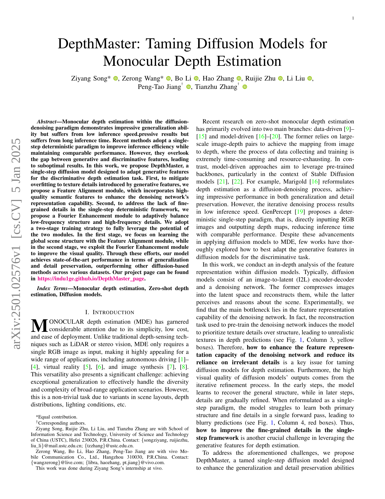
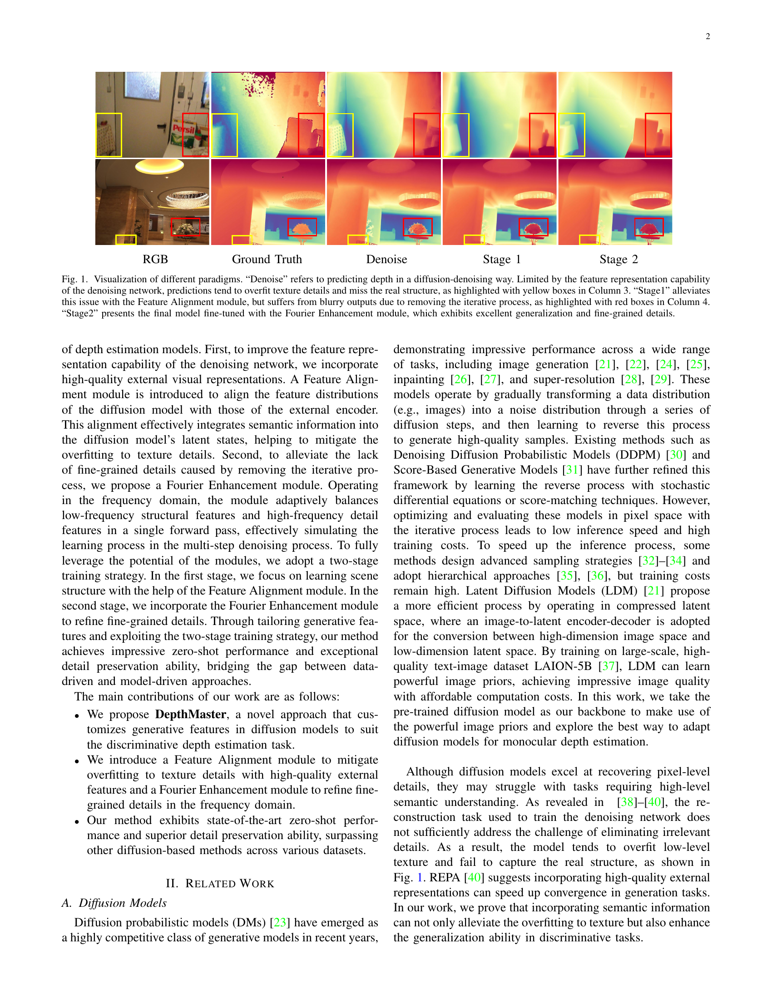
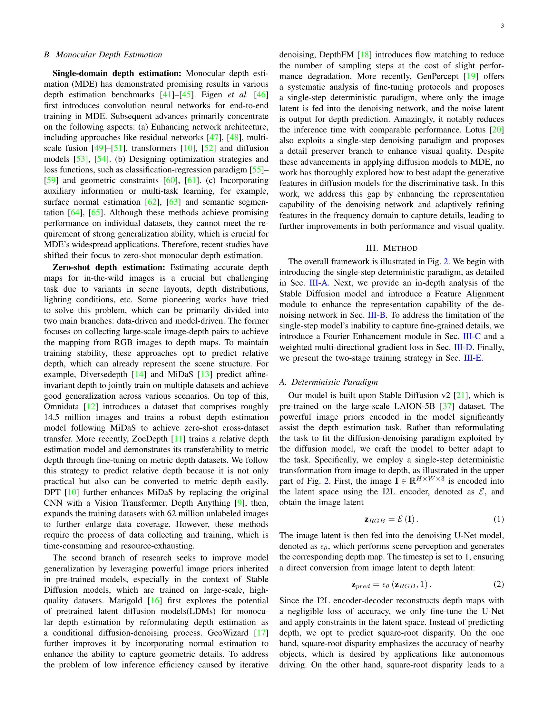
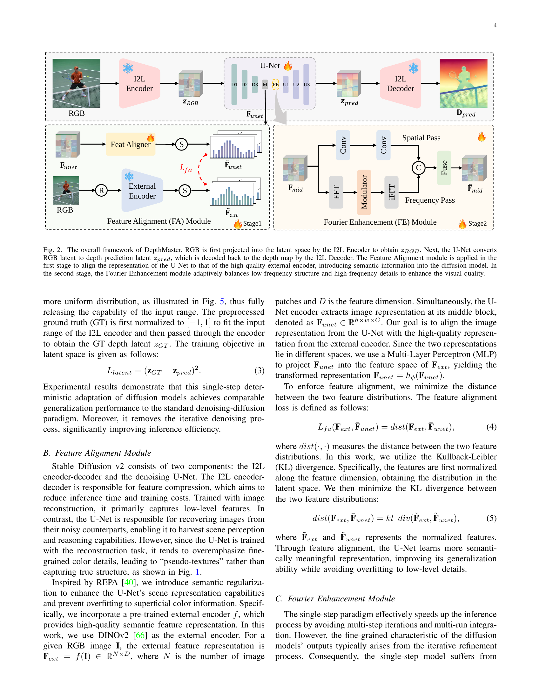
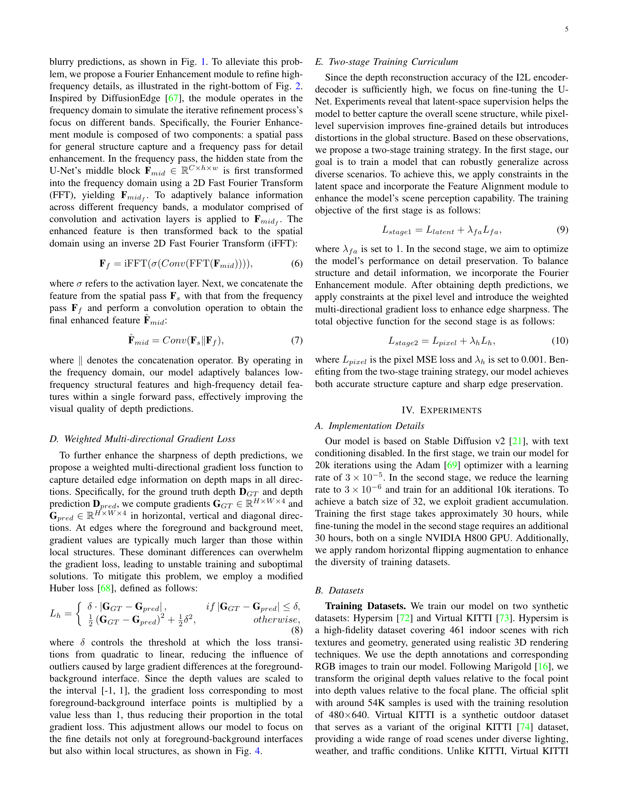
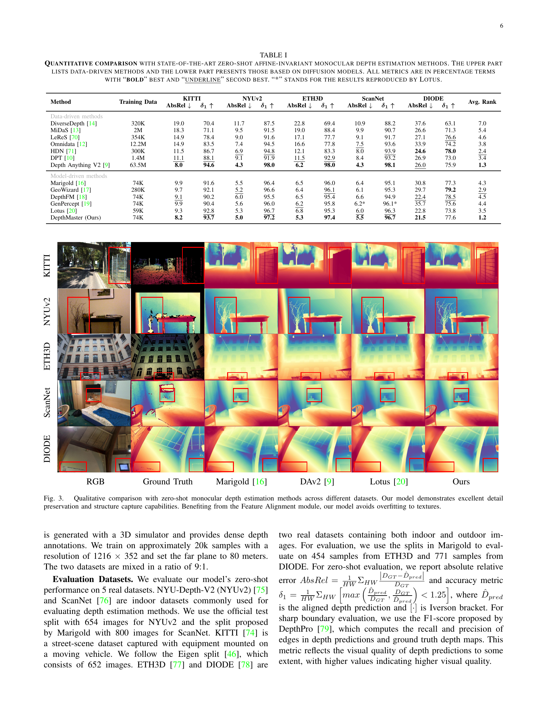
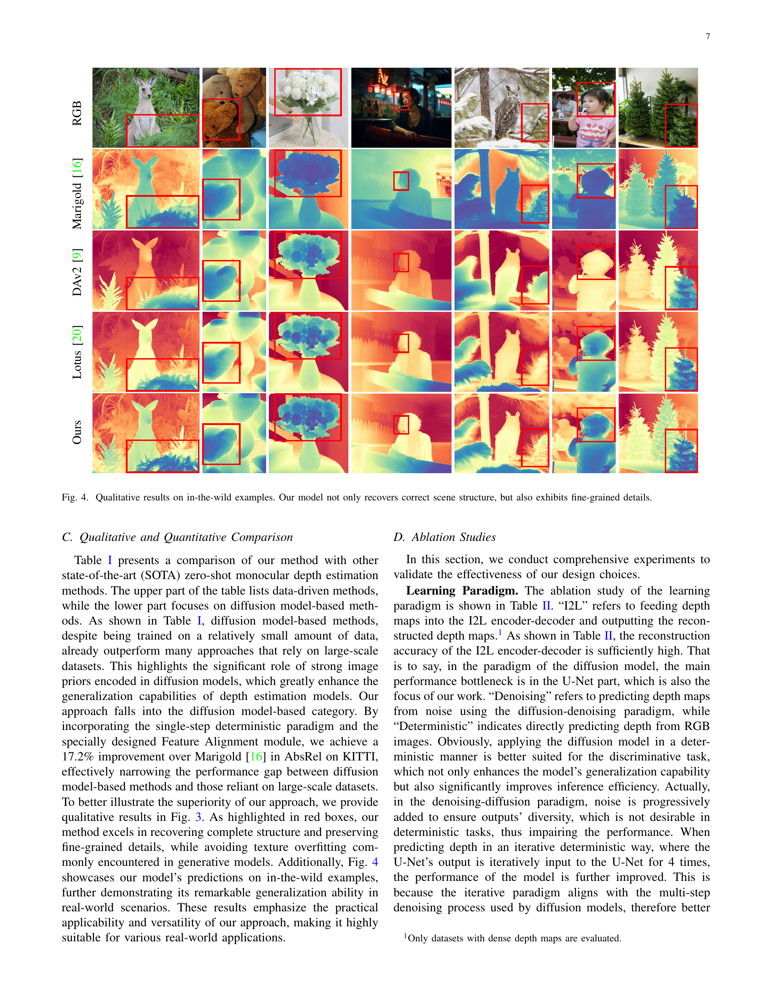
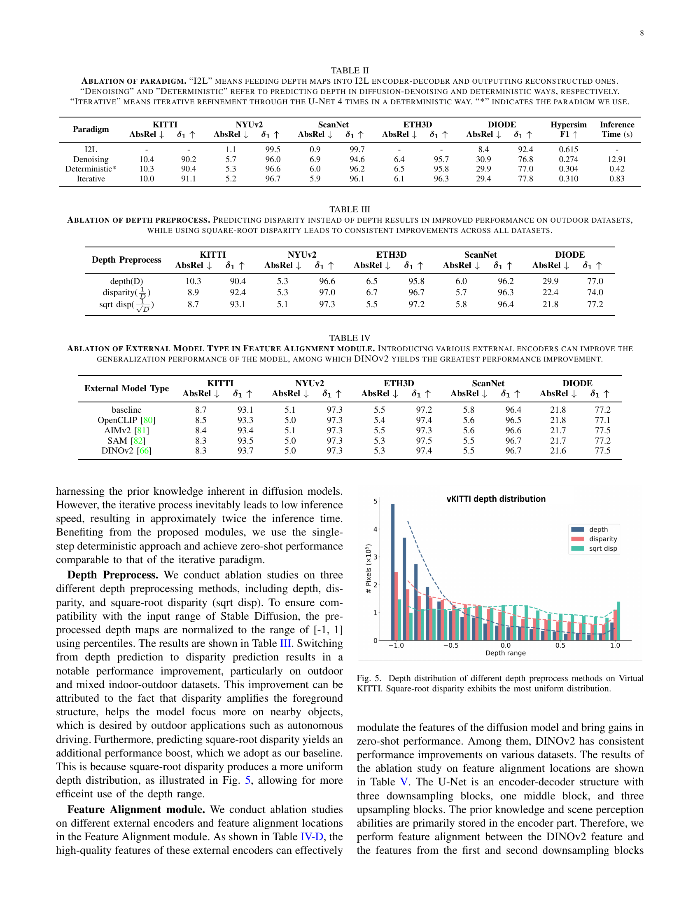
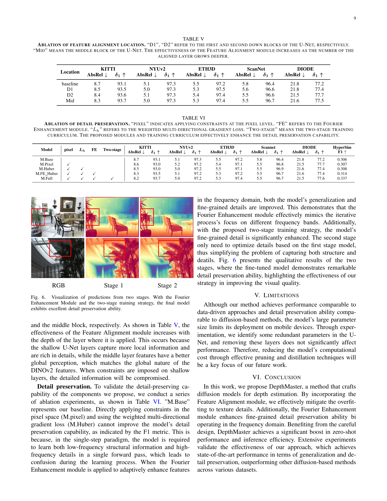
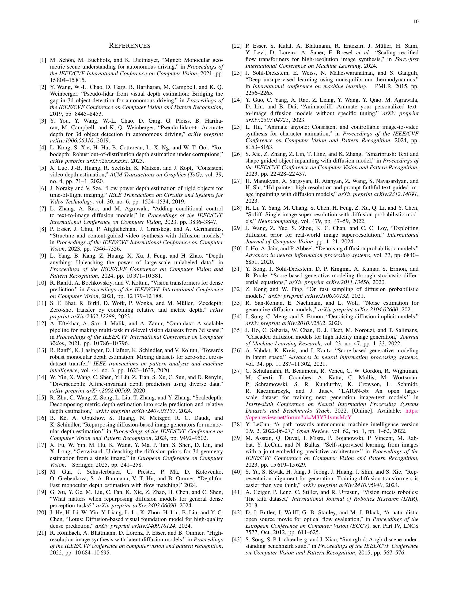
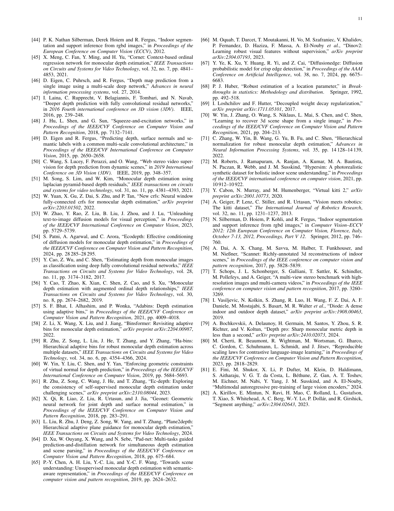
