 


 2501.02690 
 Weikang Bian et el. 
 
 🤗 2025-01-07 
 



↗ arXiv


↗ Hugging Face


↗ Papers with Code


### TL;DR



기존의 비디오 생성 모델들은 멀티 카메라 촬영이나 돌리 줌과 같은 정교한 렌즈 기술을 지원하지 못했습니다.  또한, **4D 콘텐츠를 제어하기 위해서는 많은 양의 고가의 멀티 뷰 비디오**가 필요하여 현실적인 어려움이 있었습니다.  이러한 문제를 해결하기 위해, 기존의 방법들은 시뮬레이션 데이터를 사용하거나, 시간이 오래 걸리고 결과물의 품질이 떨어지는 4D 가우스 필드 최적화에 의존했습니다.

본 논문에서는 **효율적인 밀집 3D 점 추적 기법**을 제안하여 의사 4D 가우스 필드를 생성하고, 이를 통해 **4D 비디오 콘텐츠를 제어 가능한 새로운 비디오 생성 모델인 GS-DiT**을 제시합니다. GS-DiT는 사전 훈련된 DiT 모델을 미세 조정하여 **다양한 카메라 매개변수를 유지하면서 동적인 콘텐츠를 생성**할 수 있습니다.  **실제 데이터 없이도 멀티 카메라 촬영과 같은 고급 시네마틱 효과**를 구현하여 비디오 생성의 가능성을 넓혔습니다.



#### Key Takeaways


 효율적인 밀집 3D 점 추적(D3D-PT) 알고리즘을 통해 의사 4D 가우스 필드를 효과적으로 생성 



 GS-DiT 모델은 다양한 카메라 기법(멀티 카메라 촬영, 돌리 줌 등) 및 객체 편집을 지원하는 4D 비디오 제어 기능 제공 



 기존 모델보다 월등한 정확도와 속도로 밀집 3D 점 추적 수행, 다양한 시네마틱 효과를 지원하는 강력한 비디오 생성 기능 구현 


#### Why does it matter?
본 논문은 **4D 비디오 제어를 위한 새로운 프레임워크**를 제시하여 비디오 생성 분야에 중요한 발전을 가져왔다는 점에서 중요합니다.  **효율적인 3D 점 추적 기법**과 **의사 4D 가우스 필드 생성**을 통해 다양한 시네마틱 효과를 지원하는 비디오 생성을 가능하게 하였습니다. 이는 기존의 비디오 생성 모델의 한계를 극복하고, **다양한 카메라 기술 및 객체 편집을 지원**하여 비디오 생성의 범위를 넓혔습니다. 따라서 향후 연구에서 **4D 비디오 제어 및 고품질 비디오 생성**에 대한 새로운 연구 방향을 제시하고 있습니다. 

------
#### Visual Insights

> 🔼 본 그림은 GS-DiT 모델이 가상의 4D 가우시안 필드를 비디오 확산 트랜스포머에 적용하여 다중 카메라 촬영 영상을 생성하는 과정을 보여줍니다.  4D 가우시안 필드는 다양한 카메라 각도와 움직임을 나타내며, GS-DiT는 이 필드를 기반으로 여러 각도에서 일관성 있는 영상을 생성합니다.  이는 기존의 단일 카메라 영상 생성 모델의 한계를 뛰어넘는 4D 영상 제어 기술을 보여주는 예시입니다.
> 

> 
read the caption

> Figure 1:  GS-DiT generates multi-camera shooting videos by bringing pseudo 4D Gaussian fields to video diffusion transformers.
> 


| Methods | Kinetics AJ ↑ | Kinetics <δxavg↑ | Kinetics OA ↑ | DAVIS AJ ↑ | DAVIS <δxavg↑ | DAVIS OA ↑ | RGB-Stacking AJ ↑ | RGB-Stacking <δxavg↑ | RGB-Stacking OA ↑ | Average AJ ↑ | Average <δxavg↑ | Average OA ↑ |
|---|---|---|---|---|---|---|---|---|---|---|---|---|
| TAP-Net [11] | 38.5 | 54.4 | 80.6 | 33.0 | 48.6 | 78.8 | 54.6 | 68.3 | 87.7 | 42.0 | 57.1 | 82.4 |
| PIPs [20] | 31.7 | 53.7 | 72.9 | 42.2 | 64.8 | 77.7 | 15.7 | 28.4 | 77.1 | 29.9 | 50.0 | 75.9 |
| OmniMotion [49] | - | - | - | 46.4 | 62.7 | 85.3 | 69.5 | 82.5 | 90.3 | - | - | - |
| TAPIR [12] | 49.6 | 64.2 | 85.0 | 56.2 | 70.0 | 86.5 | 54.2 | 69.8 | 84.4 | 53.3 | 68.0 | 85.3 |
| BootsTAPIR [13] | **54.6** | **68.4** | **86.5** | **61.4** | 73.6 | 88.7 | - | - | - | - | - | - |
| CoTracker [27] | 48.7 | 64.3 | **86.5** | 60.6 | **75.4** | **89.3** | 63.1 | 77.0 | 87.8 | 57.4 | 72.2 | 87.8 |
| DOT [32] | 48.4 | 63.8 | 85.2 | 60.1 | 74.5 | 89.0 | **77.1** | **87.7** | **93.3** | **61.9** | **75.3** | **89.2** |
| SpatialTracker [53] | 50.1 | **65.9** | 86.9 | 61.1 | 76.3 | **89.5** | 63.5 | 77.6 | 88.2 | 58.2 | 73.3 | 88.2 |
| Ours + ZoeDepth | **51.9** | 64.6 | 86.1 | **61.3** | 74.5 | 89.4 | **77.0** | **86.4** | **92.8** | **63.4** | **75.2** | **89.4** |

> 🔼 표 1은 TAPVid 데이터셋에서 2D 점 추적 성능을 비교 분석한 표입니다.  다양한 최첨단 2D 점 추적 방법론(TAP-Net, PIPs, OmniMotion, TAPIR, BootsTAPIR, CoTracker, DOT, SpatialTracker)의 정확도를 평가하여 제시하고 있습니다.  각 방법론은 Kinetics, DAVIS, RGB-Stacking 세 가지 하위 데이터셋에서 평가되었으며, 평가 지표로는 평균 Jaccard 지수(AJ), 평균 가시적 점 비율(< δavg), 전반적 정확도(OA)가 사용되었습니다. 이를 통해 제안된 방법의 성능을 기존 최고 수준의 방법들과 비교하여 보여줍니다.
> 

> 
read the caption

> Table 1: Comparison of 2D point tracking on TAPVid.
> 

### In-depth insights

#### 4D Video Control
본 논문에서 제시하는 핵심 개념 중 하나인 '4D 비디오 제어'는 기존의 2D 또는 3D 비디오 생성 방식을 넘어, **시간적 요소를 포함한 4차원 공간에서 비디오를 제어**하는 기술을 의미합니다. 이는 다양한 카메라 각도, 줌, 객체의 움직임 등을 세밀하게 조정하여 **보다 실감나고 역동적인 비디오 생성**을 가능하게 합니다.  **가상 카메라의 움직임, 렌즈 설정, 객체의 위치 및 움직임 등**을 모두 제어할 수 있다는 점에서 혁신적인 기술이며, 기존의 정적인 비디오 생성 방식의 한계를 극복할 수 있는 잠재력을 지닙니다.  **특히, 가우시안 필드를 활용하여 효율적인 3D 포인트 추적을 통해 4D 비디오를 생성하는 방식**은 컴퓨터 자원의 효율적 사용과 높은 성능을 동시에 달성할 수 있다는 점에서 중요한 의미를 가집니다.  **실제 영화 제작 환경에 적용 가능성**이 높다는 점과 **다양한 시네마틱 효과 구현** 가능성 또한 큰 강점입니다.  하지만 아직은 초기 단계 기술이므로, **더욱 발전된 알고리즘 및 데이터셋** 확보를 통한 성능 향상과 일반화 성능 개선이 필요할 것으로 예상됩니다.

#### Dense 3D Tracking
본 논문에서 제시된 "Dense 3D Point Tracking"은 기존의 희소(sparse) 3D 포인트 추적 방법의 한계를 극복하기 위한 핵심 모듈입니다. **기존 방법들은 정확도가 낮고 처리 속도가 느리다는 단점**이 있었는데, 이를 해결하기 위해 **효율적인 밀집(dense) 3D 포인트 추적 기법**을 제안합니다. 이 기법은 RAFT 네트워크를 기반으로 하여 영상의 공간적, 시간적 정보를 효과적으로 활용하여 정확하고 빠른 3D 포인트 추적을 수행합니다. 특히, **합성 데이터를 이용한 사전 학습**을 통해 실제 환경에서의 다양한 깊이 분포에 대한 일반화 성능을 향상시키는 것이 중요한 특징입니다.  **깊이 정보의 불확실성을 고려한 설계**를 통해 실제 영상의 깊이 정보 부족 문제를 완화하고 추적 성능을 향상시켰습니다.  **높은 정확도와 속도 향상**을 통해, pseudo 4D Gaussian field 생성에 필요한 3D 포인트 궤적 정보를 효율적으로 얻을 수 있도록 하였으며, 이는 고품질 비디오 생성의 기반이 됩니다.

#### Gaussian Fields
본 논문에서 제안하는 가우시안 필드는 **4D 비디오 생성을 위한 핵심 구성 요소**입니다.  이 필드는 밀집된 3D 점 추적을 통해 효율적으로 생성되며, 다양한 카메라 매개변수(내재적 및 외재적)와 객체 동작 편집을 통해 **4D 제어 기능**을 제공합니다.  **가상의 4D 표현**으로서, 실제 4D 가우시안 필드의 최적화 과정 없이도 다양한 시점의 비디오를 렌더링하는 데 사용되어, 비디오 생성 모델 학습에 필요한 고비용의 다시점 비디오 데이터 수집 문제를 해결합니다.  **생성된 비디오에 아티팩트가 존재**하지만, 이는 비디오 생성 모델의 가이드 역할을 수행하여 **일반화 성능 향상**에 기여합니다.  결론적으로, 본 논문의 가우시안 필드는 효율성과 제어성을 갖춘 4D 비디오 생성의 핵심적인 역할을 담당하는 기술 요소라고 볼 수 있습니다.

#### GS-DiT Framework
GS-DiT 프레임워크는 **효율적인 밀집 3D 점 추적(D3D-PT)**을 통해 의사 4D 가우시안 필드를 비디오 확산 변환기에 적용하여 비디오 생성을 발전시키는 혁신적인 방법입니다.  핵심은 입력 비디오로부터 **밀집된 3D 점 궤적**을 추출하여 의사 4D 가우시안 필드를 구성하는 것입니다.  이 필드는 다양한 카메라 매개변수를 사용하여 새로운 뷰의 비디오를 렌더링하는 데 사용되며, 이는 사전 훈련된 DiT를 미세 조정하여 실제 입력 비디오를 생성하는 데 중요한 가이드 역할을 합니다. **D3D-PT는 기존의 희소 3D 점 추적 방법보다 정확도와 속도 면에서 뛰어난 성능**을 보이며, 다양한 동작 역학을 학습할 수 있도록 일반화 능력을 향상시키는 데 기여합니다.  **GS-DiT는 다중 카메라 촬영, 줌 등 고급 영상 기법을 지원**하며, 카메라 내재적 특성 및 개체 동작 편집 등 4D 비디오 제어 기능을 제공합니다.  결론적으로 GS-DiT는 기존 방법의 한계를 뛰어넘어 4D 비디오 제어 기능을 실현하고, 창의적인 영상 제작에 유용한 도구를 제공하는 획기적인 프레임워크라 할 수 있습니다.

#### Future of 4D Video
4D 비디오의 미래는 **매우 밝습니다**.  이 기술은 단순한 영상 제작을 넘어, **다양한 분야에서 혁신적인 변화**를 가져올 잠재력을 지닙니다.  **몰입형 경험**을 제공하는 **가상현실 및 증강현실**과의 결합은 더욱 현실감 있는 인터랙티브 콘텐츠를 가능하게 할 것입니다.  **의료, 교육, 엔터테인먼트** 등 다양한 분야에서 4D 비디오는 **데이터 시각화 및 의사소통**에 혁신적인 도구로 사용될 수 있습니다.  **고품질 4D 비디오 생성을 위한 효율적인 알고리즘 및 하드웨어** 발전은 이러한 미래를 현실로 만들어줄 핵심 요소이며, **인공지능 기술**과의 통합을 통해 보다 자연스럽고 현실적인 콘텐츠를 생성할 수 있을 것입니다. **실시간 렌더링 기술**의 발전 또한 중요한데, 이를 통해 **사용자의 상호작용에 따라 실시간으로 4D 비디오를 생성 및 조정**할 수 있는 새로운 가능성이 열릴 것입니다.  하지만, **데이터 저장 및 처리 비용, 렌더링 시간 등의 기술적 한계**를 극복하기 위한 지속적인 연구개발이 필요합니다.

### More visual insights

More on figures

> 🔼 그림 2는 GS-DiT의 개요를 보여줍니다. 훈련 단계에서는 밀집 3D 점 추적을 통해 입력 비디오에서 의사 4D 가우시안 필드를 생성합니다. GS-DiT는 의사 4D 가우시안 필드에서 렌더링된 비디오에 의해 안내되어 원본 비디오를 생성하는 것을 학습합니다. 추론 단계에서는 밀집 3D 점 추적, 깊이 맵의 직접 상향 또는 4D 가우시안 필드 최적화를 통해 의사 4D 가우시안 필드를 생성할 수 있습니다. 가우시안 필드를 편집하고 예약된 카메라 내재 및 외재를 사용하여 렌더링하면 다양한 시네마틱 효과를 얻을 수 있습니다.
> 

> 
read the caption

> Figure 2: An overview of GS-DiT. In the training stage, we build a pseudo 4D Gaussian field from an input video via dense 3D point tracking. Our GS-DiT learns to generate the original video guided by the video rendered from the pseudo 4D Gaussian field. In the inference stage, we can build the pseudo 4D Gaussian via dense 3D point tracking, directly lifting the depth map, or optimizing a 4D Gaussian field. Editing and rendering the Gaussian field with scheduled camera intrinsic and extrinsic bring various cinematic effects.
> 

> 🔼 이 그림은 GS-DiT의 신경망 아키텍처를 보여줍니다. GS-DiT는 의사 4D 가우시안 필드로부터 렌더링된 비디오를 조건으로 하여 비디오를 생성합니다.  구체적으로, 3D VAE 인코더는 입력 비디오 프레임을 잠재 특징으로 압축하고, 이 잠재 특징은 노이즈가 추가된 후 학습 가능한 DiT 모델에 공급됩니다.  결과적으로 DiT는 의사 4D 가우시안 필드로부터 생성된 렌더링된 비디오에 조건을 맞춰 비디오를 생성합니다.
> 

> 
read the caption

> Figure 3: The neural network architecture of GS-DiT. GS-DiT generates video conditioned on the video rendered from our pseudo 4D Gaussian field.
> 

> 🔼 그림 4는 카메라 제어를 통한 동기화된 비디오 생성에 대한 정성적 비교를 보여줍니다. (a)와 (b)는 입력 비디오의 첫 번째와 마지막 프레임이고, (c)는 카메라 궤적 시각화입니다. (d), (e), (f)는 GS-DiT, GCD, MonST3R을 사용하여 생성된 비디오의 마지막 프레임을 보여줍니다. 이 그림은 각 모델이 다양한 카메라 궤적을 얼마나 잘 처리하는지, 그리고 생성된 비디오의 시각적 품질을 비교하여 보여줍니다.
> 

> 
read the caption

> Figure 4: Qualitative comparison of synchronized video generation with camera control. (a)(b) are the first and last frame of the input video. (c) is the camera trajectory visualization. (d)(e)(f) are the last frame of the video generated by our GS-DiT, GCD, and MonST3R.
> 

> 🔼 그림 5는 4D 제어를 사용한 비디오 생성 결과를 보여줍니다. (a)는 돌리 줌 효과를, (b)는 선풍기 날개의 회전 효과를 보여줍니다.  (a)에서는 카메라가 객체에 접근하거나 멀어짐에 따라 시점이 변화하는 돌리 줌 효과가, (b)에서는 선풍기 날개가 회전하는 동안 카메라 시점이 일정하게 유지되는 장면이 나타납니다. 이는 GS-DiT 모델이 카메라 내재적 및 외재적 매개변수, 그리고 객체의 움직임까지 제어할 수 있음을 시각적으로 보여줍니다.
> 

> 
read the caption

> Figure 5: Video generation with 4D control. (a) presents the dolly zoom effects and (b) rotates the body of the fan.
> 

> 🔼 그림 A1은 비디오 인페인팅과의 비교 결과를 보여줍니다. (a)는 입력 프레임, (b)는 GS-DiT에 의해 생성된 비디오 프레임, (c)와 (d)는 각각 Inpainting-A와 Inpainting-B에 의해 생성된 비디오 프레임을 나타냅니다. GS-DiT는 훼손된 영역을 더 잘 복원하고 자연스러운 결과를 생성하지만, Inpainting-A와 Inpainting-B는 훼손된 부분을 제대로 복원하지 못하고 흐릿한 결과를 보입니다. 이는 GS-DiT의 우수성을 보여주는 결과입니다.
> 

> 
read the caption

> Figure A1: Comparison with video inpainting. (a) is the input frame. (b) is the video frame generated by our GS-DiT. (c) and (d) are the video frames generated by Inpainting-A and Inpainting-B.
> 

> 🔼 그림 A2는 본 논문의 3.1절 Dense 3D Point Tracking 에서 제시된 3D 포인트 추적을 위한 네트워크 구조 중 MotionEnc_flow의 구조를 보여줍니다.  이 부분은 이전 단계의 흐름(flow) 정보와 가시성(visibility), 그리고 잘려진 상관관계 정보(cropped correlation information)를 이용하여 동작 특징(motion feature)을 추출하는 모듈입니다.  다양한 합성곱 연산(convolution)과 ReLU 활성화 함수를 통해 입력된 정보들을 처리하고 최종적으로 흐름 업데이트(flow update)를 위한 정보를 생성합니다.  그림은 각 레이어의 크기와 필터 개수 등 세부적인 구조 정보를 제공합니다.
> 

> 
read the caption

> Figure A2: The structure of M⁢o⁢t⁢i⁢o⁢n⁢E⁢n⁢cf⁢l⁢o⁢w𝑀𝑜𝑡𝑖𝑜𝑛𝐸𝑛subscript𝑐𝑓𝑙𝑜𝑤{MotionEnc_{flow}}italic_M italic_o italic_t italic_i italic_o italic_n italic_E italic_n italic_c start_POSTSUBSCRIPT italic_f italic_l italic_o italic_w end_POSTSUBSCRIPT.
> 

> 🔼 그림 A3은 D3D-PT(Dense 3D Point Tracking) 알고리즘에서 흐름(flow) 업데이트를 예측하는 데 사용되는 FlowHead 네트워크의 구조를 보여줍니다.  FlowHead는 ConvGRU flow(반복형 디코더)에서 출력된 특징 맵(feature map)을 입력받아 잔차 흐름(residual flow)을 예측합니다.  구체적으로는 컨볼루션 레이어(Conv3x3) 여러 개를 사용하며, 각 레이어는 활성화 함수 ReLU를 사용합니다. 최종적으로 1x1 컨볼루션 레이어를 통해 잔차 흐름을 출력합니다. 이 그림은 FlowHead의 계층적 구조와 각 레이어의 크기를 시각적으로 보여줍니다.
> 

> 
read the caption

> Figure A3: The structure of F⁢l⁢o⁢w⁢H⁢e⁢a⁢d𝐹𝑙𝑜𝑤𝐻𝑒𝑎𝑑{FlowHead}italic_F italic_l italic_o italic_w italic_H italic_e italic_a italic_d.
> 

> 🔼 그림 A4는 논문의 부록 A절, D3D-PT에 대한 자세한 설명에서 보여주는 VisHead의 구조를 보여줍니다. VisHead는 RAFT 네트워크의 일부로, 입력으로 움직임 특징(motion feature)을 받아 시각적 가시성(visibility) 업데이트를 예측하는 역할을 합니다. 그림은 VisHead를 구성하는 합성곱 계층(convolutional layer)들의 연결 구조와 채널 수를 보여줍니다. 이를 통해 가시성 예측의 과정을 자세히 이해할 수 있습니다.
> 

> 
read the caption

> Figure A4: The structure of V⁢i⁢s⁢H⁢e⁢a⁢d𝑉𝑖𝑠𝐻𝑒𝑎𝑑{VisHead}italic_V italic_i italic_s italic_H italic_e italic_a italic_d.
> 

More on tables


| Methods | Aria 3D-AJ ↑ | Aria APD ↑ | Aria OA ↑ | DriveTrack 3D-AJ ↑ | DriveTrack APD ↑ | DriveTrack OA ↑ | PStudio 3D-AJ ↑ | PStudio APD ↑ | PStudio OA ↑ | Average 3D-AJ ↑ | Average APD ↑ | Average OA ↑ |
|---|---|---|---|---|---|---|---|---|---|---|---|---|
| BootsTAPIR [13] + ZoeDepth [4] | 8.6 | 14.5 | 86.9 | 5.1 | 8.7 | 83.5 | 10.2 | 17.7 | 82.0 | 8.0 | 13.6 | 84.1 |
| SpatialTracker [53] | 9.2 | 15.1 | 89.9 | 5.8 | 10.2 | 82.0 | 9.8 | 17.7 | 78.4 | 8.3 | 14.3 | 83.4 |
| Ours + ZoeDepth [4] | 10.0 | 16.1 | 90.0 | 7.2 | 12.0 | 81.1 | 9.8 | 17.3 | 80.5 | 9.0 | 15.1 | 83.9 |
| Ours + Depth Anything V2 [54] | 14.5 | 21.9 | 90.0 | 8.6 | 13.8 | 81.1 | 11.3 | 19.4 | 80.5 | 11.4 | 18.3 | 83.9 |
| Ours + UniDepth V2 [37] | 15.0 | 22.2 | 90.0 | 11.6 | 18.1 | 81.1 | 6.6 | 12.2 | 80.5 | 11.0 | 17.5 | 83.9 |
> 🔼 표 2는 TAPVid-3D 데이터셋의 minival 분할에 대해 수행된 3D 점 추적 성능 비교 결과를 보여줍니다.  BootsTAPIR + ZoeDepth, SpatialTracker, 그리고 본 논문에서 제안하는 방법(Ours + ZoeDepth, Ours + Depth Anything V2, Ours + UniDepth V2) 세 가지 방법의 3D 점 추적 정확도를 Aria, DriveTrack, PStudio 세 가지 트랙에서 평가하여 3D-AJ, APD, OA 지표를 비교 분석한 결과를 나타냅니다.  3D-AJ는 3D 점 추적 정확도와 가시성을 종합적으로 고려한 지표이고, APD는 평균 거리 오차, OA는 가시성을 나타냅니다.
> 

> 
read the caption

> Table 2: Comparison of 3D point tracking on TAPVid-3D minival split.
> 


| Methods | DAVIS PSNR ↑ | DAVIS SSIM ↑ | DAVIS LPIPS ↓ | Sora PSNR ↑ | Sora SSIM ↑ | Sora LPIPS ↓ | Pixabay PSNR ↑ | Pixabay SSIM ↑ | Pixabay LPIPS ↓ |
|---|---|---|---|---|---|---|---|---|---| 
| MonST3R | 14.12 | 0.59 | 0.31 | 15.32 | 0.59 | 0.30 | 19.78 | 0.74 | 0.22 |
| GCD | 15.04 | 0.41 | 0.48 | 11.96 | 0.32 | 0.52 | 13.71 | 0.42 | 0.50 |
| Ours | **19.18** | **0.60** | **0.23** | **17.92** | **0.60** | **0.20** | **22.66** | 0.73 | **0.15** |
> 🔼 표 3은 다양한 멀티 촬영 비디오 생성 모델들의 화질을 비교한 표입니다.  PSNR, SSIM, LPIPS 세 가지 지표를 사용하여 DAVIS, Sora, Pixabay 세 가지 데이터셋에서 모델들의 성능을 평가하였습니다.  각 지표는 이미지의 화질을 다양한 측면에서 정량적으로 측정하며, 높을수록 좋은 화질을 나타냅니다.  이 표는 GS-DiT 모델의 화질이 기존 모델들보다 우수함을 보여줍니다.
> 

> 
read the caption

> Table 3: Comparison of the multi-shooting video generation quality.
> 


| Methods | DAVIS |  |  |  |
|---|---|---|---|---|
| AJ ↑ | &lt;{
δ}^{x}_{avg}
↑ | OA ↑ |  |  |
| RGB-RAFT (DOT) [32] | 60.1 | 74.5 | 89.0 |  |
| RGBD-RAFT | 55.7 | 71.6 | 86.7 |  |
| D3D-PT (Ours) | **63.4** | **75.2** | **89.4** |  |
> 🔼 표 A1은 DAVIS 데이터셋에서 수행된 D3D-PT(Dense 3D Point Tracking) ablation study 결과를 보여줍니다.  RGB-RAFT(DOT)는 기준 모델로, RAFT를 이용한 2D point tracking을 수행합니다. RGBD-RAFT는 RAFT에 RGB-D 정보를 추가하여 3D point tracking을 수행하는 모델입니다. 마지막으로 제안된 D3D-PT는 depth 정보를 느슨하게 결합하여 3D point tracking 정확도를 높인 모델입니다.  세 가지 모델의 AJ(Average Jaccard), < δavg, OA(Occlusion Accuracy) 지표를 비교하여 D3D-PT의 성능 우수성을 보여줍니다.
> 

> 
read the caption

> Table A1: Ablation Study on DAVIS.
> 

### Full paper


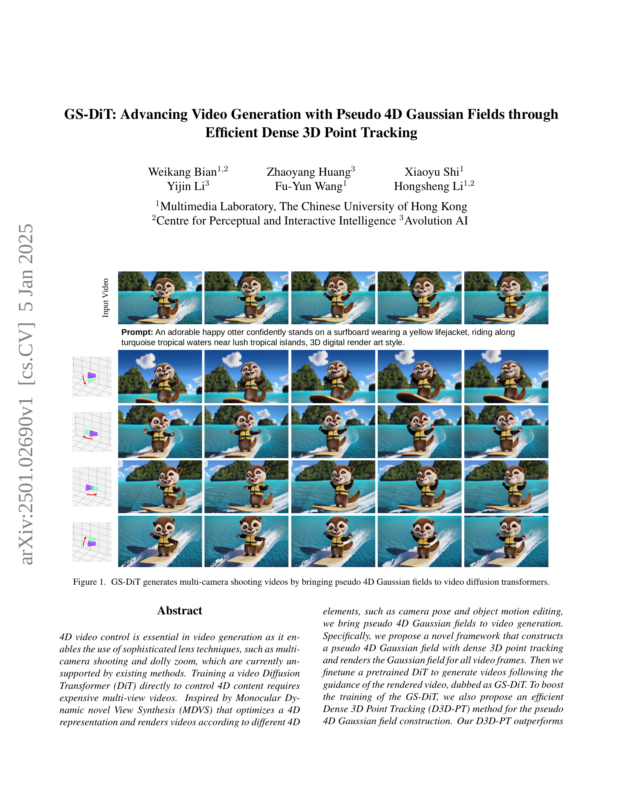
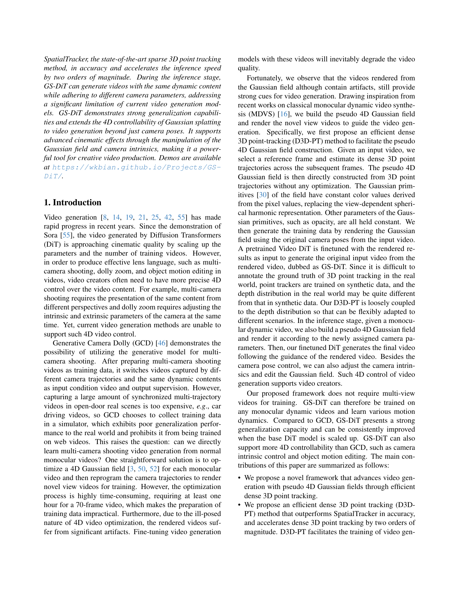
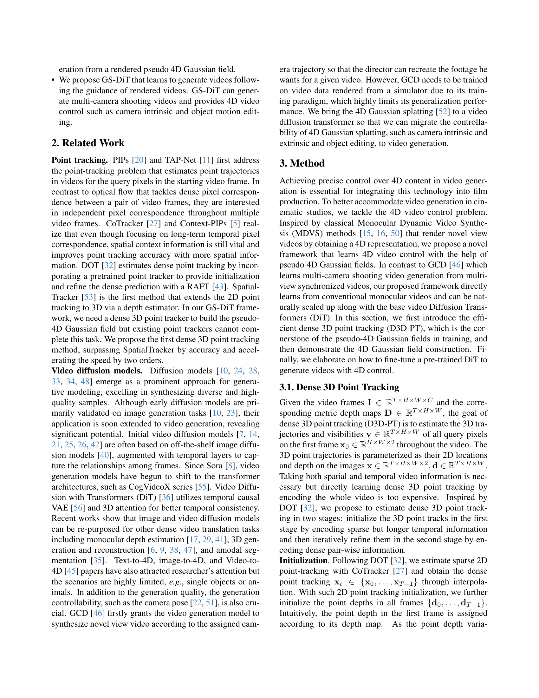
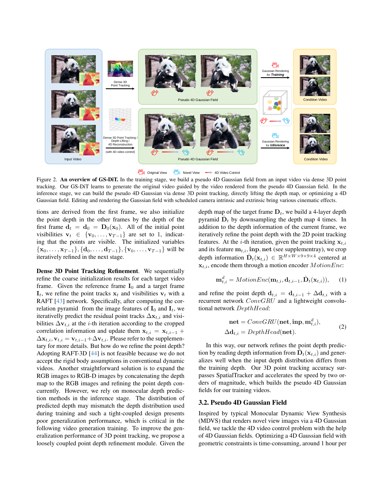
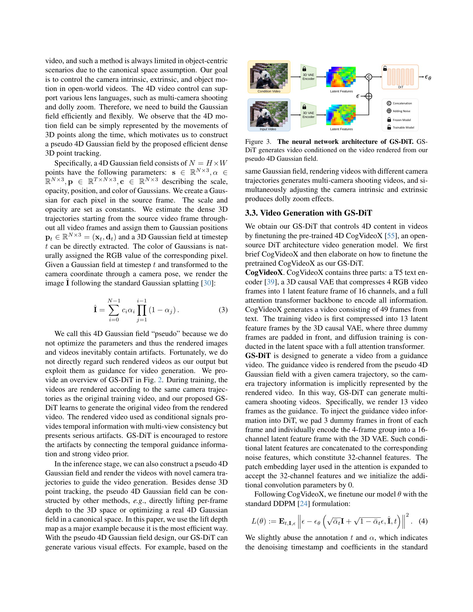
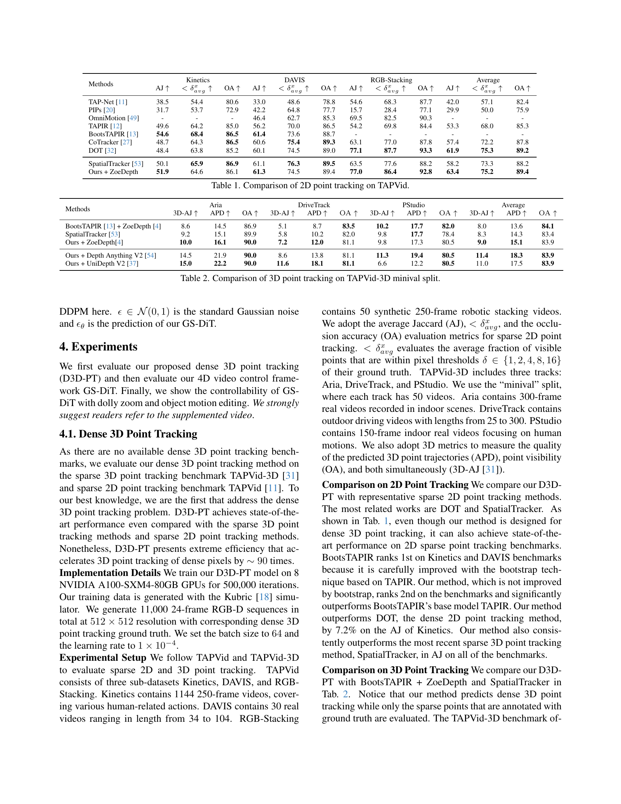
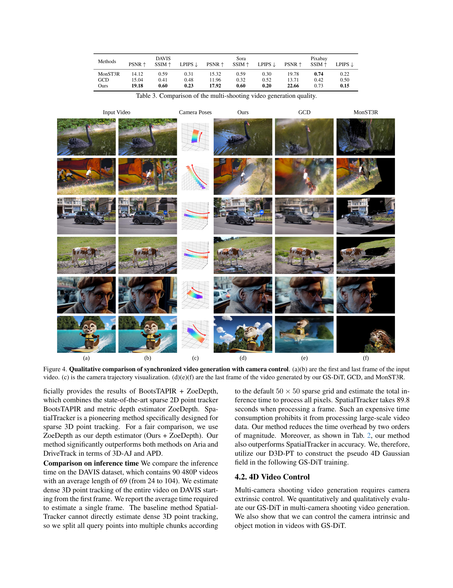
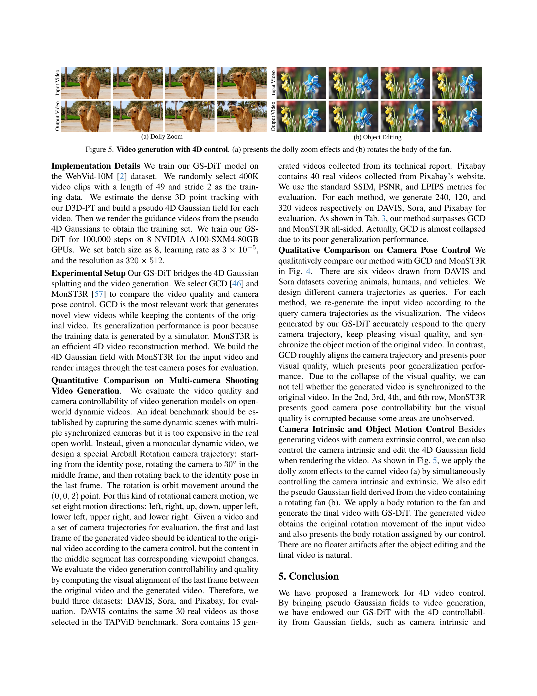
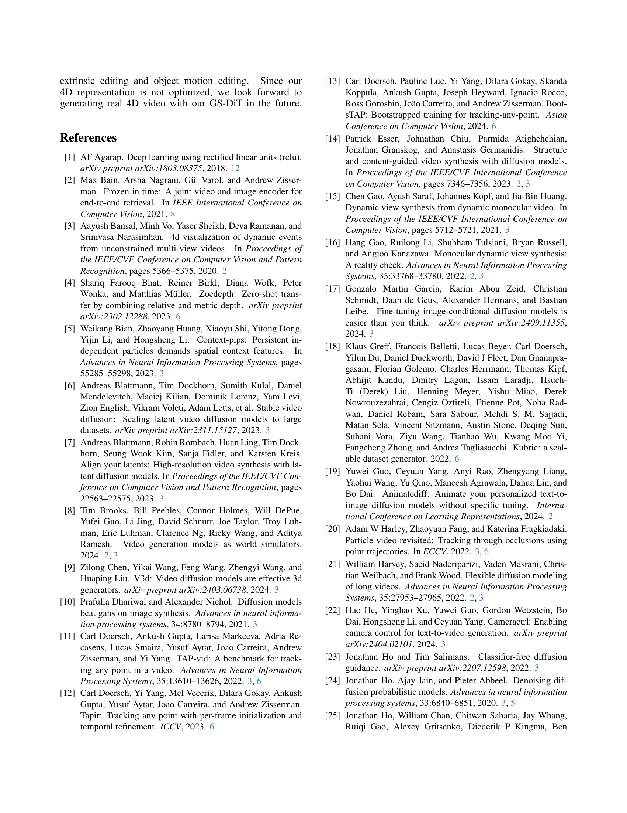
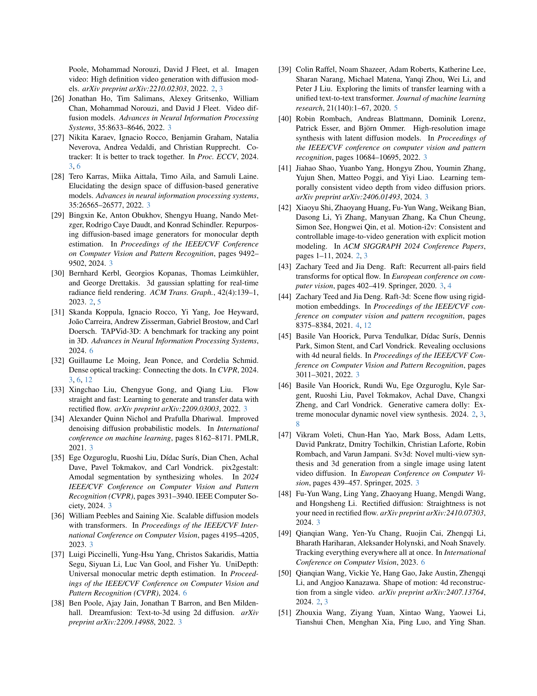
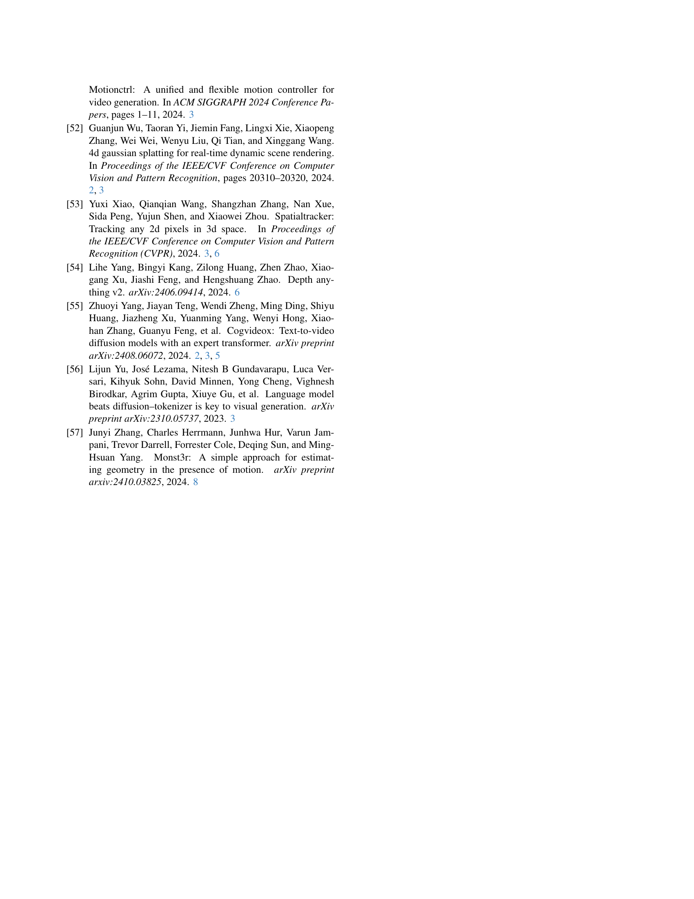
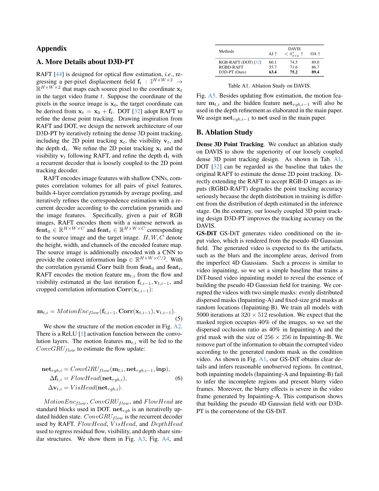
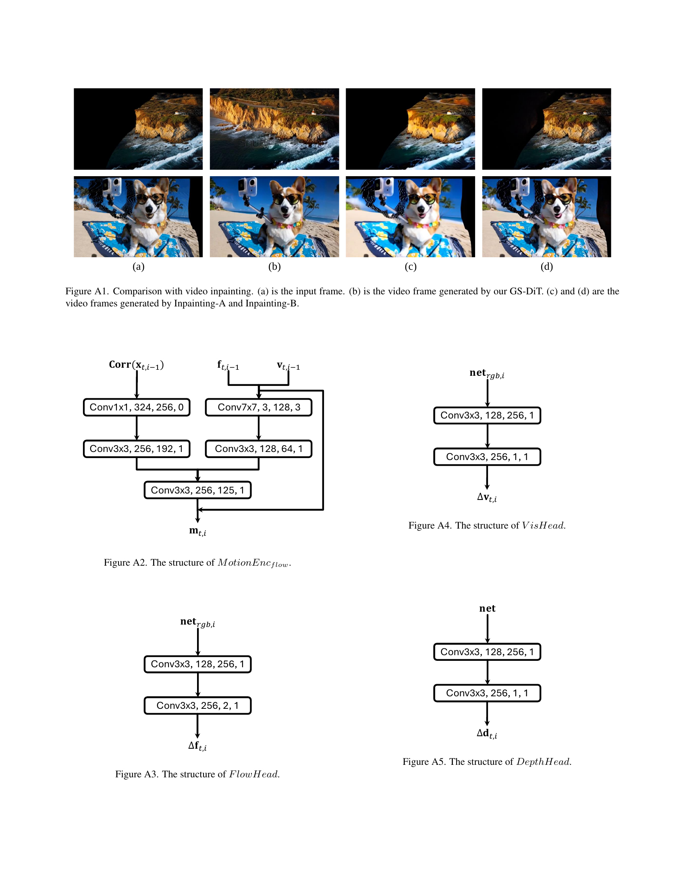
