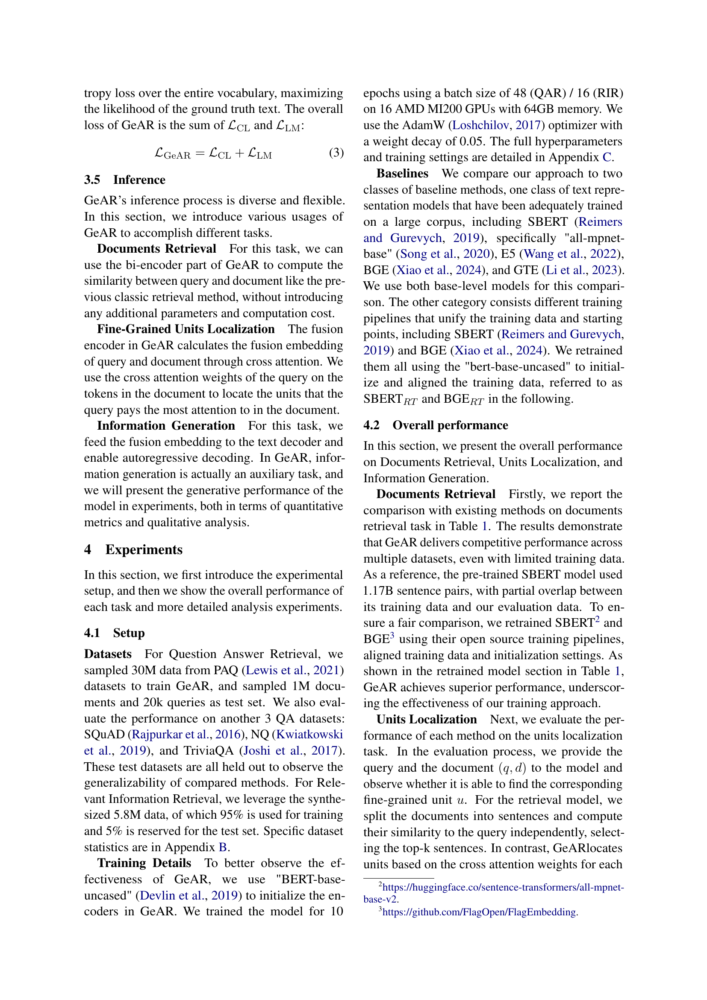

 


 2501.02772 
 Haoyu Liu et el. 
 
 🤗 2025-01-09 
 



↗ arXiv


↗ Hugging Face


↗ Papers with Code


### TL;DR



기존의 정보 검색 시스템은 쿼리와 문서 간의 의미적 유사도를 단순한 스칼라 값으로 나타내어 정보 손실이 발생하고, 특히 긴 문서의 경우 핵심 정보를 찾는 데 어려움이 있었습니다.  **단순한 유사도 비교를 넘어** 쿼리와 문서 간의 세밀한 관계를 파악하는 것이 중요해지고 있습니다. 

본 논문에서는 **생성 증강 검색(GeAR)**이라는 새로운 방법을 제시합니다. GeAR은 쿼리와 문서의 융합된 표현을 사용하여 관련 텍스트를 생성하고, 문서 내에서 핵심 정보를 찾아내는 기능을 포함합니다. **대규모 언어 모델을 활용한 고품질 데이터 생성 파이프라인**을 구축하여 GeAR의 효과적인 학습을 지원합니다. 실험 결과, GeAR은 다양한 시나리오와 데이터셋에서 우수한 성능을 보였으며, 검색 결과에 대한 새로운 해석을 제공합니다.



#### Key Takeaways


 생성 증강 검색(GeAR)은 기존 방식보다 **정확도 높은 검색 결과** 제공 



 대규모 언어 모델 기반 **고품질 데이터 생성 파이프라인** 제시 



 **세밀한 정보까지 고려**하는 새로운 정보 검색 방식 제안 


#### Why does it matter?
본 논문은 **기존의 단순한 유사도 측정 방식의 한계를 극복하고** 세밀한 정보까지 고려하는 새로운 검색 기법을 제시하여 **정보 검색 시스템의 정확도와 효율성을 향상**시킬 수 있는 잠재력을 보여줍니다.  **대규모 언어 모델을 활용한 데이터 생성 방법론** 또한 제시하여 향후 연구를 위한 새로운 방향을 제시합니다. 따라서 **정보 검색 분야 연구자들에게 중요한 시사점**을 제공합니다.

------
#### Visual Insights


|             | SQuAD R@5 | SQuAD M@5 | NQ R@5 | NQ M@5 | TriviaQA R@5 | TriviaQA M@5 | PAQ R@5 | PAQ M@5 | RIR R@5 | RIR M@5 |
|-------------|------------|------------|---------|---------|----------------|----------------|---------|---------|---------|---------|
| _Pre-trained retrieval model_ |
| SBERT       | 0.812      | 0.667      | 0.754   | 0.576   | 0.677          | 0.413          | 0.808   | 0.701   | 0.376   | 0.297   |
| E5          | 0.803      | 0.674      | 0.760   | 0.581   | 0.645          | 0.390          | 0.816   | 0.716   | 0.484   | 0.396   |
| BGE         | 0.829      | 0.701      | 0.674   | 0.502   | 0.690          | 0.422          | 0.752   | 0.647   | 0.451   | 0.367   |
| GTE         | 0.866      | 0.744      | 0.767   | 0.587   | 0.726          | 0.443          | 0.836   | 0.736   | 0.528   | 0.435   |
| _Retrained retrieval model_ |
| SBERTRT | 0.742      | 0.585      | 0.739   | 0.550   | 0.577          | 0.342          | 0.859   | 0.742   | 0.739   | 0.631   |
| BGERT  | 0.841      | 0.701      | 0.751   | 0.553   | 0.640          | 0.384          | 0.901   | 0.802   | 0.953   | 0.881   |
| GeAR        | 0.883      | 0.762      | 0.747   | 0.567   | 0.660          | 0.398          | 0.940   | 0.855   | 0.961   | 0.903   |
| GeARw/oℒLM | 0.889      | 0.776      | 0.755   | 0.565   | 0.660          | 0.399          | 0.955   | 0.877   | 0.963   | 0.907   |

> 🔼 표 1은 다양한 데이터셋에서 문서 검색 성능을 비교한 표입니다. R@k는 Recall@k를, M@k는 MAP@k를 나타냅니다.  즉, R@k는 상위 k개의 검색 결과에 실제 관련 문서가 포함될 확률이고, M@k는 평균적으로 상위 k개의 검색 결과에서 관련 문서의 순위가 얼마나 높은지를 나타내는 지표입니다. 이 표는 제시된 GeAR 모델의 성능을 다른 기존 모델들과 비교하여 GeAR의 효과를 보여줍니다.
> 

> 
read the caption

> Table 1: Comparison of documents retrieval performance on different datasets, where R@k stands for Recall@k, M@k stands for MAP@k.
> 

### In-depth insights

#### GeAR: A New Approach
GeAR는 기존의 단순한 유사도 측정을 넘어, **질의와 문서 간의 미묘한 의미 관계를 정확하게 파악**하고자 하는 새로운 접근 방식입니다.  **생성 모델을 통합**하여 질의에 가장 관련성이 높은 문서 부분을 찾아내고, 그 내용을 요약하여 제시함으로써, 사용자의 정보 탐색 과정을 효율적으로 돕습니다.  기존 방식의 단점인 **전체 문서에 대한 단순한 유사도 비교**에서 벗어나, **세분화된 정보 추출 및 요약**이라는 새로운 가능성을 제시합니다.  **LLM을 활용한 고품질 데이터 합성** 파이프라인을 통해 모델 학습의 어려움을 해결하고, 다양한 실험을 통해 GeAR의 우수한 성능을 검증하였습니다.  **정확한 정보 검색 및 위치 파악 기능**뿐 아니라, **관련 정보 생성 기능**까지 갖춘 GeAR은 차세대 정보 검색 시스템의 새로운 표준을 제시할 잠재력을 가지고 있습니다.  **질의-문서-정보 삼중항**을 활용한 데이터 구성 방식은 모델의 학습 효율을 높이고, **정확도와 설명 가능성을 향상**시키는 데 크게 기여합니다.  이는 사용자에게 보다 **투명하고 이해하기 쉬운 정보 검색 경험**을 제공할 수 있다는 점에서 중요한 의미를 가집니다.

#### Fine-Grained Retrieval
정밀 검색(Fine-Grained Retrieval)은 단순히 문서 전체의 유사도를 측정하는 기존 방식을 넘어, **문서 내 특정 구절이나 단락 수준에서의 세밀한 의미적 관계를 파악**하는 기술입니다.  이는 긴 문서나 복잡한 내용을 가진 문서에서 질의어와 가장 관련성이 높은 부분을 정확하게 찾아내는 데 매우 중요합니다. 기존의 단순 유사도 측정 방식은 이러한 맥락 정보를 충분히 반영하지 못하여, 검색 결과의 정확도와 이해도를 저해할 수 있습니다. 따라서 정밀 검색은 **질의어와 문서 간의 미묘한 의미적 연결을 포착**하여, 사용자에게 보다 정확하고 의미있는 검색 결과를 제공할 수 있는 잠재력을 지닙니다.  **딥러닝 기반의 다양한 모델**들이 정밀 검색을 위해 개발되고 있으며, 특히 **어텐션 메커니즘**을 활용하여 질의어와 문서의 특정 부분 간의 상호작용을 강조함으로써 성능 향상을 이끌어낼 수 있습니다.  하지만 **데이터의 부족**과 **모델 학습의 어려움**은 정밀 검색 기술 개발의 주요 과제로 남아있습니다.  **대규모 언어 모델의 발전**은 이러한 문제를 해결하는 데 기여할 수 있으며,  정밀 검색 기술의 미래 발전 방향에 대한 중요한 이정표가 될 것입니다. 

#### Data Synthesis Pipeline
본 논문에서는 **대규모 언어 모델(LLM)**을 활용한 데이터 합성 파이프라인을 제시합니다. 기존 연구에서 충분한 데이터를 확보하기 어려운 문제를 해결하기 위해, **고품질의 데이터를 효율적으로 생성하는 과정**을 상세히 설명합니다.  LLM을 활용하여 위키피디아 문서에서 문장을 추출하고, 이를 LLM으로 재작성하여 질의(query)를 생성하는 방법을 제시합니다. 이 과정에서 중복된 질의와 관련성이 낮은 질의는 제거하고, 최종적으로 질의-문서-정보(triple) 형태의 고품질 데이터셋을 구축합니다.  **LLM의 높은 언어 이해 및 생성 능력**을 활용하여 기존 연구에서 접근하기 어려웠던 **세분화된 정보 검색 및 위치 확인**에 필요한 데이터를 효과적으로 생성함으로써, 제안하는 GeAR 모델의 성능 향상에 기여합니다.  **데이터 생성 과정의 각 단계별 필터링 및 정제 과정**은 데이터 품질 향상에 중요한 역할을 하며, 본 파이프라인의 실효성을 보여줍니다. 이를 통해, 본 논문에서 제시하는 방법론은 향후 유사한 연구에 대한 **데이터 확보 전략**에 있어서 중요한 참고 자료가 될 것입니다.

#### Model Architecture
본 논문에서 제시된 모델 구조는 **기존의 바이 인코더 방식에 퓨전 인코더와 텍스트 디코더를 추가하여 단순한 유사도 계산을 넘어 미세한 의미적 관계를 파악하고 관련 정보를 생성**하도록 설계되었습니다. 퓨전 인코더는 질의와 문서의 임베딩을 결합하여 맥락 정보를 풍부하게 하고, 텍스트 디코더는 결합된 정보를 바탕으로 문서 내에서 관련 정보를 생성합니다.  **이러한 과정을 통해 전통적인 정보 검색 방식의 한계를 극복하고, 질의에 대한 보다 심도있는 이해와 정확한 정보 위치 파악**이 가능해집니다.  **특히, 퓨전 인코더와 텍스트 디코더의 상호 작용을 통해 질의-문서 간의 미세한 의미적 관계를 학습**하고, 이를 바탕으로 더욱 정교하고 효율적인 정보 검색 및 위치 확인 기능을 제공하는 것이 핵심입니다. 또한, **대규모 언어 모델을 이용한 데이터 합성 파이프라인을 통해 고품질의 학습 데이터를 효율적으로 생성**하여 모델의 성능을 향상시켰습니다.

#### Future Work
본 논문에서 제시된 GeAR 모델은 **장문 문서 처리 능력의 제한**, **합성 데이터 의존성**, **다중 작업 학습의 균형** 등의 한계점을 가지고 있습니다.  미래 연구 방향으로는 **더욱 방대한 실제 데이터셋을 활용한 모델 성능 향상 연구**가 중요합니다.  또한, **장문 문서 처리를 위한 효율적인 메커니즘 개발**, **합성 데이터 의존도를 줄이기 위한 새로운 데이터 증강 기법 연구**, 그리고 **다중 작업 학습의 최적화 전략 연구**를 통해 GeAR의 실용성과 일반화 성능을 높일 수 있을 것입니다. **다양한 하위 작업(예: 문장 선택, 정보 추출)**에 대한 GeAR의 적용성을 확장하고, **다른 모달리티(예: 이미지, 비디오)**와의 통합을 시도하여 모델의 활용 범위를 넓히는 것 또한 중요한 미래 연구 과제입니다.  궁극적으로는 **설명 가능한 추론 과정을 갖는 GeAR의 발전**을 통해, 사용자가 모델의 결과를 더 잘 이해하고 신뢰할 수 있도록 하는 것이 필요합니다.  이러한 노력을 통해 GeAR은 더욱 강력하고 실용적인 정보 검색 시스템으로 발전할 수 있을 것입니다.

### More visual insights

More on tables


|                       | SQuAD R@1 | SQuAD M@1 | NQ R@1 | NQ M@1 | TriviaQA R@1 | TriviaQA M@1 | PAQ R@1 | PAQ M@1 | RIR R@3 | RIR M@3 |
|-----------------------|------------|------------|---------|---------|----------------|----------------|---------|---------|---------|---------|
| _Pre-trained retrieval model_ |            |            |         |         |                |                |         |         |         |         |
| SBERT                   | 0.739       | 0.800       | 0.558    | 0.652    | 0.359           | 0.583           | 0.498    | 0.561    | 0.891    | 0.874    |
| E5                      | 0.783       | 0.847       | 0.590    | 0.683    | 0.379           | 0.613           | 0.573    | 0.640    | 0.891    | 0.878    |
| BGE                      | 0.768       | 0.830       | 0.570    | 0.663    | 0.362           | 0.589           | 0.565    | 0.630    | 0.894    | 0.881    |
| GTE                      | 0.758       | 0.820       | 0.548    | 0.639    | 0.352           | 0.572           | 0.525    | 0.590    | 0.895    | 0.886    |
| _Retrained retrieval model_ |            |            |         |         |                |                |         |         |         |         |
| SBERTRT       | 0.516       | 0.568       | 0.445    | 0.523    | 0.281           | 0.472           | 0.363    | 0.418    | 0.899    | 0.991    |
| BGERT        | 0.455       | 0.538       | 0.601    | 0.656    | 0.288           | 0.475           | 0.409    | 0.466    | 0.897    | 0.888    |
| GeAR                     | 0.810       | 0.874       | 0.765    | 0.871    | 0.515           | 0.808           | 0.885    | 0.965    | 0.954    | 0.897    |
> 🔼 표 2는 다양한 데이터셋에서 단위 지역화 성능을 비교한 표입니다. R@k는 Recall@k를, M@k는 MAP@k를 나타냅니다.  즉, 이 표는 질의어와 관련된 정보 단위(예: 문장)를 얼마나 정확하게 찾아내는지를 다양한 데이터셋에서 측정한 결과를 보여줍니다.  Recall@k는 상위 k개의 결과 중에 실제 관련 정보 단위가 포함된 비율이고, MAP@k는 상위 k개의 결과의 정확도를 평균한 값입니다.  따라서,  R@k와 M@k 값이 높을수록 해당 모델의 단위 지역화 성능이 우수함을 나타냅니다.
> 

> 
read the caption

> Table 2: Comparison of units localization performance on different datasets, where R@k stands for Recall@k, M@k stands for MAP@k.
> 


| SQuAD |  | NQ |  | TriviaQA |  | PAQ |  | RIR |  |
|---|---|---|---|---|---|---|---|---|---|---|
| EM | F1 | EM | F1 | EM | F1 | EM | F1 | Rouge-1 | Rouge-L |
| 61.2 | 65.3 | 66.1 | 61.0 | 47.4 | 60.0 | 88.1 | 92.4 | 87.4 | 87.1 |
> 🔼 표 3은 GeAR 모델이 다양한 과제(Question Answering Retrieval, Relevant Information Retrieval)에서 생성 성능을 보여줍니다.  EM(Exact Match)과 F1 점수는 질의응답 과제의 정확도를 측정하고, Rouge 점수는 관련 정보 검색 과제에서 생성 텍스트의 품질을 평가합니다. 각 과제에 대한 GeAR의 성능을 수치적으로 비교하여 모델의 전반적인 생성 능력을 평가합니다.
> 

> 
read the caption

> Table 3: Generation performance of GeAR on different tasks.
> 


| Hyperparameter | Assignment |
|---|---| 
| Computing Infrastructure | 16 MI200-64GB GPUs |
| Number of epochs | 10 |
| Batch size per GPU | 48 / 16 |
| Maximum sequence length | 512 |
| Optimizer | AdamW |
| AdamW epsilon | 1e-8 |
| AdamW beta weights | 0.9, 0.999 |
| Learning rate scheduler | Cosine lr schedule |
| Initialization learning rate | 1e-5 |
| Minimum learning rate | 1e-6 |
| Weight decay | 0.05 |
| Warmup steps | 1000 |
| Warmup learning rate | 1e-6 |
> 🔼 표 4는 GeAR 모델의 훈련에 사용된 하이퍼파라미터 설정을 보여줍니다.  컴퓨팅 인프라, 에폭 수, 배치 크기, 최대 시퀀스 길이, 최적화 알고리즘, 학습률, 가중치 감소 등의 세부 정보를 포함하여 모델 훈련 과정을 재현하는 데 필요한 모든 중요한 설정을 포함하고 있습니다.
> 

> 
read the caption

> Table 4: Hyperparameter settings
> 


| Scenario | Data Number |
|---|---| 
| QAR | 30,000,000 |
| RIR | 5,676,877 |
> 🔼 이 표는 논문의 데이터 구성 섹션에 있는 표 5입니다.  본 표는 GeAR 모델 학습에 사용된 데이터셋의 통계를 보여줍니다. 질문 답변 검색(QAR)과 관련 정보 검색(RIR) 두 가지 시나리오에 대해 학습 데이터 수를 보여주는 정보가 담겨 있습니다.
> 

> 
read the caption

> Table 5: Training data statistics.
> 


| Scenario | Dataset | Documents Number | Queries Number |
|---|---|---|---| 
| QA | Squad | 20,239 | 5,928 |
| QA | NQ | 64,501 | 2,889 |
| QA | TriviaQA | 104,160 | 14,000 |
| QA | PAQ | 932,601 | 20,000 |
| RIR | RIR | 2,315,413 | 145,562 |
> 🔼 표 6은 문서 검색 과제를 위한 평가 데이터의 통계를 보여줍니다.  각 데이터셋(Squad, NQ, TriviaQA, PAQ)에 대해 문서 수와 질의 수가 제시되어 있습니다.  이 표는 실험 설정에서 사용된 데이터셋의 규모와 분포를 명확히 보여주어, 실험 결과의 신뢰성과 일반화 가능성을 평가하는 데 도움을 줍니다.
> 

> 
read the caption

> Table 6: The evaluation data statistics for the document retrieval task.
> 


| Scenario | Dataset | Data Number |
|---|---|---|
| QA | Squad | 5,928 |
|  | NQ | 2,889 |
|  | TriviaQA | 14,000 |
|  | PAQ | 20,000 |
| RIR | RIR | 10,000 |
> 🔼 표 7은 문서 검색 시스템의 성능 평가를 위해 사용된 평가 데이터셋의 통계를 보여줍니다.  구체적으로, 단위 지역화(Units Localization) 작업과 정보 생성(Information Generation) 작업에 사용된 질문 응답(QA) 데이터셋과 관련 정보 검색(RIR) 데이터셋의 쿼리(질문)와 문서 수를 나타냅니다.  각 데이터셋의 크기를 명확히 하여 실험 결과의 신뢰성을 높이는 데 기여합니다.
> 

> 
read the caption

> Table 7: The evaluation data statistics for the units localization and information generation tasks.
> 

### Full paper



