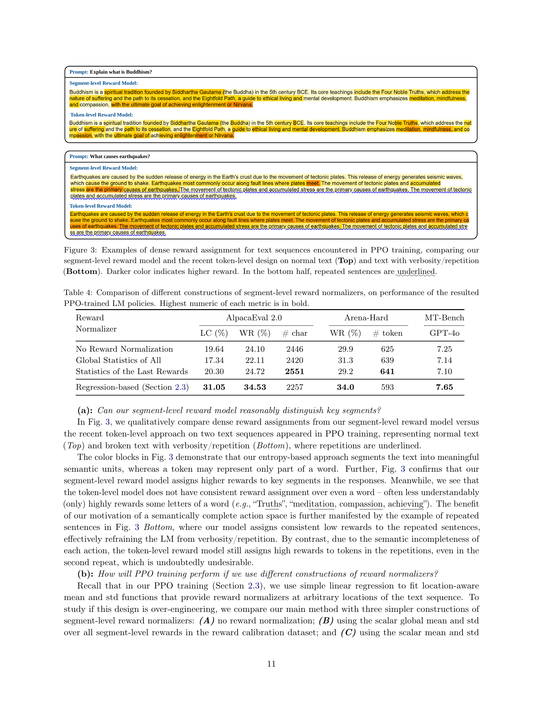

 


 2501.02790 
 Yueqin Yin et el. 
 
 🤗 2025-01-08 
 



↗ arXiv


↗ Hugging Face


↗ Papers with Code


### TL;DR



기존 강화 학습 기반 언어 모델(RLHF)은 토큰 단위 보상을 사용하여 희소 보상 문제와 어휘적 모호성에 직면합니다.  이는 모델 학습의 효율성을 떨어뜨리고 성능 저하를 야기합니다. 또한, 기존의 단일 보상 접근 방식은 LM 생성의 순차적 특성을 고려하지 못하여 최적화 성능이 떨어집니다.

본 논문은 이러한 문제점을 해결하기 위해 의미적으로 완성된 텍스트 세그먼트에 보상을 부여하는 새로운 방법론을 제시합니다.  **텍스트 세그먼트 단위 보상 모델**과 **동적 세그먼트 분할 기법**을 통해 보다 밀집된 보상 신호를 제공하고, **위치 인식 정규화 함수**를 사용하여 보상의 안정성을 향상시켰습니다.  **다양한 벤치마크 실험** 결과, 제안된 방법은 기존 방법보다 우수한 성능을 보였으며, 추가적인 실험을 통해 방법의 효과를 검증했습니다.



#### Key Takeaways


 텍스트 세그먼트 단위의 보상 모델을 사용하여 RLHF의 희소 보상 문제를 효과적으로 해결 



 동적 텍스트 세그먼트 분할 및 위치 인식 정규화 기법을 통해 RL 기반 언어 모델 학습의 효율성 및 성능 향상 



 Alpaca Eval 2.0, Arena-Hard, MT-Bench 등 다양한 벤치마크에서 기존 방법 대비 우수한 성능 검증 


#### Why does it matter?
본 논문은 **강화 학습 기반 언어 모델 학습에서 희소 보상 문제를 해결하기 위한 새로운 방법론**을 제시하여, 기존의 단점을 극복하고 성능을 향상시켰다는 점에서 중요합니다.  **텍스트 세그먼트 단위의 보상 모델 학습 및 동적 세그먼트 분할 기법**은 향후 연구에 있어서 새로운 방향을 제시하고 있으며, 다양한 언어 모델 및 작업에 적용 가능한 범용적인 접근법으로서의 잠재력을 지니고 있습니다.  **다양한 실험 결과**는 제안된 방법의 우수성을 보여주고 있으며, **추가적인 에이블레이션 연구**를 통해 설계 선택의 타당성을 검증했습니다. 이는 향후 강화 학습 기반 언어 모델 연구에 중요한 기여를 할 것으로 예상됩니다.

------
#### Visual Insights

> 🔼 그림 1은 제안하는 세그먼트 수준의 보상 모델을 학습하고 활용하는 과정을 개괄적으로 보여줍니다. 그림에서 숫자는 임의로 표시된 것이며, 각 텍스트 세그먼트는 다른 색상으로 표시되고 각 세그먼트의 시작 단어는 밑줄이 그어져 있습니다.  이 그림은 보상 모델 학습과 정책 학습의 두 가지 주요 단계를 보여줍니다. 보상 모델 학습 단계에서는, 인간의 선호도 데이터를 사용하여 세그먼트 수준의 보상 모델을 학습합니다.  정책 학습 단계에서는 학습된 보상 모델을 사용하여 언어 모델의 정책을 강화 학습을 통해 최적화합니다.  각 단계의 주요 구성 요소와 데이터 흐름이 시각적으로 제시되어 있어, 세그먼트 수준의 보상 모델을 사용하는 전체 과정을 이해하는 데 도움을 줍니다.
> 

> 
read the caption

> Figure 1:  Overview of training and utilizing our segment-level reward model. Numerics in the plot are artificial. In the figure, each text segment has a different color, and its starting word is underscored.
> 


| Action |  | AlpacaEval 2.0 |  | Arena-Hard |  | MT-Bench |
|---|---|---|---|---|---|---|---|
|  |  | LC(%) | WR(%) | # char |  | WR% | # token |  | GPT-4o |
|---|---|---|---|---|---|---|---|---|---|
| Phi3-mini Instruct |  | 18.89 | 14.41 | 1473 |  | 25.1 | 490 |  | 7.33 |
| Bandit (Sequence) |  | 27.05 | 29.07 | 2164 |  | 31.3 | 623 |  | 7.46 |
| Sentence |  | 25.56 | 32.92 | 2626 |  | 32.8 | 671 |  | 7.51 |
| Token |  | 27.82 | 26.46 | 1940 |  | 27.2 | 533 |  | 7.58 |
| Segment (Ours) |  | 31.05 | 34.53 | 2257 |  | 34.0 | 593 |  | 7.65 |
| Bandit as Segment |  | 14.39 | 6.46 | 691 |  | 11.1 | 308 |  | 6.61 |
| Segment as Bandit |  | 27.15 | 28.20 | 2079 |  | 30.9 | 620 |  | 7.38 |

> 🔼 본 표는 백본 모델로 Phi3-mini Instruct를 사용하여 PPO로 학습된 언어 모델의 성능을 다양한 행동 정의에 따라 비교한 결과를 보여줍니다.  다양한 행동 정의(단어, 문장, 구절, 전체 시퀀스)에 따른 세 가지 벤치마크(AlpacaEval 2.0, Arena-Hard, MT-Bench)에서의 성능(LC, WR, 문자/토큰 수)을 비교 분석합니다. 각 열의 최고값은 굵게 표시되어 있습니다.  본 표는 다양한 행동 단위를 사용했을 때  PPO 기반의 언어 모델 학습 성능에 미치는 영향을 비교 분석하는 데 중점을 둡니다.
> 

> 
read the caption

> Table 1:  Performance comparison among different action definitions on PPO-trained LM policy, with the backbone model being Phi3-mini Instruct. # {char, token} measures the average response length in the benchmark tests. Highest value of each column is in bold.
> 

### In-depth insights

#### Segment-Level RLHF
**세그먼트 수준 RLHF**는 기존의 토큰 수준 또는 전체 시퀀스 수준 RLHF의 한계를 극복하기 위해 제안된 접근 방식입니다. 기존 방식은 희소 보상 문제나 과도한 세분화 문제로 어려움을 겪었는데, 세그먼트 수준 RLHF는 **의미적으로 완결된 텍스트 단위(세그먼트)**에 보상을 할당하여 이러한 문제를 해결합니다. 이는 각 토큰을 독립적인 행동으로 간주하는 것보다 더욱 **자연스럽고 효율적인 보상 전달**을 가능하게 합니다.  **동적 텍스트 분할 기법**을 활용하여 다양한 길이의 세그먼트를 생성하고, 표준 시퀀스 선호도 데이터셋과의 호환성을 유지하는 것이 특징입니다. 또한, 기존의 스칼라 보상 정규화 방식을 위치 인식 정규화 함수로 일반화하여 **세그먼트 보상의 밀도를 높이고 학습 안정성을 향상**시킵니다.  결과적으로, 세그먼트 수준 RLHF는 LM 정책 학습에 있어 경쟁력 있는 성능을 보이며,  **희소 보상 문제와 세분화 문제의 해결**에 대한 실질적인 대안을 제시합니다.  **어노테이션 데이터의 효율적 활용**과 **모델의 해석성 향상** 또한 기대할 수 있는 장점입니다.

#### Reward Normalization
보상 정규화는 강화 학습에서 중요한 과정으로, 특히 인간 피드백으로부터의 강화 학습(RLHF)에서 언어 모델을 훈련할 때 필수적입니다.  **원시 보상 신호는 종종 왜곡되거나 불안정하여 모델 학습에 방해가 될 수 있기 때문**입니다.  이러한 문제를 해결하기 위해 다양한 정규화 기법이 제안되었는데, 이는 보상 분포의 평균과 표준 편차를 사용하여 보상 값을 표준화하는 간단한 방법부터, **위치 정보를 고려한 보다 정교한 방법**까지 다양합니다.  본 논문에서는 특히 **구간 수준의 보상 모델을 사용**하여, 각 구간에 대한 보상을 위치 정보를 활용한 정규화 함수로 처리함으로써 보다 안정적이고 효율적인 학습을 달성합니다.  **이러한 위치 인식 정규화 기법은 기존의 단순 정규화 방식보다 더 나은 성능**을 보이며, 희소 보상 문제를 완화하는 데 효과적입니다.  **구간 내 보상 보간 기법**은 추가적인 학습 신호를 제공하여 모델의 성능을 향상시키는 데 기여합니다.  **보상 정규화 전략의 선택은 모델 성능에 큰 영향**을 미치므로, 다양한 정규화 기법을 비교 분석하는 것은 매우 중요합니다.

#### Dynamic Segmentation
**동적 분할**은 본 논문에서 제시하는 핵심 개념으로, 기존의 고정된 단위(예: 토큰, 문장) 대신 문맥에 따라 **가변적인 길이**를 갖는 의미 단위(세그먼트)로 텍스트를 나누는 방식입니다. 이는 자연어 생성의 순차적인 특성을 고려하여, **의미 단위별 보상**을 통해 더욱 정확한 강화 학습을 가능하게 합니다. 기존 토큰 단위 접근 방식의 경우, 의미가 불분명한 작은 단위에 보상을 할당함으로써 불필요한 학습 과정을 초래할 수 있습니다. 반면, 문장 단위 접근 방식은 보상이 너무 드물어 학습 효율성이 떨어집니다. 따라서 동적 분할은 이러한 문제점을 해결하기 위해 제안된 것으로, **세그먼트의 경계를 동적으로 결정**함으로써 의미 있는 단위에 대한 보상을 효율적으로 할당할 수 있습니다.  **엔트로피 기반의 동적 분할**을 통해 문맥에 따라 세그먼트의 크기가 유동적으로 변화하며, **세그먼트 내 보상의 보간**을 통해 학습 신호를 더욱 강화합니다.  **이러한 동적 분할 기법은 기존의 정적 분할 방식보다 더욱 정교한 보상 할당을 가능하게 하여 강화 학습의 성능을 향상시킬 수 있습니다.**

#### PPO Policy Learning
본 논문에서 제시된 PPO 정책 학습 방법은 기존의 RLHF(Reinforcement Learning from Human Feedback) 방식의 단점을 극복하기 위해 **세그먼트 수준의 보상 모델**을 활용합니다. 기존의 토큰 단위 보상 모델은 세밀하지만, 의미 단위의 보상이 어렵다는 한계가 있으며, 전체 시퀀스 단위 보상은 보상이 희소하다는 단점이 있습니다. 반면, 본 논문의 세그먼트 단위 보상 모델은 의미적으로 완결된 텍스트 세그먼트에 보상을 할당하여, **보상의 희소성 문제를 완화**하고 **정책 학습의 효율성을 높입니다**.  **동적 텍스트 분할** 기법과 기존의 순차적 선호도 데이터셋과의 호환성을 통해 표준적인 순차 선호도 데이터셋을 활용하여 보상 학습을 수행합니다. 또한, 기존의 스칼라 보상 정규화 방식을 위치 인식 정규화 함수로 일반화하여 보상의 밀도를 높이고, PPO 기반의 정책 학습에 활용합니다.  **위치 인식 정규화**와 **세그먼트 보상 보간**을 통해 학습 신호의 밀도를 높임으로써, Alpaca Eval 2.0, Arena-Hard, MT-Bench와 같은 RLHF 벤치마크에서 경쟁력 있는 성능을 달성합니다.  실험 결과는 제안된 방법의 효과를 보여주며, 특히 텍스트 길이 조작 없이 성능 향상을 이룬다는 점에 주목할 만합니다.

#### Ablation Study
본 논문의 "Ablation Study" 부분은 모델 성능에 영향을 미치는 요소들을 체계적으로 분석하여 **모델의 강건성 및 신뢰도를 높이는 데 중요한 역할**을 합니다.  구체적으로, 여러 가지 변수들을 제거하거나 변경하면서 모델 성능 변화를 측정하고, 각 요소의 중요성을 정량적으로 평가합니다. 이를 통해 연구자는 **모델 설계 및 학습 전략을 개선**하고, **향후 연구 방향**을 설정하는 데 유용한 정보를 얻을 수 있습니다.  **특히, 본 연구에서 제시된 세그먼트 수준의 보상 모델이 실제로 효과적인지**를 검증하고, **세그먼트 분할 방식, 보상 정규화 기법, 그리고 보상 보간 기법 등의 여러 요소가 모델 성능에 미치는 영향**을 종합적으로 분석하는 데 활용될 것으로 예상됩니다.  결과적으로, 이러한 ablation study를 통해 얻은 통찰력은 향후 더욱 효과적이고 강건한 언어 모델을 개발하는 데 기여할 것입니다.  **각 요소의 상호작용 및 영향의 정도**를 상세히 분석하여, **모델의 한계점을 파악**하고, **개선 방향**을 제시할 수 있을 것입니다.

### More visual insights

More on figures

> 🔼 그림 2는 본 논문에서 제안하는 세그먼트 수준 보상 모델 학습에 사용된 데이터의 예시를 보여줍니다.  두 개의 응답(선택된 응답과 기각된 응답)이 주어진 프롬프트에 대해 제시되며, 사람이 평가한 선호도에 따라 선택된 응답과 기각된 응답이 구분됩니다.  선택된 응답은 빨간색으로 강조 표시된 주요 구절을 포함하고 있어서, 기각된 응답보다 평균적으로 더 높은 품질을 가지고 있음을 보여줍니다.  이러한 관찰 결과는 보상 값들을 집계하는 함수 f(⋅)로 평균을 사용하는 것이 타당함을 시사하며,  함수 f(⋅)의 선택은 작업 및 데이터셋에 따라 달라질 수 있다는 점을 강조합니다.
> 

> 
read the caption

> Figure 2:  Examples of data in our reward training dataset, motivating us to use Average as the aggregation function f⁢(⋅)𝑓⋅f(\cdot)italic_f ( ⋅ ). It is clear that the average quality of the chosen responses is better than the rejected ones, as they contain some key phrases (highlighted in red) for responding to the given prompt. We note that the choice of f⁢(⋅)𝑓⋅f(\cdot)italic_f ( ⋅ ) ought to be task and dataset specific, as discussed in Yang et al. (2023).
> 

> 🔼 그림 3은 PPO 학습 중 발생하는 텍스트 시퀀스에 대한 밀집 보상 할당의 예시입니다. 본 논문에서 제안하는 세그먼트 수준 보상 모델과 최근의 토큰 수준 설계를 정상적인 텍스트(위쪽)와 장황함/반복이 있는 텍스트(아래쪽)에 대해 비교 분석합니다. 어두운 색상은 더 높은 보상을 나타냅니다. 아래쪽에서는 반복되는 문장에 밑줄이 그어져 있습니다. 이 그림은 제안된 세그먼트 수준 보상 모델이 의미있는 의미 단위로 텍스트를 분할하고, 반복되는 문장에 대해 일관되게 낮은 보상을 할당하여 모델의 장황함을 방지하는 것을 보여줍니다. 반면 토큰 수준 모델은 단어의 일부에만 높은 보상을 할당하는 등 일관성이 부족합니다.
> 

> 
read the caption

> Figure 3:  Examples of dense reward assignment for text sequences encountered in PPO training, comparing our segment-level reward model and the recent token-level design on normal text (Top) and text with verbosity/repetition (Bottom). Darker color indicates higher reward. In the bottom half, repeated sentences are underlined.
> 

> 🔼 그림 4는 엔트로피 기반 텍스트 분할에 사용된 엔트로피 임계값(Cent)의 변화에 따른 성능 비교를 보여줍니다.  (a)는 평균 세그먼트 길이(토큰 단위)를 나타내고, (b)~(e)는 AlpacaEval 2.0(LC, WR), Arena-Hard, MT-Bench에 대한 PPO 학습된 LM 정책의 벤치마크 점수입니다. Cent 값이 증가함에 따라 평균 세그먼트 길이도 증가하며, Cent가 1.75에서 2.25 사이일 때 최상의 성능을 보입니다.  이는 세그먼트 길이가 너무 짧거나 길지 않을 때 최적의 성능을 달성함을 보여줍니다.
> 

> 
read the caption

> (a) Avg. Seg. Len (token)
> 

> 🔼 그림은 논문의 4.3절(Ablation Study)에서 다양한 엔트로피 임계값(Cent)을 사용하여 텍스트 세분화를 했을 때의 성능을 보여줍니다. AlpacaEval 2.0 벤치마크의 LC(Length Control) 점수를 나타내는 그래프입니다.  x축은 엔트로피 임계값(Cent), y축은 LC 점수를 나타냅니다.  다양한 Cent 값에 따른 LC 점수 변화와 평균 세그먼트 길이(토큰 수)의 변화를 보여주어, 적절한 Cent 값의 선택이 모델 성능에 미치는 영향을 분석하고 있습니다.
> 

> 
read the caption

> (b) AlpacaEval 2 (LC)
> 

> 🔼 그림은 본 논문의 4.3절(Ablation Study)에서 다양한 엔트로피 임계값(Cent)을 사용하여 텍스트를 분할했을 때 결과를 보여줍니다.  AlpacaEval 2.0 벤치마크에서 승률(WR)을 측정하여 Cent 값이 모델 성능에 미치는 영향을 평가합니다.  각 막대는 특정 Cent 값에 대한 평가 결과를 나타내며, 세로축은 승률을 나타냅니다.  이를 통해 최적의 텍스트 분할 전략을 찾는 데 도움이 되는 정보를 제공합니다.
> 

> 
read the caption

> (c) AlpacaEval 2 (WR)
> 

> 🔼 그림 (d)는 논문의 주요 실험 결과 중 하나인 Arena-Hard 벤치마크에 대한 결과를 보여줍니다. Arena-Hard는 다양한 어려운 질문들로 구성된 벤치마크이며, 본 논문에서는 제안된 방법(Segment-level reward model)을 다른 방법들과 비교하여 정답률(WR)과 응답 길이(token 수)를 측정했습니다.  세로축은 성능 지표(정답률 또는 토큰 수), 가로축은 서로 다른 방법들을 나타냅니다. 이를 통해 본 논문에서 제안하는 세그먼트 단위 보상 모델의 성능을 다른 방법들과 비교 분석하여 그 우수성을 보여주고 있습니다.
> 

> 
read the caption

> (d) Arena-Hard
> 

> 🔼 그림은 본 논문의 4.2절(주요 실험적 비교)에서 다양한 행동 정의(방법)에 따른 PPO 기반 언어 모델 정책의 성능 비교 결과를 보여줍니다.  특히 MT-Bench 벤치마크에 대한 결과를 보여주는 부분입니다.  MT-Bench는 다중 턴 대화 데이터셋으로,  본 그림에서는 GPT-4를 기준으로 평가된 GPT-40 점수를 나타냅니다. 각 행동 정의(방법)에 따라 학습된 PPO 기반 LM 정책이 MT-Bench에서 달성한 성능(GPT-40 점수)을 비교함으로써, 제안하는 세그먼트 수준 보상 모델의 효과를 보여줍니다.
> 

> 
read the caption

> (e) MT-Bench
> 

More on tables


| Action | Definition | AlpacaEval 2.0 LC (%) | AlpacaEval 2.0 WR (%) | AlpacaEval 2.0 # char |  | Arena-Hard WR (%) | Arena-Hard # token |  | MT-Bench GPT-4o | 
|---|---|---|---|---|---|---|---|---|---|
| Phi3.1-mini SFT |  | 14.93 | 10.19 | 1271 |  | 14.5 | 476 |  | 7.00 | 
| Bandit (Sequence) |  | 19.39 | 14.78 | 1542 |  | 19.5 | 524 |  | 7.26 | 
| Token |  | 22.48 | 19.25 | 1687 |  | 23.2 | 525 |  | 7.43 | 
| Segment (**Ours**) |  | **26.19** | **23.85** | **1795** |  | **28.5** | **585** |  | **7.49** | 
> 🔼 표 2는 기본 모델로 Phi3.1-mini Instruct의 3.8B SFT 체크포인트를 사용하여 PPO로 학습된 언어 모델 정책에서 서로 다른 행동 정의 간의 성능 비교를 보여줍니다. 표의 형식은 표 1과 동일합니다. 이 표는 다양한 행동 정의(전체 시퀀스, 문장, 토큰, 세그먼트)에 따른 PPO 학습된 LM 정책의 성능을 비교하여 제안된 세그먼트 수준 방법의 효과를 보여줍니다.  AlpacaEval 2.0, Arena-Hard, MT-Bench 세 가지 벤치마크에 대한 결과를 제시하고 각 벤치마크의 평균 응답 길이를 측정합니다.
> 

> 
read the caption

> Table 2:  Performance comparison among different action definitions on PPO-trained LM policy, with the backbone model being the 3.8B SFT checkpoint of Phi3.1-mini Instruct. Table format follows Table 1.
> 


| Action | Definition | AlpacaEval 2.0 LC (%) | AlpacaEval 2.0 WR (%) | AlpacaEval 2.0 # char |  | Arena-Hard WR (%) | Arena-Hard # token |  | MT-Bench GPT-4o |
|---|---|---|---|---|---|---|---|---|---|
| Llama-3-8B-SFT |  | 16.31 | 9.50 | 1221 |  | 10.4 | 469 |  | 6.82 |
| Bandit (Sequence) |  | 21.20 | 20.99 | 2218 |  | 18.7 | 513 |  | 7.11 |
| Token |  | 23.84 | 20.87 | 1744 |  | 26.0 | 622 |  | 7.13 |
| Segment (Ours) |  | **25.11** | **28.57** | **2264** |  | **30.4** | 616 |  | **7.15** |
> 🔼 본 표는 RLHFlow에서 공개한 Llama-3의 8B SFT 체크포인트를 백본 모델로 사용하여 PPO로 학습된 언어 모델 정책에서 서로 다른 행동 정의 간의 성능 비교를 보여줍니다. 표에는  AlpacaEval 2.0, Arena-Hard, MT-Bench 세 가지 벤치마크에서의  정확도(LC, WR)와 응답 길이(# char, # token)가 포함됩니다.  다른 행동 정의(Bandit, Sentence, Token)와 비교하여 본 연구에서 제안한 Segment 기반 방식의 우수성을 보여주는 표입니다. 표의 형식은 표 1과 동일합니다.
> 

> 
read the caption

> Table 3:  Performance comparison among different action definitions on PPO-trained LM policy, with the backbone model being the 8B SFT checkpoint of Llama-3 released by RLHFlow. Table format follows Table 1.
> 


| Reward                     | AlpacaEval 2.0          |             |                | Arena-Hard                 |             |                | MT-Bench   |
| :-------------------------- | :----------------------- | :---------- | :------------ | :-------------------------- | :---------- | :------------ | :---------- |
|                             | LC (%)                    | WR (%)      | # char       | WR (%)                    | # token    |                | GPT-4o     |
| No Reward Normalization     | 19.64                    | 24.10      | 2446         | 29.9                     | 625        |                | 7.25       |
| Global Statistics of All    | 17.34                    | 22.11      | 2420         | 31.3                     | 639        |                | 7.14       |
| Statistics of the Last Rewards | 20.30                    | 24.72      | 2551         | 29.2                     | 641        |                | 7.10       |
| Regression-based (Section 2.3) | **31.05**                | **34.53**  | 2257         | **34.0**                  | 593        |                | **7.65**   |
> 🔼 본 표는 다양한 방법으로 구성된 세그먼트 수준의 보상 정규화기를 사용하여 PPO로 학습된 언어 모델 정책의 성능을 비교한 결과를 보여줍니다.  구체적으로, 보상 정규화를 하지 않은 경우, 전체 보상의 전역 통계량을 사용한 경우, 마지막 보상의 통계량을 사용한 경우, 그리고 회귀 기반 방법을 사용한 경우의 네 가지 방법을 비교합니다. 각 지표(AlpacaEval 2.0의 LC, WR, 문자 수, Arena-Hard의 WR, 토큰 수, MT-Bench의 GPT-40 점수)에 대한 최고점은 굵게 표시되어 있습니다.
> 

> 
read the caption

> Table 4:  Comparison of different constructions of segment-level reward normalizers, on performance of the resulted PPO-trained LM policies. Highest numeric of each metric is in bold.
> 


| Interpolation Strategy | AlpacaEval 2.0 |  | Arena-Hard |  | MT-Bench |
|---|---|---|---|---|---|---|
|  | LC (%) | WR (%) | # char |  | WR (%) | # token | GPT-4o |
| No Interpolation | 25.98 | 34.53 | 2666 |  | 39.1 | 675 |  |
| Repeat Segment Reward | 26.34 | 23.48 | 1795 |  | 23.0 | 512 |  |
| Even Split (Section 2.3) | **31.05** | **34.53** | 2257 |  | 34.0 | 593 | **7.65** |
> 🔼 표 5는 세그먼트 수준의 보상 보간 전략들을 비교한 표입니다. PPO로 학습된 언어 모델 정책의 AlpacaEval 2.0 및 Arena-Hard 성능 결과를 보여줍니다. 각 지표에서 가장 높은 수치는 굵게 표시되어 있습니다. 이 표는 세그먼트 내 보상 보간 방법이  PPO 기반 언어 모델 학습 성능에 미치는 영향을 분석하기 위해 다양한 보상 보간 기법을 비교 분석한 결과를 제시합니다.
> 

> 
read the caption

> Table 5:  Comparison of different within-segment reward interpolation strategies. Shown are the results of the resulted PPO-trained LM policies on AlpacaEval 2.0 and Arena-Hard. Highest numeric of each metric is in bold.
> 


| Action Definition | ARC | TruthfulQA | Winograd | HellaSwag | MMLU | GSM8K | Average |
|---|---|---|---|---|---|---|---| 
| Phi-Instruct | **64.76** | 54.44 | 74.51 | 79.03 | 70.41 | 81.6 | 70.79 |
| Bandit (Sequence) | **64.76** | **55.11** | 74.35 | 79.32 | 70.42 | 77.8 | 70.29 |
| Sentence | 63.40 | 53.99 | 72.93 | 79.34 | 70.42 | 84.1 | 70.70 |
| Token | 62.71 | 53.94 | 71.43 | **79.46** | **70.55** | **87.3** | 70.90 |
| Segment (**Ours**) | 62.71 | 54.74 | 72.06 | 79.23 | 70.42 | 86.7 | **70.98** |
| Bandit as Segment | 64.16 | 54.62 | 74.66 | 78.95 | **70.55** | 81.0 | 70.66 |
| Segment as Bandit | 64.33 | 54.81 | **74.74** | 79.23 | 70.39 | 78.6 | 70.35 |
> 🔼 본 표는 HuggingFace OpenLLM 리더보드(Beeching et al., 2023)의 다운스트림 작업에 대한 평가 결과를 보여줍니다. 표 1의 LM 정책들을 비교 분석한 결과를 보여주는 표입니다.  다운스트림 작업의 성능을 다양한 행동 정의(action definition)에 따라 비교 분석하여  각 정책의 강점과 약점을 보여줍니다.  구체적으로는  Phi-Instruct 기본 모델과 Bandit(Sequence), Sentence, Token, Segment(본 논문에서 제안), Bandit as Segment, Segment as Bandit 등 6가지 방법의  ARC, TruthfulQA, Winograd, HellaSwag, MMLU, GSM8K  등 다양한 지표에 대한 평가 점수를 비교하여 제시합니다. 이를 통해 제안된 Segment 방법의 효과성을 다른 방법들과 비교하여 확인할 수 있습니다.
> 

> 
read the caption

> Table 6:  Evaluation results of downstream tasks on the HuggingFace OpenLLM Leaderboard (Beeching et al., 2023), comparing LM policies in Table 1.
> 

### Full paper



