 


 2501.02832 
 Syed Abdul Gaffar Shakhadri et el. 
 
 🤗 2025-01-07 
 



↗ arXiv


↗ Hugging Face


↗ Papers with Code


### TL;DR



기존의 음성 인식 시스템은 Transformer 기반 모델을 사용하지만, **긴 오디오 시퀀스 처리 시 계산 비용이 많이 들고 메모리 사용량이 과다**하여 성능 저하 및 확장성 문제가 발생합니다.  이러한 문제는 **실시간 처리 및 제한된 자원 환경**에서의 적용에 어려움을 야기합니다. 

본 논문에서는 **Mamba 아키텍처**를 기반으로 한 새로운 음성 인식 모델인 Samba-ASR을 제시합니다. Samba-ASR은 **상태 공간 모델**을 사용하여 **긴 오디오 시퀀스의 효율적인 처리**를 가능하게 합니다. 실험 결과, Samba-ASR은 여러 표준 벤치마크에서 기존의 Transformer 기반 모델보다 **뛰어난 정확성과 효율성**을 보였습니다. 특히, **잡음이 많은 음성이나 긴 오디오 시퀀스**에 대해서도 뛰어난 성능을 보였습니다. 이는 **실시간 음성 인식 및 저자원 환경**에서의 응용 가능성을 크게 확장하는 결과입니다.



#### Key Takeaways


 Mamba 아키텍처 기반의 효율적인 음성 인식 모델 Samba-ASR 제시 



 기존 Transformer 모델 대비 향상된 정확성 및 효율성 달성 



 다양한 벤치마크 데이터셋에서 최첨단 성능 입증 


#### Why does it matter?
본 논문은 **효율성과 정확성을 모두 갖춘 새로운 음성 인식 아키텍처**를 제시하여 연구자들에게 중요한 의미를 지닙니다. 기존 Transformer 기반 모델의 한계를 극복하고, **장시간 시퀀스 처리에 대한 효율성을 높이면서** 동시에 **최첨단 성능**을 달성한 Samba-ASR은 음성 인식 기술의 발전에 크게 기여할 뿐만 아니라, **향후 연구 방향**을 제시하는 중요한 이정표가 될 것입니다. 특히, **제한된 자원 환경**에서도 높은 성능을 유지하는 Samba-ASR의 강점은 **실세계 응용**에 대한 가능성을 더욱 확대하며, 다양한 분야의 연구자들에게 광범위한 영향을 미칠 것으로 예상됩니다.

------
#### Visual Insights

> 🔼 그림 1은 Samba-ASR 모델의 아키텍처 다이어그램을 보여줍니다. 주요 구성 요소는 맘바 블록(Mamba blocks)을 사용하여 원시 오디오 특징을 처리하는 맘바 인코더(Mamba encoder)와 맘바-크로스-커넥션(Mamba-Cross-Connection) 브리지를 통해 오디오 컨텍스트와 텍스트 표현을 통합하여 전사를 생성하는 맘바 디코더(Mamba decoder)입니다. 모델의 설계는 정확한 자동 음성 인식을 위한 효율적인 장기 의존성 포착에 중점을 둡니다. 맘바 인코더는 컨볼루션 레이어를 통해 오디오 신호의 국소적 패턴을 캡처하고, 맘바 블록은 장기 의존성을 효율적으로 모델링합니다. 맘바 디코더는 인코더의 출력과 이전에 생성된 토큰을 조건으로 하여 텍스트를 생성합니다. 맘바-크로스-커넥션 브리지는 오디오와 텍스트 사이의 관계를 명확히 해주는 역할을 합니다. 이 다이어그램은 Samba-ASR이 오디오 신호의 장기 의존성을 효율적으로 처리하는 방법을 명확히 보여줍니다.
> 

> 
read the caption

> Figure 1: Architecture diagram (original) of the Samba-ASR model, illustrating the key components including the Mamba encoder, which processes raw audio features using Mamba blocks, and the Mamba decoder along with the Mamba-Cross-Connection bridge, which generates transcriptions by integrating audio context with text representations. The model’s design focuses on efficient long-range dependency capture for accurate automatic speech recognition.
> 


| Training Parameters |  | 
|---|---| 
| **Learning Rate** | 1e-4 | 
| **Optimizer** | AdamW | 
| **Weight Decay** | 0.01 | 
| **Adam eps** | 1e-8 | 
| **Batch Size** | 256 | 

> 🔼 본 표는 Samba-ASR 모델 학습에 사용된 하이퍼파라미터의 세부 정보를 보여줍니다. 학습률, 최적화 알고리즘, 가중치 감소율, Adam epsilon 값, 배치 크기 등의 하이퍼파라미터가 포함되어 있습니다. 이 표는 모델 학습 과정을 이해하는 데 중요한 정보를 제공합니다.  이러한 하이퍼파라미터 설정은 모델의 성능과 안정성에 큰 영향을 미칩니다.
> 

> 
read the caption

> Table 1: Details of Training Parameters used for the training of Samba-ASR
> 

### In-depth insights

#### Mamba SSM Superiority
Mamba SSM의 우수성은 **긴 시퀀스 처리에서의 선형적 복잡도**와 **변환기 기반 모델의 제한점 극복**이라는 두 가지 핵심 요소에 기반합니다. 기존의 트랜스포머 기반 ASR 모델은 긴 오디오 시퀀스 처리에 있어 이차적 복잡도로 인해 계산 비용이 많이 들고 메모리 사용량이 많았습니다. 반면, Mamba SSM은 선형적 복잡도를 제공하여 이러한 문제를 해결합니다. **선택적 순환 메커니즘**을 통해 Mamba는 장기 의존성을 효율적으로 모델링하여 **정확도와 효율성을 동시에 높입니다.** 또한, Mamba는 하드웨어 인식 최적화를 통해 계산 효율성을 더욱 높이고 메모리 오버헤드를 줄입니다. 이러한 특징 덕분에 Mamba는 다양한 ASR 작업에 적용 가능하며, 특히 **잡음이 많은 환경이나 제한된 리소스 환경**에서도 뛰어난 성능을 보입니다.  **실험 결과**는 Mamba 기반 Samba-ASR 모델이 기존의 최첨단 트랜스포머 기반 모델들을 능가하는 성능을 보임으로써 Mamba SSM의 우수성을 입증합니다.

#### Samba-ASR Architecture
Samba-ASR의 핵심은 **Mamba 구조**를 엔코더와 디코더 모두에 활용하여 효율성을 극대화하는 데 있습니다. 기존의 Transformer 기반 모델들과 달리, Samba-ASR은 **선형적인 계산 복잡도**를 가지므로 긴 오디오 시퀀스 처리에 효과적입니다. **Mamba 블록**은 장기 의존성을 효율적으로 모델링하며, 오디오 특징 추출과 텍스트 생성 모두에 적용됩니다.  **입력 의존 매개변수**를 활용하여 시퀀스 내용에 따라 동적으로 적응하며, **하드웨어 인식 최적화** 기법을 통해 메모리 오버헤드를 줄이고 연산 효율성을 높였습니다. 이러한 설계는 **긴 시퀀스 처리에 대한 효율성과 정확도**를 동시에 달성하여 기존 Transformer 기반 ASR 시스템을 능가하는 성능을 보여줍니다.  **크로스 연결 메커니즘**은 오디오와 텍스트 특징 간의 정렬을 개선하여 정확도를 높이며, 이는 특히 긴 문장이나 복잡한 오디오에 도움이 됩니다.  결론적으로 Samba-ASR의 구조는 **효율성과 정확성**이라는 두 마리 토끼를 모두 잡은 혁신적인 설계로 평가할 수 있습니다.

#### Benchmark Results
본 논문에서 제시된 Samba-ASR 모델의 벤치마크 결과는 **다양한 데이터셋에 걸쳐 우수한 성능**을 보여줍니다. 특히, LibriSpeech Clean 데이터셋에서는 **최첨단 수준의 WER(Word Error Rate)**을 달성하여 모델의 정확성을 입증했습니다.  GigaSpeech 및 SPGISpeech와 같은 대규모, 도메인 특화 데이터셋에서도 경쟁력 있는 성능을 보임으로써 **모델의 일반화 능력**이 뛰어남을 확인했습니다.  **기존 Transformer 기반 모델 대비 뛰어난 효율성** 또한 중요한 결과이며, 이는 Samba-ASR이 실제 응용 환경에서도 효과적으로 사용될 수 있음을 시사합니다.  **계산 복잡도 및 메모리 사용량 측면의 효율성 개선**은 실시간 처리 및 제한된 자원 환경에서의 적용 가능성을 높여줍니다.  **잡음이나 자연스러운 발화 환경에 대한 강건성** 또한 Samba-ASR의 실용성을 더욱 높이는 요소입니다. 종합적으로 볼 때,  벤치마크 결과는 Samba-ASR이 **차세대 음성 인식 기술**의 강력한 후보임을 보여줍니다.

#### Computational Efficiency
본 논문에서 제시된 Samba-ASR 모델은 기존의 Transformer 기반 음성 인식 모델의 주요한 한계점 중 하나인 계산 비용 문제를 해결하기 위해 **Mamba 구조**를 활용합니다.  **Mamba는 선형 복잡도**를 가지는 상태 공간 모델(SSM) 기반의 아키텍처로, 입력 시퀀스 길이에 따라 계산 비용이 제곱으로 증가하는 Transformer와 달리 효율적인 처리가 가능합니다.  **선택적 순환 및 하드웨어 인식 최적화 기법**을 통해 Mamba는 장기 의존성 모델링에서도 효율성을 유지하며, 훈련 및 추론 시간을 단축시키는 데 기여합니다.  Samba-ASR은 이러한 Mamba의 효율성을 활용하여 다양한 벤치마크 데이터셋에서 **기존의 최첨단 모델들을 능가하는 성능**을 보여주면서 동시에 **계산 효율성**을 크게 향상시켰다는 점에서 의미가 있습니다.  **특히 장시간 음성 데이터 처리**에 있어서 Samba-ASR의 효율성은 괄목할 만하며, 실시간 응용 분야에서도 경쟁력을 갖출 수 있음을 시사합니다.

#### Future Research
본 논문의 "미래 연구" 부분은 **다국어 지원 확장**, **모델 크기 다양화**, **데이터 전처리 개선**, **실시간 처리 및 언어 감지 기능 통합** 등의 방향으로 Samba-ASR의 발전 가능성을 제시합니다. 특히 저자원 언어에 대한 지원 확대는 전세계적 활용성 측면에서 중요하며, 다양한 크기의 모델은 사용 환경에 따른 유연성을 제공합니다.  더욱 정교한 데이터 전처리 기법과 실시간 처리 기능은 성능 향상과 사용자 경험 개선에 직접적으로 기여할 것입니다.  **전반적으로 이러한 미래 연구 방향은 Samba-ASR의 실용성과 경쟁력을 더욱 강화하는데 초점을 맞추고 있습니다.**

### More visual insights

More on figures

> 🔼 그림 2는 에폭에 따른 학습 및 검증 손실의 상관관계를 보여줍니다. 두 손실 모두 꾸준히 감소하여 72번째 에폭에서 수렴하는 것을 보여줍니다. 이는 모델이 안정적으로 학습되었고 과적합 없이 일반화될 수 있음을 시사합니다.  x축은 에폭(학습 반복 횟수), y축은 손실 값을 나타냅니다.
> 

> 
read the caption

> Figure 2: This graph shows the correlation of training and validation loss across epochs, with both losses steadily decreasing and converging around the 72nd epoch.
> 

> 🔼 그림 3은 학습 과정 전반에 걸쳐 단어 오류율(WER)이 크게 감소함을 보여줍니다. 이는 모델 성능과 정확도가 향상되었음을 시사합니다. WER은 음성 인식 시스템의 성능을 측정하는 주요 지표로, WER 값이 낮을수록 모델의 정확도가 높다는 것을 의미합니다. 그림은 에포크(epoch)별 WER 변화를 보여주는데, 에포크가 증가할수록 WER이 꾸준히 감소하는 추세를 보입니다. 이는 모델이 학습 데이터에 잘 적응하고, 음성 인식 성능이 향상되었음을 나타냅니다.
> 

> 
read the caption

> Figure 3: This graph demonstrates a significant reduction in Word Error Rate (WER) throughout the training process, indicating improved model performance and accuracy.
> 

### Full paper


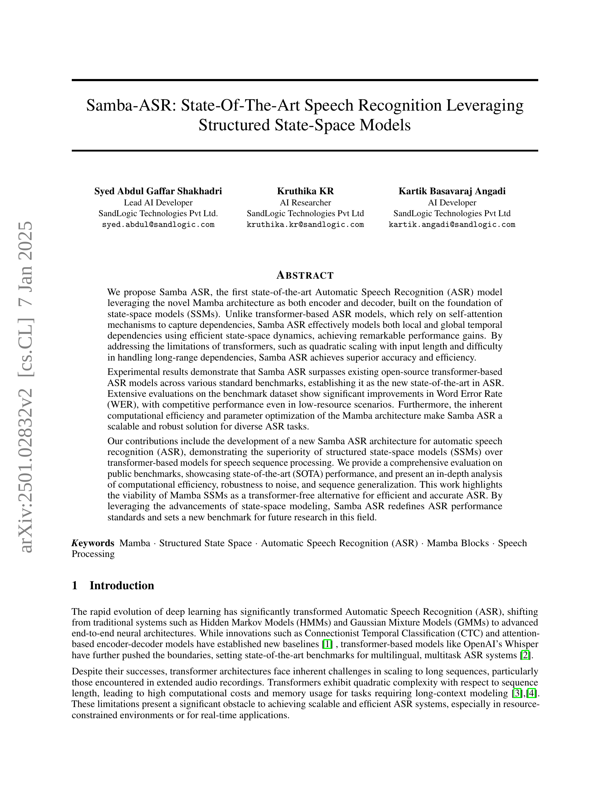
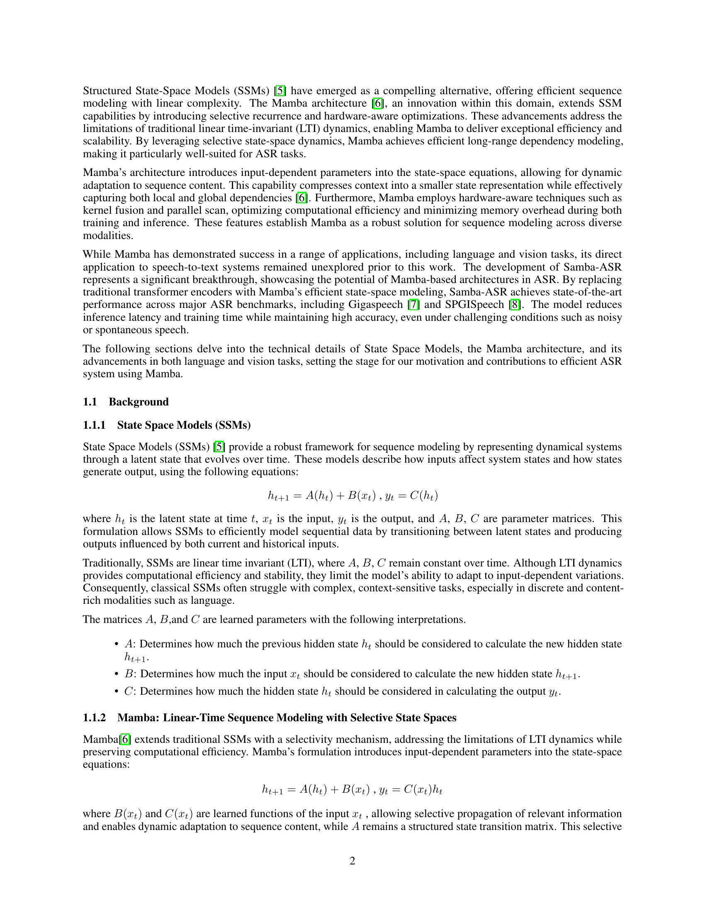
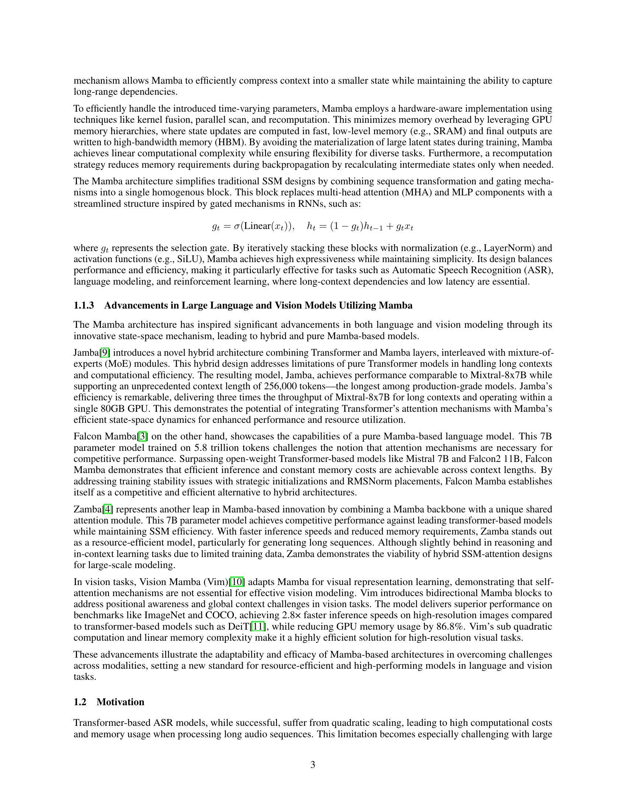
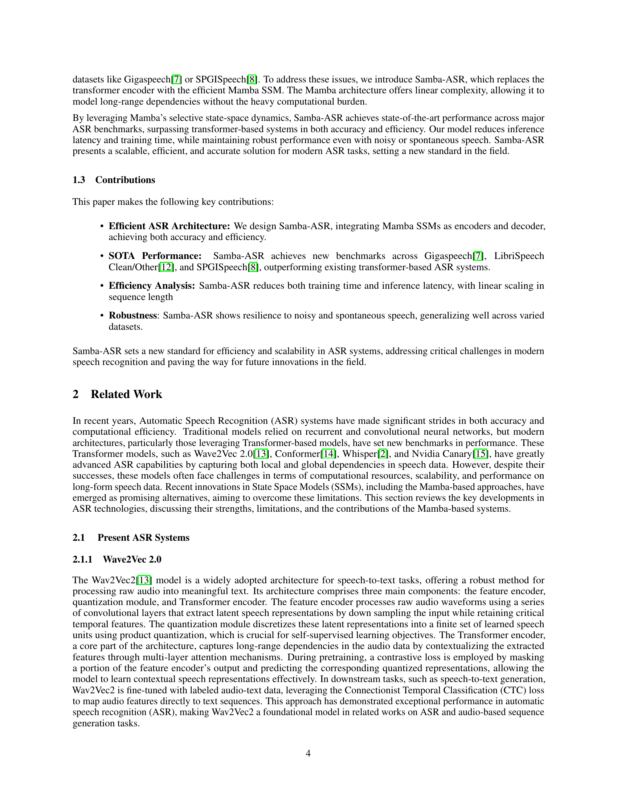
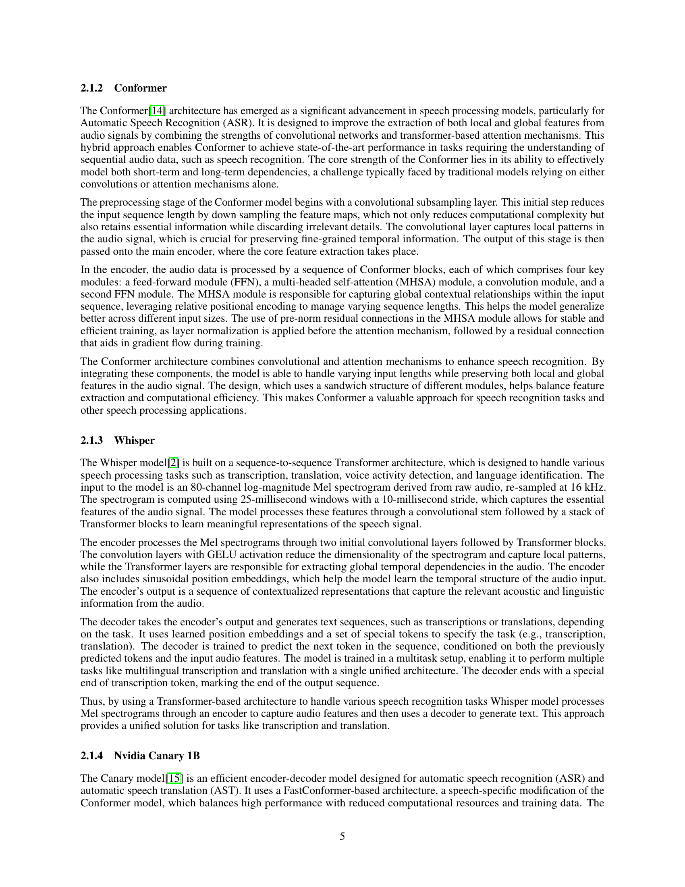
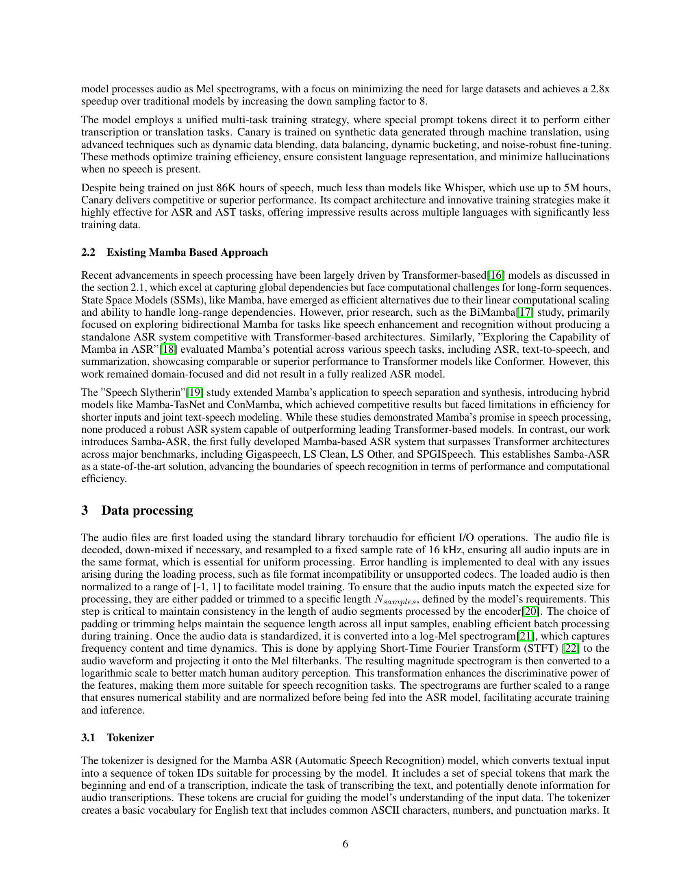
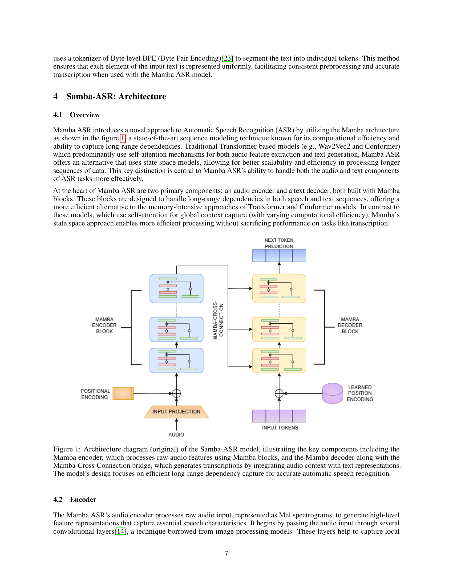
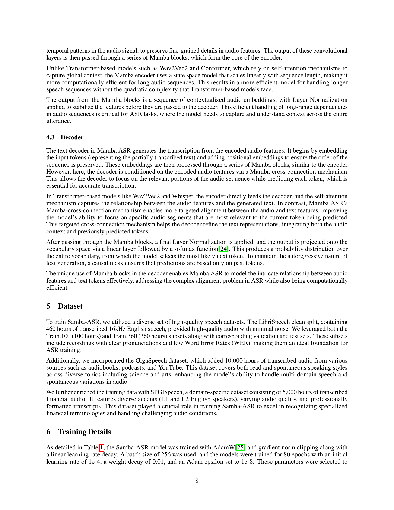
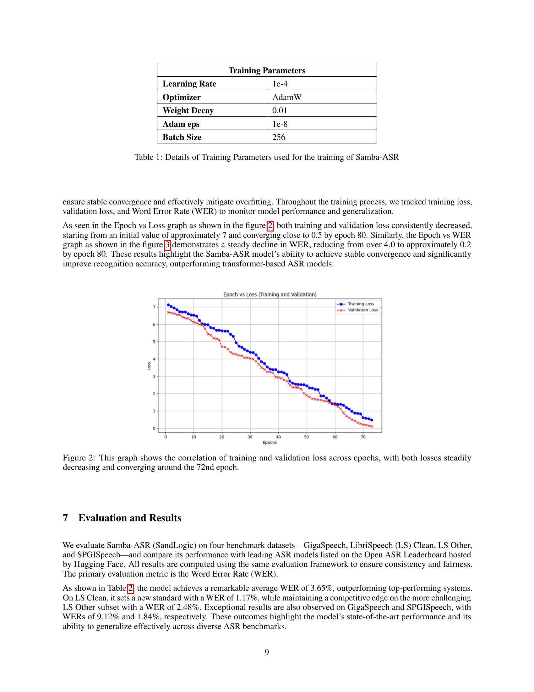
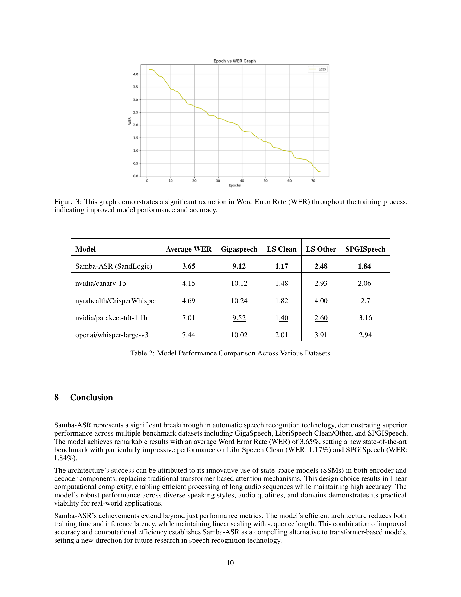
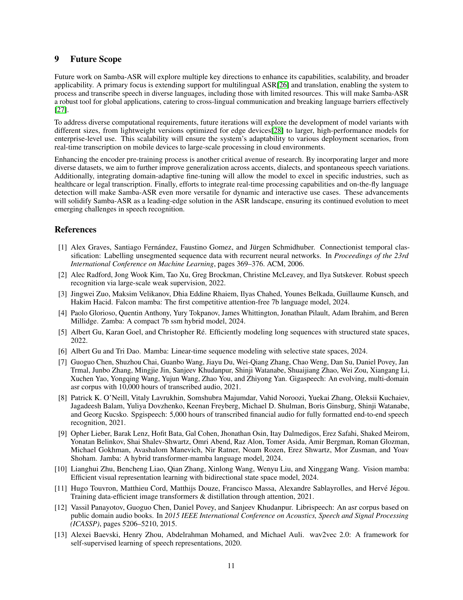
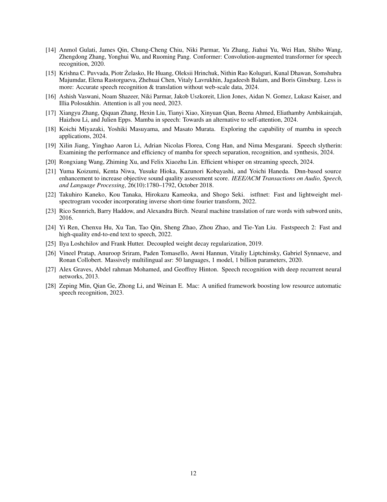
