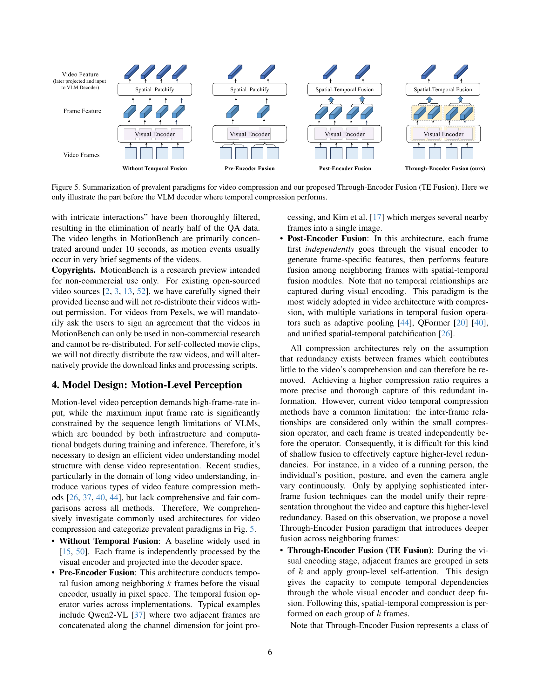

 


 2501.02955 
 Wenyi Hong et el. 
 
 🤗 2025-01-08 
 



↗ arXiv


↗ Hugging Face


↗ Papers with Code


### TL;DR



최근 비디오 이해 분야에서 비전 언어 모델(VLMs)의 발전이 두드러지지만, **미세 동작 이해** 능력은 여전히 부족합니다.  기존 벤치마크는 이러한 미세 동작 이해 능력을 충분히 평가하지 못하고, **다양한 유형의 동작을 포괄적으로 다루지 못**합니다.  또한, **긴 비디오 시퀀스 처리**의 어려움과 계산 비용 증가 문제도 존재합니다.

본 논문에서는 이러한 문제를 해결하기 위해, **MotionBench**라는 새로운 벤치마크를 제시합니다. MotionBench는 **다양한 출처의 고해상도 영상 데이터**와 **미세 동작을 중심으로 한 질문 유형**을 포함하여 **기존 벤치마크의 한계를 극복**합니다. 또한, 제한된 LLM 시퀀스 길이 내에서 미세 동작 인식 능력을 향상시키는 **새로운 TE Fusion 방식**을 제안하고, 실험 결과를 통해 그 효과를 검증합니다. MotionBench는 향후 **더욱 정교한 비디오 이해 모델 개발**을 위한 중요한 기준을 제시합니다.



#### Key Takeaways


 MotionBench는 **미세 동작 이해 능력**을 평가하는 새로운 비디오 이해 벤치마크입니다. 



 TE Fusion은 **고해상도 영상 처리**의 어려움과 **미세 동작 인식의 부족**이라는 문제를 해결하는 데 효과적입니다. 



 본 연구는 **영상 이해 모델의 성능 향상**에 기여하고, 향후 연구 방향을 제시합니다. 


#### Why does it matter?
본 논문은 **영상 이해 모델의 미세 동작 이해 능력 평가를 위한 새로운 벤치마크인 MotionBench**를 제시하고, 기존 모델의 한계를 극복하기 위한 새로운 방법론을 제안하여 **영상 이해 분야의 발전에 크게 기여**할 수 있습니다. 특히, **고해상도 영상 처리의 어려움과 미세 동작 인식의 부족**이라는 현실적 문제에 대한 해결책을 제시하고, 향후 연구 방향을 제시함으로써 **영상 이해 분야 연구자들에게 중요한 지침**을 제공합니다.  또한, 제안된 방법론이 **다양한 영상 데이터셋에서 우수한 성능**을 보임으로써, 향후 **실제 응용 분야에서의 활용 가능성**을 높였습니다.

------
#### Visual Insights

> 🔼 그림 1은 최첨단 비디오 이해 모델들이 기본적인 동작 수준의 인식에 어려움을 겪고 있음을 보여줍니다. 기존의 벤치마크와 비교하여 제안된 MotionBench는 빠르고 즉각적인 상호 작용과 동작이 포함된 비디오를 이해하는 데 중요한 모델의 동작 수준 인식 능력을 평가하는 데 중점을 둡니다.  MotionBench는 다양한 동작 관련 질문 유형을 통해 모델의 미세한 동작 수준 인식을 평가하고, 다양한 출처에서 수집된 데이터를 사용하여 실제 세상의 비디오 콘텐츠를 폭넓게 나타냅니다.
> 

> 
read the caption

> Figure 1: State-of-the-art video understanding models struggle with basic motion-level perception. Compared to existing benchmarks, our proposed MotionBench focuses on assessing the model’s Motion level perception capability, which is critical in understanding videos with fast and instant interactions and motions.
> 


| Benchmarks | #Videos | #QAs | Perception Level | Data source | Dataset Feature |
|---|---|---|---|---|---| 
| MVBench [23] | 4,000 | 4,000 | general, motion&lt;30% | existing datasets | general |
| TempCompass [28] | 410 | 1,580 | general, motion&lt;20% | ShutterStock | temporal concept |
| VideoMME [8] | 900 | 2,700 | general, motion&lt;20% | Youtube | general |
| AutoEval-Video [4] | 327 | 327 | event level | Youtube | open-ended QA |
| EgoSchema [31] | 5,031 | 5031 | event level | ego-centric video | ego-centric |
| LVBench [39] | 103 | 1,549 | event & story level | Youtube | long video |
| LongVideoBench [41] | 3,763 | 6,678 | event & story level | web channels | long videos |
| MovieChat-1K [35] | 130 | 1,950 | story level | movies | movie |
| Short Film Dataset [9] | 1,078 | 4,885 | story level | short films | story-level |
| MotionBench | 5,385 | 8,052 | motion level | web videos, movies, synthetic videos, datasets | motion perception |

> 🔼 표 1은 MotionBench를 포함한 기존 비디오 VLM 벤치마크를 비교 분석한 표입니다. MotionBench는 웹 비디오와 합성 비디오를 포함한 다양한 비디오 소스를 수집하며, 동작 수준 인식에 대한 새로운 평가 관점을 제공합니다. 표에는 각 벤치마크의 비디오 수, 질문 수, 인식 수준(일반, 동작, 이벤트, 스토리), 데이터 소스, 데이터 특징 등의 정보가 포함되어 있습니다. MotionBench는 기존 벤치마크와 달리 동작 수준 인식에 중점을 두고 있으며, 실제 세계의 다양한 비디오 콘텐츠를 폭넓게 나타내도록 설계되었습니다.
> 

> 
read the caption

> Table 1: The comparison of existing video VLM benchmarks with MotionBench. MotionBench collects various video sources including web videos and synthetic videos, and provides a new evaluation perspective in motion level perception.
> 

### In-depth insights

#### MotionBench: Intro
MotionBench 소개는 **비디오 이해를 위한 비전 언어 모델(VLM)의 미세 동작 이해 능력 부족**을 강조하며 시작합니다. 기존 벤치마크들이 주로 이벤트나 스토리 수준의 이해에 초점을 맞춘 반면, MotionBench는 **미세 동작 수준의 이해**를 평가하는 데 중점을 둡니다. 이는 **실제 세계의 다양한 비디오 콘텐츠를 반영한 광범위한 데이터셋**과 **다양한 유형의 동작 중심 질문**을 통해 이루어집니다. 따라서 MotionBench는 기존 VLM의 미세 동작 이해 능력의 한계를 보여주는 동시에, **더욱 정교한 비디오 이해 모델 개발을 위한 중요한 기준점**을 제공할 것으로 예상됩니다.  **고해상도 프레임과 계산 비용 간의 균형** 및 **미세 동작 이해의 제한된 능력**이라는 두 가지 주요 기술적 과제 또한 제시되어 향후 연구 방향을 제시합니다.

#### Fine-grained Motion
**미세 영상 동작 분석(Fine-grained Motion Analysis)**은 기존의 단순한 동작 인식을 넘어, 비디오 내의 복잡하고 미묘한 움직임을 세밀하게 이해하는 기술입니다.  이는 단순히 동작의 종류만 파악하는 것이 아니라 **동작의 속도, 강도, 방향, 궤적 등을 정밀하게 분석**하여 더욱 풍부하고 정확한 영상 이해를 가능하게 합니다.  **고해상도 영상과 고프레임 영상 처리 기술**의 발전과 더불어, **심층 신경망(DNN)** 기반의 고급 분석 기법들이 발전하면서 미세 영상 동작 분석은 더욱 정교해지고 있습니다.  본 논문에서 제시된 MotionBench는 이러한 **미세 영상 동작 분석의 성능을 평가**하는 척도를 제공하고, 이를 통해 **비디오 이해 모델의 발전 방향**을 제시하고 있습니다. 특히 **제한된 계산 자원 내에서 효율적으로 미세 영상 동작을 이해하는 기술**에 대한 중요성을 강조하고 있으며, **새로운 Through-Encoder Fusion 기법**을 통해 성능 향상을 시도하고 있습니다.  이는 **단순한 영상 특징 추출을 넘어, 시계열적인 움직임 패턴을 효과적으로 학습**하는데 집중하고 있습니다.

#### TE Fusion
본 논문에서 제시된 TE Fusion (Through-Encoder Fusion)은 기존의 비디오 압축 방법들의 한계를 극복하기 위한 혁신적인 접근 방식입니다. **기존의 Pre-Encoder Fusion이나 Post-Encoder Fusion은 비디오 프레임 간의 시공간적 연관성을 제한적으로 고려**하여 압축 효율을 높이는 데 한계가 있었습니다. 하지만 TE Fusion은 **비디오 인코더 내부에서 인접 프레임들을 그룹화하여 심층적인 융합을 수행**함으로써, 고압축률 환경에서도 효과적인 비디오 특징 표현을 가능하게 합니다. 이는 **고해상도의 프레임을 사용하여 정밀한 동작 분석을 수행**하는 데 필수적이며, **제한된 LLM 시퀀스 길이 내에서 효율적인 처리**를 가능하게 합니다.  실험 결과는 TE Fusion이 기존 방법들에 비해 **압축률이 높더라도 성능 저하가 현저히 적음**을 보여주어, 향후 비디오 이해 모델 개발에 중요한 영향을 미칠 것으로 기대됩니다. **고프레임 비디오 분석 및 제한된 계산 자원을 효율적으로 사용**해야 하는 응용 분야에 특히 유용할 것으로 예상됩니다.

#### Benchmarking VLMs
본 논문은 비전 언어 모델(VLMs)의 성능 벤치마킹에 대해 심도있게 논의합니다. **MotionBench라는 새로운 벤치마크를 제시하여 기존 VLMs의 미세 영상 동작 이해 능력을 평가**합니다.  기존 벤치마크들이 거시적인 동작 인식에 초점을 맞춘 반면, MotionBench는 **미세 영상 동작 수준의 정확한 이해 능력 평가에 중점**을 두고 있습니다. 다양한 영상 데이터 소스와 질문 유형을 활용하여 실제 환경의 다양성을 반영하고, **고해상도 프레임 레이트와 제한된 계산 자원 사이의 균형을 맞추는 과제**를 다룹니다.  이를 위해 효율적인 Through-Encoder Fusion (TE Fusion) 기법을 제안하여 모델 성능 개선을 시도합니다.  결과적으로, MotionBench는 VLMs의 동작 이해 능력을 종합적으로 평가하고 향상시키는 데 기여하며, **향후 VLMs 개발 방향을 제시하는 중요한 역할**을 수행합니다.

#### Future Work
본 논문에서 제시된 MotionBench는 정교한 동작 이해를 위한 비디오 이해 모델의 평가에 있어 중요한 기준점을 제시하지만, **여전히 개선의 여지가 많습니다.**  미래 연구는 **더욱 다양하고 포괄적인 데이터셋을 구축**하여 모델의 일반화 능력을 강화하는 데 집중해야 합니다.  **다양한 문화적, 지리적 배경을 반영**하는 비디오 데이터 확보 및 **다양한 질문 유형의 추가**를 통해 MotionBench의 범용성을 높이는 것이 중요합니다. 또한, **더욱 효율적이고 정확한 영상 특징 추출 및 압축 기술 개발**은 고해상도, 장시간 영상 처리에 대한 한계를 극복하는 데 필수적입니다.  **모델의 해석성을 높이는 연구**를 통해, 모델의 결정 과정에 대한 이해를 증진시켜 신뢰도를 높이고, 오류 원인을 분석하여 성능 향상을 도모할 수 있습니다.  **다른 모달리티와의 통합** 또한 고려해야 할 중요한 부분입니다.  예를 들어, 오디오 및 텍스트 정보와의 결합을 통해 더욱 풍부하고 심층적인 비디오 이해가 가능해질 것입니다. 마지막으로, **MotionBench를 다른 기존 비디오 이해 벤치마크와 통합**하여 종합적인 평가 체계를 구축하는 연구가 필요합니다.

### More visual insights

More on figures

> 🔼 그림 2는 MotionBench의 개요를 보여줍니다. MotionBench는 일상 생활 및 의료 지침과 같은 다양한 장면에서 동적 변화를 보여주는 비디오 클립과 수동으로 큐레이션된 다중 선택 질문들의 모음입니다. 이 벤치마크는 6가지 주요 작업을 통해 동작 수준 인식 기능을 평가하도록 설계되었습니다. 이전의 스토리 수준 및 이벤트 수준 벤치마크와 달리 MotionBench는 상당히 높은 주석 밀도를 특징으로 하며, 세분화된 동작의 평가를 가능하게 합니다.
> 

> 
read the caption

> Figure 2:  We propose MotionBench, a collection of manually curated multi-choice queries with video clips featuring dynamic changes from various scenes such as daily life and medical instructions. We devise six primary tasks to evaluate the capability of motion-level perception. Unlike previous story-level and event-level benchmarks, MotionBench is characterized by a significantly higher annotation density, allowing for the assessment of fine-grained motions.
> 

> 🔼 그림 3(a)는 MotionBench 벤치마크 데이터셋에 포함된 8052개의 질문들에 대한 보기(옵션)의 분포를 보여줍니다. 각 질문은 네 가지 보기를 가지고 있으며, 이 그림은 각 보기가 선택된 비율을 나타냅니다. 즉, 각 보기가 질문에 대해 얼마나 자주 선택되었는지 보여주는 막대 그래프입니다. 이는 MotionBench 데이터셋의 균형과 다양성을 평가하는 데 도움이 됩니다.
> 

> 
read the caption

> (a) Option distribution
> 

> 🔼 그림 3(b)는 MotionBench 데이터셋에 포함된 비디오의 지속 시간 분포를 보여줍니다.  x축은 비디오 길이(초)를 나타내고, y축은 해당 길이를 가진 비디오의 개수를 나타냅니다. 이 히스토그램을 통해 MotionBench 데이터셋의 비디오 길이 분포를 한눈에 파악할 수 있습니다. 대부분의 비디오는 짧은 길이(10초 미만)를 가지고 있으며, 긴 비디오는 상대적으로 적은 것을 알 수 있습니다.
> 

> 
read the caption

> (b) Video duration
> 

> 🔼 그림 3(c)는 MotionBench 데이터셋에 있는 각 질문에 대한 어노테이션(주석)의 길이 분포를 보여줍니다. 가로축은 어노테이션 길이(단어 수)이고, 세로축은 해당 길이를 가진 어노테이션의 개수입니다. 이 분포를 통해 MotionBench 데이터셋의 어노테이션 길이가 어떻게 분포되어 있는지, 그리고 대부분의 어노테이션이 어느 정도의 길이를 가지는지를 파악할 수 있습니다.  평균적인 어노테이션 길이와 표준편차를 통해 데이터셋의 특징을 더 잘 이해할 수 있습니다.
> 

> 
read the caption

> (c) Annotation length
> 

> 🔼 그림 (d)는 MotionBench 데이터셋에서 비디오당 질문-응답 쌍(QA)의 개수 분포를 보여줍니다.  x축은 비디오당 QA 쌍의 개수이고, y축은 해당 개수를 가지는 비디오의 개수입니다. 이는 MotionBench 데이터셋 내에서 비디오의 길이 또는 복잡도에 따라 질문의 개수가 어떻게 달라지는지 보여주는 시각적 자료입니다.  QA 쌍의 개수 분포를 통해 MotionBench 데이터셋의 다양성과 균형을 평가할 수 있습니다.
> 

> 
read the caption

> (d) QA per video
> 

> 🔼 그림 3은 MotionBench 데이터셋의 기본 통계를 보여줍니다. (a)는 질문의 옵션 분포를, (b)는 비디오 지속 시간 분포를, (c)는 주석 길이 분포를, (d)는 비디오당 질문 개수 분포를 나타냅니다.  각 그래프는 MotionBench 데이터셋의 다양한 측면을 보여주는 통계를 시각적으로 표현합니다. 예를 들어, 비디오 지속 시간 분포는 데이터셋 내 비디오의 길이가 다양하게 분포되어 있음을 보여줍니다. 이는 다양한 유형의 동작 및 동작 지속 시간을 포착하여 MotionBench의 포괄성을 강조합니다.
> 

> 
read the caption

> Figure 3: Basic statistics of MotionBench.
> 

> 🔼 그림 4는 MotionBench 데이터셋 구축 과정에서 동적 정보를 어떻게 주석 처리하는지를 보여주는 예시입니다.  자동 QA 생성 단계 이전에, 비디오에 대한 동적인 변화를 묘사하는 자세한 캡션을 수동으로 작성합니다.  캡션에는 비디오 장면에서 일어나는 동작들의 순서와 세부 사항이 포함됩니다.  이렇게 생성된 캡션은 GPT-4를 활용하여 다양한 유형의 질문과 답변 세트(QA 쌍)를 자동으로 생성하는 데 사용됩니다.  그림은 자동 주석 생성 과정에 대한 단계별 설명과 함께, 수동으로 주석 처리된 동적 변화와 GPT-4를 통해 생성된 QA 질문과 옵션의 예시를 보여줍니다. 이를 통해 동적 정보의 정확하고 상세한 주석 처리 방식을 이해하는 데 도움을 줍니다.
> 

> 
read the caption

> Figure 4: Example of dynamic information annotation
> 

> 🔼 그림 5는 비디오 압축을 위한 기존 패러다임들과 제안된 Through-Encoder Fusion (TE Fusion) 방법을 요약하여 보여줍니다. 그림에서는 시간적 압축이 수행되는 VLM 디코더 이전 부분만 보여줍니다.  기존 방법으로는 Temporal Fusion이 없는 방법, Pre-Encoder Fusion, Post-Encoder Fusion이 있으며, 각 방법은 비디오 프레임을 처리하고 VLM 디코더에 입력으로 제공하는 방식에 차이가 있습니다.  TE Fusion은 이전 방법들의 한계를 극복하기 위해 Visual Encoder 단계에서 인접 프레임들을 그룹화하여 심층적인 융합을 수행하고, 그룹 단위로 공간-시간적 압축을 수행하는 새로운 방법입니다.
> 

> 
read the caption

> Figure 5: Summarization of prevalent paradigms for video compression and our proposed Through-Encoder Fusion (TE Fusion). Here we only illustrate the part before the VLM decoder where temporal compression performs.
> 

> 🔼 그림 6은 고정된 VLM 입력 프레임 수(Ninput=16)에서 다양한 압축 비율(k=2, 4, 8, 16)에 따른 모델 성능 변화를 보여줍니다. 분홍색 점선은 시간적 압축 없이 16프레임을 처리하는 기준 모델의 성능을 나타냅니다. 각 압축 방법은 GLM-4V-9B 백본에 재구현되어 공정한 비교를 보장합니다.  즉,  동일한 길이의 VLM 디코더 시퀀스를 유지하면서, 입력 프레임 수를 줄이기 위해 다양한 시간적 압축 기법을 적용했을 때의 성능 변화를 비교 분석한 그래프입니다.  각 그래프는 다른 데이터셋(MotionBench, MVBench, LVBench, VideoMME)에서의 결과를 보여줍니다.
> 

> 
read the caption

> Figure 6: Model performance variation with respect to different compression ratios k=2,4,8,16𝑘24816k=2,4,8,16italic_k = 2 , 4 , 8 , 16, given a fixed VLM input frame count of Ninput=16subscript𝑁input16N_{\text{input}}=16italic_N start_POSTSUBSCRIPT input end_POSTSUBSCRIPT = 16. The pink dotted line represents the performance of the baseline model, which processes 16 frames without temporal compression. Note that each compression method is re-implemented on the GLM-4V-9B backbone to ensure a fair comparison.
> 

More on tables


| Category | 
|---|---| 
| web videos, movies | 
| synthetic videos, datasets |
> 🔼 표 2는 MotionBench 데이터셋 제작 과정을 보여줍니다.  데이터셋은 복잡한 상호작용이 포함된 비디오, 특정 분야의 비디오, 그리고 가상 비디오의 세 가지 범주로 나뉩니다 (자세한 내용은 3.1절 참조).  'N. Vid/QA'는 각 범주에 속한 비디오와 질문-답변 쌍의 개수를 나타내며, 'min(H, W)'는 비디오 프레임의 높이와 너비 중 최솟값, 'len'은 처리된 비디오의 지속 시간을 의미합니다. 가상 비디오 범주에서는 질문-답변 쌍이 자동으로 생성되고, 나머지 범주에서는 수동으로 주석이 달렸습니다.
> 

> 
read the caption

> Table 2: The MotionBench curation process. Categories [1-3] refer to “videos with intricate interactions”, “videos from specific fields” and “virtual videos”, detailed in Sec. 3.1. N. Vid/QA refers to the number of videos and queries in a category. min(H, W) is the minimum of the height and width of the video frames. len refers to the processed video duration. We automatically construct the queries in Virtual scenes, and manually annotate the other QA pairs in MotinBench.
> 


| Category | # Videos/QAs | Source | Collection | Post-process | Annotation |
|---|---|---|---|---|---| 
| 1 | 2,355/4,922 | Pexels | Self-collected | Directly adopt | Caption & QA |
|  |  | Pandas-70M [3] | Open-sourced | Segment with scene detection | Caption & QA |
|  |  | Movie clips | Self-collected | Segment with scene detection | Caption & QA |
| 2 | 2,430/2,530 | MedVid [14] | Open-sourced | min(H,W)>448 & len∈[3,60]sec | QA |
|  |  | SportsSloMo [2] | Open-sourced | min(H,W)>448 & len∈[3,60]sec | QA |
|  |  | HA-ViD [52] | Open-sourced | min(H,W)>448 & len∈[3,60]sec | QA |
| 3 | 600/600 | Virtual scenes | Self-collected | Remove renderings with occlusion | Automatic QA |
> 🔼 표 3은 기존 비디오 VLM들의 성능 평가 결과를 보여줍니다. 약어는 다음과 같습니다: MR(움직임 인식), LM(위치 관련 움직임), CM(카메라 움직임), MO(움직임 관련 객체), AO(동작 순서), RC(반복 횟수). MotionBench는 무작위로 'dev' 및 'test'로 분할되었습니다. 'dev' 세트의 정답은 공개되며, 'test' 세트의 결과 제출을 위한 온라인 플랫폼이 구축될 것입니다. 이 표는 기존의 비디오 이해 모델들이 MotionBench 벤치마크에서 어떻게 수행되었는지 보여주는 정량적인 결과를 제시합니다.  각 모델의 성능은 여섯 가지 주요 동작 범주에 대한 평균 정확도로 측정되며,  'dev' 및 'test' 세트의 성능을 비교하여 모델의 일반화 능력을 평가합니다.  온라인 제출 플랫폼은 연구자들이 자신의 모델을 테스트하고 MotionBench의 성능을 비교할 수 있도록 지원합니다.
> 

> 
read the caption

> Table 3: Evaluation results of the existing video VLMs. Abbreviations: MR (Motion Recognition), LM (Location-related Motion), CM (Camera Motion), MO (Motion-related Objects), AO (Action Order), RC (Repetition Count). We randomly split MotionBench into “dev” and “test”. We will release the ground truth answers in the “dev” set and set up an online platform for results submission in the “test” set.
> 


| Model | LLM | # Frames | Dev AVG (4020) | Test AVG (4034) | MR | LM | CM | MO | AO | RC |
|---|---|---|---|---|---|---|---|---|---|---|
| Random | - | - | 0.25 | 0.25 | 0.25 | 0.25 | 0.25 | 0.25 | 0.25 | 0.25 |
| *LLM: **Text*** as Input |  |  |  |  |  |  |  |  |  |  |
| GPT-4o [33] | - | - | 0.33 | 0.33 | 0.31 | 0.34 | 0.36 | 0.37 | 0.42 | 0.23 |
| *Video VLMs : **Text + Multiple Frames*** as Input |  |  |  |  |  |  |  |  |  |  |
| Gemini 1.5 Pro [34] | - | 1fps | 0.51 | 0.50 | 0.51 | 0.52 | 0.54 | 0.67 | 0.40 | 0.22 |
| Qwen2VL-2B [36] | Qwen2 [37] | 1fps | 0.48 | 0.47 | 0.49 | 0.49 | 0.42 | 0.62 | 0.32 | 0.28 |
| Qwen2VL-7B [36] | Qwen2 [37] | 1fps | 0.52 | 0.52 | 0.52 | 0.55 | 0.49 | 0.68 | 0.39 | 0.32 |
| Qwen2VL-72B [36] | Qwen2 [37] | 1fps | 0.57 | **0.58** | 0.58 | **0.61** | **0.63** | 0.72 | **0.47** | 0.31 |
| InternVL-40B [6] | NH-2-Yi-34B [32] | 8 | 0.55 | 0.54 | 0.54 | 0.58 | 0.49 | **0.76** | 0.41 | 0.30 |
| PLLaVA-34B [44] | Yi-34B [32] | 16 | 0.52 | 0.51 | 0.55 | 0.51 | 0.47 | 0.66 | 0.38 | 0.31 |
| CogVLM2-Video [15] | LLaMA3-8B [1] | 24 | 0.41 | 0.44 | 0.43 | 0.39 | 0.38 | 0.64 | 0.37 | 0.33 |
| GLM-4V-plus [15] | GLM4 [10] | 30 | 0.54 | 0.55 | 0.57 | 0.57 | 0.54 | 0.69 | 0.40 | 0.37 |
| LLaVA-NeXT [50] | Yi-34B [32] | 32 | 0.48 | 0.40 | 0.53 | 0.45 | 0.36 | 0.66 | 0.39 | 0.23 |
| MiniCPM-V2.6 [46] | Qwen2 [37] | 64 | 0.52 | 0.53 | 0.56 | 0.49 | 0.45 | 0.72 | 0.39 | 0.33 |
| Oryx-34B [29] | Yi-34B [32] | 64 | 0.49 | 0.49 | 0.48 | 0.52 | 0.44 | 0.65 | 0.42 | 0.32 |
| TE Fusion (ours) | GLM4-9B [10] | 16 | **0.58** | **0.58** | **0.64** | 0.59 | 0.51 | 0.69 | 0.41 | **0.39** |
> 🔼 표 4는 VLM 디코더에서 동일한 시퀀스 길이를 사용하는 다양한 압축 비율에서 여러 압축 방법에 대한 벤치마크 결과를 보여줍니다.  기준선은 압축 없이 4프레임을 처리하는 비디오 모델을 나타냅니다.  각 압축 방법은 GLM-4V-9B 백본에 다시 구현되어 공정한 비교를 보장합니다.  Ninput/k = 4인 경우의 결과를 보여줍니다.
> 

> 
read the caption

> Table 4: Benchmark results for different compression methods at various compression rates, all using the same sequence length in the VLM decoder. We set Ninputk=4subscript𝑁input𝑘4\frac{N_{\text{input}}}{k}=4divide start_ARG italic_N start_POSTSUBSCRIPT input end_POSTSUBSCRIPT end_ARG start_ARG italic_k end_ARG = 4, with the baseline representing video models that process 4 frames without compression. Note that each compression method is re-implemented on the GLM-4V-9B backbone to ensure a fair comparison.
> 


| Dev AVG |
|---|---| 
| (4020) |
> 🔼 표 5는 기존 비디오 VLM의 성능 평가 결과를 보여줍니다.  Motion Recognition (MR), Location-related Motion (LM), Camera Motion (CM), Motion-related Objects (MO), Action Order (AO), Repetition Count (RC) 등 여섯 가지 주요 동작 유형에 대한 정확도를 모델별로 비교 분석합니다.  개발(dev) 및 테스트(test) 세트에 대한 평균 정확도, 그리고 각 동작 유형별 정확도를 제시하여 모델의 미세 동작 이해 능력을 종합적으로 평가합니다.  또한, 비교를 위해 무작위 기준선(Random) 성능도 함께 제시합니다.  모델 이름, 사용된 언어 모델(LLM), 입력 프레임 수, 그리고 각 평가 지표에 대한 정확도 수치가 포함되어 있습니다.
> 

> 
read the caption

> Table 5:
> 


| Test AVG |
|---|---| 
| (4034) |
> 🔼 표 6은 논문에서 비교 분석된 여러 가지 비디오 압축 구조(Pre-Encoder Fusion, Post-Encoder Fusion, Through-Encoder Fusion 등)를 적용한 모델들의 상세 설정 값을 보여줍니다.  각 모델의 레이어 수, 히든 크기, 어텐션 헤드 수, 패치 크기, 그리고 다른 하이퍼파라미터 값들이 명시되어 있어, 각 모델의 구조적 차이와 성능 비교에 대한 이해를 돕습니다.  특히, 비디오 압축 방법에 따른 VLM 디코더의 입력 시퀀스 길이 조정 등에 대한 정보를 포함하고 있습니다.
> 

> 
read the caption

> Table 6: The model configurations of all ablated architectures.
> 


| k | Method | MotionBench | MVBench | VideoMME short | VideoMME medium | VideoMME long |
|---|---|---|---|---|---|---|
| 1 | baseline | 47.6 | 64.5 | 51.4 | 41.0 | 38.3 |
| 2 | QFormer | 43.5 | 62.1 | 42.8 | 39.6 | 36.3 |
|  | Qwen2-VL | 48.0 | 66.5 | 54.1 | 43.1 | 37.8 |
|  | PLLaVA | 48.5 | 68.8 | 54.9 | 44.9 | 39.6 |
|  | Kangaroo | 48.4 | 69.2 | 55.4 | 43.0 | 38.8 |
|  | TE Fusion (ours) | 49.1 | 69.0 | 55.2 | 46.3 | 40.0 |
| 4 | QFormer | 44.3 | 63.8 | 45.2 | 41.0 | 36.8 |
|  | Qwen2-VL | 47.6 | 65.6 | 51.8 | 43.4 | 39.4 |
|  | PLLaVA | 50.5 | 70.2 | 58.9 | 46.4 | 41.3 |
|  | Kangaroo | 50.0 | 69.8 | 55.3 | 45.6 | 39.5 |
|  | TE Fusion (ours) | 51.0 | 72.1 | 61.0 | 47.3 | 42.1 |
> 🔼 표 7은 VLM 디코더에서 동일한 시퀀스 길이를 사용하는 다양한 압축 비율에서의 서로 다른 압축 방법에 대한 벤치마크 결과를 보여줍니다.  기준선은 압축 없이 4프레임을 처리하는 비디오 모델을 나타냅니다.  각 압축 방법은 공정한 비교를 위해 GLM-4V-9B 백본에 다시 구현되었습니다.  Ninput/k 값은 4와 8로 설정되었습니다. 표에는 MotionBench, MVBench, LVBench 및 VideoMME에 대한 결과가 포함되어 있으며, 각 벤치마크에 대한 짧은, 중간 및 긴 비디오 길이에 대한 성능이 세분화되어 표시됩니다.
> 

> 
read the caption

> Table 7: Benchmark results for different compression methods at various compression rates, all using the same sequence length in the VLM decoder. We set Ninputk=4,8subscript𝑁input𝑘48\frac{N_{\text{input}}}{k}=4,8divide start_ARG italic_N start_POSTSUBSCRIPT input end_POSTSUBSCRIPT end_ARG start_ARG italic_k end_ARG = 4 , 8, with the baseline representing video models that process 4 frames without compression. Note that each compression method is re-implemented on the GLM-4V-9B backbone to ensure a fair comparison.
> 


| Configurations                                  |
|-------------------------------------------------|
| **Configurations**                             |
| Total steps                                    | 10,000                                     |
| Warmup steps                                   | 1,000                                      |
| Global batch size                              | 768                                       |
| Learning rate                                  | 8e-6                                       |
| Minimal learning rate                           | 1e-6                                       |
| Learning rate decay                             | cosine                                      |
| Optimizer                                      | Adam                                        |
| Adam ϵ                                         | 1e-8                                       |
| Adam β1                                        | 0.9                                        |
| Adam β2                                        | 0.95                                       |
| Precision                                      | bf16                                       |
> 🔼 표 8은 고정된 VLM 입력 프레임 수 (Ninput=16)에서 다양한 압축 비율(k=2, 4, 8, 16)에 따른 모델 성능 변화를 보여줍니다.  각 압축 방법은 GLM-4V-9B 백본을 사용하여 공정한 비교를 위해 재구현되었습니다.  표는 다양한 압축 비율에서 각 압축 방법의 성능을 MotionBench, MVBench, LVBench, VideoMME 데이터셋에 대해 비교 분석한 결과를 보여줍니다.  압축 비율이 증가함에 따라 모델 성능이 어떻게 변하는지, 그리고 특정 압축 비율이 성능에 미치는 영향을 분석합니다.
> 

> 
read the caption

> Table 8: Model performance variation with respect to different compression ratios k=2,4,8,16𝑘24816k=2,4,8,16italic_k = 2 , 4 , 8 , 16, given a fixed VLM input frame count of Ninput=16subscript𝑁input16N_{\text{input}}=16italic_N start_POSTSUBSCRIPT input end_POSTSUBSCRIPT = 16. Note that each compression method is re-implemented on the GLM-4V-9B backbone to ensure a fair comparison.
> 

### Full paper



