 


 2501.03006 
 Luozhou Wang et el. 
 
 🤗 2025-01-07 
 



↗ arXiv


↗ Hugging Face


↗ Papers with Code


### TL;DR



**기존의 텍스트-비디오 생성 모델은 주로 RGB 비디오에 집중되어 투명한 요소를 포함하는 RGBA 비디오 생성에는 어려움을 겪었습니다.**  이는 RGBA 데이터셋의 부족과 기존 모델의 적응 어려움 때문입니다.  RGBA 비디오는 VFX, AR/VR 등 다양한 분야에서 중요하지만, 이러한 어려움으로 인해 활용이 제한적이었습니다.

**본 논문에서는 TransPixar라는 새로운 방법을 제시하여 이 문제를 해결했습니다.**  TransPixar는 기존의 DiT 기반 모델에 LoRA를 활용하여 알파 채널을 효과적으로 생성하며, 주의 기전을 최적화하여 RGB와 알파 채널 간의 일관성을 높였습니다.  **제한된 데이터에도 불구하고 다양하고 일관된 RGBA 비디오를 생성하며, VFX 및 인터랙티브 콘텐츠 제작 분야에 혁신적인 발전을 가져올 것으로 기대됩니다.**



#### Key Takeaways


 TransPixar는 기존의 RGB 비디오 생성 모델을 RGBA 비디오 생성으로 확장하는 새로운 방법을 제시합니다. 



 제한된 RGBA 비디오 데이터셋에도 불구하고, 높은 일관성을 유지하며 RGB 및 알파 채널을 동시에 생성합니다. 



 주의 기전 분석을 통해 RGBA 비디오 생성에 중요한 요소를 밝히고, 모델 성능 향상에 기여했습니다. 


#### Why does it matter?
**본 논문은 투명성을 갖춘 비디오 생성 분야에서 중요한 진전을 이루었습니다.**  RGBA 비디오 생성의 어려움을 해결하기 위한 새로운 방법을 제시하여 VFX 및 인터랙티브 콘텐츠 제작 분야에 큰 영향을 미칠 것으로 예상됩니다.  **특히, 제한된 데이터셋을 가지고도 고품질의 RGBA 비디오를 생성하는 방법을 제시하여, 관련 분야 연구에 새로운 가능성을 열었습니다.**  또한, 주의 기전 분석을 통해 모델 성능 향상에 기여한 부분을 명확히 함으로써, 향후 관련 연구에 대한 방향을 제시하고 있습니다.

------
#### Visual Insights

> 🔼 본 그림은 TransPixar의 RGBA 비디오 생성 결과를 보여줍니다. TransPixar는 LoRA(Low-Rank Adaptation) 레이어를 DiT(Diffusion Transformer) 기반의 텍스트-투-비디오 모델에 도입하고, 새로운 알파 채널 적응형 어텐션 메커니즘을 사용하여 텍스트로부터 RGBA 비디오 생성을 가능하게 합니다. 기존의 텍스트-투-비디오 모델의 성능을 유지하면서, 투명도를 포함한 더욱 현실적인 비디오 생성을 가능하게 하는 것이 특징입니다. 그림에는 TransPixar를 통해 생성된 다양한 RGBA 비디오 프레임들이 제시되어 있으며, 각 프레임은 텍스트 프롬프트에 따라 생성된 것입니다.  예를 들어, '물에 빙결이 천천히 빙빙 도는 투명한 유리잔'과 같은 텍스트 프롬프트를 사용하여 생성된 비디오 프레임이 포함되어 있습니다. 이는 투명한 요소(예: 물, 얼음, 연기)를 포함한 시각 효과를 생성하는 능력을 보여줍니다.
> 

> 
read the caption

> Figure 1: RGBA Video Generation with TransPixar. By introducing LoRA layers into DiT-based text-to-video model with a novel alpha channel adaptive attention mechanism, our method enables RGBA video generation from text while preserving Text-to-Video quality.
> 


|                   | RGBA Alignment | Motion Quality |
|--------------------|-----------------|-----------------|
| AnimateDiff [16]+LayerDiff [64] | 6.7%             | 21.7%            |
| Ours + CogVideoX [57] | **93.3%**        | **78.3%**       |

> 🔼 본 논문의 표 1은 사용자 연구 결과를 보여줍니다. Amazon Mechanical Turk를 통해 수행된 사용자 연구에서 두 가지 방법(AnimateDiff [16]+LayerDiff [64]와 본 논문의 방법)으로 생성된 30개의 비디오에 대해 87명의 사용자가 RGBA 정렬 및 동작 품질을 평가했습니다. 각 방법에 대한 RGBA 정렬 및 동작 품질 점수(%)를 제시하여 본 논문의 방법이 더 높은 점수를 받았음을 보여줍니다.
> 

> 
read the caption

> Table 1: User Study.
> 

### In-depth insights

#### RGBA Video Gen
**RGBA 비디오 생성**은 투명도를 포함한 비디오 생성 분야의 핵심 과제입니다. 기존의 RGB 비디오 생성 모델은 알파 채널을 고려하지 않아 투명한 효과를 내는 데 한계가 있었습니다. 이 논문은 **프리트레인된 RGB 비디오 생성 모델을 RGBA 생성으로 확장하는 TransPixar 기법**을 제시합니다.  **알파 채널 특화 토큰 및 LoRA 기반 미세 조정**을 통해 RGB와 알파 채널을 일관되게 생성하며, **주목할 만한 점은 제한된 RGBA 데이터셋을 사용함에도 불구하고 양질의 결과**를 얻었다는 점입니다.  **어텐션 메커니즘 최적화**를 통해 원본 RGB 모델의 강점을 유지하면서 효율적인 RGBA 비디오 생성을 가능하게 합니다.  **비디오 매팅 기법 대비 성능 우위**를 보이며, 다양한 응용 분야에서의 활용 가능성을 제시합니다.  **하지만 제한된 데이터셋 사용으로 인한 일반화 성능 저하 및 계산 비용 증가**와 같은 한계점도 존재합니다.

#### LoRA-DiT Approach
LoRA-DiT 접근 방식은 **사전 훈련된 DiT 기반 비디오 생성 모델을 활용하여 RGBA 비디오 생성을 위한 알파 채널을 효율적으로 추가**하는 방법입니다.  **LoRA(Low-Rank Adaptation)** 를 통해 기존 모델의 가중치를 변경하지 않고 추가적인 매개변수만 학습시켜 메모리 효율성과 성능 향상을 동시에 달성합니다.  **알파 채널 특유의 토큰을 도입하고, 위치 정보를 효과적으로 활용하는 위치 인코딩 전략**을 통해 RGBA 비디오의 일관성을 높입니다.  **주의깊게 설계된 어텐션 메커니즘 조정**은 원본 RGB 모델의 성능을 유지하면서 알파 채널과의 조화를 이루게 합니다. **제한된 RGBA 데이터셋에도 불구하고, 다양하고 일관된 RGBA 비디오를 생성**하는 능력을 보여주는 접근 방식입니다.  **알파 채널 예측을 위한 추가적인 네트워크나 복잡한 후처리 과정 없이, 효율적이고 효과적인 RGBA 비디오 생성**이 가능합니다.

#### Attention Rectify
본 논문에서 제시된 '어텐션 정제(Attention Rectify)' 개념은 **텍스트-비디오 생성 모델의 어텐션 메커니즘을 미세 조정하여 RGB와 알파 채널 간의 일관성을 높이는 전략**을 의미합니다.  **기존의 단순한 RGB 생성 후 알파 채널 예측 방식의 한계를 극복하기 위해**,  RGB와 알파 채널을 동시에 생성하는 과정에서 발생할 수 있는 정보 흐름의 불균형을 해결하는 데 초점을 맞춥니다. 이를 위해 **텍스트-RGB, RGB-알파, 텍스트-알파 간의 어텐션 상호작용을 체계적으로 분석하고,  알파 채널 생성에 불필요한 어텐션 연결을 제거하거나, RGB-알파 채널 간의 정합성을 개선하는 데 필수적인 어텐션 연결을 강화**하는 방식을 사용합니다.  **특히, RGB 채널 생성에 알파 채널 정보를 효과적으로 활용하는 RGB-알파 어텐션의 중요성을 강조**하고 있습니다.  결과적으로, 이러한 어텐션 메커니즘의 정제를 통해 제한된 학습 데이터에도 불구하고 양질의 RGBA 비디오를 생성하며,  **RGB 모델의 원래 성능을 유지하면서 알파 채널 생성 품질을 향상**시키는 효과를 얻을 수 있습니다. 이는 **실시간 렌더링, 증강현실(AR), 가상현실(VR) 등 다양한 분야에서 투명 효과를 요구하는 애플리케이션에 유용**하게 활용될 수 있음을 시사합니다.

#### Ablation Study
본 논문의 ablation study는 **모델 성능에 영향을 미치는 주요 요소들을 체계적으로 분석**하기 위해 고안되었습니다. 특히, **RGB와 alpha 채널 간의 정렬(alignment)을 개선**하기 위한 다양한 기법들의 효과를 평가하고, **각 기법이 전체 모델 성능에 미치는 영향**을 정량적으로 측정했습니다.  **어텐션 메커니즘의 수정**을 통해 RGB-alpha 채널 간의 일관성을 높이는 데 기여하는 요소를 확인했습니다.  **네트워크 구조 변화**에 대한 실험을 통해 가장 효과적인 모델 구조를 제시했습니다. 이를 통해 연구진은 **제한된 데이터로도 고품질의 RGBA 비디오 생성을 달성**할 수 있음을 입증하고, 제안된 모델의 **강점과 한계점**을 명확히 밝혔습니다.  결론적으로 본 ablation study는 제안된 모델의 성능을 뒷받침하는 **결정적 증거**를 제시하며, **향후 연구 방향**을 제시하는데 중요한 역할을 합니다.

#### Future Works
본 논문의 "미래 연구"에 대한 심도있는 고찰은 **TransPixar 모델의 확장성 및 효율성 개선**에 초점을 맞춰야 합니다.  **더욱 다양한 데이터셋을 활용한 훈련**을 통해 모델의 일반화 능력을 향상시키고, **합성 영상의 품질과 다양성을 개선**하는 방안을 모색해야 합니다.  또한, **계산 비용을 줄이기 위한 알고리즘 최적화** 및 **모델 경량화** 연구가 필요하며, **다른 모달리티(예: 오디오)**와의 통합을 통해 **멀티모달 영상 생성**으로의 확장 가능성을 타진해야 할 것입니다.  **실시간 처리 성능 개선**은 실제 응용 분야 확대에 중요한 요소이며, **사용자 친화적인 인터페이스 개발**을 통해 접근성을 높이는 것 또한 중요한 미래 과제입니다.  **다양한 평가 지표**를 활용한 객관적인 성능 평가 및 비교 분석을 통해 모델의 신뢰도를 높이는 연구도 필수적입니다. 마지막으로, **윤리적, 사회적 책임**을 고려한 연구 방향 설정이 중요합니다.  **가짜 영상 생성 방지** 및 **저작권 문제 해결** 등을 위한 기술적, 법적, 윤리적 대책 마련에 힘써야 합니다.

### More visual insights

More on figures

> 🔼 그림 2는 텍스트-투-비디오 모델이 생성한 RGB 이미지를 기반으로 알파 채널을 예측하는 두 가지 방법, 즉 순차적 생성 방식과 통합 생성 방식을 비교한 것입니다. (a)는 텍스트-투-비디오 모델이 생성한 RGB 이미지입니다. (b)는 기존의 비디오 매팅 기법을 사용하여 (a)의 RGB 이미지에서 알파 채널을 예측한 결과이며, (c)는 기존의 생성 모델(MariGold, Lotus)을 사용하여 알파 채널을 예측한 결과입니다. (b)와 (c) 모두 상단에 예측된 알파 채널, 하단에 RGB와 알파 채널을 합성한 결과를 보여줍니다. (d)는 본 논문에서 제안하는 통합 생성 방식으로, 텍스트-투-비디오 모델이 RGB와 알파 채널을 동시에 생성하는 방식입니다. (d)의 상단에는 통합 생성 방식으로 생성된 알파 채널이, 하단에는 RGB와 알파 채널을 합성한 결과가 표시됩니다. 이 그림을 통해 통합 생성 방식이 기존의 순차적 생성 방식보다 더 나은 알파 채널 예측 및 RGB와 알파 채널 간의 일관성을 제공함을 보여줍니다.
> 

> 
read the caption

> Figure 2: Comparison between Generation-Then-Prediction and our Joint Generation approach. Given the generated RGB in (a), (b) and (c) show the predicted alpha (top) and the composited result (bottom). In (d), the top shows the jointly generated alpha.
> 

> 🔼 본 논문의 그림 3은 TransPixar 모델의 파이프라인을 보여줍니다. TransPixar는 기존의 DiT(Diffusion Transformer) 기반의 텍스트-투-비디오 모델을 확장하여 RGBA 비디오 생성을 가능하게 합니다. 그림은 다음 세 가지 주요 과정을 보여줍니다. 1. 왼쪽: 기존 DiT 모델의 입력에 알파 토큰을 추가합니다. 2. 상단 중앙: 알파 토큰을 위치 인코딩(Positional Encoding)으로 초기화합니다. 3. 하단 중앙: 부분적인 LoRA(Low-Rank Adaptation)를 추가하고 학습 및 추론 과정 중 어텐션 연산을 조정합니다. 이를 통해 투명도를 유지하면서 고품질의 RGBA 비디오를 생성할 수 있습니다.
> 

> 
read the caption

> Figure 3: Pipeline of TransPixar. Our method is organized as follows: (1) Left: we extend the input of DiT to include new alpha tokens; (2) Top Center: we initialize alpha tokens with our positional encoding; (3) Bottom Center: we insert a partial LoRA and adjust attention computation during training and inference.
> 

> 🔼 그림 4는 RGBA 영상 생성을 위한 위치 인코딩 설계에 대한 내용을 보여줍니다. 기존의 방식과 달리 알파 토큰에 RGB 토큰과 동일한 위치 인코딩을 적용했을 때 유사한 결과를 얻으면서 1000회 반복 후 수렴 속도가 빨라짐을 보여줍니다.  이는 알파 채널과 RGB 채널 간의 일관성을 유지하는 데 효과적임을 시사합니다.  다시 말해, 알파 토큰과 RGB 토큰에 다른 위치 인코딩을 사용하는 기존 방식보다 동일한 위치 인코딩을 사용하는 것이 더 효율적이라는 것을 실험적으로 증명한 것입니다.
> 

> 
read the caption

> Figure 4: Positional Encoding Design for RGBA Generation. Assigning alpha tokens the same positional encoding as RGB yields similar results, resulting in faster convergence after 1000 iterations compared to standard encoding strategies.
> 

> 🔼 그림 5는 제안된 TransPixar 방법의 주요 특징인 어텐션 메커니즘 수정에 대한 설명을 보여줍니다. (a)는 알파 채널을 키로 사용하는 모든 어텐션을 제거했을 때 RGB 영상 생성에는 영향이 없지만, RGB와 알파 채널 간 정렬이 잘 안 되는 것을 보여줍니다. (b)는 모든 어텐션을 유지했을 때, 자전거의 움직임과 같은 동작이 상실되는 등 화질이 크게 저하되는 것을 보여줍니다. (c)는 TransPixar 방법이 RGB 영상 생성 품질과 RGB와 알파 채널 간 정렬 사이에서 효과적인 균형을 이루는 것을 보여줍니다.
> 

> 
read the caption

> Figure 5: Attention Rectification. (a) Eliminating all attention from alpha as a key preserves 100% RGB generation but leads to poor alignment. (b) Retaining all attention significantly degrades quality, causing a lack of motion in bicycles. (c) Our method achieves an effective balance.
> 

> 🔼 그림 6은 TransPixar 모델의 두 가지 주요 활용 사례를 보여줍니다. 윗부분은 텍스트를 기반으로 투명 효과가 포함된 비디오를 생성하는 예시이며, 아랫부분은 이미지를 기반으로 투명 효과가 포함된 비디오를 생성하는 예시입니다.  각각 다양한 종류의 객체와 움직임, 투명 효과를 포함한 시각적 효과(불, 폭발 등)를 보여주는 여러 비디오 클립들이 나열되어 있습니다. 이는 TransPixar 모델이 다양한 시나리오에서 고품질의 RGBA 비디오를 생성할 수 있음을 보여줍니다.
> 

> 
read the caption

> Figure 6: Applications. Top: Text-to-Video with Transparency. Bottom: Image-to-Video generation with transparency. .
> 

> 🔼 그림 7은 제안된 TransPixar 방법과 기존의 순차적 생성 방식(Generation-then-Prediction)의 비교 결과를 보여줍니다.  기존 방식은 먼저 RGB 비디오를 생성한 후, 별도로 알파 채널(투명도 정보)을 예측하는 방식이지만, TransPixar는 RGB와 알파 채널을 동시에 생성합니다.  이 그림은 TransPixar가 RGB와 알파 채널 간의 정렬(alignment) 성능이 훨씬 뛰어나다는 것을 시각적으로 보여주는 다양한 예시들을 담고 있습니다.  각 예시는 생성된 RGB 영상, 기존 방식으로 예측된 알파 채널, 그리고 TransPixar로 생성된 알파 채널과 합성된 최종 영상을 비교하여 TransPixar의 우수성을 강조합니다.  즉, TransPixar는 RGB와 알파 채널이 더 자연스럽고 일관성 있게 조화를 이룬다는 것을 보여줍니다.
> 

> 
read the caption

> Figure 7: Comparison with Generation-then-Prediction Pipelines. Our method demonstrates superior alignment.
> 

> 🔼 그림 8은 RGBA 비디오 생성에 대한 두 가지 방법, 즉 LayerDiffusion과 AnimateDiff를 결합한 방법과 본 논문에서 제안하는 방법을 비교한 것입니다. 상단에는 LayerDiffusion과 AnimateDiff를 결합한 결과가, 하단에는 본 논문의 방법을 적용한 결과가 나와 있습니다. 두 방법 모두 텍스트 프롬프트를 사용하여 RGBA 비디오를 생성하지만, 본 논문의 방법이 RGB와 알파 채널 간의 정렬이 더 우수하고 프롬프트에서 설명하는 동작을 더 잘 생성한다는 것을 보여줍니다. 즉, 본 논문의 방법이 보다 정확하고 자연스러운 RGBA 비디오를 생성한다는 것을 시각적으로 비교하여 보여주는 그림입니다.
> 

> 
read the caption

> Figure 8: Comparison with Joint Generation Pipelines. Top: LayerDiffusion + AnimateDiff; Bottom: Ours. Our method achieves better alignment and generates corresponding motion described by prompts.
> 

> 🔼 그림 9는 DiT(Diffusion Transformer)를 이용한 RGBA(Red, Green, Blue, Alpha) 영상 생성을 위한 세 가지 대안 설계를 보여줍니다.  (a) 배치 확장, (c)잠재 차원 확장은 각각 배치 크기와 잠재 공간 차원을 확장하여 RGBA 영상을 생성하는 방법입니다. (b) 시퀀스 확장은 제안하는 방법으로, 입력 시퀀스 길이를 두 배로 늘려 RGB 채널과 알파 채널을 동시에 생성합니다.  이 그림은 본 논문에서 제시하는 시퀀스 확장 기법이 RGBA 영상 생성에 어떻게 적용되는지를 시각적으로 보여줍니다.  본 논문에서 제안하는 방법은 시퀀스 확장을 통해 RGB와 알파 채널을 효율적이고 일관되게 생성합니다.
> 

> 
read the caption

> Figure 9: Alternative Designs for Joint Generation with DiT. Sequence extension (b) represents our method.
> 

> 🔼 그림 10은 제안된 TransPixar 방법의 ablation study 결과를 보여줍니다. (a)는 TransPixar의 완전한 모델, (b)는 RGB-attend-to-Alpha 어텐션 메커니즘을 제거한 모델, (c)는 Text-attend-to-Alpha 어텐션 메커니즘을 추가한 모델, (d)는 배치 크기를 확장한 모델, (e)는 잠재 차원을 확장한 모델입니다. 나비의 날갯짓과 같은 고품질의 동작 생성과 RGB와 알파 채널 간의 정렬 성능을 비교하여 TransPixar의 각 구성 요소의 중요성을 보여줍니다. 특히, RGB-attend-to-Alpha 어텐션의 중요성을 강조하며, 이 메커니즘이 고품질의 동작 생성 및 정렬에 필수적임을 시각적으로 보여줍니다.  각 모델의 결과를 비교 분석함으로써 TransPixar의 설계 선택의 타당성을 확인하고, 최적의 성능을 달성하기 위한 구성 요소들의 상호작용을 이해할 수 있도록 합니다.
> 

> 
read the caption

> Figure 10: Ablation Study. (a) Ours; (b) Ours without RGB-attend-to-Alpha; (c) Ours with Text-attend-to-alpha; (d) Batch Extension Strategy; (e) Latent Dimension Extension Strategy. Our method maintains high-quality motion generation (e.g., butterflies waving their wings) while achieving good alignment.
> 

### Full paper


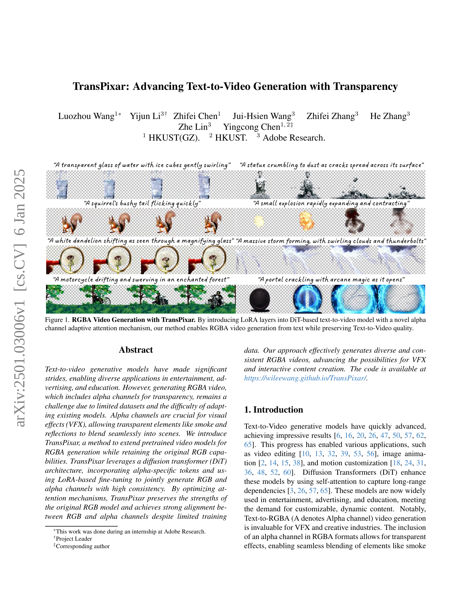
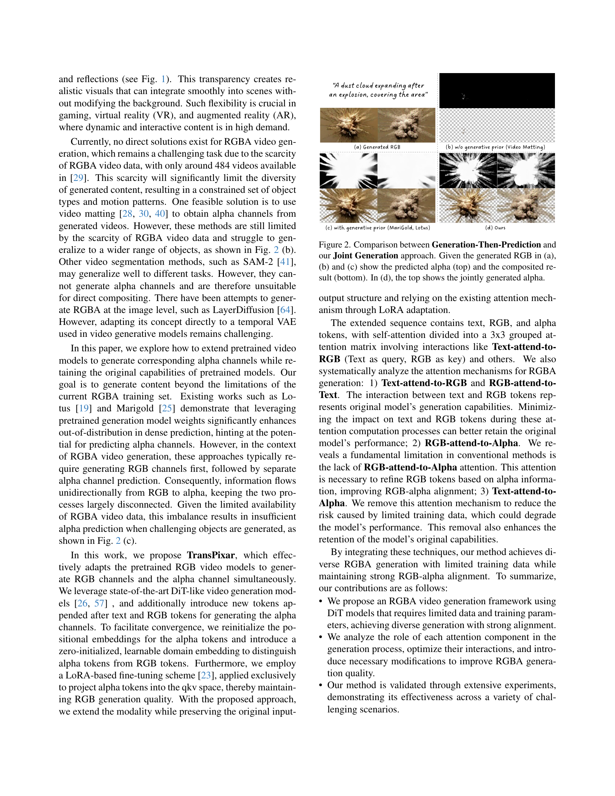
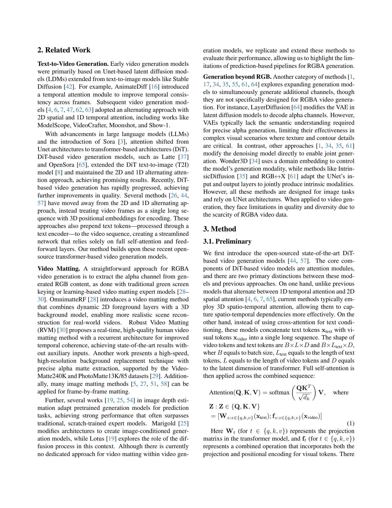
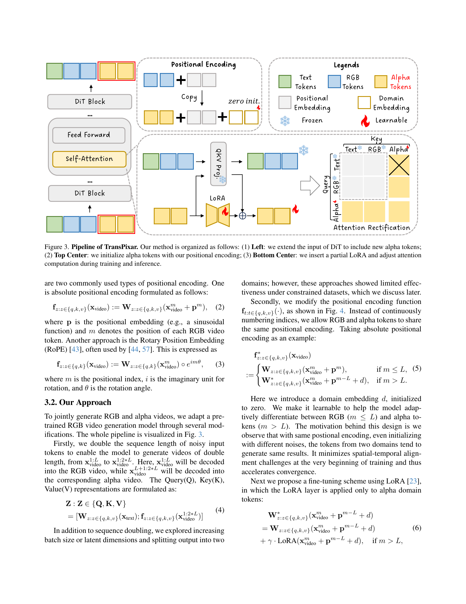
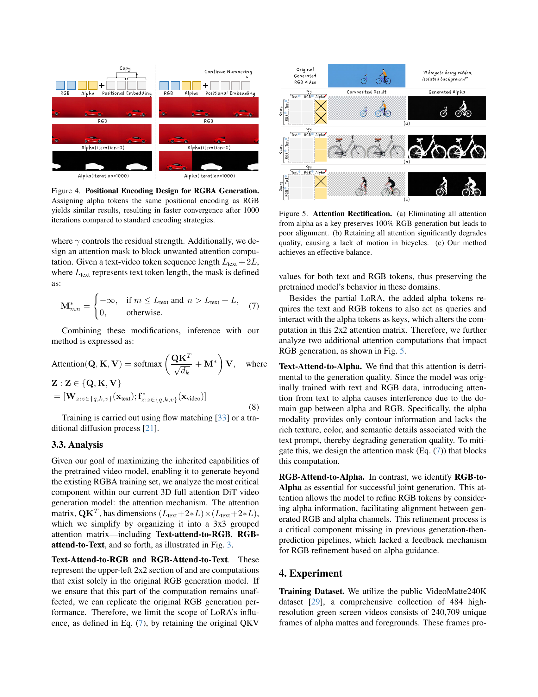
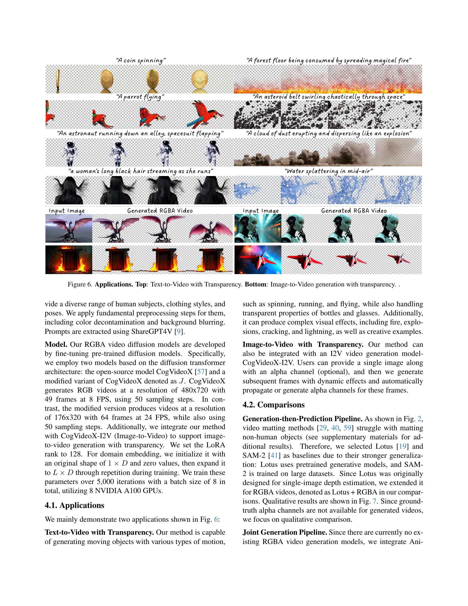
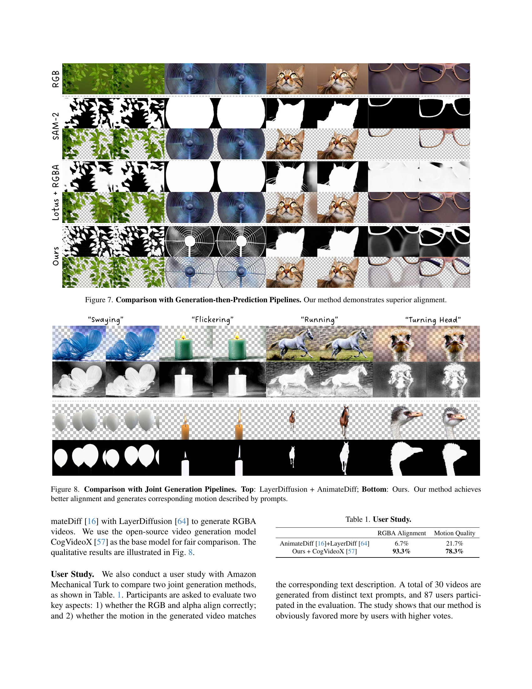
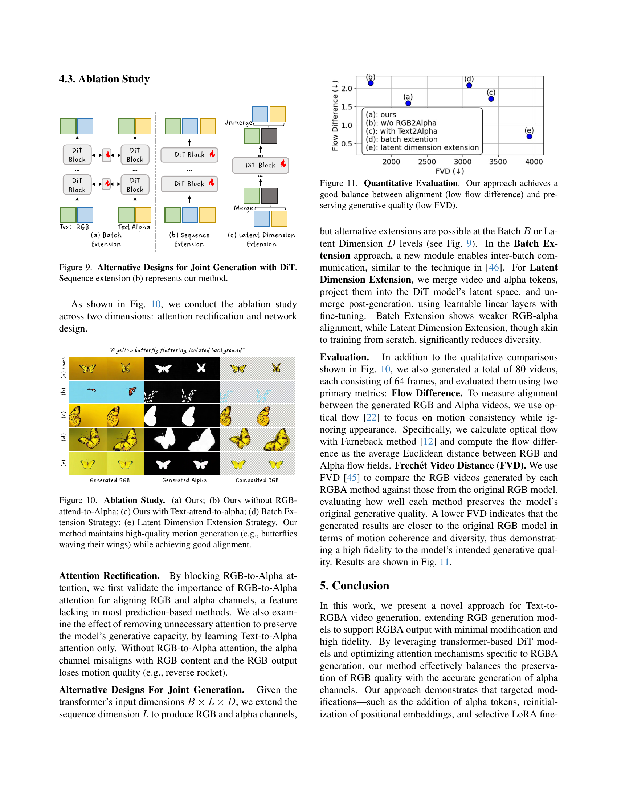
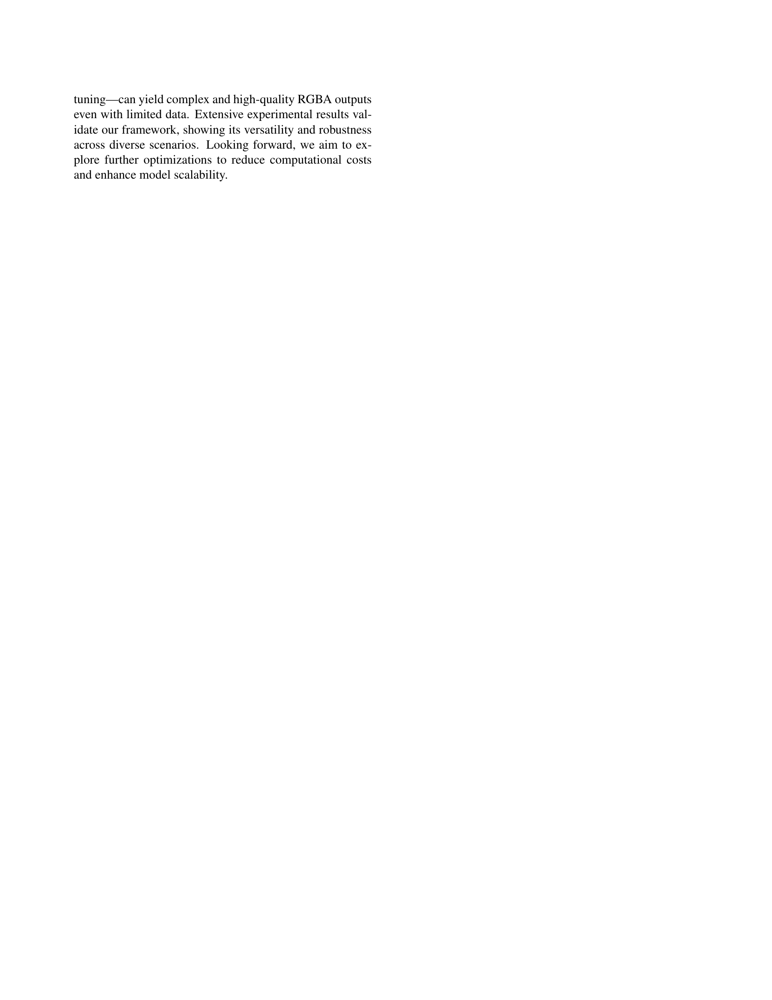
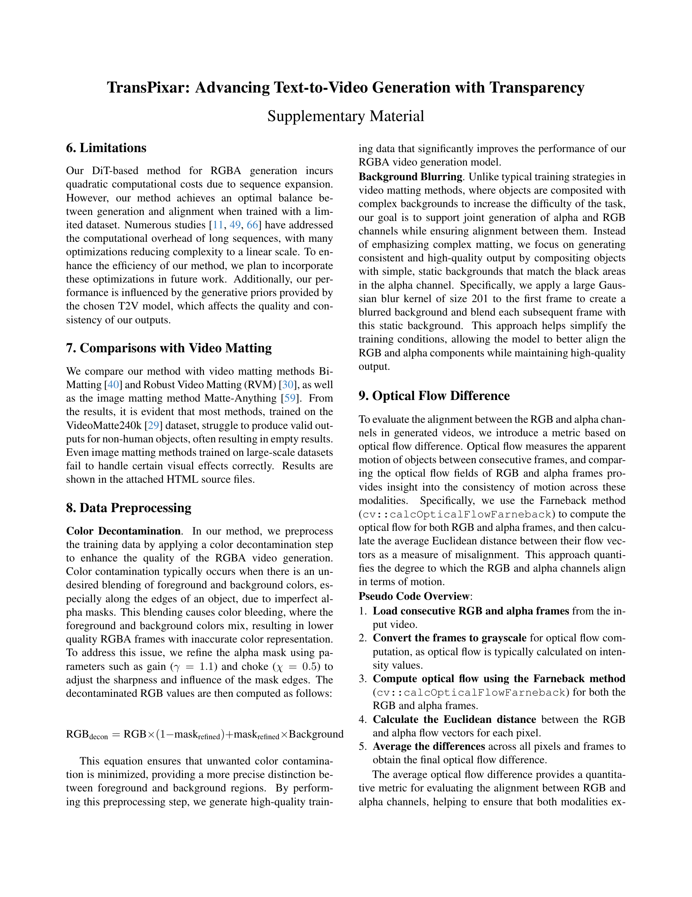
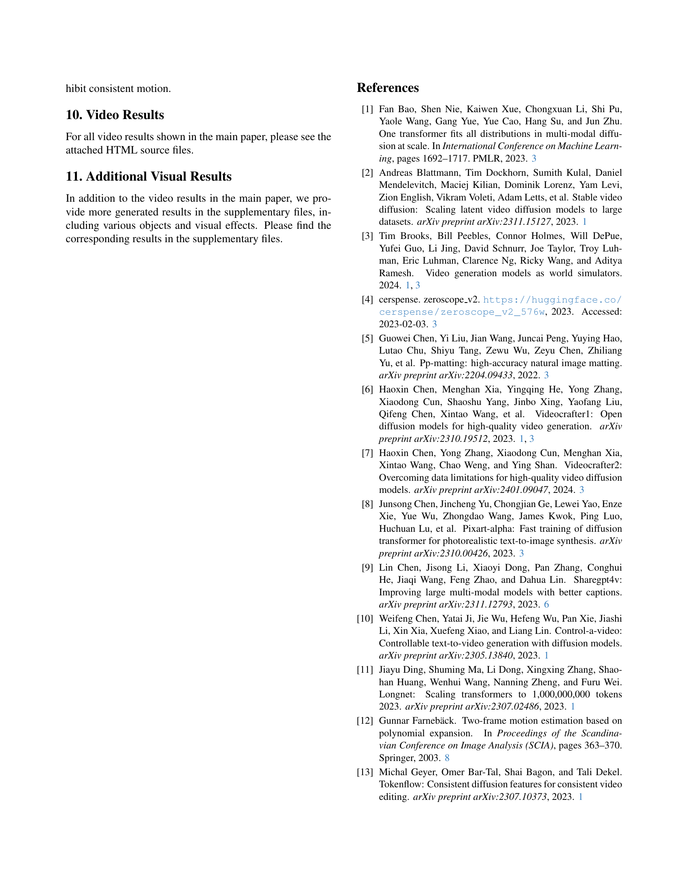
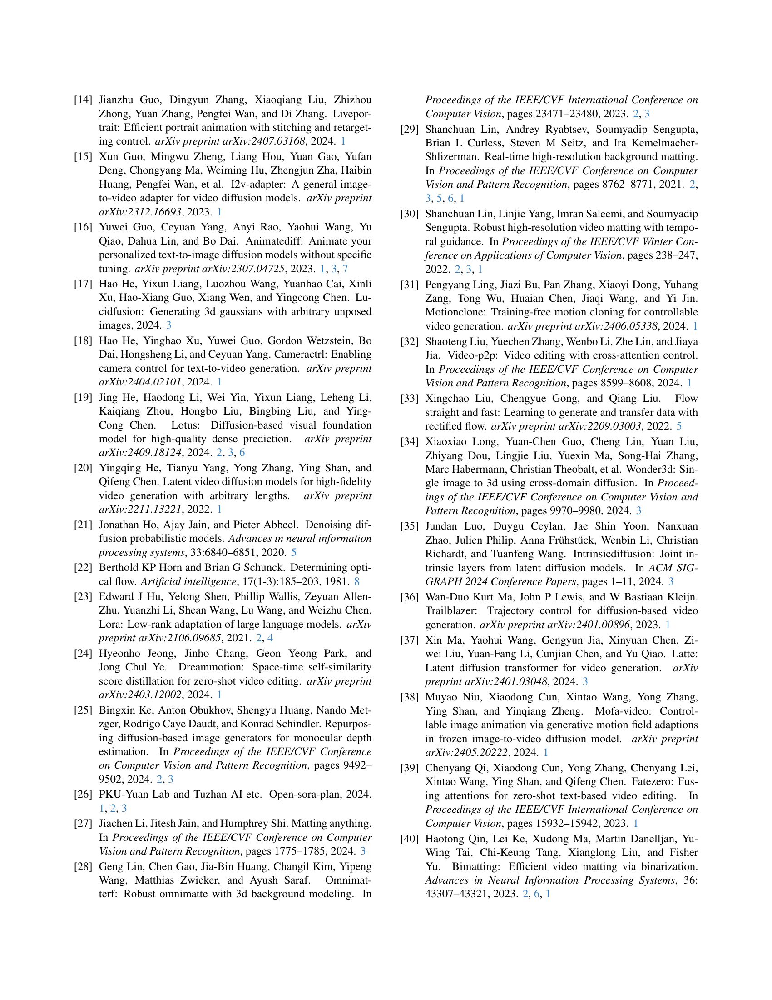
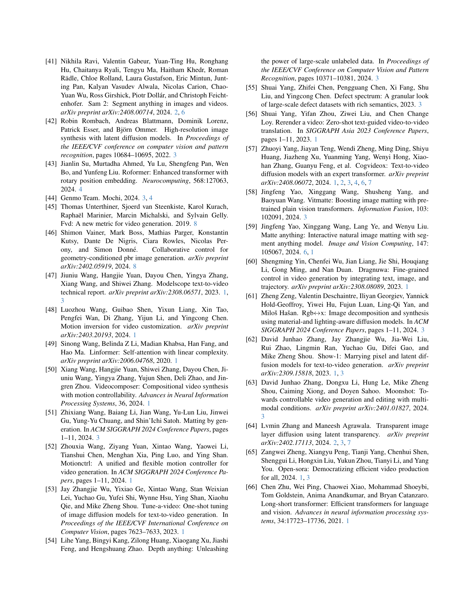
