 


 2501.03218 
 Rui Qian et el. 
 
 🤗 2025-01-07 
 



↗ arXiv


↗ Hugging Face


↗ Papers with Code


### TL;DR



기존의 비디오 LLM들은 전체 비디오를 처리한 후에 질문에 답변하는 오프라인 방식이라 실시간 상호작용이 어려웠습니다. 이러한 문제점을 해결하기 위해, **실시간 상호작용이 가능한 새로운 비디오 LLM 아키텍처**가 필요했습니다.  기존의 단일 LLM 방식은 실시간 인식과 응답 생성을 동시에 처리하지 못하는 한계가 있었고, 이는 응답 지연 및 시스템 반응성 저하로 이어졌습니다.

본 논문에서는 Dispider라는 시스템을 제안합니다. Dispider는 **인식(Perception), 결정(Decision), 반응(Reaction) 세 가지 기능을 비동기적으로 분리**하여 처리합니다. **경량화된 스트리밍 비디오 처리 모듈**은 비디오 스트림을 추적하여 상호작용에 적합한 시점을 파악하고, 상호작용이 발생하면 **비동기적 상호작용 모듈**이 상세한 응답을 생성하는 동안에도 비디오 모니터링을 계속합니다. 이러한 비동기적 설계는 Dispider가 **실시간으로 정확하고 효율적인 응답**을 생성할 수 있게 해줍니다. 실험 결과, Dispider는 기존 온라인 모델들에 비해 스트리밍 시나리오에서 훨씬 높은 성능을 보였습니다.



#### Key Takeaways


 Dispider는 **실시간 비디오 스트림과의 동적인 상호작용**을 위한 새로운 시스템입니다. 



 **인식, 결정, 반응 모듈의 분리된 설계**를 통해 실시간으로 정확하고 효율적인 응답을 제공합니다. 



 기존의 온라인 비디오 모델에 비해 **스트리밍 시나리오에서 성능이 크게 향상**되었습니다. 


#### Why does it matter?
본 논문은 **실시간 비디오 스트리밍 환경에서의 활동적인 사용자 상호작용**을 가능하게 하는 새로운 시스템을 제시하여, **비디오 이해 분야의 연구 흐름을 크게 바꿀 가능성**을 제시합니다.  특히, 비디오와 텍스트 데이터를 실시간으로 처리하고 분석하는 기술의 발전에 기여하며, **향후 연구를 위한 새로운 방향**을 제시할 것으로 기대됩니다.  더 나아가, **비디오 기반 인공지능 시스템의 실용성을 한층 높이는데 중요한 기여**를 할 것으로 예상됩니다.

------
#### Visual Insights

> 🔼 그림 1은 Dispider와 VideoLLM-online [5] 시스템의 비교를 보여줍니다. Dispider는 스트리밍 비디오와의 실시간 상호 작용을 위한 새로운 패러다임으로, 지각, 의사결정, 반응 모듈을 분리하여 동시에 작동하도록 설계되었습니다.  경량화된 지각 모듈은 비디오 스트림을 지속적으로 모니터링하고, 의사결정 모듈은 시스템 상호 작용을 트리거할 시점을 판단하며, 비동기식 반응 모듈은 상세한 응답을 생성합니다. 반면에 VideoLLM-online은 단일 LLM을 사용하여 스트리밍 지각과 응답 생성을 동시에 처리할 수 없다는 점을 보여줍니다.
> 

> 
read the caption

> Figure 1: Schematic comparison between Dispider and VideoLLM-online [5]. Our Dispider introduces a disentangled paradigm for active real-time interaction with streaming video. It features a lightweight perception module for continuous monitoring, a decision module to determine when to trigger system interactions, and an asynchronous reaction module for generating detailed responses. In contrast, VideoLLM-online is unable to simultaneously perform streaming perception and response generation because it relies on a single LLM to handle both functions.
> 


| Method | LLM Size | Frames | EgoSchema | MLVU | VideoMME |
|---|---|---|---|---|---| 
| Video-LLaVA [35] | 7B | 8 | 38.4 | 47.3 | 39.9 |
| Chat-UniVi [28] | 7B | 64 | - | - | 40.6 |
| LLaMA-VID [34] | 7B | 1 FPS | 38.5 | 33.2 | - |
| TimeChat [53] | 7B | 96 | 33.0 | 30.9 | 30.2 |
| MovieChat [55] | 7B | 2048 | 53.5 | 25.8 | 38.2 |
| Video-LLaMA2 [9] | 7B | 16 | 51.7 | 48.5 | 47.9 |
| LLaVA-Next-Video [74] | 7B | 32 | 43.9 | - | 46.6 |
| ShareGPT4Video [6] | 8B | 16 | - | 46.4 | 39.9 |
| VideoChat2 [32] | 7B | 16 | 54.4 | 47.9 | 39.5 |
| LongVA [73] | 7B | 128 | - | 56.3 | 52.6 |
| Kangaroo [41] | 8B | 64 | - | 61.0 | 56.0 |
| Video-CCAM [18] | 14B | 96 | - | 63.1 | 53.2 |
| VideoXL [54] | 7B | 128 | - | 64.9 | 55.5 |
| **Dispider (ours)** | 7B | 1 FPS | 55.6 | 61.7 | 57.2 |

> 🔼 표 1은 StreamingBench를 사용하여 다양한 측면(전반적인 이해, 문맥 이해, 실시간 시각적 이해)에서 여러 모델의 성능을 비교한 것입니다. 전반적인 이해는 감정 인식(ER), 장면 이해(SCU), 소스 식별(SD), 다중 모드 정렬(MA)을 포함하고, 문맥 이해는 오해의 소지가 있는 문맥 이해(MCU), 이상 문맥 이해(ACU), 순차적 질문 답변(SQA), 사전 예측 출력(PO)을 포함하며, 실시간 시각적 이해는 개체 인식(OP), 인과 추론(CR), 클립 요약(CS), 속성 인식(ATP), 이벤트 이해(EU), 풍부한 텍스트 이해(TR), 예측 추론(PR), 공간 이해(SU), 액션 인식(ACP), 계산(CT)을 포함합니다. 결과는 사람, 독점적 LLM, 오픈 소스 LLM으로 분류되어 종합적인 평가를 제공합니다.
> 

> 
read the caption

> Table 1: Performance comparison on StreamingBench on Omni-source Understanding, Contextual Understanding, and Real-Time Visual Understanding. Omni-source Understanding includes Emotion Recognition (ER), Scene Understanding (SCU), Source Discrimination (SD), and Multimodal Alignment (MA). Contextual Understanding includes Misleading Context Understanding (MCU), Anomaly Context Understanding (ACU), Sequential Question Answering (SQA) and Proactive Output (PO). Real-Time Visual Understanding includes Object Perception (OP), Causal Reasoning (CR), Clips Summarization (CS), Attribute Perception (ATP), Event Understanding (EU), Text-Rich Understanding (TR), Prospective Reasoning (PR), Spatial Understanding (SU), Action Perception (ACP), and Counting (CT). Results are categorized into Human, Proprietary MLLMs, and Open-Source MLLMs for a comprehensive evaluation.
> 

### In-depth insights

#### Dispider: Active Video LLMs
Dispider는 **비디오 스트리밍에 대한 실시간 상호작용을 가능하게 하는 새로운 시스템**으로, 기존의 오프라인 비디오 LLM의 한계를 극복하기 위해 **인식, 결정, 반응을 비동기적으로 분리**하는 설계를 채택했습니다.  이를 통해 지속적인 비디오 모니터링과 동시에 적절한 시점에 신속하고 정확한 응답을 생성하여 **장시간 비디오 스트림에 대한 실시간 상호 작용을 가능**하게 합니다.  **경량화된 스트리밍 비디오 처리 모듈**은 최적의 상호작용 시점을 파악하고, 비동기적 상호작용 모듈은 자세한 응답을 제공하면서도 비디오 처리를 중단하지 않습니다.  **장면 기반 인식 모듈과 실시간 응답 결정 모듈**의 조합은 효율적이고 정확한 의사결정을 가능하게 하며,  실험 결과는 Dispider가 기존의 온라인 모델보다 뛰어난 성능을 보임을 확인시켜줍니다.  특히 **시간적 추론 및 반응성 측면에서 우수한 성능**을 나타내어 실시간 상호작용 시스템으로서의 잠재력을 입증합니다.

#### Disentangled Architecture
본 논문에서 제안하는 **분리된 아키텍처**는 실시간 비디오 처리와 상호작용을 위해 **지각(Perception), 의사결정(Decision), 반응(Reaction)** 세 가지 모듈을 독립적으로 작동시키는 방식입니다. 기존의 단일 모델 방식과 달리, **지각 모듈은 지속적으로 비디오 스트림을 처리**하고, **의사결정 모듈은 상호작용의 최적 시점을 판단**하며, **반응 모듈은 비동기적으로 상세한 응답을 생성**합니다. 이를 통해, 실시간 상호작용에서 발생할 수 있는 **병목 현상을 해결**하고 **시의적절하고 정확하며 효율적인 응답**을 제공할 수 있습니다. 특히, **비동기식 처리**는 지각 및 의사결정 과정을 반응 과정으로부터 분리하여 시스템의 실시간 성능을 유지하는 데 중요한 역할을 합니다.  **장기간 비디오 스트림**에도 효과적으로 대응할 수 있는 설계이며,  **실험 결과**는 이러한 분리된 아키텍처의 효율성과 실시간 상호작용에 대한 적합성을 입증합니다.  **비디오 QA 작업**에서 기존 모델들을 능가하는 성능을 보여주는 것은 물론, **스트리밍 환경**에서도 우수한 결과를 나타내어, 본 논문의 아키텍처가 **실시간 상호작용을 위한 강력한 해결책**임을 시사합니다.

#### Scene-Based Perception
논문에서 제시된 'Scene-Based Perception' 개념은 **스트리밍 비디오의 효율적인 처리를 위한 핵심 전략**입니다.  단순히 연속적인 프레임들의 나열이 아닌, 의미 있는 시각적 변화를 기준으로 비디오를 **장면(scene) 단위로 분할**함으로써, 중복된 정보 처리를 줄이고 모델의 집중력을 높입니다.  **비균일적인 클립 분할**은 시각적 내용의 변화에 따라 유연하게 대처하며, 정보 손실을 최소화하면서 효율적인 데이터 표현을 가능하게 합니다.  **SigLip 모델을 활용한 시각적 특징 추출**은 장면 경계를 효과적으로 식별하고, 동시에 의미 있는 시각적 정보를 효율적으로 압축하여 모델의 처리 부담을 줄이는 데 기여합니다.  결과적으로, 이러한 Scene-Based Perception은 실시간 상호작용을 요구하는 스트리밍 비디오 분석 시스템에서 **실시간성과 정확성을 동시에 확보**하는 데 중요한 역할을 수행합니다.  **비디오 이해 모델의 효율성과 정확성을 높이는 핵심적인 전처리 과정**으로 볼 수 있습니다.

#### Asynchronous Interaction
본 논문에서 "비동기적 상호작용" 부분은 **실시간 비디오 처리와 응답 생성을 분리**하여 시스템의 실시간 성능을 유지하는 핵심 전략으로 제시됩니다.  **비디오 처리 모듈은 지속적으로 비디오 스트림을 모니터링**하고, 상호작용이 필요한 시점을 판단하는 결정 모듈과 연동하여 작동합니다.  **상호작용이 트리거되면, 비동기적 상호작용 모듈은 상세한 응답을 생성**하지만, 비디오 처리 모듈은 동시에 비디오 모니터링을 계속 진행합니다. 이러한 **비동기적 설계는 시스템의 실시간 응답성과 계산 효율성을 보장**하는 동시에, 장기간 비디오 스트림에 대한 효과적인 처리를 가능하게 합니다.  즉, **실시간 반응과 지속적인 비디오 분석을 동시에 처리하는 아키텍처의 핵심**이라고 볼 수 있습니다.

#### StreamingBench Results
스트리밍벤치 결과는 **실시간 비디오 이해 능력**을 종합적으로 평가한 것입니다.  본 논문에서 제시된 Dispider 모델은 기존의 비디오 LLM보다 **실시간 상호작용 및 반응 속도**에서 뛰어난 성능을 보였습니다. 특히, **지연 시간 없이 연속적인 처리**가 가능했던 점은 주목할 만합니다.  다양한 과제에서 Dispider는 짧은 비디오뿐 아니라, 긴 비디오에서도 **높은 정확도**를 유지하며,  **시간적 추론 능력**이 뛰어남을 증명하였습니다.  **프로액티브한 반응 생성**, **다단계 추론**, 그리고 **시간적 구체화** 능력 역시 기존 모델을 상회하는 결과를 보였습니다.  결과적으로, 이러한 실험 결과들은 Dispider의 독특한 **분리된 설계**가 실시간 상호작용을 위한 비디오 LLM에 효과적임을 입증합니다.

### More visual insights

More on figures

> 🔼 그림 2는 실시간 스트리밍 비디오 처리 시스템에서 응답 결정 모듈의 작동 방식을 보여줍니다.  이 모듈은 비디오 스트림을 처리하면서 응답 시점을 동적으로 결정합니다. 비디오는 장면 경계에 따라 크기가 다른 여러 클립으로 분할되고, 과거 상호 작용 내역을 담은 기억 메모리가 활용되어 맥락을 파악합니다.  모듈은 메모리 특징, 클립 특징, 질문 텍스트, 그리고 ⟨TODO⟩ 및 ⟨ANS⟩ 와 같은 특수 토큰들을 결합하여 응답 시점을 결정합니다. 즉, 현재 비디오 장면의 내용과 과거 질문 및 답변 이력을 종합적으로 고려하여,  새로운 정보가 충분히 축적되었을 때만 모델이 답변을 생성하도록 제어합니다.
> 

> 
read the caption

> Figure 2:  Illustration of the Response Decision Module in a proactive streaming video processing system. The module dynamically determines when to respond during video streaming by segmenting the video into non-uniform clips and utilizing historical memory to capture context. The module then combines memory features, clip features, question text, and special tokens, ⟨TODO⟩ and ⟨ANS⟩, to decide on response timing.
> 

> 🔼 그림 3은 Dispider와 VideoLLM-online의 실시간 비디오 이해 능력에 대한 정량적 비교를 보여줍니다. 질문은 비디오 시작 시점에 제시되며, 모델의 응답은 텍스트 형태의 답변이나 무응답 상태로 표시됩니다. Dispider는 VideoLLM-online에 비해 지속적인 비디오 스트리밍 처리와 실시간 상호작용 측면에서 우수한 성능을 보여줍니다.  Dispider는 비디오 내용을 지속적으로 분석하고 적절한 시점에 적시적절한 응답을 생성하며, VideoLLM-online과 달리 비디오 처리와 응답 생성을 동시에 수행할 수 있습니다. 이는 모델의 실시간 응답 능력을 보여주는 중요한 차이점입니다.  각 시점에서 두 모델의 응답과 무응답 상태가 함께 제시되어 비교 분석에 용이하도록 구성되었습니다.
> 

> 
read the caption

> Figure 3: Quantitative comparison between Dispider and VideoLLM-online in streaming video understanding. The question is inserted at the beginning, and we show the model’s response in either answer texts or the state of keeping silent.
> 

More on tables


| Method | Frames | TVGF1 | EPMF1 | TALF1 | VHDF1 | DVCF1 | DVCSim | SLCF1 | SLCSim |
|---|---|---|---|---|---|---|---|---|---| 
| *Conventional video QA inference*. |  |  |  |  |  |  |  |  |  |
| *w/ specialized time tokens* |  |  |  |  |  |  |  |  |  |
| VTG-LLM [24] | 96 | 15.9 | 3.7 | 14.4 | 48.2 | 40.2 | 18.6 | 20.8 | 14.4 |
| LITA [26] | 100 | 22.2 | 4.6 | 18.0 | 23.9 | 39.7 | 17.2 | 21.0 | 12.2 |
| ETChat [42] | 1 FPS | 38.6 | 10.2 | 30.8 | 62.5 | 38.4 | 19.7 | 24.4 | 14.6 |
| \hdashline      *w/o specialized time tokens* |  |  |  |  |  |  |  |  |  |
| VideoChatGPT [43] | 100 | 7.0 | 1.3 | 15.1 | 28.8 | 8.8 | 11.3 | 5.7 | 10.2 |
| Video-LLaVA [35] | 8 | 7.0 | 1.9 | 15.0 | 28.9 | 28.0 | 15.0 | 0.9 | 8.3 |
| LLaMA-VID [34] | 1 FPS | 5.5 | 1.2 | 8.0 | 30.0 | 27.1 | 12.6 | 5.2 | 11.1 |
| Video-LLaMA2 [9] | 8 | 0.1 | 0.0 | 0.0 | 1,5 | 0.6 | 14.5 | 0.0 | 15.2 |
| PLLaVA [63] | 16 | 6.9 | 1.1 | 5.7 | 28.9 | 13.3 | 10.6 | 9.7 | 11.8 |
| VTimeLLM [25] | 100 | 7.6 | 1.9 | 18.2 | 28.9 | 12.4 | 13.1 | 8.7 | 6.4 |
| TimeChat [53] | 96 | 26.2 | 3.9 | 10.1 | 40.5 | 16.6 | 12.5 | 5.6 | 9.2 |
| **Dispider (ours)** | 1 FPS | 43.6 | 17.2 | 29.9 | 51.5 | 31.6 | 17.8 | 14.1 | 11.7 |
| *Streaming video QA inference*. |  |  |  |  |  |  |  |  |  |
| VideoLLM-Online [5] | 2 FPS | 13.2 | 3.8 | 9.1 | 22.4 | 24.0 | 13.4 | 9.9 | 10.1 |
| **Dispider (ours)** | 1 FPS | 36.1 | 15.5 | 27.3 | 54.2 | 33.8 | 18.9 | 18.8 | 12.4 |
> 🔼 표 2는 긴 비디오 벤치마크에 대한 다양한 비디오 LLM 모델들의 성능을 비교 분석한 표입니다.  EgoSchema 전체 데이터셋, MLVU 객관식 질문, 그리고 자막 없는 VideoMME 전체 데이터셋에 대한 정확도를 제시합니다. 공정한 비교를 위해 LLM의 크기와 샘플링된 프레임 수도 함께 표시합니다.  즉, 각 모델이 긴 비디오를 얼마나 잘 이해하는지, 특히  주요 벤치마크 데이터셋에서 얼마나 정확한지를 보여줍니다.
> 

> 
read the caption

> Table 2: Comparison on long video benchmarks. We report the accuracy on the EgoSchema full set, MLVU multiple-choice questions, and the VideoMME overall set without subtitles. For a fair comparison, we also present the model size of the LLM and the number of sampled frames.
> 


| Clip | MLVU | V-MME | TVGF1 | DVCF1 | DVCSim |
|---|---|---|---|---|---| 
| Uniform | 59.8 | 55.4 | 34.5 | 33.1 | 18.1 |
| Scene-based | 61.7 | 57.2 | 36.1 | 33.8 | 18.9 |
> 🔼 표 3은 ETBench 벤치마크에 대한 실험 결과를 보여줍니다. 두 가지 설정(기존 비디오 QA 설정과 스트리밍 설정)에서의 성능을 비교 분석합니다. 기존 설정에서는 모델이 전체 비디오를 본 후 질문에 답변해야 하지만, 스트리밍 설정에서는 비디오 시작 시점에 질문이 주어지고 모델은 실시간으로 응답해야 합니다. 표에는 두 설정 모두에 적합한 여섯 가지 하위 작업에 대한 성능이 제시되어 있습니다.
> 

> 
read the caption

> Table 3: Comparison on ETBench. We present the results for two different settings. In the conventional video QA setting, the model is required to answer the question after watching the entire video. In the streaming setting, the question is placed at the beginning of the video, and the model is expected to provide real-time responses. We report performance on six subtasks that are suitable for both evaluation settings.
> 


| ⟨ANS⟩ | ⟨TODO⟩ | ⟨SILENT⟩ | TVGF1 | DVCF1 | DVCSim |
|---|---|---|---|---|---| 
| ✗ | ✗ | ✗ | 20.1 | 19.7 | 12.3 |
| ✗ | ✗ | ✓ | 26.3 | 24.9 | 13.1 |
| ✓ | ✗ | ✓ | 35.2 | 31.0 | 17.2 |
| ✗ | ✓ | ✓ | 28.7 | 25.6 | 14.5 |
| ✓ | ✓ | ✗ | 35.5 | 30.2 | 16.8 |
| ✓ | ✓ | ✓ | 36.1 | 33.8 | 18.9 |
> 🔼 표 4는 클립 분할 전략에 대한 추가 분석 결과를 보여줍니다. 논문에서는 균일한 16프레임 클립 분할과 SigLip을 사용한 장면 기반의 비균일 클립 분할 두 가지 방법을 비교합니다.  MLVU와 VideoMME 벤치마크에 대한 기존 방식의 QA 정확도와 ETBench의 시간적 비디오 접지 및 밀집 비디오 캡션 작업에 대한 스트리밍 지표를 측정하여 두 방법의 성능 차이를 분석합니다.  이는 장면 기반 분할이 비디오의 구조적 정보를 더 잘 보존하여 모델 학습과 시의 적절한 응답 생성에 도움이 되는지 확인하기 위함입니다.
> 

> 
read the caption

> Table 4: Ablation study on the clip segmentation. We compare uniform 16-frame clip segmentation and our scene-based segmentation with SigLip.
> 

### Full paper


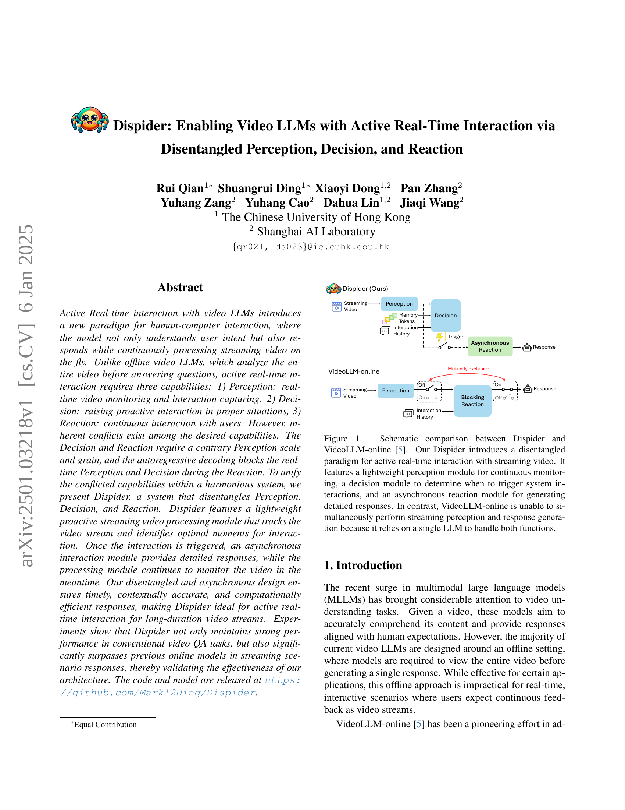
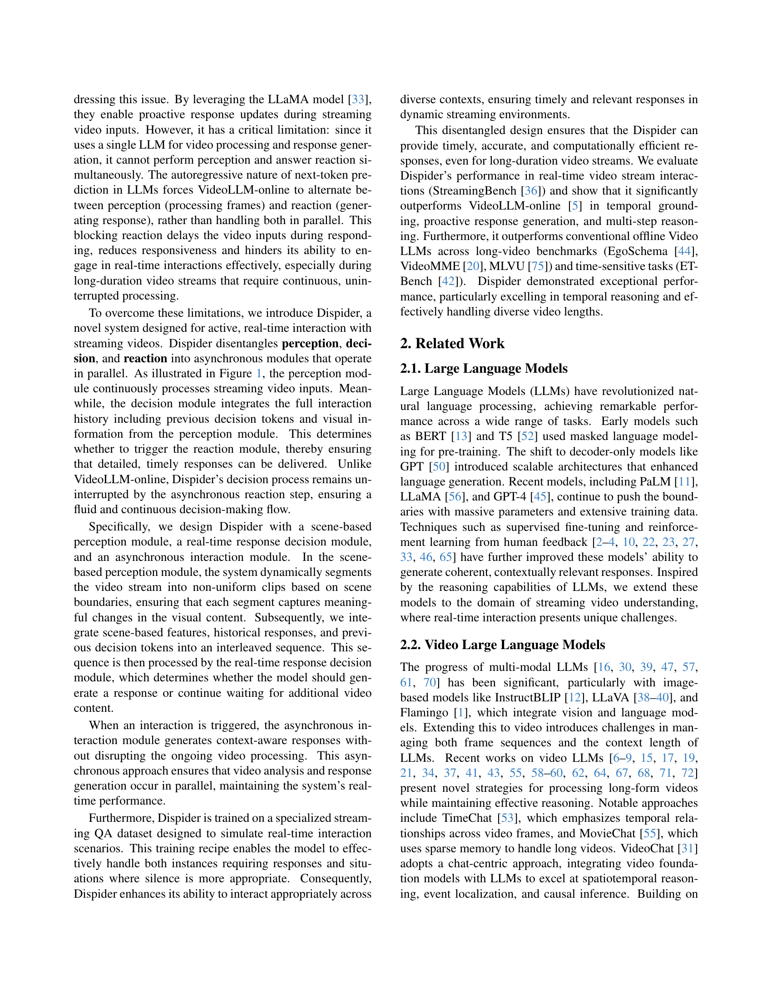
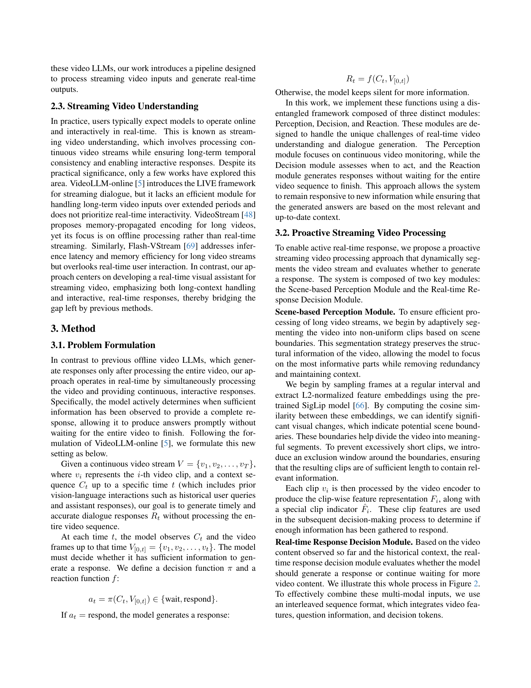
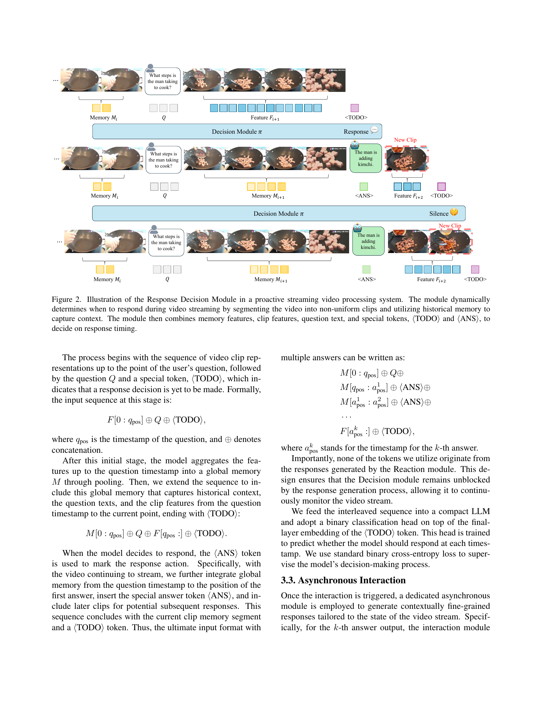
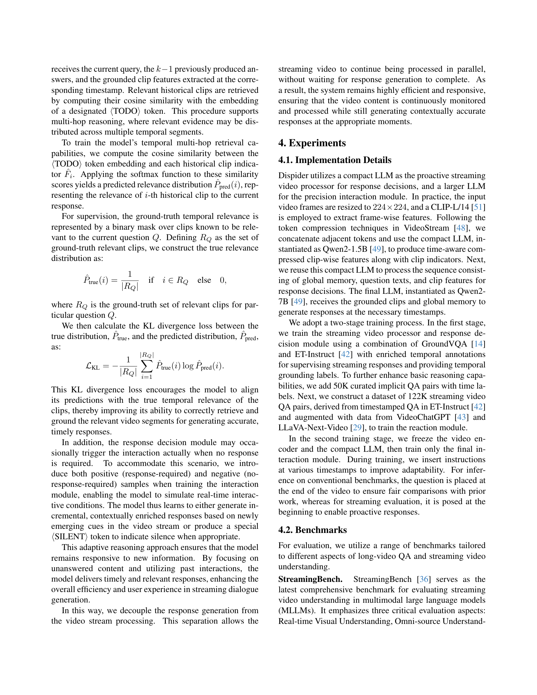
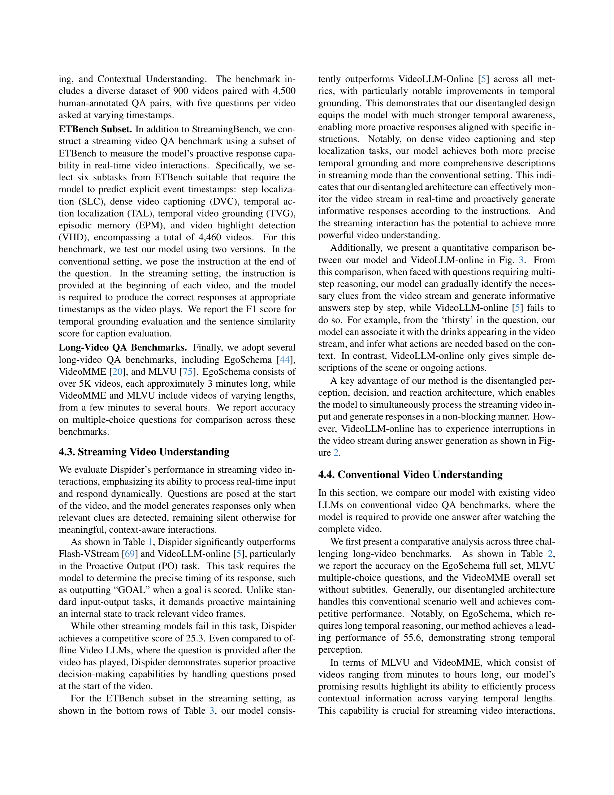
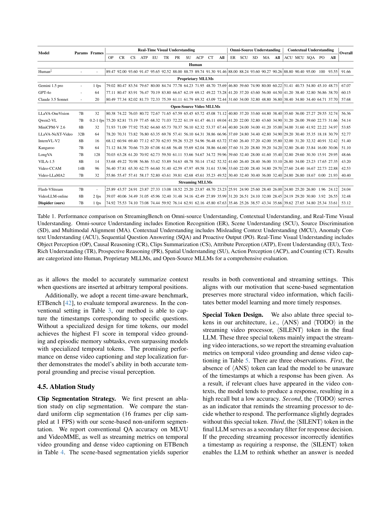
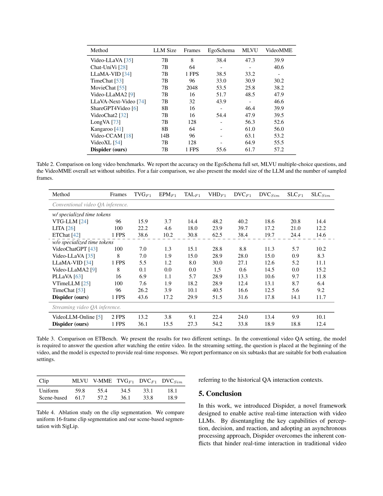
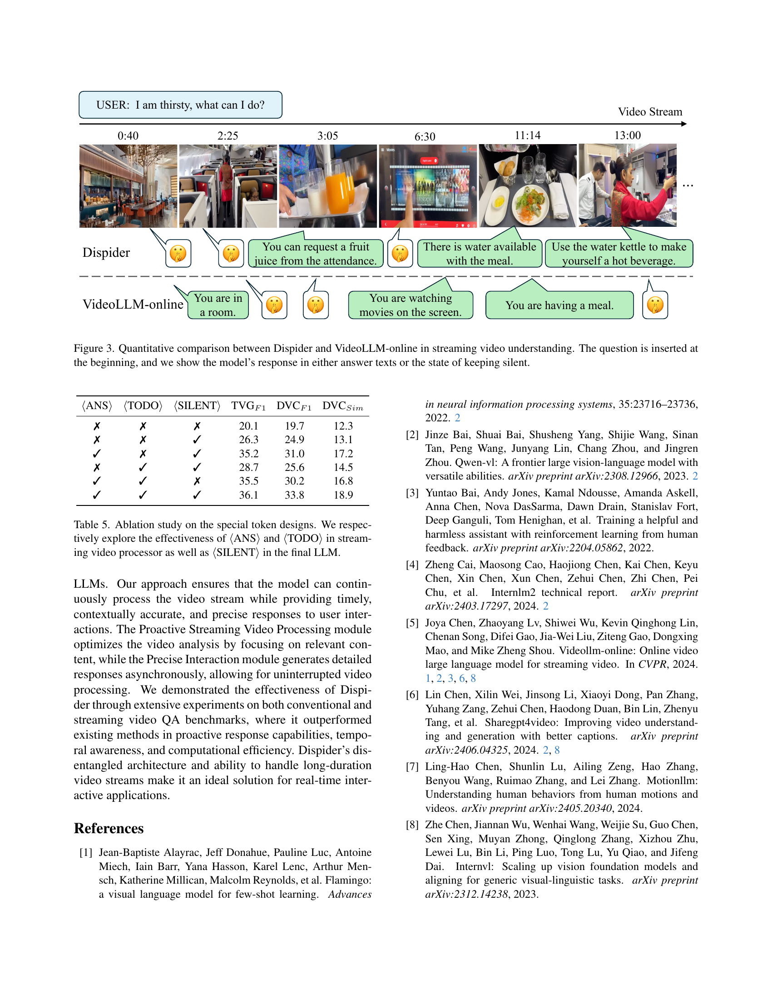
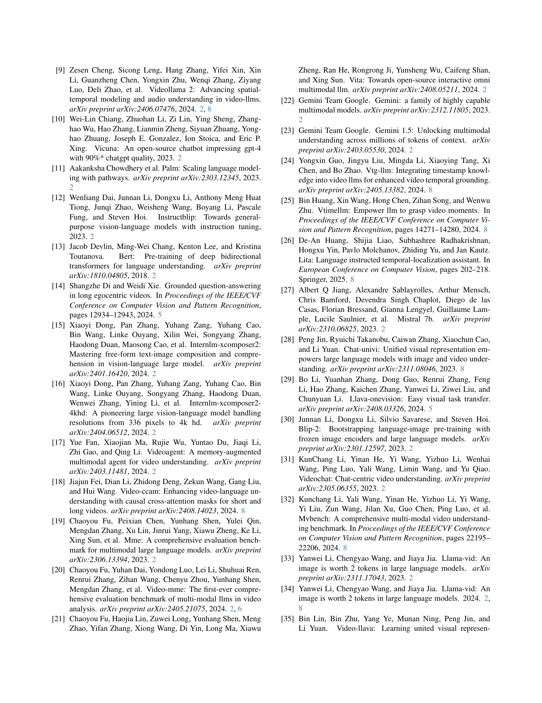
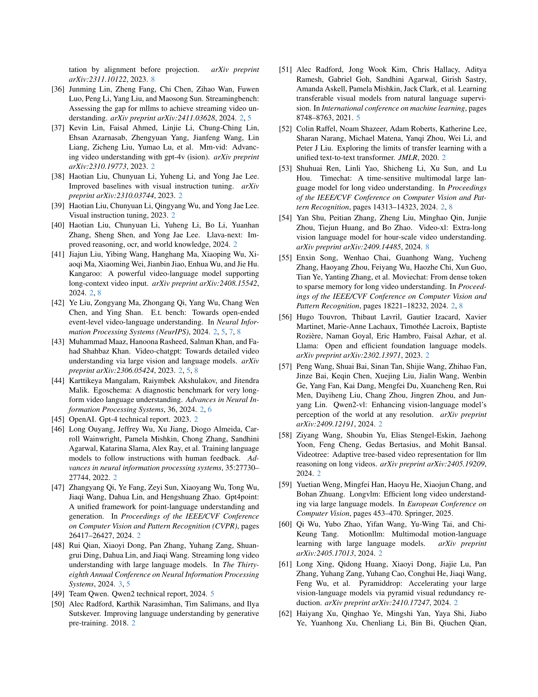
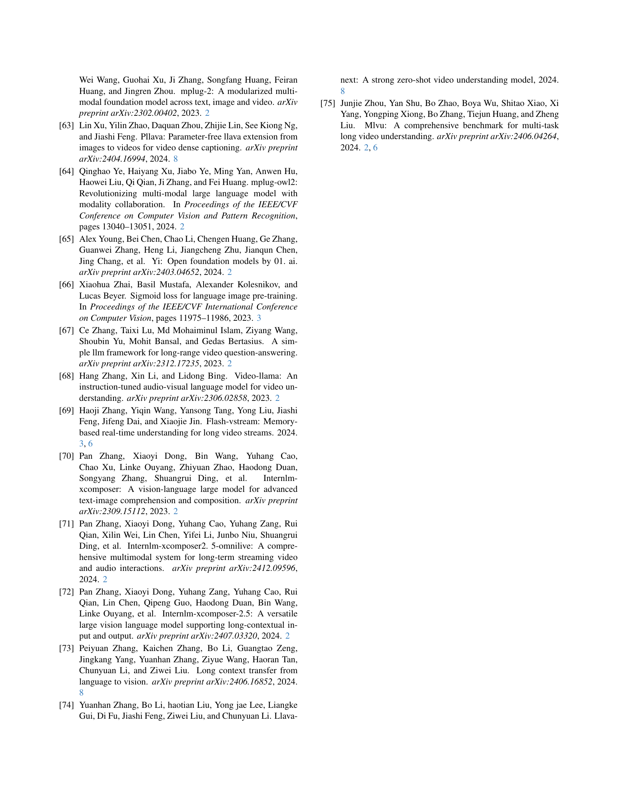
